# 1.Mockito入门


Mockito 是一种 Java Mock 框架，主要就是用来做 Mock 测试的，

它可以 `模拟任何 Spring 管理的 Bean`、`模拟方法的返回值` 、`模拟抛出异常`等等


同时也会记录调用这些 `模拟方法的参数` 、`调用顺序`，从而可以校验出这个 Mock 对象是否有被正确的顺序调用，以及按照期望的参数被调用。


## 1.1 基础概念


Mock测试

```
Mock 测试就是在测试过程中，创建一个假的对象，避免你为了测试一个方法，却要自行构建整个 Bean 的依赖链。
```


例如：

```
我们现在期望测试A
A 需要调用类B和类C ， 类 B 和类 C 又需要调用其他类如 D、E、F 等。

如果此时假设类 D 是一个外部服务(例如需要访问数据库)，那就会很难测。

因为你的返回结果会直接的受外部服务影响，导致你的单元测试可能今天会过、但明天就过不了了。
```

依赖关系如下图：

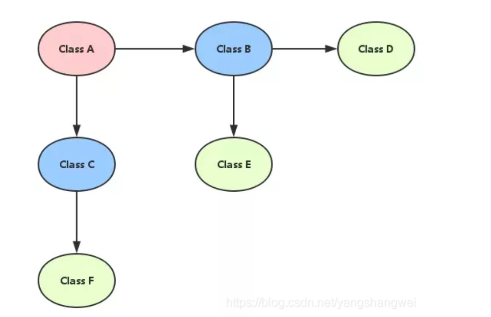


一个解决思路就是引入Mock， 创建一个假的Bean B，C 。同时mock出A调用B和C相关方法 `期望` 返回的数据。

然后替换A类中相关引用，当A调用B和C的相关方法时，返回的就是Mock数据。


这样做的优点：

```
对于某些单元测试，我们期望它是无状态的，它不受外部服务的影响。

那么此时Mock可以保证 隔离的，无状态的，高效的(因为不需要初始化非常多的Bean引用链)
```


### 1.1.1 单元测试


与`继承测试` 将整个系统作为一个整体测试不同，单元测试更应该专注于某个类。


单元测试更关注  `输入` `输出`


## 1.2 引入依赖

`spring-boot-starter-test` 已经为我们引入了 `mockito`的依赖。


```xml
 <dependency>
    <groupId>org.springframework.boot</groupId>
    <artifactId>spring-boot-starter-test</artifactId>
    <scope>test</scope>
</dependency>
```


## 1.3 示例


### 1.3.1 Mockito.mock()

```java
    @Test
    public void testMock(){
        //mock出HelloService类对象。
        HelloService helloService = Mockito.mock(HelloService.class,"myMock");
        
        //when... then...
        //当调用了 某对象的某方法, 然后返回 指定值
        when(helloService.sayHello("hello")).thenReturn("this is a mock!");
        
        System.out.println(helloService.sayHello("hello")); //返回 this is a mock!
        System.out.println(helloService.sayHello("a")); //返回null ，因为参数不一致
        
    }

//HelloService.java
public class HelloService {
    public String sayHello(String name){
        return "hello,world "+name;
    }
}
```

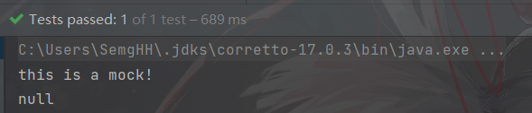


除了有 `thenReturn` 还有 `thenThrow`  `thenCallRealMethod` `thenAnswer`

```java
//when返回的对象是 OutgoingStubbing  持续进行的存根

    @Test
    public void testForException() throws Exception {

        HelloService helloService = Mockito.mock(HelloService.class);

        //当传入"9"时，抛出Exception异常
        //注意，当使用thenThrow的时候必须保证原方法声明了对应的 throw
        //如果原方法没有声明对应的throw ,则会抛出异常
        //Checked exception is invalid for this method!
        when(helloService.sayHello("9")).thenThrow(new Exception("aaa"));
        
    }
```


原方法没有声明throws对应异常

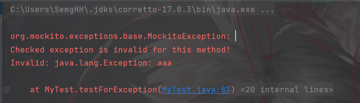

```
原方法必须声明对应的异常以后，Mockito才会允许 mock出相应的异常。
```


正确声明异常以后，正确抛出异常

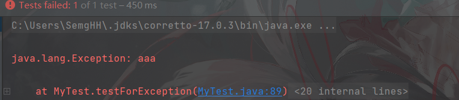


连续存根：

```java
@Test
public void mockList() {
    List mockedList  = mock(List.class);
    when(mockedList.get(0)).thenReturn(0).thenReturn(1).thenReturn(2);

    System.out.println(mockedList.get(0)); //0
    System.out.println(mockedList.get(0)); //1
    System.out.println(mockedList.get(0)); //2
}
```


### 1.3.2 使用any族

 any族是   [ArgumentMatchers](# 2.3 ArgumentMatchers) 类中的静态方法。

例如： `anyString`  `any`  `anyInt` `anyLong` 等等

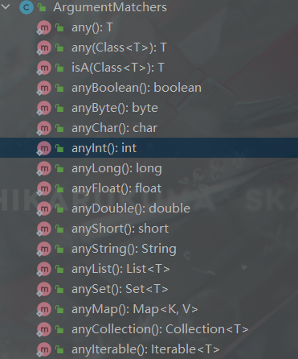


使用`any`方法，表示 `when` 调用方法时，可以指代任意参数

```java
@Test
public void testAnyString(){

    HelloService service = Mockito.mock(HelloService.class);

    //任意的 String类型参数，都会返回 pretty cool
    when(service.sayHello(anyString())).thenReturn("pretty cool");

    System.out.println(service.sayHello("aaa"));
}
```


### 1.3.3 doThrow

如果方法没有返回值的话（即是方法定义为 public void myMethod() {…}），要改用 doThrow() 抛出 Exception。


```java
@Test
public void testForDoThrow() throws Exception {

    HelloService helloService = Mockito.mock(HelloService.class);

    doThrow(new Exception("test")).when(helloService).nothing();

    helloService.nothing();
}

//HelloService.java
public class HelloService {

    public String sayHello(String name)throws Exception{
        return "hello,world "+name;
    }
    
    public void nothing() throws Exception{

    }

}

```


### 1.3.4 verify

验证 `mock`对象的多种行为。  行为的类型接口： [VerificationMode](# 2.4 VerificationMode ) ，常用的实现类有 `AtLeast` （最少执行多少次）


```java
    @Test
    public void testForVerify() throws Exception {

        HelloService helloService  = mock(HelloService.class);

        helloService.sayHello("1");
        helloService.sayHello("2");

        //验证 helloService,sayHello方法，参数类型是 anyString，至少被调用1次
        //如果不满足，则抛出异常
        verify(helloService,atLeast(1)).sayHello(anyString());

    }
```


```java
@Test
public void testForInvocation() throws Exception {

    HelloService mock = mock(HelloService.class);
    when(mock.sayHello(anyString())).thenReturn("a");

    mock.sayHello("Wu zhang");

    //验证 mock的 sayHello方法， 参数以“zhang”结尾的调用，最少1次，
    verify(mock,atLeast(1)).sayHello(Mockito.endsWith("zhang"));

}
```


# 2. 类的参考


## 2.1 Assert

我们知道 `assert` 是Java中的断言关键字。

`Assert` 类是 `Junit` 提供的断言类，帮助做出一些断言，例如 `notNull` `notEmpty ` 等


### 2.1.1 assertEquals()

断言相等有多个重载方法。

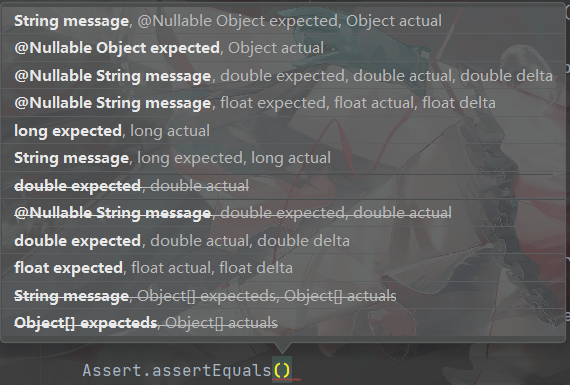


```
断言两个 Object对象是equals的。 如果他们不equals ，那么就会抛出一个AssertionError异常，异常信息为传入的 message


如果 expected 和 actual 都为null ,那么认为两者相等。
```


## 2.2 OutgoingStubbing

是调用 `Mockito.when` 返回的中间状态类，用于执行后续 `then` 方法


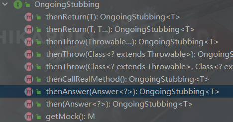


### 2.2.1 thenReturn(T)

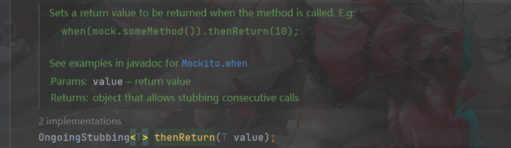


```
当when()内方法调用时，返回传入的value
```


另一个重载方法，返回多个value

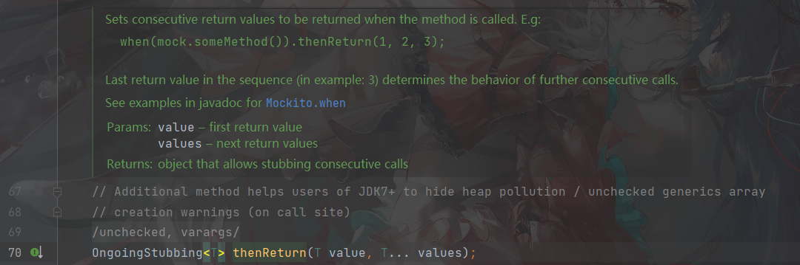


### 2.2.2 thenThrow()族


`thenThrow(Throwable...)`

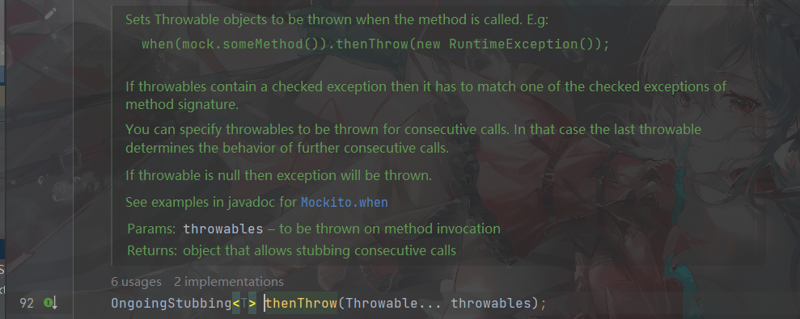


```
设置 Throwable对象，当方法调用时抛出对应对象。
```


`thenThrow(Class<? extend Throwable)`

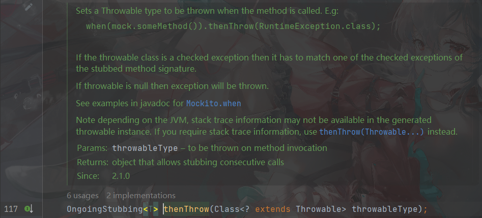


```
设置方法调用时抛出的异常类型。	
```


```java
    @Test
    public void testMock(){

        HelloService helloService = Mockito.mock(HelloService.class,"myMock");

        when(helloService.sayHello("hello")).thenThrow(MyException.class);

        helloService.sayHello("hello");
        
    }
```

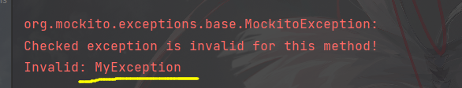


## 2.3 ArgumentMatchers

参数匹配器的工具类。具体实现接口： `ArgumentMatcher`

用于决定  是否匹配`调用方法的参数`。


```
这个类允许灵活的 verification 或者 stubbing.  
```


### 2.3.1 api


#### 2.3.1.1  any族

`any`族用于 `when` 方法中，表示 任意一种类型。例如：

```java
@Test
public void testAnyString(){
    HelloService service = Mockito.mock(HelloService.class);
    //这里使用了 anyString()
    //任意的 String类型参数，都会返回 pretty cool
    when(service.sayHello(anyString())).thenReturn("pretty cool");

    System.out.println(service.sayHello("aaa"));
}
```


`any` 一族有多种类型，例如 `anyLong` `anyString` `anyDouble` 等。

有两个特殊的 `any()`   `any(Class<T>)` 


`any()` 

```
表示任意的什么都可以。
```


`any(Class<T>)`


```
匹配给定类的任意对象。 不包括null
```


示例

```java
    @Test
    public void testForAny() throws Exception {

        HelloService helloService = mock(HelloService.class);

        //调用hello 方法，传入 HelloService的任意对象都将抛出 Exception
        doThrow(new Exception("bbb")).when(helloService).hello(any(HelloService.class));

        try {
            helloService.hello(new HelloService());
        }catch (Exception e) {
            System.out.println(e.getMessage());
        }
    }
```


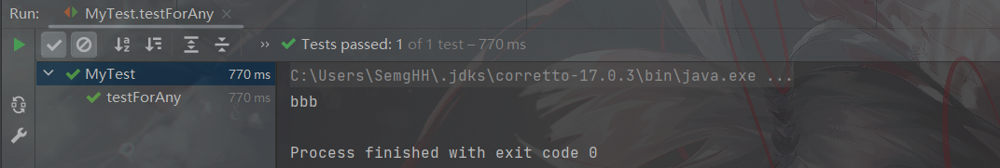


#### 2.3.1.2 endWith/startWith

判断传入的 `String` 是否以指定字符串开启/结尾 

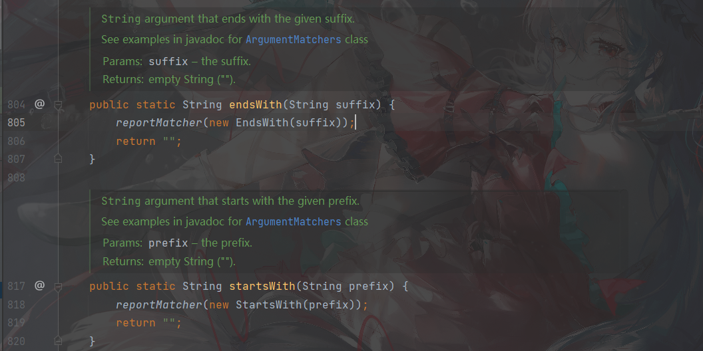


## 2.4 VerificationMode 

验证模式。 这是一个接口。函数式接口，只需要实现一个核心方法： `verify(VerificationData)` 


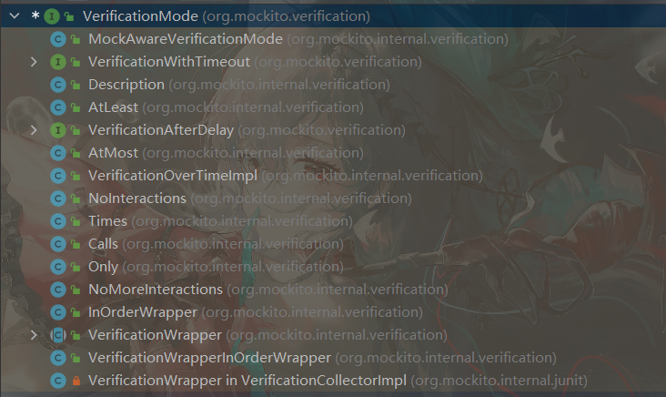


### 2.4.1 接口方法


`verify(Verfication)`  每当进行 某种验证行为的时候，都将传入一个 [VerificationData](# 2.8 VerificationData) 对象。


```
验证过程的具体表现。 传入一个VerificationData类对象，作为数据
```


### 2.4.2 实现类

`Mockito` 继承了一些实现类。 每一种实现类都代表了一种不同的验证行为。


#### 2.4.2.1  AtLeast

验证条件为 ： 至少n次。


构造函数如下，必须传入一个int类型正数。

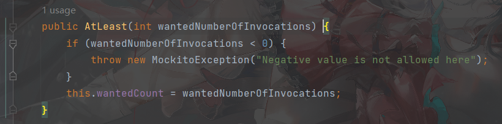


#### 2.4.2.2 AtMost

至多n次。


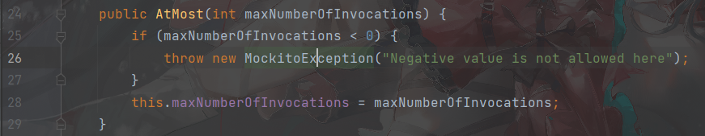


#### 2.4.2.3 Description

包装一个 `VerificationMode` 类对象，修改其抛出异常时的 `message`信息。


构造方法：
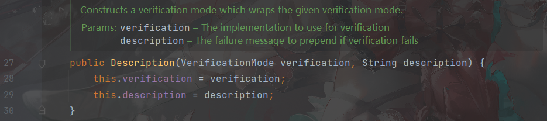


```java
    @Test
    public void testForVerify() throws Exception {

        HelloService helloService  = mock(HelloService.class);

        helloService.sayHello("1");
        helloService.sayHello("2");
        helloService.sayHello("3");
        helloService.sayHello("4");

        verify(helloService,atLeast(1)).sayHello(anyString());

        verify(helloService,new Description(atMost(2),"至多2次")).sayHello(anyString());

    }
```


#### 2.4.2.4  


//TODO 更多的实现类


## 2.5 Mockito

`Mockito` 框架的核心类之一，通常包装了很多核心的 static方法。

`doXXX`系列，帮助没有返回值的方法进行验证行为, 例如 `doNothing` `doThrow`  `doAnswer`


### 2.5.1 API


#### 2.5.1.1 verify(T,Verfication)

用于验证。返回的是 mock对象 `T `


```java
verify(helloService,new Description(atMost(2),"至多2次")).sayHello(anyString());
```


#### 2.5.1.2 doThrow()

适用于 返回值为 `void` 的方法。    `doThrow`方法返回一个 `Stubber`类对象，用于后续的声明 mock 对象 和 方法。


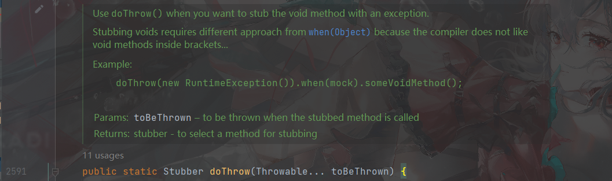


例如：

```java
@Test
public void testForDoThrow() throws Exception {

    HelloService helloService = Mockito.mock(HelloService.class);

    doThrow(new Exception("test")).when(helloService).helloWorld();

    helloService.helloWorld();
}
```


#### 2.5.1.3 mock(Class<T>,String)

mock出一个指定类的对象。 String 为这个对象的名字(这个名字将被用于全部的Verfication 异常中，帮助debug)。


## 2.6 Answer<T>


用于配置 mock对象`answer`的通用接口。  `Answer` 是在你“调用”mock对象时 ，一个能被执行的"操作"，并且这个操作允许返回一个值。

```
说白了就是 JDK的 Consumer. 
```


一个回调函数`Answer`，当被mock方法调用时，执行此函数。


Answer类使用泛型`T` 表示返回值的的类型 ， 入参固定是的 InvocationOnMock 对象。

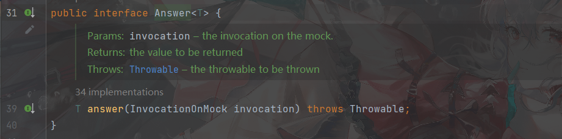


示例：

```java
    @Test
    public void testForAnswer() throws Exception {
        HelloService mock = Mockito.mock(HelloService.class,"hello_service");
        when(mock.sayHello(anyString())).thenAnswer(
                new Answer() {
                    public Object answer(InvocationOnMock invocation) {
                        Object[] args = invocation.getArguments();
                        Object mock = invocation.getMock();
                        return "called with arguments: " + Arrays.toString(args);
                    }
                });
        System.out.println(mock.sayHello("foo"));
    }
```

运行结果：

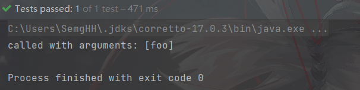


## 2.7  InvocationOnMock

Answer得接口方法中，将传入一个  `InvocationOnMock` 类对象。 这个对象中存放着 `mock` 调用时得一些元信息。

例如：

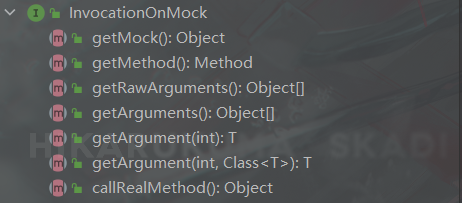


### 2.7.1 getMock()

获得Mock对象


### 2.7.2 getMethod()

获得本次调用得原方法。


```java
@Test
    public void testForInvocationMock() throws Exception {

        HelloService mock = Mockito.mock(HelloService.class,"hello_service");


        when(mock.sayHello(anyString())).thenAnswer(new Answer<String>() {
            @Override
            public String answer(InvocationOnMock invocation) throws Throwable {
                System.out.println("getMock  :  " +((invocation.getMock()==mock)));


                Method method = invocation.getMethod();
                System.out.println("getMethod : "+method);


                System.out.println("processed Arguments : ");
                System.out.println(Arrays.toString(invocation.getArguments()));


                return invocation.getArgument(0);
            }
        });

        System.out.println(mock.sayHello("star"));


    }
```


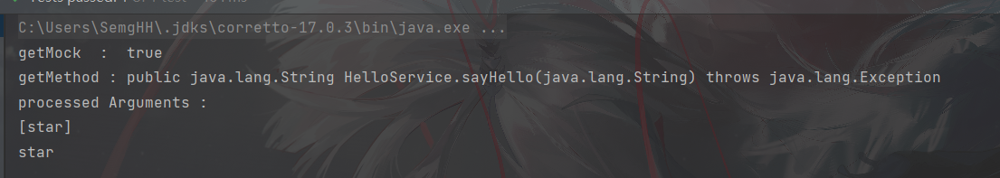


### 2.7.3 getRawArguments()

获得没有处理过得参数信息。  返回`Object[]` 对象。 

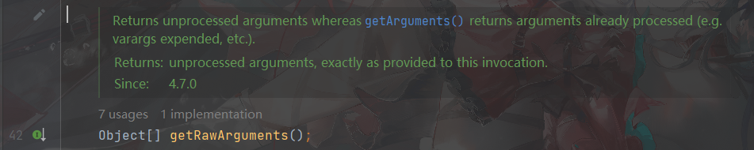


### 2.7.4 getArguments()

获得处理过得参数信息。


### 2.7.5 getArgument(int);

获得指定索引的参数。


### 2.7.6 callRealMethod

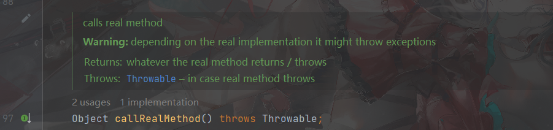

```
调用真正的方法。

注意： 依赖于真正的实现类。 它可能抛出一个异常
```


## 2.8 VerificationData

实现 `VerificationMode` 接口时，传入的对象。 

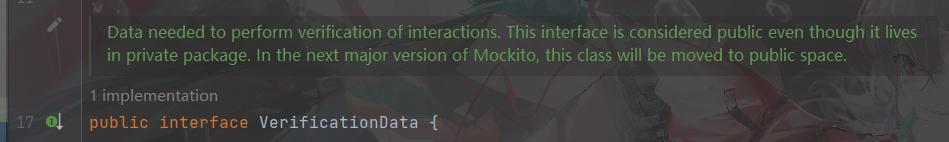

```
这个对象包含了 验证行为 可能用到的交互信息。
```


这意味着，开发者可以拿到这些 `data`然后自定义一个自己的 `VerificationMode`


### 2.8.1 都能获取哪些data

接口内只有2个方法：`getAllInvocations()`  `getTarget`


#### getAllInvocations()


```
在当前Mock对象的全部 Invocation 记录都将被返回。 不包含其他mock对象的 invocation
```


#### getTarget()

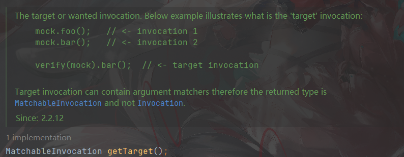


```
返回想要验证的 Invocation.

例如：  mock.foo(); mock.bar() // invoke 了2次
	   verify(mock).bar() // 此时验证了 bar的调用，那么本次的invocation是 target Invocation
```


`java` 测试：

```java


        VerificationMode mode = new VerificationMode() {
            @Override
            public void verify(VerificationData data) {
                System.out.println(data.getAllInvocations());
                System.out.println(data.getTarget());
            }
        };

        HelloService mock = mock(HelloService.class);

        when(mock.sayHello(anyString())).thenReturn("a");
        mock.sayHello("1");
        mock.sayHello("2");
        mock.sayHello("3");

        verify(mock,mode).sayHello(anyString());
```


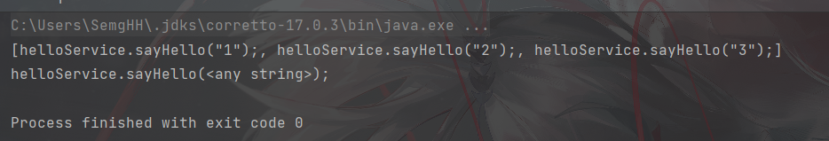


# 3. 注意事项


Mockito 不能 Mock  `静态方法`  `private方法` 

不能mock `final class` 

```
由此推测, 是基于继承的方式 mock 的
```


## 4. 参考


https://blog.csdn.net/qq_37855749/article/details/125362496

