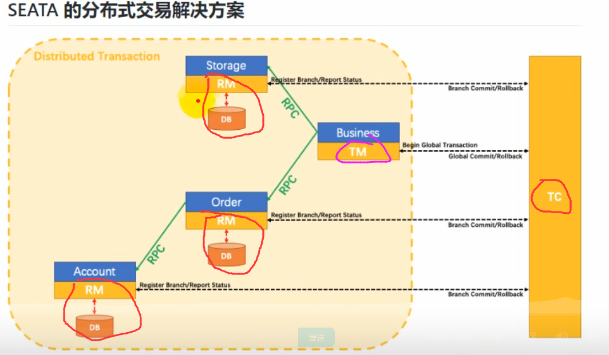
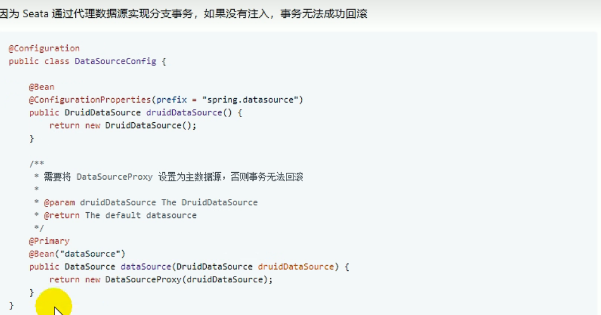

# 1.Seata

Seata 是一款开源的分布式事务解决方案，致力于提供高性能和简单易用的分布式事务服务。


Seata 将为用户提供了 AT、TCC、SAGA 和 XA 事务模式，为用户打造一站式的分布式解决方案。


## 1.1 术语表


参照下图:




### 1.1.1 TC事务协调者

```
维护全局和分支事务的状态。  驱动全局事务提交和回滚
```


### 1.1.2  TM 事务管理器

```
定义	全局事务的范围， 开始全局事务，提交或回滚全局事务。
```


### 1.1.3  RM 资源管理器


## 1.2 AT

Auto Transaction

```
不必特意编写回滚逻辑，又Seata来完成。 

需要按照配置 在数据库中建立 undoLog表

需要代理数据源


对于不需要超高并发的接口，可以使用AT
```




```
如果使用的是DruidDataSource
需要使用Seata的 DataSourceProxy包装一下dataSource
```


### 1.2.1  