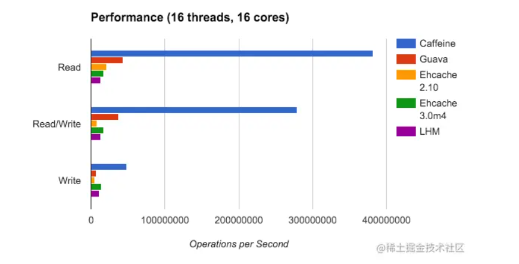
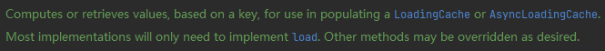
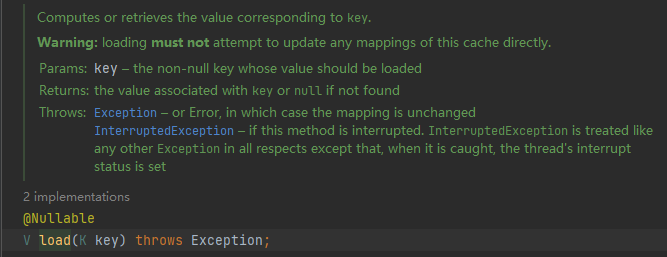
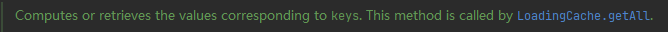
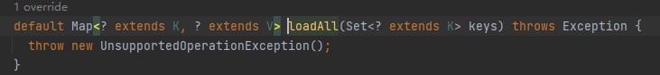
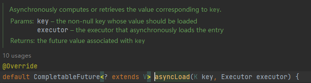
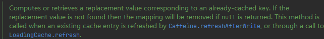

# 1. Caffeine

`Caffeine` 是一个高性能的`Java`缓存库。 底层数据使用 `ConcurrentHashMap` 。 读写效率都远高于其他缓存。




## 1.1  入门使用

### 1.1.0 引入依赖

```xml
<dependency>
    <groupId>com.github.ben-manes.caffeine</groupId>
    <artifactId>caffeine</artifactId>
    <version>3.0.3</version>
</dependency>
```


### 1.1.1 创建一个`Caffeine`缓存


```java
    @Test
    public void test7(){

        Cache<Object, Object> cache = Caffeine.newBuilder()
                .maximumSize(10)//最大条数
                .initialCapacity(10)//初始容量
                .expireAfterWrite(Duration.ofHours(1)) //写后1秒过期
                .expireAfterAccess(Duration.ofHours(1)) //访问1秒后过期
                .removalListener((o, o2, removalCause) -> System.out.printf("被删除的k,v ： %s -> %s%n", o, o2))
                .recordStats()//记录命中
                .build();

        cache.put("first","hello,world");
        System.out.println(cache.getIfPresent("first"));
        Object second = cache.get("second", (key) -> null);
        System.out.println(second);

    }
```


## 1.2  异步缓存


```java
    @Autowired
    UserService userService;

    public void test(){
            AsyncLoadingCache<Object, Object> asyncLoadingCache = Caffeine.newBuilder()
                    .maximumSize(10)//最大条数
                    .initialCapacity(10)//初始容量
                    .expireAfterWrite(Duration.ofHours(1)) //写后1秒过期
                    .expireAfterAccess(Duration.ofHours(1)) //访问1秒后过期
                    .recordStats()//记录命中
                    .buildAsync((key) -> userService.selectById(key));

            R r = R.success(asyncLoadingCache.get(1L).join());
    }
```


# 2. 类参考


## 2.1  `CacheLoader`





基于传入的 `key` , 计算/取得 对应的 `value`。 用于填充`LoadingCache`或者 `AsyncLoadingCache`接口。

大多数的实现类只需要实现 `load()`方法即可，其他的方法需要`Override`。


例如 `LoadingCache`接口，不提供`put()`方法，全部依靠 `CacheLoader`来提供 `key,value`。


### 2.1.1 接口方法


#### 2.1.1.1 `load()`




根据`key` 计算并取得`value`的方法。

例如 ： 当`LoadingCache`类的`get()`方法调用时，会尝试通过`CacheLoader.load()`方法来获得对应的缓存。


#### 2.1.1.2 `loadAll()`



这个方法只会被 `getAll()`调用。



方法传入  `Set<K>` 返回一个`Map<K,V>` 。


#### 2.1.1.3 `asyncLoad(k,Executor)`

异步取得一个`value`。



方法可以指定一个执行器` Executor`返回的是 `CompletableFuture<V>`。


#### 2.1.1.4 `reload()`




在已经被缓存的`key`中，计算并取得最新的`value`，用于代替旧缓存。如果代替值没有找到，那么旧缓存就会被移除。

当缓存被`Caffeine.refreshAfterWrite()`方法刷新的时候，本方法将会被调用。

除此以外，`LoadingCache.refresh()`也会调用本方法/


