# 1. 什么是Dubbo


Dubbo 是RPC（一种远程调用） 分布式服务框架（SOA）；


当项目为分布式项目，各个模块之间得调用是必不可少的，一种RPC是 Feign基于HTTP请求得，适用于Web服务。更多得服务可能不是基于Http请求。此时需要一类RPC框架，帮助完成 网络请求,响应,以及方法的调用。


## 1.1  什么是SOA

SOA (service-oriented architecture) ，面向服务的架构。

SOA不特指某一种技术，而是分布式运算的软件设计方法。

```
指：  软件的部分组件(调用者) 通过通用网络协议 调用另外一个应用组件运作，让调用者获得服务。 和RPC概念很像
```


# 2.  快速入门


## 2.1 多种注册中心

Dubbo支持多种注册中心 ，不同的注册中心提供不同的功能特点。


### 2.1.1  使用zookeeper

参考文档

https://dubbo.apache.org/zh/docs/references/registry/zookeeper/


Zookeeper 是CP结构的中间件，是一个树型的目录服务，支持变更推送。


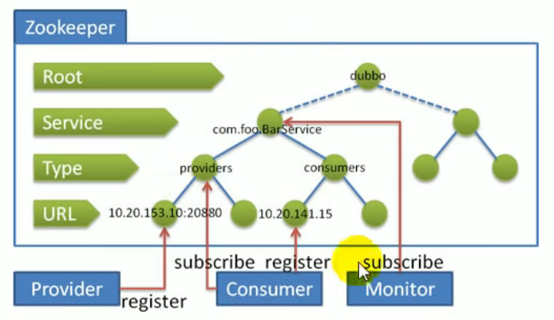


provider 和 consumer 需要引入 zookeeper的依赖

```xml
<dependency>
    <groupId>org.apache.zookeeper</groupId>
    <artifactId>zookeeper</artifactId>
    <version>3.8.0</version>
</dependency>
```


## 2.2 启动Dubbo服务

参考官方快速start

https://dubbo.apache.org/zh/docs3-v2/java-sdk/quick-start/spring-boot/


### 2.2.1 dubbo-admin

用于运维监控dubbo的状态。

参考官方说明:  https://github.com/apache/dubbo-admin


1. Clone source code on develop branch `git clone https://github.com/apache/dubbo-admin.git`

   克隆代码

2. Specify registry address in `dubbo-admin-server/src/main/resources/application.properties`

   在配置文件中，修改注册中心的地址。

3. Build

   - `mvn clean package -Dmaven.test.skip=true`

   在项目根目录下运行 mvn构建

   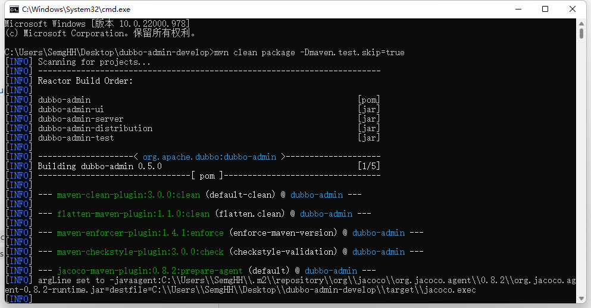

   

4. Start

   - `mvn --projects dubbo-admin-server spring-boot:run` OR
   - `cd dubbo-admin-distribution/target`; `java -jar dubbo-admin-0.1.jar`

   到指定文件夹下。运行对应jar包
   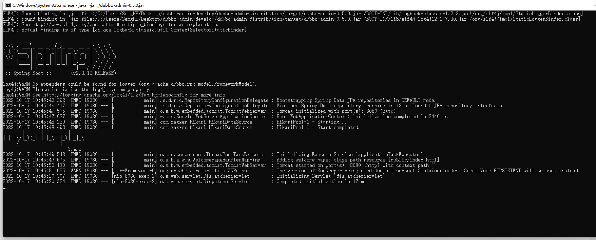

5. Visit `http://localhost:8080`

6. Default username and password is `root`

   默认账号密码为 root


### 2.2.2 使用服务


# 3. 参考手册


## 2.1  API配置Dubbo


### 服务提供者

通过ServiceConfig暴露服务接口，发布服务接口到注册中心。


```java
import org.apache.dubbo.config.ApplicationConfig;
import org.apache.dubbo.config.RegistryConfig;
import org.apache.dubbo.config.ProviderConfig;
import org.apache.dubbo.config.ServiceConfig;
import com.xxx.DemoService;
import com.xxx.DemoServiceImpl;

public class DemoProvider {
    public static void main(String[] args) {
        // 服务实现
        DemoService demoService = new DemoServiceImpl();

        // 当前应用配置
        ApplicationConfig application = new ApplicationConfig();
        application.setName("demo-provider");

        // 连接注册中心配置
        RegistryConfig registry = new RegistryConfig();
        registry.setAddress("zookeeper://10.20.130.230:2181");

        // 服务提供者协议配置
        ProtocolConfig protocol = new ProtocolConfig();
        protocol.setName("dubbo");
        protocol.setPort(12345);
        protocol.setThreads(200);

        // 注意：ServiceConfig为重对象，内部封装了与注册中心的连接，以及开启服务端口
        // 服务提供者暴露服务配置
        ServiceConfig<DemoService> service = new ServiceConfig<DemoService>(); // 此实例很重，封装了与注册中心的连接，请自行缓存，否则可能造成内存和连接泄漏
        service.setApplication(application);
        service.setRegistry(registry); // 多个注册中心可以用setRegistries()
        service.setProtocol(protocol); // 多个协议可以用setProtocols()
        service.setInterface(DemoService.class);
        service.setRef(demoService);
        service.setVersion("1.0.0");

        // 暴露及注册服务
        service.export();
        
        // 挂起等待(防止进程退出）
        System.in.read();
    }
}
```


### 服务消费者

```java
import org.apache.dubbo.config.ApplicationConfig;
import org.apache.dubbo.config.RegistryConfig;
import org.apache.dubbo.config.ConsumerConfig;
import org.apache.dubbo.config.ReferenceConfig;
import com.xxx.DemoService;

public class DemoConsumer {
    public static void main(String[] args) {
        // 当前应用配置
        ApplicationConfig application = new ApplicationConfig();
        application.setName("demo-consumer");

        // 连接注册中心配置
        RegistryConfig registry = new RegistryConfig();
        registry.setAddress("zookeeper://10.20.130.230:2181");

        // 注意：ReferenceConfig为重对象，内部封装了与注册中心的连接，以及与服务提供方的连接
        // 引用远程服务
        ReferenceConfig<DemoService> reference = new ReferenceConfig<DemoService>(); // 此实例很重，封装了与注册中心的连接以及与提供者的连接，请自行缓存，否则可能造成内存和连接泄漏
        reference.setApplication(application);
        reference.setRegistry(registry); // 多个注册中心可以用setRegistries()
        reference.setInterface(DemoService.class);
        reference.setVersion("1.0.0");

        // 和本地bean一样使用demoService
        // 注意：此代理对象内部封装了所有通讯细节，对象较重，请缓存复用
        DemoService demoService = reference.get();
        demoService.sayHello("Dubbo");
    }
}
```


### Bootstrap API

启动项api，用于减少重复配置，支持批量发布/订阅服务接口


服务提供者


```java
import org.apache.dubbo.config.bootstrap.DubboBootstrap;
import org.apache.dubbo.config.ApplicationConfig;
import org.apache.dubbo.config.RegistryConfig;
import org.apache.dubbo.config.ProviderConfig;
import org.apache.dubbo.config.ServiceConfig;
import com.xxx.DemoService;
import com.xxx.DemoServiceImpl;

public class DemoProvider {
    public static void main(String[] args) {

        ConfigCenterConfig configCenter = new ConfigCenterConfig();
        configCenter.setAddress("zookeeper://127.0.0.1:2181");

        // 服务提供者协议配置
        ProtocolConfig protocol = new ProtocolConfig();
        protocol.setName("dubbo");
        protocol.setPort(12345);
        protocol.setThreads(200);

        // 注意：ServiceConfig为重对象，内部封装了与注册中心的连接，以及开启服务端口
        // 服务提供者暴露服务配置
        ServiceConfig<DemoService> demoServiceConfig = new ServiceConfig<>();
        demoServiceConfig.setInterface(DemoService.class);
        demoServiceConfig.setRef(new DemoServiceImpl());
        demoServiceConfig.setVersion("1.0.0");
        
        // 第二个服务配置
        ServiceConfig<FooService> fooServiceConfig = new ServiceConfig<>();
        fooServiceConfig.setInterface(FooService.class);
        fooServiceConfig.setRef(new FooServiceImpl());
        fooServiceConfig.setVersion("1.0.0");
        
        ...

        // 通过DubboBootstrap简化配置组装，控制启动过程
        DubboBootstrap.getInstance()
                .application("demo-provider") // 应用配置
                .registry(new RegistryConfig("zookeeper://127.0.0.1:2181")) // 注册中心配置
                .protocol(protocol) // 全局默认协议配置
                .service(demoServiceConfig) // 添加ServiceConfig
                .service(fooServiceConfig)
                .start()    // 启动Dubbo
                .await();   // 挂起等待(防止进程退出）
    }
}
```


服务消费者

```java
import org.apache.dubbo.config.bootstrap.DubboBootstrap;
import org.apache.dubbo.config.ApplicationConfig;
import org.apache.dubbo.config.RegistryConfig;
import org.apache.dubbo.config.ProviderConfig;
import org.apache.dubbo.config.ServiceConfig;
import com.xxx.DemoService;
import com.xxx.DemoServiceImpl;

public class DemoConsumer {
    public static void main(String[] args) {

        // 引用远程服务
        ReferenceConfig<DemoService> demoServiceReference = new ReferenceConfig<DemoService>(); 
        demoServiceReference.setInterface(DemoService.class);
        demoServiceReference.setVersion("1.0.0");
        
        ReferenceConfig<FooService> fooServiceReference = new ReferenceConfig<FooService>(); 
        fooServiceReference.setInterface(FooService.class);
        fooServiceReference.setVersion("1.0.0");

        // 通过DubboBootstrap简化配置组装，控制启动过程
        DubboBootstrap bootstrap = DubboBootstrap.getInstance();
        bootstrap.application("demo-consumer") // 应用配置
                .registry(new RegistryConfig("zookeeper://127.0.0.1:2181")) // 注册中心配置
                .reference(demoServiceReference) // 添加ReferenceConfig
                .service(fooServiceReference)
                .start();    // 启动Dubbo

        ...
        
        // 和本地bean一样使用demoService
        // 通过Interface获取远程服务接口代理，不需要依赖ReferenceConfig对象
        DemoService demoService = DubboBootstrap.getInstance().getCache().get(DemoService.class);
        demoService.sayHello("Dubbo");

        FooService fooService = DubboBootstrap.getInstance().getCache().get(FooService.class);
        fooService.greeting("Dubbo");
    }
    
}
```


## 2.2 xml配置

参考 xml配置手册

https://dubbo.apache.org/zh/docs/references/xml/


xml有如下标签，每个标签内有多个属性

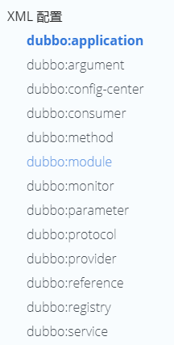


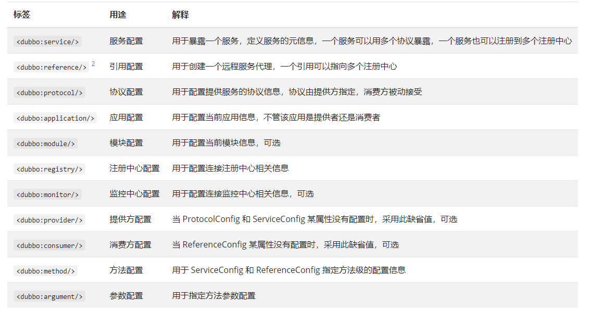


### 2.2.1 xml 标签


#### dubbo:application

```
常用属性 name
```


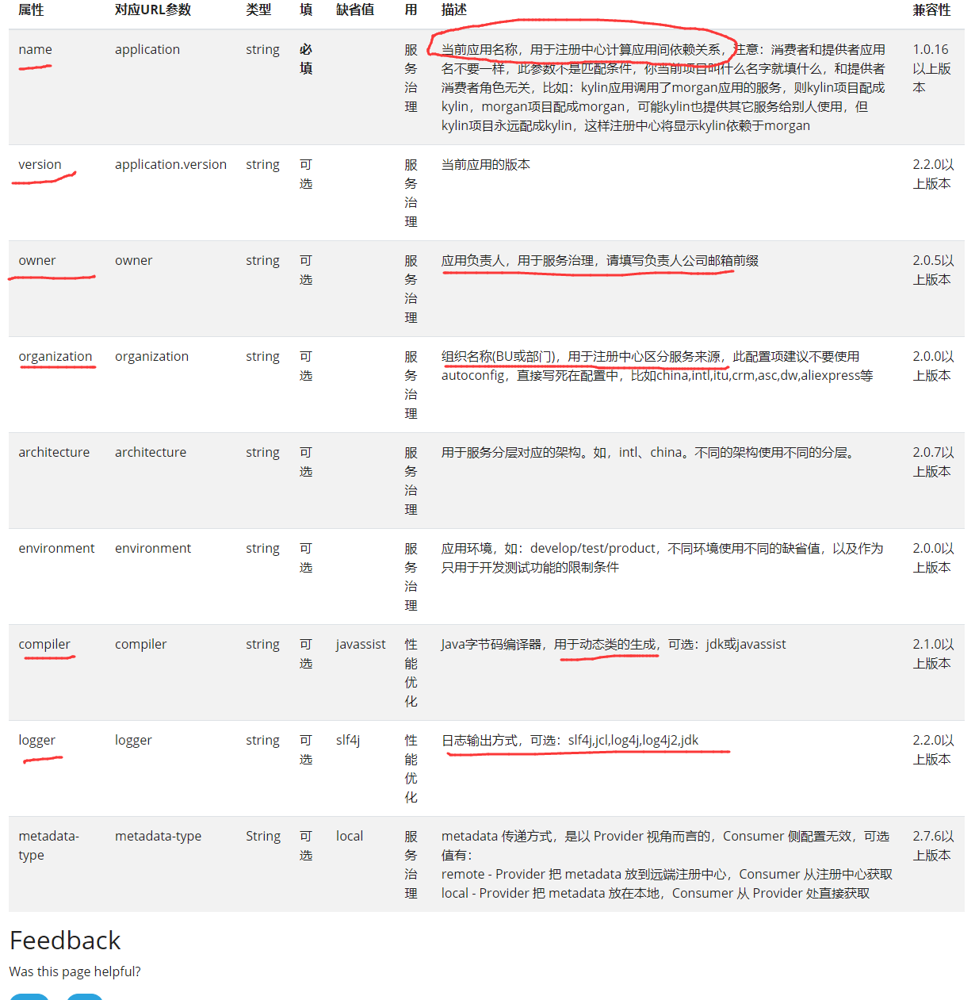


#### dubbo:service

服务提供者暴露服务配置。对应的配置类：`org.apache.dubbo.config.ServiceConfig`


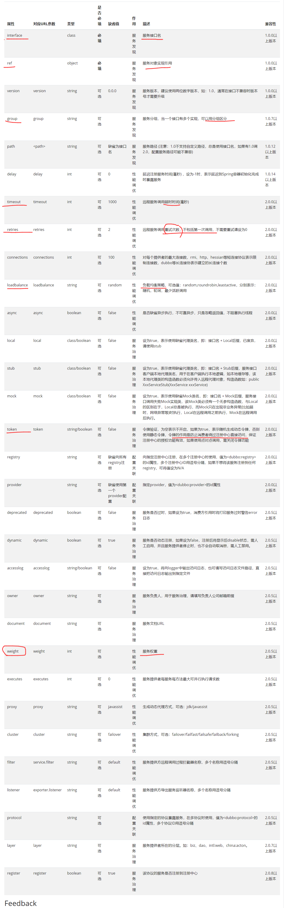


#### dubbo:method

方法级配置，对应配置类 `org.apache.dubbo.config.MethodConfig`

是 `<dubbo:service>` 或 `<dubbo:reference>` **的子标**


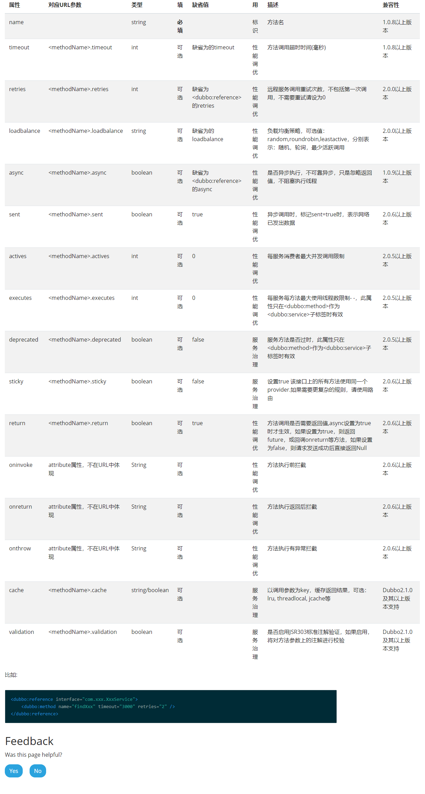


#### dubbo:argument

用于配置方法参数。

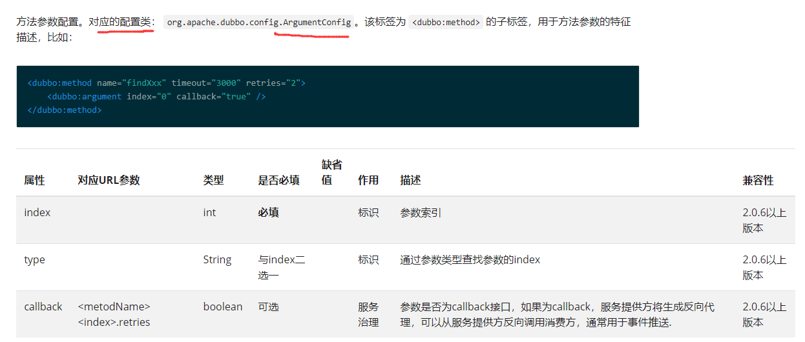


#### dubbo:protocol

用于配置 服务提供者的协议。 对应的配置类： `org.apache.dubbo.config.ProtocolConfig`

可以支持多协议。声明多个 `<dubbo:protocol>` 标签，并在 `<dubbo:service>` 中通过 `protocol` 属性指定使用的协议。


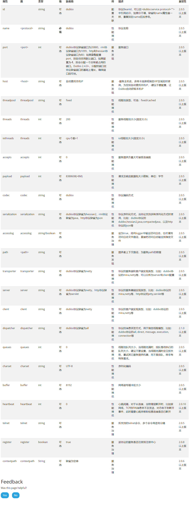


#### dubbo:registry

注册中心配置。对应的配置类： `org.apache.dubbo.config.RegistryConfig`。

同时如果有多个不同的注册中心，可以声明多个 `<dubbo:registry>` 标签，并在 `<dubbo:service>` 或 `<dubbo:reference>` 的 `registry` 属性指定使用的注册中心。


```
group :  跨组服务之间相互隔离，不可见 ， 不可调用
```


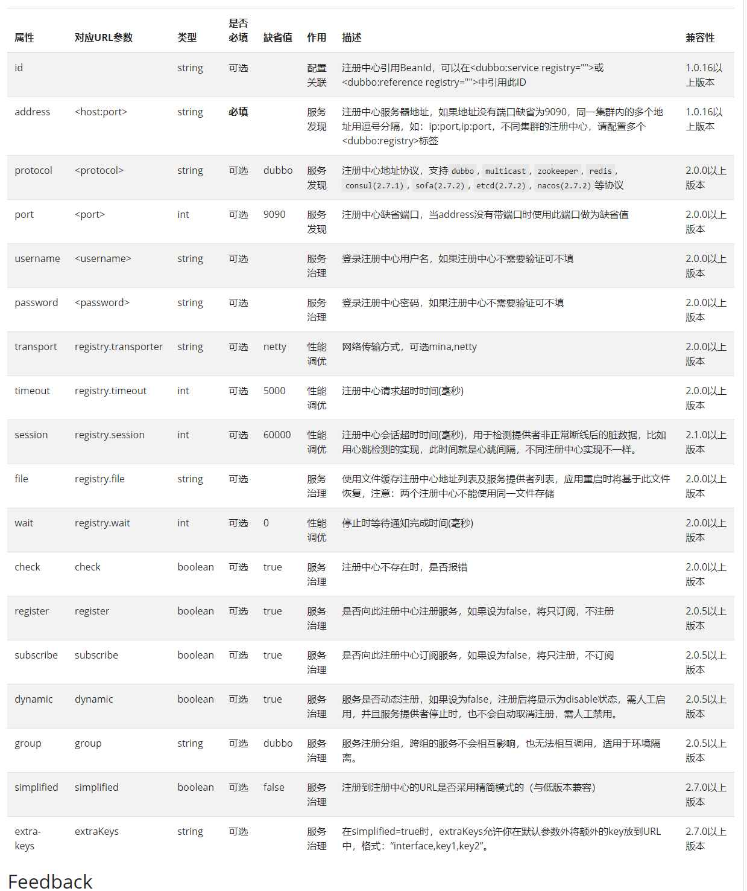


#### dubbo: reference 

用于消费者配置 消费服务的。对应的配置类： `org.apache.dubbo.config.ReferenceConfig`


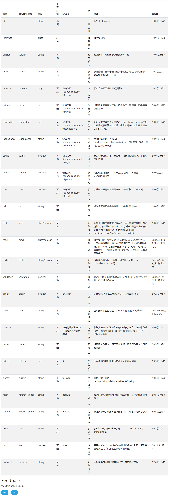


### 2.2.2 provider 示例


需要导入依赖

```xml
        <dependency>
            <groupId>org.apache.dubbo</groupId>
            <artifactId>dubbo</artifactId>
            <version>3.0.7</version>
        </dependency>
        <dependency>
            <groupId>org.apache.dubbo</groupId>
            <artifactId>dubbo-dependencies-zookeeper</artifactId>
            <version>3.0.7</version>
            <type>pom</type>
        </dependency>
```


服务提供者

```xml
<beans xmlns:xsi="http://www.w3.org/2001/XMLSchema-instance"
       xmlns:dubbo="http://dubbo.apache.org/schema/dubbo"
       xmlns="http://www.springframework.org/schema/beans"
       xsi:schemaLocation="http://www.springframework.org/schema/beans http://www.springframework.org/schema/beans/spring-beans.xsd
       http://dubbo.apache.org/schema/dubbo http://dubbo.apache.org/schema/dubbo/dubbo.xsd">
    
    <!-- 当前应用的名称，用于注册中心计算应用依赖关系  -->
    <dubbo:application name="demo-provider"/>
    
    <dubbo:registry address="zookeeper://127.0.0.1:2181"/>
    
    <dubbo:protocol name="dubbo" port="20890"/>
    
    <bean id="demoService" class="org.apache.dubbo.samples.basic.impl.DemoServiceImpl"/>
    
    <!-- 注册服务  ref 填bean的id-->
    <dubbo:service interface="org.apache.dubbo.samples.basic.api.DemoService" ref="demoService"/>
    
    
</beans>
```


### 2.2.3 consumer 示例

```xml
<beans xmlns:xsi="http://www.w3.org/2001/XMLSchema-instance"
       xmlns:dubbo="http://dubbo.apache.org/schema/dubbo"
       xmlns="http://www.springframework.org/schema/beans"
       xsi:schemaLocation="http://www.springframework.org/schema/beans http://www.springframework.org/schema/beans/spring-beans.xsd
       http://dubbo.apache.org/schema/dubbo http://dubbo.apache.org/schema/dubbo/dubbo.xsd">
    
    
    <dubbo:application name="demo-consumer"/>
    
    <dubbo:registry group="aaa" address="zookeeper://127.0.0.1:2181"/>
    
    <dubbo:reference id="demoService" check="false" interface="org.apache.dubbo.samples.basic.api.DemoService"/>
    
    
    
</beans>
```


## 2.3 粒度之间的覆盖关系


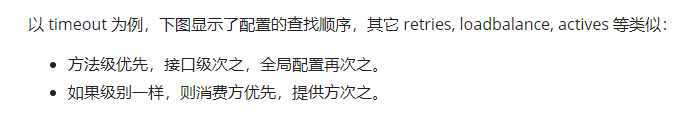


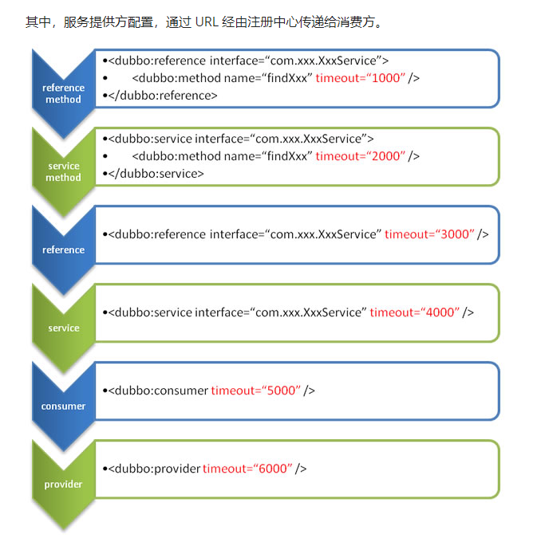


# 4. dubbo.samples


Dubbo 官方更新了一个用于学习的库 `dubbo-samples` 

下面更新一下库内的示例


## 4.1  基于xml的方式

dubbo 借助spring容器，并配置dubbo标签完成服务的RPC.


只需要引入 spring容器依赖，dubbo依赖，以及 zookeeper依赖

```xml
        <dependency>
            <groupId>org.apache.dubbo</groupId>
            <artifactId>dubbo</artifactId>
            <version>3.0.7</version>
        </dependency>
        <dependency>
            <groupId>org.springframework</groupId>
            <artifactId>spring-context</artifactId>
            <version>5.0.5.RELEASE</version>
        </dependency>
        <dependency>
            <groupId>org.apache.dubbo</groupId>
            <artifactId>dubbo-dependencies-zookeeper</artifactId>
            <version>3.0.7</version>
            <type>pom</type>
        </dependency>
```


用于描述提供者的xml :   provider.xml

```xml
    ... 省略

	<bean id="helloService" class="com.example.helloProvider.HelloServiceImpl" />
    <!-- 容器中需要放入一个 impl类的实例对象，被dubbo服务引用  -->
    

	<!-- 给这个provider一个命名，便于注册中心计算 应用之间的依赖关系  -->
    <dubbo:application name="hello-provider" />
    
	<!-- dubbo 支持多种通讯协议， 所以需要声明协议类型 。支持dubbo rmi http 等协议    -->
    <dubbo:protocol name="dubbo" port="20800" />
    

	<!-- 用于声明当前provider的服务向哪些个注册中心注册。支持多个 registry  -->
	
    <dubbo:registry address="zookeeper://127.0.0.1:2181" />
    

	<!-- 注册接口级别的服务  指明接口， 以及 spring容器中对应的bean-->
    <dubbo:service interface="com.example.common.service.HelloService" ref="helloService" group="dev"/>

	...省略
```


消费者的xml ： consumer.xml

```xml
<beans xmlns:xsi="http://www.w3.org/2001/XMLSchema-instance"
       xmlns:dubbo="http://dubbo.apache.org/schema/dubbo"
       xmlns="http://www.springframework.org/schema/beans"
       xsi:schemaLocation="http://www.springframework.org/schema/beans http://www.springframework.org/schema/beans/spring-beans.xsd
       http://dubbo.apache.org/schema/dubbo http://dubbo.apache.org/schema/dubbo/dubbo.xsd">


    <dubbo:application name="hello-consumer" />
    
    <dubbo:registry address="zookeeper://127.0.0.1:2181" />
    
    <!-- 使用 reference 标签指明 引用的服务  group 表示服务的组-->
    <dubbo:reference interface="com.example.common.service.HelloService" group="dev" id="helloService"/>


</beans>
```


## 4.2    基于注解Autowire

主要使用以下注解

```
@EnableDubbo 
@PropertySource  //基于注解导入dubbo的配置文件,用于指明 protocol port    dubbo.registry.address 等 
@DubboReference  //自动获得一个微服务代理对象
@DubboService    //自动向注册中心中 注册一个服务。 需要标注在微服务的实现类上
```


### 4.2.1 消费者


dubboConsumer.properties

```
dubbo.application.name = helloServiceConsumer
dubbo.registry.address=zookeeper://127.0.0.1:2181
```


消费者启动类ConsumerBootstrap

```java
public class ConsumerBootstrap {


    public static void main(String[] args) {

        AnnotationConfigApplicationContext context = new AnnotationConfigReactiveWebApplicationContext(ConsumerConfig.class);
        //以注解的方式启动spring

        context.start();

        FooService bean = context.getBean(FooService.class);

        System.out.println(bean.fooSayHello("Semghh"));

    }
}
```


消费者配置类ConsumerConfig

```java
@Configuration  //PropertySource必须配合Configuration
@ComponentScan(basePackageClasses = {HelloServiceConsumer.class}) 
@PropertySource("classpath:/spring/dubboConsumer.properties") //指明dubbo配置类
@EnableDubbo  //开启dubbo
public class ConsumerConfig {

    @DubboReference   //自动注册服务
    private HelloService helloService;

}
```


在Consumer中， 将HelloService 注入到更高层的 FooService中。(类比于dao注入到Service中)

```java
@Component
public class FooService {

    @Autowired
    private HelloService helloService;


    public String fooSayHello(String name){
        return helloService.sayHello(name);
    }

}
```


### 4.2.2 提供者

dubboProvider.properties

```pro
dubbo.application.name = helloServiceProvider
dubbo.protocol.name=dubbo
dubbo.protocol.port=20800
dubbo.registry.address=zookeeper://127.0.0.1:2181
dubbo.provider.token=true
```


自动注册服务，在impl类上标注 DubboService

```java
@DubboService(interfaceClass = HelloService.class)
public class HelloServiceImpl implements HelloService {


    @Override
    public String sayHello(String name) {
        return "review01 , "+name;
    }
}
```


提供者启动类

```java
public class ProviderBootstrap {


    public static void main(String[] args) throws IOException {

        AnnotationConfigApplicationContext context = new AnnotationConfigReactiveWebApplicationContext(ProviderConfiguration.class);

        context.start();

        System.in.read();
    }
}
```


提供者配置类

```java
@Configuration
@EnableDubbo(scanBasePackageClasses = HelloServiceImpl.class)  //开启dubbo, 扫描@DubboReference注解
@PropertySource("classpath:/spring/dubbo/provider.properties")
public class ProviderConfiguration {

    

}
```


## 4.3  注解


@DubboReference


