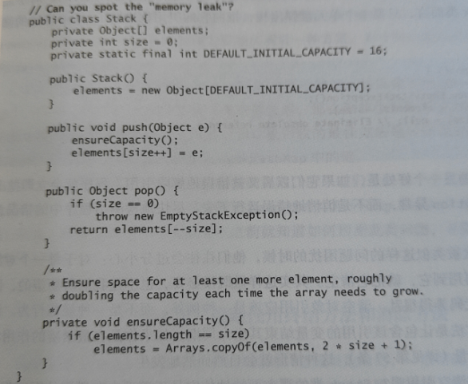

# 1.创建和销毁对象

## 1.1. 避免内存泄漏

### 1.1 清除过期对象引用

这段代码存在内存泄漏(GC永远也不会回收其中的一部分对象)



原因在于“pop()”方法。

除了返回对象元素以外，并没有对  elements[size]=null


```
这类发生内存泄漏对象的共性在于:  这些类自己管理内存。

这个类开辟了Object[] 作为自己抽象的内存空间。相当于它从GC手中接管了内存管理。对于这些类来说，pop以后的对象时“过期对象”。但JVM并不知道这些，对于JVM来说，这些对象都是一样的。
```


```
另一个容易泄露的是 缓存。 
把对象放入缓存中，很容易就被忘掉。这让它可能在未来的很长一段时间内都存在。
```


```
第三个常见来源是：  监听器和 其他回调。
例如实现了一个API，客户端在API中注册回调，却没有被显式的取消注册。
```


## 1.2  避免使用finalize


## 1.3 try-with-resources

try-with-resources 优于 try-finally

