# 1. 相关概念

## 1.1 大数据定义

无法在一定时间内使用 常规软件工具捕捉，管理和处理的数据集合。这些数据通常是海量，高增长率，多样化的。


数据单位：由低到高分别为：

`bit`  `byte` `KB`  `MB` `GB` `TB`   `PB`   `EB` 


## 1.2 大数据的特点


大量

高增长

多样化。 常见的结构化数据为 数据库/文本。  非结构化的数据越来越多： 网络日志，音频，视频。

 


## 1.3 Hadoop 

Hadoop采用分布式基础架构，主要解决海量数据存储，海量数据分析问题。

广义上讲 Hadoop通常指其生态圈。例如 HBase , Hive 等


### 1.3.1 Hadoop组成

MapReduce 负责： 计算+资源调度。

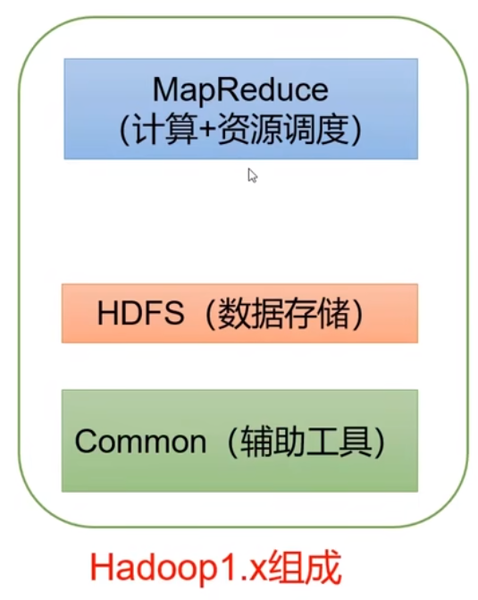


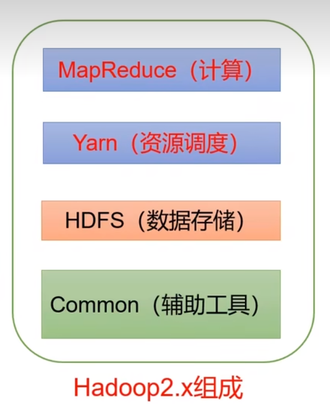


Hadoop是并行计算任务。将任务划分成多分，分摊给集群节点。


### 1.3.2 `HDFS` 概述

`HDFS` 就是一个分布式文件系统，目的是期望将一个大文件分散在各个集群节点中，同时保证一定的可用性。


#### 1.3.2.1 HDFS中的节分类

HDFS中存在 `NameNode`节点 ， `Secondary NameNode`节点    和 `DataNode`节点。


##### `NameNode`

`NameNode` 用于存储文件的 【元数据】例如：文件名，文件目录结构，文件属性（生成时间，副本数量，文件权限），以及每个文件的 块列表，块所在的`DataNode`。


##### `DataNode`

`DataNode` 在本地文件系统存储文件【块数据】，块数据的校验和。


##### `Secondary Namenode`

`Secondary NameNode` 实际上就是 `NameNode`的从节点。


### 1.3.3 Yarn的概述

是Hadoop的资源管理器。 主要管理 `cpu`和`内存`。


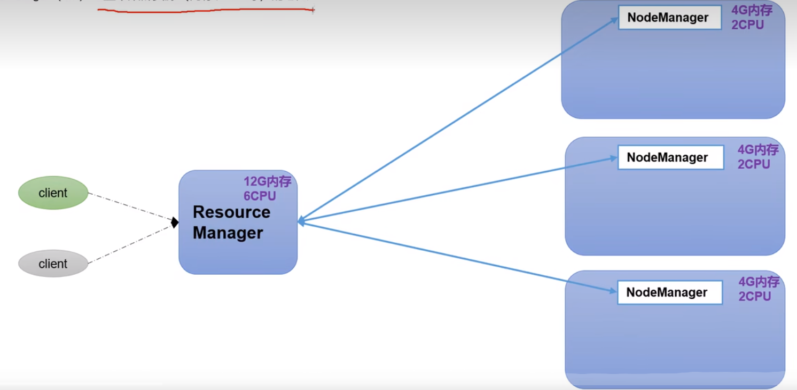


`Resource Manager` 是整个集群资源的管理者。

`Node Manager` 是单节点的资源管理器。


客户端`client` 向 `Resource Manager`提交任务。

每个节点中的任务都在 `container`中运行，其中管理单个任务运行的是 `ApplicationMaster`。

`container`之间进行了隔离，相当于独立的服务器，封装了任务需要的资源。例如 cpu 内存 磁盘 网络。

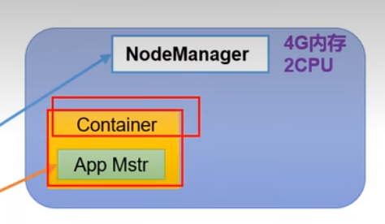


### 1.3.4 `MapReduce`


`MapReduce` 分为两个阶段： `Map` /`Reduce`。

`Map` ：将任务拆解分散到各个集群节点。

`Reduce` ： 将任务执行结果汇合到一起。


如下图：


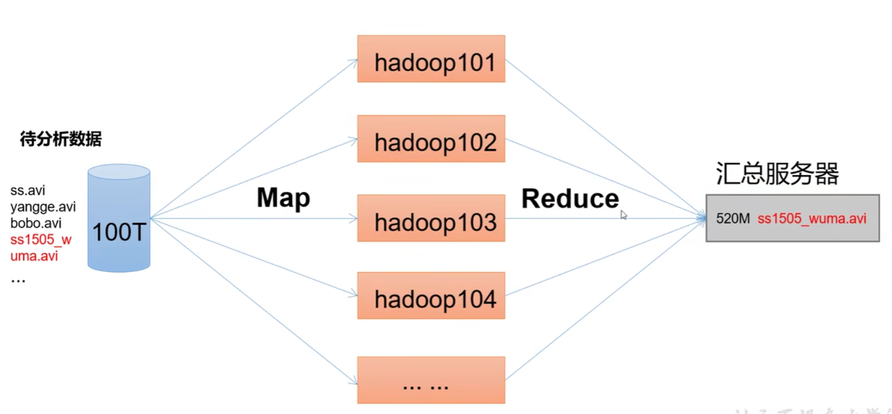


## 1.4 大数据生态体系


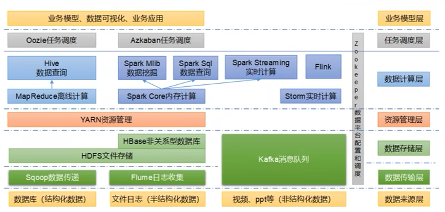


# 2. Hadoop

## 2.1 Hadoop 运行模式

单机模式：单机测试使用，生产不用。 

伪分布模式 ：单机启动，但是具有集群得全部功能，用单机来模拟。生产不用。

完全分布模式 ： 生产使用。


### 2.1.1 完全分布式配置过程

各台主机都需要配置 `JAVA_HOME` `HADOOP_HOME`


`ResourceManager`，   `NameNode` 和  `SecondaryNameNode` 不要在同一台机器上，因为他们都很消耗内存。


集群规划：

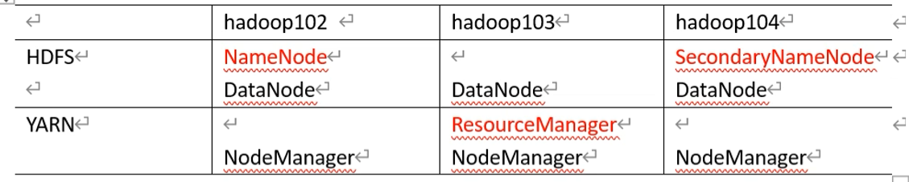


#### 2.1.1.1 配置文件

`Hadoop` 4个默认配置

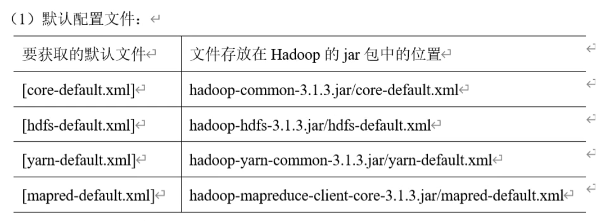

用户自定义配置文件。

位置：  `$HADOOP_HOME/etc/hadoop`下


`core-site.xml` 配置信息。

```xml
<configuration>
    	<!-- 指定NameNode的地址（内部） -->
        <property>
                <name>fs.defaultFS</name>
                <value>hdfs://bogon:8020</value>
        </property>
		<!-- 指定Hadoop 数据的数据目录 -->
        <property>
                <name>hadoop.tmp.dir</name>
                <value>/opt/module/hadoop-3.1.3/data</value>
        </property>
    	<!-- 配置HDFS 网页登录时使用的静态用户为semghh -->
        <property>
                <name>hadoop.http.staticuser.user</name>
                <value>semghh</value>
        </property>
</configuration>
```


`hdfs-site.xml` 配置：

```xml
<configuration>
    <!-- namenode对外的端口  -->
	<property>
        <name>dfs.namenode.http-address</name>
        <value>bogon:9870</value>
    </property>
    
    <!--  secondaryNamenode 地址  -->
    <property>
        <name>dfs.namenode.secondary.http-address</name>
        <value>192.168.202.155:9868</value>
    </property>

</configuration>
```


`yarn.xml` 的配置

```xml
<configuration>
    <!-- 指定mapReduce走 shuffle  -->
	<property>
    	<name>yarn.nodemanager.aux-services</name>
        <value>mapreduce_shuffle</value>
    </property>
    
    <!--  配置 resourcemanager的主机地址  -->
    <property>
    	<name>yarn.resourcemanager.hostname</name>
        <value>192.168.202.101</value>
    </property>
    
    <!-- 环境变量白名单 -->
    <property>
        <name>yarn.nodemanager.env-whitelist</name>		<value>JAVA_HOME,HADOOP_COMMON_HOME,HADOOP_HDFS_HOME,HADOOP_CONF_DIR,CLASSPATH_PREPEND_DISTCACHE,HADOOP_YARN_HOME,HADOOP_MAPRED_HOME</value>
    </property>
    
    
</configuration>
```


`mapred-site.xml`

```xml
<configuration>
    <!-- 配置mapreduce为yarn -->
	<name>mapreduce.framework.name</name>
    <value>yarn</value>
</configuration>
```


将配置文件分发到各台集群机器中。


#### 2.1.1.2 配置`wokers`

位置在 `$HADOOP_HOME/etc/hadoop/workers`


`worker` 中默认是 `localhost` , 改为如下

```
bogon
192.168.202.155
192.168.202.101
```


同样需要分发到全部集群节点。


#### 2.1.1.3 启动集群


##### 2.1.1.3.1 启动 `namenode`

首次启动集群需要在 `namenode`节点初始化。


初始化命令： `hdfs namenode -format`

 

示例：

```sh
[root@bogon hadoop]# hdfs namenode -format
WARNING: /data/hadoop-3.1.3/logs does not exist. Creating.
2023-02-27 17:18:49,749 INFO namenode.NameNode: STARTUP_MSG: 
/************************************************************
STARTUP_MSG: Starting NameNode
STARTUP_MSG:   host = bogon/192.168.202.150
STARTUP_MSG:   args = [-format]
STARTUP_MSG:   version = 3.1.3
STARTUP_MSG:   classpath = /data/hadoop-3.1.3/etc/hadoop:/data/hadoop-3.1.3/share/hadoop/common/lib/jackson-core-2.7.8.jar:/data/hadoop-3.1.3/share/hadoop/common/lib/kerb-identity-1.0.1.jar:/data/hadoop-3.1.3/share/hadoop/common/lib/commons-net-3.6.jar:/data/hadoop-3.1.3/share/hadoop/common/lib/kerb-util-1.0.1.jar:/data/hadoop-3.1.3/share/hadoop/common/lib/re2j-1.1.jar:/data/hadoop-3.1.3/share/hadoop/common/lib/jul-to-slf4j-1.7.25.jar:/data/hadoop-3.1.3/share/hadoop/common/lib/commons-lang-2.6.jar:/data/hadoop-3.1.3/share/hadoop/common/lib/avro-1.7.7.jar:/data/hadoop-3.1.3/share/hadoop/common/lib/jetty-io-9.3.24.v20180605.jar:/data/hadoop-3.1.3/share/hadoop/common/lib/kerb-core-1.0.1.jar:/data/hadoop-3.1.3/share/hadoop/common/lib/zookeeper-3.4.13.jar:/data/hadoop-3.1.3/share/hadoop/common/lib/token-provider-1.0.1.jar:/data/hadoop-3.1.3/share/hadoop/common/lib/jsr305-3.0.0.jar:/data/hadoop-3.1.3/share/hadoop/common/lib/jackson-databind-2.7.8.jar:/data/hadoop-3.1.3/share/hadoop/common/lib/commons-logging-1.1.3.jar:/data/hadoop-3.1.3/share/hadoop/common/lib/nimbus-jose-jwt-4.41.1.jar:/data/hadoop-3.1.3/share/hadoop/common/lib/jersey-core-1.19.jar:/data/hadoop-3.1.3/share/hadoop/common/lib/jersey-json-1.19.jar:/data/hadoop-3.1.3/share/hadoop/common/lib/j2objc-annotations-1.1.jar:/data/hadoop-3.1.3/share/hadoop/common/lib/netty-3.10.5.Final.jar:/data/hadoop-3.1.3/share/hadoop/common/lib/woodstox-core-5.0.3.jar:/data/hadoop-3.1.3/share/hadoop/common/lib/kerb-simplekdc-1.0.1.jar:/data/hadoop-3.1.3/share/hadoop/common/lib/jsr311-api-1.1.1.jar:/data/hadoop-3.1.3/share/hadoop/common/lib/javax.servlet-api-3.1.0.jar:/data/hadoop-3.1.3/share/hadoop/common/lib/curator-client-2.13.0.jar:/data/hadoop-3.1.3/share/hadoop/common/lib/jcip-annotations-1.0-1.jar:/data/hadoop-3.1.3/share/hadoop/common/lib/jetty-http-9.3.24.v20180605.jar:/data/hadoop-3.1.3/share/hadoop/common/lib/jaxb-impl-2.2.3-1.jar:/data/hadoop-3.1.3/share/hadoop/common/lib/kerby-config-1.0.1.jar:/data/hadoop-3.1.3/share/hadoop/common/lib/jetty-server-9.3.24.v20180605.jar:/data/hadoop-3.1.3/share/hadoop/common/lib/jackson-mapper-asl-1.9.13.jar:/data/hadoop-3.1.3/share/hadoop/common/lib/httpclient-4.5.2.jar:/data/hadoop-3.1.3/share/hadoop/common/lib/kerby-util-1.0.1.jar:/data/hadoop-3.1.3/share/hadoop/common/lib/audience-annotations-0.5.0.jar:/data/hadoop-3.1.3/share/hadoop/common/lib/log4j-1.2.17.jar:/data/hadoop-3.1.3/share/hadoop/common/lib/hadoop-annotations-3.1.3.jar:/data/hadoop-3.1.3/share/hadoop/common/lib/commons-lang3-3.4.jar:/data/hadoop-3.1.3/share/hadoop/common/lib/kerb-server-1.0.1.jar:/data/hadoop-3.1.3/share/hadoop/common/lib/failureaccess-1.0.jar:/data/hadoop-3.1.3/share/hadoop/common/lib/slf4j-log4j12-1.7.25.jar:/data/hadoop-3.1.3/share/hadoop/common/lib/jetty-util-9.3.24.v20180605.jar:/data/hadoop-3.1.3/share/hadoop/common/lib/asm-5.0.4.jar:/data/hadoop-3.1.3/share/hadoop/common/lib/commons-compress-1.18.jar:/data/hadoop-3.1.3/share/hadoop/common/lib/kerby-pkix-1.0.1.jar:/data/hadoop-3.1.3/share/hadoop/common/lib/curator-recipes-2.13.0.jar:/data/hadoop-3.1.3/share/hadoop/common/lib/jsp-api-2.1.jar:/data/hadoop-3.1.3/share/hadoop/common/lib/listenablefuture-9999.0-empty-to-avoid-conflict-with-guava.jar:/data/hadoop-3.1.3/share/hadoop/common/lib/jackson-core-asl-1.9.13.jar:/data/hadoop-3.1.3/share/hadoop/common/lib/protobuf-java-2.5.0.jar:/data/hadoop-3.1.3/share/hadoop/common/lib/kerb-admin-1.0.1.jar:/data/hadoop-3.1.3/share/hadoop/common/lib/commons-math3-3.1.1.jar:/data/hadoop-3.1.3/share/hadoop/common/lib/guava-27.0-jre.jar:/data/hadoop-3.1.3/share/hadoop/common/lib/snappy-java-1.0.5.jar:/data/hadoop-3.1.3/share/hadoop/common/lib/paranamer-2.3.jar:/data/hadoop-3.1.3/share/hadoop/common/lib/jersey-server-1.19.jar:/data/hadoop-3.1.3/share/hadoop/common/lib/accessors-smart-1.2.jar:/data/hadoop-3.1.3/share/hadoop/common/lib/error_prone_annotations-2.2.0.jar:/data/hadoop-3.1.3/share/hadoop/common/lib/slf4j-api-1.7.25.jar:/data/hadoop-3.1.3/share/hadoop/common/lib/curator-framework-2.13.0.jar:/data/hadoop-3.1.3/share/hadoop/common/lib/checker-qual-2.5.2.jar:/data/hadoop-3.1.3/share/hadoop/common/lib/stax2-api-3.1.4.jar:/data/hadoop-3.1.3/share/hadoop/common/lib/gson-2.2.4.jar:/data/hadoop-3.1.3/share/hadoop/common/lib/httpcore-4.4.4.jar:/data/hadoop-3.1.3/share/hadoop/common/lib/jetty-xml-9.3.24.v20180605.jar:/data/hadoop-3.1.3/share/hadoop/common/lib/jersey-servlet-1.19.jar:/data/hadoop-3.1.3/share/hadoop/common/lib/json-smart-2.3.jar:/data/hadoop-3.1.3/share/hadoop/common/lib/jettison-1.1.jar:/data/hadoop-3.1.3/share/hadoop/common/lib/kerby-xdr-1.0.1.jar:/data/hadoop-3.1.3/share/hadoop/common/lib/commons-codec-1.11.jar:/data/hadoop-3.1.3/share/hadoop/common/lib/jaxb-api-2.2.11.jar:/data/hadoop-3.1.3/share/hadoop/common/lib/jackson-jaxrs-1.9.13.jar:/data/hadoop-3.1.3/share/hadoop/common/lib/commons-io-2.5.jar:/data/hadoop-3.1.3/share/hadoop/common/lib/jetty-servlet-9.3.24.v20180605.jar:/data/hadoop-3.1.3/share/hadoop/common/lib/commons-configuration2-2.1.1.jar:/data/hadoop-3.1.3/share/hadoop/common/lib/kerb-client-1.0.1.jar:/data/hadoop-3.1.3/share/hadoop/common/lib/animal-sniffer-annotations-1.17.jar:/data/hadoop-3.1.3/share/hadoop/common/lib/jackson-annotations-2.7.8.jar:/data/hadoop-3.1.3/share/hadoop/common/lib/metrics-core-3.2.4.jar:/data/hadoop-3.1.3/share/hadoop/common/lib/jetty-security-9.3.24.v20180605.jar:/data/hadoop-3.1.3/share/hadoop/common/lib/commons-collections-3.2.2.jar:/data/hadoop-3.1.3/share/hadoop/common/lib/jetty-webapp-9.3.24.v20180605.jar:/data/hadoop-3.1.3/share/hadoop/common/lib/kerb-crypto-1.0.1.jar:/data/hadoop-3.1.3/share/hadoop/common/lib/commons-beanutils-1.9.3.jar:/data/hadoop-3.1.3/share/hadoop/common/lib/kerb-common-1.0.1.jar:/data/hadoop-3.1.3/share/hadoop/common/lib/hadoop-auth-3.1.3.jar:/data/hadoop-3.1.3/share/hadoop/common/lib/jsch-0.1.54.jar:/data/hadoop-3.1.3/share/hadoop/common/lib/kerby-asn1-1.0.1.jar:/data/hadoop-3.1.3/share/hadoop/common/lib/htrace-core4-4.1.0-incubating.jar:/data/hadoop-3.1.3/share/hadoop/common/lib/jackson-xc-1.9.13.jar:/data/hadoop-3.1.3/share/hadoop/common/lib/commons-cli-1.2.jar:/data/hadoop-3.1.3/share/hadoop/common/hadoop-kms-3.1.3.jar:/data/hadoop-3.1.3/share/hadoop/common/hadoop-common-3.1.3-tests.jar:/data/hadoop-3.1.3/share/hadoop/common/hadoop-common-3.1.3.jar:/data/hadoop-3.1.3/share/hadoop/common/hadoop-nfs-3.1.3.jar:/data/hadoop-3.1.3/share/hadoop/hdfs:/data/hadoop-3.1.3/share/hadoop/hdfs/lib/jackson-core-2.7.8.jar:/data/hadoop-3.1.3/share/hadoop/hdfs/lib/kerb-identity-1.0.1.jar:/data/hadoop-3.1.3/share/hadoop/hdfs/lib/commons-net-3.6.jar:/data/hadoop-3.1.3/share/hadoop/hdfs/lib/kerb-util-1.0.1.jar:/data/hadoop-3.1.3/share/hadoop/hdfs/lib/re2j-1.1.jar:/data/hadoop-3.1.3/share/hadoop/hdfs/lib/okhttp-2.7.5.jar:/data/hadoop-3.1.3/share/hadoop/hdfs/lib/commons-lang-2.6.jar:/data/hadoop-3.1.3/share/hadoop/hdfs/lib/avro-1.7.7.jar:/data/hadoop-3.1.3/share/hadoop/hdfs/lib/jetty-io-9.3.24.v20180605.jar:/data/hadoop-3.1.3/share/hadoop/hdfs/lib/kerb-core-1.0.1.jar:/data/hadoop-3.1.3/share/hadoop/hdfs/lib/zookeeper-3.4.13.jar:/data/hadoop-3.1.3/share/hadoop/hdfs/lib/token-provider-1.0.1.jar:/data/hadoop-3.1.3/share/hadoop/hdfs/lib/commons-daemon-1.0.13.jar:/data/hadoop-3.1.3/share/hadoop/hdfs/lib/jsr305-3.0.0.jar:/data/hadoop-3.1.3/share/hadoop/hdfs/lib/jackson-databind-2.7.8.jar:/data/hadoop-3.1.3/share/hadoop/hdfs/lib/commons-logging-1.1.3.jar:/data/hadoop-3.1.3/share/hadoop/hdfs/lib/nimbus-jose-jwt-4.41.1.jar:/data/hadoop-3.1.3/share/hadoop/hdfs/lib/jersey-core-1.19.jar:/data/hadoop-3.1.3/share/hadoop/hdfs/lib/jersey-json-1.19.jar:/data/hadoop-3.1.3/share/hadoop/hdfs/lib/j2objc-annotations-1.1.jar:/data/hadoop-3.1.3/share/hadoop/hdfs/lib/netty-3.10.5.Final.jar:/data/hadoop-3.1.3/share/hadoop/hdfs/lib/woodstox-core-5.0.3.jar:/data/hadoop-3.1.3/share/hadoop/hdfs/lib/kerb-simplekdc-1.0.1.jar:/data/hadoop-3.1.3/share/hadoop/hdfs/lib/jsr311-api-1.1.1.jar:/data/hadoop-3.1.3/share/hadoop/hdfs/lib/javax.servlet-api-3.1.0.jar:/data/hadoop-3.1.3/share/hadoop/hdfs/lib/netty-all-4.0.52.Final.jar:/data/hadoop-3.1.3/share/hadoop/hdfs/lib/curator-client-2.13.0.jar:/data/hadoop-3.1.3/share/hadoop/hdfs/lib/jcip-annotations-1.0-1.jar:/data/hadoop-3.1.3/share/hadoop/hdfs/lib/jetty-http-9.3.24.v20180605.jar:/data/hadoop-3.1.3/share/hadoop/hdfs/lib/okio-1.6.0.jar:/data/hadoop-3.1.3/share/hadoop/hdfs/lib/jaxb-impl-2.2.3-1.jar:/data/hadoop-3.1.3/share/hadoop/hdfs/lib/kerby-config-1.0.1.jar:/data/hadoop-3.1.3/share/hadoop/hdfs/lib/jetty-server-9.3.24.v20180605.jar:/data/hadoop-3.1.3/share/hadoop/hdfs/lib/jackson-mapper-asl-1.9.13.jar:/data/hadoop-3.1.3/share/hadoop/hdfs/lib/httpclient-4.5.2.jar:/data/hadoop-3.1.3/share/hadoop/hdfs/lib/kerby-util-1.0.1.jar:/data/hadoop-3.1.3/share/hadoop/hdfs/lib/audience-annotations-0.5.0.jar:/data/hadoop-3.1.3/share/hadoop/hdfs/lib/log4j-1.2.17.jar:/data/hadoop-3.1.3/share/hadoop/hdfs/lib/hadoop-annotations-3.1.3.jar:/data/hadoop-3.1.3/share/hadoop/hdfs/lib/commons-lang3-3.4.jar:/data/hadoop-3.1.3/share/hadoop/hdfs/lib/kerb-server-1.0.1.jar:/data/hadoop-3.1.3/share/hadoop/hdfs/lib/json-simple-1.1.1.jar:/data/hadoop-3.1.3/share/hadoop/hdfs/lib/failureaccess-1.0.jar:/data/hadoop-3.1.3/share/hadoop/hdfs/lib/jetty-util-9.3.24.v20180605.jar:/data/hadoop-3.1.3/share/hadoop/hdfs/lib/asm-5.0.4.jar:/data/hadoop-3.1.3/share/hadoop/hdfs/lib/commons-compress-1.18.jar:/data/hadoop-3.1.3/share/hadoop/hdfs/lib/kerby-pkix-1.0.1.jar:/data/hadoop-3.1.3/share/hadoop/hdfs/lib/curator-recipes-2.13.0.jar:/data/hadoop-3.1.3/share/hadoop/hdfs/lib/listenablefuture-9999.0-empty-to-avoid-conflict-with-guava.jar:/data/hadoop-3.1.3/share/hadoop/hdfs/lib/jackson-core-asl-1.9.13.jar:/data/hadoop-3.1.3/share/hadoop/hdfs/lib/jetty-util-ajax-9.3.24.v20180605.jar:/data/hadoop-3.1.3/share/hadoop/hdfs/lib/protobuf-java-2.5.0.jar:/data/hadoop-3.1.3/share/hadoop/hdfs/lib/kerb-admin-1.0.1.jar:/data/hadoop-3.1.3/share/hadoop/hdfs/lib/commons-math3-3.1.1.jar:/data/hadoop-3.1.3/share/hadoop/hdfs/lib/guava-27.0-jre.jar:/data/hadoop-3.1.3/share/hadoop/hdfs/lib/snappy-java-1.0.5.jar:/data/hadoop-3.1.3/share/hadoop/hdfs/lib/paranamer-2.3.jar:/data/hadoop-3.1.3/share/hadoop/hdfs/lib/jersey-server-1.19.jar:/data/hadoop-3.1.3/share/hadoop/hdfs/lib/accessors-smart-1.2.jar:/data/hadoop-3.1.3/share/hadoop/hdfs/lib/error_prone_annotations-2.2.0.jar:/data/hadoop-3.1.3/share/hadoop/hdfs/lib/curator-framework-2.13.0.jar:/data/hadoop-3.1.3/share/hadoop/hdfs/lib/checker-qual-2.5.2.jar:/data/hadoop-3.1.3/share/hadoop/hdfs/lib/stax2-api-3.1.4.jar:/data/hadoop-3.1.3/share/hadoop/hdfs/lib/gson-2.2.4.jar:/data/hadoop-3.1.3/share/hadoop/hdfs/lib/httpcore-4.4.4.jar:/data/hadoop-3.1.3/share/hadoop/hdfs/lib/jetty-xml-9.3.24.v20180605.jar:/data/hadoop-3.1.3/share/hadoop/hdfs/lib/jersey-servlet-1.19.jar:/data/hadoop-3.1.3/share/hadoop/hdfs/lib/json-smart-2.3.jar:/data/hadoop-3.1.3/share/hadoop/hdfs/lib/jettison-1.1.jar:/data/hadoop-3.1.3/share/hadoop/hdfs/lib/kerby-xdr-1.0.1.jar:/data/hadoop-3.1.3/share/hadoop/hdfs/lib/commons-codec-1.11.jar:/data/hadoop-3.1.3/share/hadoop/hdfs/lib/jaxb-api-2.2.11.jar:/data/hadoop-3.1.3/share/hadoop/hdfs/lib/jackson-jaxrs-1.9.13.jar:/data/hadoop-3.1.3/share/hadoop/hdfs/lib/commons-io-2.5.jar:/data/hadoop-3.1.3/share/hadoop/hdfs/lib/jetty-servlet-9.3.24.v20180605.jar:/data/hadoop-3.1.3/share/hadoop/hdfs/lib/commons-configuration2-2.1.1.jar:/data/hadoop-3.1.3/share/hadoop/hdfs/lib/kerb-client-1.0.1.jar:/data/hadoop-3.1.3/share/hadoop/hdfs/lib/animal-sniffer-annotations-1.17.jar:/data/hadoop-3.1.3/share/hadoop/hdfs/lib/jackson-annotations-2.7.8.jar:/data/hadoop-3.1.3/share/hadoop/hdfs/lib/jetty-security-9.3.24.v20180605.jar:/data/hadoop-3.1.3/share/hadoop/hdfs/lib/commons-collections-3.2.2.jar:/data/hadoop-3.1.3/share/hadoop/hdfs/lib/jetty-webapp-9.3.24.v20180605.jar:/data/hadoop-3.1.3/share/hadoop/hdfs/lib/kerb-crypto-1.0.1.jar:/data/hadoop-3.1.3/share/hadoop/hdfs/lib/commons-beanutils-1.9.3.jar:/data/hadoop-3.1.3/share/hadoop/hdfs/lib/kerb-common-1.0.1.jar:/data/hadoop-3.1.3/share/hadoop/hdfs/lib/leveldbjni-all-1.8.jar:/data/hadoop-3.1.3/share/hadoop/hdfs/lib/hadoop-auth-3.1.3.jar:/data/hadoop-3.1.3/share/hadoop/hdfs/lib/jsch-0.1.54.jar:/data/hadoop-3.1.3/share/hadoop/hdfs/lib/kerby-asn1-1.0.1.jar:/data/hadoop-3.1.3/share/hadoop/hdfs/lib/htrace-core4-4.1.0-incubating.jar:/data/hadoop-3.1.3/share/hadoop/hdfs/lib/jackson-xc-1.9.13.jar:/data/hadoop-3.1.3/share/hadoop/hdfs/lib/commons-cli-1.2.jar:/data/hadoop-3.1.3/share/hadoop/hdfs/hadoop-hdfs-nfs-3.1.3.jar:/data/hadoop-3.1.3/share/hadoop/hdfs/hadoop-hdfs-client-3.1.3-tests.jar:/data/hadoop-3.1.3/share/hadoop/hdfs/hadoop-hdfs-native-client-3.1.3-tests.jar:/data/hadoop-3.1.3/share/hadoop/hdfs/hadoop-hdfs-rbf-3.1.3-tests.jar:/data/hadoop-3.1.3/share/hadoop/hdfs/hadoop-hdfs-rbf-3.1.3.jar:/data/hadoop-3.1.3/share/hadoop/hdfs/hadoop-hdfs-3.1.3-tests.jar:/data/hadoop-3.1.3/share/hadoop/hdfs/hadoop-hdfs-native-client-3.1.3.jar:/data/hadoop-3.1.3/share/hadoop/hdfs/hadoop-hdfs-httpfs-3.1.3.jar:/data/hadoop-3.1.3/share/hadoop/hdfs/hadoop-hdfs-3.1.3.jar:/data/hadoop-3.1.3/share/hadoop/hdfs/hadoop-hdfs-client-3.1.3.jar:/data/hadoop-3.1.3/share/hadoop/mapreduce/lib/junit-4.11.jar:/data/hadoop-3.1.3/share/hadoop/mapreduce/lib/hamcrest-core-1.3.jar:/data/hadoop-3.1.3/share/hadoop/mapreduce/hadoop-mapreduce-client-common-3.1.3.jar:/data/hadoop-3.1.3/share/hadoop/mapreduce/hadoop-mapreduce-client-jobclient-3.1.3.jar:/data/hadoop-3.1.3/share/hadoop/mapreduce/hadoop-mapreduce-client-hs-plugins-3.1.3.jar:/data/hadoop-3.1.3/share/hadoop/mapreduce/hadoop-mapreduce-client-shuffle-3.1.3.jar:/data/hadoop-3.1.3/share/hadoop/mapreduce/hadoop-mapreduce-client-nativetask-3.1.3.jar:/data/hadoop-3.1.3/share/hadoop/mapreduce/hadoop-mapreduce-client-hs-3.1.3.jar:/data/hadoop-3.1.3/share/hadoop/mapreduce/hadoop-mapreduce-client-app-3.1.3.jar:/data/hadoop-3.1.3/share/hadoop/mapreduce/hadoop-mapreduce-client-core-3.1.3.jar:/data/hadoop-3.1.3/share/hadoop/mapreduce/hadoop-mapreduce-examples-3.1.3.jar:/data/hadoop-3.1.3/share/hadoop/mapreduce/hadoop-mapreduce-client-jobclient-3.1.3-tests.jar:/data/hadoop-3.1.3/share/hadoop/mapreduce/hadoop-mapreduce-client-uploader-3.1.3.jar:/data/hadoop-3.1.3/share/hadoop/yarn:/data/hadoop-3.1.3/share/hadoop/yarn/lib/jersey-client-1.19.jar:/data/hadoop-3.1.3/share/hadoop/yarn/lib/guice-servlet-4.0.jar:/data/hadoop-3.1.3/share/hadoop/yarn/lib/geronimo-jcache_1.0_spec-1.0-alpha-1.jar:/data/hadoop-3.1.3/share/hadoop/yarn/lib/javax.inject-1.jar:/data/hadoop-3.1.3/share/hadoop/yarn/lib/jackson-jaxrs-json-provider-2.7.8.jar:/data/hadoop-3.1.3/share/hadoop/yarn/lib/mssql-jdbc-6.2.1.jre7.jar:/data/hadoop-3.1.3/share/hadoop/yarn/lib/swagger-annotations-1.5.4.jar:/data/hadoop-3.1.3/share/hadoop/yarn/lib/dnsjava-2.1.7.jar:/data/hadoop-3.1.3/share/hadoop/yarn/lib/fst-2.50.jar:/data/hadoop-3.1.3/share/hadoop/yarn/lib/jersey-guice-1.19.jar:/data/hadoop-3.1.3/share/hadoop/yarn/lib/jackson-jaxrs-base-2.7.8.jar:/data/hadoop-3.1.3/share/hadoop/yarn/lib/guice-4.0.jar:/data/hadoop-3.1.3/share/hadoop/yarn/lib/HikariCP-java7-2.4.12.jar:/data/hadoop-3.1.3/share/hadoop/yarn/lib/objenesis-1.0.jar:/data/hadoop-3.1.3/share/hadoop/yarn/lib/json-io-2.5.1.jar:/data/hadoop-3.1.3/share/hadoop/yarn/lib/aopalliance-1.0.jar:/data/hadoop-3.1.3/share/hadoop/yarn/lib/ehcache-3.3.1.jar:/data/hadoop-3.1.3/share/hadoop/yarn/lib/metrics-core-3.2.4.jar:/data/hadoop-3.1.3/share/hadoop/yarn/lib/snakeyaml-1.16.jar:/data/hadoop-3.1.3/share/hadoop/yarn/lib/jackson-module-jaxb-annotations-2.7.8.jar:/data/hadoop-3.1.3/share/hadoop/yarn/lib/java-util-1.9.0.jar:/data/hadoop-3.1.3/share/hadoop/yarn/hadoop-yarn-api-3.1.3.jar:/data/hadoop-3.1.3/share/hadoop/yarn/hadoop-yarn-client-3.1.3.jar:/data/hadoop-3.1.3/share/hadoop/yarn/hadoop-yarn-server-resourcemanager-3.1.3.jar:/data/hadoop-3.1.3/share/hadoop/yarn/hadoop-yarn-applications-unmanaged-am-launcher-3.1.3.jar:/data/hadoop-3.1.3/share/hadoop/yarn/hadoop-yarn-server-router-3.1.3.jar:/data/hadoop-3.1.3/share/hadoop/yarn/hadoop-yarn-services-core-3.1.3.jar:/data/hadoop-3.1.3/share/hadoop/yarn/hadoop-yarn-common-3.1.3.jar:/data/hadoop-3.1.3/share/hadoop/yarn/hadoop-yarn-server-timeline-pluginstorage-3.1.3.jar:/data/hadoop-3.1.3/share/hadoop/yarn/hadoop-yarn-server-nodemanager-3.1.3.jar:/data/hadoop-3.1.3/share/hadoop/yarn/hadoop-yarn-services-api-3.1.3.jar:/data/hadoop-3.1.3/share/hadoop/yarn/hadoop-yarn-server-tests-3.1.3.jar:/data/hadoop-3.1.3/share/hadoop/yarn/hadoop-yarn-server-web-proxy-3.1.3.jar:/data/hadoop-3.1.3/share/hadoop/yarn/hadoop-yarn-applications-distributedshell-3.1.3.jar:/data/hadoop-3.1.3/share/hadoop/yarn/hadoop-yarn-registry-3.1.3.jar:/data/hadoop-3.1.3/share/hadoop/yarn/hadoop-yarn-server-sharedcachemanager-3.1.3.jar:/data/hadoop-3.1.3/share/hadoop/yarn/hadoop-yarn-server-common-3.1.3.jar:/data/hadoop-3.1.3/share/hadoop/yarn/hadoop-yarn-server-applicationhistoryservice-3.1.3.jar
STARTUP_MSG:   build = https://gitbox.apache.org/repos/asf/hadoop.git -r ba631c436b806728f8ec2f54ab1e289526c90579; compiled by 'ztang' on 2019-09-12T02:47Z
STARTUP_MSG:   java = 1.8.0_202
************************************************************/
2023-02-27 17:18:49,774 INFO namenode.NameNode: registered UNIX signal handlers for [TERM, HUP, INT]
2023-02-27 17:18:49,872 INFO namenode.NameNode: createNameNode [-format]
Formatting using clusterid: CID-f05db950-0314-45ba-b9e3-cbcc3f263c9e
2023-02-27 17:18:50,409 INFO namenode.FSEditLog: Edit logging is async:true
2023-02-27 17:18:50,433 INFO namenode.FSNamesystem: KeyProvider: null
2023-02-27 17:18:50,443 INFO namenode.FSNamesystem: fsLock is fair: true
2023-02-27 17:18:50,443 INFO namenode.FSNamesystem: Detailed lock hold time metrics enabled: false
2023-02-27 17:18:50,457 INFO namenode.FSNamesystem: fsOwner             = root (auth:SIMPLE)
2023-02-27 17:18:50,457 INFO namenode.FSNamesystem: supergroup          = supergroup
2023-02-27 17:18:50,457 INFO namenode.FSNamesystem: isPermissionEnabled = true
2023-02-27 17:18:50,457 INFO namenode.FSNamesystem: HA Enabled: false
2023-02-27 17:18:50,551 INFO common.Util: dfs.datanode.fileio.profiling.sampling.percentage set to 0. Disabling file IO profiling
2023-02-27 17:18:50,573 INFO blockmanagement.DatanodeManager: dfs.block.invalidate.limit: configured=1000, counted=60, effected=1000
2023-02-27 17:18:50,586 INFO blockmanagement.DatanodeManager: dfs.namenode.datanode.registration.ip-hostname-check=true
2023-02-27 17:18:50,590 INFO blockmanagement.BlockManager: dfs.namenode.startup.delay.block.deletion.sec is set to 000:00:00:00.000
2023-02-27 17:18:50,590 INFO blockmanagement.BlockManager: The block deletion will start around 2023 Feb 27 17:18:50
2023-02-27 17:18:50,592 INFO util.GSet: Computing capacity for map BlocksMap
2023-02-27 17:18:50,592 INFO util.GSet: VM type       = 64-bit
2023-02-27 17:18:50,594 INFO util.GSet: 2.0% max memory 1.3 GB = 26.0 MB
2023-02-27 17:18:50,594 INFO util.GSet: capacity      = 2^22 = 4194304 entries
2023-02-27 17:18:50,728 INFO blockmanagement.BlockManager: dfs.block.access.token.enable = false
2023-02-27 17:18:50,734 INFO Configuration.deprecation: No unit for dfs.namenode.safemode.extension(30000) assuming MILLISECONDS
2023-02-27 17:18:50,734 INFO blockmanagement.BlockManagerSafeMode: dfs.namenode.safemode.threshold-pct = 0.9990000128746033
2023-02-27 17:18:50,734 INFO blockmanagement.BlockManagerSafeMode: dfs.namenode.safemode.min.datanodes = 0
2023-02-27 17:18:50,734 INFO blockmanagement.BlockManagerSafeMode: dfs.namenode.safemode.extension = 30000
2023-02-27 17:18:50,734 INFO blockmanagement.BlockManager: defaultReplication         = 3
2023-02-27 17:18:50,734 INFO blockmanagement.BlockManager: maxReplication             = 512
2023-02-27 17:18:50,734 INFO blockmanagement.BlockManager: minReplication             = 1
2023-02-27 17:18:50,734 INFO blockmanagement.BlockManager: maxReplicationStreams      = 2
2023-02-27 17:18:50,735 INFO blockmanagement.BlockManager: redundancyRecheckInterval  = 3000ms
2023-02-27 17:18:50,735 INFO blockmanagement.BlockManager: encryptDataTransfer        = false
2023-02-27 17:18:50,735 INFO blockmanagement.BlockManager: maxNumBlocksToLog          = 1000
2023-02-27 17:18:50,776 INFO namenode.FSDirectory: GLOBAL serial map: bits=24 maxEntries=16777215
2023-02-27 17:18:50,790 INFO util.GSet: Computing capacity for map INodeMap
2023-02-27 17:18:50,790 INFO util.GSet: VM type       = 64-bit
2023-02-27 17:18:50,790 INFO util.GSet: 1.0% max memory 1.3 GB = 13.0 MB
2023-02-27 17:18:50,790 INFO util.GSet: capacity      = 2^21 = 2097152 entries
2023-02-27 17:18:50,791 INFO namenode.FSDirectory: ACLs enabled? false
2023-02-27 17:18:50,791 INFO namenode.FSDirectory: POSIX ACL inheritance enabled? true
2023-02-27 17:18:50,791 INFO namenode.FSDirectory: XAttrs enabled? true
2023-02-27 17:18:50,791 INFO namenode.NameNode: Caching file names occurring more than 10 times
2023-02-27 17:18:50,796 INFO snapshot.SnapshotManager: Loaded config captureOpenFiles: false, skipCaptureAccessTimeOnlyChange: false, snapshotDiffAllowSnapRootDescendant: true, maxSnapshotLimit: 65536
2023-02-27 17:18:50,798 INFO snapshot.SnapshotManager: SkipList is disabled
2023-02-27 17:18:50,804 INFO util.GSet: Computing capacity for map cachedBlocks
2023-02-27 17:18:50,805 INFO util.GSet: VM type       = 64-bit
2023-02-27 17:18:50,805 INFO util.GSet: 0.25% max memory 1.3 GB = 3.3 MB
2023-02-27 17:18:50,805 INFO util.GSet: capacity      = 2^19 = 524288 entries
2023-02-27 17:18:50,811 INFO metrics.TopMetrics: NNTop conf: dfs.namenode.top.window.num.buckets = 10
2023-02-27 17:18:50,811 INFO metrics.TopMetrics: NNTop conf: dfs.namenode.top.num.users = 10
2023-02-27 17:18:50,811 INFO metrics.TopMetrics: NNTop conf: dfs.namenode.top.windows.minutes = 1,5,25
2023-02-27 17:18:50,814 INFO namenode.FSNamesystem: Retry cache on namenode is enabled
2023-02-27 17:18:50,814 INFO namenode.FSNamesystem: Retry cache will use 0.03 of total heap and retry cache entry expiry time is 600000 millis
2023-02-27 17:18:50,816 INFO util.GSet: Computing capacity for map NameNodeRetryCache
2023-02-27 17:18:50,816 INFO util.GSet: VM type       = 64-bit
2023-02-27 17:18:50,816 INFO util.GSet: 0.029999999329447746% max memory 1.3 GB = 399.8 KB
2023-02-27 17:18:50,816 INFO util.GSet: capacity      = 2^16 = 65536 entries
2023-02-27 17:18:51,011 INFO namenode.FSImage: Allocated new BlockPoolId: BP-1155814217-192.168.202.150-1677489530848
2023-02-27 17:18:51,021 INFO common.Storage: Storage directory /opt/module/hadoop-3.1.3/data/dfs/name has been successfully formatted.
2023-02-27 17:18:51,039 INFO namenode.FSImageFormatProtobuf: Saving image file /opt/module/hadoop-3.1.3/data/dfs/name/current/fsimage.ckpt_0000000000000000000 using no compression
2023-02-27 17:18:51,122 INFO namenode.FSImageFormatProtobuf: Image file /opt/module/hadoop-3.1.3/data/dfs/name/current/fsimage.ckpt_0000000000000000000 of size 391 bytes saved in 0 seconds .
2023-02-27 17:18:51,132 INFO namenode.NNStorageRetentionManager: Going to retain 1 images with txid >= 0
2023-02-27 17:18:51,137 INFO namenode.FSImage: FSImageSaver clean checkpoint: txid = 0 when meet shutdown.
2023-02-27 17:18:51,138 INFO namenode.NameNode: SHUTDOWN_MSG: 
/************************************************************
SHUTDOWN_MSG: Shutting down NameNode at bogon/192.168.202.150
************************************************************/

```


启动集群命令 `start-dfs.sh`


启动异常：

```
ERROR: but there is no HDFS_NAMENODE_USER defined. Aborting operation.

//没定义HDFS_NAMENODE_USER,放弃此次操作
```

解决：

在`start-dfs.sh` 脚本中添加如下 。 导入对应的环境变量。

```sh
export HDFS_NAMENODE_USER=root
export HDFS_DATANODE_USER=root
export HDFS_SECONDARYNAMENODE_USER=root
export YARN_RESOURCEMANAGER_USER=root
export YARN_NODEMANAGER_USER=root
```


启动异常：

```
Permission denied (publickey,gssapi-keyex,gssapi-with-mic,password).
```

结局：需要设置 `ssh`免密登录。


启动成功后，可以根据配置项 ，访问对应web页面查看情况。

`hdfs-site.xml`

```xml
...
	<property>
        <name>dfs.namenode.http-address</name>
        <value>bogon:9870</value>
    </property>
...
```

访问`bogon:9870` 可查看，注意开放对应机器端口。


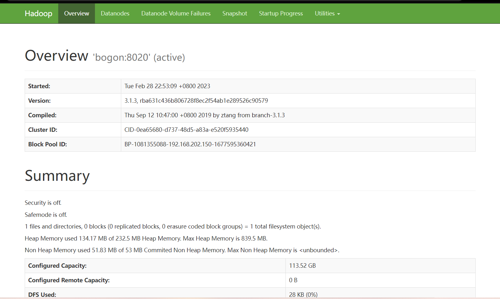


##### 2.1.1.3.2 启动 `yarn`

在`resourceManager` 的节点上执行  `start-yarn.sh`


示例：

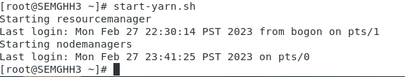


默认为`yarn` 的机器下的  `8088`端口

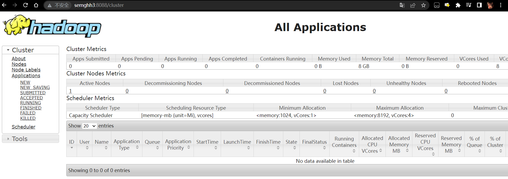


`yarn` 资源调度的页面。


##### 2.1.1.3.3 小测试


