# 1. 正则表达式

参考博客

https://www.cnblogs.com/tannerBG/p/5756892.html

https://www.cnblogs.com/xudong-bupt/p/3586889.html

贪婪模式、非贪婪模式

​		


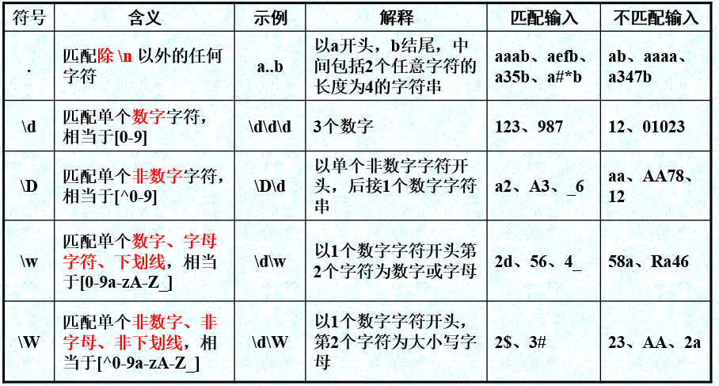


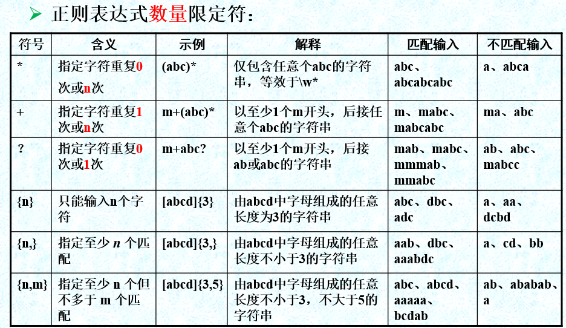

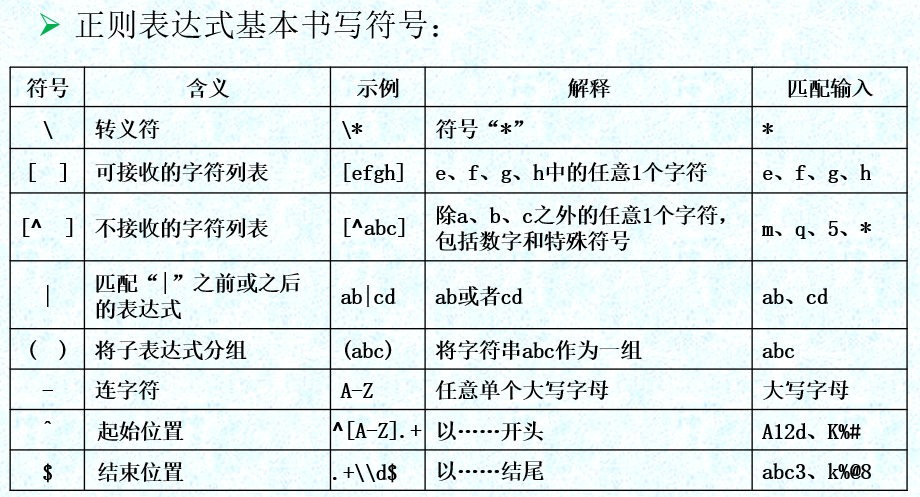


# 2. 注解


## 2.1 元注解


### 2.1.1 什么是元注解？

````
修饰其他注解的注解。
````


有一些注解可以修饰其他注解，这些注解就称为元注解（meta annotation）。

Java标准库已经定义了一些元注解，我们只需要使用元注解，通常不需要自己去编写元注解。

```
例如 @Target @Retention 等
```


### 2.1.2 一些常用的元注解

#### 2.1.2.1@Target

最常用的元注解是`@Target`。


##### 2.1.2.1.1 @Target用来做什么

@Target注解用于标识当前注解可以修饰哪些东西。例如：

```java
@Target({
    ElementType.METHOD,
    ElementType.FIELD
}) //表示被@Target修饰的注解可以用来修饰方法和字段。
```


##### 2.1.2.1.2 @Target 能注解在哪些位置上？

- 类或接口：`ElementType.TYPE`；
- 字段：`ElementType.FIELD`；
- 方法：`ElementType.METHOD`；
- 构造方法：`ElementType.CONSTRUCTOR`；
- 方法参数：`ElementType.PARAMETER`。


```
ElementType定义了 注解都能修饰哪些位置。
```


#### 2.1.2.2@Retention

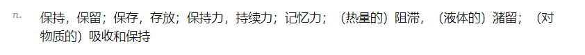

```
通常表示 持久化的意思。 也就是数据持久化到磁盘中
```


##### 2.1.2.2.1 @Retention 是干什么的？

`@Retention`定义了`Annotation`的生命周期：

- 仅编译期：`RetentionPolicy.SOURCE`；
- 仅class文件：`RetentionPolicy.CLASS`；
- 运行期：`RetentionPolicy.RUNTIME`。


```
所谓生命周期，其实就是解释了注解在程序的何时起作用。
```


```
如果`@Retention`不存在，则该`Annotation`默认为`CLASS`。

因为通常我们自定义的`Annotation`都是`RUNTIME`，所以，务必要加上`@Retention(RetentionPolicy.RUNTIME)`这个元注解
```


#### 2.1.2.3  @Inherited

如果一个类用上了@Inherited修饰的注解，那么其子类也会继承这个注解


#### 2.1.2.4  @Repeatable


 JDK8之前不存在可重复注解，即一个注解不能出现在同一个元素(Class、Method、Constructor、Field)2次以上。下面的写法是被禁止的：

```java
// @ComponentScan重复使用
@ComponentScan(basePackages = "com.focuse.component1")
@ComponentScan(basePackages = "com.focuse.component2")
public class RepeatableTest {

}
```


如果想添加多个相同注解，只能用容器注解。容器注解提供了一个数组，来承载多个注解

```java
@ComponentScans(value = { @ComponentScan(basePackages = "com.focuse.component1"),
        @ComponentScan(basePackages = "com.focuse.component2") })
public class RepeatableTest {
    
}
```

jdk8引入了@Repeatable元注解。被@Repeatable修饰的注解即是可重复使用在同一个元素上的。在jdk8中@ComponentScan就被@Repeatable修饰了，这样第一种写法在jdk8中被允许的。


##### 2.1.2.4.1 自定义一个Repeatable注解


```java
@Target({ElementType.METHOD,ElementType.ANNOTATION_TYPE})
@Retention(RetentionPolicy.RUNTIME)
@Repeatable(value = HelloWorldContainer.class)
public @interface HelloWorld {

    public static String KEY = "hello";

    public String name() default KEY;
}
```


```java
@Retention(RetentionPolicy.RUNTIME)
@Target(ElementType.METHOD)
public @interface HelloWorls {
    HelloWorld[] value();
}
```


```java
    @HelloWorlds(value = {@HelloWorld(name = "SEMGHH"), @HelloWorld(name = "青空")})
    public void hello(){

    }

    @HelloWorld(name = "SEMGHH")
    @HelloWorld(name = "yahoo")
    public void hello1(){

    }
//两种方式是等价的，2个@HelloWorld 等价于HelloWorlds(values = {@HelloWolrd(),@HelloWorld()})

@Test
public void testForRepeated() throws NoSuchMethodException {

    Class<LearningSpringTaskApplicationTests> clz = LearningSpringTaskApplicationTests.class;
    Method hello = clz.getMethod("hello");

    HelloWorlds container = hello.getAnnotation(HelloWorlds.class);
    System.out.println(container);

    HelloWorld helloWorld = hello.getAnnotation(HelloWorld.class); //null
    System.out.println(helloWorld);

    System.out.println(hello.getAnnotationsByType(HelloWorld.class)); 


}
```


输出结果：

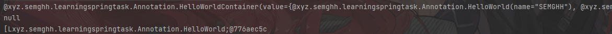


## 2.2 自定义注解

Java支持开发者自定义注解，开发者可以根据自己的需要，定制任何功能的注解。


```java
@Target(ElementType.FIELD)
@Retention(RetentionPolicy.RUNTIME)
public @interface checkValueRange {
    double max() default 100.0;
    double min() default 0.0;
}


//注意,定义的是一个回调函数。 max() min()
```


### 2.2.1处理注解


```
注解只能作为一个标识，注解本身不包含任何业务逻辑，所以需要开发者自己为注解增加逻辑。
```


```
注解本质上也是一个类, 并且 加在某个字段（类、方法）上。
所以处理注解的逻辑是:
通过传入的参数，检查这个参数上是否标有我们想要的指定注解。
如果有，则执行业务逻辑。
```


```
通常,注解的业务逻辑书写会使用反射。

借助于AccessibleObject.isAnnotationPresent(Class<? extends Annocation>)方法来判断某个Class，某个Field，某个Method是否含有指定注解
```


下面是一个注解处理的方法实现。为@checkValueRange 添加一个业务逻辑

```java
public class checkValueRangeMethod {

    public static void checkRange(Person person) throws IllegalArgumentException, IllegalAccessException {
        Field[] fields = person.getClass().getDeclaredFields();
        for (Field f : fields) {
            f.setAccessible(true);
            checkValueRange CVR = f.getAnnotation(checkValueRange.class);
            if (CVR == null) continue;
            double max = CVR.max();
            double min = CVR.min();
            Object o = f.get(person);
            if (o instanceof String) {
                String temp = (String) o;
                if (temp.length() <= max && temp.length() >= min)
                    System.out.println(person.getClass().getName() + "." + f.getName() + "checked out!");
                else
                    throw new IllegalArgumentException(person.getClass().getName() + "." + f.getName() + "                       value doesnt fit Range");
            }
            if (o instanceof Integer) {
                Integer temp = (Integer) o;
                if (temp <= max && temp >= min)
                    System.out.println(person.getClass().getName() + "." + f.getName() + "checked out!");
                else
                    throw new IllegalArgumentException(person.getClass().getName() + "." + f.getName() + "                       value doesnt fit Range");
            }
        }
    }
}

```


## 2.3 一些其他注解


### 2.2.1 @SuppressWarnings

该批注的作用是给编译器一条指令，告诉它对被批注的代码元素内部的某些警告保持静默。（告诉编译器，对被@SuppressWarning 注释的内容，不提示警告）

https://blog.csdn.net/xiaohanzhong/article/details/80886560


### 2.2.2 @HotSpotIntrinsicCandidate

在jdk.internal包下(jdk11)


```
这个注解是HotSpot虚拟机专有的注解.

这个注解只能标注在 Method 或者 constructor上，表示这个方法可能是(不保证一定是)HostspotVM内的方法
```


## 2.4 注解的面试题

### 2.4.1谈谈对 Java 注解的理解，解决了什么问题？

```
JDK5以后的版本支持注解。

注解可以加在  类 方法 变量、甚至是其他注解上。

可以对 类（包括接口比如 函数式接口@FunctionalInterface）、方法(@Override 可以改变虚拟机行为)、变量（@Notnull）、注解(元注解 @Target)进行功能增强、定义行为、满足某种条件、大大减少代码量。

java注解本身并没有任何逻辑。注解的逻辑代码需要额外编写，同时注解逻辑代码的实现过程需要反射的参与。
```


# 3. 枚举 enum


```
枚举类，也是一个Java类。Java类普遍具有的规则，枚举类均试用。

例如: toString() ,构造器，可以拥有成员变量，拥有getter,Setter等，
```


## 3.1 定义一个枚举类

枚举类首行，表示这个枚举类内的实例成员。他们是静态初始化的(这意味着可以在静态上下文中使用这些枚举实例)


枚举类可以定义成员变量和构造器。 那么在首行就必须初始化这个枚举实例。


枚举类可以定义方法。

```java
public enum MyEnum{

        A(Integer.class),B(Long.class),C(Double.class);//一个枚举类包含的所有实例必须都已经初始化完毕。 //代表初始化了3个实例

        private final Class<?> clz;  //成员变量

        private MyEnum(Class<?> clz){ //构造器
            this.clz = clz;
        }

        public static boolean isValid(Class<?> clz){ //类方法,静态方法
            for (MyEnum value : MyEnum.values()) {  //遍历这个枚举类的全部实例
                if (clz==value.clz){
                    return true;
                }
            }
            return false;
        }

        @Override
        public String toString() {                     //重写了 toString方法
            return "这是一个枚举实例 : A \n"+
                	"包含的Clazz是 : "+clz;
        }
    }
```


```java
    public static void main(String[] args) {

        System.out.println(MyEnum.isValid(Float.class));

        MyEnum a = MyEnum.valueOf("A");
        System.out.println(a);

    }
```


## 3.2 枚举类的方法

枚举类有一些特殊方法:

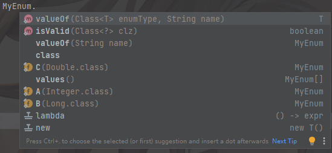


```
valueOf(Class<T> enumType,String name)  // 返回对应的枚举实例。  需要传入枚举类，以及这个实例的名称。
valueOf(String name)  // 返回对应的枚举实例。

values() // 返回这个枚举类,全部的实例
```


```
isValid(Class<?> clz)  //自己定义的类方法
```


## 3.3 使用 == 比较枚举类型

由于枚举类型确保JVM中仅存在一个常量实例，因此我们可以安全地使用 `==` 运算符比较两个变量，如上例所示；此外，`==` 运算符可提供编译时和运行时的安全性。

```java
public class Pizza {
    private PizzaStatus status;
    
    public enum PizzaStatus {
        ORDERED,
        READY,
        DELIVERED;
    }
 
    public boolean isDeliverable() {
        return getStatus() == PizzaStatus.READY;
    }
     
    // Methods that set and get the status variable.
}


```


## 3.4、可以在switch语句中使用枚举类型

```java
public int getDeliveryTimeInDays() {
    switch (status) {
        case ORDERED:
            return 5;
        case READY:
            return 2;
        case DELIVERED:
            return 0;
    }
    return 0;
}
```


## 3.5  EnumSet

```
EnumSet 是一个抽象类,定义在 java.util包下 , 提供了一些与枚举相关的静态方法。


实现了Set接口，支持遍历元素等操作。
```


### 3.5.1 静态方法

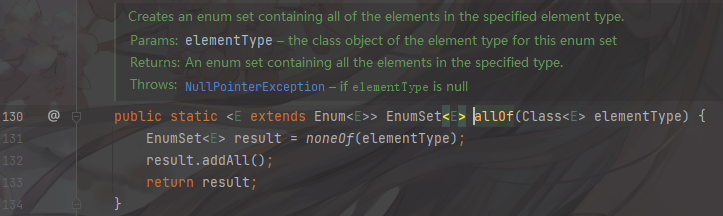


```
返回一个 EnumSet,里面的元素是指定枚举类型的全部实例。
```


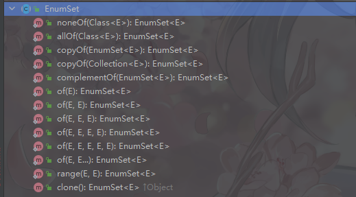


## 3.6. EnumMap


# 5. Java中的代理模式

首先，代理模式是 设计模式的一种。属于结构型，本节重点描述 Java中的代理模式。


代理模式是一种广义上的代理：

```
使用[代理对象]代替[被代理对象]的控制与访问。
```


有时我们 使用代理模式，是出于对 [被代理对象]的保护。

有时是因为不能修改[被代理对象]。

总之，我们使用代理对象来间接访问，都算广义上的代理模式。


## 5.1 在Java中

在Java中的代理模式，通常是希望在不改变[被代理对象]的前提下，实现功能增强。


```
在[代理对象]中实现额外的增强，原本的部分，仍然调用[被代理对象]即可。
```


## 5.2 静态代理

静态代理中，我们对目标对象的每个方法的增强都是手动完成的，非常不灵活。


实际应用场景非常非常少，日常开发几乎看不到使用静态代理的场景。


静态代理实现步骤:

```
1. 定义一个接口及其实现类；
2. 创建一个代理类同样实现这个接口
3. 将目标对象注入进代理类，然后在代理类的对应方法调用目标类中的对应方法。这样的话，我们就可以通过代理类屏蔽对目标对象的访问，并且可以在目标方法执行前后做一些自己想做的事情。
```


## 5.3 动态代理


相比于静态代理来说，动态代理更加灵活。我们不需要针对每个目标类都单独创建一个代理类，并且也不需要我们必须实现接口，我们可以直接代理实现类( *CGLIB 动态代理机制*)。

**从 JVM 角度来说，动态代理是在运行时动态生成类字节码，并加载到 JVM 中的。**


### 5.2.1  JDK 动态代理机制


需要一个被代理接口

```java
public interface SmsService {
    String send(String message);
    void print();
}
```

再需要一个接口实现类

```java
public class SmsServiceImpl implements SmsService{

    @Override
    public String send(String message) {
        System.out.println("send message "+ message);
        return message;
    }

    @Override
    public void print() {
        System.out.println("print message");
    }
}
```

之后需要一个 真正执行被代理类方法的接口

```java
public class myInvocationHandler implements InvocationHandler {
    private Object target;
    myInvocationHandler(Object target) {
        this.targer = target;
    }
    @Override
    public Object invoke(Object proxy, Method method, Object[] args) throws Exception {
        Object result;
        if (method.getName()!="print") {
            System.out.println("前置增强 "+ method.getName());
            result = method.invoke(target,args);
            System.out.println("后置增强 "+method.getName() );
            return  result;
        }
        else {
             result= method.invoke(target,args);
        }
        return result;
    }
}
```

最后需要一个获得  动态代理类的工厂 (jdkProxyfactory)

```java
public class jdkProxyFactory {
    public static Object getProxy(Object target) {
        return Proxy.newInstance(target.getClass().getClassLoader(),
                                target.getClass().getInterfaces(),
                                new myInvocationHandler(target));
        
    }
}
```

主函数如下：

```java
    public static void main(String[] args) {
        SmsService smsService = (SmsService) jdkProxyFactory.getProxy(new SmsServiceImpl());
        smsService.send("hello world!");
        smsService.print();
    }
```


### 5.2.2 CGLIB动态代理


**JDK 动态代理有一个最致命的问题是其只能代理实现了接口的类。**

**为了解决这个问题，我们可以用 CGLIB 动态代理机制来避免。**

1. 定义一个类；
2. 自定义 `MethodInterceptor` 并重写 `intercept` 方法，`intercept` 用于拦截增强被代理类的方法，和 JDK 动态代理中的 `invoke` 方法类似；
3. 通过 `Enhancer` 类的 `create()`创建代理类；

[CGLIB](https://github.com/cglib/cglib)(*Code Generation Library*) 实际是属于一个开源项目，如果你要使用它的话，需要手动添加相关依赖。

```java
<dependency>
  <groupId>cglib</groupId>
  <artifactId>cglib</artifactId>
  <version>3.3.0</version>
</dependency>
```

被代理类

```java
package github.javaguide.dynamicProxy.cglibDynamicProxy;

public class AliSmsService {
    public String send(String message) {
        System.out.println("send message:" + message);
        return message;
    }
}

```

功能增强

```java
import net.sf.cglib.proxy.MethodInterceptor;
import net.sf.cglib.proxy.MethodProxy;

import java.lang.reflect.Method;

/**
 * 自定义MethodInterceptor
 */
public class DebugMethodInterceptor implements MethodInterceptor {


    /**
     * @param o           被代理的对象（需要增强的对象）
     * @param method      被拦截的方法（需要增强的方法）
     * @param args        方法入参
     * @param methodProxy 用于调用原始方法
     */
    @Override
    public Object intercept(Object o, Method method, Object[] args, MethodProxy methodProxy) throws Throwable {
        //调用方法之前，我们可以添加自己的操作
        System.out.println("before method " + method.getName());
        Object object = methodProxy.invokeSuper(o, args);
        //调用方法之后，我们同样可以添加自己的操作
        System.out.println("after method " + method.getName());
        return object;
    }

}

```

获取代理类

```java
import net.sf.cglib.proxy.Enhancer;

public class CglibProxyFactory {

    public static Object getProxy(Class<?> clazz) {
        // 创建动态代理增强类
        Enhancer enhancer = new Enhancer();
        // 设置类加载器
        enhancer.setClassLoader(clazz.getClassLoader());
        // 设置被代理类
        enhancer.setSuperclass(clazz);
        // 设置方法拦截器
        enhancer.setCallback(new DebugMethodInterceptor());
        // 创建代理类
        return enhancer.create();
    }
}

```

主函数

```java
AliSmsService aliSmsService = (AliSmsService) CglibProxyFactory.getProxy(AliSmsService.class);
aliSmsService.send("java");
```


## 5.3 JDK 动态代理和 CGLIB 动态代理对比


`jdk动态代理` 只能代理接口。

`CGLIB` 基于继承，能代理非私有方法，非final类。


# 6. IO模型


## 6.1 Java 中 3 种常见 IO 模型


### BIO (Blocking I/O)

BIO 属于同步阻塞 IO 模型 。 这意味着线程必须阻塞等待IO完成


### NIO (Non-blocking/New I/O)

同步无阻塞。


### AIO (Asynchronous I/O)

AIO 也就是 NIO 2。Java 7 中引入了 NIO 的改进版 NIO 2,它是异步 IO 模型。

异步 IO 是基于事件和回调机制实现的，也就是应用操作之后会直接返回，不会堵塞在那里，当后台处理完成，操作系统会通知相应的线程进行后续的操作。


# 7.集合容器

包含一些集合容器的零碎知识点。


## 7.1 HashMap


### 7.1.1  HashMap 的长度为什么是 2 的幂次方

我们首先可能会想到采用%取余的操作来实现。但是，重点来了：**“取余(%)操作中如果除数是 2 的幂次则等价于与其除数减一的与(&)操作（也就是说 hash%length==hash&(length-1)的前提是 length 是 2 的 n 次方；）。”** 并且 **采用二进制位操作 &，相对于%能够提高运算效率，这就解释了 HashMap 的长度为什么是 2 的幂次方**


## 7.2  ArrayList


### 7.2.1 ArrayList源码+扩容机制分析

在添加大量元素前，应用程序可以使用`ensureCapacity`操作来增加 `ArrayList` 实例的容量。这可以减少递增式再分配的数量。

```java
arrayList.ensureCapacity(50);
```


`ArrayList`继承于 **`AbstractList`** ，实现了 **`List`**, **`RandomAccess`**, **`Cloneable`**, **`java.io.Serializable`** 这些接口。

- `RandomAccess` 是一个标志接口，表明实现这个这个接口的 List 集合是支持**快速随机访问**的。在 `ArrayList` 中，我们即可以通过元素的序号快速获取元素对象，这就是快速随机访问。
- `ArrayList` 实现了 **`Cloneable` 接口** ，即覆盖了函数`clone()`，能被克隆。
  - `ArrayList` 实现了 `java.io.Serializable `接口，这意味着`ArrayList`支持序列化，能通过序列化去传输。


### 7.2.2  Arraylist 和 Vector 的区别?

1. `ArrayList` 是 `List` 的主要实现类，底层使用 `Object[ ]`存储，适用于频繁的查找工作，线程不安全 ；
2. `Vector` 是 `List` 的古老实现类，底层使用 `Object[ ]`存储，**线程安全**的。


# 8. 反射

指 `java.lang.reflect` 包下的内容


## 8.1 反射包下的类


### 8.1.1  Class

直译类。代指任意的Java类，无论是JDK官方，还是开发者自定义的任何类。


#### 8.1.1.1 常用方法


几乎全部见名知意。


```
clz.getFields(); //获得全部非私有字段
```


```
获得私有的方法，字段，注解等
```


```
isAnnotationPresent(Class<? extend Annocation>) 
```


### 8.1.2 Field

直译就是字段。代指一个Java类下的任意的字段。


### 8.1.3 Method

直译：方法，代指任意的一个方法。

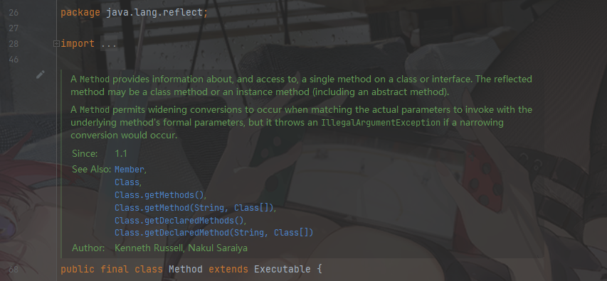


```
这是一个 final 类 ,继承自 Executable 可执行。


一个 Method对象，提供了类或者接口中的某个方法的  信息，访问方式。

一个可反射的方法，可能时是类方法或实例方法。 （这意味着static 和 非 static 方法都可以被反射到） 甚至包括抽象方法
```


#### 8.1.3.1 类方法


### 8.1.4 Parameter

代表一个参数。

所在包：

```
package java.lang.reflect;
```


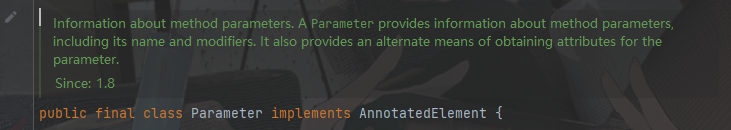


```
实现了 注解元素接口。 这个类代表了方法的参数信息。 一个Parameter对象可以提供关于这个方法的参数信息，包括名字和修饰符。
```


#### 8.1.4.1 方法


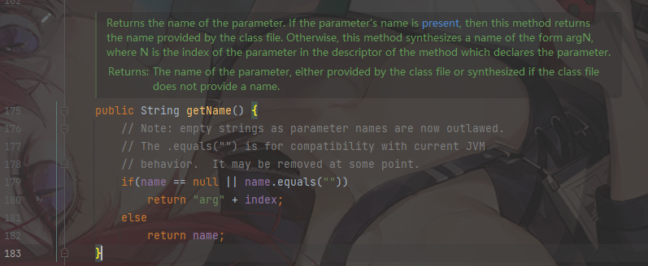


```java
String getName();
//返回这个参数的名字。 如果名字不存在，则使用 arg+参数的索引位置代替
```


### 8.1.5  Type

类型。 它是一个接口。 在Java语言中，`Type` 接口是所有种类的 通用超类接口。 

所有种类 包括但不限于：  原生类型(raw types , e.g. int double) ，数组类型，参数类型，类型变量。


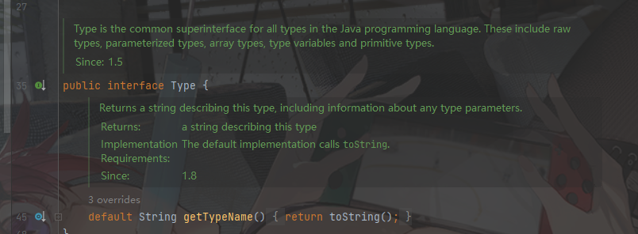


```
返回这个类型的名字
```


### 8.1.6 * AnnotatedElement

注解的元素 ，接口。

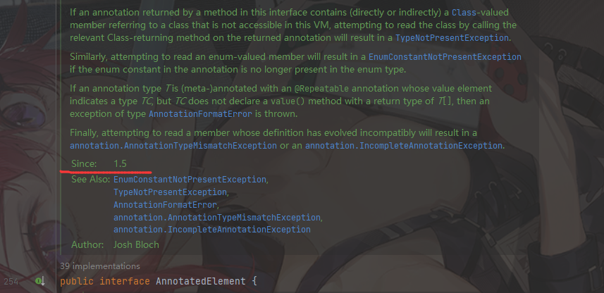

JDK1.5以后加入的接口。在 `java.lang.reflect` 包下


```
这个类代表了运行在当前VM上的一个 注解元素。
这个接口让注解可以以反射的方式读取。

这个接口内所有方法返回的注解都是 不可变的，可序列化的。
这个接口内所有返回的数组，开发者可以随意改变。不会影响其他调用
```


#### 8.1.6.1  AnnotatedElement

这仍然是一个接口。在`java.lang.annotation` 包下

```
这个接口代表了一个注解。所有的注解都继承实现了这个接口。
```


##### 8.1.6.1.1 接口内方法

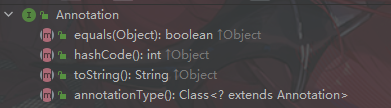


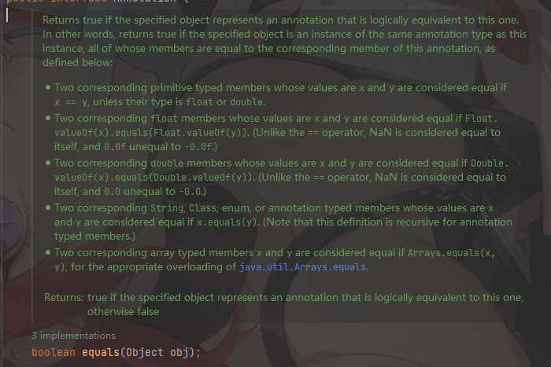

```java
boolean equals(Object obj);

//如果传入的Obj 逻辑上和AnnotationElement代表的注解是同一个，就返回true

```


```
返回这个注解对应的Class类
```


#### 8.1.6.2  AnnotatedElement接口方法


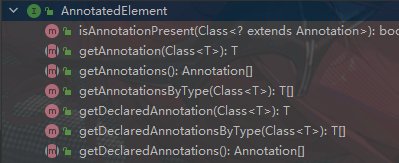


##### 8.1.6.2.1 重要概念

AnnotationElement 可以看作一些注解的容器。这个容器提供了一些返回对应注解的方法。

返回的注解有以下四种类别

```java
 directly present   ： 直接存在
 
// 如果一个元素E拥有一个 RuntimeVisibleAnnotations/RuntimeVisibleParameterAnnotations/
// RuntimeVisibleTypeAnnotations 属性，同时这些属性包含注解A。 那么注解A被认为是直接存在。
 
 
 indirectly present ： 间接存在
 //对于一个注解A,如果有一个元素E拥有一个 RuntimeVisibleAnnotations/RuntimeVisibleParameterAnnotations/
 RuntimeVisibleTypeAnnotations 属性，同时注解A的是可重复注解。存在一个明确的注解的值包含A，以及包含A注解的种类。那么A注解是间接注解。
 //一句话 "间接修饰"注解就是指得容器注解的数组中指定的注解是这个元素的 间接注解；
 
 
 present            ： 存在
 //如下满足其一就是 present
 // 1. 注解A直接修饰元素E,那么 注解A是元素E的present
//  2. 注解A并没有直接修饰元素E ，元素E是一个类，注解A直接修饰元素E的超类,那么注解A仍是E的 present
     
     
 associated         ： 关联
//满足其一就是 associated
// 1. 注解A直接或间接修饰 元素E ，那么注解A就是关联
// 2. 注解A直接或间接修饰 元素E的超类, 那么注解A就是关联
```


AnnotationElement 提供的方法，返回的注解类型如下表

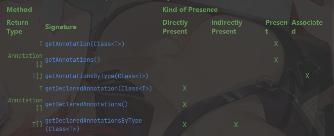


```
getAnnotation(Class<T>) 返回的是 present，也就是 直接修饰本类和超类的注解。

getAnnotations()        返回的也是present,同样

getAnnotationsByType(Class<T>)  返回的是关联， 这意味着  直接/间接修饰 本类/超类的注解都算。
```


##### 8.1.6.2.2 具体接口方法


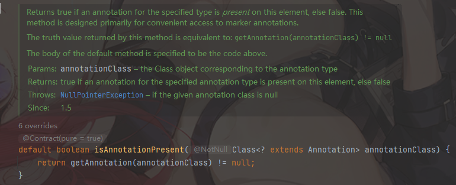


```java
boolean isAnnotationPresent(Class<? extends Annotation> annotationClass);

//传入一个 Class对象，这个对象是Annotation的子类
//如果这个 Annotation类 存在在当前 AnnotationElement元素中，则返回true否则返回false

```


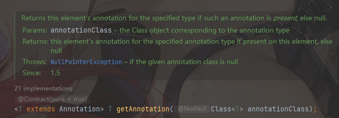


````java
<T extends Annotation> T getAnnotation(Class<T> annotationClass);

//如果当前Element中存在指定的注解，直接返回。如果不存在返回false
````


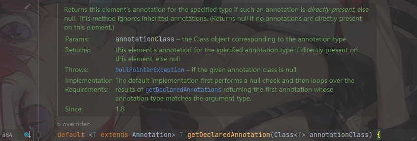


```java
default <T extends Annotation> T getDeclaredAnnotation(Class<T> annotationClass) ;

//获得这个元素直接存在的注解。如果不存在则返回null

```


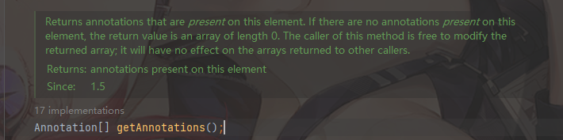


```java
Annotation[] getAnnotations();
//返回当前Element表示的全部的 Annotation。
//如果当前元素不存在任何Annotation，则返回的数组长度为0
```


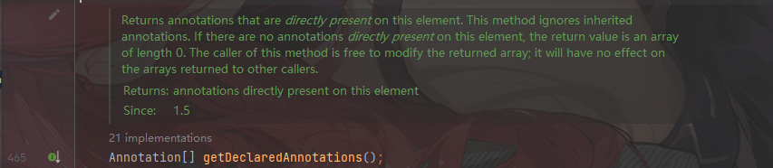

```java
Annotation[] getDeclaredAnnotations();

//返回 ELement 直接代表的注解。
//这个方法忽略了继承注解。
```


## 8.2  Declared系列

在反射中，通常都会有 DeclaredField,Field 对应

DeclaredMethod ，和 Method 对应

DeclaredConstructor 和 Constructor 对应。


getFields() ,getMethod(),getConstructor() 只能获取public 的方法。并且可以访问从其他类获取来的方法。

Declared系列无关访问权限，直接获得当前Class文件中定义的内容。（当前Class文件中定义的， 这意味着无法获得继承来的内容）


### 8.2.1 测试


```java
public class A {
    public static final String name = "A";
    public int sum(int a,int b){
        return a+b;
    }
    public int sub(int a,int b){
        return a-b;
    }
    protected void myProtected(){}
    private void myPrivate(){}
}
```

B类继承A类, AB在同一个包下

```java
public class B extends A{

}
```

测试方法

```java
    @Test
    public void testForMethod(){

        Class<A> aClz = A.class;
        Class<B> bClz = B.class;

        try {
            Method myProtected = bClz.getMethod("myProtected");
        } catch (NoSuchMethodException e) {
            System.out.println("B 无法获得 protected");
        }

        try {
            Field privateName = bClz.getField("privateName");
        } catch (NoSuchFieldException e) {
            System.out.println("B 无法获得 private");
        }
    }
```


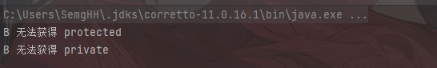


# 9.中间件

什么是中间件？

事实上Web上常说的中间件，都是用于完成某一特定领域内容的特定软件。

例如：完成消息解耦，消息传递的中间件，消息队列。（消息中间件）

​			完成缓存存储的（缓存中间件）


## 9.1 消息队列


### 9.1.1 什么是消息队列


消息（Message）是指在应用之间传送的数据，消息可以非常简单，比如只包含文本字符串，也可以更复杂，可能包含嵌入对象。

消息队列（Message Queue）是一种应用间的通信方式，消息发送后可以立即返回，由消息系统来确保信息的可靠专递。

消息发布者只管把消息发布到MQ中而不管谁来取，消息使用者只管从MQ中取消息而不管谁发布的

```
这意味着，消费者和服务者，完全不需要关心对方是谁。消息具体从何处来，只需要生产消息存放到固定的队列中/到固定的消息队列中获取消息消费即可。
这就是达成了消息解耦。 
```


### 9.1.2 为何使用消息队列


从上面描述中可以看出消息队列是一种应用间的异步协作机制，那什么时候需要使用MQ呢？

以常见的订单系统为例子，用户点击【下单】按钮后的业务逻辑包括：扣减库存、生成相应的单据、发红包、发短信通知‘在业务发展初期这些逻辑可能放在一起同步执行，随着业务订单量增长，需要提升系统服务的性能，这时候可以**将一些不需要立即生效的操作拆分出来异步执行**，比如发红包、发短信通知等。这种场景就可以用MQ，在下单的主流程（比如扣减库存、生成相应的单据）完成之后发送一条消息到MQ让主流程快速完结，而由另外的单独线程拉取MQ的消息（或者由MQ推送消息），当发现MQ中有发红包或者发短信之类的消息，执行相应的业务逻辑。
以上是用于**业务解耦**的情况，其他常见场景包括最终一致性、广播、错峰流控等等。


```
最终一致性： 由消息队列消费消息来做补偿。最终达到一致性

错峰流控： 削峰填谷经典操作
```


### 9.1.3 常见MQ


#### 9.1.3.1RabbitMQ

RabbitMQ是一个由Erlang语言开发的AMQP的开源实现。
AMQP：Advanced Meassage Queue，高级消息队列协议。它是应用层协议的一个**开放标准**，为面向消息的中间设计，基于此协议的客户端与消息中间件可传递消息，并不受产品、开发语言等条件限制。

##### RabbitMQ的特点

##### 可靠性（Reliablitity）

RabbitMQ 使用一些机制来保证可靠性，如持久化、传输确认、发布确认。

##### 灵活的路由（Flexible Routing）

在消息进入队列之前，通过 Exchange 来路由消息的。对于典型的路由功能，RabbitMQ 已经提供了一些内置的 Exchange 来实现。针对更复杂的路由功能，可以将多个 Exchange 绑定在一起，也通过插件机制实现自己的 Exchange 。

##### 消息集群（Clustering）

多个 RabbitMQ 服务器可以组成一个集群，形成一个逻辑 Broker 。

##### 高可用（Highly Available Queues）

队列可以在集群中的机器上进行**镜像**，使得**在部分节点出问题**的情况下队列**仍然可用**。

##### 多种协议（Multi-protocol）

RabbitMQ 支持多种消息队列**协议**，比如 STOMP、MQTT 等等。

##### 多语言客户端（Many Clients）

RabbitMQ 几乎支持所有常用语言，比如 Java、.NET、Ruby 等等。

##### 管理界面（Management UI）

RabbitMQ 提供了一个易用的用户界面，使得用户可以监控和管理消息 Broker 的许多方面。

##### 跟踪机制（Tracing）

如果消息异常，RabbitMQ 提供了消息跟踪机制，使用者可以找出发生了什么。

##### 插件机制（Plugin System）

RabbitMQ 提供了许多插件，来从多方面进行扩展，也可以编写自己的插件。


#### 9.1.3.2 kafka


### 四、消息队列的应用及好处

#### （1）提高系统响应速度

使用消息队列，生产者一方，把消息往消息队列里一扔，就可以立马返回响应用户，无需等待处理结果

#### （2）保证消息的传递

如果发送消息时接收者不可用，消息队列会保留消息，直到成功的传递它

#### （3）**解耦**

只要信息格式不变，即使接收者的接口、位置、或者配置改变，也不会给发送者带来任何改变
**消息发送者无需知道消息接收者是谁**，使得系统设计更清晰

### 五、分布式 消息队列  的优点

#### （1）多系统协作需要分布式

例如消息队列的数据需要在多个系统之间共享，所以需要提供分布式通信机制、协同机制

#### （2）可靠

消息会被持久化到分布式存储中，这样避免了单台机器存储的消息由于机器问题导致消息丢失

#### （3）可扩展

分布式消息队列，会随着访问量的增加而方便的增加处理服务器


# 10.分布式系统 扫盲


## 10.1.一些分布式系统 名词及解释


### 响应时间（Response time）

```
2-5-8原则：（据统计当网站慢一秒就会流失十分之一的客户）

  当用户再2-5秒之间得到响应时，会感觉系统的响应速度还可以；

  当用户再5-8秒内得到响应时，感觉蛮，但是还可以接受；

  当用户大于8秒内得到响应时，感觉无法接受；
```


### 吞吐量（Throughput）

```
 指的是在单位时间内客户端和服务器成功传送数据的数量；
```


### 资源使用率（Resource utilization）

```
  常见的有：cpu占用率、内存使用率、磁盘I/O、网络I/O；
```


### 每秒点击数（Hits per Second）

```
  客户端每秒向服务器提交的请求数量，如果客户端发出的请求数量越多，与之相对的平均吞吐量也应该越大；
```


### 并发用户数（Concurrent users）

```
  客户端的同一批用户同时执行一个操作的数量。
```


## 10.2  java后台技术


## 10.3 技术名词解释

### 10.3.1分布式和集群

分布式和集群在通常情况下不做严格区分，正如同并发和并行一样，应用情况下很少会去考究它的区别，许多大公司面试也直接问分布式集群怎样怎样，一般都拿等同来讲了。在这里只在概念上做一下区别，使大家更合理的去理解，没有对错之分。

分布式：一个电商系统，用户模块部署在server1, 订单模块部署在server2, 促销模块部署在server3, 商品模块部署在server4，他们之间通过远程rpc实现服务调用，这就叫分布式。强调的是不同功能模块，单独部署在不同的server上，所有server加起来是一个完整的系统。**（不用的模块部署在不同的服务端上）**


集群：更多强调的是灾备，一个电商系统，完整的部署在server1上一个，完成的部署在server2上一个，server1宕机后，server2仍然可以正常提供请求服务，这叫集群。同样对于某一功能模块，比如用户模块部署在server1上，同样部署在server2上，也叫做集群。分布式系统的每个功能模块节点，都可以用多机做成集群。**（相同的模块部署在不用的服务器上，服务器之间可以通过代理对资源合理分配）**

抽象问题具体化：拿做菜示例，假如一个厨师做菜要经历切菜，炒菜两个功能，饭店为了提高速度招了两个厨师，每个厨师的工作一样，都是切菜，炒菜，这是集群。还有另一种方法提高效率，饭店招了一个切菜师傅，配合厨师，厨师不管切菜，只管炒菜了，和切菜师傅共同配合把菜做好，这叫分布式。


### 10.3.2 Nginx

作用是**反向代理**和**负载均衡**。

**反向代理**是指请求真实是到server1的，但是系统中为了统一或者做比如单点登录，会在server2服务器上安装一个nginx，里面配置到server1的反向代理，那么之后请求url就可以写server2的地址，发出后到server2, server2会转发到server1上，类似一种代理的模式。

**负载均衡**是指如果一个系统的请求很多，我们可以把请求转发到不同的服务器上，用来分流。就类似于接了一个水管放水，水流量很大时候，水压大很可能会让一个水管爆炸，这时候接三个水管，就没问题了（这三个水管就是一个集群）。类似的在nginx服务器中配了3个tomcat服务器，每个tomcat服务器上都部署了整个系统，那么当请求数大的时候，可以分发到不同的tomcat。（其实这里每个tomcat上部署同一个功能模块也叫集群）


### 10.3.3 Java 在分布式下的通信

RPC（Remote Procedure Call） 远程过程调用


#### 10.3.3.1 什么是RPC？

- 简单的理解是一个节点请求另一个节点提供的服务

- **本地过程调用**：如果需要将本地student对象的age+1，可以实现一个addAge()方法，将student对象传入，对年龄进行更新之后返回即可，本地方法调用的函数体通过函数指针来指定。

  **远程过程调用**：上述操作的过程中，如果addAge()这个方法在服务端，执行函数的函数体在远程机器上，**如何告诉机器需要调用这个方法呢？**

**1.**首先客户端需要告诉服务器，需要调用的函数。这里函数和进程ID存在一个映射，客户端远程调用时，需要查一下函数，找到对应的ID，然后执行函数的代码。

**2.**客户端需要把本地参数传给远程函数，本地调用的过程中，直接压栈即可，但是在远程调用过程中不再同一个内存里，无法直接传递函数的参数，因此需要客户端把参数转换成字节流，传给服务端，然后服务端将字节流转换成自身能读取的格式，是一**个序列化和反序列化的过程。**
 **3.**数据准备好了之后，如何进行传输？网络传输层需要把调用的ID和序列化后的参数传给服务端，然后把计算好的结果序列化传给客户端，因此TCP层即可完成上述过程


# 11. Redis  扫盲


## 11.1 关系型数据库 / 非关系型数据库 

关系型数据库： `MySQL`   `Oracle`


非关系型数据库 又称 (NoSQL) ,  例如 `Redis`  `MongoDB` ``


### 11.1.1性能

​		NOSQL是**基于键值对**的，可以想象成表中的主键和值的对应关系，而且不需要经过SQL层的解析，所以性能非常高。

### 11.1.2 可扩展性

​		同样也是因为基于键值对，**数据之间没有耦合性**，所以**非常容易水平扩展**。


## 11.2 关系型数据库的优势


**复杂查询**
可以用SQL语句方便的在一个表以及多个表之间做非常复杂的数据查询。
**事务支持**
使得对于安全性能很高的数据访问要求得以实现。


**对于这两类数据库，对方的优势就是自己的弱势，反之亦然。**


## 11.3 Redis 是什么？

Redis本质上是一种键值数据库。

主工作线程是单线程的，保证了其操作的原子性。

支持多种数据结构。

也可以实现持久化，还能实现集群和高可用。 被广泛应用在WEB技术中。


## 11.4 Redis用来做什么？


Redis通常用于做缓存，它还能实现，消息队列，分布式锁等高级功能。


## 11.5 Redis的优点


性能极高 ， 基于内存，同时对不同场景下的数据结构进行了优化。


丰富的数据类型 ，  Redis支持二进制案例的 Strings, Lists, Hashes, Sets 及 Ordered Sets 数据类型操作。

原子性 ，    Redis的所有操作都是原子性的，同时Redis还支持对几个操作全并后的原子性执行。


丰富的特性 – Redis还支持 publish/subscribe, 通知, key 过期等等特性。


## 11.6 Redis的缺点


是数据库容量受到物理内存的限制,不能用作海量数据的高性能读写,因此Redis适合的场景主要局限在较小数据量的高性能操作和运算上。


 总结： Redis受限于特定的场景，专注于特定的领域之下，速度相当之快。


# 11.网络编程

参考自廖雪峰博客。


## 11.1.网络编程基础

### 11.1.1 IP地址

在互联网中，一个IP地址用于唯一标识一个网络接口（Network Interface）。一台联入互联网的计算机肯定有一个IP地址，但也可能有多个IP地址。

ipv4

ipv6

IP地址分为IPv4和IPv6两种。IPv4采用32位地址，类似`101.202.99.12`，而IPv6采用128位地址，类似`2001:0DA8:100A:0000:0000:1020:F2F3:1428`。IPv4地址总共有2^32个（大约42亿），而IPv6地址则总共有2^128个（大约340万亿亿亿亿），IPv4的地址目前已耗尽，而IPv6的地址是根本用不完的。


IP地址又分为公网IP地址和内网IP地址。公网IP地址可以直接被访问，内网IP地址只能在内网访问。内网IP地址类似于：

- 192.168.x.x
- 10.x.x.x

有一个特殊的IP地址，称之为本机地址，它总是`127.0.0.1`


IPv4地址实际上是一个32位（bit）（2进制）整数。例如：

```ascii
106717964 = 0x65ca630c              //0x 表16位
          = 65  ca  63 0c      //  6*16+5=101 12*16+10=202
          = 101.202.99.12     //6*16+3=99      0*16+12=12
```

如果一台计算机只有一个网卡，并且接入了网络，那么，它有一个本机地址`127.0.0.1`，还有一个IP地址，例如`101.202.99.12`，可以通过这个IP地址接入网络。

如果一台计算机有两块网卡，那么除了本机地址，它可以有两个IP地址，可以分别接入两个网络。


### 2. 网络号+主机号=Ip地址

Ip地址有两部分组成：网络号  和 主机号；ipv4 2进制位一共32位；

 当分配给主机号的2二进制位更多，表示同一个网络中，能标识的主机就多。当分配给网络号更多的2进制位，能标识的网络数更多。

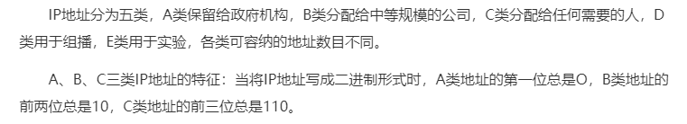


当给定一个 Ip地址，我们可以通过子网掩码确定这个ip地址的网络号和 主机号

子网掩码的作用就是将  某个Ip地址划分成网络地址和主机地址两部分


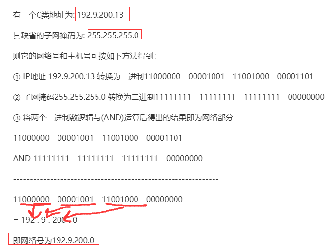


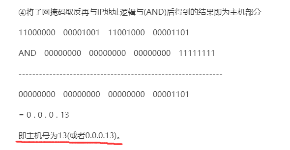

简便方法：如果是255的都是网络号部分，0的为主机号部分  仅限于子网掩码是255和0这种情况


子网掩码 转化二进制后  1对应的为网络号 0对应的为主机号；

广播地址 ：转化二进制后，主机号全为1的，为广播地址


### 3.网络号

如果两台计算机位于同一个网络，那么他们之间**可以直接通信**，因为他们的**IP地址前段是相同**的，也就是**网络号是相同的**。网络号是IP地址通过子网掩码过滤后得到的。例如：

某台计算机的IP是`101.202.99.2`，子网掩码是`255.255.255.0`，那么计算该计算机的网络号是：

```
IP = 101.202.99.2
Mask = 255.255.255.0
Network = IP & Mask = 101.202.99.0   //&与操作    255：全是1  0：全是0
                                     //和1与，原来是1还是1，原来是0还是0 =》保持不变
                                     //和0与，原来是0或1，最终都是0。  =》全是0
                                     //对于子网掩码来说，255的都不变，0的都为0
```

每台计算机都需要正确配置**IP地址**和子网掩码，根据这两个就可以计算网络号，如果两台计算机计算出的网络号相同，说明两台计算机在同一个网络，**可以直接通信**。

如果两台计算机计算出的**网络号不同**，那么两台计算机不在同一个网络，**不能直接通信**，它们之间必须通过**路由器**或者**交换机**这样的网络设备间接通信，**我们把这种设备称为网关。**


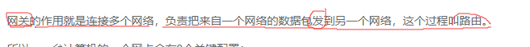


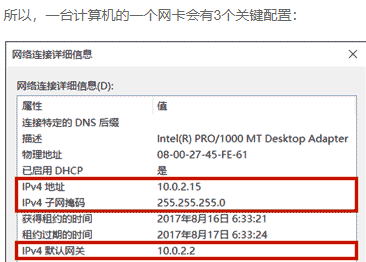

### 4.域名

因为直接记忆IP地址非常困难，所以我们通常使用域名访问某个特定的服务。


域名解析服务器DNS负责把域名翻译成对应的IP，客户端再根据IP地址访问服务器。

有一个特殊的本机域名`localhost`，它对应的IP地址总是本机地址`127.0.0.1`。


### 6.常用协议

IP协议是一个分组交换，它不保证可靠传输。

TCP协议是传输控制协议，它是面向连接的协议，支持可靠传输和双向通信。TCP协议是建立在IP协议之上的。


简单地说：IP协议只负责发数据包，不保证顺序和正确性，而TCP协议负责控制数据包传输，它在传输数据之前需要先建立连接，建立连接后才能传输数据，传输完后还需要断开连接。


TCP协议之所以能保证数据的可靠传输，是通过接收确认、超时重传这些机制实现的。并且，TCP协议允许双向通信，即通信双方可以同时发送和接收数据。


## 11.2. TCP编程


### 1.socket

在开发网络应用程序的时候，我们又会遇到Socket这个概念。Socket是一个抽象概念，一个应用程序通过一个Socket来建立一个远程连接，而Socket内部通过TCP/IP协议把数据传输到网络：

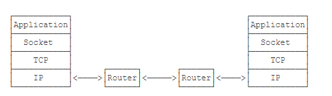

Socket、TCP和部分IP的功能都是由操作系统提供的，不同的编程语言只是提供了对操作系统调用的简单的封装。例如，Java提供的几个Socket相关的类就封装了操作系统提供的接口。

为什么需要Socket进行网络通信？因为仅仅通过IP地址进行通信是不够的，同一台计算机同一时间会运行多个网络应用程序，例如浏览器、QQ、邮件客户端等。当操作系统接收到一个数据包的时候，如果只有IP地址，它没法判断应该发给哪个应用程序，**所以，操作系统抽象出Socket接口，每个应用程序需要各自对应到不同的Socket，数据包才能根据Socket正确地发到对应的应用程序。**


一个Socket就是由IP地址和端口号（范围是0～65535）组成，可以把Socket简单理解为IP地址加端口号。端口号总是由操作系统分配，它是一个0～65535之间的数字，其中，小于1024的端口属于*特权端口*，需要管理员权限，大于1024的端口可以由任意用户的应用程序打开。

### 2.socket 分配规则

（1）公认端口（Well Known Ports）：0-1023之间的端口号，也叫Well Known ports。这些端口由 IANA 分配管理。IANA 把这些端口分配给最重要的一些应用程序，让所有的用户都知道，当一种新的应用程序出现后，IANA必须为它指派一个公认端口。

常用的公认端口有：

- FTP : 21
- TELNET : 23
- SMTP : 25
- DNS : 53
- TFTP : 69
- HTTP : 80
- SNMP : 161

————————————————

（2）注册端口（Registered Ports）：从1024-49151。是公司和其他用户向互联网名称与数字地址分配机构（ICANN）登记的端口号，利用因特网的传输控制协议（TCP）和用户数据报协议（UDP）进行通信的应用软件需要使用这些端口。在大多数情况下，这些应用软件和普通程序一样可以被非特权用户打开。
————————————————
（3）客户端使用的端口号：49152~65535.这类端口号仅在客户进程运行时才动态选择，因此又叫做**短暂端口号**。被保留给客户端进程选择暂时使用的。也可以理解为，客户端启动的时候操作系统随机分配一个端口用来和服务器通信，客户端进程关闭下次打开时，又重新分配一个新的端口。

### 3. socket 编程

使用Socket进行网络编程时，本质上就是两个进程之间的网络通信。其中一个进程必须充当服务器端，它会主动监听某个指定的端口，另一个进程必须充当客户端，它必须主动连接服务器的IP地址和指定端口，如果连接成功，服务器端和客户端就成功地建立了一个**TCP连接**，双方后续就可以随时发送和接收数据。


因此，当Socket连接成功地在服务器端和客户端之间建立后：

- 服务器端的Socket是指定的IP地址和指定的端口号；
- 客户端的Socket是它（客户端程序）所在计算机的IP地址（客户可能来自其他计算机）和一个由操作系统分配的随机端口号。


#### 1.服务器端

要使用Socket编程，我们首先要编写服务器端程序。Java标准库提供了`ServerSocket`来实现对指定IP和指定端口的监听。`ServerSocket`的典型实现代码如下：

```java
public class Server {

    public static void main(String[] args) throws IOException {

        ServerSocket serverSocket = new ServerSocket(10086);
        System.out.println("server Socket create success! working...");

        while (true){
            Socket socket = serverSocket.accept();
            SocketAddress remoteSocketAddress = socket.getRemoteSocketAddress();
            System.out.println(" Connected from "+ remoteSocketAddress);
            MyThread myThread = new MyThread(socket);
            myThread.start();
        }
    }


    static private class MyThread extends Thread {
        private Socket socket;

        public MyThread(Socket socket) {
            this.socket = socket;
        }

        @Override
        public void run() {

            try {
                InputStream inputStream = socket.getInputStream();
                OutputStream outputStream = socket.getOutputStream();
                Handler(inputStream,outputStream);

            } catch (IOException ioException) {
                ioException.printStackTrace();
            }
            System.out.println("MyThread destroy...");

        }
    }

    private static void Handler(InputStream inputStream,OutputStream outputStream) {
        try {
            BufferedWriter writer = new BufferedWriter(new OutputStreamWriter(outputStream, "UTF-8"));
            BufferedReader reader = new BufferedReader(new InputStreamReader(inputStream, "UTF-8"));
            writer.write("hello\n");
            writer.flush();
            while (true){
                String s =reader.readLine();
                if (s.equals("bye")){
                    writer.write("bye\n");
                    writer.flush();
                    break;
                }
                writer.write(s+"\n");
                writer.flush();
            }

        } catch (UnsupportedEncodingException e) {
            e.printStackTrace();
        } catch (IOException ioException) {
            ioException.printStackTrace();
            System.out.println("Client Connection missing");
        }
        System.out.println("Handler destroy...");

    }

}
```


注意到代码`ss.accept()`表示每当有新的客户端连接进来后，就返回一个`Socket`实例，这个`Socket`实例就是用来和刚连接的客户端进行通信的。由于客户端很多，要实现并发处理，我们就必须为每个新的`Socket`创建一个新线程来处理，这样，主线程的作用就是接收新的连接，每当收到新连接后，就创建一个新线程进行处理。

我们在多线程编程的章节中介绍过线程池，这里也完全可以利用线程池来处理客户端连接，能大大提高运行效率。

如果没有客户端连接进来，`accept()`方法**会阻塞并一直等待**。如果有多个客户端同时连接进来，`ServerSocket`会把连接扔到队列里，然后一个一个处理。对于Java程序而言，只需要通过循环不断调用`accept()`就可以获取新的连接。

#### 2.客户端

```java
public class Client {
    static String ServerAddress;
    public static void main(String[] args) throws IOException {
        new ClientThread().start();
    }

    private static void Handler(InputStream inputStream, OutputStream outputStream) throws IOException {
        BufferedWriter writer = new BufferedWriter(new OutputStreamWriter(outputStream, "UTF-8"));
        BufferedReader reader = new BufferedReader(new InputStreamReader(inputStream, "UTF-8"));
        Scanner scanner = new Scanner(System.in);
        System.out.println("["+ServerAddress+"] : "+reader.readLine());
        while (true){
            System.out.print(">>> : ");
            String s = scanner.nextLine();
            writer.write(s);
            writer.newLine();
            writer.flush();
            String resp = reader.readLine();
            System.out.println("["+ServerAddress+"] : " +resp);
            if (resp.equals("bye")){
                break;
            }
        }

    }

    private static class ClientThread extends Thread {
        @Override
        public void run() {
            Socket socket = null;
            try {
                socket = new Socket("localhost",10086);
                SocketAddress remoteSocketAddress = socket.getRemoteSocketAddress();
                ServerAddress=remoteSocketAddress.toString();
                InputStream inputStream = socket.getInputStream();
                OutputStream outputStream = socket.getOutputStream();
                Handler(inputStream,outputStream);
                socket.close();
                System.out.println("Client closed");
            } catch (IOException ioException) {
                ioException.printStackTrace();
            }
        }
    }
}
```

运行后控制台：

客户端：

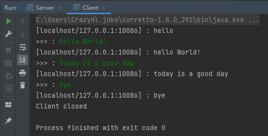

服务器端：

​	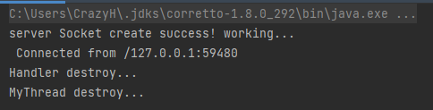


#### 3. Socket流

当Socket连接创建成功后，无论是服务器端，还是客户端，我们都使用`Socket`实例进行网络通信。因为TCP是一种基于流的协议，因此，Java标准库使用`InputStream`和`OutputStream`来封装Socket的数据流，这样我们使用Socket的流，和普通IO流类似：

```java
// 用于读取网络数据:
InputStream in = sock.getInputStream();
// 用于写入网络数据:
OutputStream out = sock.getOutputStream();
```

最后我们重点来看看，为什么写入网络数据时，要调用`flush()`方法。

如果不调用`flush()`，我们很可能会发现，客户端和服务器都收不到数据，这并不是Java标准库的设计问题，而是我们以流的形式写入数据的时候，并不是一写入就立刻发送到网络，而是先写入内存缓冲区，直到缓冲区满了以后，才会一次性真正发送到网络，这样设计的目的是为了提高传输效率。如果缓冲区的数据很少，而我们又想强制把这些数据发送到网络，就必须调用`flush()`强制把缓冲区数据发送出去。


tips:

由于TCP是面向连接的协议，当我们强制关闭客户端，没有用“bye”退出客户端时，不会关闭该TCP连接。

服务器端仍会对socket流读写，就会抛出 java.net.SocketException: Connection reset 异常。

```java
java.net.SocketException: Connection reset
	at java.net.SocketInputStream.read(SocketInputStream.java:210)
	at java.net.SocketInputStream.read(SocketInputStream.java:141)
	at sun.nio.cs.StreamDecoder.readBytes(StreamDecoder.java:284)
	at sun.nio.cs.StreamDecoder.implRead(StreamDecoder.java:326)
	at sun.nio.cs.StreamDecoder.read(StreamDecoder.java:178)
	at java.io.InputStreamReader.read(InputStreamReader.java:184)
	at java.io.BufferedReader.fill(BufferedReader.java:161)
	at java.io.BufferedReader.readLine(BufferedReader.java:324)
	at java.io.BufferedReader.readLine(BufferedReader.java:389)
	at Server.Handler(Server.java:57)
	at Server.access$000(Server.java:10)
	at Server$MyThread.run(Server.java:40）
```

所以，我们可以这样做：

```java
        catch (IOException ioException) {
            if (ioException.getMessage().equals("Connection reset")){ //如果捕获到的IO异常是
                System.out.println("Client connection missing");      //Connection reset
            }else                                                     //那么输出missing
                ioException.printStackTrace();                        //否则，正常抛异常
        }
```


## 11.3.发送Email


使用Java程序也可以收发电子邮件。我们先来看一下传统的邮件是如何发送的。

传统的邮件是通过邮局投递，然后从一个邮局到另一个邮局，最终到达用户的邮箱：

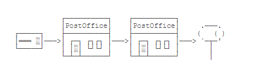

电子邮件的发送过程也是类似的，只不过是电子邮件是从用户电脑的邮件软件，例如Outlook，发送到**邮件服务器**上，可能经过**若干**个邮件服务器的中转，最终到达对方邮件服务器上，收件方就可以用软件接收邮件


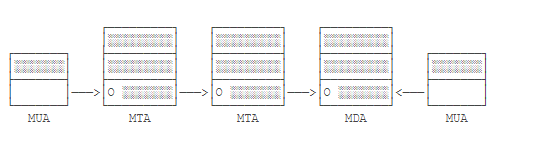

我们把类似Outlook这样的邮件软件称为 `MUA`


```
MUA：Mail User Agent，用户服务的邮件代理

邮件服务器称为:

MTA：Mail Transfer Agent 邮件中转的代理
```


最终到达的邮件服务器称为MDA：Mail Delivery Agent，意思是邮件到达的代理。电子邮件一旦到达MDA，就不再动了。**实际上，****电子邮件通常就存储在MDA服务器的硬盘上**，然后等收件人通过软件或者登陆浏览器查看邮件。


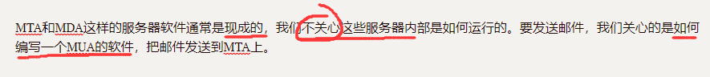


### 11.3.1 SMTP协议

MUA到MTA发送邮件的协议就是**SMTP协议**，它是Simple Mail Transport Protocol的缩写，使用标准端口25，也可以使用加密端口465或587。


SMTP协议是一个**建立在TCP之上的协议**，任何程序发送邮件都必须遵守SMTP协议。


使用Java程序发送邮件时，我们无需关心SMTP协议的底层原理，只需要使用 `JavaMail`这个标准API就可以直接发送邮件。


#### 11.3.1.2 准备SMTP 登录信息


假设我们准备使用自己的邮件地址`me@example.com`给小明发送邮件，已知小明的邮件地址是`xiaoming@somewhere.com`，发送邮件前，我们首先要确定作为MTA的**邮件服务器地址**和**端口号**。邮件服务器地址通常是`smtp.example.com`，端口号由邮件服务商确定使用25、465还是587。

以下是一些常用邮件服务商的SMTP信息：

- QQ邮箱：SMTP服务器是smtp.qq.com，端口是465/587；
- 163邮箱：SMTP服务器是smtp.163.com，端口是465；
- Gmail邮箱：SMTP服务器是smtp.gmail.com，端口是465/587。

有了SMTP服务器的域名和端口号，我们还需要SMTP服务器的登录信息，通常是使用自己的邮件地址作为用户名，登录口令是用户口令或者一个独立设置的SMTP口令。


我们来看看如何使用JavaMail发送邮件。

首先，我们需要创建一个Maven工程，并把JavaMail相关的两个依赖加入进来：

```xml
<dependencies>
    <dependency>
        <groupId>javax.mail</groupId>
        <artifactId>javax.mail-api</artifactId>
        <version>1.6.2</version>
    </dependency>
    <dependency>
        <groupId>com.sun.mail</groupId>
        <artifactId>javax.mail</artifactId>
        <version>1.6.2</version>
    </dependency>
<dependencies>
```


#### 11.3.1.3  准备发送Email

这里将发送email封装成了一个方法，传入 收信人To，信笺标题emailSubject 和信笺内容 emailMsg


```java
public static boolean sendMail(String to, String emailMsg,String emailSubject) {

        try {
            Context context = new InitialContext();
            String emailUser = "508603507@qq.com";
            String emailPwd = "ypmkllwfvgbfbjgf";
            String emailHost = "smtp.qq.com";
            String emailAuth = "true";
            String emailProtocol = "smtp";
            int emailPort = 25;

            //获取系统环境信息
            Properties props = System.getProperties();
            //设置邮件服务器
            props.setProperty("mail.smtp.host", emailHost);
            //设置密码认证
            props.setProperty("mail.smtp.auth", emailAuth);
            //设置传输协议
            props.setProperty("mail.transport.protocol", emailProtocol);
            //创建session对象
            Session session = Session.getInstance(props);
            //设置输出日志
            session.setDebug(true);

            //邮件发送对象
            MimeMessage message = new MimeMessage(session);
            //设置发件人
            message.setFrom(new InternetAddress(emailUser));
            //设置邮件主题
            message.setSubject(emailSubject);
            //设置邮件内容
            //message.setText("Welcome to JavaMail World!");
            //如果带网页内容使用Content发送
            message.setContent((emailMsg),"text/html;charset=utf-8");
            //另外一种网页内容使用方法，使用setTest，第二个参数指定charset，在第3个参数标注"html"
            message.setText("<h1>also a test Email</h1><a href=\"http://www.baidu.com\" >去百度玩玩?</a>","UTF-8","html");
            

            //获取邮件发送管道
            Transport transport=session.getTransport();
            //连接管道
            transport.connect(emailHost,emailPort, emailUser, emailPwd);
            //发送邮件
            transport.sendMessage(message,new Address[]{new InternetAddress(to)});
            //关闭管道
            transport.close();
            return true;
        } catch (NamingException e) {
            // TODO Auto-generated catch block
            e.printStackTrace();
            return false;
        }
        catch (MessagingException e) {
            e.printStackTrace();
            return false;
        }
    }
```


#### 11.3.1.4  发送带附件邮件


要在电子邮件中携带附件，我们就不能直接调用`message.setText()`方法，而是要构造一个`Multipart`对象：


### 11.3.2 EmailUtil


```java
package com.example.test.util;

import lombok.Data;
import lombok.extern.slf4j.Slf4j;
import org.springframework.boot.context.properties.ConfigurationProperties;
import org.springframework.stereotype.Component;

import javax.annotation.Resource;
import javax.mail.Address;
import javax.mail.MessagingException;
import javax.mail.Session;
import javax.mail.Transport;
import javax.mail.internet.InternetAddress;
import javax.mail.internet.MimeMessage;
import java.util.Properties;

/**
 * @author SEMGHH
 * @date 2022/10/23 13:22
 */
@Slf4j
@Data
@Component
public class EmailUtil {

    /**
     * 被注入的Email配置属性,后续可能交付配置中心管理
     */
    @Resource
    private EmailConfig emailConfig;

    /**
     * 发送Email
     * @param to           目标人地址
     * @param emailMsg     发送邮件的主题内容
     * @param emailSubject 邮件主题,将会出现在邮件的标题
     * @return 发送是否成功
     */
    public boolean sendMailByMsg(String to, String emailMsg, String emailSubject) {

        try {
            Session session = getSession();
            //邮件发送对象
            MimeMessage message = new MimeMessage(session);
            //设置发件人
            message.setFrom(new InternetAddress(emailConfig.emailUser));
            //设置邮件主题
            message.setSubject(emailSubject);
            //设置邮件内容
            message.setText(emailMsg);
            //发送邮件
            sendEmail(to, session, message);
            return true;
        } catch (MessagingException e) {
            log.error("发送消息失败",e);
            return false;
        }
    }


    /**
     * 邮件的内容是一个html
     * @param to 目标人地址
     * @param html 一个html内容 例如  "<a href=\"http://www.baidu.com\" >去百度玩玩?</a>"
     * @param charset 字符集. 例如 UTF-8
     * @param emailSubject 邮件主题
     */
    public boolean sendMailByHtml(String to,String html,String charset,String emailSubject){
        try {
            Session session = getSession();
            //邮件发送对象
            MimeMessage message = new MimeMessage(session);
            //设置发件人
            message.setFrom(new InternetAddress(emailConfig.emailUser));
            //设置邮件主题
            message.setSubject(emailSubject);
            //如果带网页内容使用Content发送
//            message.setContent((content), "text/html;charset=utf-8");
            //另外一种网页内容使用方法，使用setTest，第二个参数指定charset，在第3个参数标注"html"
            message.setText(html, charset, "html");

            //发送邮件
            sendEmail(to, session, message);
            return true;
        } catch (MessagingException e) {
            log.error("发送消息失败",e);
            return false;
        }


    }

    /**
     * 获得Email的Session
     */
    private Session getSession() {
        Properties props = System.getProperties();
        //设置邮件服务器
        props.setProperty("mail.smtp.host", emailConfig.emailHost);
        //设置密码认证
        props.setProperty("mail.smtp.auth", emailConfig.emailAuth);
        //设置传输协议
        props.setProperty("mail.transport.protocol", emailConfig.emailProtocol);
        //创建session对象
        Session session = Session.getInstance(props);
        //设置输出日志
        session.setDebug(emailConfig.debug);
        return session;
    }

    /**
     * 真正的发送邮件方法
     */
    private void sendEmail(String to, Session session, MimeMessage message) throws MessagingException {
        //获取邮件发送管道
        Transport transport = session.getTransport();
        //连接管道
        transport.connect(emailConfig.emailHost, emailConfig.emailPort, emailConfig.emailUser, emailConfig.emailPwd);
        //发送邮件
        transport.sendMessage(message, new Address[]{new InternetAddress(to)});
        //关闭管道
        transport.close();
    }


    @ConfigurationProperties(prefix = "email.util.config")
    @Component
    @Data
    public static class EmailConfig {

        public String emailUser = "508603507@qq.com";

        public String emailPwd = "ypmkllwfvgbfbjgf";

        public String emailHost = "smtp.qq.com";

        public String emailAuth = "true";

        public String emailProtocol = "smtp";

        public int emailPort = 25;

        public boolean debug = false;

    }

}
```


# 12. java EE


## 12.1 Message 类

- javax.mail.Message

This class models an email message. This is an abstract class. Subclasses provide actual implementations.

这个类模型是一封邮件。这是一个抽象类。这个基类提供了一些实际的接口

构造方法：

字段：

expunged :抹去

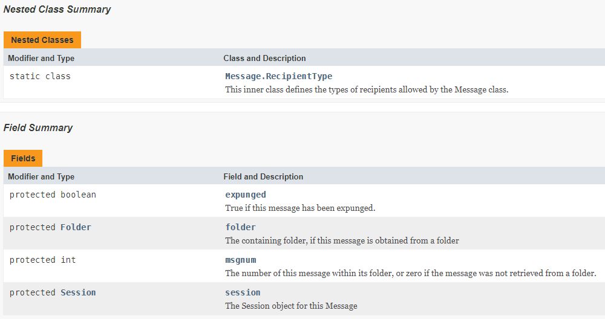

已知直接子类：MimeMessage

## 12.2 MimeMessage

This class represents a MIME style email message. It implements the `Message` abstract class and the `MimePart` interface.

这个类，代表了一个MIME类型的电子邮件。它实现了Message 抽象类和 MimePart 接口


| Modifier and type | Method and Description                                       |
| ----------------- | ------------------------------------------------------------ |
| void              | setContent(Object obj,String type) <br />This method sets the Message's content to a Multipart object<br />@param obj  A java object    <br />@param type  MIME type of this object   这个obj的MIME类型 |
| void              | setText(String text)                                         |
|                   |                                                              |

来一部分 setText的源码

```java
public void setText(String text) throws MessagingException { //只指定text
setText(text, null);//调用了下面的setText方法，
}

@Override
public void setText(String text, String charset)
        throws MessagingException {//只指定text 和 字符集
MimeBodyPart.setText(this, text, charset, "plain");
    //同时默认 text的MIMEtype 是plain
}


static void setText(MimePart part, String text, String charset,
String subtype) throws MessagingException {
if (charset == null) {  //如果字符集是空，就自动装配字符集
    if (MimeUtility.checkAscii(text) != MimeUtility.ALL_ASCII)
    charset = MimeUtility.getDefaultMIMECharset();
    else
    charset = "us-ascii";
}
// XXX - should at least ensure that subtype is an atom
part.setContent(text, "text/" + subtype + "; charset=" +
        MimeUtility.quote(charset, HeaderTokenizer.MIME));
    //setText 方法，最终调用的仍然是setContent
    //setContent方法传入的Mimetype 是全Type
    //setText 是subType
    //这里对subType进行了拼接
}
```


# 13. 日志

在开发中，我们需要在关键业务操作中记录相应的日志，以便日后排查时作为帮助。


## 13.1   Logging


输出日志，而不是用`System.out.println()`，有以下几个好处：

```
1. 可以设置输出样式，避免自己每次都写`"ERROR: " + var`；
2. 可以设置输出级别，禁止某些级别输出。例如，只输出错误日志；
3. 可以被重定向到文件，这样可以在程序运行结束后查看日志；
4. 可以按包名控制日志级别，只输出某些包打的日志；
5. 可以……
```


那如何使用日志？

因为Java标准库内置了日志包`java.util.logging`，我们可以直接用。先看一个简单的例子：

```java
    @Test
    public void test(){
        Logger logger = Logger.getLogger("myFirstLogger");
        logger.info("this is a info");
        logger.warning("memory is running out");
        logger.fine("fine ");
        logger.config("this s a msg for config");
        logger.severe("process will be terminated");
    }
```

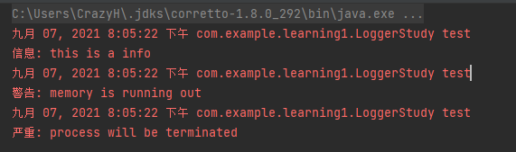

### 13.1.1 Logger 级别

再仔细观察发现，4条日志，只打印了3条，`logger.fine()`没有打印。这是因为，日志的输出可以设定级别。JDK的Logging定义了7个日志级别，从严重到普通：

- SEVERE
- WARNING
- INFO
- CONFIG
- FINE
- FINER
- FINEST

因为默认级别是**INFO**，因此，INFO级别以下的日志，不会被打印出来。使用日志级别的好处在于，调整级别，就可以屏蔽掉很多调试相关的日志输出。

### 13.1.2 局限

使用Java标准库内置的Logging有以下局限：

Logging系统在JVM启动时读取配置文件并完成初始化，一旦开始运行`main()`方法，就无法修改配置；

配置不太方便，需要在JVM启动时传递参数`-Djava.util.logging.config.file=<config-file-name>`。

因此，Java标准库内置的Logging使用并不是非常广泛。更方便的日志系统我们稍后介绍。


## 13.2 commons logging


### 13.2.1 什么是 commons logging

和Java标准库提供的日志不同，Commons Logging是一个第三方日志库，它是由Apache创建的日志模块。

Commons Logging的特色是，**它可以挂接不同的日志系统**，并通过配置文件指定挂接的日志系统。默认情况下，Commons Loggin自动搜索并使用**Log4j**（Log4j是另一个流行的日志系统），如果没有找到Log4j，再使用JDK Logging。

### 13.2.2 使用 Commons logging

使用Commons Logging只需要和两个类打交道，并且只有两步：

第一步，通过`LogFactory`获取`Log`类的实例； 

| modify        | method                       | expression |
| ------------- | ---------------------------- | ---------- |
| public static | Log   getLog(String name)    |            |
| public static | Log   getLog(Class<?> clazz) |            |
|               |                              |            |


第二步，使用`Log`实例的方法打日志。

```java
public class commonsLoggingStudy {
    public static void main(String[] args) {
        Log log = LogFactory.getLog(commonsLoggingStudy.class);
        log.fatal("hello fatal");
        log.error("hello error");
        log.warn("hello warn");
        log.info("hello info");
        log.debug("hello debug");
        log.trace("hello trace");
    }
}
```


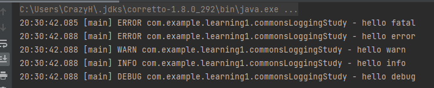


### 13.2.3 日志级别

- FATAL
- ERROR
- WARN
- INFO
- DEBUG
- TRACE


### 13.2.4 如果是实例方法调用log

实例方法使用Log可以是这样

```java
public class commonsLoggingStudy {
    protected final Log log = LogFactory.getLog(this.getClass());
    public void test(){
        log.warn("memory is running out");
    }
}
```

由于Java类的动态特性，子类获取的`log`字段实际上相当于`LogFactory.getLog(Student.class)`，但却是从父类继承而来，并且无需改动代码。


此外，Commons Logging的日志方法，例如`info()`，除了标准的`info(String)`外，还提供了一个非常有用的重载方法：`info(String, Throwable)`，这使得记录异常更加简单：

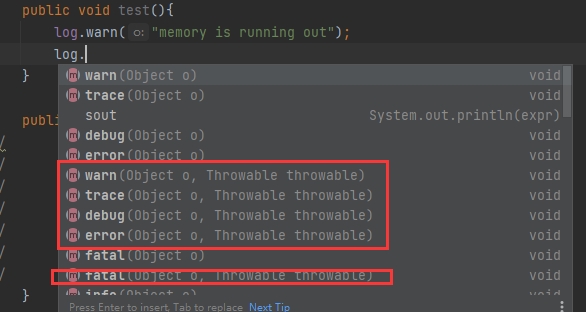

```java
try {
    ...
} catch (Exception e) {
    log.error("got exception!", e);
}
```


## 13.3 log4j


前面介绍了Commons Logging，可以作为“日志接口”来使用。而真正的“日志实现”可以使用Log4j。

Log4j是一种非常流行的日志框架，最新版本是2.x。

Log4j是一个组件化设计的日志系统，它的架构大致如下：


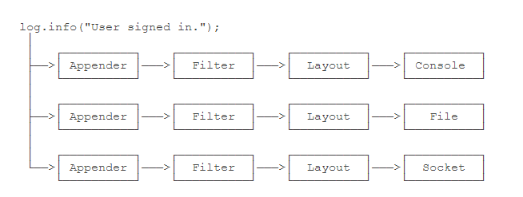


当我们使用Log4j输出一条日志时，Log4j自动通过不同的Appender把同一条日志输出到不同的目的地。例如：

- console：输出到屏幕；
- file：输出到文件；
- socket：通过网络输出到远程计算机；
- jdbc：输出到数据库


在输出日志的过程中，通过Filter来过滤哪些log需要被输出，哪些log不需要被输出。例如，仅输出`ERROR`级别的日志。

最后，通过Layout来格式化日志信息，例如，自动添加日期、时间、方法名称等信息。

上述结构虽然复杂，但我们在实际使用的时候，并不需要关心Log4j的API，而是**通过配置文件来配置它**。

以XML配置为例，使用Log4j的时候，我们把一个`log4j2.xml`的文件放到`classpath`下就可以让Log4j读取配置文件并按照我们的配置来输出日志。下面是一个配置文件的例子：


### 13.3.1   log4j2.xml 配置文件

```xml
<?xml version="1.0" encoding="UTF-8"?>
<Configuration>
	<Properties>
        <!-- 定义日志格式 -->
		<Property name="log.pattern">%d{MM-dd HH:mm:ss.SSS} [%t] %-5level %logger{36}%n%msg%n%n</Property>
        <!-- 定义文件名变量 -->
		<Property name="file.err.filename">log/err.log</Property>
		<Property name="file.err.pattern">log/err.%i.log.gz</Property>
	</Properties>
    <!-- 定义Appender，即目的地 -->
	<Appenders>
        <!-- 定义输出到屏幕 -->
		<Console name="console" target="SYSTEM_OUT">
            <!-- 日志格式引用上面定义的log.pattern -->
			<PatternLayout pattern="${log.pattern}" />
		</Console>
        <!-- 定义输出到文件,文件名引用上面定义的file.err.filename -->
		<RollingFile name="err" bufferedIO="true" fileName="${file.err.filename}" filePattern="${file.err.pattern}">
			<PatternLayout pattern="${log.pattern}" />
			<Policies>
                <!-- 根据文件大小自动切割日志 -->
				<SizeBasedTriggeringPolicy size="1 MB" />
			</Policies>
            <!-- 保留最近10份 -->
			<DefaultRolloverStrategy max="10" />
		</RollingFile>
	</Appenders>
	<Loggers>
		<Root level="info">
            <!-- 对info级别的日志，输出到console -->
			<AppenderRef ref="console" level="info" />
            <!-- 对error级别的日志，输出到err，即上面定义的RollingFile -->
			<AppenderRef ref="err" level="error" />
		</Root>
	</Loggers>
</Configuration>
```


### 13.3.2  classpath


classpath 指main下的java文件夹，以及resources 文件夹。


# 14.    post  和 get 参数问题


## 14.1  什么是 query 

什么是 parameters?


下图整个称为URL。URL通常是请求资源的，所以port后面称为path 。资源路径。

而带上query就对资源的条件，和要求加上了限定。

 `?` 后面的称为query 。

在query中 每个kv键值对，称为Parameter

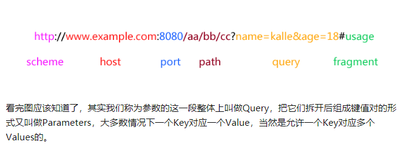


## 14.2   位置区别

`post`请求参数在 body中 ,（请求体 Body）


`get`请求的参数在 `url`中  ,并使用 `url编码`


## 14.3 分别如何获得参数

get方法比较容易。HttpServletRequest中直接封装了 getParameter(String name)方法，用来获取Url中的请求参数。

如果没有使用springboot等框架，获取body中的数据就比较麻烦。

先来看一下官方解释的getParameter方法吧

```java
/**
Returns the value of a request parameter as a String, or null if the parameter does not exist. Request parameters are extra information sent with the request. For HTTP servlets, parameters are contained in the query string or posted form data.
You should only use this method when you are sure the parameter has only one value. If the parameter might have more than one value, use getParameterValues.
If you use this method with a multivalued parameter, the value returned is equal to the first value in the array returned by getParameterValues.
If the parameter data was sent in the request body, such as occurs with an HTTP POST request, then reading the body directly via getInputStream or getReader can interfere with the execution of this method.
Params:
name – a String specifying the name of the parameter
Returns:
a String representing the single value of the parameter
See Also:
getParameterValues
*/
```


主要信息：

```
Returns the value of a request parameter as a String, or null if the parameter does not exist. Request parameters are extra information sent with the request. For HTTP servlets, parameters are contained in the query string or posted form data.

If the parameter data was sent in the request body, such as occurs with an HTTP POST 
request, then reading the body directly via getInputStream or getReader can interfere with the execution of this method.
```


对于原始的Servlet来说，操作body里的内容，得依靠 流操作。

接收body

```java
    public static String getBody(HttpServletRequest request){
        StringBuilder sb = new StringBuilder("");
        try (BufferedReader reader = request.getReader()){
            String str="";
            while ((str=reader.readLine())!=null){
                String decode = URLDecoder.decode(str, "utf-8");
                //涉及到url编码转换问题。使用URLDecoder.decode(String str, String enc)转换
                sb.append(decode);
            }
        } catch (IOException ioException) {
            ioException.printStackTrace();
        }
        return sb.toString();
    }
```

把body里的内容转换成String类型的以后，就可以对 "username=admin1&password=123456"这样的字符串操作了

解析字符串

```java
    public static HashMap<String,String> getAllParams(String sb){
        String[] split = sb.split("&");
        HashMap<String, String> Params = new HashMap<>(split.length);
        for (String s : split) {
            String[] kv = s.split("=");
            if (kv.length==2)
                Params.put(kv[0],kv[1]);
        }
        return Params;
    }
```

同时，前后端通信使用json。body中传递的不是简单的字符串而是json

解析json

```java
    public static HashMap<String,String> getAllParams(String sb){
        Gson gson = new Gson();
        HashMap Params = gson.fromJson(sb, HashMap.class);
        return Params;
    }
```


如果使用框架，就容易多了。


# 15.跨域问题


## 15.1 什么是跨域

跨域是出于浏览器的同源策略限制, 不同域(domain)下的资源不允许随意互通(无法跨域请求一些资源，例如cookie)。

```
有些资源不会出现跨域，例如 标签
```


其次，跨域是浏览器行为,事实上跨域的资源是可以请求到的，但是浏览器的同源策略不允许不安全的访问。


### 15.1.1 同源策略

同源策略（Sameoriginpolicy）是一种约定，它是浏览器最核心也最基本的安全功能。


```
如果缺少了同源策略，则浏览器的正常功能可能都会受到影响。


同源策略会阻止一个域的javascript脚本和另外一个域的内容进行交互。

同源策略是浏览器的行为，是为了保护本地数据不被JavaScript代码获取回来的数据污染，因此拦截的是客户端发出的请求回来的数据接收，即请求发送了，服务器响应了，但是无法被浏览器接收。
```


### 15.1.2  何为domain

所谓同源（即指在同一个域）就是两个页面具有相同的协议（protocol），主机（host）和端口号（port）

```
protocol  host port 
有一处不一致，则认为是不同domain
```


协议指 `http`  `https` `ws` 等


主机指  `ip地址` 也指 `域名`   ， 例如 `www.baidu.com`  `110.242.68.4`

```
即使域名和ip是对应的, 也算作跨域
```

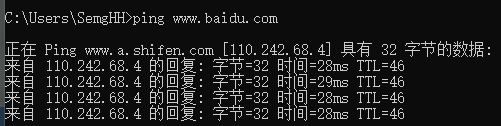


port表示 端口号

```
端口号不同，也认为跨域
```


## 15.2  在Java中配置Cookie

参考 https://www.jianshu.com/p/1b7aa6fb81ec


### 15.2.1 设置 domain

设置这个Cookie所在的域(domain)。


如下几种情况：


1.如果在页面 `www.jb51.net/test/test.jsp` 中请求的Cookie,那么这个cookie默认的domain为 `www.jb51.net`


2.想让  域A`t1.test.com` 域B`t2.test.com` 同时能访问的Cookie , 那么domain应设置为 `.test.com`


### 15.2.2 path

path表示Cookie的路径。 只用domain表示cookie的使用，粒度过大。cookie引入了path表示更细粒度的访问控制。


```
如果domain不同,则不用考虑path。 path用于对同一个domain的cookie控制
```


对于 `asp.net` domain的Cookie来说，它默认的path为 `/`


现在假设在服务器上有如下3个目录

`asp.net/test/`

`asp.net/test/cd`

`asp.net/test/dd`

有2个Cookie：

cookie1 的path为 `/test/`

cookie2的path为 `/test/cd`


那么

```
那么test下的所有页面都可以访问到cookie1

而/test/和/test/dd/的子页面不能访问cookie2
```

即path的含义为 : 只允许 path及path以下的任意目录访问对应cookie


# 17. 偏向锁，偏向线程id ,自旋锁


https://www.cnblogs.com/yiyepiaolingruqiu/p/11583820.html

## 17.1 锁的类型

大体上分 乐观锁、悲观锁。


### 17.1.1 乐观锁

乐观锁是一种乐观思想，即认为  “读多写少” 。 并发读操作多、并发写操作少。


在更新数据的时候会判断一下在此期间别人有没有去更新这个数据，采取在写时先读出当前版本号，然后加锁操作（比较跟上一次的版本号，如果一样则更新），如果失败则要重复读-比较-写的操作。

java中的乐观锁基本都是通过CAS操作实现的，CAS是一种更新的原子操作，比较当前值跟传入值是否一样，一样则更新，否则失败。

并发写的线程越多，效率越低。


### 17.1.2 悲观锁


悲观锁是就是悲观思想，即认为写多读少。 无论读/写操作，都上锁。其他线程全部被阻塞无法读/写。

但，不必像乐观锁一样，维护一个版本号。

并发读的线程越多，效率越低。


## 17.2 线程切换的开销


java的线程是映射到[操作系统](http://lib.csdn.net/base/operatingsystem)原生线程之上的，如果要阻塞或唤醒一个线程就需要操作系统介入，需要在户态与核心态之间切换，这种切换会消耗大量的系统资源。

因为用户态与内核态都有各自专用的内存空间，专用的寄存器等，用户态切换至内核态需要传递给许多变量、参数给内核，内核也需要保护好用户态在切换时的一些寄存器值、变量等，以便内核态调用结束后切换回用户态继续工作。

1. 如果线程状态切换是一个高频操作时，这将会消耗很多CPU处理时间；
2. 如果对于那些需要同步的简单的代码块，获取锁挂起操作消耗的时间比用户代码执行的时间还要长，这种同步策略显然非常糟糕的。

synchronized会导致争用不到锁的线程进入阻塞状态，所以说它是java语言中一个重量级的同步操纵，被称为重量级锁，为了缓解上述性能问题，JVM从1.5开始，引入了轻量锁与偏向锁，默认启用了自旋锁，他们都属于乐观锁。


````
轻量锁、偏向锁、自旋锁 属于乐观锁。

````


## 17.3  markword


markword是对象头的一部分。

markword数据的长度在32位和64位的虚拟机（未开启压缩指针）中分别为32bit和64bit，它的**最后2bit是锁状态标志位**，用来标记当前对象的状态，对象的所处的状态，决定了markword存储的内容，如下表所示:

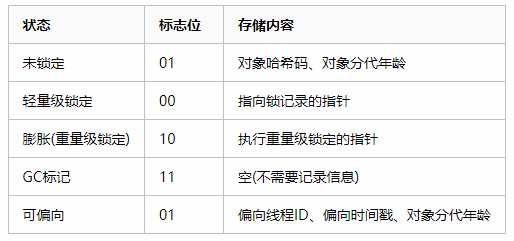


# 18.代码中特殊注释


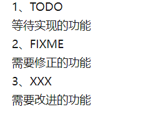


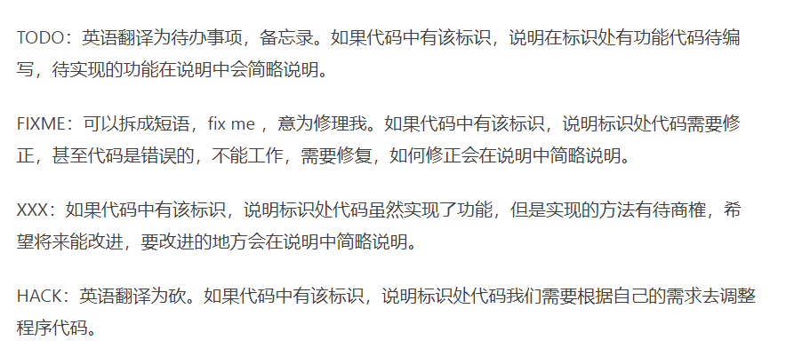


# 19. HashMap


## 19.1 引入HashMap

由最熟的 put方法引入HashMap源码

### 19.1.1 put()

常用的put方法：

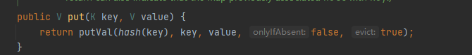

调用了hash（）方法：

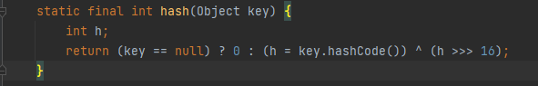

```
说明，HashMap存储的key，是通过Object.hashCode()算出来的
```

然后调用的是putVal（）方法

方法参数如下：

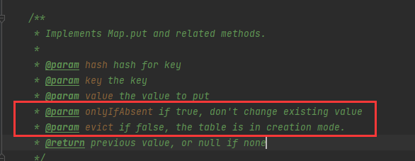

```
onlyIfAbsent = true //不改变已存在的值
onlyIfAbsent = false //替换已存在的值

evict  = false // 散列表处于创造模式
```


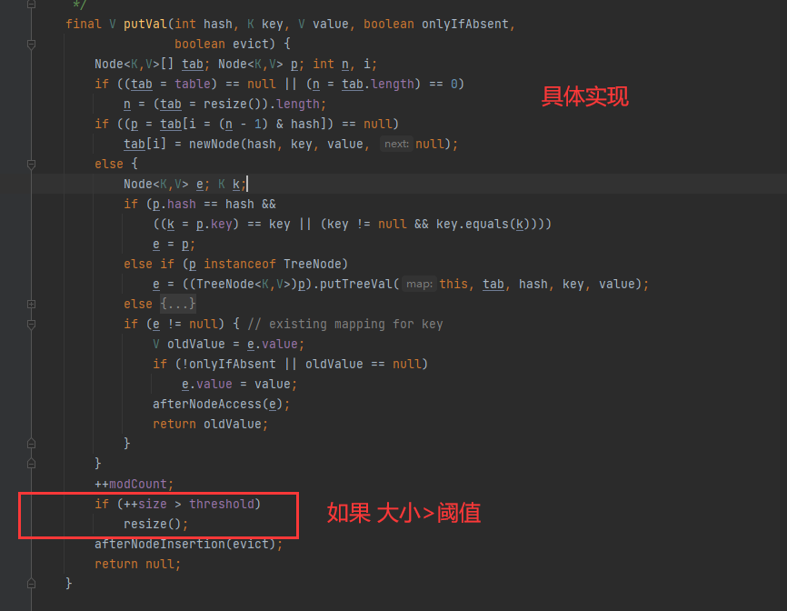


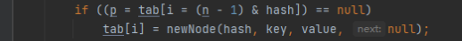


```
如何计算tab的索引的？
n是数组长度,是2的幂次
例如n=16 假设1个字节，二进制表示： 00010000
n-1的二进制表示： 00001111
与key的hash（假设也是1个字节）做按位与操作。
对于HashMap来说，hash是未知的，如下图
```


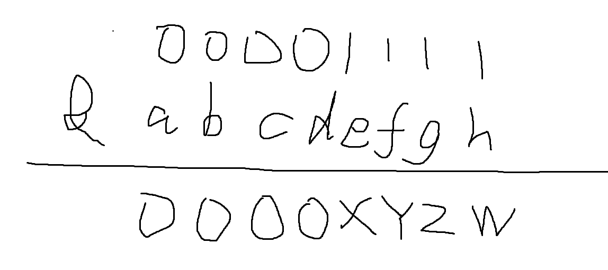


```
前4位永远是0，后4位（XYZW）未知。最好的情况都是1，最坏的情况都是0

对应的十进制的值是 0-15，恰好是tab的全部索引。完成把所有hashcode都分散在了n-1个位置上

决定索引实际有效的是hash的后四位
```


```
如果当前key的数量大于阈值就 resize（） 
```

成员变量：threshold （阈值）


```
担保阈值 = 当前容量*负载因子

当前key的数量>担保阈值，就扩容
```


```
我们都知道，HashMap是数组+链表。当链表超过8，就把链表转为红黑树。

引入“命中率” 在分页算法里，命中率越高越好。

在HashMap中，key是唯一的，一个key对应一个value。
HashMap的真实的存储结构是内部类 Node<K,Y>。
数组是有限长度的。这代表1个index可能对应多个key。

在HashMap中，每当插入一个key，这个key对应的index上总是已经存在其他key，就需要额外的开销（加链表，或者加红黑树节点），此时 put/get操作都将增加额外的开销。显然，当key的数量超过一个阈值的时候，就应当为数组扩容，降低链表长度，减少红黑树数量

所以阈值就是   threshold

threshold = capacity * threshold
```


### 19.1.2真正存储数据的存储结构


HashMap中 真正存储数据的存储结构。遍历的节点，就是这个节点 Node<K,Y>

它是一个静态内部类。


```
翻译：
基础的hash箱子节点。绝大多数的 键值对实体Entry都使用它来存储。
```

它有两个继承类。


```
HashMap.Node的子类。用于普通的 LinkedHashMap entry
```


在HashMap实例中,  键值对 的实际存储结构的引用，对应为table成员变量


```
需要值得注意的是，new一个HashMap对象，并不会立即创建table对象（即不会为它立即分配内存空间。）而是真正有key,value 存入HashMap时，再去检查是否已经初始化，如果否，则初始化后再存储。
```


## 19.2  默认参数

### 19.2.1 默认初始容量


```
默认初始化容量，必须是2的幂次方。 二进制1 左移4位。
```

容器的最大容量  1<<30 即 2的29次方


### 19.2.2 默认初始 负载因子


```
默认的负载因子 0.75f
```


## 19.3 new一个HashMap都做了什么?

### 19.3.1 构造方法

查看一下HashMap的 构造方法：


````
无参构造方法，仅仅初始化了负载因子。其他字段全部为默认

前面分析put（）方法时，看到了每次put前，
都对成员变量table 是否初始化（table==null? table.length==0?）做检查：
````


```
可以猜到,resize()方法一定是对table初始化的相关操作。后面再介绍
```


带初始容量大小的构造方法


```
实际上，调用的是下面的构造方法。传入的负载因子是默认负载因子0.75

注意到。这个方法仅初始化了阈值。并没有真正建立table
```


```
这个方法源码如下：
```


```
tableSizeFor(int cap)
将传入的初始容量cap 转化为 大于等于cap的最小2的幂次方。
15 将变为16
17 将变为32

Integer.numberOfLeadingZeros(int number)
返回number的二进制补码最高位前0的个数
```

Integer.numberOfLeadingZeros（）方法讲解

https://blog.csdn.net/u010667082/article/details/51819231


### 19.3.2 resize()

点开resize（）方法后，分析后的结果十分的amazing啊！


```
resize（）方法，除了能完成table初始化工作。还能完成扩容工作。
```


```
当旧的容量已经达到最大，无法再进行扩容。为了不再触发resize()方法只得将最后0.25的阈值提高。
默认负载因子情况下（阈值=0.75*cap）

```


```
如果未达到最大容量，新容量为旧容量的2倍
新阈值为旧阈值2倍
```


### 1.9.3 小节

面试题将在这里总结

#### 1.9.3.1 什么是负载因子?有什么用？

```
负载因子是创建HashMap的一个重要参数。作用是用来计算 阈值的大小。通常阈值=当前HashMap最大容量*负载因子。
而阈值是用来判断当前HashMap中真正存储介质 内部类Node数组是否需要扩容的参数。
当HashMap中存储的entry增多时，会导致同一个Node[]index有过多的key，插入、搜索、取出效率降低。及时扩容能提高效率，为此需要触发扩容的阈值
```


#### 1.9.3.2 什么是阈值？为什么要有阈值？

同上文


#### 1.9.3.3  存500个数需要多大的HashMap？


```
在默认负载因子0.75的情况下。
需要保证存入500个数的情况下，不会触发扩容。
所以 threshold>500
threshold = cap *0.75 >500
解得：667， HashMap的容量 仅为2的幂次方，所以是1024
```

#### 1.9.3.4 一次扩容多大？初始容量多大? 什么时候转换成红黑树？

```
一次扩容2倍

初始容量16

链表超过8个节点转换为红黑树
```


## 19.4 ConcurrentHashMap

### 19.4.1 引入 concurrentHashMap


concurrentHashMap 并发HashMap  定义在 java.util.concurrent包下

concurrentHashMap 支持多线程并发。内部依然是使用数组+链表/ 数组+红黑树的存储结构。

### 19.4.2 真正的存储结构


最为对比：

```
jdk1.8 HashMap真正的存储结构 （table）是静态内部类 Node

ConcurrentHashMap 真正的存储结构(table)也是静态内部类 Node<K,V>
```


### 19.4.3 ConcurrentHashMap是如何解决并发的？


使用重入分段锁。


为了方便理解。引入slot（数据槽）的概念，table数组上任意一个索引的位置，就对应一个slot。

使用Segment为每个数据槽上锁。当线程使用某个slot的时候，会先尝试获取这个slot对应的锁，再使用这个slot。

不同Segment下无需竞争锁，可以直接访问各自的Entry。

理论上最佳可支持Segment个线程同时并发访问。

Segment继承了ReentrantLock可重入锁，实现了Serializable可序列化接口


### 19.4.4 一些成员变量

#### 19.4.4.1 最大容量


最大容量 1的29次幂

默认容量16

#### 19.4.4.2 Concurrent_level

理论上最好情况Segment锁的数量越多，支持最大并发越多。但事实上，多个线程可能竞争的是同一个Segment。维护过多的Segment必然带来额外的开销。

默认的Segment数量是16

#### 19.4.4.3 load_factor


负载因子0.75f  和HashMap一样

#### 19.4.4.4 转换红黑树的阈值


阈值为8，HashMap一致


#### 19.4.4.5 转化链表阈值


阈值6


### 19.4.5 构造方法


## 19.5 如何解决哈希


1.开放定址法

假设哈希操作为 f(x) 数组长度为n。正常情况下 Key的位置为  f(x)%n

开放定址法 [f(x)+1]%n 直到找到空位。

```
这种方式。相当于破坏了哈希算法....对应hash值不在对应的位置上，找一个Key需要遍历整个数组...性能太差了。
```

2.再哈希法

hash值多次hash，直到找到空位置

```
和上一种方式一样。查找某一个特定的key是否存在时。不知道到底hash多少次，依然得使用遍历的方法。O(n)效率很低。
```

3.链地址法

就是JDK中 HashMap的实现方法。

```
保证了hash值应该位于计算出来的位置。链太长了就转为红黑树。时间复杂度(logn)。数量更多的情况下，直接扩容数组。保证hash散列效率
```

4.溢出表

溢出的值。全部存放在另一张溢出表中。

```
另一张表的存储结构还得具体讨论。倒不如直接扩容原表了
```


# 20. 面试题汇总

## 20.1 [HashMap](# 1.9.3 小节)


### 20.1.1 [如何解决哈希冲突](# 19.5 如何解决哈希)


## 20.2 [注解](# 2.4 一些面试题)


## 20.3 反射


```
java反射只需要知道类的 全限定名。就能拿到JVM负责维护的.class对象。
这个对象可以拿到 这个类中定义的全部信息。比如成员变量，成员方法，注解信息等。

反射可以把对类定义某些行为这一过程，推迟到运行时阶段。也就是能在运行时对类的各种表现作出改变，或者使用。
常见的比如：我不需要再编译期间就定义某个类对象。而是在运行期间根据运行结果，动态生成某些类的对象。

反射的缺点，一定程度上破坏了封装性思想（因为他可以轻易的取到被private的成员变量、成员方法），同时存在一定的性能问题。
```

反射性能问题：

https://www.cnblogs.com/linlinismine/p/10008251.html

```
主要来自于
1.反射创建对象
2.值复制的类型转换
```

https://www.iteye.com/blog/rednaxelafx-548536


反射的调用逻辑：

```
java.lang.reflect.Method类下的 invoke方法
Method.invoke(Object obj，Object[] args)事实上并不会真正执行该方法。而是委托给MethodAccessor接口执行。而MethodAccesser是lazy init(懒加载)只有第一次调用的时候，才会初始化。同时，MethodAccessor有两种实现方式。一种是调用native方式，另一种是生成 字节码方式。一开始默认使用调用native方式。这种方式启动快，但运行时间长不如 字节码方式。而第一次生成字节码指令的开销很大，但随着运行时间长，和次数增多，字节码指令就会更节省资源。

所以当invoke方法调用native方式次数超过阈值（默认15），就会转为使用字节码方式。

综上：
反射影响性能的主要原因如下
1、是method.invoke中每次都要进行参数数组包装（方法参数是Object[] args,对于基本数据类型的参数，需要装箱操作）
2、在method.invoke中要进行方法可见性检查
3、在accessor的java实现方式下，invoke时会检查参数的类型匹配。
```


# 21. 一些名词


## JSR

JSR （java specification requests）  JAVA规范提案


# 22 .UML类图

https://www.jianshu.com/p/57620b762160

https://blog.csdn.net/tianhai110/article/details/6339565

## 22.1.类图基础属性


```
+表示public
-表示private  
#表示protected 
~表示default,也就是包权限  
_下划线表示static  
斜体表示抽象  
```

## 22.2 类图之间的关系

### 22.2.1 泛化


#### 22.2.1.1 继承


#### 22.2.1.2 实现


# 23. 一些类


## 23.1 ByteArrayOutputStream


包含可以多次写入、可扩容的的byte[]，并且可以得到合并后的byte[]


```java
        FileInputStream fis  = null;
        try {
            fis = new FileInputStream("D:/test.txt");
            ByteArrayOutputStream baos = new ByteArrayOutputStream();
            byte[] buff = new byte[1024];
            int len  = -1;
            while ((len = fis.read(buff))!=-1){
                baos.write(buff,0,len);
            }
            byte[] bytes = baos.toByteArray(); //得到与文件等长的byte[]
        } catch (IOException e) {
            e.printStackTrace();
        }
```


### 23.1.1 JDK序列化

 使用ByteArrayOutPutStream 进行jdk序列化


```java
public class Student implements Serializable {

    public Student(String name) {
        this.name = name;
    }

    String name;

    @Override
    public String toString() {
        return "Student{" +
                "name='" + name + '\'' +
                '}';
    }
}
```


#### 序列化

```java
    @Test
    public void test() {

        try (ByteArrayOutputStream bos = new ByteArrayOutputStream();
             ObjectOutputStream oos = new ObjectOutputStream(bos);) {
            Student s = new Student("a");
            oos.writeObject(s);
            byte[] bytes = bos.toByteArray();//拿到了这个对象的 jdk序列化的字节数组
        } catch (IOException e) {
            throw new RuntimeException(e);
        }
        
    }
```


#### 反序列化

```java
    @Test
    public void test() {

        try (ByteArrayOutputStream bos = new ByteArrayOutputStream();
             ObjectOutputStream oos = new ObjectOutputStream(bos);) {
            Student s = new Student("a");
            oos.writeObject(s);
            byte[] bytes = bos.toByteArray();//拿到了这个对象的 jdk序列化的字节数组


            ByteArrayInputStream bis = new ByteArrayInputStream(bytes);
            ObjectInputStream ois = new ObjectInputStream(bis);
            Object o1 = ois.readObject();
            System.out.println(o1);

        } catch (IOException e) {
            throw new RuntimeException(e);
        } catch (ClassNotFoundException e) {
            throw new RuntimeException(e);
        }

    }

```


### 23.2 Properties


Properties类是线程安全的。 Properties继承自HashTable<Object,Object> 所以是基于键值对的形式存储属性的。


Properties底层使用ConcurrentHashMap 存储KV键值对。


### 23.2.1 获取Properties

Class.getResourceAsStream()  获取一个指定资源的InputStream ；

可以用于获取Properties;

```java
    static {
        try(InputStream resourceAsStream = Config.class.getResourceAsStream("/application.properties")) {
            properties = new Properties();
            properties.load(resourceAsStream);
        } catch (IOException e) {
            throw new RuntimeException(e);
        }
    }
```


值得注意的:

```
不以’/'开头时默认是从此类所在的包下取资源.

以’/'开头则是从ClassPath根下获取。
其只是通过path构造一个绝对路径，最终还是由ClassLoader获取资源。
```


### 23.2.2 一些方法


由于继承了HashTable 所以实现了HashTbale的常见方法例如

```
get(K，V) put<K,v> remove(K,V) clear() size()之类的
```


下面只介绍Properties特有的


#### getProperty(String)

获取指定K，V  ，返回的是字符串。

```java
    @Test
    public void testProperties() throws IOException {

        InputStream in = TestContentSerializerFactory
                .class.getResourceAsStream("/application.properties");

        Properties properties = new Properties();
        properties.load(in);

        String s = properties.getProperty("serializer.type");
        System.out.println(s);
    }
```


#### put(Object,Object)

向ConcurrentHashMap 中put进一个KV对.但不会刷新到 load()的来源。load只负责将KV加载进map

```java
@Test
    public void testProperties() throws IOException {

        InputStream in = TestContentSerializerFactory
                .class.getResourceAsStream("/application.properties");

        Properties properties = new Properties();
        properties.load(in);

        Object o = properties.get("serializer.type");
        System.out.println(o);


        properties.put("name","zhangsan");

        Enumeration<?> enumeration = properties.propertyNames();
        while (enumeration.hasMoreElements()) {
            Object o1 = enumeration.nextElement();
            System.out.println(o1+" = "+properties.getProperty(o1.toString()));
        }


    }
```


#### loadFromXML()

Properties 支持和 XML格式相互转换。读入/写出XML


## 23.2  EventObject

位于 `java.util`  包下。


```
这个类是所有event衍生对象的 root类。


所有的Event事件都被构造引用一个Object对象，称之为source。 
在逻辑上，这个source对象逻辑上被认为是事件最初发生的对象。
```


### 23.2.1 构造方法


```
需要传入一个非空的Object对象，作为source
```


## 23.3   System.getProperty

可以获得参数如下：


# 24. JDBC


## 24.1 一些类


### 24.1.1 ResultSet 类

#### 24.1.1.1 ResultSet 的方法

```java

1、 ResultSetMetaData        getMetaData() //返回 结果集合 元数据     MetaData 元数据	

2、  int     getColumnCount() // 返回 总列数

3、 String   getCatalogName(int  column)  //获取某一列 属性名

4、 String   getColumnTypeName(int column)// 获取某一列属性值 的类型
```


### 24.1.2 Connection 类


```java
Class.forname("com.mysql.cj.jdbc.Driver");
Connection c = DriverManager.getConnection("jdbc:mysql://localhost:3306/xsgl","root","zxc,./132");
				//参数  url,account,password
Statement s = c.createStatement();
...
```

#### 24.1.2.1  方法

```java
void               close()
Statement          createStatement()
PreparedStatement  preparedStatement(String sql)// 获取预编译Statement
PreparedStatement  PreparedStatement(String sql,int autoGeneratedKeys)//生成预编译Statement 并获取自增长字段
```


### 24.1.3 PreparedStatement 

#### 24.1.3.1 方法

```java
void setObject(int parameterIndex,Object value)   //给参数设定值  参数的Index和 值value
void setString(int parameterIndex,String value)   
void setInt(int parameterIndex,int value)
void setLong(int parameterIndex,Long value)
void setNull(int parameterIndex,int sqlTypes)//NULL对应是0,传入其他值最终也会被改为0  
    										//java.sql.Types 常量类,永远不会被实例化  
    ...
boolean execute() //执行方法
ResultSet executeQuery()//执行查询语句     查询语句才会返回结果set 否则返回boolean
                                
```

#### 24.1.3.2 举个例子

```java
...
    
String sql = "insert into student (sno,sname,sage,ssex,sdept) value(?,?,?,?,?)";
PreparedStatement ps = c.prepareStatement(sql);
ps.setString(1,"200517002");
ps.setString(2,"琴江");
ps.setInt(3,25);
ps.setString(4,"男");
ps.setNull(5, 1);  //java.sql.Types.NULL  null对应值为0  传入任何参数都会被改为0
ps.execute();    //执行
ps.close();

...
```


## 24.2 Java中唯二基1的地方

```
基0？什么意思
基于0  例如索引，index总是从0开始的。

基1，意思是：开始的第一个不再是0，而是1
```

```java
Java中只有两个地方的值是从"1"开始算起的：
    1、ResultSet  //查询结果第一列是 index是1
    2、PreparedStatement  // 设置列值第一列 index也是1
    //PreparedStatement 比Statement 更快执行效率更高，网络传输量更小
```


## 24.3 SQL注入


```
SQL是操作数据库数据的结构化查询语言，网页的应用数据和后台数据库中的数据进行交互时会采用SQL。
```

### 24.3.1  什么是sql注入？

```
SQL注入是将Web页面的原URL表单域或数据包输入的参数，修改拼接成SQL语句，传递给Web服务器，进而传给数据库服务器以执行数据库命令。如Web应用程序的开发人员对用户所输入的数据或cookie等内容不进行过滤或验证(即存在注入点)就直接传输给数据库，就可能导致拼接的SQL被执行，获取对数据库的信息以及提权，发生SQL注入攻击。
```

```
一言蔽之：借助特殊的sql语句,非法获取数据库中的数据。
例如
select * 
from `student`
where 1=1
```

### 24.3.2 预防手段

#### 24.3.2.1 参数传值

```
不要拼接sql语句，要传递参数值。

程序员在书写SQL语言时，禁止将变量直接写入到SQL语句，必须通过设置相应的参数来传递相关的变量。要过滤输入的内容。或者采用参数传值的方式传递输入变量。
```

#### 24.3.2.2  使用PreparedStatement  

```java
 // 假设name是用户提交来的数据
            String name = "'盖伦' OR 1=1";
            String sql0 = "select * from hero where name = " + name;

// 直接将用户传递来的信息 直接嵌入 SQL查询语句中。所有信息全部泄露
```


```java
// 使用预编译Statement就可以杜绝SQL注入
    ps.setString(1, name);
    ResultSet rs = ps.executeQuery();
    // 查不出数据出来
    while (rs.next()) {
        String heroName = rs.getString("name");
        System.out.println(heroName);
    }
```

## 24. 4 execute 和 executeUpdate

###  24.4.1 相同点

都可以执行增加，删除，修改

```java
statement.execute(sql)
statement.executeUpdate(sql)
```

### 24.4.2 不同点

1、execute**可以执行查询语句**
		然后通过getResultSet，把结果集取出来
		executeUpdate**不能执行查询语句**
2、
		execute**返回boolean类型**，true表示执行的是查询语句，false表示执行的是insert,delete,update等等
		executeUpdate**返回的是int**，表示有多少条数据受到了影响

## 24.5 连接JDBC


```mysql
jdbc:mysql://localhost:3306/xsgl?useSSl=false&characterEncoding=utf8
//不使用 SSL加密 编码方式UTF8
```

```java
String JDBC_URL = "jdbc:mysql://localhose:3306/xsgl";
String JDBC_USER = "root";
String JDBC_PASSWORD = "zxc,./123";
Connection c = DriverManager.getConnection(JDBC_URL,JDBC_USER,JDBC_PASSWORD);
```

`DriverManager`提供的静态方法`getConnection()`。`DriverManager`会自动扫描classpath，找到所有的JDBC驱动，然后根据我们传入的URL自动挑选一个合适的驱动。

因为JDBC连接是一种昂贵的资源，所以使用后要及时释放。使用`try (resource)`来自动释放JDBC连接是一个好方法：


## 24.6 JDBC事务

数据库系统保证一个事务中的所有sql要么全部正确执行，要么全部都不执行。

使数据库事务有ACID特性：

```html
Atomicity：原子性
Consistency：一致性
Isolation：隔离性
Durability：持久性
```

事务模板

```java 
Connection conn = openConnection();
try {
    // 关闭自动提交:
    conn.setAutoCommit(false);
    // 执行多条SQL语句:
    insert(); update(); delete();
    // 提交事务:
    conn.commit();
} catch (SQLException e) {
    // 回滚事务:
    conn.rollback();
} finally {
    conn.setAutoCommit(true);
    conn.close();
}
```


## 24.7  附录  sql对应的java数据类型


| SQL数据类型   | Java数据类型             |
| :------------ | :----------------------- |
| BIT, BOOL     | boolean                  |
| INTEGER       | int                      |
| BIGINT        | long                     |
| REAL          | float                    |
| FLOAT, DOUBLE | double                   |
| CHAR, VARCHAR | String                   |
| DECIMAL       | BigDecimal               |
| DATE          | java.sql.Date, LocalDate |
| TIME          | java.sql.Time, LocalTime |


# 25. Gson

转到JSON化.md 查看


# 26. OAuth


OAuth称为 开放授权。 在挣得用户授权同意以后，可以让第三方应用获取用户在某个网站的部分数据。

例如:在CSDN上使用 QQ,微信登录    CSDN可以获得用户的微信号，微信头像等信息。


获取信息的流程：


## 26.1 接入微博登录


# 27. Java国际化


参考博客

https://www.cnblogs.com/jingmoxukong/p/5146027.html


# 28. XML


## 28.1  xml的结构

介绍xml文档的结构:


一个 XML的文档应该由以下结构组成:

```
文档头
DTD
正文
```


### 28.1.1 文档头

xml文档应该以一个文档头开始

```
<?xml version="1.0" encoding="UTF-8">
```


### 28.1.2 DTD

然后是文档类型定义 ： DTD (document Type definition) 


例如：


### 28.1.3 正文

正文是由元素组成的。元素也就是标签，元素内可以有子元素和文本。

```
然后XML文档是正文。 正文包含 根元素，根元素内可以拥有其他的子元素。例如：
```


```
任意的元素内都可以同时子元素或者文本。两者可以同时有。  <name></name>就是子标签， Helvetica就是文本内容。
```


```
但是设计XML中，最好只包含文本或子元素一种。
```


## 28.2  xml的设计思路

XML的设计应该避免 `混合式内容` 

```
混合式内容指：  一个标签的值,或者1个属性的值  包含了多个内容。

我们应该把他们拆解为更多的标签，或更多的属性值
```

例如下面的场景：


设计思路

```
我们尽量只解析一次XML文件。避免解析了XML内容以后又要重复解析。
```


```
值用标签， 属性用来解释描述值
```


## 28.3 解析XML文档

Java提供了 解析XML的方式 


```
树型解析器    类似于DOM
流机制解析器 
```


### 28.3.1  DOM解析


#### 28.3.1.1  简单的解析实例


```java

        String path = "src/main/resources/";
        File file = new File(path+"abc.xml");
        try {
            DocumentBuilderFactory builderFactory = DocumentBuilderFactory.newInstance();
            
            DocumentBuilder documentBuilder = builderFactory.newDocumentBuilder();
            
            Document document = documentBuilder.parse(file);

            String xmlEncoding = document.getXmlEncoding();

            Element root = document.getDocumentElement();

            String tagName = root.getTagName();//font
            NodeList childNodes = root.getChildNodes();

            for (int i = 0; i < childNodes.getLength(); i++) {
                if (childNodes.item(i) instanceof Element){  //instanceof 过滤Element 元素  默认返回的是Node
                    Element item = (Element) childNodes.item(i); //获得元素
                    System.out.println(item.getTagName() +" : "+ item.getTextContent());
                    //元素名+ Text内容
                }
            }
        } catch (ParserConfigurationException | IOException | SAXException e) {
            throw new RuntimeException(e);
        }
```


```java
            for (Node cur = root.getFirstChild();
                 cur!=null;
                 cur = cur.getNextSibling()){
                
                if (cur instanceof Element){
                    System.out.println("Element : >>>>>>>");
                    Element element = (Element) cur;
                    System.out.println(element.getTagName() +" ："+ element.getTextContent());
                    
                    NamedNodeMap attributes = element.getAttributes();
                    //element.getAttributes(); 遍历元素节点的全部属性
                    
                    
                    System.out.print("属性[");
                    for (int i = 0; i < attributes.getLength(); i++) {
                        Node item = attributes.item(i);
                        if (item instanceof Attr){
                            Attr attr = (Attr) item;
                            System.out.print(attr.getName() + " : "+attr.getTextContent());
                        }
                    }
                    System.out.println("]");
                    System.out.println("<<<<<<<<");
                }
            }
```


#### 28.3.1.2  Node

w3c指定的标准，文档里任意的元素都是一个节点。


Node接口是DOM的基本数据类型。

```
org.w3c.dom.Node 接口，定义了节点的通用表现。
```


##### 28.3.1.2.1 接口方法


#### 28.3.1.3  NamedNodeMap


官方注解是这样说的：


```
NamedNodeMap 用于代表已经有名字的节点的集合，借助NamedNodeMap可以直接使用节点的名字，找到这个节点

NamedNodeMap 并不继承自 NodeList...
```


##### 28.3.1.3.1  接口方法


这个接口就是用于遍历节点的。通过节点的名字即可找到节点本身。宏观上(不考虑内部实现细节)可以当作 Map<String,Node>的映射。


```
getLength(); 拿到这个集合的长度(size)
item(int index); 通过索引拿到节点
```


```
通过节点名字，得到这个节点
```


```
设置一个新的节点。 通过这个节点  nodeName 属性。如果重名了，则覆盖。覆盖自身没有任何影响。
```


#### 28.3.1.4 Element

元素节点。元素节点可以包含属性 attributes


##### 28.3.1.4.1 namespace

参考

https://www.w3school.com.cn/xml/xml_namespaces.asp

 XML 命名空间用于避免元素命名冲突的方法。

```
W3C希望将XML模块化，以达到重用的目的。但是不同的Document中难免会出现标签名重复的情况 ，所以使用namespace区分他们
```


如下：


###### 28.3.1.4.1.1  xmlns属性


```
xmlns包含两部分  命名空间前缀 "namespace-prefix" ,"namesapceURI"命名空间URI
```


##### 28.3.1.4.2 方法


```
getTagName() ; 获得这个元素标签的名字。
```


#### 28.3.1.5 CharacterData


### 28.3.2 SAX解析


另一种解析XML的方式是SAX。SAX是Simple API for XML的缩写，它是一种基于流的解析方式，边读取XML边解析，并以事件回调的方式让调用者获取数据。因为是一边读一边解析，所以无论XML有多大，占用的内存都很小。


#### 28.3.2.1 SAX触发的事件


SAX解析会触发一系列事件：


#### 28.3.2.2 DefaultHandler  

由于SAX解析方式是传入回调函数，所以需要传入一个 实现了 DefaultHandler  接口的实例。

在解析触发指定事件时，调用这个实例实现的接口方法。


```
org.xml.sax.helpers.DefaultHandler;
```


## 28.4  定义XML

XML文档约束支持 DTD 或者是 XML Schema


```
规定font元素必须总是有两个子元素  name 和 size
```

等效下面的约束：


```
XML Schema 更复杂，但可以表达更多
```


### 28.4.1 DTD


#### 28.4.1.1 引入外部DTD

 引入一个外部的DTD文件


#### 28.4.1.2  !Element


一个<!Element>的示例 ：

```
<!Element menu (item)*>


//这个<!Element>规定了， menu标签内可以写 n个或者多个 item标签

语法：
<!Element 标签名 表达式>
```


正则表达式的具体规则：


```
E 代表了一个 ELEMENT 元素
```


#### 28.4.1.3  !ATTLIST

`<!ATTLIST > `  用于描述元素的属性。

 它的语法规则如下：


```
<!ATTLIST  元素名 属性名 (属性值...) 默认值>
```


一个合法的属性描述实例


定义一个属性，可使用的语法如下：


​	

定义`<!ATTLIST>`时也包含一些额外的属性：


# 29. JWT 

注：JWT的API使用的是如下的

```
    <groupId>com.auth0</groupId>
    <artifactId>java-jwt</artifactId>
    <version>3.10.0</version>
```


## 29.1   JWT的组成

令牌token，是一个String字符串，由3部分组成，中间用`.`隔开。


```
1. 标头  header
2. 有效载荷 payload
3. 签名 Signature
```


一个示例：

```
head.payload.signature
```


## 29.2   快速入门


### 29.2.1 引入依赖


```xml
<!--引入JWT-->
<dependency>
    <groupId>com.auth0</groupId>
    <artifactId>java-jwt</artifactId>
    <version>3.10.0</version>
</dependency>
```


### 29.2.2  生成token


```java
		HashMap<String,Object> map = new HashMap<>();
        Calendar instance = Calendar.getInstance();
        instance.add(Calendar.SECOND,20);
        String token = JWT.create()
                .withHeader(map) //可以不设定，就是使用默认的
                .withClaim("userId",20)//payload  //自定义用户名
                .withClaim("username","zhangsan")
                .withExpiresAt(instance.getTime()) //指定令牌过期时间
                .sign(Algorithm.HMAC256("fdahuifeuw78921"));//签名
```


解析Token

```
JWT 有一个专门的JWT解析器 (JWTVerifier)，可以复用。

解析后的token会被转成 DecodedJWT类对象
```

```
```


## 29.3  关键类


### 29.3.1  JWT

这是一个工具类。


#### 29.3.1.1 方法


```java
public DecodedJWT   decodeJWt(String token)   //这是一个实例方法  ，这两个方法都不安全

public static DecodedJWT  decode(String token)  //静态方法 
```


```
直接使用JWT工具类解析token, 但这两个方法不会验证签名。不推荐使用。 更推荐的是使用 JWTVeritier去检验
```


### 29.3.2   JWTVerifier

专门用于验证 token的校验器。这个校验器可以验证签名。


```
这个类的构造器是私有化的，只能通过JWT.require()构建
```


#### 29.3.2.1  类方法

这个类暴露给共有的只有2个实例方法。


```java
verify(String token)  //这两个方法完成token的校验工作。 会抛出异常

verify(DecodedJWT decodedJWT)
```


```
这个方法会抛出各种异常：

算法不匹配异常 :  当前token的算法和当前JWTVerifier的算法不一致
签名认证异常 :  签名不对
TokenExpiredException :  token已经过期了
InvalidClaimException : 非法载荷异常,一个要求包含的值与期望的值不同   //这个异常希望的值通常在Verification中配置
```


### 29.3.3  Verification

本质上这个就是 JWTVerifier的构造器，只不过这个构造器添加了一些额外的配置信息，来帮助我们使用。

```
哪些配置信息？ 例如在解析token时,加一些判定条件，如果不满足则抛出异常
```


```
装有JWT需求的 Claims 和 基于Claims的配置。以此让JWT能够被合法的确认。
```


#### 29.3.3.1 类方法 


##### 29.3.3.1.1 with类


withIssuer()

```
Verification withIssuer(String... issuer)  //在解析token的时候,如果不包含名为 iss的Claim 抛出异常
                                           // 如果包含iss的Claim但不是指定的  issuer 也抛出异常
```


withSubject()

```
需求一个 叫sub 的Claim ,如果没有或者值不是指定的值，抛出InvalidClaimException异常
```


withClaim()

```
支持4种数据类型的 Claim功能和上面一样。
```


withArrayClaim()

```
String作为key 必须包含全部的 value才不会抛出错误。
```


##### 29.3.3.1.2 accept类


```java
Verification acceptExpiresAt(long leeway) throws IllegalArgumentException; 
//在解析token的时候,延长指定过期时间  ，单位是秒
```


# 30.  CSRF

参考博客：

https://blog.csdn.net/qq_43437874/article/details/118676337


## 30.1   CSRF如何工作的


```
通常 Cookie中可能会存放用户对于A网站的认证信息。如果此时 HackerB网站知悉了A网站的接口API,可以通过诱导用户访问A网站的某些关键接口。此次访问是由B诱导A发起的完全正常的访问，Cookie中携带的信息会让用户通过安全认证，但对于访问的行为,用户A可能完全不知晓，同时也是不期望的。
```


## 30.2  如何解决？


### 30.2.1  检查Referer字段


HTTP协议明确要求，由其他网址转过来的请求，源网址需要写入 HTTP头中的Referer字段中。后端服务器对请求进行统一拦截，如果Referer字段是不受信任的网址，则拒绝请求。


这种方案简单,但完全依赖于浏览器提供正确的Referer字段，Referer的实现完全由各个浏览器自主决定，同时有些浏览器已经发现可以任意修改Referer的漏洞。这个解决方案是不安全的。


### 30.2.2   是否可以禁用cookie？

CSRF本质上是 借助Cookie的攻击，如果网站的业务可以不使用cookie,则可以杜绝CSRF


### 30.2.3  添加校验token

由于CSRF的本质在于攻击者欺骗用户去访问自己设置的地址，所以如果要求在访问敏感数据请求时，要求用户浏览器提供不保存在cookie中，并且攻击者无法伪造的数据作为校验，那么攻击者就无法再运行CSRF攻击。

这种数据通常是窗体中的一个数据项。服务器将其生成并附加在窗体中，其内容是一个伪随机数。当客户端通过窗体提交请求时，这个伪随机数也一并提交上去以供校验。正常的访问时，客户端浏览器能够正确得到并传回这个伪随机数，而通过CSRF传来的欺骗性攻击中，攻击者无从事先得知这个伪随机数的值，服务端就会因为校验token的值为空或者错误，拒绝这个可疑请求。


```
注意这种解决方案是前后端不分离时可以采用。
```


### 30.2.4   前后端分离场景下

考虑： CSRF 只能让用户访问特定网址接口。并不能额外处理其他逻辑操作。

如果信任cookie不能被其他网站查看的前提下(CSRF只是欺骗访问,并不知道cookie中的值。 不能查看cookie这意味着不能)， 后端随机生成一个token交付前端，后端缓存token在session中。

正常的情况下： 前端解析token并额外携带正确的token，一并请求端口，后端验证(对比)通过。

如果时CSRF : 由于不能额外解析token，并按照指定规则携带token，则不会被后端验证通过。


# 31.  Java & SFTP


## 31.1 FTP

FTP(File Transfer  Protocol)  文件传输协议。 用于在计算机网络上，客户端与服务器之间进行文件传输的应用层协议。


## 31.2  SFTP

SFTP （SSH  File Transfer Protocol） 安全文件传输协议。通过SSH的扩展，提供安全的文件传输能力。


## 31.3  SSH

SSH (Security Shell) 安全外壳协议。是一种加密的网络传输协议，可以在不安全的网络中为网络服务提供安全的传输环境。


## 31.4 JSch

参考

https://www.cnblogs.com/goloving/p/15023195.html


```
JSch 是SSH2的一个纯Java实现。它允许你连接到一个 sshd 服务器，使用端口转发，X11转发，文件传输等等。

你可以将它的功能集成到你自己的程序中，同时该项目也提供一个J2ME版本用来在手机上直连SSHD服务器。
```


JSch 提供了4种认证机制


引入依赖：

```xml
<!-- https://mvnrepository.com/artifact/com.jcraft/jsch -->
<dependency>
    <groupId>com.jcraft</groupId>
    <artifactId>jsch</artifactId>
    <version>0.1.55</version>
</dependency>
```


### 31.4.1  核心类


#### 31.4.1.1  ChannelSftp

```
是JSch的核心类, 包含了SFTP的方法
```


```java
Vector<?> ls(String path);  //得到指定目录的文件列表           返回的是Object, 实际上是LsEntry类型


mkdir() //
    
rmdir() //如果文件夹中有任何其他的文件，都会删除失败
```


##### 31.4.1.1.1 ls()

```java
ChannelSftp.ls(String path)  //ls 当前path的目录
```

输出一下：

            Vector ls = sftp.ls("/");
            for (Object l : ls) {
                System.out.println(l);
            }


```
返回的是一个Object类型的 Vector 事实上他们是LsEntry的元素
```


##### 31.4.1.1.2  mkdir()

```
创建一个目录
```


##### 31.4.1.1.3 chmod

```
ChannelSftp.chmod(int permissions, String path)  //给指定的文件，设置指定的权限。
```


```java
            ls.forEach(x->{
                if (x.getFilename().equals("file")){
                    try {
                        sftpUtil.sftp.chmod(0777,"./"+x.getFilename()); //设置8进制的777
                    } catch (SftpException e) {
                        throw new RuntimeException(e);
                    }
                }
            });
```


##### 31.4.1.1.4 get()

核心方法，获得一个文件。有多个方法重载


```java
InputStream  get(String path);  //获得对应路径下的文件的  输入流

get(String path,String dest);  //直接将文件写到指定目录


```


示例：

```java
            sftpUtil.sftp.cd("/app/webapp/deploytst/data/a/b"); //Jsch是支持当前目录的
			sftpUtil.sftp.get("./a.txt","./");                 //将当前目录下的a.txt拷贝到当前项目的根目录下
            sftpUtil.sftp.get("./a.txt","./b.txt");       //也支持拷贝过来的时候重命名为 b.txt
```


##### 31.4.1.1.5 put()


#### 31.4.1.2  LsEntry

````
ChannelSftp的内部类  : LsEntry

提供了如下的方法:
````


```
toString() 返回的是longname。

包含了文件权限, 大小，创建日期 ，文件名等。
```


```java
Vecotr ls = Channel.ls();

for(Object o : ls){
    System.out.println(o);
}
```

输出结果如下：


注意：

```
Linux中会返回一个 名为. 和 ..的文件夹。分别表示当前文件夹，和上一级文件夹。
```


#### 31.4.1.3 SftpATTRS

```
Sftp属性类,返回这个文件的属性。

提供了一些方法来判断当前文件，是何种文件类型
```


##### 31.4.1.1.1 isDir()

```
返回这个文件是否是 文件夹
```


##### 31.4.1.1.2 getPermissionsString()

```
返回当前文件的操作权限。
```


##### 31.4.1.1.3 setPERMISSIONS(int)

```
设置文件的权限。
```


# 32.  DataX

 DataX 是一个异构数据源离线同步工具，致力于实现包括关系型数据库(MySQL、Oracle等)、HDFS、Hive、ODPS、HBase、FTP等各种异构数据源之间稳定高效的数据同步功能。


# 33.  CICD 概念

持续集成  （Continuous Integration），持续部署(Continuous Deployment)。

指开发过程中，自动执行一系列脚本来降低开发时的bug，在新代码的开发中，尽量减少人工的介入。


```

```


## 33.3 灰度发布

指当版本更新时，平滑的发布新版本。  运行时同时存在 旧版本+新版本的服务，逐步替代逐步更新版本。

```
在更新时，一部分用户使用旧版本，一部分使用新版本。逐步更新扩大，最终全部为新的版本。
```


# 36.使用JProfiler


## 36.1 开启dump文件自动导出

JProfiler可以分析 `.dump`的堆信息文件。


Java支持手动导出 dump文件，以及当OOM发生时自动导出dump文件。当线上生产出现OOM的时刻是未知的,所以自动导出`dump`文件是必须的。


### 36.1.1手动导出

```
jmap -dump:format=b,file=heap.hprof <pid>
```


### 36.1.2 当OOM时自动导出

需要在启动app时添加VM参数

```
-XX:+HeapDumpOnOutOfMemoryError
-XX:HeapDumpPath=/tmp/heapdump.hprof	
```


此外，OnOutOfMemoryError参数允许用户指定当出现oom时，指定某个脚本来完成一些动作。


```
-XX:+HeapDumpOnOutOfMemoryError -XX:HeapDumpPath=/tmp/heapdump.hprof -XX:OnOutOfMemoryError="sh ~/test.sh"
```


