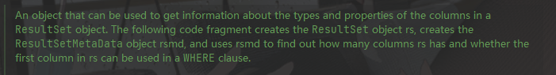
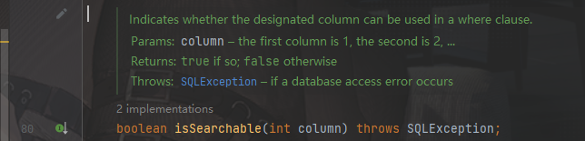

# 1. ResultSet 类

结果集。包含本次查询的结果。


## 1.1 ResultSet 的方法

```java
1、 ResultSetMetaData        getMetaData() //返回 结果集合 元数据     MetaData 元数据	

2、  int     getColumnCount() // 返回 总列数

3、 String   getCatalogName(int  column)  //获取某一列 属性名

4、 String   getColumnTypeName(int column)// 获取某一列属性值 的类型
```


## 1.2  ResultSetMetaData类

结果集的元数据类。 可以拿到表的很多有用的基本信息。例如： 本次查询的列数，列的名字等。





```
一个可以拿到列信息和列配置的 结果集对象。
```


### 1.2.1 方法


```java
    int getColumnCount() throws SQLException; //获得本次查询列的数量
```


```java
    boolean isAutoIncrement(int column) throws SQLException; //是否 自增长字段。
```


```
当前列 是否大小写敏感。
```




```
返回当前列是否可以被搜索 (可以被Where条件使用)
```


# 2.Constructor 类


构造器类下的方法

```java
constructor类 
    构造器类
   
1、  Class<?>[]   getTypeParameters() //返回该构造器的参数的类对象数组 

2、  T                   newInstance(Object...initargs)           //用这个构造器 new一个新对象

													// initargs  初始化用参数     该参数传递给构造器参数
```


# 3. Java中唯二 基1的地方


## 3.1 ResultSet


## 3.2PreparedStatement 预编译句子

```java
Java中只有两个地方的值是从"1"开始算起的：
    1、ResultSet  //查询结果第一列是 index是1
    2、PreparedStatement  // 设置列值第一列 index也是1
    //PreparedStatement 比Statemen 更快执行效率更高，网络传输量更小
```


# 4.SQL注入


## 4.1 什么是SQL注入

SQL是操作[数据库](https://baike.baidu.com/item/数据库/103728)数据的结构化查询语言，网页的应用数据和后台数据库中的数据进行交互时会采用SQL。而SQL注入是将Web页面的原[URL](https://baike.baidu.com/item/URL/110640)、表单域或数据包输入的参数，修改拼接成SQL语句，传递给Web服务器，进而传给[数据库服务器](https://baike.baidu.com/item/数据库服务器/613818)以执行数据库命令。如Web应用程序的开发人员对用户所输入的数据或cookie等内容不进行过滤或验证(即存在注入点)就直接传输给数据库，就可能导致拼接的SQL被执行，获取对数据库的信息以及提权，发生[SQL注入攻击](https://baike.baidu.com/item/SQL注入攻击/4766224)。


## 4.2 预防手段


### 4.2.1 参数传值

程序员在书写SQL语言时，禁止将变量直接写入到SQL语句，必须通过设置相应的参数来传递相关的变量。要过滤输入的内容。或者采用参数传值的方式传递输入变量。


# 5.PreparedStatement 类

## 5.1常用方法


【只有index赋值，没有匹配名字】

```java
void setObject(int parameterIndex,Object value)   //给参数设定值  参数的Index和 值value
void setString(int parameterIndex,String value)   
void setInt(int parameterIndex,int value)
void setLong(int parameterIndex,Long value)
void setNull(int parameterIndex,int sqlTypes)//NULL对应是0,传入其他值最终也会被改为0  
    										//java.sql.Types 常量类,永远不会被实例化  
    ...
boolean execute() //执行方法
ResultSet executeQuery()//执行查询语句     查询语句才会返回结果set 否则返回boolean
                                
```

## 2、应用实例

```java
String sql = "insert into student (sno,sname,sage,ssex,sdept) value(?,?,?,?,?)";
PreparedStatement ps = c.prepareStatement(sql);
ps.setString(1,"200517002");
ps.setString(2,"琴江");
ps.setInt(3,25);
ps.setString(4,"男");
ps.setNull(5, 1);  //java.sql.Types.NULL  null对应值为0  传入任何参数都会被改为0
ps.execute();    //执行
ps.close();
```

含有自增主键代码时

```java
try (Connection conn = DriverManager.getConnection(JDBC_URL, JDBC_USER, JDBC_PASSWORD)) {
    try (PreparedStatement ps = conn.prepareStatement(
            "INSERT INTO students (grade, name, gender) VALUES (?,?,?)",
            Statement.RETURN_GENERATED_KEYS)) {
        //在创建PreparedStatement时，需要在getConnection()方法中传递参数 Statement.RETURN_GENERATED_KEYS
        ps.setObject(1, 1); // grade
        ps.setObject(2, "Bob"); // name
        ps.setObject(3, "M"); // gender
        int n = ps.executeUpdate(); // 1
        try (ResultSet rs = ps.getGeneratedKeys()) {
            if (rs.next()) {
                long id = rs.getLong(1); // 注意：索引从1开始
            }
        }
    }
}
```

| SQL数据类型   | Java数据类型             |
| :------------ | :----------------------- |
| BIT, BOOL     | boolean                  |
| INTEGER       | int                      |
| BIGINT        | long                     |
| REAL          | float                    |
| FLOAT, DOUBLE | double                   |
| CHAR, VARCHAR | String                   |
| DECIMAL       | BigDecimal               |
| DATE          | java.sql.Date, LocalDate |
| TIME          | java.sql.Time, LocalTime |


## 3、PreparedStatement 可以防止SQL注入（参数传值）

```java
 // 假设name是用户提交来的数据
            String name = "'盖伦' OR 1=1";
            String sql0 = "select * from hero where name = " + name;

// 直接将用户传递来的信息 直接嵌入 SQL查询语句中。所有信息全部泄露
```


```java
// 使用预编译Statement就可以杜绝SQL注入
  
            ps.setString(1, name);
  
            ResultSet rs = ps.executeQuery();
            // 查不出数据出来
            while (rs.next()) {
                String heroName = rs.getString("name");
                System.out.println(heroName);
            }
```


# 6.execute 和 executeUpdate

### 相同点

都可以执行增加，删除，修改

```java
statement.execute(sql)
statement.executeUpdate(sql)
```


### 不同

1、execute**可以执行查询语句**
		然后通过getResultSet，把结果集取出来
		executeUpdate**不能执行查询语句**
2、
		execute**返回boolean类型**，true表示执行的是查询语句，false表示执行的是insert,delete,update等等
		executeUpdate**返回的是int**，表示有多少条数据受到了影响

# 7. Connection 类

```java
Class.forname("com.mysql.cj.jdbc.Driver");
Connection c = DriverManager.getConnection("jdbc:mysql://localhost:3306/xsgl","root","zxc,./132");
										//参数  url,account,password
Statement s = c.createStatement();
...
```

```java
void               close()
Statement          createStatement()
PreparedStatement  preparedStatement(String sql)// 获取预编译Statement
PreparedStatement  PreparedStatement(String sql,int autoGeneratedKeys)//生成预编译Statement 并获取自增长字段
```


# 8. 连接JDBC


```mysql
jdbc:mysql://localhost:3306/xsgl?useSSl=false&characterEncoding=utf8
//不使用 SSL加密 编码方式UTF8
```

```java
String JDBC_URL = "jdbc:mysql://localhose:3306/xsgl";
String JDBC_USER = "root";
String JDBC_PASSWORD = "zxc,./123";
Connection c = DriverManager.getConnection(JDBC_URL,JDBC_USER,JDBC_PASSWORD);
```

核心代码是`DriverManager`提供的静态方法`getConnection()`。`DriverManager`会自动扫描classpath，找到所有的JDBC驱动，然后根据我们传入的URL自动挑选一个合适的驱动。

因为JDBC连接是一种昂贵的资源，所以使用后要及时释放。使用`try (resource)`来自动释放JDBC连接是一个好方法：


# 9.JDBC事务

数据库系统保证一个事务中的所有sql要么全部正确执行，要么全部都不执行。

使数据库事务有ACID特性：

```html
Atomicity：原子性
Consistency：一致性
Isolation：隔离性
Durability：持久性
```

事务模板

```java 
Connection conn = openConnection();
try {
    // 关闭自动提交:
    conn.setAutoCommit(false);
    // 执行多条SQL语句:
    insert(); update(); delete();
    // 提交事务:
    conn.commit();
} catch (SQLException e) {
    // 回滚事务:
    conn.rollback();
} finally {
    conn.setAutoCommit(true);
    conn.close();
}
```


# 10. 获取表级数据

抓取数据库的字段的数据类型、字段名称、字段注释，字段长度，字段[精度](https://so.csdn.net/so/search?q=精度&spm=1001.2101.3001.7020)等信息

参考：https://blog.csdn.net/TangKenny/article/details/114593319


