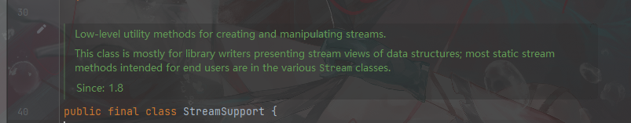
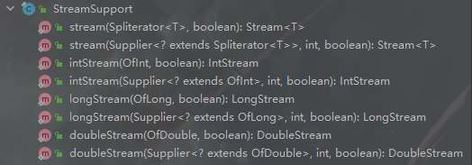
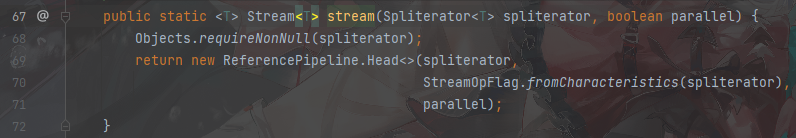
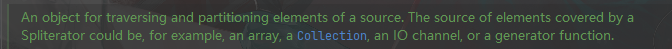
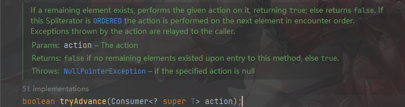

# 1.JDK 1.8特性

jdk1.8加入了stream。 在实际开发中使用stream可以化简代码。 代码简洁也是一种高效。


# 2. 相关的一些类

包含相关的一些类的源码, 方法,常量等。

在stream的源码中，大量使用了泛型，所以读源码的前置知识是充分理解泛型。


## 2.1  stream类

```java
<R,A> R                         collect(Collector<? super T,A,R> collector) 
                             	使用 Collector对此流的元素执行 mutable reduction Collector 
/*参数中传入一个 Collector 接口的实现类 
该接口用来完成 Reduction operations 操作。
（Reduction operations）缩减操作（也称为折叠 ）采用一系列输入元素，并通过重复应用组合操作将其组合成单个摘要结果，例如查找一组数字的和或最大值，或将元素累加到列表中。
 【添加元素到可变长的collection中，并对其进行特定操作】
 
Collector接口的实现类，Collectors封装了一系列静态方法。  返回 包含特定功能的Collector
例如：
*/
static <T> Collector<T,?,Long> counting()           返回 Collector类型的接受元件 T计数输入元件的数量。  
static <T> Collector<T,?,List<T>> toList()          返回一个 Collector ，它将输入元素 List到一个新的 List 。 
/*
*/
```


## 2.2 StreamSupport 

这是一个工具类，提供了一些 创建,操纵 stream的方法。



```
这个类主要是为了 lib库作者而准备的。   大多数与stream相关的静态方法都包含在各个Stream的类中
```


### 2.2.1 方法




#### stream


```
将Spliterator类的对象，转化为Stream对象
```





## 2.3  Spliterator

spliter 分割器，核心接口。





```
一个Spliterator对象，表示一个数据源的 一部分,可遍历的元素。

# 来自一个数据源， 一部分元素， 可以遍历

Spliterator的数据源可以来自于：  数组,集合，IO通道, 或者一个 generator函数
```


```
Spliterator 可以单独的遍历某些元素 (tryAdvance())
也可以顺序
```


### 2.3.1 接口方法





```
如果还有剩余元素存在,如果满足传入的 Consumer行为,那么就会返回true，否则返回false
```


