# 1.JDK19 新特性


目前VirtualThread是预览版本，需要在 编译器和JVM启动参数中配置 `--enable-preview` 参数


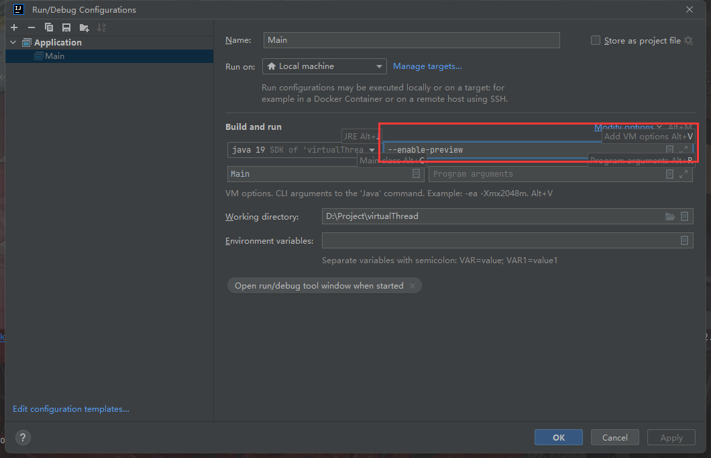


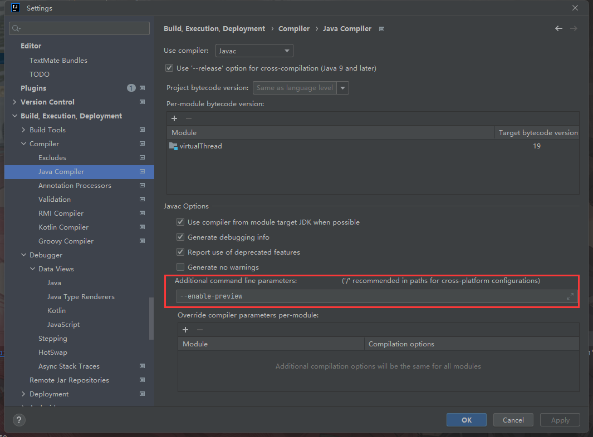


在编译时开放`module`

```
--add-exports=java.base/jdk.internal.vm=ALL-UNNAMED
```


在`Runtime`时开放对应 `module`

```
--add-opens java.base/java.util=ALL-UNNAMED
```


## 1.1 Thread新增的2个工厂方法

```
 Thread新增了1个内部接口  Builder

接口2个子接口，用于构造2种线程,提供了链式调用的构造
ofVirtual
ofPlatform 
```

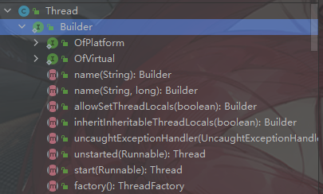


### 1.1.1 接口方法


#### name


```
给创造的线程命名。
```


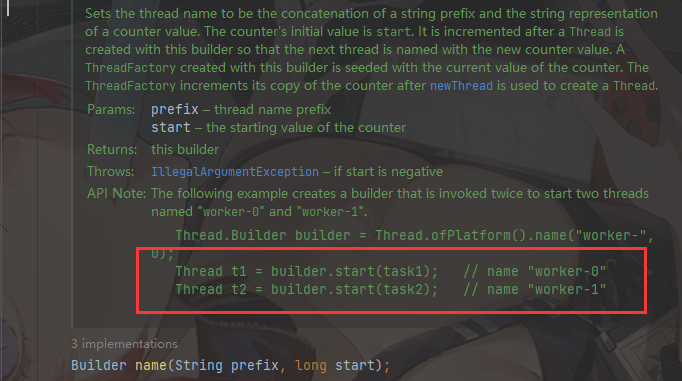


#### allowSetThreadLocals


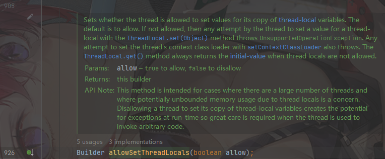


```
设置这个线程是否允许使用 ThreadLocal
```


#### inheritInheritableThreadLocals

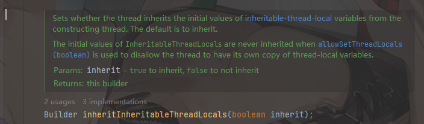


```
设置线程是否从构造线程中继承初始变量值。 默认是允许的

//我们知道,可以从一个线程中fork出一个子线程
```


#### uncaughtExceptionHandler

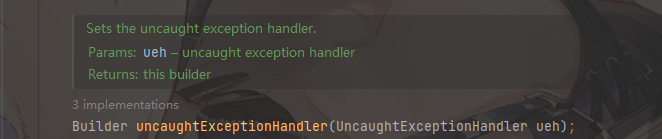


设置一个未捕捉异常的处理器


#### start

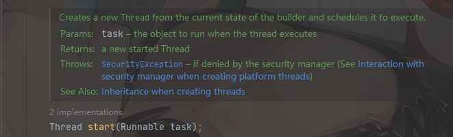


```java
//传入一个 Runnable ，由start构造的Thread会立即执行,无需调用 start()方法
			Thread.ofVirtual().name("hello world")
                .allowSetThreadLocals(true)
                .start(()->{
                    System.out.println("hello virtual Thread!");
                }).join();
```


#### unstated

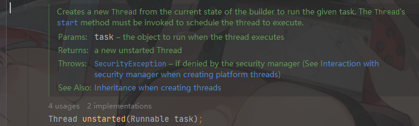

```
构造出的Thread，必须手动调用 start()
```


#### factory


```
返回一个当前Builder状态的 ThreadFactory 用于后续创建线程。

返回的ThreadFactory是一个线程安全的实例
```


### 1.1.2  接口实现类

```
对应 platform 线程的构造器 PlatformThreadBuilder
对应 Virtual 线程的构造器:  VirtualThreadBuilder
```

在java.lang.ThreadBuilders类内部  是一个protected类


所有的Builder都继承了一个抽象的 BaseThreadBuilder


## 1.2 VirtualThread类

这个类在 java.lang包下


```
一个由JVM调度的线程，无需经过OS操作系统
```


这个类是 protected final 的,我们不能直接操作这个类。


### 1.2.1 Thread.sleep()


Thread.sleep()线程会进行判断：

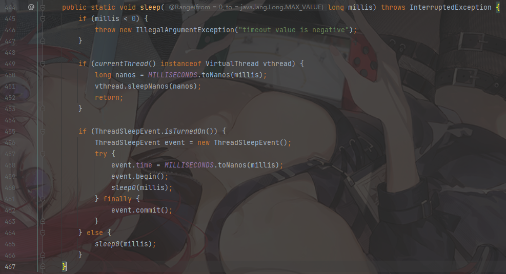


```
如果是普通线程就会调用 native的 sleep0方法。
如果是虚拟线程,就会调用 VirtualThread.sleepNanos()方法
```


虚拟线程的 sleepNanos方法

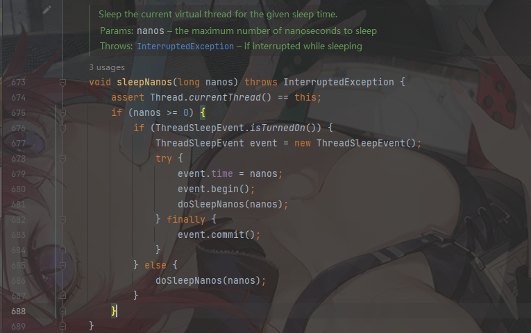


```
目前版本中 ThreadSleepEvent.isTurendOn() 固定返回false. 最终会调用686行的 doSleepNanos

事实上如果返回为true，最终也会调用 681行的 doSleepNanos
```


现在看看 VirtualThread的 doSleepNanos方法

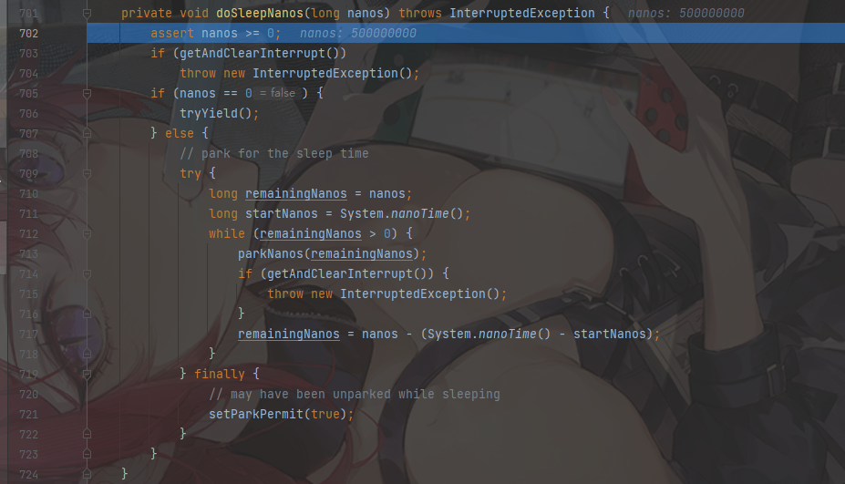


检查是否已经被中断 ：getAndClearInterrupt() 如果没有，则返回false。


下面是getAndClearInterrupt方法：

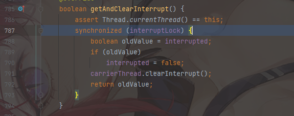

```
先判断当前平台线程上运行的线程是否是自己。
如果是,获得中断锁.并获得中断标志位+清理中断。
同时持有者线程也要清理中断标志
```

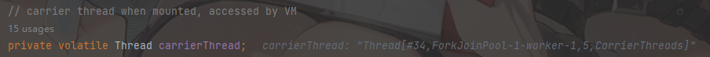

持有者线程(平台线程)

```
虚拟线程必须运行在一个平台线程上,当一个虚拟线程阻塞后,它将被移入堆区,以便当前的平台线程可以运行其他的虚拟线程。
```


如果没有被中断，则判断nanos的时间。如果nanos=0则调用 `tryYield()`让出cpu时间片

```

```


如果 nanos>0 就需要park住 虚拟线程了。调用Virtual.parkNanos()

```java
//VirtualThread.java

	void parkNanos(long nanos) {
        assert Thread.currentThread() == this;

        // 如果park许可为true或者已经被中断了，则立即返回
        if (getAndSetParkPermit(false) || interrupted)
            return;

   		//按照给定的时间 park线程
        if (nanos > 0) {
            long startTime = System.nanoTime();

            boolean yielded;
            Future<?> unparker = scheduleUnpark(nanos);
            setState(PARKING);
            try {
                //可以看到最终调用的是 VirtualThread.yieldContinuation方法()
                yielded = yieldContinuation();
            } finally {
                assert (Thread.currentThread() == this)
                        && (state() == RUNNING || state() == PARKING);
                cancel(unparker);
            }
            //如果 yielded返回的是false则
			//在持有者线程中，park完剩余的全部时间
            if (!yielded) {
                long deadline = startTime + nanos;
                if (deadline < 0L)
                    deadline = Long.MAX_VALUE;
                parkOnCarrierThread(true, deadline - System.nanoTime());
            }
        }
    }
```


 重要的 yieldContinuation()方法


```
调用Continuation.yield 解除挂载当前的虚拟线程。 当虚拟线程重新运行时,重新挂载到平台线程中。 

这个方法必须通知到 JVMTI ( debug接口)
```


```java
//VirtualThread.java
	@ChangesCurrentThread   //改变当前线程的方法都应该被标注@changesCurrentThread注解
    private boolean yieldContinuation() {
        boolean notifyJvmti = notifyJvmtiEvents;

        // unmount 解除挂载
        if (notifyJvmti) notifyJvmtiUnmountBegin(false); //通知JVMTI 解除挂载开始
        unmount();
        try {
            //关键代码，调用了 Continuation.yield()
            return Continuation.yield(VTHREAD_SCOPE);
        } finally {
            // re-mount 重新挂载
            mount(); 
            if (notifyJvmti) notifyJvmtiMountEnd(false);
        }
    }
```

[@ChangesCurrentThread](#1.3.1 @ChangesCurrentThread) 注解


```java
   //Continuation.java
   public static boolean yield(ContinuationScope scope) {
        Continuation cont = JLA.getContinuation(currentCarrierThread());
        Continuation c;
        for (c = cont; c != null && c.scope != scope; c = c.parent)
            ;
        if (c == null)
            throw new IllegalStateException("Not in scope " + scope);

        return cont.yield0(scope, null);
    }
```


### 1.2.2 虚拟线程在底层是如何工作的呢？

```
当Continuation yield它的任务时，相应的线程栈将从运行它的平台线程移动到堆内存中,所以当前这个平台线程就可以自由的运行另一个虚拟线程了。
当这个任务获得可以继续运行的信号时，它的线程栈将从堆移回平台线程，但不一定是与之前相同的平台线程。

这就是阻塞一个虚拟线程的代价：将这个虚拟线程的线程栈移动到主内存中，然后返回。阻塞一个虚拟线程不是免费，但是它比阻塞一个平台线程要便宜的多。


好的方面是：JDK的所有阻塞操作都被重构以利用这一机制。这包括I/O操作，synchroniztion和Thread.sleep()。
```


#### 1.2.2.1 为何阻塞虚拟线程开销小？

```
1.阻塞一个平台线程，需要保存所有的通用寄存器。对于C语言来说，约定一部分寄存器是可以直接使用的，无需保存。所以，对于C的协程来说,这些约定的寄存器就不需要保存。但如果调用内核态切换切换线程就必须保存，因为内核态并不知道应用程序层面上到底使用了那些寄存器，约定了哪些寄存器，只能全部保存。

2. 内核态和用户态虚拟虚拟地址相差很大，切换以后会导致很多缓存失效
```


## 1.3 一些相关类/注解


### 1.3.1 @ChangesCurrentThread

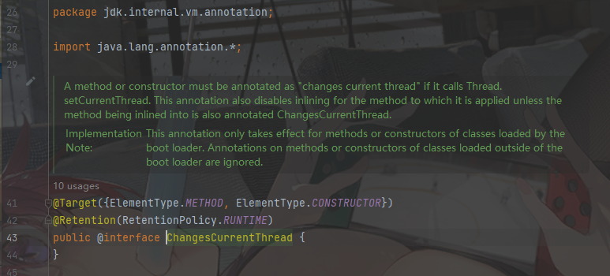


一个方法或者构造器   如果调用了 `Thread.setCurrentThread()`方法，必须标注 `@ChangesCurrentThread`注解。


### 1.3.2 Continuation


#### 1.3.2.1 什么是 Continuation

参考知乎问题：

https://www.zhihu.com/question/61222322


#### 1.3.2.2  yield方法

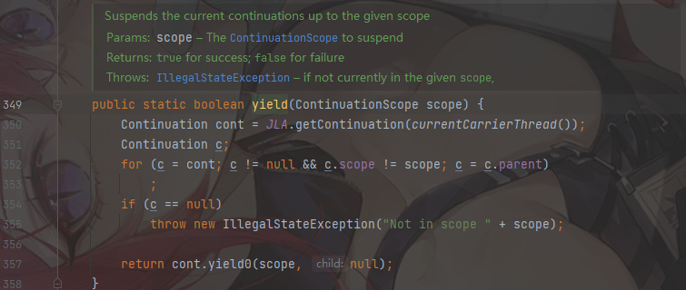


```
在给定的 作用域中，中断当前的 continuations  , (这意味着将会发生上下文切换)
```


成员变量 父 continuation  , 子 continuation


```
对于原始栈来说，他的parent是null
```


yield方法会在当前continuation中逐级向上找对应的 scope，然后尝试yield它。


#### 1.3.2.3  continuation对象工作


首先 java Compiler 需要配置 `--add-exports java.base/jdk.internal.vm=ALL-UNNAMED` 参数，允许` java.base`模块下的 

`jdk.internal.vm` 包被任何模块引入


同时VM启动参数需要配置 `--add-opens java.base/jdk.internal.vm=ALL-UNNAMED`  允许Runtime时使用`jdk.internal.vm` 包下的内容。


```java
        ContinuationScope scope = new ContinuationScope("myScope");

        Continuation continuation = new Continuation(scope,()->{

            System.out.println("Running");

            Continuation.yield(scope);

            System.out.println("after yield");

        });

        System.out.println("Start");
        continuation.run();
        System.out.println("Done");


/**
*Start
*Running
*Done
*/
```

```
 Continuation.yield(scope);  //yield会暂停Continuation的运行,除非调用实例方法 continuation.run()
```

[continuation.run()](# 1.3.2.4  continuation.run())


```java
public class Main1 {

    static volatile  boolean flag = true;

    public static void main(String[] args) throws InterruptedException {
        ContinuationScope scope = new ContinuationScope("myScope");

        Continuation continuation = new Continuation(scope,()->{

            System.out.println("Running");

            Continuation.yield(scope);

            System.out.println("after yield");

        });

        System.out.println("Start");
        continuation.run();
        while (flag){
            Thread.sleep(50);
        }
        System.out.println("Done");
    }
}
/*
*	start
*   Running
*   
*/
```

```
如果没有调用 continuation.run();  那么Continuation的Suspends永远也不会恢复
```


````java
    public static void main(String[] args) throws InterruptedException {
        ContinuationScope scope = new ContinuationScope("myScope");

        Continuation continuation = new Continuation(scope,()->{

            System.out.println("Running");

            Continuation.yield(scope);

            System.out.println("after yield");

        });

        System.out.println("Start");
        continuation.run();
        Thread.sleep(5000);
        continuation.run();
        System.out.println("Done");
    }
````

```
5000ms以后，重新调用 continuation.run()
```


#### 1.3.2.4  continuation.run()


```
挂载当前Continuation到平台线程中，并运行continuation体的内容. 如果当前Continuation是被暂停的状态，那么从暂停的断点中继续运行。
```


#### 1.3.2.5 防止将虚拟线程移动到堆内存中

````
我们知道，在C语言中，我们可以通过在变量前带上这个&字符来获得线程栈上的地址。

这里有个问题：如果我们把这个线程栈移到别的地方， 并尝试将其放回另一个平台线程上，这个地址仍然有效的可能性非常小。

所以如果我们在自己的虚拟线程栈中有一些C代码，或者至少在这个栈上有一个地址，这个栈会被固定到某个平台线程上，这意味着虚拟线程可能会阻塞当前平台线程。
````


测试是否会阻塞在当前平台线程？

```java
//VirtualThread.java
	void parkNanos(long nanos) {
        assert Thread.currentThread() == this;

        // complete immediately if parking permit available or interrupted
        if (getAndSetParkPermit(false) || interrupted)
            return;

        // park the thread for the waiting time
        if (nanos > 0) {
            long startTime = System.nanoTime();

            boolean yielded;
            Future<?> unparker = scheduleUnpark(nanos);
            setState(PARKING);
            try {
                //如果不允许虚拟线程存放到堆区中这里将返回false,表示yield失败
                yielded = yieldContinuation();
            } finally {
                assert (Thread.currentThread() == this)
                        && (state() == RUNNING || state() == PARKING);
                cancel(unparker);
            }
			
            //此时,当前虚拟线程只能阻塞在当前平台线程中。 在JDK中这样的线程称之为 pinned 粘滞
            // park on carrier thread for remaining time when pinned
            if (!yielded) {
                long deadline = startTime + nanos;
                if (deadline < 0L)
                    deadline = Long.MAX_VALUE;
                parkOnCarrierThread(true, deadline - System.nanoTime());
            }
        }
    }
```


[Pinned](# 1.3.4  Pinned)


##### 1.3.2.5.1编写对应的粘滞代码


###### synchronized


```java
public class Main3 {


    static Pattern POOL_PATTERN = Pattern.compile("ForkJoinPool-[\\d?]");
    static Pattern WORKER_PATTERN = Pattern.compile("worker-[\\d?]");

    private final static Object lock = new Object();
    private static int counter = 0;

    public static void main(String[] args) throws Exception {
        Set<String> poolNames = ConcurrentHashMap.newKeySet();
        Set<String> pThreadNames = ConcurrentHashMap.newKeySet();
        ChronoUnit delay = ChronoUnit.MICROS;

        List<Thread> threads = IntStream.range(0, 100)
                .mapToObj(index -> Thread.ofVirtual().unstarted(() -> {
                    try {
                        String s = Thread.currentThread().toString();
                        //阻塞虚拟线程并对比 Thread.currentThread
                        sleepAndCompare(pThreadNames, delay, s);
                        sleepAndCompare(pThreadNames, delay, s);
                        sleepAndCompare(pThreadNames, delay, s);
                    } catch (Exception e) {
                        throw new RuntimeException(e);
                    }

                }))
                .toList();

        threads.forEach(Thread::start);
        for (Thread thread : threads) {
            thread.join();
        }
        synchronized (lock) {
            System.out.println("# counter = " + counter);
        }
        System.out.println("# Platform threads：" + pThreadNames.size());

    }

    private static void sleepAndCompare(Set<String> pThreadNames, ChronoUnit delay, String s) throws InterruptedException {
        pThreadNames.add(readWorkerName());
        synchronized (lock) {
            Thread.sleep(Duration.of(1, delay));
            counter++;
        }
        if(!Thread.currentThread().toString().equals(s)){
            System.out.println("改变了worker");
        }
    }

    private static String readWorkerName() {
        String name = Thread.currentThread().toString();
        Matcher matcher = WORKER_PATTERN.matcher(name);
        if (matcher.find()){
            return matcher.group();
        }
        return "not found";
    }

    private static String readPoolName() {
        String name = Thread.currentThread().toString();
        Matcher matcher = POOL_PATTERN.matcher(name);
        if (matcher.find()){
            return matcher.group();
        }
        return "pool not found";
    }
}
// counter = 300
// Platform threads:9
```


在parkNanos直接打上断点，可以看到 yielded的值为false所以直接会阻塞到当前持有者线程。

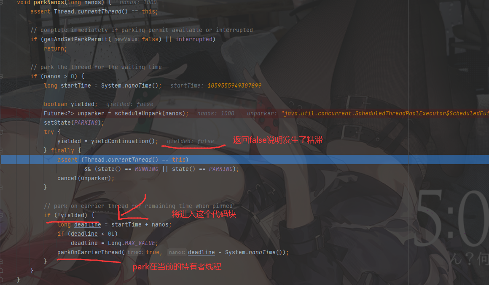


```
synchronized同步代码块会导致虚拟线程粘滞。
```


###### ReentrantLock

使用ReentrantLock 可以支持虚拟线程的切换，不会发生粘滞

```java
public class Main4 {

    static ReentrantLock lock = new ReentrantLock();
    static int counter = 0;

    public static void main(String[] args) throws InterruptedException {
        Set<String> poolNames = ConcurrentHashMap.newKeySet();
        Set<String> pThreadNames = ConcurrentHashMap.newKeySet();
        ChronoUnit delay = ChronoUnit.MICROS;

        List<Thread> threads = IntStream.range(0, 100)
                .mapToObj(index -> Thread.ofVirtual().unstarted(() -> {
                    try {
                        String s = Thread.currentThread().toString();
                        sleepAndCompare(pThreadNames, delay, s);
                        sleepAndCompare(pThreadNames, delay, s);
                        sleepAndCompare(pThreadNames, delay, s);
                    } catch (Exception e) {
                        throw new RuntimeException(e);
                    }

                }))
                .toList();

        threads.forEach(Thread::start);
        for (Thread thread : threads) {
            thread.join();
        }
        try {
            lock.lock();
            System.out.println("# counter = " + counter);
        }finally {
            if (lock.isHeldByCurrentThread()) {
                lock.unlock();
            }
        }
        System.out.println("# Platform threads：" + pThreadNames.size());
    }

    private static void sleepAndCompare(Set<String> pThreadNames, ChronoUnit delay, String s) throws InterruptedException {

        try{
            lock.lock();
            pThreadNames.add(Main3.readWorkerName());
            Thread.sleep(Duration.of(1,delay));
            if (!Thread.currentThread().toString().equals(s)){
                System.out.println("different platform Thread...");
            }
        } finally {
            if (lock.isHeldByCurrentThread()) {
                lock.unlock();
            }
        }
    }
}
```


如果太多的虚拟线程发生粘滞，会发生什么？

`ForkJoinPool`可以检测到这一点，并创建更多的平台线程，至少Loom暂时是这种实现机制，当然相应的性能也会收到影响。


### 1.3.3 ContinuationScope

```
表达了一个 continuation 的作用域
```


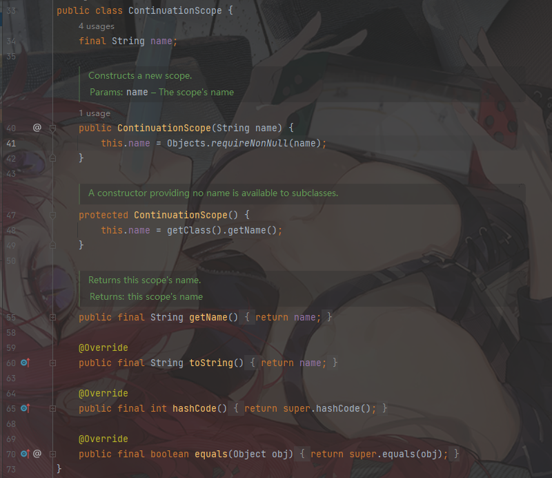


### 1.3.4  Pinned

这是一个内部枚举类，在 Continuation中，列举了 VirtualThread粘滞在原平台线程的原因


```
使用了 native frame

监视器持有

在临界区
```


## 1.4 虚拟线程对于Java开发人员的意义

参考来自于

https://www.bilibili.com/video/BV1DN4y1c7uk


Java对后向兼容一直比较好。

使用虚拟线程的开销很低，可以使用 `Thread.ofVirtual`的工厂方法，也可以使用一个使用虚拟线程的 ExecutorService


很多框架都支持配置ExecutorService,所以只需要提供一个使用VirtualThread的ExecutorService即可。


### 1.4.1 虚拟线程适用于哪一类应用


适用于IO密集型引用。这样的引用会花费大量时间在等待IO上，大多数服务器端都是IO密集型引用。 

例如:

```
花费大量时间等待数据库,网络IO等其他服务
```


虚拟线程是轻量级的，耗费资源很少，对于哪些不得不等待的IO，通常会阻塞当前线程，让出时间片给其他线程使用。

如果一个请求由虚拟线程来处理，它轻量级别的切换线程上下文，特别适用于频繁等待IO切换的服务密集型应用。


至于虚拟线程如何从平台线程解除绑定，jdk如何调度其他虚拟线程来执行， 这些都是底层的实现细节，无需由开发人员关心。


# 2. Project Loom


参考https://developer.okta.com/blog/2022/08/26/state-of-java-project-loom

https://blog.csdn.net/HongYu012/article/details/123423761


结构化并发：

https://www.bilibili.com/video/BV1ED4y127aY/?spm_id_from=333.337.search-card.all.click&vd_source=add6ccafd4287fc36f0faa387b936816


## 2.1 what is  Project Loom?


Project Loom 目的是尽可能的减少  开发,维护,监控观察高吞吐并发应用的影响并以此来发挥硬件的最佳性能。

```
Project Loom 是在Java生态中比较新的一个项目。 提出了 结构化并发 的概念。
```


## 2.2 结构化并发StructuredTaskScope


在传统并发编程中，我们像如下编写并发代码

```java
void handleOrder() throws ExecutionException, InterruptedException {
1:    try (var esvc = new ScheduledThreadPoolExecutor(8)) {
2:        Future<Integer> inventory = esvc.submit(() -> updateInventory());
3:        Future<Integer> order = esvc.submit(() -> updateOrder());

4:        int theInventory = inventory.get();   // Join updateInventory
5:        int theOrder = order.get();           // Join updateOrder

        System.out.println("Inventory " + theInventory + " updated for order " + theOrder);
    }
}
```


在第4，5行时，我们通过Future.get()等待两个子任务完成，并共同返回结果。


我们希望的场景:  两个子任务构成一个Scope,任意一个失败了，另一个就会取消，同时handleOrder也会失败。但是事实可能会和我们想象的  far away

```
1. 各个子任务的成功和失败都是完全独立的，因为他们运行在各自的线程。 那么一个子任务失败了，由于另一个子任务是非常昂贵耗时的操作,如何取消另一个子任务。

2.如果updateInventory()失败了，取消 updateOrder时，发现updateOrder已经成功了，此时又需要补偿机制。

3.如果执行handleOrder()的线程被中断了。那么中断并不会传播到两个子任务上去，因为他们运行在各自的线程中。此时
 updateInventory() 和 updateOrder()就会发生泄漏,并在后台继续运行。
```


对于上述情况，我们必须谨慎的写出故障保护方法，把这些所有的担子都交给开发者。


现在对于这种情况，我们可以使用结构化并发实现。

```java
void handleOrder() throws ExecutionException, InterruptedException {
    try (var scope = new StructuredTaskScope.ShutdownOnFailure()) {
        Future<Integer> inventory = scope.fork(() -> updateInventory());
        Future<Integer> order = scope.fork(() -> updateOrder());

        scope.join();           // Join both forks
        scope.throwIfFailed();  // ... and propagate errors

        // Here, both forks have succeeded, so compose their results
        System.out.println("Inventory " + inventory.resultNow() + " updated for order " + order.resultNow());
    }
}
```


### 2.2.1 结构化并发保证如下特性


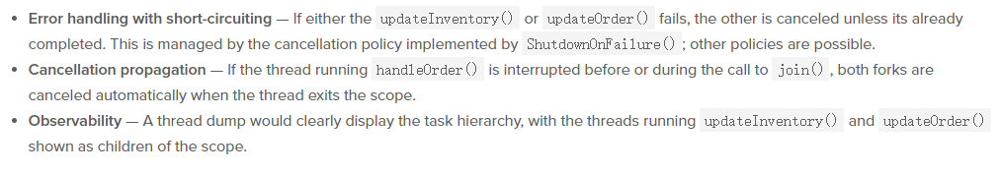

`Error handling with short-circuiting` 

异常处理短路 ： 任意一个子任务出现异常，都会取消其他的子任务。除非子任务已经完成了。

`Cancellation propagation`

任务取消可传播 ：  如果运行handleOrder方法的线程在调用join方法前被中断了，那么相应fork出的子线程在退出当前域(?)都会被自动取消。

`Observability`

可观察性。 导出的 Thread dump能够更加清晰的描绘出 任务之间的继承关系。	 `updateInventory()` `updateOrder()`将会作为 scope的子任务的方式展现在 dump中


## 2.3 StructuredTaskScope

结构化任务作用域。

用于将多个异步操作组合成一个 Scope。这个类实现了autoClose ，使用时需要配合`try-with-source`使用


### 2.3.1 一个简单示例

```java
public static void main(String[] args) {

        try (StructuredTaskScope<Object> scope = new StructuredTaskScope<>()) {

            Future<String> firstObj = scope.fork(() -> {

                Thread thread = Thread.currentThread();

                String name = "thread 1";

                thread.setName(name);
                System.out.println("current thread is virtual ? "+thread.isVirtual());

                System.out.println(name+" will sleep 2s");
                Thread.sleep(2000);
                System.out.println(name+"sleep done");
                return "Hello,World";
            });
            
            //阻塞当前线程，直到firstObj返回了结果
            scope.join();

            if (!firstObj.isCancelled()) {
                System.out.println(firstObj.resultNow());
            }

        } catch (InterruptedException e) {
            throw new RuntimeException(e);
        }

    }
```


### 2.3.2  ShutdownOnSuccess

这个类是 StructuredTaskScope的子类，当Scope中多个异步任务，有任何一个返回成功了，那么就取消其他异步任务。


```java
public static void main(String[] args) {


        try (var scope = new StructuredTaskScope.ShutdownOnSuccess<String>()) {

            Future<String> async1 = scope.fork(() -> {
                Thread.sleep(1000);
                return "hello,world";
            });

            Future<String> async2 = scope.fork(() -> {
                return "this war of mine!";
            });

            scope.join();
            //scope.result 返回第一个success的结果
            String result = scope.result();
            System.out.println(result);


        } catch (ExecutionException e) {
            throw new RuntimeException(e);
        } catch (InterruptedException e) {
            throw new RuntimeException(e);
        }


    }
```


一种使用流的化简示例：

```java
package com.semghh.hello;

import jdk.incubator.concurrent.StructuredTaskScope;

import java.util.HashSet;
import java.util.Set;
import java.util.concurrent.Callable;
import java.util.concurrent.ExecutionException;
import java.util.function.Function;
import java.util.stream.Stream;

/**
 * @author SEMGHH
 * @date 2022/11/8 17:26
 */
public class Main2 {

    static Set<String> names = new HashSet<>();

    public static void main(String[] args) {

        try (var scope = new StructuredTaskScope.ShutdownOnSuccess<String>()) {

            Stream.of("/01/getMsg","/02/getMsg","/03/getMsg")
                    //这里主要是 使用lambda 连续化简了2个函数式接口
                    .map((Function<String, Callable<String>>) s ->()->getMsgFromUrl(s))
                	//第一个函数式接口是 Function<T,R>, 第二个函数式接口是 Callable<E>
                	//T是Function接口方法的形参，R是返回值。
                	//E是Callable的返回值，是一个无参方法，所以使用()化简
                	//由于Function方法体是直接返回 返回值。所以可以化不写括号，不写return
                    .forEach(scope::fork);
	
            scope.join();
            String result = scope.result();
            System.out.println(result);
            System.out.println(names.size());

        } catch (ExecutionException e) {
            throw new RuntimeException(e);
        } catch (InterruptedException e) {
            throw new RuntimeException(e);
        }
    }

    public static String getMsgFromUrl(String url){
        names.add(Thread.currentThread().getName());
        return url + "hello,world";
    }
}
```


### 2.3.3 ShutdownOnFailure

和`ShutdownOnSucces` 类似，

`ShutdownOnFailure`当Scope组合的多个异步任务，有一个失败了，就取消其他异步任务。


```java
```


### 2.3.4 改造一个StructuredTaskScope


在一个Scope中我们，开启 `多个异步任务` 向 `多个` 服务器发送 `报价查询` 。

此时我们需要在`StructuredTaskScope`中添加一个 `bestQuotation`方法，来返回一个最佳报价。


核心点是重写 `StructuredTaskScope.handlerComplete`方法


```
在scope关闭之前，同时task完成以后，调用本方法(handleComplete)


重点：

本方法(handleComplete)应该是一个线程安全的方法，因为它可能会被几个线程并发调用。
```


下面是改造`StructuredTaskScope`代码示例

```java
public static void main(String[] args) {

        try(var scope = new QuotationScope()) {

            Stream.of("/01/quotation","/02/quotation","/03/quotation")
                    .map((Function<String,Callable<Double>>)  url->()->getQuotationFromUrl(url))
                    .forEach(scope::fork);


            scope.join();

            Optional<Double> bestQuotation = scope.bestQuotation();

            if (bestQuotation.isPresent()){
                System.out.println("存在最佳报价："+bestQuotation.get());
            }else {
                ConcurrentLinkedDeque<Throwable> exceptions = scope.getExceptions();
                
                throw new RuntimeException("查询全部报价失败了，原因："+exceptions);
            }


        } catch (InterruptedException e) {
            throw new RuntimeException(e);
        }

    }

    /**
     * 改造的scope
     */

    public static class QuotationScope extends StructuredTaskScope<Double> {

        private final ConcurrentLinkedDeque<Double> quotations = new ConcurrentLinkedDeque<>();

        private final ConcurrentLinkedDeque<Throwable> exceptions = new ConcurrentLinkedDeque<>();

        /**
         * 改造整个scope的核心方法，重写了handleComplete
         */
        @Override
        protected void handleComplete(Future<Double> future) {
            switch (future.state()){
                case RUNNING -> throw new IllegalStateException("Future is still running...");

                case SUCCESS -> quotations.add(future.resultNow());

                case FAILED -> exceptions.add(future.exceptionNow());

                default -> {}

            }
        }

        public ConcurrentLinkedDeque<Throwable> getExceptions() {
            return exceptions;
        }

        public Optional<Double> bestQuotation() {
            //返回最佳报价
            return quotations.stream().min(Comparator.naturalOrder());
        }
    }

    /**
     * 从url地址中获取 报价
     */
    public static double getQuotationFromUrl(String url){
        try {
            Thread.sleep(1000);
        } catch (InterruptedException e) {
            throw new RuntimeException(e);
        }
        throw new RuntimeException("1");
        // 以随机值的方式返回报价
//        return Math.random();
    }
```


### 2.3.5 类方法


```
scope类的public方法如上图。
```


#### fork(Callable)


```
1.新建一个线程，然后执行给定的Task。 //这意味着每fork出一个子线程都会有一个新线程去执行。

2.新的线程被 Scope的 线程工厂创建。

3.如果scope被shutdown前有 task完成了，那么就会调用handle方法(handleComplete)

4.如果task方法返回了正确的result，或者返回了一个exception，handleComplete方法都会被调用

5.如果在scope调用shutdown之前，future被cancel了，那么handleComplete方法将在调用cancel的线程中执行。

6.如果scope的shutdown 和 task完成/取消 几乎在同一个时间点，那么handleCompelete方法有可能被调用，也有可能不被调用。
```


```
7.如果task已经被shutdown了，或者正在shutdown中，fork方法将返回一个代表取消状态task的Future

8.fork方法只能被scope持有者线程调用，或者 在task scope中的线程调用。

9.fork方法返回的Future对象也能控制scope或者scope中的线程。如果其他线程调用cancel方法将会抛出
WrongThreadException异常
```


### 2.3.6 使用scope的优点

可以使用非常简单的同步结构，来编写异步Task，执行任务的线程还可以是 `虚拟线程`的，它的开销十分的小。


# 3.模式匹配

参考

https://www.bilibili.com/video/BV1ZV4y1N7eH/?spm_id_from=333.999.0.0&vd_source=add6ccafd4287fc36f0faa387b936816


从Java14开始 java就主键适配模式匹配对应的功能。


模式匹配：

```
匹配满足特定模式的对象。
```


模式匹配将改变一部分语法。


## 3.1 目前 模式匹配的地方


```
1.instanceof 
2.switch
```


### 3.1.1 instance of

传统写法

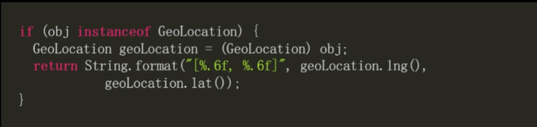


记录类型的模式

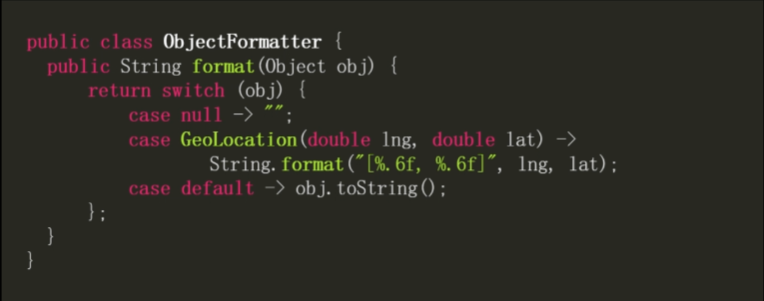


### 3.1.2 switch


在switch中可以直接使用null进行分支判断。 不必单独判断。


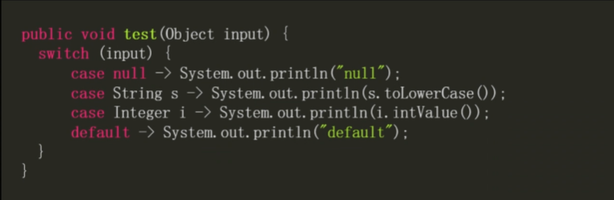


#### 3.1.2.1 模式匹配的守卫条件


在进行模式匹配时，一个常见的需求是对类型匹配成功的对象，再执行进一步检查。

这种额外的检查条件称为  `模式匹配的守卫条件` 


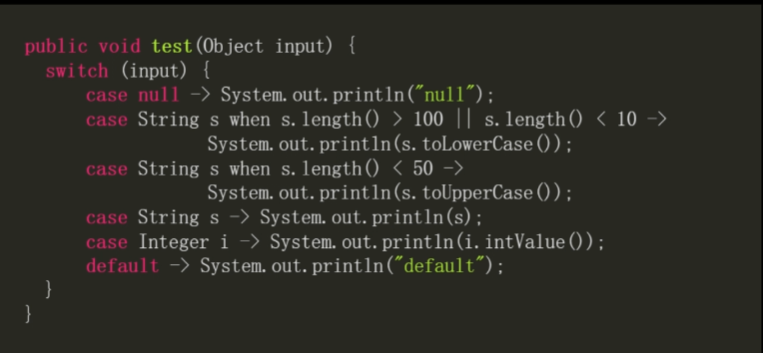


#### 3.1.2.2 case标签范围重叠

引入了模式匹配的情况以后,不同的case标签匹配的对象范围可能产生重叠。


例如：

```java
1  case String s when s.length()<50
2. case String s
    
// 我们知道满足case1标签的变量必然满足case2标签
```

这种现象称之为 case2 支配了 case1。  (范围大的标签支配了 范围小的)

编译器要求，被支配的标签(小范围)必须在前面。 支配标签必须在后面


​	


