# 1. JDK9新特性


参考

https://www.oracle.com/java/technologies/javase/9-relnotes.html


## 1.1 模块化

在JDK8中， JDK内部包中的`public`类仍然可以被 `Classpath`路径下的代码所访问。  这会让 `classpath`上的代码通过 `setAccessible`访问JDK内部，以及访问其他非`public` 的非公有变量。 未来的JDK版本将更改策略，拒绝非法访问 JDK包中的类成员。


JDK将抛出 `非法访问`的警告，如果开发者使用的 lib库报告了此警告，请提交给lib的维护者。


事实上我们在微服务中就已经使用了模块化编程。


参考https://zhuanlan.zhihu.com/p/347112501

​		https://zhuanlan.zhihu.com/p/142697835


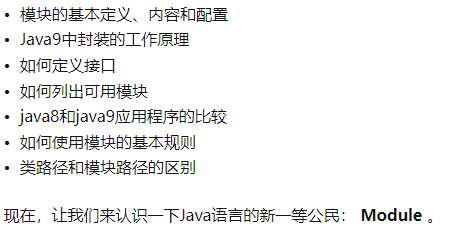


### 1.1.1 什么是模块化

模块是 代码,数据,资源 的集合。它是一组相关的包和类型(类,抽象类,接口),包含代码，数据文件和一些静态资源。

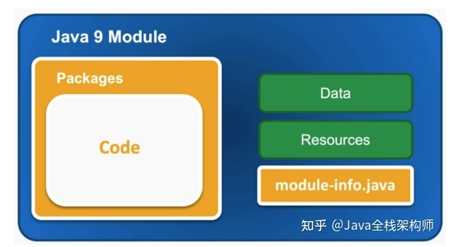


```
例如，模块描述符module-info.java是Java9模块中的资源之一。
（模块描述符是模块声明的编译版本。创建此文件时，必须知道2种信息：模块将依赖于什么以及它将导出什么。）
```


Java9模块系统主要目标是支持Java中的模块化编程。


### 1.1.2 模块关系

模块是可以依赖其他模块的。


模块传递性 transitive

```
依赖了模块A，那么会自动依赖模块A依赖的模块
```


static

有时候，我们在代码中使用到了某些类，那么编译的时候必须要包含这些类的jar包才能够编译通过。但是在运行的时候我们可能不会用到这些类，这样我们可以使用static来表示，该module是可选的。

比如下面的module-info:

```java
module com.flydean.controller {
    requires com.flydean.service;
    requires static com.flydean.serviceb;
}
```


`exports ... to  ...`


在module info中，如果我们只想将包export暴露给具体的某个或者某些模块，则可以使用exports to:

```text
module com.flydean.service {
    exports com.flydean.service to com.flydean.controller;
}
```

上面我们将com.flydean.service只暴露给了com.flydean.controller。


`open pacakge`


使用static我们可以在运行时屏蔽模块，而使用open我们可以将某些package编译时不可以，但是运行时可用。

```text
module com.flydean.service {
    opens com.flydean.service.subservice;
    exports com.flydean.service to com.flydean.controller, com.flydean.servicea, com.flydean.serviceb;
}
```

上面的例子中com.flydean.service.subservice是在编译时不可用的，但是在运行时可用。一般来说在用到反射的情况下会需要这样的定义。


### 1.1.3 列出JDK的所有模块


```
java --list-modules

java --list-modules | grep -e 'java\'.''

java --list-modules | grep "java\."
```


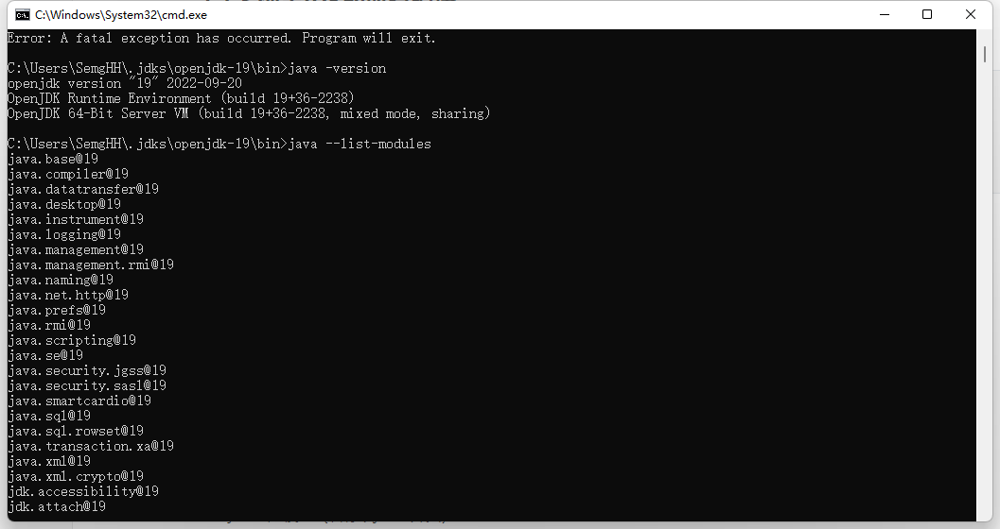


### 1.1.4 一些模块


jdk9的一组模块包括：

- 实现JavaSE规范的标准模块（名称以Java.*开头）
- JavaFX模块（名称以JavaFX.*开头）
- JDK特定模块（名称以JDK.*开头）
- Oracle特定模块（名称以Oracle.*开头）


```
每个模块名称后面都有一个版本字符串。例如使用的是jdk9.0.4版本，因此每个模块后面都有版本字符串@9.0.4。
```


### 1.1.5 java8 和java9应用对比


对于java8的应用来说

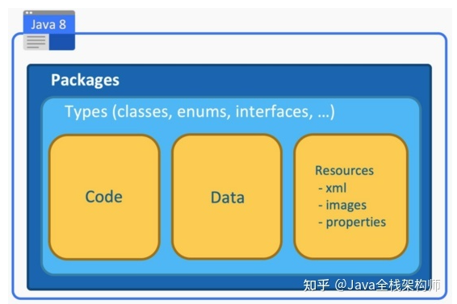


对于java9的应用来说

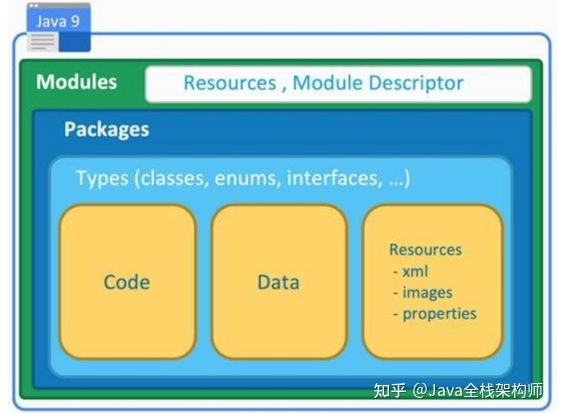


```
jdk9 以前，java通过不同的package和jar来做功能的区分和隔离。
```


java.base是特殊的模块，它不依赖其他模块，他是最顶层的模块，被其他模块依赖。其他模块无需显式的引用 java.base

```
class 是字段和方法的集合。package是class的集合， module是 package的集合
```


通常，使用模块或不使用对用户是感觉不到的。 开发者可以将模块的jar包当作普通jar来使用。

```
当使用普通的jar包时，JDK将会采用一种Automatic modules的策略将普通jar包当成module jar包来看待。
```


````
要使用module jar包，需要将该jar包放入modulepath而不是classpath。
````


### 1.1.5 定义一个模块

模块基本准测：

```
1.每个模块都必须有一个唯一的名称

2.模块在源文件中都有一些描述

3.模块描述符 必须放在顶层目录中

4.模块内 可以有 任意数量的包和类型

5.模块可以依赖于 任意数量的模块
```


#### 1.1.5.1模块描述符

模块描述符是一个java文件。

```java
module com.semghh.module1 {
    //module metadata  这里填写模块的元数据
}
```


#### 1.1.5.2 模块元数据

模块元数据包含3个部分：  

唯一ID  

`exports`     将包导出，以便其他模块可以使用。  (导出的是一个包)

 `requires`  导入或使用其他模块


```java
module com.semghh.module2 {
	exports com.semghh.taman.service;
    
    requires com.semghh.module1;
}
```


#### 1.1.5.3 实际演示

```
在IDEA中创建一个module很简单，只需要在java文件夹中添加module-info.java文件就可以了。
```


在父工程中创建2个子module  (按照 controller service 划分module是不合理的，我这里只做一个演示)

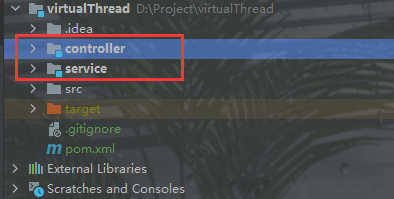

##### 父工程

父工程的pom.xml文件中 标识：

```xml
<modules>
    <module>service</module>
    <module>controller</module>
</modules>
```

表示包含2个子module ，名字分别是 controller 和 service


##### module2

模块2的结构图：

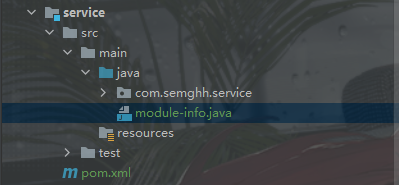


module-info.java

```java
module com.semghh.test.service {
	//导出了对应的包
    exports com.semghh.service;

}
```


##### module1

controller  module中的文件结构。

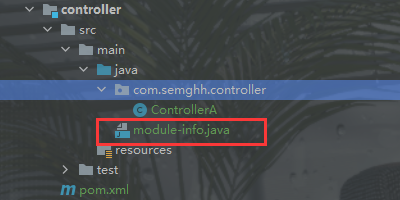


controller module的 `module-info.java`文件：


```java
module com.semghh.test.controller {
	
    //导出了自己工程下的  com.semghh.controller 包
    exports com.semghh.controller;


    //导入了 名为com.semghh.test.service的 module
    requires com.semghh.test.service;

}
```

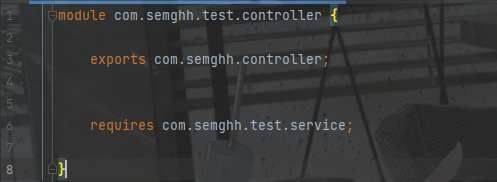


此时模块1中可以使用模块2导出的类：

```java
package com.semghh.controller;

//导入了对应的类
import com.semghh.service.ServiceA;

/**
 * @author SemgHH
 */
public class ControllerA {

    //使用
    private ServiceA serviceA;


}
```


实际生产中微服务项目是这样构建模块的：

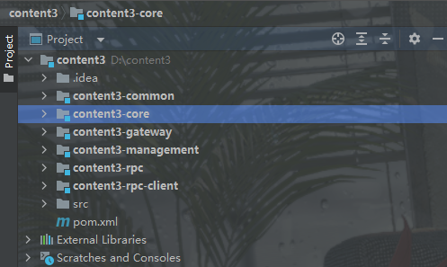

```
按照业务的划分：
通用模块 common：  多个模块之间共用的类,常量,依赖,存放在common模块中。其他的全部模块都必须引入common模块

core  核心代码模块

gateway 网关模块

management  后台管理模块

rpc 负责远程过程调用模块

....
```


## 1.2 默认GC

JDK9中的默认垃圾回收器为  G1


## 1.3 String类修改

JDK9以后，`String` 类的内部存储结构改为  `byte[]` 和编码标志位。


JDK8 `String` 类内部存储为 `char[]` ，大多数的app中的大多数String并不需要存储 UTF-16。


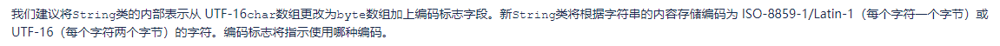


与字符串相关的类，如`AbstractStringBuilder`、`StringBuilder`和`StringBuffer`都将获得如上的更新。


