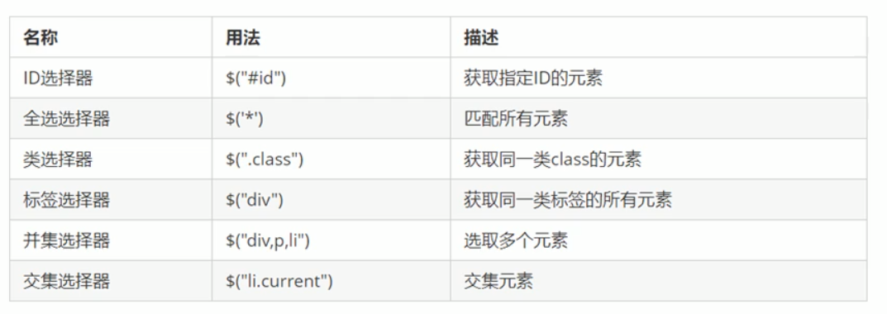
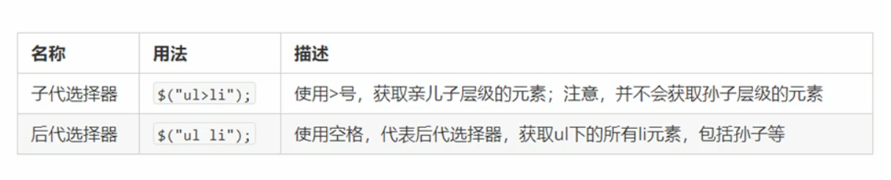
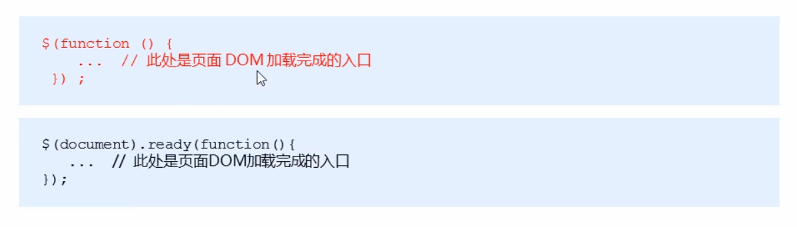
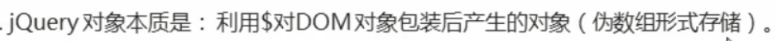
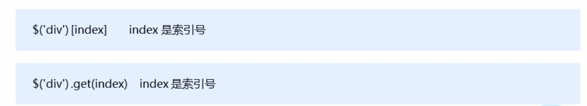
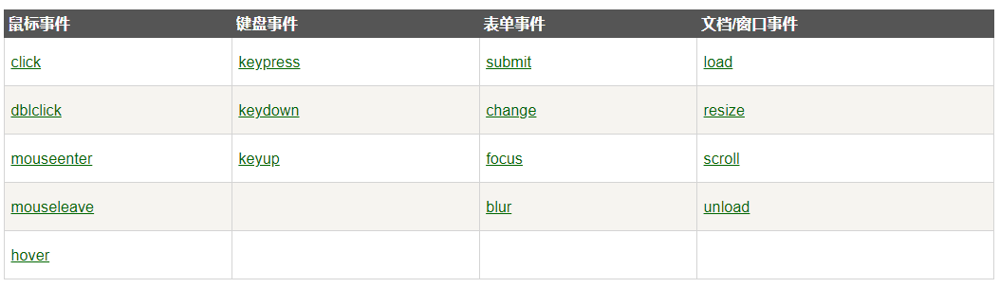
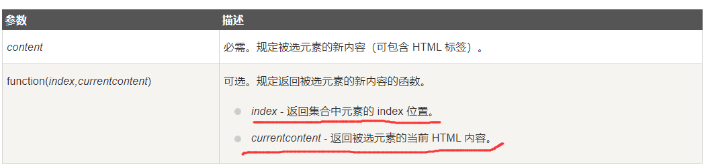
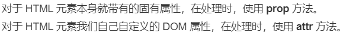
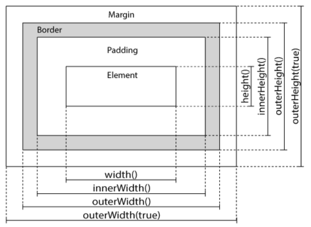

# 1. JQuery

runoob

https://www.runoob.com/jquery/jquery-tutorial.html


## 1.1 选择器

jQuery 中所有选择器都以美元符号开头：`$()`。


### 1.1.1 基本的选择器


#### 1.1.1.1元素选择器

用于选择`<p>`标签。

```
$('p')
```


#### 1.1.1.2 `id`选择器

语法：

```js
$('#<id>')
//其中<id> 表示id
//例如 $('#submit_button')
```

例如

`$('#test')`


#### 1.1.1.3 `class`选择器

```js
//语法
$('.<class_name>')
//其中 <class_name>表示类名称

//例如
$('.test')
```


#### 1.1.1.4 总结



支持一次选择 以`,`隔开得 【多个元素】。


```js
$("root")

$("class")

$("p")

$("p,input,select")  //标签选择器 ， 支持同时选择多个标签
```


### 1.1.2 层级选择器

使用`>` 表示向下一代（向后一代）选择。




$("parent>child") //选择parent下的所有子元素

```js
$("div>p")  //选择div下的所有直接p元素
```


### 1.1.3 属性选择器


```js
//语法
$('[attribute]')

//其中 attribute 表示属性名。


//例如：
$("[href]")  //所有带有href属性的元素
```


```js
[attribute=value]  选择 attr=value的全部元素     $("[type=text]")   //选择type属性为text的全部元素

属性选择器支持 同时多个查询

$("input[type=radio][name=producType]")   //表示选择所有input元素且type属性等于radio且name属性等于productType
```


!=

``` js
[attr!=value]  属性不等于value的全部元素
```


`$=`    表示以指定值作为结尾

```js
[attr$='value']     $("[href$='.jpg']")    //选择所有 href属性的值以 .jpg结尾的元素
```


`^=`  表示以指定值作为开头

```js
[attr^='value']   $("title^='Tom'")   //查询带有title属性且以Tom开头
```


## 1.2  入口函数


`入口函数`:  等待【页面元素】加载完毕后再执行的函数。


两种语法：




等价于 `原生JS`中 使用添加监听器 `load` `DOMContentLoaded` 


## 1.3 JQuery对象


`原生JS`获取得对象是`DOM`对象。

`JQuery`方法获取得对象是 `JQuery`对象。

两者均不能使用对方独有得属性和方法。 





### 1.3.1 `JQuery`对象和`DOM`对象互转

JQuery 提供了方法，把`DOM` 和 `jquery` 互相转换。


`DOM`  ->  `JQuery`对象

```
$(<dom对象>)
```


`JQuery`对象 -> 为 `DOM`




```
jQuery对象是一个伪数组。数组内的元素是DOM节点，所以直接访问内部的具体元素即可
```


### 1.4 JQuery方法

JQuery 提供了多样得方法。


例如 【事件方法】 ： 绑定/解绑一个事件。

​	


### 1.4.1 事件方法

常见得`DOM`事件




大部分的事件都有一个对应的`JQuery`方法。


#### 1.4.1.1 `trigger()`

触发标签的对应事件，以及该事件的默认行为。 例如触发表单的提交。

```js
$("input").trigger("select")   //触发input标签的 select事件。
```


### 1.4.2 效果方法


用于创建动画效果的 `jQuery` 方法。


#### 1.4.2.1 显示/隐藏`hide()/show()`

本质上利用 `style="display:none"` / `style="display:block"` 进行显示或隐藏。


语法： 

```js
show(speed,callback)
hide(speed,callback)

//speed,callback都是可选项
//speed 参数规定隐藏/显示的速度，可以取以下值："slow"、"fast" 或毫秒。
//callback 参数是隐藏或显示完成后所执行的函数名称。
```


例如：

```js
$('#submit_button').show();

$('exit_button').hide();
```


#### 1.4.2.2 淡入/淡出

https://www.runoob.com/jquery/jquery-fade.html


##### `fadeIn()`淡入

语法:

```
$(*selector*).fadeIn(*speed,callback*);
```

可选的 speed 参数规定效果的时长。它可以取以下值："slow"、"fast" 或毫秒。.

可选的 callback 参数是 fading 完成后所执行的函数名称。

下面的例子演示了带有不同参数的 fadeIn() 方法：


实例:

```js
$("button").click(function(){
  $("#div1").fadeIn();
  $("#div2").fadeIn("slow");
  $("#div3").fadeIn(3000);
});
```


#####  `fadeOut()`淡出


### 1.4.3  HTML/CSS方法

用于处理 `HTML` 和 `CSS` 的 `jQuery`方法。


#### 1.4.3.1 获得/设置 元素的【内容】

三种方法 `val()`  `html() `  `text()`

见名知意：

`val()`： 返回元素 `value`属性值

`html()`: 返回元素 `innerHTML`值

`text()`： 返回元素文本值。


`html()` 用于【设置】或【返回】被选择元素的`innerHTML`


语法：

//返回内容 innerHTML

```js
$("p").html()  //返回内容 innerHTML
$("p").val()  //返回内容 value
$("p").text()  //返回内容 text
```


//设置内容为 content

```js
$("p").html(content)  //设置内容为 content
```


```js
$("p").html(callback)   //设置内容，传入一个函数，使用函数设置内容

//callback的签名如下: function (index,currentContent)

//其中index表示当前元素在 所有被选择元素中的索引
//currentContent 这个元素的旧值。
//callback 返回的结果作为新值设置进元素中。
```





#### 1.4.3.2 获得/设置 元素的【属性】

想要获得元素 某个属性的值。有 `prop()` / `attr()`两种方法。


`attr()` / `prop()`的区别：




语法：

```js
jQuery_object.prop(prop_name)
jQuery_object.attr(attr_name)

//jQuery_object 表示JQuery对象
//attr_name  属性名
//prop_name 属性名
```


```js
jQuery_object.prop(prop_name,prop_value) 
jQuery_object.attr(attr_name,arr_value)

//prop_name属性名  ，prop_value给对应属性设置的新值
```


示例：

```js
$("#button_1").click(function(){
   let href = $('a').prop('href')
   console.log(href)
})
```


#### 1.4.3.3  添加元素/内容

`JQuery` 可以很轻松的添加新`DOM`元素/ 新内容


提供了4种添加内容得方法：  `append()` `prepend()` `after() ` `before()`


`append()` - 在被选元素内 结尾插入内容。 （父子关系）

`prepend()` - 在被选元素内 开头插入内容

`after()` - 在被选元素之后插入内容  。   （兄弟关系）

`before()` - 在被选元素之前插入内容


我们仍然可以通过  `append()`方法追加新的元素，例如：

```js
function append(){
    let new_p = `<p>hello,world</p>`;
    $('#p_1').append(new_p);      //追加了一个新的p元素
    
    
    let new_p_2 = $('<p></p>').test("this war of mine");//JQuery创建新标签
    
    let new_p_3 = document.createElement("p");//原生JS创建新标签
    new_p_3.innerHTML = "SEMGHH"
    
    $('#p_2').append(new_p,new_p_2,new_p_3);//顺序添加 3个P标签
    
    
}
```


#### 1.4.3.4 删除元素

JQuery 提供了两种方法  `remove()`  `empty()` 删除元素。两种有小小得区别。


`remove()` ： 直接干掉整个元素，包括它得子元素。

`empty()` ： 和`$()`一样，接收一个选择器，干掉其部的指定元素。


示例：

```js
$('#button_1').remove()

$('body').empty('#table_1')
```


#### 1.4.3.5  获取并设置css类

`JQuery` 仍然可以很轻易地修改 `CSS`样式。


4个方法：  `addClass()` `removeClass()` `toggleClass()` `css()`


`addClass()`：  向被选元素添加一个 Class类。 无需添加`.`  例如 `addClass('blue')`

`removeClass()`: 移除被选元素得Class类


`toggleClass()` :  切换指定类。 所谓切换：有这个类那么移除，没有这个类那么添加。

`css()`: 设置/返回  一个元素的属性样式。


```html
.blue {
	color:blue;
}


<script>
    $('#button_1').click(function(){
        $('h1,h2,p').addClass("blue");
    })
    
    
    $("#button_2").click(function(){
        $('h1').removeClass("blue");
    })
</script>


```


##### 1.4.3.5.1 `css()`

设置/返回  一个元素的属性样式。


【返回】css样式，语法：

```js
css("propertyname");
//property_name 表示属性名
```

【设置】css样式，语法：

```js
jQuery_obj.css(property_name,property_value);


//jQuery_obj 一个Jquery对象
//property_name  属性名
//property_value 属性值


jQuery_obj.css(css_obj);

//css_obj 表示一个 css样式对象。例如：

//{
//	"background-color":"yellow",
//  "font-size":"200%"
//}
```


示例：

```js
let div_bg_color = $.("div").css("background-color");

$("p").css({"background-color":"yellow","font-size":"200%"});
```


#### 1.4.3.5 调整尺寸大小

https://www.runoob.com/jquery/jquery-dimensions.html

`JQuery`提供了如下方法，来调整一个元素的大小。

- width()
- height()
- innerWidth()
- innerHeight()
- outerWidth()
- outerHeight()




## 1.4  遍历树

`Jquery`可以很方便的获取到 `DOM`树对象。 拿到后代/祖先/兄弟节点。


### 1.4.1 向上（祖先）

提供函数 `parent()`  `parents()` `parentsUntil()`


`parent()` : 返回直接父元素的JQuery对象。

`parents()` : 返回被选元素的所有祖先元素，它一路向上直到文档的根元素 `<html>`。


`parentsUntil()` :  传入一个选择器，返回到选择元素之间的父元素。


以上都是对象函数。


例如:

````js
$("span").parentsUntil("div");
````


### 1.4.2 向下 (后代)


- children()：  被选元素的【所有】【直接】子元素 。同样接收一个过滤选择器
- find() ：方法返回被选元素的后代元素，一路向下直到最后一个后代。 同样接收一个过滤选择器


## 1.5  Ajax

`JQuery` 对 ajax进行了封装，并提供了遍历的函数。


### 1.5.1 `load()`

`load() `方法从服务器加载数据，并把返回的数据放入被选元素中。


语法：

```js
$(selector).load(URL,data,callback);

//selector 选择器，将返回的数据load进 selecetor选择的元素中。

//URL 地址。必选项

//data 一个对象，与请求一同发送的数据

//callback 回调函数， 回调函数带有3个参数
//responseTxt - 包含调用成功时的结果内容
//statusTXT - 包含调用的状态
//xhr - 包含 XMLHttpRequest 对象
```

`load`动作会直接替换选择元素的 `innerHTML`

例如

```js
$('#div_1').load("https://example.com",{},function(responseTxt,statusTxt,xhr){
    console.log("load end",responseTxt)
})
```


### 1.5.2  `ajax()`

参考 https://api.jquery.com/Jquery.ajax/

最重要的方法`ajax()`。

有两种语法：


```js
$.ajax(url[,setting_obj]) 

$.ajax(setting_obj)

//setting_obj 表示配置项对象。
```


#### 1.5.2.1 setting_obj

配置项对象接收的参数如下

​	


`type`:  本次请求的类型。字符串值。

`method` : 本次请求的类型。等价于`type`

`url` : 请求的地址。

`data`: 发送给服务器的数据。  `data`可以是一个对象，字符串，或者一个数组。

​			`GET`方法将拼接到URL上 。当data为对象，同时  `processData : true ` （默认为true） 将会自动解析。


`contentTpye`:  字符串。 默认是 `application/x-www-form-urlencoded; charset=UTF-8`


`success` : 当请求成功响应以后，调用本函数。 [Function](http://api.jquery.com/Types/#Function)( [Anything](http://api.jquery.com/Types/#Anything) data, [String](http://api.jquery.com/Types/#String) textStatus, [jqXHR](http://api.jquery.com/Types/#jqXHR) jqXHR )

`error` : 请求异常响应以后 调用本函数 [Function](http://api.jquery.com/Types/#Function)( [jqXHR](http://api.jquery.com/Types/#jqXHR) jqXHR, [String](http://api.jquery.com/Types/#String) textStatus, [String](http://api.jquery.com/Types/#String) errorThrown )

`complete` :  当请求结束以后 （success,error结束后都会调用本函数），调用回调函数   [Function](http://api.jquery.com/Types/#Function)( [jqXHR](http://api.jquery.com/Types/#jqXHR) jqXHR, [String](http://api.jquery.com/Types/#String) textStatus )


`headers ` :  一个对象。给请求头添加一个  k/v形式的对。

`beforeSend` :  在发送之前调用的函数。  [Function](http://api.jquery.com/Types/#Function)( [jqXHR](http://api.jquery.com/Types/#jqXHR) jqXHR, [PlainObject](http://api.jquery.com/Types/#PlainObject) settings) 


