# 1. 初识


## 1.1 浏览器如何执行JS?


浏览器分为两部分： 渲染引擎/JS引擎


```
JS引擎，解释并运行JS代码。
```


## 1.2  JS的组成


```
ECMAScript  是 作为JS的语言标准
```


DOM

```
文档对象模型   Document Object model

专门用于操作页面上的各种元素。 (包括 颜色 大小 位置等)
```


BOM

```
浏览器(browser Object model)对象模型

提供了独立于内容的，可以与浏览器窗口交互的对象结构。   用于操作浏览器窗口，例如弹出对话框,控制浏览器跳转，获取分辨率
```


## 1.3 写入JS的三种位置

行内

内嵌

外部


## 1.4  三种输出


## 1.5  变量 & 常量

2种变量  var let 

1个常量 const


### 1.5.1 具体的


#### var


```
在函数中使用使用`var`声明变量时候，该变量是局部的
```


#### let


`let`是`ES6`新增的命令，用来声明变量

用法类似于`var`，但是所声明的变量，只在`let`命令所在的代码块内有效


#### const


`const`声明一个只读的常量，一旦声明，常量的值就不能改变

```js
const a = 1
a = 3
// TypeError: Assignment to constant variable.
```


这意味着，`const`一旦声明变量，就必须立即初始化，不能留到以后赋值

```js
const a;
// SyntaxError: Missing initializer in const declaration
```


如果之前用`var`或`let`声明过变量，再用`const`声明同样会报错

```js
var a = 20
let b = 20
const a = 30
const b = 30
// 都会报错
```


`const`实际上保证的并不是变量的值不得改动，而是变量指向的那个内存地址所保存的数据不得改动

对于简单类型的数据，值就保存在变量指向的那个内存地址，因此等同于常量

对于复杂类型的数据，变量指向的内存地址，保存的只是一个指向实际数据的指针，`const`只能保证这个指针是固定的，并不能确保改变量的结构不变

```js
const foo = {};

// 为 foo 添加一个属性，可以成功
foo.prop = 123;
foo.prop // 123

// 将 foo 指向另一个对象，就会报错
foo = {}; // TypeError: "foo" is read-only
```


其它情况，`const`与`let`一致


### 1.5.2  区别点


```
变量提升就是 编译器会对指令重排。允许在代码上的  先使用后声明。实际上编译器会移动声明语句到使用前。


暂时性死区:  表达的就是没有变量提升无法先使用后声明的现象。
```


块级作用域:  （在块内定义的,出了块就无法使用 。 称为有块级作用域）

```
var不存在块级作用域。

let/const 存在 
```


重复声明:  与块级作用域息息相关，如果没有块则允许重复声明。否则 反之。 

```
var允许重复声明

let /const 在同一作用域内不允许重复声明。
```


修改变量的值： const 是常量,不允许修改。

var/let 允许


使用点：


能用`const`的情况尽量使用`const`，其他情况下大多数使用`let`，避免使用`var`


## 1.6 数据类型


在JS中数据类型分为2大类：

```
简单数据类型  (Number ,String ,Boolean ,Undefined .Null)


复杂数据类型  Object
```


typeof()

这个方法用于获得变量的数据类型


### 1.6.1 number类型


 isNaN() 

is not a number   是否 不是数字

用于判断某个变量是不是数字类型


### 1.6.2  String 字符串类型


当字符串类型和 其他任意类型使用  + 运算符，都被认为是字符串拼接。


### 1.6.3 Boolean

true的值为1

false值为0


### 1.6.4  undefined

```
var a;

console.log(a);  //undefind

console.log(b);  //直接报错， Uncaught ReferenceError ： tel is not defined
```


声明但未赋值： undefined  

```
undefined的在数值上，可以认为是一个字符串。 可以进行字符串拼接。
```


```
Undefined 未定义，所以数据类型是 NaN  。 NaN 和数组相加，最终结果仍是NaN
```


干脆未声明： 抛出异常


### 1.6.5 null


```
空值 的值，可以当作 字符串“null” 


空值的值，也可以当作数字0
```


### 1.6.6 symbol


ES6 中新增了symbol  数据类型。


https://www.runoob.com/w3cnote/es6-symbol.html

http://caibaojian.com/es6/symbol.html

```
ES6引入Symbol的原因 : 防止属性名冲突。每一个Symbol对象都是独一无二的。
即使传入的字符串相同，也不会相等。


symbol 不能添加属性。
```

创建一个symbol对象

```js
var s1 = Symbol('foo')
var s2 = Symbol('foo')

console.log(s1 == s2)
```


## 1.7 数据类型转换


### 1.7.1  转换为字符串


### 1.7.2 转化为数字


## 1.8  语法


### 1.8.1 循环


和java完全一致

```
for
while
do...while
```


### 1.8.2  continue break

与java完全一致


### 1.8.3 断点调试


## 1.8   函数


### 1.8.1  函数实参形参个数不匹配

JS允许函数的实参与形参 个数不匹配。


实参>形参

```js
<script>
    function sum(a, b) {return a + b;}
    let res = sum(1, 2, 3);   //调用的时候  实参>形参 
    console.log(res);
</script>
```


```
说明超过的实参直接不使用。也不检查报错
```


为了验证一下，不如我们改写一下sum函数


实参<形参

```js
<script>
    function sum(a, b) {return a + b;}
    let res = sum(1);   //调用的时候  实参<形参    如果小于形参，则b看作是一个undefined
    console.log(res);  //undefined + 数字1 返回的结果就是 NaN   ,因为Undefined的看作数字是NaN
</script>
```


### 1.8.2   函数返回值


如果函数没有返回值，输出是 undefined


### 1.8.3  arguments

类似于java中的不定参数


```js
<script>
    function fun2() {
        console.log(arguments);
        for (let i = 0; i < arguments.length; i++) {
            console.log(arguments[i]);
        }
    }
    fun2('a', 1, 3, 5, true);
</script>
```


​	


### 1.8.4  函数表达式

也成为匿名函数。但是可以通过变量名调用。

```js
var myfun1 = function(){
    //do something()
}
```


## 1.9 作用域


### 1.9.1  ES6 以前

```
ES6 以前只有2个作用域。全局作用域 和 局部作用域


全局作用域 :  整个script 标签 或者 一个单独js文件

局部作用域 :  只在函数代码块内有效  (此时还没有块级作用域)
```


由于不存在块级作用域:  num会被当作全局作用域


#### 1.9.1.1 链式作用域

函数内部是一个局部作用域。当函数内部又定义了一个函数。显然会在局部作用域中存在一个新的作用域。

那么在作用域内，变量是如何找的呢？ 通过作用域链查找


#### 1.9.1.2 作用域练习

```js
<script>
    var a = 1;
    function fun1() {
        var a = 2;

        function fun2() {
            console.log(a);
        }
        fun2();
    }
    fun1();  //2
</script>
```


```js
<script>
    let a = 1;
    function fun1() {
        let a = 2;
        let b = 3;
        function fun2() {
            let a = 4;
            function fun3() {
                let a = 6;
                console.log(a);
                console.log(b);
            }
            fun3();
        }
        fun2();
    }
    fun1();  //6   3
</script>
```


## 1.10  预解析

预解析体现在：  变量预解析 ， 函数预解析 两方面。


### 1.10.1  函数预解析

JS解释器执行JS脚本的时候分为两步 ：  预解析 + 代码执行


预解析:  把所有 var 还有 function 提升至当前作用域的最前面。 // 不包含赋值语句


#### 1.10.1.1 分析1

```js
fun1();  //正常执行
function fun1(){
    console.log('哈哈');
}  
```

```
由于预解析，将函数声明提前。fun1正常执行。
```


#### 1.10.1.2 分析2

```js
console.log(a);  //输出的是 undefined
var a = 10;
```


```
变量声明提至最前.但赋值语句却不是。所以相当于声明却没赋值。所以是undefined
```


#### 1.10.1.3 分析3


```
fun1(); //直接报错
var fun1 = function(){
	console.log('嘤嘤');
}
```


```
//相当于:
var fun1;
fun1();
fun1 = function(){
	console.log('嘤嘤');
}
```

显然fun1是 undefined ,不是一个函数。


### 1.10.2 预解析案例分析


#### 1.10.2.1     案例1

```js
<script>
    var num = 10;
    fun();

    function fun() {
        console.log(num);
        var num = 20;
    }
</script>
```


```
全局作用域的 num声明和  fun的声明都会提上去。
然后fun内的局部作用域中 var num也会提上去，但赋值语句20在下面，所以是 undefined
```


## 1.11  对象


### 1.11.1 创建对象的3种方式


#### 对象字面量

```js
<script>
    let obj = {
        name: '张三',
        age: 18,
        gender: '男',
        sayHi: function() {
            console.log('hhhhh');
        }
    }
    obj.sayHi();
</script>
```


#### 通过new关键字

```a
var obj = new Object();
obj.name = 'aa';
obj.age = 'bb';
obj.gender= '男';
obj.sayHi = function(){
	return 'hhh';
}
```


#### 构造函数

和Java类似，如果想要重复创建同一类的对象，可以封装一个构造函数。通过构造函数可以省去大量的重复代码。


首先声明构造函数:

```js
function constructor(name,age,sayHi){
    this.name = name;
    this.age = age;
    this.sayHi = sayHi;
}
```

然后调用构造函数创造对象。

```
let obj = new constructor('哈哈',18,function(){return this.name + ' : '+ this.age});
```


使用构造函数的时候，必须使用 new关键字


```js
    function personConstructor(age, name, sayHi) {
        this.age = age;
        this.name = name;
        this.sayHi = sayHi;
    }

    let obj = new personConstructor(18, '哈哈', function() {
        return this.name + ' : ' + this.age;
    });

    console.log(obj.age);
    console.log(obj.sayHi());
```


### 1.11.2 调用对象属性

```
obj.age     //通过变量名.属性名

obj['age']  //变量名['属性名']

```


调用方法

```
obj.sayHi();  //变量名.方法名()
```


#### 遍历对象属性 

for...in 遍历对象

```
for..in 可以拿到这个对象的全部属性名。
通过属性名最终可以拿到这个对象全部属性和值
```


## 1.12 JS中的几个内置对象


参考W3C

https://www.w3school.com.cn/jsref/jsref_obj_array.asp


### 1.7.1  Array

https://www.w3school.com.cn/jsref/jsref_obj_array.asp


创建一个数组

```js
var arr = new Array(); //new 关键字创建

var arr1 = [1,2,3,4];   //通过字面量创建

var arr2 = [1,'aaa',true]  // JS允许数组中的数据类型不是同一个
```


访问数组元素

```js
    let arr = [1, 2, 3, 4, 'a'];
    console.log(arr[0]);
    console.log(arr.length - 1);
    console.log(- 1);  //超出数组索引，返回 Undefined
```


给数组扩容


```
修改length长度，扩容的元素为空。 
增加索引号 :  实际上是通过索引号，给arr的元素附上对应值。 (扩容的时候不再是空)
```


修改length长度:

```js
<script>
    let arr = new Array(10);
    for (let i = 0; i < 10; i++) {
        arr[i] = i;
    }
    console.log(arr);   
    arr.length = 13;  //修改数组长度 ，变为13
    console.log(arr);   //控制台输出一下查看效果
	console.log(arr[12]);  //输出一下扩容的元素   Undefined
</script>
```


```
看到arr确实长度变为13，且扩容的显示为 空
```


增加索引号:


```js
    let arr = [1, 2, 3];
    arr[3] = 1;
    console.log(arr);
```


如果跨过几个索引呢？

```js
    let arr = [1, 2, 3];
    arr[5] = 1;
    console.log(arr);
```


#### 1.7.1.1 属性


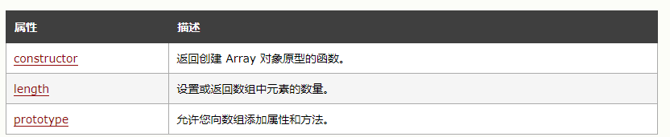


#### 1.7.1.2 方法


##### Array.isArray()

```
Array.isArray(obj)  //判断一个对象是否为数组对象
```


##### prototype.push


##### prototype.pop()


```
删除最后一个
```


##### shift()

```
删除数组中第一个元素  ，返回这个值。修改数组长度
```


```js
    let arr1 = ['a', 'b', 'c']

    console.log(arr1.pop()) //c

    console.log(arr1.push('d')) // 返回此时数组的长度，3

    console.log(arr1.shift()) //'a'
```

运行截图：

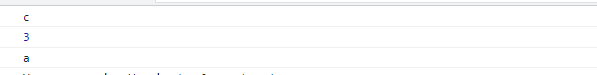


##### unshift()

```
shift()从开头弹出1个元素， unshift(obj)从开头添加一个元素
```


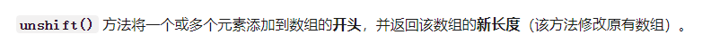


语法

```
arr.unshift(ele1,ele2,ele3)
```


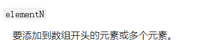

​	


##### arr.filter()

```
创建一个新的数组，传入一个函数，所有通过该函数的元素都会存入新数组内。
```


```
filter 传入一个callback函数 ,接收一个 this参数。在执行callback的时候，this指向了传入的这个this参数
```


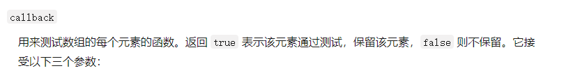


```
callback接收3个参数:
```

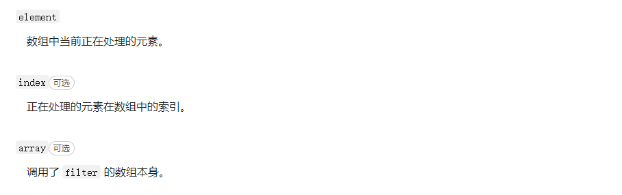


```javascript
<script>
    function fun1() {
        const arr = [32, 33, 16, 40];
        console.log(arr.filter(checkAgeValid));
    }
    fun1();
    function checkAgeValid(age) {
        return age > 18;
    }
</script>
```


##### arr.sort()

```
排序方法，传入一个排序函数。 和Java中 Compartor类似

arr.sort([compareFunction])

compareFunction 包含2个参数:firstEl , secondEl
```

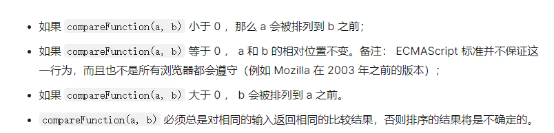


```
这个函数返回 <0 ，左侧元素排在前
```


##### Array.from()

```
方法对一个类似数组或可迭代对象创建一个新的，浅拷贝的数组实例。
```


##### Array.of()

```
Array.of() 方法创建一个具有可变数量参数的新数组实例，而不考虑参数的数量或类型。
```


```js
Array.of(7);       // [7]
Array.of(1, 2, 3); // [1, 2, 3]

Array(7);          // [ , , , , , , ]
Array(1, 2, 3);    // [1, 2, 3]
```


语法：

```
Array.of(element0[, element1[, ...[, elementN]]])
```


### 1.7.2 Math

https://developer.mozilla.org/zh-CN/docs/Web/JavaScript/Reference/Global_Objects/Math

参考MDN


#### 1.7.2.1 属性


#### 1.7.2.2 方法


```
Math.floor() //向下取整
```


```
Math.ceil()  //向上取整
```


```
Math.random()   //随机产生 [0,1)之间的数
```


### 1.7.3  Date

内置的 日期对象。


#### 1.7.3.1 格式化日期


### 1.7.4 String


参考MDN

https://developer.mozilla.org/zh-CN/docs/Web/JavaScript/Reference/Global_Objects/String/match


```
parseInt(string,radix) //解析字符串为数字类型


//string  : 需要解析的字符串
//radix   : 可选。代表进制


//在radix省略的情况下
//以0x开头,则当作16进制解析
//以0开头，则以8进制解析
//其他均为10进制
```


#### 1.7.4.1 方法


##### String.prototype.match()

```
方法检索返回一个字符串匹配正则表达式的结果。
```


##### str.charCodeAt()


**`charCodeAt(index)`** 方法返回 `0` 到 `65535` 之间的整数，表示给定索引处的 UTF-16 代码单元

```
返回字符串第一个字符再UTF16的 顺序编码。因为是UTF16 所以可以返回汉字的编码


index表示 取得第index个字符。 index >= 0 且 小于字符串长度的整数。
如果不是一个数值，则默认为 0。
```


### 1.7.5  JSON 


#### 1.7.5.1  方法


##### JSON.parse()

```
解析一个JSON对象
```


语法:

```
JSON.parse(text[, reviver])


text       要被解析成 JavaScript 值的字符串，

reviver    转换器，如果传入该参数 (函数)，可以用来修改解析生成的原始值，调用时机在 parse 函数返回之前。
```


[返回值](https://developer.mozilla.org/zh-CN/docs/Web/JavaScript/Reference/Global_Objects/JSON/parse#返回值)

[`Object`](https://developer.mozilla.org/zh-CN/docs/Web/JavaScript/Reference/Global_Objects/Object) 类型，对应给定 JSON 文本的对象/值。


异常：

若传入的字符串不符合 JSON 规范，则会抛出 [`SyntaxError`](https://developer.mozilla.org/zh-CN/docs/Web/JavaScript/Reference/Global_Objects/SyntaxError) 异常。


##### JSON.stringify()

```
将一个对象变为JSON , 字符串化
```


# 2. Web API


```
console.dir() //打印出对象的所有属性和属性值。  这是一个非标准特性。
```


## 2.1 DOM树


一个页面，就是一个文档 。 DOM中用  document表示


文档中的标签，也叫元素，用element表示


```
DOM	把以内容都看作是一个 对象。Object
```


## 2.2  获取元素


```
document.getElementById()
```


```
document.getElementByTagName()
```


```
Document.getElementsByClassName()
```


```
document.querySelector()
```

根据选择器选择元素。


Selectors的更多用法，参阅如下

https://developer.mozilla.org/zh-CN/docs/Web/API/Document_Object_Model/Locating_DOM_elements_using_selectors


### 2.2.1 获取 body html标签

```
document.body

document.html
```


## 2.3 事件

事件由3部分组成

```
事件源        //事件被触发的对象。比如按钮点击事件，事件源就是这个按钮
事件类型      
事件处理程序   //通常是一个函数
```


### 2.3.1 事件类别

参考文档：

https://developer.mozilla.org/zh-CN/docs/Web/Events#%E6%9C%80%E5%B8%B8%E8%A7%81%E7%9A%84%E7%B1%BB%E5%88%AB


常见的事件类别：

```
焦点事件 ： 获得焦点,失去焦点
网络事件 :  浏览器获得网络访问，失去网络访问
鼠标事件 :   click   
		   dblclick  双击
		   ...
拖放事件 : 
		   
```


### 2.3.2 绑定事件的方式


#### 传统绑定


```
唯一性指: 同一个类型的事件，只能绑定一次。多次绑定会覆盖
```


#### 添加事件监听


```
解决了覆盖问题
```


```
addEventListener默认在冒泡阶段
```


#### 删除事件

传统的解绑事件

```
node.onclick = null;
```


```
removeEventListener() //移除事件
```


### 2.3.3 事件流


```
它类似于 Chain 或者  pipeline
```


```
事件流的顺序，决定了事件触发的顺序。 和netty中的inbound 和 outbound很像
```

例如给如下节点都绑定了click事件

```
document->father->son
```

当`addEventListener`   `useCapture`参数为true表示为 捕获阶段。

```
那么则会触发3次click 依次为 document->father->son
```

当`addEventListener`   `useCapture`参数为false表示为 冒泡阶段。

```
那么则会触发3次click 依次为 son ->father->document
```


#### 2.3.3.1 事件代理

通过事件流的冒泡，将事件触发委托给父类。 在JQuery中称为事件委派


事件代理的好处：

可以大量节省内存占用，减少事件注册，比如在ul上代理所有li的click事件就非常棒

可以实现当新增子对象时无需再次对其绑定（动态绑定事件）


### 2.3.4 事件对象

当事件触发了以后，JS会自动生成一个 事件对象。 自动传入绑定的事件函数。


```
事件对象包含了 触发事件的相关数据。  例如:鼠标点击事件，就包含了鼠标坐标等信息
```


`event.target`

```
返回了触发事件的对象。
```

绑定的函数里的 this 指向的是

```
绑定了事件的对象。  
```


`event.target` 和 this 并不是一回事儿

```
    <div id="div-test">
        <button id="btn-test">测试</button>
    </div>
```

```js
    document.getElementById('div-test').addEventListener('click', function(e) {
        console.log(this);
        console.log(e.target);
    });

//this  返回了div 因为this返回了绑定了事件的对象。
//event.target  返回了button 因为是按钮触发了事件。
```


#### 2.3.4.1 事件对象的常见属性和方法


阻止默认行为：


```
给跳转的连接绑定一个click 事件，  检查一些业务逻辑，如果不符合可以使用   e.preventDefault() 阻止默认行为。
```


阻止冒泡:

```
e.stopPropagation()
```


#### 2.3.4.2 鼠标事件


比较常用的两种事件是  mouseEvent / keyboardEvent

```
mousemove
mouseover
mouseenter  --- mouseleave
mousedown
mouseup
```


mouseEvent 的一些常用属性。


```
clientX 和 ClientY的值，基于可视窗口的左上角点为距离
```


##### 2.3.4.2.1 mouseenter 和 mouseover

两个都是鼠标移入事件，但有区别。

```
mouseover 移入绑定元素的子元素也会触发。
mouseenter  子元素不会触发。
```

原因是  `mouseenter`没有冒泡阶段。

和mouseenter相对的  mouseleave 不会冒泡


#### 2.3.4.3  键盘事件


```
onkeydown 总是比  onkeypress 先执行
```


##### 2.3.4.3.1 keycode

参考文档

https://developer.mozilla.org/zh-CN/docs/Web/API/KeyboardEvent/keyCode


```
Web标准中，keyCode被标注为弃用。应当使用 KeyboardEvent.code 作为代替
```


## 2.4 通过DOM操作元素内容


### 2.4.1 修改元素内容

```
element.innerText  //元素的内部文本   


element.innerHTML  
```


两者区别

```
innerText 会把所有的内容都当作字符串文本。不会解析 标签内容。


innerHTML 会把整个内容当作HTML解析。例如 修改为 <strong>hh</strong> 那么'hh'会被加粗
```


```
innerText  //获取内容的时候，会去除空格和换行。
innerHTML  //获取内部标签,同时不会去除空格和换行。
```


### 2.4.2 改变元素属性


### 2.4.3 表单元素的属性操作


```
value常用于修改 input的内容。

disabled 用于禁用某个节点。
```


```js
btn.onclick = function(){
    this.disabled = true;
} //节点元素绑定了事件函数以后，函数内的this指向这个节点。  也就是指向了事件源元素。

```


### 2.4.4  样式属性操作


### 2.4.5 自定义属性的操作


#### 2.4.5.1 获取属性值


#### 2.4.5.2  设置属性值


```js
    let div3 = document.querySelector('.div3');
    console.log(div3);
    div3.setAttribute('data-index', 3);
```


#### 2.4.5.3  删除属性值

```
element.removeAttribute()
```


#### 2.4.5.4 自定义属性规范


H5规定，所有自定义属性都必须以 `data-` 开头，单词之间以 `-`分割例如

`data-list-name` `data-index`


```
这种方式获取的属性，必须严格按照 data- 开头。  //getAttribute则不必

对于 data-list-name 这样的属性,则使用    element.dataset.listName  //使用驼峰命名法
```


## 2.5  节点概述


在DOM中，所有的文本元素都被转化为节点。  节点分为3中，元素节点(标签)，属性节点，文本节点。


### 2.5.1 返回父节点

```js
node.parentNode;  //返回当前节点的父节点。  如果没有则返回null
```


### 2.5.2 获取子节点

```
node.childNodes;  //获取的子节点包含了文本节点和元素节点

node.firstChild; //获取第一个子节点。

node.lastChild；//最后一个子节点
```


如果想要 只获得元素节点？

```
node.children;  //只获取元素节点  


node.firstElementNode;  //node.children[0];
node.lastElementNode;  //node.children[node.children.length-1]
```


```js
    let ul = document.querySelector('ul');
    let firstElementChild = ul.firstElementChild;
    let lastElementChild = ul.lastElementChild;
    console.log(firstElementChild);
    console.log(lastElementChild);
```


### 2.5.3 兄弟节点


```
node.nextSibling; //下一个兄弟节点。 包括 任意类型的节点

node.preSibling;  //上一个兄弟几点。 包裹 任意类型的节点
```


只获取元素节点

```
node.nextElementSibling;

node.preElelmentSibling;
```


### 2.5.4 创建新节点

```
document.createElement('tagName')
```


创建节点以后，要把新创建的节点放入DOM中。可以通过父节点.`appendChild()` 来把新建的节点放入DOM中

```
node.appendChild(node);
```


插入到父类的某个子节点之前.   //父类节点 parent, 欲插入的节点 aimNode ,父类的子节点child 

```
parent.insertBefore(aimNode,child);
```


#### 2.5.4.1 额外的API


### 2.5.5 删除节点


```
node.removeChild(childNode);  //参数传入这个节点
```


```js
node.removeChild(node.children[0]);//删除第一个节点
```


### 2.5.6 复制节点

```
node.cloneNode();
```


JS复制节点也分为浅拷贝和深拷贝。 此处和Java中的浅/深拷贝有所不同。

```
Java中的浅拷贝指的是拷贝指针。并不重新申请分配内存。深拷贝会复制这个对象全部的属性，重新分配内存空间。
```


```
浅拷贝: 不克隆里面的子节点
```


## 2.6  BOM

对浏览器对象进行交互的操作，通过BOM AP

```
BOM的顶级对象是  window

BOM的API是各个浏览器自定义的，兼容性较差。
```


```
在调用的时候可以省略 window   , 例如 alert()  console 都是window的属性和方法。
```


### 2.6.1 BOM内置对象


BOM的 内置对象


## 2.7   Window 对象常见事件


### 2.7.1  窗口加载事件

当文档内容全部加载完毕才会触发该事件。 

```
window.onload()

window.addEventListener('load',function(){});

```

```
文档全部加载完毕才会触发，包括图像,CSS,脚本文件
```


```
document.addEventListener('DOMContentLoaded',function(){})
```

```
DOM全部加载完毕后，触发这个事件。不包括图片，CSS样式等
```


### 2.7.2 调整窗口事件


当浏览器窗口的大小发生变化，就会触发这个事件

```
winodw.addEventListener('resize',function(){})
```

window  窗口大小属性。

```
window.innerWidth
```


### 2.7.3  定时器


```js
window.setTimeOut(<调用的函数>[,延迟的毫秒数]);  //时间单位毫秒，省略默认是0
```


有两种写法：

```js
    function myLog() {
        console.log(1);
    }
    var timer1 = setTimeout(myLog, 2000);  //直接传入函数名
    var timer2 = setTimeout('myLog()', 4000); //  '函数名()' 
```


#### 2.7.3.1  清除定时器

```
var timer  = setTimeOut(()=>{console.log(1)},1000);
window.clearTimeOut(timer) // 清除指定的定时器
```


#### 2.7.3.2  频率定时器

按照一定频率定期执行的 定时器。

```
window.setInterval(callback[,时间频率]) //每经过一定的时间,执行一次 
```


```
window.clearInterval(<变量名>)
```


### 2.7.4 this指向


在全局作用域下，或 普通函数内， this指向了 window

```js
<script>
	console.log(this);
	function fun1(){
		consloe.log(this);
	}

</script>
```


setTimeOut函数内，回调函数的this也指向了Window

```
setTimeOut(callback[,delay]);
```


方法调用中，谁调用指向谁。

```js
    var obj = {
        name: '哈哈',
        sayHi: function() {
            console.log(this);
        }
    }

    obj.sayHi();


	var btn = querySelector('button');
	btn.onclick = function(){
        console.log(this);
    }
```


构造函数中的this ，指向了 新创建的实例对象。


## 2.8  JS 同步异步执行


JS执行队列由2部分组成:  同步栈，异步队列。


```
请注意: js线程只负责将异步任务添加到  异步队列中。但实际消费异步队列中任务的线程是 平台的线程。
例如如下代码：
```


```js
    console.log(1);

    setTimeout(() => {
        console.log(2);
    })
    for (let i = 1; i > 0; i++); //死循环
    console.log(3);
```

虽然这段代码运行以后，不会输出2 和3 ，但异步任务已经由运行的平台处理了。JS的主线程由于同步代码没有执行完毕，不会去检查异步队列的结果。可以异步向服务器发送HTTP请求加以验证


```
主线程执行完同步代码以后，会去检查异步队列。异步队列任务执行完毕以后，又会回到同步任务。
如此循环，称为  事件循环。EventLoop
```


## 2.9 location 对象

参考 runnoob  https://www.runoob.com/jsref/obj-location.html


```
location包含了当前页面 URL相关的信息。 比如query， host ,port 等
```


复习一下URL相关的信息有哪些：

### 2.9.1 URL


### 2.9.2  location 属性


通过location的属性，拿到了URL相关的信息(search,host,port,hash)

```
location.href  //整个地址
location.search  //返回参数
```


#### 2.9.2.1 页面跳转

跳转页面可以通过直接修改 location.href属性实现。亦可以通过调用方法实现，具体的在2.9.3

```
location.href = 'http://www.baidu.com';
```


### 2.9.3 location方法


```
location.replace(url) //替换当前页面，不能后退

location.assign(url)  //跳转到指定url，可以后退 

强制刷新表示  不使用浏览器缓存。
```


## 2.10   navigator 

通过navigator 对象可以获得用户的浏览器信息，操作系统信息等。


### 2.10.1 属性


```
最常用的是  userAgent属性
```


### 2.10.2 方法


## 2.11 history 对象


```
history对象包含用户历史URL.  提供了前进/后退等方法。
```


### 2.11.1 属性


### 2.11.2 方法


## 2.12  存储对象


```
Web 存储 API 提供了
sessionStorage （会话存储） 和 localStorage（本地存储）
两个存储对象来对网页的数据进行添加、删除、修改、查询操作。
```


这两个对象具体：

- localStorage 用于长久保存整个网站的数据，保存的数据没有过期时间，直到手动去除。
- sessionStorage 用于临时保存同一窗口(或标签页)的数据，在关闭窗口或标签页之后将会删除这些数据。


```
session 对应的就是java中的Session
```


### 2.1.2.1获取两个存储对象


### 2.12.2 属性


### 2.12.3 方法


#### 测试


```js
<script>
    console.log(localStorage.length);

    for (let i = 0; i < localStorage.length; i++) {
        let name = localStorage.key(i);
        let value = localStorage.getItem(name);
        console.log(name);
        console.log(value);
    }
</script>
```


```js
    console.log(sessionStorage.length);

    for (let i = 0; i < sessionStorage.length; i++) {
        let name = sessionStorage.key(i);
        let value = sessionStorage.getItem(name);
        console.log(name);
        console.log(value);
    }
```


## 2.12   元素偏移量offset 


offset 可以动态的获取元素的位置，大小

```
返回的是距离带有定位父元素的距离
```


### 2.12.1  style对象

sytle对象 属于 HTML DOM 中的对象


### 2.12.1 offset  和style 的区别


### 2.12.2 Client


### 2.12.3   scroll


```
scroll得到的是 内容实际大小,超出了div的高度也会获得。但是client最大只能获得div最大值
```


如果是window对象，被卷曲的x为  `window.pageXOffset`  被卷曲的Y为 `window.pageYOffset`

非window对象则是 scrollAPI


## 2.13 立即执行函数

定义普通函数以后，需要调用才能执行。 立即执行函数：不需要调用，立即自己执行的函数


```
(function(){})();  //也可以有函数名字   (function sum(a,b){return a+b})();

(function(){}());
```


```
立即执行函数里的变量，都是局部变量。不会出现命名冲突问题。
```


## 2.14  原型对象


### 2.14.1 什么是原型（prototype）？


每一个函数都拥有 `prototype` 属性。这个属性指向了一个对象，这个对象包含了通过该构造函数所创建的对象共享的属性和方法。


```
所有实例对象都可以共享 原型包含的属性和方法。

可以在任意地方 给原型对象定义属性和方法。
```


```js
<script>
    function Person() {

        Person.prototype.name = "bingbingbing"
        Person.prototype.age = 18
        Person.prototype.job = 'worker'
        Person.prototype.dream = function() {
            console.log('peace and love')
        }
    }

    let p1 = new Person();
    let p2 = new Person();

    console.log(p1.__proto__.name == p2.__proto__.name) //true

    console.log(p1.__proto__.age == p2.__proto__.age) //true

    console.log(p1.__proto__ == Person.prototype) //true

    console.log(p1.__proto__.job == Person.prototype.job) //true


    p1.__proto__.dream = function() {
        console.log('today is a good day')
    }

    p2.__proto__.dream() //today is a good day
</script>
```


### 2.14.2 深入理解原型

```
每当我们创建一个函数,    函数内都有`prototype`的属性，这个属性指向一个原型对象。

同样的，原型对象存在一个constructor属性，这个属性指回这个函数。

所以，此时这个函数，我们也可以称为构造函数。

通过构造函数,我们可以继续为原型添加其他属性和方法。
```


```
由构造函数创建的实例，都拥有一个 __proto__属性，指向这个实例对应的构造函数对应的原型对象。

所有实例都共享这个原型对象。
```


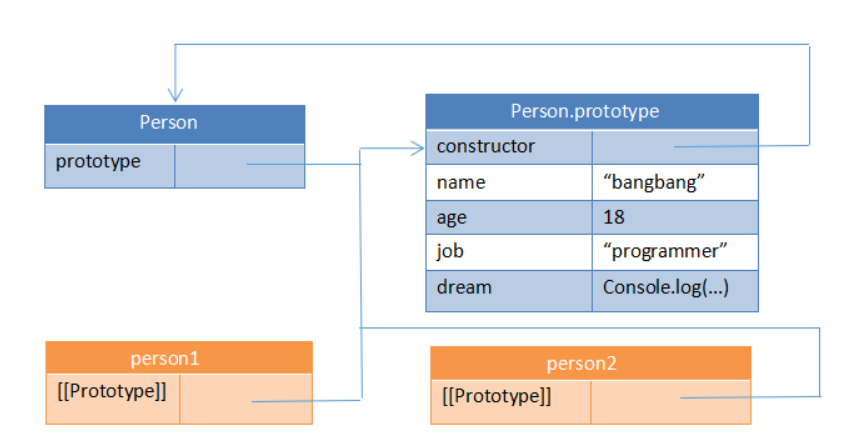


`__proto__` 它长这个样子：


我们可以通过 :

```
Object.getPrototypeOf(obj)  访问Obj对象的 prototype对象
Object.setPrototypeOf(obj)  设置Obj对象的 prototype对象
```


### 2.14.3 显式原型 隐式原型

```
p1.__proto__   称为隐式原型引用

Person.prototype   称为显式原型引用

```


所以我们也可以通过 `obj.__proto__`  访问

```
obj.__proto__              
obj.__proto__ =  otherobj   //显式的设置 prototype
```


```
也就是说默认的 prototype 都是指向了 Object.prototype 这个对象。
```


### 2.14.4原型链

原型链(prototype chain)

```
一个原型可能有一个非空的隐式引用到另一个原型,下一个原型又再次引用下一个原型。由此构成了一个原型链。
```


原型链引用到哪里才算结束？

```
一直引用到为null 
```


#### 2.14.2.1  原型链上引用对象属性


在我们访问一个对象属性的时候，首先会查找这个对象的属性。如果不存在，则会根据原型链一层一层找下去。


```
在第一个原型链上找到该属性，就返回。
```


### 2.14.2  原型继承


```
也就是赋予某个对象prototype的过程
```


```
JS中，有2中原型继承的方式：   显式继承/隐式继承
```

显式跟隐式的差别：是否由开发者亲自操作。


#### 2.14.2.1   显式继承

显式继承通过

```
Object.setPrototypeOf(ObjA,ObjB)  //把ObjA的prototype设置为 ObjB

或者

Object.create()
```


#### 2.14.2.2  隐式继承

当开发者没有显式声明一个对象的Prototype的时候，那么它会默认指向Object.prototype

那么如何实现这样默认指向Object.prototype的功能呢？


## 2.14  Object

Object是JS的一个数据类型。可以通过字面量或构造函数创建一个Object对象。

参考MDN

https://developer.mozilla.org/zh-CN/docs/Web/JavaScript/Reference/Global_Objects/Object#%E6%8F%8F%E8%BF%B0


### 2.14.1 静态方法

列举一些常用的静态方法


#### `Object.assign()`

从源对象中，复制属性到目标对象中(会覆盖原有属性)。

语法

```
Object.assign(target, ...sources) 
```


```js
const target = { a: 1, b: 2 };
const source = { b: 4, c: 5 };

const returnedTarget = Object.assign(target, source);

console.log(target);
// expected output: Object { a: 1, b: 4, c: 5 }

console.log(returnedTarget);
// expected output: Object { a: 1, b: 4, c: 5 }
```


#### `Object.create() `

创建一个新对象，使用现有的对象来作为新创建对象的原型（prototype）

语法：

```
Object.create(proto)
Object.create(proto, propertiesObject)
```


#### `Object.keys()`

返回一个由一个给定对象的自身可枚举属性组成的数组，

数组中属性名的排列顺序和正常循环遍历该对象时返回的顺序一致。

```
Object.keys(obj)  //返回一个伪数组
```


```
只能返回自身的可枚举的属性。不会返回不可枚举，以及原型链上的属性。
```


#### `Object.defineProperty()`

会直接在一个对象上定义一个新属性，或者修改一个对象的现有属性，并返回此对象。

语法:

```
Object.defineProperty(obj, propName, descriptor)
```


descriptor 称为描述符。描述符有2种:  属性描述符/存取描述符


##### 属性描述符：


```js
    let person = {
        name: '张三',
        gander: '男'
    }

    let a = new Object();

    Object.defineProperty(person, 'age', {
        enumerable: true,
        value: 18,
        configurable: true,
        writable: true
    })
```


删除对象属性使用  delete关键字

```js
delete person.age
```


##### 存取描述符


#### `Object.defineProperties()`

直接在一个对象上定义新的属性或修改现有属性，并返回该对象

语法:

```
Object.defineProperties(obj, props)
```


### 2.14.2 实例方法

`Object.prototype.hasOwnProperty()  `返回对象自己是否有指定的属性。不查找原型链

语法:

```
obj.hasOwnProperty(key)  ;返回true or false
```


# 4. VScode插件


1. open in browser
2. js-css-html formatter


## 4.3  代码片段

参考博客

https://www.cnblogs.com/hencins/p/15433763.html

代码片段是一个json形式的文件


### 4.3.1 占位符

使用占位符 `$` 表示光标需要接入的位置。当生代码片段以后，开发者的光标会自动切换到`$1` `$2`

`$3...`的位置。使用`TAB` 切换位置。


# 5. JavaScript:void


```js
<a href="javascript:void(0)">单击此处什么也不会发生</a>
```

```
可以阻止a标签的跳转行为。
定义一个死链接可以使用   javascript:void(0) 
```


对于鼠标事件Event来说，可以调用

```
e.preventDefault() 来阻止默认行为。例如a标签的跳转默认行为
```


# 6. 正则表达式


参考MDN

https://developer.mozilla.org/zh-CN/docs/Web/JavaScript/Guide/Regular_Expressions


## 6.1 创建一个正则


**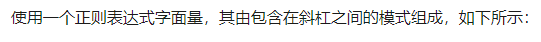**

```js
let regExp = /ab+c/

//注意到这种写法的正则表达式并不是使用 字符串包裹的。这意味着上述正则表达式无法动态更改。
//所以可以使用如下的方式创建一个正则表达式
```


```js
let regExp = new RegExp('.*' + event.target.value + '.*') 


//此时,正则表达式构造参数内传入的是一个字符串。字符串可以动态拼接。
```


# 7. ES6

ES6 主要是为了解决 ES5 的先天不足，比如 JavaScript 里并没有类的概念。


## 7.1 解构赋值


解构赋值 是一种针对数组或者对象进行模式匹配，然后对其中的变量进行赋值。


### 7.1.1 数组解构


```
let [a,b,c] = [1,2,3]


let [a,[[b],c]] = [1,[[2],3]     //可嵌套

let [a, ,c] = [1,2,3]           //可忽略


let [a=1,b,c] = []           //不完全解构
							//a=1  b=undefined    c=undefined
							
							
let [a,b] = [1,2,3,4,5]      //剩余运算符
							//a=1  b= [2,3,4,5]
```


数组解构中，如果解构目标为可遍历对象，都可以进行解构赋值。 //可遍历对象实现 Iterator接口

```js
let[a,b,c,d,e] = "hello"  
//a=h
//b=e
//c=l
//d=l
//e=o
```


当解构模式有匹配结果，且匹配结果是 undefined 时，会触发默认值作为返回结果。

```
let [a=1]  = []           // a=1

let [a=3,b=a] = [9]       //a=9 ,b=9

let [a=3,b=a] = [1,2]     //a=1  b=2
```


### 7.1.2 对象的解构


```js
let {name,age} = {name:'hello',age:'world'}


let { baz : foo } = { baz : 'ddd' };          //foo='ddd'


```


可嵌套，可忽略

```js
let obj = {p: ['hello', {y: 'world' }]}

let {p:[x,{y}] } = obj


let obj = {p: ['hello', {y: 'world'}] };

let {p: [x, {  }] } = obj;
```


剩余运算符

```js
let {a, b, ...rest} = {a: 10, b: 20, c: 30, d: 40};
// a = 10
// b = 20
// rest = {c: 30, d: 40}
```


## 7.2  Map对象


**`Map`** 对象保存键值对，并且能够记住键的原始插入顺序。

一个Object的键只能是 字符串或者 Symbol ,但是Map的键可以是任意值。


### 7.2.1 属性


```
Map.prototype.size
```


### 7.2.2 方法


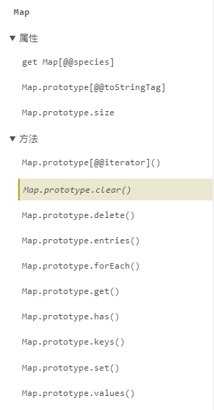


#### 7.2.2.1 set(),get()

```js
<script>
    let map = new Map()
    map.set('key1', 'value1')
    let v = map.get('key1')
    console.log(v)
</script>
```


#### 7.2.2.2 has()

```
Map.prototype.has(key)

返回boolean表示 Map中是否存在该key
```


```js
<script>
    let map = new Map()
    map.set('key1', 'value1')
    console.log(map.has('key1')) //true
    console.log(map.has('key2'))//false
</script>
```


#### 7.2.2.3 clear,delete

```
clear() 方法会移除 Map 对象中的所有元素。

myMap.clear()
```


```
delete() 方法用于移除 Map 对象中指定的元素。


map.delete(key);
```


#### 7.2.2.4 forEach

```js
myMap.forEach(callback([value][,key][,map])[, thisArg])
```


参数：

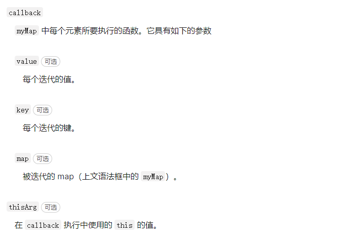


#### 7.2.2.5  entries()

```
entries() 返回一个迭代器。包含 key和 value. 迭代的顺序和插入的顺序一样
```


```js
<script>
    let map = new Map()
    map.set('key1', 'value1')
    map.set('key2', 'value2')
    console.log(map.has('key1'))
    console.log(map.has('key2'))

    const iterator = map.entries()

    while (true) {
        let next = iterator.next()
        if (next.done === true) {
            break
        }
        const key = next.value[0]
        const value = next.value[1]
    }
</script>
```


### 7.2.3 遍历

```
for...of
```


```js
    let map = new Map()
    map.set('key1', 'value1')
    map.set('key2', 'value2')
	for (let [key, value] of map) {
        console.log(key, value)
    }
```


```
for (var [key, value] of myMap.entries()) {
  console.log(key + " = " + value);
}
```


### 7.2.4 克隆

```js
var myMap1 = new Map([["key1", "value1"], ["key2", "value2"]]);
var myMap2 = new Map(myMap1);
 
console.log(myMap1 === myMap2); 
// 打印 false。 Map 对象构造函数生成实例，迭代出新的对象。
```


### 7.2.5 与Array的转换

```js
var kvArray = [["key1", "value1"], ["key2", "value2"]];
 
// Map 构造函数可以将一个 二维 键值对数组转换成一个 Map 对象
var myMap = new Map(kvArray);
 
// 使用 Array.from 函数可以将一个 Map 对象转换成一个二维键值对数组
var outArray = Array.from(myMap);
```


## 7.3  Set对象

Set 对象允许存储任何类型的唯一值，无论是原始值或者是对象引用。


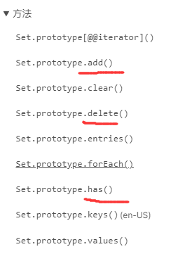


### 7.3.1 函数


​	


## 7.4 默认参数

参考MDN

https://developer.mozilla.org/zh-CN/docs/Web/JavaScript/Reference/Functions/Default_parameters


**函数默认参数**允许在没有值或`undefined`被传入时使用默认形参。

```js
function fun1(a,b=1){
	console.log(a,b)
}
function(3)
```


```
默认参数可以用在 解构中
```


### 7.4.1 默认参数可以使用前面的参数


```js
function greet(name, greeting, msg = greeting + ' ' + name) {
    return Array.of(...arguments)
}


console.log(greet('David', 'Hi')) //使用了默认参数

console.log(greet('David', 'Hi', 'Happy Birthday')) //覆盖了默认参数
```


## 7.4  Reflect / Proxy

参考博客

https://www.runoob.com/w3cnote/es6-reflect-proxy.html


```
Proxy 可以对目标对象的读取、函数调用等操作进行拦截，然后进行操作处理。
它不直接操作对象，而是像代理模式，通过对象的代理对象进行操作，在进行这些操作时，可以添加一些需要的额外操作。
```


### 7.4.1 使用Proxy


一个 Proxy 对象由两个部分组成： 

```
target      即目标对象


handler     是一个对象，声明了代理 target 的指定行为。 含有2个参数 get set
	get     	函数，用于拦截getter。有3个参数
		target			被拦截的对象
		key				get请求的属性名
		receiver        表示原始操作行为所在的对象
		
	set     	函数,用于拦截setter，有4个参数
		target			被拦截的对象
		key				set请求的属性名
		value			set的新属性值
		receiver        表示原始操作行为所在的对象

```


简单的示例：  拦截getter setter

```js
let target = {
    name:'Tom',
    age: 18
}

let hander = {
    get: function(target,key){
        console.log('拦截了get ,请求的是',key)
        return target[key]
    },
    set: function(){
        
    }
}
```


//TODO

https://www.runoob.com/w3cnote/es6-reflect-proxy.html


## 7.5 Arguments对象

**`arguments`** 是一个对应于传递给函数的参数的类数组对象。


```js
function func1(a, b, c) {
  console.log(arguments[0]);  //1
  console.log(arguments[1]);  //2
  console.log(arguments[2]);  //3
    
  console.log(...arguments)   //1 2 3
}

func1(1, 2, 3);
```


```
`arguments`对象是所有（非箭头）函数中都可用的局部变量.

此对象包含传递给函数的每个参数.
```


### 7.5.1 属性


```
arguments.length
//传递给函数的参数数量。


arguments.callee
//指向参数所属的当前执行的函数。
```


## 7.6 模板字符串


模板字符串相当于加强版的字符串，用反引号,除了作为普通字符串，还可以用来定义多行字符串.


还可以在字符串中加入 变量 和 表达式 。


### 7.6.1 使用


中间可以插入单引号。做转义字符

```js
let string = `Hello'\n'world`;
console.log(string); 
// "Hello'
// 'world"
```


变量名写在 ${} 中，${} 中可以放入 JavaScript 表达式。

```js
let name = "Mike";
let age = 27;
let info = `My Name is ${name},I am ${age+1} years old next year.`
console.log(info);
// My Name is Mike,I am 28 years old next year.
```


${}中调用函数

```js
function f(){
  return "have fun!";
}
let string2= `Game start,${f()}`;
console.log(string2);  // Game start,have fun!
```


## 7.7 Class类


在ES6中，class (类)作为对象的模板被引入，可以通过 class 关键字定义类。

class 的本质是 function


### 7.7.1  类的定义

```js
    let Person = class {
        constructor(name) {
            this.name = name;
        }
    }
    
    class People {
        constructor(name, age) {
            this.name = name;
            this.age = age;
        }
    }

    let peo1 = new People('法外狂徒', 22)
    console.log(peo1)
    let p = new Person('张三')

    console.log(p)
```


```js
//公共属性
class Example{}
Example.prototype.a = 2;
```


```js
//实例属性
//实例属性：定义在实例对象（ this ）上的属性。
class Example {
    a = 2;
    constructor () {
        console.log(this.a);
    }
}
```


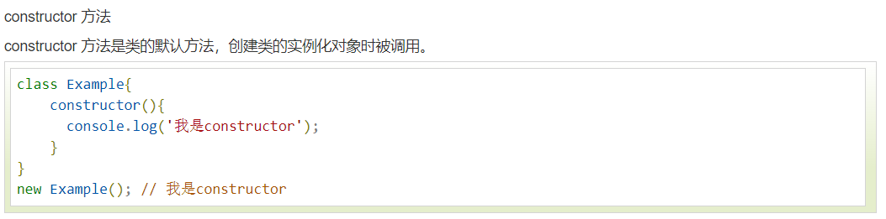


### 7.7.2 类的继承

```
```


## 7.8    模块化


```
模块自动开启严格模式。

每个模块都有自己的上下文,模块内声明的变量都是 局部变量，不会污染全局作用域。
```


```
每个模块只加载一次，是单例的。
```


### 7.8.1 export

```
export 用于暴露的关键字 ，用于 导出 声明的各种类型的变量。  字符串，数值，函数，类
```


注意点：

```
导出的类 ,函数必须有名称。       (export default 另行考虑)


不仅能导出声明，还能导出引用   


export(导出) 可以出现在模块的任何位置, 但必须位于模块顶层。 (必须在模块顶层，不能套在函数里)

import 会提升到模块头部。
```


示例

```js
//myjs.js

let myName = '张三'

let myAge = 17 

let myGender = '男'

let myCLz = class Person {
    constructor(name, age) {
        this.name = name
        this.age = age
    }
}

let myFun = function() {
    return 'great!'
}


export { myName, myAge, myGender, myCLz, myFun }     


//其他的js引入myjs.js
import {myName, myAge , myGender} from './myjs.js'    //导入的时候必须加上{}

console.log(myAge)
console.log(myName)
console.log(myGender)
console.log(myFun())
console.log(new myCLz('张三', 18))
```


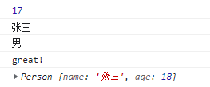


#### 7.8.1.1 as

```
在导出的时候，可以使用as作为一个别名

as 也可以解决命名冲突问题
```


示例：

```js
let c = { name: '一汽大众', price: 998 }

export {c as Car}


import { Car } from './asserts/js/myjs'
console.log(Car)
```

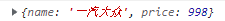


### 7.8.2 import 

用于导入变量，函数，类

```
不能改写import导入的基本类型变量，可以改变导入对象的属性值。  类似于java的final


单例导入，同一个文件的同一个变量只会导入一次
```


### 7.8.3 export default


```
在一个文件或者模块中, export default 只能有1个。  export import 可以有多个


export default 中的default 是对应的导出接口变量
export default 向外暴露的成员，可以使用任意变量来接收。


通过 export 方式导出，在导入时要加{ }，export default 则不需要。


```


示例：

```js
//myjs.js
let a = 'This world of mine'

export default a


//导入
import statement from './asserts/js/myjs'

console.log(statement)
```

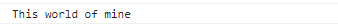


另一种写法，直接省略了变量。

```js
export default {                               //导出了一个对象
    statement:'This world of mine',
    append: 1
}

//导入
import statement from './asserts/js/myjs'
console.log(statement)
```


### 7.8.4 export 和 import 可以复合使用


```js
export { foo, bar } from "methods";
//当前模块作为一个中间人,接着向下导出 {foo,bar}
//但是当前模块无法使用 foo ,bar 
//所以,如果想当前模块也可以使用建议使用如下语句：

import { foo, bar } from "methods";
export { foo, bar }
```


使用复合的时候，可以在导出的时候使用 as 关键字转换别名

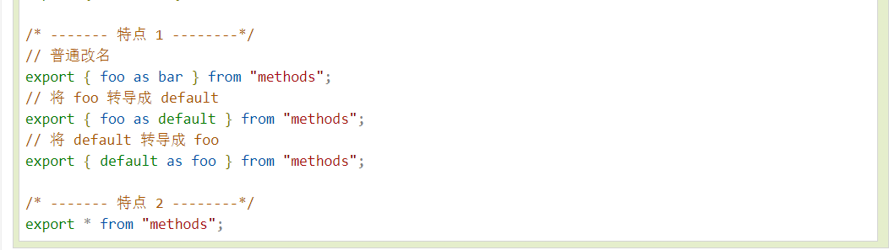


```


target       操作人+操作时间
target Log   日志表 


staff      time_limit    warn_level  参数表 ，一一对应

staff Log  日志表


Paramutil.staticList
```


