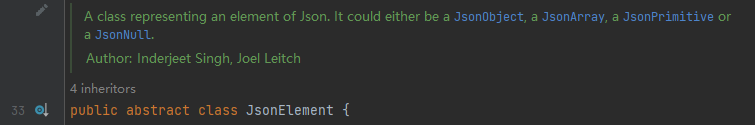
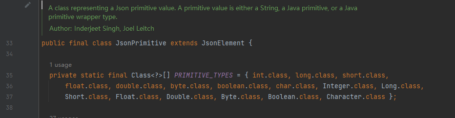
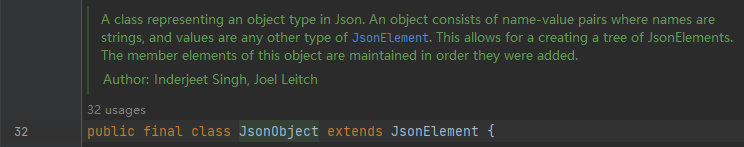
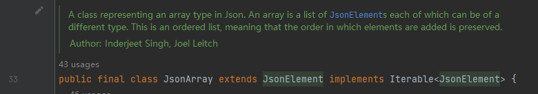
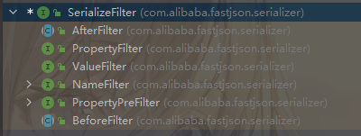
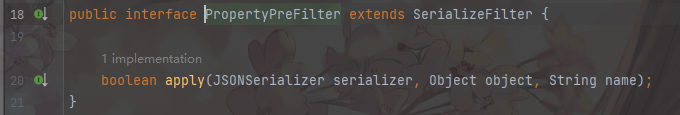
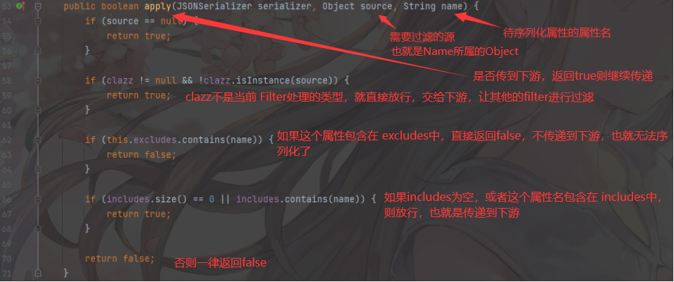
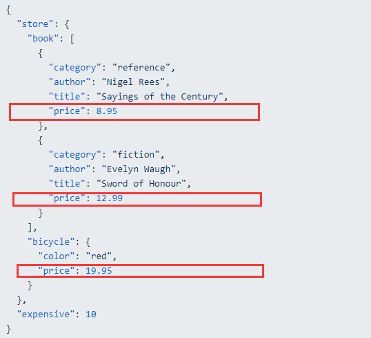
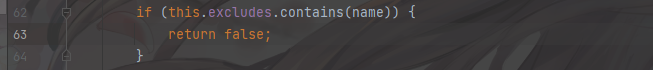
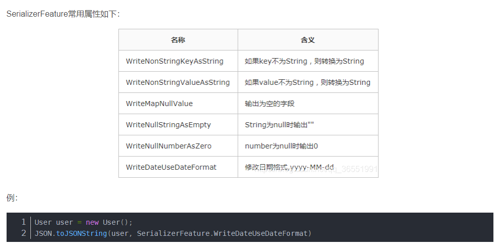

`JSON序列化` 是一个非常好的概念，这种概念允许不同语言，不同数据类型之间的消息转换。


一个支持度高的中间件，无论它是什么语言开发的，它都可以支持JSON调用。


本笔记，用于记录Java语言中，对`Json序列化`的支持


# 1. GSON


## 25.1  自定义Gson的序列化器


```
自定义序列化器可以将指定数据类型，按照指定的方式序列化/反序列化
```


```java
    public static class ClassCodec implements JsonSerializer<Class<?>>, JsonDeserializer<Class<?>>{

        @Override
        public Class<?> deserialize(JsonElement json, Type typeOfT, JsonDeserializationContext context) throws JsonParseException {
            String className = json.getAsString();
            try {
                return Class.forName(className);
            } catch (ClassNotFoundException e) {
                throw new JsonParseException(e);
            }
        }

        @Override
        public JsonElement serialize(Class<?> src, Type typeOfSrc, JsonSerializationContext context) {
            return new JsonPrimitive(src.getName());
        }
    }
```


```java
//序列化需要实现JsonSerializer<T>接口。
//需要实现JsonSerializer接口中的serialize()方法;
//需要将T转化为一个JsonElement对象，此时T被传入了Class<?>。所以只要是Class<?>类对象都会使用这个自定义的序列化器


        @Override
        public JsonElement serialize(Class<?> src, Type typeOfSrc, JsonSerializationContext context) {
            return new JsonPrimitive(src.getName());
//目标是用这个类的全类名，作为序列化后的结果。 全类名是字符串类型，所以new 一个JsonPrimitive()，传入全类名
        }
```


```java
//反序列化需要实现JsonDeserializer<T>接口。


        @Override
        public Class<?> deserialize(JsonElement json, Type typeOfT, JsonDeserializationContext context) throws JsonParseException {
            String className = json.getAsString();//将传过来的JsonElement对象当作String类型
            try {
                return Class.forName(className);//返回Class对象 
            } catch (ClassNotFoundException e) {
                throw new JsonParseException(e);
            }
        }

```


### 25.1.1 JsonElement



```
JsonElement类代表了一个 Json的元素。  Json元素有  JsonObjet，JsonArray，JsonPrimitive(Json基本类型)，JsonNull
```


#### JsonPrimitive




#### JsonObject



```
JsonObject类用于代表 Json规则中的Object种类。

一个Json的Object，由键值对组成，同时key是字符串类型，value可以是任意的JsonElement
```


#### JsonArray





```
JsonArray类代表了 Json规则中的数组类型。
数组类型 是一个装有JsonElement的列表集合的特殊类型。它是一个有序的列表。
```


## 25.2 GsonBuilder


```
自定义的Json序列化器通过 GsonBuilder.register()完成注册。
通过create()方法返回一个Gson对象
```


# 2. fastJSON

国内使用FastJson还是有一定数量的，参考资料也更多一些。


## 2.1 SerializeFilter

序列化过滤器，在调用 `JSON.toJSONString` 的同时，可以传入一个SerializeFilter对象，完成多种方式定制化json


SerializeFilter是一个接口，有如下子类



```
PropertyPreFilter 根据PropertyName判断是否序列化
PropertyFilter 根据PropertyName和PropertyValue来判断是否序列化
NameFilter 修改Key，如果需要修改Key,修改process返回值则可
ValueFilter 修改Value
BeforeFilter 序列化时在最前添加内容
AfterFilter 序列化时在最后添加内容
```


### 2.2.1  PropertyPreFilter 

只有1个接口方法 apply




核心方法： apply




#### 2.2.1.1 全局过滤字段

过滤掉全局的price 字段



```java
String json = "{\"store\":{\"book\":[{\"category\":\"reference\",\"author\":\"Nigel Rees\",\"title\":\"Sayings of the Century\",\"price\":8.95},{\"category\":\"fiction\",\"author\":\"Evelyn Waugh\",\"title\":\"Sword of Honour\",\"price\":12.99}],\"bicycle\":{\"color\":\"red\",\"price\":19.95}},\"expensive\":10}";

SimplePropertyPreFilter filter = new SimplePropertyPreFilter();
filter.getExcludes().add("price");  //获得Excludes,添加 price字段
JSONObject jsonObject = JSON.parseObject(json);
String str = JSON.toJSONString(jsonObject, filter);
System.out.println(str);
```


```
过滤的是全局的 price字段， 包括bicycle
```


#### 2.2.1.2 自定义属性过滤器

现在只想过滤Book属性中的 price





```
可以在这个if中,判断 Object的类型是否是Book,如果是，则返回false过滤掉，否则返回true
```


## 2.2  SerializerFeature

参考博客

https://blog.csdn.net/universsky2015/article/details/120176487





## 2.3 @JsonFormat

`@JsonFormat` 的通常出现在`javaBean`中的属性上，用来表示json序列化的一种格式或者类型。


```java
@JsonFormat(shape =JsonFormat.Shape.STRING,pattern ="yyyy-MM-dd HH:mm:ss",timezone ="GMT+8")
    private Date createTime;
```


### 2.3.1  成员属性


#### 2.3.1.1 Shape()


一个`Shape` 类型的属性 shape，用于指明，传入的JSON的数据类型，详细参考  [shape](# 2.3.2.1 Shape)


#### 2.3.1.2 pattern()


```
专门用于给java.util.Date 数据类型 格式化的属性。

但是，具体的使用是由特定的JsonSerializer决定的
```


#### 2.3.1.3 locale()


```
Locale 用于序列化(如果有必要的话)。 

声明了一个特殊值 
public final static String DEFAULT_LOCALE = "##default";

用于表示"默认"，在序列化上下文中，如果是这个默认值的话，将调用系统默认的 Locale.getDefault()获得对应的Locale
```


#### 2.3.1.4 timezone

时区信息。这是一个`String`类型的

```
这个属性也是为了序列化而使用（如果有必要的话）。
```


默认是 `GMT` , 中国时区需要使用 "GMT+8"


#### 2.3.1.5 lenient

是否宽容。这个属性是 `OptBoolean` 枚举类型的

```
属性，该属性指示应该启用还是禁用“宽松”处理。这主要与一些文本数据类型的反序列化相关，特别是日期/时间类型。
```


#### 2.3.1.6 with()

属性是 `JsonFormat.Feature[]` 数组， 表示以多种 `Feature`特性运行。

Feature是 JsonFormat的内部枚举类。

```
这个特性配置将优先于全局配置。
```


#### 2.3.1.7 without()


不使用某些特性。


### 2.3.2 用到的枚举类


#### 2.3.2.1 Shape

指明传入JSON数据的数据类型。

我们知道JSON有多种数据类型：  字符串，数字，数组，boolean等。


`Shape` 是一个枚举类型 ，在`@JsonFormat`注解中，也存在一个`Shape`类型的成员变量。

```java
public enum Shape
{
    /**
     * Marker enum value that indicates "whatever" choice, meaning that annotation
     * does NOT specify shape to use.
     * Note that this is different from {@link Shape#NATURAL}, which
     * specifically instructs use of the "natural" shape for datatype.
     */
    ANY,

    /**
     * Marker enum value that indicates the "default" choice for given datatype;
     * for example, JSON String for {@link java.lang.String}, or JSON Number
     * for Java numbers.
     * Note that this is different from {@link Shape#ANY} in that this is actual
     * explicit choice that overrides possible default settings.
     *
     * @since 2.8
     */
    NATURAL,
    
    /**
     * Value that indicates shape should not be structural (that is, not
     * {@link #ARRAY} or {@link #OBJECT}, but can be any other shape.
     */
    SCALAR,

    /**
     * Value that indicates that (JSON) Array type should be used.
     */
    ARRAY,
    
    /**
     * Value that indicates that (JSON) Object type should be used.
     */
    OBJECT,

    /**
     * Value that indicates that a numeric (JSON) type should be used
     * (but does not specify whether integer or floating-point representation
     * should be used)
     */
    NUMBER,

    /**
     * Value that indicates that floating-point numeric type should be used
     */
    NUMBER_FLOAT,

    /**
     * Value that indicates that integer number type should be used
     * (and not {@link #NUMBER_FLOAT}).
     */
    NUMBER_INT,

    /**
     * Value that indicates that (JSON) String type should be used.
     */
    STRING,
    
    /**
     * Value that indicates that (JSON) boolean type
     * (true, false) should be used.
     */
    BOOLEAN,

    /**
     * Value that indicates that Binary type (native, if format supports it;
     * encoding using Base64 if only textual types supported) should be used.
     *
     * @since 2.10
     */
    BINARY
    ;

    public boolean isNumeric() {
        return (this == NUMBER) || (this == NUMBER_INT) || (this == NUMBER_FLOAT);
    }

    public boolean isStructured() {
        return (this == OBJECT) || (this == ARRAY);
    }
}
```


#### 2.3.2.2 OptBoolean


```
三个枚举值

TRUE    严格检查

FALSE   宽容检查

DEFAULT
```


#### 23.2.3 Feature 


```
ACCEPT_SINGLE_VALUE_AS_ARRAY
//接收一个值作为数组、 
//允许JSON序列化接收一个非数组类型的值，来转化为java.util.Collections
```


```
ACCEPT_CASE_INSENSITIVE_PROPERTIES

//允许属性名的大小写不敏感匹配(但不是值，参见ACCEPT大小写不敏感的值
```


```
ACCEPT_CASE_INSENSITIVE_VALUES
//接收大小写不敏感的值， 例如枚举类型。
```


```
WRITE_DATE_TIMESTAMPS_AS_NANOSECONDS


//使用nanosecond 作为timestamps
```


```
WRITE_DATES_WITH_ZONE_ID


//写日期的时候，带有zone ID
```


```
WRITE_SINGLE_ELEM_ARRAYS_UNWRAPPED


//将会强制序列化一个单一元素数组
```


```
WRITE_SORTED_MAP_ENTRIES,


//序列化Map以前，先强制排序KEY
```


### 2.3.3 序列化测试


## 2.4 ObjectSerializer

`fastJson`中用于自定义序列化器的接口。

只让`ObjectSerializer` 去序列化字段，不要序列化整个类。


使用`@JSONField` 指明字段的序列化器

```java
    @JSONField(serializeUsing = TestRequestVoSerializer.class,
            deserializeUsing = TestRequestVoSerializer.class)
    private MyEnum myEnum;
```


```
函数式接口，只需要实现write方法。

第一个参数是 JSON序列化器，最终的结果要调用 这个序列化器的方法传入。

Object object : 被序列化的源对象

Object fieldName : 被序列化对象的 字段名。

Type fieldType :  被序列化字段的 类型。

int features : 这个字段传入的特性标识。
```


下面是一个示例：

```java
public class TestRequestVoSerializer implements ObjectSerializer {


    @Override
    public void write(JSONSerializer serializer, Object object,
                      Object fieldName, Type fieldType, int features) throws IOException {
        //这个序列化器只
        MyEnum myEnum = (MyEnum) object;

        serializer.write(myEnum.name());

    }
}
```


## 2.5 ObjectDeserializer


## 2.6 JsonIgnore

忽略属性序列化。

```java
@JsonIgnore
private Date sendTime;
```


忽略为null的属性。

```java
@JsonSerialize(include=JsonSerialize.Inclusion.NON_NULL)
private Date sendTime;
```


