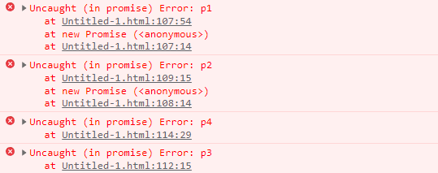
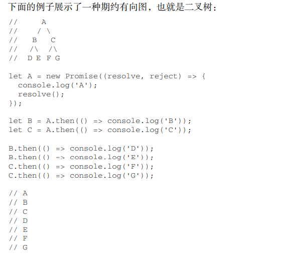

# 7. 生成器

生成器是ES6新增的结构。

拥有在一个函数块内暂停和恢复代码执行的 能力。这种新能力具有深远的影响，比如，使用生成器可以自定义迭代器和实现协程。


## 7.1 生成器基础

生成器的形式是一个函数，函数名称前面加一个星号（*）表示它是一个生成器。

只要是可以定义 函数的地方，就可以定义对应的生成器。


例如

```js
//函数声明
function* generatorFun(){
    
}
// 函数表达式
let fun = function* generatorFun(){}


// 作为对象字面量方法的生成器函数
let foo = { 
 * generatorFn() {} 
} 

//类实例方法
class Foo {
    * generatorFn() {}
}

//类静态方法
class Bar { 
	static * generatorFn() {} 
} 

//箭头函数不能用来定义生成器函数。

//标识生成器函数的星号不受两侧空格的影响

// 等价的生成器函数： 
function* generatorFnA() {} 
function *generatorFnB() {} 
function * generatorFnC() {} 
// 等价的生成器方法：
class Foo { 
 *generatorFnD() {} 
 * generatorFnE() {} 
} 
```


调用生成器函数会产生一个生成器对象。


生成器对象一开始处于暂停执行（suspended）的状态，生成器对象也实现了 Iterator 接口，因此具有 next()方法。调用这个方法会让生成器 开始或恢复执行。


```js
function* generatorFn() {} 
const g = generatorFn(); 
console.log(g); // generatorFn {<suspended>} 
console.log(g.next); // f next() { [native code] }
```


next()方法的返回值类似于迭代器，有一个 done 属性和一个 value 属性。

value 属性是生成器函数的返回值，默认值为 undefined，可以通过生成器函数的返回值指定：

```js
 function* generatorFn() {  return 'foo';  } 
```


## 7.2 通过 yield 中断执行


yield 关键字可以让生成器停止和开始执行，也是生成器最有用的地方。

生成器函数在遇到 yield 关键字之前会正常执行。遇到这个关键字后，执行会停止，函数作用域的状态会被保留。

停止执行的生 成器函数只能通过在生成器对象上调用 next()方法来恢复执行：

```js
function* generatorFn() { 
 yield; 
} 
let generatorObject = generatorFn(); 
console.log(generatorObject.next()); // { done: false, value: undefined } 
console.log(generatorObject.next()); // { done: true, value: undefined } 
```


此时的yield 关键字有点像函数的中间返回语句，它生成的值会出现在 next()方法返回的对象里。


通过 yield 关键字退出的生成器函数会处在 done: false 状态；

通过 return 关键字退出的生成器函 数会处于 done: true 状态。

```js
function* generatorFn() { 
 yield 'foo'; 
 yield 'bar'; 
 return 'baz'; 
}

let generatorObject = generatorFn(); 
console.log(generatorObject.next()); // { done: false, value: 'foo' } 
console.log(generatorObject.next()); // { done: false, value: 'bar' } 
console.log(generatorObject.next()); // { done: true, value: 'baz' } 
```


### 7.2.1 每个生成器对象都是独立作用域的


每个生成器对象都是独立作用域的，在另一个生成器对象调用.next()方法不会互相影响。

```js
function* generatorFn() { 
 yield 'foo'; 
 yield 'bar'; 
 return 'baz'; 
} 
let generatorObject1 = generatorFn(); 
let generatorObject2 = generatorFn(); 
console.log(generatorObject1.next()); // { done: false, value: 'foo' } 
console.log(generatorObject2.next()); // { done: false, value: 'foo' } 
```


### 7.2.2 yield 关键字只能在 生成器函数内使用

yield 关键字只能在生成器函数内部使用，用在其他地方会抛出错误。


### 7.2.3 生成器对象作为迭代对象

在生成器对象上显式调用 next()方法的用处并不大。其实，如果把生成器对象当成可迭代对象， 那么使用起来会更方便

```js
function* generator(){
    yield 1;
    yield 2;
    yield 3;
}


for (const x of gnerator){
    console.log(x)
}
```


当我们需要定义一个可迭代对象，那么，我们需要一个迭代器。这个迭代器，我们可以使用生成器来实现:

```js
function * nTimes(n){
    while(n>0){
        yield;
    }
}

for (let _ of nTimes(3)) { 
 console.log('foo'); 
} 
```


### 7.2.4 使用yield 实现输入输出

除了可以作为函数的中间返回语句使用，yield 关键字还可以作为函数的中间参数使用。

上一次让 生成器函数暂停的 yield 关键字会接收到传给 next()方法的第一个值。


这里有个地方不太好理解:

```
第一次调用 next()传入的值不会被使用，因为这一次调用是为了开始执行生成器函数。
```


```js
function* generatorFn(initial) { 
 console.log(initial); 
 console.log(yield); 
 console.log(yield); 
} 
let generatorObject = generatorFn('foo'); 
generatorObject.next('bar'); // foo 
generatorObject.next('baz'); // baz 
generatorObject.next('qux'); // qux
```


#### 7.2.4.1 yield 可以同时输入和输出

yield 关键字可以同时用于输入和输出，如下例所示:

```js
function* generatorFn() { 
 return yield 'foo'; 
} 
let generatorObject = generatorFn(); 
console.log(generatorObject.next()); // { done: false, value: 'foo' } 
console.log(generatorObject.next('bar')); // { done: true, value: 'bar' } 
```


#### 7.2.4.2  产生可迭代对象

可以使用星号增强 yield 的行为，让它能够迭代一个可迭代对象，从而一次产出一个值：

```js
// 等价的 generatorFn： 
// function* generatorFn() { 
// for (const x of [1, 2, 3]) { 
// yield x; 
// } 
// } 
function* generatorFn() { 
 yield* [1, 2, 3]; 
} 
let generatorObject = generatorFn(); 
for (const x of generatorFn()) { 
 console.log(x); 
} 
// 1 
// 2 
// 3 
```


# 11. Promise


ES6 增加了Promise类型，后续版本又增加了 async 和 await关键字用于异步机制，支持优雅的定义和编排异步逻辑。


## 11.1 Promise状态机

Promise一共只有3种状态。 待定（pending），解决(resolved)，拒绝（rejected）。

解决状态和拒绝状态是不可逆的。

起始状态可以是 pending，也可以直接就是 resolved，或者直接就是 rejected

仅可以由  `pending` 到 `resolved`   或者  由`pending` 到 `rejected`


## 11.2 构造函数

```js
let p = new Promise(callback);

//Promise需要传入一个回调函数
//回调函数中 会被传入2个参数  resolve,reject
//这两个参数仍然是函数,开发者可以向这两个函数中传入对应的参数	


//这个回调函数本身是同步代码
```


示例

```js
let p = new Promise( (resolve,reject)=>{
    resolve('success1')
    resolve('success2')
})

p.then((value)=>{
    console.log(value) //只会输出 success1  因为Promise的状态是不可逆的，调用了resolve以后
    				  //再次调用 resolve 或者 reject都不会生效
})
```


为避免期约卡在待定状态，可以添加一个定时退出功能。

```js
let p = new Promise((resolve,reject)=>{
    setTimeout(reject(),10000); //设置一个定时任务，如果还没有执行完毕，直接失败
    
    //dosomething
   	resolve();


})
```


## 11.3 Promise静态方法


### 11.3.1 Promise.resolve()

`Promise.resolve()`

```
这个静态方法接收一个参数，用于把参数包装成一个Promise返回出去。这个返回的Promise起始就是resolved状态
```

例如：

```js
let p = Promise.resolve(3);
//   Promise<resolved> : 3

//将3包装成了一个 Promise
//等价于 new Promise((resolve, reject) => {resolve(3)}
```


### 11.3.2 Promise.reject()

同样的 `Promise.reject()`接收一个参数，将这个参数包装成一个Promise. 包装好的Promise直接就是 rejected状态的

```
let p = Promise.reject(3)
```


## 11.4  Promise 实例方法


### 11.4.1 Promise.prototype.then()

then方法接收2个函数作为参数。 同时返回一个新的Promise

```js
let newP = Promise.then(success,failure);
//当成功时调用success，失败时调用 failure


//success 或 failure 函数的返回值会自动被 包装为Promise返回给 newP
//如果 success函数或者 failure 没有返回值则包装一个  undefined返回


//也就是说 then方法会拿到上一个Promise包装的值，并调用对应成功/失败回调，并将回调结果包装成下一个Promise供调用。
```


success和 failure回调是可选的。

```js
let newP = Promise.then(success,failure);

//仅传入success或者failure

newP.then(null,(value)=>{
    console.log(value)
})


newP.then((value)=>{
    console.log(value)
},null)
```


由于返回一个新的Promise,所以then支持链式调用：

```js
let p = new Promise((resolve,reject)=>{
    setTimeout(()=>{
        resolve(3);
    },1000)
}).then((value)=>{
    console.log(value)   //3
    return value*2
},null).then((value)=>{
    console.log(value)  //6
},null).then((value)=>{
    console.log(value)  //undefined
    return Promise.resolve('hello,world')
}).then((value)=>{
    console.log(value)  //hello,world
    return Promise.reject('hello SEMGHH')
}).then(null,(value)=>{
    console.log(value)  //hello SEMGHH
})
```


#### 11.4.1.1 then的回调是异步的

then方法传入的回调函数是异步执行的。


如下代码：

```js
let p = new Promise((resolve,reject)=>{resolve(1)})

p.then((value)=>{
    console.log('onResolved handler')
},null)

console.log('after then')
```


一开始 `new Promise` 直接将 `p` 变为 `resolved` 状态，直觉上来说，会如下输出

```
onResolved handler
after then
```


但是事实上会输出：

```
after then
onResolved handler
```

原因就是 then方法传入的 onResolved和 onRejected 两个回调是异步执行的。js会将两个回调放入消息队列。在同步代码执行完毕以后,才取回异步执行的结果。


事实上，`catch` `then` `finally` 中传入的回调都是异步的


### 11.4.2 Promise.prototype.catch()

这个方法用于给Promise添加一个 failure回调函数。事实上他就是一个语法糖，等价于 `then(null,failure)`


```js
let p = new Promise((resolve,reject)=>{
    setTimeout(()=>{
        resolve(3);
    },1000)
}).then((value)=>{
    console.log(value)  //hello,world
    return Promise.reject('hello SEMGHH')
}).catch((value)=>{
    console.log(value)  //hello SEMGHH
})
```


#### 11.4.2.1 catch()传入的回调仍是异步


### 11.4.3 Promise.prototype.finally()

finally仅接收一个函数参数(onFinally)作为回调。无论Promise的状态是resolved还是rejected都会执行这个回调


```js
let p1 = new Promise((resolve,reject)=>{
    resolve(3);
})

p1.finally((value)=>{
    console.log(value)
})


let p2 = new Promise((resolve,reject)=>{
    reject(10)
})

p2.finally((value)=>{
    console.log(value)
})
```


finally返回的新Promise不同于 then()或 catch()方式返回的实例。

因为 onFinally 被设计为一个状态 无关的方法，所以在大多数情况下它将表现为父期约的传递。

```js
let p1 = Promise.resolve('foo'); 
// 这里都会原样后传
let p2 = p1.finally(); 
let p3 = p1.finally(() => undefined); 
let p4 = p1.finally(() => {}); 
let p5 = p1.finally(() => Promise.resolve()); 
let p6 = p1.finally(() => 'bar'); 
let p7 = p1.finally(() => Promise.resolve('bar')); 
let p8 = p1.finally(() => Error('qux')); 
setTimeout(console.log, 0, p2); // Promise <resolved>: foo 
setTimeout(console.log, 0, p3); // Promise <resolved>: foo 
setTimeout(console.log, 0, p4); // Promise <resolved>: foo 
setTimeout(console.log, 0, p5); // Promise <resolved>: foo 
setTimeout(console.log, 0, p6); // Promise <resolved>: foo 
setTimeout(console.log, 0, p7); // Promise <resolved>: foo 
setTimeout(console.log, 0, p8); // Promise <resolved>: foo 
```


返回的是一个待定(pending状态)的Promise 或者 onFinally 处理程序抛出了错误（显式抛出或返回了一个拒 绝期约），则会返回相应的期约（待定或拒绝）


```js
let p9 = p1.finally(() => new Promise(() => {})); 
let p10 = p1.finally(() => Promise.reject()); 
// Uncaught (in promise): undefined 
setTimeout(console.log, 0, p9); // Promise <pending> 
setTimeout(console.log, 0, p10); // Promise <rejected>: undefined
```


#### 11.4.3.1 finally传入回调仍是异步


## 11.5 相邻handler的顺序

如果给Promise添加了多个处理程序，当Promise状态变化时，相关处理程序会按照添加它们的顺序依次执行。

无论是 then()、catch()还是 finally()添加的处理程序都是如此。


如下代码：

```js
    let p1 = Promise.resolve();
    let p2 = Promise.reject();
    p1.then(() => console.log(1));
    p1.then(() => console.log(2));
    // 1 
    // 2 
    p2.then(null, () => console.log(3));
    p2.then(null, () => console.log(4));
    // 3 
    // 4 
    p2.catch(() => console.log(5));
    p2.catch(() => console.log(6));
    // 5 
    // 6 
    p1.finally(() => console.log(7));
    p1.finally(() => console.log(8));
    // 7 
    // 8
```


## 11.6  拒绝Promise 和拒绝错误处理

在Promise的执行函数或处理程序中抛出错误会导致Promise变为 rejected状态。

对应抛出的 Error也会变成Promise的拒绝理由，供 onRejected回调使用。


以下的Promise都会因为一个Error对象而变为rejected状态

```js
let p1 = new Promise((resolve, reject) => reject(Error('p1'))); 
let p2 = new Promise((resolve, reject) => { throw Error('p2'); }); 
let p3 = Promise.resolve().then(() => { throw Error('p3'); }); 
let p4 = Promise.reject(Error('p4')); 
setTimeout(console.log, 0, p1); // Promise <rejected>: Error: foo 
setTimeout(console.log, 0, p2); // Promise <rejected>: Error: foo 
setTimeout(console.log, 0, p3); // Promise <rejected>: Error: foo 
setTimeout(console.log, 0, p4); // Promise <rejected>: Error: foo
```

同时也会抛出4个未捕获的错误



同时我们会发现，p3的异常是最后打印的，这说明需要在消息队列中添加handler，需要等待同步代码执行完毕才能抛出异常。


这样的现象同样会揭示一个现象：在传统的同步代码中，throw抛出了异常以后，后续的代码不会执行

```
throw Error('foo'); 
console.log('bar'); // 这一行不会执行
```


但是，在Promise中抛出错误时，因为错误实际上是从消息队列中异步抛出的，所以并不会阻止运行时 继续执行同步指令：

```js
Promise.reject(Error('foo')); 
console.log('bar'); 
// bar 
// Uncaught (in promise) Error: foo
```

异步的错误只能通过 onRejected回调捕获

```js
// 正确 
Promise.reject(Error('foo')).catch((e) => {}); 
// 不正确
try { 
 Promise.reject(Error('foo')); 
} catch(e) {} 
```


## 11.7 Promise连锁 与 Promise合成

多个Promise可以组合在一起构成强大的代码逻辑。


Promise连锁就是 链式调用。由于catch ，finally ,then 都会返回一个新的Promise所以可以实现链式调用。


### 11.7.1  串行化异步任务

什么是串行化异步任务？让下一个异步任务等待上一个异步任务


如何实现？

```
让每一个执行器都返回一个Promise实例，这样可以让后续的每一个Promise都等待之前的Promise
```


实现代码如下：

```js
    let p = new Promise((resolve, reject) => {

        setTimeout(() => {
            console.log(1)
            resolve()
        }, 1000)
    })

    p.then(() => {
        return new Promise((resolve) => {
            setTimeout(() => {
                console.log(2)
                resolve()
            }, 1000)
        })
    }).then(() => {
        return new Promise((resolve) => {
            setTimeout(() => {
                console.log(3)
                resolve()
            }, 1000)
        })
    }).then(() => {
        return new Promise((resolve) => {
            setTimeout(() => {
                console.log(4)
                resolve()
            }, 1000)
        })
    })


//1   1秒后
//2   2秒后
//3   3秒后
//4   4秒后
```


如果抽取公共方法,可以化简如下：

```js
    function delayResolve(str) {
        return new Promise((resolve) => {
            setTimeout(() => {
                console.log(str)
                resolve()
            }, 1000)
        })
    }


    let p = new Promise((resolve, reject) => {
        setTimeout(() => {
            console.log(1)
            resolve()
        }, 1000)
    })

    p.then(() => delayResolve(2))
        .then(() => delayResolve(3))
        .then(() => delayResolve(4))
        .then(() => delayResolve(5))
```


每个后续的处理程序都会等待前一个期约解决，然后实例化一个新期约并返回它。
这种结构可以简 洁地将异步任务串行化，解决之前依赖回调的难题。


假如这种情况下不使用期约，那么前面的代码可能 就要这样写了

```js
function delayedExecute(str, callback = null) { 
 setTimeout(() => { 
 console.log(str); 
 callback && callback(); 
 }, 1000) 
} 
delayedExecute('p1 callback', () => { 
 delayedExecute('p2 callback', () => { 
 delayedExecute('p3 callback', () => { 
 delayedExecute('p4 callback'); 
 }); 
 }); 
}); 
// p1 callback（1 秒后）
// p2 callback（2 秒后）
// p3 callback（3 秒后）
// p4 callback（4 秒后）
```


## 11.8 Promise图

因为一个Promise可以有任意多个处理程序，所以Promise连锁可以构建有向非循环图的结构。

这样，每个 Promise都是图中的一个节点，而使用实例方法添加的处理程序则是有向顶点。





```
由于期约的处理程序是先添加到消息队列，然后才逐个执行，因此构成了层序遍历
```


## 11.9  Promise.all

promise 类提供2个将 多个Promise实例组合成一个Promise的静态方法：

`Promise.all()` `Promise.race()`

合成后Promise的行为 取决于 内部Promise的行为。


```js
let p = Promise.all([
    Promise.resolve(1),
    Promise.resolve(2)
])


// 可迭代对象中的元素会通过 Promise.resolve()转换为期约
let p2 = Promise.all([3, 4]); 

// 空的可迭代对象等价于 Promise.resolve() 
let p3 = Promise.all([]); 
```


合成的Promise需要等待所有的子Promise都 resolved才会 resolved，如果有一个子Promise变为Rejected了，那么合成Promise将Rejected


```js
    let p = Promise.all([
        Promise.resolve(1),
        Promise.resolve(5),
        new Promise((resolve) => {
            setTimeout(() => resolve(), 1000)
        })
    ])

    p.then(() => {
        console.log('resolved!')
    }, () => {
        console.log('rejected!')
    })

//resolved


    let p = Promise.all([
        Promise.resolve(1),
        Promise.resolve(5),
        new Promise((resolve, reject) => {
            setTimeout(() => reject(), 1000)
        })
    ])

    p.then(() => {
        console.log('resolved!')
    }, () => {
        console.log('rejected!')
    })

//rejected
```


某个子Promise拒绝了，会导致其他子Promise不执行吗？ 答案是 不会导致不执行

```js
    let p = Promise.all([
        new Promise((resolve, reject) => {
            reject('a');
        }),
        new Promise((resolve) => {
            console.log('1')
            resolve()
        })
    ])

    setTimeout(console.log, 0, p);
```


如果所有期约都成功解决，则合成期约的解决值就是所有包含期约解决值的数组，按照迭代器顺序：

```js
let p = Promise.all([ 
 Promise.resolve(3), 
 Promise.resolve(), 
 Promise.resolve(4) 
]); 

p.then((values) => setTimeout(console.log, 0, values)); // [3, undefined, 4] 
```


如果有多个子Promise拒绝，合成Promise只会以第一个 拒绝的子Promise的理由，作为合成Promise的返回。后续的子Promise会正常调用，但静默失败。

```js
// 虽然只有第一个期约的拒绝理由会进入 
// 拒绝处理程序，第二个期约的拒绝也
// 会被静默处理，不会有错误跑掉
let p = Promise.all([ 
 Promise.reject(3), 
 new Promise((resolve, reject) => setTimeout(reject, 1000)) 
]); 
p.catch((reason) => setTimeout(console.log, 0, reason)); // 3 
// 没有未处理的错误
```


## 11.10 Promise.race

Promise.race()静态方法返回一个包装期约，是一组集合中最先解决或拒绝的期约的镜像。

这个 方法接收一个可迭代对象，返回一个新期约

```js
let p1 = Promise.race([ 
 Promise.resolve(), 
 Promise.resolve() 
]); 
// 可迭代对象中的元素会通过 Promise.resolve()转换为期约
let p2 = Promise.race([3, 4]); 
// 空的可迭代对象等价于 new Promise(() => {}) 
let p3 = Promise.race([]); 
// 无效的语法
let p4 = Promise.race(); 
// TypeError: cannot read Symbol.iterator of undefined 
```


Promise.race()不会对解决或拒绝的期约区别对待。

无论是解决还是拒绝，只要是第一个落定的 期约，Promise.race()就会包装其解决值或拒绝理由并返回新期约

```js
// 解决先发生，超时后的拒绝被忽略
let p1 = Promise.race([ 
 Promise.resolve(3), 
 new Promise((resolve, reject) => setTimeout(reject, 1000)) 
]); 
setTimeout(console.log, 0, p1); // Promise <resolved>: 3 
// 拒绝先发生，超时后的解决被忽略
let p2 = Promise.race([ 
 Promise.reject(4), 
 new Promise((resolve, reject) => setTimeout(resolve, 1000)) 
]); 
setTimeout(console.log, 0, p2); // Promise <rejected>: 4 
// 迭代顺序决定了落定顺序
let p3 = Promise.race([ 
 Promise.resolve(5), 
 Promise.resolve(6), 
 Promise.resolve(7) 
]); 
setTimeout(console.log, 0, p3); // Promise <resolved>: 5
```


## 11.11 Promise扩展


ES6  Promise实现是很可靠的，但它也有不足之处。

比如，很多第三方Promise库实现中具备而 ECMAScript 规范却未涉及的两个特性：Promise取消和进度追踪。


# 12. 异步函数

异步函数，也称为 `async` 和  `await` 关键字 这两个关键字是在ES8中新增的。

这个特性从 行为和 特性上增强了JS，让同步代码能够异步执行。


在ES6中，异步代码的处理程序需要以 回调的方式 传入特定的函数中。 这无疑很麻烦

```js
let p = new Promise((resolve)=>{
    setTimeout(resolve,1000,3)
})

p.then((value)=>{
    console.log(value)
})

//有一种改进方式，但治标不治本

function handler(value){
    console.log(value)
}

p.then(handler)
```

在ES8中引入了 `async` 和`await` 目的是解决这样的问题。


## 12.1 异步函数


### 12.1.1 async

`sync` 关键字 用于声明异步函数。 这个关键字可以用在  函数声明，函数表达式，箭头函数和 方法上。

```js
async function foo() {}

let bar = async function (){}

let baz = async ()=> {}

class Qux {
    async qux() {}
}
```


使用 async 关键字可以让函数具有异步特征，但总体上其代码仍然是同步求值的。

而在参数或闭包方面，异步函数仍然具有普通 JavaScript 函数的正常行为。

```js
async function foo() { 
 console.log(1); 
} 
foo(); 
console.log(2); 

//1
//2
```


异步函数如果使用 return 关键字返回了值（如果没有 return 则会返回 undefined），

这个值会被 Promise.resolve()包装成一个Promise对象。

```js
async function foo() { 
 console.log(1); 
 return 3; 
} 
// 给返回的期约添加一个解决处理程序
foo().then(console.log);
console.log(2); 
// 1 
// 2 
// 3


//当然，直接返回一个期约对象也是一样的：
async function foo() { 
 console.log(1); 
 return Promise.resolve(3); 
} 
// 给返回的期约添加一个解决处理程序
foo().then(console.log); 
console.log(2);
```


与在Promise handler中一样，在异步函数中抛出错误会返回拒绝的Promise：

```js
async function foo() { 
 console.log(1); 
 throw 3; 
} 
// 给返回的期约添加一个拒绝处理程序
foo().catch(console.log);
console.log(2); 
// 1 
// 2 
// 3
```


不过，拒绝期约的错误不会被异步函数捕获：

```js
async function foo() { 
 console.log(1); 
 Promise.reject(3); 
} 
// Attach a rejected handler to the returned promise 
foo().catch(console.log); 
console.log(2); 
// 1 
// 2 
// Uncaught (in promise): 3
```


### 12.1.2 await

因为异步函数主要针对不会马上完成的任务，所以需要一种暂停/恢复执行的能力。使用 await 关键字可以暂停异步函数代码的执行，

等待Promise解决。

例子：

```js
let p = new Promise((resolve, reject) => setTimeout(resolve, 1000, 3)); 
p.then((x) => console.log(x));

//使用 sync await


async function foo() { 
 let p = new Promise((resolve, reject) => setTimeout(resolve, 1000, 3)); 
 console.log(await p); 
} 
foo(); 
```


```
await 关键字会暂停执行异步函数后面的代码，让出 JavaScript 运行时的执行线程。
```


## 12.2 await的限制

await 关键字必须在异步函数中使用，不能在顶级上下文如 <script> 标签或 模块中使用。


定义并立即调用 sync函数是可以的： 

```js
async function foo(){
   console.log(await Promise.resolve(3))
}
foo;
//3


//立即调用函数
(async function foo(){console.log(await Promise.resolve(3))})();
```


此外，异步函数的特质不会扩展到嵌套函数。await 关键字也只能直接出现在异步函数的定 义中。

这意味着 在同步函数内部使用 await 会抛出 SyntaxError。

```js
下面展示了一些会出错的例子：
// 不允许：await 出现在了箭头函数中
function foo() { 
 const syncFn = () => { 
 return await Promise.resolve('foo'); 
 }; 
 console.log(syncFn()); 
}
```


### 12.2. 停止和恢复执行

如果仅仅使用 async 关键字，事实上这个异步函数基本上跟普通函数没有什么区别。

```js
async function foo(){
    console.log(2)
}
console.log(1)
foo()
console.log(3)

//1
//2
//3
```


await 关键字并非只是等待一个值那么简单： JS运行在碰见await关键字时会保存暂停执行的点。等到await等待的值可用(哪怕等待的值是一个立即返回的值也一样等待)，JS运行时会推送一条消息到 "异步消息队列中"，等到主线程消费了这条数据以后，异步函数才得以继续执行。

下面这个代码示例展示了这个过程：

```js
async function foo(){
    console.log(2)
    await null
    console.log(4)
}
console.log(1)
foo()
console.log(3)


//1
//2
//3
//4
```


```
1.打印1
2.调用foo
3.输出2
4.遇见 await关键字，等待右边的值回归。由于是立即返回的值，JS运行时推送一条消息到 “消息队列”中
5.foo()退出  (此时4不会执行)
6.打印3
7.主线程同步代码执行完毕,Event Loop 循环到 消息队列中
8.取得await等待的值，恢复异步函数foo的执行
9.打印4
10. foo 返回
```


如果await后等待的是一个 Promise，那么情况会复杂一些

```js
async function foo() { 
 console.log(2); 
 console.log(await Promise.resolve(8)); 
 console.log(9); 
} 
async function bar() { 
 console.log(4); 
 console.log(await 6); 
 console.log(7); 
} 
console.log(1); 
foo(); 
console.log(3); 
bar(); 
console.log(5); 
```


流程:

```
1.打印1
2.进入foo 打印2
3.await等待一个Promise，事实上这个Promise是立即回归的，返回8, 消息放在消息队列中
4.退出foo
5.打印3
6.进入bar 打印4
7.await 等待一个立即返回的6
8.退出bar()
9.打印5
10.主线程执行完毕，Event loop 消费 消息队列中第一个消息, 恢复 foo函数 打印8
11.打印9
12.继续消费消息队列中的消息,恢复bar函数 打印6
13.打印7


总的输出结果： 123458967
```


## 12.3 异步函数策略


### 12.3.1 实现sleep

```
```


