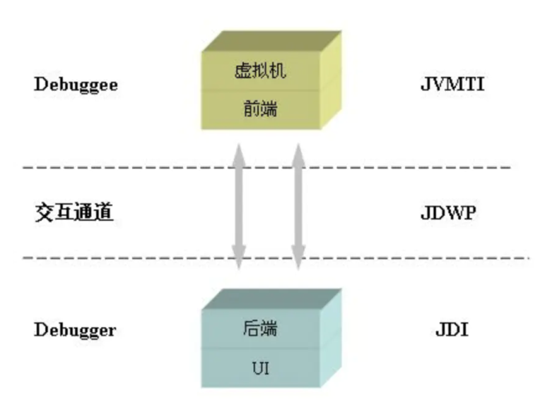

# 1.JavaAgent

参考

https://blog.csdn.net/q1298252589/article/details/112599114


## 1.1 什么是 java agent

java agent本质上可以理解为一个jar包插件，这个jar包通过JVMTI（[JVM](https://so.csdn.net/so/search?q=JVM&spm=1001.2101.3001.7020) Tool Interface）完成加载，

最终借助JPLISAgent（Java Programming Language Instrumentation Services Agent）完成对目标代码的修改。


-javaagent是java命令的一个参数，应用启动是我们可以利用这个参数javaagent指定一个jar包，去实现我们想要它做的一些事情。


## 1.2  JVMTI 

参考

https://blog.csdn.net/q1298252589/article/details/112599114

### 1.2.1 什么是JVMTI ?


JVMTI 是JPDA的一环。  JPDA （Java平台调试架构）




### 1.2.2 JVMTI 能做什么？

JVMTI 称之为 Java虚拟机工具接口。 它是一套由虚拟机直接提供的native接口。位于JPDA 的最底层，所有调试功能本质上都通过JVMTI来提供。


```
通过这些接口，开发人员不仅调试在该虚拟机上运行的 Java 程序，还能查看它们运行的状态，设置回调函数，控制某些环境变量，从而优化程序性能。
```


### 1.2.3 如何使用？

由于是native接口，在java层面上并不能直接调用。通过建立一个Agent的方式来使用JVMTI。这个Agent的表现形式是以 c/c++编写的动态链接库。

```
把 Agent 编译成一个动态链接库，Java启动或运行时，动态加载一个外部基于JVMTI 编写的dynamic module到Java进程内，然后触发 JVM源生线程Attach Listener来执行这个dynamic module的回调函数 。

在回调函数体内，可以 获取各种各样的VM级信息，注册感兴趣的VM事件，甚至控制VM行为。
```


## 1.3 java agent 使用场景


java agent技术有以下主要功能:


- 在加载java文件前拦截字节码并做修改
- 在运行期间变更已加载的类的字节码
- 获取所有已经被加载过的类
- 获取所有已经被初始化过了的类
- 获取某个对象的大小
- 将某个jar加入到bootstrapclasspath里作为高优先级被bootstrapClassloader加载
- 将某个jar加入到classpath里供AppClassloard去加载
- 设置某些native方法的前缀，主要在查找native方法的时候做规则匹配


````
这些功能使得Java Agent在作为一个独立于Java应用程序的代理程序的同时，可以协助监测、运行甚至替换 JVM 上的程序。

// 检测 运行 甚至替换JVM上运行的程序。


````


## 1.4  使用方法

Agent启动方式有两种： 静态Agent和动态Agent 

两种方式的启动方法和运行机制是不一样的。


### 1.4.1 静态Agent


