# 1.基础概念


## 1.1 同步、异步

```
同步和异步通常 形容一次方法的调用。

同步方法，方法的调用者必须等待同步方法执行完毕以后，再进行后续行为。
异步方法，方法的调用者不必等待异步方法执行完毕，可以直接进行后续行为。


调用异步方法后，这个异步方法会在另一个线程执行。有时，这个线程是另外的cpu核心负责执行的，所以合理使用异步方法可以充分发挥cpu多核性能。
```


## 1.2 并发、并行

```
并发指 一段时间内，多个任务交替执行。但是他们仍然是串行的。

并行指 同一时刻，真正的有多个任务同时执行。
```


## 1.3 临界区

```
临界区表示 多个线程使用的 公共资源、共享数据。
```

```
临界区内的资源是 并行设计中重要关注的。因为这可能会产生严重的数据不一致问题。

解决数据不一致问题可行的方法之一 ：在同一时刻只允许1个线程使用临界区资源。
这样会导致在临界区内。并行 变成了串行。一定程度上牺牲了性能。
```


##  1.4 阻塞、非阻塞

`blocking` 阻塞

`non-blocking` 非阻塞


阻塞 和 非阻塞 通常形容 线程之间的相互影响 ， 例如：

```
一个线程占用了临界区、其他希望得到临界区的【线程只能挂起等待】。此时就是【阻塞】。


如果所有线程都不会对临界区资源进行修改，那么【同时允许】多个线程进入临界区也是【线程安全】的，
此时对于进入临界区的所有线程都不需要【等待】，畅通无阻的继续执行下去，表现出的就是【非阻塞】
```


## 1.5 死锁 、饥饿、活锁

```
一个线程长时间得不到需要的临界区资源，导致线程无法进行下去。 --饥饿现象
```

```
死锁： 形成的循环等待。所有线程都在等待临界区资源，形成了一个闭环。没有任何一个线程能执行完毕。线程会无限等待下去，永远无法正常执行完毕。

A线程拥有A'，还想拥有B' ，此时B'被B线程使用。同时B线程也想有用A'资源。
两个线程都在等待对方释放资源。

```

```
活锁比较有趣。

解决死锁的办法之一，就是结的某1个线程，并释放它所拥有的临界区资源。这样其他线程会逐步执行完毕，释放资源。 最终、被结束掉的线程再尝试重新运行。此时因为其他线程已经执行完毕释放了资源，所以自己也能正常执行完毕。


所以根据以上思路可以设计线程：
线程开始->获取临界区资源->获取超时->释放资源->尝试休眠等待->再次尝试获取临界区资源->如果获取成功正常执行，否则再次释放资源等待。

如此设计：死锁闭环的线程会尝试自动解除。

但是有时会出现这样的尴尬现象：
A B 线程各自拥有 A' B' ， 同时希望获得对方的B' A' 。
A B在获取到一半资源以后，都获取超时了。都主动释放资源。都处于休眠等待中，没有任何一方尝试获取A' B' 
如此反复、最终明明是‘活’的状态却没有任何一方成功执行完毕。

想来活锁解决比较容易、不同线程之间的获取超时、休眠等待时间不应当完全一样。这样就可以错开尴尬的活锁。
```

## 1.6 并发级别


```
由于临界区的存在，多线程之间并发，必须受到控制。 可分为如下并发级别：

阻塞          //sync 
无饥饿       //公平锁
无障碍       //乐观锁
无锁
无等待
```

### 1.6.1 阻塞

```
被阻塞的线程，在其他线程释放资源前，无法继续执行。
```

```
synchronized 、 重入锁 都尝试在执行后续代码前，先获取临界区的锁。如果得不到线程机会挂起等待。 此时线程就是被阻塞状态
```

### 1.6.2 无饥饿

 Starvation-Free

```
笼统的讲就是使用 公平锁。

使用公平锁，高优先级线程和低优先级线程获得锁的概率是相等的。避免了饥饿现象。所以称为 无饥饿
```

### 1.6.3 无障碍

```
通俗的讲就是  乐观锁

CAS机制的思想。 
```

### 1.6.4 无锁


### 1.6.5 无等待


## 1.7  原子性 有序性 可见性


### 1.7.3 可见性

```
一个线程修改了临界区内变量的值，另一个线程能够立刻知道这次修改，并成功读取出最新的值
```


```
可见性依赖于 缓存行失效技术。
优化:  缓存填充。一个变量占1个缓存行。避免缓存行失效时，影响其他缓存变量。
参考 https://blog.csdn.net/qq_27428109/article/details/74781774
```

#### 1.7.3.1 Cache的写策略

```
1.write through
只要cpu修改了cache,就立即把cache中最新的数据刷新到内存中
```


```
2.write back
cup修改了cache中的数据，直到因为某种原因，这条cacheline从chace中移出时，刷新回主存中
```


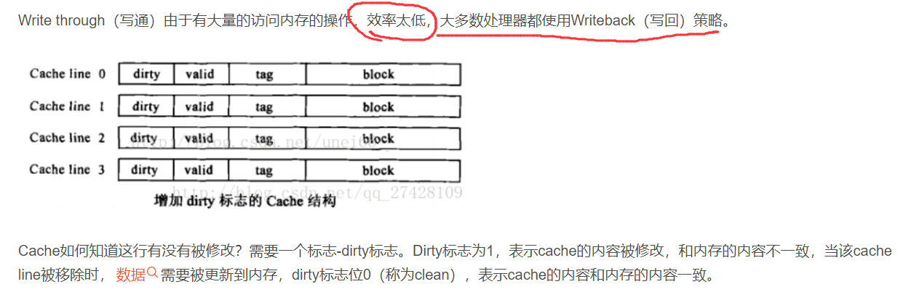


#### 1.7.3.2 Cache不一致问题

缓存不一致问题，其实就是数据不一致问题的微观表现。多核cpu通常会有多级缓存，L1级别的缓存通常是各个核心独享的。这样会导致不一致问题：


#### 1.7.3.3 如何保证cache一致性？


```
Write invalidate（置无效）：当一个内核修改了一份数据，其他内核上如果有这份数据的复制，就置成无效。
```

```
Write update（写更新）：当一个内核修改了一份数据，其他地方如果有这份数据的复制，就都更新到最新值。
```


#### 1.7.3.4  缓存行填充


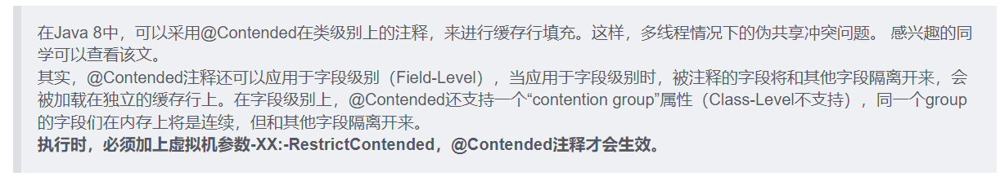


## 1.8 指令重排


### 1.8.1 概念


### 1.8.2 哪些指令不能重排


````
程序顺序原则： 一个线程内保证语义的串行性。
volatile 原则： volatile 变量的写先于读发生。保证了volatile的可见性
锁规则： 解锁必然发生在 随后的加锁前。
传递性： A先于B，B先于C, 那么A先于C
线程的start() 优先于其他每一个动作。
````


## 1.9 补充

### 1.9.1 volatile

java 提供了一种稍弱的同步机制，volatile 关键字。 用于确保变量的更新操作会通知到其他的所有线程。

```
当变量被 volatile修饰以后，编译器不会将该变量的操作进行指令重排。同时volatile变量也不会被缓存到寄存器或者其他cpu不可见的地方。因此读取volatile变量时，总是当前时刻的最新值。
```


# 2. 并行世界基础


## 2.1  java中线程的状态

```
public enum State{
	NEW,
	RUNNABLE,
	BLOCKED,
	WAITING,
	TIME_WAITING,
	TERMiNATED
}
```


## 2.2 java中线程的API


### 2.2.1  新建线程

可以通过 `new`关键字创建一个新线程。


线程的构造方法有多个，如下图：


有关`Thread`的构造方法，及其他的相关信息 [Thread](# 10.1 Thread)


示例：

```java
    public static void main(String[] args) {
        Thread t1 = new Thread(() -> {
            Thread currentThread = Thread.currentThread();
            String name = currentThread.getName();
            System.out.println(name + " is running");
        },"t1");
        
        t1.start();
        
    }
```


### 2.2.2 终止线程

```
不要使用Thead.stop()方法。

会强制停止线程，可能会导致严重的数据不一致问题。
```

```java
//可以自己设置 停止flag，在合适的时机退出线程：
static class myThread extends Thread{
        private boolean flag = false;

        public void StopMe(){
            flag = true;
        }


        @Override
        public void run() {
            while (true){
                if (flag){
                    System.out.println("t2 is stop");
                    break;
                }
                Thread currentThread = Thread.currentThread();
                String name = currentThread.getName();
                try {
                    System.out.println(name + " is doing something ...1");
                    Thread.sleep(500);
                    System.out.println(name + " is doing something ...2");
                    Thread.sleep(500);
                    System.out.println(name + " is doing something ...3");
                    Thread.sleep(500);
                } catch (InterruptedException e) {
                    e.printStackTrace();
                }
                System.out.println("It's safe point now!");
            }
        }

    }


    @Test
    public void test() throws InterruptedException {
        myThread t2 = new myThread();
        t2.setName("t2");
        t2.start();
        Thread.sleep(5000);
        System.out.println("Main Thread notice t2 to stop!");
        t2.StopMe();
        t2.join();

    }
```

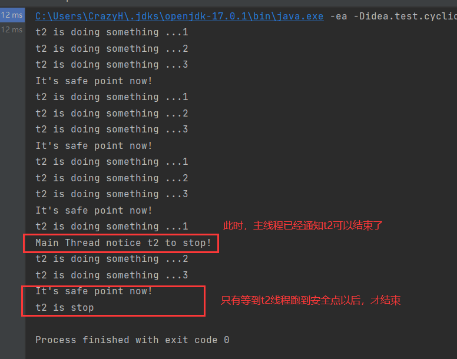


### 2.2.3 线程中断

```
线程中断的思路 和上文我们定义的 stopMe()是一致的。


通过设置 interrupt 标识，通知线程可以中断了。但何时为安全点，何时中断由程序员决定。
```


#### 2.2.3.1 例1

```
下面是一个简单用例。
不使用 Thread.sleep()方式 来减少输出“do something”语句。
因为 当线程休眠时打断线程，会抛出InterruptedException异常。
```


```java
    @Test
    public void test2() throws InterruptedException {
        myThread2 t3 = new myThread2();
        t3.setName("t3");
        t3.start();
        Thread.sleep(5000);
        System.out.println("Main Thread notice t3 to stop!");
        t3.interrupt();
        t3.join();

    }

    static class myThread2 extends Thread{
        int t = 0;
        int safePoint = 0;
        @Override
        public void run() {
            while (true){
                Thread currentThread = Thread.currentThread();
                t++;
                if (t%400000000==0){ //减少线程输出的次数
                    t = 0;
                    System.out.println("doing something");
                    safePoint++;
                    if (safePoint %2==0){//每2次一个安全点
                        System.out.println("it's safe point now!");
                        if (currentThread.isInterrupted()){
                            System.out.println("stop Thread when safe point");
                            break;
                        }
                    }
                }
            }
        }
    }
```

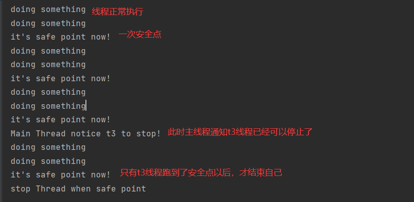


#### 2.2.3.2 例2

```
尝试线程在休眠的时候，被打断。 抛出InterruptedException时，
interrupt 标识不会被置true、所以需要在捕捉时手动 设置true，以便于下次安全点检查标志位。
```


```java
static class myThread3 extends Thread{
    @Override
    public void run() {
        while (true){
            if (isInterrupted()){
                System.out.println("在安全点退出");
                break;
            }
            try {
                Thread.sleep(50000);
            } catch (InterruptedException e) {
                e.printStackTrace();
                System.out.println("在休眠的时候被 interrupt了");
                try {
                    Thread.sleep(2000);
                    System.out.println("继续处理工作...");
                    Thread.sleep(2000);
                    System.out.println("等到下一个安全点...");
                } catch (InterruptedException interruptedException) {
                    interruptedException.printStackTrace();
                }
                interrupt();
            }
        }
    }
}

@Test
public void test3() throws InterruptedException {
    myThread3 t4 = new myThread3();
    t4.start();
    Thread.sleep(2000);
    System.out.println("通知t4可以停止了");
    t4.interrupt();
    t4.join();
}
```

### 2.2.4 等待wait() 和 通知 notify()

#### 2.2.4.1  他们是Object类中的方法

```
wait()
notify()
被用于线程之间协作。但他们是Object类里的final方法。
这意味着，任何一个对象都具有这两个方法。
```

```
在一个线程中调用 obj.wait() 意味着这个线程将在这个对象上等待。
直到另一个线程调用了obj.notify()，并且释放了obj的监视器以后
，当前线程才有可能会被唤醒(当有多个线程在同一个obj上等待时，随机唤醒1个)


显然此时 obj对象成为了多线程通信的手段。
```

#### 2.2.4.2  使用前必须获取这个对象的监视器

```
使用 wait() 或者 notify() 方法时，必须包含在 synchronized代码块中，也就是说，调用这两个方法前，必须先获得这个对象的监视器。

以及调用wait()方法以后，将会立即释放这个对象的监视器。
但是 notify()方法并不会理解释放这个对象的监视器。
```

示意图：
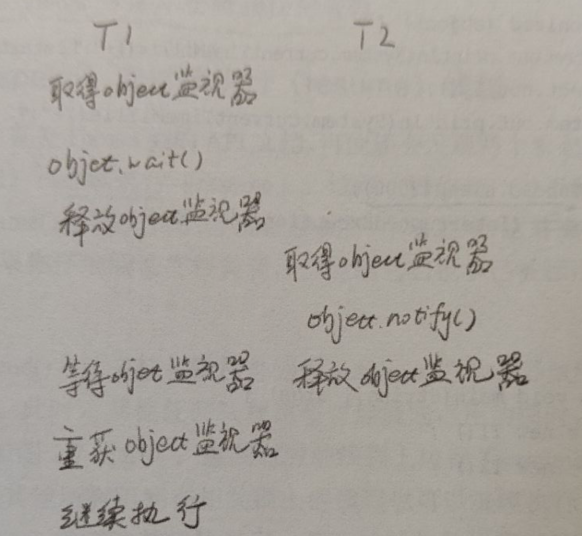


#### 2.2.4.3  一个简单的用例

```java
public class Main2 {
    static Object o = new Object();
    public static void main(String[] args) throws InterruptedException {
        myThread4 myThread4 = new myThread4();
        myThread4.start();
        Thread.sleep(30);//让 myThread5 后启动
        myThread5 myThread5 = new myThread5();
        myThread5.start();
        myThread4.join();
        myThread5.join();
    }

    static class myThread4 extends Thread{
        @Override
        public void run() {

            synchronized (o){
                System.out.println(System.currentTimeMillis() + " 获得了 o 的监视器");
                System.out.println(System.currentTimeMillis() +" T1 休眠5秒,此时开启T2 ，因为无法获得o的监视器,T2 不会notify");
                try {
                    Thread.sleep(5000);
                    System.out.println(System.currentTimeMillis() +" 休眠5秒结束,尝试调用 o.wait()");
                } catch (InterruptedException e) {
                    e.printStackTrace();
                }
                System.out.println(System.currentTimeMillis() +" 释放o的监视器,此时T2 才会执行");
                try {
                    o.wait();
                } catch (InterruptedException e) {
                    e.printStackTrace();
                }
                System.out.println(System.currentTimeMillis() + " T1 执行完毕");
            }

        }
    }

    static class myThread5 extends Thread{

        @Override
        public void run() {

            synchronized (o){
                System.out.println(System.currentTimeMillis() +" T2 获取了 o 的监视器");
                System.out.println(System.currentTimeMillis() +" T2 尝试睡眠 2秒,sleep不会释放锁，所以此时T1并不会被唤醒");
                try {
                    Thread.sleep(2000);
                } catch (InterruptedException e) {
                    e.printStackTrace();
                }
                System.out.println(System.currentTimeMillis() +" 此时 尝试调用 o.notify，释放监视器。T1被唤醒");
                o.notify();
                System.out.println("notify 不会立即释放锁，等到sync代码块执行完毕后才释放锁。");
                System.out.println("如果此时T2 进入死循环，T1永远也不会被唤醒");
                while (true){
                    
                }
                //                try {
//                    System.out.println(getTime() +" T2 尝试睡眠2秒，模拟处理事务消耗2秒");
//                    Thread.sleep(2000);
//                } catch (InterruptedException e) {
//                    e.printStackTrace();
//                }
//                System.out.println(getTime() +" 至此,T2 的sync代码块执行完毕,才释放o的监视器,T1 才会被唤醒");
            }
        }
    }
}
```


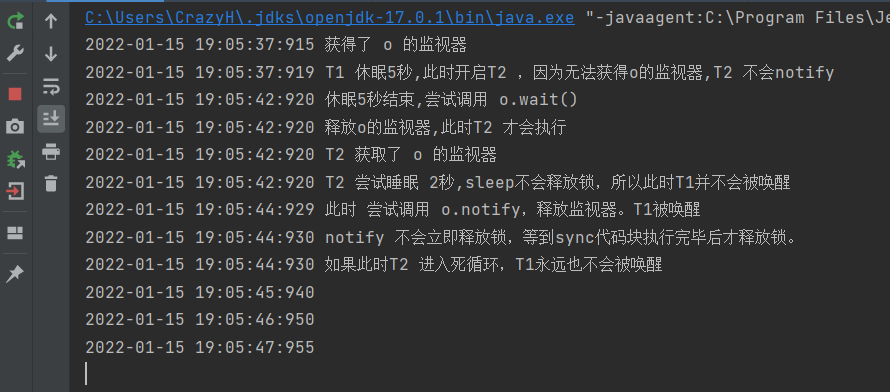


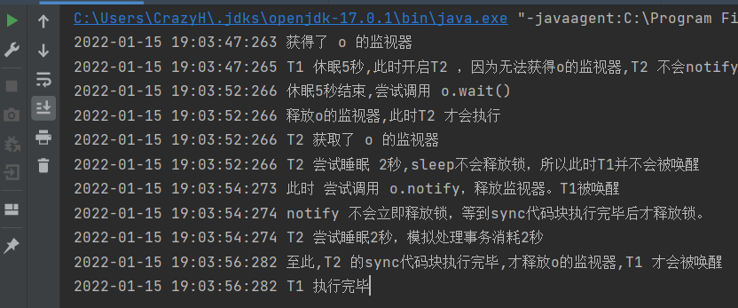


#### 2.2.4.4 细致分析一下


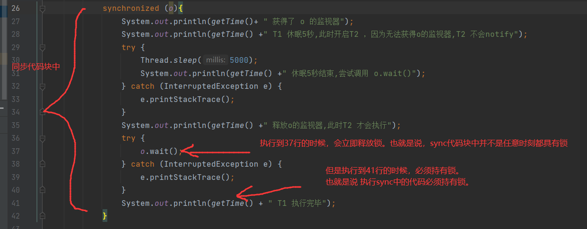


#### 2.2.4.5 总结一下

```
wait 、notify   都属于Object类
wait 、notify 使用前都需要先获取 这个对象的监视器。//包含在sync中
wait 会立即释放这个对象的监视器。
notify 不会立即释放这个对象的监视器。只有等sync代码块执行完毕，才会唤醒等待在这个对象上的其他线程。

notify 唤醒线程是随机的。

```


### 2.2.5 等待线程结束 join 和 让步 yield

```
当一个线程A的输入，依赖于另一个线程B的输出。
此时 A需要等待B线程执行完毕，才能继续执行。JDK提供了 Thread.join()来完成如上动作。
```

#### 2.2.5.1 join()方法

Thread 中join有3个重载方法。

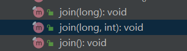

```
join()方法会无限阻塞调用者线程，直到该方法执行完毕。、

其余的2个给出了最大等待时间。
```

#### 2.2.5.2 yield()方法

```
会让当前线程让出cpu，但不会释放锁。
当程序员觉得某个线程优先级比较低。除了可以设置低优先级以外。还可以主动调用 yield()方法，尝试把cpu的使用权让给其他线程。


注意：让出cpu以后，这个线程仍然处于 就绪态(操作系统里的就绪态)，它可能会被再次分配cpu时间片。
```

#### 2.2.5.3 join()不会释放锁

```
join()方法不会释放锁。
```


```java
public class Main3 {
    static Object lock = new Object();
    public static void main(String[] args) throws InterruptedException {
        myThread5 a = new myThread5();
        a.setName("A");
        myThread6 b = new myThread6();
        b.setA(a);
        a.setB(b);


        a.start();
        Thread.sleep(5);//
        b.start();

        a.join();
        b.join();

    }

    static class myThread5 extends Thread{

        private Thread B;

        public void setB(Thread b) {
            B = b;
        }

        @Override
        public void run() {
            synchronized (lock){
                System.out.println(getTime() + " A获取了锁");
                try {
                    System.out.println(getTime() + " A睡眠1秒,让B线程启动");
                    Thread.sleep(1000);
                } catch (InterruptedException e) {
                    e.printStackTrace();
                }
                System.out.println(getTime() + " A调用 B.join() 、join()不会释放锁.B线程永远执行不下去。A线程也永远执行不下去");
                try {
                    B.join();
                } catch (InterruptedException e) {
                    e.printStackTrace();
                }
                System.out.println(getTime()+ " 调用后睡眠5秒");
                try {
                    Thread.sleep(5000);
                } catch (InterruptedException e) {
                    e.printStackTrace();
                }
                System.out.println(getTime()+ " A执行完毕");
            }
        }
    }

    static class myThread6 extends Thread{
        private Thread A;

        public void setA(Thread a) {
            A = a;
        }

        @Override
        public void run() {
            System.out.println(getTime() + " B线程启动");
            synchronized (lock){
                System.out.println(getTime() + " B获得了锁");
                System.out.println(getTime() + " B尝试睡眠1秒");
                try {
                    Thread.sleep(1000);
                } catch (InterruptedException e) {
                    e.printStackTrace();
                }
                System.out.println(getTime() + " B线程结束");
            }
        }
    }
}
```


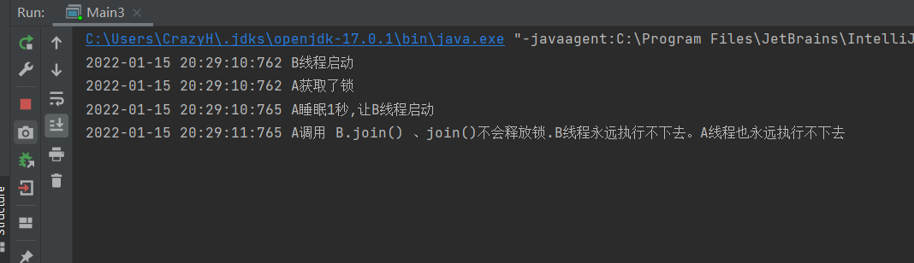


#### 2.2.5.4 yield()不会释放锁

一个小demo测试了线程A即使yield()以后，也不会释放锁lock给线程B

```java
/**
 *
 * 主要测试 join 和  yield
 */
public class Main3 {
    static Object lock = new Object();
    public static void main(String[] args) throws InterruptedException {
        myThread5 a = new myThread5();
        a.setName("A");
        myThread6 b = new myThread6();
        b.setA(a);
        a.setB(b);


        a.start();
        Thread.sleep(5);//
        b.start();

        a.join();
        b.join();

    }

    static class myThread5 extends Thread{

        private Thread B;

        public void setB(Thread b) {
            B = b;
        }

        @Override
        public void run() {
            synchronized (lock){
                System.out.println(getTime() + " A获取了锁");
                try {
                    System.out.println(getTime() + " A睡眠1秒,让B线程启动");
                    Thread.sleep(1000);
                } catch (InterruptedException e) {
                    e.printStackTrace();
                }
                System.out.println(getTime() + " A调用yield,此时lock仍然不会释放,B线程仍不会执行sync里的代码");
                Thread.yield();
                System.out.println(getTime()+ " 调用后睡眠5秒");
                try {
                    Thread.sleep(5000);
                } catch (InterruptedException e) {
                    e.printStackTrace();
                }
                System.out.println(getTime()+ " A执行完毕");
            }
        }
    }

    static class myThread6 extends Thread{
        private Thread A;

        public void setA(Thread a) {
            A = a;
        }

        @Override
        public void run() {
            System.out.println(getTime() + " B线程启动");
            synchronized (lock){
                System.out.println(getTime() + " B获得了锁");
                System.out.println(getTime() + " B尝试睡眠1秒");
                try {
                    Thread.sleep(1000);
                } catch (InterruptedException e) {
                    e.printStackTrace();
                }
                System.out.println(getTime() + " B线程结束");
            }
        }
    }
}
```

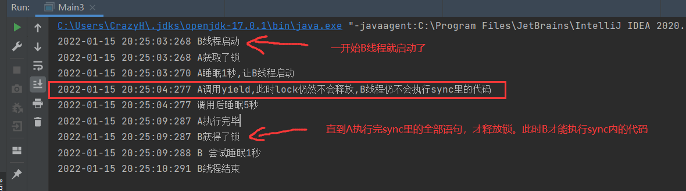


## 2.3 线程组

```
如果线程的数量较多，同时功能分配又比较明确。
可以尝试将多个线程放置在用一个 【线程组】中统一管理。
```

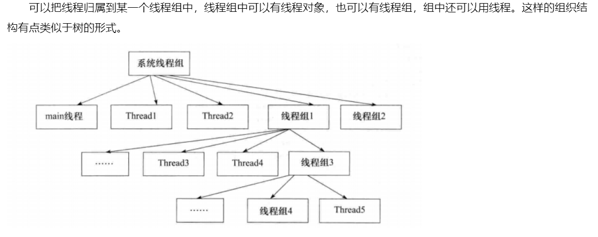


### 2.3.1 ThreadGroup构造参数

ThreadGroup的无参构造方法是私有的。是被C代码调用，创建一个系统线程组。

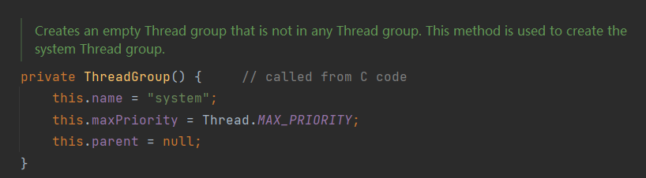


public 修饰，供程序员调用的Api是这两个构造方法。

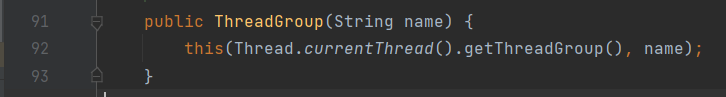

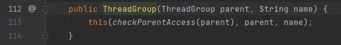

### 2.3.2 线程组的简单用例

```java
/**
 *
 * 测试线程组
 */
public class Main4 {
    public static void main(String[] args) {
        ThreadGroup tg = new ThreadGroup("myThreadGroup");
        Thread t1 = new Thread(tg,()-> System.out.println(1),"t1");
        Thread t2 = new Thread(tg,()-> System.out.println(1),"t2");
        Thread t3 = new Thread(tg,()-> System.out.println(1),"t3");
        Thread t4 = new Thread(tg,()-> System.out.println(1),"t4");


    }
}
```

## 2.4 守护线程

```
Thread.setDaemon(boolean on);
```

```
与守护线程相对应的就是用户线程。

常见的守护线程： 垃圾回收线程、JIT线程

当java应用内只有守护线程，虚拟机就会退出。
```

```
setDaemon() 必须在start()之前
```

## 2.5 线程优先级

```
1-10级。  默认是5
数字越大，优先级越高。越有可能被cpu调度执行。
```


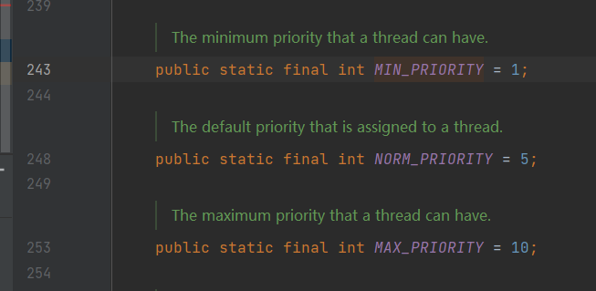

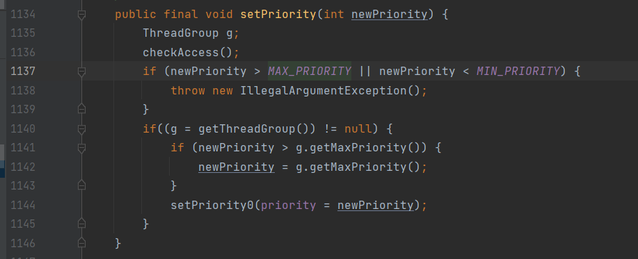


## 2.6 synchronized 锁

```
synchronized 关键字专门用于 同步代码。

被sync包裹的代码块，常称为 同步代码块。

synchronized 也称为“内置锁” ，它是一个可重入锁，
```

### 2.6.1 sync 可以修饰多个地方


- 修饰 实例对象    //对 对象加锁。获取这个对象的监视器
- 修饰 类                //对 Class对象加锁
- 修饰 静态方法    //对 Class对象加锁
- 修饰 实例方法   //对 this对象加锁。也就是调用这个实例方法的实例对象

```
修饰类：
在JMM中，堆空间中存放着Class类对象，作为方法区的入口对象。任何一个class都有对应的Class对象。当sync修饰类的时候，相当于对这个Class对象加锁。

修饰静态方法:
同修饰类一样。对Class对象加锁。在JMM中，我们认为静态方法已经不属于这个类的任何实例对象了。而是属于这个类本身。显然，修饰静态方法，是对Class对象加锁。
```

### 2.6.2 sync 可以保证 原子性 可见性

```
synchronized 无疑会保证原子性。
```

```
sync也会保证可见性。

synchronized关键字保证，在释放锁之前，把缓存内更新的变量值刷新到主存中。
```


# 3.  JDK并发包

为了更好的编写并发程序，jdk提供了大量实用的api。

## 3.1 重入锁

java.util.concurrent.locks.ReentrantLock

### 3.1.1 简单的使用代码


```java
public class Main1 extends Thread{
    private static ReentrantLock rtLock = new ReentrantLock();
    private static int times = 0;
    public static void main(String[] args) throws InterruptedException {

        Main1 m1 = new Main1();
        Main1 m2 = new Main1();
        m1.start();
        m2.start();
        m1.join();
        m2.join();
        System.out.println(times);
    }

    @Override
    public void run() {
        for (int i = 0;i<50000;i++){
            rtLock.lock();
            try {
                times++;
            }finally {
                rtLock.unlock();
            }
        }
    }
}
```

### 3.1.2 ReentrantLock 一些api


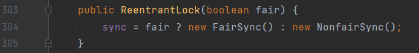

```
构造方法传入 boolean fair 参数，创建公平锁
```


```
isHeldByCurrentThread() //返回一个boolean 判断当前线程是否持有锁

isFair()

getOwner() //返回持有线程Thread

isLocked()

hasQueuedThread(Thread t) //返回boolean。在锁等待队列里是否含有执行线程

hasQueuedThreads() // 等待队列是否为空

getQueueLength()//获得锁等待队列长度

tryLock(long timeout ,TimeUnit unit)//在给定的时间内，获取锁。如果超时，返回false,成功获取返回true
```


### 3.1.3 重入锁的中断响应

```
通常线程在等待锁的过程，只有两种结果。
1、得到锁继续执行。
2、得不到锁 一直等待。


重入锁的中断响应提供了第三种结果：
线程在等待锁的过程中，可以根据需求取消对锁的请求。这有助于解决死锁
```

#### 3.1.3.1 中断响应api

```
ReentrantLock.lockInterruptibly()  // 加中断锁。 被中断时会抛出 InterruptedException

前文提到过。Thread.interrupt();方法通过设置标志位，来使程序打断。

通知重入锁打断，也是使用Thread.interrupt()
```


#### 3.1.3.2 简单使用实例

```java
public class Main2 extends Thread{
    private static ReentrantLock rt1 = new ReentrantLock(true);
    private static ReentrantLock rt2 = new ReentrantLock(true);

    private int model = 1;//设置模式。 1模式先获取rt1，后获取rt2
                          //2模式反之
    public Main2(int model,String name) {
        super(name);
        this.model = model; //通过构造方法设置model
    }


    public static void main(String[] args) {
        Main2 m1 = new Main2(1,"m1");
        Main2 m2 = new Main2(2,"m2");
        m1.start();
        m2.start();
        Scanner scanner = new Scanner(System.in);
        if (scanner.hasNext()){
            m2.interrupt();//给出打断信号
        }
    }


    @Override
    public void run() {
        try {
            if (model ==1){
                rt1.lockInterruptibly();
                try {
                    Thread.sleep(1000);
                } catch (InterruptedException e) {
                    e.printStackTrace();
                }
                rt2.lockInterruptibly();
            }else if (model ==2){
                rt2.lockInterruptibly();
                try {
                    Thread.sleep(1000);
                } catch (InterruptedException e) {
                    e.printStackTrace();
                }
                rt1.lockInterruptibly();
            }
        } catch (InterruptedException e) {
            e.printStackTrace();
        } finally {
            if (rt1.isHeldByCurrentThread()) {
                rt1.unlock();
                System.out.println(getName() +" has rt1");
            }
            if (rt2.isHeldByCurrentThread()){
                rt2.unlock();
                System.out.println(getName() +" has rt2");
            }
        }
    }
}
```

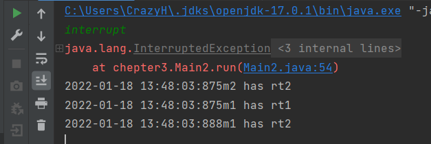

```
m2 线程被打断了、最终只持有rt2锁

m1 线程同时持有2把锁
```


### 3.1.4  限时获取锁 tryLock

重入锁可以给 获取锁的请求加一个限定的时间，如果超时，则不再尝试获取锁。

获取成功返回true,否则返回false

```
tryLock() //不做任何等待，如果获取成功直接返回ture否则false
tryLock(long timeout, TimeUnit unit);
```


#### 3.1.4.1 一个简单使用实例

```java
public class Main3 extends Thread {

    static private ReentrantLock rt1 = new ReentrantLock();
    static private ReentrantLock rt2 = new ReentrantLock();

    int model;


    public static void main(String[] args) throws InterruptedException {
        Main3 t1 = new Main3(1, "t1");
        Main3 t2 = new Main3(2, "t2");
        t1.start();
        t2.start();
        t1.join();
        t2.join();
    }

    public Main3(int model,String name) {
        super(name);
        this.model = model;
    }

    @Override
    public void run() {
        while (true) {
            try {
                if (model == 1) {
                    if (rt1.tryLock() ){
                        Thread.sleep(2000);
                        if (rt2.tryLock()) {
                            Thread.sleep(1000);
                            System.out.println(getName() + " done!");
                            break;
                        }
                    }

                } else if (model == 2) {
                    if (rt2.tryLock()){
                        Thread.sleep(2000);
                        if (rt1.tryLock()) {
                            Thread.sleep(1000);
                            System.out.println(getName() + " done!");
                            break;
                        }
                    }
                }
            }catch (InterruptedException e){
                e.printStackTrace();
            }
            finally {
                if (rt1.isHeldByCurrentThread()){
                    rt1.unlock();
                    System.out.println(getName() + " 释放rt1");
                    try {
                        Thread.sleep(new Random(System.currentTimeMillis()).nextLong(100));
                    } catch (InterruptedException e) {
                        e.printStackTrace();
                    }
                }
                if (rt2.isHeldByCurrentThread()){
                    rt2.unlock();
                    System.out.println(getName() + " 释放rt2");
                    try {
                        Thread.sleep(new Random(System.currentTimeMillis()).nextLong(100));//释放锁后随即睡眠，让其他线程尝试获取锁。防止活锁现象
                    } catch (InterruptedException e) {
                        e.printStackTrace();
                    }
                }
            }
        }
    }
}
```


### 3.1.5 公平锁、非公平锁

```
按照FIFO的规则，将锁平分给等待队列的线程。 即为 公平锁。

反之，为 非公平锁。
```

```
通常，根据系统调度，一个线程会倾向于再次获得已经拥有的锁。

这样省去了 频繁切换上下文带来的开销。 
因此： 非公平锁的吞吐率,效率会高于公平锁。但是可能会引发饥饿现象。
```


### 3.1.6  回顾与总结 重入锁特点

- 同一个线程可以再次获得 已经获得的重入锁。
- 通过 lock() 加锁
- 通过unlock()解锁
- tryLock(long timeout, TimeUnit unit) 限时获取锁
- lockInterruptibly() 中断响应锁
- 公平锁、非公平锁


## 3.2 Condition

### 3.2.1 什么是condition

condition 其实是一个接口。

Condition与锁搭配使用，可以让线程在合适的时间等待、或者在一个特定的时刻得到通知。

```
在Lock接口中，规定了一个名为 Condition newCondition()的方法。
```

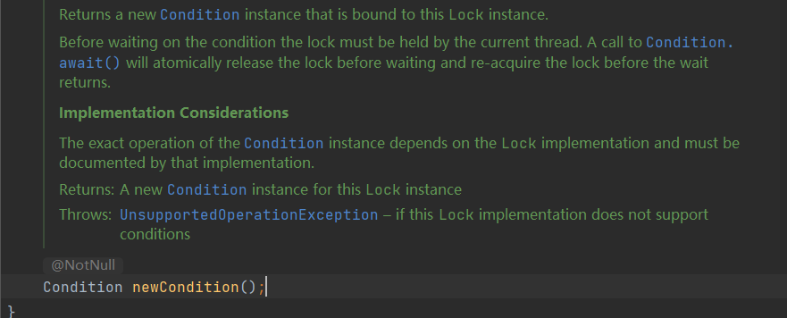

```
返回一个绑定在当前锁上的Condition实例
```


### 3.2.2 condition 接口方法

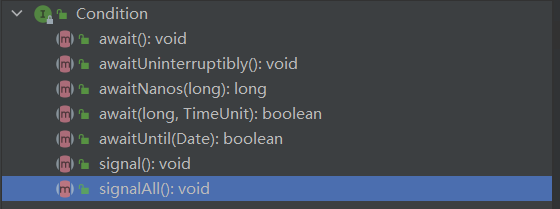


```
await() 类似于 Object.wait(),让线程等待。并释放锁。

awaitUninterruptibly(), 见名知意，线程等待，不响应中断

await(long, TimeUnit) 限时等待

signal() 类似于 Object.notify(),唤醒一个线程

signalAll() 唤醒全部等待线程
```

### 3.2.3  测试一下api


````
在前文，曾经测试过。wait()会立即释放锁。notify()并不会立即释放锁唤醒其他线程。而是在退出sync代码块释放了锁以后，才会唤醒其他线程。

现在测试一下Condition是否和Objeact.notify()一致
````


```java
public class Main4 extends Thread{

    static private ReentrantLock rt1 = new ReentrantLock();
    static private Condition c1;
    static {
        c1 = rt1.newCondition();
    }
    int model;

    public static void main(String[] args) throws InterruptedException {
        Main4 t1 = new Main4(1, "t1");
        Main4 t2 = new Main4(2, "t2");
        t1.start();
        Thread.sleep(10);
        t2.start();
        t1.join();
        t2.join();


    }

    public Main4(int model,String name) {
        super(name);
        this.model = model;
    }

    @Override
    public void run() {
        while (true){
            try {
                if (model==1){
                    if (rt1.tryLock()) {
                        System.out.println(getName()+ " 成功获取锁rt1");
                        try {
                            Thread.sleep(50);
                            c1.await();//在c1上等待
                            System.out.println(getName() + " 成功被唤醒!");
                            break;
                        } catch (InterruptedException e) {
                            e.printStackTrace();
                        }
                    }
                }else if (model==2){
                    if (rt1.tryLock()) {
                        System.out.println(getName()+ " 成功获取锁rt1");
                        try {
                            Thread.sleep(200);
                            System.out.println("尝试唤醒");
                            c1.signal();
//                        System.out.println("然后执行死循环");
                            System.out.println("不执行死循环");
//                        while (true){
//
//                        }
                            break;
                        } catch (InterruptedException e) {
                            e.printStackTrace();
                        }
                    }
                }
            }finally {
                if (rt1.isHeldByCurrentThread()) {
                    rt1.unlock();
                    System.out.println(getName() + " 释放rt1");
                }
            }
        }
    }
}
```

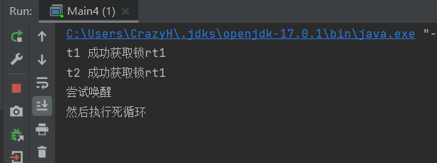

```
结果和notify() 一致。
调用了singal()以后不会立即释放锁。只有显式调用了unlock()释放了锁以后，才会唤醒其他线程。
```


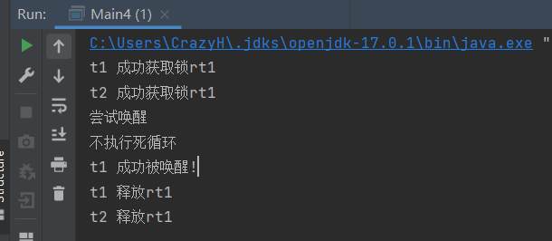

```
t2先释放锁，t1线程才能执行下去。
此时输出语句不正确的原因是，释放锁和输出语句没有使用同步代码块。
释放了锁以后恰好失去了cpu使用权。
```

## 3.3 信号量 Semaphore

```
信号量为 多线程协作 提供了更为强大的控制方法。

可以说是锁的扩展。 synchronized 和 锁 只允许同1个资源同时被1个线程访问。
信号量可以同时被多个线程访问。
```

### 3.3.1 主要api


构造方法：

```java
public Semaphore(int permits) //传入一个 最大准入量

public Semaphore(int permits,boolean fair)
```

实例方法:

```
public void acquire()  //请求一个准入数
public void acquireUninterruptibly()
public boolean tryAcquire()
public boolean tryAcquire(long,Timeunit) //和Lock一致
public void release()   //释放一个准入数
```

### 3.3.2 一个简单的使用示例

```java
public class Main5 implements Runnable{
    final Semaphore semaphore = new Semaphore(5);

    public static void main(String[] args) throws InterruptedException {
        ExecutorService exec = Executors.newFixedThreadPool(20);
        Main5 task = new Main5();
        for (int i = 0;i<20;i++){
            exec.submit(task);
        }
        Thread.sleep(10000);
        exec.shutdownNow();

    }

    @Override
    public void run() {
        try {
            semaphore.acquire();
            Thread.sleep(2000);
            System.out.println(Thread.currentThread().getName() + ": done!");
        } catch (InterruptedException e) {
            e.printStackTrace();
        }finally {
            semaphore.release();
        }
    }
}
```

```
使用线程池开启了20个线程。
执行runnable task。 5个信号量、使用时休眠2秒。
所以可以看到5个为一组的输出语句。一共4组
```

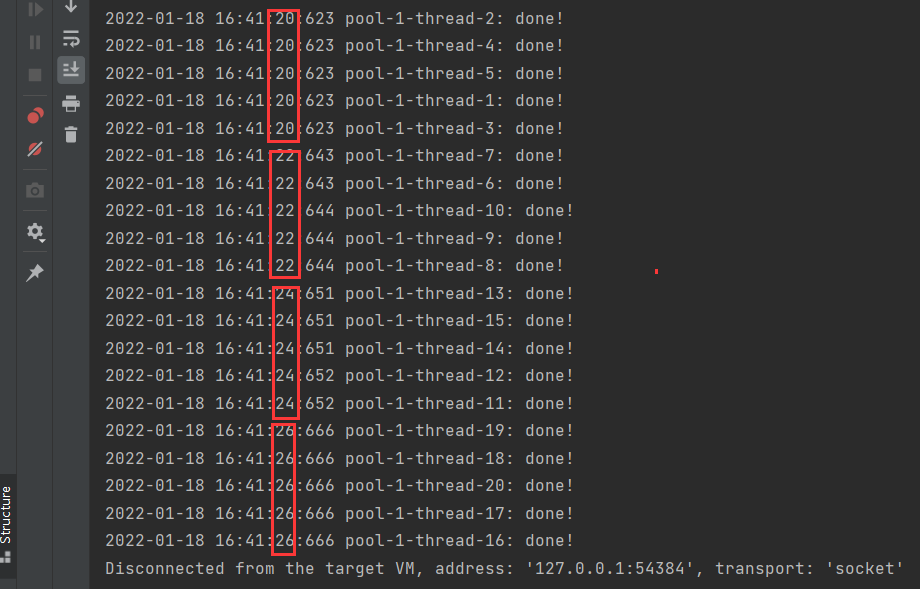


## 3.4读写锁 ReadWriteLock


```
ReadWriteLock 是jdk5中提供的读写分离锁。

它可以有效地减少锁竞争，增加系统效率。
```


读写锁的思想非常容易理解。读操作不会带来数据一致性问题。所以：

- 读-读 不阻塞
- 读-写 阻塞
- 写-写 阻塞


### 3.4.1 ReentrantReadWriteLock

可重入的读写锁。

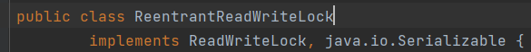


静态内部类：

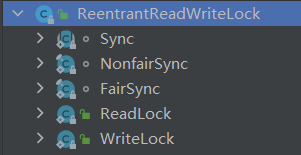

构造方法：


实例方法：（一部分）

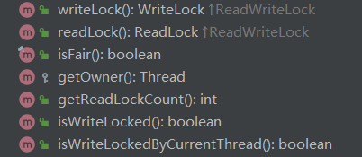

```
writeLock() 获得写锁
readLock() 获得读锁
isFair()
isWriteLocked()  //写锁锁住了吗?
isWriteLockedByCurrentThread() //写锁是被当前线程持有吗
```

```
class WriteLock   class ReadLock  
是ReentrantReadWriteLock的内部静态类，并非接口
```

### 3.4.2 简单的使用示例

```java
public class Main6 {
    static private ReentrantReadWriteLock rrwl= new ReentrantReadWriteLock();
    static private Lock writeLock = rrwl.writeLock();
    static private Lock readLock =  rrwl.readLock();
    private int value = -1;

    public Main6(int value) {
        this.value = value;
    }

    public Main6() {

    }

    public static void main(String[] args) throws InterruptedException {
        Main6 main6 = new Main6();
        Runnable runnable1 = ()->{
            main6.readHandle(Main6.readLock);
        };
        Random random = new Random(System.currentTimeMillis());
        Runnable runnable2 =()->{
            main6.writeHandle(Main6.writeLock,random.nextInt());
        };


        long start = System.currentTimeMillis();
        Thread[] threads = new Thread[20];
        for (int i = 0; i < 20; i++) {
//            threads[i]= new Thread(runnable1); // 读操作 用时508ms
            threads[i]= new Thread(runnable2);//写操作  用时10206ms
            threads[i].start();
        }
        for (int i = 0; i < 20; i++) {
            threads[i].join();
        }
        System.out.println(System.currentTimeMillis()-start);


    }


    public Object readHandle(Lock lock){
        try {
            lock.lock();
            Thread.sleep(500);
            return value;
        } catch (InterruptedException e) {
            e.printStackTrace();
            return value;
        }
        finally {
            lock.unlock();
        }
    }
    public void writeHandle(Lock lock,int newValue){
        try {
            lock.lock();
            this.value = newValue;
            try {
                Thread.sleep(500);
            } catch (InterruptedException e) {
                e.printStackTrace();
            }
        }finally {
            lock.unlock();
        }
    }

}
```


## 3.5 `CountDownLatch`  倒计数器

CountDownLatch 是一个多线程工具类。

它可以让某一个线程等待直到倒计数结束，再开始执行。

```
例如: 火箭发射，执行前要对1,2,3...n个仪器检查。每检查通过1个 倒计数器-1直到为0。才开始发射。


例如：士兵报道，10个士兵必须全部集合以后才能出发，可以使用CountDownLatch
```


### 3.5.1 构造方法

传入一个`int count` 表示期望的目标数量。


### 3.5.2 实例方法

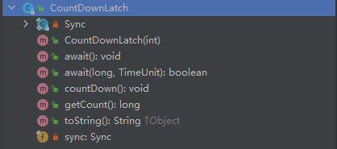

```
public CountDownLatch(int count);

public void await();

public void countDown();// -1

public long getCount(); 
```


#### 3.5.2.1 `countDown()`

调用本方法时 期望的目标计数-1 ，当减到0时，恢复所有阻塞在`CountDownLatch`的线程。


#### 3.5.2.2  `await()`

让调用者线程阻塞住。直到整个`CountDownLatch`达到期望目标数量。


让当线程阻塞等待 ，直到`CountDownLatch` 减到0。 如果这个线程被 `interrupt`那么会回复阻塞。


#### 3.5.2.3 `getCount()`

返回当前的`count` ，用于debug调试


### 3.5.3 简单的使用示例


```java
public class Main7_CountDownLatch implements Runnable{

    private static CountDownLatch cdl = new CountDownLatch(10);
    private static Random r = new Random(System.currentTimeMillis());
    private static AtomicInteger i = new AtomicInteger(10);

    public static void main(String[] args) throws InterruptedException {

        Runnable task = new Main7_CountDownLatch();
        ExecutorService exec = Executors.newFixedThreadPool(10);

        for (int i = 0; i < 10; i++) {
            exec.submit(task);
        }
        cdl.await();
        System.out.println("准备工作完成! 发射火箭");
        exec.shutdownNow();


    }


    @Override
    public void run() {

        try {
            int i = Main7_CountDownLatch.i.decrementAndGet();
            System.out.println("正在做准备工作..."+i);
            Thread.sleep(r.nextInt(10)*1000);
            System.out.println("完成工作..."+i);
        } catch (InterruptedException e) {
            e.printStackTrace();
        }
        cdl.countDown();
    }
}
```


## 3.6 CyclicBarrier  

循环栅栏。


### 3.6.1 什么是CyclicBarrier


```
与CountDownLatch类似。 提供一个循环使用的 倒计数器。只有当指定数量的线程达到目标以后，才能执行后续操作。
这与CountDownLatch的大致一致。
```


```
CyclicBarrier的本意是模拟了这样的场景： 一定size的线程需要同时到达一个栅栏点Point等待。直到所有线程都达到point以后，执行一个Runnable task任务。 并且这个场景是可以循环利用的（size计数可以重新开始循环计数）
```


### 3.6.2  一些api


构造方法：

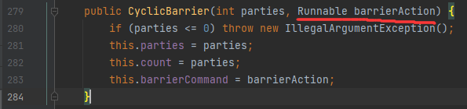

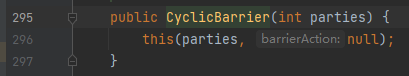


```
CyclicBarrier在创建的同时需要传入 计数器的大小parties, 以及计数器归零以后 执行的操作。
也可以执行空操作。传入Runnable 为Null
```


实例方法（一部分）：


```
-1操作不再是countDown()，而是await();   
```


### 3.6.3 一个简单的使用实例


```java
public class Main8_CyclicBarrier {

    public static void main(String[] args) {
        CyclicBarrier cb = new CyclicBarrier(10,new barrierRunnable(1));

        for (int i = 0; i < 10; i++) {
            Thread t = new Thread(new soldierRunnable(cb),"soldier"+i);
            t.start();
        }
    }


    static class soldierRunnable implements Runnable   {
        private CyclicBarrier cb;


        public soldierRunnable(CyclicBarrier cb) {
            this.cb = cb;
        }

        @Override
        public void run() {
            System.out.println(Thread.currentThread().getName() + " 报道!");
            try {
                cb.await();//通知cyclicBarrier 士兵报道

                //执行到这里，说明所有士兵全齐了。 cyclicBarrier重新计数
                doWork();

                System.out.println(Thread.currentThread().getName() + " 执行任务完毕。通知 cyclicBarrier");
                cb.await();//再次通知cyclicBarrier


            } catch (InterruptedException | BrokenBarrierException e) {
                e.printStackTrace();
            }

        }


        private void doWork(){
            System.out.println(Thread.currentThread().getName()+ " 开始执行任务!");
            try {
                Thread.sleep(new Random().nextInt(5) *1000);
            } catch (InterruptedException e) {
                e.printStackTrace();
            }
        }

    }


    static class barrierRunnable implements Runnable{

        private int flag;

        public barrierRunnable(int flag) {
            this.flag = flag;
        }

        @Override
        public void run() {
            if (flag==1){
                try {
                    Thread.sleep(1000);
                    System.out.println("全部士兵集结完毕");
                    Thread.sleep(1000);
                    System.out.println("现在开始统一执行任务!");
                    Thread.sleep(1000);
                    flag=2;
                } catch (InterruptedException e) {
                    e.printStackTrace();
                }
            }else if (flag==2){
                System.out.println("所有士兵执行任务完毕!");
            }
        }
    }
}
```


### 3.6.4 和 CountDownLatch的区别


`CyclicBarrier` 则更强调 `barrier` 像一个栅栏一样。它会阻塞全部的计数线程，直到 `CyclicBarrier` 达到目标值。

`CountDownLatch` 不会直接阻塞计数线程，除非他们调用了 `CountDownLatch.await()`


```
CyclicBarrier会阻塞所有的 计数线程，直到CyclicBarrier到达目标值以后，所有的线程恢复阻塞。
```


就好像围栏一样，一些线程很快的到达了目标点，但还需要等待其他线程，当达到目标值以后，所有线程同时恢复阻塞。


## 3.7 LockSupport 类

`LockSupport`是线程阻塞工具。可以在线程任意位置阻塞线程。这个类提供的方法是 `public static`的，可以优雅的阻塞线程。


### 3.7.1 类方法


#### 3.7.1.1 `parkNanos(long)`

以指定时长阻塞当前线程的线程调度，除非  `permit`许可可用 调用`unpark`会恢复许可 。


如果传入的`long`小于等于0，那么这个方法将不会做任何操作。


下面4点，满足其一恢复阻塞：

1. 其他线程调用了`unpark(Thread)` 恢复了本线程
2. 其他线程 `interrupt`了本线程
3. 指定的时间到达
4. The call spuriously (that is, for no reason) returns. 


```java
@Test
public void testForParkNanos(){
    System.out.println("park...");
    long duration = Duration.ofHours(1).toNanos();
    LockSupport.parkNanos(duration);
    System.out.println("unpark");
}
```


#### 3.7.1.2 `unpark(Thread)`

让指定线程的`permit` （许可）恢复可用。


让指定线程的`permit` （许可）恢复可用，如果线程已经是阻塞状态，那么它将恢复阻塞。

否则这个线程的下一次`park`将不会被`park` (因为 permit标志位没有被消耗。)


```java
public class MainForUnpark {

    //创建一个static的线程t1, 让其park
    static Thread t1 = new Thread(()->{
        String name = Thread.currentThread().getName();

        System.out.printf("[%s] : park...\n",name);
        long duration = Duration.ofHours(1).toNanos();
        LockSupport.parkNanos(duration);

        System.out.printf("[%s] : unpark...\n",name);

    },"t1");
    
    
    public static void main(String[] args) throws InterruptedException {
        //让t1运行
        t1.start();

        //让main线程休眠5秒后再尝试 unpark t1线程。
        Thread.sleep(Duration.ofSeconds(5).toMillis());
        
        String name = Thread.currentThread().getName();
        System.out.printf("[%s] : now try to unpark t1\n",name);
        
        // unpark t1线程。
        LockSupport.unpark(t1);
        //t1.interrupt(); 中断也可实现恢复阻塞
        
        //让main线程等到t1线程执行完毕。
        t1.join();

    }
}
```


#### 3.7.1.3 `park()`


禁用当前线程，并保证其不会被线程调度，除非 `permit` 标志位可用。

如果`permit`标志位可用，并且 它被正常消耗，那么线程将立即恢复阻塞。(如果线程没有被阻塞，此时`permit`标志位如果可用，则不会立即被消耗，而是等到下一次阻塞时才会被消耗。)


线程将被阻塞，直到以下三点满足其一：

1. 其他线程调用了`unpark`，恢复了本线程
2. 其他线程中断了本线程。
3. 错误调用。（在没有park的时候被 unpark，导致下次park失效）


`park()`方法返回的是`void` ，本方法并不向开发者汇报，由于哪种原因导致的线程恢复阻塞。调用者需要自己`re-check`线程恢复阻塞的原因。


#### 3.7.1.4 `parkUntil(long)`

阻塞线程，直到一个时间点。

例如想要阻塞5秒，则时间点为：

```java
long timing = System.currentTimeMillis()+Duration.ofSeconds(5).toMillis();
```


#### 3.7.1.5 `park(Object)`

阻塞当前线程（不会被线程调度）除非`permit` 许可可用。


如果`permit` 可用，并且被正确消费，那么线程会立即恢复阻塞。 否则只能满足下面3点其一才能恢复阻塞。


1. 其他线程`unpark`
2. 线程被`interrupted`
3. 错误调用（在没有park的时候被 unpark，导致下次park失效）。


## 3.8  AQS

`AbstractQueuedSynchronizer`     抽象队列同步器。


AQS定义了一套多线程访问共享资源的同步器框架，许多同步类实现都依赖于它，如常用的ReentrantLock 、Semaphore 、CountDownLatch 


CLH锁，CLH（Craig，Landin and Hagersten）是三个人，共同发明了一个可扩展、高性能、公平且基于自旋锁的链表；

链表中的每个线程只在本地自旋前一个节点的状态，即该节点（一个独立的线程会被包装为一个节点）不断自旋获取前一个节点的状态；每个节点都有一个状态（要么自旋，要么释放锁）。


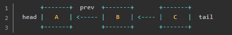


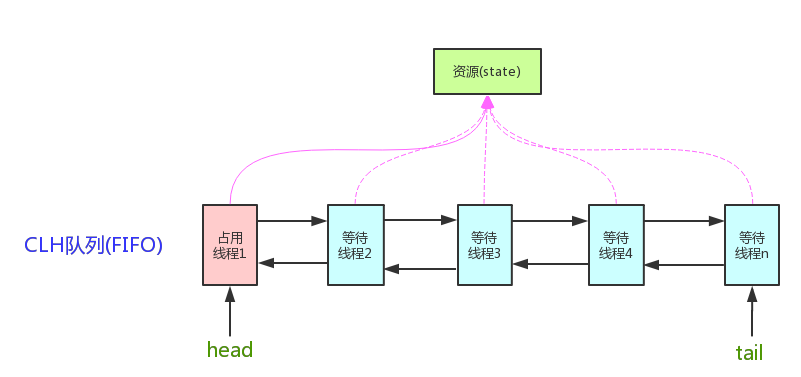


这个结构:

```
1.是一个 FIFO（first-in-first-out）队列；
2.新的等待获取锁的线程先加入队尾（tail）；
3.如果队列是空，则第一个新加入的节点立即获得锁；
4.新加入的线程本地自旋前一个节点的状态（如 C 不断自旋获取 B 的状态）；
5.(当A释放锁时，B成为第一个节点)，头节点并不能保证能够获得锁，只是有优先权，如果获取失败，则重新变为等待状态；
```


```
第5点详细解释:   任何一个等待资源的线程都会被包装成一个Node节点,入队其实就是等待的过程。队内节点调度规则决定了是否是公平锁。
也就是说，公平锁与否取决于调度规则。在后续的accquire(int) 代码中有详细体现。
```


AQS使用的数据结构基于CLH变体。


### 3.8.1  AQS框架

AQS有两种运行模式，独占(EXCLUSIVE)和共享(SHARED)。

```
独占锁 : 同一时间只能由1个线程获得锁  例如ReentrantLock 。 

共享锁:  多个线程可以同一时间获得，并执行。  如 CountDownLatch  Semaphore
```


有一种特殊的，读写锁  `ReentrantReadWriteLock`  可以看做两种模式的组合。即存在写锁独占，也存在读锁共享。


AQS是一种框架，可以帮助程序员快速实现一个基于自定义规则的锁。也就是获得锁的调度规则是程序员自己开发。程序员只需要重写

以下5种方法即可。

如果只是`独占锁`，那么仅需要实现 `tryAcquire()`, `tryRelease()`即可。

如果是`共享锁`，只需要实现 `tryAcquireShared()` ,`tryReleaseShared()`即可。


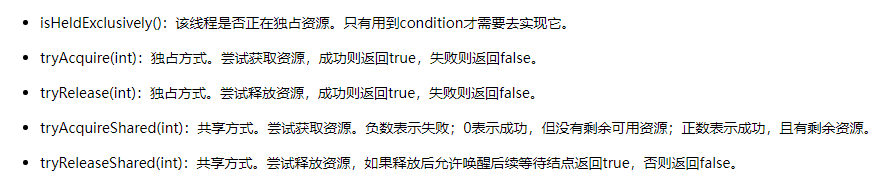

```
继承自AQS ，复杂的等待线程出队入队都不需要重新实现。
```


### 3.8.2 AQS的成员变量


#### `int state`

AQS内部有一个核心状态为`state`。

所有通过AQS实现功能的类都是通过修改 `state`的状态来操作 【线程的同步状态】。

比如在`ReentrantLock`中，一个锁中只有一个`state`状态，当`state`为0时，代表所有线程没有获取锁，当`state` =1时，代表有线程获取到了锁。
```
超过1的状态表示 重入锁的次数
```


提供了2种方法修改state的值，1个方法返回state值


```
不同的修改方法,将在不同的场景下使用，一个是CAS，一个在获得锁状态下修改。无需CAS
```


#### `Node head`


```
AQS中的成员变量 Node 类型的head节点。

表示等待队列的头节点，是一个懒加载的。这个对象仅仅通过  setHead(Node) 方法进行修改。

注意： 如果head变量不为null,那么这个头节点的状态位(waitState)必须保证不能是 取消状态(-2)
```


#### `Node tail`

```
AQS的成员变量， Node类型的 tail 节点。

表示等待队列的尾节点。懒加载。仅仅只能通过 enq(Node)方法修改这个变量。
```


### 3.8.2 AQS子类`Node`

`Node`类是AQS中的子类。用于表示在`AQS`队列中的一个【元素节点】。

Node节点把等待的【线程】封装在成员变量，并定义了一个int类型的控制变量  `waitStatus` 当前节点状态。


#### 3.8.2.1 `waitStatus`的值


`waitStatus` 表示当前节点状态，具体的值为 :


- 0：初始状态
- CANCELLED（1）：取消状态，当线程不再希望获取锁时，设置为取消状态
- SIGNAL（-1）：当前节点的后继者处于等待状态(阻塞住了)，当前节点的线程如果释放或取消了同步状态，通知后继节点
  - 后入队的节点会挂在非取消状态节点的后面。并尝试修改前驱节点的状态为-1，告诉前面的节点，需要唤醒自己
- CONDITION（-2）：等待队列的等待状态。表示当前节点正在等待锁，当调用`signal()`时，进入同步队列
- PROPAGATE（-3）：共享模式，同步状态的获取的可传播状态


Node类型的 成员变量 `Node SHARED` 和 `Node EXCLUSIVE` 表示当前节点是否以 “独占锁”状态运行。


### 3.8.3 AQS里的模板方法


#### `accquire()`

```
accquire这个方法的含义表示,阻塞等待锁。不超时，会一直等待，直到获取锁。
```


accquire中调用了`addWaiter(Node)`方法。

```
该方法表示把调用此方法的线程封装在一个新的Node节点中，并加入到AQS等待队列中。然后返回对应包装好的Node节点对象。
```


再看看第616行调用的 `enq(Node)` 方法：


```
这个方法完成2个任务，
1.如果队列没有被初始化,那么自旋CAS初始化

2.如果队列已经初始化了,那么自旋CAS入队尾
```


回到 `acquire` 方法中第1199行, `addWaiter()` 方法执行完毕以后,确保此时队列已经初始化完成，并且当前线程已经入队成功。

紧接着就会调用 `accquireQueued()`方法


```
acquireQueued方法的目的 : 让已经在队列中的线程, 以独占式的,不可中断的的方式获取锁。


该函数表示已经在队列中的node尝试去获取锁 ， 否则挂起
```


在第862行调用了 `predecessor()`方法。目的是获取当前节点的前驱节点。


翻译：

```
返回前驱节点，或者当前驱节点为空的时候，就抛出空指针异常。调用这个方法就意味着前驱节点不能为空.

有时null可以被忽略，但忽略的原因仅仅是帮助VM (意思是，在业务逻辑上不允许前驱节点为空)
```

不允许 `prev`为空也好理解 ： 

```
因为在正常的流程中, 执行到 `predecessor()`方法的Node都已经完成了入队。
就算是等待队列中的第一个节点，它的前驱节点也应该是在`enq(Node)`中初始化的头节点。
```


回到第863行：


```
发现当前Node节点的prev是头节点。这就意味着当前Node节点是队首节点,可以尝试获得锁了。调用 tryAcquire方法,获得锁。


tryAcquire方法,就是开发者需要自己实现的  “尝试获得锁”的逻辑。
```


为了思维的连贯性(AQS没有实现这个方法)，这里引用 ReentrantLock公平锁的 `tryAcquire`方法()


```java
//getState()返回的是 AQS的状态
// state 表示重入锁的次数, state==0 表示此时没有被其他线程重入，可以尝试上锁。


    protected final int getState() {
        return state;
    }

    private void setHead(Node node) {
        head = node;
        node.thread = null;
        node.prev = null;
    }
```


```
可以看到tryAcquire表示当前线程唤醒,并可以尝试获取锁的逻辑。判断是否重入，重入次数等逻辑。
```


接着回到  `acquireQueued` 方法


在869行 ，做了如下判断：

```
能执行到869行,就说明863行的tryAcquire 抢锁失败了，如果抢锁成功了,就会直接return出去。

这意味着2种情况: p!=head 或者 (虽然p==head ,但是tryAcquire失败了)。


如果p!=head 说明当前的节点不是等待队列的头节点，有其他Node排在当前节点的前面,所以当前Node需要阻塞住。
```


那么接下来看看869行的  `shouldParkAfterFailedAcquire(Node,Node)`  传入了 前驱节点 和 当前节点


```
本方法检查和更新当前Node的状态。  如果当前Node节点需要阻塞等待,那么本方法会返回true。

如果不需要阻塞等待,那么返回false,此时外层的acquireQueued方法会继续自旋CAS尝试抢锁。

这个方法是所有的获取锁循环中 主要的信号控制。  前提是,传入的前驱节点==当前节点的prev
```


那么进一步看看，到底是什么时候需要让线程`park` 什么时候不需要线程 `park` ？


总结一下：

```
当前驱节点是 SIGNAL状态,可以唤醒后继节点,可以安心阻塞。
如果前驱节点被取消了,就修改引用关系,从后向前找到第一个没有取消的节点,修改向后的引用,指向自己。返回false,然后重新自旋一次。

如果前驱节点的状态是0初始状态/共享状态(共享锁),就将其修改为 SIGNAL,让其释放了锁以后通知后续节点。
```


`parkAndInterrupt()` 真正park住线程的方法：

```java
/**
 * 返回Thread是否被中断。
 */
private final boolean parkAndCheckInterrupt() {
    LockSupport.park(this);
    return Thread.interrupted(); //我们知道线程中断了,interrupted标志位将会为true
}
```


到此为止，park住线程和获得锁的逻辑完成。但还有坑没填。例如:被取消的节点如何清除？

```
代码看到这里，我们只能先猜测,在某些场景下，将抛出异常。然后被 859行的try catch捕获，然后调用  cancelAcquire 取消抢锁方法
```


`cancelAcquire`方法如下


```
取消当前尝试获得锁的Node节点。


这个方法完成的任务：
1. 将当前节点的状态置为取消,解除当前节点绑定的Thread
2. 将当前取消节点的[前置非取消节点]和[后置非取消节点]"链接"起来；
3. 如果前置节点释放了锁，那么当前取消节点承担起后续节点的唤醒职责。
```

关于cancelAcquire方法参考博客

https://blog.csdn.net/IToBeNo_1/article/details/123506221


```java
private void cancelAcquire(Node node) {
        // 如果传入的Node为null,就忽略
        if (node == null){
            return;
        }
        node.thread = null; //如果node不为null,先将Node中包含的线程引用清空
        //跳过取消状态的头节点
        Node pred = node.prev;
        while (pred.waitStatus > 0)
            node.prev = pred = pred.prev;
    	//找到第一个不是取消状态的节点pred。并把当前节点node的 prev设置成这个pred
    
    
    
        // predNext is the apparent node to unsplice. CASes below will
        // fail if not, in which case, we lost race vs another cancel
        // or signal, so no further action is necessary.
        Node predNext = pred.next;

    
		//这里可以使用不加任何条件的修改. 而不是使用CAS操作.
    	//因为这里一旦修改为 取消状态,其他节点就会跳过我们
        // Before, we are free of interference from other threads.在执行这一步前，我们都可以不考虑其他线程的影响  ?
        node.waitStatus = Node.CANCELLED;

    	
    	//如果当前节点是尾节点,那么就移除我们自己, 使用CAS将尾节点替换为前驱节点
        if (node == tail && compareAndSetTail(node, pred)) {
            //如果替换尾节点成功,就 CAS把 pred的next变量修改为null
            compareAndSetNext(pred, predNext, null);
        } else {
            // If successor needs signal, try to set pred's next-link
            // so it will get one. Otherwise wake it up to propagate.
            int ws;
            if (pred != head &&
                ((ws = pred.waitStatus) == Node.SIGNAL ||
                 (ws <= 0 && compareAndSetWaitStatus(pred, ws, Node.SIGNAL))) &&
                pred.thread != null) {
                Node next = node.next;
                if (next != null && next.waitStatus <= 0)
                    compareAndSetNext(pred, predNext, next);
            } else {
                unparkSuccessor(node);
            }

            node.next = node; // help GC
        }
    }
```


至此，acquireQueue的全部分支都拆解完毕，现在来宏观的看一下acquireQueue方法


还记得acquireQueue的注释中怎么描述这个方法的么？ 


```
为什么是 uninterruptible的? 这不是能够判断线程是否被 interrupt么。

原因是 acquireQueued方法只能在线程拿到锁以后返回interrupted中断位。而不是在任何时候中断以后,立刻取消排队,恢复线程阻塞。
```

下面重新来看acquireQueued方法:


最终如果中断被返回了,那么就会返回true，返回到最开始的acquire方法


```
因为
```


### 3.8.3  ReentrantLock


ReentrantLock中的 Sync类继承了 AQS。

ReentranLock实现了公平锁(内部类 FairSync) 和 非公平锁（内部类 NonfairSync)


```
FairSync 和 NonfairSync 只重写了 tryAccquire方法。
```


#### 3.8.3.1 FairSync


查看lock加锁方法：


转而调用 公平同步器的tryAccquire源码


作为对比，下面是 非公平Sync的 Lock方法


```
直接在lock方法中尝试CAS抢锁，失败了再调用  AQS.acquire();
```


```
AQS.accquire()会转而调用非公平Sync的  tryAcquire()
```


 NonfairSync的 tryAccquire()方法源码：


# 4. 线程复用：线程池


与连接池的思想一致，频繁的创建和销毁 线程，会带来较大的开销。这反而影响cpu的利用率。所以使用线程池解决这一问题。


## 4.1 JDK对线程池的支持

JDK提供了一套Executor框架，帮助开发人员有效的进行线程控制。其本质就是线程池。


Executors类 扮演线程池工厂的角色，可以通过Excutors拿到一个拥有特定功能的线程池。


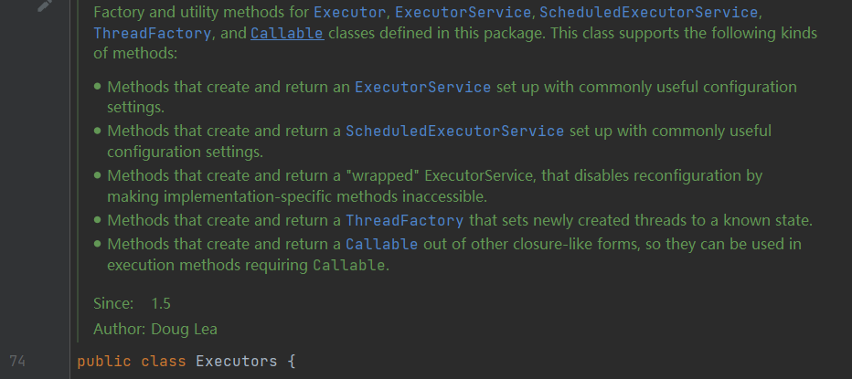

````
Executors是如下类Executor, ExecutorService, ScheduledExecutorService, ThreadFactory的 工厂类，以及包含了一些工具方法。
````


### 4.1.0 Executor 接口

在 `jdk`中交给线程执行的代码片段被抽象为 `Task` （任务）。

相应的，用于执行 `task`的被称为 `Executor` (执行器) 。 执行器有很多种实现，例如 `ThreadPoolExecutor` `ForkJoinPool`  。


`Executor` 是一个简单的接口。只有1个返回值为`void`的方法 `execute(Runnable)` 。

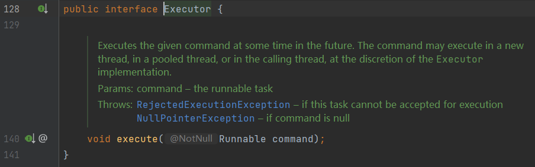


`Executor`比较简单，行为也少。 用于执行一个服务(复杂的task)的接口为  [ExecutorService](# 4.1.1 ExecutorService 接口)


### 4.1.1 ExecutorService 接口

`ExecutorService` 增加了对【执行器】行为的各种控制，应用也更佳广泛。


`ExecutorService`  执行器服务。继承了 `Executor`

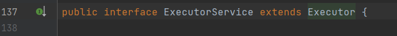


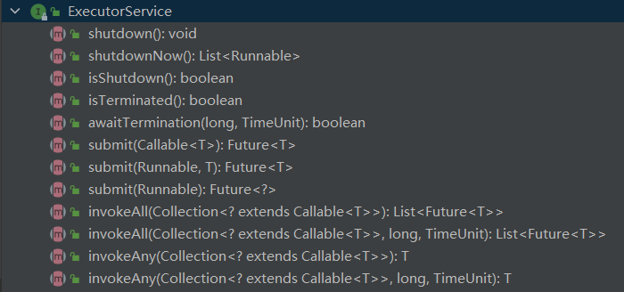

```
通过ExecutorService的方法(结束task、立即结束task、提交task、是否终止、invoke)可以看到。
// 一个被执行的任务，可能是Runnable/Callable 笼统的称为task


Executor只是一个纯粹的执行器。
而ExecutorService增加了对执行器行为的各种控制，应用也更佳广泛。
```


#### 4.1.1.1 接口方法 


##### `submit(Runnable)`

用于执行一个`Runnable` 。


```
```


##### `submit(Callable)`

用于执行一个`Callable<T>` ，并返回 `Future<T>`


提交一个【带有返回值的】 `task` ，并且返回一个 `Future`代表将来的返回值（任务执行完毕后返回的返回值）。


##### `shutdown()`


开始有序的关闭线程池，之前提交的`task`仍然会执行，但拒绝接收后续的新`task`。 如果线程池已经`shutdown`再次调用方法无效。


这个方法不是阻塞方法，会直接返回，不会等到之前提交的任务执行完毕后才返回。

使用`awaitTermination()` 代替等待。


##### `shutdownNow()`


##### `isShutdown()`


### 4.1.2 线程池的优点

1.节约开销

```
“在线程池中执行任务”比“为每一个任务分配一个线程”优势更多。 线程的频繁创建和销毁将带来很大的开销。

线程池通过重用线程，而不是创建新线程。可以避免反复创建/销毁带来的巨大开销。
```


2.提高响应速度

```
当任务被提交到线程池时，通常是空闲线程直接执行，而不是创建线程。这样提高了任务的响应速度。
```


### 4.1.3 Executors类 


`Executors` 是工厂类，用于创建各种不同功能策略【[线程池】。（例如固定数量工作线程的线程池,定时的线程池）

线程池的功能策略其实是由  工作队列（work  queue）决定的。

```
任务(task)保存在工作队列中，所有的工作线程（work Thread）从工作队列中获取一个任务，执行，如此循环
```


总的来讲，工厂方法屏蔽了 ExecutorService创建实例对象等内部细节。使用起来是很方便的，如果需要细致研究则需要进一步翻看源码。先从工厂类 Executors入手，由浅入深


Executors能创建如下几种线程池：

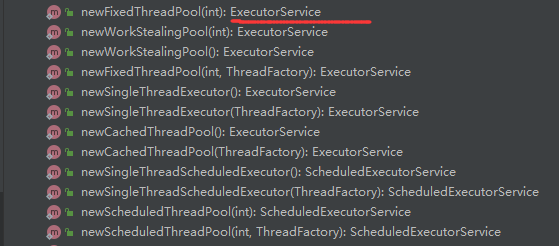


#### 4.1.3.1 `newFixedThreadPool()`

```java
newFixedThreadPool(int):ExecutorService //将一个固定数量的线程池。执行task(Runnable)时，如果有空闲线程，就立即执行。否则会加入等待队列，直到有空闲线程自动执行。
//线程将一直存在，显式调用了 shutdown()才会关闭。
```


```java
newSingalThreadExecutor();//返回只有一个线程的线程池。超过1个任务，将加入到等待队列当中。线程空间后，按照FIFO顺序执行等待队列
```


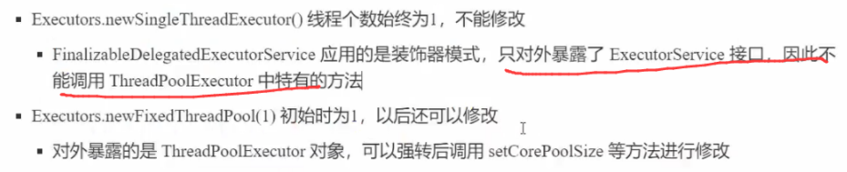


```java
newCachedThreadPool();//返回一个根据实际情况调整线程数量的线程池。如果有空闲线程，那么直接复用。如果没有，则新开启一个线程。
```

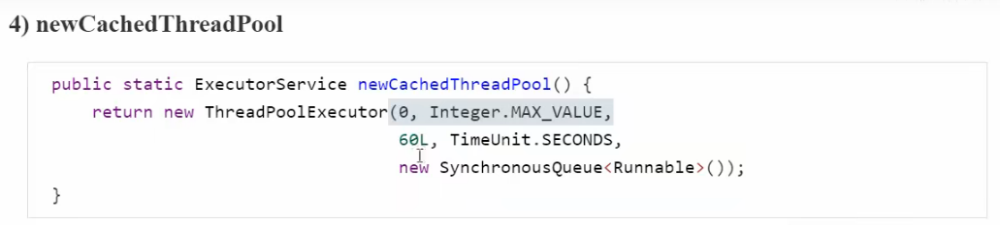

```
核心线程数是0。所有线程超过了存活时间的线程都可能被回收。

最大线程是 Integer.MAX_VALUE。 意味着可以创建非常多的线程，线程是宝贵资源不应该无节制的创建。
```


```java
newSingalThreadScheduledExecutor();//带定时的，或者按周期循环的只有一个线程的线程池
```

```java
newScheduledThreadPool(int);//带定时任务、或者周期循环的固定数量线程池

 //Threads that have not been used for sixty seconds are terminated and removed from the cache. 
```


#### 4.1.3.2 Executors 简单使用

```java
public class Main_ThreadPool {
    public static void main(String[] args) throws InterruptedException {

        ThreadPoolExecutor exec = (ThreadPoolExecutor) Executors.newFixedThreadPool(10);;
        System.out.println(exec.getCorePoolSize());
        for (int i = 0; i < 10; i++) {
            exec.submit(new runnable1());
        }
        while (true){
            int activeCount = exec.getActiveCount();
            if (activeCount==0){
                exec.shutdown();
                System.exit(-1);
            }
            Thread.sleep(1000);
        }


    }


    static class runnable1 implements Runnable{

        @Override
        public void run() {
            try {
                Thread.sleep(1000);
                System.out.println(Thread.currentThread().getName() + " working");
            } catch (InterruptedException e) {
                e.printStackTrace();
            }
        }
    }
}
```

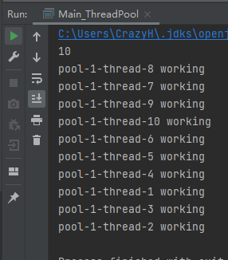


### 4.1.5  ThreadPoolExecutor

线程池真正的实现类 `ThreadPoolExecutor`。


#### 4.1.5.1 构造方法

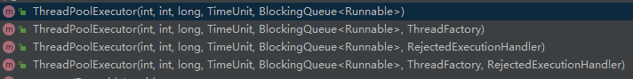


.

 `Executors` 工厂方法创建不同特点的线程池是 通过 `ThreadPoolExecutor` 构造方法中 传入不同的参数实现的。


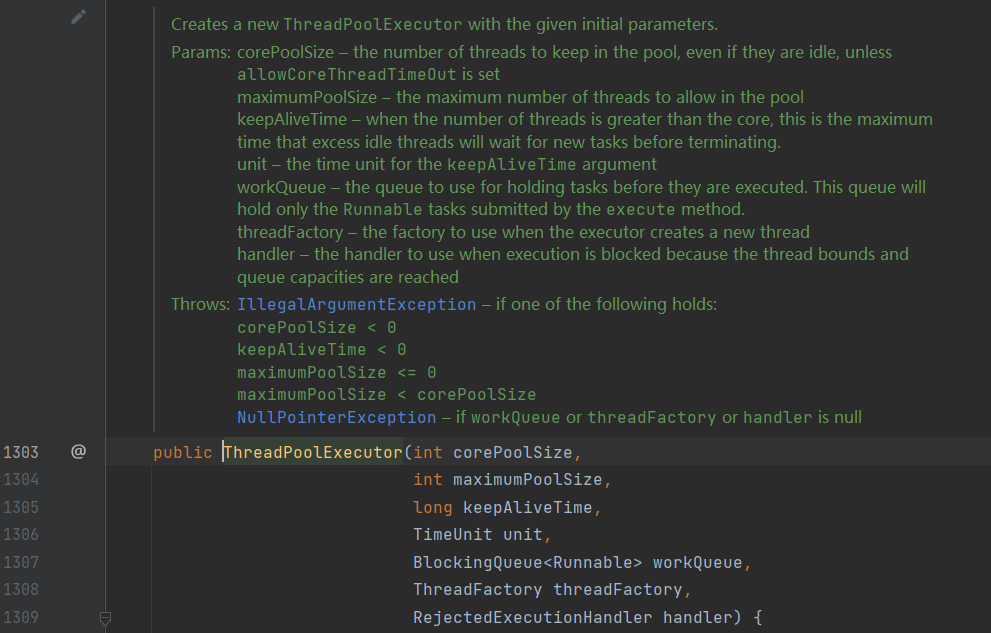

```
“核心线程数”(corePoolSize)线程池中线程的数量，即使是空闲也不会销毁。除非设置了allowCoreThreadTimeout
“最大线程数”(maximumPoolSize) //扩容线程、救急线程
"生存时间"(keepAliveTime) 当线程池中线程的数量>corePoolSize ，超过生存时间的空闲线程会被销毁
“时间尺度” unit
“工作队列”(BlockingQueue)
"线程工厂"(ThreadFactory) ThreadFactory 用于线程池创建一个新的线程
“拒绝策略” (handler) 当因为线程绑定，或因为达到了队列容量上限，而拒绝执行时的策略
```


```
当task超过了队列长度,尝试使用扩容线程(救急线程)。
只有有界队列，才可能使用扩容线程。
```


在 `Executors`.`newFixedThreadPool()`的源码中：

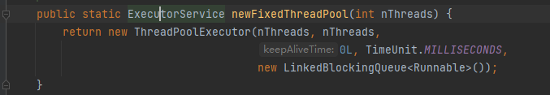

```
事实上new了一个 ThreadPoolExecutor 实现类的实例对象。向上转型为  ExecutorService 接口
```

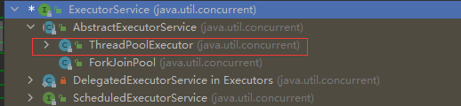


#### 4.1.5.2 setter 方法

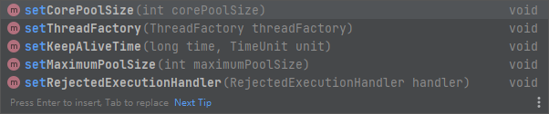


##### 4.1.5.2.1 `setCorePoolSize()`


设置核心线程的数目。如果新设置的数目比之前的小，那么超出的核心线程在空闲时将会被关闭。

如果超过原来的数目，那么当执行队列任务的时候将开启新的核心线程。


##### 4.1.5.2.2 `setThreadFactory()`

设置线程工厂，当创新新的线程时，会使用 `ThreadFactory`创建。


#### 4.1.5.2.3 `allowCoreThreadTimeOut(boolean)`


设置是否允许核心线程过期，空闲超过 `keep-alive-time`的核心线程将被停止。

如果是`fasle` 那么核心线程永远也不会被关闭。


#### 4.1.5.3 getter方法

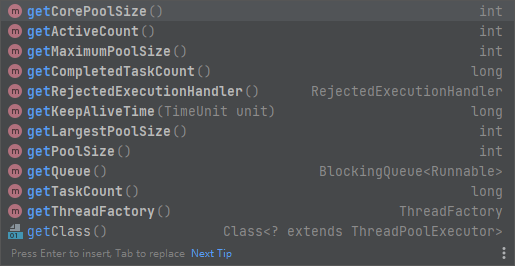


##### 4.1.5.3.1 `getActiveCount()`

返回当前正在执行`task`的线程数量，是一个预估值。


#### 4.1.5.4 其他实例方法


##### 4.1.5.4.1 `shutdown()`


线程池的状态改为 `SHUTDOWN` ,  不会接收新的任务。已提交的任务会执行完毕。 这个方法不是阻塞方法，会立即返回。


##### 4.1.5.4.2  `shutdownNow()`


会尝试停止所有正在活跃的`task` , 停止正在排队等待的`task`， 并且返回等待队列中的`task`。

这个方法不是阻塞方法，会立即返回。

通过`Thread.interrupt`的方式中断正在运行的`task`， 只是尽最大努力终止正在运行的`task`，不保证一定能终止。


##### 4.1.5.4.3  `preStartCoreThread()`

预先开启一个核心线程，让其空闲并等待一个`task`


这个方法将会覆盖原本的创建核心线程的策略。如果核心线程已经被初始化，那么这个方法返回 `false`


##### 4.1.5.4.4 `prestartAllCoreThreads()`

预先开启所有核心线程,并返回成功开启的个数。


##### 4.1.5.4.5 `purge()`


尝试移除工作队列中的全部被取消的`Future`类任务。

被取消的任务将永远也不会被执行，但是可能会占用 任务队列中的位置，直到工作线程动态移除他们，或者调用`purge()`方法。


#### 4.1.5.2 成员变量

ThreadPoolExecutor的构造参数

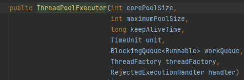


- corePoolSize: 

  ```
  线程池线程初始数量、最小数量。
  ```

- maximumPoolSize:

  ```
  线程池中最大的线程数量。
  ```

- keepAliveTime

  ```
  等待工作的空闲线程的超时时间。
  当存在多于corePoolSize数量的线程数时，同时允许线程超时，（allowCoreThreadTimeOut(boolean)方法）
  多余的空闲线程会在keepAliveTime后销毁
  ```

- unit   时间单位

  

- workQueue   

  ```
  BlockingQueue<Runnable> workQueue
  
  任务队列。被提交但尚未执行的任务。
  ```

- threadFactory 

  ```
  线程工厂。用于创建线程，一般用默认即可
  ```

- handler ： 拒绝策略

  

  ```
  RejectedExecutionHandler handler
  
  当任务太多来不及处理时，如何拒绝任务。
  ```


#### 4.1.5.3 CachedThreadPool


Executors 中生产一个Cached线程池的工厂方法如下：

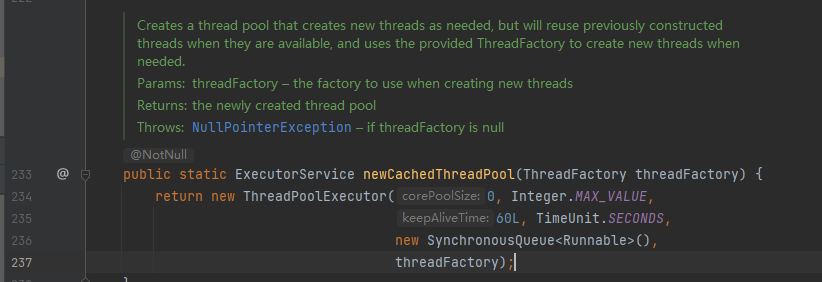


经过如下代码黑盒测试：

```java
public class Main_ThreadPoolExecutor {

    public static void main(String[] args) throws InterruptedException {

        ThreadPoolExecutor threadPoolExecutor = new ThreadPoolExecutor(5, Integer.MAX_VALUE,
                1L, TimeUnit.SECONDS,
                new LinkedBlockingQueue<>());//SynchronousQueue<>()
        threadPoolExecutor.allowCoreThreadTimeOut(true);
        for (int i = 0; i < 100; i++) {
            threadPoolExecutor.submit(new Main_ThreadPool.runnable1());
        }

        Scanner scanner = new Scanner(System.in);
        while (scanner.hasNext()){
            String next = scanner.next(); //在任意时刻键入任意值，查看此时线程池状态
            System.out.println("CompletedTaskCount : "+threadPoolExecutor.getCompletedTaskCount());
            System.out.println("CorePoolSize"+threadPoolExecutor.getCorePoolSize());
            System.out.println("PoolSize "+threadPoolExecutor.getPoolSize());
            BlockingQueue<Runnable> queue = threadPoolExecutor.getQueue();
            System.out.println("queue size : "+queue.size());
        }
    }
}
```


```
线程池扩容，除了与最大值有关，也和 Queue
如果是new LinkedBlockingQueue<>()，则存在1个及以上的线程，无论是否是空闲。则都不会尝试扩容。（只有初始为0，才尝试扩容1个线程，然后后续task全部都添加进等待队列）

如果是SynchronousQueue，则会按照 Executors.newCachedThreadPool的说明那样运行。
```


#### 4.1.5.4 execute（Runnable）

在jdk中，称没有返回值的Runnable为command命令。

在ThreadPoolExecutor中有一个重要的成员变量 AtomicInteger ctl  


```

ctl 是主要的线程池控制状态。它由包装了2部分含义：线程池工作者数量(workerCount)、运行状态(runState)。为了将这两部分融合到一起，规定线程池线程的数量小于等于2^29-1 。再未来如果AtomicInteger不够，可能会扩充为AtomicLong。

这样做的目的是,使用int会更简单也更高效。


The workerCount is the number of workers that have been permitted to start and not permitted to stop.
工作者数量(workerCount是指那些已经提交并开始，但未执行完毕的线程)


runState的定义如下:

RUNNING: Accept new tasks and process queued tasks 
SHUTDOWN: Don't accept new tasks, but process queued tasks 
STOP: Don't accept new tasks, don't process queued tasks, and interrupt in-progress tasks 

TIDYING: All tasks have terminated, workerCount is zero, the thread transitioning to state TIDYING will run the terminated() hook method 
```


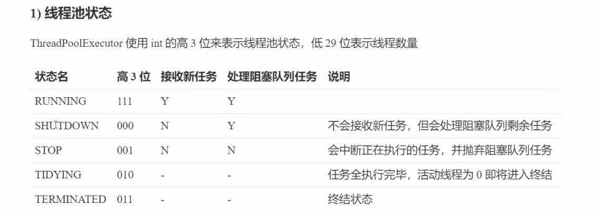


```
执行期望顺序如下 :  扩增核心线程并执行任务，如果失败  ->退而求其次 加入到等待队列 ,如果队列满了还失败 -> 拒绝策略
```


添加工作线程方法 addWorker(Runnable,boolean)

```
是一个阻塞方法,一定会返回ture或者false  
方法参数boolean 表示这个线程是否是核心线程。 true表示核心线程，false表示非核心线程。
用于判断创建线程数量是 corePoolSize 还是MaximumPoolSize
```


拒绝方法：  ThreadPoolExecutor.reject(Runnable)


```
执行拒绝策略Handler的rejectedExecution方法。也就是拒绝策略接口要求实现的方法。
```


### 4.1.6 Task的执行结果 : `Future`

委托给线程执行的任务(task)，最终应该有一个【执行结果】。

这个【执行结果】是广义上的结果，并不单指`task`运行后的结果，还可以描述任务的状态。

例如 ： 此次任务的返回对象，任务当前是否被调用，甚至是异常信息。


```
Future框架的思想是:   当用户开启了一个异步执行任务以后，立即返回一个装有异步执行结果的容器Future。
当达到一个合适的时机用户想要去处理异步执行任务的结果时，再去处理这个Future (广义上的处理:拿到结果或处理异常)
```


#### 4.1.6.0 理解1

```
Future 直译“未来”，它是一个立即返回给主调函数的容器。这个数据类型将多线程和异步紧密结合在一起。

Future 可以表示在未来的某个时间点。在这个时间点上，这个任务可以完成或终止。它可以描述一个任务的生命周期
```


#### 4.1.6.1 Future接口方法

下面是`Future` 接口的方法。 

##### 4.1.6.1.0 `get()`

核心方法。


`get`方法是一个阻塞方法。


##### 4.1.6.1.1 `cancel()`


尝试去取消当前任务。如果这个任务  已经完成/ 已经取消  的话，这个方法会返回 `false`。

如果方法返回`true` ，同时这个Task在调用`cancel`之前没有执行，那么这个任务永远也不会运行。


##### 4.1.6.1.2 `isCancelled`


##### 4.1.6.1.3  `isDone()`

##### 


#### 4.1.6.2 `Runnable`/`Callable`

在Future接口中。看到了一个关键的get()方法  


它专门用于返回一个计算任务处理后的结果。


那么对于Task来说：

```
Runnable 可以作为 Task的核心。但它具有很大局限：它没有返回值，并不能抛出异常。

Callable 同样也可以作为Task的核心。它可以返回一个值，也可以抛出一个异常。它还是一个函数式接口。真的很妙
```


#### 4.1.6.3  限时获取get

Future.get(long,TimeUnit)

有时候，某个任务无法在指定时间内完成，那么将不再需要它的结果，此时可以放弃这个任务。


```
例如，某个Web应用程序需要从外部网站获取广告信息，如果该应用在2秒钟内获取不到广告信息，则显示一个默认的广告。这样即使不能得到广告信息也不会长时间降低应用的响应速度。
```


```
类似的，Web应用程序可以从多个源地址获取数据。超出了限定时间，那么只显示在限时内获取的信息。
```


此时，可以使用Future.get(long,TimeUnit) 来完成一个限时获取。当超过时间仍没有返回结果，会抛出一个TimeOutExeception。在任务超时后，应该立即停止，避免继续计算一个不再使用的结果而浪费资源。


##### 4.1.6.3.1 示例代码1

给出一个简单的例子： 限时获取，如果获取失败中断任务

```java
public class Main10_Future {
    public static void main(String[] args) {
        MyData data = getData();
    }

    static MyData getData(){
        int parallelSize = Runtime.getRuntime().availableProcessors();
        ExecutorService executorService = Executors.newFixedThreadPool(parallelSize);

        Future<MyData> task = executorService.submit(new getDataFromDataSource("https://www.baidu.com/data"));


        try {
            MyData myData = task.get(1L, TimeUnit.SECONDS);
            if (myData!=null)
                return myData;

        } catch (InterruptedException e) {
            e.printStackTrace();
        } catch (ExecutionException e) {
            e.printStackTrace();
        } catch (TimeoutException e) {
            System.out.println("超时了... 尝试中断任务");
            task.cancel(true);
//            e.printStackTrace();
        }
        return null;
    }
    
    static class getDataFromDataSource implements Callable<MyData>{

        private final String dataSource;

        public getDataFromDataSource(String dataSource) {
            this.dataSource = dataSource;
        }

        @Override
        public MyData call() throws Exception {
            System.out.println("get Data from "+dataSource);
            Thread.sleep((long) (Math.random()*2500));

            ByteBuffer allocate = ByteBuffer.allocate(24);
            IntStream.range(0,24).forEach(x->allocate.put((byte) (Math.random()*100)));
            return new MyData(allocate);
        }


    }
    
    static class MyData {

        private final ByteBuffer byteBuffer;

        public MyData(ByteBuffer byteBuffer) {
            this.byteBuffer = byteBuffer;
        }

        public ByteBuffer getByteBuffer() {
            return byteBuffer;
        }
    }

}
```


##### 4.1.6.3.2 示例代码2

“预定任务”方法可以很简单的扩展到多线程上。 考虑这样一个旅行预定门户网站，用户输入旅行目的和日期以后。门户网站获取并限时来自多条航线、旅店或者汽车租赁公司的报价。在这个过程中，可能会调用Web服务，访问数据库，执行一个EDI事务等。在这种情况下，不适宜让页面的响应等待过久，对于在指定时间没有返回结果的服务提供者，要么不予显示，要么返回一个提示信息“Did not hear from ... in time ”

此时可以使用一连串的submit ，也可以使用invokeAll。

```
invokeAll(Collection,long,TimeUnit) 表示带限时的执行Collection内的全部Future
超时的Future将被直接取消(cancel)
```


```java
public class Main10_Future1 {
    public static void main(String[] args) {
        HashMap<String, MyData> dataTimeOut = getDataTimeOut();

        dataTimeOut.forEach((x,y)->{
            System.out.println(x);
            ByteBufferUtil.showBufferHEX(y.getByteBuffer());
        });


    }

    static HashMap<String,MyData> getDataTimeOut(){
        HashMap<String,MyData> res = new HashMap<>();

        Date date = new Date();
        String dest = "大庆机场";

        List<String> urls = new LinkedList<>();
        Collections.addAll(urls,"https://www.baidu.com","https://www.sina.com","https://www.163.com/");


        ExecutorService executorService = Executors.newFixedThreadPool(3);
        List<Callable<MyData>> callables = new LinkedList<>();

        IntStream.range(0,3).mapToObj(x->
                new Main10_Future1.getDataFromDataSource1(urls.get(x),dest,date))
                .forEach(callables::add);
        try {
            List<Future<MyData>> futureList = executorService.invokeAll(callables, 1500, TimeUnit.MILLISECONDS);
            for (int i = 0; i < futureList.size(); i++) {
                Future<MyData> future = futureList.get(i);
                if (future.isDone()){
                    res.put(urls.get(i),future.get());
                }else {
                    res.put(urls.get(i),null);
                }
            }
        } catch (InterruptedException e) {
            e.printStackTrace();
        } catch (ExecutionException e) {
            e.printStackTrace();
        }catch (CancellationException e){
            System.out.println("超时...\n成功获取"+res.size()+"个");
//            e.printStackTrace();
        }
        return res;
    }


    static class getDataFromDataSource1 implements Callable<MyData>{

        private String dataSourceUrl;
        private String dest;
        private Date date;

        public getDataFromDataSource1(String dataSourceUrl, String dest, Date date) {
            this.dataSourceUrl = dataSourceUrl;
            this.dest = dest;
            this.date = date;
        }

        @Override
        public MyData call() throws Exception {
            System.out.println("get data from : "+dataSourceUrl);
            return getDate(dataSourceUrl,dest,date);
        }
        private MyData getDate(String dataSourceUrl,String dest,Date date) throws InterruptedException {
            //模拟获取数据需要的延迟
            Thread.sleep((long) (Math.random()*2000));
            ByteBuffer byteBuffer = ByteBuffer.allocate(24);
            IntStream.range(0,byteBuffer.capacity()).forEach(x->byteBuffer.put((byte) (Math.random()*4096)));
            return  new MyData(byteBuffer);
        }
    }
}
```


#### 4.1.6.4  `FutureTask`

```
RunnableFuture继承了Runnable 和 Future  表示: 一个可运行的Future。
就相当于结合了Runnabe(可运行的任务),又能拿到执行结果(Future)
```


`FutureTask` 是  RunnableFuture接口的实现类。


FutureTask 是Future框架的核心类。当submit任何一个Callable和Runnable都会被封装为一个FutureTask。

因为FutureTask 改写了run的逻辑。


##### 4.1.6.4.1  FutureTask 成员变量

FutureTask重要的成员变量如下：


```
Callable<V> callable; //任务本体
Object outcome;  // 返回任务的产物。  广义上的产物，包括正常执行后的结果或者任务执行失败的异常。
```


##### 4.1.6.4.2  FutureTask.run

FutureTask 重写了Runnable.run的逻辑


### 4.1.4 计划任务 `ScheduledThreadPool`

使用`Executors`工具类创建一个 `ScheduledThreadPool`，


通过`Executors.newSingleThreadScheduledExecutor()`方法:


#### 4.1.4.1 `ScheduledExecutorService`接口

对于普通的【线程池】来说`ExecutorService`接口是一个任务的抽象。


对于【计划任务线程池】来说  `ScheduledEecutorService` 接口抽象代表了一个  【计划任务】

对于【计划任务线程池】来说  [ScheduledFuture](# 4.1.4.2 计划任务结果`ScheduledFuture`) 接口抽象代表了【计划任务】的执行结果。


##### 4.1.4.1.1  `ScheduleExecutorService`接口方法


`ScheduleExecutorService` 接口的方法如下：


执行的task除了 `Runnable` 还可以是 `Callable` 。


###### `schedule()`

在给定的【延迟】以后，执行一个 【一次性】的task。


在给定的【延迟】以后，执行一个 【一次性】的 ，带有【返回值】的 task。


###### `ScheduleAtFixedRate()`

 以固定的频率执行计划


```
在给定的初始延迟以后，开始执行计划任务,并以固定周期开始执行任务。
（无论上一次任务是否执行完毕，总是在固定的时刻尝试执行新的task）
第一次执行时刻为：  initalDealy
第二次执行时刻为 ： initalDealy+period
第三次执行时刻为 ： initalDealy+period*2


如果到达下一个执行时刻，上次任务还未执行完毕，就等待。执行完毕后，立即开启下次task。
```


```
在initalDelay初始延迟以后，执行task。直到task执行完毕以后。等待固定的delay开始下一次任务。
```


#### 4.1.4.2 计划任务结果`ScheduledFuture`

`Future` 是一个普通的线程池任务的结果。

`ScheduledFuture` 是 定时任务线程池的结果。


`ScheduledFuture`接口并没有定义任何的方法 , 仅仅是 [Delayed](# 4.1.4.4 `Delayed`接口) 和 `Future`接口的组合。


```
Delayed 表示剩余的delay时间。

因此ScheduledFuture对象具有存放执行结果的能力(Future)，还有显示剩余delay的能力。
```


接口原型如下：


##### 4.1.4.2.1 继承树


```
实现类：ScheduledFutureTask
```


#### 4.1.4.3 ScheduledExecutorService 简单的使用示例

##### 4.1.4.3.1 示例_1

测试scheduleAtFixedRate(Runnable,long,long ,TimeUnit)

```java
/**
 *
 * 测试 ScheduleThreadPool
 *
 * ScheduleExecutorService.scheduleAtFixedRate()  以固定频率开启task
 *
 *
 */
public class Main3_ScheduleExecutorService implements Runnable{
    public static void main(String[] args) {

        ScheduledExecutorService scheduledExecutorService = Executors.newSingleThreadScheduledExecutor();

        System.out.println("当前时间 : "+getTime() + " 延迟1秒后启动计划线程,周期为2秒");
        ScheduledFuture<?> scheduledFuture = scheduledExecutorService.scheduleAtFixedRate(
                new Main3_ScheduleExecutorService(), 1L, 2L, TimeUnit.SECONDS);

        Scanner s = new Scanner(System.in);
        while (s.hasNext()){
            s.next();
            boolean done = scheduledFuture.isDone();
            System.out.println("done : " + done);
            long delay = scheduledFuture.getDelay(TimeUnit.SECONDS);
            System.out.println("delay : "+delay);
        }


    }

    @Override
    public void run() {
        try {
            System.out.println("线程sleep5秒 "+getTime());
            Thread.sleep(5000);
        } catch (InterruptedException e) {
            e.printStackTrace();
        }
    }
}
```

让上一次task执行总时长>周期：


得到的效果就是：上一次任务执行完毕后，立刻执行下一次任务。


修改代码，让线程sleep1秒， 执行task总时长< 周期 ，则为正常周期：


##### 4.1.4.3.2 示例_2

测试scheduleWithFixedDelay()

```java
/**
 *
 * ScheduledExecutorService.scheduleWithFixedDelay()
 * 在上一次task结尾开始计时，以固定delay开始执行下一次task
 *
 */
public class Main4_ScheduleWithFixedDelay implements  Runnable{

    public static void main(String[] args) {

        ScheduledExecutorService execService = Executors.newSingleThreadScheduledExecutor();

        ScheduledFuture<?> sf = execService.scheduleWithFixedDelay(new Main4_ScheduleWithFixedDelay(),
                0L, 2L, TimeUnit.SECONDS);

        Scanner s = new Scanner(System.in);
        while (s.hasNext()){
            s.next();

            long delay = sf.getDelay(TimeUnit.SECONDS);
            System.out.println("remaining delay : "+delay);
            boolean cancelled = sf.isCancelled();
            System.out.println("cancelled : " + cancelled);
            boolean done = sf.isDone();
            System.out.println("done : " + done);

        }


    }

    @Override
    public void run() {

        try {
            System.out.println(Thread.currentThread().getName()+" "+getTime()+" 线程sleep3秒，并以固定的2秒delay");
            Thread.sleep(3000);
        } catch (InterruptedException e) {
            e.printStackTrace();
        }

    }
}
```


task耗时3秒，固定delay耗时2秒。所以两次输出语句相差5s 符合预期。


#### 4.1.4.4 `Delayed`接口


一个`mix-in`风格的接口，用于说明`Delayed`对象等待的延迟时间的数量。


##### 4.1.4.4.1 接口方法

传入一个时间单位`TimeUnit`  , 返回对应单位下剩余`delay`的时间。


### 4.1.5 BlockingQueue

JDK中的描述：


```
BlockingQueue methods come in four forms, with different ways of handling operations that cannot be satisfied immediately, but may be satisfied at some point in the future:
```

```
BlockingQueue提供了不同的处理操作来应对如下情况：
不能立即确认，但可能在未来的某个时间点确认对应的操作。
```


```
阻塞队列不支持null 元素值。null值将会严格抛出NullPointerException
```


```
阻塞队列是线程安全的。使用了内部锁或者其他的同步控制手段。
```


阻塞队列的4类方法总结


|      | 抛出异常 | 特殊值 | 阻塞   | 超时   |
| ---- | -------- | ------ | ------ | ------ |
| 插入 |          |        |        |        |
| 移除 |          |        |        |        |
| 审查 |          |        | 不支持 | 不支持 |


在4.1.3中，提到过 ThreadPoolExecutor的构造方法，其中一个重要的参数

“BlockingQueue ”可以深度影响线程池的表现。


#### 4.1.5.1 SynchronousQueue


**直接提交队列。**

SynchronousQueue没有容量。也就是没有等待队列，新来的task如果没有空闲线程，会直接创建新的线程执行task。通常需要设计很大的maximunPoolSize。否则很容易执行拒绝策略。


#### 4.1.5.2 ArrayBlockingQueue

**有界的任务队列。** 

ArrayBlockingQueue提供了一个定长的任务队列。在创建ArrayBlockingQueue实例时，必须指定这个长度。

如果线程池数量小于corePoolSize会创建新的线程。如果等待队列已满，且当前线程数小于 maximunPoolSize则会创建新的线程执行task，否则执行拒绝策略。

```
也就是说，除非系统特别繁忙，task特别多，使队列满了以后才尝试增加线程数量。

不过可以人为的设置 ArrayBlockingQueue的大小，适当减少等待队列长度。
```


#### 4.1.5.3   LinkedBlockingQueue

**无界任务队列。**

任务队列无限长，除非coolPoolSize设置为0，否则永远不会扩容新的线程。

初始线程数量即为 coolPoolSize，不会继续扩容。新加入的task会加入队列。因为队列无限长，会直至耗光系统内存。


#### 4.1.5.4 PriortyBlockingQueue

**优先任务队列**

可以控制任务的执行先后顺序。是特殊的无界队列。

带优先级的无界队列。先执行优先级高的任务，其他特性和无界队列一致。


### 4.1.6 线程池拒绝策略

4.1.5中提到过拒绝策略。也是下图中构造方法参数之一。

`RejectedExecutionHandler`  策略接口，通过实现这个接口，可以自定义策略。


当`线程池`的队列已满，又不允许扩容线程的情况下，执行拒绝策略。


#### 4.1.6.1 JDK内置4种拒绝策略

- AbortPolicy : 直接抛出异常，阻止系统正常工作

- CallerRunsPolicy: 只要线程池没有被shutdown，该task直接在调用者线程中执行。这样做不会丢弃task，但有可能会严重影响调用者线程的工作

- DiscardOldestPolicy:该策略将丢弃一个最老的task。也就是即将运行的task

  当阻塞队列是SynchronousQueue时，会出错。

- DiscardPolicy: 丢弃无法处理的task，不抛出异常

  

如果以上无法满足需求，可以自己实现RejectedExecutionHandler接口


#### 4.1.6.2 `RejectedExecutionHandler` 接口

rejectedExecutionHandler接口源码：


#### 4.1.6.3   其他框架的拒绝策略


#### 4.1.6.3  自定义拒绝策略


jdk1.8 可运行。

```java
public class Main5_RejectedExecutionHandler {


    public static void main(String[] args) {

        ThreadPoolExecutor exec = new ThreadPoolExecutor(5,5,60,
                TimeUnit.SECONDS,new ArrayBlockingQueue<Runnable>(2),new myRejectedHandler());


        for (int i = 0; i < 20; i++) {
            exec.submit(new myRunnable("t"+i));
        }
        

    }


    static class myRejectedHandler implements RejectedExecutionHandler{

        @Override
        public void rejectedExecution(Runnable r, ThreadPoolExecutor executor) {

            try {
                Class<?> future = Class.forName("java.util.concurrent.FutureTask");
                Field callable = future.getDeclaredField("callable");
                Class<?> executors = Class.forName("java.util.concurrent.Executors");
                Class<?>[] declaredClasses = executors.getDeclaredClasses();

                callable.setAccessible(true);
                Callable callable1 = (Callable) callable.get(r);


                for (int i = 0; i < declaredClasses.length; i++) {
                    if (declaredClasses[i].getName().contains("RunnableAdapter")){

                        Class<?> runnableAdapter = declaredClasses[i];
                        Field task = runnableAdapter.getDeclaredField("task");
                        Class<? extends Field> runnableField = task.getClass();
                        Class<?> type = task.getType();

                        task.setAccessible(true);
                        Object o = task.get(callable1);

                        if (o.getClass()==myRunnable.class){
                            String name = ((myRunnable) o).getName();
                            System.out.println(name+" 被拒绝了");
                        }


                    }
                }


            } catch (ClassNotFoundException e) {
                e.printStackTrace();
            } catch (NoSuchFieldException e) {
                e.printStackTrace();
            } catch (IllegalAccessException e) {
                e.printStackTrace();
            }


        }
    }

    static class myRunnable implements Runnable{

        private String name;

        public myRunnable(String name) {
            this.name = name;
        }

        public String getName() {
            return name;
        }

        @Override
        public void run() {

            System.out.println(Thread.currentThread().getName() + "尝试睡眠2s");
            try {
                Thread.sleep(2000);
            } catch (InterruptedException e) {
                e.printStackTrace();
            }
        }
    }
}
```

### 4.1.7 ThreadFactory

线程池的线程从哪里来？ 线程工厂！

ThreadFactory是一个函数式接口，用于创建新的线程。当线程池需要新建线程的时候，就调用 newThread(Runnable r)方法；


#### 4.1.7.1 一个简单的使用实例

```java
public class Main6_ThreadFactory {


    public static void main(String[] args) {

        ThreadPoolExecutor executor = new ThreadPoolExecutor(5, 10, 60L, TimeUnit.SECONDS,
                new SynchronousQueue<Runnable>(),new myThreadFactory());


        for (int i = 0; i < 10; i++) {
            executor.submit(new myRunnable2());
        }


        while (true){
            if (executor.getActiveCount()==0) {
                System.exit(0);
            }
            try {
                Thread.sleep(1000);
            } catch (InterruptedException e) {
                e.printStackTrace();
            }
        }


    }

    static class myThreadFactory implements ThreadFactory{

        private AtomicInteger number = new AtomicInteger(0);

        @Override
        public Thread newThread(Runnable r) {
            Thread thread = new Thread(r,"线程"+number.getAndIncrement());
            System.out.println("线程 "+number.get()+" 被创建了");
            return thread;
        }
    }

    static class myRunnable2 implements  Runnable{

        @Override
        public void run() {
            System.out.println(Thread.currentThread().getName() + "正在运行！");
        }
    }
}
```


### 4.1.8 扩展线程池

jdk已经帮我们实现了高性能的线程池，如果需要对线程池进行扩展，该如何呢？


好消息是jdk提供了 ThreadPoolExecutor.beforeExecute() ,ThreadPoolExecutor.afterExecute(),ThreadPoolExecutor.terminated()方法。

执行Runnable task的逻辑源码如下：


#### 4.1.8.1 简单扩展

```java
public class Main7_beforeExecute {

    public static void main(String[] args) {

        myThreadPoolExecute myThreadPoolExecute = new myThreadPoolExecute(5, 10, 60, TimeUnit.SECONDS, new SynchronousQueue<>());

        for (int i = 0; i < 10; i++) {
            myThreadPoolExecute.submit(() -> {
                System.out.println(Thread.currentThread().getName() + "任务执行中...");
            });

        }

    }

    static class myThreadPoolExecute extends ThreadPoolExecutor {


        public myThreadPoolExecute(int corePoolSize, int maximumPoolSize, long keepAliveTime, TimeUnit unit, BlockingQueue<Runnable> workQueue) {
            super(corePoolSize, maximumPoolSize, keepAliveTime, unit, workQueue);
        }

        public myThreadPoolExecute(int corePoolSize, int maximumPoolSize, long keepAliveTime, TimeUnit unit, BlockingQueue<Runnable> workQueue, ThreadFactory threadFactory) {
            super(corePoolSize, maximumPoolSize, keepAliveTime, unit, workQueue, threadFactory);
        }

        public myThreadPoolExecute(int corePoolSize, int maximumPoolSize, long keepAliveTime, TimeUnit unit, BlockingQueue<Runnable> workQueue, RejectedExecutionHandler handler) {
            super(corePoolSize, maximumPoolSize, keepAliveTime, unit, workQueue, handler);
        }

        public myThreadPoolExecute(int corePoolSize, int maximumPoolSize, long keepAliveTime, TimeUnit unit, BlockingQueue<Runnable> workQueue, ThreadFactory threadFactory, RejectedExecutionHandler handler) {
            super(corePoolSize, maximumPoolSize, keepAliveTime, unit, workQueue, threadFactory, handler);
        }


        @Override
        protected void beforeExecute(Thread t, Runnable r) {
            super.beforeExecute(t, r);
            System.out.println(Thread.currentThread().getName() + "任务开始...");
        }

        @Override
        protected void afterExecute(Runnable r, Throwable t) {
            super.afterExecute(r, t);
            System.out.println(Thread.currentThread().getName() + "任务结束...");
        }
    }
}
```


## 4.2 Fork/Join 框架

`ForkJoin` 是【分治思想】在jdk中的一种实际实现。 

分而治之思想是指将一个大的任务，分成多份独立的小任务，逐个解决。


`ForkJoinPool` 提供了一个线程池，将一个大任务，分解成多个【可并行执行】的子任务。


`ThreadPoolExecutor` 所有线程公用一个工作队列，所有线程都从公用的工作队列中取任务。

`ForkJOinPool` 每个线程都有独立的工作队列。当某一个工作队列为空时，可以窃取其他线程的任务。


### 4.2.1 `ForJoinPool` 类


`ForkJoinPool`  是一个实现了 ExecutorService接口，并用于执行 `ForkJoinTask`的类。


ForkJoinPool.commonPool()   public static方法，返回一个ForkJoinPool


```
返回一个常见的池实例。这个池是静态生成的。它运行状态不受“shutdown/shutdownNow”的影响。但是这个池以及正在运行的任务会在
System.exit时原子的终止。
```


### 4.2.2 work-stealing

工作窃取。


通常会使用双端队列，被窃取任务线程永远从双端队列的头部拿任务执行，而窃取任务的线程永远从双端队列的尾部拿任务执行。

#### 4.2.2.1 work-stealing的优点

ExecutorService 多个线程共用一个工作队列。当这个队列中任务数量越多，消耗任务时锁竞争带来的消耗越明显。

如果有这样的场景：很多很小的任务(多核处理器通常喜欢这类任务，可以充分发挥多核cpu的性能)，将带来大量的队列任务(频繁的消耗task)，这将引起大量的锁竞争开销。此时，ForkJoinPool 内的线程人人都有一个工作队列，直接将这些琐碎的任务分派给各个线程,谁做得快再去其他线程中偷任务。

#### 4.2.2.2  缺点

当队列只剩1个任务时，仍会产生竞争。


### 4.2.3 ForkJoinTask


### 4.2.4 ForkJoinWorkerThread


ForkJoin工作线程。


被ForkJoinPool管理的线程。能够执行ForkJoinTask


### 4.2.4 场景模拟

计算一个这样的场景 1+2+3+...+1000000000的任务。


#### 4.2.4.1  使用ExecutorService解决

准备几个成员变量。

```java
private static int parallelSize = Runtime.getRuntime().availableProcessors() * 2 - 1;
//使用核心数x2-1个线程
private static ExecutorService executorService = Executors.newFixedThreadPool(parallelSize);
private static long start = 1L;
private static long end = 1000000000L;
```


```java
public static void calParallel() {

    long startTime = System.currentTimeMillis();
    long total = end - start;
    long pair = total / parallelSize;
    //每一部分占 pair个

    List<Future<Long>> res = new LinkedList<>();
    for (int i = 0; i < parallelSize; i++) {
        Future<Long> cur;
        if (i == parallelSize - 1) {
            //避免了奇数可能会差1个数
            cur = executorService.submit(new task(start + i * pair, end + 1));
        } else {
            cur = executorService.submit(new task(start + i * pair, start + (i + 1) * pair));
        }
        res.add(cur);
        //将所有的Future都收集起来
    }
    long result = 0;
    for (int i = 0; i < res.size(); i++) {
        Future<Long> cur = res.get(i);
        try {
            result += cur.get();
            //get是一个阻塞方法。会把所有结果加和
        } catch (InterruptedException e) {
            e.printStackTrace();
        } catch (ExecutionException e) {
            e.printStackTrace();
        }
    }
    long endTime = System.currentTimeMillis();
    System.out.println("并行花费" + (endTime - startTime) + "ms\n结果 : " + result);
}
```

此时的main

```java
    public static void main(String[] args) throws ExecutionException, InterruptedException {
        calParallel();
//        calSerial();
//        calParallelForkJoin();
        System.exit(200);
    }
```


#### 4.2.4.2 使用ForkJoinPool解决

实现RecursiveTask抽象方法。

```java
static class calTask extends RecursiveTask<Long> {

        private long left;
        private long right;
   		private long Threshold = 100000;

        public calTask(long left, long right) {
            this.left = left;
            this.right = right;
        }

        @Override
        protected Long compute() {
            long result = 0;
            //当right-left <Threshold 的时候认为任务已经足够小了，不再拆解
            if (right - left < Threshold) {
                for (long i = left; i <= right; i++) {
                    result += i;
                }
            } else {//任务太大，拆解为100份
                ArrayList<calTask> list = new ArrayList<>(100);
                long pair = (right-left)/100;
                long l=left;long r;
                for (int i = 0; i <100; i++) {
                    r = l+pair;
                    if (r>right)r=right;
                    calTask subTask = new calTask(l, r); //循环执行subTask
                    subTask.fork();//核心fork
                    list.add(subTask);
                    l = r+1;
                }
                for (calTask calTask : list) {
                    result+=calTask.join();//等待子任务返回结果
                }
            }
            return result;
        }
    }
```


Threshold的大小，直接影响创建subTask的多少。直接影响性能。需要合理的调试


#### 4.2.4.3 LongStream 解决

```java

long result = LongStream.range(start, end+1).parallel().reduce(Long::sum).getAsLong();

```


### 4.2.6  ForkJoinPool 的API

`ForkJoinPool` 只会对 `ForkJoinTask` 使用 `work-stealing`


#### 4.2.6.1 `execute(ForkJoinTask)`


异步执行一个 `ForkJoinTask`任务。


####  4.2.6.2 `invoke(ForkJoinTask)`


```
同步执行Task。
```


## 4.3  取消与关闭

在4.1.4.3 中介绍过取消任务的好处。4.3中将详尽的描述JDK中线程/Task的取消与关闭。


启动线程/任务很容易，通常我们都会让他们运行直到结束、或者让它们自行停止。然而有时候我们希望提前结束任务或线程。或许是因为用户取消了操作，或许是引用程序需要被快速关闭。


java并没有提供任何安全的机制来终止线程(Thread.stop/suspend都不安全)。只提供了中断（interrupt）,这是一种协作机制，能让一个线程来终止另一个线程。


我们并不希望线程强硬的立刻终止，因为这样很可能丢失宝贵的数据内容。所以这种协作方式是提倡的、必要的。

这种协作方式允许程序设计和实现“生命周期”，以便保存好重要的数据内容。


```
对于中断的理解：它不会真正的中断一个正在运行的线程，而是给这个线程一个中断信号，让线程自己决定在下一个合适的时刻结束自己。
```


## 4.4  创建多少线程合适


#### 4.4.1 cpu密集型运算


#### 4.4.2 IO密集型运算


## 4.5  回看Executors

Executors 作为工厂为我们提供创建ThreadPoolExecutor的方法。

除此以外Executors还包含了其他有用的方法。


### 4.5.1 其他方法


//返回一个默认的线程工厂

```
public static  ThreadFactory  deafultThreadFactory();//返回一个默认的线程工厂
```


```
这个工厂创建的所有线程都是非守护线程。线程的优先级都是 Thread.NORM_PRIORITY (5)
```


//将Runnable包装为Callable

```
Executors.callable(Runnable,T)   //Runnable本体和返回值 T
```


```
通过RunnableAdapter 包装为一个Callable。 实现Callable的call方法： 调用Runnable.run 返回T作为结果
```


```
如果干脆不想返回任何东西，但也想包装为Callable。那就直接调用
Executors.callable(Runnable)方法
```


# 5.  JDK提供的并发容器


## 5.1 简单一览

- ConcurrentHashMap  并发HashMap
- CopyOnWriteArrayList   在读多写少的场合、性能远优于Vector
- ConcurrentLinkedQueue  高效的并发队列。可以看成并发的LinkedList
- BlockingQueue  阻塞队列
- ConcurrentSkipListMap  跳表的实现类。

除此以外 java.util 下的Vector 也是线程安全的。但性能远不及上面专门的并发容器。

Collections工具类可以帮助我们把任意集合包装成一个并发集合。


## 5.2 ConcurrentHashMap


### 5.2.1 Collections.synchronizedMap(Map)

Collections工具类提供了一个synchronizedMap(Map)方法。

方法源码：


```
返回了一个静态内部类 SynchronizedMap<K,V>
```


这个类的签名，成员变量如下:


其中重要的成员变量就是 Object mutex 


这个同步Map 内的所有方法，仅仅是使用信号量同步代码块操作。显然并发性能并不好。为了线程安全，实际上是串行。


和这些很像的简单用同步代码块包装了一下的有这些：


### 5.2.2  ConcurrentHashMap核心思想

ConcurrentHashMap 为什么并发性能好？


#### 5.2.2.1 jdk1.7

ConcurrentHashMap 不再对整个Map加锁，而是将整个Map分成了多个小段（segment）,每一个Segment都有一把锁。

HashMap插入槽是经过hashcode后的，每当put或者get时，很容易区分各自的槽位，获取对应的Segment锁，所以不同的Segment之间不会影响。


默认情况下，分为16个Segment ,此时理论上支持最好的并发线程数量为16。


#### 5.2.2.2 jdk1.8及以后

存储元素的数据结构  Node<K,V>   使用 CAS 和 synchronized 保证并发性

https://blog.csdn.net/programmer_at/article/details/79715177


## 5.3 ConcurrentLinkedQueue

并发的队列、链表。

存储元素的数据结构Node<E>   其中 E item,为用户存储的元素。

jdk17:


## 5.4 `CopyOnWriteArrayList`

### 5.4.1 解释&特点

是一个读操作非常高效(不产生任何锁)的容器。仅仅在写操作产生锁。

执行写操作时，复制一份数组，然后替换原来的数组。

也就是仅含有 写-写锁，读操作不会受到任何阻塞。


### 5.4.2 优点/缺点

读操作效率非常高。写操作效率很低。如果原数组很大，频繁的写操作会频繁的复制大数组，带来非常大的额外开销。 

适合 读多写少的场合。


缺点：

读操作读到的数据可能是旧版本数据（脏数据）。

```
由于读操作完全不加限制，有可能拿到了旧数据的引用正在执行读操作时，其他线程已经通过写操作更新了引用，此时读线程完全无法感知。
```


### 5.4.3 源码

#### 5.4.3.1 `get()`源码


```
调用 elementAt(Object[] a,int index)方法
```


```
其中 Object[]，由 getArray()方法提供
```


```
成员变量 array
```

由此可以清楚看到，get方法完全不会产生锁。读效率非常高


#### 5.4.3.2 `add()`源码


```
432行，复制了原数组。
433： 最后一个位置上赋新值。
```


```
434： array被替换为 新的数组
```


## 5.5 `BlockingQueue<T>`  接口

阻塞队列， `BlockingQueue`是一个接口 ，用于消息在多个线程之间安全共享。

也是`ThreadPoolExecutor`的重要组件。


思考： 类似于生产着消费者问题，作为消息队列，如何让消费者随时了解到有新的“消息”了呢？

1种解决办法是，让消费者线程无限循环(也就是EventLoop)，每经过一定时间检查一下消息队列是否为空。显然这样会浪费不必要的开销。


另一种解决办法就是通过信号量（也就是线程阻塞）。当消息空的时候，消费者等待。当消息队列满的时候，生产者等待。 消息不空，唤醒消费者。队列不满，唤醒生产者。

`BlockingLinkedQueue`就是使用信号量(`Condition`)解决这一“沟通”问题的。


### 5.5.1 BlockingLinkedQueue

还是要先看成员变量


```
重要的锁。写锁，读锁，以及Condition   非空，不满
```


#### 5.5.1.1 poll(long,Timeunit) 源码 	

jdk11


```java
    public E poll(long timeout, TimeUnit unit) throws InterruptedException {
        final E x;
        final int c;
        long nanos = unit.toNanos(timeout);
        final AtomicInteger count = this.count;
        final ReentrantLock takeLock = this.takeLock;
        takeLock.lockInterruptibly();
        try {
            while (count.get() == 0) {
                if (nanos <= 0L)
                    return null;
                nanos = notEmpty.awaitNanos(nanos);
                //等待nanos长度的时间。如果被唤醒了的话，说明count.get！=0 会跳出循环。
             //nanos = notEmpty.awaitNanos(nanos); 等待完毕后
 //会修改nanos值，返回一个负值。 再次进入循环，检查1次是否count>0
//如果此时count>0，就会尝试出队。否则返回null
            }
            x = dequeue();
            c = count.getAndDecrement();
            if (c > 1)
                notEmpty.signal();
        } finally {
            takeLock.unlock();
        }
        if (c == capacity)
            signalNotFull();
        return x;
    }
```


```
结合源代码分析 poll(long,Timeunit) 的执行时间一定会超过 timeout。

因为await会释放锁。awaitNanos()方法执行完毕后，直接调用poll的线程会尝试重新获取 takeLock。只有重新获得takeLock以后,才能接着执行最后一次while循环判断。如果存在一个线程获得了takLock并一直阻塞不释放锁，那么直接调用poll的线程会全部无法被唤醒，最终无法结束（除非被打断）
```


#### 5.5.1.2 poll()源码

jdk11


#### 5.5.1.3 offer(long,Timeunit) 源码


##### 5.5.1.3.1 特别的

分析了poll 和offer的源码以后，就可以提出这个问题了：


在poll的部分源码如下：


468行 目的是：唤醒其他的offer 添加元素。注意此时是没有获得putLock的，所以存在最新的容器已经满了的情况。

在看一下signalNotFull()方法，获取了putLock ，并没有检查count.get==cap


那么会出现一种可能，467 如果不写在锁中，这个线程在467行长时间的失去了cpu使用权，又没有获得PutLock，其他offer线程已经消费完了这个空位。就像“报假警”一样。这样会不会出现问题呢？


事实上不会。来观察一下offer（）的源代码


awaitNanos中途被唤醒以后。nanos不会耗尽，而是减去沉睡的时间。及时是假唤醒，也会在while循环判断中被证实（此时是在putLock.lock 代码块中的，执行前需要先获得锁。）


这里我做一个黑盒测试，证明一下awaitNanos()会返回 nanos剩余等待的时间


黑盒源码如下：

```java
public class Main3_BlockingQueue {
    public static void main(String[] args) throws InterruptedException {


        ReentrantLock putLock = new ReentrantLock();
        Condition notFull = putLock.newCondition();

        long nanos = TimeUnit.SECONDS.toNanos(10L);

        Thread thread = new Thread(new signalRunnable(putLock, notFull));
        thread.start();

        putLock.lock();
        try{
            while (nanos>=0L){
                System.out.println("一开始的nanos : "+nanos);
                nanos = notFull.awaitNanos(nanos);
                System.out.println("中途被唤醒剩余的 : "+nanos);
            }
            System.out.println("nanos 终于被耗尽 : "+ nanos);
        }finally {
            putLock.unlock();
        }
    }

    static class signalRunnable implements Runnable{

        private ReentrantLock putLock;
        private Condition notFull;


        public signalRunnable(ReentrantLock putLock, Condition notFull) {
            this.putLock = putLock;
            this.notFull = notFull;
        }

        @Override
        public void run() {
            try {
                System.out.println("唤醒线程启动了,沉睡2秒");
                Thread.sleep(2000);
                System.out.println("唤醒线程 开始唤醒notFull");
                putLock.lock();
                try {
                    notFull.signal();
                }finally {
                    putLock.unlock();
                }
            } catch (InterruptedException e) {
                e.printStackTrace();
            }
        }
    }

}
```


#### 5.5.1.4 add() / offer()源码

继承了public abstract class AbstractQueue ，没有重写的话， add()调用的就是offer() 而且是立即offer()


#### 5.5.1.5  *宏观上审视方法


##### 值得注意点1:


boolean offer(E e) , E poll() ,E peek()方法。

```
上述两个方法其实等价于  offerNow() ,  pollNow() , peekNow()
也就是无阻塞。
offerNow : 立即入队，如果不能就立即返回false
pollNow :  立即出队, 如果不能就返回null

言外之意,这两个方法不总是成功。在使用的时候需要关心返回的结果(担心返回结果不安全)

例如:   //LinkedBlockingQueue<Object>
Object o = poll(); 
System.out.println(o); //很容易抛出空指针异常
需要判断 o!=null
```


E take()   put(E e)

```
这两个方法是阻塞方法。当达不成目的时，就永久阻塞,除非被打断(当然,会抛出中断异常)

当阻塞方法正常返回时,证明了结果一定是安全的。使用时就不需要判空
```


##### 值得注意的点2：


LinkedBlockingQueue<E>使用Contains方法时,要特别注意覆盖 E的equals方法。


### 5.5.2  BlockingQueue 接口总结


```
take 和 put 方法。抛出了中断异常。说明两个方法是阻塞方法。如果达不到指定的逻辑目的，将永久阻塞，除非被打断。
```


### 5.5.3 造ArrayBlockingQueue的轮子


MyArrayBlockingQueue<E>

#### 5.5.3.1 成员变量


#### 5.5.3.2  addItem()

入队。向容器中添加元素。阻塞方法。

```java
    private void addItem(E e){
        int i = putPos.get(); //获取放产品 指针
        repository[i] = e; 
        putPos.set((++i)%capacity); //循环指针+1
        stock.incrementAndGet();//数量+1
    }
```


#### 5.5.3.3 getItem()

```java
    private E getItem(){
        int i = getPos.get(); //获得取产品指针
        E e = (E) repository[i];
        repository[i]=null;  //消除引用,help gc
        getPos.set((++i)%capacity); //循环指针+1
        stock.decrementAndGet(); //当前数量-1
        return e;
    }
```


#### 5.5.3.4  signalNotFull/Empty


#### 5.5.3.5 *put()/get()

阻塞方法，put()/get()  抛出中断异常

```java
    public E get() throws InterruptedException {

        int j = -1;
        Object res = null;
        try {
            getLock.lockInterruptibly();
            while (stock.get() <= 0) {
                notEmpty.await();
            }
            res = getItem();
            j = stock.get();
            if (j >0) {
                signalNotEmpty();//唤醒同类
            }
        }finally {
            getLock.unlock();
        }
        if (j== capacity -1){ //唤醒对方
            // j==cap-1
            //说明原来产品是满的，很有可能存在 “没有活跃的生产者”这种情况。无法继续唤醒同类生产者
            //所以让消费者线程来唤醒 生产者。
            signalNotFull();
        }

        return (E) res;

    }
```

```java
    public void put(E e) throws InterruptedException {
        int j = -1;
        putLock.lockInterruptibly();
        try {
            while (stock.get() >= capacity) { notFull.await(); }
            addItem(e);
            j = stock.get();
            if (j< capacity){
                signalNotFull();//唤醒同类
            }

        }finally {
            putLock.unlock();
        }
        if (j==1){
            //j==1 说明原来的产品数量是0,很有可能不存在其他的消费者线程。没办法唤醒同类。
            //所以 生产者唤醒 消费者。
            signalNotEmpty();
        }
    }
```


#### 5.5.3.6 * getNow()/putNow()

立即返回类。 因为立即返回，所以可能失败。 getNow失败将返回null，putNow失败将返回false，成功返回true


```java
    public E getNow(){
        int count = -1;
        E item;
        try {
            getLock.lock();
            if (stock.get()<=0) {
                return null;
            }
            item = getItem();
            count= stock.get();
            if (count>0){
                signalNotEmpty();
            }
        }finally {
            getLock.unlock();
        }
        if (count ==capacity-1){
            signalNotFull();
        }
        return item;
    }
```

```java
    public boolean putNow(E e){

        int count = -1;
        try{
            putLock.lock();
            if (stock.get()==capacity){
                return false;
            }
            addItem(e);
            count = stock.get();
            if (count<capacity){
                signalNotFull();//唤醒同类
            }
        }finally {
            putLock.unlock();
        }
        if (count==1){
            signalNotEmpty(); //唤醒对方
        }
        return true;
    }
```


## 5.6 跳表  ConcurrentSkipListMap


## 5.7 JMH

java Microbenchmark Harness  是用于代码微基准测试的工具套件，主要是基于方法层面的基准测试，精度可以达到纳秒级。该工具是由 Oracle 内部实现 JIT 的大牛们编写的，他们应该比任何人都了解 JIT 以及 JVM 对于基准测试的影响。


因为 JMH 是 JDK9 自带的，如果是 JDK9 之前的版本需要加入如下依赖（目前 JMH 的最新版本为 `1.23`）：

```
<dependency>
    <groupId>org.openjdk.jmh</groupId>
    <artifactId>jmh-core</artifactId>
    <version>1.23</version>
</dependency>
<dependency>
    <groupId>org.openjdk.jmh</groupId>
    <artifactId>jmh-generator-annprocess</artifactId>
    <version>1.23</version>
</dependency>
```

### 5.7.1 JMH 基本概念和配置

#### 5.7.1.1 模式  (Mode)

Mode表示 JMH的测量方式和角度。

- Throughput: 整体吞吐量，表示1秒内可执行多少次调用
- AverageTime: 平均调用时间。
- SampleTime: 随机取样。最后输出样本结果分布例如：99%的调用在xxx毫秒以内。
- SingleShotTime : 只运行1次。使用时往往把warmup次数设为0，测试冷启动性能


#### 5.7.1.2 迭代 Iteration

迭代是JMH的一次测量单位。大部分测量模式下，一次迭代为1秒。在1秒内会不断调用被测方法。采样吞吐量、平均时间等。


#### 5.7.1.3 预热 warmup

因为java虚拟机存在JIT，同一个方法在JIT编译前后执行时间不同。通常只考虑预热后方法的执行效率。


#### 5.7.1.4 状态 State

state 用于指定一个对象的作用范围。 范围主要有2种。

- 线程范围：一个对象只会被1个线程访问。在多线程池测试时，每个线程都会创建一个实例。
- 基准范围： 多线程共享一个实例

#### 5.7.1.5 配置类 Options

在测试开始前要对测试进行配置。通常需要指定一些参数： 测试类是谁（include），使用进程数(fork),预热迭代次数(warmupIterations)


# 6. JDK虚拟机对锁的优化


## 6.1 偏向锁

锁偏向(偏向锁)是一种针对 “加锁操作”的优化。

核心思想：如果一个线程获得了锁，这个锁就进入了偏向模式。这个线程再次请求这个锁的时候，无需做任何同步操作。

这样就节省了有关锁申请的开销。


### 6.1.1 优势

在几乎没有锁竞争的场合，就会有比较好的优化效果。（每次请求锁的线程总是和上一个线程一样）

在锁竞争激烈的场合，（每次请求锁的线程总是不一样）这种就会失效。


使用java虚拟机参数，开启/关闭偏向锁

```
-XX:UseBiasedLocking
```

## 

## 6.2 内置锁/重量级锁

内置锁在Java中被抽象为监视器锁（monitor）。在JDK 1.6之前，监视器锁可以认为直接对应底层操作系统中的互斥量（mutex）。这种同步方式的成本非常高，包括系统调用引起的内核态与用户态切换、线程阻塞造成的线程切换等。因此，后来称这种锁为“重量级锁”。


## 6.3 轻量级锁


在获取偏向锁失败了以后(表明与上次获得锁的线程不一致)，那么java虚拟机不得不做出额外的开销---改写锁的信息了。首先会尝试使用“轻量级锁”，当“轻量级锁”获取失败了以后，发生“锁膨胀” ->“重量级锁”。


### 6.3.1 什么是轻量级锁？


轻量级锁： 简单的将对象头部作为指针指向获得了这个对象的栈。表示一个线程获得了这个对象。


### 6.3.3 为什么要膨胀？


```
因为对象头部没有更多的空间来存储额外的状态：
```


## 6.4 自旋锁


首先，内核态与用户态的切换上会带来额外开销。

有时，线程可能在很短的时间后，就获得锁。

如果只要线程获得不到锁就立即在 **操作系统层面**上挂起，经过很短的时间又获得了锁。这样会使操作系统频繁的切换内核态与用户态。

这显然会带来额外的开销。


自旋锁： java虚拟机会尝试让线程先做几个空循环（自旋的含义），增加等待锁的时间。如果执行了若干个空循环仍然获得不到锁，那么这个线程才会在操作系统层面真正挂起。


## 6.5 锁消除

锁消除是一种更为彻底的锁优化。在JIT编译时，会对运行时上下文进行扫描，

直接除去了不可能存在竞争的锁。


如果不存在竞争，为什么还要加锁？这样锁消除还有意义吗？

在java开发中，必然会使用一些JDK内置API，或者其他框架API，很多情况下，开发者不需要了解API内部的实现。如果这些API内部实现使用了锁就有可能存在这种情况。

例如： Vector 内部使用synchronized锁，如果程序员在非并发的场景下使用了Vector，那么就可以被锁消除优化。(注意被JIT编译以后)


锁消除设计一项关键技术：逃逸分析。在JVM中有提到过

```
-XX:+DoEscapeAnalysis
-XX:+EliminateLocks   开启锁消除
```


## 6.6 ThreadLocal

ThreadLocal 是保证线程安全的手段之一。保证的原理是“线程封闭” 参见9.2

ThreadLocal 保证，任何一个使用该变量的线程，都有一个只属于自己的的实例。

### 6.6.1 简单白盒测试

```java
public class Main4_ThreadLocal {

    static int parallelSize = Runtime.getRuntime().availableProcessors();

    public static void main(String[] args) {
        ThreadLocal<Integer> localInt = ThreadLocal.withInitial(() -> 1);


        ExecutorService executorService = Executors.newFixedThreadPool(parallelSize);

        for (int i = 0; i < parallelSize; i++) {
            executorService.submit(new runnable1(localInt));
        }


    }


    static class runnable1 implements Runnable{

        ThreadLocal<Integer> local ;

        public runnable1(ThreadLocal<Integer> local) {
            this.local = local;
        }

        @Override
        public void run() {
            local.set((int) (Math.random()*100));

            try {
                Thread.sleep(1000);//等待其他线程全都set完毕
            } catch (InterruptedException e) {
                e.printStackTrace();
            }
            //重新从LocalThread中取值
            System.out.println(Thread.currentThread().getName()+" : "+local.get());
        }
    }
}
```


```
因为是随机值，有重复值不一定说明验证失败。但全都不同，一定说明验证成功。
```


### 6.6.2  API源码


```
161行 + 163 行:  
每个线程独享一个 ThreadLocalMap<LocalThread<T>,T>


get数据的时候，先拿到这个线程的ThreadLoacalMap。
在根据ThreadLoacalMap 的key ，也就是LocalThread。拿到专属与这个线程的value;
```

#### 6.6.2.1  ThreadLocalMap是懒启动的

Thread的成员变量，ThreadLocalMap threadLocals 并不是和创建Thread一同启动。而是在合适的时候用到了，再去完成初始化。


在162行，对ThreadLocalMap判断，如果map空，则创建map.

在164行，对Entry判断，如果实体为空，则set值


## 6.8 Unsafe : java中的指针

CAS操作,在java层面上是一个native方法。

它被封装在 sun.misc.unsafe 中。在这个类中封装了一些不安全的操作（使用了指针）。


## 6.10 无锁


无锁其实是 “乐观锁”。核心是CAS策略，比较交换测定。


CAS(V,E,N) ： 当对象V的值等于E，就把他改为N

### 6.10.1 ABA问题

如果这个对象V一开始记录的值为A，然后他被临时修改为B，最后又修改回A。此时，对于CAS操作来说，最终值A符合期望。此次CAS操作成功。

有时ABA问题会引发额外的问题，有时则不会。

#### 6.10.1.1  ABA问题的本质

什么时候ABA会引发问题，什么时候ABA不会出现问题？

当对象V没有过程的状态信息，表达的含义完全取决于值，即所有信息完全来自于数值，就不会引发ABA问题。


当需要关注过程信息，ABA就会引发问题。


#### 6.10.1.2 如何解决ABA

使用带有时间戳/版本号的 “比较交换”


### 6.10.2 `Atomic`系列

JDK提供了一个线程安全的integer ---AtomicIntege

它在 J.U.C.atomic包下。

底层使用了CAS来保证线程安全。


提供了一些很好用的API

#### 6.10.2.1 AtomicInteger的API


### 6.10.3 无锁的对象引用


无锁的对象引用:AtomicReference

AtomicInteger 仅仅是线程安全的整数。AtomicRefernce 则对应的普通对象引用。


#### 6.10.3.1  `AtomicReference` 源码


JDK1.8版本中，AtomicReference<V> 是由Doug Lea 使用Unsafe中的CAS完成的。

JDK9 以后，AtomicReference<V> 源码有变动，更多的使用了native方法，java层面看不到更多的细节。


以1.8为示例：


offset 是什么哪里的偏移量？

unsafe中的解释是这样的：


```
offset是 java堆中变量的指示(偏移地址)。或者是静态变量的地址。
```


CAS操作。调用的是unsafe.compareAndSwapObject(Obj o, long offset,V expect, V update);它仍是一个native方法。


另外，值得注意的是，判断相等为== 而不是.equals()

```
因此。AtomicReference 仅仅能CAS某个属性的引用。
如果是对某个属性内的某个成员变量进行值修改，而不改变这个属性的引用。AtomicReference也就失效了。
```


其他的操作大同小异：


### 6.10.4 带有时间戳的对象引用 

带有时间戳的对象引用  AtomicStampedReference  //或者叫  带有版本号的对象引用


#### 6.10.4.1 源码

JDK1.8


使用了一个静态内部类Pair 数据结构 封装了引用对象T，以及int类型的版本号 stamp 


在满足比较交换条件下：

如果 newReference 和 newStamp 和旧的完全一致，就空操作，并返回true

否则 执行真正的CAS方法：casPair()


### 6.10.5 无锁数组

无锁数组 : AtomicIntegerArray //或者说  线程安全的整型数组

除此以外还有   AtomicLongArray  AtomicReferenceArray


### 6.10.6  让普通成员变量也享受原子操作


根据操作变量的类型不同，JDK 提供了3种Updater

#### 6.10.6.1 `AtomicLongFieldUpdater`

AtomicIntegerFieldUpdater

```
Updater仍然通过CAS操作来达成原子性。
通过反射，获得指定类的指定字段。
```


#### 6.10.6.2  `AtomicReferenceFieldUpdater`


用于原子性更改某个类`K`中的某个字段`V`的工具类。


```
T 表示拥有这个字段的类的类型
V 这个字段的类型
```


### 6.10.7  LongAdder


LongAdder类是JDK1.8新增的一个原子性操作类。AtomicLong通过CAS算法提供了非阻塞的原子性操作，相比受用阻塞算法的同步器来说性能已经很好了，但是JDK开发组并不满足于此，因为非常搞并发的请求下AtomicLong的性能是不能让人接受的。


如下AtomicLong 的incrementAndGet的代码，虽然AtomicLong使用CAS算法，但是CAS失败后还是通过无限循环的自旋锁不多的尝试，这就是高并发下CAS性能低下的原因所在。源码如下：


```java
public final long incrementAndGet() {
        for (;;) {
            long current = get();
            long next = current + 1;
            if (compareAndSet(current, next))
                return next;
        }
    }

//分析incrementAndGet() 方法。
//何时会CAS失败？ 有一个其他线程CAS成功了。也就是说value被其他线程改变了。
//此时 incrementAndGet操作会重新获取一个新的值 current ，然后尝试 CAS(current+1)
//也就是说，incrementAndGet()操作仅仅保证+1操作是正确的。并不保证get回来的值是否变化了+1

//CAS哪里浪费了cpu性能？
//当竞争激烈的时候，CAS会无限自旋，尝试获取current，并set(current+1)。这一操作浪费了大量cpu性能
```


LongAdder的优化思路？

```
如果把value分解成一个数组, value准确的值等于这个数组中各部分之和。对数组中任意一个部分+1操作成功了以后，就相当于整个value的值+1
此时，为不同的线程分配不同的区域。让他们各自+1,能保证+1操作成功的前提下，大大提高并发能力。
不过弊端显然是 get()操作，会带来更大的开销。(需要停止当前全部的并发线程)
```


```
事实上，这仍是一种减小锁粒度的优化。不过比较反直觉的是,通常认为AtomicInteger中value已经是最小粒度。
```


#### 6.10.7.1 LongAdder API


add(x) / add(-x)


```
sum() 类似于 AtomicInteger中的get()，但有不同


sum()操作不是一个原子操作。仅仅是简单的把cell各部分的值加和。并不是任何一个时刻LongAdder的一个原子快照。
```


longValue()返回一个  long类型的值。等价于sum()


#### 6.10.7.2 性能测试


# 7. 并行模式

## 7.1 Future

Future 核心思想是异步调用。Future就像是一个容器,当异步任务开始后，调用者就可以立即返回。被调用线程执行完毕，将结果存储在Future中。调用者可以在适当的时机从Future中拿到返回结果。


### 7.1.1 Callable


Runnable 可以作为一个Task,但无法返回执行结果。

Callable 作为一个Task，可以返回执行结果。


```
Callable:
一个可以返回Result的Task，但会抛出一个Exception。它是一个函数式接口。

Callable 接口很像Runnable。两者都是被设计出来让其他线程执行的。
```


### 7.1.2 Future接口方法


#### 7.1.2.1 get()

Future的核心方法。通过get() 拿到Future容器中的回调返回结果。

get(long,TimeUnit)  在限定时间内获取。

##### 7.1.2.1.1 简单实例

```java
public class Main2_Future {

    public static void main(String[] args) throws InterruptedException {

        ExecutorService es = Executors.newCachedThreadPool();

        Future<Object> container = es.submit(new Callable<Object>() {

            private final boolean flag = true;
            @Override
            public Object call() throws Exception {
                System.out.println(Thread.currentThread().getName()+"开始处理Callable Task...");
                Thread.sleep(1000);

                return 2L;
            }
        });

        System.out.println(Thread.currentThread().getName()+"调用者执行其他Task....并花费了3s...");
        Thread.sleep(3000);
        System.out.println(Thread.currentThread().getName()+"执行其他Task完成,是一个合适的时机尝试获取 Future中保存的结果...");

        try {

                Object o = container.get(2L, TimeUnit.SECONDS);

                System.out.println("取得的异步结果 ："+o);

                es.shutdownNow();


        } catch (InterruptedException e) {
            e.printStackTrace();
        } catch (ExecutionException e) {
            e.printStackTrace();
        } catch (TimeoutException e) {
            e.printStackTrace();
        }

    }
}
```


#### 7.1.2.2 cancel()

见名知意:取消。 就是尝试取消Future的各种行为：例如成功取消以后,不再能通过get()拿到返回结果。


##### 7.1.2.2.1  cancel()的细节


Future的一个实现类，FutureTask中，定义了如下几种状态:


在FutureTask中真正的Task 称为callable, 执行callable的线程称为 runner

cancel()方法源码如下：


只有在state等于New ，同时CAS操作把状态设置为INTERRUPTING(正在打断)后才会正确取消(cancel)。否则一律返回false

(也就是说state不是New一律false,即使是NEW,还得保证CAS操作成功);

正确取消以后,根据参数 "mayInterruptIfRunning" 如果是true才会打断runner。否则Callable仍能正常执行。


```
得出结论：
1、cancel(fasle)仅仅是取消Future的行为(取回结果等)原Callable将仍会继续执行完毕。
2、cancel(true) 才会真正打断原callable
```

##### 7.1.2.2.2  基于结论测试

```java
public class Main2_Future {

    public static void main(String[] args) throws InterruptedException {

        ExecutorService es = Executors.newCachedThreadPool();

        Future<Object> container = es.submit(new Callable<Object>() {

            private final boolean flag = true;
            @Override
            public Object call() throws Exception {
                System.out.println(Thread.currentThread().getName()+"开始处理Callable Task...");
                Thread.sleep(10000);
                System.out.println("被cancel以后,还是能执行~");
                return 2L;
            }
        });

        try {
            Thread.sleep(1000);

            boolean cancel;
            cancel = container.cancel(false);

            System.out.println(cancel);
            if (!cancel){
                Object o = container.get(2L, TimeUnit.SECONDS);

                System.out.println(""+o);

                es.shutdownNow();

            }

        } catch (InterruptedException e) {
            e.printStackTrace();
        } catch (ExecutionException e) {
            e.printStackTrace();
        } catch (TimeoutException e) {
            e.printStackTrace();
        }

    }
}
```

设计思路: 开启Callable并让其sleep10秒, 然后成功取消Callable,这之后callable仍能输出语句。


## 7.2 并行流水线

并行可以充分发挥多核cpu的性能。但并不是全部的计算都能使用并行计算。

何种算法无法完美支持并发计算？ 有数据相关性的运算(有上下依赖的计算)

```
例如：
计算(B+C)*B/2。如果(B+C) 没有计算出来，就无法计算 *B
也无法完成 /2
```

补救措施: 模仿流水线形式。使用BlockingQueue做为信息共享通道。


### 7.2.1 实战代码

计算(B+C)*B/2   一百万次

需要一个在多线程之间传递的数据结构 Msg  。第一步结果i 、第二部结果j 、最终结果res


线程1计算 B+C的任务


线程2计算 i*B 的任务


线程3计算 j/2 的任务


```java
public class Main3_ {

    static int B = 3;
    static int C = 2;
    static long start;


    public static void main(String[] args) throws InterruptedException {

        DivRunnable divRunnable = new DivRunnable();
        MultiRunnable multiRunnable = new MultiRunnable(divRunnable.queue);
        AddRunnable addRunnable = new AddRunnable(multiRunnable.queue);


        start = System.currentTimeMillis();

        Thread t3 = new Thread(divRunnable);
        t3.start();
        Thread.sleep(1000);

        Thread t2 = new Thread(multiRunnable);
        t2.start();

        Thread.sleep(1000);
        Thread t1 = new Thread(addRunnable);
        t1.start();


    }

    static class Msg{
        double i;
        double j;
        double res;

        public Msg(double i) {
            this.i = i;
        }
    }

    static class AddRunnable implements Runnable{

        BlockingQueue<Msg> multiQueue;

        public AddRunnable(BlockingQueue<Msg> multiQueue) {
            this.multiQueue = multiQueue;
        }

        @Override
        public void run() {

            for (int i = 0; i < 1000; i++) {
                for (int j = 0; j < 1000; j++) {
                    multiQueue.add(new Msg(B+C));
                }
            }
        }
    }

    static class MultiRunnable implements Runnable{

        BlockingQueue<Msg> queue = new LinkedBlockingQueue<>();

        BlockingQueue<Msg> divQueue;

        public MultiRunnable(BlockingQueue<Msg> queue) {
            this.divQueue = queue;
        }

        @Override
        public void run() {
            while (true){

                Msg poll = null;
                try {
                    poll = queue.take();
                } catch (InterruptedException e) {
                    e.printStackTrace();
                }
                poll.j = poll.i * B;
                divQueue.add(poll);
            }
        }
    }

    static class DivRunnable implements Runnable{

        BlockingQueue<Msg> queue  = new LinkedBlockingQueue<>();

        int times = 0;

        @Override
        public void run() {
            start = System.currentTimeMillis();
            while (true){

                Msg poll = null;
                try {
                    poll = queue.take();
                } catch (InterruptedException e) {
                    e.printStackTrace();
                }
                poll.res = poll.j/2;
                times++;
                if (times==1000000){
                    System.out.println("并行流水线消耗 : "+ (System.currentTimeMillis()-start) + "ms");
                }
            }
        }
    }


}
```


## 7.3 并行搜索

如果搜索有序数组，可以使用二分法。

对于无序数组,只能暴力搜索，或者使之有序。

遍历搜索可以交给多个线程来并行搜索。最简单的一种策略就是,将数组均分给各个线程。


## 7.4 并行排序

排序是非常常用的操作,大多排序是串行的。当排序数量特别大时，并行排序无疑会更大发挥多核cpu的性能。但并行算法会极大的增加算法复杂度。


## 7.5 网络NIO

javaNIO  是 New IO 的简称 ,它是一种可以代替JavaIO 的一套新IO机制。严格来说NIO与并发并无直接关系。但使用NIO可以大大提高线程的使用效率。

JavaNIO涉及的基础内容有:

- Channel
- Buffer
- 文件IO
- 网络IO

### 7.5.1  简单的Echo服务器

Echo服务器，读取客户端的输入，原封不动的返回给客户端。服务器会为每一个客户端启动一个独立的线程为客户服务。


Server端：

```java
import java.io.*;
import java.net.ServerSocket;
import java.net.Socket;
import java.net.SocketAddress;
import java.nio.charset.StandardCharsets;
import java.util.concurrent.ExecutorService;
import java.util.concurrent.Executors;

public class Main4_EchoServer {

    private static ExecutorService es = Executors.newCachedThreadPool();

    static class HandlerEcho implements Runnable {

        private Socket clientSocket;

        public HandlerEcho(Socket clientSocket) {
            this.clientSocket = clientSocket;
        }

        @Override
        public void run() {


            try(BufferedReader in = new BufferedReader(new InputStreamReader(clientSocket.getInputStream(),StandardCharsets.UTF_8));
                BufferedWriter out = new BufferedWriter(new OutputStreamWriter(clientSocket.getOutputStream(), StandardCharsets.UTF_8));){

                String s =null;
                while (!(s=in.readLine()).equals("end")) {
                    System.out.println("from Client : "+s);
                    out.write(s);
                    out.newLine();
                    out.flush();
                }
            } catch (IOException ioException) {
                ioException.printStackTrace();
            }finally {
                try {
                    System.out.println(clientSocket.getRemoteSocketAddress() + " try close");
                    clientSocket.close();
                } catch (IOException ioException) {
                    ioException.printStackTrace();
                }
            }

        }
    }


    public static void main(String[] args) {

        try {
            ServerSocket serverSocket = new ServerSocket(8000);
            while (true){
                Socket client = serverSocket.accept();
                SocketAddress remoteSocketAddress = client.getRemoteSocketAddress();
                System.out.println(remoteSocketAddress + " connection!");
                es.submit(new HandlerEcho(client));
            }
        } catch (IOException ioException) {
            ioException.printStackTrace();
        }

    }
}
```

客户端：

```java
import java.io.*;
import java.net.InetSocketAddress;
import java.net.Socket;
import java.nio.charset.StandardCharsets;
import java.util.Scanner;

public class Main5_EchoClient {
    public static void main(String[] args) throws IOException {


        Socket s = new Socket();

        s.connect(new InetSocketAddress("localhost", 8000));

        BufferedReader in = new BufferedReader(new InputStreamReader(s.getInputStream(), StandardCharsets.UTF_8));

        BufferedWriter out = new BufferedWriter(new OutputStreamWriter(s.getOutputStream(), StandardCharsets.UTF_8));

        String line;
        Scanner scanner = new Scanner(System.in);
        String sc;
        while (!(sc = scanner.nextLine()).equals("end")) {
            System.out.println("System.in : " + sc);
            out.write(sc);
            out.newLine();
            out.flush();
            line = in.readLine();
            System.out.println("from Server : " + line);
        }
        out.write("end");
        out.newLine();
        out.flush();

    }
}
```


### 7.5.2 简单的Socket笔记

#### 7.5.2.1 ServerSocket

java.net.ServerSocket类


```
4种public构造方法。
无参
指定port
接受连接的最大长度 backlog
绑定一个IntAddress : 表示本ServerSocket仅接受来自绑定地址的连接
```

##### 7.5.2.1.1 accept()

ServerSocket的核心方法之一：accept()


```
监听并创建一个新的连接，此方法是一个阻塞方法，一直阻塞到新的连接建立。
```

#### 7.5.2.2  Socket

java.net.Socket


```
Socket是两台机器连接的端点。
```

##### 7.5.2.2.1 get系列

Socket中比较重要的方法是get系列，例如获得输入输出流,Port,KeepAlive,Channel

例如在EchoServer-Client模型中,通过获取输入输出流,获得带缓冲的Reader,Writer


##### 7.5.2.2.2 BufferWriter使用tips

在BufferWriter的使用中：


```
写入以后，需要newLine(),然后在flush()
```

获得 提交端Socket地址(也就是通信的另一端地址)


#### 7.5.2.3  BufferedWriter

java.io.BufferedWriter  


```
用于写text的 字符输出流。带有缓冲字符，以便高效的写单个字符、数组、或者是字符串。

缓冲区大小可以自由指定。默认大小可以满足绝大部分日常需求
```

BufferedWriter 结构比较简单。


```
包装了Writer
char cb[] 即为buffer
nChars,nextChar  指针,nChars 也就是容量大小。
nextChar-1 表示当前容量指针
nextChar   表示下一个字符的地址指针
```

BufferedWriter是线程安全的。在写方法中用到了sync锁


其他没有重新的write方法 继承自 抽象类java.io.Writer  仍是线程安全的


##### 7.5.2.3.1 newLine()


```
写入一个行分离器。这个行分离器字符串被定义在了系统参数 “line.separator” 中，所以并不需要一个单独的'\n' 字符
```


### 7.5.3 使用NIO进行网络编程

#### 7.5.3.1 引入NIO

javaNIO 可以将网络IO等待时间从业务处理线程中抽取出来。

NIO依赖的核心组件是Channel , Channel 可以对应一个File,或者是Socket

如果此时Channel关联着一个Socket，那么对Channel进行写操作等于向Socket写数据。

除此以外，数据需要包装成Buffer的形式才能和Channel进行交互(写入/读取)。


Selector(选择器)  SelectableChannel(可选择通道)

Selector 管理着众多的 SelectableChannel,一个SelectChannel代表一个Client连接。

 当一个Channel变为可选择时(例如数据准备好了以后),就会通知Selector。

这样的工作模式很常见。示意图如下:


```
在实际中,用户Channel可能因为各种各样的问题(网路拥塞)导致工作线程等待。如果此时恰好是请求服务频繁的时段,服务器Cpu干等着用户线程显然是浪费性能的。
Selector工作模式,可以规避这种等待浪费性能。
```


#### 7.5.3.2 SelectionKey


```
为这个Key添加一个Object类型的附件。同一时间,只能有1个附件。
调用此方法可能会导致上一个附件被抛弃，如果附加的是null，当前附件会直接被抛弃。
```


//TODO


# 8. 函数式编程

## 8.1 jdk8函数式编程简介

### 8.1.1 函数作为一等公民

`Java`中一切皆为对象的思想根深蒂固，函数并不能作为运行的载体，只有`对象`才能作为运行的载体，这和很多脚本语言(例如js)有明显的区别（也失去了一些特性，例如闭包）。


因此，在`Java`中只得将函数封装进一个 `Function`类的实例对象。


### 8.1.2 无副作用


`显式函数`: 指该函数和外界交互的通道仅仅只有参数和返回值 ，不会修改外界的值，也就是无副作用。

`隐式函数`: 除了参数和返回值以外，对外界变量的值进行了修改。


显然有这样的特点： `显式函数`不会改变外部或者全局信息,称为无副作用。

函数式编程认为：应当尽力避免`隐式函数`，也就是尽力修改外部变量的副作用。

但事实上完全的无副作用很难做到。


### 8.1.3 声明式的(Declarative)


当程序设计喜欢大量使用 `可变对象`和`指令`, 我们称之为`命令式的(imperative)`。在这种设计模式中，我们总是习惯于创建对象或变量，并修改他们的状态或值。


与之对应的:  函数式编程就是`声明式的(Declarative)`，对于声明式的编程范式，不再需要提供明确的指令操作,所有的细节指令会封装在库中。只需要提出要求，声明用意即可。


#### 8.1.3.1  声明式/命令式对比


命令式：

```java
        int[] arr = new int[]{1,2,3,4,5,6,7,8,9};
        for (int i = 0; i < arr.length; i++) {
            System.out.println(arr[i]);
        }
```

声明式:

```java
        int[] arr = new int[]{1,2,3,4,5,6,7,8,9};
        Arrays.stream(arr).forEach(System.out::println);
//声明式的显著特点： forEach方法需要传入一个回调函数 Consumer
```


### 8.1.4 不变的对象


```java
        int[] arr = new int[]{1,2,3,4,5,6,7,8,9};
        Arrays.stream(arr).forEach(x->++x);
        Arrays.stream(arr).forEach(System.out::println);
```

上述代码并没有修改arr的值。


### 8.1.5 易于并行

由于对象处于不变的状态，函数式变成更加易于并行。因为不存在多个线程对对象的修改问题。不用担心数据被“写坏”


### 8.1.6 更少的代码量


## 8.2方法引用

是jdk8提出来化简lambda的一种手段，用于引用静态方法或者实例方法

 语法规则:    

```
类名::方法名   
实例名::方法名
```

在使用时有如下几种表现：

| 说明                 | 语法                          |
| -------------------- | ----------------------------- |
| 静态方法引用         | ClassName::methodName         |
| 实例上的实例方法引用 | instanceReference::methodName |
| 超类上的实例方法引用 | super::methodName             |
| 类型上的实例方法引用 | ClassName::methodName         |
| 构造方法引用         | Class::new                    |
| 数组构造方法引用     | TypeName[]::new               |


```
总结一下就是   ::前半部分是类名或实例名。 后半部分是方法名。
如果是构造方法则是new
```

### 8.1.1 简单的使用示例

```java
public class Main1_Functional {

    public static void main(String[] args) {

        List<User> users = new LinkedList<>();

        for (int i = 0; i < 10; i++) {
            users.add(new User("哈哈"+i));
        }

        users.stream().map(User::getName).forEach(System.out::println);

    }
    static class User {

        private String name;

        public User(String name) {
            this.name = name;
        }

        public String getName() {
            return name;
        }

        public void setName(String name) {
            this.name = name;
        }
    }
}
```


### 8.1.2 Function的简单使用

```java
public class Main1_Functional {

    public static void main(String[] args) {
        Function<Integer,?> fun = (x)->x+1;
        //等同于Function<Integer,Object> fun = (x)->x+1;
        //左侧是参数类型，右侧是返回值类型
        System.out.println(fun.apply(5));
    }
}
```


jdk会自行推断流对象到底作为调用目标，还是作为参数。一般来说，使用的是静态方法或者是调用目标明确，那么流对象就会被推断为参数。反之可能会被推断为调用目标。

### 8.1.3 一个有趣的函数式

一个表示构造器类的函数式 FunctionalInterface


Double 类构造

```java
    @FunctionalInterface
    interface ParseTool<V>{
        V pares(String source);
    }

    static ParseTool<Double> doubleParseTool = Double::valueOf;
```

类似的可以有 User类(自定义类)构造

```java
@FunctionalInterface
interface UserFactory<U extends User> {
    U create(String name);
}

static UserFactory<User> userFactory = User::new;
```

 User的定义如下:

```java
public class User {

    private String name;

    public User(String name) {
        this.name = name;
    }

    public String getName() {
        return name;
    }

    public void setName(String name) {
        this.name = name;
    }

    @Override
    public String toString() {
        return "User{" +
                "name='" + name + '\'' +
                '}';
    }
}
```


## 8.3 `IntConsumer`


```
代表一个操作： 接受int值的参数,并且无返回值的操作
```


### 8.3.1 语法逐渐化简

按照正常new一个interface它应该像这样：

```java
        IntConsumer operation = new IntConsumer() {
            @Override
            public void accept(int value) {
                System.out.println(value);
            }
        };
		        operation.accept(5);
```

当使用lambda表达式时，他应该像这样：

```java
        IntConsumer operation = (x)-> System.out.println(x);
		operation.accept(5);
```

当使用 方法引用，并让编译器自动推断，他就变成了这样：

```java
IntConsumer operation = System.out::println;
operation.accept(5);
```


### 8.3.2  同类的 Consumer

```
Consumer<T>
DoubleConsumer
IntConsumer

```

二叉Consumer


### 8.3.3  andThen()方法


有时，我们想要进行一系列操作。怎么办？

andThen!

使用andThen() 将两个操作绑定到一起。


#### 8.3.3.1 先使用


```java
        AtomicInteger container = new AtomicInteger(0);

        Consumer<AtomicInteger> opera1 = AtomicInteger::incrementAndGet;
        Consumer<AtomicInteger> opera2 = AtomicInteger::decrementAndGet;
        opera1.andThen(opera2).andThen(opera1).andThen(opera1).accept(container);

        System.out.println(container.get());
```

建立了一个容器AtomicInteger 通过Increment 和decrement 操作，改变容器的状态。并通过get()方法获取此时容器的状态。

分析聚合操作，分别是  +1操作   -1操作  +1操作  +1操作 

显然container的值应该是2。


 

#### 8.3.3.2 再求原理


事实上andThen()源代码等价于：

```java
public interface myConsumer<T> {

    void accept(T t);

    default myConsumer<T> andThen(myConsumer<? super T> after) {
        Objects.requireNonNull(after);
        myConsumer<T> tConsumer = (T t) -> {
            accept(t);
            after.accept(t);
        };
        return tConsumer;
    }
}
```

andThen()方法相当于,创建了一个新的Consumer。这个Consumer 包含了2个操作，自己accept以后，再执行afer的accept。并返回了这个新的Consumer, 可以使用聚合操作。


同时myConsumer是一个函数式接口,使用lambda表达式化简一下，就是jdk中源码的样子:


写成一行：


## 8.4 `IntStream`

函数式编程，少不了流的使用。看看JDK为我们提供了哪些流操作


### 8.4.1  抽象方法

#### 8.4.1.1 filter()


过滤器，根据指定的过滤规则,返回一个满足过滤规则的流。

##### 8.4.1.1.1 IntPredicate

Int类型断言。


```
代表一个断言(返回值是布尔的函数)参数是一个int值的断言。
```

```
intPredicate 是一个函数式接口
```

包含3个默认方法: 与或非

用于和其他同类型的IntPredicate进行逻辑运算。


在使用手法上，和andThen()类似。都是返回了一个新的函数式接口，使用的lambda表达式化简。

##### 8.4.1.1.2 简单的使用示例

匿名内部类使用：

```java
public class Main2_IntStream {
    public static void main(String[] args) {

        int[] arr = new int[]{1,2,3,4,5,6,7,8,9};
        //filter() 过滤器
        Arrays.stream(arr).filter(new IntPredicate() {
            @Override
            public boolean test(int value) {
                return value>5;
            }
        }).forEach(System.out::print);


    }
}
```

lambda表达式:

```java
public class Main2_IntStream {
    public static void main(String[] args) {

        int[] arr = new int[]{1,2,3,4,5,6,7,8,9};
        //filter() 过滤器
        Arrays.stream(arr).filter(x->x>5).forEach(System.out::print);
        System.out.println("\n");
    }
}
```


#### 8.4.1.2 map()


```
返回一个流，由mapper操作的返回结果 组成的流。
```

```
对比filter(),（filter返回的流内的元素）是原流的子集。
（map返回的流内的元素）来自于 IntUnaryOperator的结果。和原流子集并无直接因果关系(使用原流的元素集作为参数)。

//人话: filter只能减少原来的 元素集 , map则会改变元素集
```

如果你不能理解上述语言，请仔细观察下面的使用示例:

##### 8.4.1.2.1 简单的使用示例

```java
int[] arr = new int[]{1,2,3,4,5,6,7,8,9};
//map()  映射流
Arrays.stream(arr).map(x->x%2).forEach(x-> System.out.print(x+" "));

Arrays.stream(arr).map(new IntUnaryOperator() {
    @Override
    public int applyAsInt(int operand) {
        return -1;
    }
}).forEach(x-> System.out.println(x+" "));
```

##### 8.4.1.2.2 IntUnaryOperator

Int类型的一元操作


```
代表一种操作，使用单一的int类型作为参数，返回一个int类型的值。
```


#### 8.4.1.3 mapToObj


```
和map()类似，只不过返回的是一个任意类型的映射。
```

##### 8.4.1.3.1 简单的使用示例

```java
int[] arr = new int[]{1,2,3,4,5,6,7,8,9};
        //mapToObj 映射到Obj
        Arrays.stream(arr).mapToObj(User::new).forEach(x-> System.out.print(x+" "));

        Arrays.stream(arr).mapToObj(new IntFunction<Object>() {
            @Override
            public Object apply(int value) {
                return new User(value);
            }
        }).forEach(x-> System.out.print(x+ " "));
```

##### 8.4.1.3.2  IntFunction


mapToObj 中形参的类型: IntFunction ，由Int作为参数，返回一个任意类型的function


#### 8.4.1.4 mapToLong


不加赘述了。同理还有其他的maoToXXX


#### 8.4.1.5  flatMap()


```
当前流的每一个元素都作为参数,传到一个能够返回IntStream的 IntFunction。并把这个返回的IntStream作为新流的参数。
```

不理解就看示例：

##### 8.4.1.5.1 简单的使用示例


```java
int[] arr = new int[]{1,2,3,4,5,6,7,8,9};
int[] arr1 = new int[]{11,12,13,14,15};
Arrays.stream(arr).flatMap(new IntFunction<IntStream>() {
    @Override
    public IntStream apply(int value) {
        if (value==1 || value==2)
            return Arrays.stream(arr1);
        return null;
    }
}).forEach(System.out::println);
```

```
当参数是1或者2的时候，返回一个arr1组成的流。（允许重复元素）
```

最终结果：


#### 8.4.1.6 一些简单的方法

distinct() 去重


 sorted() 排序


##### 8.4.1.6.1 peek()


```
返回一个流。同时对这个流的全部元素进行一个额外的操作。
不对流内元素进行任何增减修改。
```

```
和forEach的区别： forEach()操作返回的是void,相当于结束了本次聚合操作。所以forEach 称为 terminal operation 终端操作。

peek()仍会返回this，也就是接下来仍然可以对这个流进行操作。
peek称为 intermediate operation  中间操作
```


给出了一个实例: 观察输出结果。体会每一个流元素，通过pipeline的

```java
        int[] arr = new int[]{1,2,3,4,5,6,7,8,9};
        Arrays.stream(arr).peek(x -> System.out.println("遍历 : " + x))
                .filter(x -> x % 2 == 0)
                .peek(x -> System.out.println("偶数 : " + x))
                .filter(x -> x % 4 == 0)
                .forEach(System.out::println);
```


```
流操作的特点就是，每次选取一个元素，通过完整的pipeline ,直至所有元素都通过pipeline。就像一个施加了额外条件的pipeline,依次放入流元素
```


limit()


```
返回一个流，去除不大于 maxSize的元素。
truncated to be no longer than maxSize
```

```java
  IntStream.of(9,8,7,6,5,4,3,2,1).limit(5).forEach(System.out::print);
```


skip()


```
从头开始，跳过 n个元素。如果流元素数量小于等于n 那就返回空stream了
```

````java
        //skip
        IntStream.of(1,2,3,4,5).skip(1).forEach(System.out::print);
        IntStream.of(1,2,3,4,5).skip(6).forEach(System.out::print);
````


sum()


```
terminal operation 终端操作
```


#### 8.4.1.7 reduce(int,IntBinaryOperator)


```
reduce方法两个参数(int identity, IntBinaryOperator op)
其中 identity ，称之为state。翻译为初始状态更为贴切。
原因如下：在jdk的源代码中。reduce是这样实现的
```


````
在初始时，identity的值会赋给state，
这之后，state=opera(state,t)
上一个state的值，都将参与运算，得出下一次state的结果。
````

据此，不难得出

```
sum()  等价于  reduce(0,(x,y)->x+y)
其中x为流内全部元素，y每次计算后state的值
```

在看过源码以后，好像更能进一步理解reduce的含义了


对于这个流内的元素来说，reduce每一次操作让流内元素减少1个，最终减少到1个为结果

##### 8.4.1.7.1 reduce(IntBinaryOperator)


参照jdk中等价代码，或者前面reduce(int,IntBiOp)的类比。可以推得功能：

```
选取流内第一个元素为 identity。
identity=opera(identity,t)
```


#### 8.4.1.8 collect

##### 8.4.1.8.1 Supplier

提供一个结果。返回任意类型的结果。在流中大量使用的一个接口。


## 8.5 增强的Future:CompletableFuture

`CompletableFuture` 是jdk8以后新增的超大工具类。其实现了`Future` 接口和[CompletionStage](# )接口。


`CompletableFuture`表示一个`Future`可以有明确的完成结果(已经设置了value，和状态位status)，同时可以作为 `CompletionStage`使用，

并且支持回调式函数行为。


当有2个或更多的线程尝试 `complete/completeExceptionally`/`cancel` 回调方法时，只会有1个线程成功。


### 8.5.1  引入CompletableFuture

#### 8.5.1.1 更简单的Future模式

通过一个简单的用例引入CompletableFuture

```java
public class Main3_CompletableFuture {


    public static void main(String[] args) {

        ExecutorService executorService = Executors.newCachedThreadPool();

        CompletableFuture<Integer> comFt = new CompletableFuture<>();
        executorService.execute(new runnable1(comFt));
        executorService.execute(new runnable2(comFt));
        
    }

    static class runnable1 implements Runnable{

        private CompletableFuture<Integer> cf ;

        public runnable1(CompletableFuture cf) {
            this.cf = cf;
        }

        @Override
        public void run() {
            try {
                Integer integer = cf.get();
                System.out.println(chepter2.Util.getTime()+"最终结果" + integer);
            } catch (InterruptedException e) {
                e.printStackTrace();
            } catch (ExecutionException e) {
                e.printStackTrace();
            }

        }
    }

    static class runnable2 implements Runnable{

        private CompletableFuture<Integer> cf ;

        public runnable2(CompletableFuture<Integer> cf) {
            this.cf = cf;
        }

        @Override
        public void run() {
            try {
                System.out.println(chepter2.Util.getTime()+"模拟计算数据消耗3s...");
                Thread.sleep(3000);
                System.out.println(chepter2.Util.getTime()+"计算完成,返回结果到 CompletableFuture");
                cf.complete(5);
            } catch (InterruptedException e) {
                e.printStackTrace();
            }
        }
    }
}
```

```
开启了task1: 消费CompletableFuture 将结果输出在控制台上，取到结果以前会阻塞线程
开启了task2: 生产CompletableFuture的数据。花费3秒产生数据
```

结果：


#### 8.5.1.2 流式调用

也就是链式调用，也叫 聚合操作

```java
public class Main4_CompletableFuture2 {
    public static void main(String[] args) throws ExecutionException, InterruptedException {

        CompletableFuture<String> cf = CompletableFuture.supplyAsync(()->cal(5))
                .thenApply(x->x*2)
                .thenApply(x->x.toString());
        String s = cf.get();
        System.out.println(s);


    }

    public static Integer cal(Integer i){

        try {
            System.out.println("开始获得数据...");
            Thread.sleep(1000);
            System.out.println("成功获得数据...");
        } catch (InterruptedException e) {
            e.printStackTrace();
        }
        return i*i;
    }
}
```


### 8.5.2 CompletionStage 接口

`CompletionStage`代表了一个可以异步计算的阶段。它表现为一个行为，或者一个有返回值的计算任务。


当计算任务完成时，这个阶段就结束了，但是可能会继续触发下一个阶段。这个接口内定义的方法都是函数式的（回调式的）。


在本节中 `Stage` 代指 `CompletionStage`。


一个`Stage` 的【计算任务】具体将会被  `Function ` `Consumer`  `Runnable` 类来表示(接收这些类的方法为： `apply()` `accpet()` `run()` )


#### 8.5.2.1 `thenApply(Function)`

本阶段完成以后，返回一个新的`Stage` , 这个新的阶段将把传入的 `Function`作为计算任务，`Function`的参数为本阶段的执行结果。


#### 8.5.2.2 `thenApplyAsync(Function)`

接收一个`Function` 并使用这个`Stage`的默认异步工具执行这个异步任务。


#### 8.5.2.3 `thenApplyAsync(Function,Executor)`

传入一个异步任务`Function` 并传入一个执行器 `Executor` ，当这个阶段结束以后，让执行器异步执行这个任务。上一个阶段的执行结果作为下一个阶段`Function`的参数。


#### 8.5.2.4 `thenAccept(Consumer)`

执行一个行为`Consumer` ，这个阶段没有返回值。


`Consumer` 消费者，也可以理解为终结操作。


返回一个 Void的 `CompletionStage<Void>`。 

[Void](# 8.6 Void) 类，仅作为占位用，代表了关键字void。


#### 8.5.2.5 `thenAcceptAsync(Consumer)`

异步执行消费任务，运行在`Stage`的默认异步执行器中。


#### 8.5.2.6 `thenAcceptAsync(Consumer,Executor)`

在指定执行器中执行异步消费任务。


#### 8.5.2.7  Async和同步执行的具体实现

`CompletionStage`接口将任务执行分为2种 ： 同步执行和异步执行。 


下面是`CompletableFuture`的一个实现代码（jdk17）：


返回用于执行异步任务的默认执行器。这个类使用了 `ForkJoinPool.commonPool()` ，这个执行器支持多个线程的并行。这个方法可能会被子类重写。


#### 8.5.2.8 `thenRun()`族

前文提到过，Runnable也是无返回值的Task。  Callable 是有返回值的Task

显然 thenRun 将返回一个  `CompletableFuture<Void>`

返回Void 代表了不能执行 需要上一步结果作为参数的流操作了。


```
同步运行。
同步且指定Executor
```


简单使用示例

```java
public class Main5_CompletableFuture_Compose {
    public static void main(String[] args) throws ExecutionException, InterruptedException {

        CompletableFuture.supplyAsync(()->5)
                .thenRun(new Main5Runnable())
                .thenRun(new Main5Runnable())
                .get();
    }

    static class Main5Runnable implements Runnable{

        @Override
        public void run() {
            try {
                Thread.sleep(1000);
            } catch (InterruptedException e) {
                e.printStackTrace();
            }
            System.out.println(Thread.currentThread().getName() + " running");
        }
    }
}
```


#### 8.5.2.9 `whenComplete()`族

同样的三个方法：


`whenComplete(BiConsumer)` : 

当本阶段完成以后，执行一个回调函数`BiConsumer` ，第一个参数是当前阶段的返回值（可能是null），第二个参数是异常（可能是null）


#### 8.5.2.10 `thenCombine()`族

族内仍有3个方法：


`thenCombine(CompletionStage,BiFunction)`


组合另外的`CompletionStage` ，将本阶段和另一个阶段的结果传入`BiFunction`进行计算，返回一个新的`Stage`

```
本阶段输入类型T
其他阶段类型U
本阶段产出类型V
```


### 8.5.3 实例方法

`CompletionStage`的接口方法。

#### 8.5.3.1`get()`


```
获得异步结果。会阻塞当前线程，直到获得结果。
```


#### 8.5.3.2 `get(Long,TimeUnit)`


一个限时获得结果的方法。如果超时了，则抛出`TimeoutException`


#### 8.5.3.3 `getNow(T)`


```
立即轮询获得一次结果。
如果此时ComplateFuture还没有结果则返回valueIfAbsent指定值。 
valueIfAbsent可以是null
```


#### 8.5.3.4 `complete(T)`

通过本方法，向 `CompletionStage`中设置值，多个线程同时设置只会有1个线程返回成功。


```
异步完成，通过complete(T)方法，设置返回数据
```


示例：

```java
public static void main(){
    
    CompletableFuture<Integer> number = new CompletableFuture<>();
    
    number.complete(1);
    
    
}
```


#### 8.5.3.5 `CompleteExceptionally(Throwable)`

让`CompletionFuture`完成，且以一个异常为完成结果，如果成功返回true，否则返回false。


#### 8.5.3.5 `execeptionally()`

[优雅的处理异常](# 8.5.4  优雅的处理异常)


#### 8.5.3.6 实例方法使用示例

```java
public class MainForCompletion {

    //为了让Runnable直接访问，定义成了类成员变量。除了这种方式也可以通过构造参数传递。
    //使用countDownLatch 限制10个线程同时并发
    static CountDownLatch countDownLatch = new CountDownLatch(10);
    static CompletableFuture<String> number = new CompletableFuture<>();

    public static void main(String[] args) {
        //定义线程池
        ThreadPoolExecutor threadPoolExecutor = new ThreadPoolExecutor(
                10,
                10,
                0,
                TimeUnit.DAYS,
                new LinkedBlockingQueue<>(10)
        );
        //开启10个任务
        for (int i = 0; i < 10; i++) {
            MyRunnable myRunnable = new MyRunnable(i);
            threadPoolExecutor.execute(myRunnable);
        }

        number.thenApply(Object::toString)
                .thenApply(name->{
                    User user = new User();
                    user.setName(name)
                            .setGender("male");
                    return user;
                })
                .whenComplete(((user, throwable) -> {
                    if (throwable!=null) {
                        throwable.printStackTrace();
                    }else {
                        System.out.println(user);
                    }
                }))
                .thenAccept((user)-> threadPoolExecutor.shutdown());
    }


//定义一个可运行的runnable,交给线程池运行。
    static class MyRunnable implements Runnable{

        private Integer value;

        public MyRunnable(Integer value) {
            this.value = value;
        }

        @Override
        public void run() {

            try {
                countDownLatch.countDown();
                countDownLatch.await();
                boolean complete = number.complete(value.toString());
                if (complete){
                    System.out.println("成功设置"+value);
                }

            } catch (InterruptedException e) {
                throw new RuntimeException(e);
            }
        }
    }
}
```


### 8.5.4  优雅的处理异常

CompletableFuture 允许 链式调用风格的处理异常。

通过`execeptionally()`方法可以优雅的处理异常。


在使用时候,返回值应当是 中间量T。例如:


​	在38行返回的execeptionally是“String”类型的，在32行IDEA有提示。

而不是返回最终结果Void类型的。

并且，execeptionally()的返回值，会作为参数，继续执行后续的流操作。最后再把异常抛出来。


### 8.5.5 组合CompletableFuture


```
如果当前阶段正常执行完成，返回一个新的CompletableStage

上一个阶段直接结果作为参数，传入到指定的Function中。
```


当使用匿名内部类时，观察的更清晰。 参数Integer integer 就是上一个流操作后的结果。将作为参数进入Compose中


简单使用：

```java
        //compose
        CompletableFuture.supplyAsync(()->divBy2(50))
                .thenApply(x->divBy2(x))
                .thenCompose(new Function<Integer, CompletionStage<Integer>>() {
                    @Override
                    public CompletionStage<Integer> apply(Integer integer) {
                        return CompletableFuture.supplyAsync(()->divBy2(integer));
                    }
                })
                .thenAccept(System.out::println).get();

        //使用lambda化简
        CompletableFuture.supplyAsync(()->divBy2(50))
                .thenApply(x->divBy2(x))
                .thenCompose(x->CompletableFuture.supplyAsync(()->divBy2(x)))
                .thenAccept(System.out::println).get();
```


### 8.5.6  anyOf/ allOf


有时，我们会面临一个这样的需求：

在一批异步任务中，只需要完成1个就可以继续运行。剩下的何时运行成功，我们并不关心。

此时，可以使用 CompletableFuture.anyOf(CompletableFuture<?>... cfs)方法。


```
当所给的CompletableFuture中有任意一个完成，就返回一个新的CompletableFuture 作为结果。
```


```
对应的，当所给的ComplatableFuture全部完成,才会返回一个新的ComplatableFuture作为结果。
```


## 8.6 Void


`Void` 类在 `java.lang`包下，表示 `void`关键字。作为占位使用。无其他实例方法。


# 9. 补充概念


## 9.1  线程安全

ThreadSafe

```
当多线程访问某个类时，无论运行时环境采用何种调度方式，或者这些线程以何种顺序交替执行，并且在主调代码中不需要任何额外的同步或协同，这个类都能表现出正确的行为称为 线程安全。
```


### 9.1.1  何时会产生线程安全问题？

```
某个类被多个线程 共享时
```

### 9.1.2  什么样的类在共享时会出现问题？

```
类的一部分信息 依赖于状态变量来表示。
```

### 9.1.3 如何解决线程安全问题

```
1.让可变的状态变量变为不可变 (final)
2.不在线程之间共享
3.在访问变量时使用同步机制
```


## 9.2 线程封闭

```
 不在线程之间共享，来避免使用同步。称为线程封闭(Thread Confinement)是实现线程安全的最简单方式之一。
```

当变量被封闭在一个线程中时(局部变量)这个方法就是线程安全的。即使这个变量本身不是线程安全的变量。

例如：方法A使用了HashMap作为局部变量，虽然不是concurrentHashMap，但方法A仍是线程安全的。


### 9.2.1如何实现线程封闭性？

参见6.6 ThreadLocal的使用


## 9.3 不变性

进一步讨论，除了线程封闭，还有哪种方式使线程安全？ 不变性。即用final修饰


参考  https://blog.csdn.net/m0_46573836/article/details/108782273

### 9.3.1  final 关键字用法


修饰类


修饰成员方法


修饰局部变量


```
对于 引用类型来说，表示引用的对象地址不可变。但对象内部的值仍可以改变。
```


```java
public class Main1_final {
    public static void main(String[] args) {

        Animals.list.add(new Animals("bird"));
        //允许对final 引用数据类型的变量内的值修改。但不允许修改  变量地址值
        Animals.list.forEach(System.out::println);
        
        

    }

    static class Animals{
        private static final List<Animals> list = new LinkedList<>();

        private String name;

        public Animals(String name) {
            this.name = name;
        }

        @Override
        public String toString() {
            return "Animals{" +
                    "name='" + name + '\'' +
                    '}';
        }
    }
}
```


# 10. 类的源码参考


## 10.1 Thread


### 10.1.1 构造方法


### 10.1.2 实例方法


