JavaSE笔记，不主动包含任何EE的大知识点（不排除在SE的知识点延申可能会扩展到EE）。

主要对整个 JDK SE 重新做一个总结和回顾。


JDK版本  `open JDK19`


# 1. Comparable<T>

这是一个带有泛型的，函数式接口， 这个接口被非常多的类继承并实现了。


是集合体系的一个核心接口之一。

例如`Arrays.sort()` 方法给集合排序时，将使用`comparable`接口作为比较。


```
以当前对象比较传入的obj对象。 返回一个 负整数 或 0 或正整数， 分别表示 小于，等于，大于 传入的obj
```


```java
    public static void main(String[] args) {
        Integer i1 = new Integer(1);
        Integer i2 = new Integer(2);
        System.out.println(i1.compareTo(i2)); //-1
    }
```


同样的，包装类都实现了这个接口，例如：

```
Double ,Integer, Float等
```


## 1.1 Comparator

虽然可以通过实现Comparable来比较大小顺序，JDK设计了`Comparator` 比较器来完善 `比较两个对象的大小顺序`。


在实现 `Compator.compare`方法中，我们通常会间接调用 `Comparable.compare`方法。 

`Comparator` 和`Comparable`两者是共同配合关系。


```
同时更多的API(包括Stream,Arrays等)也是通过传入一个比较器来比较两个对象的大小顺序。
```


### 1.1.1 接口方法

主要列举 `Compare` 接口中重要的方法。

整个接口只需要实现两个方法：`compare`  `equals`  ，其余全是 default或 statics方法


#### 1.1.1.1 compare(T o1, T o2);


```
比较两个参数的顺序。 返回 负整数，0，正整数，分别对应  第一个参数小于，等于，大于第二个参数。
```


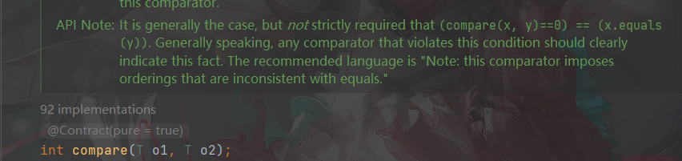


#### 1.1.1.2 equals(Object obj)


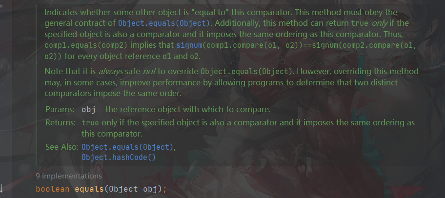


```
返回其他对象是否等于 当前的comparator. 这个方法必须遵守Object.equals方法。

除此以外，这个方法应当返回true， 当且仅当传入的对象也是一个Comparator且返回的比较结果完全一致的情况下。
```


#### 1.1.1.3 reversed()

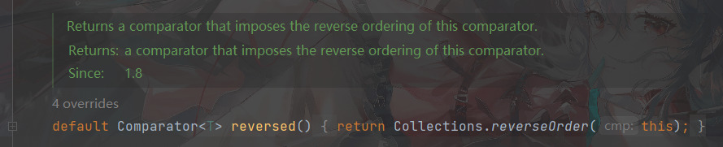


```
返回当前比较器的 反转比较器。
```


#### 1.1.1.4 comparing族


##### comparing(Function,Comparator)

```
注意这是一个  static类方法。 用于构造一个比较器。 
```

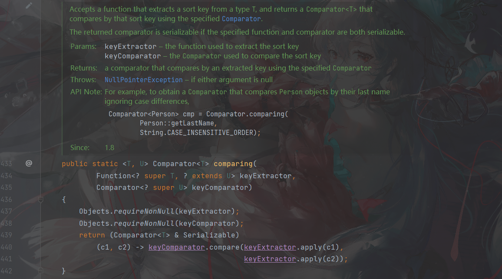


````
两个参数：
传入一个Function， Function返回的结果用于比较。
再传入一个比较器，用于比较Function的返回结果
````


使用实例：

```java
    public static void main(String[] args) {

        Comparator<TestForComparator.MyObject> comparing = Comparator.comparing(
                myObject -> myObject.first,
                Integer::compareTo);

        MyObject obj1 = new MyObject(1,2,3);
        MyObject obj2 = new MyObject(1,2,4);
        System.out.println(comparing.compare(obj1, obj2));
    }


//MyObject.java
    public static class MyObject{
        Integer first;
        Integer second;
        Integer third;
        public MyObject(Integer first, Integer second, Integer third) {
            this.first = first;
            this.second = second;
            this.third = third;
        }
    }
```


##### comparing(Function)

```
本static方法也是用于构造 比较器的。


最主要区别:  

T 是传入Function的参数类型，也是比较器的类型 ，U是传出的参数类型。传入Function意味着，T类型本身不是可比较的(没有实现 comparable)通过Function的转换，转换为U类型。 要么U类型本身实现了comparable接口，则调用comparing(Function)方法。
如果U类型也是不可比较的，那么需要调用comparing(Function,Comparator)传入一个比较器。


// U extends Comparable<? super U>  意味着U必须实现了comparable接口
```


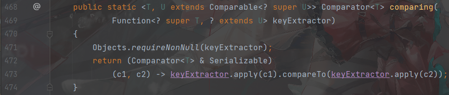


示例方法：

```java

//MyObject.java
	public static class MyObject implements Comparable<MyObject>{
        Integer first;
        Integer second;
        Integer third;

        public MyObject(Integer first, Integer second, Integer third) {
            this.first = first;
            this.second = second;
            this.third = third;
        }


        public int compareTo(MyObject o) {
            Comparator<MyObject> comparator = Comparator.comparing((Function<MyObject, Integer>) myObject -> myObject.first)
                    .thenComparing(x -> x.second)
                    .thenComparing(x -> x.third);

            return comparator.compare(this,o);
        }
    }


    @Test
    public void testForComparator(){
        
        //创建一个比较器。
        //使用comparing(Function)方法，此时T是MyObject,U也是MyObject
        Comparator<MyObject> comparator = Comparator.comparing(x -> x);
        
        MyObject o1 = new MyObject(1,2,3);
        MyObject o2 = new MyObject(2,2,4);
        
        int compare = comparator.compare(o1, o2);
        System.out.println(compare);
        
    }

    @Test
    public void testForComparator2(){

        Comparator<MyObject> comparator = Comparator.comparing((Function<MyObject, Integer>) x -> x.first)
                .thenComparing(x -> x.second)
                .thenComparing(x -> x.third);
        
        MyObject o1 = new MyObject(1,2,3);
        MyObject o2 = new MyObject(2,3,4);
        int compare = comparator.compare(o1, o2);
        System.out.println(compare);
    }
```


##### comparingInt/Long/Double

comparing一族都是用于构造 `Comparator`的

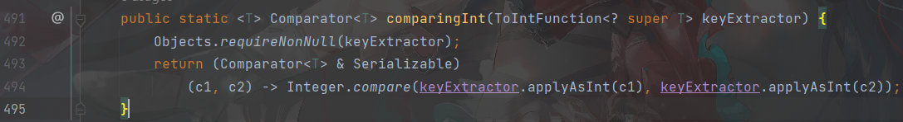

```
参数限定了必须是 ToIntFunction，这意味着返回这必须是int类型
```


同样的，`ToLongFunction`

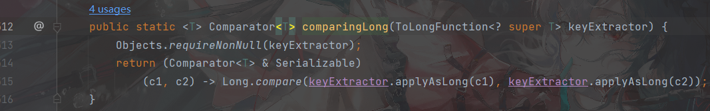


#### 1.1.1.5 thenComparing族


##### thenComparing(Comparator)

`thenComparing` 有众多重载方法。

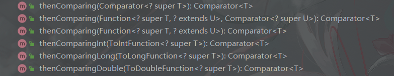


```java
thenComparing(Comparator<? super T>);  //再传入一个比较器，最为后续比较
thenComparing(Funciton,Comparator); //传入一个Function，将function的结果作为比较传入参数，传入形参比较器中


thenComparingInt();   //都是枚举一些常用，最终核心还是上面的泛型方法
thenComparingLong()
thenComparingDouble()
```


注意，`thenComparing`开头的都是 default 方法，是实例方法。必须有实例对象才可调用。


`thenComparing(Comparator)`

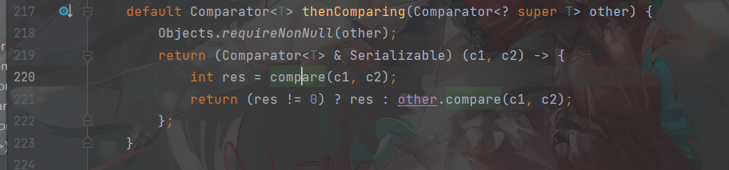

```
返回一个新的Comparator，形成一个比较器链，当且仅当上一个比较器返回的结果是0，调用下一个比较器的compare结果
```


一个 `thenComparing` 的使用示例：

```java
public class TestForComparator {

    public static void main(String[] args) {


        Comparator<MyObject> temp = new Comparator<>() {
            @Override
            public int compare(MyObject o1, MyObject o2) {
                System.out.println("compare to first");
                return o1.first.compareTo(o2.first);
            }
            @Override
            public boolean equals(Object obj) {
                return this.equals(obj);
            }
        };

        Comparator<MyObject> comparator = temp.thenComparing((o1, o2) -> {
            System.out.println("compare to second");
            return o1.second.compareTo(o2.second);
        }).thenComparing((o1, o2) -> {
            System.out.println("compare to three");
            return o1.third.compareTo(o2.third);
        });
        
        MyObject obj1 = new MyObject(1,2,3);
        MyObject obj2 =  new MyObject(1,2,4);
        System.out.println(comparator.compare(obj1, obj2)); 
    }

    public static class MyObject{
        Integer first;

        Integer second;

        Integer third;

        public MyObject(Integer first, Integer second, Integer third) {
            this.first = first;
            this.second = second;
            this.third = third;
        }
    }

}
```


##### thenComparing(Function,Comparator)

```
实例方法
```

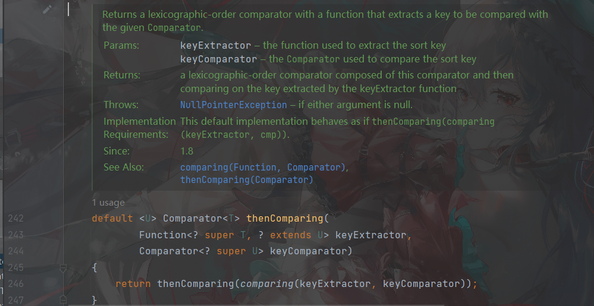

```
返回一个字典顺序的比较器。 这个比较器带有一个函数，指明用于比较器的特定字段。
```


### 1.2 jdk中各个api的支持


`Arrays.sort(Object)`

```java
//Arrays.sort(Object)方法要求， 数组内元素必须都实现了Comparable接口

    @Test
    public void testForSort(){

        MyObject[] objs = new MyObject[2];

        objs[0] = new MyObject(0,2,3);
        objs[1] = new MyObject(1,2,4);

        Arrays.sort(objs);

        System.out.println(Arrays.toString(objs));

    }

//MyObject.java
	public static class MyObject implements Comparable<MyObject>{
        Integer first;
        Integer second;
        Integer third;

        public MyObject(Integer first, Integer second, Integer third) {
            this.first = first;
            this.second = second;
            this.third = third;
        }

        @Override
        public int compareTo(MyObject o) {
            Comparator<MyObject> comparator = Comparator.comparing((Function<MyObject, Integer>) myObject -> myObject.first)
                    .thenComparing(x -> x.second)
                    .thenComparing(x -> x.third);

            return comparator.compare(this,o);
        }
    }


```


# 2. Number

这是一个抽象类，实现了 `Serializable`接口。


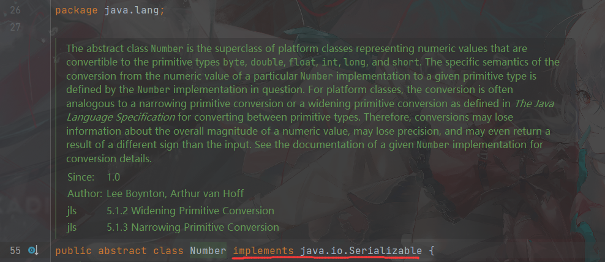


子实现类如下：

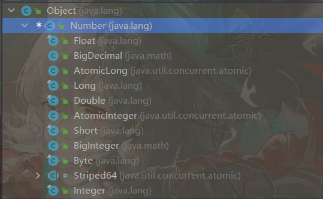

```
包括 包装类： Integer ,Double Float,Short,Long ，Byte

还包括任意值的 BigDecimal

包括线程安全的原子类  AtomicInteger ,AtomicLong

```


## 2.1 抽象类方法

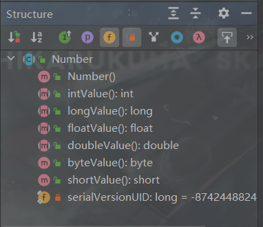


```java
    /**
     * Constructor for subclasses to call.
     */
    public Number() {super();}
    /**
     * Returns the value of the specified number as an {@code int}.
     */
    public abstract int intValue();

    /**
     * Returns the value of the specified number as a {@code long}.
     */
    public abstract long longValue();

    /**
     * Returns the value of the specified number as a {@code float}.
     */
    public abstract float floatValue();

    /**
     * Returns the value of the specified number as a {@code double}.
     */
    public abstract double doubleValue();

    /**
     * Returns the value of the specified number as a {@code byte}.
     */
    public byte byteValue() {
        return (byte)intValue();
    }

    /**
     * Returns the value of the specified number as a {@code short}.
     */
    public short shortValue() {
        return (short)intValue();
    }
```


# 3.Function

`Function`是一个非常重要的接口。 在`Stream`中被大量使用。

同时，本章不仅介绍了 `Function` 接口 ，还包含了 `java.util.function` 包下，由 `Function` 一同设计出来的多个类。


`Function` 传入的参数T，返回值R均使用了泛型。

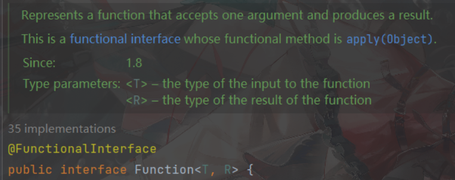

```
一个Function对象代表了一个"函数"， 这个"函数"接收一个参数，然后返回一个结果。

//等价于数学上的表达式  y=f(x)， y就是Function接口期待的返回值。 f(x)表示这个函数， x表示传入的参数
```


## 3.1 Function接口方法

`Function` 接口方法非常简单，包含3个default方法和1个抽象方法。


### 3.1.1 apply()

第一个，也是最主要的抽象方法就是 `R apply(T)` 表示接收参数`T` 返回结果`R` 。


### 3.1.2 compose()


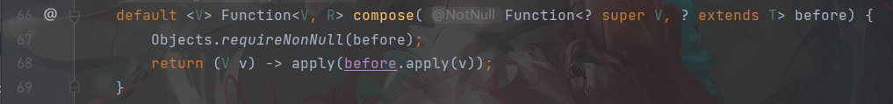

```
首先这是一个实例方法，传入一个Function 这个Function称为 before 
compose方法先让before函数执行完毕后，再执行本实例函数。

注意：返回的是一个新的Function,这个Function被lambda表达式化简了，在使用的时候需要注意


//举例： 现在有函数fun1 函数fun2 ，当fun1调用compose组合了fun2以后。 当fun1执行apply之前，先执行fun2，
//然后将执行结果作为参数传入到fun1中执行
```


实例：

```java
    public static void main(String[] args) {
        //定义了一个函数fun1
        Function<Integer,Integer> fun1 = (t)->{
            System.out.println("fun1 running");
            return ++t;
        };
        //定义函数fun2
        Function<Void,Integer> fun2 = (v)-> {
            System.out.println("fun2 running");
            return 5;
        };
        //fun1.compose(fun2) fun1组合了fun2，fun2作为before先执行
        System.out.println(fun1.compose(fun2).apply(null));
    }
```


输出结果：

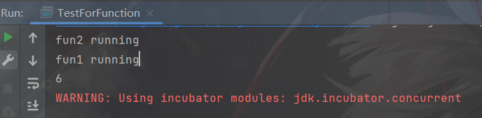


### 3.1.3 andThen

和`compose()` 相反， `andThen` 表示传入一个 `after` ，本实例`apply`执行结果作为参数，传入给`after`

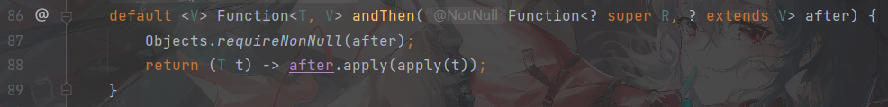


示例：

```java
        Function<Void,Void> fun1 = (t)->{
            System.out.println("fun1 running");
            return null;
        };

        Function<Void,Void> fun2 = (v)-> {
            System.out.println("fun2 running");
            return null;
        };

        fun1.andThen(fun2)
                .andThen(fun2)
                .andThen(fun2)
                .apply(null);
```


### 3.1.4 identity


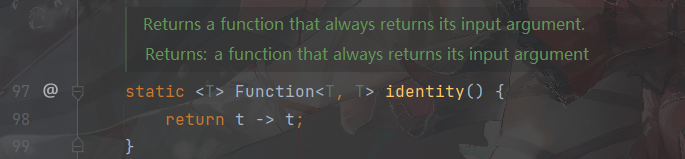


```
总是返回输入参数的函数。 identity
```


## 3.2 单参数Function接口的枚举

这个枚举，并不指枚举类。 `Function` 接口使用的是泛型。 但同时JDK提供了几个常用的实现。

例如：

```java
IntFunction    -> ToIntFunction

//注意IntFunction和 ToIntFunction是两个不用的类。
//IntFunction表示传入的参数是Int,但返回值依然是泛型R
//ToIntFunction表示传入的参数是泛型T，但返回值是Int


//同理：
LongFunction   -> ToLongFunction

DoubleFunction -> ToDoubleFunction


//还有很多规定了 T和R的    
LongToIntFunction，LongToDoubleFuntion ...
    
    
```

这种对泛型的枚举，在JDK很多地方都有。


//TODO 见过，但忘记了，什么时候想起来完善

```
例如: 
Comparator.comparing(Function)  Comparator.comparing(ToIntFunction)
```


这里指枚举一些类：

### 3.2.1 IntFunction

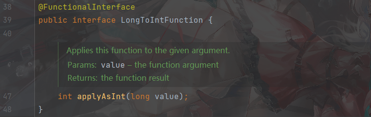


### 3.2.2 ToIntFunction

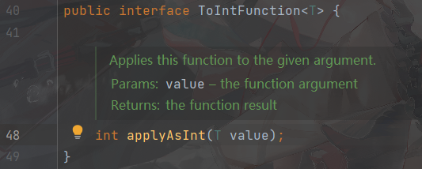


## 3.3 UnaryOperator

一元操作, 继承 `Function` 接口 ，表示 传入参数，和返回值都是同一个类型 `T`


以Operator结尾的都表示  `传入参数` `返回值` 的数据类型相同。 例如 BinaryOperator<T,T,T>


### 3.3.1 接口方法


#### apply(T t)

由于继承了 Function<T,T> 所以有apply方法。


使用示例：

```java
    @Test
    public void testForUnaryOperator(){

        UnaryOperator<Integer> addOne = (x)->++x;

        System.out.println(addOne.apply(1));  //输出2

    }
```


#### identity 

`identity`返回自身

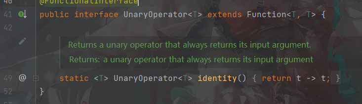


### 3.3.2 枚举类

`IntUnaryOperator`


`DoubleUnaryOperator`

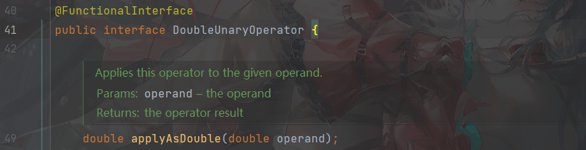


`LongUnaryOperator`


## 3.3 二元函数 BiFunction

二元参数 `Function`  同样使用了泛型。 二元参数表示输入2个泛型参数 `T` `U` 返回结果 `R`

函数签名`BiFunction<T,U,R>`


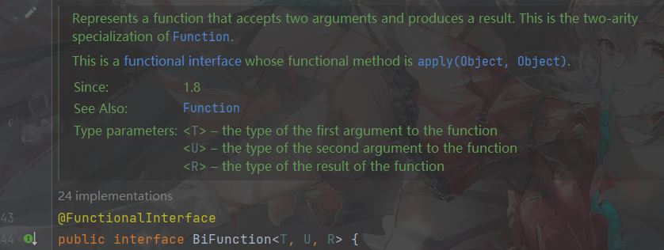


```
BiFunction （BinaryFunction）, 这是一个函数式的接口，函数式方法为 apply(T,U)
```


### 3.3.1 BiFunction 接口内方法


#### 3.3.3.1 apply(T,U)


#### 3.3.3.2 andThen()


`BiFunction` 没有 `compose` 原因是：函数的返回结果是一个值，无法执行本实例二元参数`apply`and


但是可以`andThen` 一个 一元函数。

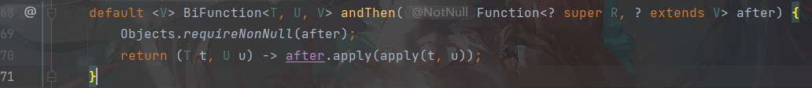


## 3.4  二元函数枚举

看过单参数Function接口的枚举，如下几个类应该可以直接 ”见名知意“了


```
ToIntBiFunction  //二元参数，返回值是Int
ToDoubleBiFuntion
ToLongBiFuntion
```


### 3.4.1 ToIntBiFunction

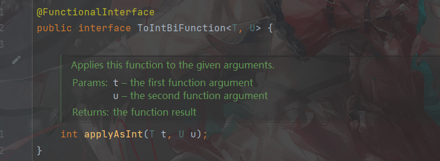


### 3.4.2 ToDoubleBiFunction

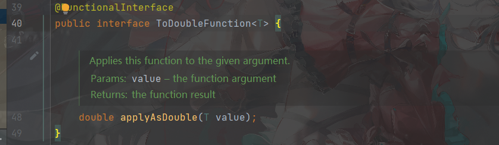


## 3.5 BinaryOperator

二元操作, 继承自 `BiFunction ` ，我们知道 `BiFunction` 输入T,U 输出R ，那么当 T=U=R的时候，就是BinaryOperator .

所以BinaryOperator 也有最核心的`apply`方法


```
或者说，BinaryOperator是 BiFunction的一种特例。(当且仅当 T=U=R)
```


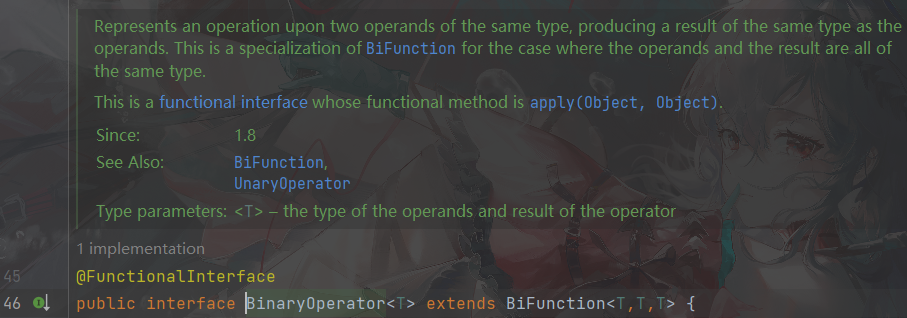


```
BinaryOperator 代表了一个基于2个同样类型操作数的 操作，同时返回结果也是通过一个类型。

所以函数签名是这样的   BinaryOperator<T,T,T>
```


### 3.5.1 接口方法


#### 3.5.1.1 minBy

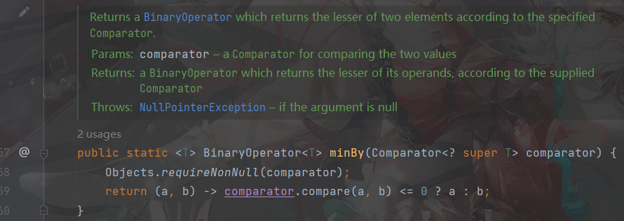


```
返回传入两个参数中小的那个
```


#### 3.5.1.2 maxBy

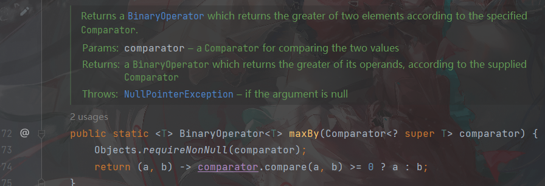


```
返回两个参数中大的那个
```


## 3.6 Consumer

一元消费函数。  传入一个参数，进行一些操作，没有返回值。


函数式接口


### 3.6.1 接口方法

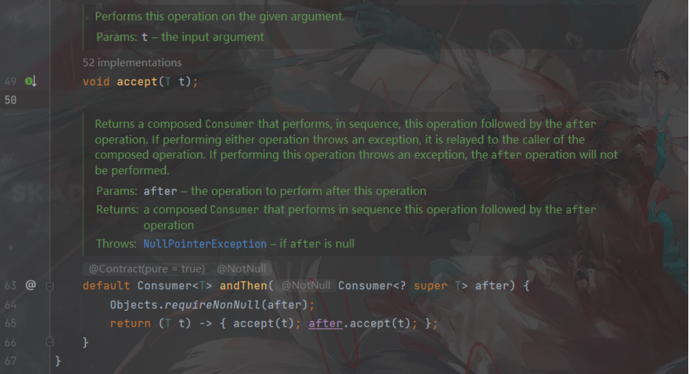


### 3.6.2 示例

定义一个MyConsumer类，实现 `before`方法	

```java
public interface MyConsumer<T> extends Consumer<T> {

    /**
     *
     * @param before
     */
    default MyConsumer<T> before(Consumer<T> before){
        
        //构造了一个新的MyConsumer<T>
        return t -> {
            before.accept(t);
            accept(t); //等价于this.accept ，lambda表达式没有this，所以this指向了外层的MyConsumer实例，调用的是
            		   //外层的MyConsumer.accept，而不是新构造的MyConsumer.accept方法
            		   //换句话说，lambda表达式无法递归调用，作为对比，下面的before2方法就会造成递归调用导致SOF
        };
    }
    
    default MyConsumer<T> before1(Consumer<T> before){
        return new MyConsumer<T>() {
            final MyConsumer<T> myConsumer = this;
            @Override
            public void accept(T t) {
                before.accept(t);
                myConsumer.accept(t);//如果不用lambda化简，那么必须把外层的MyConsumer引用传递进来，然后调用它的accept
            };
        };
    }
    
    
    default MyConsumer<T> before2(Consumer<T> before){
        return new MyConsumer<T>() {
            @Override
            public void accept(T t) {
                before.accept(t);
                this.accept(t); //造成递归调用，是错误的写法
            };
        };
    }

}
```


### 3.6.3  IntConsumer/DoubleConsumer

必然有枚举的思想在其中：

```java
void IntConsumer(int); //传入一个int值，消费

void DoubleConsumer(double ); //传入一个double

void LongConsumer(long);
```


`IntConsumer` 接口

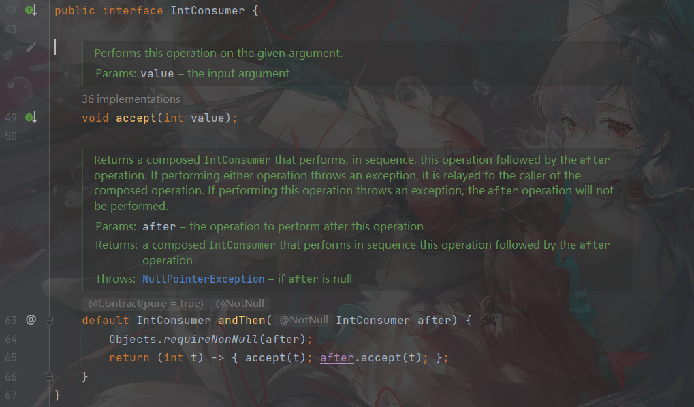


## 3.7  BiConsumer

二元消费者：  传入2个参数，进行一些运算。没有返回值

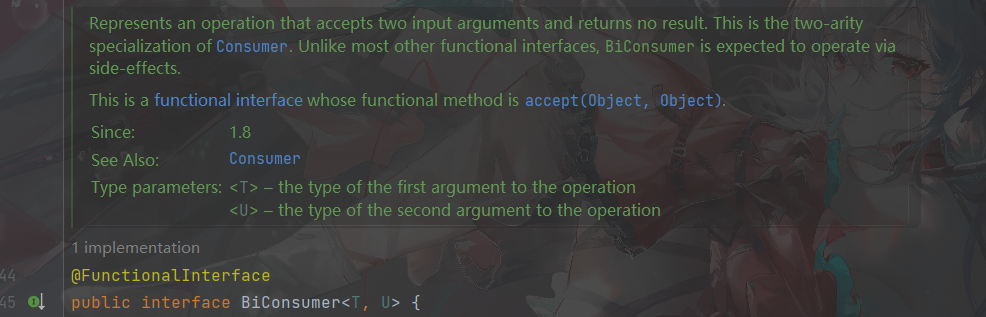


```
T代表第一个传入的参数
U代表第二个传入的参数
```


### 3.7.1 接口方法


#### 3.7.1.1 accept


#### 3.7.1.2 andThen 

组合消费方法。 `default` 实例方法， 本实例先消费，然后执行后续传入的消费。

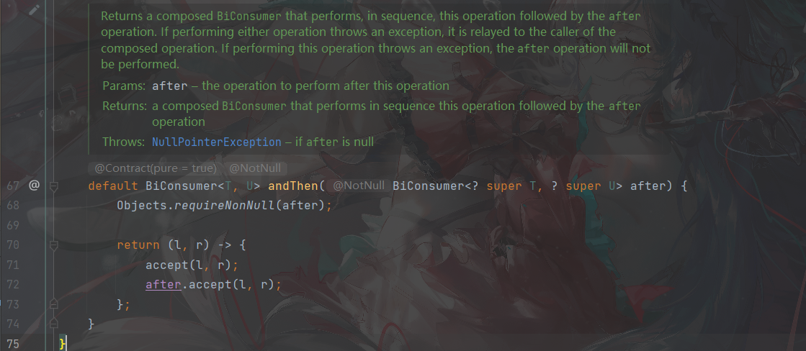


### 3.7.2 示例


```java
@Test
public void testForConsumer(){

    BiConsumer<Integer,Integer> consumer = (x,y)->System.out.println(x+" "+y);

    consumer.andThen((x,y)->System.out.println(x+" "+y)).accept(1,2);
    
}
```


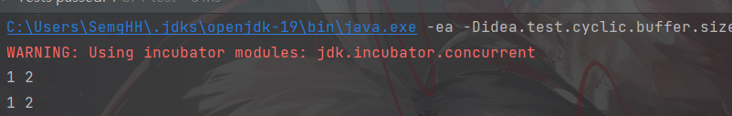


## 3.8 Supplier

提供器，用于提供一个任意类型的值。 同样是使用泛型`T`来表示提供值得类型。 提供的函数是 `get()`方法，没有参数。

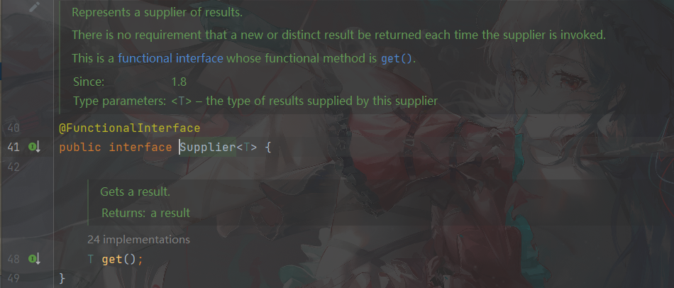


### 3.8.1 接口方法


### 3.8.2 Boolean/Double/Int/Supplier

同样的，jdk将几种常见的提供器枚举了出来：

```
BooleanSupplier
DoubleSupplier
IntSupplier
LongSupplier
```

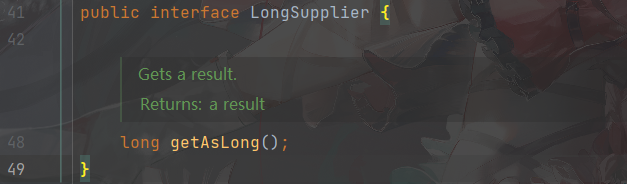


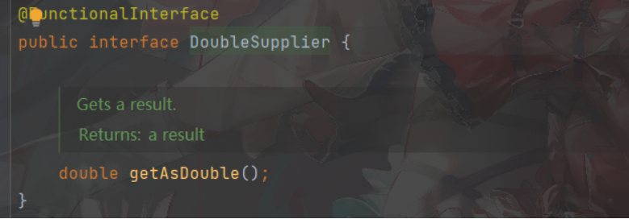


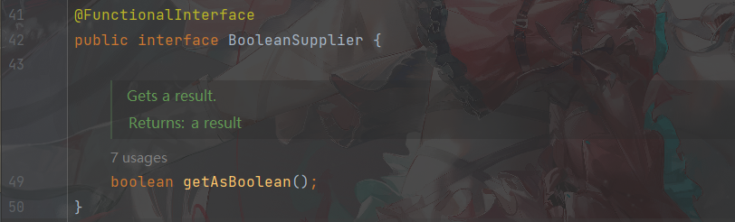


## 3.9 Predicate

断言。 

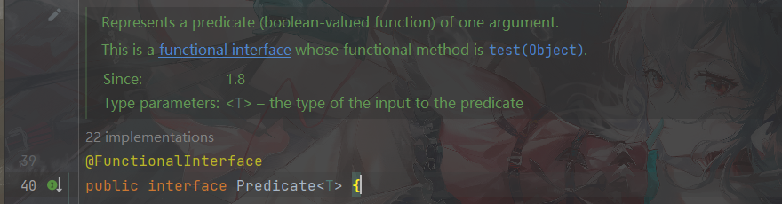


```
Predicate代表断言 ，也就是返回值为boolean类型的Function .如果满足断言，则返回true，不满足断言则返回false.
```

断言也使用了泛型 ，泛型 `T` 表示传入断言的参数类型。

```
断言的核心方法  boolean test(T t);    
```


### 3.9.1 接口方法


#### 3.9.1.1 test(T t)


核心方法 `test(T t)` 

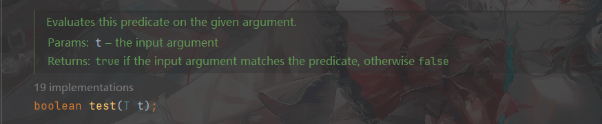


```
传入一个给定的参数，然后执行本断言。如果匹配断言，则返回true，否则返回false
```


#### 3.9.1.2  and

逻辑与， 组合一个其他的断言，形成 逻辑与。 这是一个实例方法。

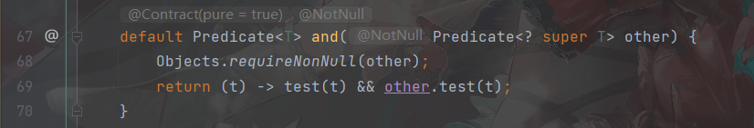


示例

```java
@Test
    public void testForAnd(){
        Predicate<MyObject> predicate = (myObject)->{
            if (myObject.first==1 &&
            myObject.second==2 &&
            myObject.third>3){
                return true;
            }
            return false;
        };

        MyObject obj = new MyObject(1, 2, 4);
        boolean result = predicate.and((myObject) -> myObject.third < 5).test(obj);
        System.out.println(result);
    }
```


#### 3.9.1.3 negate()

返回一个新的 ，表示逻辑非的 Predicate 对象。


#### 3.9.1.4  or

逻辑或


#### 3.9.1.5  isEqual

这是一个静态方法，用于构造一个新的 `Predicate` ， 构造`Predicate` 时需要传入一个 “基底”对象obj1,作为比较。

后续调用这个 Predicate时，都会判断传入 `test`的 obj2 是否 `Object.equals(Object,Objecy)`


#### 3.9.1.6  not(Predicate)

本方法也是类方法，用于构造一个Predicate，传入一个 Predicate，返回逻辑非

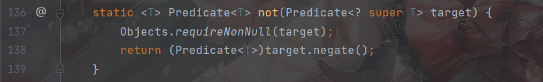


### 3.9.2  IntPredicate/DoublePredicate

 `IntPredicate` 传入参数的数据类型是Int


`LongPredicate` 传入参数的数据类型是Long

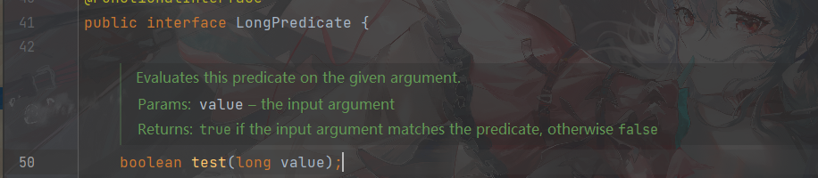


`DoublePredicate`  传入参数的数据类型是Double


### 3.9.3 BiPredicate

二元参数断言。 `test` 参数有2个泛型 `T` `U`    ， 函数式接口


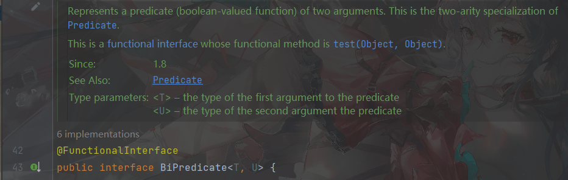


#### 3.9.3.1 接口方法


##### test(T,U)

需要实现的抽象方法。 传入两个参数 `T`，`U`  返回 `boolean`


##### negate()

返回 逻辑非 的断言。

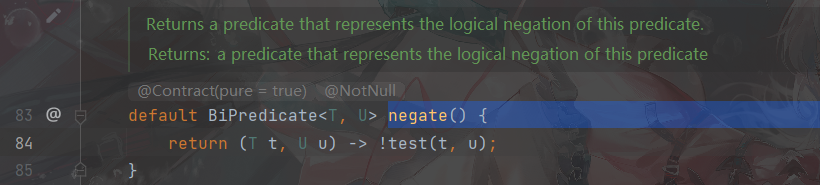


##### and(BiPredicate)

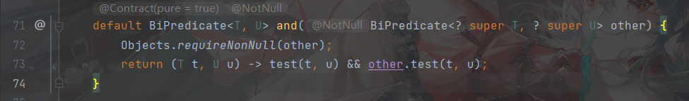


##### or(BiPredicate)

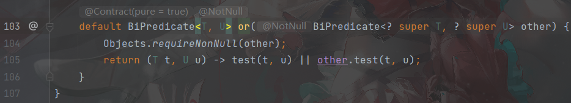


# 4.Arrays

`Arrays` 工具类


## 4.1 类方法


### 4.1.1 sort族

sort族用于给数组(支持任意类型)排序，支持对`指定区间`内排序。

```
对于Object类型排序，必须保证 数组内元素均实现了comparable接口
```


#### 支持任意类型，任意区间排序

```java
public static void sort(Object[] a);// 整个数组排序
public static void sort(Object[] a, int fromIndex, int toIndex); //起始下标-终止下标排序
//是一个左闭右开的区间， [fromIndex,toIndex)

public static <T> void sort(T[] a, int fromIndex, int toIndex,
                                Comparator<? super T> c);  //传入一个比较器用作排序


//fromIndex – the index of the first element (inclusive) to be sorted 
//toIndex – the index of the last element (exclusive) to be sorted
```


#### 支持并行排序

```java
public static void parallelSort(T[] a);
public static void parallelSort(T[] a, int fromIndex, int toIndex);
public static <T> void parallelSort(T[] a, int fromIndex, int toIndex,
                                        Comparator<? super T> cmp);//传入一个比较器排序

//同样的支持并行排序 int[] byte[] char[] double[] float[] double[] 
```


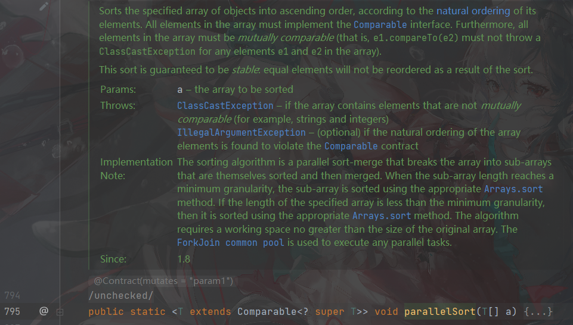


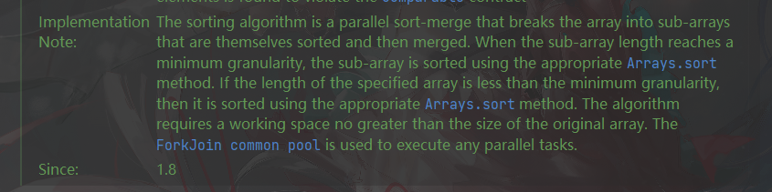

````
排序算法使用的是多线程 归并排序。 将一个数组打散在多个子数组中，将他们各自排序，然后合并。
当子数组长度达到了 minimum 粒度，子数字将调用 Arrays.sort方法排序。

执行并行任务的框架是  ForkJoin common pool
````


### 4.1.2 binarySearch族

`Arrays.binarySearch()` 支持二分法搜索。


支持搜索任意类型的数组。

```java
public static <T> int binarySearch(T[] a, T key, Comparator<? super T> c);//传入一个比较器

public static <T> int binarySearch(T[] a, int fromIndex, int toIndex,
                                       T key, Comparator<? super T> c);//支持区间搜索


//还支持搜索  byte[] short[] double[] float[] int[]
```


### 4.1.3 prefix族

输出数组的 累加和。

```
例如初始数组 [2,1,0,3]  则累加和为：   [2,3,3,6]


#顺序执行下面的伪代码
A0 = 2
A1 = A0+A1 = 2+1 = 3
A2 = A1+A2 = 3+0 = 3
A3 = A3+A4 = 3+3 = 6
```


#### 4.1.3.1 api

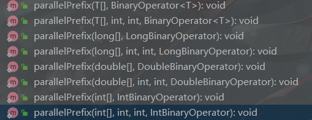


可以求任意类型的 累加和。

```
传入对应数组，以及  binaryOperator (二元操作器，输入输出全都是同一个类型的Function)
```


#### 4.1.3.2 示例

测试代码1：

```java
    @Test
    public void testForPrefix1(){

        MyObject[] objs = new MyObject[]{
                new MyObject(1,2,3),
                new MyObject(0,0,1),
                new MyObject(4,2,3)};

        BinaryOperator<MyObject> binaryOperator = (x,y)-> new MyObject(x.getFirst()+y.getFirst(),
                x.getSecond()+y.getSecond(),
                x.getThird()+y.getThird());

        Arrays.parallelPrefix(objs,binaryOperator);

        System.out.println(Arrays.toString(objs));

    }


//MyObject.java

	@Data
    public static class MyObject implements Comparable<MyObject>{
        Integer first;
        Integer second;
        Integer third;

        public MyObject(Integer first, Integer second, Integer third) {
            this.first = first;
            this.second = second;
            this.third = third;
        }

        @Override
        public int compareTo(MyObject o) {
            Comparator<MyObject> comparator = Comparator.comparing((Function<MyObject, Integer>) myObject -> myObject.first)
                    .thenComparing(x -> x.second)
                    .thenComparing(x -> x.third);

            return comparator.compare(this,o);
        }
    }


```

输出结果

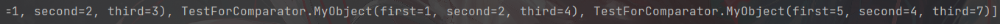


测试代码2：

```java
    @Test
    public void testForPrefix(){
        IntBinaryOperator intBinaryOperator = (x,y)->{
            System.out.println(x+" "+y);
            return x+y;
        };

        int[] arr = new int[]{1,2,3,4};

        Arrays.parallelPrefix(arr,intBinaryOperator);

        System.out.println("after prefix...");

        System.out.println(Arrays.toString(arr));

    }
```


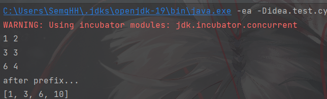


### 4.1.4 equals族

用于判断两个数组中的元素是否完全等价。

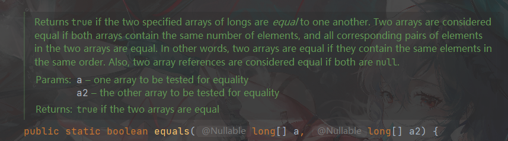


```
如何认为两个数组等价?

1.两个数组包含的元素个数相同
2.数组内每个位置上的元素必须相同。
```


同样的 `equals` 支持全部数据类型， 同时支持指定区间内比较。

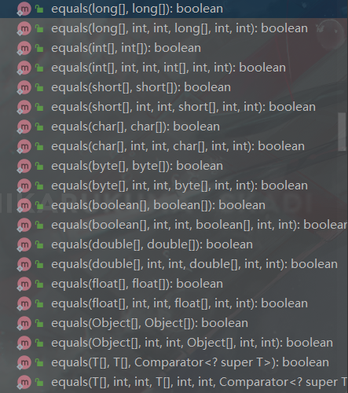


#### 4.1.4.1 api

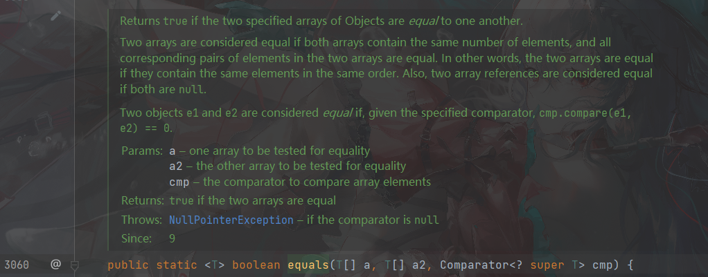


```
equals支持任意泛型判断。 需要传入一个对应的比较器。
```


#### 4.1.4.2 示例


```java
 @Test
    public void testForEquals2(){
        MyObject[] arr1 = new MyObject[]{
                new MyObject(1,2,3),
                new MyObject(2,2,4)
        };

        MyObject[] arr2 = new MyObject[]{
                new MyObject(1,2,3),
                new MyObject(2,3,4)
        };

        MyObject[] arr3 = new MyObject[]{
                new MyObject(1,2,3),
                new MyObject(2,2,4)
        };

        Comparator<MyObject> comparator = Comparator
                .comparing( MyObject::getFirst)
                .thenComparing(MyObject::getSecond)
                .thenComparing(MyObject::getThird);


        System.out.println(Arrays.equals(arr2, arr1, comparator));

        System.out.println(Arrays.equals(arr1,arr3,comparator));

    }
```


### 4.1.5 fill族

用于将数组内全部填充为指定值。(注意如果是Object对象，则都指向为同一个对象)


`fill` 族可以对任意类型数据使用。如果是 `引用数据类型`需要特别注意。


### 4.1.6 copyOf族

用于复制数组中的值。


同样的 CopyOf 支持全部数据类型。


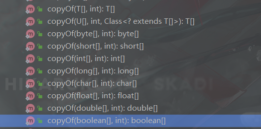


#### 4.1.6.1 api


重点看一下复制任意数据类型的。

```java
    public static <T> T[] copyOf(T[] original, int newLength) {
        //调用下面的方法，传入 泛型数组的类型。
        return (T[]) copyOf(original, newLength, original.getClass());
        
       	//我们知道数组类型的 Class,携带了元素的种类信息。
    }


    @IntrinsicCandidate
    public static <T,U> T[] copyOf(U[] original, int newLength, Class<? extends T[]> newType) {
        @SuppressWarnings("unchecked")
        T[] copy = ((Object)newType == (Object)Object[].class)
            ? (T[]) new Object[newLength]
            : (T[]) Array.newInstance(newType.getComponentType(), newLength);
        System.arraycopy(original, 0, copy, 0,
                         Math.min(original.length, newLength));
        return copy;
    }
```


调用了 `reflect` 包下的  [Array.newInstance()](# 5.2.1.1 Array.newInstance(Class,int)) 方法 ，创建了一个对应类型的新数组。


# 5. reflect

本章主要记录 java.lang.reflect包下的东西。


## 5.1 Class

非常重要的类。抽象表示一个`类`，是反射的核心之一。


### 5.1.1 API 


#### 5.1.1.1  getComponentType

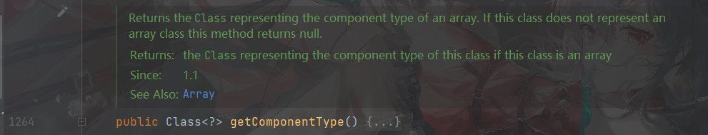

```
返回当前类包含的元素的数据类型。  如果当前类不是一个数组类型，那么本方法将返回null
```

​	


```java
        System.out.println(arr1.getClass().getComponentType());
        //class com.semghh.hello.functionPackageTest.TestForComparator$MyObject
```


## 5.2 Array

`Array` 是 `reflect`包下的final类。
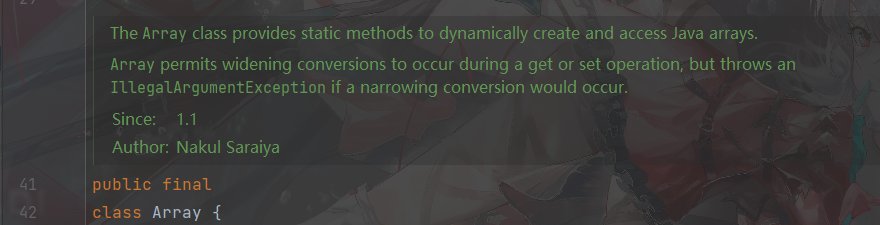


`Array` 类提供了一些静态方法，用于动态创建和访问  `Java 数组`


### 5.2.1 类方法


#### 5.2.1.1 Array.newInstance(Class,int)

创建一个 指定元素类型，指定长度的 数组。

```
新数组的维数不能超过255。
```


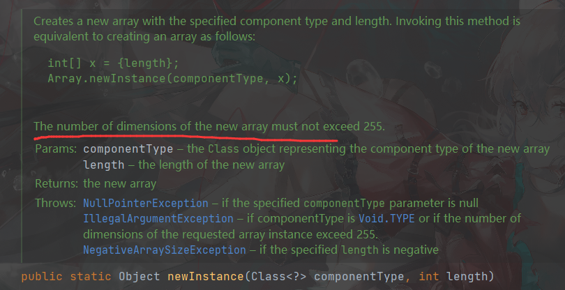


```java
    @Test
    public void testForNewInstance(){

        MyObject[] arr = new MyObject[2];

        MyObject[] o = (MyObject[]) Array.newInstance(arr.getClass().getComponentType(), 5);

        o[0] = new MyObject(1,1,1);

        System.out.println(o[0]);
        
    }
```


# 6. Throwable


# 7. Java.time包

本章主要是`java.time` 包下的类。


首先需要知道，在Java中的API设计中。 `time`包的设计不是那么工程上`好用`。

在日常开发中我们常用的是 `java.sql`包下的一些时间类 例如 `java.sql.TimeStamp` `java.sql.Date` ，

但是`java.sql`包下的一些类，继承实现了`java.time`包下的接口，但实现方法的时候缺抛出异常。
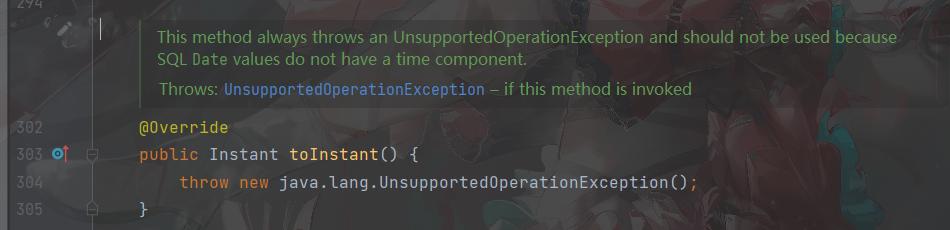

```
还要在注释中交待理由。
```


另外可以参看https://cloud.tencent.com/developer/article/2049751这篇文章。

事实上，这么设计并不能说不对，只能说增加了开发者初次使用时的心智负担。


## 7.1 Duration 

这个类表示 “持续时间” 。

一段儿时间可能持续的长，也可能持续时间短。例如：“持续1秒” ，“持续3分钟” ，“持续5天”等。


```
实现了 TemporalAmount ， Comparable ，Serializable接口
```


### 7.1.1 类方法


#### 7.1.1.1 of 族

`ofXXX()` 静态方法族，用于构造一个持续一段儿时间的 `Duration`类对象。

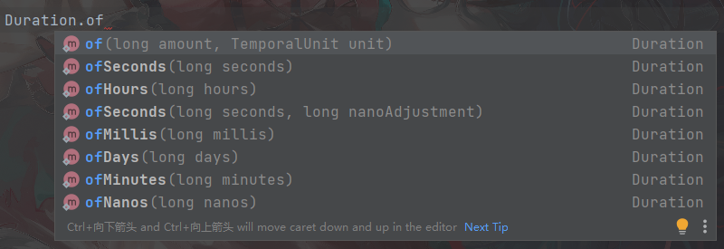


`of(long amount,TemporalUnit unit)`

```
以任意的时间单位，构造任意长度的持续时间。
```


#### 7.1.1.2 to 族

并不是时间单位的转换，而是把 `Duration`包含时间总量与 一个时间单位作比较，约等于这个时间单位。

例如：  

```
3601秒，等于1小时余1秒。  

toHours() 的返回值就是1
toDays() 就是0
```


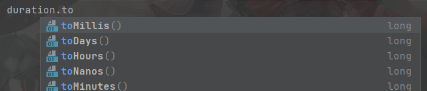


可以看到计算计算公式：  `使用总量的秒`/ `一天的秒` 。

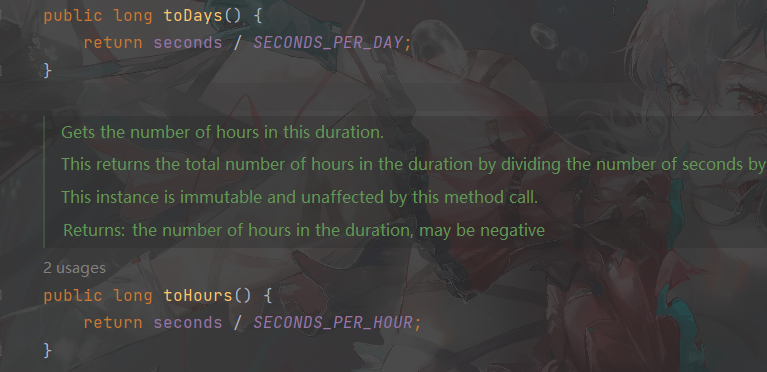


#### 7.1.1.3 minus() 族

`Duration` 类对象的相减。 

```java
public Duration minus(Duration duration);
```

表示时间段的相减。

```java
    @Test
    public void test2(){

        Duration duration = Duration.ofSeconds(3);

        Duration minus = duration.minus(Duration.ofSeconds(2));

        System.out.println(minus);
        System.out.println(minus==duration);//false

    }
```


这个方法不会改变源`Duration` 对象，而是返回一个新的`Duration`对象作为相减的结果。


相关方法：

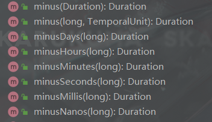


#### 7.1.1.4 plus() 族

用于 `Duration` 对象的相加。

```java
public Duration plus(Duration duration);
```


相关方法列表：

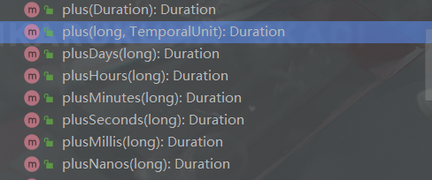


#### 7.1.1.5 between(Temporal,Temporal)

返回一个 `Duration` ，表示在两个`Temporal` 对象之间的持续时间。


#### 7.1.1.6 isZero/isNegative

返回`Duration` 是否是0，

返回`Duration` 是否是为负


#### 7.1.1.7 multipliedBy(long)/dividedBy(long)

`Duration` 对象乘以一个基数

```java
public Duration multipliedBy(long multiplicand) 
```


`Duration` 对象除以一个基数

```java
public Duration dividedBy(long divisor);
```


## 7.2 TemporalUnit

时间单位。这是一个接口，在`java.time.temporal` 包下


```
TemporalUnit 代表一种时间单位。例如 天，小时。
```


### 7.2.1 接口方法

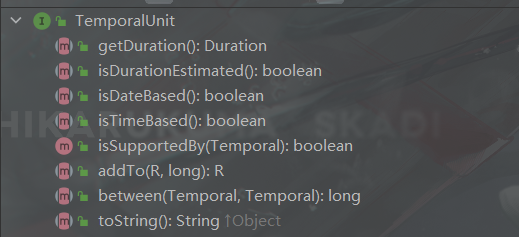


```java
//返回这个 时间单位对应的 Duration
Duration getDuration();


//虽然一个时间单位可以被Duration表示，但有可能不是一个准确值。
//如果时间单位对应的Duration 是精确的则返回true。
boolean isDurationEstimated();
```


```java
//检查此单元是否代表日期的一个组件。

//所谓"组件"意思是 : 它的持续时间必须是一个标准日长度的整数倍。

boolean isDateBased();

//如果是整除一个标准日，则称为timeBased
boolean isTimeBased();
```


```java

//传入一个 Temporal接口的实现类对象
//返回当前TemporalUnit能否被传入的对象 加减（plus,minus）。
default boolean isSupportedBy(Temporal temporal);
```


## 7.3 Temporal

时间。 这是一个接口。


```
框架级别的接口， 定义了一个 temporal对象的读写访问。例如一个日期，时间，偏移量等等。
```


```
划重点：

Temporal 接口
	1.提供了时间的加减能力： plus/minus方法
	2.提供了时间调整能力： with方法
```


### 7.3.1 接口方法


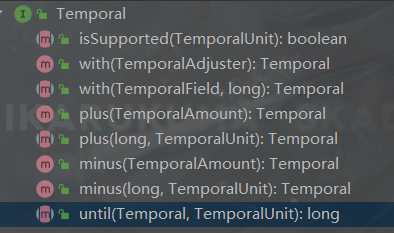


```java
//是否支持对应的 TemporalUnit 加减
boolean isSupported(TemporalUnit unit);
```


```java

//TemporalAdjuster 时间调整器
//本方法表示当前的时间，经过时间调整器调整。
default Temporal with(TemporalAdjuster adjuster);
```


### 7.3.2 接口实现类


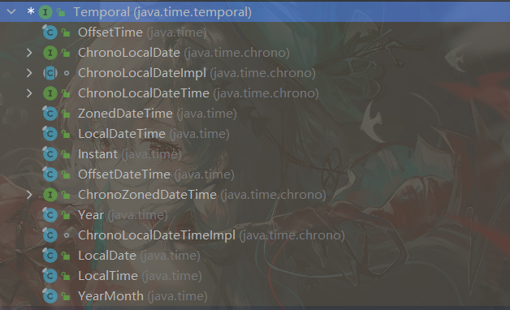


## 7.4 TemporalAdjuster

这是一个函数式接口。


```
本接口是一个策略接口，用于调整一个  Temporal 对象。

用于Temporal.with()方法的入参。
```


```
调整器是一个修改temporal对象的关键工具。  TemporalAdjuster的存在是把“调整”这一过程具象化。

同时允许自定义调整方式。
```


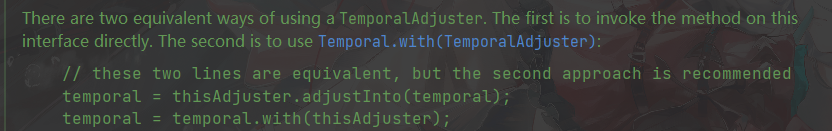

```java
//调整日期有两种等价方式，推荐使用第二种方式
temporal = thisAdjuster.adjustInto(temporal);

temporal = temporal.with(thisAdjuster);
```


### 7.4.1 接口方法


参数传入的就是需要调整的Temporal。


示例：

```java
    @Test
    public void test3(){
        LocalDateTime now = LocalDateTime.now();
        
        System.out.println(now);
        now = now.with(new TemporalAdjuster() {
            @Override
            public Temporal adjustInto(Temporal temporal) {
                return temporal.plus(5, ChronoUnit.DAYS);
            }
        });

        System.out.println(now);
    }
```


## 7.5 LocalDate

本地时间。


```
在 ISO-8601 日历标准的系统中代表一个没有时区的日期。 例如： 2007-12-03

(注意，只有日期，年月日， 没有Time [不包含时分秒],想要表示Time，则使用 LocalTime类)

除此以外，有Time和Date全包含的类：  LocalDateTime
```


```
实现了 Temporal,TemporalAdjuster, ChronoLocalDate接口。
```


### 7.5.1 构造方法

 `LocalDate`的构造参数是私有化的，并提供了一系列 工厂方法用于创造`LocalDate`对象。


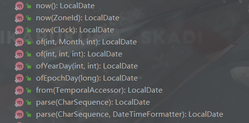


### 7.5.2 实例方法

由于`LocalTime` 不包含时分秒，所以`LocalTime`类也无法提供常见的 `long getTime()` 方法。


由于 `LocalTime` 实现了`Temporal`接口，则拥有时间调正能力 `plus/ minus/with`等


## 7.6 LocalTime


## 7.7 LocalDateTime

是 `Temporal` 的实现类。


```
LocalDateTime是一个没有时区的 dateTime。 运行在 ISO-8601日历标准的系统中。
```


# 8. Stream 流

什么是流？

```
流就是遍历一些元素（集合）的工具。把这些元素抽象为一个数据流，此时我们可以在流的末尾组合一些 “过滤装置”（这些过滤装置可以将输入的数据流过滤/修改，使“过滤装置”输出后的数据流变为一个新的，符合开发者要求的流）。


这些“过滤装置” ，就是Stream中的各种hook方法。
```


什么时候使用流？ 
```
需要遍历改变一些数据的时候（通常他们是Collection的形式）。
```


流操作，要比循环版本更加易读，同时可以使用 第1章，第3章的各种 hook接口。


## 8.1 BaseStream<T>

基础流接口。定义了流的最基础行为， 包括 遍历，切分，并行，排序流，自动close等。

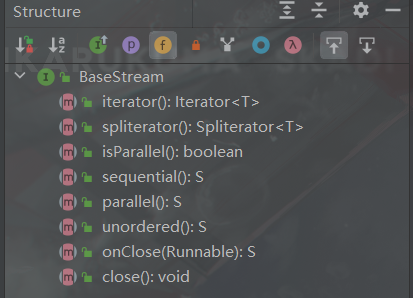


实现类：

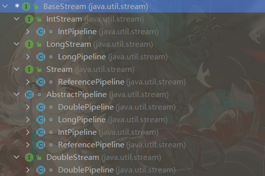


## 8.2 Stream<T>

继承了  `BaseStream<T>` 接口。 流的各种优秀行为都在 `Stream<T>`接口中定义，例如：

过滤 filter,映射map, 排序sorted,遍历 foreach，收集 collect, 取最大值max, 取最小值 min


### 8.2.1 接口方法


#### 8.2.1.1 `Stream.of(T...)`

这个方法用于构造一个流。


构造一个流的方式有很多，例如 `Collection.stream()`  将一个集合转换为`流`

也可以通过`Stream`的静态方法 `of(T...)`得到一个流。


#### 8.2.1.2`filter<Predicate>`

过滤一个流，传入一个 [断言 ](# 3.9 Predicate) , 当断言返回`true`的时候，保留当前流元素。


```java
    @Test
    public void test1() {

        Stream<Integer> stream = Stream.of(1, 2, 3, 4, 5, 6, 7, 8, 9, 10);

        stream = stream.filter(x -> x % 2 == 0);

        stream.forEach(System.out::println);
		//2 4 6 8 10

    }
```


#### 8.2.1.3 `map<Function<? super T ,? extend R>>`

映射。 将于将流内的数据类型T，映射为另一种数据类型R。


现在来分析一下Function的泛型：

```
首先需要明确
流内的目标数据类型T
输出的目标数据类型R

Function的入参 T' 必须是流内目标T的父类，保证T可以强转至T'
		返回值R' 必须是输出目标数据类型R的子类，保证Function返回至可以强转成类型 R
```


一个使用实例：

```java
    @Autowired
    private StudentMessageService studentMessageService;

    @Test
    public void mapTest(){

        List<Message> collect = Stream.of(1L, 2L, 3L, 4L)
                .map(studentMessageService::getMessage)
                .collect(Collectors.toList());
    }


//StudentMessageService.java
    public static class StudentMessageService{


        public Message getMessage(Long id){
            //get Message from dataSource...
            return null;
        }
    }
```


#### 8.2.1.4 `distinct()`

流去重, 通过Object.equals()方法去重。


#### 8.2.1.5 `sorted(Comparable<T>)`

流排序。传入一个 `Comparable<? supper T>` 比较器，保证流内元素T可以强转成 `比较器元素T'`


```
```


#### 8.2.1.6 `peek(Consumer<? supper T>)`

让流内元素都执行一个`action` ，不会消耗流内元素，会将整个流再返回。


```java
    @Test
    public void peekTest() {
        List<String> collect = Stream.of("one", "two", "three", "four")
                .peek(e -> System.out.println("Filtered value: " + e))
                .map(String::toUpperCase)
                .peek(e -> System.out.println("Mapped value: " + e))
                .collect(Collectors.toList());
    }
```

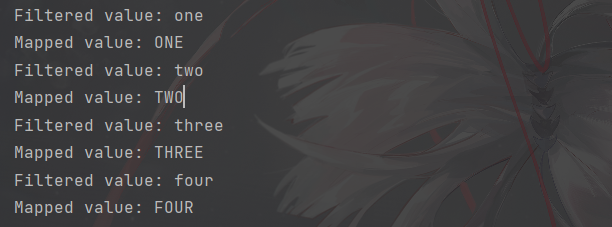

```
从输出结果可以看到，流内元素，是一个一个通过整个pipeline的。

也就是说，当一个元素，通过完整的pipeline以后，才会让第二个元素通过pipeline
```


#### 8.2.1.7 `forEach<Consume<? supper T>` 

`peek` 会返回流，可以进行后续操作，但`forEach`操作不会返回流，无法进行后续的流操作。


#### 8.2.1.8 `Collect(Collector)`


#### 8.2.1.9 `Stream.generate(Supplier<T>)`

用于生成一个Long最大值长度的无序的流。


实例：

```java
    @Test
    public void test2(){
        Stream.generate(Math::random)
                .limit(100)
                .forEach(System.out::println);
        //通过Math::random生成一个无限长的随机流，元素是Double类型
        //limit截取前100个元素
        //输出
    }
```

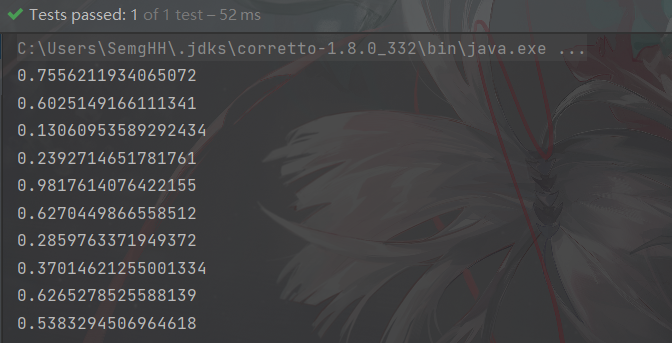


#### 8.2.1.10 `skip(long)`


#### 8.2.1.11 `Stream.concat(Stream,Stream)`

用于链接2个流。


```java
@Test
public void concatTest(){
    IntStream stream1 = IntStream.range(0, 100);
    IntStream stream2 = IntStream.range(100, 200);
    IntStream.concat(stream1,stream2).forEach(System.out::println);

}
```


#### 8.2.1.12 `skip(long)`

跳过前 n个元素。


#### 8.2.1.13 `reduce(T,BinaryOperator)`

`reduce operation` 消耗操作。 

可以传入一个初始值 `identity` ，传入一个`BinaryOperator`二元操作函数(形参2个T泛型，返回值仍是T)

reduce操作返回一个 `T`


实例：

```java
    @Test
    public void reduceTest(){
		//0-100的和
        int reduce = IntStream.range(0, 101).reduce(0, Integer::sum);
        System.out.println(reduce);

    }
```

​	


#### 8.2.1.14 `max/min/findFirst/findAny`


`max` 返回流内最大的元素，返回值使用 `Optional<T>` 作为容器，如果流为空，则返回空容器。

`min` 返回流内最小元素，返回值使用 `Optional<T>`


`findFirst()`  返回第一个元素。 `findAny()` 返回任意一个元素。

```

```


#### 8.2.1.15 `anyMatch(Predicate)/allMatch/noneMatch`

匹配一个断言。


## 8.3 Collector<T,A,R>

收集器，在`java.util.stream` 包下。 


```
是一个 reduction Operation(消耗操作) ，会减少流内元素的可变操作。  用于将流内元素收集到一个容器中。


Reduction Operation 操作可以按顺序执行。或者在并行流中执行。
```


```

<T> – the type of input elements to the reduction operation
<A> – the mutable accumulation type of the reduction operation (often hidden as an implementation detail) 
<R> – the result type of the reduction operation
```


这个接口包含3个泛型：

`<T>` 输入收集器内的参数类型。

`<A>` 消耗操作的可变积累类型，通常会延迟到子类实现

`R`  Reduction 操作后返回值的数据类型。


### 8.3.1 Characteristics 特征

特征枚举 是 `Collector`的内部类。

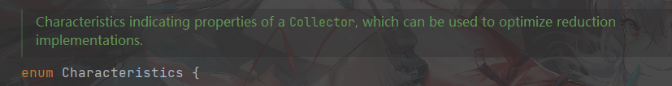

```
特征是Collector的一个属性。用于优化 Reduction Operation
```


3个枚举值：

```
#指示此收集器是并发的，这意味着结果容器可以从多个线程中收集流内元素。
CONCURRENT

#指示收集操作不会保留输入元素的顺序。(如果结果容器没有内在顺序，比如Set，这可能是正确的。)
UNORDERED

#表示结束函数是恒等函数，可以省略。如果设置了，则从A到R的未检查强制转换必须成功。
IDENTITY_FINISH
```


### 8.3.2 接口方法


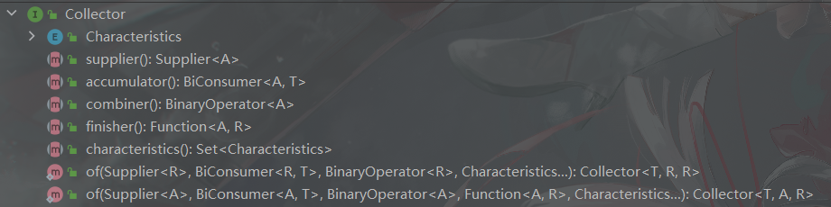


### 8.3.3 工具类 Collectors

Collector接口的核心工具类 `Collectors` ，提供了非常多的常用Collector实现。


#### 8.3.3.1 `toList()/Set()`

返回一个用于收集 `List`/ `Set` /`Map`的 Collector对象。


```java
    @Test
    public void operation(){

        Stream<Integer> stream = Stream.of(1, 2, 3, 4, 5, 6, 7, 8, 9);


        List<Integer> list = stream.filter(x -> x % 2 == 0)
                .collect(Collectors.toList());

        Set<Integer> set = stream.filter(x -> x % 3 == 0)
                .collect(Collectors.toSet());

    }
```


#### 8.3.3.2 `toMap(Function,Function)`

传入两个Function, 一个用于返回key，一个用于返回value。 两个Function的入参都是同一个流元素。


```java
    @Test
    public void toMap(){

        Stream<Integer> stream = Stream.of(1, 2, 3, 4, 5, 6);

	
        Map<Integer, Integer> collect = stream.collect(Collectors.toMap(x -> x, x -> x + 1));

        System.out.println(collect);

    }
```

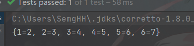


#### 8.3.3.3 `toMap(Function,Function,BinaryFunction)`


和 `toMap(Function,Function)`的区别是，当有多个元素落入一个桶中时，使用BinaryFunction进行合并。

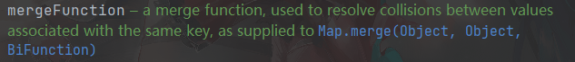

```
一个合并function。 当两个value拥有同一个key的时候。
```


实例：

```java
        Stream<Integer> stream = Stream.of(1, 2, 3, 4, 5, 6,1);
        


        Map<Integer, Integer> map1 = stream.collect(Collectors.toMap(key -> key, value -> value, (v1, v2) -> {
            System.out.println("重复的值");
            System.out.println(v1);
            System.out.println(v2);
            return v1 + v2;
        }));


        System.out.println(map1);
```


#### 8.3.3.4 `toMap(Function,Function,BinaryFunction,Supplier)`

比 [toMap(Function,Function,BinaryFunction)](# 8.3.3.3 `toMap(Function,Function,BinaryFunction)`) 多了一个 Supplier， 提供基础的Map容器


#### 8.3.3.5 `toCollection(Supplier)`

可以将流内元素收集到任意一个`Collection`中 。方法的形参`Supplier<? extends Collection<T>> collectionFactory` 提供一个Collection容器。


```
Stream<Integer> stream = Stream.of(1, 2, 3, 4, 5, 6);

LinkedList<Integer> collect = 
        stream.collect(Collectors.toCollection(LinkedList::new));
```


#### 8.3.3.6 `Collectors.joining()`

用于将 `CharSequence` 按顺序合成一个`String`的收集器。


```java
@Test
public void collect1() {

    List<String> list = Arrays.asList("1", "b", "c", "a");

    String join = list.stream().collect(Collectors.joining());

    System.out.println(join);
}
```


JDK的 `CharSequence`实现类

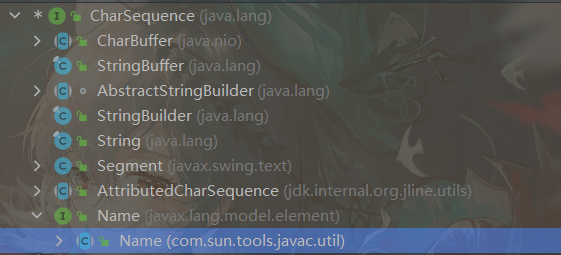


#### 8.3.3.7 `joining(CharSequence,CharSequence,CharSequence)`

`joining`重载方法，分别是分隔符，前缀，后缀。


#### 8.3.3.8 `groupingBy()`族

将流内元素分类分组。


##### 8.3.3.8.1 `groupingBy(Function)`

`groupingBy(Function<? super T, ? extends K> classifier)` 返回分组的类型为 `Map<K, List<T>>`

传入一个`Function` ，用于遍历所有流内元素，并给出每个元素对应的 `Key`


示例：

```java

    @Test
    public void collect2(){

        Student s1 = new Student(1L, 1L);
        Student s2 = new Student(2L, 1L);
        Student s3 = new Student(3L, 2L);
        Student s4 = new Student(4L, 2L);
        Student s5 = new Student(5L, 1L);
        Student s6 = new Student(6L, 2L);
        Map<Long, List<Student>> collect = Stream.of(s1, s2, s3, s4, s5, s6)
                .peek(System.out::println)
                .collect(Collectors.groupingBy(Student::getClassId));

        System.out.println(collect);
    }

    @Data
    @Builder
    @Accessors(chain = true)
    public static class Student{

        private Long stuId;

        private Long classId;

    }
```


##### 8.3.3.8.2 `groupingBy()`


# 9. java.util包


## 9.1 Optional

在工程中，我们总是需要优雅的处理 `null`值。 在合作工程中，可能较多的场景下都是调用其他人的接口。

此时我们并不是接口的作者，并不知道其内部实现方式。

对于一些可能返回 `null`的方法函数，最好使用`Optional`包装，这样能够避免在Runtime时的 空指针异常。

在编码时也无需考使用 `ObjectUtils.isNotNull`等方法判断。


Optional.java 

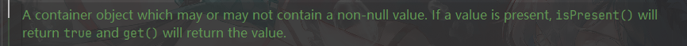


```
用于表示一个Object对象的容器。 这个容器内可能存的是一个null，如果容器内非null,则 isPresent()方法将返回true. get()放入发将返回value
```


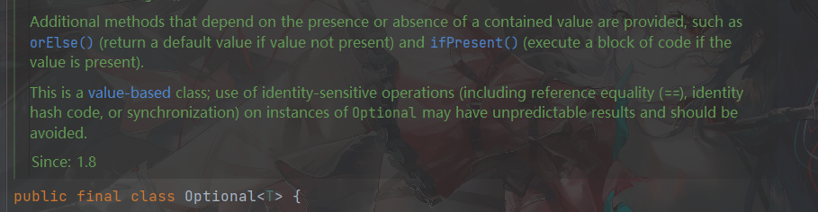


### 9.1.1 接口方法


#### 9.1.1.1 `Optional.of(T)`

Optional类的无参构造方法是私有的。 通过类方法 `Optional.of(T)` 来构造一个 Optional对象。


```java
    @Override
    public Optional<CropTypes> getById(Long id) {
        return Optional.of(cropTypesMapper.getById(id));
    }
```


`Optional.ofNullable(T)` 如果传入的value是null，则返回 `Optional.empty()`


#### 9.1.1.2 `get()`

`get`方法用于返回 `Optional` 中存放的结果。 如果value为空，将抛出一个 `运行时异常` 

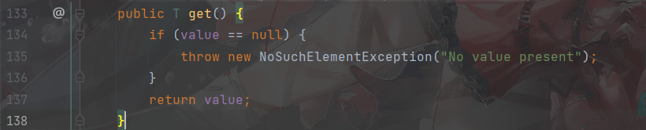


所以使用时，需要先使用 `Optional.isPresent()`判断是否存在。


#### 9.1.1.3 `ifPresent(Consumer<? supper T>)`

如果Optional存在值，则执行传入的`Consumer` 的行为。 否则不执行任何行为。


```java
    @Test
    public void optionalTest(){
        Optional<Long> optional = Optional.of(1L);
        
        optional.ifPresent(System.out::println);

    }
```


#### 9.1.1.4 `filter(Predicate)`

过滤`Optional`, 如果满足传入的`Predicate` 则返回原Optional，如果不满足，则返回`Optional.empty()`


```java
    @Test
    public void optionalTest(){


        Optional<Long> optional = Optional.of(1L);

        optional = optional.filter(x->x%2==0);

        System.out.println(optional.equals(Optional.empty()));
        //true


    }
```


#### 9.1.1.5 `orElse(T)`

核心方法之一。

类似于HashMap的`getOrDefault()` ，传入一个默认值，如果 Optional中的value为null，则返回传入的默认值。


```java
        Optional<Long> empty = Optional.empty();

        System.out.println(empty.orElse(5L));
```


#### 9.1.1.6 `orElseGet(Supplier<? extend T>)`

核心方法之一。

功能和 `orElse(T)` 一样。使用 `Supplier`来提供一个默认值。


#### 9.1.1.7 `orElseThrow(Supplier<? extends X> exceptionSupplier)`

如果`Optional`存在则返回，否则抛出一个异常。


#### 9.1.1.8 `map(Function)`

映射，转换为另一个数据类型的 `Optional` 传入一个 `Function`作为映射转换器


`U` 泛型无需标注在类中。而是在方法中声明。


```java
public<U> Optional<U> map(Function<? super T, ? extends U> mapper) {
    Objects.requireNonNull(mapper);
    if (!isPresent())
        return empty();
    else {
        return Optional.ofNullable(mapper.apply(value));
    }
}
```


## 9.2 StreamSupport

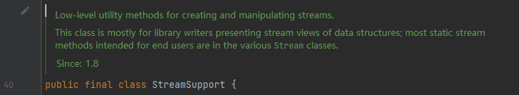


`StreamSupport`类简单封装了一些用于创建和组合`Stream`的方法。 


这个类主要是给 lib库的作者准备的。大多数关于`Stream`的静态构造方法都在 `Stream`和它的子类内。


### 9.2.1 类方法


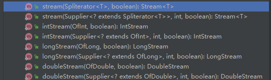


#### 9.2.1.1 `stream(Spliterator<T>,boolean)`

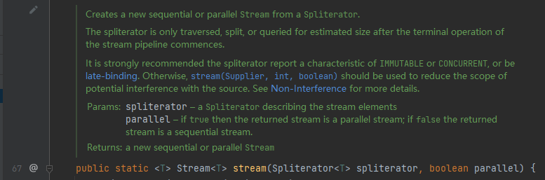


从一个 [Spliterator](# 9.3 Spliterator) 中创建一个有序的，或者并行流。

只有当`Stream pipeline` 执行了 终结操作(terminal operation) 以后， `Spliterator`才会遍历，切割，查询预估大小


## 9.3 `Spliterator<T>` 接口

`java.util.Spliterator`  这个接口表示可分割的，可遍历的。 这是一个复杂的接口。


 子类可以通过实现 `Spliterator` 接口实现分隔和  【行为遍历】（使用`Consumer`遍历元素）。


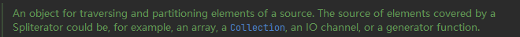

`Spliterator`是一个用于 【遍历】 和 【分割】元素源（elements of a source）的对象。`<T>`表示元素类型。

可以被`Spliterator` 接管的元素源例如：  Array , Collection ,IO Channel ,或者一个 构造方法。


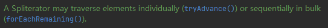


`Spliterator` 可以通过 `tryAdcance()`方法单独遍历一个元素，也可以通过 `forEachRemaining()` 有序遍历剩余整体。


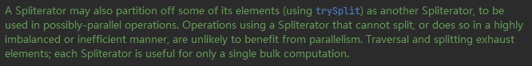


Spliterator 可能会被切割走一些元素（使用 `trySplit`）作为另一个 `Spliterator` ,这样做用于支持可能的并行流操作。

如果切割了高度不平衡的`Spliterator` ，或者是使用了低效的切割方式，那么可能不会从 并行操作中受益。


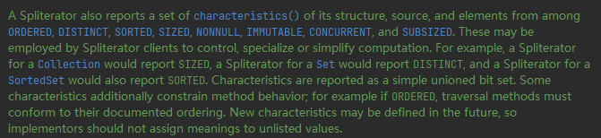


`Spliterator` 这个类可能具有一系列特征，通过调用 `characteristics()`方法可以返回这个 `Spliterator` 的特征 ，这有助于开发者使用。

新的特性可能会在未来加入。


特征具体有：  

```
ORDERED  :  有序的，例如  Spliterator for Collection
DISTINCT ： 去重的，例如 Spliterator for Set
SORTED ：  排序的 ， 例如 Spliterator for SortedSet
SIZED, 
NONNULL,
IMMUTABLE,
CONCURRENT, 
SUBSIZED.
```


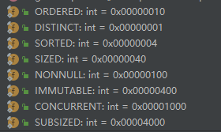


### 9.3.1 接口方法


#### 9.3.1.1 `tryAdvacne(Consumer)`

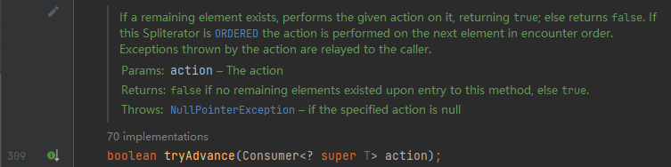


方法返回一个boolean值 ， 如果存在一个剩余元素，则调用传入的 `Consumer` 同时返回`true`，否则`false`。

如果`Spliterator` 是有序的，那么这个方法则会consumer下一个元素。


#### 9.3.1.2 `forEachRemaining(Consumer)`

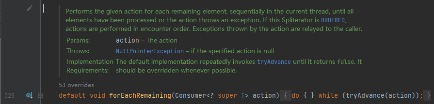


将剩余所有的元素都通过 `Consumer<? extend T>` 行为遍历。


#### 9.3.1.3 `trySplit()`

核心方法。

​											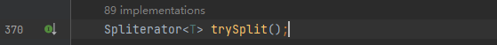`


如果当前的 `Spliterator`可以被切割。调用`trySplit()`方法返回一个 `Spliterator<T>` 这个`Spliterator`包含了剩余元素。当这个方法调用完毕后，原`Spliterator`不再包含元素。


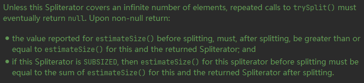


除非当前`Spliterator` 包含了无限数量的元素，否则多次调用 `trySplit()`方法必须返回null。


`trySplit()`方法有多种原因返回 null, 包括  元素已经为"空"， 遍历以后就无法切割，数据结构约束 和 效率考虑因素。


#### 9.3.1.4 `estimateSize()`

期望大小。返回 `long`

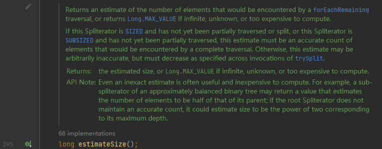

返回如果`Spliterator`调用 `forEachRemaining`后，将要遍历元素的个数。返回值为 `Long.MAX_VALUE`  表示【无限大】【未知情况】【操作过于昂贵】


如果`Spliterator`是 `SIZED`(有限的) /`SUBSIZED`，同时从未被部分遍历或切割, 那么 `estimateSize()`的大小必须是完整遍历元素的个数。

除此以外，`estimateSize()`返回值可能是任意不准确的，但必须在调用`trySplit`时按照指定的方式减少。


### 9.3.2 接口常量-特性


## 9.4 Map接口


### 9.4.1 `NavigableMap<K,V>`接口

 可导航映射首先是一个 `SortedMap`排序映射，其次调用 【导航方法】返回一个最接近的结果

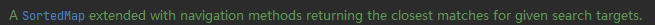


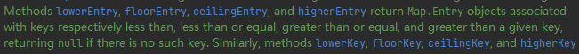


`lowerEntry()` 


# 9. java.lang包


## 9.1 `AutoCloseable` 接口 

自动关闭接口。用于自动关闭释放资源的接口。可以使用 `try-with-resources` 语法结构。


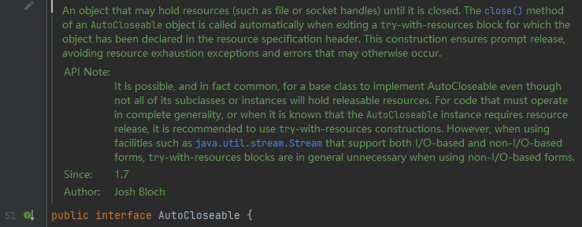


一个对象在其关闭前，可能持有某些资源(例如`file`，或者`socket`)。`AutoClosed`对象在`try-with-resources`结构中自动阻塞调用`close()`方法。


`AutoCloseable`接口只有一个方法：`close()`


### 9.1.1 接口方法

`close()`

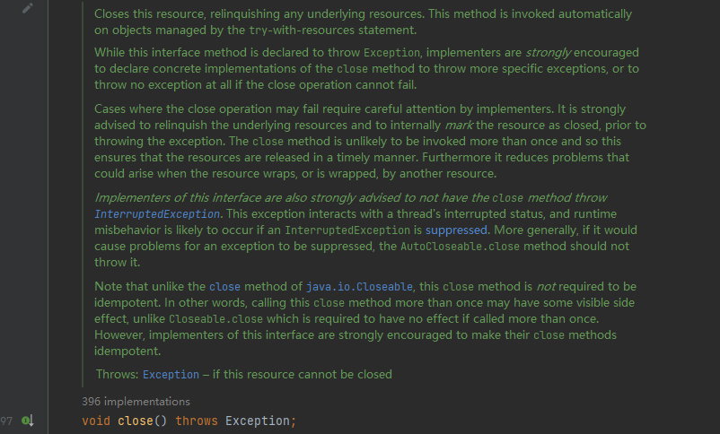


## 9.2 `ProcessBuilder`

`ProcessBuilder` 用于创建操作 【进程程序】。

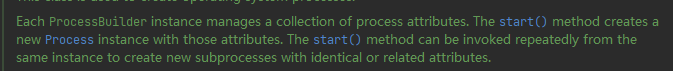


每一个`ProcessBuilder`实例对象都可以管理一些【进程属性】集合。 `start()` 方法创建一个拥有【`ProcessBuilder`管理的属性】的新进程。

`start()`方法可以重复调用，并且会一直创建【新的】，【相同属性的】子进程。


每一个 `ProcessBuilder` 包含的属性如下：

-  `command` 命令。

-   运行环境 ：是系统依赖的key-value ， 初始值是  `System.getenv()`的拷贝。

  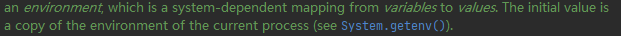

- 一个工作文件夹。  默认是当前进程的工作目录。
- 一个标准的输入源。


## 9.3 `Process`抽象类

进程类。 可以用于执行`command`。  

`Process`类提供了原生进程的控制手段(例如销毁`destory()`, `pid()` 等  )，通常由`ProcessBuilder.start()` / `Runtime.exec()`方法执行并返回一个`Process`对象。


`Process`类还提供了【进程】的输入输出流，阻塞方法`waitFor()` ， 进程退出后返回的状态码。


`Process`是一个抽象类，实现类： `ProcessImpl` 。


### 9.3.1 类方法


#### 9.3.1.1 `getOutputStream()`

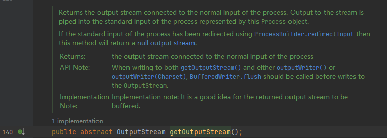

获得一个【输出流】, 作为进程的默认输出。  如果`Processd`的标准输入，已经被重定向到`ProcessBuilder.redirectInput`中，那么本方法返回`null`


#### 9.3.1.2 `getInputStream()`


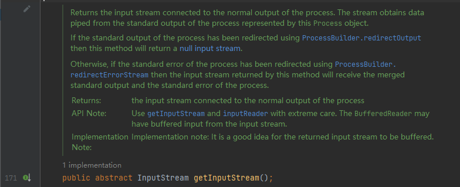


返回一个 `InputStream` 连接到 `Process`的标准输出。


#### 9.3.1.3 `waitFor()`

阻塞方法，等到`Process`结束， 并返回结束码。

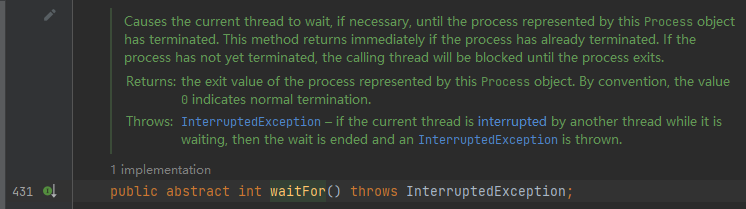


#### 9.3.1.4 `destory()`

杀死进程。

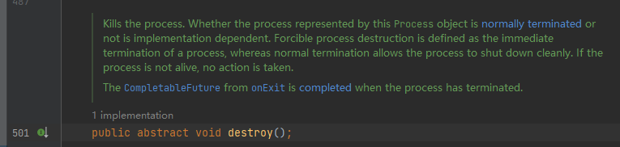


#### 9.3.1.5 `destroyForcibly()`

强制 `kill` 进程。


### 9.3.2 执行`command`


在`windows`下执行`command`。

`windows command`  参考地址：

https://learn.microsoft.com/zh-cn/windows-server/administration/windows-commands/windows-commands

```java
public class ProcessBuilderTest {

    public static void main(String[] args) throws Exception{


        ProcessBuilder builder = new ProcessBuilder();

        builder.command("cmd.exe", "/c", "chdir");

        Process start = builder.start();

        try (
                BufferedReader reader = new BufferedReader(new InputStreamReader(start.getInputStream()))){

            String line;

            while ((line = reader.readLine())!=null){
                System.out.println(line);
            }
        }
        int i = start.waitFor();

        System.out.println(i);


    }

}
```


输出结果：

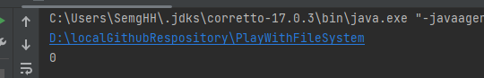


## 9.4 `System` 类

`System`类包含了一些有用的 【类字段】 和【类方法】。  `System`类不可以被实例化，同时包含了【标准输出流】 , 【标准输入流】 ， 【异常输出流】（error output stream）。

同时提供了访问  扩展定义的`properties` 以及 环境变量的手段(`getenv()`)。  加载文件和 lib库的手段。

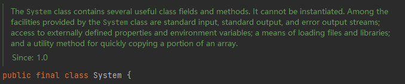


### 9.4.1 类方法


#### 9.4.1.1 setIn族

重新分配 标准`input`流，标准 `output`流 ，和 标准`Err output`流。


##### `setIn(InputStream)`

重新分配`input`流。

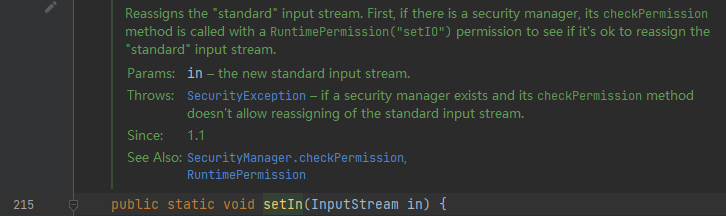


##### `setOut(PrintStream)`


##### `setErr(PrintStream)`


#### 9.4.1.2 `console()`

如果当前的`JVM`虚拟机拥有一个控制台(取决于虚拟机的具体实现)的话，返回一个[Console](# 10.1 `Console` 类)类的对象，表示对应的控制台。

```
Console对象包含了访问控制台的方法。
```


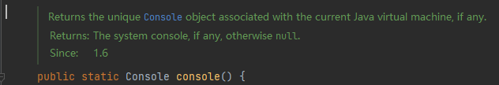


#### 9.4.1.3 `getenv()/getProperties`

获得 操作系统的`环境变量`。   以及当前系统的参数信息`Properties`


`getenv()`的具体内容和操作系统相关。

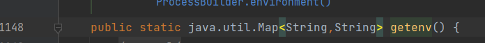

返回一个`Map<String,String>`


`getProperties()` 系统的参数信息如下：

| key               | value                                                        |
| ----------------- | ------------------------------------------------------------ |
| java.version      | Java运行时环境版本，等价于 `Runtime.Version`                 |
| java.version.date | Java Runtime Environment version date, in ISO-8601 YYYY-MM-DD format, which may be interpreted as a java.time.LocalDate |
| java.vendor       | 运行时版本的提供商。                                         |
| java.vendor.url   | 提供商URL                                                    |
| java.home         | Java的安装目录                                               |
| java.class.path   | 类路径                                                       |
| java.library.path | 加载lib库的路径                                              |
| java.compiler     | JIT编译器的名称                                              |
| os.name           | 操作系统的名称                                               |
| file.separator    | 文件分割符。 例如在Unix中为`/`                               |
| path.separator    | 路径分隔符。 例如在Unix中为`:`                               |
| line.separator    | 行分隔符。Line separator ("\n" on UNIX)                      |
| user.dir          | 当前的工作路径                                               |
| user.name         | 用户名称                                                     |
| user.home         | 用户`home`文件夹路径                                         |
| native.encoding   | 主机环境使用的字符编码集的名称。                             |
|                   |                                                              |
|                   |                                                              |
|                   |                                                              |
|                   |                                                              |
|                   |                                                              |
|                   |                                                              |
|                   |                                                              |
|                   |                                                              |
|                   |                                                              |
|                   |                                                              |
|                   |                                                              |
|                   |                                                              |
|                   |                                                              |


#### 9.4.1.4 `currentTimeMillis()`

返回一个表示毫秒的`long`类型，

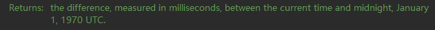


## 9.5 `Runtime` 类

每一个 `Java` 引用都有一个单独的`Runtime`实例对象。 `Runtime`代表应用运行的环境接口。通过`Runtime.getRuntime()`获得当前应用的运行时上下文。


`Runtime`可以控制`app`退出，执行一个`command`，调用`gc`, 添加一个`ShutdownHook`，加载一个`file` ,查看系统可用核心数，查看虚拟机内存状态等。


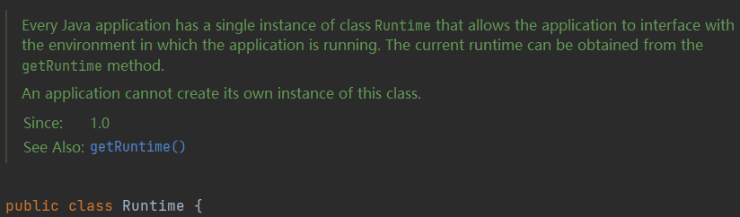


### 9.5.1 类方法


#### 9.5.1.1 `getRuntime`

`public static`方法，返回当前应用的`Runtime`对象。

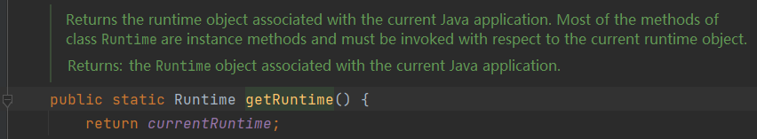


#### 9.5.1.2 `addShutdownHook(Thread)`

给虚拟机注册一个`shutdown`时的钩子。

`JVM`有2中原因会 `shutdown`：

1. 程序正常结束退出。当应用最后一个非守护进程退出以后，`Runtime.exit()`方法就被调用了。
2. `JVM`被用户中断，例如 `^c` 或者由于`OS操作系统`的原因，例如(操作系统`shutdown`)


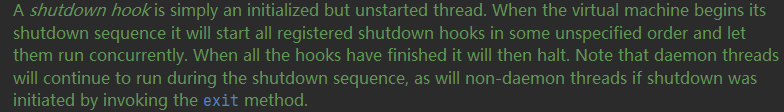

所谓`shutdownHook`就是已经初始化完成，但没有`start()`的线程。当虚拟机`shutdown`以后，会有序的开始全部注册的`hook`。

但是注意，他们是【并发运行】的。并且在执行`shutDownHook`时，应用的守护进程仍在运行。


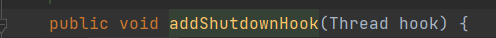


#### 9.5.1.3 `removeShutdownHook()`


#### 9.5.1.4 `exit(int)`

退出当前运行的`JVM`，同时以指定状态代码作为返回。 以一个`非0`值表示异常结束状态。

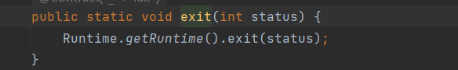


以`exit()`方式结束`JVM`会触发`shutdownHook()`，而`halt()`强制结束`JVM`，不会执行`shutdownHook`。


#### 9.5.1.5 `halt(int)`

强制`JVM`停止。


以`exit()`方式结束`JVM`会触发`shutdownHook()`，而`halt()`强制结束`JVM`，不会执行`shutdownHook`。


#### 9.5.1.6 `gc()`

通知`JVM` 执行`gc`命令


#### 9.5.1.7 `availableProcessors()`

返回`JVM`可用核心数。


#### 9.5.1.8 Memory族

`freeMemory()` 返回当前虚拟机中可用内存

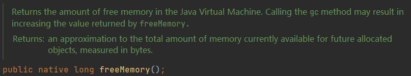


`totalMemory()`返回虚拟机内存总数，返回的是一个 `snapshot`值


`maxMemory()`

返回虚拟机可以尝试使用的最大内存值。

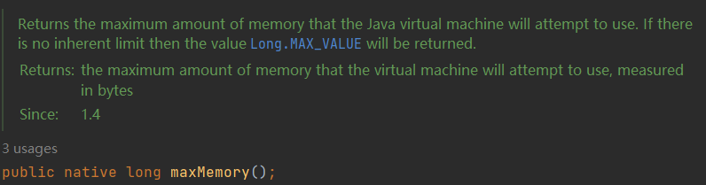


## 9.6 `Module` 类

`jdk 9 `以后加入`Module`类，用于表示一个 运行时的模块。可以是 【已命名模块】，也可以是【未命名模块】。


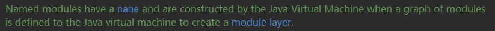


命名模块拥有一个名字，被`JVM`构建，用于创建[ModuleLayer](# )。

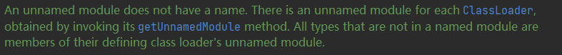

未命名模块没有名字。每一个`ClasLoader`都有未命名模块。通过调用`ClassLoader.getUnnameModule()`获得对应的未命名模块。

所有未命名模块，都属于它们`ClassLoader`的未命名模块成员。


可以通过`Class.getModule()`返回这个类或接口 所属的`Module`。


### 9.6.1 类方法

#### 9.6.1.1 `isModule`


# 10. java.io

主要介绍 `java.io`包下的类。


## 10.1 `Console` 类


`Console` 类包含了基于【字符控制控制台】的访问方法， 这个控制台是与`JVM`强相关的 。

因为一个`JVM`是否拥有控制台，取决于底层平台，也取决于虚拟机的调用方式。


```
 即： Console类对象就是用于访问虚拟机控制台的。
```


### 10.1.1  类方法


#### 10.1.1.1 `writer()`

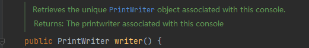


重新得到一个唯一的， 和控制台关联的`PrintWriter`对象。


#### 10.1.1.2 `reader()`

返回一个`Reader`类对象，关联到`JVM`的控制台。

主要用于精密的`application`控制，例如：

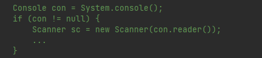


如果不是精密的控制，可以使用 `Console.readLine()`方法。


#### 10.1.1.3 `readLine()`

从`console`中简单读取一行。

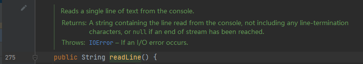


#### 10.1.1.4 `charset()`

返回`JVM`控制台使用的字符集。


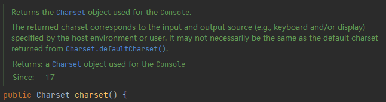


#### 10.1.1.5 `flush()`

刷新控制台，并强制任何的缓存输出流立即写。

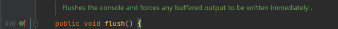


## 10.2 PrintWriter 


## 10.3  `Writer` 接口


# 11. java.net


## 11.1 `HttpClient`类

`jdk 9 `以后，发送一个`http`请求，已经在 jdk中标准化， 使用 `java.net.http.HttpClient`类来创建一个`http`客户端。


`HttpClient`可以用来发送一个`http/1.1` 或者 `http/2`请求。 `HttpClient`包含了一个 `Builder`


### 11.1.1  内部类


#### 11.1.1.1`HttpClient.Builder`

从jdk11 开始，`HttpClient.Builder` 是 `HttpClient`的内部类，用于构造一个`HttpClient`

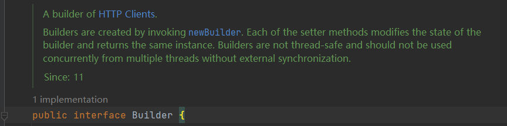

通过`Http.newBuilder()`方法创建一个 `builder`对象，进而创建一个`HttpClient`。`Builder`不是一个线程安全的类。


##### Builder可以修改的内容


1. 设置一个[cookieHandler](# ) 

   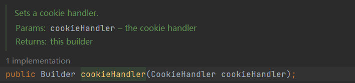


## 11.2 CookieHandler


## 11.3 HttpCookie

`java.net`包下。


一个`HttpCookie`对象代表了一个`Http cookie` ,`cookie` 携带了 服务器和用户的端的状态信息 , `Cookie` 在有状态会话中被广泛接受。


`HttpCookie` 有3种规则：

1. Netscape draft 
2. RFC 2109 - http://www.ietf.org/rfc/rfc2109.txt 
3. RFC 2965 - http://www.ietf.org/rfc/rfc2965.txt


java 中的 `HttpClient` 支持上述3种的所有规则。


### 11.3.1 类方法


#### 11.3.1.1 构造器

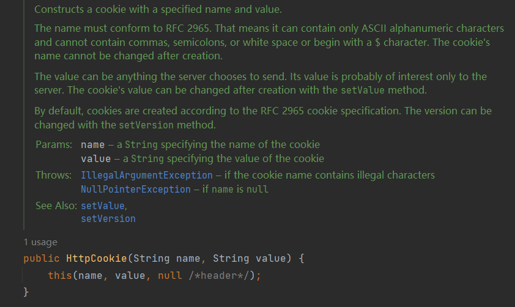

以`name`和`value` 构造一个`HttpCookie`。 其中`name`必须遵守 RFC 2965规范。这意味着它只能包含ASCII字母数字字符，不能包含逗号、分号、空格或以$字符开头。cookie的名称在创建后不能更改。

`value`可以是服务器设置的任意类型的值，`value`值可能只有服务器感兴趣，后续可以通过 `setValue()`改变Cookie的值 。


#### 11.3.1.2 静态方法


##### 11.3.1.2.1  `parse(String)`

将一`set-cookie字符串` 或者 `set-cookie2字符串`   解析成`List<HttpCookie>` 。


##### 11.3.1.2.2 `domainMatches()`

一个工具类方法，传入 `domain` 和 `host` ，返回`boolean` 表示 `host`是否在`domain`内。


### 11.3.2 实例方法


#### 11.3.2.2 `hasExpired`

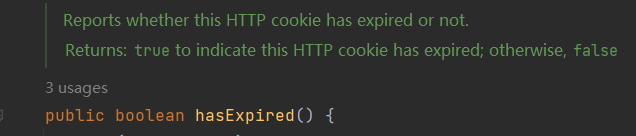

返回`HttpCookie`是否过期。


#### 11.3.2.3 `setComment()/getComment()`

给`HttpClient`设置一个备注，用于描述`cookie`的用途。

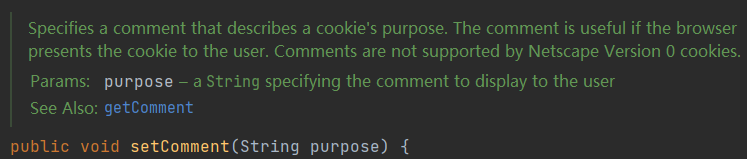

如果浏览器将`cookie`呈现给用户，那么它将十分有用。


#### 11.3.2.4 `setCommentURL()/getCommentURL()`

声明一个`URL`地址，用于描述`cookie`的用处。

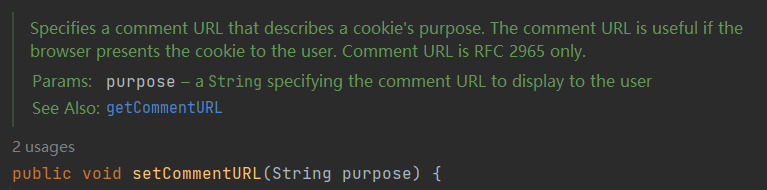

`comment URL`仅仅只用于 `RFC 2965`规则。 


#### 11.3.2.5 `setDiscard()/getDiscard()`

设置用户代理客户端 (browers) 是否应该无条件丢弃本`cookie`。

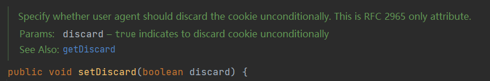


#### 11.3.2.6 `setPortlist(string)`

设置`cookie`的端口列表(ports list)，表示这个`cookie`只能严格的开放给对应端口。

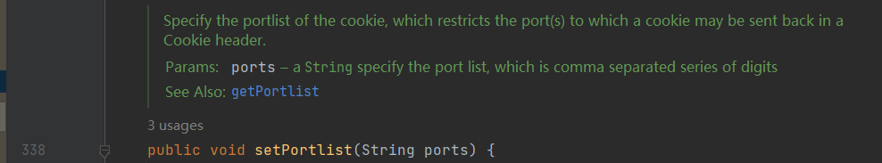


`ports list`是以`,`分隔的数字序列。


#### 11.3.2.7 `setDomain()`

非常重要的方法。用于设置可以使用本`cookie`的域。

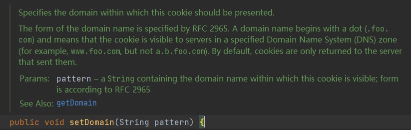

`domain name`的格式被定义在`RFC 2965`规范中。 一个`domain name`以`.`开头（例如 `.foo.com`）


#### 11.3.2.8 `setMaxAge(long)/getMaxAge()`

设置`cookie`最大的存活年龄，单位秒。

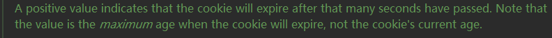


正数值表示`cookie`经过对应的秒数后过期。 这个值表示`cookie`的最大年龄，而不是当前年龄。


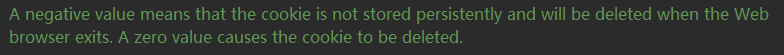

负数值意味着`cookie`不会持久存储，当浏览器退出后就被移除。`0`值将会导致`cookie`被删除。


` getMaxAge()` 返回`cookie`的最大存活时间，`-1`表示不会持久化。


#### 11.3.2.9 `setPath(String uri)`

设置 客户端应该返回 `cookie`的URL。


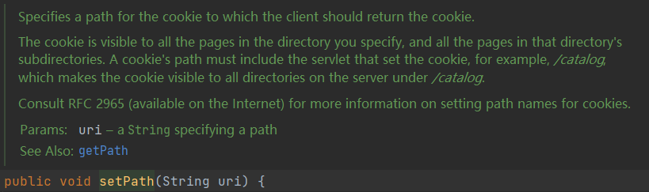


`cookie`对程序员定义的文件夹及其子文件夹是透明的。


#### 11.3.2.10 `setSecure(boolean)/getSecure()`

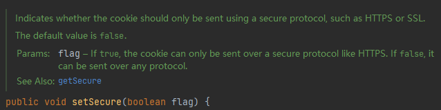


用于决定`cookie`是否应该只在安全协议（例如 `HTTPS` `SSL`）中传输 


#### 11.3.2.11 `getName()/setValue()/getValue()`

返回`cookie`的`name` `value`


## 11.4  `HttpRequest` 类
