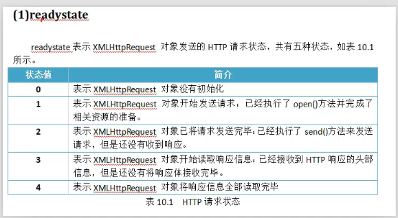
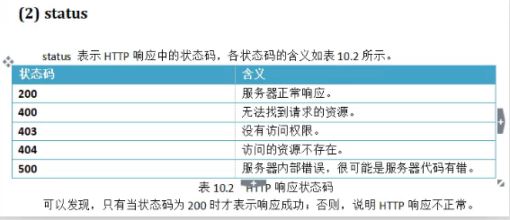

 # 

### Number转换为字符串的时候有**默认模式**和**基模式**两种

```javascript
<script>
  var a=10;
  document.write('默认模式下，数字10转换为十进制的'+a.toString()); //默认模式，即十进制
  document.write("<br>");
 
  document.write('基模式下，数字10转换为二进制的'+a.toString(2)); //基模式，二进制
  document.write("<br>");
   
  document.write('基模式下，数字10转换为八进制的'+a.toString(8)); //基模式，八进制
  document.write("<br>");
 
  document.write('基模式下，数字10转换为十六进制的'+a.toString(16)); //基模式，十六进制
  document.write("<br>");
 
</script>

//输出结果：
/*
默认模式下，数字10转换为十进制的10
基模式下，数字10转换为二进制的1010
基模式下，数字10转换为八进制的12
基模式下，数字10转换为十六进制的a
*/
```

###  var 具有动态类型，是伪对象，含有方法和属性。比如

```javascript
var x = 10;
document.write(x.toString());
```

JavaScript分别提供内置函数 parseInt()和parseFloat()，转换为数字

**注：**如果被转换的字符串，同时由数字和字符构成，那么parseInt会一直定位数字，直到出现非字符。 所以"10abc" 会被转换为 10


```javascript
<script>
  document.write("字符串的\"10\"转换为数字的:"+parseInt("10")); //转换整数
  document.write("<br>");
  document.write("字符串的\"3.14\"转换为数字的:"+parseFloat("3.14"));//转换浮点数
  document.write("<br>");
  document.write("字符串的\"10abc\"转换为数字的:"+parseInt("10abc")); //判断每一位，直到发现不是数字的那一位
  document.write("<br>");
 
  document.write("字符串的\"hello javascript\"转换为数字的:"+parseInt("hello javascript")); //如果完全不包含数字，则返回NaN - Not a Number
  document.write("<br>");
 
</script>

/*
字符串的"10"转换为数字的:10
字符串的"3.14"转换为数字的:3.14
字符串的"10abc"转换为数字的:10
字符串的"hello javascript"转换为数字的:NaN
*/
```


### 内置函数Boolean() 

转换为Boolean值
当转换字符串时：
**非空即为true**
当转换数字时：
**非0即为true**
当转换对象时：
**非null即为true**

```javascript
<script>
  document.write("空字符串''转换为布尔后的值:"+Boolean(""));  //false
  document.write("<br>");
  document.write("非空字符'hello javascript '串转换为布尔后的值:"+Boolean("hello javascript"));  //true
  document.write("<br>");
  document.write("数字 0 转换为布尔后的值:"+Boolean(0));  //false
  document.write("<br>");
  document.write("数字 3.14 转换为布尔后的值:"+Boolean(3.14)); //true
  document.write("<br>");
  document.write("空对象 null 转换为布尔后的值:"+Boolean(null));  // false
  document.write("<br>");
  document.write("非空对象 new Object() 转换为布尔后的值:"+Boolean(new Object()));  // true
  document.write("<br>");
 
</script>

```


### Number()和parseInt()一样，都可以用来进行数字的转换

区别在于，当转换的**内容包含非数字**的时候，Number() 会返回NaN(Not a Number)
parseInt() 要看情况，如果以数字开头，就会返回开头的合法数字部分，如果以非数字开头，则返回NaN


```javascript
<script>
function p(s){
  document.write(s);
  document.write("<br>");
}
 
var a = new Number("123");
 
p("数字对象123通过toFixed(2) 保留两位小数:"+a.toFixed(2)); //保留两位小数点
 
var b = new Number("3.1415926");
 
p("PI 通过toFixed(3) 保留三位小数:"+b.toFixed(3));//保留三位小数点
 
</script>
```


# BOM

即 浏览器对象模型(Browser Object Model)

浏览器对象包括：

Window(窗口)
Navigator(浏览器)
Screen (客户端屏幕)
History(访问历史)
Location(浏览器地址)


# DOM

在 HTML DOM （文档对象模型）中，每个部分都是节点：

- 文档本身是文档节点
- 所有 HTML 元素是元素节点
- 所有 HTML 属性是属性节点
- HTML 元素内的文本是文本节点
- 注释是注释节点

# 4.Ajax

## 4.1 什么是 ajax

Ajax即**A**synchronous **J**avascript **A**nd **X**ML（异步JavaScript和[XML](https://baike.baidu.com/item/XML/86251)）

用来描述一种使用现有技术集合的‘新’方法，包括: [HTML](https://baike.baidu.com/item/HTML/97049) 或 [XHTML](https://baike.baidu.com/item/XHTML/316621), CSS, [JavaScript](https://baike.baidu.com/item/JavaScript/321142), [DOM](https://baike.baidu.com/item/DOM/50288), XML, [XSLT](https://baike.baidu.com/item/XSLT/1330564), 以及最重要的[XMLHttpRequest](https://baike.baidu.com/item/XMLHttpRequest/6788735)。 

## 4.2 ajax 能做什么

使用Ajax技术网页应用能够快速地将**增量更新**呈现在[用户界面](https://baike.baidu.com/item/用户界面/6582461)上，而不需要**重载（刷新）整个页面**，这使得程序能够更快地回应用户的操作。 

## 4.3 用ajax

### 4.3.1 XMLHttpRequest 

使用 XMLHttpRequest 访问后端接口。

### 4.3.2  成员方法

核心方法 ： 

`open()`

```javascript
open(method: string, url: string): void;
open(method: string, url: string, async: boolean, username?: string | null, password?: string | null)  : void;
```

```java
/**
     * Sets the request method, request URL, and synchronous flag.
     * 
     * Throws a "SyntaxError" DOMException if either method is not a valid HTTP method or url cannot be parsed.
     * 
     * Throws a "SecurityError" DOMException if method is a case-insensitive match for `CONNECT`, `TRACE`, or `TRACK`.
     * 
     * Throws an "InvalidAccessError" DOMException if async is false, current global object is a Window object, and the timeout attribute is not zero or the responseType attribute is not the empty string.
     */

设置一个 请求方法。请求的URL地址。以及标记是否异步


```


`send()`

```js
send(body?: Document | BodyInit | null): void;
```

```java
/**
 * Initiates the request. The body argument provides the request body, if any, and is ignored if the request method is GET or HEAD.
 * 
 * Throws an "InvalidStateError" DOMException if either state is not opened or the send() flag is set.
 */

初始化请求。 参数body 提供了请求体。如果是GET或HEAD请求，将会忽略复数的请求体。
    
```

如果是Get方法

`send(null)`

如果是Post方法

`send（String body）//要以键值对的形式传入参数；`

实例：

```javascript
//Post情况下
<script type="text/javascript">
    showMsg = document.getElementById("showMessage")
    function post(){
        const mobile =document.getElementById("input1").value
        xmlHttpRequest = new XMLHttpRequest();
        xmlHttpRequest.onreadystatechange= callback;
        xmlHttpRequest.open("post","mobile",true);
        xmlHttpRequest.setRequestHeader("Content-Type","application/x-www-form-urlencoded");
        xmlHttpRequest.send("mobile="+mobile)

    }
    //回调函数。用于接受服务端的返回值
    function callback(){
        if(xmlHttpRequest.readyState==4 && xmlHttpRequest.status==200){
            const data =xmlHttpRequest.responseText;
            if (data=="true"){
                alert("此号码已存在，请更换")
                showMsg.value="true"

            }
            else{
                alert("可以注册")
                showMsg.value="false"
            }
        }
    }
</script>
```

```js
//Get情况下
<script type="text/javascript">
    showMsg = document.getElementById("showMessage")
    function get(){
        const mobile=document.getElementById("input1").value
        xmlHttpRequest2=new XMLHttpRequest();
        xmlHttpRequest2.onreadystatechange=callbackGet;
        // 对于get请求,send()传入null，参数写在了URL中
        xmlHttpRequest2.open("get","mobile?mobile="+mobile,true);
        xmlHttpRequest2.send(null)
    }
    //接受服务端的返回值
    function callbackGet(){
        if (xmlHttpRequest2.status==200 && xmlHttpRequest2.readyState==4){
            const data=xmlHttpRequest2.responseText;
            if (data=="true"){
                alert("号码已存在");
                showMsg.value="true";
            }
            else {
                alert("可以注册")
                showMsg.value="false"
            }
        }
    }

</script>
```


`setRequestHeader(String key,String value) `     

如果是POST方法，需要用到这个方法；

```java
// 无上传文件
xmlHttpRequest.setRequestHeader("Content-Type","application/x-www-form-urlencoded");
//有上传文件
xmlHttpRequest.setRequestHeader("Content-Type","multipart/form-data");
```

### 4.3.3 对象属性

对象属性：


readyState ：请求状态



state： 响应状态码



responseText 

返回值是文本格式。String

responseXml

响应格式是Xml


onreadystatechange 

是一个方法的引用， 用来引用  回调函数  callback

```js
xmlHttpRequest.onreadystatechange= callback; //是函数的引用，所以不带（）
```


# 5. jQuery

https://www.w3school.com.cn/jquery/ajax_ajax.asp  W3School

## 5.1什么是 jQuery

jQuery 是一个 JavaScript 库。

jQuery 极大地简化了 JavaScript 编程。

jQuery 很容易学习。

## 5.2 引入jQuery库

先将jQuery引入 项目中。

在页面中，使用jQuery，同样需要引入

```
<script src="jquery-3.6.0.min.js"></script>
```

## 5.3 使用 jQuery 的 ajax


```js
<script>
    $.ajax{
        url:"",     # 你的后台接口地址
        type:"get",   # get/post
        success:function(result,testStatus){
            ...
        },
        error:function(xhr,msg,e){
            
        }
        
    }
    
    
    
</script>
```

## 5.4 选择器

一些常用的选择器

| syntax  | expression           |
| ------- | -------------------- |
| #id     | ID选择器             |
| *       | 所有元素             |
| .class  | 类选择器             |
| element | 标签选择器。选择所有 |


| syntax | instance | expression           |
| ------ | -------- | -------------------- |
| #<id>  | $("#a1") | ID选择器。选择id唯一 |
| *      | ￥       |                      |
|        |          |                      |

# 6. jQuery ajax里的一些实现

## 6.1 jQuery ajax 上传文件。

### 6.1.1 使用了 FormData 对象

```js
        const file = document.getElementById("file").files[0];
        const majorName = document.getElementById("majorName").value;
        const form = new FormData();
        form.append("file",file);
        form.append("majorName",majorName);
```


```java
public ReqResult upload(@RequestParam("file") MultipartFile file,@RequestParam("majorName")String majorName){
    
    ...
   
    ｝
```


最大的坑点在于  processData : false

默认情况下会将发送的数据序列化以适应默认的内容类型application/x-www-form-urlencoded

如果想发送不想转换的的信息的时候需要手动将其设置为false

在我遇到的是传输的是blob对象的时候就是不需要将传输的数据序列化,一般的还有类似DOM树等


```js
    function LoadingSubmit(){
        const file = document.getElementById("file").files[0];
        const majorName = document.getElementById("majorName").value;
        const form = new FormData();
        form.append("file",file);
        form.append("majorName",majorName);
        console.log(file);
        $.ajax({
            type: 'POST',
            url: '/upload',
            contentType: false,
            processData : false,   //一定要设置 processData 为false 
            data: form,
            success: function (result){
                document.getElementById("msg").innerText=result.msg;
            }

        })
    }
```

## 6.2 data 里传多个值


```js
	...
        $.ajax({
            type: 'POST',
            url: '/upload',
            data: {
                "a1" ：a1,
                "a2" ：a2,
                "a3" ：a3,
                ...
            },
            success: function (result){
                ...
            }

        })
	...
```


