面试题整理


# 1. Java SE

java、JDK相关的知识会在这里整理


java 三大特性？

```
封装
继承
多态
```


java特点？

```
封装、继承、多态。
跨平台性(借助于字节码文件、各平台的JVM 。实现一次前置编译，到处运行)
```


详细说说多态？

```
多态的定义是指同一个行为具有多个不同的表现形式。


我想从自己理解的角度说说多态:

多态和抽象是密不可分的。接口抽象出一种行为规范，例如comparable 任何compareable的实现类都具有 “可比较”的特性。通过不同的实现类不同的比较策略，达到不同的表现形式。

除此以外还有一些和多态相关的特性比如: 向上转型、向下转型。
多态还意味着一定意义上的封装、例如我们通常会把实现类向上转型为接口。此时实现类对象的静态类型就是接口，但运行方法时会根据动态类型找到具体的重写方法。通过这样的转换，屏蔽了实现类的内部细节，只需要关心接口本身的定义。
```


解释一下静态类型和动态类型？

```
由于向上转型的存在。一个实现类对象可以被静态的声明为它的实现接口。

在方法重载时如果将该对象作为参数，以该对象的静态类型作为判断。
在方法重写时如果将该对象作为参数，以该对象的动态类型作为判断。
```


为什么说Java语言编译并解释运行？

```
编译型语言，先编译后运行。不便于调试和运行，但编译后的文件可以直接运行,在编译后运行效率更高。
解释性语言，逐条解释逐条运行。便于程序的调试和运行。


JVM 既包含了解释器，也包含了编译器例如JIT即时编译器。当JVM发现了热点代码，则会使用JIT即时编译器将热点代码编译成和平台相关的机器语言缓存下来，加速程序运行。这也就是为什么Java代码性能在做测试时需要预热。
```


详细说说面向对象？

```
说一下自己对面向对象的理解:

描述面向对象不能孤立的看，要和面向过程对比。
面向过程解决问题的思路: 对大问题拆解，逐步化简为小问题，一步一步解决。核心思路是如何解决问题
面向对象解决问题的思路: 是描述一种场景,抽象出对象。解决的问题是对象的一种行为。
比如有一个问题“输出日志”
面向对象的思想是抽象出一个日志器,无论是“输出到控制台”、“输出到数据库”还是“输出到文件”都是这个对象的一种行为。当然如果这种行为有多种实现方式、那么可以进一步抽象成接口。

所以:
两种方式主要区别在于抽象描述世界的方式和角度不同。

不过可以从刚才的例子看到,面向对象在抽象解决问题时，提供了更易于组织、管理的结构。例如抽象类、接口。
所以面向对象更易于理解，维护，扩展。

```


queals 和 == 的区别？

```
equals是继承自Object.equals的方法。如果引用数据类型没有重写该方法，调用的就是Object.equals方法。
Object.equals默认使用==判断。
重写equals方法相当于改写了这个类判断相等的逻辑。
```


为什么重写了.equals，就要重写hashcode

```
重写HashCode主要是为了符合HashMap的思想。
HashMap的一个重要思想就是，同一个对象作为Key，前后对应的slot应该是同一个。

当两个对象，重写了equals方法，证明了两个对象一致。但在使用HashMap时，如果使用默认的hashcode则会发生取出的value不一致的情况。
```


hash冲突了怎么办？

```
JDK中的HashMap解决方案是  同slot变为链表，超过8个变为红黑树。
```


Java 中的几种引用

//TODO


### 1.1.1 * String 

String StringBuilder StringBuffer 的区别


```
String 是不可变长字符串。

StringBuilder  用于构建一个字符串的类。是线程不安全的。

StringBuffer 是线程安全的。
```


String 为什么不可变？

```
首先需要提出的基础是:

在jdk1.8及以前 String类里真实的存储结构是  final char[] ，这意味着一旦指向了内存空间就不能改变。

同时String类也被final修饰了。

但String的不可变还意为着数组里的值不可变。为什么？这意味着更安全(线程安全)

String是引用数据类型，通常在多线程之间共享引用数据类型变量需要格外小心，但是char[]数组的值也不允许改变，不用担心其他线程其他人改变我的对象状态。是线程安全的。作为Application中频繁使用类，没有额外开销的同步方式就保证了线程安全是相对较低开销的决策。	


这意味着,即使把String的值作为可变的，char数组长度也不可变。只能修改,或减少长度。如果减少长度还会出现空间的冗余，与此同时还需要一个指向字符串结尾的指针。十分的麻烦，同时还会带来大量的开销。

从马后炮的角度看:
在jdk1.9以后String类型优化的原因之一: 在一个Application中，String类型的变量占据了堆区的大部分空间。这恰恰说明String类型可以算得上是最常用的“数据类型”之一了。无论是构造，还是使用，应当尽量的简洁。试想一个频繁作为参数，在传递的对象有指针,还可能有空间冗余，取值时还需要根据指针额外调用取值方法。这显然是一场灾难...
```


jdk1.9以后对String的优化？

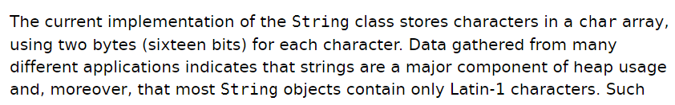

```
在很多不同的Application中，String类型是堆区的主要组成部分，但它们中的绝大部分都只包含 latin-1编码的字符。latin-1编码的字符只需要占1个字节。而1.8及以前的每个字符消耗了2个byte，这是优化的动机。

在jdk1.9以后, 改用 byte[]数组存放内容。新增了一个 编码标志位，用来区分内容是否全都为latin1或者包含utf16。 
```


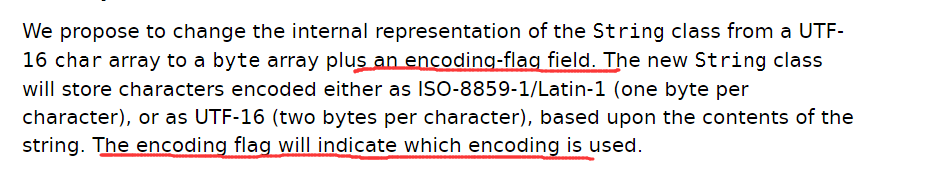


java中拼接字符 “+”？

```
通过字节码指令反编译，可以看到  拼接字符串+ 使用的是SpringBuilder。

但不会将SpringBuilder复用，频繁对字符串修改显式的使用StringBuilder为好
```


### 1.1.2  泛型


**Java 泛型（generics）** 是 JDK 5 中引入的一个新特性, 泛型提供了编译时类型安全检测机制，该机制允许程序员在编译时检测到非法的类型。泛型的本质是参数化类型，也就是说所操作的数据类型被指定为一个参数。

```
也就是说，在编译以后泛型相当于一个确定的类型。
```


类型擦除：

```
Java 的泛型是伪泛型，这是因为 Java 在运行期间，所有的泛型信息都会被擦掉，这也就是通常所说类型擦除 。
```


泛型使用三种方式：

泛型类、泛型接口、泛型方法。


```
泛型类很常见。
例如 ArrayBlockingQueue<T>  在类定义时声明泛型T
创建泛型类实例时需要指明T的具体类型。
List<Integer> list = new ArrayList<>();
```


```
泛型接口
例如 Stream<T>
```


```
泛型方法
例如 ArrayBlockingQueue<T>
public T get();
```


### 1.1.3  反射


```
JVM在加载类时，会为这个类创建一个唯一的Class类对象。作为这个类的访问入口。

反射可以动态的拿到某个类的全部信息。例如全类名、修饰符、共有私有字段、字段名、方法等。

反射被大量应用于框架底层，因为它提供了动态获取某个类全部信息的能力。
```


优点：

让代码更佳灵活，功能强大

缺点：

反射的性能比较差。反射带来安全性问题，无视参数类型检查。


反射性能差的原因：

```
反射可能通常会和强制转化功能使用。
使用反射时需要检查是否有权反射、检查字段的可访问性。
编译器可能没办法对代码优化，因为它根本不知道你在做什么。
```


### 1.1.4  Exception / Error

Exception 通常被翻译为异常，是程序定义式抛出的，可以被catch捕捉并处理。比如FileNotFound, InterceptedException。用于处理程序不正常运行的某种场景。常常和其搭配的由try-finally .try-with-resource结构。Exception不会强迫虚拟机停止运行。


Error通常被翻译为 错误。这类错误通常是致命的错误，它会强迫虚拟机停止运行，对于线上运行的Application，出现这种错误是不可接受的。常见的Error例如  OOM   ，StackOverFlow


# 2. Java 容器


Java集合继承图如下：


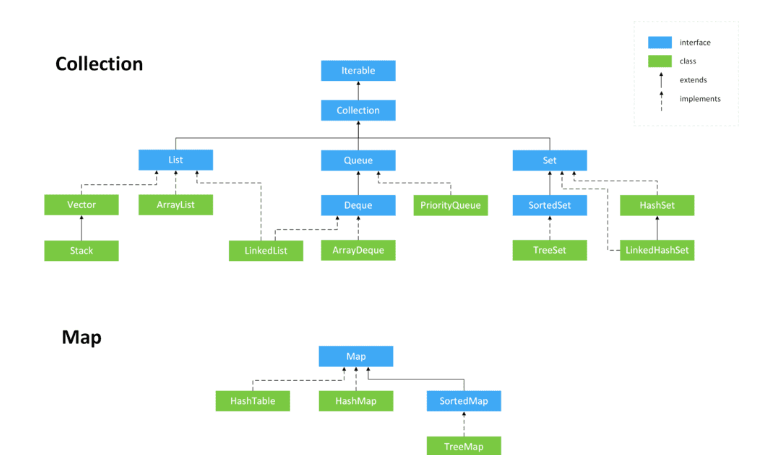


```
Java集合可以说是Java精华核心代码了。容器的扩容,解决了数组长度不可变的问题。在实际生产中非常方便。

集合又符合面向对象的思想，例如 .equals ,Comparable
```


## 2.1 HashMap

hashMap中重要的成员变量：


静态内部类 Node ，使用泛型KV存储 key和value;


Node类型的数组 table, 也就是数组+链表+红黑树的数组。是懒加载的，在resize方法中初始化。  

```
Node<K,V>[] table
```


HashMap底层结构？

```
数组+链表+红黑树。

数组上查询节点时间复杂度O(1),当发生Hash碰撞时，选择在节点上启用链表结构。链表结构时间复杂度O(n)
链表结构超过8个节点转化为红黑树 O(logn)

触发红黑树的节点数量 : TREEIFY_THRESHOLD  8个  

具体的存储结构是使用了泛型的Node节点
```


HashMap的存储结构？

```
普通节点:
拥有一个静态内部类 HashMap.Node<K,V> 用于存放 Key,value


红黑树节点:
TreeNode<K,V> 继承自 LinkedHashMap.Entry 继承自HashMap.Node
总之,是普通节点的子类。


存放数据的数组Node节点数组 :   Node[] table
```


HashMap 什么时候会扩容？

```
1.当存入节点数量size大于 阈值时扩容。 
2.当某个桶的长度大于8且小于64个,就会触发resize()扩容


//阈值等于 负载因子*数组长度 ， 通常负载因子为0.75

//负载因子的数值是一个经验值.
//根据泊松分布，当负载因子为7时单一桶内8个元素的概率为百万分之一，当负载因子为8时单个桶内8个元素的概率为千万分之一
```


为什么要扩容？

```
当节点过多时，发生频繁的指针碰撞，查询节点 入节点，出节点都会带来开销。降低整个容器的性能。
```


HashMap 初始容量是多少？

```
1<<4  //16
```


HashMap中putValue的逻辑

```
1.判断table是否为空，如果为空则初始化容器。  //初始化容器方法resize()  : 或者扩容，每次扩容2倍

2.如果该key的hash没有发生碰撞，则插入节点, 节点个数+1,如果超过阈值则扩容。

3.如果该节点是普通节点,判断key是否相等(这里使用了== 和 .equals ,两者满足其一就算相等) ，如果相等则互换值，返回旧值。

4.如果是红黑树节点，按照红黑树的putvalue方法。

5.如果是链表节点，依次判断是否是相同的key，如果相同则互换值，返回旧值
```


HashMap是怎样快速给key定位slot的？

```
通常定位Key的slot是取余运算。但取余是一种比较低效的运算。

HashMap规定 slot 的数量必须是2的幂次方。 
2的幂次方有这样的性质:

假设 m=2的k次幂(k>4 容量默认最小为16) 那么m的二进制 在位阶为k的位上是1,这之后右面有k个0，左面全是0
此时 (n=m-1)  的二进制将有k个1，其余位全是0
此时让n与hashcode按位与，无论hashcode的值如何，也不会超过n
Node[]的索引值是<=n的

所以HashMap通过不使用取余运算，仅使用按位与的运算,将32位的hashcode限制在了Node[]索引的大小。
```


HashMap使用& 代替取余运算的弊端？

```
虽然HashMap 使用&运算效率比 取余要高。
按位与相当于抛弃了hashcode超出数组位数的高位。
这将会让原来均匀的散列值变得不再均匀.这将会引发Hash冲突。

所以HashMap 使用hash方法,把高16位和低16位按位异或,简单的使指更均匀一些。
```


HashMap中的 hash方法，为什么要把hashcode和它右移十六位异或？

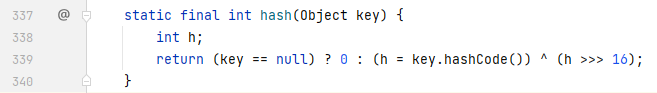


```
异或一共有如下4中情况:

1^1  1^0  0^1  0^0 : 这四种情况对应的结果分别是 0，1，1，0    (相同为0不同为1)

首先看hashcode的低16位，与高16位异或，输出的结果更佳均匀。散列效果更好。

在看hashcode的高16位都与0异或，原本是1不变，原本是0也不变。
```


jdk1.7和jdk1.8的 HashMap有什么不同？

```
1.7的HashMap 只有数组+链表。没有把链表转化为红黑树。使得链表上的搜索效率特别低。时间复杂度为O(n)

1.7链表新增节点是尾插法。1.8改为了头插法。新插入的节点会被优先遍历，会提高一部分运行效率。原因就是程序的局部性原理。
```


HashTable 和 HashMap的对比？

```
HashTable 是线程安全的。所有方法都加了synchronzied锁。但在并发性上,HashTable并不好。

HashMap不支持线程安全。
```


## 2.2 ConcurrentHashMap

java.util.concurrent.ConcurrentHashMap 并发包


### 2.2.1  jdk1.7

```
1.7的concurrentHashMap 相较于同为线程安全的HashTable，使用了分段锁,提高了并发能力。
```


结构图如下：

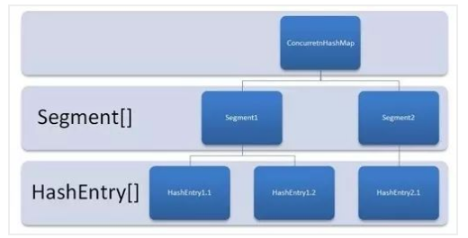


1.7的HashMap存在一个重要的静态内部类 : Segment  ，继承了ReentrantLock ,可以上锁且重入;


成员变量中，存在一个 Segment[] 数组


每个Segment对象都有一个HashEntry[]数组的成员变量。


这个HashEntry就是保存真正K，V的实体。


concurrentHashMap.put    核心方法

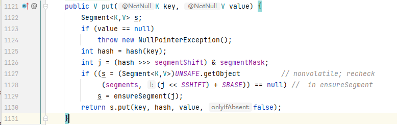

```
根据key获取对应slot的Segment一次。如果获取为null，则使用阻塞方法ensureSegment获取Segment

ensureSegment 不停的对slot 获取和进行CAS操作(添加一个新的Segment).多线程并发的情况下，总会有一个线程CAS成功，其他线程获取它CAS的结果。

获取成功以后,调用Segment的put方法。
```


Segment.put  核心方法

```
concurrentHashMap.put方法允许多个线程获取同一个Segment,所以后续put操作必须使用额外的同步方法。

由于Segment继承了ReentrantLock ,所以可以使用tryLock()方法即可返回是否加锁成功。
```


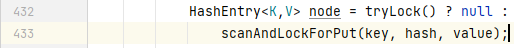

加锁成功，则进行下一步，失败则通过自旋尝试加锁。超过自旋最大次数，只能使用阻塞方法获得锁。

```
使用阻塞方法获得锁,将会导致线程在操作系统层面挂起,这将导致额外开销。
使用自旋是为了避免刚刚挂起线程，又马上获得锁的这种情况。白白浪费了额外的开销挂起/恢复线程。
```


```
通过HashCode 获取 Entry数组的索引,如果为空直接加入新节点。否则依次遍历链表，如果key相同更新value返回旧value
```


总结：

```
1.7的ConcurrentHashMap 和 1.7的HashMap 一样，使用数组+链表。没有使用红黑树。
使用分段锁技术 , ConcurrentHashMap 包含Segment数组，一个Segment中又保管了多个HashEntry<K,V>
```


分段锁示意图

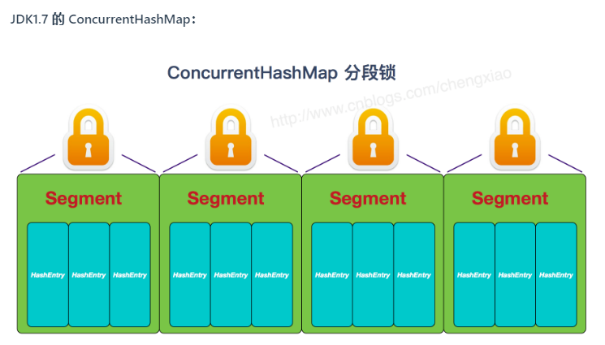


### 2.2.2  jdk 1.8


concurrentHashMap 1.7和 1.8的区别


```
1. 在jdk1.7中已经解决了并发，并且最好情况下能并发 Segment[]数量个线程。

2. 1.8主要解决了 链表性能不好。加入了红黑树。同时链表的尾插法改为头插法。

3. 抛弃了Segment分段锁，使用 CAS+synchronzied锁 作为同步机制。
	在设置空slot的时候使用CAS,由于使用了CAS必须使用for循环自旋
	在链表节点和树形节点时，使用了synchronized锁

```


并发HashMap的处理hash的方法

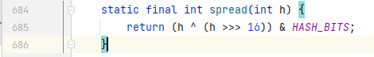


为什么要处理hash值?

```
HashMap为了提高计算效率，将哈希表的大小固定为了2的幂，这样在取模预算时，不需要做除法，只需要做位运算。位运算比除法的效率要高很多。

HashMap的效率虽然提高了，但是hash冲突却也增加了。因为它舍弃掉了一半的hashcode，整个hashcode表现为尽量均匀,去掉任意几位都会使之不均匀，所以使用了高十六位按位异或低16位
```


ConcurrentHashMap的putVal 方法

```
整个putVal方法核心是出口不再for中的for循环 即 for (Node<K,V>[] tab = table;;)

出口不在for中，因为这是一个失败了会不断尝试的同步方法,直到尝试成功，返回结果。
也就是说,无论何种尝试，只要有一种尝试成功了就会break跳出循环。


尝试1.如果key对应的slot为空，尝试一次CAS操作,往slot中插入新的节点。此时可能有其他线程对同一个slot进行CAS操作,无论有多少个线程对当前空slot CAS只会成功1个break出循环。其他的线程失败了不会break,会继续for循环，并且判断当前slot不再为空,进行尝试2

尝试2. sync锁住当前节点。如果是链表节点，则依次遍历，如果key完全相同替换value返回旧value，否则插入新节点

如果是树节点，则按照树的方式添加新节点,可能返回旧value

判断是否需要转为树结构。如果需要则转换。

HashMap 节点数量+1
```


#### 2.2.2.1 扩容流程

```
HashMap的数组使用的是 懒加载 的方式，初始化方法和扩容方法共用一个 resize()方法

1.首先判断是否到达最大值(2^30)如果到达了，则无法继续扩容。将threshold扩大到ing的最大值，然后返回。否则扩容2倍

2.
```


# 3.  J.U.C


什么是进程和线程？

```
进程是系统分配资源和保护的基本单位。从JVM层面来说，启动一个JVM等于启动一个进程。

线程是系统调度的基本单位，一个进程可以拥有多个线程。多个线程共享这个进程的资源，所以会涉及到并发问题。

从任务的角度考虑,线程的创建和释放开销比进程更小，对于IO密集型任务或者计算密集型任务建立并使用多线程作为任务载体更加节省资源同时符合单一职责原则，耦合度更低。
```


```
从JVM 运行时数据区角度说， 任何一个线程都有 “程序计数器”，“本地方法栈”，“java栈”
而线程之间共享的是  堆区和方法区
```


什么是并发？什么是并行？

```
并发通常指一段时间内，多个程序交替执行。   就像是一条车道,大家轮流来跑。比如时间片轮转制度
并行通常指同一时刻，多个程序同时运行，互不干扰。 就像多条车道同时跑。
```


为什么要使用多线程？

```
从资源利用率的角度说:
对于现代多核处理器来说，一个核心就相当于具有一个独立运算的能力。如果只运行单线程程序，其他核心相当于浪费资源。

使用多线程协同合作,可以充分的利用资源。


从编程的角度说:
处理密集型IO任务、密集型计算任务的时候，使用多线程分工合作符合单一职责原则、解耦的同时具有高扩展性。
同时还能发挥出异步程序独特的特性，例如消息队列。并且引入了异步同步的思想，在不关心结果立即返回的前提下，可以把任务逐步拆解。
```


使用多线程可能带来什么问题？

```
潜在的数据不一致性问题。相较于同步程序，异步程序的执行流程更加隐蔽，更难控制。
```


解释一下原子性、有序性、可见性?

```
原子性:  一系列多个操作要么同时执行，要么同时都不执行。
有序性:  按照所见顺序执行。提出有序性是因为cpu流水线作业会提高效率,有时编译器也会进行优化，进行指令重排。这将导致代码实际运行并不像我们编程代码顺序执行。
```


线程的生命周期？

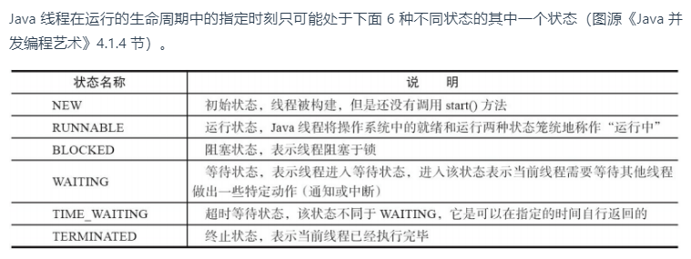

```\
new
running
blocking
waiting
Timewaiting
terminated
```

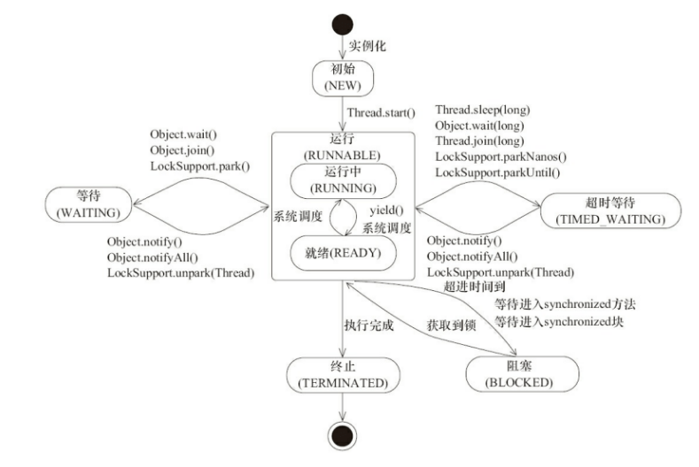


什么是上下文切换？

```
线程运行所需要的状态、环境称为上下文。在线程之间切换需要保护现场、恢复现场。这一过程称为上下文切换。例如 程序计数器、栈信息。

上下文切换意味着会带来额外的开销。所以频繁的上下文切换是需要避免的。锁自旋就是避免频繁切换的一种手段。
```


Thread.sleep() 会让出锁吗？Object.wait() 会让出锁吗？

```
线程睡眠不会让出锁。只会让出cpu
Object.wait()  会让出锁和cpu
```


为什么我们调用 start() 方法时会执行 run() 方法，为什么我们不能直接调用 run() 方法？

```
创建线程以后，调用start方法，线程在完成了new以后工作会自动调用run方法。
而如果直接调用run方法，相当于调用了一个普通的同步方法，在调用者线程中执行了这个run方法。
```


## 3.2 synchronized


说说synchronized？

```
synchronized被称为内置锁，是一个关键字，用于线程之间的同步通信。
可以标注在方法上，表示锁住调用方法的实例对象。
如果标注在static方法，则表示锁住这个类的Class对象。
标注在类，也表示锁住Class对象

也可以标注在指定对象上，想要进入synchronized代码块的线程需要先尝试获得这个对象。没有得到这个对象的线程进入阻塞状态。
以此保证了同一时刻进入同步代码块的线程只有一个，保证了原子性、可见性、有序性。
不过不会禁止编译器进行指令重排。
```


### 3.2.1 synchronized的底层原理？


修饰对象

```
sync关键字在字节码指令层面：  进入同步代码块 monitorenter,退出同步代码块  monitorexit
也就是说sync试图获取 对象监视器monitor的持有权。


原因是每一个对象在C++代码层面都包含了一个  ObjectMonitor对象。 Object.wait/notify 也依赖与这个monitor 所以只能在同步代码块中使用。

在执行monitorenter时，会尝试获取对象的锁，如果锁的计数器为 0 则表示锁可以被获取，获取后将锁计数器设为 1 也就是加 1。 这也说明Sync是可重入锁
```


修饰方法

```
在字节码层面上并没有monitorenter 和 moniterexit。
而是方法修饰上多了  ACC_SYNCHRONIZED标识，标注是一个同步方法。
```


### 3.2.2 Synchronized优化

jdk1.6以后对Sync锁进行了优化。

```
sync优化前后使用了  偏向锁、轻量级锁、重量级锁。
```


什么是重量级锁？

```
当一个线程获得锁以后，其余所有等待获得该锁的线程都会处于阻塞状态。

重量级锁通过对象内部的monitor锁实现，monitor锁本质上依赖于操作系统的 MutexLock,会导致由用户态切换为内核态，开销比较大。
```


什么是轻量级锁？

```
事实上存在这样的场景:“大多数锁在持有的过程中是不存在竞争的”,轻量级锁希望优化这一场景。
轻量级锁尝试用CAS操作优化操作系统中重量级锁的互斥量。

获得轻量级锁的过程:

虚拟机首先在当前线程的栈帧创建 名为(Lock Record) 的空间。用于拷贝对象头的mark word,同时还包含owner指针指向该对象。
然后尝试使用CAS操作将对象头的mark word修改为指向自己的指针。如果成功则表明获得了锁。
如果失败说明有多个线程在竞争这把锁。
此时没有抢到的线程尝试自旋，自旋失败膨胀为重量级锁。如果有超过1条的线程失败，则不会自旋直接膨胀为重量级锁。
```


什么是偏向锁？

```
偏向锁希望在无竞争条件下，把CAS操作也省去。
偏向锁总是偏向上一次获得锁的线程，如果在执行过程中，这把锁没有被其他任何一个线程获取，那么被偏向的线程将永远不需要同步该锁。(这个线程和这把锁相关的所有同步都可以省去)

一旦有其他线程尝试获取这把锁，就会让锁膨胀为轻量级锁。
```


什么是自旋锁？

```
等待一把锁需要在操作系统层面把线程挂起、当获得锁以后再把线程恢复。
这一过程会让系统从用户态到内核态的切换，是非常耗时的。
有时，一些锁的占有时间很短，只需要稍稍等待一会儿就可以获得锁。对于这样的锁来说，频繁的挂起恢复线程显然是一种不划算的行为。
所以,自旋锁是让线程在java层面上进行空循环等待,如果再此期间获得锁，那么直接执行。这一过程只在java层面上，操作系统并不感知这一过程。
```


什么是锁消除？

```
有些场景,只在方法内使用了一些线程安全的容器。比如StringBuffer ,HashTable 又没有其他线程共享这些容器，在程序员的代码层次上可能没使用任何同步代码。但实际上这些容器并需要同步。
所以，基于逃逸分析，虚拟机会优化这些代码，去掉其中的synchronized
```


什么是锁粗化？

```
通常我们希望同步代码块包含的语句越少越好，这样并发性会比较高。
如果一系列的连续操作都是对同一个对象加锁释放锁，是十分耗费资源的。
尤其是在for循环中的加锁释放。
如果虚拟机发现一系列零碎的操作都对同一个对象加锁释放锁，就会把加锁同步粗化到整个操作序列。
这样整个过程只需要加锁释放一次就可以了。
```


### 3.2.3 Synchronized 和 ReentrantLock 的区别

```
两者都是可重入锁。
```


synchronized 依赖于 JVM 而 ReentrantLock 依赖于 API。

```
synchronized 是依赖于 JVM 实现的，前面我们也讲到了 虚拟机团队在 JDK1.6 为 synchronized 关键字进行了很多优化，但是这些优化都是在虚拟机层面实现的，并没有直接暴露给我们。

ReentrantLock 是 JDK 层面实现的（也就是 API 层面，需要 lock() 和 unlock() 方法配合 try/finally 语句块来完成），所以我们可以通过查看它的源代码，来看它是如何实现的。
```


ReentrantLock 比 synchronized 增加了一些高级功能

- **等待可中断** : `ReentrantLock`提供了一种能够中断等待锁的线程的机制，通过 `lock.lockInterruptibly()` 来实现这个机制。也就是说正在等待的线程可以选择放弃等待，改为处理其他事情。

- **可实现公平锁** : `ReentrantLock`可以指定是公平锁还是非公平锁。而`synchronized`只能是非公平锁。所谓的公平锁就是先等待的线程先获得锁。`ReentrantLock`默认情况是非公平的，可以通过 `ReentrantLock`类的`ReentrantLock(boolean fair)`构造方法来制定是否是公平的。
- **可实现选择性通知（锁可以绑定多个条件）**: `synchronized`关键字与`wait()`和`notify()`/`notifyAll()`方法相结合可以实现等待/通知机制。`ReentrantLock`类当然也可以实现，但是需要借助于`Condition`接口与`newCondition()`方法。

Condition 是一个非常好的同步手段。

在JDK源码中也被使用。例如 BlockingQueue ， 消费者线程等待一个NotEmpty的Condition，当生产者线程增加了生产资源就可以尝试通过NotNull唤醒消费者。同样的生产者线程等待一个NotFull的Condition，当消费者消费了一个资源就可以尝试唤醒NotFull


## 3.3 volatile 

volatile关键字用于保证变量的可见性、有序性。以及禁用指令重排。


什么是指令重排？

```
为了提高程序的执行性能，通常编译器和处理器会对指令的顺序调整作为优化。比如cpu的流水化作业，会调整机器指令的顺序。

通常:
编译器可能对代码进行重排，以提高性能。
cpu也可能对机器指令进行重排，以提高性能。


而指令重排的前提: 不影响在单线程的表现下。 这也就意味着，对于某些特殊场景,多线程可能会因为指令重排而出现意想不到的bug。因为指令重排将带来指令顺序不可控。
```


cpu缓存？

```
cpu的速度要比内存快得多。频繁的出现cpu等待内存IO数据显然是浪费性能的行为。
缓存就是为了解决两个组件之间速度不匹配的问题。

对于现代CPU来说通常会有多级缓存,越靠近cpu的缓存速度越快，容量也就越小。
通常1级缓存是每颗cpu私有的。2、3级缓存可能是多个cpu共享的缓存。
```


缓存行？

```
缓存是分行的。一段对应着一个存储空间。称之为缓存行，是cpu缓存分配的最小单元,根据cpu的不同可能是32字节或者64字节。
当cpu发出读内存指令时，会一级一级查看缓存，如果有则不必从内存中写入。提高运行效率。
同样的，缓存也遵循程序局部性原理,新从内存中读入的数据会写入缓存，淘汰旧缓存。
```


缓存一致性协议？

```
cpu缓存通常是多级的。一级的性能并不够足够秀，也不够平滑。缓存一致性协议就是为了协调多组缓存中数据一致的问题。

缓存一致性协议有多种，但是日常处理的大多数计算机设备都属于"嗅探（snooping）"协议，它的基本思想是

内存数据交换基于总线，而CPU缓存不仅仅在做内存传输的时候才与总线打交道，而是不停在嗅探总线上发生的数据交换，跟踪其他缓存在做什么。其他处理器对缓存数据的改变，都能被所有的感知。

感知以后做什么呢？ 让缓存行失效。当cpu想要使用这组失效缓存时，会被迫从内存中刷新最新的值。以此来保证每次使用数据的时候总是最新的。
```


缓存不一致性问题？

```
由于多组缓存的存在，不同的cpu可能缓存了同一个变量的不同副本。当其中一个cpu对变量的值进行了修改。如果其他缓存没有收到通知做出相应的改变，那么就会出现数据不一致性问题。
```


Volatile 怎么解决可见性的？

```
当CPU操作的变量是一个共享变量时，说明其他的CPU缓存中也可能会存在副本，那么这时候对该共享变量的读操作不做限制，照常读取数据，只是在写入的时候，会发出信号告诉其他的CPU将这个变量的Cache
line设置为无效状态，那么其他的CPU在这之后对该变量做读取时，由于缓存中的该变量已经失效，那么就会重新到主内存中读取。
```


cpu缓存伪共享(false sharing)？

```
缓存是基于缓存行的。大多数cpu一个缓存行大小为64字节。对于一些较小的变量来说，一行可以存下多个变量的值。为了缓存的效率，通常情况下用多个小变量填充满缓存行是比较好的。
由于L2.L3缓存是共享的。可能会存在如下场景：
核1需要的变量和核2需要的变量都存储在的同一个L3缓存行中。当核1让缓存行失效，核2的变量也跟着一起失效了。核2不得不重新从内存中刷新变量的值，即使这个变量根本不是共享变量。
这样的情况被描述为 伪共享。
```


如何解决伪共享---缓存行填充技术？

```
解决伪共享问题的思路很直接：
那些容易使缓存行失效的共享变量尽量单独存储。

缓存行填充技术通过填充增加变量的大小，让其占有整个缓存行。 是一个以空间换时间的方法。因为这样必然浪费了缓存行的空间。
```


## 3.4 ThreadLocal

解决线程安全问题通常有3类思路：

```
让对象不可变
让对象不再共享
对共享对象访问使用同步控制
```

ThreadLocal为每一个线程都准备了独有的实例对象。等价于这些对象不再共享。解决了线程安全问题。


ThreadLocal的原理？

```
ThreadLoacal借助于存放在Thread中的成员变量 ThreadLoacalMap<ThreadLoacal<V>,V>

这是一个映射,Key是ThreadLocal，value就是对应的每个线程一份的变量。

ThreadLocalMap是一个懒启动的成员变量。
```


ThreadLocal 结构示意图

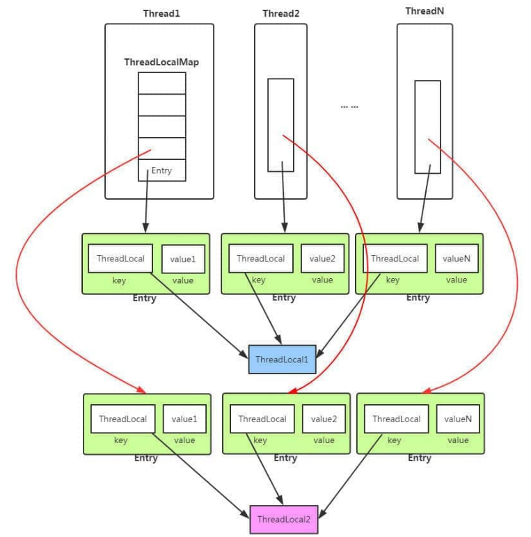


强引用、软引用、弱引用、虚引用？

```
Strong reference 、 SoftReference 、WeakReference 、virtual reference


我们日常使用的引用关系，就是强引用。JVM宁可抛出OOM错误，也不会回收强引用。
弱引用，使用SoftReference类来表达一个弱引用实例。在JVM即将抛出OOM时尝试回收弱引用。如果回收过仍然不够，抛出OOM
弱引用对象, 在下一次GC就会被回收。
虚引用是最弱的引用,虚引用不会对对象的生命周期有任何影响。也不会通过虚引用获得对象。在虚引用被垃圾回收时，会受到一个系统通知。
```


ThreadLocal内存泄漏的问题？
```
ThreadLocalMap 的key是弱引用。而value是强引用。
弱引用在下一次GC就会被清除。
也就是说,GC一次以后，就会出现Key为null的value。如果不做额外的措施value就永远也不会被清除。当数量多了就造成内存泄漏。
ThreadLocal的set get等方法会自动检测清除key为Null的Entry，是jdk官方为程序员做的一个兜底行为。

使用完以后，可以手动调用remove方法。
```


## 3.5 线程池

 


为什么要使用线程池？

```
线程池用于创建、管理一批线程。线程池还维护了统计量：已完成任务数量。

线程池可以对线程进行复用，减少频繁创建销毁线程带来的开销。
由于复用线程,不必再次创建线程，提高了任务的响应效率。
提高线程的管控性: 线程是稀缺资源，如果无限创建消耗系统性能。使用线程池统一管理。

线程池还提供拒绝策略接口，开发者可以自定义拒绝策略。


线程池包装了Runnable,Callable 任务，支持Future框架
```


### 3.5.1 Callable和 Runnable

Runnable 和 Callable 接口的区别？

```
Runnable	提供了无返回值的执行任务,不能抛出异常。

Callable<V> 提供了带有返回值的执行任务，可以抛出异常。
```


### 3.5.2 execute和submit

submit() execute() Future类？

```
execute()是简单的异步执行一个任务,execute只会执行任务，不会返回结果。

submit和Future是异步中的一类思想,以Future作为容器，可以拿到异步执行的结果。也是为了拿到异步执行结果必须要的异步容器。
submit可以返回异步任务执行的结果。

submit会立即返回一个Future类作为结果的容器。Future可以通过阻塞方法get拿到异步任务的执行结果。
```


在抛出异常这方面 execute()和 submit()也不一样。

```
ThreadPoolExecutor.submit()支持提交runnable和callable两种任务。
submit会new一个新的FutureTask任务对象,任务载体Runnable/Callable作为参数传递到了FutureTask中。
FutureTask实现了Runnable重写了run方法，运行真正的任务并捕捉任务抛出的任何异常。

如果任务真正执行完毕，则将会把正常的结果返回给用户,
如果任务执行出现了任何异常，FutureTask将捕获这个异常,并把异常作为任务执行的结果。
等待用户调用Future.get() 时才会得到异常信息。

而execute() 不存在返回容器Future,当任务遇到执行异常时，会直接抛出异常。


为什么这么设计？
因为这样更加符合Future异步处理的思想。无论这个task是正确处理还是发生异常。程序员都希望把这一“结果”暂时封存到Future容器中来。等到合适的时机，程序员再去处理异步任务的结果。
```


### 3.5.3  线程池的参数


#### 3.5.3.1 线程池有哪些参数？

ThreadPoolExecutor

```
核心线程数。  		corePoolSize
最大线程数           
线程工厂   			 ThreadFactory
工作队列   			 BlockingQueue阻塞队列
救急线程存活时间      TimeUnit
存活时间单位          
拒绝策略           RejectExceptionHandle
```


#### 3.5.3.2 BlockingQueue

什么是BlockingQueue?

```
JDK官方在BlockingQueue下的注释这样描述道：

BlockingQueue有条件的支持以下操作： 
持续等待队列不空直到有一个元素入队,持续等待队列不满直到有一个元素出队。


通俗的解释就是 阻塞队列提供了入队出队的阻塞方法，直到这次操作成功。
```


阻塞队列/工作队列会深度影响线程池的表现 ，说说几种线程池的阻塞队列？

```
ArrayBlockingQueue  底层使用数组作为元素的存储载体。在初始化的时候需要传入数组长度参数
LinkedBlockingQueue   链表形式的阻塞队列,不强制要求最大容量，如果不限制容量，将会无限制往等待队列里增加任务。这将导致任务长时间不能执行，也不会被拒绝。还会消耗系统资源。
SynchroniousQueue   无容量队列。等待队列长度为0,超出线程池大小的任务直接拒绝。
```


#### 3.5.3.3 RejectExceptionHandle

拒绝策略。当线程池无法创建新的线程，等待队列又满了的情况会执行拒绝策略。


JDK内置的拒绝策略有哪些?

```
DiscardPolicy  直接丢弃，不抛出任何异常。
DiscardOldestPolicy 丢弃一个最古老的task。
AbortPolicy  直接抛出异常，阻止系统正常工作。
CallerRunsPolicy  调用者线程运行。
```


### 3.5.4   Atomic 类 

原子类、Atomic是线程安全的工具类、比如AtomicInteger、AtomicLong、还可以让任意类的任意字段具有原子属性  AtomicReferenceFieldUpdater


Atomic都包含哪些类型？

```
操作基本类型的例如:  AtomicInteger  AtomicLong  用于数字类型的安全+1 -1 操作。当然还有自增效率更高的LongAdder

操作数组的:  AtomicIntegerArray   本质上就是一组原子整型。

操作引用的:   AtomicReference       原子性的修改一个对象引用

操作字段的:  AtomicReferenceFieldUpdater    原子性的修改一个对象的字段的值
```


#### 3.5.4.1 AtomicInteger


简单讲讲AtomicInteger的原理？

```
AtomicInteger 依靠 volatile +CAS操作保证线程安全。
例如IncrementAndGet()方法 底层使用了 sun.misc.unsafe类的CAS执行+1操作，其中被while循环包裹的CAS操作，只有CAS操作成功以后才会退出循环。保证一定会成功+1。 

使用Unsafe的流程: 先获取这个类指定字段 在堆区地址偏移量offset ，这是一个long类型的数。然后通过unsafe使用CAS修改指定对象的这个字段的值
```


什么是CAS？

```
CAS 全名compareAndSet 比较交换。是一种乐观锁，在使用之前先保存 原数据的值a，然后进行非原子操作。当写回数据的时候如果原数据的值a不变，则成功把数据写回。如果原数据的值不再是a，说明有其他线程修改了数据的值，则本次CAS操作失败。
```


### 3.5.5  AQS

更多的源码分析在另一篇笔记中《高并发程序设计》 

AQS 全程 AbstractQueuedSynchronizer ，直译 抽象队列同步器。


什么是可重入锁？

```
同一个线程可以再次获得已经拥有的同一把锁。
```


多线程执行的时候 依靠什么来保证他的一致性？

```
猜测: 信号量,锁，Condition
```


#### 3.5.5.1 介绍一下AQS ？


AQS翻译过来是抽象队列同步器。

```
1. AQS是JDK中重要的锁 ReentrantLock的原理，它是一个抽象类，使用了模板模式。AQS里封装好了核心的节点入队出队操作。开发者无需关心其他，只需要根据业务实现自己业务逻辑的锁。

2. AQS的模型是CLH锁，CLH锁是一个FIFO的队列。队首节点可以直接获得锁，后入队等待锁的节点需要排队等待。 入队的节点需要排到一个非取消节点后面。释放了锁的节点,需要根据自身的标记位唤醒后面阻塞的节点。

3. AQS中有一个重要的静态内部类称为Node,Node节点重包含了Thread成员变量,等待锁阻塞住的线程都被包装成一个Node节点排队等待。
Node节点的状态标志位是一个int类型称为waitState, ws有多种状态,例如 初始态0,SIGNAL信号态-1,用于唤醒后续节点。取消状态1，等待状态-2，传播状态-3. AQS的成员变量有一个名字也是state的int类型,它表示锁的持有状态。如果state是0表示没有人占有锁，如果state>0则表示锁重入的次数。

4.AQS有5个抽象方法，供开发者重写。开发者需要根据锁是独占模式，还是共享模式实现对应的抽象方法。
  这5个方法分别是: tryAcquire tryRelease  tryAcquireShared tryReleaseShard 以及 isHeldExclusively()
  

5.AQS加锁的核心方法是acquire(), acquire方法会首先尝试调用tryAcquire方法获取锁，tryAcquire方法就是开发者需要自己实现的获取锁逻辑，如果获取失败,则会执行addWaiter方法将线程包装为Node节点,并尝试入队。入队的逻辑是一个for死循环的CAS入队,如果入队成功才会跳出循环。入队成功以后,就要尝试重新获取锁,或者阻塞住,否则将一直耗费cpu时间片。

6.在队列中自旋获得锁，和阻塞等待的核心逻辑就是 acquireQueued方法，这个方法首先会让Node节点抢锁，如果失败了就需要判断是否park住。
当前节点会根据前驱节点waitState状态判断是否park，如果前驱节点是SIGNAL说明，在其释放锁以后可以唤醒我，那么可以安心park。
如果前驱节点>0也就是取消状态，那么就需要从后向前遍历，找到第一个非取消节点，将其的next指向自己。

从后向前找的原因也是因为对于取消节点来说，他的向后next已经不准，原因在于 cancelAcquire中尾节点将使用CAS删除,中间节点则会修改next指针指向自己。此时向后遍历的指针已经无法遍历完全。

```


## 3.1 小练习


启动三个线程,循环输出10次 “A“ ，”B“ ，”,C” 。每个线程负责一个字母。

使用ReentrantLock 和 Condition

参考代码：

```java
public class Main4_print {


    public static void main(String[] args) throws InterruptedException {

        ReentrantLock reentrantLock = new ReentrantLock();
        Condition conA = reentrantLock.newCondition();
        Condition conB = reentrantLock.newCondition();
        Condition conC = reentrantLock.newCondition();

        RunnableA runnableA = new RunnableA(conC,conA,reentrantLock);
        RunnableB runnableB = new RunnableB(conB,conA,reentrantLock);
        RunnableC runnableC = new RunnableC(conC,conB,reentrantLock);

        ExecutorService executorService = Executors.newFixedThreadPool(3);
        executorService.submit(runnableA);
        executorService.submit(runnableB);
        executorService.submit(runnableC);
        Thread.sleep(100);

        try {
            reentrantLock.lock();
            conC.signalAll();
        }finally {
            if (reentrantLock.isHeldByCurrentThread()) {
                reentrantLock.unlock();
            }
        }


    }


    static class RunnableA implements Runnable {

        private final Condition conC;
        private final Condition conA;
        private ReentrantLock reentrantLock;

        public RunnableA(Condition conC , Condition conA, ReentrantLock reentrantLock) {
            this.conC = conC;
            this.conA = conA;
            this.reentrantLock = reentrantLock;
        }

        @Override
        public void run() {

            try{
                reentrantLock.lock();
                for (int i = 0; i < 10; i++) {
                    try {
                        conC.await();
                    } catch (InterruptedException e) {
                        e.printStackTrace();
                    }
                    System.out.println("A");
                    conA.signalAll();
                }
            }finally {
                if (reentrantLock.isHeldByCurrentThread()) {
                    reentrantLock.unlock();
                }
            }


        }
    }

    static class RunnableB implements Runnable {

        private final Condition conB;
        private final Condition conA;
        private final ReentrantLock reentrantLock;

        public RunnableB(Condition conB, Condition conA, ReentrantLock reentrantLock) {
            this.conB = conB;
            this.conA = conA;
            this.reentrantLock = reentrantLock;
        }

        @Override
        public void run() {
            try {
                reentrantLock.lock();
                for (int i = 0; i < 10; i++) {
                    try {
                        conA.await();
                    } catch (InterruptedException e) {
                        e.printStackTrace();
                    }
                    System.out.println("B");
                    conB.signalAll();
                }

            }finally {
                if (reentrantLock.isHeldByCurrentThread()) {
                    reentrantLock.unlock();
                }
            }


        }
    }

    static class RunnableC implements Runnable {

        private final Condition conC;
        private final Condition conB;
        private final ReentrantLock reentrantLock;

        public RunnableC(Condition conC, Condition conB , ReentrantLock reentrantLock) {
            this.conC = conC;
            this.conB = conB;
            this.reentrantLock = reentrantLock;
        }

        @Override
        public void run() {

            try{
                reentrantLock.lock();
                for (int i = 0; i < 10; i++) {
                    try {
                        conB.await();
                    } catch (InterruptedException e) {
                        e.printStackTrace();
                    }
                    System.out.println("C");
                    System.out.println("");
                    conC.signalAll();

                }

            }finally {
                if (reentrantLock.isHeldByCurrentThread()) {
                    reentrantLock.unlock();
                }
            }

        }
    }
}
```


# 4. JVM


## 4.1 类加载机制

Java内置3个类加载器

```
引导类加载器        %JAVA_HOME%/lib 目录下的jar和类
扩展类加载器        %JRE_HOME%/lib/ext  目录下的jar和类
应用程序类加载器     加载classpath下的包和类
```


双亲委派模型

```
类加载器的loadClass()，在加载一个类的时候，会尝试先委托给父类加载。一路委托到引导类加载器，如果无法加载，则向下传递，直到能它的类加载器加载为止
```

双亲委派模型的好处

```
保证了java核心类库代码的安全。
```

自定义类加载器

```
除了引导类加载器以外，所有的加载器都由Java代码编写，自定义类加载器需要继承ClassLoader
```


如果自己写了一个String同名的类，编译通过之后能运行吗？

```
不能,首先双亲委派模型保证加载类会首先委托给他的父类，会一路委托到引导类加载器。它会加载 jre/lib/rt.jar 核心类库。这样保证了同名的类首先加载的是JDK官方的。
```


怎么判断一个类可以回收了?

```
同时满足以下才可回收：
1.这个类的Class对应，没有在任何地方被引用
2.不存在这个类的任何实例对象。
3.加载这个类的类加载器被回收了。
```


描述一下Java的运行时数据区?

```
Java的运行时数据区 主要有2个大类，线程共享和线程私有。

其中线程共享的是 堆区 和方法区。  其中堆区是存放对象的区域，属于JVM的内存。
方法区是Java虚拟机规范中的要求，以hotspot虚拟机jdk1.8以后的具体实现在直接内存的元空间。方法区主要存放类模板信息。

线程私有的是 程序计数器、本地方法栈、Java栈

程序计数器 指向了 下一条字节码指令，实现流程控制例如顺序执行、跳转等。同时也是帮助线程切换恢复上下文的重要结构。

java栈 主要标志这方法的嵌套调用，每嵌套调用一个方法,就相当于在Java栈中创建了一个栈帧。
栈帧内部包括了 局部变量表、操作数栈、方法返回值地址、动态链接、以及一些附加信息。

本地方法栈 和Java栈比较类似，用于调用C或c++层面的代码，在java中表现为native的方法。例如 Unsafe中的cas  getOffset  例如加载类的 loadclass0 loadclass1
```


在堆区中Java对象都包含什么 /Java对象的结构？

```
Java对象包含三部分:
对象头
实例数据 
对齐填充(可选)  : JVM规范要求对象占用内存空间为8字节的整数倍
```


Java对象头包含什么？  对象头结构？

```
Java对象头包含对象运行时元数据。比如: Hashcode、GC年龄、锁状态标志、偏向锁线程ID，偏向锁时间戳
类型指针
如果是数组对象，还有数组的长度。
```


对象的访问

```
建立对象就是为了使用对象。
Java 程序通过栈上的 reference 数据来操作堆上的具体对象。
对象的访问方式由虚拟机实现而定，目前主流的访问方式有：使用句柄、直接指针。

	句柄： 在对空间内存放着句柄池，堆内的引用指向句柄池的偏移量，通过句柄池指向 对象堆区地址，或者方法区内的地址。
	直接指针: 直接指向对象的堆区地址。
```

句柄：


直接指针：


如何排查OOM

```
1.OOM 异常可能因为：
  如果是内存泄漏: 申请完对象没有释放。需要详细的查看代码。
  如果是内存溢出: 首先考虑是否为JVM设置的内存不够不合理。如果不是，可以查看某些对象没有线程安全问题可以使用单例来代替。
  
  OOM的可能的区域:
  堆溢出              比较常见堆溢出，有可能是内存泄漏。需要通过
  元空间/永久代溢出.    如果是元空间溢出，可能的考虑是否是代理类过多，加载的类过多。可以通过设置虚拟机参数修改大小
```


java对象实例化过程：

```
1. 检查类加载
2. 分配内存。   在分配内存时需要考虑的3个问题，内存是否规整，内存是否够用，并发问题。
	常见的2种分配算法，这两种方法取决于垃圾回收器是那种方式。
	指针碰撞： 标记-整理算法。使用的内存全在一侧，未使用的在另一侧。  Serial，ParNew
	空闲列表： 标记-清除算法。列表记录哪块内存是可用的，找到一个足够大的内存为其分配。 CMS
	
	由于堆空间是共享的，分配内存必须考虑并发问题。2种线程安全的分配方式。
	CAS  :  campareAndSet, CAS可以借助 版本号/时间戳 实现。
	TLAB ： 堆空间上为每一个线程单独分配的区域。空间耗尽以后，只能使用CAS
3. 初始化零值。 JVM为这个对象的内存空间初始化零值，保证java对象在不赋初值就可使用。
4. 设置对象头。
	对象头包括 :  hashcode,GC年龄，锁状态标志，偏向锁线程ID，类型指针， 数组长度(如果是数组)
5. 执行init方法
	执行程序员定义好的构造方法。
```


## 4.2 垃圾回收


判断对象可以回收的2种方法？

```
直接引用计数。  非常朴素的观点，一个对象被引用了，计数器+1 ，不再被引用了，计数器-1. 无法解决循环引用的问题。


可达性分析算法。
	由GCroots开始，遍历所有对象的引用链。没有被遍历到的对象可以被回收。
```


GCroots都有哪些对象？

```
1.java栈帧的局部变量表里引用的对象
2.本地方法栈引用的对象
3.类静态属性引用的对象
4.常量引用的对象
5.被同步锁持有的对象
```


对象可以被回收，就代表一定会被回收吗？
```
不是,第一次被标记的对象会检查是否需要执行 Object.finalize方法。如果没有重写该方法或者已经调用完毕，没有重新被引用，则会被清除。
```


finalize方法已经不再被推荐使用为什么？

```
1.finalize方法会被另一个低优先级的线程执行，开发者根本不知道什么时候，它会被操作系统调度cpu执行。
2.finalize方法只会被执行1次，如果对象在finalize方法种重新被引用。那么这个对象后续不会执行finalize
```


### 4.2.1 垃圾回收算法


标记-清除算法

```
分为2阶段，标记阶段，清除阶段。标记全部不需要回收的对象，其余全部清除。


清除以后会产生大量不连续的空间碎片。
```


标记-复制算法

```
将内存分为等大的两部分。其中1部分做保留，另一部分使用完以后，将存活对象全部移入到保留空间中。清除原来使用空间的全部对象，重新作为保留空间使用。

不会产生空间碎片,但内存利用率低。适合死亡率较高的年轻代。
```


标记-整理算法

```
2个阶段，先标记，后整理。整理时将存活对象向一端移动，清除掉边界以外的内存。


不会产生空间碎片。
```


### 4.2.2 垃圾回收器


Serial  / Serial Old  垃圾回收器

```
单线程的，整个GC都需要STW。简单高效(对于其他单线程垃圾回收器)。

年轻代使用 :  标记-复制
老年代使用 ： 标记-整理
```


ParNaw

```
Serial的多线程版本，除此以外回收策略和 Serial完全一致(整个GC都需要STW)

年轻代使用： 标记-复制
老年代使用： 标记-整理
```


Parallel Scavenge  /  Parallel Old

```
多线程的垃圾回收器,整个GC都需要STW。  强调吞吐量，自适应调节参数，是jdk1.8默认垃圾回收器

年轻代使用 标记复制
老年代使用 标记整理
```


三色标记法:

```
三色标记法： 白色为未遍历对象，黑色为已经遍历对象，灰色为正在遍历对象。

只有同时满足如下条件，才会出现错误删除现象。
		条件1 ： 新增了至少1个黑色到白色的引用，
		条件2 ： 同时删除了所有灰色到这个白色对象的引用。 

解决办法: 
增量更新  :  记录新增的引用，在重新标记阶段，将添加新的引用连的黑色对象当作灰色重新扫描。  破坏了条件1
原始快照  :  无视并发中，灰色对象切断白色对象的引用，仍然保留这个白色对象。 破坏了条件2  会产生浮动垃圾，下一次GC删除
```


只要是并发垃圾回收，都可能会出现并发失败的场景，当并发回收时，用户线程突然申请了大量对象，导致即将OOM，那么不得不STW，冻结用户线程。


CMS

```
尽可能的缩短用户停顿时间，仍然会产生STW。适用于强交互的应用上。实现了让垃圾回收器和用户线程在大部分上同时工作。
CMS垃圾回收器使用了 增量更新的方法。

使用标记-清除 算法。 工作包括如下4个阶段：

初始标记 : STW ，标记所有和GCRoot直接相连的对象。
并发标记 ： 标记可达对象，此时用户可能产生新的引用链,此时需要记录新产生的引用
重新标记 : STW ，重新标记，修正那些新产生的引用
并发清楚 ： GC线程和用户线程同时运行
```


G1 垃圾回收器

```
在满足指定的停顿时间要求下，尽可能的提高吞吐量。

G1提出了分区管理的思想，
G1将堆内存分割成多个Region，不同的Region代表 伊甸园区，幸存者0区，幸存者1区，老年代。G1总是会尝试回收那些 “回收价值最大的Region”


使用标记-清除，会产生空间碎片，所以多次GC以后会STW，进行碎片整理。
G1会为每一个Region维护一个价值表，G1总是在有限的停顿时间内尝试回收价值最高的Region
G1更适合大内存的服务器端，因为G1需要维护每个Region的价值表。
```

G1的4个阶段

```
初始标记
并发标记
最终标记
筛选回收
```


# 2. Mysql


## 2.1  日志

MySQL如果宕机了如何恢复

//TODO


redolog都记录了什么

//TODO


# 3. springboot


## 3.1  spring容器相关


### 3.1.1 Spring如何解决循环依赖

参考 https://zhuanlan.zhihu.com/p/478709434

通过`三级缓存` 解决。 只能解决 循环依赖Bean是【单例】的情况， 且 如果存在构造器注入可能注入失败。 


依赖全部注入完的 `bean`才是完整的`Bean` 。解决【循环依赖】必须先初始化一个循环依赖中不完全的`Bean`,（此时它的依赖没有注入完成，功能是无法实现的） 作为开始将其注入到其他依赖中。


三级缓存：

`singletonObjects` 是一个`ConcurrentHashMap`存放完整的Bean。

`earlySingletonObjects` 存放未实例化完全的Bean。

`singletonFactories` 存储能创建Bean的工厂，通过工厂获取这个`Bean`,工厂生成的Bean放入二级缓存。


```java
//完整的Bean，具有完备功能的Bean
private final Map<String, Object> singletonObjects = new ConcurrentHashMap<>(256);

/**二级缓存 存放原始的 bean 对象（尚未填充属性），用于解决循环依赖*/
private final Map<String, Object> earlySingletonObjects = new HashMap<>(16);


/**三级缓存 存放 bean 工厂对象，用于解决循环依赖*/
private final Map<String, ObjectFactory<?>> singletonFactories = new HashMap<>(16);
```


## 3.2 AOP相关

讲一下AOP


如何实现


讲一下动态代理


## 3.3 springboot  


### 3.3.1 自动装配原理


springboot自动装配其实完成了几件事

1.扫描组件

2.导入xxxAutoConfiguration

```
springboot自动装配原理以  @SpringBootApplication为开始,这个注解是一个合成注解。 它包含了

@springBootConfiguration 
@ComponentScan
@EnableAutoConfiguraion 
三个注解。会扫描被springbootApplicaton标注的类所在包下的全部包和子包。


在EnableAutoConfiguration中，使用@Import导入了一个AutoConfigurationImportSelector(自动配置导入选择器)
这个选择器会给容器中导入一些组件，从META-INF/spring.factories 文件中读取配置

导入Springboot所支持的100多个场景的xxxAutoConfiguration
最终会按需配置
```


如何按需分配？

```
在每个xxxAutoConfiguration中，都会标有类似 
@ConditionalOnClass
@ConditionalOnMissingBean
@ConditionOnBean
这些注解就是决定当前的xxxAutoConfiguration是否要启用的关键条件。
如果在项目的类路径中都没有导入指定的Class类，那么@ConditionalOnClass注解就会失效。就不会被配置。
相反的，如果容器中导入了指定的Bean，那么ConditionalOnMissingBean就会失效
同样的，如果没有导入指定Bean 那么@ConditionOnBean 就会失效
```


## 3.4 @Transactional


失效场景

1.被标注的方法只能是 public , cglib使用继承方式代理，private对子类不可见，protected 包外不可见，也不行

2.rollbackFor  可以指定能够触发事务回滚的异常类型

3.手动catch了异常，吞了异常


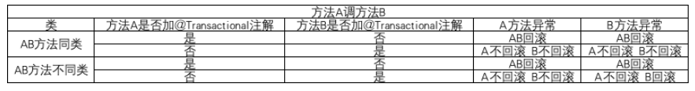


# 4.Redis


Redis为什么这么快？

```
1.基于内存的： Redis所有数据都存放在内存，当然也支持磁盘持久化。所有的数据读取都是内存级别的
2.数据结构简单: 使用C语言编写，高效的数据结构, 哈希，跳表，压缩列表ZipList
3.合理的线程模型: 采用单工作线程，避免锁和上下文切换的开销。使用多路IO复用，非阻塞IO
4.虚拟内存机制: 通过冷热数据分离，将不常使用的冷数据持久化到磁盘上，为热点数据提供充足的内存
```


Redis在6.0时又使用了多线程

```
为了解决删除大Key时主线程过长的停顿时间，数据持久化到磁盘主线程停顿等问题。
但请求客户端请求仍是单工作线程，多线程只用于处理数据的读写和协议的解析，所以Redis仍是线程安全的。
```


什么是多路IO复用？

```
多路IO复用指的是在使用Socket进行IO操作时，借助Selector 同时监听多个Socket，任意时刻当至少有1个Socket完成读写时，这些所有的Socket都会通知到Selector。单工作线程会依次处理这些任务。

多路IO复用是高效的，比如阻塞IO，如果使用阻塞IO那么在进行IO请求的时候也是单线程的，其他客户端的IO请求只能被迫等待。
```


缓存穿透：

```
恶意用户并发查询根本不存在的Key. 缓存中没有,则会直接压到数据库上。造成DB宕机。 解决手段： 缓存null值并设置过期时间
```


缓存雪崩：

```
短时间内大量的Key同时在缓存中过期，大量的查询直接压到数据库上，造成DB宕机。 解决手段：缓存过期时间加上随机值
```


缓存击穿:

```
热点Key过期了，这个key同时的大量请求都压到数据库上，造成DB宕机 。 解决手段：热点key加锁，大并发只让1个去查，其他人得到锁以后先查换缓存，此时缓存中有数据。
```


大Key问题

```
1. string类型的key存储的value很大（例如排行榜信息，key是固定的，value排行榜几十万的数据）

2. hash、set、zset、list中存储过多的元素（以万为单位）

由于redis是单线程运行的，如果一次操作的value很大会对整个redis的响应时间造成负面影响，所以，业务上能拆则拆。
```


解决方案

```
对key的value进行拆分。
```


参考博客

https://jishuin.proginn.com/p/763bfbd75186


## 4.1 常用数据类型


zipList 压缩列表，内存紧凑型列表，节约内存空间，使用一片连续的存储空间。

```
查找zipList两端很快都是O(1),查找中间元素值得从头或尾遍历。所以在元素过多时使用其他存储结构。
```


### 4.1.1 String

它是二进制安全的，可以存储图片或者序列化对象。值最大存储为512M

```
什么是二进制安全？
二进制安全是指 只关心这一串数据的二进制流，把它当作一串儿无意义的数据流。不进行任何意义上的解析例如“转义字符”。因此二进制安全可以存储任意类型的文件。
```

#### 4.1.1.1应用场景

```
分布式中共享Session
分布式锁
限流
计数器
```


#### 4.1.1.2 常用同命令

```
set
get
exists
strlen
decr
incr
```


#### 4.1.1.3 编码

```
存储数字是 int编码   (8字节长整形)
非数字字符串 <=39 bytes   embstr  //专门用于保存短字符串的优化编码方式
>39 使用的raw编码    //是二进制安全的编码
```


### 4.1.2 hash

在Redis中，哈希类型的V 本身也是一个KV结构的数据。

#### 4.1.2.1 应用场景 

```
hash的V 特别适合存储对象。可以用于缓存用户信息
Redisson使用它来作为重入锁结构
```

#### 4.1.2.2 内部编码

使用`zipList` 和 `hashtable`

```
元素少于512个且所有值小于64字节，使用zipList
否则使用hashtable
```


```
zipList使用的是一片连续的内存空间。在头尾提供O(1)的push，pop操作
```


### 4.1.3 List

列表List用于存储多个有序的字符串，最多存放 2^32-1个元素

#### 4.1.3.1 应用场景

消息队列

#### 4.1.3.2 内部编码

```
zipList      压缩列表 //在list元素少于512个，且每个值都小于64字节使用ziplist
linkedList   链表  //否则使用linkedList
```

#### 4.1.3.3 常用命令

```
rpush
lpush
lpop
rpop
llen
```


### 4.1.4 Set

存储多个元素，不允许重复

#### 4.1.4.1 应用场景

```
标签
共同好友/共同爱好
黑白名单
```

#### 4.1.4.2 应用场景

```
排行榜
社交需求(如用户点赞)
```

#### 4.1.4.3 内部编码

```
如果所有元素都是整数,且个数小于512个使用intset
否则使用hashtable
```


### 4.1.5 ZSet

排序集合，元素不可重复

#### 4.1.5.1 应用场景

```
排行榜，社交需求
```

#### 4.1.5.2 常用命令

```
zadd
zrank
```

#### 4.1.5.3 内部编码

```
成员数量小于128个，且每个成员小于64字节 使用ziplist
否则使用 skipList
```


### 4.1.6 Geo

Redis 3.2 推出的，地理位置定位，用于存储地理位置信息，并对存储的信息进行操作。


### 4.1.7 HyperLogLog

用来做基数统计算法的数据结构，如统计网站的 UV。


### 4.1.8 Bitmaps

用一个比特位来映射某个元素的状态.

```
在 Redis 中，它的底层是基于字符串类型实现的，可以把 bitmaps 成作一个以比特位为单位的数组。常用于统计用户信息比如活跃粉丝和不活跃粉丝、登录和未登录、是否打卡等
```


## 4.2  分布式锁

分布式锁需要解决的点：

```
1.互斥性: 同一时刻，只能有1个客户端的1个线程获得锁
2.安全性：能够可靠的释放锁,在未出现异常的情况下，只能由持有锁的客户端来释放锁
3.不死锁：不死锁任何资源。这意味着, 支持锁过期。
4.容错： 部分节点失效以后，仍能对外提供分布式锁服务 
```


### 4.2.1 Redis为什么可以做分布式锁？

切入点分布式锁的4个特点来回答：

```
1.redis有良好的命令支持来支持分布式锁的各种特性：

	nx: 只有当没有其他锁的情况下，才能申请锁。 将锁的验证和申请，合并为同一个原子操作。
	expire: 锁续期/锁过期。在正常持有锁的过程中,持有者需要不断的向锁续期。超时则释放,不会造成死锁

	支持锁续期： 锁的过期时间，对于不同的业务来说是不一样的。使用锁续期是一个好的办法。

2.redis是单工作线程的,没有并发问题，支持lua脚本，支持Lua脚本意味着可以将多个任意可编程的操作合并成1个原子操作。

3.同时,redis支持哨兵和集群,满足高可用,分期容忍性。

4.redis的 String数据类型的value帮助实现了锁的唯一性，其他人不能随意释放我的锁。

5.有成熟的框架Redisson 帮助实现各种分布式锁，例如分布式读写锁，分布式信号量等
```


### 4.2.2 如果Redis节点宕机，如何保证锁的可用性？

```
使用Redis哨兵模式，主从复制。 当主节点宕机以后，从节点会推选出一个新的主节点。
```


由于Redis的主从复制是异步拷贝，会出现主节点和从节点锁信息不一致的情况，如何解决？

```
需要准备互不沟通的多个Redis集群。在申请锁的时候，需要向所有集群发送同样申请锁的信息，当出现超过一半节点响应了成功请求以后，才认为加锁成功，这也是Redis官方推荐的RedLock实现方式。

这种实现方式会让锁请求的效率下降，同时需要向多个Redis实例请求锁，
```


为什么是超过半数选举?

```
由于网络请求可能波动，可能延迟，以及地理上的因素等。不同时刻的锁请求，总是有可能先后分别到达一些不同的节点。
这有可能出现一种情况：不同的节点承认了不同的锁请求。
如何解决？
超过半数选举，这意味着任何胜出的一方请求,都必须超过半数，最极端的情况是
只有2个选举对线，那么会只相差1票，最后那台发出确认的机器具有最终的决定权。
```


### 4.2.3  Redisson锁的底层逻辑


相同客户端线程是如何实现可重⼊加锁的？

```
使用Redis的Hash数据类型，在hash中设置  UUID: ThreadID 1 表示加1次锁。
同一个线程会次数+1，不同线程则会拒绝。
```


其他线程加锁失败时，底层是如何实现阻塞的？

```
循环：线程加锁失败了，如果没有设置获取锁超时时间，此时就会进⼊⼀个while的死循环中，⼀直尝试加锁，直到加锁成功才会返回。
```


客户端线程是如何维持加锁的？

```
使用看门狗机制给锁续约。当Redisson监听到加锁成功，就会启动watch dog的定时任务。定时给锁续约
```


  客户端宕机了，锁是如何释放的？

```
Redisson使用 Watch dog 进行锁续约，如果客户端宕机了。Wath dog守护线程无法进行锁续约，锁超时就会释放。
```


客户端如何主动释放持有的锁？

```
使用lua脚本，通过Lua脚本把 验证锁+释放锁 作为一个原子操作。
```


客户端尝试获取锁超时的机制在底层是如何实现的？

```
While循环，当超过了过期时间直接返回获取失败。
如果没有超过过期时间，尝试循环获取锁。
```


# 5.cloud


## 5.0 什么是 Spring Cloud

当单机应用已经不能满足业务需求，大型项目需要分模块结构，分布式系统呼之欲出。多个计算机协同，得到大于单机的性能来提供服务，是分布式系统核心诉求之一。


一个分布式系统需要解决的问题有非常多，`Spring Cloud` 是一套成熟的分布式解决方案。 包括了：

服务注册与发现 （例如 Nacos ，Zookeeper CP ，Eureka AP）

配置中心，负载均衡 （Nacos）

网关 （gateway）

RPC （Dubbo，  Feign）


问题描述：

在分布式系统中，如果某个服务节点发生故障或者网络发生异常，都有可能导致调用方被阻塞等待，如果超时时间设置很长，调用方资源很可能被耗尽。(上游服务一直等待下游的调用结果,线程资源不会被释放) ,这很有可能导致调用方的上游系统发生资源耗尽的情况，最终导致系统雪崩。


```
由于B服务一直在等待下游的D服务返回结果，B服务的资源会长时间的占用不释放，最终会影响上游A服务。导致整个链的服务都崩溃。
```


## 5.1 限流

系统能力不足以处理外部请求的突增流量时，为了避免系统崩溃，必须采取限流措施。

### 5.1.1 限流指标

#### TPS

transcation per second 每秒事务数量。系统吞吐量是衡量性能的重要指标。TPS是最合理的限流指标

#### HPS

Hits per second 每秒点击数量。 如果1次点击只有1次事务。那么HPS=TPS

#### QPS 

Query per second 服务端每秒能够响应客户端的请求数量。


### 5.1.2 限流方法


#### 5.1.2.1 流量计数器


#### 5.1.2.2 滑动时间窗口


```
流量超过窗口大小，要么丢弃，要么进行服务降级
```


#### 5.1.2.3 漏桶算法


```
本质上就是一个MQ。
```


#### 5.1.2.4 hystrix限流

hystrix使用信号量 或者 线程池 限流。 


## 5.2 熔断


服务熔断是指 调用方 访问服务时通过 断路器 做代理进行访问。


```
断路器会持续观察服务返回的成功、失败的状态，当失败超过设置的阈值时断路器打开，请求就不能真正地访问到服务了。

当失败超过设置的阈值，说明该服务可能已经遇到某些情况，不能提供服务
```


### 5.2.1  断路器的状态

断路器有3种状态

```
closed : 默认状态。 请求失败没有达到阈值，认为被代理的服务良好。
OPEN :  请求失败达到比例，认为被代理服务故障。请求不再达到真正的服务，而是快速返回失败。
HALF OPEN ： 断路器Open以后，会自动尝试被代理服务是否恢复。如果恢复则转为Closed，失败仍是OPEN
```


### 5.2.2 需要考虑的问题


- 设置熔断的时长，超过这个时长后切换到`HALF OPEN`进行重试。
- 针对不同的异常，定义不同熔断后的处理逻辑。
- 记录请求失败日志，供监控使用。
- 重试时，可以使用之前失败的请求进行重试，但一定要注意业务上是否允许这样做。


### 5.2.3 使用场景


- 对于一些响应耗时较长的服务，通常客户端设置的`read timeout`会比较长，防止客户端大量重试请求导致的连接、线程资源不能释放
- 服务故障或者升级时，让客户端快速失败。防止等待请求过多，消耗资源空等，造成崩溃。


## 5.3 服务降级

当服务熔断/限流 以后，需要执行实现配置的处理方法。这个处理方法就是降级的逻辑。

服务降级是对 非核心，非关键服务进行降级。


### 5.3.1 使用场景

- 如果服务出现异常，直接返回异常信息给客户端，不进行额外处理

  

- 如果服务出现异常，缓存这次请求，给客户端返回一个中间态，事后再重试缓存的请求

  

- 监控系统检测到突增流量，为了避免非核心业务功能耗费系统资源，关闭这些非核心功能

- [数据库](https://cloud.tencent.com/solution/database?from=10680)请求压力大，可以考虑返回缓存中的数据

- 对于耗时的写操作，可以改为异步写

- 暂时关闭跑批任务，以节省系统资源


### 5.3.2 hystrix 降级


#### 异常降级


#### 调用超时降级


### 5.3.3 降级牺牲的是什么？

```
强一致性 变为 最终一致性。
```

使用消息中间件来削峰填谷，强一致性变为最终一致性。


## 5.4 分布式事务

参考博客

https://juejin.cn/post/6844903936718012430


### 5.4.1 理论


#### 5.4.1.1 `CAP`理论

cap是指

```
Consistency 一致性                   所有节点访问同一份最新的数据副本
Availability 可用性                  非故障节点在合理的时间内返回合理响应(非超时或错误响应)
Partition Tolerance 分区容错性        分布式系统出现网络分区时，仍能对外提供服务
```


什么是网络分区？

```
分布式系统之间的节点本来是相通的，由于某些故障(部分节点宕机)导致节点之间不连通，分成了几块区域。称为网络分区
```


理论上只能选择CP 或者 AP。为什么不能支持CA？有以下论证:

```
假设有CA, 那么当P出现了问题，也就是出现分区。如果保证A的一致性，那么就需要禁止对正常分区的写操作(等待推选Leader或超过半数不可用，那么整个服务就是不可用)，保证数据的一致性。这和A的高可用(非宕机节点仍能工作)出现矛盾。
如果保证A的可用性，那么当对正常分区进行写操作,会破坏数据的一致性，这与A冲突。
```


##### 5.4.1.1 思考

##### ZooKeeper / Eureka 保证了是AP还是CP?


```
1. ZooKeeper 保证的是 CP
任何时刻对 ZooKeeper 的读请求都能得到一致性的结果。但是ZooKeeper 不保证每次请求的可用性比如在 Leader 选举过程中或者半数以上的机器不可用的时候服务就是不可用的。


2. Eureka 保证的则是 AP
Eureka 在设计的时候就是优先保证 A （可用性）。
在 Eureka 中不存在什么 Leader 节点，每个节点都是一样的、平等的。因此 Eureka 不会像 ZooKeeper 那样出现选举过程中或者半数以上的机器不可用的时候服务就是不可用的情况。 Eureka 保证即使大部分节点挂掉也不会影响正常提供服务，只要有一个节点是可用的就行了。只不过这个节点上的数据可能并不是最新的。
```


何时选择 CP / AP ？

```
需要按照业务来讨论，如果需要强数据一致性，例如银行场景，那么需要选用CP
```


需要补充的一点：

```
当分布式系统 P没有出现问题的时候(也就是系统分区正常的情况下)，C和A是可以同时保证的。
```


##### Redis的分布式锁

Redis分布式锁的模式是AP模式，不保证在分布式系统出现问题时，写请求的安全性。

具体的转至[Redis做分布式锁](#4.2  分布式锁)


如何解决AP的Sentinel数据一致性问题，解决方案是RedLock  [redLock详情](#4.2.2  Redisson 底层逻辑)


##### Zookeeper实现分布式锁

ZK的模型是 CP模式，在ZK锁提供以后，ZK保证这把锁在ZK的全部节点中存在。


Zookeeper 的特性

```
1. zk中等待锁的节点是有序的，在同一个锁目录下，会按照请求锁的时间顺序依次创建有序节点。
2. 如果客户端会话结束，或者会话超时，zk会自动解绑对应的有序节点
3. 读取数据时，会对节点设置监听，当节点数据发生变化，zk会通知客户端
```


Zookeeper基于以上特性创建分布式锁的过程

```
1. 线程1和线程2 向同一个锁目录下分别申请临时节点 lock1 和 lock2
2. 线程1在队首，线程2排在后面

3. 此时只有位于队首的线程1获得了锁，并且所有线程都和Zookeeper维持心跳
4. 如果线程1释放了锁，或者断开心跳，线程2获得锁
```

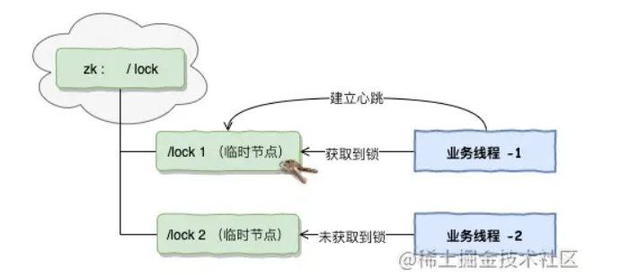


#### 5.4.1.2 `BASE` 理论


`BASE` 是 **Basically Available（基本可用）** 、**Soft-state（软状态）** 和 **Eventually Consistent（最终一致性）**的缩写。

是分布式系统实践的总结。


`BASE`理论的思想：如果无法做到强一致性，但每一个应用可以根据自身业务特点，使用适当的方式来使系统达到【最终一致性】。


牺牲了【强一致性】，来提高系统的可用性。系统中一部分数据不可用或不一致，只需要保证系统主体可用。


##### 5.4.1.2.1  基本可用

当分布式系统出现不可知的故障时，允许损失部分的【可用性】，但这绝不等价于系统不可用。


允许【响应时间上的损失】 ： 通常用户请求需要0.5s，当系统出现故障，响应时间变为3s

允许 【系统功能上的损失】 ： 正常时用户使用100%的功能，系统访问量突增时，部分非核心功能损失。


##### 5.4.1.2.2 软状态

`软状态`指 数据不一致的中间状态，即容忍 系统在不同节点的副本之间【同步数据过程】的延时。


##### 5.4.1.2.3 最终一致性

最终一致性强调的是系统中所有的数据副本，在经过一段时间的同步后，最终能够达到一个一致的状态。


#### 5.4.1.3  `XA`协议

`XA` 是分布式协议，由Tuxedo提出， `XA`中分2部分`TM` (Translation Manager)事务管理器 和 `RM` （Resource Manager） 本地资源管理器。


```
事务管理器 : 就是 2PC 中的协调者，负责各个本地资源管理器的提交和回滚。监控事务进程。

本地资源管理器 (参与者)  : 往往指 数据库。
```


#### 5.4.1.4 分布式事务实现手段

分布式事务实现的手段通常有  `2pc` `3pc` `TCC` `MQ事务` 


##### 5.4.1.4.1`2PC`

两阶段提交 ( two - phase - commit) ，用于保证不同节点上的分布式事务一致性。

```
需要引入一个协调者来管理所有节点，负责各个节点的提交和回滚，确保这写节点正确提交操作结果，若事务失败，回滚那些成功的小部分节点，并返回整个分布式事务的失败。 (例如zookeeper的leader节点)
```


###### `2pc` 流程

两阶段指 `投票阶段`和 `申请阶段`


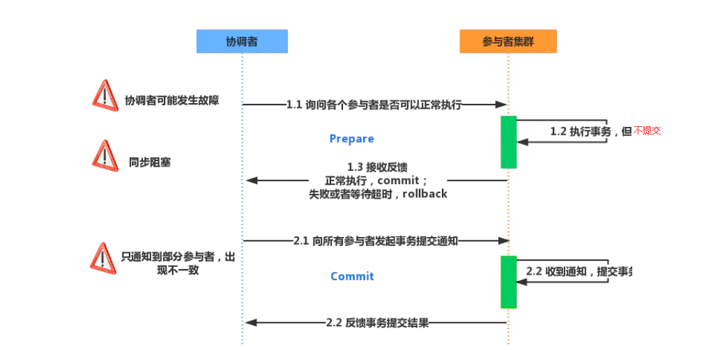


`投票阶段`

协调者向各个参与者询问是否正常执行，此时协调者阻塞等待各个参与者发来响应。

参与者如果正常执行则返回yes否则返回no

当所有参与者都返回了响应，进入提交阶段


`申请阶段`

这个阶段协调者会根据参与者发来的响应，执行 doCommit 或者 doAbort 操作


如果参与者都返回yes，则向参与者发送 doCommit，等待参与者返回 doCommit的结果 haveCommited。

如果协调者收到no,则向所有的参与者发送 doAbort ，告诉他们回滚事务，并等待doAbort的结果 haveCommited。

协调者收到全部 haveCommited 消息表示2pc事务结束


###### `2pc`的问题


同步阻塞问题：  2pc中 本地资源管理器是 事务阻塞型。其他资源管理器想访问临界区资源需要阻塞。

协调者单点故障： 协调者如果宕机会导致整个系统停滞。例如在提交阶段，所有资源管理器都在等待doCommit命令或者doAbort命令

数据不一致问题： 协调者向参与者发送 doCommit时宕机，只有部分参与者提交了事务。未收到的参与者出现数据不一致问题。

消息丢失： 如果协调发出doCommit命令后宕机，而唯一接收到该命令的参与者也宕机，即使通过选举协议推选出新的协调者，也没人知道事务是否被已经提交。


##### 5.4.1.4.2 `3pc`

三阶段提交，是对2pc的改进。

```
引入了超时机制 和 准备机制。  解决了同步阻塞，数据不一致问题
```


```
canCommit阶段

preCommit阶段

doCommit阶段
```


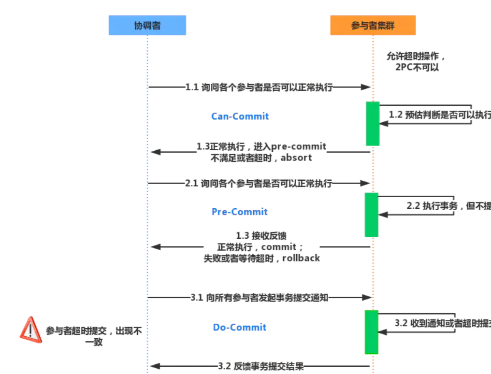


##### 5.4.1.4.3 `TCC`

`TCC` 是柔性事务的一种实现方式 ，`TCC` 分为3个阶段  `try` `confirm` `cancel`  


```
TM  事务管理者 ，等同于zookeeper的leader

try 阶段,TM调用全部本地资源管理器的 try接口，通知他们检查业务，预留资源。成功返回ok失败返回fail 。如果所有 资源管理器都返回ok则执行 confirm 否则执行cancel

confirm 阶段 ， TM通知  RM提交try阶段做出的修改，如果全部成功则事务结束。有1个失败则执行 cancel 。如果失败则重试，或人工处理

cancel 阶段 如果confirm阶段有任意1个 失败，则执行cancel 回滚那些返回ok的本地资源管理器。 如果失败则重试，或人工处理
```


通常 `confirm` 和 `cancel` 阶段失败会默认使用`重试` （注意业务的幂等性）。如果超过重试次数，需要人工介入。


`TCC` 每个阶段由代码控制，避免长事务，性能更好。


###### 空回滚

如果try阶段返回了失败，则进行cancel阶段的时候，不应该对这个资源管理器进行回滚。否则出现空回滚现象。


###### 幂等

TCC 会引入重试机制，所以必须保证接口的幂等性。或者说不应该重试那些已经成功调用的 分支事务。

```
解决： 记录每一个 分支事务的try调用状态，已经成功的分支事务不会重试。
```


悬挂

由于借助网络的原因，有可能出现 cancel接口先于 try接口调用的情况，此时本地资源管理器为当前分布式事务准备的预留资源永远也不会被释放。

```
解决思路 :  cancel 被调用以后，try就不能被调用。
```


### 5.4.2 知识点总结


#### 5.4.2.1 柔性事务/刚性事务


`刚性事务` 强调的是分布式系统中，在任意时刻都应该整体保证 `强一致性`。 

例如`2pc` `3pc` 就是刚性事务。`2pc` `3pc` 业务代码无侵入方案


`柔性事务` 强调的是`最终一致性`，柔性事务允许在短暂的过程中，数据存在不一致性，但最终数据会一致。

例如：  `TCC`  业务侵入方案

 `MQ事务`  依赖于消息队列的场景。

`本地消息表`


## 5.5  雪花算法

是一种分布式ID生成算法。生成一个64bit 的ID ，这64bit分割成多段。


```
第1个bit位    保留
第2-42bit位   41位表示时间戳，精确到毫秒级别
第43-52位     10位表示专门负责生产序列的工作机器ID //这部分就是可以根据业务自定义。例如根据不同业务令号段
第53-64位     12位表示序列号。这意味着每毫秒，最多可以产生2^12次方个不同的序列

```


### 5.5.1 雪花算法优缺点

优点：

```
1.毫秒数在高位，递增序列在低位，保证作为索引是总体递增趋势的，避免频繁的页分裂，插入效率高

2.作为索引，仍然有较好的区分度。索引效率高

3.不依赖3方库，以服务的方式部署，生成ID性能好

4.生成不依赖数据库，完全内存中计算生成

5.可以根据自身业务分配Bit位

6.可生成的容量大： 每毫秒可支持产生 2^12次方个不同的序列
```


缺点：

```
1.强依赖机器时钟，如果机器上回拨时钟，会导致发号重复或者服务不可用。

2.不是严格上全局递增的
```


### 5.5.2 时钟回拨问题

由于雪花算法是强依赖于服务器时间的，如果机器发生故障，导致对事件进行回拨。那么会导致生成的ID重复。


解决办法：

```
保存一段时间内每台机器在这1毫秒内产生ID的最大值，如果发生了时间回拨，则从最大值+1处开始继续生成ID

如何检测到发生时间回拨?
保存一段儿时间内的时间戳，如果时间回拨出现在保存内的时间戳，则为发生时间回拨。
如果超出保存的时间段内，则无法检测。
```


# 6. netty


什么是BIO NIO  AIO

```
首先需要说明什么是IO ？ 在CSAPP中这样描述到: 输入input指的是数据从外部设备复制到主存的过程。外部设备指: 键盘等硬件设备，磁盘，以及网络。
对于Netty来说，它更注重网络的IO，而output指得就是把数据从主存复制到上述外部设备的过程。

而BIO NIO AIO 分别是对待IO事件的不同处理手段。

以网络IO为例，网络IO通常指计算机借助于Internet端对端的交流。在高层面上看也就是Socket-Socket上的连接，但事实上数据的交换需要经过层层硬件的支持，例如内存到网卡的缓冲区交换，网卡到网络上的交换，数据包在IP层的路由，甚至网络拥塞时交换机有权利直接丢弃数据包(在TCP层会重传解决)，最终到达对方的计算机。

BIO 是同步阻塞IO，在IO事件没有完成时，也就是数据传输过程中，线程会阻塞下来等待当前IO完成。当IO完成以后，线程才能继续执行下去

NIO 是同步非阻塞IO，NIO借助Selector组件，可以监听多个IO通道，当有1个或任意多个通道完成IO事件时，会通知Selector,再由单工作线程依次处理IO任务.线程并不是傻傻的阻塞等待一个未知的网络环境完成IO任务，而是谁(channel)完成了我就为谁服务。对于大多数IO密集型而不是cpu密集型的任务来说，用户的一次请求，可能大部分时间都消耗在了IO上，而当IO完成，处理数据的时间非常短。那么为每一个IO通道都建立一个阻塞线程(也就是BIO)服务会浪费相当多的资源。早期的Tomcat并不支持NIO模型，到8以后NIO作为默认的模型。


AIO 称为异步非阻塞IO ，
```


# 7.项目

微服务的模块

```
core : 完成功能查询
```


为什么不直接使用Redis 的Geo?

```
Geo可以考虑缓存全部数据 和 部分数据。
首先说全部数据的情况,由于数据库磁盘内的数据量可能非常大,同时支持后台动态扩展数据库内的数据，如果缓存全部数据将消耗过大的内存。

如果考虑缓存部分数据，那么就需要确保当前查询点x,y 以x,y为圆心,offset为半径的圆必须在缓存的区域内,否则不能确定当前找到的数据是最近点。那么直接使用Geo缓存数据点就不够了,我们必须对这个Geo的边界也需要定义。

所以自定义了一个CacheBlock的数据结构
```


```
缓存大体上分2类

缓存全部:  缓存全部是最先排除掉的，首先考虑扩展性，如果表内的数据增多，内存肯定不够，在Redis中也会key问题，阻塞主线程。其次，后台CMS管理支持动态更新表内数据，只要更新表内数据，这意味着需要更新/删除表内数据。可能会导致缓存击穿


缓存部分：  缓存全部，首先非常简单，如果缓存部分，就需要考虑缓存哪部分?怎么缓存?如何判断命中?

1.先解释一下如何判断命中? 首先是查询矩形框, 如果查询点x,y 以 offset为半径的圆,都能包含在矩形框内，则判断命中。 计算圈内最近点即可。那么必须定义一个专门的缓存数据结构包含边界信息，以及测量点信息，来判断是否命中。 这里最后的实现方案是,边界信息和最终点的数据分离，保证判断命中时，无需加载坐标点的信息。

2.缓存哪部分?  这里有2种分歧: 按照固定好的网格划分，9，16，25等分,计算区域内点密度最高的区域。可以控制在指定内存下缓存最多的区域。
这种实现简单,但分多少等分是合理的呢，同时相对来说，这不是一个动态的缓存。 
另外一种是，根据查询，动态更新区域缓存，不再固定区域网格，即对于那些未命中的查询，更新缓存。


3. 最终的实现方案:  使用动态更新区域缓存,由于Redis可以执行lua脚本，通过lua脚本来检查缓存是否命中，如果命中则返回对应的坐标点信息。
在所有坐标点中返回一个最近的坐标。
为什么使用lua脚本? 一开始写代码时使用的是java,考虑本地存储边界信息，加跨判断，更新Redis以后通过Nacos推送配置更新到各个微服务。由于 更新本地缓存+Redis缓存不是一个原子操作,考虑的细节有点多...就换成Lua脚本，通过Redis天然单线程规避分布式一些的问题。


4. 合并问题： 如果有2个或者多个区域重叠覆盖了多次，怎么办？启用定时任务合并这些缓存。

```


缓存框 CacheBlock 的内部结构

```java
public class CacheMapping {
    
    Long version;
    
    List<CacheBlock> cacheBlocks = new LinkedList<>();
    
    public Long getBlockIdIfInclude(Point p,Double offset){
        Iterator<CacheBlock> iterator = cacheBlocks.iterator();
        while (iterator.hasNext()){
            CacheBlock next = iterator.next();
            if (next.getTop()>=p.getLongitude()+offset &&
                    next.getBottom()<= p.getLongitude()-offset &&
                    next.getLeft()<= p.getLatitude()-offset &&
                    next.getRight()>= p.getLatitude()+offset){
                return next.getBlockId();
            }
        }
        return null;
    }
    public void addBlock(CacheBlock cacheBlock){
        cacheBlocks.add(cacheBlock);
    }
}


public class CacheBlock {

    private Long blockId;

    private Double top;
    private Double bottom;
    private Double left;
    private Double right;

    List<Point> points;
}


public class Point {

    Double longitude;

    Double latitude;

    @Override
    public String toString() {
        return latitude+","+latitude;
    }
}
```

为什么要使用这个cache?

```
因为最近代替点只缓存单某个点是没用的，无法说明任意一个缓存单点是当前查询点的最近点。最近测量点不是孤立的2个点之间的关系，而是查询点与周围其他点之间的关系。
```


如何判断缓存命中？

```
记录缓存的矩形框边界  left ,top ,right ,bottom. 

缓存必须以 矩形框为一个单位。

查询输入经纬度 x,y , 扩容offset，   

则判断命中: left<=x±offset <= right &&   bottom<=y±offset<=top
```


合并问题

```
每个缓存是一个矩形框, 有可能多个 缓存框之间有数据重叠。数据重叠就造成了内存的浪费。

提出合并策略，维护一个重叠列表，保存了具有重叠关系的2个缓存block,当这
```


一开始使用的方案 ： 本地存储Broder表，用于判断是否落入缓存内。如果落入则进一步请求Redis中的坐标缓存。

更新缓存时，更新本地表，然后同步到Redis中。

在编写代码的时候,遇到了非常严重的并发问题。

```
例如 : 本地存储同步到缓存时,因为经过网络，是一个重量级的操作，考虑使用异步完成。在单机应用上就遇见了并发问题，如果缓存还没有同步到Redis,怎么办？


微服务a使用的是旧数据做了修改，请求到Redis，微服务b使用的是新数据做了修改请求到Redis。因为网络波动，b的请求先到Redis，a后到，导致Redis中数据是旧数据，怎么办？ 时间戳版本号。旧版本丢弃。做出的修改因为是缓存，最终由数据库查询兜底。
```


# 8.  开放答题


你收获最大的一件事是什么？

```
我校的自习室是所有院共用的， 我和一个关系特别好的教授，在院里专门申请了一个自习教师，帮助本专业同学 专门用于计算机编程, 在校期间无论是周1-5还是周末节假日，有空就会去自习室学习。
在自习室认识了很多一起学习奋斗的好伙伴，以及超越同层次学生的技术。
```


你受过最大的挫折?

```
我校有1个推免保研的资格,不过我是GPA第2的，第一那个同学很厉害，无论怎么学都赶不上。
一度有一种挫败感，后面及时调整学习方向，关注就业，学习新的流行的技术。刷题，做项目，换一个赛道，写笔记，博客，带师弟学习等。 
获得的教训大概是， 努力重要，选择也很重要。
```


你对比同龄人的优势？

```
```


# 9. k8s

```
简述ETCD及其特点？
简述ETCD适应的场景？
简述什么是Kubernetes？
简述Kubernetes和Docker的关系？
简述Kubernetes中什么是Minikube、Kubectl、Kubelet？
简述Kubernetes常见的部署方式？
简述Kubernetes如何实现集群管理？
简述Kubernetes的优势、适应场景及其特点？
简述Kubernetes的缺点或当前的不足之处？
简述Kubernetes相关基础概念？
简述Kubernetes集群相关组件？
简述Kubernetes RC的机制？
简述kube-proxy作用？
简述kube-proxy iptables原理？
简述kube-proxy ipvs原理？
简述kube-proxy ipvs和iptables的异同？
简述Kubernetes中什么是静态Pod？
简述Kubernetes中Pod可能位于的状态？
简述Kubernetes创建一个Pod的主要流程？
简述Kubernetes中Pod的重启策略？
简述Kubernetes中Pod的健康检查方式？
简述Kubernetes Pod的LivenessProbe探针的常见方式？
简述Kubernetes Pod的常见调度方式？
简述Kubernetes初始化容器（init container）？
简述Kubernetes deployment升级过程？
简述Kubernetes deployment升级策略？
简述Kubernetes DaemonSet类型的资源特性？
简述Kubernetes自动扩容机制？
简述Kubernetes Service类型？
简述Kubernetes Service分发后端的策略？
简述Kubernetes Headless Service？
简述Kubernetes外部如何访问集群内的服务？
简述Kubernetes ingress？
简述Kubernetes镜像的下载策略？
简述Kubernetes的负载均衡器？
简述Kubernetes各模块如何与API Server通信？
简述Kubernetes Scheduler作用及实现原理？
简述Kubernetes Scheduler使用哪两种算法将Pod绑定到worker节点？
简述Kubernetes kubelet的作用？
简述Kubernetes kubelet监控Worker节点资源是使用什么组件来实现的？
简述Kubernetes如何保证集群的安全性？
简述Kubernetes准入机制？
简述Kubernetes RBAC及其特点（优势）？
简述Kubernetes Secret作用？
简述Kubernetes Secret有哪些使用方式？
简述Kubernetes PodSecurityPolicy机制？
简述Kubernetes PodSecurityPolicy机制能实现哪些安全策略？
简述Kubernetes网络模型？
简述Kubernetes CNI模型？
简述Kubernetes网络策略？
简述Kubernetes网络策略原理？
简述Kubernetes中flannel的作用？
简述Kubernetes Calico网络组件实现原理？
简述Kubernetes共享存储的作用？
简述Kubernetes数据持久化的方式有哪些？
简述Kubernetes PV和PVC？
简述Kubernetes PV生命周期内的阶段？
简述Kubernetes所支持的存储供应模式？
简述Kubernetes CSI模型？
简述Kubernetes Worker节点加入集群的过程？
简述Kubernetes Pod如何实现对节点的资源控制？
简述Kubernetes Requests和Limits如何影响Pod的调度？
简述Kubernetes Metric Service？
简述Kubernetes中，如何使用EFK实现日志的统一管理？
简述Kubernetes如何进行优雅的节点关机维护？
简述Kubernetes集群联邦？
简述Helm及其优势？
```


