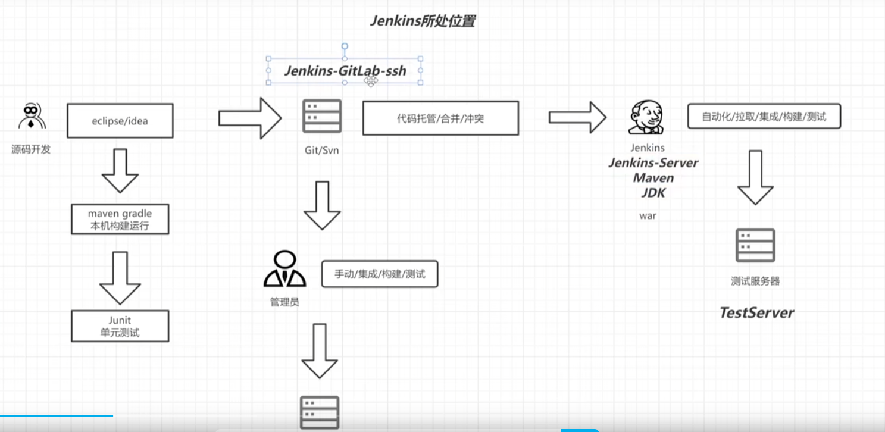
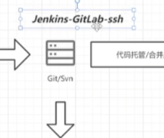
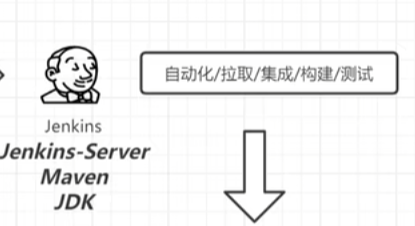
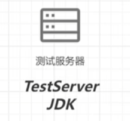

# 1.


# 2. 入门





## 2.1 部署

需要三台服务器：

```
Git服务器，用于处理git分支提交，合并的

第一台安装：  Jenkins-GitLab-ssh
```




```
Jenkins Server服务器

第二台：    Jenkins-Server-Maven-Jdk
```




```
第三台:     测试服务器 JDK
```





## 2.2 GitLab 安装

```
代码托管平台，也就是SVN,git的服务器
```


### 2.2.1 SSH 安装GitLab


