# 1.ECS Linux 服务器公钥秘钥SSH登录


[ECS Linux 服务器公钥秘钥SSH登录](https://www.cnblogs.com/dunitian/p/4970813.html)

https://www.cnblogs.com/dunitian/p/4970813.html

```dockerfile
ECS Linux 服务器公钥秘钥SSH登录
Ubuntu 14.04.1为例，设置步骤如下：

 

一. 生成密钥的公钥和私钥

# ssh-keygen -t rsa 

Generating public/private rsa key pair.

Enter file in which to save the key (/root/.ssh/id_rsa): 

Created directory '/root/.ssh'.

Enter passphrase (empty for no passphrase): #输入密码

Enter same passphrase again:                #输入密码

Your identification has been saved in /root/.ssh/id_rsa.

Your public key has been saved in /root/.ssh/id_rsa.pub.

The key fingerprint is:

              1c:37:a8:a3:65:a2:4a:89:ab:46:30:ad:54:d1:40:eb root@iZ28vo50eu5Z

二. 将生成的私钥（id_rsa）下载到本地的windows机器上，并把公钥导入到.ssh/authorized_keys 文件中去

#  cd /root/.ssh/

#cat id_rsa.pub > authorized_keys 

三. 设置sshd  服务器服务，打开以下设置：

 

RSAAuthentication yes 

PubkeyAuthentication yes

AuthorizedKeysFile      /root/.ssh/authorized_keys 

 修改以下设置： 

ChallengeResponseAuthentication no 

PasswordAuthentication no 

UsePAM no 

四. 重启ssh服务

#service ssh  restart 

五. 导入私钥到远程工具中，比如xshell。

     新建连接，点击左边用户身份验证：


```


# 2. 初始化一个Linux

安装一个jdk， 安装一个Redis， 安装一个MySQL


1.使用maven 帮助下载依赖

https://www.cnblogs.com/ddcoder/p/10374660.html

1.阿里云的maven镜像服务器配置

  1、保证电脑上已成功安装了JDK。运行java -version看看是否可以显示，如果未成功安装，请查阅相关教程。

 

  2、安装Maven。这一步也简单，在Maven官网 http://maven.apache.org/download.cgi 下载Maven可执行文件到本地，然后添加M2_HOME和MAVEN_HOME两个环境变量（值为Maven解压路径），并修改Path环境变量，将%H2_HOME%\bin加入Path环境变量即可。

​    详细请参考：https://www.cnblogs.com/happyday56/p/8968328.html

​    配置完成后，请看mvn -version，如果成功，可以看到mvn的版本信息。有些操作系统修改环境变量后，需要重启系统才会生效。

 

  3、修改仓库为aliyun的项目仓库，因为默认的中央仓库速度有点慢。

​    在Maven根目录下有个Conf的目录，下面有一个settings.xml配置文件，打开并在mirrors配置节中加入如下配置：

```shell
<mirrors>
    <mirror>
      <id>alimaven</id>
      <name>aliyun maven</name>
  　　<url>http://maven.aliyun.com/nexus/content/groups/public/</url>
      <mirrorOf>central</mirrorOf>        
    </mirror>
</mirrors>


参考博客
https://www.cnblogs.com/xxt19970908/p/6685777.html
```

其中depenencies配置节部分就是我们要下载的依赖包。

 

  5、查找我们需要的依赖包dependency。到 https://mvnrepository.com/ 搜索可以得到<dependency>查关配置，并粘贴入pom.xml文件。

 配置好的pom.xml应该如下

```xml
<?xml version="1.0" encoding="UTF-8"?>
<project xmlns="http://maven.apache.org/POM/4.0.0"
         xmlns:xsi="http://www.w3.org/2001/XMLSchema-instance"
         xsi:schemaLocation="http://maven.apache.org/POM/4.0.0 https://maven.apache.org/xsd/maven-4.0.0.xsd">
    <modelVersion>4.0.0</modelVersion>

    <groupId>com.example</groupId>
    <artifactId>content1</artifactId>
    <version>1.0-SNAPSHOT</version>
    <name>content1</name>
    <packaging>war</packaging>

    <properties>
        <maven.compiler.target>1.8</maven.compiler.target>
        <maven.compiler.source>1.8</maven.compiler.source>
        <junit.version>5.7.1</junit.version>
    </properties>

    <dependencies>
        <dependency>
            <groupId>org.apache.poi</groupId>
            <artifactId>poi</artifactId>
            <version>5.0.0</version>
        </dependency>
        <dependency>
            <groupId>mysql</groupId>
            <artifactId>mysql-connector-java</artifactId>
            <version>8.0.23</version>
        </dependency>
        <dependency>
            <groupId>org.mybatis</groupId>
            <artifactId>mybatis</artifactId>
            <version>3.5.6</version>
        </dependency>
        <dependency>
            <groupId>junit</groupId>
            <artifactId>junit</artifactId>
            <version>4.12</version>
            <scope>test</scope>
        </dependency>
        <dependency>
            <groupId>javax</groupId>
            <artifactId>javaee-api</artifactId>
            <version>8.0.1</version>
            <scope>provided</scope>
        </dependency>
        <dependency>
            <groupId>org.junit.jupiter</groupId>
            <artifactId>junit-jupiter-api</artifactId>
            <version>${junit.version}</version>
            <scope>test</scope>
        </dependency>
        <dependency>
            <groupId>org.junit.jupiter</groupId>
            <artifactId>junit-jupiter-engine</artifactId>
            <version>${junit.version}</version>
            <scope>test</scope>
        </dependency>
    </dependencies>

    <build>
        <plugins>
            <plugin>
                <groupId>org.apache.maven.plugins</groupId>
                <artifactId>maven-war-plugin</artifactId>
                <version>3.3.1</version>
            </plugin>
        </plugins>
    </build>
</project>
```


  6、进行命令行，cd进入D:\\mvn，运行 **mvn -f pom.xml dependency:copy-dependencies** 。在本地仓库就可以看到依赖包下载下来了。（本地仓库地址：C:\Users\Administrator\.m2\repository）

​    依赖库下载完成之后，会在D:\\mvn下自动建立一个target目录，我们需要的依赖库会整拷贝一份到这里。

 

  到此为止，我们的目的达到了。拿到了需要的依赖库包：）

下载完成后的包


## 2.1 配置Mysql

使用linux 的 wget命令下载MySQL 8.0

```shell
wget https://dev.mysql.com/get/Downloads/MySQL-8.0/mysql-8.0.25-linux-glibc2.12-i686.tar.xz
```


**这里注意到，下载下来的是以.tar.xz为结尾的文件**

.tar.gz 结尾可以使用 tar -zxvf 解压

.tar.xz 使用  tar -xvJf 解压


使用yum 配置mysql

```shell
yum install mysql

yum list mysql-server  //查询可用列表 
yum install mysql-server  //安装

```

查看日志文件

var/log/

其中mysql的日志文件

var/log/mysql/mysqld.log


mysqld服务启动不了，查看日志


3306端口被占用

```shell
lsof -i:3306    //查看占用3306端口的进程PID
kill -9 PID    //结束那个进程
```


## 	2.2. 安装jdk

```
java-1.8.0-openjdk-devel.x86_64  //通过Yum安装jdk1.8
```

## 2.3. 安装Redis

解压

```
tar -xzvf ./redis-6.2.5.tar.gz
```

进入到解压好的文件夹

```dockerfile
cd redis-6.2.5
```

安装 gcc编译器

```
yum install gcc
```

使用make命令

使用 make install


## 2.4. 安装配置mysql


```
yum list mysql

yum install mysql
```

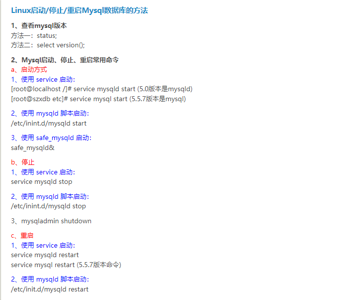


### 2.4.1 允许mysql远程访问


使用localhost 主机  ，mysql -uroot -p 登录mysql

修改权限：

```
//查看权限
select host from user where user='root';

//修改权限
update user set host = '%' where user ='root';

//刷新权限
flush privileges;
```


## 2.5 安装Nginx

通常使用 `yum install nginx` 可以一键安装，不过所有的配置都是默认的。

```
nginx 支持插件,在官方中插件被称为module 
nginx 无法热启动插件,每次添加插件的时候,都必须重新构建  'makeFile' 并且 编译安装。

# make
# make install
```


在nginx 官网中，你可以查阅相关build Sources的参考资料。

https://nginx.org/en/docs/configure.html


### 2.5.1 安装依赖

编译makeFile 需要安装gcc等一系列依赖

```
yum install gcc-c++

yum -y install gcc zlib zlib-devel pcre-devel openssl openssl-devel
```


这里统一设定 nginx的安装目录为  `/usr/local/nginx`

在非 `/usr/local/nginx`  的目录下，下载并解压nginx 本体压缩包。

下载地址https://nginx.org/en/download.html

```sh
#解压
tar -xvf nginx-1.18.0.tar.gz 
#解压之后不需要重新命名直接进去解压目录
#进入nginx-1.18.0目录 
cd /usr/local/nginx-1.18.0
```


### 2.5.2 构建makeFile

在nginx的根目录下执行`./configure` 命令就是构建makefile命令了。

同时，需要带有多个启动参数来完成相应的配置。

例如： `--prefix=` 用于配置编译安装nginx的目录位置。这里我们使用 `/usr/local/nginx`

​				`--with-http_stub_status_module`  表示启用 `http_stub_status_module` 模块。可以有多个相同参数。


下面是一个 makeFile配置命令的示例：

```sh
./configure --prefix=/usr/local/nginx \
--with-http_gzip_static_module \  
--with-http_stub_status_module \   
--with-http_ssl_module          


#--with-http_gzip_static_module \   启用ngx_http_gzip_static_module支持（在线实时压缩输出数据流）
#--with-http_stub_status_module \    启用ngx_http_stub_status_module支持（获取nginx自上次启动以来的工作状态）
#--with-http_ssl_module \          启用ngx_http_ssl_module支持（使支持https请求，需已安装openssl）
```

  


更多的参数参考Nginx官方配置文档

https://nginx.org/en/docs/configure.html


### 2.5.3 make/make install

正确输入2.5.2中的配置命令以后，如下图

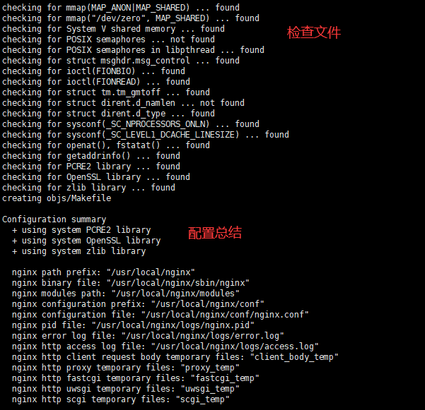


然后就可以执行 `make` 命令了。 

注意此时可能会报出一些依赖缺失的问题。 需要使用  `yum` 命令安装对应的命令。


执行`make`

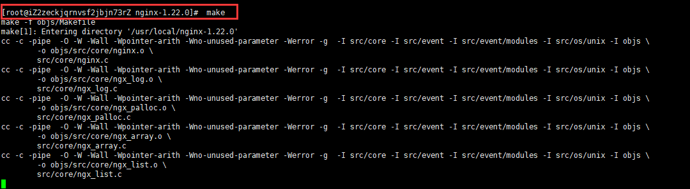

等待make完成无误以后，执行 `make install`


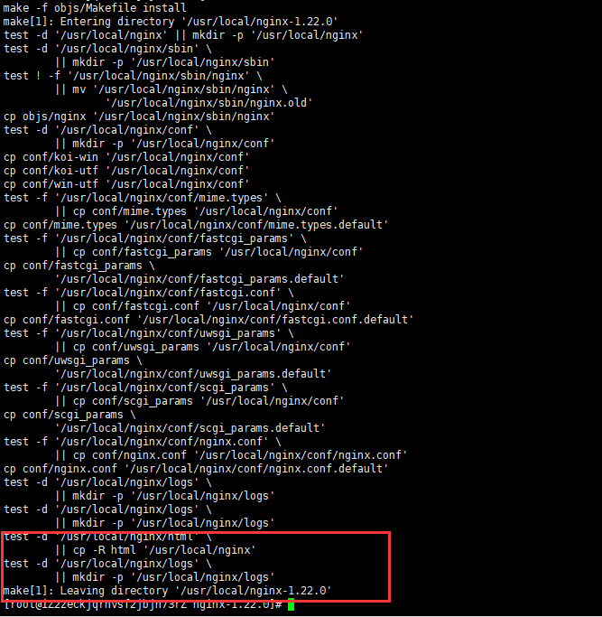


最终结果如果没有输出 `Error` 等问题，就是成功了。此时我们回到对应文件夹即可看到nginx安装的内容。

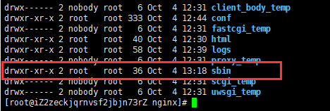

```
启动文件在 sbin 文件夹下。
```


然后就是一些善后工作了，配置环境变量，配置开机启动。


### 2.5.4 配置环境变量

```sh
export NGINX_HOME=/usr/local/nginx
export PATH=$PATH:$NGINX_HOME/sbin
```


### 2.5.5 配置开机启动任务

```sh
vim /lib/systemd/system/nginx.service
```


`nginx.service`内容

```properties
[Unit]
Description=The NGINX HTTP and reverse proxy server
After=syslog.target network-online.target remote-fs.target nss-lookup.target
Wants=network-online.target
[Service]
Type=forking
#自己nginx启动的pid文件自己找到文件目录
PIDFile=/usr/local/nginx/logs/nginx.pid
#自己nginx的启动文件 
ExecStartPre=/usr/local/nginx/sbin/nginx -t
ExecStart=/usr/local/nginx/sbin/nginx
ExecReload=/usr/local/nginx/sbin/nginx -s reload
#默认
ExecStop=/bin/kill -s QUIT $MAINPID
PrivateTmp=true
[Install]
WantedBy=multi-user.target
```


启动对应服务

```sh
#运行服务
systemctl start nginx.service

#设置开机自启
systemctl enable nginx.service
```


# 3. centOS 常用命令


 

## 3.1 nohup

```
nohup 英文全称 no hang up（不挂起），用于在系统后台不挂断地运行命令，退出终端不会影响程序的运行。
```


nohup 命令，在默认情况下（非重定向时），会输出一个名叫 nohup.out 的文件到当前目录下（nohup.out 是运行命令的输出终端，例如对于Java来说，使用System.out 输出的内容，将被保存到nohup.out文件中），如果当前目录的 nohup.out 文件不可写，输出重定向到 $HOME/nohup.out 文件中(也就是运行 nohup 命令时的目录)


语法如下：

```
 nohup Command [ Arg … ] [　& ]
 
 
 
# Command  ：要执行的命令。

#  Arg     ：一些参数，可以指定输出文件。

#  &       ：让命令在后台执行，终端退出后命令仍旧执行。
```


### 实例

以下命令在后台执行 root 目录下的 runoob.sh 脚本：

```
nohup /root/runoob.sh &
```

在终端如果看到以下输出说明运行成功：

```
appending output to nohup.out
```

这时我们打开 root 目录 可以看到生成了 nohup.out 文件。

如果要停止运行，你需要使用以下命令查找到 nohup 运行脚本到 PID，然后使用 kill 命令来删除：

```
ps -aux | grep "runoob.sh" 
```

参数说明：

- **a** : 显示所有程序
- **u** : 以用户为主的格式来显示
- **x** : 显示所有程序，不区分终端机

另外也可以使用 **ps -def | grep "runoob.sh**" 命令来查找。

找到 PID 后，就可以使用 kill PID 来删除。

```
kill -9  进程号PID
```

以下命令在后台执行 root 目录下的 runoob.sh 脚本，并重定向输入到 runoob.log 文件：

```
nohup /root/runoob.sh > runoob.log 2>&1 &
```

**2>&1** 解释：

将标准错误 2 重定向到标准输出 &1 ，标准输出 &1 再被重定向输入到 runoob.log 文件中。

- 0 – stdin (standard input，标准输入)
- 1 – stdout (standard output，标准输出)
- 2 – stderr (standard error，标准错误输出)


## 3.3 PS 

PS (process status) 命令用于显示当前进程的状态，类似于 windows 的任务管理器。

语法

```
ps [options] [--help]
```


**参数**：

- ps 的参数非常多, 在此仅列出几个常用的参数并大略介绍含义

- -A 列出所有的进程

- -w 显示加宽可以显示较多的资讯

- -au 显示较详细的资讯

- -aux 显示所有包含其他使用者的行程

- au(x) 输出格式 :

  ```
  USER PID %CPU %MEM VSZ RSS TTY STAT START TIME COMMAND
  ```

  - USER: 行程拥有者
  - PID: pid
  - %CPU: 占用的 CPU 使用率
  - %MEM: 占用的记忆体使用率
  - VSZ: 占用的虚拟记忆体大小
  - RSS: 占用的记忆体大小
  - TTY: 终端的次要装置号码 (minor device number of tty)
  - STAT: 该行程的状态:
    - D: 无法中断的休眠状态 (通常 IO 的进程)
    - R: 正在执行中
    - S: 静止状态
    - T: 暂停执行
    - Z: 不存在但暂时无法消除
    - W: 没有足够的记忆体分页可分配
    - <: 高优先序的行程
    - N: 低优先序的行程
    - L: 有记忆体分页分配并锁在记忆体内 (实时系统或捱A I/O)
  - START: 行程开始时间
  - TIME: 执行的时间
  - COMMAND:所执行的指令


查找指定进程格式：

```
ps -ef | grep 进程关键字
```

显示所有进程信息，连同命令行

```
# ps -ef //显示所有命令，连带命令行
UID    PID PPID C STIME TTY     TIME CMD
root     1   0 0 10:22 ?    00:00:02 /sbin/init
root     2   0 0 10:22 ?    00:00:00 [kthreadd]
root     3   2 0 10:22 ?    00:00:00 [migration/0]
root     4   2 0 10:22 ?    00:00:00 [ksoftirqd/0]
root     5   2 0 10:22 ?    00:00:00 [watchdog/0]
root     6   2 0 10:22 ?    /usr/lib/NetworkManager
……省略部分结果
root   31302 2095 0 17:42 ?    00:00:00 sshd: root@pts/2 
root   31374 31302 0 17:42 pts/2  00:00:00 -bash
root   31400   1 0 17:46 ?    00:00:00 /usr/bin/python /usr/sbin/aptd
root   31407 31374 0 17:48 pts/2  00:00:00 ps -ef
```


## 3.4 yum


- 列出所有可更新的软件清单命令：**yum check-update**

- 更新所有软件命令：**yum update**

- 仅安装指定的软件命令**：**yum install <package_name>**

- 仅更新指定的软件命令：**yum update <package_name>**

  

- 列出所有可安裝的软件清单命令**：**yum list  **<software_name>**

  

- 删除软件包命令：**yum remove <package_name>**

- 查找软件包命令：**yum search <keyword>**

- 清除缓存命令:
  - **yum clean packages**: 清除缓存目录下的软件包
  - **yum clean headers**: 清除缓存目录下的 headers
  - **yum clean oldheaders**: 清除缓存目录下旧的 headers
  - **yum clean, yum clean all (= yum clean packages; yum clean oldheaders)** :清除缓存目录下的软件包及旧的 headers


## 3.5 whereis

Linux whereis命令用于查找文件。

该指令会在特定目录中查找符合条件的文件。这些文件应属于原始代码、二进制文件，或是帮助文件。

该指令只能用于查找二进制文件、源代码文件和man手册页，一般文件的定位需使用locate命令。


find -name <名字>


## 3.6 rm

rm -rf <文件夹名> 删除整个文件夹及里面的项目


## 3.7 free

free用于查看内存使用情况

```
包括物理内存(RAM)和交换内存(swap)
```


```shell
$ free -m
              total        used        free      shared  buff/cache   available
Mem:           7822         321         324         377        7175        6795
Swap:          4096           0        4095


$ free -h
              total        used        free      shared  buff/cache   available
Mem:           7.6G        322M        324M        377M        7.0G        6.6G
Swap:          4.0G        724K        4.0G
```


```
-m 选项是以MB为单位来展示内存使用信息;
-h 选项则是以人类(human)可读的单位来展示。


total  表示总共有 7822MB 的物理内存(RAM)，即7.6G。
used   表示物理内存的使用量，大约是 322M。
free   表示空闲内存;
shared 表示共享内存?;
buff/cache 表示缓存和缓冲内存量; Linux 系统会将很多东西缓存起来以提高性能，这部分内存可以在必要时进行释放，给其他程序使用。
available 表示可用内存;
```


## 3.8 top

`top` 命令一般用于查看进程的CPU和内存使用情况；当然也会报告内存总量，以及内存使用情况，所以可用来监控物理内存的使用情况。


参考http://c.biancheng.net/view/1065.html

```
top
```


## 3.9 `vim`


### 3.9.1 编辑模式


vim有 三种模式 ：  

```
命令模式(command mode)  命令模式更像一种命令选择模式。用于选择其他的模式
输入模式(insert mode)   用于编辑文本的模式    
底线模式(last line mode) 切换到最底层，输入一些更多的命令，以完成对vim的更多控制
```


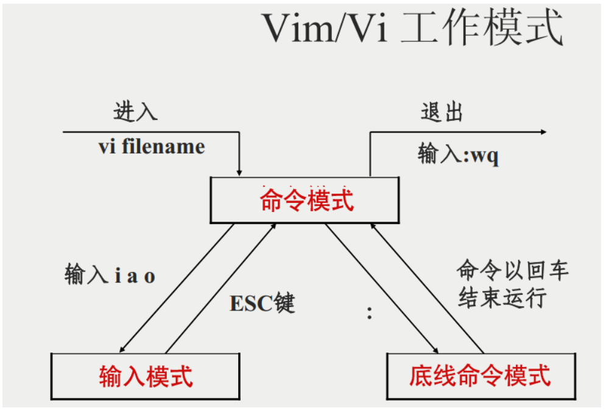


vim的命令是大小写敏感的


#### 命令模式操作：


按`i` ， `a` ，`o` 切换到输入模式，进入输入模式后可以编辑文本。    按`esc` 从输入模式退出,进入到命令模式

按`:`切换到底线模式

`:wq`  退出文本并保存

`:q!` 强追退出文本，不保存


更多的命令模式操作：

```
<n> + Enter     //表示光标向下移动 n行

<n> + Space    //表示光标右移动n个字符


G            //移动到文档的最后一行

<n> + G     //移动到文档第 n行

gg          // 移动到文本的第1行
```


删除操作:

```shell
x:  向后删除一个字符 等于delete
X:  向前删除一个字符 相当于backspace

<n> + x         #<n>可以是任意的数字按键,向后删除n个字符。 可以同时按 <n> + x  也可以分步按

dd              #剪切光标所在的一整行
p               #将剪切的一整行，粘贴到当前光标所在行的 下一行  (另起新行)
P               #粘贴到光标所在行的 上一行(另起新行)
yy              #复制当前行
u               #后退
ctrl+r          #前进
```


替换操作：

```
r               #替换操作，只能替换当前光标所在字符1次。替换完成结束
R               #持续替换，直到按下Esc退出
```


显示行号

```
:set nu          #显示行号

:set nonu        #隐藏行号
```


#### 输入模式操作：


支持的按键功能：

```
Enter 换行
backspace 退格
delete   删除

方向键:    移动输入光标
Home/End : 切换到行首 或 行尾

Page Up/Page down   上下翻页

insert :  切换插入模式/替换模式

Esc:  退出输入模式
```


#### 底线模式操作


搜索：  按`/` 进入底线模式的搜索

```shell
/<word>            #输入/<word>按下Enter以后，会搜索光标之下字符串<word>并高亮显示

例如: /3


?<word>         #从光标向上寻找 <word>字符串


n        #下一个匹配的查找

N        #上一个匹配的查找
```

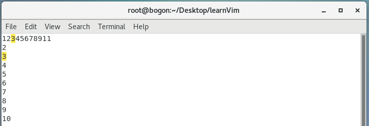


搜索并替换：

```shell
:<n1>,<n2>s/<word1>/<word2>/g           #在第n1行到n2行之间,把<word1>替换为<word2>

										#n2不能超过实际的行数，否则会报错。最后一行到底是第几行？所以更常用的是使用$省略
										#最后一行
										
:<n>,$s/<word1><word2>/g               #从第<n>行到文档末尾，将<word1>替换为<word2>
										#如果找不到匹配。会提示 Pattern not found\
										
:1,$s/<word1><word2>/gc                #从第1行，到文档末尾，将word1替换为word2,但是在替换的时候，需要用户确认是否替换
```


使用搜索替换实现批量注释：

```sh
:<start>,<end>s/^/<注释符号>/g      #向需要插入注释的行号前，批量插入注释符号，实现批量注释


#一般最好和  set nu 一起使用，显示行号
```

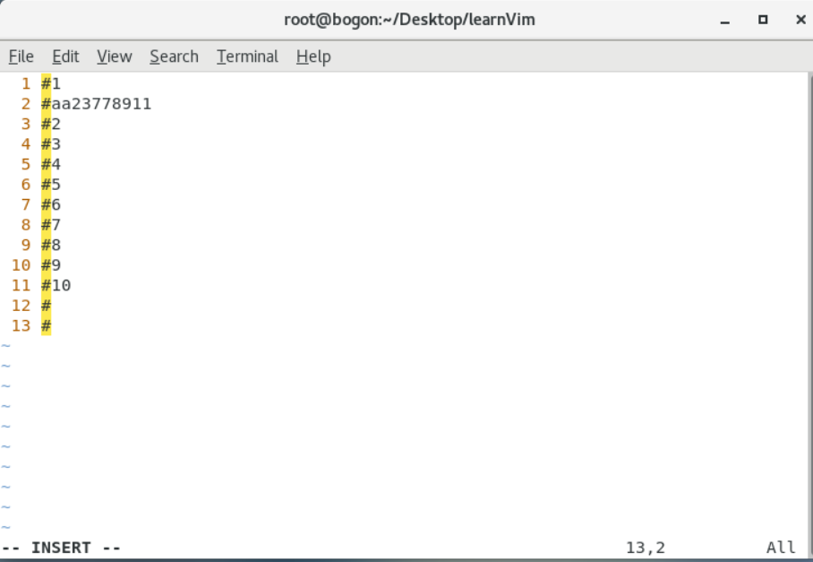


## 3.10 netstat

参考

https://www.runoob.com/linux/linux-comm-whereis.html


常用

```
netstat     -anp    //显示系统端口使用情况
```


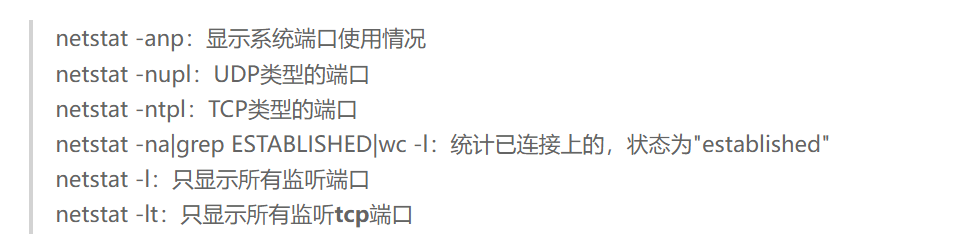


## 3.11 chmod

```
(change mode)

Linux/Unix 文件权限分三个等级:      文件所有者Owner,用户组Group, 其他用户 Other users

每个等级都有3种权限: 读,写,执行
```


```
Owner ,Group ,Other 分别拥有3个bit

3种权限总是按照:  读,写,执行 排列的。

当"读"bit为1表示可读，同理 "写","执行"
```


```
当读写执行权限都拥有，则二进制位为111 八进制的数值为7
同理其他情况。

所以经常会看见  chmod 777 <file>  表示对ugo三者都有完全的读写执行权限。
```


### 语法


```
chmod [-cfvR] [--help] [--version] <mode> <file>
```

具体解释：

```
<file>  具体文件的路径。

<mode>  修改的权限

-R : 对目前目录下的所有文件与子目录进行相同的权限变更(即以递归的方式逐个变更)

-v : 显示权限变更的详细资料

-f : 若该文件权限无法被更改也不要显示错误讯息

-c : 若该文件权限确实已经更改，才显示其更改动作
```


<mode> 的解释如下

```
[ugoa] [+-=] [rwxX] 
```

```
u 表示 owner
g group
o other
a all 全部


+ 表示添加权限
- 表示取消权限
= 设置指定用户权限的设置，即将用户类型的所有权限重新设置
```


比较简单的一种写法是 使用八进制。 直接对权限bit赋值

```
chmod <bitValue> <file>

例如: chmod 777 test.sh

chmod 755 test.sh
```


## 3.12  shutdown


shutdown是最常用也是最安全的关机和重启命令，它会在关机之前调用fsck检查磁盘，其中-h和-r是最常用


立即关机

```
shutdown now
```


重启

```
shutdwon -r now
```


定时关机

```sh
shutdown -h +10   #10分钟后关机
shutdown -h 10:53
```


## 3.13   ls


### 3.13.1 配置ll

配置 `ll` 命令代替 `ls -l`


vim `~/.bash_profile`

`~` 仅能影响当前用户。想要作用全局则需要修改 `/etc/bashrc` 文件


添加如下命令：

```
alias ll='ls -alF'
alias la='ls -A'
alias l='ls -CF'
```

保存以后，使用 `source`  


`source ~/.bash_profile`


## 3.14 tcping

用于查看目的地址的某个端口号是否开放。


例如

```sh
tcping 192.168.1.53 80
#tcp ip对应的80端口
```


## 3.15 netstat

https://www.runoob.com/linux/linux-comm-netstat.html

`netstat` 用于显示整个Linux的网络状态。


```
netstat [-options][-A<网络类型>][--ip]
```


### 3.16 `kill`

在Linux中，有两个信号 `SIGKILL` `SIGTERM` （sign kill , sign terimal）


`kill -9 <PID>` 向进程发送  `SIGKILL` 信号，无条件终止进程。

```sh
kill -9 21000
```


`kill <PID>` 向进程发送 `SIGTERM` 信号，此信号可被中断，留给线程保存工作内从/清理工作

```sh
kill 21000
```


## 3.17 `df`

用于 查看文件系统磁盘使用情况（disk free）。

https://www.runoob.com/linux/linux-comm-df.html


语法：

```
df [options]... [FILE]...
```


- 文件-h, --human-readable 使用人类可读的格式

- 文件-a, --all 包含所有的具有 0 Blocks 的文件系统


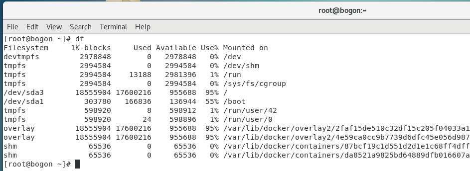


```
mounted on 挂载点。
```


### 3.17.1 tmpfs

临时文件系统 `temporary file system`。是基于内存的[文件系统]。


## 3.18 `fdisk`

`fdisk` 命令用于磁盘分区。

语法：

```sh
fdisk [options] <disk>  #改变分区列表

fdisk [options] -l <disk>  #列出当前的分区

fdisk -s <partition>  #指定block中的分区大小
```

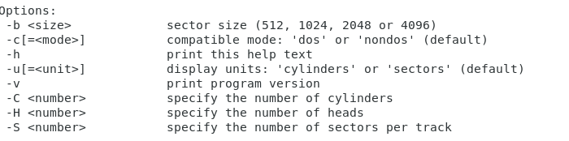

```
可选操作:

-b <size>   扇区大小
-C <number> 指定柱面数量
-H <number> 指定磁头数量
-S <number> 指定每一个磁道上柱面的数量。
```


### 3.18.1  fdisk -l

```sh
Disk /dev/sda: 107.4 GB, 107374182400 bytes, 209715200 sectors #磁盘名称:大小 , 扇区数量
Units = sectors of 1 * 512 = 512 bytes 
Sector size (logical/physical): 512 bytes / 512 bytes #1个扇区的大小
I/O size (minimum/optimal): 512 bytes / 512 bytes #一次IO大小
Disk label type: dos    #硬盘标签类型 dos
Disk identifier: 0x00050d01 #硬盘id

   Device Boot      Start         End      Blocks   Id  System
/dev/sda1   *        2048      616447      307200   83  Linux
/dev/sda2          616448     4810751     2097152   82  Linux swap / Solaris
/dev/sda3         4810752    41943039    18566144   83  Linux


#Device 分区设备名
#Boot 是否为引导分区
#start 起始柱面
#end 结束柱面
#blocks 分区大小，单位KB
#id：分区内文件系统的 ID。在 fdisk 命令中，可以 使用 "i" 查看。
#System：分区内安装的系统是什么。
```


### 3.18.2 给磁盘扩容

https://blog.csdn.net/qq_44297579/article/details/107318096


扩容以后，重启后挂载点消失，如果不配置需要每次都手动挂载。

为此修改配置自动挂载。

https://blog.csdn.net/buxiaoxindasuile/article/details/49612867

使用方法1可以。方法2无效。


## 3.19 `reboot`

立即重启。


## 3.20 `wget`


下载到指定位置：

```sh
wget -P <file_system_path> <romate_url>

#file_system_path 文件系统的路径
#romate_url 远程地址得url
```


## 3.21 `scp`

`secure copy` 安全复制命令。 from server1 to server2。

`scp` 是基于【ssh】得【安全】 【远程文件拷贝】命令。


语法：

````shell
scp [options] <file_source> <file_target>

//file_target :   [user@host:path]  包含用户@主机地址
````


例如：

```
scp 
```


参数：

`-r` ： 递归复制整个目录。


## 3.22  `lvm`


`pvs`  查看所有物理卷的信息。


示例 ：

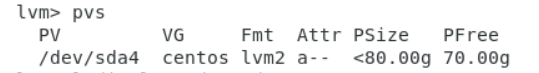


`lvdisplay  <VG_name>` 查看对应卷的详细信息。

例如：

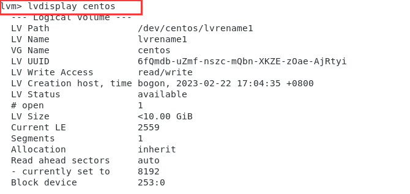


## 3.23 `cfdisk`


## 3.23  rsync

`rsync` 是一个常用的Linux命令，用于文件同步。


它可以让 本地机器和远程机器之间，  或者两个本地目录之间同步文件。

`rsync`会检查两者的文件，当文件有变动时仅传输变动的部分。（默认检测规则是 文件大小/修改时间）


语法：

```
rsync [options] <source_path>  <remote_path>


//remote_path  :  [user@host:path]  包含用户@主机地址
```


通常是 

`rsync -av <source_path> <remote_path>`


### `-r` 

表示递归。也就是包含子目录。


### `-a`

`-a`可以代替 `-r`，除了递归同步以外，还会同步元信息（权限，修改时间）。


### `-v`

输出详细信息。

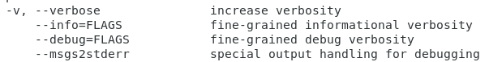


## 3.24 `ssh`

`ssh` (Secure Shell)  可以在不安全的网络上，用于安全远程登录和其他安全网络服务的协议。


通过`ssh client` 可以让我们连接到任意一台`ssh server`服务器上。

语法：

```sh
ssh user@remote -p port
```


## 3.25 `dirname`

`dirname` 命令 需要传入一个文件名。 返回这个文件的目录。


`dirname`命令会删除 文件名最后的`/`。

如果输入的文件名，不包含地址信息，那么会输出一个`.` 表示当前文件夹。


语法：

```
dirname [option] <NAME>

//其中 <NAME> 表示文件名。
```


例如：

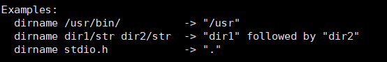


## 3.26 `basename`

和`dirname`相反，传入一个可带有地址的文件名，返回干净的文件名。除去全部的目录信息。


也可以移除文件后缀。


语法：

```sh
basename <NAME> [SUFFIX]

//SUFFIX表示输入文件的后缀， 如果不输入则不会删除文件后缀，如果输入则会删除后缀

basename [OPTION...] <NAME>...
```


options :

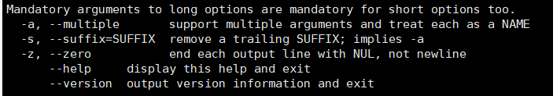


`-a` 表示支持一次性过滤多个 `name`

`-s` 输入后缀。  以参数的形式传入后缀。 例如`basename -s .a /usr/bin/sort.a ` 输出 `sort`


例如：

```shell
basename /usr/bin/sort.a   	 #sort.a

basename /usr/bin/sort.a .a  #sort
```


## 3.27 `ln`


### 3.27.1 软连接

软连接是 `Linux`中一个常用命令。它为某一个文件在另一个位置创建一个链接。不必消耗空间拷贝多份。

软连接也称 `Symbolic link` 符号链接。类似于windows的快捷方式。

软连接是一个文件文本，指向另一文件的位置信息。


### 3.27.2 硬链接

`Linux filesystem`中 磁盘中的文件都有一个唯一的编号（索引节点 Inode index）。

Linux允许多个文件指向同一个索引节点。多个文件指向同一个索引节点，这样称为【硬链接】。


硬链接的目的是： 防止误删。只有不存在硬链接的索引节点才会被释放。


### 3.27.3 `ln命令`

用于创建一个连接，可以是软连接。 默认创建的是 硬链接。软连接需要参数 `-s`

语法：

```
ln [OPTION...] <target> <link_name>

//OPTION 可选项
//target 被链接的源文件
//link 希望链接到的地址


ln [OPTION...] <target> 
//创建链接到当前目录
```


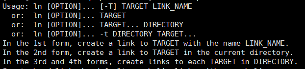


#### options

长短参数等价。

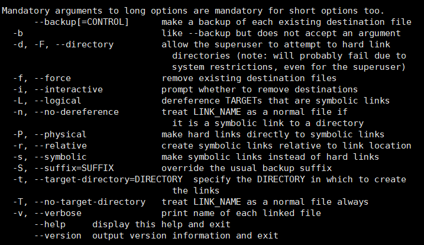


`-s`  创建一个软连接。

`-f`  强制移除已经存在的目标地址文件。


## 3.28 `ssh`

[ssh免密登录](# 5.10 `SSH` 免密登录)


### 3.28.1 清除保存的`key`

语法：

```
ssh-keygen -R <ip>

//<ip> 替换为需要清除的主机地址
```

例如：

`ssh-keygen -R bogon`

其中`bogon`为一个主机的名称。


# 4. Shell

```
Shell是一个脚本程序。 只需要一个能编写代码的文本编辑器 和运行的解释器即可。
```

Linux有众多的`Shell`

```
最常见的是 Bash    /bin/bash
```

运行bash文件的时候，需要先使用chmod命令给这个文件授权。

```sh
echo "hello world!"
```


首行以 `#!/bin/bash`开头，告诉这个文件是一个`bash shell`脚本，这个文件可以命名后缀即可根据首行`#!`声明找到对应解释器并运行。


例如：


```sh
#!/bin/bash

a=10
b=20
if [ %a -gt $b ]
then
	echo a>b
else
	echo a<=b
fi
```


## 4.1 变量


**定义变量**


定义变量时不需要添加$ , 【变量名】和【等号】之间不能有空格。

```sh
a="abc"
```


**使用变量**


使用一个定义过的变量，需要加`$`符号。可以加一个可选的花括号，帮助识别变量边界.

```sh
a="hello world"

echo $a
echo ${a}  #推荐给变量加上花括号。
```

可以通过语句来获得变量。


```sh
#!/bin/bash

for file in $(ls /etc)
```


**只读变量**


使用readonly 关键字可以将变量定义为只读变量。 只读变量的值不能被改变。

```sh
readonly a= "tody is beautiful day"

echo ${a}
```


**删除变量**

```sh
a="abc"
unset a
```

```
unset 不能删除只读变量
```


### 4.1.1 字符串变量

Shell支持 单引号，双引号，不加引号的字符串。


#### 4.1.1.1单引号

```
单引号内的任何字符都会原样输出。单引号内的变量是无效的。

单引号字串中不能出现单独一个的单引号（对单引号使用转义符后也不行），但可成对出现，作为字符串拼接使用。
```


```sh
str='this war of mine'
```


#### 4.1.1.2 双引号

```sh
_var="noob"
str="i know you are a \"${_var}\"! hahaha"
echo ${str}
```


双引号的优点

```
双引号可以有转义字符
双引号内可以使用变量
```


**拼接字符串对比**

```sh
_var1="runnob"
echo "everything is okey${_var1}"

_var2='runnob'
echo 'everything is okay ${_var2}'
```

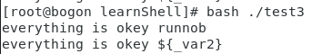


##### **获取字符串长度**

使用 `#` 获取字符串长度

```sh
str1="abcd"
echo ${#str1}    #输出4

str2="哈哈"
echo ${#str2}    #输出2
```

```
这个是正经的字符串的长度。 不是Lua语言中字符串所占的字符数量(汉字编码问题会多)
```


##### **截取字符串**

```sh
str="abcdefghijklmnopqrstuvwxyz"
echo ${str:1:4}                       #截取[1,4), 索引从0开始
```


假设有变量 var=http://www.sina.com/123.html

```sh
echo ${var#//}
```

表示 从左边删除到第一个`//`为止。包括`//`本身，此时删除后结果为：

```
www.sina.com/123.html
```


```sh
echo ${var##/}
```


**查找字符串**

//TODO


## 4.2 数组

bash 只支持一维数组 ，没有限定数组的大小


### 4.2.1定义数组

```sh
数组下标起始是0

arr=(2 4 6 8 10)
```


可以使用不连续的下标,下标没有范围限制

```sh
arr[0]=2
arr[2]=4
aar[4]=6

#取值

echo ${arr[0]}
```

使用`@`可以获得数组中所有元素

```sh
echo ${arr[@]}

${#arr[@]}  #获得数组元素的实际的个数
```


## 4.3 注释

```
单行注释#

多行注释

:<<EOF

EOF
```

EOF也可以使用其他符号

```
:<<!

!
```


## 4.4 传递参数

在执行Shell脚本的时候，可以向其传递参数。脚本内获取参数的格式: `${n}` 

其中n代表第n个传入的参数。 第1个参数是1 ， 索引`0` 代表执行脚本的名称

```sh
echo '脚本的执行名称:'${0}

echo '传入的第一个参数:'${1}

echo '传入的第一个参数:'${2}

echo '传入的第一个参数:'${3}

echo '传入的第一个参数:'${4}
```


在执行脚本时，以`空格`分割传入参数 :

```shell
chmod 777 param.sh
bash param.sh 晴空 啊哈 哈哈 惊了
```


### 4.4.1 特殊参数变量

```shell
$#    #传递到Shell参数的个数

$*	  #以一个字符串显示所有脚本转递的参数，  以空格分隔

$$	  #脚本运行时的 当前进程ID号

$!	  #后台运行的最后一个进程的ID号
```


```
在为shell脚本传递的参数中如果包含空格，应该使用单引号或者双引号将该参数括起来，以便于脚本将这个参数作为整体来接收。
```


## 4.5 基本运算符


```
原生bash 不支持间的数学计算。可以通过其他命令来实现： awk  expr  expr
```

```sh
#!/bin/bash

val=`expr 2 + 2`
echo "两数之和为 : $val"
```


- 表达式和运算符之间要有空格，例如 `2+2` 是不对的，必须写成 `2 + 2`，这与我们熟悉的大多数编程语言不一样。


### 4.5.1 算术运算符

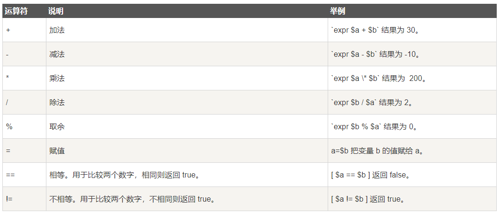


### 4.5.2 比较运算符


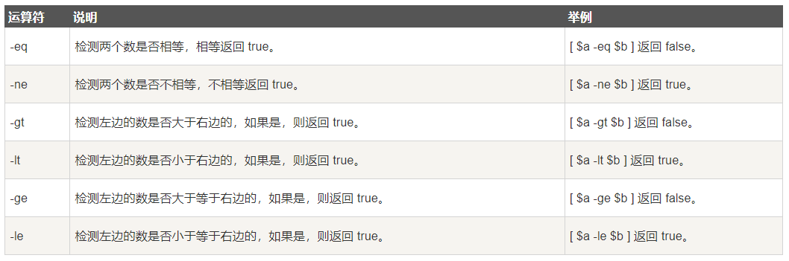


`nq`  ： non-equal

`gt`  :   greater than

`lt` : less than


`ge` :greater equeal

`le` : less equal


### 4.5.3 逻辑运算符


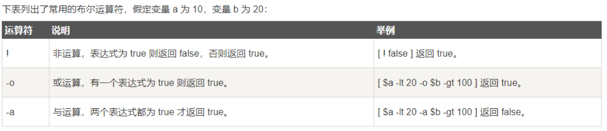


使用 `&&`  `||` 时，需要使用 `[[]]` 包裹住条件。

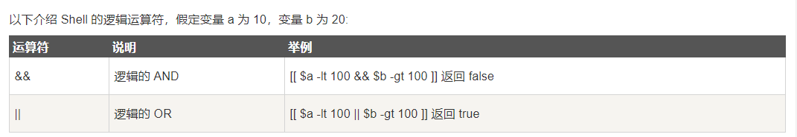


### 4.5.4 字符串运算符 

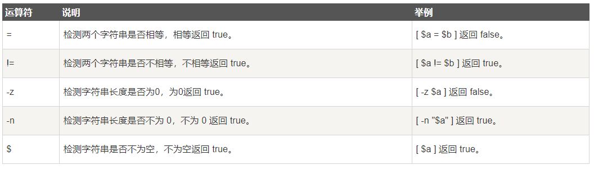

`shell` 比较特殊，存在对字符串的运算符。

例如 ：`-z` 表示 字符串长度是否为0。 如果为0返回true

​			`-n` 为 `!-z ` ,表示字符串不为0

​			 `=` 判断两字符串是否相等。

​			`!=` 判断两字符串是否不相等。


下面是示例：

```sh
#!/bin/bash

a=""
if [ -z $a ]
then 
	echo zero
else
	echo not zero
fi


//zero
```


### 4.5.5  文件运算符

在`shell` 中可以使用  `<var_name>=<path>` 来给一个变量`var_name`指向一个文件。

同时`shell`存在 文件运算符,  用于检测文件的各种属性。例如`是否可读` `是否可写` `文件大小是否为0` 等。


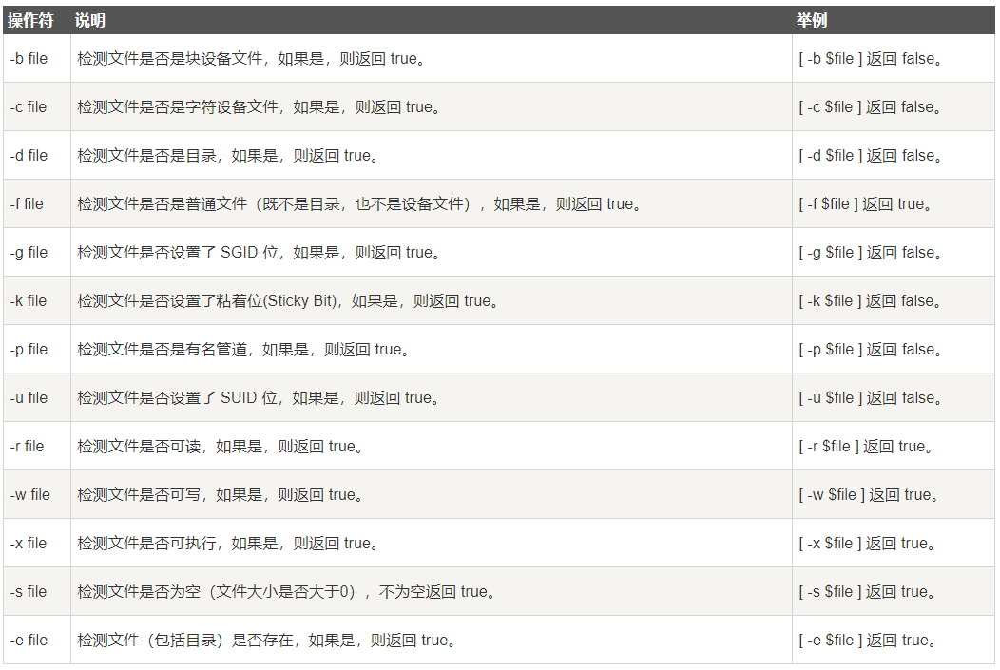


#### 4.5.1.1 示例

遍历输出文件夹

```sh
#!/bin/bash
echo input path
read path

if [ -d $path ]
then 
	for file in `ls $path`;do
		echo $file
	done
else
	echo $path is not a dir
fi
```


## 4.6 流程控制


### 4.6.1 `if else fi`

语法：

```sh
if [ <condition> ]
then
	<statement>...
fi
```

其中`then`必须换行写， `[ ] `为符号，而不是可选项。


如果想在一行写`then`，那么需要在 `[ <condition> ]` 后添加`;`   例如：


```sh
#!/bin/bash

a=10

if [ $a -gt 5 ];then
	echo right
else
	echo wrong
fi

//right
```


`if then ... else ... fi`

```sh
if [<condition>] 
then
	<statement>
else
	<statement>
fi
```


`if ... then ... elif ... then ...  fi`

```sh
if [...] 
then
	...
elif [...] 
then
	...
fi
```


### 4.6.2 `for`循环

语法：

```sh
for var_name in item1 item2 item3
do
	statement
done


# for遍历的元素以空格分隔。
# do 开始
# done 结束
```


例如：

````sh
for item in a b c d 
do
	echo item
done

#a
#b
#c
#d
````


`do` 可以写在一行，但需要使用`;`分隔。


#### 4.6.2.1 遍历目录

常常使用`for` 和  `ls` 来遍历目录。


```sh
#!/bin/bash

input dir path
read path   #read 命令用于从 标准输入流中接收参数

for file in `ls $path`;do
	echo file
done
```


### 4.6.3 `while` 循环

语法：

```sh
#!/bin/bash
i=1
while(( $i<=5 ))
do
    echo $i
    let "i++"
done
```


使用`let` 命令完成`++`操作。   `i=$i+1` 其中`+`会被认为字符串连接操作符。


#### 4.6.3.1 死循环 

```sh
while 

```


### 4.6.4 `case...esac`

和其他语言的`switch`类似，用于多分支选择语句。


语法：

```sh
case var in
	模式1)
		statement1
        statement2
        ...
        statementN
        ;;
    模式2)
        statement1
        statement2
        ...
        statementN
        ;;
	*)
		...
		statementN
		;;
esac
```

在`switch`中的分支，通常称为模式。

`case` 以`in` 开始，以`esac`结束。

模式 `)`开始，  以`;;`表示结束 ， 

匹配模式以后，会执行模式下的所有代码，直到遇见`;;`退出。

`*)` 用于匹配默认模式，等价于其他语言的`default`


示例：

```sh
a=1

case $a in
	0)
		echo 0
		;;
	1)
		echo 1
		;;
	2)	
		echo 2
		;;
	3)	
		echo 3
		;;
	*)
		echo default
esac

#仅输出1
```


### 4.6.5  break/continue

`shell` 支持 `break`和 `continue`关键字来控制流程。


## 4.7 echo


`-e` 开启转义字符

```sh
echo "hello\nworld"
```


`echo` 将结果写入文件：

```
echo "hello,world" > myfile
```


更多追加选项：


## 4.8 函数

`Linux shell`允许用户自定义函数。


关于函数的特殊关键字：


### 4.8.1 定义函数

例如 ：

```
function fun_name(){
	do_something
	
	return 
}

//fun_name为函数名
//do_something为函数体内容
//return 可以返回return 也可以省略，为void函数。
```


### 4.8.2 调用

直接键入函数名即为调用函数， 传入参数使用空格隔开以后，按顺序输入。


# 安装Linux 虚拟机

使用VMware 16

密钥：

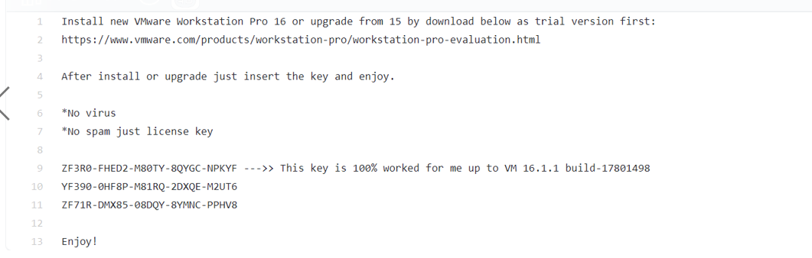


设置基础软件仓库：

```
https://mirrors.aliyun.com/centos/8/os/x86_64/
```

【注意】只支持https


# 5. CentOS 7


export JAVA_HOME=/data/service/jdk1.8.0_291
export PATH=$PATH:$JAVA_HOME/bin


## 5.1 CentOS修改环境变量

[参考博客](https://www.cnblogs.com/qingspace/p/6101563.html#:~:text=CentOS%E7%9A%84%E7%8E%AF,%E6%97%B6%E7%B1%BB%E4%BC%BC%E7%BB%A7%E6%89%BF%E5%85%B3%E7%B3%BB%E3%80%82)


CentOS的环境变量配置文件体系是一个层级体系.

这与其他多用户应用系统配置文件是类似的，有全局的，有用户的，有shell的，另外不同层级有时类似继承关系。下面以PATH变量为例。


1.修改 `/etc/profile`文件，将影响全局，所有用户(不会因为用户的改变而失效，也不会因为开启一个新的Terimal而失效)。

/etc/profile在系统启动后第一个用户登录时运行。在/etc/profile文件中添加

```dockerfile
export JAVA_HOME=/opt/module/jdk1.8.0_212    #添加 JAVA_HOME的值为/opt/module/jdk1.8.0_212
export PATH=$PATH:$JAVA_HOME/bin             #修改环境变量的值为 原本的$path:$JAVA_HOME/bin

#PATH中的值，以:作为分隔


#在/etc/profile里设置系统环境变量时路径不能以"/"结尾，否则将导致整个PATH变量出错
#使其生效，执行如下命令。
source /etc/profile
echo $PATH
```


2.修改/etc/environment，将影响全局。

/etc/environment文件与/etc/profile文件的区别是：/etc/environment设置的是系统的环境，而/etc/profile设置的是所有用户的环境，即/etc/environment与用户无关，在系统启动时运行。


```shell
#在/etc/environment文件中添加

PATH=/someapplication/bin:$PATH
```


CentOS和大多Linux系统使用 `$`访问环境变量，环境变量PATH中使用冒号`:`分隔。

```shell
export LUA_PATH=/root/Desktop/learnLua/bin/?.lua:/root/Desktop/learnLua/?.lua

echo $LUA_PATH
```


而Windows中使用两个%访问环境变量，PATH使用`;`分隔，例如：

```shell
# windows 系统
set PATH=E:\someapplication\bin;%PATH%
```


3.修改~/.bash_profile，将影响当前用户。在~/.bash_profile文件中添加

```shell
export PATH=/someapplication/bin:$PATH
```


4. 在终端中执行以下命令，只影响当前终端。

```shell
export PATH=/someapplication/bin:$PATH
```


### 查看某个环境变量

```shell
# echo $环境变量名

[root@localhost bin]# echo $LUA_PATH
/root/Desktop/learnLua/bin
```


## 5.2 修改权限

`chmod 777`


## 5.3  图形化界面切换


开机以命令模式启动，执行：

````
systemctl set-default multi-user.target
````


开机以图形界面启动，执行：

```
systemctl set-default graphical.target
```


## 5.4 开放指定端口号


查看防火墙状态

```sh
systemctl status firewalld
```


开放指定端口

方法1

```sh
firewall-cmd --zone=public --add-port=6389/tcp --permanent
```

 命令参数含义：

```
--zone #作用域范围
--add-port=6389/tcp  #添加端口6389，格式为：端口号/通讯协议方式（如：tcp、udp、pop3等）
--permanent  #永久生效（没有此参数重启后设置会失效）
```


方法2

```sh
/sbin/iptables -I INPUT -p tcp --dport 6389 -j ACCEPT
```


关闭防火墙

```
systemctl stop firewalld
```


## 5.5 修改`host`文件

配置host文件地址

```
/etc/hosts
```


1.修改hosts文件

```
vim /etc/hosts
```


2.重启网络

```
/etc/init.d/network restart
```


示例配置：

```sh
127.0.0.1   localhost localhost.localdomain localhost4 localhost4.localdomain4
::1         localhost localhost.localdomain localhost6 localhost6.localdomain6


192.168.202.155 SEMGHH2
192.168.202.101 SEMGHH3
```


## 5.6 修改主机名

临时修改

```sh
hostname <new-hostName>
```


永久修改：

```
sudo hostnamectl set-hostname <newhostname>

# sudo vim /etc/hostname
```


### 5.6.1 扩展命令

```
hostnamectl
```


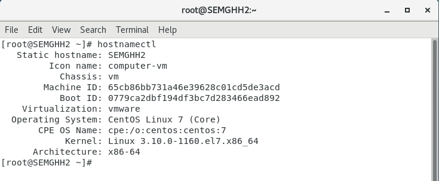


## 5.7 修改本机`ip`为静态的

不再使用dhcp自动获取ip，绑定一个固定ip

进入目录

```
/etc/sysconfig/network-scripts
```

如果网卡名称为 `ens33`

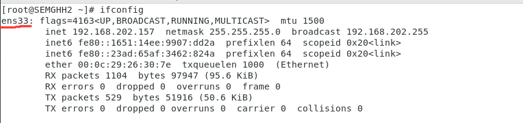


则修改对应网卡信息 `ifcfg-ens33`

```
vim /etc/sysconfig/network-scripts/ifcfg-ens33
```


原来的config如下

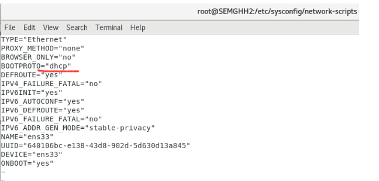


修改新的config如下:

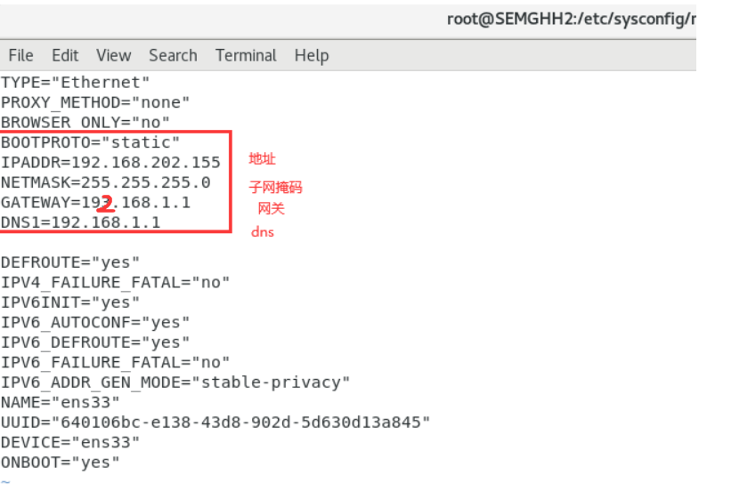


重启network

```sh
systemctl restart network
```


重置网卡。

```
ifconfig ens33 down

ifconfig ens33 up
```


## 5.8 给命令别名


使用`alias` 关键字


修改 `/etc/bashrc` 文件将影响全局。

```
alias ll="ls -l"
```


## 5.9 扩容分区

https://zhuanlan.zhihu.com/p/83340525


**三、CentOS7，非LVM根分区扩容步骤：**

1.查看现有的分区大小


非LVM分区，目前磁盘大小为20G，根分区总容量为17G

2.关机增加磁盘大小为30G


3.查看磁盘扩容后状态

> lsblk
> dh -TH


现在磁盘总大小为30G,根分区为17G

4.进行分区扩展磁盘，**记住根分区起始位置和结束位置**


5.删除根分区，切记不要保存


6.创建分区，箭头位置为分区起始位置


7.保存退出并刷新分区

> partprobe /dev/sda


8.查看分区状态


这里不知道为啥变成19G了。。

9.刷新根分区并查看状态

> xfs_growfs /dev/sda3 (这里先看自己的文件系统是xfs，还是ext4...)

使用 resize2fs或xfs_growfs 对挂载目录在线扩容 ：

- resize2fs 针对文件系统ext2 ext3 ext4 （我在本地用ubuntu18是ext4，我用的是resize2fs /dev/sda3）
- xfs_growfs 针对文件系统xfs


根分区大小已变为27G


## 5.10 `SSH` 免密登录


https://cloud.tencent.com/developer/article/1456064


将密钥发送给指定机器

```
ssh-copy-id -i ~/.ssh/id_rsa.pub root@<服务器IP>

//<服务器IP> 替换为指定ip
```


## 5.11 开放端口

通知 `firewall` 开放端口。

```sh
firewall-cmd --add-port=9870/tcp
```


# Docker  安装命令


# 6.  Linux相关服务


## 6.1 syslog

在Unix类操作系统上，syslog广泛应用于系统日志。

syslog日志消息既可以记录在本地文件中，也可以通过网络发送到接收syslog的服务器。


## 6.2 rsyslog

```
https://en.wikipedia.org/wiki/Rsyslog
```


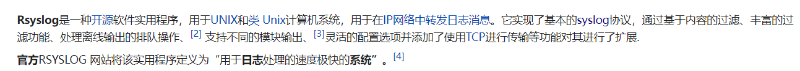


# 7. Linux 一些概念


## 7.1 管道符 |

`|` 管道符，用于连接多个Linux命令。 例如： `ps aux|grep java`


## 7.2 几个特殊的配置文件


`/etc/profile `

此文件为系统的每个用户设置环境信息,`当用户第一次登录时`,该文件被执行. 并从 `/etc/profile.d`目录的配置文件中搜集shell的设置。


` /etc/bashrc` 

为`每一个运行bash shell的用户执行此文件`。当bash shell被打开时,该文件被读取（即每次新开一个终端，都会执行bashrc）。


` ~/.bash_profile`

 每个用户都可使用该文件输入专用于自己使用的shell信息,当用户登录时,该文件仅仅执行一次。默认情况下,设置一些环境变量,执行用户的.bashrc文件。

` ~/.bashrc: `

该文件包含专用于你的bash shell的bash信息,当登录时以及每次打开新的shell时,该该文件被读取。


` ~/.bash_logout:` 

当每次退出系统(退出bash shell)时,执行该文件. 另外,/etc/profile中设定的变量(全局)的可以作用于任何用户,而~/.bashrc等中设定的变量(局部)只能继承 /etc/profile中的变量,他们是”父子”关系。


`~/.bash_profile: `

是交互式、login 方式进入 bash 运行的~/.bashrc 是交互式 non-login 方式进入 bash 运行的通常二者设置大致相同，所以通常前者会调用后者。


## 7.3 Namespace机制

从本质上说，Docker进程是运行在宿主机上的。各个进程之间的[资源隔离] 依赖于`Namespace`机制，

这是在Linux内核中实现的。


```
在Linux中任何进程都会把 该进程相关的信息记录在操作系统的 “/proc” 目录下。
```


查看 /proc下某个进程

```sh
ps aux|grep docker  
#查看到 docker运行PID为2100

cd /proc/2100
ls
```


输出如下：

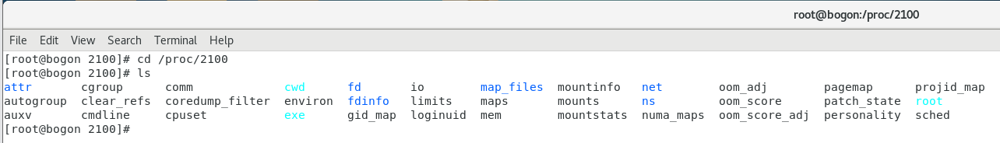


```
/proc/<PID> 与其他目录有所不同，它是一种虚拟文件系统。存储的是内核运行状态的一系列特殊文件。

用户可以通过这些文件查看进程/设备相关的信息。
信息包括 内存，CPU，启动命令，当前状态等。
```


Linux提供了  主机名/域名，用户，进程，网络，信号的隔离。


# 8. Linux文件系统


在linux中，把一切资源看成是文件， 包括硬件设备。


UNIX系统把每个硬件都看成是一个文件，通常称为设备文件，这样用户就可以用读写文件的方式实现对硬件的访问。这样带来优势也是显而易见的：
         实现了设备无关性。
         UNIX 权限模型也是围绕文件的概念来建立的，所以对设备也就可以同样处理了。


## 8.1 Linux文件系统层次

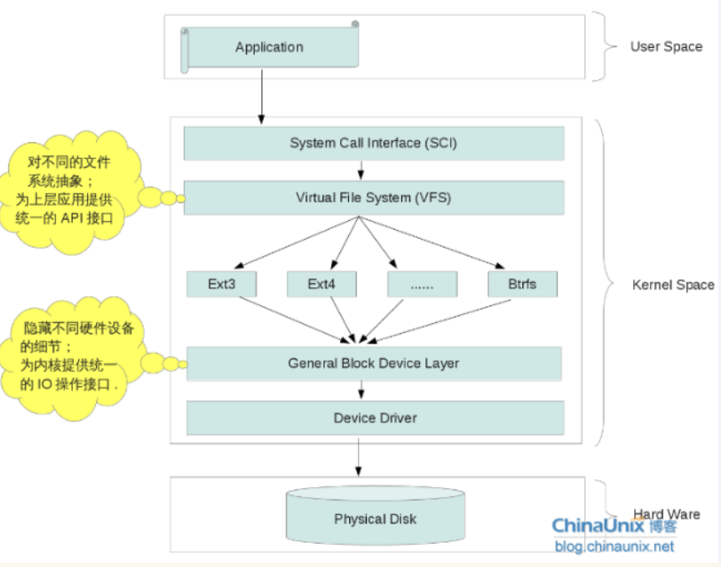


```
最顶层： app
 |
 v
 -----------------内核
系统调用接口：
 |
 v
虚拟文件系统 (VFS)
 |
 v
 通用的 block设备依赖层
 |
 v
 设备驱动
-----------------内核
 |
 v
物理设备
```

不同的物理设备具有不同的设备驱动。


`General Block Device Layer`  通用Block设备依赖层，用于统一抽象不同的 硬件设备驱动。向上暴露一个统一的接口。


不同的文件系统具有不同的API， `VFS` 虚拟文件系统，用于抽象一个统一的 文件系统接口。

`VFS` 通常具有的API：

```
mount()
unmount()
open()
close()
```


## 8.2 磁盘的基本概念


机械硬盘有 数个盘片，每个盘片具有2个面，每个面都有一个磁头。

盘片被划分为多个扇形区域，称之为扇区。

同一个盘片中，不同半径的同心圆称之为 磁道。

多个盘片中，相同半径的磁道共同组成的圆柱面，称之为柱面。


存储容量= 磁头数 *  磁道数 * 每道扇面数 * 每个扇区字节数。


一份数据的坐标：  （xx磁道（柱面）， xx 扇区， xx磁头）


## 8.3 内核如何管理磁盘？


内核将磁盘分为3个部分： 

`超级块` `i-节点表` `数据区`

```
超级块：
	文件系统中的第一个块称为 超级块。这个块存放文件系统的结构信息（元数据）。
	例如，记录了每个区域的大小， 未使用磁盘块的信息
	
i-节点表：
	每一个节点都对应了一个 文件(目录)的结构。节点内包含了文件长度，创建,修改时间,权限，[磁盘中的位置]等
	元信息。
	
	i-节点信息就像一个索引一样，维护了所有文件对应磁盘位置的索引。每一个文件都在节点表中有对应的节点。
	
数据区：
	文件的内容保存在这个区域。磁盘中所有块的大小都一样。如果文件内容超过了一个块，则存放在多个磁盘块中。
```


## 8.4 文件节点

文件节点`iNode`

扇区（Sector）是硬件磁盘上的最小操作单位，是OS与硬件设备传输数据的单位。

Block 是文件系统中的逻辑概念，是文件系统中最小的操作单位。一个Block由1个或者多个Sector组成。

```
从文件系统中读取一个Block实际上等同于从 物理设备上读取一个或者多个Sector。

一个文件对应的多个Block可能是不连续的。
```


