# 1.概述Maven


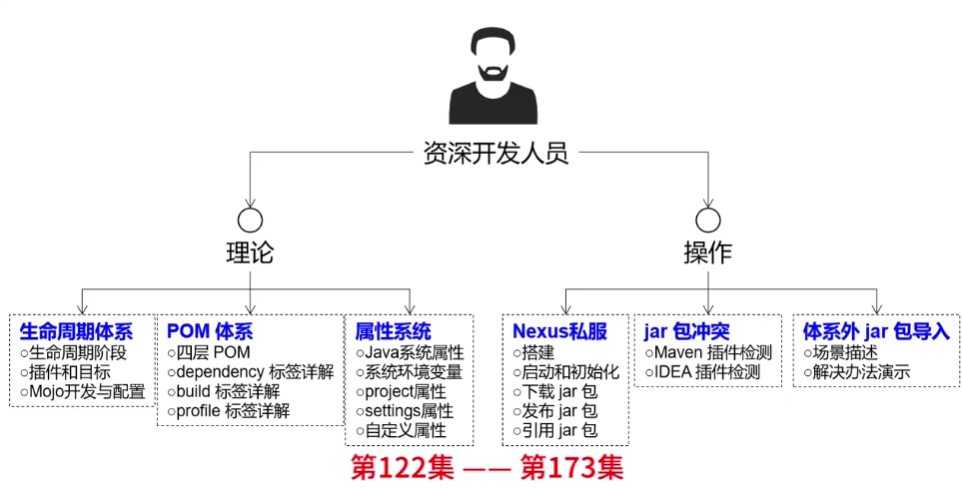


##  1.1 maven能用来做什么？

- 构建项目
- 文档生成
- 解决依赖
- 发布
- 报告


## 1.2 约定大于配置

Maven提倡使用一个共同的标准目录结构。 约定俗称  >  配置  的原则。


Maven项目基于以下的目录结构：


# 2. POM

Project Object Model  项目对象模型。 是Maven工程的重点，他是一个xml文件。名为`pom.xml`

```
包含了项目的基本信息，用于描述项目如何构建，声明项目依赖等
```


## 2.1 POM中的标签


### 2.1.1 所有pom必备3个标签

所有 POM 文件都需要 project 元素和三个必需字段。

```
groupId，artifactId，version
```


#### groupId

`groupId` 用于标识一个工程组的id，这个id在组织中应该是唯一的。


#### artifactId

工程的标识，通常是工程的名称。


#### version

工程的版本号

```xml
<groupId>xyz.Semghh</groupId>
<artifactId>BackupMyNote</artifactId>
<version>1.0-SNAPSHOT</version>
```


### 2.1.2 可选标签


#### dependencies

依赖列表标签。用于向工程中引入各种依赖，由多个 dependency组成，是最常用的部分。


##### dependency

依赖标签，描述了 引入哪个依赖。 dependency的子标签分为2种 ：  可选，必选


###### 必选标签

 1个dependency必须包含3个必选子标签 。

```
groupId
artifactId
version
```

下面是一个示例：

```xml
        <dependency>
            <groupId>org.projectlombok</groupId>
            <artifactId>lombok</artifactId>
            <version>1.18.24</version>
        </dependency>
```

如果工程引入了一个 依赖管理标签 `<dependencyManagement></dependencyManagement>` 同时该工程管理声明了对应依赖的version，那么此时 version可以被忽略。


可选标签 (除了以上3个必选都是可选)：

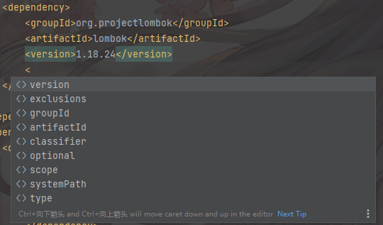


###### 可选标签

```
常用的： 
exclusions     在引入的依赖种，剔除指定依赖
scope          指定依赖的作用域
```


scope

声明依赖范围 。在项目发布过程中，帮助决定哪些构件被包括进来。

```
compile ：默认范围，用于编译 
provided：类似于编译，但支持你期待jdk或者容器提供，类似于classpath
runtime: 在执行时需要使用 
test: 用于test任务时使用


system: 需要外在提供相应的元素。通过systemPath来取得                 
systemPath: 仅用于范围为system。提供相应的路径 

optional: 当项目自身被依赖时，标注依赖是否传递。用于连续依赖时使用
```


exclusions

排除的依赖列表，由exclusion 组成，排除指定依赖，用于解决版本冲突问题。

```xml
<exclusions>
    <exclusion>
        <groupId>xxx</groupId>
        <artifactId>xxx</artifactId>
    </exclusion>
</exclusions>
```


dependencyManagement

指出当前工程依赖于另外的父工程。继承父工程的依赖，通常用于依赖管理。

```xml
    <dependencyManagement>
        <dependencies>
            <dependency>
                <groupId>org.springframework.boot</groupId>
                <artifactId>spring-boot</artifactId>
                <version>2.3.7.RELEASE</version>
            </dependency>
        </dependencies>
    </dependencyManagement>
```


#### packaging

用于描述共成构建后的类型。有如下类型：

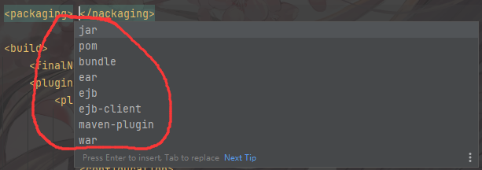


例如：

```xml
    <packaging>jar</packaging>
```


```xml
<!-- 表示当前打包方式。   如果是war,说明是web工程 -->
<!-- 如果值是jar,说明是java工程。 -->
<!-- 如果是war, 说明是web工程 -->
<!-- 如果是pom ,说明是一个特殊工程。用于管理其他工程的工程-->

<!-- maven-plugin  表示当前工程是一个maven 插件 --> 
```


#### description

用于解释描述工程。


#### developers

用于描述开发者信息的。内部组成单元是 developer标签。


developer 标签的子标签如下：

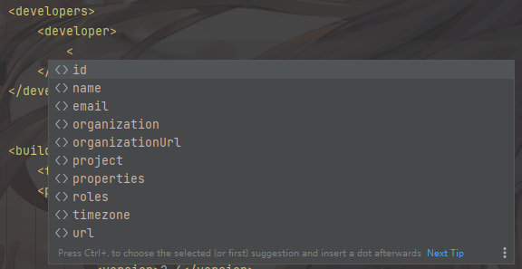


```xml
    <developers>
        <developer>
            <name>Semghh</name>
            <email>1832187999@qq.com</email>
            <roles>
                <role>java developer</role>
            </roles>
        </developer>
    </developers>
```


#### contributors

该项目的其他贡献者，和developers完全一致。

```xml
    <contributors>
        <contributor>
            <name>zhangsan</name>
            <email>xxx@qq.com</email>
        </contributor>
    </contributors>
```


#### properties

用于灵活配置变量,可以被 `${}` 引用 .


```xml
<project>
	...
    
    <properties>
    	<conetent3.spring.version>4.2.0.RELEASE</conetent3.spring.version>
    </properties>
    
    
    <dependencies>
        <dependency>
          <groupId>org.springframework</groupId>
          <artifactId>spring-context</artifactId>
          <version>${conetent3.spring.version}</version>
        </dependency>
    </dependencies>
    

	...
</project>
```


#### build

用于描述整个项目是如何 build的， build标签下有非常多的子标签。

```
build标签下所有的相对定位，都是相对于 pom.xml文件的
```


##### finalName

最终build出来的文件名称

```xml
<finalName>copyNoteUtil</finalName>
```


##### directory

指定 最终build出来的全部文件 存放的文件夹

```
默认是项目下target文件夹
```


##### plugins 

插件列表 标签，这个标签是很多标签的子标签，目的是引入一个插件。 p

lugins标签是由多个 plugin标签组成的。

```
 plugin的子标签描述了引入一个plugin需要的全部信息，包括如下
```


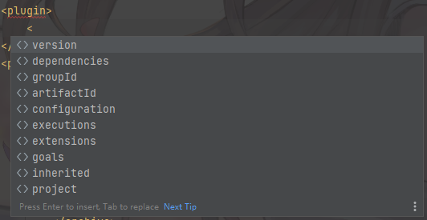


一个plugin示例如下

```xml
<plugin>
    <groupId>org.apache.maven.plugins</groupId>
    <artifactId>maven-jar-plugin</artifactId>
    <version>2.4</version>
    <configuration>
        <archive>
            <manifest>
                <mainClass>Main</mainClass>
            </manifest>
        </archive>
    </configuration>
</plugin>
```


接下来是一个示例：

```xml
<?xml version="1.0" encoding="UTF-8"?>
<project xmlns="http://maven.apache.org/POM/4.0.0"
         xmlns:xsi="http://www.w3.org/2001/XMLSchema-instance"
         xsi:schemaLocation="http://maven.apache.org/POM/4.0.0 http://maven.apache.org/xsd/maven-4.0.0.xsd">
    
    <!-- 省略... -->
    
    <build>
        <finalName>copyNoteUtil</finalName>
        <directory>target</directory>
        <plugins>
            <plugin>
                <groupId>org.apache.maven.plugins</groupId>
                <artifactId>maven-jar-plugin</artifactId>
                <version>2.4</version>
                <configuration>
                    <archive>
                        <manifest>
                            <mainClass>Main</mainClass>
                        </manifest>
                    </archive>
                </configuration>
            </plugin>
        </plugins>
    </build>

     <!-- 省略... -->

</project>
```


# 3. Maven仓库


Maven 仓库是项目中依赖的第三方库，这个库所在的位置叫做仓库。


Maven 仓库有三种类型：

- 本地（local）
- 中央（central）
- 远程（remote）


## 3.1 本地库


运行 Maven 的时候，Maven 所需要的任何构件都是直接从本地仓库获取的。

如果本地仓库没有，它会首先尝试从远程仓库下载构件至本地仓库，然后再使用本地仓库的构件。


Maven 本地仓库默认被创建在 %USER_HOME% 目录下。要修改默认位置，在 %M2_HOME%\conf 目录中的 Maven 的 settings.xml 文件中定义另一个路径。

```xml
<settings xmlns="http://maven.apache.org/SETTINGS/1.0.0"
   xmlns:xsi="http://www.w3.org/2001/XMLSchema-instance"
   xsi:schemaLocation="http://maven.apache.org/SETTINGS/1.0.0 
   http://maven.apache.org/xsd/settings-1.0.0.xsd">
      <localRepository>C:/MyLocalRepository</localRepository>
</settings>
```


## 3.2 中央仓库


Maven 中央仓库是由 Maven 社区提供的仓库，其中包含了大量常用的库。


中央仓库的关键概念：

- 这个仓库由 Maven 社区管理。
- 不需要配置。
- 需要通过网络才能访问。


## 3.3 远程仓库


```
这个概念是相对于本地库的，本地库可以看作私库，远程仓库可用于专门的机器做专门的私库
```


如果 Maven 在中央仓库中也找不到依赖的文件，它会停止构建过程并输出错误信息到控制台。

为避免这种情况，Maven 提供了远程仓库的概念，它是开发人员自己定制仓库，包含了所需要的代码库或者其他工程中用到的 jar 文件。


```xml
<project xmlns="http://maven.apache.org/POM/4.0.0"
   xmlns:xsi="http://www.w3.org/2001/XMLSchema-instance"
   xsi:schemaLocation="http://maven.apache.org/POM/4.0.0
   http://maven.apache.org/xsd/maven-4.0.0.xsd">
   <modelVersion>4.0.0</modelVersion>
   <groupId>com.companyname.projectgroup</groupId>
   <artifactId>project</artifactId>
   <version>1.0</version>
   <dependencies>
      <dependency>
         <groupId>com.companyname.common-lib</groupId>
         <artifactId>common-lib</artifactId>
         <version>1.0.0</version>
      </dependency>
   <dependencies>
   <repositories>
      <repository>
         <id>companyname.lib1</id>
         <url>http://download.companyname.org/maven2/lib1</url>
      </repository>
      <repository>
         <id>companyname.lib2</id>
         <url>http://download.companyname.org/maven2/lib2</url>
      </repository>
   </repositories>
</project>
```


## 3.4 maven 依赖搜索顺序


当我们执行 Maven 构建命令时，Maven 开始按照以下顺序查找依赖的库：

- **步骤 1** － 在本地仓库中搜索，如果找不到，执行步骤 2，如果找到了则执行其他操作。
- **步骤 2** － 在中央仓库中搜索，如果找不到，并且有一个或多个远程仓库已经设置，则执行步骤 4，如果找到了则下载到本地仓库中以备将来引用。
- **步骤 3** － 如果远程仓库没有被设置，Maven 将简单的停滞处理并抛出错误（无法找到依赖的文件）。
- **步骤 4** － 在一个或多个远程仓库中搜索依赖的文件，如果找到则下载到本地仓库以备将来引用，否则 Maven 将停止处理并抛出错误（无法找到依赖的文件）。


## 3.5 配置私有库的账号密码


私有库会需要认证，只有授权以后才能访问。


此时需要在 `maven`的配置文件中配置账号和密码。

```xml
<servers>
    ...
    
    <server>
    	<id>xxxRepository</id>
		<username>xxx</username>
		<password>xxx</password>
    </server>
    
    
    ...
</servers>
```


# 4.   maven 导出项目依赖

参考Docs

https://maven.apache.org/components/plugins/maven-dependency-plugin/usage.html#dependency:copy-dependencies


首先需要在pom中导入指定插件

```xml

      <plugin>
        <groupId>org.apache.maven.plugins</groupId>
        <artifactId>maven-dependency-plugin</artifactId>
        <version>3.3.0</version>
        <executions>
          <execution>
            <id>copy-dependencies</id>
            <phase>package</phase>
            <goals>
              <goal>copy-dependencies</goal>
            </goals>
            <configuration>
              <!-- configure the plugin here -->
            </configuration>
          </execution>
        </executions>
      </plugin>


<!--  执行命令 mvn dependency:copy-dependencies -->
```


完整如下：

```xml
<project>
  [...]
  <build>
    <plugins>
      <plugin>
        <groupId>org.apache.maven.plugins</groupId>
        <artifactId>maven-dependency-plugin</artifactId>
        <version>3.3.0</version>
        <executions>
          <execution>
            <id>copy-dependencies</id>
            <phase>package</phase>
            <goals>
              <goal>copy-dependencies</goal>
            </goals>
            <configuration>
              <!-- configure the plugin here -->
            </configuration>
          </execution>
        </executions>
      </plugin>
    </plugins>
  </build>
  [...]
</project>
```


## 4.1 将jar打包

参考博客

https://cloud.tencent.com/developer/article/2032032


## 4.2 将依赖发布 公开仓库/中央仓库/私有仓库

参考

https://zhuanlan.zhihu.com/p/141676033


# 5.  Maven 


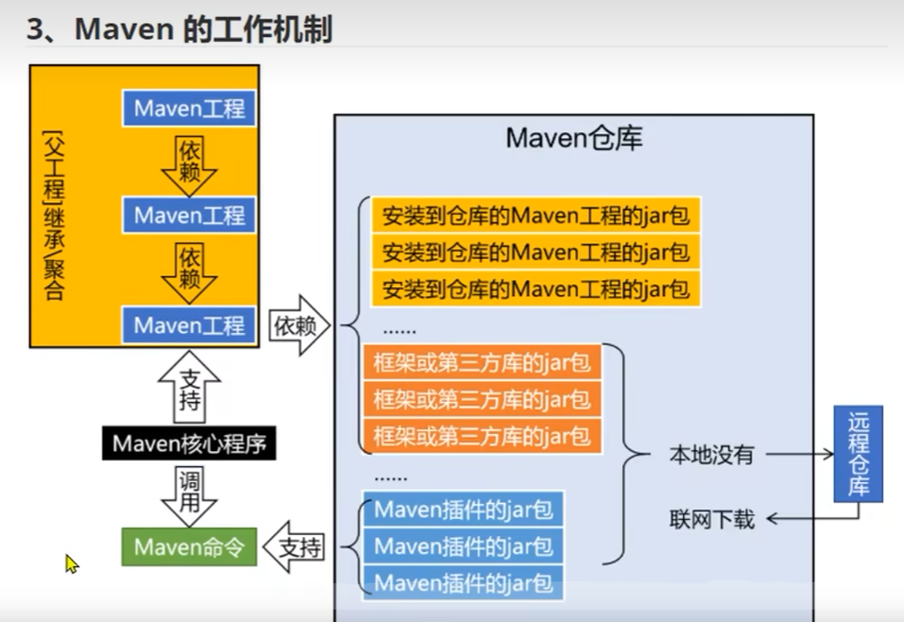


## 5.1 概念


### 5.1.1 坐标

在`maven` 中通过三个 `向量` 在Maven仓库中定位到一个唯一 `jar包`


```
groupId      : 公司/组织的id

artifactId   : 一个项目或者 项目中一个模块的ID
 
version   :  版本号
```


坐标的默认值：

```
groupId 通常为公司/组织的域名倒序。

artifactId : 模块名称

version : SNAPSHOT 快照
 		  RELEASE  正式版本
```


#### 5.1.1.1 仓库和 jar包路径关系。


jar包路径 =  `<仓库根路径>/<groupId>/<artifactId>/<version>/<artifactId>-<version>.jar`

（以`.`为分隔）


例如：

```xml
    <gorupId>javax.servlet</gorupId>
    <artifactId>servlet-api</artifactId>
    <version>1.1</version>
```

 对应`jar包`的路径为：

`<仓库根路径>/javax/servlet/servlet-api/1.1/servlet-api-1.1.jar`


### 5.1.2  生命周期

`Lifecycle` 


生命周期的提出 , 是为了 提高构建的自动化程度。


#### 5.1.2.1 三个主要的生命周期

`clean` 


`site`   

```
```


`default`


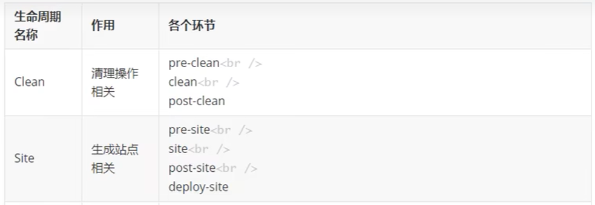


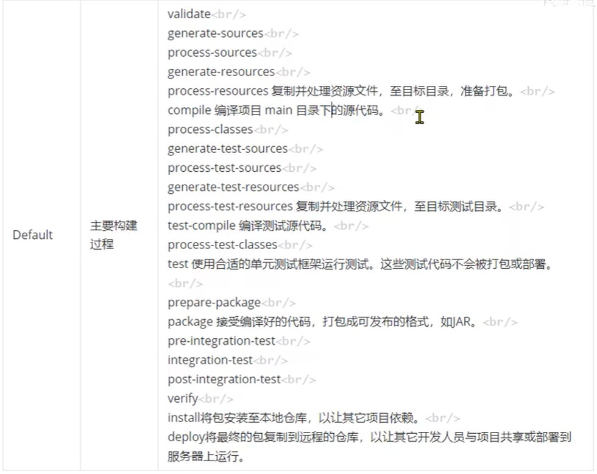


## 5.2  POM解读

`pom.xml`  maven的核心配置文件。


pom.xml 的根标签`<project>`，表示对 工程进行管理， 配置。

```xml
<?xml version="1.0" encoding="UTF-8"?>
<project xmlns="http://maven.apache.org/POM/4.0.0"
         xmlns:xsi="http://www.w3.org/2001/XMLSchema-instance"
         xsi:schemaLocation="http://maven.apache.org/POM/4.0.0 http://maven.apache.org/xsd/maven-4.0.0.xsd">
    
    <!-- 从maven2 开始固定是4.0.0 代表pom.xml标签结构 -->
    <modelVersion>4.0.0</modelVersion>

    <!-- 坐标信息 -->
    <groupId>org.example</groupId>
    <artifactId>learningMaven</artifactId>
    
    <!-- 表示当前打包方式。   如果是war,说明是web工程 -->
    <!-- 如果值是jar,说明是java工程。 -->
    <!-- 如果是war, 说明是web工程 -->
    <!-- 如果是pom ,说明是一个特殊工程。用于管理其他工程的工程-->
    <packaging>pom</packaging>
    <version>1.0-SNAPSHOT</version>
    <modules>
        <module>pipechina-user-auth-center</module>
        <module>pipechina-base-api</module>
        <module>pipechina-base-entity</module>
        <module>pipechina-base-util</module>
        <module>pipechina-data-mysql-provider</module>
    </modules>

    
    
    <!-- properties标签用于定义属性值，定义的属性可以是maven标准标签，也可以是我们自定义的 -->
    <!-- 定义的属性值，可以被其他标签引用-->
    <properties>
        <maven.compiler.source>8</maven.compiler.source>
        <maven.compiler.target>8</maven.compiler.target>
    </properties>

</project>
```


```xml
    <dependencies>
        <dependency>
            <groupId>org.springframework.boot</groupId>
            <artifactId>spring-boot</artifactId>
            <version>2.7.2</version>
        </dependency>
        
        <dependency>
            <groupId>org.springframework.boot</groupId>
            <artifactId>spring-boot-starter-test</artifactId>
            <version>2.7.2</version>
            <!-- 作用域 ， 指定依赖的生效的范围 -->
            <scope>test</scope>
        </dependency>
    </dependencies>
```


## 5.3  约定的目录结构

`maven`  提倡一个清晰的，约定的目录结构:

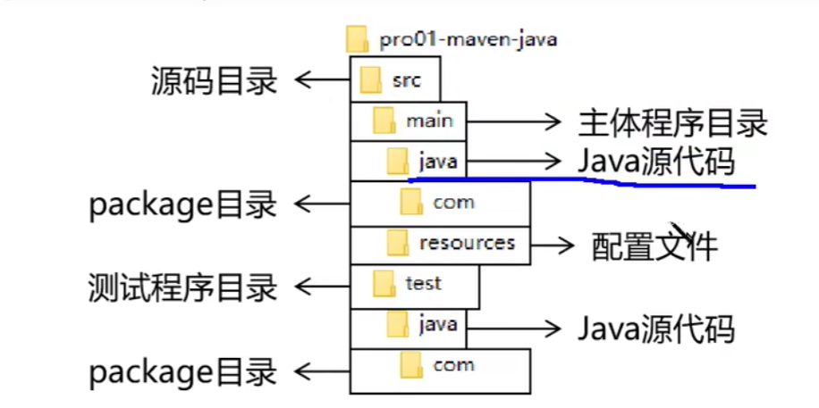


`target` 目录专门存放 `build` 后的文件。


约定>配置， 配置>编码


## 5.4 maven的命令


运行Maven中的构建命令，需要进入到 `pom.xml`所在目录。如果没有，则报错。


`Maven` 命令支持组合调用:

`mvn clean compile`


### 5.4.1 clean

删除 target 目录下的内容。


### 5.4.2 compile

主程序编译 `mvn compile`

测试程序编译 `mvn test-compile`


如果想指定 JDK用于编译，需要特殊配置。详情参看  [7.1  使用其他JDK来编译](# 7.1  使用其他JDK来编译)


### 5.4.3 test

用于运行测试方法。

`mvn test`


### 5.4.4 package

`mvn package`

```
java工程 打包成jar

web工程打成war
```


​	

### 5.4.5 install

`mvn install`


```
install就是将本地构建的jar存储本地Maven库中.
```


## 5.5 依赖的范围

依赖的【作用域】通过 `<scope>` 标签 声明.


`<scope>` 标签的位置 :  `dependencies/dependency/scope`


`<scope>` 标签的可选值 : `compile/test/provided/system/runtime/import`


### compile

compile (默认值):

```
main 目录   			有效
test 目录   			有效
开发过程     		   有效
部署到服务器(打包成jar)  有效
```


### test

test:

```
main          无效
test 		  有效
开发过程  		有效
部署到服务器     无效
```


### provided

provided 作用域

```
main目录 有效
test目录 有效
开发过程 有效
部署    无效
```


### system

system 作用域。

和文件系统相关的作用域。当我们需要导入文件系统内某个地址下的的依赖，可以使用`<scope>system</scope>`

```xml
<dependency>
	<groupId>xxxx</groupId>
    <artifacId>xxxxx</artifacId>
    <version>xxxx</version>
    <systemPath>D:\aaa\bbb\ccc\ddd.jar</systemPath>
    <scope>system</scope>
</dependency>
```


### runtime

用于`编译时期`不需要，但是运行时需要的 `jar`包。

```xml
<dependency>
	<groupId>org.springframework.boot</groupId>
    <artifactId>spring-boor-devtools</artifactId>
    <scope>runtime</scope>
    <optional>true</optional>
</dependency>
```


## 5.6 依赖的传递性

当A依赖于B,B依赖于C的时候.

```
A->B->C

此时A直接调用B,B直接调用C是可以的.但是A能直接使用C么?

此时需要看 B引入C的依赖作用域.如果B compile引入C,那么依赖可以传递到A.
A可以访问到C.

如果B是 test/provided引入的C,那么A不能使用C.

此时A想要使用C,必须自己引入C的依赖.
```


## 5.7 依赖的排除

使用 `<exclusions>`   `<exclusion>` 排除 

```xml
        <dependency>
            <groupId>org.semghh</groupId>
            <artifactId>content3-common</artifactId>
            <version>1.0-SNAPSHOT</version>
            
            <!-- 可以排除多个-->
            <exclusions>
                <!-- 排除单位-->
                <exclusion>
                    <!-- 指定groupID-->
                    <groupId>xxx</groupId>
                    <!--指定发行版本 -->
                    <artifactId>xxx</artifactId>
                </exclusion>
            </exclusions>
        </dependency>
```


## 5.8 继承

具体指: 工程的继承.


A工程继承B工程 , 更准确说是 A工程的pom 继承了B工程的pom的配置


```
如果A继承了B工程,那么B就是父工程
```


### 5.8.1 继承的作用

在父工程中对依赖的版本 , 进行统一的管理.

```
使用背景:
	较大项目的模块拆分
```


### 5.8.2 创建父工程

1. 父工程的  `<packaging>` 必须为 `pom`
2. 父工程不写 `业务代码` ,专门用于管理其他工程的.
3. 父工程编写`<modules>`


### 5.8.3 配置聚合(模块)

父工程 : 

在父工程的`pom`文件中, 需要配置它的子模块.

```xml
<modules>
    <module>content3-common</module>
    <module>content3-core</module>
    <module>content3-management</module>
    <module>content3-gateway</module>
</modules>
```


子工程 : 

子工程的配置 

```xml
<?xml version="1.0" encoding="UTF-8"?>
<project xmlns="http://maven.apache.org/POM/4.0.0"
         xmlns:xsi="http://www.w3.org/2001/XMLSchema-instance"
         xsi:schemaLocation="http://maven.apache.org/POM/4.0.0 http://maven.apache.org/xsd/maven-4.0.0.xsd">
    
   	<!--parent标签用于指定父工程,  通过坐标定位父工程	 -->
    <parent>
        <artifactId>content3</artifactId>
        <groupId>org.semghh</groupId>
        <version>1.0-SNAPSHOT</version>
    </parent>

    <modelVersion>4.0.0</modelVersion>
    <!--子工程的 groupId,version如果和父工程完全一样,可以省略 -->
    <artifactId>content3-cacheServer</artifactId>


    <dependencies>
        <dependency>
            <groupId>io.netty</groupId>
            <artifactId>netty-all</artifactId>
            <version>4.1.74.Final</version>
        </dependency>
        <dependency>
            <groupId>org.projectlombok</groupId>
            <artifactId>lombok</artifactId>
            <version>1.18.24</version>
        </dependency>
    </dependencies>

    <properties>
        <maven.compiler.source>8</maven.compiler.source>
        <maven.compiler.target>8</maven.compiler.target>
    </properties>

</project>
```


### 5.8.4 父工程依赖管理


父工程使用 `<dependencyManagement>` 统一管理依赖 .

```xml
<dependencyManagement>
    <dependencies>
        <dependency>
            <groupId>org.projectlombok</groupId>
            <artifactId>lombok</artifactId>
            <version>1.18.24</version>
        </dependency>
    </dependencies>
</dependencyManagement>
```


父工程管理了依赖以后 , 子工程仍然需要指明 需要哪些依赖 , 只不过省略了依赖的版本信息.

例如:

```xml
        <dependency>
            <groupId>org.springframework.boot</groupId>
            <artifactId>spring-boot-starter-aop</artifactId>
            <!-- 此处可以省略version ,如果指明version,则覆盖父工程管理的版本-->
<!--            <version>2.1.8.RELEASE</version>-->
        </dependency>
```

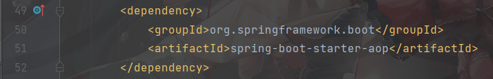


事实上, 在子工程的 `pom.xml` 文件中,仍然可以单独配置自己的  依赖管理(`<dependencyManagement>`)

例如: 子工程 `content3-core`

```xml
<project>
    ...
    
    <dependencyManagement>
        <dependencies>
            <dependency>
                <groupId>com.alibaba.cloud</groupId>
                <artifactId>spring-cloud-alibaba-dependencies</artifactId>
                <version>2.1.0.RELEASE</version>
                <type>pom</type>
                <scope>import</scope>
            </dependency>
        </dependencies>
    </dependencyManagement>
    
    ...
</project>
```


### 5.8.5 实际意义

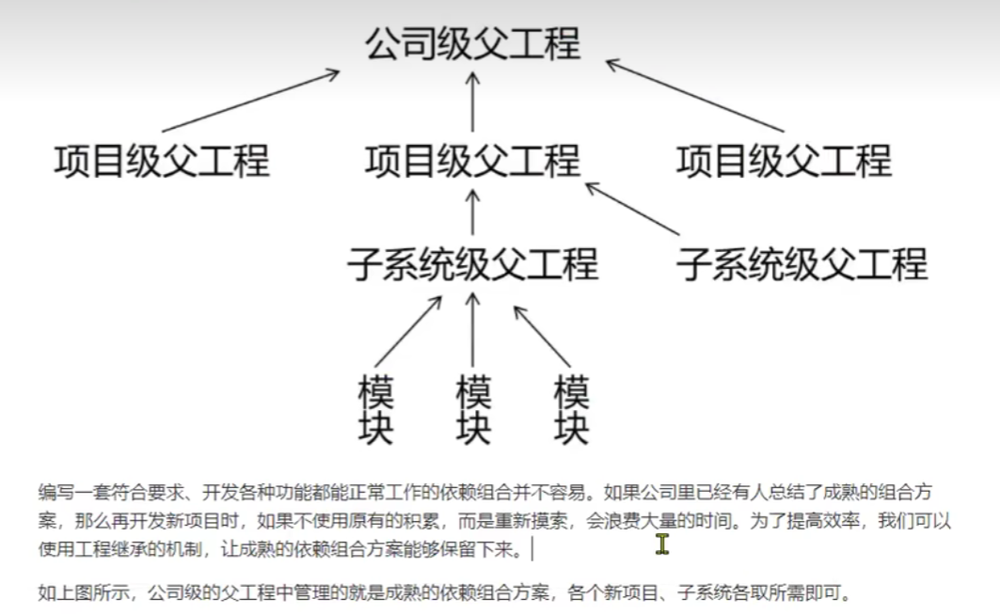


## 5.9 POM

我们知道在`pom.xml` 中，可以修改相关的配置。同时`pom.xml`是可以被继承的，`子POM` 可以从`父pom.xml` 继承配置。


### 5.9.1 Super POM

在`Maven` 中，存在一个 `Super POM` （超级pom） 是整个项目中最大的`父POM`的 父pom


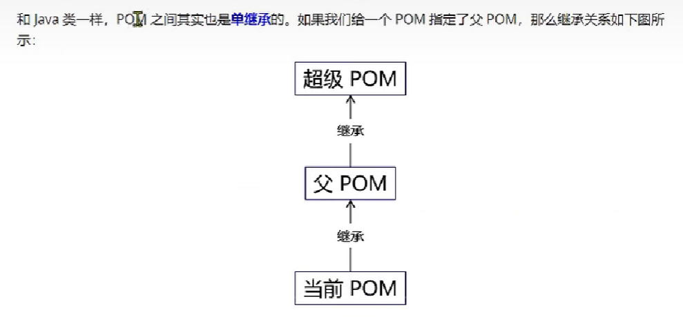


### 5.9.2  Effective POM

`生效POM` , 对于某个模块来说，  `子pom`+`父pom`+`超级pom` 叠加以后，最终生效的 `pom` 称为 `effective pom`


使用 `mvn help:effective-pom `  查看生效pom


## 5.10 版本仲裁


### 5.10.1 最短路径优先

此时会使用 log4j1.2.12

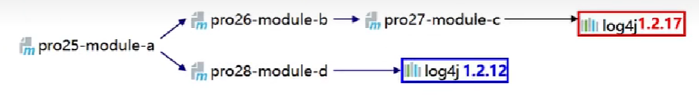


### 5.10.2 路径等长先声明优先

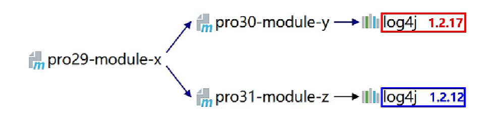


此时使用 log4j 1.2.17


# 6.  创建一个微服务项目


打包jar时，自带全部依赖jar .

```xml
<build>
	<plugins>
        <plugin>
        	<groupId>org.springframework.boot</groupId>
            <artifactId>spring-boot-maven-plugin</artifactId>
        </plugin>
    </plugins>
</build>
```


打包命令

```
mvn clean package spring-boot:repackage -Dmaven.test.skip=true
```


# 7. Maven 编译器插件

Maven具体的功能，是由`插件` 来完成的。


## 7.1  使用其他JDK来编译

参考自官方文档：

https://maven.apache.org/plugins/maven-compiler-plugin/examples/compile-using-different-jdk.html

想要使用不同JDK的首选方法是使用工具链机制。


### 7.1.1 工具链

为什么要使用 工具链（toolchains）？


Maven 运行的每一个环节都需要 JDK工具(例如 `javac` `javadoc` `jarsigner`)来执行。

工具链 正是一种指明JDK路径的方式。 它独立运行在Maven以外。


如果没有使用工具链， Maven将使用JDK来执行项目构建时的各种步骤(例如 `编译Java源代码`

`生成JavaDoc` , `运行单元测试`  ，`签署JAR` ). 


使用工具链 ：

To set this up, refer to the [Guide to Using Toolchains](https://maven.apache.org/guides/mini/guide-using-toolchains.html), which makes use of the [Maven Toolchains Plugin](https://maven.apache.org/plugins/maven-toolchains-plugin/).


 

### 7.1.2  配置编译器插件

如果不使用`toolchains` 仍然可以告诉编译插件JDK的路径，以此来编译项目。


注意，以这种方式配置的编译，只作用于本插件，不会影响其他插件。


`compilerVersion` 标签指   编译器版本 ， 同时设置 `fork`标签为true，才能生效。 

例如：

```xml
<project>
    <!-- ...  -->
    <properties>
        <maven.compiler.source>17</maven.compiler.source>
        <maven.compiler.target>17</maven.compiler.target>
        <project.build.sourceEncoding>UTF-8</project.build.sourceEncoding>
        
        <!-- 避免硬编码，指出 jdk17的文件路径 -->
        <JAVA_17_HOME>C:\Users\SemgHH\.jdks\corretto-17.0.3</JAVA_17_HOME>
    </properties>

    <build>
        <plugins>
            <plugin>
                <groupId>org.apache.maven.plugins</groupId>
                <artifactId>maven-compiler-plugin</artifactId>
                <version>3.8.1</version>
                <configuration>
                    <!-- 固定开启fork: true -->
                    <fork>true</fork>
                    <!-- 编译器版本 -->
                    <compilerVersion>17</compilerVersion>
                    <!-- 指出javac的路径,结尾必须是javac  不能到目录bin -->
                    <executable>${JAVA_17_HOME}\bin\javac</executable>
                </configuration>
            </plugin>
        </plugins>
    </build>
</project>
```


 


## 7.2 给编译器配置内存

编译器插件接收2个参数  `meminitial` `maxmem`  分别配置初始化时内存大小，最高内存大小。


```xml
<project>
  [...]
  <build>
    [...]
    <plugins>
      <plugin>
        <groupId>org.apache.maven.plugins</groupId>
        <artifactId>maven-compiler-plugin</artifactId>
        <version>3.10.1</version>
        <configuration>
          <fork>true</fork>
          <meminitial>128m</meminitial>
          <maxmem>512m</maxmem>
        </configuration>
      </plugin>
    </plugins>
    [...]
  </build>
  [...]
</project>
```


# 8. 仓库

指 `maven仓库`  用于存放jar包的仓库。

种类有： `本地仓库` 和 `远程仓库`

​			远程仓库又有 中央仓库，镜像仓库。


`maven`的工作流程如下

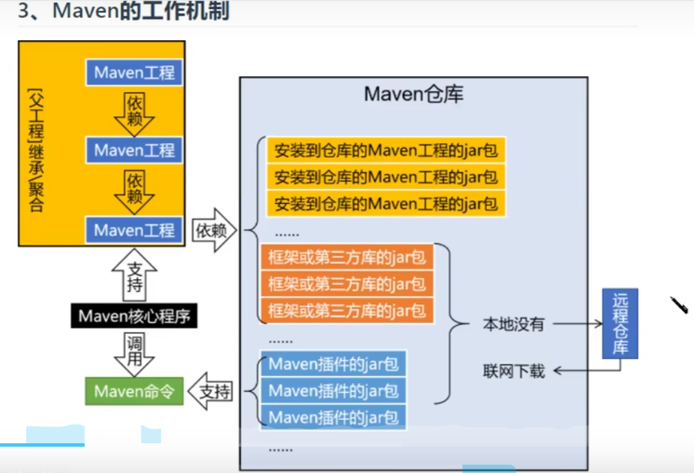


## 8.1 Nexus 私服


### 8.1.1 安装Nexus


解压以后， `bin\nexus` 就是启动文件。

使用`nexus start`启动.


### 8.1.2 nexus cli 命令

nexus cli 接收如下命令：

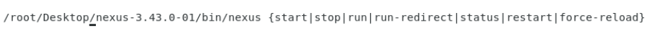


```
start

stop

status

restart
```


# 9.Maven代理加速


