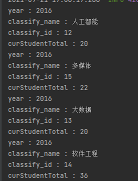
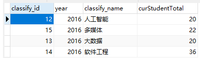
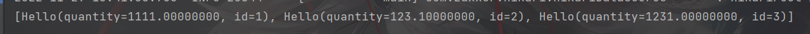

https://mybatis.org/mybatis-3/zh/index.html

问就是mybatis的官方文档写的最优秀！支持中文


# 1. 使用mybatis


Mybatis是一个持久层框架。用于操作数据库，化简了JDBC繁琐的异常处理，预编译语句，封装Entity等操作。

程序员只需要编写SQL语句，声明Entity即可完成开发。


```
mybatis 的 sql语句的修改只需要在xml里编写，实现了sql语句与java代码分离，解耦。

更改sql文件，不需要改动java代码
```


使用前首先需要引入Maven依赖

```xml
<dependency>
    <groupId>org.mybatis</groupId>
    <artifactId>mybatis</artifactId>
    <version>3.5.6</version>
</dependency>
```


## 1.1 配置xml文件 链接数据库


推荐命名 “mybatis-config.xml”


官网默认配置，自行更改：

```xml
<?xml version="1.0" encoding="UTF-8" ?>
<!DOCTYPE configuration
  PUBLIC "-//mybatis.org//DTD Config 3.0//EN"
  "http://mybatis.org/dtd/mybatis-3-config.dtd">
<configuration>
 <!-- <properties resourc="database-config.properties" /> -->  //如果使用配置源的话
  <environments default="development">
    <environment id="development">
      <transactionManager type="JDBC"/>
      <dataSource type="POOLED">
        <property name="driver" value="${driver}"/>
        <property name="url" value="${url}"/>
        <property name="username" value="${username}"/>
        <property name="password" value="${password}"/>
      </dataSource>
    </environment>
  </environments>
  <mappers>
    <mapper resource="org/mybatis/example/BlogMapper.xml"/>
  </mappers>
</configuration>
```


使用配置源


database-config.properties :

```properties
JDBC.driver=com.mysql.cj.jdbc.Driver
JDBC.url=jdbc:mysql://localhost:3306/houserent?useSSL=true&useUnicode=true&characterEncoding=UTF-8&serverTimezone=GMT%2B8
JDBC.username=root
JDBC.password=zxc,./123
```


无配置源:

```xml
<?xml version="1.0" encoding="UTF-8" ?>
<!DOCTYPE configuration
        PUBLIC "-//mybatis.org//DTD Config 3.0//EN"
        "http://mybatis.org/dtd/mybatis-3-config.dtd">
<configuration>
    <environments default="development">
        <environment id="development">
            <transactionManager type="JDBC"/>
            <dataSource type="POOLED">
                <property name="driver" value="com.mysql.cj.jdbc.Driver"/>
                <property name="url" value="jdbc:mysql://localhost:3306/mybatis?useSSL=true&amp;useUnicode=true&amp;characterEncoding=UTF-8&amp;serverTimezone=GMT%2B8"/>
                <property name="username" value="root"/>
                <property name="password" value="zxc,./123"/>
            </dataSource>
        </environment>
    </environments>
    <mappers>
        <mapper resource="DAO/UserMapper.xml"/>
    </mappers>
</configuration>
```

在<mappers></mappers>中，关联Mapper 配置xml文件


## 1.2 建立一个获取 SqlSession的Util类


Mybatis操作数据库的Java类是  SqlSession.  它可以看作一个和数据库的连接。

SqlSession需要通过工厂(SqlSessionFactory)建立. 当调用SqlSessionFactory.openSession() 即可获得一个和数据库的连接(SqlSession)


我们可以通过以下语句创建一个专门用于获取SqlSession的工具类：


```java
String resource = "org/mybatis/example/mybatis-config.xml";
InputStream inputStream = Resources.getResourceAsStream(resource);
SqlSessionFactory sqlSessionFactory = new SqlSessionFactoryBuilder().build(inputStream);
```


```java
public class myBatisUtils {

     private static SqlSessionFactory factory;

    static {
        String resource = "mybatis-config.xml";
        try {
            InputStream inputStream = Resources.getResourceAsStream(resource);
            factory = new SqlSessionFactoryBuilder().build(inputStream);
        } catch (IOException ioException) {
            ioException.printStackTrace();
        }
    }

    public static SqlSession getSqlSession() {
        return factory.openSession();
    }
}
```


通过SqlSession 可以执行各种sql语句。


## 1.3 配置Mapper 的xml文件


在Mybatis的世界里，真正定义SQL语句的层级称为 Mapper层。Mapper层内具体的文件类型是xml

```
例如: 
一个操作User表的Mapper层文件可以命名为：    UserDaoMapper.xml
也可以命名为 UserDAO.xml

//根据不同的代码风格要求
```


mapper.xml文件需要配合DAO接口来使用。 mapper.xml是DAO接口的真正实现：

例如userDAO接口可能这样定义

```java
public interface UserDAO {
    
    String getNameById(Long userId);
    
}
```

此时userMapper.xml是这样的:

```xml
<?xml version="1.0" encoding="UTF-8" ?>
<!DOCTYPE mapper
        PUBLIC "-//mybatis.org//DTD Mapper 3.0//EN"
        "http://mybatis.org/dtd/mybatis-3-mapper.dtd">
<!--命名空间 指定一个DAO (Mapper) 接口     接口的全类名-->
<mapper namespace="DAO.UserDAO">
   
    
<!--    id 对应 抽象方法名-->
    <select id="getNameById" resultType="java.lang.String">
        select user_name from user where user_id=#{userId}
    </select>
    
</mapper>
```


### 1.3.1  mapper.xml 具体定义


一个  mapper.xml文件总是以如下格式定义的：

```xml
<?xml version="1.0" encoding="UTF-8" ?>
<!DOCTYPE mapper
        PUBLIC "-//mybatis.org//DTD Mapper 3.0//EN"
        "http://mybatis.org/dtd/mybatis-3-mapper.dtd">
<!--命名空间 指定一个DAO (Mapper) 接口     接口的全类名-->
<mapper namespace="DAO.UserDAO">
   
    
<!--    id 对应 抽象方法名-->
    <select id="getUserList" resultType="POJO.User">
        select * from user1;
    </select>
    <select id="getUserById" resultType="POJO.User" parameterType="int">
   <!--  获取变量使用#{}可以直接引用变量的成员变量-->
        select * from user1 where id = #{id1};
    </select>
    <insert id="insert" parameterType="POJO.User">
        insert into user1 (id,name_,pwd) values(#{id},#{name_},#{pwd});
    </insert>
    <update id="update" parameterType="POJO.User">
        update user1 set name_=#{name_},pwd=#{pwd} where id = #{id};
    </update>
</mapper>
```


## 1.4. 测试

```java
    @Test
    public void test() {
        try (SqlSession sqlSession = myBatisUtils.getSqlSession()) {
            UserDAO mapper = sqlSession.getMapper(UserDAO.class);
            List<User> userList = mapper.getUserList();
            for (User user : userList) {
                System.out.println(user);
            }
        }
    }

// 增删改 一定要提交事务  sqlSession.commit();
    @Test
    public void Testinsert() {
        SqlSession sqlSession = myBatisUtils.getSqlSession();
        UserDAO mapper = sqlSession.getMapper(UserDAO.class);
        User user = new User(4,"dd","1234567");
        mapper.insert(user);
        sqlSession.commit();
        sqlSession.close();;
    }
    @Test
    public void TestUpdate() {
        SqlSession sqlSession = myBatisUtils.getSqlSession();
        UserDAO mapper = sqlSession.getMapper(UserDAO.class);
        mapper.update(new User(1,"青空","998"));
        sqlSession.commit();
        sqlSession.close();
    }
    @Test
    public void TestDelete() {
        try (SqlSession sqlSession = myBatisUtils.getSqlSession()){
            UserDAO mapper = sqlSession.getMapper(UserDAO.class);
            mapper.delete(new User(4,"1","1"));
            sqlSession.commit();
        }
    }
```


## 1.5 总结

mybatis 会在Runtime 生成 相应函数式接口的 代理类。通过代理类对象执行相应方法。


# 2. 入参使用hashMap


在update某一条记录时。如果这条记录的字段特别多，而我们只需要修改某几个字段。

那么我们可以不必传入该实体对象。因为new一个该实体对象，有参构造需要传入所有的成员变量值。

所以，我们可以在定义接口时，设置一个 Map<String,Object>形式参数。

比如有一张关系表 Student(id,name,ssex,sdept,a1,a2,a3,...,a100)

我们只需要修改name

**那么接口 可以定义如下。**

```java
public interface StudentDAO {
    public update(Student stu);
    public update2(Map<String,Object> map);
    public insert(Student stu);
    public insert2(Map<String,Object map);//新记录里面有一些不是  not null 修饰的字段
    ...
}
```

**对应的Student_Mapper 的xml配置文件如下**

```xml
<?xml version="1.0" encoding="UTF-8" ?>
<!DOCTYPE mapper
        PUBLIC "-//mybatis.org//DTD Mapper 3.0//EN"
        "http://mybatis.org/dtd/mybatis-3-mapper.dtd">
<mapper namespace = "DAO.UserDAO">
    ...
    <insert id="insert2" parameterType="map">
        insert into Student(name,ssex,sdept) values(sna,sex,address);//注意到这里的变量名不需要和表结构对应，只需要和map中的key对应即可。
    </insert>
</mapper>
```

**@Test 调用代码如下**

```java
@Test
public void TestUpdate2() {
    try (SqlSession sqlSession=myBatisUtils.getSqlSession()){
        UserDAO mapper = sqlSession.getMapper(UserDAO.class);
        User userById = mapper.getUserById(1);
        System.out.println(userById);
        HashMap<String, Object> map = new HashMap<>();
        map.put("sno",1);
        map.put("password","666");  //只需要保证key 和 形参名一致 即可
        mapper.update2(map);
        sqlSession.commit();
        userById = mapper.getUserById(1);
        System.out.println(userById);
    }
}
```

**输出结果如下：**

```java
User{id=1, name_='青空', pwd='998'}   
User{id=1, name_='青空', pwd='666'}

Process finished with exit code 0
```


## 

类似的，如果POJO实体类中，有Setter方法。那么只需要new新的实体，并传入想要update或insert的特定字段即可。

```java
@Test
public void Test() {
    ...
    Student stu = new Student();
    stu.setid(1);
    stu.setpwd("666");
    ...
}
```


```xml
...
<update id=update>
	
</update>
```


## 2.2 使用Map的优点


在很多实际业务中，我们可能会遇到多表查询。

通常的POJO领域模型对应的是一张表。

多表查询的结果往往是一张不属于原来所有表的`新表`，显然它不属于任何领域模型（Entity）。


此时解决办法可以是 

1.为这张`新表`建立一个新的领域模型（POJO类/Entity）

2.使用临时的Map


取舍: 


```
如果多表查询的结果使用率比较高，首先考虑数据库建表是否可以优化。

其次可以考虑1策略。如果都满足的话，就使用2吧
```


## 2.3 引入一个实际情况解释上述原因


下面引入一个使用Map的实例:

查询的表：是一个视图，这个视图由3个表连接

```sql
CREATE VIEW cur_Classify_Student_Total(`classify_id`,`year`,`classify_name`,`curStudentTotal`)
AS
SELECT `classify`.`id` , `major`.`year` , `classify`.`classify_name` , count(*)
FROM `classify`,`result`,`major`
WHERE `classify`.`id` = `result`.`classify_id` and `major`.`id`=`classify`.`major_id`
GROUP BY `classify`.`id`,`major`.`year`,`classify`.`classify_name`
```

4个字段分别是  id  ,  year  ,  classify_name , cruStudentTotal


Mapper 接口(ClassifyMapper)中的定义：

```java
    @MapKey("classify_id")
    public Vector<Map> getAllCurClassifyStudentTotal();
```

关键的注解： @MapKey("")  

`一般存储每条记录的主键，用于区别记录。也可以用其他值表示，主要取决于Dao层@MapKey注解后面的字段（如@MapKey("id"))`

对于我的例子： 领域模型Vector<Map> 并不需要区分每条记录，取到的数据遍历时也有体现。

在https://blog.csdn.net/W_317/article/details/115448285 的博客中，

博主使用了  Map<Long, Map<String, String>> 的领域模型，使用@MapKey 区分记录的key就很重要了

ClassifyMapper.xml 中的查询语句：

```xml
<select id="getAllCurClassifyStudentTotal" resultType="map">
    select 'great',`classify_id`,`year`,`classify_name`,`curStudentTotal`
    from `cur_classify_student_total`
</select>
```


为了快速测试，我在springboot的启动类中进行测试

```java
@SpringBootApplication
public class DispenseApplication {

    public static void main(String[] args) {
        ConfigurableApplicationContext run = SpringApplication.run(DispenseApplication.class, args);
        ClassifyMapper bean = run.getBean(ClassifyMapper.class);
        Vector<Map> allCurClassifyStudentTotal = bean.getAllCurClassifyStudentTotal();
        allCurClassifyStudentTotal.forEach(o->{
            o.forEach((x,y)->{
                System.out.println(x+ " : " +y);
            });
        });
    }

}
```


成功拿到数据库中的数据：






# 3.注解


对于像 BlogMapper 这样的映射器类来说，还有另一种方法来完成语句映射。 它们映射的语句可以不用 XML 来配置，而可以使用 Java 注解来配置。比如，上面的 XML 示例可以被替换成如下的配置：

```java
package org.mybatis.example;
public interface BlogMapper {
  @Select("SELECT * FROM blog WHERE id = #{id}")
  Blog selectBlog(int id);
}
```

使用注解来映射简单语句会使代码显得更加简洁，但对于稍微复杂一点的语句，Java 注解不仅力不从心，还会让你本就复杂的 SQL 语句更加混乱不堪。 因此，如果你需要做一些很复杂的操作，最好用 XML 来映射语句。

选择何种方式来配置映射，以及认为是否应该要统一映射语句定义的形式，完全取决于你和你的团队。 换句话说，永远不要拘泥于一种方式，你可以很轻松的在基于注解和 XML 的语句映射方式间自由移植和切换。


```
@Select（“”）  //查询注解

@Insert
@Update
@Delete
```


 

```
@Alia() //为类，接口 起别名；
@Mapper
```


# 5. 核心配置文件


MyBatis 的配置文件包含了会深深影响 MyBatis 行为的设置和属性信息。 


Mybatis可选的配置项有如下：


详细参考

https://mybatis.net.cn/configuration.html


默认的配置文件名： **mybatis-config.xml**  

在Classpath路径下：


## 5.1 环境配置（environments）

MyBatis 可以配置成适应多种环境。

```
这意味着在一个项目中，MyBatis可以同时操作多个数据库。

但一个SqlSessionFactory只服务于一个数据库。
因此，需要创建多个SqlSessionFactory实例对象，每个对象服务于一个数据库即可。
```


只要如下配置即可：

```java
SqlSessionFactory factory = new SqlSessionFactoryBuilder().build(reader, environment);
SqlSessionFactory factory = new SqlSessionFactoryBuilder().build(reader, environment, properties);
```

mybatis 允许使用<properties>标签引入外部 properties 配置。

db.properties

```properties
driver=com.mysql.cj.jdbc.Driver
url=jdbc:mysql://localhost:3306/mybatis?useSSL=true&useUnicode=true&characterEncoding=UTF-8&serverTimezone=GMT%2B8
username=root
password=zxc,./123
```


## 5.2 类型别名（typeAliases）

在编写mapper.xml中，我们必须为每一个ResultMap 指定一个返回type ,通常是一个领域模型(Entity).

在指定时为了消除歧义性，我们通常使用这个类的全类名。当一个类的全类名非常长...那么使用别名就非常有必要了


类型别名可为一个 Java 类设置一个缩写名字。 它仅用于 XML 配置，意在降低冗余的全限定类名书写。例如：

```xml
<typeAliases>
  <typeAlias alias="Author" type="domain.blog.Author"/>
  <typeAlias alias="Blog" type="domain.blog.Blog"/>
  <typeAlias alias="Comment" type="domain.blog.Comment"/>
  <typeAlias alias="Post" type="domain.blog.Post"/>
  <typeAlias alias="Section" type="domain.blog.Section"/>
  <typeAlias alias="Tag" type="domain.blog.Tag"/>
</typeAliases>
```


当这样配置时，`Blog` 可以用在任何使用 `domain.blog.Blog` 的地方。

也可以指定一个包名，MyBatis 会在包名下面搜索需要的 Java Bean，比如：

```xml
<typeAliases>
  <package name="domain.blog"/>
</typeAliases>
```


```
仍然可以使用注解来标注别名。但过于分散，不如集中配置好
```

每一个在包 `domain.blog` 中的 Java Bean，在没有注解的情况下，会使用 Bean 的首字母小写的非限定类名来作为它的别名。 比如 `domain.blog.Author` 的别名为 `author`；若有注解，则别名为其注解值。见下面的例子：

```java
@Alias("author")
public class Author {
    ...
}
```

显然，如果含有大量实体类，第一种起别名的方式很麻烦。

**所以可以使用 扫描包+注解  。为大量类配置别名**


## 5.3  设置（setting）


```
必须告诉Mybatis到哪里找众多的  xxxMapper.xml  文件 。

mappers标签用于指明这些文件都在哪里
```


### mappers标签

映射器标签。用来引用 一个sql映射的xml文件。

```xml
<Mapper resource="..../.../.." ></Mapper>
<Mapper url=".../.../.../" ></Mapper>
<Mapper class="" ></Mapper>
```

**resource ：** 引用类路径下的sql映射文件

**url**: 引用网络或者磁盘 路径下的sql映射文件

**class:** 引用 或者 注册接口

​			有sql映射文件的时候，映射文件需要放在接口同一目录下且名字相同

​			无sql映射文件的时候，需要在接口上写注解；

​			**推荐： 简单的 不重要，改动较少的DAO接口，使用注解**

​						**较多修改， 含有复杂sql语句 的DAO接口 使用xml映射文件**

```xml
批量注册，扫描包
<package name=""/>
```


# 6.typeHandlers

MyBatis 在设置预处理语句（PreparedStatement）中的参数或从结果集中取出一个值时， 都会用类型处理器将获取到的值以合适的方式转换成 Java 类型。下表描述了一些默认的类型处理器。


你可以重写已有的类型处理器或创建你自己的类型处理器来处理不支持的或非标准的类型。 具体做法为：实现 `org.apache.ibatis.type.TypeHandler` 接口， 或继承一个很便利的类 `org.apache.ibatis.type.BaseTypeHandler`， 并且可以（可选地）将它映射到一个 JDBC 类型。


具体的参考
https://mybatis.net.cn/configuration.html#typeHandlers


# 7.ResultMap结果映射


`resultMap` 元素是 MyBatis 中最重要最强大的元素。

它可以让你从 90% 的 JDBC `ResultSets` 数据提取代码中解放出来，并在一些情形下允许你进行一些 JDBC 不支持的操作。

实际上，在为一些比如连接的复杂语句编写映射代码的时候，一份 `resultMap` 能够代替实现同等功能的数千行代码。ResultMap 的设计思想是，对简单的语句做到零配置，对于复杂一点的语句，只需要描述语句之间的关系就行了。


显式配置 ResultMap


## 7.1 高级结果映射

在 resultMap标签中可以使用其他标签达到不一样的效果。


高级结果映射必须遵循以下规定:


### 7.1.1 constructor

例如： 在resultMap标签中，使用 constructor 标签。表示在实例化类时，将结果注入到构造方法中。

```xml
<resultMap id="detailedBlogResultMap" type="Blog">
  <constructor>
    <idArg column="blog_id" javaType="int"/>
  </constructor>
<!--  省略了其他标签... -->  
</resultMap>
```

constructor含有2个子标签：

- `idArg` - ID 参数；标记出作为 ID 的结果可以帮助提高整体性能
- `arg` - 将被注入到构造方法的一个普通结果


### 7.1.2  result

仅仅表示一个普通的属性，注入到javaBean中。

```xml
<resultMap id="detailedBlogResultMap" type="Blog">
  <!--  省略了其他标签... -->  
  <result property="title" column="blog_title"/>
  <!--  省略了其他标签... -->  
</resultMap>
```


```
result标签有两个属性， column="" 表示在查询的SQL中，这个字段的名称。
					result="" 表示在注入的javaBean中，这个属性的名字
```


### 7.1.3 association


表示 将合并多个字段，组成一个复杂的JavaBean .这个JavaBean作为一个属性注入到外层的resultMap中


```xml
<resultMap id="detailedBlogResultMap" type="Blog">
  <!--  省略了其他标签... -->  
  <association property="author" javaType="Author">
    <id property="id" column="author_id"/>
    <result property="username" column="author_username"/>
    <result property="password" column="author_password"/>
    <result property="email" column="author_email"/>
    <result property="bio" column="author_bio"/>
    <result property="favouriteSection" column="author_favourite_section"/>
  </association>
  <!--  省略了其他标签... -->  
</resultMap>
```


```
最大的外层resultMap是一个Blog类实例对象。它的一个成员变量是叫做 Author的另一个类。
使用association标签，先组装好一个 Author类的实例，作为属性注入到Blog中。
```


- association 

  – 一个复杂类型的关联；许多结果将包装成这种类型

  - 嵌套结果映射 – 关联可以是 `resultMap` 元素，或是对其它结果映射的引用


#### 7.1.3.1 关联查询使用association

给出一个 association的 resultMap的示例

```
这里把两张表关联在了一起。并没有嵌套查询。
```


```xml
    <select id="selectById" resultMap="resultMap1">
        select p.id ,p.age,p.name , d.id 'dog_id' , d.age 'dog_age' , d.name 'dog_name'
        from  person p left join dog d on p.dog_id = d.id
        where p.id = #{id}
    </select>


    <resultMap id="resultMap1"   type="com.semghh.demo.entity.Person">
        <id property="id" column="id" javaType="java.lang.Long"/>
        <result property="age" column="age" javaType="java.lang.Integer"/>
        <result property="name" column="name" javaType="java.lang.String"/>
        <association property="dog" resultMap="getDogMap" />
    </resultMap>

    <resultMap id="getDogMap" type="com.semghh.demo.entity.Dog">
        <id property="id" column="dog_id"/>
        <result property="age" column="dog_age" javaType="java.lang.Integer"/>
        <result property="name" column="dog_name" javaType="java.lang.String" />
    </resultMap>
```

```
当association是 resultMap结果映射的话，可以使用单闭合标签。
```


```
当association用在多表联合查询的时候，本质上是查一张表。表的连接由MYSQL来完成。所有的数据都从一次SQL中查出来。
所以只需要指定 association的 resultMap属性， property 属性即可。
```


```
但是，如果在嵌套查询中使用association标签，则必须指定 column属性。

因为本次嵌套查询，并不是由MYSQL Client为我们解析查询。而是由Mybatis 多次查询，再将结果组合封装进JavaBean.
指定column属性是为了作为嵌套查询的关联条件，传递给内层嵌套SQL作为查询条件。

下面引入一个示例
```


#### 7.1.3.2 嵌套查询使用 association


定义DogDao

```java
//DogDao 的全类名：  com.semghh.demo.Dao.DogDao
@Mapper
public interface DogDao {
    Dog getDogByPersonId(Long personId);
}
```

对应的mapper.xml

```xml
<mapper namespace="com.semghh.demo.Dao.DogDao">
    <select id="getDogByPersonId" resultType="com.semghh.demo.entity.Dog">
        select `id` ,`age` ,`name` ,`person_id` 'personId'
        from `dog`
        where `person_id`=#{personId}
    </select>
</mapper>
```


PersonDao

```java
@Mapper
public interface PersonDao {
    //省略其他方法...
    Person getPersonById2(Long id);
}
```

对应的 PersonDao.xml

```xml
	<!-- 省略其他...-->
	<select id="getPersonById2" resultMap="PersonMap2">
        select `id`,`age`,`name`
        from `person`
        where `id`=#{id}
    </select>

    <resultMap id="PersonMap2" type="com.semghh.demo.entity.Person">
        <id property="id" column="id" />
        <result property="age" column="age" javaType="java.lang.Integer" />
        <result property="name" column="name" javaType="java.lang.String" />
        <association property="dog" column="id" select="com.semghh.demo.Dao.DogDao.getDogByPersonId"/>
    </resultMap>
	<!-- 省略其他...-->
```


```
查询select id="getPersonById2" ,返回的resultMap 是PersonMap2。
在PersonMap2的定义里, type="" 指明了返回类型：Person
同时使用了重头戏 association 标签，在association标签中，必须指明 column="id" ，表示在外层的SQL中的id字段作为参数，
传递给内层的com.semghh.demo.Dao.DogDao.getDogByPersonId 
而内层的getDogByPerson方法在上面提到过：
```

```xml
    <select id="getDogByPersonId" resultType="com.semghh.demo.entity.Dog">
        select `id` ,`age` ,`name` ,`person_id` 'personId'
        from `dog`
        where `person_id`=#{personId}
    </select>
```

```
外层的id字段的值，作为内层 #{personId}的参数，传递进去。
```


如果你此时还不明白的话，可以参考食用官方中文文档

https://mybatis.net.cn/sqlmap-xml.html#Result_Maps


##### 7.1.3.2.1 N+1问题

```
由MyBatis来完成嵌套查询，将内层的数据关联到外层。看起来非常美好，但它的性能却在大型数据集合中表现不好。
这类问题称为N+1查询问题。
```


N+1问题	是这样描述的:

```
你执行了一个单独的 SQL 语句来获取结果的一个列表（就是“+1”）。

对列表返回的每条记录，你执行一个 select 查询语句来为每条记录加载详细信息（就是“N”）。


这个问题会导致成百上千的 SQL 语句被执行。有时候，我们不希望产生这样的后果。
```


好消息是，MyBatis 能够对这样的查询进行延迟加载，因此可以将大量语句同时运行的开销分散开来。 然而，如果你加载记录列表之后立刻就遍历列表以获取嵌套的数据，就会触发所有的延迟加载查询，性能可能会变得很糟糕。


```
所以，当大数据集的时候，推荐使用 7.1.3.1 关联查询
```


```
其实,这是嵌套查询的通病。如果内层循环需要扫描表的记录条数是M条，外层循环如果有N条记录，那么内层循环扫描记录的数目就是M*N条。
如果再来一层嵌套循环，那结果就很恐怖了。或者说，只要是M或N都比较大的场景，M*N很有可能已经非常大了。

这在MySQL Client客户端仍是一个非常慢的查询，更不用说使用ORM层框架Mybatis来封装结果了。
```


### 7.1.4 collection

collection标签用于将结果封装成一个集合Collection


在一个JavaBean中我们时常会遇到这样的定义：

```java
public class Author {
    //省略其他字段...
	private List<Post> posts;  //一个作者包含很多篇文章
    //省略其他字段...
}
```

使用collection标签解决这一问题。


```
和association一样，collection标签也可以在 嵌套查询/关联查询 中使用。
```


我们可以使用集合的嵌套Select查询来解决这一问题.

```xml
<select id="selectBlog" resultMap="blogResult">
  SELECT * FROM BLOG WHERE ID = #{id}
</select>
<!-- 查询Blog , 映射结果是  blogResult   -->


<resultMap id="blogResult" type="Blog">
  <collection property="posts" javaType="ArrayList" column="id" ofType="Post" select="selectPostsForBlog"/>
</resultMap>
<!-- resultMap 内部嵌套了一个 Collection , 这个Collection 的select属性指定了另外的SQL查询 "selectPostsForBlog" -->


<select id="selectPostsForBlog" resultType="Post">
  SELECT * FROM POST WHERE BLOG_ID = #{id}
</select>

<!-- selectPostsForBlog 查询就是Collection 嵌套的查询 -->
```


```xml
 <collection property="posts" javaType="ArrayList" column="id" ofType="Post" select="selectPostsForBlog"/>
```

```
属性名 posts
返回的java类型 arrayList
SQL中字段名 id
集合的元素类型 Post
关联嵌套的select ： selectPostForBlog
```


接下来将提供2个示例来演示 嵌套查询使用collection 和 关联查询使用collection


#### 7.1.4.1  嵌套查询使用 collection


BirdHouse.xml 的定义如下

```xml
<select id="getBirdHouseById" resultMap="birdsHouseMap">
    select `id`,`name`
    from `bird_house`
    where `id`=#{houseId}
</select>

<resultMap id="birdsHouseMap" type="com.semghh.demo.entity.BirdHouse">
    <id property="id" column="id" javaType="java.lang.Long" />
    <result property="name" column="name" javaType="java.lang.String"/>
    
    <collection property="birds" ofType="com.semghh.demo.entity.Bird"
                javaType="java.util.List" column="id"
                select="com.semghh.demo.Dao.BirdDao.getBirdsByHouseId"/>
</resultMap>
```


BirdDao.xml 具体的定义如下

```xml
    <select id="getBirdsByHouseId" resultType="com.semghh.demo.entity.Bird">
        select `id`,`name`,`age`,`house_id`
        from  `bird`
        where `house_id`= #{houseId}
    </select>
```


```
首先 “getBirdHouseById” 是一个简单查询。在它的resultMap中使用了Collection标签，作为嵌套查询


在collection标签中，必须指明cloumn="id" ,使用字段id的值作为参数传递给内层嵌套循环。


collection中同时使用select参数表明这是一个嵌套查询，并声明了嵌套的查询是com.semghh.demo.Dao.BirdDao.getBirdsByHouseId
```


测试语句


查询结果:


#### 7.1.4.2  关联查询使用 collection

关联查询使用Collection必然会出现额外的字段浪费：


当相较于嵌套查询的性能来说， 在高性能场景下，有时使用内存交换时间是必要的。


```
事实上就是mybatis帮我们维护了 List<?>这一种成员变量。

mybatis帮我们组装了 bird_id ,bird_age, bird_name 这三个字段。将其封装称为一个Bird类。
同时，封装在外层领域模型 House中的List<Bird>成员变量中。
```


```xml
    <select id="getBirdHouseById2" resultMap="birdsHouseMap2">
        SELECT
            h.id 'house_id',
            h.name 'house_name' ,
            b.id 'bird_id' ,
            b.age 'bird_age' ,
            b.name 'bird_name'
        FROM bird_house h 
        	 LEFT JOIN bird b ON h.id = b.house_id
        WHERE h.id = #{houseId}
    </select>

    <resultMap id="birdsHouseMap2" type="com.semghh.demo.entity.BirdHouse">
        <id property="id" column="house_id" javaType="long" />
        <result property="name" column="house_name" javaType="string"/>
        
        
        <collection property="birds" javaType="list" ofType="Bird">
            <id property="id" column="bird_id" javaType="long"/>
            <result property="name" column="bird_name" javaType="string" />
            <result property="age" column="bird_age" javaType="integer" />
            <result property="house_id" column="house_id" javaType="long" />
        </collection>
    </resultMap>
```


```
本质上还是在一张表上封装字段。
```


##### 7.1.4.2.1 注意点

​	1.最外层的DTO中的 `<id>` 标签非常重要。最外层`<id>` 标签决定了最外层DTO的数量。

​		同时`MyBatis` 允许 `<id>`标签只赋值 `column`属性，而不赋值 `property`属性。

​		这意味着我们可以应对一些非常规情况： 最外层的DTO的数量不由自己的属性决定，而是由内层DTO的某一个属性决定。

​		下面将给出一个例子：


## 7.2   一些tips


### 7.2.1 Mybatis引用静态内部类


在定义resultMap的时候，通常需要指明返回的数据类型type。必须指出这个类的全类名 ，或者使用别名。

通常只需要`.`即可。但是对于静态内部类来说，必须把`.`改写成`$`否则会提示找不到这个类。


# 8.maven 管理


```xml
 <!--解决Intellij构建项目时，target/classes目录下不存在mapper.xml文件-->
        <resources>
            <resource>
                <directory>${basedir}/src/main/java</directory>
                <includes>
                    <include>**/*.xml</include>
                </includes>
            </resource>
        </resources>
```

这段代码的意思就是把src/main/java目录下所有的xml文件都包含进去，其中${basedir} 是MAVEN的内置变量，表示项目根目录。

同样，想包含其他什么文件，比如.properties文件，再加一个<include>标签类似的写法即可。


做了以上工作以后，再把项目“Reimport”（右键选中项目->Maven->Reimport）一下，启动服务器，调用Mapper接口便不会报错了，而且target目录下对应的位置也有了mapper.xml文件


# 9. 动态SQL


mybatis的动态sql 基于OGNL ，就如同thymeleaf一样，可以完成很复杂的 取值判断语句  

```
student.books[0].getName()=="线性代数"
```


## 9.1   if标签

<if></if> 标签顾名思义，判断条件。

```
如果if标签成立，则把标签包裹的语句拼接进入SQL
```


### 9.1.1 实现了可选where参数查询

```xml
<select id="findActiveBlogWithTitleLike"   resultType="Blog">
  SELECT * FROM BLOG
  WHERE state = ‘ACTIVE’
  <if test="title != null">
    AND title like #{title}
  </if>
</select>
```


当if标签成立的时候，SQL语句为

```SQL
  SELECT * FROM BLOG
  WHERE state = ‘ACTIVE’ AND title like #{title}
```


当标签不成立的时候,SQL语句为

```SQL
  SELECT * FROM BLOG
  WHERE state = ‘ACTIVE’
```


如果传入了 “title” 参数，那么就会对 “title” 一列进行模糊查找并返回对应的 BLOG 结果

（细心的读者可能会发现，“title” 的参数值需要包含查找掩码或通配符字符）。

```
比如，想要查找 jvm相关的Blog， title的值应该为    '%jvm%'

注意: if标签中的语句会被原封不动的拼接进sql语句。 对于sql的字符串应该为'' 通配符为%
```


### 9.1.2  可以存在多个可选参数


查询如下：

```xml
<select id="findActiveBlogLike"   resultType="Blog">
  SELECT * FROM BLOG WHERE state = ‘ACTIVE’
  <if test="title != null">
    AND title like #{title}
  </if>
  <if test="author != null and author.name != null">
    AND author_name like #{author.name}
  </if>
</select>
```

当两个if都成立的情况,sql语句拼接后如下：

```xml
SELECT * FROM BLOG WHERE state = ‘ACTIVE’ AND title like #{title} AND author_name like #{author.name}
```

若只有if1 成立：

```
SELECT * FROM BLOG WHERE state = ‘ACTIVE’ AND title like #{title}
```

这样就完成了 可选参数查询！


## 9.2   多个参数只选1个 <==> switch break


```xml
<select id="findActiveBlogLike"   resultType="Blog">
  SELECT * FROM BLOG WHERE state = ‘ACTIVE’
  <choose>
    <when test="title != null">
      AND title like #{title}
    </when>
    <when test="author != null and author.name != null">
      AND author_name like #{author.name}
    </when>
    <otherwise>
      AND featured = 1
    </otherwise>
  </choose>
</select>
```

注意： 只能选择的其中1个When。相当于switch语句加了break


```
<choose>标签只允许进入一个When
如果所有When都匹配不上，就进入otherwise
```


## 9.3  where trim set


### 9.3.1 引入问题

前面几个例子已经方便地解决了一个臭名昭著的动态 SQL 问题。现在回到之前的 “if” 示例，这次我们将 “state = ‘ACTIVE’” 设置成动态条件，看看会发生什么。

```xml
<select id="findActiveBlogLike"   resultType="Blog">
  SELECT * FROM BLOG
  WHERE
  <if test="state != null">
    state = #{state}
  </if>
  <if test="title != null">
    AND title like #{title}
  </if>
  <if test="author != null and author.name != null">
    AND author_name like #{author.name}
  </if>
</select>
```

如果没有匹配的条件会怎么样？最终这条 SQL 会变成这样：

```
SELECT * FROM BLOG
WHERE
```

这会导致查询失败。如果匹配的只是第二个条件又会怎样？这条 SQL 会是这样:

```
SELECT * FROM BLOG
WHERE
AND title like ‘someTitle’
```


### 9.3.2 解决

MyBatis 有一个简单且适合大多数场景的解决办法。而在其他场景中，可以对其进行自定义以符合需求。而这，只需要一处简单的改动：

```xml
<select id="findActiveBlogLike"  resultType="Blog">
  SELECT * FROM BLOG
  <where>
    <if test="state != null">
         state = #{state}
    </if>
    <if test="title != null">
        AND title like #{title}
    </if>
    <if test="author != null and author.name != null">
        AND author_name like #{author.name}
    </if>
  </where>
</select>
```


```
where标签只会在子标签有返回拼接的SQL以后才加上 Where关键字。

同时若子句的开头为 “AND” 或 “OR”，*where* 元素也会将它们去除。
```


### 9.3.3 定制

如果 *where* 元素与你期望的不太一样，你也可以通过自定义 trim 元素来定制 *where* 元素的功能。比如，和 *where* 元素等价的自定义 trim 元素为：

```xml
<trim prefix="WHERE" prefixOverrides="AND |OR ">
  ...
</trim>
```

*prefixOverrides* 属性会忽略通过管道符分隔的文本序列（注意此例中的空格是必要的）。上述例子会移除所有 *prefixOverrides* 属性中指定的内容，并且插入 *prefix* 属性中指定的内容。


## 9.4  set标签


```\
适用于动态写Update语句；
```


set标签，只更新某一列，不影响其他。非常适合 update语句中的 set <列名>  = <value>

```xml
<update id="updateAuthorIfNecessary">
  update Author
    <set>
      <if test="username != null">username=#{username},</if>
      <if test="password != null">password=#{password},</if>
      <if test="email != null">email=#{email},</if>
      <if test="bio != null">bio=#{bio}</if>
    </set>
  where id=#{id}
</update>
```


## 9.5 foreach 标签


动态 SQL 的另一个常见使用场景是对集合进行遍历（尤其是在构建 IN 条件语句的时候）。


```xml
<select id="selectPostIn" resultType="domain.blog.Post">
  SELECT *
  FROM POST P
  WHERE ID in
  <foreach item="item" index="index" collection="list"
      open="(" separator="," close=")">
        #{item}
  </foreach>
</select>
```


*foreach* 元素的功能非常强大，它允许你指定一个集合，声明可以在元素体内使用的集合项（item）和索引（index）变量。

```
item="item"  用于声明在foreach中，代指当前元素的变量名。 

例如 item="a"  那么在 foreach中 #{a} 就表示当前元素
```


它也允许你指定开头与结尾的字符串以及集合项迭代之间的分隔符。这个元素也不会错误地添加多余的分隔符，看它多智能！


```
声明迭代的当前元素: item = "curItem"
声明迭代的当前索引 : index = "curIndex"

开头字符串： open="("
结尾字符串： close=")"
声明分隔符: separator =","

引用当前元素： #{curItem}
```


```
当使用 Map 对象（或者 Map.Entry 对象的集合）时，index 是键，item 是值。
```


## 9.6 sql, include标签

有时我们希望SQL语句可以复用。

使用`<sql id="" ></sql>` 定义复用`SQL`

使用`<include refid="" ></include>` 引用对应的SQL。


同时，该标签支持嵌套解析。


例如：

```xml
    <select id="selectListInCondition" resultType="com.example.learningmybatisplus.entity.Hello">
        <include refid="b"/>
    </select>


    <sql id="b">
        SELECT *
        FROM hello
        where
        <include refid="a"/>
    </sql>

    <sql id="a">
        id IN
        <foreach collection="list" item="item" index="index" open="(" close=")" separator=",">
            #{item}
        </foreach>
    </sql>
```





## 9.7 标签的嵌套

`<if>` 标签可以嵌套 其他标签。


```xml
<select id="selectListInCondition" resultType="com.example.learningmybatisplus.entity.Hello">
    SELECT *
    FROM hello
    <where>
        <if test="list!=null">
            id IN
            <foreach collection="list" item="item" index="index" open="(" close=")" separator=",">
                #{item}
            </foreach>
        </if>
    </where>
</select>
```

```
当list不为空，才执行foreach
```


# 10. MyBatis plus


## 10.1 逻辑删除

```
指定表中一个字段为 标记字段。当字段为1表示逻辑删除不显示，当字段为0表示没有删除，可以启用。
```


# 11.  零散的知识点


## 11.1   转义字符

Mybatis 的SQL语句写在XML中。SQL中的特殊字符可能是XML中的保留字符，所以此时需要使用转义字符，来保证SQL语句的正确

```
<![CDATA[   ]]>

#写在方括号内
```


例如 `>=` `<` `>`  特殊字符需要写在 `<![CDATA[   ]]>` 中


例如:

```xml
...
<if test="updateTime != null">
    AND update_time <![CDATA[<=]]> #{updateTime,jdbcType=TIMESTAMP}
</if>
...
```


## 11.2 Mybatis 排查


查询SQL 时，打断点 `SimpleExecutor.doQuery()`方法

```
```


执行 `PreparedStatement` 的时机 :  `PreparedStatementHandler.query()`方法。可以清晰的看到

`ps.execute()`语句。 能够拿到 预编译语句的执行结果 `ResultSet`

```
```


## 11.3  Mybatis默认的ResultSetHandler

`DefaultResultHandler`类 
