# 1.NIO

noblock I/O

## 1.1 三大组件

### 1.1.1 channel & buffer 

读写数据的双向通道。buffer 缓冲区


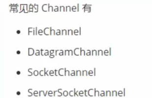


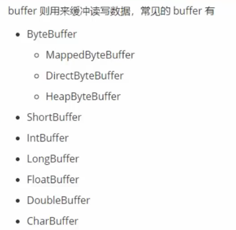

### 1.1.2 Selector

选择器

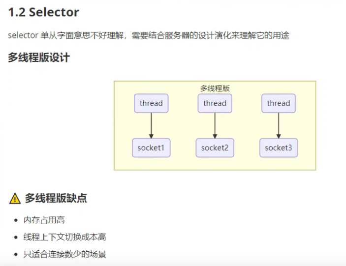


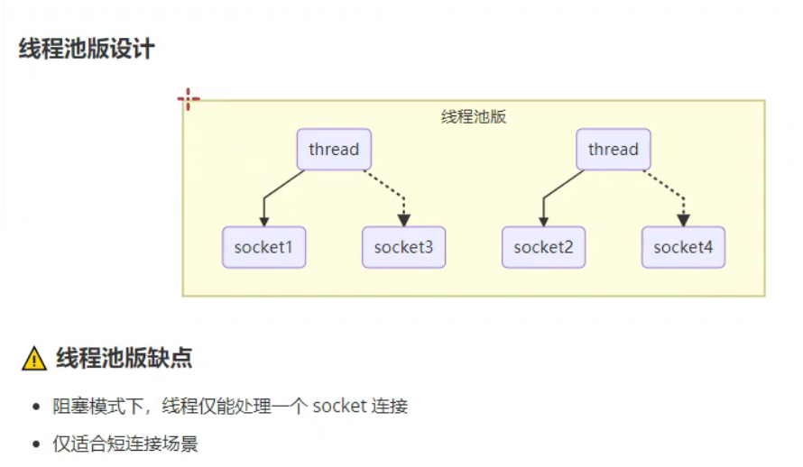

需要等socket1 断开连接后，才能为socket3服务。实际上是限制了线程数量的多线程版。

注意： 即使socket1 没有读写请求时thread仍然等待，仍然为socket1服务。这种等待，造成了线程的利用率不高。


所谓短连接：即 连接上socket以后，处理完单一业务后，马上就断开连接。为下一个连接（服务）做出准备。

```
因为对于长连接来说，系统不得不分配出一个单独的线程为其服务，而有时这个单独的线程并没有一直在工作，多数都是在等待。

Java的线程与操作系统的线程是一对一的，这决定了Java的线程资源是非常宝贵的。

当长连接 + 大量的用户并发访问，如果使用线程池，就会导致服务器资源被严重压缩又得不到合理的使用。
```


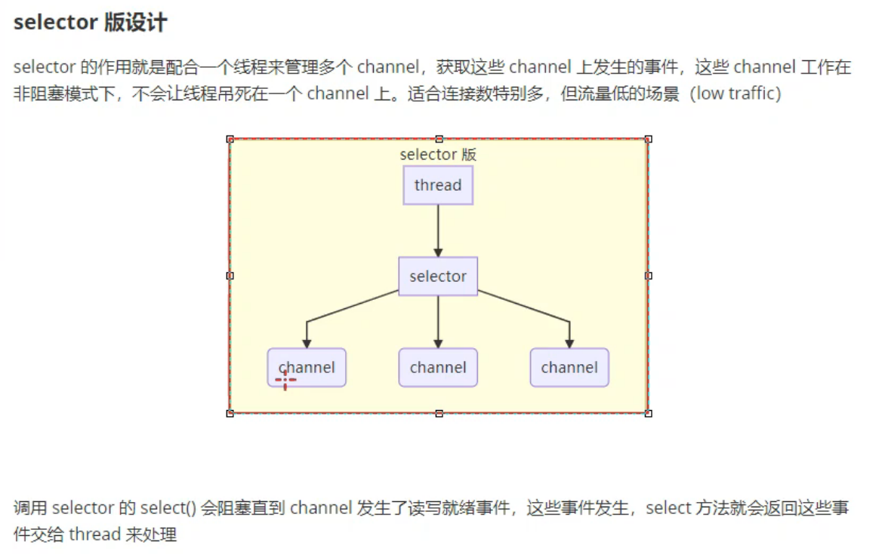

流量低： 指某个Channel 不会频繁的请求读写。高流量将导致其他Channel频繁等待的情况。


### 1.1.3  channel 接口


jdk1.4 以后的一个接口。在java.nio.channels包下。这个接口有众多的实现类

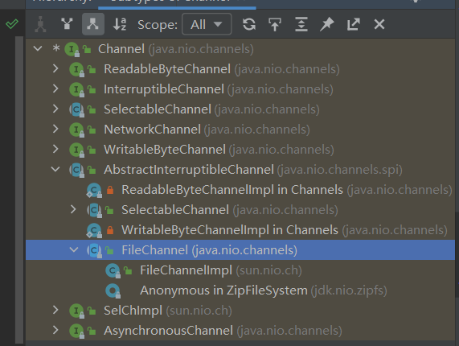

常用的有FileChannel 抽象类。


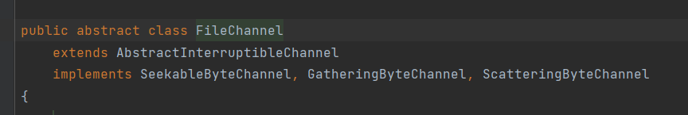


为文件读写，映射的channel 。以及操作文件。

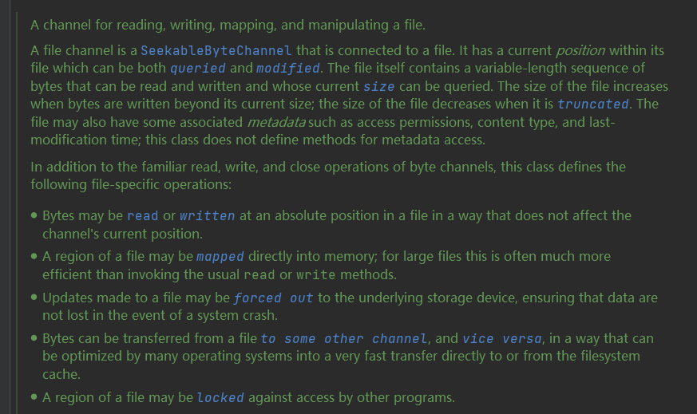


#### 1.1.3.1 FileChannel

A channel for reading, writing, mapping, and manipulating a file.

```
一个用于 读/写/映射/操纵一个文件 的通道
```


##### 构造方法


它的构造方法是私有化的


可以通过静态方法open获得：


```
传入一个Path , 并传入操作集合，文件属性
```


```
传入路径Path 和 操作
```


| modify and type | method                                                       | expression                                                   |
| --------------- | ------------------------------------------------------------ | ------------------------------------------------------------ |
| int             | read(ByteBuffer bb)                                          | 返回读入的字节数                                             |
| int             | write(ByteBuffer bb)                                         | 返回写出的字节数                                             |
| void            | force(boolean  metedata)                                     | 强制使 缓存在内存中的数据，与磁盘交换                        |
| long            | size()                                                       | 返回文件的大小。<br />无论是输出流输出流获得的Channel<br />都可以读取到文件大小 |
| long            | transferTo(long   position,long    count ,WritableByteChannel   target) | 把当前的Channel指定位置写入给 target channel                 |


读写操作，都是使用ByteBuffer作为容器完成的。


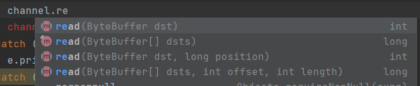


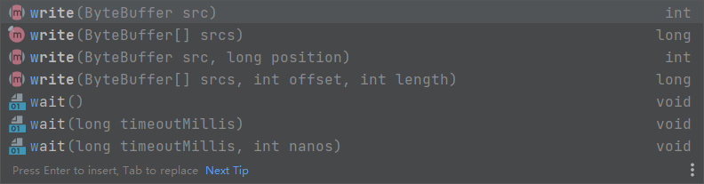


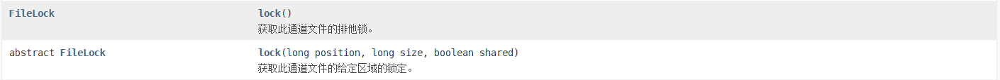

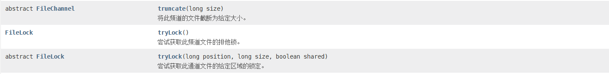


##### 集中写


```java
    @Test
    public void ChannelWrite(){
        
        try(FileOutputStream fos = new FileOutputStream("data.txt");
            FileChannel channel  =  fos.getChannel();){
            ByteBuffer bb1 = StandardCharsets.UTF_8.encode("2021年10月5日\n");
            ByteBuffer bb2 = StandardCharsets.UTF_8.encode("abc\n");
            ByteBuffer bb3 = StandardCharsets.UTF_8.encode("123456");
            channel.write(new ByteBuffer[]{bb1,bb2,bb3});
        }catch (Exception e){
            e.printStackTrace();
        }
    }
```

写入完成。

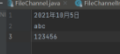

这么做可能会存在一个问题：channel有时不能一次性把ByteBuffer的所有内容都写出。

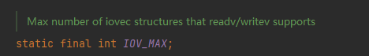

IOV（I/O  Vector）

所以，更安全的写出方式是这样的：

```java
    @Test
    public void ChannelWrite(){

        try(FileOutputStream fos = new FileOutputStream("data.txt");
            FileChannel channel  =  fos.getChannel();){
            ByteBuffer bb1 = StandardCharsets.UTF_8.encode("2021年10月5日\n");
            ByteBuffer bb2 = StandardCharsets.UTF_8.encode("abc\n");
            ByteBuffer bb3 = StandardCharsets.UTF_8.encode("123456");
            //encode后的ByteBuffer 的position自动切换到了index0的位置
            while (bb1.hasRemaining() || bb2.hasRemaining()|| bb3.hasRemaining()){
                channel.write(new ByteBuffer[]{bb1,bb2,bb3});
            }//持续写出，直到bb1.bb2,bb3都没有剩余时
            channel.force(true);
        }catch (Exception e){
            e.printStackTrace();
        }
    }
```


###### 提出问题

此时自然而然又会考虑到另外一个问题：如果 bb1 bb2 都成功全部写出，只有bb3尚有剩余。使用 write(ByteBuffer[] array) 这种方法同时把3个都写出会出错吗？

通过黑盒 和 白盒测试的答案就是：不会。

首先黑盒测试：

模拟 bb1尚有剩余bb2,bb3 为空的情况

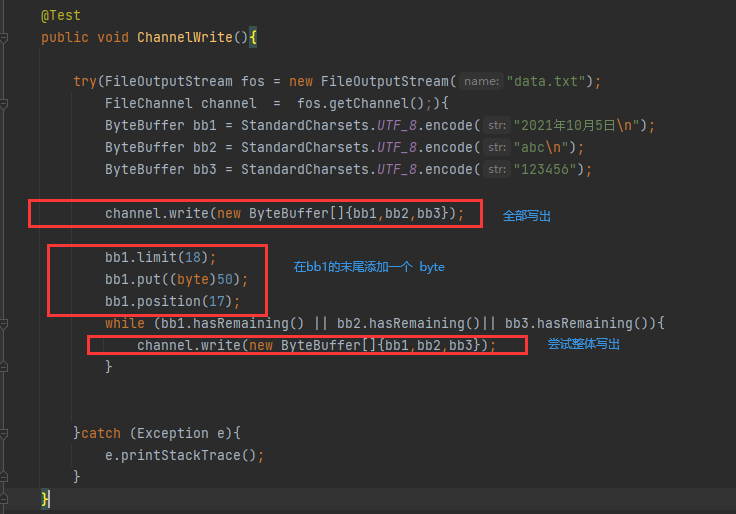


成功编译并运行：

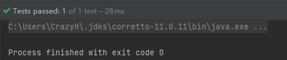

输出结果符合预期：

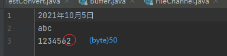


白盒测试：

Channel里的写方法，对各种情况都做了检查，例如是否支持可写权限等。

真正执行写命令逻辑的语句是  IOUtil里的write方法

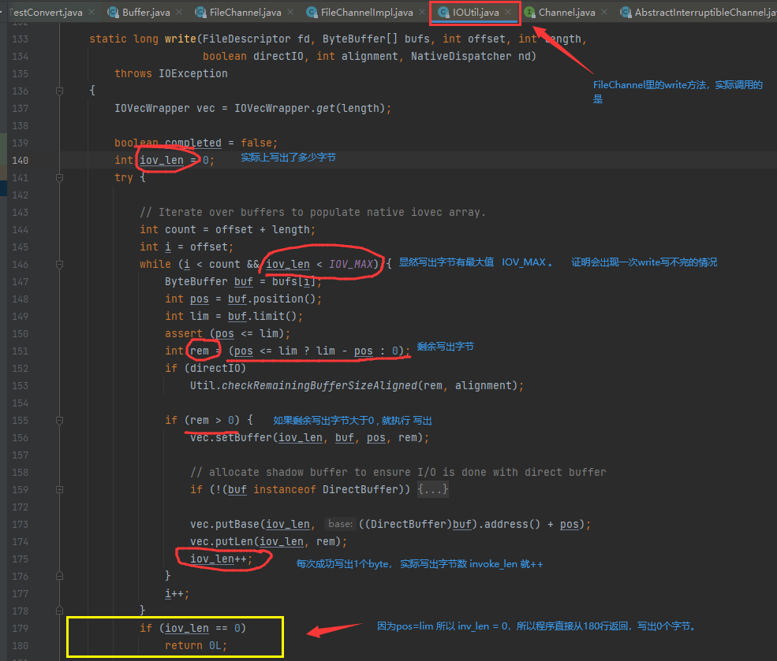

在179-180 行代码看到，当剩余写出字节为0的时候。程序会直接返回结果0，不会抛出异常。

所以

```java
            while (bb1.hasRemaining() || bb2.hasRemaining()|| bb3.hasRemaining()){
                channel.write(new ByteBuffer[]{bb1,bb2,bb3});
            }
```

是安全的；


#### 1.1.3.2 如何获取FileChannel

##### 1.1.3.2.1 FileInputStream

```
FileInputStream().getChannel() 获得具有 读权限的 channel   //无法写

FileOutputStream().getChannel() 获得具有 写权限的 Channel //无法读
```


```java
FileInputStream inputStream = new FileInputStream(file);
FileChannel readChannel = inputStream.getChannel();
//从文件输入流 获得的Channel 只能读


FileOutputStream outputStream = new FileOutputStream(file,false);
FileChannel writeChannel = outputStream.getChannel();
//从文件输出流中获得的 Channel只能写
```


小demo: 使用输入流获得channel读，使用输出流获得channel写

```java
public class FileChannelTest {


    static Logger logger = Logger.getLogger("FileChannelTest");

    public static void main(String[] args) {


        File file = getSrcFile(); //获取指定源文件


        try (FileInputStream inputStream = new FileInputStream(file);
             FileChannel readChannel = inputStream.getChannel();
             FileOutputStream outputStream = new FileOutputStream(file,false);
             FileChannel writeChannel = outputStream.getChannel();){


            writeToFile(writeChannel);

            readFromFile(readChannel);


        } catch (IOException e) {
            throw new RuntimeException(e);
        }

    }

    private static void writeToFile(FileChannel writeChannel) throws IOException {

        ByteBuffer bb1 = StandardCharsets.UTF_8.encode("this world of mine , 哈哈哈\n");
        ByteBuffer bb2 = StandardCharsets.UTF_8.encode("Fuck the world\n");
        ByteBuffer bb3 = StandardCharsets.UTF_8.encode("Let it go~\n");

        long write = writeChannel.write(new ByteBuffer[]{bb1, bb2, bb3});
        System.out.println("成功写入 " + write + "个byte");

    }

    private static File getSrcFile(){
        File file = new File("C:/Users/SemgHH/Desktop/forNetty/FileChannelTest.txt");
        if (!file.exists()) {

            try {
                if (file.createNewFile()) {
                    logger.info("文件创建成功");
                }else {
                    logger.info("创建失败");
                    System.exit(-1);
                }
            } catch (IOException e) {
                throw new RuntimeException(e);
            }
        }else {
            logger.info("文件已存在");
        }
        return file;
    }

    private static void readFromFile(FileChannel readChannel) throws IOException {

        ByteBuffer allocate = ByteBuffer.allocate(1024);
        int read = readChannel.read(allocate);
        logger.log(Level.INFO,"成功读入{0}个字符",read);

        allocate.flip();

        CharBuffer decode = StandardCharsets.UTF_8.decode(allocate);

        logger.log(Level.WARNING,decode.toString());


    }
}
```


##### 1.1.3.2.2   RandomAccessFile

支持随机访问一个文件。

使用RandomAccessFile获得的Channel可以同时具备写和读的权限。


使用 RandomAccessFile.getChannel();

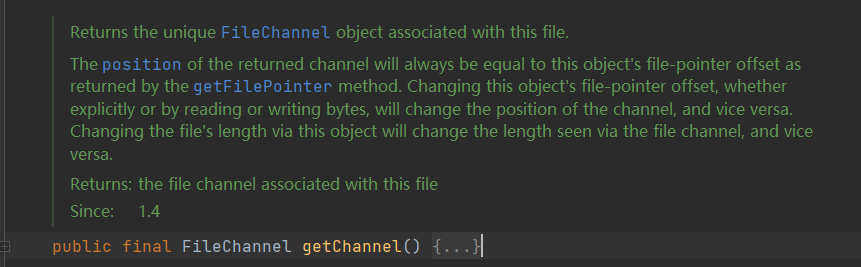


RandomAccessFile的构造方法：传入文件地址，或者直接传入文件。

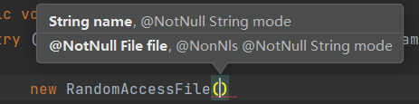


###### 随机访问模式

RandomAccessFile 支持不同的访问模式,例如  只读，读写等。在构造方法中需要传入字符串类型的mode作为声明。


4个Mode具体如下:

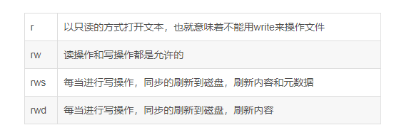


| modify and type | method           | expression                         |
| --------------- | ---------------- | ---------------------------------- |
| long            | length()         | 返回文件长度                       |
| void            | seek(long   pos) | 将光标移到指定位置                 |
| long            | getFilePointer   | 返回文件当前光标位置               |
| FileChannel     | getChannel       | 得到这个文件的通道                 |
|                 | skipBytes(int n) | 跳过n字节的位置，相对于当前的point |


这是一个古老的类，它和inputstream outputstream 类系没有关系，它的基本方法在jdk1.4之后不要用了，取而代之的是内存映射文件方式（nio包），即把文件映射到内存后再操作，省去了频繁磁盘io


#### 1.1.3.3    FileChannel.transferTo

```java
    @Test
    public void transferTo(){
        try(FileInputStream fis  = new FileInputStream("data.txt");
            FileOutputStream fos = new FileOutputStream("replication.txt");
            FileChannel main = fis.getChannel();
            FileChannel replication  = fos.getChannel();){
            //拷贝效率高。使用的是零拷贝。同时单次transferTo 的上限是2G
            main.transferTo(0L,main.size(),replication);
            replication.force(true);

        }catch (Exception e){
            e.printStackTrace();
        }
    }
```

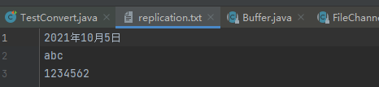


对文件上限的改进：

```java
    @Test
    public void transferTo1(){
        try(FileChannel from = new FileInputStream("data.txt").getChannel();
            FileChannel to   = new FileOutputStream("to.txt").getChannel()){
            //  “to.txt” 如果文件不存在会自动创建
            long max = from.size();//拷贝最大长度
            long rem = max;//剩余长度
            for(;rem>0;){//只要剩余长度大于0
                rem -= from.transferTo(max-rem,max,to);  //剩余长度减去每次拷贝的长度
            }

        }catch (Exception e){

        }
    }
```


## 1.2 ByteBuffer

java.nio.ByteBuffer是一个抽象类。父类是Buffer


ByteBuffer有两个子类： 堆区ByteBuffer 和 映射ByteBuffer  (堆区Buffer就是JVM堆区中的Buffer，映射Buffer为操作系统直接内存，不归JVM管理)


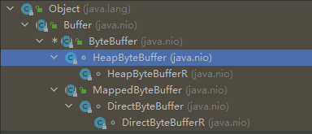


使用 byteBuffer

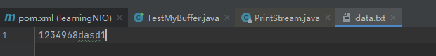

```java
public class TestMyBuffer {
    static Log log  = LogFactory.getLog("main");
    public static void main(String[] args) {
        try (FileChannel channel = new FileInputStream("data.txt").getChannel()) {
            ByteBuffer bb = ByteBuffer.allocate(8);
            int cur = 0;
            log.info("读到的字节");
            while ((cur=channel.read(bb))!=-1){
                int i = 0;
                while (i<cur){
                    System.out.print((char) bb.get(i)+"\t");
                    i++;
                }
                bb.clear();
            }

        } catch (IOException ioException) {

        }
    }
}
```

我的程序，没有用 ByteBuffer.hasRemaining() 和 ByteBuffer.get()

而是用的 ByteBuffer.get(int index);直接从数组中取byte，所以不用 ByteBuffer.flip() 重置position位置和 limit 位置。


### 1.2.1 Buffer类


签名如下：

java.nio.Buffer

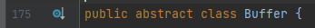

#### 1.2.1.1 成员变量

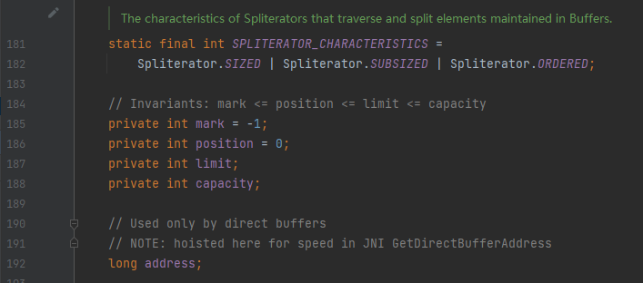


```
Buffer类的内存，可以分配在JVM的堆区中，也可以分配在系统中(不归JVM管理)。
```


```
mark标记的初始值为-1;
```


#### 1.2.1.1 Buffer类的核心

三个指针：   capacity 最大容量。 position 起始位置，limit 结束位置。


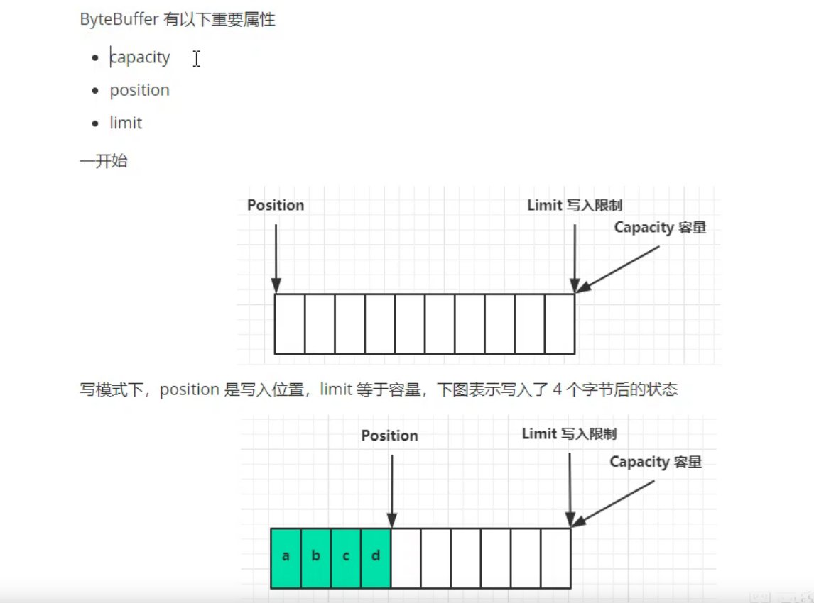


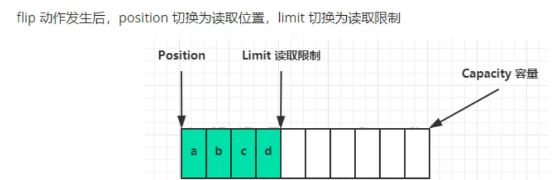


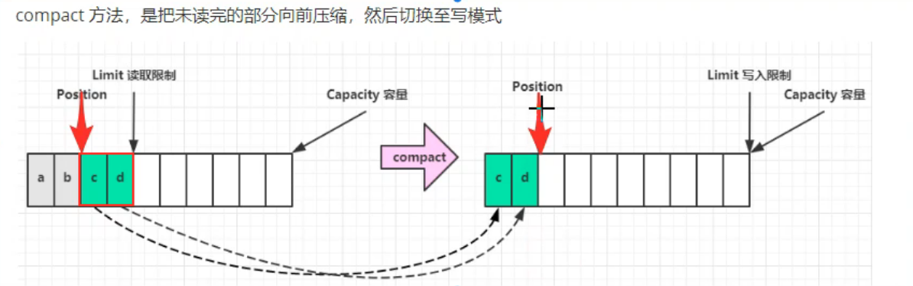

根据compact(压缩)方法，显然，当position=limit的时候。等同于clear()方法。

测试一下

```java
public class TestMyBuffer {
    static Log log  = LogFactory.getLog("main");
    public static void main(String[] args) {
			...
                bb.compact();
        	...
    }
}
```

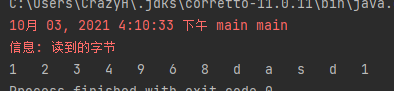

正常拿到所有数据！


#### 1.2.1.3 Buffer.API


poublic API

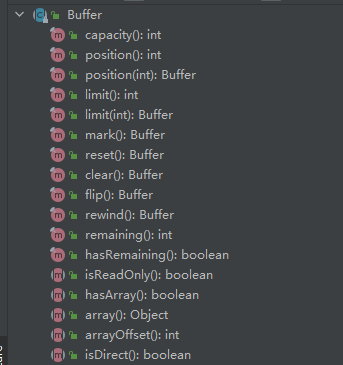

```
capacity() 返回容量。
position() 返回pos指针
position(int)  移动pos指针到指定位置。

=========
mark()  mark的值变为当前的pos
reset() pos的值变为mark，如果mark是初始值-1，就抛出异常。
=========

=========
flip()  切换为读模式。 //简单的把limit=pos,pos=0，mark=-1  也就是说,本次写入的起始pos如果不是0,flip()就会出错。  flip()与compact()搭配使用，不会出错。只有在手动调整了写模式下pos的地址才有可能出错。

=========


```


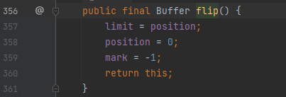


```
rewind()   重写 //简单的把 pos=0 mark=-1
```


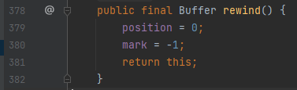


```
int remaining() 剩余。
```


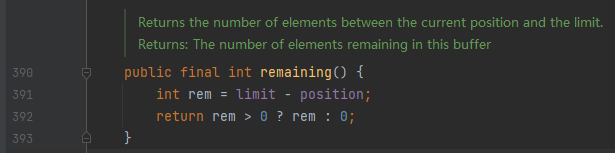


```
isDirect()   是否是直接内存(jvm堆区以外的内存)
array()
```


### 1.2.1 申请内存


ByteBuffer.allocate(int capacity)获得的是    HeapByteBuffer  使用的是JVM里的堆内存。

ByteBuffer.allocateDirect(int capacity)获得的是   DirectByteBuffer 使用的是系统内存。不受 GC影响，会造成内存泄漏。使用系统的api，分配效率低


### 1.2.2 一些方法


| modify and type | method              | expression                                      |
| --------------- | ------------------- | ----------------------------------------------- |
| ByteBuffer      | rewind()            | 将position指针位置重置为0                       |
| ByteBuffer      | put(byte b)         | 将byte/byte[]/ByteBuffer/放入ByteBuffer中       |
| ByteBuffer      | mark()              | 对当前position位置做一个标记                    |
| ByteBuffer      | reset()             | 将Position跳转到被mark标记的位置                |
| ByteBuffer      | get()               | 返回的是这个ByteBuffer自己。get()方法有多种重载 |
| byte            | get(int index)      | 返回一个byte                                    |
| int             | position()          | 返回position的值                                |
| int             | limit()             | 返回limit的值                                   |
| ByteBuffer      | limit(int newlimit) | 修改limit的值为 newlimit                        |
| int             | capacity()          | 返回capacity的值                                |
|                 |                     |                                                 |


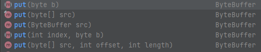


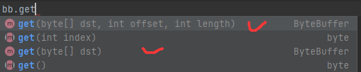


下面引入一个例子，来对get()方法的更多体会。

准备一个 data.txt 里面内容 


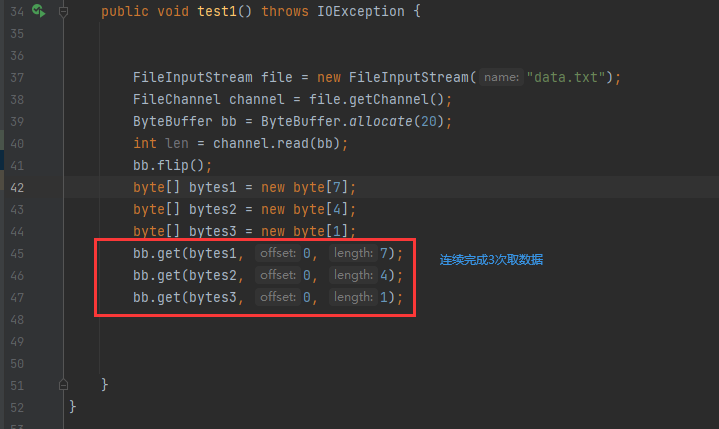

注意： offset 指的是 bytes1 的偏移量。length 指读出 字节数的量。需要满足  length+offset<= bytes1.length


get(byte[],int offset,int length)返回的是 ByteBuffer自己。是不是可以用这样更优雅的表示方法：

```
bb.get(bytes1, 0, 7).get(bytes2, 0, 4).get(bytes3, 0, 1);
```

UTF-8 一个汉字，占3个字节。准备文本


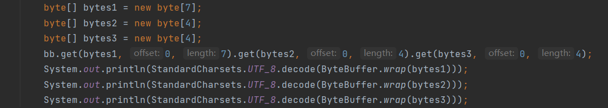

输出结果

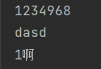


事实上在 java nio 包下，除了ByteBuffer 还有CharBuffer  IntBuffer FloatBuffer等等

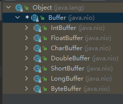

而StringBuffer 是java.lang包下的。


可以看到  mark , position,limit,capacity 都是Buffer 抽象类的成员。这个类的实现类都有这些属性

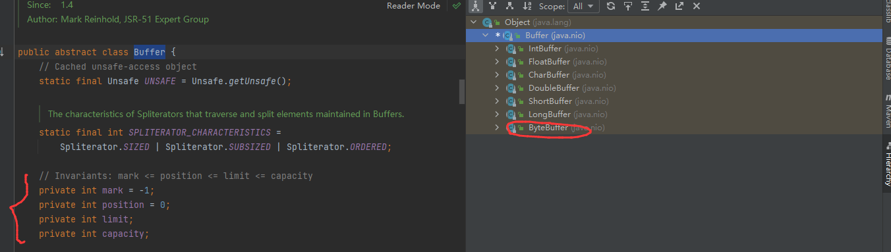


### 1.2.3 ByteBuffer 与 字符串

在网络上传输的内容通常是 Byte[] 。所以我们需要 ByteBuffer 与 字符串的转化

#### 1.2.3.1 StandardChersts

java 1.7 以后。

java.nio.charset 下的 StandardCharsets类。  定义了一些常见的字符集常量。

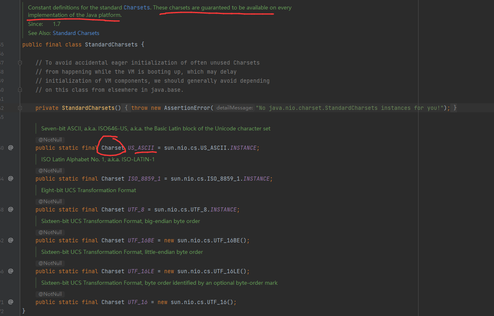

注意到这些常量，都是  Charset 类的实例。


#### 1.2.3.2 Charset 类

java.nio.charset包下的类。

是一个抽象类，实现了 Comparable  接口。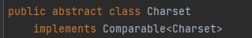


继承关系树上能够看到各种 实现类。

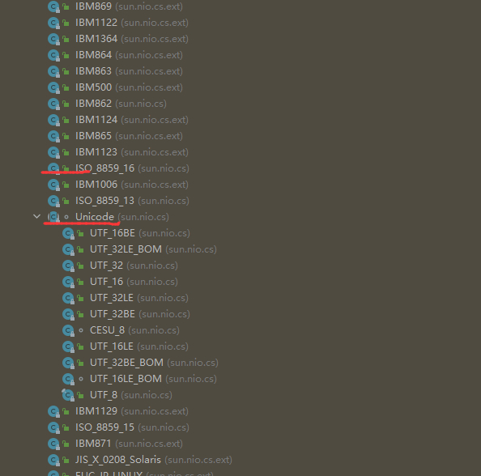


Charset中抽象了一些比较重要的方法。我们取其中的一部分浏览一下。

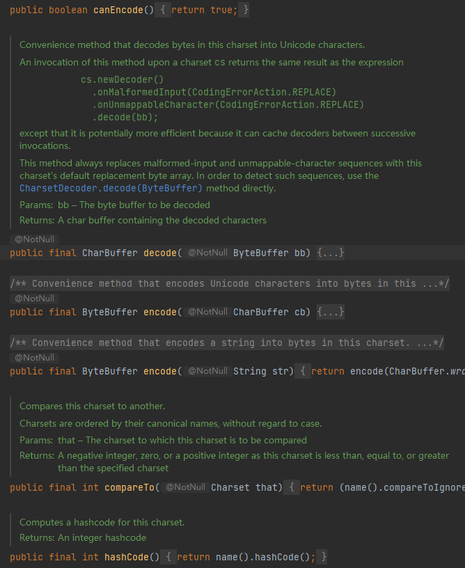


canEncode:

```
canEncode() 十分方便的方法 用于对字节数组解码成Unicode字符。等同于如下表达式的结果。
```

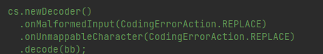

这个方法有潜在的更快的效率，因为可以缓存转换后的结果。

decode : 解码。

encode：编码。

测试实例：

```java
ByteBuffer bb = StandardCharsets.UTF_8.encode("abc");
//将字符串转换为  ByteBuffer
```

| modify and type | method                  | expression                   |
| --------------- | ----------------------- | ---------------------------- |
| CharBuffer      | decode（ByteBuffer bb） | 将ByteBuffer转化成CharBuffer |
| ByteBuffer      | encode(String src)      | 将字符串转化为 ByteBuffer    |
|                 |                         |                              |

Charest的decode方法是  将ByteBuffer转化成CharBuffer

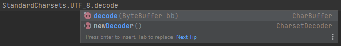


CharBuffer是一个抽象类。

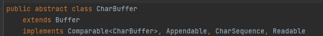

它有这些实现类：

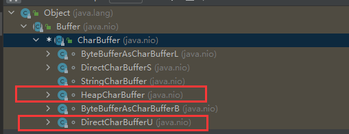

看到了熟悉的堆内存CharBuffer，和直接内存CharBuffer


下面来运行一下decode，看看 默认情况下会返回什么类型的 CharBuffer

```java
    @Test
    public void test(){

        ByteBuffer wrap = ByteBuffer.wrap("啊".getBytes(StandardCharsets.UTF_8));

        CharBuffer decode = StandardCharsets.UTF_8.decode(wrap);
                
        String s = decode.toString();

        System.out.println(s);

        Class<? extends CharBuffer> clazz = decode.getClass();
        //返回一个类， 这个类继承了 CharBuffer

        System.out.println(clazz);

    }
```

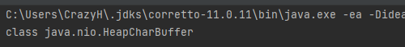

我拿到的是 HeapCharBuffer 堆内存CharBuffer


一个encode方法的测试例子:

```java
    @Test
    public void channelWrite() {
        
        try (FileChannel channel = new FileOutputStream("data.txt").getChannel()){
            ByteBuffer encode = StandardCharsets.UTF_8.encode("Today is a good day, everything is okay");
            channel.write(encode);
        } catch (FileNotFoundException e) {
            e.printStackTrace();
        } catch (IOException ioException) {
            ioException.printStackTrace();
        }
    }
```

使用了  FileOutputStream.getChannel()的方法，获取了写channel()


在FileOutputStream 构造方法的参数中追加true 。可实现文件续写；

```
FileChannel channel = new FileOutputStream("data.txt"，true).getChannel();
```


#### 1.2.3.3 String 的内置方法：

| modify and type | method     | expression                       |
| --------------- | ---------- | -------------------------------- |
| byte[]          | getBytes() | 获得字节数组<br />有多种重载方法 |
|                 |            |                                  |
|                 |            |                                  |


#### 1.2.3.4 ByteBuffer.warp


将Bytep[] 转化为 ByteBuffer


```java
    @Test
    public void test(){
        ByteBuffer wrap = ByteBuffer.wrap("啊".getBytes(StandardCharsets.UTF_8));

        CharBuffer decode = StandardCharsets.UTF_8.decode(wrap);

        System.out.println(decode);

    }
```


### 1.2.4 黏包  半包


黏包是因为合并到一起后，网络传输效率高。出现半包是因为ByteBuff的容量不够


## 1.3 Path


### 1.3.1 Paths工具类


Paths工具类只有2个方法


```
都是返回Path的。
第一个方法可以传入1至多个 文件地址。

第二个方法通过URI 返回一个Path
```


1.1.3.1 中提到过FileChannel的构造方法是Protected的，可以通过静态的open方法获得FileChannel;


#### 1.3.1.1 小demo

```java
public class FileChanneTestl03 {


    /**
     *
     *
     * 通过 FileChannel.open 传入Path获得FileChannel 实例对象
     *
     *
     */

    static final  String pathname = "C:/Users/SemgHH/Desktop/forNetty/PathsTest.txt";

    static Charset charset = StandardCharsets.UTF_8;

    public static void main(String[] args) throws IOException {


        Path path = Paths.get(pathname);

        getFileCreateAbsent(pathname);

        try(FileChannel fileChannel = FileChannel.open(path,StandardOpenOption.WRITE);){

            String str = "zmnxbcduoqwdfasjdbfdks";
            ByteBuffer bb = charset.encode(str);

            while (bb.hasRemaining()){
                int len = fileChannel.write(bb);
                logger.log(Level.INFO,"向文件中写入{0}个byte",len);
            }
        }


        try (FileInputStream fileInputStream = new FileInputStream(pathname);
            FileChannel fileChannel = fileInputStream.getChannel()){

            ByteBuffer bb = ByteBuffer.allocate(1024);
            int len;

            while ((len = fileChannel.read(bb)) != -1) {
                bb.flip();
                System.out.println(charset.decode(bb));
                bb.compact();
            }
        }
    }
}
```


### 1.3.2 Path的方法


```
得到根路径
得到文件名
得到父类路径
得到路径名计数 (一个/ 就算1个路径Path) 例如下面的路径就是5个
```


```java
public class PathTest04 {


    static final String pathname = "C:/Users/SemgHH/Desktop/forNetty/PathsTest.txt";


    public static void main(String[] args) {

        Path path = Paths.get(pathname);

        System.out.println("root : "+path.getRoot()); //C:\

        System.out.println("FileName : "+path.getFileName()); //PathsTest.txt

        System.out.println("Parent : "+path.getParent());  //C:\Users\SemgHH\Desktop\forNetty

        System.out.println("nameCount : "+path.getNameCount());  //5

        Iterator<Path> iterator = path.iterator();

        while (iterator.hasNext()) {
            System.out.println(iterator.next());
        }
        /*
         * Users
         * SemgHH
         * Desktop
         * forNetty
         * PathsTest.txt
         */
    }
}
```


```
转换为URI
转换为File
转化为绝对路径Path
```


```java
    @Test
    public void pathApiTest() throws URISyntaxException {

        Path path = Paths.get("/");

        Path absolutePath = path.toAbsolutePath();
        System.out.println(absolutePath);


        Path path1 = Paths.get(pathname);

        //toFile
        File file = path1.toFile();
        System.out.println(file);

        //toURI
        URI uri = path1.toUri();
        System.out.println(uri);

        //new URI
        URI uri2 = new URI("file:///C:/Users/SemgHH/Desktop/forNetty/PathsTest.txt");
        System.out.println(uri2);


    }
```


## 1.4 Files

对文件操作的工具类。


java.nio.file.Files

- 该类只包含对文件，目录或其他类型文件进行操作的静态方法。

  在大多数情况下，这里定义的方法将委托给相关的文件系统提供程序来执行文件操作。 


### 1.4.1 Files的常见方法

#### 1.1.4.1 copy


复制文件


```
支持传入传出的源是 Path类型的 以及 输入输出流形式
```


##### demo

```java
    static final String pathname = "C:/Users/SemgHH/Desktop/forNetty/PathsTest.txt";

    public static void main(String[] args) {

        Path source = Paths.get(pathname);

        String copyName = resolveName.paresCopyName(pathname);

        Path target = Paths.get(copyName);

        try {
            Path copy = Files.copy(source, target);


        } catch (IOException e) {
            throw new RuntimeException(e);
        }


    }
```


工具类方法: 解决名称重复问题

```java
    public static String paresCopyName(String sourceName){
        int index = sourceName.lastIndexOf(".");
        if (sourceName.charAt(index-1)==')'){
            int i = sourceName.lastIndexOf("(");
            if (i!=-1){
                String substring = sourceName.substring(i + 1, index - 1);
                try {
                    int next = Integer.parseInt(substring) + 1;
                    StringBuilder sb = new StringBuilder(sourceName.substring(0, i + 1));
                    sb.append(next);
                    sb.append(")");
                    sb.append(sourceName.substring(index));
                    return sb.toString();
                }catch (NumberFormatException e){}
            }
        }
        StringBuilder sb = new StringBuilder(sourceName.substring(0,index));
        sb.append("(1)");
        sb.append(sourceName.substring(index));
        return sb.toString();
    }
```


StandardCopyOption:


### 1.4.1 Files.walkFileTree ()  遍历


#### 1.4.1.1遍历访问

```java
 @Test
    public void testWalkFileTree() throws IOException {
        //匿名内部类引用外部变量只能引用被final修饰的。
        //自创建一个匿名内部类对象，系统为该对象分配内存，直到没有引用变量指向分配给该对象的内存，它才有可能			会死亡（被JVM垃圾回收）
       	//当方法被调用，方法被创建在栈中。局部变量在栈帧中。方法执行完毕，弹栈。局部变量同时凋亡。此时会出现
        //匿名内部类对象活着但引用的局部变量凋亡的情况。被final修饰的局部变量，会被拷贝一份到匿名内部类中，			避免了这个问题
       	//所以使用AtomicInteger作为累加。
        AtomicInteger dirCount = new AtomicInteger();
        AtomicInteger fileCount = new AtomicInteger();

        Files.walkFileTree(Paths.get("C:\\Program Files\\Java\\jdk-15"),new SimpleFileVisitor<>(){

            @Override
            public FileVisitResult preVisitDirectory(Path dir, BasicFileAttributes attrs) throws IOException {
                System.out.println("=========文件夹=======>>> " +dir.getFileName());
                dirCount.incrementAndGet();
                return super.preVisitDirectory(dir, attrs);
            }

            @Override
            public FileVisitResult visitFile(Path file, BasicFileAttributes attrs) throws IOException {
                System.out.println(file.getFileName());
                fileCount.incrementAndGet();
                return super.visitFile(file, attrs);
            }
        });

        System.out.println("文件夹的数量 ： " +  dirCount);
        System.out.println("文件的数量 ： " + fileCount);
    }
```

匿名内部类 访问外部变量带来的问题：

https://www.cnblogs.com/kaleidoscope/p/9494968.html


#### 1.4.1.2 遍历删除

```java
@Test
    public void testWalkFileTreeDeleteFile() throws IOException {
        Path p = Path.of("C:\\Users\\CrazyH\\Desktop\\codeblock - 副本");
        Files.walkFileTree(p,new SimpleFileVisitor<>(){
            @Override
            public FileVisitResult preVisitDirectory(Path dir, BasicFileAttributes attrs) throws IOException {
                System.out.println("========>>>>[进入文件夹 :"+dir.getFileName()+" ]===========");
                return super.preVisitDirectory(dir, attrs);
            }


            @Override
            public FileVisitResult postVisitDirectory(Path dir, IOException exc) throws IOException {
                System.out.println("===========[退出文件夹 :"+dir.getFileName()+" ]<<<<<======");
                if (Files.deleteIfExists(dir))System.out.println("[成功删除文件夹 :"+dir.getFileName()+" ]");
                return super.postVisitDirectory(dir, exc);
            }

            @Override
            public FileVisitResult visitFile(Path file, BasicFileAttributes attrs) throws IOException {

                boolean b = Files.deleteIfExists(file);
                if (b) System.out.println("[成功删除文件 :"+file.getFileName()+" ]");
                return super.visitFile(file, attrs);
            }
        });

    }
```


#### 1.4.1.3 walk


参数是遍历的起始地址 和  FileVisitOption 。返回的是一个 Stream<Path>(对象)


## 1.5 Selector

选择器，以事件的方式驱动。Selector为多个线程服务，准备完成的线程会向Selector发出通知。


### 1.5.1 Selector 工作流程


```
下一个状态
```


```
下一个状态
```


```
如果没有在 selectedKeys 中移出instance1
```


```
移除后。 //此时，正确处理了read时间。又移出了selectedKeys。
        //正确处理了全部过程
```


拿到selectorKeys  通过迭代器方法。

```java
Iterator<SelectionKey> it = selector.selectedKeys().iterator();
```

循环迭代器

```java
while(it.hasNext()){
	SelectionKey sk = it.next();
	it.remove();   //从selectedKeys 中删除这个 selectionKey，防止下次再遍历到这个SelectionKey
	               //在selectedKeys中 就代表 有事件。如果上次处理完，没有remove，
                  //那么在下次遍历时，就会遍历到没有触发事件的 selectionKey，就会空指针异常
	...
	do something...
	...
	
	
}
```


```java
public class ServerChannel {
    private static Log log = LogFactory.getLog("[客户端]");

    public static void main(String[] args) throws IOException {


        ServerSocketChannel ssc = ServerSocketChannel.open();
        ssc.configureBlocking(false);

        ssc.bind(new InetSocketAddress(8080));//  给ServerSocketChannel 绑定一个监听端口

        Selector selector = Selector.open();  // 创建一个Select

        SelectionKey sscKey = ssc.register(selector, 0, null);//将 channel 注册在Selector上。获得标识SelectionKey

        sscKey.interestOps(SelectionKey.OP_ACCEPT); // 给sscKey 设置感兴趣事件


        while (true){
            log.info("进入阻塞态");
            selector.select();  // 所有注册在selector的selectionKey都没有被感兴趣事件触发前，是阻塞状态
            log.info("解除阻塞态");

            Iterator<SelectionKey> it = selector.selectedKeys().iterator();  //获得 SelectedKeys的迭代器
            while (it.hasNext()){
                SelectionKey curKey = it.next();
                it.remove();

                if(curKey.isAcceptable()){

                    ServerSocketChannel channel = (ServerSocketChannel) curKey.channel(); //获取触发了事件的channel

                    SocketChannel accept = channel.accept();//与客户端建立新的 SocketChannel连接。
                    accept.configureBlocking(false);
                    SocketAddress remoteAddress = accept.getRemoteAddress();
                    SocketAddress localAddress = accept.getLocalAddress();

                    accept.register(selector,0,null).interestOps(SelectionKey.OP_WRITE);//将新的channel 连接注册给selector,同时设置感兴趣事件 write


                    log.info("处理来自于 channel: "+channel+" 的[accept事件] ,[客户端地址] : "+remoteAddress+"[服务端地址] : "+localAddress);
                }
                else if(curKey.isWritable()){   //此处的 isWritable以服务器端为主视角，指的是： 当前服务端channel应当是写的状态。即 客户端请求从服务器读数据,此时服务器应当写数据给客户端
                    SocketChannel channel = (SocketChannel) curKey.channel();
                    channel.write(Charset.defaultCharset().encode("哈哈"));
                    curKey.cancel(); //取消SelectionKey,表示这个SelectionKey已经处理完毕，否则会不停的被Selector.select
                }
            }
        }
        
        
        
    }
}
```


```java
public class Client {
    private Log log = LogFactory.getLog("[客户端]");

    public static void main(String[] args) throws IOException {
        SocketChannel socketChannel = SocketChannel.open();
        socketChannel.connect(new InetSocketAddress("localhost", 8080));
        ByteBuffer bb = ByteBuffer.allocate(32);
        socketChannel.read(bb);
        bb.flip();
        System.out.println(Charset.defaultCharset().decode(bb));
        bb.clear();
    }
}
```


```
如果read事件没有正确处理。仅仅把instance1移出 selectedKeys 时的情况。
```


```
当服务端处理 read/write 时间时，恰好服务端down掉了。就会出现这种情况。
使用 SelectionKey.cancel(); 将这个selectionkey在selector中移除，不再监听这个断开的连接
```


#### 1.5.1.1 SelectionKey

```
package sun.nio.ch;

SelectionKeyImpl
```


给SelectionKey 设置兴趣事件


#### 1.5.1.2  事件种类


### 1.5.2  处理客户端断开

当一个客户端不正确的关闭了Socket以后。服务器端可能抛出异常，不能因为一个客户端的异常使服务器陷入宕机状态，所以需要捉住异常。


#### 1.5.2.1 抛出异常

有一个常见异常:

```
java.io.IOException: Connection reset by peer
```


#### 1.5.2.2 原因

引起的原因:

```
1、如果一端的Socket被关闭（或主动关闭，或因为异常退出而引起的关闭），另一端仍发送数据，发送的第一个数据包引发该异常(Connect reset by peer)。


Socket默认连接60秒，60秒之内没有进行心跳交互，即读写数据，就会自动关闭连接。

2、一端退出，但退出时并未关闭该连接，另一端如果在从连接中读数据则抛出该异常（Connection reset）。
```


示例代码：


```
如果将断点打在64行，连接入Client以后，强制断开Client。
之后恢复运行断点，就会在66行 channel.write 写入channel的时候出现IO异常。

这就是在Socket断开一端以后，仍然读写造成的异常。
```


#### 1.5.2.3 解决

```
catch异常以后，finally块中调用  SelectionKey.cancel() 
如果finally中不调用，则会被Selector反复select
```


### 1.5.3 消息边界问题


```
第一种情况，服务器拿到的ByteBuffer比消息还小。只能扩容了

第二种情况，服务器拿到的ByteBuffer比一个消息长。但比两个消息短，会出现”半包“现象。 总的原因也是因为服务器的Buffer比客户端小

第三种 出现了粘包。也是因为服务器buffer比客户端的buffer小
```


#### 1.5.3.1  解决办法

协商。通过服务器和客户端事先沟通协商，指定一个协议。


*思路1*


```
1.固定消息长度，数据包大小一样。Buffer不需要扩容。 

优点: 简单

缺点就是:  短的消息也需要占用固定长度。需要填充无用的数据，浪费空间。如下图
```


*思路2*


```
类似与解决 粘包半包问题的处理方案。

缺点: 需要依次比对'\n' 效率很低。
     同时难以处理 临时的Buffer不够长的问题。 仍然需要扩容buffer
```


*思路3 ： TLV* 


### 1.5.4  处理消息边界


对于 消息边界 思路2：使用分隔符方式


```
当处理消息边界的时候，需要考虑ByteBuffer扩容。 但是一次 channel.read()只会填充满当前的ByteBuffer


扩容后的ByteBuffer必须要等到下次Channel.read()      (注意此时可能有多个 channel都触发了read事件)


必须保证上一次填充满的ByteBuffer,在下一次read时可以使用。

所以，可以使用  SelectionKey的attach()  方法，为每一个SelectionKey 关联一个附加物(attachment)
```


### 1.5.2 从JDK中了解Selector


java.nio.channels.Selector


Selector是 SelectableChannel对象的路由器。


```
一个Selector对象实例，可以被这个类下的“open()”方法创建。 这个实例是由系统默认的Selector provider提供的。

除此以为， Selector实例也可以由 定制化的Selector provider.opsenSelector()方法创建。

Selector对象将会一直存在，除非close方法被显式调用。
```


#### 1.5.2.1  Selector.API


```
由系统默认的SelectorProvider提供的Selector;
```


### 1.5.3   SocketAddress

套接字地址。 这个类在java.net.SocketAddress


```
这个类代表了一个没有指明协议的套接字地址。作为一个抽象类，他的子类将指明协议，以及完整的实现
```


#### 1.5.3.1 InetSocketAddress

SocketAddress的子类的实现： InetSocketAddress  网络套接字地址。 继承树如下：


```
这个类实现了一个IP套接字地址。(IP地址 + 端口号) ，也可以表现为另一种形式(hostname + 端口号)
```


InetSocketAddress的构造方法有3个。port, InetAddress+port ,hostname+port


### 1.5.4 一次性写入大文件


#### 1.5.4.1 问题的提出


有时，服务器可能会向客户端写入一个大文件的需求。

在BIO的常见写法思路中，有如下写法:


```
当buffer还有剩余，就不停的向Channel中写数据。

channel借助于操作系统的缓冲区向网络中发送数据。

有时，会发生这样的现象: 网络状态不佳，缓冲区的数据不总是及时的被发送出去，就会出现虽然 write(buffer)了，但返回的值却是0的情况。
这是 数据接收方没有来得及接收数据，导致缓冲区内的数据满了。

现象如下图:
```


```
也就是说，此时的服务器cpu不停的浪费时间片，轮询缓冲区是否满，如果不满则再写一点儿，满了就不写，返回0
是极大的资源浪费。

NIO的思想就是事件驱动， 哪条线程准备好了数据，就为谁服务。

while(buffer.hasRmaing) 这条语句会让所有已经准备就绪的SelectionKey都被迫等待下来,直到大文件都发送完毕。

这显然是资源的浪费。
```


#### 1.5.4.2 场景的模拟


服务器端代码

```java
public class ServerChannel08 {

    public static void main(String[] args) {

        try (ServerSocketChannel ssc = ServerSocketChannel.open();){

            ssc.configureBlocking(false);
            ssc.bind(new InetSocketAddress("localhost",8888));

            Selector selector = Selector.open();

            ssc.register(selector,0,null).interestOps(SelectionKey.OP_ACCEPT);

            for(;;){

                selector.select();

                Iterator<SelectionKey> iterator = selector.selectedKeys().iterator();

                while (iterator.hasNext()) {

                    SelectionKey curKey = iterator.next();
                    iterator.remove();

                    if (curKey.isAcceptable()){

                        ServerSocketChannel channel = (ServerSocketChannel) curKey.channel();

                        SocketChannel accept = channel.accept();

                        accept.configureBlocking(false);

                        accept.register(selector,0,null).interestOps(SelectionKey.OP_WRITE);
                    }
                    else if (curKey.isWritable()){

                        try {
                            SocketChannel channel = (SocketChannel) curKey.channel();

                            int cap = 30000000;
                            ByteBuffer byteBuffer = ByteBuffer.allocate(cap);
                            for (int i = 0; i < cap; i++) {
                                byteBuffer.put((byte)'a');
                            }
                            byteBuffer.flip();
                            while (byteBuffer.hasRemaining()){
                                int write = channel.write(byteBuffer);
                                System.out.println(write);
                            }

                            curKey.cancel();
                        } catch (IOException e) {
                            System.out.println(e.getMessage());
                            curKey.cancel();
                        }
                    }
                }
            }
        }catch (IOException e){
            System.out.println(e.getMessage());
        }
        finally {

        }


    }
}
```


客户端代码

```java
public class ClientChannel08 {

    public static void main(String[] args) {

        try (SocketChannel socketChannel = SocketChannel.open()) {
            socketChannel.connect(new InetSocketAddress("localhost",8888));
            int total = 0;
            ByteBuffer byteBuffer = ByteBuffer.allocate(1024*1024);
            while (true){
                total += socketChannel.read(byteBuffer);
                System.out.println(total);
                byteBuffer.clear();
            }
        }catch (IOException e){
            System.out.println(e.getMessage());
        }


    }
}
```


测试截图:

```
服务器端发送了多次0个字节。
浪费了性能,同时服务器只处理一个SelectionKey 不符合NIO事件驱动的思想
```


#### 15.4.3 解决问题

使用SelectionKey.attach()    SelectionKey.attachment() ，将没有发送完毕的ByteBuffer存储起来，等到下次Selector.select()调用起来继续发送。


```java
public class ServerChannel08 {

    public static void main(String[] args) {

        try (ServerSocketChannel ssc = ServerSocketChannel.open();) {

            ssc.configureBlocking(false);
            ssc.bind(new InetSocketAddress("localhost", 8888));

            Selector selector = Selector.open();

            ssc.register(selector, 0, null).interestOps(SelectionKey.OP_ACCEPT);

            for (; ; ) {

                selector.select();

                Iterator<SelectionKey> iterator = selector.selectedKeys().iterator();

                while (iterator.hasNext()) {
                    SelectionKey curKey = iterator.next();
                    iterator.remove();
                    if (curKey.isAcceptable()) {
                        ServerSocketChannel channel = (ServerSocketChannel) curKey.channel();
                        SocketChannel accept = channel.accept();
                        accept.configureBlocking(false);
                        accept.register(selector, 0, null).interestOps(SelectionKey.OP_WRITE);
                    } else if (curKey.isWritable()) {

                        try {
                            if (curKey.attachment() == null) {
                                SocketChannel channel = (SocketChannel) curKey.channel();
                                int cap = 30000000;
                                ByteBuffer byteBuffer = ByteBuffer.allocate(cap);
                                for (int i = 0; i < cap; i++) {
                                    byteBuffer.put((byte) 'a');
                                }
                                byteBuffer.flip();
                                curKey.attach(byteBuffer);
                                int write = channel.write(byteBuffer);
                                System.out.println(write);
                            } else {
                                ByteBuffer bb = (ByteBuffer) curKey.attachment();
                                SocketChannel channel = (SocketChannel) curKey.channel();
                                int write = channel.write(bb);
                                System.out.println(write);
                                if (!bb.hasRemaining()){
                                    curKey.attach(null);//help gc
                                    curKey.cancel();
                                }
                            }

                        } catch (IOException e) {
                            System.out.println(e.getMessage());
                            curKey.cancel();
                        }
                    }
                }
            }


        } catch (IOException e) {
            System.out.println(e.getMessage());
        }
    }
}

```


```java
public class ClientChannel08 {

    public static void main(String[] args) {


        try (SocketChannel socketChannel = SocketChannel.open()) {

            socketChannel.connect(new InetSocketAddress("localhost",8888));

            int total = 0;
            ByteBuffer byteBuffer = ByteBuffer.allocate(1024*1024);
            while (true){
                total += socketChannel.read(byteBuffer);
                System.out.println(total);
                byteBuffer.clear();
            }
        }catch (IOException e){
            System.out.println(e.getMessage());
        }
    }
}
```


测试效果:


```
没有写入为0的时候。
```


### 1.5.5 阻塞


```
对于上述的过程详细解释 ：  cpu基于时间片轮换制度， 只有 “就绪态的进程”才有可能被调度。就绪态的进程在 “调度队列中排队”，而那些使用了wait ,read 的进程处于 “等待状态”不能被分配cpu时间片，只有等待某些信号(完成等待态)才会放回就绪队列中等待调度。
```


### 1.5.6 Selector源码


从继承关系来看，Selector被各种OS提供


```
例如Windows 提供了 WindowsSelectorImpl
MacOSX平台的是 KQueueSelectorImpl
Linux2.6 以后才有的 EpollSelectorImpl
```


#### 1.5.6.1   open()

创建Selector 依赖于 SelectorProvider.provider().openSelector() 方法

```java
public static Selector open() throws IOException {
    return SelectorProvider.provider().openSelector();
}
```


接下来是SelectorProvider.provider()方法，这个方法目的是获得一个SelectorProvider的实例对象。


```java
// 通过SelectorProvider.provider() 获得对应平台的 Provider，再调用 Provider.open()方法获得一个Selector实例

// 获取系统配置java.nio.channels.spi.SelectorProvider对应的类，使用反射创建一个这个类对象
// 如果没有，则使用loadProviderAsService()方法获取

if (loadProviderFromProperty()) return provider;
// 从ServiceLoader#load
if (loadProviderAsService()) return provider;
// 如果还不存在则使用默认provider，即KQueueSelectorProvider
provider = sun.nio.ch.DefaultSelectorProvider.create();
```


## 1.6 小结


### 1.6.1 阻塞/非阻塞


#### 1.6.1.1 阻塞


## 1.7 多线程优化NIO


### 1.7.1 抽象出一个工作者线程


```
主线程仍然完成 SocketChannel 和 感兴趣事件的绑定。
但读写事件的具体过程，交付给Woker工作线程处理。只要合理控制Woker工作线程的数量，就可以达到多线程工作的效果。
```


#### 1.7.1.1 简单模型

Woker代码如下:

```java
static class Worker implements Runnable {
        private Thread thread;
        private Selector selector;
        private String name;

        private volatile boolean flag = true;

        public Worker(String name) {
            this.name = name;
        }

        //初始化
        public void init() throws IOException {
            if (flag) {
                this.thread = new Thread(this, name);
                selector = Selector.open();
                this.thread.start();
                flag = false;
            }
        }

        @Override
        public void run() {

            while (true) {

                try {
                    selector.select();//阻塞，等待Selected
                    Iterator<SelectionKey> iterator = selector.selectedKeys().iterator();
                    while (iterator.hasNext()) {
                        SelectionKey next = iterator.next();
                        iterator.remove();
                        //处理读事件
                        if (next.isReadable()) {
                            try {
                                ByteBuffer bb = (ByteBuffer) next.attachment();
                                SocketChannel channel = (SocketChannel) next.channel();
                                int len;
                                if ((len = channel.read(bb)) == -1) {
                                    next.cancel();
                                    continue;
                                }
                                ByteBuffer nextbb = ByteBufferUtil.getLine(bb);
                                if (nextbb == null) {
                                    ByteBuffer allocate = ByteBuffer.allocate(bb.capacity() * 2);
                                    ByteBufferUtil.CopyByteBuffer(bb, allocate);
                                    next.attach(allocate);
                                } else {
                                    System.out.println("get from client[" + channel.getRemoteAddress()
                                            + "] " + charset.decode(nextbb));
                                }
                            } catch (IOException e) {
                                System.out.println(e.getMessage());
                                next.cancel();
                            }
                        }
                    }


                } catch (IOException e) {
                    throw new RuntimeException(e);
                }

            }


        }
    }
```


```java
    public static void main(String[] args) {

        Thread.currentThread().setName("boss");


        try (ServerSocketChannel ssc = ServerSocketChannel.open()) {

            ssc.configureBlocking(false);
            ssc.bind(new InetSocketAddress("localhost", 8888));

            Selector selector = Selector.open();

            ssc.register(selector, 0, null).interestOps(SelectionKey.OP_ACCEPT);

            Worker worker = new Worker("work-0"); //创建一个工作线程.
            worker.init();//工作者线程初始化

            while (true) {
                selector.select();
                Iterator<SelectionKey> iterator = selector.selectedKeys().iterator();
                while (iterator.hasNext()) {
                    SelectionKey curKey = iterator.next();
                    iterator.remove();
                    if (curKey.isAcceptable()) {

                        ServerSocketChannel channel = (ServerSocketChannel) curKey.channel();
                        SocketChannel accept = channel.accept();
                        accept.configureBlocking(false);
                        accept.register(worker.selector,0,null);
                    }
                }
            }
        } catch (IOException e) {
            System.out.println(e.getMessage());
        }
    }
```


#### 1.7.1.2 问题的提出


41行代码到52行代码全部都有主线程执行(包括SocketChannel的注册 和 Woker线程的初始化工作)。

只有run方法内，才由工作者线程自己运行。


此时会出现一个问题:

```
     * Worker 线程的Selector.select 不能比 SocketChannel.register先阻塞。
     * 如果线程阻塞住了，也就不会完成注册过程，如果此时没有SocketChannel已经完成注册，那么Selector永远也不会被唤醒。
```

Selector永远都不会被唤醒，意味着永远也不会执行读事件。


怎样才能解决？

```
核心必须保证 register过程先于Selector.select()发生。或者说，每当有register的时候，就需要唤醒一次Selector，让其注册。
```


### 1.7.2  解决方案

```
将注册(register方法)过程抽象成为一个Runnable 使用线程安全的队列作为消息容器。每当放入Runnable以后，唤醒Selector

这也是Netty的解决方案。
```


#### 1.7.2.1 woker代码


```java
static class Worker implements Runnable{

    private String name;
    private Thread thread; //真正工作的线程
    private Selector selector;
    private volatile boolean flag = true; //保证只初始化一次

    private LinkedBlockingQueue<Runnable> queue = new LinkedBlockingQueue<>();//消息队列容器，防止selector一直被阻塞，无法完成注册

    public Worker(String name) {
        this.name = name;
    }

    public void register(SocketChannel sc) throws IOException {


        if (flag){
            this.thread = new Thread(this,name);
            this.selector = Selector.open();
            this.thread.start();
        }
        //添加消息，完成注册
        queue.add(()->{
            try {
                SelectionKey register = sc.register(this.selector, 0,ByteBuffer.allocate(16));
                register.interestOps(SelectionKey.OP_READ);

            } catch (ClosedChannelException e) {
                throw new RuntimeException(e);
            }
        });
        selector.wakeup();
        //完成添加消息以后唤醒
    }


    @Override
    public void run() {

        for(;;){
            try {
                selector.select();
                while (queue.size()!=0){//当消息不为空，就消费全部的register注册
                    queue.poll().run();
                }
                Iterator<SelectionKey> iterator = selector.selectedKeys().iterator();
                while (iterator.hasNext()){

                    SelectionKey next = iterator.next();
                    iterator.remove();

                    if (next.isReadable()) {
                        readableHandler(next); //处理可读事件
                    }
                }
            } catch (IOException e) {
                System.out.println(e.getMessage());
            }
        }
    }
}
```


readableHandler()方法

```java
public static void readableHandler(SelectionKey next){
        try {
            ByteBuffer bb = (ByteBuffer) next.attachment();
            SocketChannel channel = (SocketChannel) next.channel();
            int len;
            if ((len = channel.read(bb)) == -1) {
                next.cancel();
                return;
            }
            ByteBuffer nextbb = ByteBufferUtil.getLine(bb);
            if (nextbb == null) {
                ByteBuffer allocate = ByteBuffer.allocate(bb.capacity() * 2);
                ByteBufferUtil.CopyByteBuffer(bb, allocate);
                next.attach(allocate);
            } else {
                System.out.println("get from client[" + channel.getRemoteAddress()
                        + "] " + charset.decode(nextbb));
            }
        } catch (IOException e) {
            next.cancel();
            System.out.println(e.getMessage());
        }
    }
```


#### 1.7.2.2  main代码

main函数代码

```java
public static void main(String[] args) {


        try (ServerSocketChannel ssc = ServerSocketChannel.open();){

            ssc.configureBlocking(false);
            ssc.bind(new InetSocketAddress("localhost",8888));
            Selector selector = Selector.open();
            ssc.register(selector,0,null).interestOps(SelectionKey.OP_ACCEPT);
            Worker worker = new Worker("work-0");
            while (true){
                selector.select();
                Iterator<SelectionKey> iterator = selector.selectedKeys().iterator();
                while (iterator.hasNext()) {
                    SelectionKey next = iterator.next();
                    iterator.remove();
                    if (next.isAcceptable()){
                        ServerSocketChannel channel = (ServerSocketChannel) next.channel();
                        SocketChannel accept = channel.accept();
                        accept.configureBlocking(false);
                        worker.register(accept);
                    }
                }
            }

        } catch (IOException e) {
            throw new RuntimeException(e);
        }


    }
```


测试效果: 


先配置允许多实例运行


```
多实例运行debug 客户端代码，让服务器接收多个client发来的消息。
```


成功运行处理，Selector.select 没有阻塞 SocketChannel.register


### 1.7.3 多个Woker改造一下服务端

```
使用Worker数组作为容器。使用轮询方式为每个worker分配任务
```


```java
private static Charset charset = StandardCharsets.UTF_8;

    private static int workerSize = 2;

    public static void main(String[] args) {

        Logger logger = Logger.getLogger("MultiThreadServer11");

        try {
            ServerSocketChannel ssc = ServerSocketChannel.open();
            ssc.configureBlocking(false);
            ssc.bind(new InetSocketAddress("localhost",8888));
            Selector selector = Selector.open();
            ssc.register(selector,0,null).interestOps(SelectionKey.OP_ACCEPT);
            MultiThreadServer10.Worker[] workers = new MultiThreadServer10.Worker[workerSize];

            for (int i = 0; i <workerSize; i++) {
                workers[i] = new MultiThreadServer10.Worker("woker-"+i);
            }
            int total = 0;

            while (true){
                selector.select();
                Iterator<SelectionKey> iterator = selector.selectedKeys().iterator();
                while (iterator.hasNext()) {
                    SelectionKey next = iterator.next();
                    iterator.remove();
                    if (next.isAcceptable()){
                        ServerSocketChannel channel = (ServerSocketChannel) next.channel();
                        SocketChannel accept = channel.accept();
                        accept.configureBlocking(false);
                        workers[total&1].register(accept);
                        logger.log(Level.INFO,"工作者{0}被分配了任务",total&1);
                        total++;
                    }
                }
            }
        } catch (IOException e) {
            throw new RuntimeException(e);
        }


    }
```


#### 1.7.3.1 多少Woker才合理？


可以是 cpu核心数+1  ，让至少1个线程在被阻塞的状态下仍能多出来1个线程被调用。


## 1.8 BIO vs NIO 对比


### 1.8.1 Stream vs Channel


### 1.8.2 IO模型

可以用以下几种描述IO模型

```
同步阻塞 ,同步非阻塞，多路复用，异步阻塞，异步非阻塞

当调用Stream.read 或 Channel.read()  最终会让操作系统转换到内核态真正的完成数据读取。

真正的数据读取分为2个阶段 : 等待阶段---复制阶段 (如下图)
```


阻塞IO


```
对于阻塞IO，用户线程调用了read，操作系统切换到内核态，开始等待数据，直到数据传输完成，复制数据完成，返回给用户态。阻塞结束
```


非阻塞IO


```
对于非阻塞IO
用户线程调用read()方法，切换到内核态，如果此时数据仍然没有全部从网络中发送过来。用户线程不会阻塞，会立即返回。
此时代码层面上会通过while(true)不断循环判断数据是否准备完成。知道某一刻调用read以后发现，[等待数据]准备完毕。那么read会阻塞住，等待完成[复制数据]阶段后，返回给用户线程。
此时用户线程已经可以read到数据了。


显然,while(true)频繁的调用read()线程是一个非常浪费资源的操作。因为涉及到了用户态和内核态的频繁切换，同时算力越大，切换次数越多，最终会直接压榨所有剩余资源。
```


多路复用  **


多路复用对于一个Channel来说:


```
对于一个Channel：当多路复用Selector调用select以后，切换至内核态，阻塞等待[等待数据]阶段完成。当[等待数据]阶段完成以后，返回通知Selector此时数据已经准备完毕。
之后再调用一次read()方法，仍然会发生一次内核态切换，此时由于[等待数据]阶段已经完成，所以直接阻塞等待[复制数据]阶段完成，返回结果。
```

对于一个Channel来说，多路IO复用，比直接使用阻塞IO还多了1次内核态切换。但是多路IO复用，一个Selector可以同时对多个Channel阻塞。把数据准备好的Channel添加到SelectedKeys中。


阻塞Channel的情况:


多路IO复用对于多个Channel的情况:

```
任何一个Channel的无论是 ACCEPT/WRITE/READ事件 都可以唤醒Selector
全部的事件都加入到SelectedKeys
```


```
如下图: 假设有 channel1的Read事件   Channel2 的Accept事件 Channel3的Read事件
```


信号驱动

异步IO


## 1.9 零拷贝问题


### 1.9.1 假设想要拷贝一个文件

假设想要拷贝一个文件可以这样编码:


上述代码,究竟做了什么？或者说工作流程是什么样的？

```
Java语言本身是没有能力操作磁盘文件的，需要调用操作系统的系统函数。
```


```
用户发起系统函数调用,切换值内核态。此时数据首先从磁盘被复制1次到内核缓冲区。
当内核缓冲区数据准备完毕，内核缓冲区再次复制到用户缓冲区。此时由内核态切换回用户态。 (第二次复制，对应的数据读入到byte[]中)
紧接着写入Socket中，需要再次把数据复制到Socket的缓冲区中。此时调用系统函数再次切换为内核态。(第三次复制,write(buf)语句)
Socket缓冲区仍是系统内核空间，需要将缓冲区内容写入网卡中(第4次复制) 调用结束，恢复成用户态，再次切换系统切换
```


### 1.9.2  NIO优化

使用DirectByteBuffer


### 1.9.3 再次优化

linux（2.1）


```
使用DMA让硬件与内存之间沟通不需要使用CPU。


发生了1次用户态-内核态的相互切换
数据被复制了3次
```


### 1.9.4 进一步优化

linux(2.4)


### 1.9.5 其他参考零拷贝


https://zhuanlan.zhihu.com/p/258513662


内核态空间在 内存中。在内存中专门为系统使用开辟的空间。为了提高操作系统的安全性。IO设备，如网卡也有自己的缓冲区。


## 1.10 AIO

Asynchronized IO

AIO用来解决数据复制阶段的阻塞问题

 


# 2.  Netty


## 2.1 概述


### 2.1.1 Netty是什么？


### 2.1.2  Netty地位


2.2.2 Netty的优势


```
java10 已经解决Epoll问题
```


## 2.2 Hello world

学习目标:

使用Netty开发一个简单的服务器和客户端。


​	客户端发送hello world

​	服务器仅接收不返回


### 2.2.1  服务器代码

```java
public class HelloServer {


    public static void main(String[] args) {

        new ServerBootstrap()
                // WorkerEventLoop 由Selector 和 Thread 组成
                .group(new NioEventLoopGroup())
                //选择一个具体的ServerSocketChannel 实现
                //除了有NioServerSocketChannel 还有OIO的实现
                .channel(NioServerSocketChannel.class)
                //在Netty中 Worker叫做 child
                //childHandler 表示Worker的业务逻辑
                //作用:  决定了 child将来能做的事情
                .childHandler(
                        //对channel初始化，负责添加其他的handler
                        new ChannelInitializer<NioSocketChannel>(){
                            @Override
                            protected void initChannel(NioSocketChannel channel) throws Exception {
                                channel.pipeline().addLast(new StringDecoder());
                                channel.pipeline().addLast(new ChannelInboundHandlerAdapter(){
                                    @Override
                                    public void channelRead(ChannelHandlerContext ctx, Object msg) throws Exception {
                                        System.out.println(msg);
                                    }
                                });


                            }
                        })
                .bind(new InetSocketAddress("Localhost",8888));

    }
}
```


### 2.2.2 客户端代码

```java
public class HelloClient {
    public static void main(String[] args) {


        //启动器
        try {
            new Bootstrap()
                    //添加一个EventLoop管理组
                    .group(new NioEventLoopGroup())
                    //添加一个 channel实现
                    .channel(NioSocketChannel.class)
                    //
                    .handler(new ChannelInitializer<NioSocketChannel>() {
                        @Override
                        protected void initChannel(NioSocketChannel sc) throws Exception {
                            sc.pipeline().addLast(new StringEncoder());
                        }
                    })
                    .connect(new InetSocketAddress("localhost",8888))
                    .sync()
                    .channel()
                    //向服务器发送数据
                    .writeAndFlush("hello,world");
        } catch (InterruptedException e) {
            e.printStackTrace();
            throw new RuntimeException(e);
        }

    }
}
```


运行结果


### 2.2.3 流程


### 2.2.4  对各种组件的理解

对上述代码，用到的各种类，作为比喻理解


```
Inbound 翻译为入站   ，当数据流入为 入站
Outbound 出站     当数据写出的时候 为出站
```


有数据写入时，inboundHandler 

有数据写出时，outboundHandler


```
EventLoop 将和Channel绑定，负责到底。同一个Channel总是由1个EventLoop负责，保证了线程的安全。
```


```
类似于处理流程链条
```


## 2.3 netty 中的组件


### 2.3.1  EventLoop	

是一个接口

```
直译： 事件循环。 
1.7中抽象出的Worker是类似于EventLoop的化简版。 为什么叫事件循环？因为Worker本身内部也是循环while(true)去监听事件。
```


```
EventLoop 底层是一个单线程的线程池。所以可以处理任务，处理定时任务。

原因就是继承了  J.U.C.ScheduledExecutorService
```


```
有序的事件执行器 
```


#### 2.3.1.1 源码

是一个接口


### 2.3.2 EventLoopGroup

我们更常用的是  EventLoopGroup 事件循环组。它也是一个接口，有不同功能的具体实现。


#### 2.3.2.1 具体实现


```
不同的实现，具有不同的功能。
```


##### NioEventLoopGroup

常用的实现。功能是最全面的，	能处理IO事件，处理普通任务，定时任务


```
我们知道一个EventLoop由一个Selector，一个Thread。
那一个EventLoopGroup由多少个EventLoop呢？ 从构造方法中跟入
```


```
EventLoopGroup  eventLoopGroup = new EventLoopGroup(); //没有传参
```

从构造方法出发，最终调到这个方法：


```
如果传入的是0，则使用默认事件循环线程数。否则使用指定的数量
```


```
获取 io.netty.eventLoopThreads 参数的值，
和 可用核心数*2 的值，两者取其最大值
```


##### DefaultEventLoopGroup

常用的实现。								处理普通任务，定时任务


#### 2.3.2.2 EventLoopGroup常用API


##### next()

返回 EventLoopGroup里的下一个 EventLoop。是一个循环获取


#### 2.3.2.3 示例代码

通过代码体会  EventLoopGroup的使用


##### 处理普通任务

```
由于继承了 定时任务器所以可以
使用 EventLoop.execute(@NotNull Runnable runnable) 执行普通任务
```


```java
public class TestEventLoop4{

    public static void main(String[] args) {

        EventLoopGroup group = new NioEventLoopGroup();
        EventLoop eventLoop = group.next();
        eventLoop.execute(()->{
            try {
                Thread.sleep(5000);
                System.out.println(Thread.currentThread().getName());
            } catch (InterruptedException e) {
                e.printStackTrace();
            }
        });
        
        Thread curThread = Thread.currentThread();
        System.out.println(curThread.getName());

    }
}
```


#####  处理定时任务

```java
        EventLoopGroup group = new NioEventLoopGroup();

        EventLoop next = group.next();

        next.submit(()->{
            System.out.println("aaa");
        });


        next.scheduleAtFixedRate(
                ()-> System.out.println("bbb"),5,1, TimeUnit.SECONDS);

```


##### 处理IO事件


```java
public class EventLoopServer {

    public static void main(String[] args) {


        new ServerBootstrap()
                .group(new NioEventLoopGroup())
                .channel(NioServerSocketChannel.class)
                .childHandler(new ChannelInitializer<NioSocketChannel>() {
                    @Override
                    protected void initChannel(NioSocketChannel channel) throws Exception {
                        channel.pipeline().addLast(new ChannelInboundHandlerAdapter(){
                            @Override
                            public void channelRead(ChannelHandlerContext ctx, Object msg) throws Exception {

                                ByteBuf bb = (ByteBuf) msg;
                                System.out.println(bb.toString(StandardCharsets.UTF_8));


                            }
                        });
                    }
                })
                .bind(new InetSocketAddress("localhost",9999));
    }
}
```


```
一旦建立了连接，Channel就会和同一个EventLoop绑定。以后同一个Channel都会被同一个EventLoop处理
```


#### 2.3.2.4  工作细分

如果想要Boss ，和 Worker分属两个Group


```
group()提供了方法重载，可以向其中传入两个NioEventLoopGroup对象。第一个作为BossGroup,监听Accept事件。第二个作为WokerGroup负责处理IO事件。
```

##### 2.3.2.4.1  继续细分

如果某一个Handler执行了某个重量级的操作(花费的时间很长)

```
在高连接数的场景下，一个EventLoop 可能分管多个Channel,几十数百个，如果某个Handler执行时间过长，必然会影响其他的Channel处理事务，吞吐量降低。 
```

继续将工作细分: 新开一个EventLoop专门处理重量级的操作Handler

```
使用 DefaultEventLoopGroup
```


```
addLast()方法重载。 传入一个EventExecutorGroup ,传入名称，传入 Handler
```

 


服务器代码:

```java
static Logger log1 = Logger.getLogger("EventLoopServer");
    public static void main(String[] args) {
        EventLoopGroup group = new DefaultEventLoopGroup();
        new ServerBootstrap()
                .group(new NioEventLoopGroup(1),new NioEventLoopGroup(2))
                .channel(NioServerSocketChannel.class)
                .childHandler(new ChannelInitializer<NioSocketChannel>() {
                    @Override
                    protected void initChannel(NioSocketChannel channel) throws Exception {
                        channel.pipeline().addLast("handler1",new ChannelInboundHandlerAdapter(){
                            @Override
                            public void channelRead(ChannelHandlerContext ctx, Object msg) throws Exception {
                                ByteBuf bb = (ByteBuf) msg;
                                log1.info(Thread.currentThread().getName() + bb.toString(StandardCharsets.UTF_8));
                                ctx.fireChannelRead(msg);//对于ChannelInboundHandlerAdapter来说，需要调用ctx.fireChannelRead
                                //将消息传递给下一个Handler
                            }
                        }).addLast(group,"handler2",new ChannelInboundHandlerAdapter(){
                            @Override
                            public void channelRead(ChannelHandlerContext ctx, Object msg) throws Exception {
                                ByteBuf buf = (ByteBuf) msg;
                                log1.info(Thread.currentThread().getName() +buf.toString(StandardCharsets.UTF_8));
                            }
                        });
                    }
                })
                .bind(new InetSocketAddress("localhost",8888));
    }
```


开启两个客户端，向服务器发送信息：


```
可以看到，处理了两个Handler。 并且第二个Handler由 defaultEventLoopGroup处理。


客户端1  由 nioEventLoopGroup-4-2 defaultEventLoopGroup-2-2 处理
客户端2  由 nioEvnetLoopGroup-2-1 defaultEventLoopGroup-2-1 处理
```


##### 2.3.2.4.2  Handler 执行中如何换人？


```
这个问题什么意思？ 在2.3.2.4.1 中，给Handler2指派了一个DefaultEventLoopGroup。 相当于指派了工作线程。
涉及到了工作线程的切换，那么 Channel是如何在不同的Handler中切换的呢？也就是说，是怎么把上一个Handler交接给下一个Handler

下面从源码分析
```


```
上图中的 "线程" 指代的是 EventLoop
```


### 2.3.3 Channel

io.netty.channel包下的一个接口。 Channel的主要作用


#### 2.3.3.1 ChannelFuture

这是一个常见的客户端代码


```
由于链式调用，事实上26行返回的就是ChannelFuture对象。
27行 sync()方法实际上是 ChannelFuture的方法。
而28行返回的是一个Channel对象。
```


如果注释掉sync()则服务器端不会收到  channel.writeAndFlush("aaa")发送过来的消息 "aaa";

原因是:

```
connect()方法是一个 异步非阻塞方法。
建立连接可能会用到网络请求，这是一个可能耗时(甚至是超时)的操作。主线程并不会等待连接建立完毕，而是通知其他线程去完成建立连接的过程
(事实上由NioEventLoopGroup中的一个线程完成了连接操作)。

ChannelFuture.sync()   //由此可知 sync方法是阻塞方法，等待连接建立以后恢复阻塞。

//在JUC中，带有Future的都是鲜明的异步操作
//在Netty中，还有一个 Promise
```


##### 2.3.3.1.1如何同步结果？

```
由于connect方法是异步非阻塞的，那么在连接还没有建立时就获取的Channel,是不会向任何端口写入任何信息的。
```

那么如何获取同步结果？也就是如何等待连接建立，或者干脆等到连接建立以后使用回调对象异步处理后续操作。


使用ChannelFuture.sync()

```
调用者线程在sync()处阻塞，直到连接建立完毕恢复阻塞
```

示例代码:

```java
        ChannelFuture cf = new Bootstrap()
                .group(new NioEventLoopGroup())
                .channel(NioSocketChannel.class)
                .handler(new ChannelInitializer<NioSocketChannel>() {
                    @Override
                    protected void initChannel(NioSocketChannel ch) throws Exception {
                        ch.pipeline().addLast(new StringEncoder());

                    }
                })
                .connect(new InetSocketAddress("localhost", 8888));

        cf.sync();
        Channel channel = cf.channel();
        channel.writeAndFlush("this war of mine");
```


使用 addListener(回调对象)   异步处理结果

```
表示主线程干脆不等结果。什么时候连接建立完毕，由Listener去处理后续操作
```

示例代码:

```java
private static Logger log = Logger.getLogger("ChannelFuture06");
    public static void main(String[] args) throws InterruptedException {

        ChannelFuture cf = new Bootstrap()
                .group(new NioEventLoopGroup())
                .channel(NioSocketChannel.class)
                .handler(new ChannelInitializer<NioSocketChannel>() {
                    @Override
                    protected void initChannel(NioSocketChannel ch) throws Exception {
                        ch.pipeline().addLast(new StringEncoder());

                    }
                })
                .connect(new InetSocketAddress("localhost", 8888));

//        cf.sync();
//        Channel channel = cf.channel();
//        channel.writeAndFlush("this war of mine");
        cf.addListener(new ChannelFutureListener() { //传入一个回调对象，让其完成后续操作
            @Override
            public void operationComplete(ChannelFuture future) throws Exception {
                Channel channel = future.channel();
                channel.writeAndFlush("啊哈哈哈哈哈~~~");
                log.log(Level.INFO,"Listener-Thread : "+Thread.currentThread().getName());
            }
        });

        log.log(Level.INFO,"main-Thread");
    }
```


```
可以看到,主线程的log信息先被打印出来。 异步回调的log信息后被打印出来。
```


##### 2.3.3.2.2  进一步改造客户端代码

```
实现一个可以持续向服务端发送字符串。输入”!Quit“ 退出
```


```java
        cf.addListener(new ChannelFutureListener() {
            @Override
            public void operationComplete(ChannelFuture future) throws Exception {
                Channel channel = future.channel();
                Scanner scanner = new Scanner(System.in);
                while (scanner.hasNextLine()) {
                    String line = scanner.nextLine();
                    if (line.equals("!Quit")) {
                        channel.close();
                        break;
                    }
                    channel.writeAndFlush(line);
                }

            }
        });	
```


##### 2.3.3.1.3  处理Channel关闭

由于 channel.close() 又是一个无阻塞的异步方法。


应当如何正确关闭Channel？ 使用CloseFuture


### 2.3.4 CloseFuture

使用 channel.CloseFuture() 获得某个Channel的CloseFuture对象；


CloseFuture和ChannFuture一样，有sync()和addListener()方法；

```
同步关闭，以及异步关闭。
```


示例代码:

```java
       cf.addListener(new ChannelFutureListener() {
            @Override
            public void operationComplete(ChannelFuture future) throws Exception {
                Channel channel = future.channel();
                Scanner scanner = new Scanner(System.in);
                while (scanner.hasNextLine()) {
                    String line = scanner.nextLine();
                    if (line.equals("!Quit")) {
                        channel.close();
                        ChannelFuture channelFuture = channel.closeFuture();
                        channelFuture.addListener(new ChannelFutureListener() {
                            @Override
                            public void operationComplete(ChannelFuture future) throws Exception {
                                log.log(Level.INFO,"do something");
                            }
                        });
                        break;
                    }
                    channel.writeAndFlush(line);
                }
            }
        });
```


channel关闭了，客户端连接为什么没有关闭？

```
因为NioEventLoopGroup 中仍有非守护线程在运行。
需要使用  NioEventLoopGroup.shutdownGracefully() 关闭EventLoopGroup
```


### 2.3.5 Future & Promise


在Netty的异步处理中，常使用2个接口:  Future  & Promise 


#### 2.3.5.1  Future接口的方法

Netty中 Future接口的方法


#### 2.3.5.2  再看EventLoop

我们知道EventLoopG继承了两条线，其中一条是继承自JUC的 ScheduledExecutorService

在2.3.5.3中我们知道，Netty继承并增强了Future接口。 其实EventLoop的submit()返回的Future也是增强后的Future接口


##### Future实例代码

使用 sync() 阻塞方法。

```java
public class EventLoop07 {

    public static void main(String[] args) {

        EventLoopGroup group = new NioEventLoopGroup();
        EventLoop next = group.next();

        Future<Integer> future = next.submit(new Callable<Integer>() {
            @Override
            public Integer call() throws Exception {

                Thread.sleep(1000);
                return 66;
            }
        });


        System.out.println(future.getNow());//非阻塞方法，如果拿不到结果直接返回null

        try {
            future.sync();//阻塞方法，拿到返回结果，如果任务执行失败，抛出异常
            System.out.println(future.getNow());//阻塞等待结果以后，一定会拿到结果
        } catch (InterruptedException e) {
            throw new RuntimeException(e);
        }finally {
            group.shutdownGracefully();
        }
    }
}
```


```java
    public static void main(String[] args) {

        DefaultEventLoopGroup group = new DefaultEventLoopGroup();
        EventLoop next = group.next();
        Future<Object> submit = next.submit(new Callable<Object>() {
            @Override
            public Object call() throws Exception {
                Thread.sleep(1000);
                return new Object();
            }
        });
        
        try {
            submit.await();
            if (submit.isSuccess()) {
                Object now = submit.getNow();
                System.out.println(now);
            }
        } catch (InterruptedException e) {
            throw new RuntimeException(e);
        }finally {
            group.shutdownGracefully();
        }
    }
```


使用addListner()

```java
public class EventLoop07_2 {


    public static void main(String[] args) {

        Logger log =  Logger.getLogger("EventLoop07_2");
        NioEventLoopGroup group = new NioEventLoopGroup();

        EventLoop next = group.next();


        next.submit(new Callable<Integer>() {
            @Override
            public Integer call() throws Exception {
                Thread.sleep(2000);
                return 5;
            }
        }).addListener(new GenericFutureListener<Future<? super Integer>>() {
            @Override
            public void operationComplete(Future<? super Integer> future) throws Exception {
                Integer now = (Integer) future.getNow();
                log.log(Level.INFO,"listener-Thread");
                System.out.println(now);
            }
        });

        log.log(Level.INFO,"main-Thread");

    }
}
```


##### promise示例代码

Promise 能主动set结果，还能允许多个线程王往同一个Promise 存结果

```java
public class EventLoop07_3 {

    public static void main(String[] args) {

        Logger logger = Logger.getLogger("EventLoop07_3");

        NioEventLoopGroup group = new NioEventLoopGroup();

        EventLoop next = group.next();

        Promise<Integer> promise = new DefaultPromise<>(next);

        new Thread(()->{

            try {
                Thread.sleep(2000);
            } catch (InterruptedException e) {
                throw new RuntimeException(e);
            }

            Random r = new Random();
            int i = r.nextInt();
            if ((i&1) ==0) {
                promise.setSuccess(i);
            }else {
                promise.setFailure(new Exception(i+"不是偶数"));
            }
        }).start();

        logger.log(Level.INFO,"调用Promise.get()等待Promise的结果");

        try {
            Integer integer = promise.get();
            System.out.println(integer);
        } catch (InterruptedException e) {
            logger.log(Level.INFO,e.getMessage());
            throw new RuntimeException(e);
        } catch (ExecutionException e) {
            logger.log(Level.INFO,e.getMessage());
            throw new RuntimeException(e);
        }


    }
}
```


### 2.3.6   ChannelHandler & Pipeline


ChannelHandler 用于处理数据流。一个Handler就像一个站点一样 ： 从数据Handler流入成为 ”入站“ ，从Handler流出为”出站“。

所有的Handler共同组成一个 Pipeline(管道) 好像管道通信一样。


```
前文提到过: 入站 Inbound 出站Outbound

入站的Handler通常是  ChannelInBoundHandlerAdapter
出站的Handler通常是  ChannelOutBoundHandlerAdapter
```


#### 2.3.6.1 执行链

Pipeline的组成包含2个特殊的Handler称之为   head 和tail 固定在整个Pipeline的头和尾

```
head-> handler1 -> handler2 -> .... handlerN -> tail
```


##### 示例代码

```java 
public class PipelineTest {

    public static void main(String[] args) {


        new ServerBootstrap()
                .group(new NioEventLoopGroup())
                .channel(NioServerSocketChannel.class)
                .childHandler(new ChannelInitializer<NioSocketChannel>() {

                    @Override
                    protected void initChannel(NioSocketChannel ch) throws Exception {

                        ch.pipeline().addLast("handler1",new ChannelInboundHandlerAdapter(){
                            @Override
                            public void channelRead(ChannelHandlerContext ctx, Object msg) throws Exception {
                                System.out.println("1");
                                super.channelRead(ctx, msg);
                            }
                        });
                        ch.pipeline().addLast("handler2",new ChannelInboundHandlerAdapter(){
                            @Override
                            public void channelRead(ChannelHandlerContext ctx, Object msg) throws Exception {
                                System.out.println("2");
                                super.channelRead(ctx, msg);
                            }
                        });
                        ch.pipeline().addLast("handler3",new ChannelInboundHandlerAdapter(){
                            @Override
                            public void channelRead(ChannelHandlerContext ctx, Object msg) throws Exception {
                                System.out.println("3");
                                super.channelRead(ctx, msg);
                                ch.writeAndFlush(ctx.alloc()
                                        .buffer()
                                        .writeBytes("Server...".getBytes(StandardCharsets.UTF_8)));
                            }
                        });
                        ch.pipeline().addLast("handler4",new ChannelOutboundHandlerAdapter(){
                            @Override
                            public void write(ChannelHandlerContext ctx, Object msg, ChannelPromise promise) throws Exception {
                                System.out.println("4");
                                super.write(ctx, msg, promise);
                            }
                        });
                        ch.pipeline().addLast("handler5",new ChannelOutboundHandlerAdapter(){
                            @Override
                            public void write(ChannelHandlerContext ctx, Object msg, ChannelPromise promise) throws Exception {
                                System.out.println("5");
                                super.write(ctx, msg, promise);
                            }
                        });
                        ch.pipeline().addLast("handler6",new ChannelOutboundHandlerAdapter(){
                            @Override
                            public void write(ChannelHandlerContext ctx, Object msg, ChannelPromise promise) throws Exception {
                                System.out.println("6");
                                super.write(ctx, msg, promise);
                            }
                        });
                    }
                })
                .bind(new InetSocketAddress("localhost",8888));

    }
}

```


```
handler链:

head -> h1 -> h2 -> h3 -> h4 -> h5 -> h6 -> tail

其中h1,2，3 是ChannelInboundHandler 在数据流入的时候起作用。向控制台输出了1，2，3；
h4,5,6是ChannelOutboundHandler 在输出流出的时候起作用，向控制台输出了6，5，4  
方向是从tail开始流向head
```


示例代码Handler中`super.channelRead(ctx, msg);` 是什么？

```
如下图，调用了 ChannelHandlerContext.fireChannelRead(msg),把当前Handler处理的消息传递给下一个Handler.

把h1的执行权，处理结果都交给h2。 h2的执行权，处理结果都交给h3...以此类推
```


 


##### 执行链示例代码2


```
如果把handler2的  fireChannelRead注释掉，那么执行链就会断掉。不会输出3 6 5 4
```

运行结果:


##### 示例代码3 

```
ChannelHandlerContext也有write方法，和ch.write有什么区别呢？

ctx.write() 只会在当前Handler开始 出站，不会从tail遍历出站handler.

例如  head -> h1->h2->h3->h4->h5->h6 ->tail 
h1,2,3为InboundHandler ,h4,5,6 为OutboundHandler
假设在 h3使用 ctx.write()则会从h3向前开始寻找OutboundHandler ,而不是从tail开始先前寻找.
```


测试1:

```
现在是
head -> h1->h2->h3->h4->h5->h6 ->tail 
h1,2,3为InboundHandler ,h4,5,6 为OutboundHandler

在h3中使用ctx.write()
//显然只会输出1,2,3
```


测试2:

```
现在是
head -> h1->h2->h4->h3->h5->h6 ->tail 
h1,2,3为InboundHandler ,h4,5,6 为OutboundHandler

在h3中使用ctx.write()
//显然只会输出1,2,3,4 
//在InboundHandler中,输出1,2以后判断4不是Inbound跳过,输出3,然后执行ctx.write()从handler3开始返回.
//判断4是Outbound 输出4,然后2,1不是Outbound 跳过
```


##### 示例代码4:

```
head -> h1->h2->h3->h4->h5->h6->h7->tail 
h1,2,3,7为InboundHandler ,h4,5,6 为OutboundHandler ; 只有数据流入
```

那么此时输出情况是什么样?

```
1 2 3 7
```


```java
.childHandler(new ChannelInitializer<NioSocketChannel>() {

                    @Override
                    protected void initChannel(NioSocketChannel ch) throws Exception {

                        ch.pipeline().addLast("handler1",new ChannelInboundHandlerAdapter(){
                            @Override
                            public void channelRead(ChannelHandlerContext ctx, Object msg) throws Exception {
                                System.out.println("1");
                                super.channelRead(ctx, msg);
                            }
                        });
                        ch.pipeline().addLast("handler2",new ChannelInboundHandlerAdapter(){
                            @Override
                            public void channelRead(ChannelHandlerContext ctx, Object msg) throws Exception {
                                System.out.println("2");
                                super.channelRead(ctx, msg);
                            }
                        });
                        ch.pipeline().addLast("handler3",new ChannelInboundHandlerAdapter(){
                            @Override
                            public void channelRead(ChannelHandlerContext ctx, Object msg) throws Exception {
                                System.out.println("3");
                                super.channelRead(ctx, msg);
                            }
                        });
                        ch.pipeline().addLast("handler4",new ChannelOutboundHandlerAdapter(){
                            @Override
                            public void write(ChannelHandlerContext ctx, Object msg, ChannelPromise promise) throws Exception {
                                System.out.println("4");
                                super.write(ctx, msg, promise);
                            }
                        });
                        ch.pipeline().addLast("handler5",new ChannelOutboundHandlerAdapter(){
                            @Override
                            public void write(ChannelHandlerContext ctx, Object msg, ChannelPromise promise) throws Exception {
                                System.out.println("5");
                                super.write(ctx, msg, promise);
                            }
                        });
                        ch.pipeline().addLast("handler6",new ChannelOutboundHandlerAdapter(){
                            @Override
                            public void write(ChannelHandlerContext ctx, Object msg, ChannelPromise promise) throws Exception {
                                System.out.println("6");
                                super.write(ctx, msg, promise);
                            }
                        });
                        ch.pipeline().addLast("handler7",new ChannelInboundHandlerAdapter(){
                            @Override
                            public void channelRead(ChannelHandlerContext ctx, Object msg) throws Exception {
                                System.out.println("7");
                                super.channelRead(ctx, msg);
                            }
                        });
                    }
                })
```


##### 示例代码5:


```
head -> h1->h2->h4->h3->h5->h6-> h7->tail 
h1,2,3,7为InboundHandler ,h4,5,6 为OutboundHandler ; 
有数据流入,使用NioSocketChannel在h3写出数据


//显然是1 2 3 7 6 5 4 
```


参考代码

```java
.childHandler(new ChannelInitializer<NioSocketChannel>() {

                    @Override
                    protected void initChannel(NioSocketChannel ch) throws Exception {

                        ch.pipeline().addLast("handler1",new ChannelInboundHandlerAdapter(){
                            @Override
                            public void channelRead(ChannelHandlerContext ctx, Object msg) throws Exception {
                                System.out.println("1");
                                super.channelRead(ctx, msg);
                            }
                        });
                        ch.pipeline().addLast("handler2",new ChannelInboundHandlerAdapter(){
                            @Override
                            public void channelRead(ChannelHandlerContext ctx, Object msg) throws Exception {
                                System.out.println("2");
                                super.channelRead(ctx, msg);
                            }
                        });
                        ch.pipeline().addLast("handler4",new ChannelOutboundHandlerAdapter(){
                            @Override
                            public void write(ChannelHandlerContext ctx, Object msg, ChannelPromise promise) throws Exception {
                                System.out.println("4");
                                super.write(ctx, msg, promise);
                            }
                        });
                        ch.pipeline().addLast("handler3",new ChannelInboundHandlerAdapter(){
                            @Override
                            public void channelRead(ChannelHandlerContext ctx, Object msg) throws Exception {
                                System.out.println("3");
                                super.channelRead(ctx, msg);
                                ch.writeAndFlush(ctx.alloc()
                                        .buffer()
                                        .writeBytes("Server...".getBytes(StandardCharsets.UTF_8)));
                            }
                        });

                        ch.pipeline().addLast("handler5",new ChannelOutboundHandlerAdapter(){
                            @Override
                            public void write(ChannelHandlerContext ctx, Object msg, ChannelPromise promise) throws Exception {
                                System.out.println("5");
                                super.write(ctx, msg, promise);
                            }
                        });
                        ch.pipeline().addLast("handler6",new ChannelOutboundHandlerAdapter(){
                            @Override
                            public void write(ChannelHandlerContext ctx, Object msg, ChannelPromise promise) throws Exception {
                                System.out.println("6");
                                super.write(ctx, msg, promise);
                            }
                        });
                        ch.pipeline().addLast("handler7",new ChannelInboundHandlerAdapter(){
                            @Override
                            public void channelRead(ChannelHandlerContext ctx, Object msg) throws Exception {
                                System.out.println("7");
                                super.channelRead(ctx, msg);
                            }
                        });
                    }
                })
```


##### 示例代码6

````
head -> h1->h2->h4->h3->h5->h6-> h7->tail 
h1,2,3,7为InboundHandler ,h4,5,6 为OutboundHandler ; 
有数据流入,使用ctx在h3写出数据


//显然是1 2 3 7 4 
````


### 2.3.7 EmbeddedChannel

```
在Handler较多的时候,测试Handler非常麻烦. Netty提供了一个用于测试的EmbeddedChannel
用于测试的Channel,内部可以绑定多个Hanndler.测试时不用启动服务端和客户端了.
```


使用writeInbound()模拟入站

```java
EmbeddedChannel channel =new EmbeddedChannel(h1,h2,h3,h4);
//模拟入站
        channel.writeInbound(ByteBufAllocator.DEFAULT.buffer().writeBytes("Hello".getBytes(StandardCharsets.UTF_8)));
```


```java
public static void main(String[] args) {

        ChannelInboundHandler h1 = new ChannelInboundHandlerAdapter(){
            @Override
            public void channelRead(ChannelHandlerContext ctx, Object msg) throws Exception {
                System.out.println(1);
                super.channelRead(ctx, msg);
            }
        };
        ChannelInboundHandler h2 = new ChannelInboundHandlerAdapter(){
            @Override
            public void channelRead(ChannelHandlerContext ctx, Object msg) throws Exception {
                System.out.println(2);
                super.channelRead(ctx, msg);
            }
        };
        ChannelInboundHandler h3 = new ChannelInboundHandlerAdapter(){
            @Override
            public void channelRead(ChannelHandlerContext ctx, Object msg) throws Exception {
                System.out.println(3);
                super.channelRead(ctx, msg);
            }
        };
        ChannelInboundHandler h4 = new ChannelInboundHandlerAdapter(){
            @Override
            public void channelRead(ChannelHandlerContext ctx, Object msg) throws Exception {
                System.out.println(4);
                super.channelRead(ctx, msg);
            }
        };

        EmbeddedChannel channel =new EmbeddedChannel(h1,h2,h3,h4);
        //模拟入站
        channel.writeInbound(ByteBufAllocator.DEFAULT.buffer().writeBytes("Hello".getBytes(StandardCharsets.UTF_8)));
    }
```

运行截图:


### 2.3.8 `ByteBuf`

`ByteBuf` 类是 Netty 增强的 `ByteBuff` 。 也是 Netty的核心类之一。

#### 2.3.8.1 创建

`ByteBuf`支持自动扩容 。 


##### 2.3.8.1.1 `ByteBufAllocator` 接口

通过`ByteBufAllocator` 接口创建`ByteBuf`。


接口方法：


`buffer()`分配的`ByteBuf`可能使用直接内存，也可能使用堆内存，取决于具体的实现类。


```java
    //通过 ByteBufAllocator  分配器分配。
    ByteBuf buffer = ByteBufAllocator.DEFAULT.buffer();
	//初始容量1024
    ByteBuf buffer1 = ByteBufAllocator.DEFAULT.buffer(1024);
	//初始容量1024,最大值1024
    ByteBuf buffer2 = ByteBufAllocator.DEFAULT.buffer(1024,1024);
```


创建一个 适用于`I/O`的使用直接内存的 `ByteBuf`。


创建一个使用堆内存的 `ByteBuf`


```java
ByteBuf heapBuffer = ByteBufAllocator.DEFAULT.heapBuffer();
```


创建一个 使用直接内存的 `ByteBuf`


```java
ByteBuf directBuffer = ByteBufAllocator.DEFAULT.directBuffer();
```


`compositeBuffer()` : 分配一个 `CompositeByteBuf` 使用直接内存/堆内存 取决于具体的实现类。


`CompositeByteBuf compositeBuffer(int maxNumComponents)`  分配一个最大组件数的 `compositeByteBuf`，使用直接内存/堆内存 取决于具体的实现类。


分配堆内存 / 直接内存的 CompositeByteBuf


返回是否是  直接内存池。


计算一个 ByteBuff 需要扩容，以 maxCapacity作为最大上限， 以 minNewCapacity作为新下限时使用的容量。


#### 2.3.8.2  直接内存/堆内存

`ByteBuf` 有两种实现方式： `直接内存` 或者 `堆内存`

```
堆内存使用JVM虚拟机内存,分配效率比较高,读写效率比较低.

直接内存使用操作系统内核态的内存,分配效率较低,读写效率比较高.(直接将系统内存映射过来,少了1次复制)
```


[分配堆内存/直接内存ByteBuf](# 2.3.8.1.1 `ByteBufAllocator` 接口)

```java
//分配堆内存 ByteBuf
ByteBuf heapBuffer = ByteBufAllocator.DEFAULT.heapBuffer();
```


```
Netty默认使用直接内存。
```


```
直接内存的访存效率较高，虽然申请分配效率较低，但可以配合池使用，降低频繁的申请和释放。

使用直接内存还可以降低GC压力。
```


#### 2.3.8.3  池化管理

创建/释放某些 【耗时的】,【耗费资源】的对象.通常可以使用池化思想。

```
例如线程池,数据库连接池.

Netty对ByteBuf使用了池化管理,增加了ByteBuff的重用.减少资源开销
```


【开启/关闭】 池化功能：  通过修改系统环境变量：

```
-Dio.netty.allocator.type=pooled

-Dio.netty.allocator.type=unpooled
```


#### 2.3.8.4 ByteBuf 底层结构

`ByteBuf`使用了【读指针】,【写指针】. 不再使用 `flip()` 切换读写模式.


`AbstractByteBuf.java`中定义的读写指针：     `readerIndex` 读指针。   `writerIndex` 写指针。


#### 2.3.8.5  写入API


```
WriteInt(int value) ;大端先写,小端后写     高位先写
WriteIntLE(int value);小端先写,大端后写
```


```
String StringBuilder StringBuffer 的父类 CharSequence
```


#### 2.3.8.6 扩容


#### 2.3.8.7 读取API

以`get`开头的API 不会导致读指针向后移.

以`read`开头的API会导致都指针后移


#### 2.3.8.8 retain & release


```
ByteBuf 有堆内内存实现,也有堆外内存ByteBuf实现.堆外内存最好是手动释放
```


##### 谁来调用 release方法?

由于ByteBuf可能会被Handler链使用,如果第一个就把ByteBuf.release()将会导致后续Handler无法正确使用ByteBuf

```
谁最后使用,谁释放.
```


Pipeline的头head 和尾tail都具有release功能.

在源码中如下:


```
TailContext作为入站的收尾,继承了ChannelInboundHandler

查看channelRead()方法
```


跟进方法:


调用了 ReferenceCountUtil.release()方法


同样的查看  HeadContext


```
由于实现了 ChannelOutboundHandler 和  ChannelInboundHandler所以入站和出站都会调用 HeadContext 这个Handler
```


#### 2.3.8.9 `slice()`切片

有时我们会有这样的需求:

```
对于一个原始大的ByteBuf,现在可能只想使用其中的一部分.或者说想在某一个位置取一部分.
```

一种可行的方案:

```
开辟新的内存空间，拷贝数据。
```

Netty的做法：

```
不进行任何拷贝,在逻辑上分割两个ByteBuf.  每个新的ByteBuf有独立的读指针,写指针,最大容量等等.
```


##### 2.3.8.9.1 api

```
ByteBuf.slice();
ByteBuf.slice(int index,int length);
```


示例代码

```java
public class ByteBufTest02 {
    public static void main(String[] args) {

        ByteBuf bb  = ByteBufAllocator.DEFAULT.buffer(10);
        bb.writeBytes(new byte[]{1,2,3,4,5,6,7,8,9,10});


        ByteBuf slice = bb.slice(0, 5);
        ByteBufUtil.debug(slice);
        System.out.println("slice max cap : "+slice.maxCapacity());


        ByteBuf slice1 = bb.slice(5, 5);
        ByteBufUtil.debug(slice1);
        System.out.println("slice1 max cap : "+slice1.maxCapacity());
    }
}
```


```
由于共用内存,所以必须要限制切片后的slice的长度
```


#### 2.3.8.10 `CompositeBuffer`

组合Buffer。  将多个物理地址上不连续的ByteBuf组合成一个【逻辑上】相连的 `ByteBuf` 。 省去了拷贝的时间,空间


##### 2.3.8.10.1 api


代码：

```java
public class CompositeBuffer03 {
    public static void main(String[] args) {

        CompositeByteBuf bb = ByteBufAllocator.DEFAULT.compositeBuffer();

        ByteBuf buffer1 = ByteBufAllocator.DEFAULT.buffer(10);

        ByteBuf buffer2 = ByteBufAllocator.DEFAULT.buffer(10);
        for (int i = 0; i < 10; i++) {
            buffer1.writeByte(1);
            buffer2.writeByte(2);
        }
        bb.addComponents(true,buffer1,buffer2);

        ByteBufUtil.debug(bb);

    }
}
```


#### 2.3.8.11 duplicate


#### 2.3.8.12 copy


#### 2.3.8.13 Unpooled


#### 2.3.8.14  ByteBuf总结


````
ByteBuf 使用池化的技术。重用了ByteBuf内存，节省内存开销。

读写指针分离，不需要切换读写模式。增加了易用性

可自动扩容

支持链式调用，使用方便

多处API 体现了零拷贝思想，无需复制ByteBuf内容，通过逻辑上的划分创建/分割为新的 ByteBuf. 节省空间
````


#### 2.3.8.5 关键api的源码


### 2.3.9  `ReferenceCounted`

引用计数。 用于垃圾回收的一种方式。 `Netty` 的核心接口之一。


```java
int refCnt(); //返回这个对象的引用次数。如果返回的是0,表示这个对象已经被回收了。

ReferenceCountedretain();//引用计数+1
ReferenceCounted retain(int increment);//增加指定数量的引用

ReferenceCounted touch();//用于调试，记录当前对象的访问地址。
//如果确定该对象为泄漏对象，则此次操作记录的信息将通过ResourceLeakDetector提供给开发者。

//等价于 touch(null)
//用于调试，记录当前对象的访问地址,并带有任意类型的附加信息
ReferenceCounted touch(Object hint);
```


```
引用计数减少1。如果减少到0则回收这个对象。
```


#### 2.3.9.1  `AbstractReferenceCounted`

帮我们实现了主要的方法。


需要额外实现 `deallocate` 和 `touch(Object)` 两个方法。


### 2.3.10 `CompositeByteBuf`

合成ByteBuf 。 将多个Buffer组合成一个的虚拟Buffer  建议调用 `ByteBufAllocator.compositeBuffer()` 或者

`Unpooled.wrappedBuffer(ByteBuf...)`创建，而不是使用构造函数


### 2.3.10.1 类方法


给`CompositeByteBuf`添加组件： 


##### 2.3.10.1.1`addComponent`族


添加给定的 `ByteBuf` ，这个方法并不会增加 `CompositeByteBuf` 的 `writerIndex`（写指针），如果你需要增长写指针，那么需要调用

`addComponent(boolean,ByteBuf)`


```java
```


## 2.4 Netty为什么要使用异步？


1.异步需要搭配多线程使用，和单线程处理相比，异步应用了多线程，提高了cpu利用率。


2.除此以外，异步能将整个大的任务工作，拆分成各个小的模块。各个模块之间解耦，增加可维护性，可扩展性。


# 3. Netty进阶


## 3.1 粘包半包


### 3.1.1 模拟粘包现象


服务器端代码
```java
public class HelloWorldServer {

    private static Logger log  = Logger.getLogger("HelloWorldServer");

    public static void main(String[] args) {

        NioEventLoopGroup boos = new NioEventLoopGroup(1);
        NioEventLoopGroup worker = new NioEventLoopGroup();


        new ServerBootstrap()
                .group(boos,worker)
                .channel(NioServerSocketChannel.class)
                .childHandler(new ChannelInitializer<NioSocketChannel>() {
                    @Override
                    protected void initChannel(NioSocketChannel ch) throws Exception {
                        ch.pipeline().addLast(new ChannelInboundHandlerAdapter(){

                            @Override
                            public void channelRead(ChannelHandlerContext ctx, Object msg) throws Exception {
                                ByteBufUtil.debug((ByteBuf) msg);
                                super.channelRead(ctx, msg);
                            }
                        });

                    }
                })
                .bind(new InetSocketAddress("localhost",8888));
    }
}
```


客户端代码

```java
public class HelloWorldClient {

    public static void main(String[] args) throws InterruptedException {


        ChannelFuture cf = new Bootstrap()
                .group(new NioEventLoopGroup())
                .channel(NioSocketChannel.class)
                .handler(new ChannelInitializer<NioSocketChannel>() {
                    @Override
                    protected void initChannel(NioSocketChannel ch) throws Exception {
                        ch.pipeline().addLast(new StringEncoder());
                    }
                })
                .connect(new InetSocketAddress("localhost", 8888));
        cf.sync();
        Channel channel = cf.channel();
        for (int i = 0; i < 10; i++) {
            ByteBuf capacity = ByteBufAllocator.DEFAULT.buffer().capacity(16);
            capacity.writeBytes(new byte[]{1,2,3,4,5,6,7,8,9,10,11,12,13,14,15,16});
            channel.writeAndFlush(capacity);
        }
        channel.closeFuture().sync();
    }
}
```


```
客户端通过for循环发送了10次长度为16的ByteBuf.

服务器端却一次直接接受了长度160的ByteBuf  出现半包现象
```


### 3.1.2 模拟半包现象

```
通过调整服务器的  ReciveBuffer  （接收缓冲池）的大小，将RCBuffer设置小一点儿，会出现明显的半包现象
```


通过option()方法设置，传入ChannelOption类


产生粘包半包的本质


### 3.1.3 解决方案1: 定长解码器


```
工作方式: 假设定长是3，那么只有消息攒到3个以后,才发送。第一次来了A，并不会发送，直到等到BC，将ABC组合一并发送。
假设来的是“DEFG” 那么会截取 "DEF" 发送。

在实际中使用的话，最好约定一个空的占位符，用于拼凑3的整数倍。
```


Netty中提供了一个现成的定长解码器:

```
FixedLengthFrameDecoder
```


### 3.1.4 解决方案2:  分隔符解码器


```
在使用时需要指定一个最长值。超过这个值就认为这一行过长，抛出异常 TooLongFrameException
```


```
默认的分隔符是  \n 或者  \r\n
```


#### 示例代码

服务器

```java
public class Server {

    public static void main(String[] args) {

        NioEventLoopGroup group =  new NioEventLoopGroup();

        ChannelFuture channelFuture = new ServerBootstrap()
                .group(group)
                .channel(NioServerSocketChannel.class)
                .childHandler(new ChannelInitializer<NioSocketChannel>() {

                    @Override
                    protected void initChannel(NioSocketChannel ch) throws Exception {
                        ch.pipeline().addLast(new LineBasedFrameDecoder(1024));
                        ch.pipeline().addLast(new LoggingHandler(LogLevel.DEBUG));

                    }
                })
                .bind(new InetSocketAddress("localhost", 8888));

    }
}
```


客户端代码

```java
public class Client {

    public static void main(String[] args) {

        NioEventLoopGroup group  = new NioEventLoopGroup();

        try{
            ChannelFuture localhost = new Bootstrap()
                    .group(group)
                    .channel(NioSocketChannel.class)
                    .handler(new ChannelInitializer<NioSocketChannel>() {

                        @Override
                        protected void initChannel(NioSocketChannel ch) throws Exception {

                            ch.pipeline().addLast(new LoggingHandler(LogLevel.DEBUG))
                                    .addLast(new ChannelInboundHandlerAdapter() {

                                        @Override
                                        public void channelActive(ChannelHandlerContext ctx) throws Exception {

                                            ByteBuf buffer = ctx.alloc().buffer();
                                            char c = '0';
                                            Random r = new Random();
                                            for (int i = 0; i < 10; i++) {
                                                StringBuilder stringBuilder = makeString(c++, r.nextInt(256));
                                                buffer.writeBytes(stringBuilder.toString().getBytes(StandardCharsets.UTF_8));
                                            }
                                            ctx.writeAndFlush(buffer);
                                            ctx.channel().close();
                                        }
                                    });
                        }
                    })
                    .connect(new InetSocketAddress("localhost", 8888));
            localhost.channel().closeFuture().sync();
        }catch (Exception e){
            System.out.println(e.getCause());
        }finally {
            group.shutdownGracefully();
        }


    }


    private static StringBuilder makeString(char c,int len){

        StringBuilder sb = new StringBuilder();

        for (int i = 0; i < len; i++) {
            sb.append(c);
        }
        sb.append('\n');
        return sb;
    }
}
```


看到客户端的ByteBuf全部是连在一起的；


服务器端，使用LindBasedFrameDecoder ，将\n分割开


#### 3.1.4.1 自定义分隔符解码器

除此以外，Netty提供了自定义分隔符解码器。


##### 示例代码


```
使用\b 作为分隔符。
同时修改客户端的分隔符
```


### 3.1.5  解决方案3: LTV解码器


```
使用的类  LengthFieldBasedFrameDecoder  
```


```
长度字段的起始offset  ：  lengthFieldOffset
长度字段的长度  ：  lengthFieldLength                (消息内容的最大长度= 2^lengthFieldLength)
(值得注意的是，此长度是 真实消息Actual content byte[]的长度。)

以长度字段的最后一位为基准，向后移动 lengthAdjustment位，是内容数据 :   lengthAdjustment

最终包装出消息需要从头剥离的字节  :  initialBytesToStrip
```


图1


````
对于图1来说。 长度字段的偏移量是0  ，长度字段占有2个字节长度。
长度字节以后便宜0个字节就是内容
不需要剥离内容
````


图2


```
需要剥离2个字节的内容
```


为什么要这么设计？

```
对与解码器来说，最关心的是消息长度，和消息起始位置。

除此以外，在实际使用过程中，可以根据场景的需要自定义协议头部。只需要向LTV解码器提供关键信息参数即可，剩下的可以自由定制。
```


例如:


```
在实际中，消息都有一个魔数(magic number， 在JVM 二进制Class文件中也有这个字段)

此时，如果使用2个Byte表示魔数，那么 lengthFieldOffset就是2 
如果消息长度占有3个byte(0x00000C 1个byte8位，占2个0x位 ，一共6个0x位所以是3个byte)那么lengthFieldLength是3
消息内容，紧接着长度末尾，所以 lengthAdjustment就是0
最终结果不想剥离任何信息，init就是0
```


另一种情:


```
首先是length字段，其次是魔数字段,也能通过LTV解码器解码。(高可用，高扩展性)

由于起始就是长度字段，所以offset=0
lengthFieldLength=3
消息内容信息被魔数隔开了，所以从长度末尾开始计数，跳过2个长度后，才是真实的数据内容。
最终结果不剥离任何内容 init=0
```


再来更全的一点儿:


```
头1 长度字段 头2 真实内容(Head1 Length Head2 Actual Content)


LenOffset=1
LenLen=2
Adjustment=1
init=3
```


#### 最基础的示例代码

```
创建一个LengthFieldFrameChannelDecoder ,StringDecoder
使用EmbeddedChannel作为测试，写入上述Handler ，观察分段情况
```

````
约定协议: 没有任何额外的头，长度为int类型4个字节，剥离4个字节的内容
````


````java
public class Main {

    public static void main(String[] args) {


        LengthFieldBasedFrameDecoder ltvDecoder = new LengthFieldBasedFrameDecoder(1024,
                0,4,0,4);
        StringDecoder stringDecoder = new StringDecoder();
        LoggingHandler loggingHandler = new LoggingHandler(LogLevel.DEBUG);
        ChannelInboundHandlerAdapter channelInboundHandlerAdapter = new ChannelInboundHandlerAdapter(){

            @Override
            public void channelRead(ChannelHandlerContext ctx, Object msg) throws Exception {
                System.out.println(msg);
                super.channelRead(ctx, msg);
            }
        };


        EmbeddedChannel embeddedChannel = new EmbeddedChannel(ltvDecoder,stringDecoder,
                loggingHandler,channelInboundHandlerAdapter);


        ByteBuf bb = ByteBufAllocator.DEFAULT.buffer();
        sendMsg(bb, "hello,world");
        sendMsg(bb, "Hi");
        sendMsg(bb, "This war of mine!");

        embeddedChannel.writeInbound(bb);

    }

    private static void sendMsg(ByteBuf bb, String content) {
        byte[] bytes = content.getBytes(StandardCharsets.UTF_8);
        bb.writeInt(bytes.length);
        bb.writeBytes(bytes);
    }

}
````


剥离了 Length字段以后的效果:


现在修改不剥离Length:  （也就是说长度的4个字节也会被当作UTF8解码）


#### 自定义协议头

首先协商协议

```
        //head 1 : CAFE BABE   9个bytes
        //LengthField : int  4个bytes
        //head 2 ： SemgHH   6个bytes
        //Actual Content
        
协议包含头1，长度字段，头2，真实数据
```

发送消息的方法:

```java
private static void sendContent(ByteBuf bb,String content){
        addHead1(bb);
        byte[] bytes = content.getBytes(StandardCharsets.UTF_8);
        bb.writeInt(bytes.length);//写入Length字段
        addHead2(bb);
        bb.writeBytes(bytes);
    }
    private static void addHead1(ByteBuf bb){
        byte[] bytes = "CAFE BABE".getBytes(StandardCharsets.UTF_8);
        bb.writeBytes(bytes);
    }


    private static void addHead2(ByteBuf bb){
        byte[] bytes = "SemgHH".getBytes(StandardCharsets.UTF_8);
        bb.writeBytes(bytes);
    }
```


main函数代码

```java
public static void main(String[] args) {

        //head 1 : CAFE BABE   9个bytes
        //LengthField : int  4个bytes
        //head 2 ： SemgHH   6个bytes
        //Actual Content
        LengthFieldBasedFrameDecoder ltvDecoder = new LengthFieldBasedFrameDecoder(
                5124,9,4,6,19);

        StringDecoder stringDecoder = new StringDecoder();

        ChannelInboundHandlerAdapter adapter = new ChannelInboundHandlerAdapter(){

            @Override
            public void channelRead(ChannelHandlerContext ctx, Object msg) throws Exception {
                System.out.println(msg);

                super.channelRead(ctx, msg);
            }
        };

        EmbeddedChannel embeddedChannel = new EmbeddedChannel(ltvDecoder,stringDecoder,adapter);


        ByteBuf bb = ByteBufAllocator.DEFAULT.buffer();
        sendContent(bb,"helloWold");
        sendContent(bb,"this is a customer protocol Msg!");
        embeddedChannel.writeInbound(bb);
    }
```


剥离19bytes的消息头:


不剥离消息头:


## 3.2  协议的设计与解析


### 3.2.1 Http协议

```
netty帮我们实现了Http协议的解析器。只需要简单的配置即可使用。
```


使用的类

```
HttpServerCodec()

包含了Http请求解码器，和Http响应编码器。
```


### 3.2.2  示例代码

```java
@Slf4j
public class HttpTest {

    public static void main(String[] args) {

        NioEventLoopGroup group = new NioEventLoopGroup();
        try {
            ChannelFuture cf = new ServerBootstrap()
                    .group(group)
                    .channel(NioServerSocketChannel.class)
                    .childHandler(new ChannelInitializer<NioSocketChannel>() {

                        @Override
                        protected void initChannel(NioSocketChannel ch) throws Exception {

                            ch.pipeline().addLast(new LoggingHandler(LogLevel.DEBUG));
                            ch.pipeline().addLast(new HttpServerCodec());
                            ch.pipeline().addLast(new ChannelInboundHandlerAdapter(){

                                @Override
                                public void channelRead(ChannelHandlerContext ctx, Object msg) throws Exception {

                                    if (msg instanceof HttpRequest){
                                        HttpRequest req = (HttpRequest) msg;
                                        log.debug("============={}=============",req.uri());
                                        HttpHeaders headers = req.headers();
                                        log.debug("============={}=============",headers);
                                    }else if (msg instanceof HttpContent){
                                        HttpContent content = (HttpContent) msg;
                                        ByteBuf bb = content.content();
                                        log.debug("============={}=============",bb.toString(Charset.defaultCharset()));
                                    }
                                    super.channelRead(ctx, msg);
                                }
                            });
                        }
                    })
                    .bind(new InetSocketAddress("localhost", 8888));
            cf.sync();
            cf.channel().closeFuture().sync();
        } catch (InterruptedException e) {
            throw new RuntimeException(e);
        }finally {
            group.shutdownGracefully();
        }
    }
}
```


```
可以看到，Netty将Http请求分为了2部分。
第一部分 HttpRequest
第二部分 HttpContent  (Get请求为空)
```


HttpRequest


HttpContent


在编写代码的时候


### 3.2.3 SimpleChannelInboundHandler<T>

```
Netty提供了一个只关心 msg 是某个类的Handler

无需在Handler里判断 instanceof
```


在泛型中传入关心的类T。只有当msg instanceof T 的时候才会执行这个Handler


```java
public class HttpTest06 {

    public static void main(String[] args) {

        NioEventLoopGroup group = new NioEventLoopGroup();
        new ServerBootstrap()
                .group(group)
                .channel(NioServerSocketChannel.class)
                .childHandler(new ChannelInitializer<NioSocketChannel>() {
                    @Override
                    protected void initChannel(NioSocketChannel ch) throws Exception {

                        ch.pipeline().addLast(new LoggingHandler());
                        ch.pipeline().addLast(new HttpServerCodec());
                        ch.pipeline().addLast(new SimpleChannelInboundHandler<HttpRequest>() {
                            @Override
                            protected void channelRead0(ChannelHandlerContext ctx, HttpRequest msg) throws Exception {

                                System.out.println(msg.uri());
                                DefaultFullHttpResponse response =
                                        new DefaultFullHttpResponse(msg.protocolVersion(),HttpResponseStatus.OK);

                                response.content().writeBytes("<h1>Hello,World</h1>".getBytes(StandardCharsets.UTF_8));
                                ctx.writeAndFlush(response);
                            }
                        });
                        ch.pipeline().addLast(new SimpleChannelInboundHandler<HttpContent>() {
                            @Override
                            protected void channelRead0(ChannelHandlerContext ctx, HttpContent msg) throws Exception {
                                ByteBuf content = msg.content();
                                String s = content.toString(StandardCharsets.UTF_8);
                                System.out.println(s);
                            }
                        });

                    }
                })
                .bind(new InetSocketAddress("localhost",8888));


    }
}
```


在SimpleChannelInboundHandler<HttpRequest>中，创建了一个 HttpResponse  Http响应对象。

```
DefaultFullHttpResponse response = new DefaultFullHttpResponse(msg.protocolVersion(),HttpResponseStatus.OK);

response.content() ;//方法返回了一个 ByteBuf
```

在content的ByteBuf中写入html代码即可；使用ctx.writeAndFlush()向浏览器发送html代码


```
浏览器一直在转圈loading，是因为没有在Http头协议中加 "content-length"
```


```java
                            @Override
                            protected void channelRead0(ChannelHandlerContext ctx, HttpRequest msg) throws Exception {

                                System.out.println(msg.uri());
                                DefaultFullHttpResponse response =
                                        new DefaultFullHttpResponse(msg.protocolVersion(),HttpResponseStatus.OK);
                                HttpHeaders headers = response.headers();
                                byte[] bytes = "<h1>Hello,World</h1>".getBytes(StandardCharsets.UTF_8);
                                headers.set(CONTENT_LENGTH,bytes.length);
                                response.content().writeBytes(bytes);
                                ctx.writeAndFlush(response);
                            }
```


```
代码中使用了HttpHeaderNames 这个类。
类中封装了static final 的对象，作为Http头的快速写入。
```


### 3.2.4 协议要素


```
如果魔数都对不上，那么不用再浪费更多的算力去解析消息了。
```


```
序列化算法，主要是针对消息正文。因为消息正文通常是最长的部分。内容也是最多的。
```


### 3.2.5 自定义协议


```
定义的编解码器需要继承  ByteToMessageCodec<T>

其中T传入需要编码对象的类型
```


```
继承以后，需要实现两个抽象方法 :  decode 和 encode
其中  decode方法参数ByteBuf in  就是传入的需要解码的ByteBuf容器。解析后的结果需要放入 List out中。

encode方法，由于 <T> 已经指定为 Message，所以方法参数是 Message msg。  //T msg
ByteBuf out ,将最终编码后的信息写入out 
```


```
魔数     SEMGHH    6bytes
版本号   10.10.10   8bytes
序列化算法  byte   1byte           //jdk0    json 1
指令类型   int    4bytes
请求序号   int    4bytes
正文长度   int    4bytes
正文
填充(保证2的n次幂)
```


#### 3.2.5.1 encode

```java
    @Override
    protected void encode(ChannelHandlerContext ctx, Message msg, ByteBuf out) throws Exception {

        //魔数    6bytes
        addMagicNumber(out);
        //版本号
        addVersion("00.00.01", out);
        //序列化方式
        addSerializable((byte) 0, out);
        //消息类型
        addMessageType(msg, out);
        //消息序号
        addSequence(msg, out);
        //长度,内容
        writeContent(msg, out);
    }
```

上述调用的方法具体实现:

```java
       private void addMagicNumber(ByteBuf out) {
        byte[] bytes = "SEMGHH".getBytes(StandardCharsets.UTF_8);
        out.writeBytes(bytes);
    }

    //version:  xx.xx.xx
    private void addVersion(String version, ByteBuf bb) {
        bb.writeBytes(version.getBytes(StandardCharsets.UTF_8));
    }

    private void addSerializable(byte b, ByteBuf bb) {
        bb.writeByte(b);
    }

    private void addMessageType(Message msg, ByteBuf bb) {
        bb.writeInt(msg.getMessageType());
    }

    private void writeContent(Message msg, ByteBuf bb) {
        JDKContentWriter writer = new JDKContentWriter(msg);
        bb.writeInt(writer.getLength());
        addPadding(bb);//填充
        bb.writeBytes(writer.getbytes());
    }

    private void addSequence(Message msg, ByteBuf bb) {
        bb.writeInt(msg.getSequenceId());
    }

    private byte[] padding = new byte[]{0, 0, 0, 0, 0};

    private void addPadding(ByteBuf bb) {
        bb.writeBytes(padding);
    }
```


```java
public interface ContentWriter {

    /**
     * 返回编码后对象的 字节数组长度
     * @return 字节数组长度
     */
    public int getLength();

    /**
     * 返回编码后对象的 字节数组
     * @return 字节数组
     */
    public byte[] getbytes();
}

public class JDKContentWriter implements ContentWriter {

    private Message msg;
    private int len;
    private byte[] arr;

    public JDKContentWriter(Message msg) {
        this.msg = msg;
        try (ByteArrayOutputStream baos = new ByteArrayOutputStream();
             ObjectOutputStream oos = new ObjectOutputStream(baos);) {
            oos.writeObject(msg);
            this.arr = baos.toByteArray();
            this.len = arr.length;
        } catch (IOException e) {
            e.printStackTrace();
        }
    }

    @Override
    public int getLength() {
        return this.len;
    }

    @Override
    public byte[] getbytes() {
        return this.arr;
    }
}
```


#### 3.2.5.2 decode

```java
    @Override
    protected void decode(ChannelHandlerContext ctx, ByteBuf in, List out) throws Exception {

        checkMagicNumber(in);
        String version = getVersion(in);
        int serializableType = getSerializableType(in);
        int msgType = getMsgType(in);
        int sequenceId = getSequenceId(in);

        Message msgContent = getMsgContent(in);
        log.debug("{},{},{},{}", version, serializableType,msgType, sequenceId);
        log.debug("{}", msgContent);
        out.add(msgContent);
    }
```

上述调用的方法具体实现:

```java
private void checkMagicNumber(ByteBuf bb) throws errorMagicNumberException {

        byte[] b = new byte[6];
        bb.readBytes(b, 0, 6);
        String magicNumber = new String(b);
        if (!magicNumber.equals("SEMGHH"))
            throw new errorMagicNumberException(magicNumber);
    }

    private String getVersion(ByteBuf bb) {
        byte[] dst = new byte[8];
        bb.readBytes(dst, 0, 8);
        return new String(dst, StandardCharsets.UTF_8);
    }

    private int getMsgType(ByteBuf bb) {
        return bb.readInt();
    }

    private int getSequenceId(ByteBuf bb) {
        return bb.readInt();
    }

    private int getSerializableType(ByteBuf bb) {
        return bb.readByte();
    }

    private Message getMsgContent(ByteBuf bb) {

        int len = bb.readInt();
        bb.readerIndex(bb.readerIndex()+ padding.length);
        byte[] buf = new byte[len];
        bb.readBytes(buf, 0, len);
        try (ObjectInputStream objectInputStream = new ObjectInputStream(new ByteArrayInputStream(buf));) {
            Message o = (Message) objectInputStream.readObject();
            return o;
        } catch (IOException | ClassNotFoundException e) {
            e.printStackTrace();
            return null;
        }
    }

    public static class errorMagicNumberException extends Exception {

        private final String magicNumber;

        public errorMagicNumberException(String magicNumber) {
            this.magicNumber = magicNumber;
        }

        @Override
        public String getMessage() {
            return "wrong Magic Number " + magicNumber;
        }
    }
```


#### 测试

```java
@Slf4j
public class TestCodec {
    public static void main(String[] args) throws IOException, NoSuchMethodException, InvocationTargetException, IllegalAccessException {

        MessageCodec messageCodec = new MessageCodec();

        ChannelInboundHandlerAdapter inboundHandlerAdapter = new ChannelInboundHandlerAdapter(){
            @Override
            public void channelRead(ChannelHandlerContext ctx, Object msg) throws Exception {
                System.out.println(msg.getClass());
                if (msg instanceof LoginRequestMessage){
                    LoginRequestMessage req  = (LoginRequestMessage) msg;
                    System.out.println(req.getUsername());
                    System.out.println(req.getPassword());
                    System.out.println(req.getMessageType());
                }
                super.channelRead(ctx, msg);
            }
        };


        EmbeddedChannel embeddedChannel = new EmbeddedChannel(
                new LoggingHandler(LogLevel.DEBUG),
                messageCodec,
                inboundHandlerAdapter);


        LoginRequestMessage loginRequestMessage = new LoginRequestMessage("admin","123456","Semghh");


        embeddedChannel.writeOutbound(loginRequestMessage);

        ByteBuf buffer = ByteBufAllocator.DEFAULT.buffer();
        Method encode = messageCodec.getClass().getDeclaredMethod("encode", ChannelHandlerContext.class, Message.class, ByteBuf.class);
        encode.setAccessible(true);
        encode.invoke(messageCodec,null,loginRequestMessage,buffer);
        embeddedChannel.writeInbound(buffer);


    }
}
```


运行截图


### 3.2.6 存在粘包半包问题

```
粘包问题还好，在协议头中定义了长度不会过多的读取。
如果是半包问题，自定义的Codec将会解析一半儿的ByteBuf，显然会出现问题。 解决方案: 在自定义解码器之前，使用 LengthFieldFrameDecoder
```


#### 3.2.6.1 半包问题模拟


代码：

```java
public void test2() throws InvocationTargetException, NoSuchMethodException, IllegalAccessException {

        MessageCodec messageCodec = new MessageCodec();

        SimpleChannelInboundHandler<LoginRequestMessage> simpleChannelInboundHandler = new SimpleChannelInboundHandler<LoginRequestMessage>() {
            @Override
            protected void channelRead0(ChannelHandlerContext ctx, LoginRequestMessage msg) throws Exception {
                log.debug("{}{}{}{}{}",msg.getUsername(),
                        msg.getPassword(),
                        msg.getNickname(),
                        msg.getMessageType(),
                        msg.getSequenceId());
            }
        };


        EmbeddedChannel embeddedChannel = new EmbeddedChannel(new LoggingHandler(LogLevel.DEBUG),
                messageCodec,simpleChannelInboundHandler);


        LoginRequestMessage requestMessage = new LoginRequestMessage("admin1","123456","Semghh");

        ByteBuf byteBuf = getByteBuf(messageCodec, requestMessage);

        ByteBuf b1 = byteBuf.slice(0, 100);
        b1.retain();//writeInbound会让引用计数-1，提前让引用+1，否则writeInBound以后会让ByteBuf被回收
        ByteBuf b2 = byteBuf.slice(100, byteBuf.readableBytes() - 100);
        embeddedChannel.writeInbound(b1);
        embeddedChannel.writeInbound(b2);

    }
```


可以看到，直接解析失败了


#### 3.2.6.2 解决手段

```
在MessageCodec前使用，LengthFieldBasedFrameDecoder
```


### 3.2.7 Handler是否是线程安全

```
Netty为所有的线程安全的Handler都标注了一个 @Sharable 注解，表示这个Handler是一个线程安全的。
例如LogginHandler
```


之前使用过的自定义协议编解码器  ByteToMessageCodec 不是线程安全的。


### 3.2.8 继承另一个Handler自定义协议

除了`ByteToMessageCodec`可以完成ByteBuf 到 Message的转换以外。Netty提供了另一个类，完成更广泛的转换

`MessageToMessageCodec<INBOUND_IN,OUTBOUND_IN>`

```
显然，INBOUND_IN 是传入泛型，OUTBOUND_IN是转换后的泛型
```

MessageToMessageCodec 可以被标注为@Sharable

```
为什么可以被标注，因为MessageToMessageCodec  这个类不认为自己会处理粘包半包问题，只需要每次使用前都配合LengthFieldBasedFrameHandler使用。

也就是说ByteToMessageCodec 一开始设计初衷就是需要解决粘包半包的。
```


## 3.3 简单的聊天室


### 3.3.1 连接假死


```
Netty 提供了一种检测连接假死的工具。 IdleStateHandler
```


#### 3.3.3.1 IdleStateHandler

```
IdleStateHandler 本身是一个handler ，加在pipeline上	
```


```
IdleStateHandler 用于检测  写事件/读事件/读写事件 是否超过了指定的时间。

如果超过了则触发指定的事件，如下图:
```


```
长时间未读，则触发   IdleState.Reader_IDLE 事件。

值得注意的是，这个Handler只负责触发事件，触发事件以后操作，由程序员自己编写
```


#### 3.3.3.2 ChannelDuplexHandler


```
处理触发的事件，应该使用双向的Handler :  ChannelDuplexHandler//可以作为入站处理器，也可以作为出站处理器
```

那么应该重写 ChannelDuplexHandler 的哪个方法呢？ 读方法？写方法？


```
IdleStateHandler产生的事件，不属于常规事件。所以需要重写  userEventTriggered()方法 //触发特殊事件 
```


### 3.3.2 心跳

```
通过IdleChannelHandler可以拿到 ”超时“ 的Channel
通过channel.close().sync(); //可以直接Kill掉这个channel 

但这样做好吗？ 用户的正常连接存在，并不是网络故障导致整个连接不可用。此时用户可能在输入，或者准备一会儿使用。

那应该怎么样做？ 发送心跳，用户的客户端可以成功响应,那么证明连接可用。
```


#### 3.3.2.1 设计心跳包

怎样设计？

```
假设服务器检测 超时读的最大时长为 1分钟，那么可以让客户端每经过50秒，就发送一个心跳数据包。向服务器续约。
如果超过了1分钟，那么服务器则会断掉这个超时channel
```


#### 3.3.2.2  服务器代码

```java
...

                            ch.pipeline().addLast(new IdleStateHandler(10,0,0));
                            ch.pipeline().addLast(new HeartBeatCheckHandler());

...
```

```
服务器关注读时间，时间为10秒。超过10没有发送消息的Channel将会触发 IdleStateEvent 事件

new HeartBeatCheckHandler()// HeartBeatCheckHandler用于响应IdleStateEvent事件，event事件是读事件时，shutdown对应的channel
```


```java
@Slf4j
public class HeartBeatCheckHandler extends ChannelDuplexHandler {

    @Override
    public void userEventTriggered(ChannelHandlerContext ctx, Object evt) throws Exception {
        if (evt instanceof IdleStateEvent event){
            if (event.state()== IdleState.READER_IDLE){
                log.debug("超过最大空闲时间...{}",ctx.channel());
                log.debug("讲结束Channel...");
                ctx.channel().close();
            }
        }
        super.userEventTriggered(ctx, evt);
    }
}
```


#### 3.3.2.3 客户端代码


```
....
                                    ch.pipeline().addLast(new IdleStateHandler(0,5,0));
                                    ch.pipeline().addLast(new HeartBeatExtensionHandler());
                                    //前面是IdleStateHandler,后面是ChannelDuplexHandler()

....
```

```
客户端关注写事件，当发现自己超过5秒没有给服务器发送写事件时，则发送心跳数据包。完成心跳续约，否则会被服务器shutdown掉


new HeartBeatExtensionHandler() //自定义的Handler，继承于ChannelDuplexHandler可以处理读写事件，重写userEventTriigerd()方法,当发现是写事件时，发送心跳数据包给服务器
```


```java
public class HeartBeatExtensionHandler extends ChannelDuplexHandler {

    @Override
    public void userEventTriggered(ChannelHandlerContext ctx, Object evt) throws Exception {
        if (evt instanceof IdleStateEvent event){
            if (event.state()== IdleState.WRITER_IDLE) {
                ctx.writeAndFlush(new HeartBeatMessage());
            }
        }
        super.userEventTriggered(ctx, evt);
    }
}
```


# 4. 优化 与 源码


## 4.1 扩展序列化算法

```
在前面使用了JDK序列化算法，通过序列化将Java对象变为字节数组。通过反序列化将字节数组转化为Java对象。


序列化算法通常有多种，除了JDK序列化算法以外，常用的还有  JSON	.
相比于JDK的序列化,JSON是跨语言的，具有良好的扩展性
```


#### 4.1.1 抽象接口

抽象出了2个接口`ContentWriter`和`ContentReader` 分别用于序列化和反序列化。

由于序列化是线程不安全的,所以每次需要返回这个接口的新的实例对象。


如下是接口源码

```java
public interface ContentWriter {


    /**
     * 返回编码后对象的 字节数组长度
     * @return 字节数组长度
     */
    int getLength();


    /**
     * 返回编码后对象的 字节数组
     * @return 字节数组
     */
    byte[] getBytes();

}
```


为了提高扩展性，使用了泛型

```java
public interface ContentReader {

        /**
     * 传递任意一个类型消息的字节数组，转换成对应的实例
     *
     * @param clz  消息类型的 class
     * @param bytes 字节数组
     * @return 实例对象
     * @param <T> 任意一个消息类型
     */
    public <T> T getInstance(Class<T> clz,byte[] bytes);

}
```


下面列出Json序列化器的实现： jsonContentWriter 和 jsonContentReader

```java
public class JsonContentWriter implements ContentWriter {

    int len;
    byte[] arr;
    public <T> JsonContentWriter(T obj) {
        Gson gson = MyGson.getGson();
        this.arr = gson.toJson(obj).getBytes(StandardCharsets.UTF_8);
        this.len = this.arr.length;
    }
    @Override
    public int getLength() {
        return len;
    }

    @Override
    public byte[] getBytes() {
        return arr;
    }
}

public class JsonContentReader implements ContentReader{
    @Override
    public <T> T getInstance(Class<T> clz, byte[] bytes) {
        String json = new String(bytes, StandardCharsets.UTF_8);
        return MyGson.getGson().fromJson(json, clz);
    }
}
```


并且提供了一个工厂类用于获取指定配置的序列化器

```java
public class ContentSerializerFactory {
    public static final int JDK_SERIALIZER = 0;
    public static final int JSON_SERIALIZER = 1;
    public static <T> ContentWriter getContentWriter(T obj, int serializerType){
        switch (serializerType){
            case JDK_SERIALIZER->{
                return new JdkContentWriter<T>(obj);
            }
            case JSON_SERIALIZER -> {
                return new JsonContentWriter(obj);
            }
        }
        return new JdkContentWriter<T>(obj);
    }

    public static <T> ContentReader getContentReader(int serializerType){
        switch (serializerType){
            case JDK_SERIALIZER ->{
                return new JdkContentReader();
            }
            case JSON_SERIALIZER -> {
                return new JsonContentReader();
            }
        }
        return new JdkContentReader();
    }
}
```

获取配置的工具类 ConfigUtil

```java
public class ConfigUtil {

    static Properties properties;
    static HashMap<String,Integer> serializerTypeMapping;
    static {
        try(InputStream resourceAsStream = ConfigUtil.class.getResourceAsStream("/application.properties")) {
            properties = new Properties();
            properties.load(resourceAsStream);
        } catch (IOException e) {
            throw new RuntimeException(e);
        }
        serializerTypeMapping = new HashMap<>();
        serializerTypeMapping.put("jdk",0);
        serializerTypeMapping.put("json",1);
    }

    public static int getSerializerType(){
        String property = properties.getProperty("serializer.type");
        return serializerTypeMapping.getOrDefault(property,0);
    }

    public static Object getProperty(String key){
        return properties.getProperty(key);
    }
}
```


## 4.2 参数调优


### CONNECT_TIMEOUT_MILLIS


`Connect_timeout_millis` 

```
连接超时时间。显然是用于客户端的，客户端才有连接动作。服务端只需要accept连接动作。
```


```
当客户端在尝试与服务器建立连接时，如果在指定的 CONNECT_TIMEOUT_MILLIS 时间后仍无法与服务器建立连接,就会抛出 timeout异常
```


#### 4.2.1.1 option()方法

```
Bootstrap.option()方法用于给客户端配置参数。返回值是this，同样支持链式调用。
```


```
ServerBootstrap这个类除了有 option()以外，还有childOption()方法。这两种option有什么区别？

ServerBootstrap.option();//给ServerSocketChannel 配置参数
ServerBootstrap.childOption();//给SocketChannel 配置参数
```


#### 4.2.1.2 ChannelOption


```
option() 方法可接收的参数，全都被封装到 ChannelOption中作为静态变量，可以直接调用
```


#### 4.2.1.3  SO_TIMEOUT


在NIO中，这个参数不用。


### 4.2.2 SO_BACKLOG


#### 4.2.2.1 三次握手


```
TCP建立连接的三次握手。与半连接队列，全连接队列的关系。

服务器accept()的能力是有限的，完全建立连接好的tcp连接会放在全连接队列中。当处理完一个Accept以后，去全连接队列中等待拿取下一个连接
```


```
backlog 用于设置全连接队列的长度。当全连接队列满了以后，会直接拒绝连接。
```


### 4.2.3  ulimit -n

```
这是一个操作系统层面的参数
```

```
这个参数 ： 限制一个进程文件描述符的数量。 也就是这个线程能够同时打开文件数量。
```


文件描述符

```
内核（kernel）利用文件描述符（file descriptor）来访问文件。
当打开现存文件或新建文件时，内核会返回一个文件描述符。文件描述符是非负整数，这意味着存在着文件描述符表。刻画了 描述符-具体文件位置 的映射关系。
文件描述符表是 进程级别的数据结构。
```


不同的平台定义了不同的文件描述符数量。

所以，有时服务器可能承担着同时处理大量的文件的任务。此时需要调整文件描述符数量。


### 4.2.4 TCP_NODELAY

```
属于SocketChannel 参数 //默认是false
```


nagle算法

```
从键盘输入的一个字符，占用一个字节，可能在传输上造成41字节的包，其中包括1字节的有用信息和40字节的首部数据。

延迟确认，并不马上发送一个数据包的确认，而是攒够多个一并发送。 目的是降低网络拥塞，提高网络质量
```


### 4.2.5  SO_SNDBUF  & SO_RCVBUF


```
发送缓冲区大小，接收缓冲区大小。
操作性系统通常会自动调整。
```


### 4.2.6 配置ALLOCATOR


ByteBufUtil


```
通过 VM option 添加   -Dio.netty.allocator.type=unpooled  / pooled 改变池化，非池化

-Dio.netty.noPreferDirect=false  表示首选使用直接内存。 true表示使用堆内存
```


### 4.2.7 RCVBUF_ALLOCATOR


```
是哪个缓冲区呢？ 在没有加入 StringDecoder的时候， msg 这个变量都是 ByteBuf
而这个ByteBuf就是 Netty的缓冲区。
```


```
不会堆内存，而是直接内存。
```


那么和4.2.6中的 ALLOCATOR 有什么区别？

```
ALLOCATOR分配器接收 池化/非池化 直接内存/非直接内存 两个维度。由这个分配器分配的ByteBuf用于平时的写，磁盘IO操作。对性能要求可以不是那么苛刻。


RCVBUF_ALLOCATOR 是Netty的Handler用于接收Channel传递过来的数据，并且交付给Handler链的容器。也称为接收缓冲区，所以要求使用直接内存。
```


#### 4.2.7.1 源码


在AbstractNioByteChannel.read()方法 中


```
RecvByteBufAllocator.Handle 是一个ByteBuf分配器。
通过分配器分配了一个ByteBuf,然后将 Channel中的数据写入其中。
也就是最初的，原始数据
```


# 5.RPC

为了化简，在3.3语音聊天室的基础上新增简单的RPC框架。


## 5.1 新增RPC请求和响应消息


```java
@Data
public class RpcRequestMessage extends Message{


    private String interfaceName;
    private String methodName;
    private Class<?> returnValueType;
    private Class<?>[] paramsTypes;
    private Object[] params;


    public RpcRequestMessage(String interfaceName, String methodName, Class<?> returnValueType, Class<?>[] paramsTypes, Object[] params) {
        super();
        this.interfaceName = interfaceName;
        this.methodName = methodName;
        this.returnValueType = returnValueType;
        this.paramsTypes = paramsTypes;
        this.params = params;
    }

    @Override
    public int getMessageType() {
        return Message.RPC_MESSAGE_TYPE_REQUEST;
    }
}
```


```java
@Data
public class RpcResponseMessage extends AbstractResponseMessage {

    private Object returnValue;
    private Exception exceptionValue;

    public RpcResponseMessage(int code, String msg, Object data, Object returnValue, Exception exceptionValue) {
        super(code, msg, data);
        this.returnValue = returnValue;
        this.exceptionValue = exceptionValue;
    }

    @Override
    public int getMessageType() {
        return Message.RPC_MESSAGE_TYPE_RESPONSE;
    }
}
```


# 6. Netty中的心跳机制

参考

https://www.cnblogs.com/rickiyang/p/12792120.html


"长连接"在很多场景中都被需要，例如 IM聊天系统，服务推送系统等。而长连接的维护必然需要一套机制来控制：

```
比如 HTTP/1.0 通过在 header 头中添加 Connection:Keep-Alive参数，
如果当前请求需要保活则添加该参数作为标识，否则服务端就不会保持该连接的状态，发送完数据之后就关闭连接。

HTTP/1.1以后 Keep-Alive 是默认打开的。
```


# 3.   一些JDK源码


## 3.1 Charset

java.nio.Charset


```
charset 字符集。是在 16bit Unicode序列 与 bytes序列之间的一种映射名称。

这个类定义的方法，用于创建一个解码器和编码器，用于取得各种各样字符集的名字。 这个类的实例是不变的。

这个类也定义了一些静态方法用于测试字符集的部分功能。
例如通过名字加载字符集。 构建一个包含当前JVM支持的所有可用字符集的Map。

新的字符集可以通过  CharsetProvider 服务添加支持。
```


Charset类定义的所有方法，都是线程安全的。


类签名：


抽象类，实现了可比较接口。


### 3.1.1 Charset Name


字符集的名称 。  一个字符集只能由以下这些字符构成：


一个合法的字符集名称，必须以字母或数组开头。 空字符串，并不是一个合法的字符集名称。

字符集名称是大小写不敏感的，因此，在比较字符集名称时，总是忽略大小写。


### 3.1.2 Standard Charset

标准 字符集


java.nio.charset包下的final类。 StandardCharset 标准字符集。

提供了6种标准字符集的实例。


### 3.1.3  Locale

区域Locale

一个Locale对象，代表一个指定的地理区域、政治区域或者文化区域。


有一种行为称为 “本土化” 。这种任务被称作 “locale-sensitive” 用于把信息包装成本土化的形式给用户。


例如: 把 数字本土化操作。“数字”应该被格式化以后给用户，这样方便用户所在的原生国家，区域文化


### 3.1.4  Charset的API

#### 3.1.4.1 静态API


```
isSupported(String )  返回指定字符集是否支持。
```


````
forName(String)  返回指定字符集的实体。
````


```
public static SortedMap<String,Charset> availableCharsets()  这个方法，就是CharSet类中提到的。返回一个JVM支持的字符集Map
```


```
public static Charset default() 返回默认字符集
```


#### 3.1.4.2   实例方法


```
返回这个字符集的 标准名称。
```


````
public final Set<String> aliases 返回这个字符集的别名。
````


```
返回一个在指定区域中，这个字符集的  human-readable名字
```


```
返回这个字符集的 编码器、解码器
```


#### 3.1.4.3 简单用例


```java
        Charset charset = Charset.defaultCharset();

        Set<String> aliases = charset.aliases();
        System.out.println("别名 : " +aliases);

        String name = charset.name();
        System.out.println("标准名称 : "+name);

        String s = charset.displayName();
        System.out.println("human-readable name : " + s);

        System.out.println("JVM支持的字符集 ： ");
        SortedMap<String, Charset> stringCharsetSortedMap = Charset.availableCharsets();
        stringCharsetSortedMap.forEach((x,y)->{ System.out.println(x+" = "+y); });
```


### 3.1.5  CharsetDecoder

字符集解析器。


#### 3.1.5.1 API


