# 一、简介


## 1.1  MQ 的应用场景 及 思路


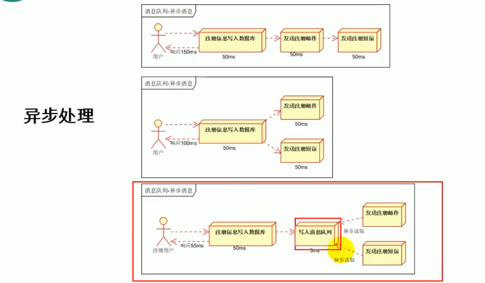


改部分同步为异步

使用MQ将同步操作，改为异步操作。如购买商品，用户需要关心的是数据库中商品的剩余量，只需将数据库存量与前台商品剩余量绑定为同步操作，用户能够购买，依赖于数据库中实时的同步信息。

购买成功需要同步修改数据库中信息，但后续的下单等操作，无需立即执行。只需要将消息写入消息队列，负责后续操作的服务消费队里中的信息即可。用户不必等待后续服务的回调执行结果。


### 1.1.1 MQ的优点


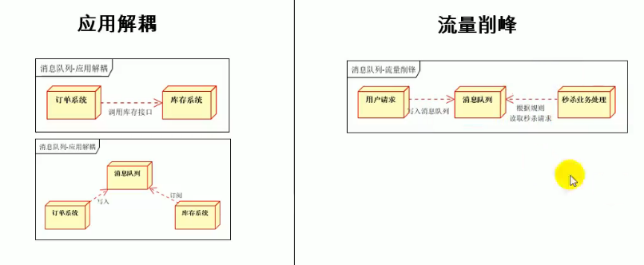


## 1.2 一些前置概念

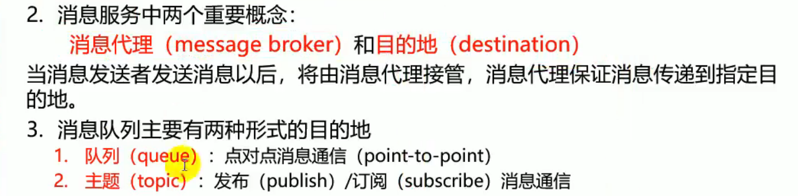


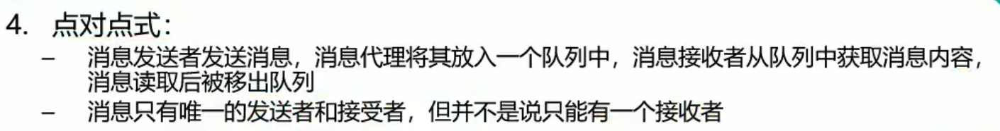


```
意味着。 某一个消息可以被多个消费者消费。但是，只要有一个消费者消费了这个消息，那么其他消费者将不能再拿到这个消息。
```


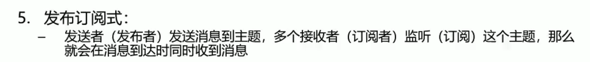


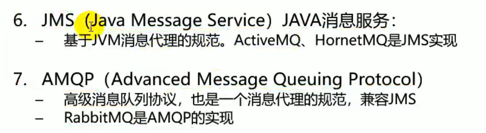


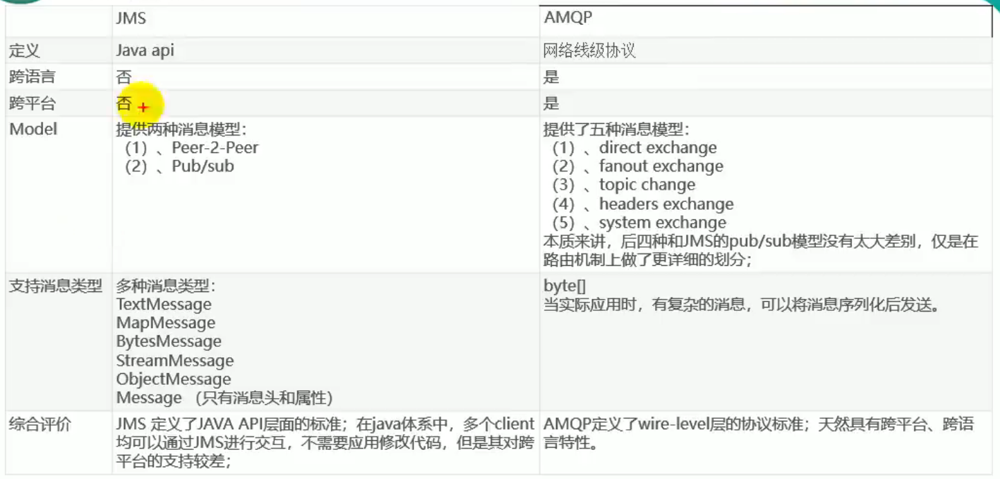


因为跨平台通信，所以AMQP 发送的消息类型，最终都要进行序列化，转化为Byte[] 形式


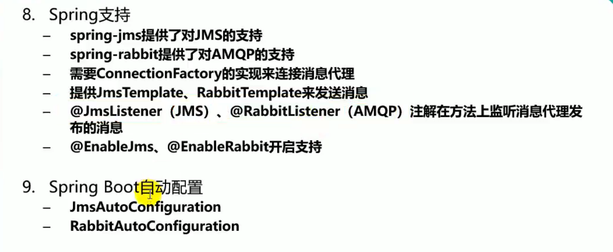


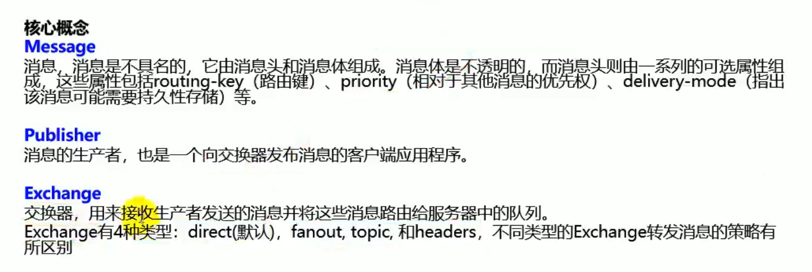


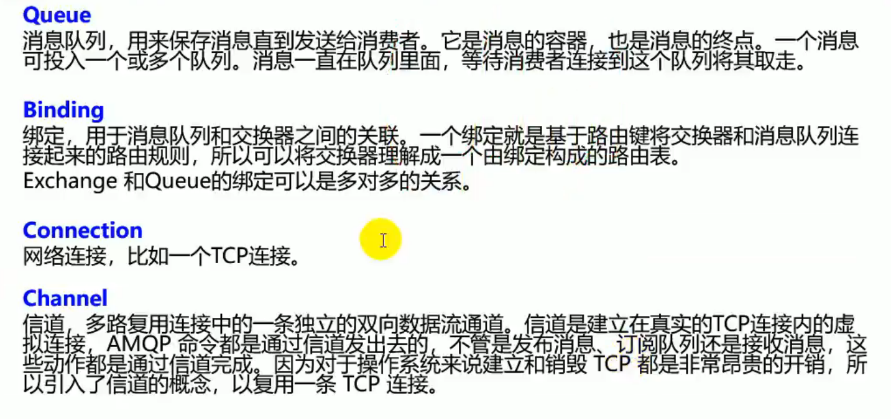


## 1.3 运行机制


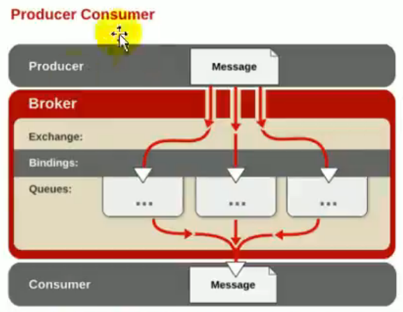


## 1.4 绑定模式


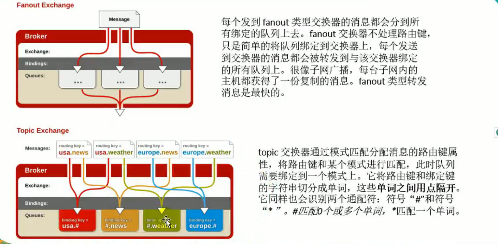


# 二 、安装RabbitMQ


使用docker  安装RabblitMQ。并开放 5672  15672 端口

```
docker pull rabbitmq:3.9.7-management
```

如果未学习docker请先学习Docker。

启用 contaniner

```
docker run -d -p 5672:5672 -p 15672:15672 rabbitmq
```

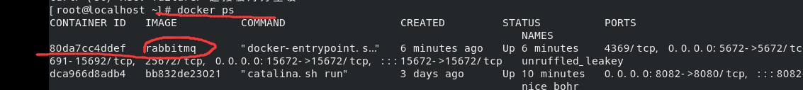


其中15672 是rabbitMQ的管理界面端口。

启动成功后，就可以访问虚拟机下的15672端口。


## 2.1 无法访问 15672


这里我遇到了坑，无法访问到15672。

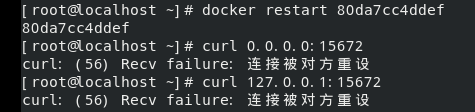

我打开了虚拟机的8082端口的tomcat服务。确定可以访问到后。开始排查问题。

查到是我这个版本的rabbitMQ没有默认开启 rabbitmq_management

进入容器：

```
docker exec -it <containerId> /bin/bash
```

```
rabbitmq-plugins enable rabbitmq_management //启用管理
```

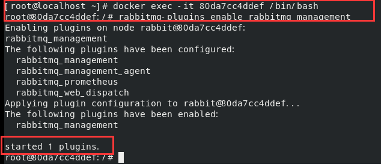


现在访问 192.168.216.129:15672   成功！

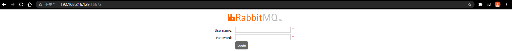


帐号密码都是  guest

另外在排查是否是rabbitmq启动出了问题的时候，查看了rabbitmq的日志。

```
docker logs <containerId>
```

无意间看到了有关guest 的相关启动信息：

```
docker logs 80da7cc4ddef | grep guest
```

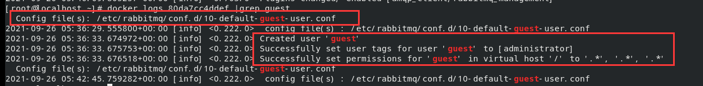


## 2.2 使用 Management 测试 exchange的各种方式

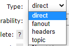

direct

fanout

headers

topic

添加交换器

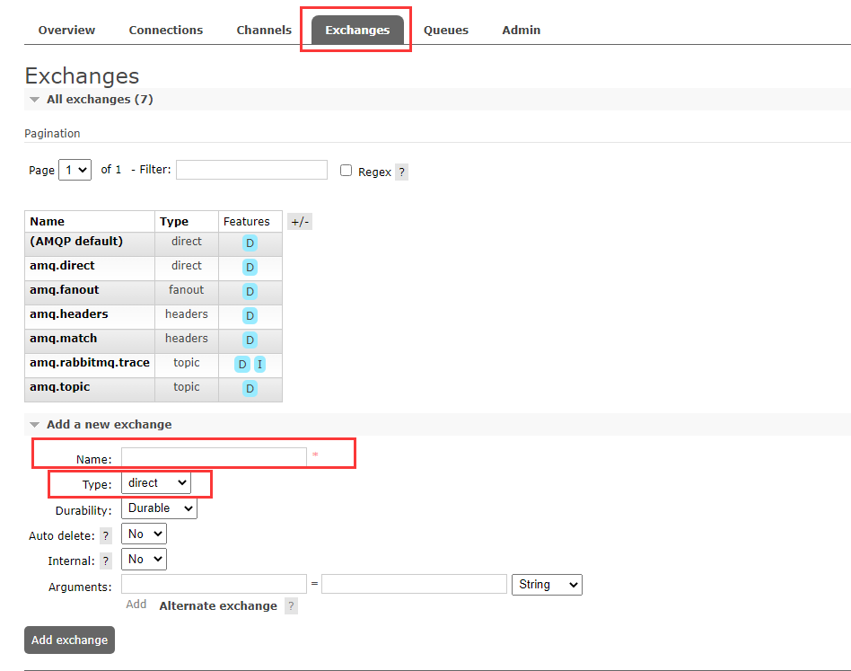


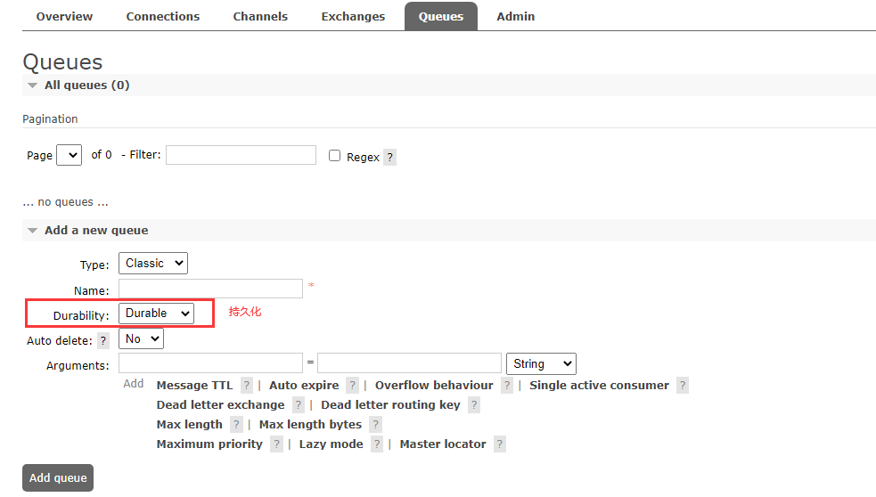


好家伙，又踩坑了！

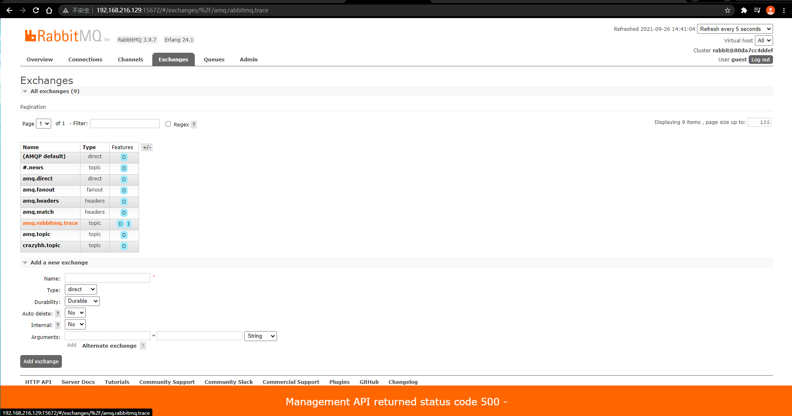

检查rabbitMQ的镜像，是否为management版本。否则无法使用。


获得消息

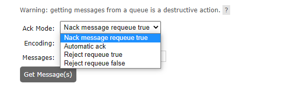


# 三、spring for RabbitMQ


## 3.1 RabbitMQAutoConfiguration 自动配置类


### 3.1.1 配置了 ConnectionFactory 

连接工厂。和RabbitMQ建立连接用

都是从  RabbitProperties 类中获取的配置信息


### 3.1.2 rabbitTemplate

模板类封装了操作rabbitMQ的各种方法

#### 3.1.2.1 常用API

| snytax and types | method                                | expression                           |
| ---------------- | ------------------------------------- | ------------------------------------ |
|                  | send()                                |                                      |
|                  | convertAndSend()                      | 转化并发送                           |
| Message          | receive(String queueName)             | 接收                                 |
| Object           | receiveAndConvert("String queueName") | 接受并转化<br />取不到消息则返回null |
|                  |                                       |                                      |


自动序列化 并 发送

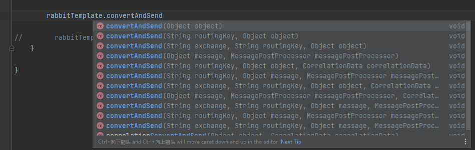


提供 交换器，路由键 （routeKey）和 任意对象。其中obj会被当做消息体。（无需自定义复杂的消息头）

converAndSend(String exchange,String routeKey,Object obj);


引入一个测试实例：

```java
@SpringBootTest
class Study01ApplicationTests {

    @Autowired
    RabbitTemplate rabbitTemplate;

    @Test
    void contextLoads() {

        HashMap<Object, Object> data = new HashMap<>();
        data.put("username","admin");
        data.put("password","123456");
        data.put("list", Arrays.asList("abc",true,123));
        rabbitTemplate.convertAndSend("myexchange.direct","key1",data);//发送
    }

}
```


在管理页面中可以看到。编码方式，字节多少，以及Routing key 和 exchange 。

在消息头中可以看到，是 x-java-serialized-object 的方式

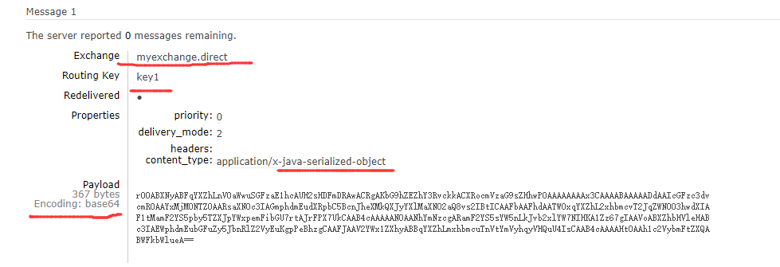

下面以rabbitTemplate.receiveAndConvert(String queueName)的形式接受消息

```java
@Test
void receive(){
    Object mytest = rabbitTemplate.receiveAndConvert("mytest");
    System.out.println(mytest.getClass());
    System.out.println(mytest);
}
```


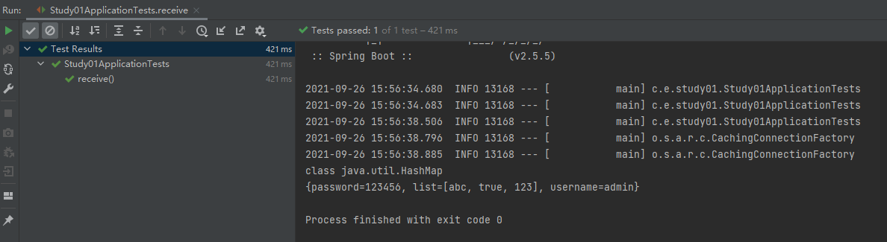


#### 3.1.2.2  为什么是这样编码


rabbitTemple 下的 MessageConverter 消息转换器是，SimpleMessageConverter


它是 spring框架下 AMQP包下 支持包下的转换器。

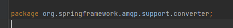

他的转换逻辑是：

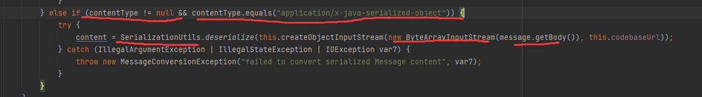

如果 这个消息的contentType不空，同时 是 x-java-serialized-object 协议。那么就使用序列化工具（SerializationUtils）

，创建一个字节数组流，取 消息体(message.getbody)放入其中。


那么接下来通过配置类，把更改编码器，让他转换成json串编码

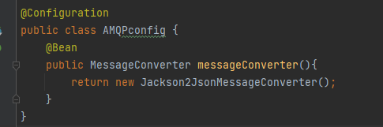


```java
@Configuration
public class AMQPconfig {
    @Bean
    public MessageConverter messageConverter(){
        return new Jackson2JsonMessageConverter();
    }
}
```

##### 3.1.2.2.1 为什么可以这样做？

在 RabbitAutoConfiguration中

看到189行，new 了一个 RabbitTemplate对象。是一个无参构造方法。

点进去看一眼。无参构造方法内 并未对RabbitTemplate 内的成员变量进行注入。

紧接着看到第190行、调用了 RabbitTemplateConfigurer类实例对象的  configure 方法。

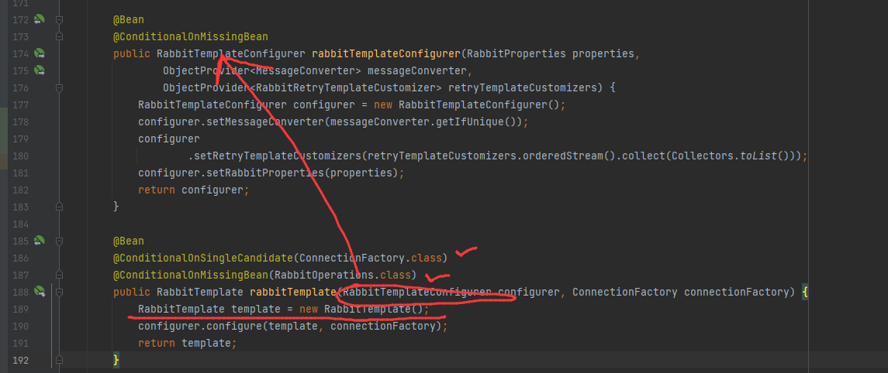


点进去看一眼configure方法，方法参数正是我们刚刚new的RabbitTemplate对象,以及 ConnectionFactory

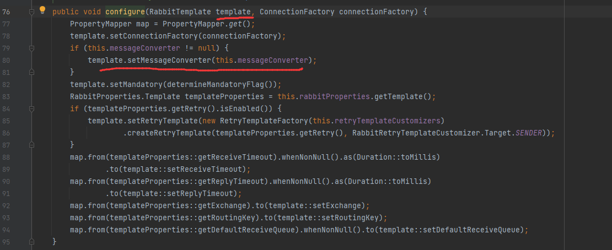


第79行，看到往RabbitTemplate 中注入的MessageConverter正是 RabbitTemplateConfigurer内的成员变量 messageConverter。

那么，只需要弄明白 RabbitTemplateConfigurer 成员变量 messageConverter是哪里来的就好了。


回到之前的 RabbitAutoConfiguration文件。可以看到172行正是 RabbitTemplateConfigurer的注入。

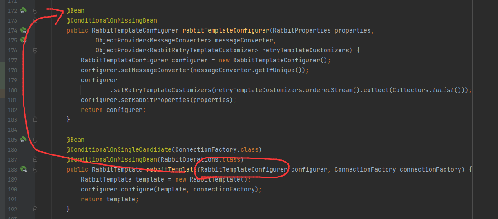


其中，第178行， 解释了 RabbitTemplateConfigurer中的成员变量 messageConverter是来自于 ObjectProvider<MessageConverter> messageConverter

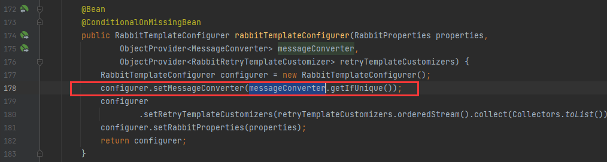


所以可以理顺MessageConverter的注入链了。


RabbitTemplate.messageConverter  <---来自于----  RabbitTemplateConfigurer.messageConverter    <---来自于---- ObjectProvider<MessageConverter> messageConverter <---来自于----  我们自己的配置类


那么。我们配置的 @Bean MessageConverter 是如何注入到 ObjectProvider<MessageConverter> 中的呢？

关键在于 ObjectProvider<T>接口的功能。

简单来说，这个接口就是以另一种方式从 IOC容器中取到   T.class 的实例，这个接口是在Spring4.3以后，被大量 使用在AutoConfiguration 中。

对于这个接口更详细的解释 https://www.cnblogs.com/fengxueyi/p/13888562.html


### 3.1.3 AmqpAdmin 

RabbitMQ系统管理功能组件

创建一个exchange,创建一个Queue等 高权限的管理功能

Amqp的api一眼可以望到头。

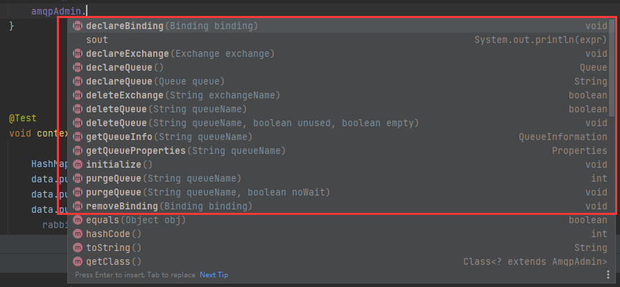


| snytax and type | metho                              | expression                         |
| --------------- | ---------------------------------- | ---------------------------------- |
|                 | declareExchange(Exchange exchange) | 定义一个交换器。Exchange是一个接口 |
|                 |                                    |                                    |
|                 |                                    |                                    |


ctrl+shift+r 全文搜索 Exchange (我的IDEA 键位是套用eclipse的)

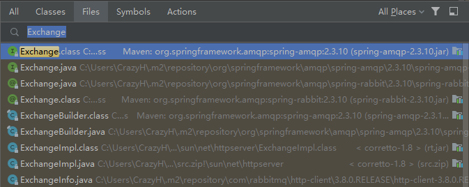

选中 F4 查看所有实现类。接下来就根据所有实现类的构造方法自己 new实例即可

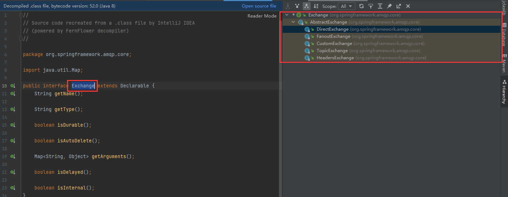


## 3.2 @RabbitListener

使用注解实现监听队列

同时需要 

给springboot 启动类加上 @EnableRabbit 注解  ，开启Rabbit注解支持


一个简单的实例

```java
@Service
public class GotBookService {
    
    @RabbitListener(queues = "book1")
    public void receiveBook(Book book){
        System.out.println(book);
    }
    //会优先获取Message。上面的Book 就获取不到了
    @RabbitListener(queues = "book1" )
    public void receiveMessage(Message message){
        byte[] body = message.getBody();
        MessageProperties messageProperties = message.getMessageProperties();
        System.out.println(body);
        System.out.println(messageProperties);
    }
}
```


