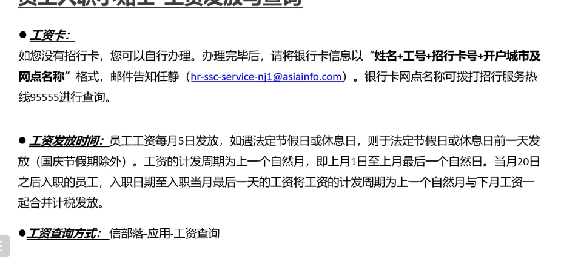
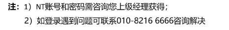
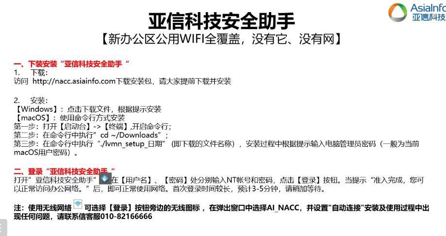
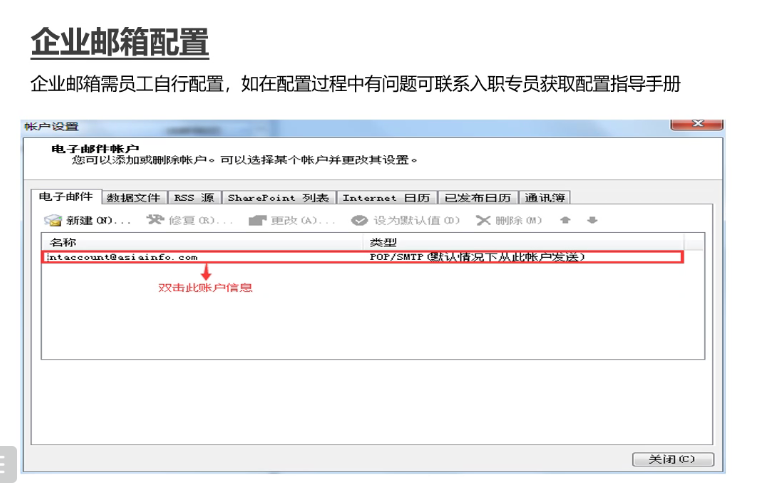
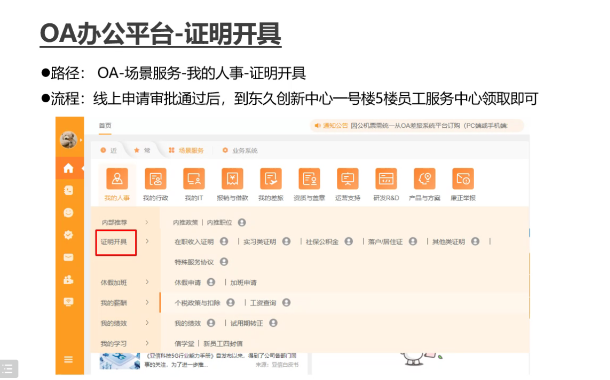
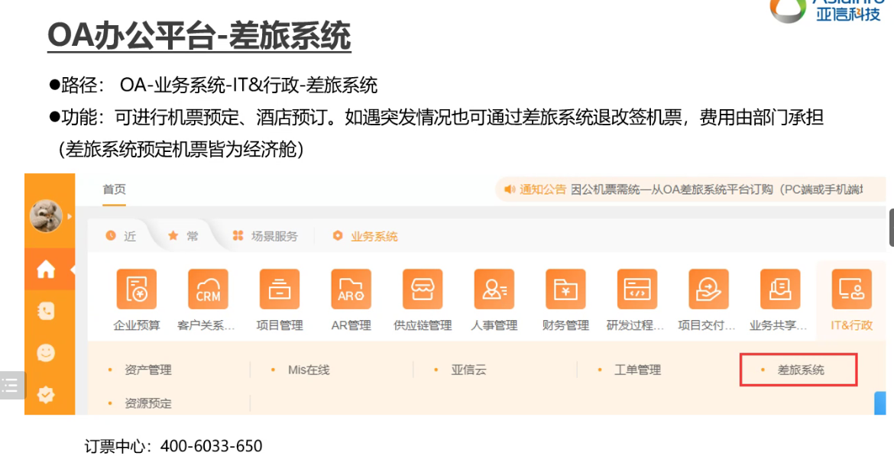
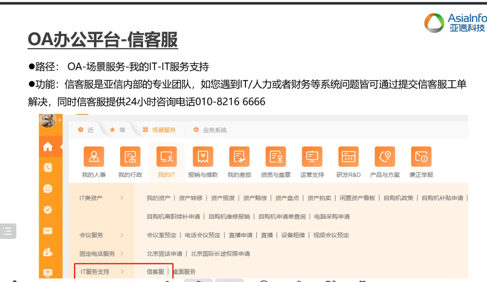

# 1. 源码分析


## 1.1 Config类

全类名 ： org.redisson.config 

```
专门用于配置RedissClient的配置类。 提供包括: 通信模式(NIO,Epoll), Redis地址 ,配置是否集群
```


### 1.1.1 方法

主要列出一些 Public的方法


setTransportMode()

```
设置通信模式, 例如NIO模式等

TransportMode.NIO        Windows
TransportMode.Epoll      Linux
TransportMode.KQueue     MacOS
```


#### 


## 发办公地址，到任静邮箱





薪资有问题，联系薪酬组。


周5以后 NT账号仍用不了，给新客服打电话







## 想要外网连接OA，使用VPN


提供一个服务群：实习生和正式员工区分。


## 需要配置企业邮箱




## 实习证明开具





## 差旅系统




## 信客服


