​	


# 1. MySQL 数据类型

MySQL中有三种主要的数据类型：

```
字符串

数字

日期和时间
```


| 数据类型                    | 描述                                                         | 对应Java数据类型        |
| --------------------------- | ------------------------------------------------------------ | ----------------------- |
| CHAR(size)                  | 一个固定长度的字符串（可以包含字母、数字和特殊字符）。<br /> *size* 参数指定以字符为单位的列长度 - 可以从 0 到 255。默认为 1 | String                  |
| bit                         | bit位                                                        | Boolean                 |
| bigint                      |                                                              | long                    |
| int                         |                                                              | Integer                 |
| float                       | 单精度浮点                                                   | Float                   |
| Double(x,y)                 | 双精度浮点 。 总长度x,小数点后占x中的y位                     | Double                  |
| Date                        | 日期                                                         | java.sql.Date           |
| datetime                    |                                                              | long/java.sql.Timestamp |
| timestamp                   | 时间戳                                                       | long/java.sql.Timestamp |
|                             |                                                              |                         |
| VARCHAR(size)               | 可变长度字符串（可以包含字母、数字和特殊字符）。 <br />*size* 参数指定字符的最大列长度 - 可以从 0 到 65535 | String                  |
| BINARY(size)                | 等于 CHAR()，但存储二进制字节字符串。<br /> *size* 参数以字节为单位指定列长度。默认为 1 |                         |
| VARBINARY(size)             | 等于 VARCHAR()，但存储二进制字节字符串。 *size* 参数指定最大列长度（以字节为单位）。 |                         |
| TINYBLOB                    | 对于 BLOB（二进制大对象）。最大长度：255 字节                | java.lang.byte[]        |
| TINYTEXT                    | 保存一个最大长度为 255 个字符的字符串                        | String                  |
| TEXT(size)                  | 保存一个最大长度为 65,535 字节的字符串                       | String                  |
| BLOB(size)                  | 对于 BLOB（二进制大对象）。最多可容纳 65,535 字节的数据      | java.lang.byte[]        |
| MEDIUMTEXT                  | 保存最大长度为 16,777,215 个字符的字符串                     | String                  |
| MEDIUMBLOB                  | 对于 BLOB（二进制大对象）。最多可容纳 16,777,215 字节的数据  | java.lang.byte[]        |
| LONGTEXT                    | 保存最大长度为 4,294,967,295 个字符的字符串                  | String                  |
| LONGBLOB                    | 对于 BLOB（二进制大对象）。最多可容纳 4,294,967,295 字节的数据 | byte[]                  |
| ENUM(val1, val2, val3, ...) | 只能有一个值的字符串对象，从可能值列表中选择。您最多可以在一个 ENUM 列表中列出 65535 个值。如果插入的值不在列表中，则将插入一个空白值。 这些值按您输入的顺序排序 |                         |
| SET(val1, val2, val3, ...)  | 可以有 0 个或多个值的字符串对象，从可能的值列表中选择。一个 SET 列表中最多可以列出 64 个值 |                         |


## 1.1 TEXT类型

Text类型一般有

`TINYTEXT` (255长度)

`TEXT` (65535)

`MEDIUMTEXT`(最大16M)

`LONGTEXT` (最大16G) 


Text类型被用于存储 `非二进制`字符。  二进制字符集应当使用 `blob`类型存储。


## 1.2 CAST 函数

`CAST` 函数用于MySQL 数据类型转换。


语法: 

```sql
CAST(expression AS TYPE);
```


`CAST()`函数将任何类型的值转换为具有指定类型的值。

目标类型可以是以下类型之一：`BINARY`，`CHAR`，`DATE`，`DATETIME`，`TIME`，`DECIMAL`，`SIGNED`，`UNSIGNED`。


示例

```sql
```


## 1.3  Mysql数据类型对应Java

https://dev.mysql.com/doc/connector-j/8.0/en/connector-j-reference-type-conversions.html


MySQL Connector/J 对于 MySql 数据类型和 Java 数据类型之间的转换是很灵活的。
一般来讲，任何 MySql 数据类型都可以被转换为一个 java.lang.String，任何 MySql 数字类型都可以被转换为任何一种 Java 数字类型(当然这样也可能出一些四舍五入，溢出，精度丢失之类的问题)。


| MySql 数据类型                                               | 可以被转换成的 Java 类型                                     |
| :----------------------------------------------------------- | :----------------------------------------------------------- |
| CHAR, VARCHAR, BLOB, TEXT, ENUM, and SET                     | java.lang.String, java.io.InputStream, java.io.Reader, java.sql.Blob, java.sql.Clob |
| FLOAT, REAL, DOUBLE PRECISION, NUMERIC, DECIMAL, TINYINT, SMALLINT, MEDIUMINT, INTEGER, BIGINT | java.lang.String, java.lang.Short, java.lang.Integer, java.lang.Long, java.lang.Double, java.math.BigDecimal |
| DATE, TIME, DATETIME, TIMESTAMP                              | java.lang.String, java.sql.Date, java.sql.Timestamp          |


ResultSet.getObject() 方法遵循 JDBC 规范对 MySql 和 Java 的类型进行转换。

| MySql 类型名                   | GetColumnClassName 返回值 | 返回的 Java 类                                               |
| :----------------------------- | :------------------------ | :----------------------------------------------------------- |
| BIT(1)(MySQL-5.0 新引入)       | BIT                       | java.lang.Boolean                                            |
| BIT(大于 1) (MySQL-5.0 新引入) | BIT                       | byte[]                                                       |
| TINYINT                        | TINYINT                   | 如果 tinyInt1isBit 配置设置为 true(默认为 true)，是 java.lang.Boolean，存储空间 为 1；否则是为 java.lang.Integer |
| BOOL, BOOLEAN                  | TINYINT                   | 参见 TINYINT。这些是 TINYINT(1) 另一种写法而已               |
| SMALLINT[(M)] [UNSIGNED]       | SMALLINT [UNSIGNED]       | java.lang.Integer(不管是否无符)                              |
| MEDIUMINT[(M)] [UNSIGNED]      | MEDIUMINT [UNSIGNED]      | java.lang.Integer；无符的话是 java.lang.Long(C/J 3.1 或更早)，或者 java.lang.Integer(C/J 5.0 或更晚) |
| INT,INTEGER[(M)] [UNSIGNED]    | INTEGER [UNSIGNED]        | java.lang.Integer；无符的话是 java.lang.Long                 |
| BIGINT[(M)] [UNSIGNED]         | BIGINT [UNSIGNED]         | java.lang.Long；无符的话是 java.math.BigInteger              |
| FLOAT[(M,D)]                   | FLOAT                     | java.lang.Float                                              |
| DOUBLE[(M,B)]                  | DOUBLE                    | java.lang.Double                                             |
| DECIMAL[(M[,D])]               | DECIMAL                   | java.math.BigDecimal                                         |
| DATE                           | DATE                      | java.sql.Date                                                |
| DATETIME                       | DATETIME                  | java.sql.Timestamp                                           |
| TIMESTAMP[(M)]                 | TIMESTAMP                 | java.sql.Timestamp                                           |
| TIME                           | TIME                      | java.sql.Time                                                |
| YEAR[(2\|4)]                   | YEAR                      | 如果 yearIsDateType  配置设置为 false，返回的对象类型为 java.sql.Short；如果设置为 true(默认为 true)，返回的对象类型是 java.sql.Date，其具体时间是为一月一日零时零分 |
| CHAR(M)                        | CHAR                      | java.lang.String(除非该列字符集设置为 BINARY，那样返回 byte[]) |
| VARCHAR(M) [BINARY]            | VARCHAR                   | java.lang.String(除非该列字符集设置为 BINARY，那样返回 byte[]) |
| BINARY(M)                      | BINARY                    | byte[]                                                       |
| VARBINARY(M)                   | VARBINARY                 | byte[]                                                       |
| TINYBLOB                       | TINYBLOB                  | byte[]                                                       |
| TINYTEXT                       | VARCHAR                   | java.lang.String                                             |
| BLOB                           | BLOB                      | byte[]                                                       |
| TEXT                           | VARCHAR                   | java.lang.String                                             |
| MEDIUMBLOB                     | MEDIUMBLOB                | byte[]                                                       |
| MEDIUMTEXT                     | VARCHAR                   | java.lang.String                                             |
| LONGBLOB                       | LONGBLOB                  | byte[]                                                       |
| LONGTEXT                       | VARCHAR                   | java.lang.String                                             |
| ENUM('value1','value2',...)    | CHAR                      | java.lang.String                                             |
| ET('value1','value2',...)      | CHAR                      | java.lang.String                                             |


# 2. Insert 


## 2.1 多行插入

```
insert into <tableName> (<cloumn1>[,<cloumn2>...]) values(<value1>[,<value2>...])
[,(<value1>[,<value2>...])...]
```


例如：

```mysql
insert into A (name,age) values('SemgHH',18),
('HelloWorld',20),
('AAA',25),
('BBB',28)
```


多行插入 比 多个单行插入效率高，效率高很多。

如果插入的条件是提前计算好的，尽量使用多行一次性插入。

如果插入条件只能一条一条计算，可以尝试使用拼接SQL的方式，改为多行1次插入。


## 2.2 插入结果集

insert 可以直接插入 select 查询出的结果集

```
insert into <tableName> (<cloumn1>[,<cloumn2]...)
select <cloumn1>[,<cloumn2]...
from <tableName2>
[where  <condition>]
```


例如：

```mysql
insert into td_m_bus_oppo_power (staff,two,three,five,state,empower_time) 
select A.staff,
            CASE A.two 
            WHEN '是' THEN B.org_level_two
            ELSE null
            END two,

            CASE A.three 
            WHEN '是' THEN B.org_level_three
            ELSE null
            END three,

            CASE A.five 
            WHEN '是' THEN B.org_level_five
            ELSE null
            END five,
            1 state,
            now()
from td_m_bus_oppo_power_temp A LEFT JOIN td_m_profit_org_staff B ON trim(A.staff)=trim(B.staff_no)
```


# 3. Alter关键字


## 3.1. 修改列


### 增加列

```sql
alter table website add <列名> varchar(50) after name;
```


###  删除列

```sql
ALTER TABLE <tableName> DROP COLUMN <cloumnName>
```


### 修改 列名

```sql
ALTER TABLE website CHANGE <旧列名> <新列名> VARCHAR(50)  //后面带上值的属性类型。

ALTER TABLE <表名> ADD unique(<列名>) // 给列加唯一约束
 	
alter table category add constraint pk_category_id primary key (id); 
```


解释：

```
alter table category  表示修改表 category

add constraint         增加约束

pk_category_id         约束名称 pk 是primary key的缩写，category是表名 . 
					   约束名称是开发者定义的,尽量使用好的命名，使得一眼就能够看出来这个约束是什么意思。 能够降低维护成本。

primary key            约束类型是主键约束

(id)                   表示约束加在id字段上
```


### 修改列属性

```sql
ALTER TABLE website MODIFY alexa BIGINT UNIQUE NOT NULL   //必须加上 数据类型    列名

ALTER TABLE	`student` modify `isProcess` default '否'
```


## 3.1 重置自增 id

```mysql
ALTER TABLE <表名> modify <字段名> auto_increment = 1   //自增长重置为1  前提是表为空
```


## 3.3  修改 约束

```sql
ALTER TABLE <表名> ADD CONSTRAINT <约束名> CHECK(<表达式>);
ALTER TABLE <数据表名> ADD CONSTRAINT <唯一约束名> UNIQUE(<列名>);
ALTER TABLE <tableName> ADD constraint <外键约束名> foreign key(columnName) references <tableName>(ColumnName)
on delete cascade #(级联删除)
on update cascade #(级联更新)
on delete no action #(当删除表造成不一致时，拒绝删除 /  删除仍然一致时，可以通过)
```


Mysql

```sql
ALTER TABLE region ADD INDEX `idk_longitude_latitude`(longitude,latitude) 
#添加联合索引	

alter table region add unqiue `uni_longitude`(longitude)
#添加唯一索引


# create index ... on ... 和alter table ... add ... 是等价的

create index `idk_latitude` on region(latitude)
```


### 3.3.1  删除约束

```mysql
ALTER TABLE <表名> drop CONSTRAINT <约束名>
```


Mysql：

```sql
语法 :  alter table <tableName> drop index <indexName>

ALTER TABLE book DROP INDEX `idx_price`    #删除index


drop index `idx_price` on book   # 删除book的名为 idx_price 的索引
```


9.视图

```mysql
create view view_1(学号)
as
select sno
from student
where sno like "201940712%"
# 创建视图  
# create view <视图名>[(<字段名>,<字段名2>...)]
# as
# <子查询>


select * from view_1
# 查看视图


# 不存放视图内的数据，只存放视图的定义。当使用视图时，根据视图的定义从基本表中拉取数据 （视图消解）


drop view view_1
# 删除视图
```

10.【sql server】 登录名 角色

```sql
#登录名扮演角色，角色拥有实际权限。
#角色是权限的集合
#所以可以多个登录名扮演同一个角色

create LOGIN login_1 with password = '123456'
#定义 登录名 及 密码
drop Login login_1
# 删除登录名

create user qingkong for LOGIN login_1
# 给某个login创建角色

```


11. 为角色授权 grant  回收权限revoke

```mysql
grant update(grade),delete,insert
on sc
to qingkong
with grant option
# 把sc表的 grade 字段的修改权 授权给 qingkong 角色

revoke delete,insert
on sc
from qingkong
#回收权限
```

12.sql server 存储过程

```sql
create procedure usp_fun1(@sno char(20)=null,@cno char(20)=null,@grade int output)
as
select @grade=grade
from sc
where sno=@sno and cno=@cno
# 定义存储过程

declare @grade1
exec usp_fun1 '200515001','1',@grade1 output
print @grade1

#使用存储过程


```

mysql 存储过程

```mysql
create procedure usp()
begin
	...
	<子查询>；#必须分号
	...
end
```


13. Sql Server触发器

```sql
create trigger myTrigger
on student
for insert,update,delete
as
	select * from deleted
	select * from inserted
# 定义触发器

# create trigger <触发器名>
# on  <表名>
# for <DML操作名称>[,<操作名称>...]
# as
# ...
```


mysql 触发器

```mysql
CREATE
    [DEFINER = { user | CURRENT_USER }]   #指定用户
TRIGGER trigger_name                    #触发器名
trigger_time                    # 触发器触发时间   before after
trigger_event                   # 触发事件     update/delete/insert
ON tbl_name FOR EACH ROW
　　[trigger_order]
trigger_body

trigger_time: { BEFORE | AFTER }

trigger_event: { INSERT | UPDATE | DELETE }

trigger_order: { FOLLOWS | PRECEDES } other_trigger_name
```

给出一个例子：

```mysql
CREATE TRIGGER add_users_total
AFTER
INSERT
on users FOR EACH ROW 

update website set users_total=users_total+1
```


3、NEW与OLD详解

MySQL 中定义了 NEW 和 OLD，用来表示触发器的所在表中，触发了触发器的那一行数据，来引用触发器中发生变化的记录内容，具体地：

　　①在INSERT型触发器中，NEW用来表示将要（BEFORE）或已经（AFTER）插入的新数据；

　　②在UPDATE型触发器中，OLD用来表示将要或已经被修改的原数据，NEW用来表示将要或已经修改为的新数据；

　　③在DELETE型触发器中，OLD用来表示将要或已经被删除的原数据；

使用方法：

　　NEW.columnName （columnName为相应数据表某一列名）

另外，OLD是只读的，而NEW则可以在触发器中使用 SET 赋值，这样不会再次触发触发器，造成循环调用（如每插入一个学生前，都在其学号前加“2013”）。


# 4. 索引


## 4.1 使用索引

mysql :


### 4.1.1 创建

```mysql
create unique index index_sno on student(sno)

create unique index index_sc on sc(sno,cno)
#给student表的sno字段创建唯一索引
# create [unique]|[] index <索引名> on <表名>(<属性名>[,<属性名>])


```


### 4.1.2 删除

````
drop index index_sno on student
#删除索引
#  drop index <索引名> on <表名>

================================


````


### 4.1.3 添加索引

```
修改表结构(添加索引)

ALTER table tableName ADD INDEX indexName(columnName)
```


## 4.2  强制使用索引


今天在执行MySQL的语句时，表内数据量很小，但执行非常慢。查看了执行计划以后，发现使用的索引并不是我们想要的。

看来时查询优化器分析的结果不是我们想要的，所以使用 `force` 关键字强制使用想要的索引。


### 4.2.1 语法


```mysql
force index(<indexName1> [,<idxName2>...])

# <indexName> 索引的名称。 强制这个索引

# 可以强制同时使用多条索引
```


```mysql
select *
from <table>
force index(<indexName>)
where <condition>
```


### 4.2.2 示例

```mysql
select * 
from table 
force index(PRI) limit 2;
#强制使用主键

select * 
from table 
force index(ziduan1_index) limit 2;
# 强制使用索引"ziduan1_index"

select * 
from table 
force index(PRI,ziduan1_index) limit 2;
# 强制使用索引"PRI和ziduan1_index"
```


## 4.3 忽略某条索引

和强制索引相反，有时我们希望忽略某些索引。MySQL也是支持的，使用`ignore` 关键字


语法和 强制索引完全一致，将关键字换成`ignore`即可


### 4.3.1 语法


```mysql
ignore index(<indexName1> [,<idxName2>...])

# <indexName> 索引的名称。 强制这个索引

# 可以强制同时使用多条索引
```


```mysql
select *
from <table>
ignore index(<indexName>)
where <condition>
```


### 4.3.2 示例

```mysql
select * 
from table 
ignore index(PRI) limit 2;
# 忽略主键

select * 
from table 
ignore index(ziduan1_index) limit 2;
# 忽略使用索引"ziduan1_index"

select * 
from table 
ignore index(PRI,ziduan1_index) limit 2;
# 忽略使用索引"PRI和ziduan1_index"
```


# 5. JOIN 关键字


JOIN 关键字的 SQL标准如下图：

```
很遗憾,MySQL8.X 目前不支持 full join 关键字,但可以曲线救国
```


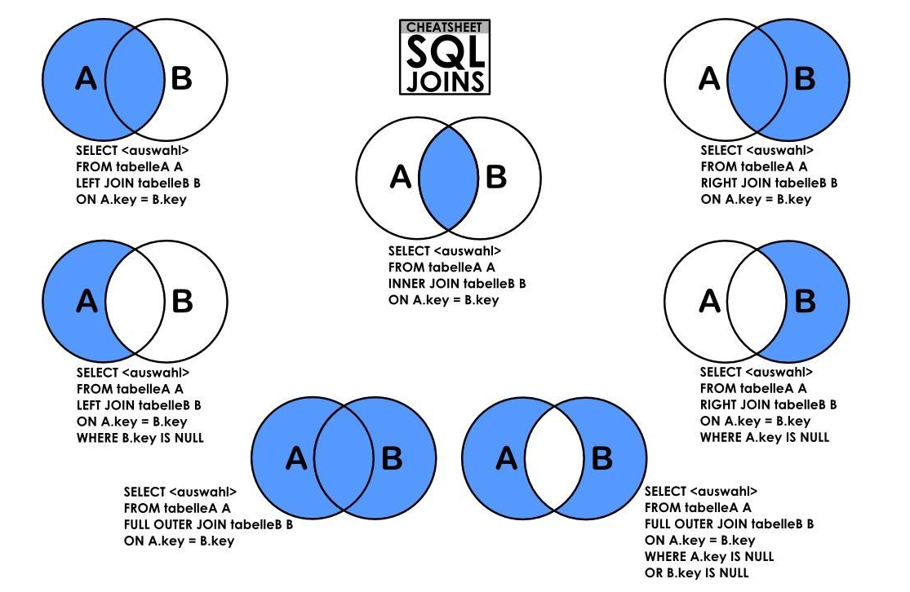

```
LEFT  JOIN   (以左侧的记录为准，右侧可以为null)
RIGHT JOIN   (以右侧的记录为准)
```


```
在进行表连接查询的时候一般都会使用JOIN xxx ON xxx的语法.
ON语句的执行是在JOIN语句之前的,也就是说两张表数据行之间进行匹配的时候，会先判断数据行是否符合ON语句后面的条件,再决定是否JOIN。
```


## 5.2  INNER JOIN


如何理解INNER JOIN 操作？


提出一个如下的场景：

```
对于JOIN 操作常用的是 LEFT JOIN/RIGHT JOIN 操作。

一般使用LEFT JOIN 操作的场景是： LEFT 表存储一个唯一ID, 右侧表通过唯一ID关联出更多的信息。


那么如果右侧的表信息不全呢,右侧的表由于数据量巨大,被拆分了2张表(右1，右2)。这意味着虽然唯一ID对应的信息是存在的，但在另一张表上.
如果此时使用LEFT JOIN 以后就会出现 null 列的情况。

此时可以使用 INNER JOIN ,必须两个表都有 唯一ID的记录,就不会出现 null列


分别 INNER JOIN 右1右2两张表。最终结果 UNION一下
```


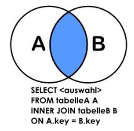


### 5.2.1 建表测试


建表

```mysql
CREATE TABLE orders(
order_id INT PRIMARY KEY,
customer_id INT,
employee_id INT,
order_date date,
shipperId INT)

CREATE TABLE customers(
customer_id INT ,
customer_name VARCHAR(50),
contact_name VARCHAR(50),
address VARCHAR(200),
city VARCHAR(100),
postal_code int,
country VARCHAR(50))

#insert
INSERT INTO orders values
(10308,2,7,'1996-09-18',3),
(10309,37,3,'1996-09-19',1),
(10310,77,8,'1996-09-20',2)


INSERT INTO customers VALUES
(1,'Alfreds Futterkiste','Maria Anders','Obere Str. 57','Berlin',12209,'Germany'),
(2,'Ana Trujillo Emparedados y helados','Ana Trujillo','Avda. de la Constitucion','Mexico D.F.',05021,'Mexico'),
(3,'Antonio Moreno Taqueria','Antonio Moreno','Mataderos 2312','Mexico D.F.',05023,'Mexico')
```


测试语句：

```mysql
SELECT *
FROM orders A INNER JOIN customers B ON A.customer_id = B.customer_id
```

​	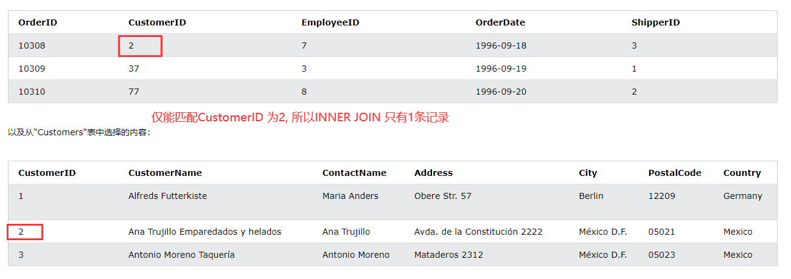


## 5.3 Left Join Where B.key is null


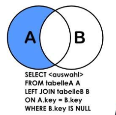


提出一种使用这种Join方式的场景：


需要向`TF_M_STAFFPASSWD` 表中插入 `TD_M_STAFF` 表中的一些数据。但必须满足插入数据的`STAFF_ID`字段不在`TF_M_STAFFPASSWD`表中。

```mysql
INSERT INTO TF_M_STAFFPASSWD(STAFF_ID, STAFF_PASSWD, UPDATE_TIME, UPDATE_STAFF_ID, UPDATE_DEPART_ID, PROVINCE_CODE)

SELECT STAFF_ID, 'fEqNCco3Yq9h5ZUglD3CZJT4lBs=', now(), 'admin', '30372', '97'
FROM TD_M_STAFF A
WHERE NOT EXISTS (SELECT 1 
                  FROM TF_M_STAFFPASSWD B 
                  WHERE B.STAFF_ID = A.STAFF_ID);
```


由于子查询，被驱动表查询的次数等于驱动表的记录数。所以，通常可以改子查询为关联查询。

此时可以使用 `Left Join Where B.key is null` 改写语句


```mysql
INSERT INTO TF_M_STAFFPASSWD(STAFF_ID, STAFF_PASSWD, UPDATE_TIME, UPDATE_STAFF_ID, UPDATE_DEPART_ID, PROVINCE_CODE)

SELECT STAFF_ID, 'fEqNCco3Yq9h5ZUglD3CZJT4lBs=', now(), 'admin', '30372', '97'
FROM TD_M_STAFF A LEFT JOIN TF_M_STAFFPASSWD B ON B.STAFF_ID = A.STAFF_ID
WHERE B.STAFF_ID is null
```


### 5.3.1 总结

```mysql
not in / exists / not exists 可以改写为  left join where B.key is null
```


# 5. 导入导出.sql


## 5.1 导出 .sql

```dockerfile
mysqldump -uroot -p<password> <数据库名> > <绝对地址>\<数据库名>.sql
```


## 5.2 导入 .sql

导入sql ，当sql文件中没有创建数据库语句时.

在`.sql` 文件中添加相关命令： 

`create database <databaseName>`

`use <databaseName>`

```sh
mysql -uroot -p <password> 
#进入数据库

source  <sql文件的地址>
#引入对应.sql文件
```


​	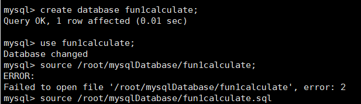


# 6. MySQL函数

MySQL 提供了很多使用且强大的函数，可以让数据在数据库层面上进行一些处理。


参考文档 https://www.w3schools.cn/mysql/mysql_ref_functions.asp

## 6.1 内置函数

一些常用内置函数的简单分类和整理。


### 6.1.1 加密相关

MD5(<字符串>)


### 6.1.2 数字相关

```sql
-- 数字相关
ABS（）

CEILING() 	向上取整

floor()    	向下取整

RAND() 		返回0-1随机数

SIGN() 		返回参数的符号

UPPER()  	转大写
LOWER()  	转小写

-- 时间 和日期
current_date() 	获取当前日期
now()

year(now())		获取年
month()			月
day()			日
hour()			小时
minute()		分钟
second()		秒
```


### 6.1.3  GROUP_CONCAT()

通常在MySQL中使用 Group by 进行分组的时候。必须包含全部字段，或者使用 聚合函数处理其余字段。

其中常用的处理函数是  GROUP_CONCAT() ，用于将组内的字段合并成一个字段。中间以`,`分割


下面是一个示例:

（还没有group by以前）

```sql
        select pss.`attr_id`,pss.`attr_name`,pss.`attr_value`  /*,GROUP_CONCAT(DISTINCT 				
     														pss.`attr_value`)'attr_values'*/
        from `pms_sku_sale_attr_value` AS pss LEFT JOIN pms_sku_info AS psi ON psi.sku_id=pss.sku_id
		WHERE psi.spu_id=13
		/*GROUP BY pss.`attr_id`,pss.`attr_name`*/
```


```
attr_id 对应的 attr_name是固定的。但，attr_value有多种值。 
有时我们想要按照 attr_id,attr_name 分组，查看每组attr_id中有多少个 attr_value
```


可以使用 GROUP_CONCAT 函数将所有的attr_value 连接起来：

```sql
select pss.`attr_id`,pss.`attr_name`,GROUP_CONCAT(pss.`attr_value`)'attr_values'
from `pms_sku_sale_attr_value` AS pss LEFT JOIN pms_sku_info AS psi ON psi.sku_id=pss.sku_id
WHERE psi.spu_id=13
GROUP BY pss.`attr_id`,pss.`attr_name`
```

此时的查询结果。


所以需要查询结果去重： distinct


```sql
select pss.`attr_id`,pss.`attr_name`,GROUP_CONCAT(DISTINCT pss.`attr_value`)'attr_values'
from `pms_sku_sale_attr_value` AS pss LEFT JOIN pms_sku_info AS psi ON psi.sku_id=pss.sku_id
WHERE psi.spu_id=13
GROUP BY pss.`attr_id`,pss.`attr_name`
```


得到结果。


### 6.1.4 去除空格


```
LTRIM 去除左空格
RTRIM 去除右空格
```


### 6.1.5 时间相关函数

参考  https://www.w3school.com.cn/sql/sql_dates.asp

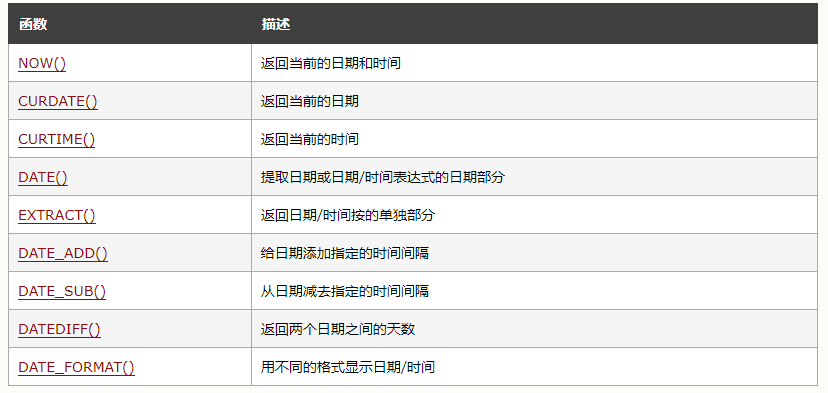


#### 6.1.5.1 返回时间

```mysql
now()

CURDATE()

CURTIME()
```


#### 6.1.5.2  格式化时间

```
DATE_FORMAT()
```


语法：

```
DATE_FORMAT(date,format)

date:   一个date类型的时间
format:  一个包含特定格式的字符串
```


format的格式：

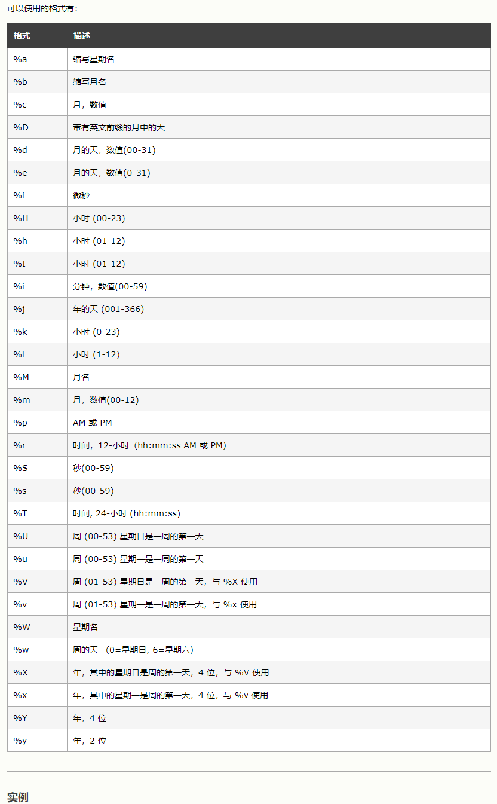


### 6.1.6 正则函数

```mysql
select regexp_replace(<sourceStr>, <pattern>, <replaceStr>);

#<sourceStr>  替换字符串
#<pattern>正则规则
#<replaceStr>替换为的字符
```


示例

```mysql
select regexp_replace('1abc2', '[0-9]', '#');
```

结果：	

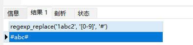


## 6.2 自定义函数


语法：

```mysql
CREATE FUNCTION <函数名> ( [ <参数1> <类型1> [ , <参数2> <类型2>] ] … )
RETURNS <类型>
<函数主体>
```


# 7.事务


## 7.1 基础概念

### 7.1.1 ACID

ACID原则 ：`原子性`、`一致性`、`隔离性`、`持久性`


`原子性` : 一个事务中的多个操作，共同成功，共同失败。要么全成功，要么全失败。

`一致性`：  指事务的执行，必须保证数据库从一致性状态转变到另一个一致性状态。

​					即，事务执行要么成功，转到新的一致性状态，要么执行失败，回滚到之前的一致性状态。不允许出现执行成功却出现不一致的状态导致

​					无法进行下一次事务。

`隔离性` ： 事务之间的操作互不影响。

`持久性` ： 事务一旦提交，数据的改变就是永久的，持久化到磁盘中。


### 7.1.2 脏读 ，不可重复度，幻读


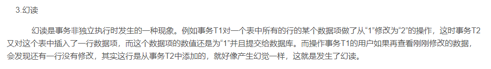


### 7.1.3 4种隔离级别

读未提交 ： 允许读到其他事务未提交的事务。

读已提交 ： 可以读到其他事务已提交的事务。

可重复读 ： 在一次事务中，多次查询的结果保证一致，无论此时数据库状态是否发生变化。

串行化 ： 不存在任何并发问题。


## 7.2 Mysql中的事务


### 7.1.1  开启事务 start transaction


提交事务 commit;

手动回滚事务 rollback;


### 7.1.2  JDBC 中的事务

#### 7.1.2.1 正常提交

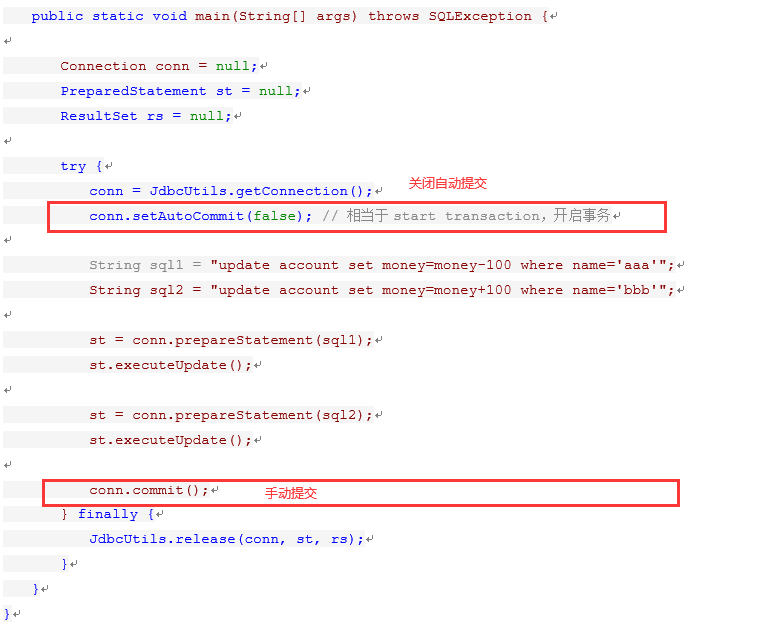


#### 7.1.2.2 手动回滚 rollback

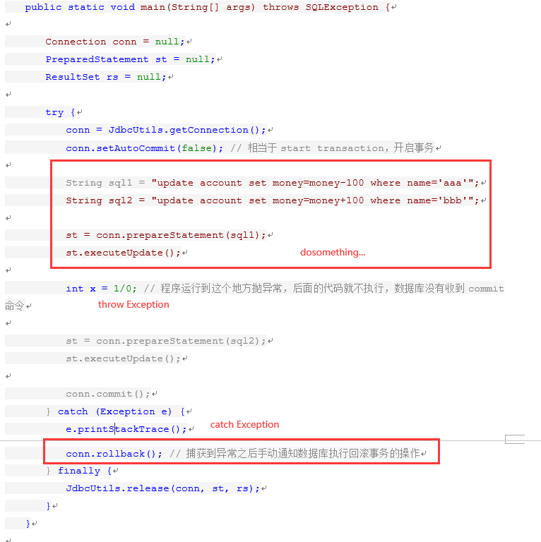


#### 7.1.2.3  设置隔离级别


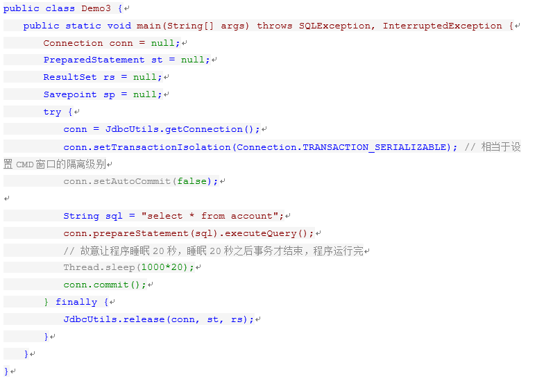


## 7.3 MySQL 事务相关查询


MySQL支持查询一些事务SQL


```mysql
#查看进行中的事物
SELECT * FROM information_schema.innodb_trx ;


#查看持有锁的事务
SELECT * FROM INFORMATION_SCHEMA.INNODB_LOCKS;

#查看等待锁的事务
SELECT * FROM INFORMATION_SCHEMA.INNODB_LOCK_WAITS;

#首先查询是否锁表
SHOW OPEN TABLES WHERE In_use > 0;

#查询进程
SHOW PROCESSLIST;

# 查看当前运行的事务的账户和事务开始的时间,及其事务语句
SELECT a.id,a.user,a.host,b.trx_started,b.trx_query 
FROM information_schema.processlist a right outer join information_schema.innodb_trx b
									  ON a.id = b.trx_mysql_thread_id;
```


### 查看进行中事务


```mysql
#查看进行中的事物
SELECT * FROM information_schema.innodb_trx ;
```


### 查看进程

```mysql
#查询进程
SHOW PROCESSLIST;
```


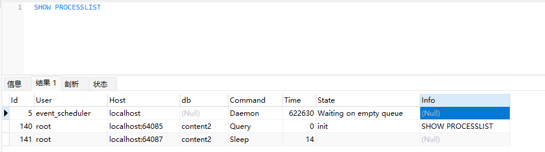


# 8.mysql中float类型精度解析

一、MySQL允许使用非标准语法：

1、FLOAT(M,D)或REAL(M,D)或DOUBLE PRECISION(M,D)。这里，“(M,D)”表示该值一共显示M位整数，其中D位位于小数点后面。例如，定义为FLOAT(7,4)的一个列可以 显示为-999.9999。MySQL保存值时进行四舍五入，因此如果在FLOAT(7,4)列内插入999.00009，近似结果是999.0001。
————————————————
版权声明：本文为CSDN博主「millmanxh」的原创文章，遵循CC 4.0 BY-SA版权协议，转载请附上原文出处链接及本声明。
原文链接：https://blog.csdn.net/millmanxh/article/details/9841367


# 9. mysql 存储过程


## 9.1 定义变量 

```mysql
SET @var = 5; #使用关键字set   必须加分号
```

在mysql 中 使用declare来定义局部变量


## 9.2 创建存储过程：

```mysql
CREATE PROCEDURE usp_get_student_over_age2(IN age int)
# 输入变量 in  输出变量out 输入输出变量inout 关键词修饰
BEGIN
	if age is null then
	SELECT '参数不能为空';  #mysql没有控制台概念。只能讲输出的话，作为查询结果输出
						  #调用结果如下：
	else 
	SELECT * FROM student WHERE sage> age;
	end if;
END
```


​	

## 9.3 调用存储过程

```mysql
Set @var=NULL; 
call usp_get_student_over_age2(@var);# 使用CALL关键字，CALL存储过程时可以没有分号
```


# 10. 特殊的库/表


## 10.1 performance_schema 库


### 10.1.1  processlist表

进程列表表。 连接当前MySQL服务的进程列表

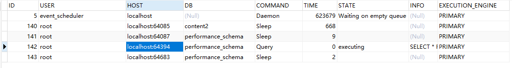


```
USER : 本次进程的用户
HOST : 进程地址,端口号
DB   : 使用的数据库名
```


## 10.2 information_schema 库


### 10.2.1 innodb_trx 表

用于存放innodb存储引擎事务相关信息的表。

表结构如下:

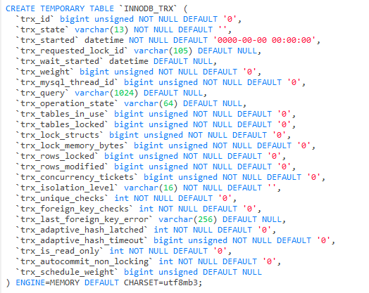


# 11. 一些关键字


## 11.1 exists 关键字

mysql中


### 11.1.1 exists一些不常见但有趣的用法：

#### 11.1.1.1 把exists表达式当成结果返回

```mysql
select EXISTS(select * from intention WHERE `intention`.student_id='20194071227') `result`
```

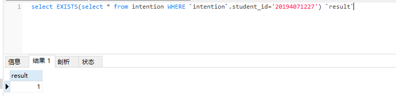

把  `exists(...)`  当成结果返回。如果  exists表达式为true，就返回1。 false就返回0


#### 11.1.1.2 正常使用exists返回值的true/false

```mysql
select 'hello world'
WHERE EXISTS(select * from intention WHERE `intention`.student_id='20194071227')
```

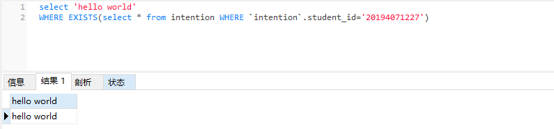

将exists用在 where 关键字中。就是用true/false了。

这个时候，没有指定 from 表，只指定了select 列

where 表达式的值是true 。那么结果等于 列名。

where 表达式的值是false。那么结果就是 null


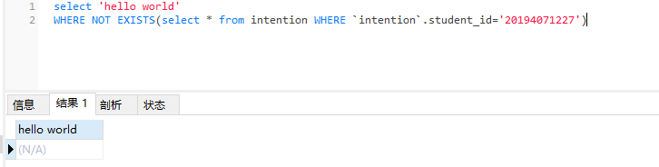


另外好玩的：

mysql 没有console的概念，可以用 where 总是ture ，输出自己想要的语句；

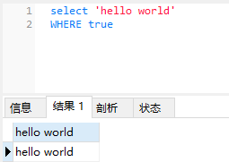


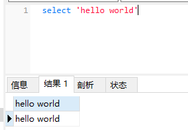

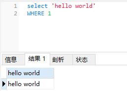


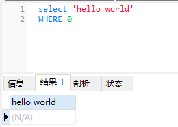


通过 where 1 是ture；where 0 是false，以及上面的将exists作为结果输出是1 或0 来推测。where表达式中，非0就是真。


## 11.2  limit 关键字

### 11.2.1 分页查询

```sql
select *
from student
limit 0,10


# limit <PageIndex>,<PageCount>

<PageCount> :  以 <PageCount> 的数量为一页

<PageIndex> ： 第 <PageIndex>  页, 索引。从0开始
```


## 11.3 CASE WHEN 关键字


### 11.3.1语法


#### 简单函数

```
CASE [col_name] WHEN [value1] THEN [result1]…ELSE [default] END [cloumnName]
```


解释：

```
col_name , 根据col_name的取值作为判别。

如果 col_name的值等于 value1 这条记录返回 [result1]
如果 col_name的值等于 value2 这条记录返回 [result3

default: 默认值

cloumnName:  最终这一列展示的名。 如果缺省，展示 'CASE'
```


一个示例：

```mysql
SELECT A.create_user,
         CASE A.busi_complete_info 
                    WHEN '0' THEN '进行中'
                    WHEN '1' THEN '已完成'
         END busi_complete_info 
FROM tf_plm_research_countryroom A
GROUP BY create_user,busi_complete_info
ORDER BY create_user
```


#### 搜索函数

```
CASE WHEN [expr] THEN [result1]…ELSE [default] END [cloumnName]
```


解释：

````mysql
不根据表中某个字段的值。而是根据一个表达式的值。这样的语法，让CASE WHEN有了一定处理字段的能力。再根据处理结果，选择CASE


SELECT A.create_user,
			 CASE A.busi_complete_info 
						WHEN '0' THEN '进行中'
						WHEN '1' THEN '已完成'
			 END busi_complete_info,
			 
			 CASE 
			 WHEN COUNT(1)>0 THEN '大于0'
			 WHEN COUNT(1)>10 THEN '好'
			 END count
			 
					 
FROM tf_plm_research_countryroom A
GROUP BY create_user,busi_complete_info
ORDER BY create_user


````


## 11.4 Union

MySQL  Union 操作符用于连接2个以上的 Select结果集，组合到一个结果中。 （拼接记录行）


### 11.4.1 语法

```mysql
SELECT <Column1> [...<Column2>]
FROM <table1>
[WHERE condition]
UNION [DISTINCT | ALL]
SELECT <Column1> [...<Column2>]
FROM <table2>
[WHERE condition]
UNION [DISTINCT | ALL]
```


解释：

```
Column 			   需要UNION关联的列名
table  			   表名

WHERE conditon     UNION 操作可以使用WHERE关键字,
				   conditon ：  where条件的表达式


DISTINCT 		   去重,对于检索的列去重。   默认是 UNION DISTINCT

ALL  			   保留列的所有的结果集，需要显式声明
```


要求：

```
进行UNION 关联的表之间，必须保证相同的列数。
```


#### 11.4.2 去重的思考


如何判定为重复？

```
1.首先UNION操作的 表之间，列数量是相同的。
2.对于两条记录,必须保证全部UNION的列的值都一样才会去重。  有任意一列数据不一样，都不会认为重复记录
```


# 12. 存储引擎


## 12.1  什么是存储引擎


```
不同的存储引擎提供不同的存储机制、索引技巧、锁定水平等功能。
```


```
因为在关系数据库中数据的存储是以表的形式存储的，所以存储引擎也可以称为表类型(Table Type，即存储和操作此表的类型)。
```


## 12.2 Mysql的存储引擎


MySQL给开发者提供了查询存储引擎的功能，执行以下sql即可查询到mysql中支持的的存储引擎

```
show engines;
```


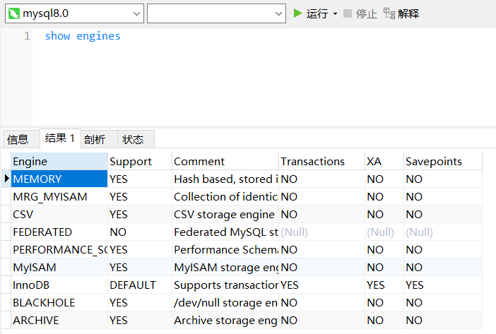


### 12.2.1  InnoDB引擎


```
InnoDB是目前MYSQL的默认事务型引擎，是目前最重要、使用最广泛的存储引擎。支持事务安全表（ACID），支持行锁定和外键
```


#### 12.2.1.1 InnoDB的主要特性

InnoDB存储引擎有2个重要特性：`支持事务`    `并发高`


##### 12.2.1.1.1 支持事务

InnoDB给MySQL提供了具有提交、回滚和崩溃恢复能力(日志文件)的事物安全（ACID兼容）存储引擎。


##### 1.2.1.1.1.2 性能高

InnoDB是为处理巨大数据量的最大性能设计。它的CPU效率可能是任何其他基于磁盘的关系型数据库引擎锁不能匹敌的


### 12.2.2 MyISM


优点：

- 占用空间小
- 访问速度快，对事务完整性没有要求或以 SELECT、INSERT 为主的应用基本上都可以使用这个引擎来创建表
- 可以配合锁，实现操作系统下的复制备份


缺点：

- 不支持事务的完整性和并发性
- 不支持行级锁，使用表级锁，并发性差
- 主机宕机后，MyISAM表易损坏，灾难恢复性不佳
- 数据库崩溃后无法安全恢复


#### 12.2.2.1  存储结构

MyISAM将数据和索引分离。

```
所有的数据都存放在以 .MYD的文件中。
索引文件都存放在 .MYI的文件中。

在搜索的时候和InnoDB类似，采用的类似B+树的形式。只不过叶子节点只存放主键和主键对应.MYD文件的地址。 .MYD文件中用户数据无需按照主键递增的形式排列,所以insert效率较高。
```


### 12.2.2 memory


#### 12.2.2.1 特点

使用存储在内存中的内容来创建表，而且所有数据也放在内存中。这些特性都与InnoDB，MyISAM存储引擎不同。

```
表内的数据都存储在内存中。只有表结构，存储在磁盘中。
```


使用哈希索引，索引效率比B+树高。


```
基于内存，所以存取高效，但数据容易丢失。
```


# 13.  MySql 高级


## 13.1  字符集相关操作


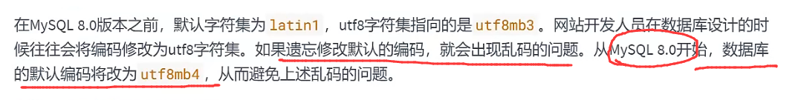


### 13.1.1 查看库/表的创建

查看表的DDL、库的DDL

```
show table <tableName>
show database <databaseName>
```


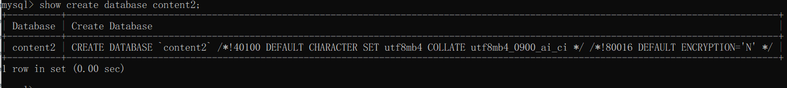


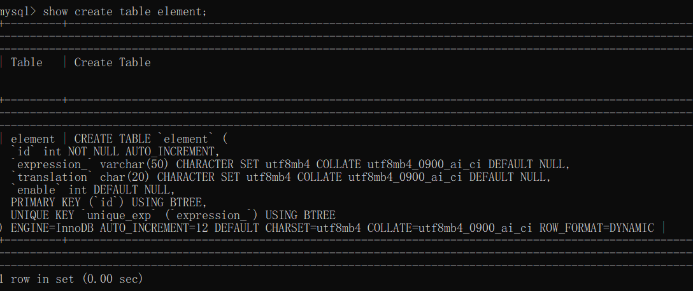


### 13.1.2 修改字符集

使用

```
show variables like '%character%';
```

查看各种操作对应的字符集。


Mysql8.0如下： 默认几乎全都是utf8mb4 。

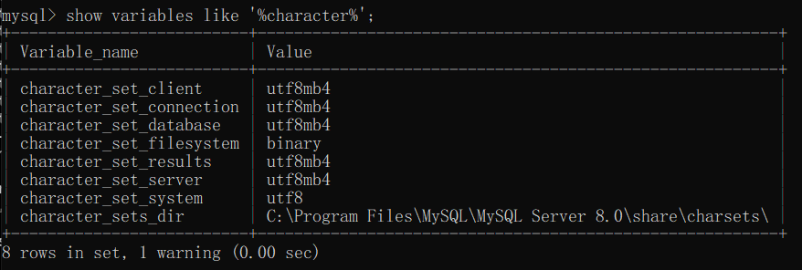

而5.7则不是,如果使用默认字符集，则会导致汉字无法存入。


所以需要修改配置：

```
在Windows中，需要修改my.ini 
在Linux中，需要修改my.cnf
```

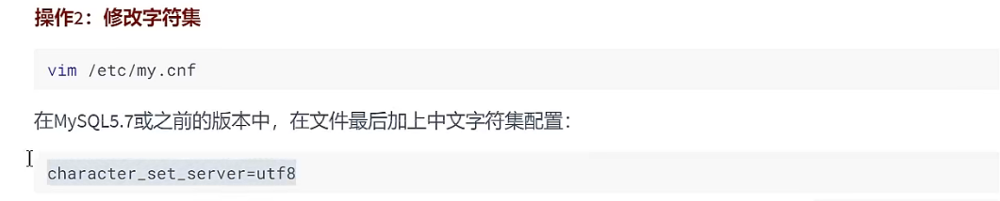


## 13.2 配置文件的使用


### 13.2.1 配置文件的格式

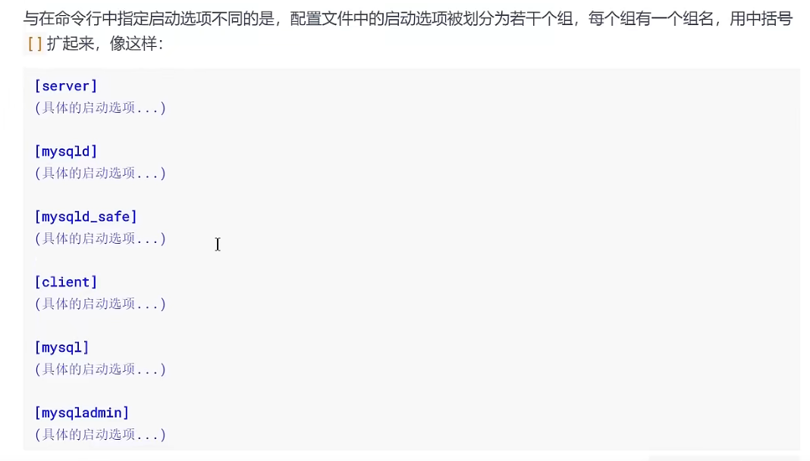

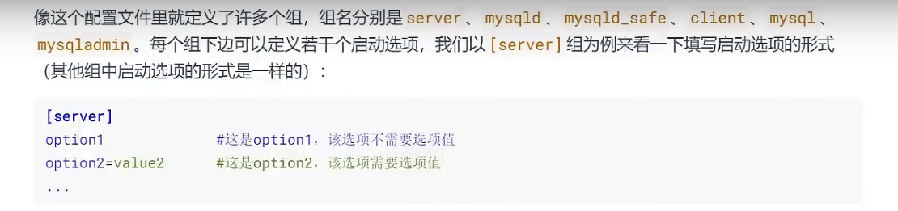


### 13.2.2 启动命令与选项组


```
不用的启动命令 对应 不同的选项组。
```


特殊2个：

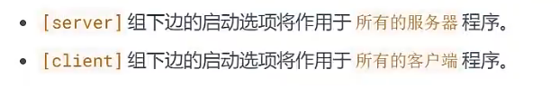


其他的对应：


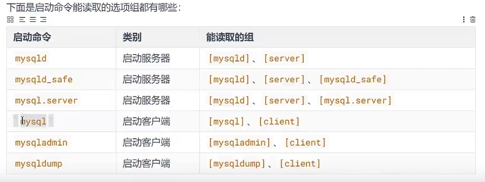


## 13.3 系统变量


## 13.4 逻辑架构


### 13.4.1 简单剖析


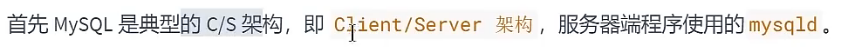


下面这样图，描述了一个请求发出的过程。


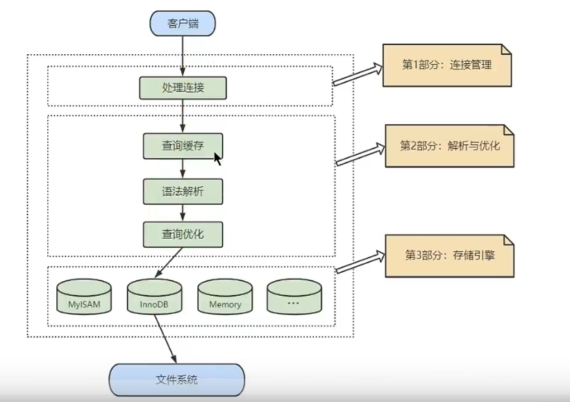


```
请求发送到 Mysql服务端。发生的过程,可以依次分为三部分。 连接管理、解析与优化、存储引擎。
```


进一步剖析：

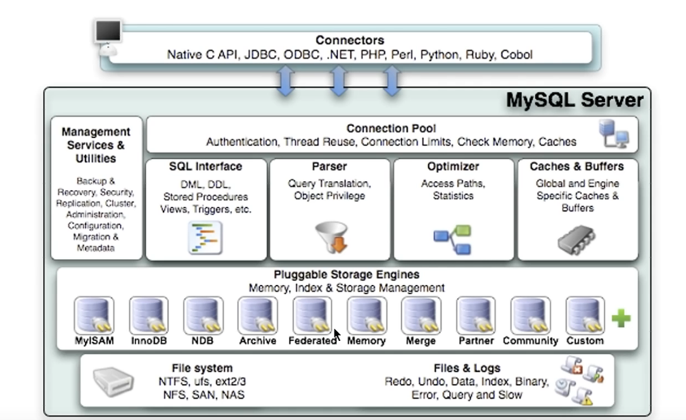


````
Connectors 直接翻译连接器。

这些其实就相当于 Mysql-client 。是向Mysql-server 发送Sql请求的。

这些和语言直接相关。 例如Java 使用JDBC
````


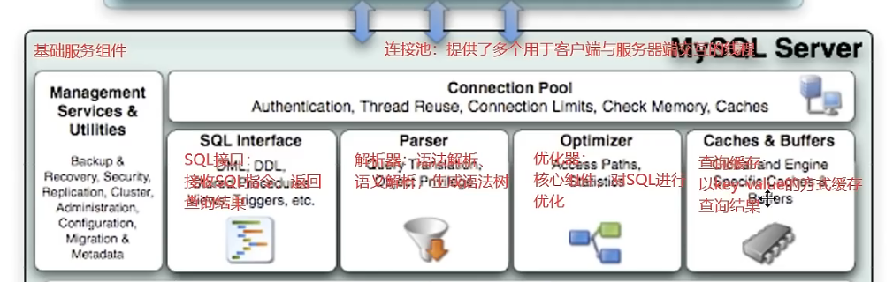


```
在8.0中 查询缓存被干掉了。
缓存的逻辑： 以Key-value形式缓存的。 sql 语句作为Key，必须是完全一致的SQL才会当成同一个Key
显然，这样的缓存是非常低效的。
```


### 13.4.2 Sql请求的流程


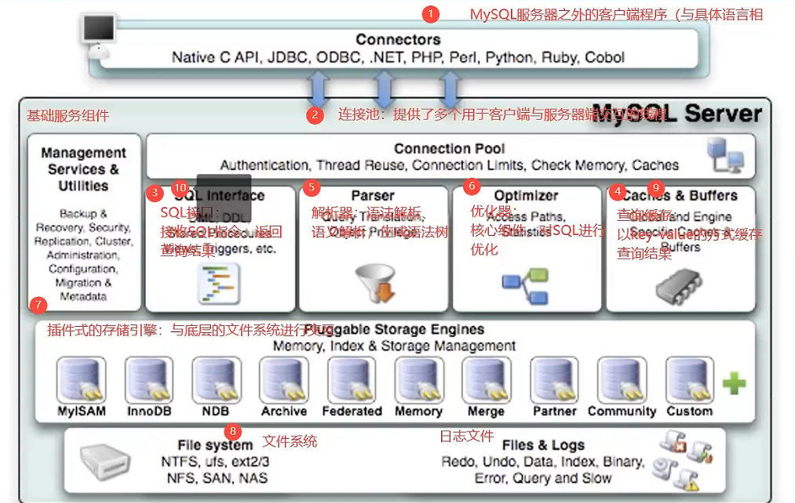


```
从Mysql-client到连接池,然后进入Sql接口,再进入缓存，如果有直接返回。没有就需要解析，之后优化。
通过存储引擎查询文件系统。返回结果到缓存，再到Sql接口。最终返回给Client
```


### 13.4.3 Mysql Server 的分层

#### 13.4.3.1 第一层：连接层


连接层做的事：


思考：


```
答案显然不是，连接层中使用了连接池。
```


####  13.4.3.2 第二层：服务层


##### 13.4.3.2.1 解析器

在解析器中对Sql语句进行 语法分析、语义分析。如果Sql语句有错误，将在解析器这里抛出错误。

解析器把Sql语句解析为一个树形结构


##### 13.4.3.2.2 优化器


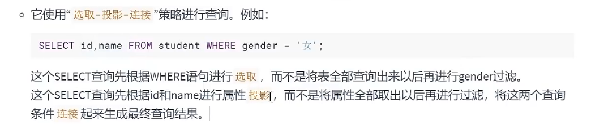


#### 13.4.3.3 第三层：引擎层


#### 13.4.3.4 存储层


有时存储层不会被当做Mysql Server  3层的一部分。如果说3层，就上三层。如果说4层，就包括存储层。


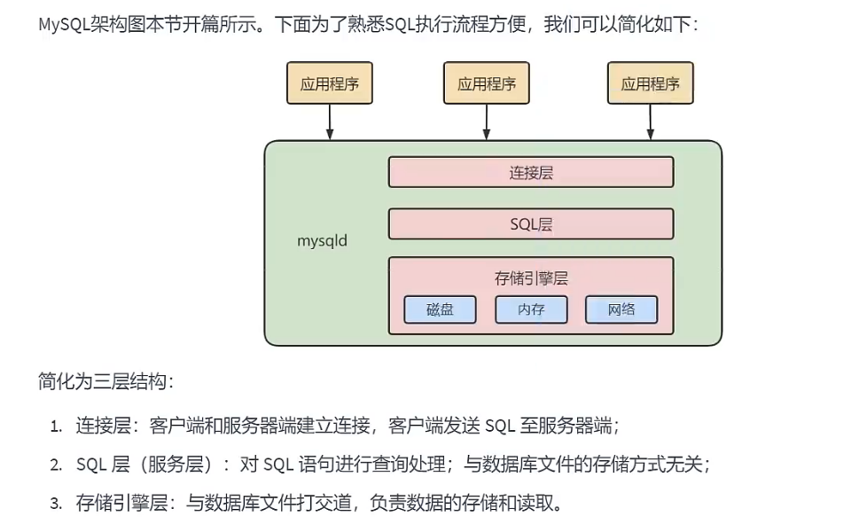


## 13.5 SQL 执行流程


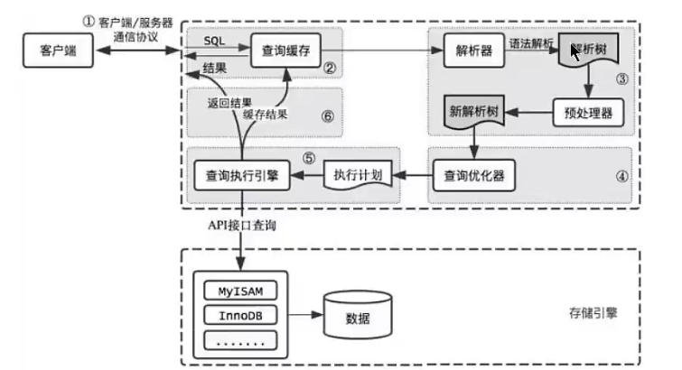


### 13.5.1   流程理论


SQL语句先经过查询缓存。如果查询缓存没有。

则会把Sql传入解析器。进行语法语义的分析。生成一个语法树


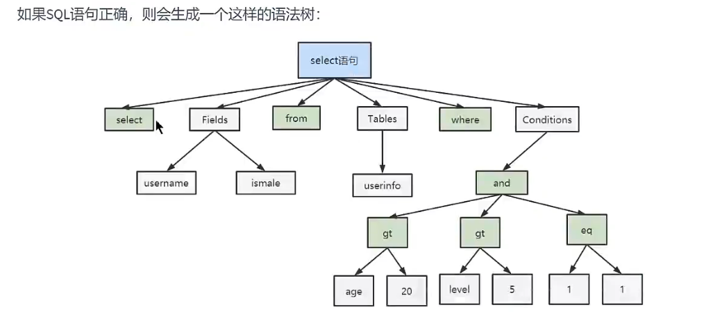


成功生成语法树以后，则会进入优化器。


可能有在某个字段有多个索引。那么决定使用哪个索引也是，优化器的工作之一。


```
优化器优化的方向： 逻辑查询优化、物理查询优化
```


至此，优化器完成以后。 制定了一个查询计划。将查询计划交付给执行器。

执行器会判断，是否有对应的权限。

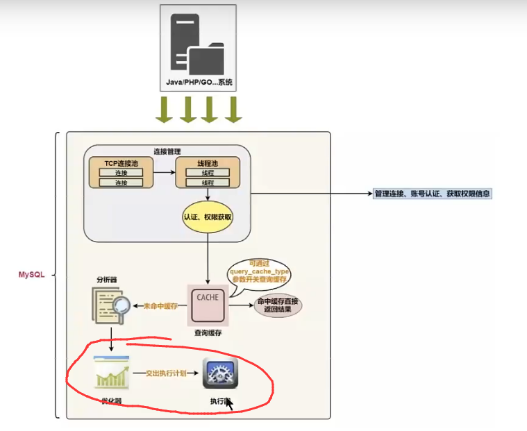


确认具有对应的权限以后，执行器调用存储引擎的接口了。因为存储引擎是插拔式的。不关心存储引擎的具体实现，只关心对应功能。


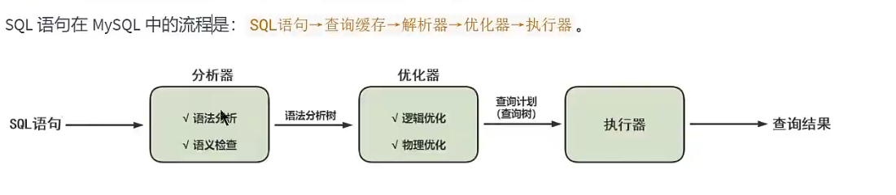


### 13.5.2 Sql执行流程实际操作


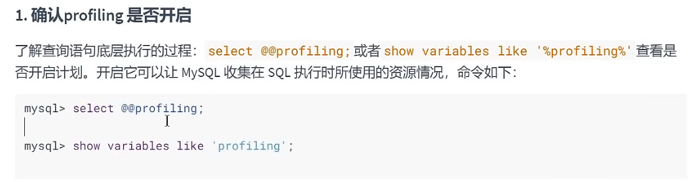

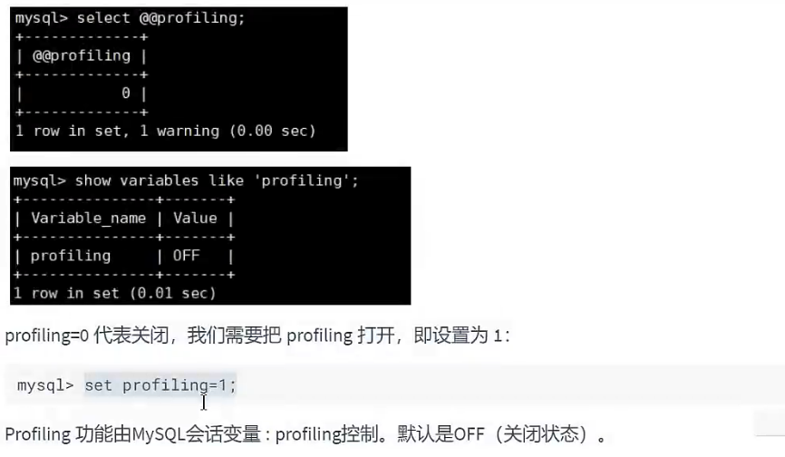


```
show profiles; //查看所有的profiles;

show profile  for query 6;  //查看第6个

show profile ;// 省略，默认查询最后一个
```


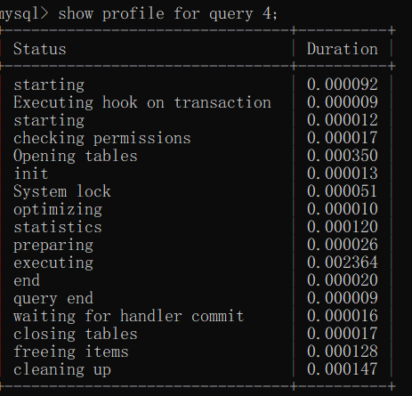


## 13.6  存储引擎


### 13.6.1 查看支持的存储引擎


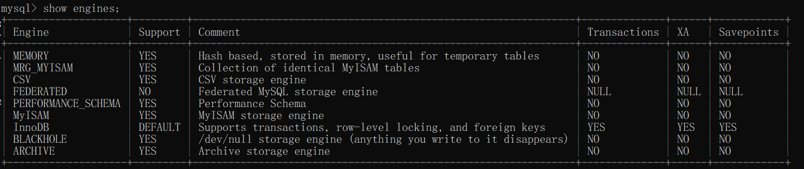


XA ： 支持分布式事务

SavePoint : 保存点。回滚点


#### 13.6.1.2 修改默认的存储引擎


```
是临时级别的
```


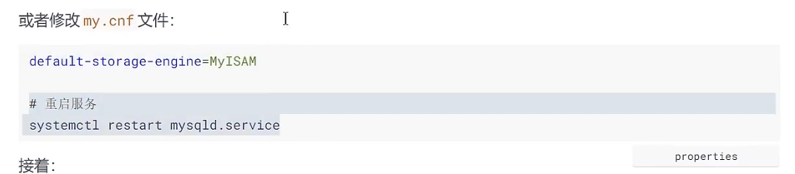

```
是永久级别的
```


#### 13.6.1.3 针对表设置存储引擎

在创建表时指定引擎、字符集

```
mysql> create table student(id int)engine =MyISAM charset=latin1;

show create table student;  //查看表创建语句
```

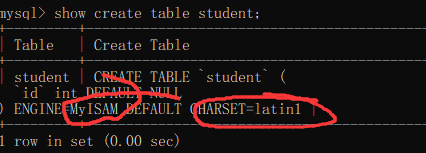


```
show variables like '%datadir%'  //查看数据存储文件夹
```


### 13.6.2   具体引擎介绍

InnoDB 和 MyISAM  不是替代关系，而是互补关系。


#### 13.6.2.1  InnoDB 引擎


 

```
InnoDB 最重要的特性就是支持事务。提交、回滚
```


```
InnoDB 支持行锁
```


```
InnoDB缓存索引和真实数据，对内存要求比较高。
```


```、
当表的内容较少，主要是增加和查询，不需要事务，那么 MyISAM 性能要比InnoDB要好
```


#### 13.6.2.2 MyISAM 引擎


```
InnoDB 崩溃后支持安全恢复是因为其支持事务。 
```


```
以读和写为主。 很少改，使用MyISAM
```


#### 13.6.2.3 二者对比

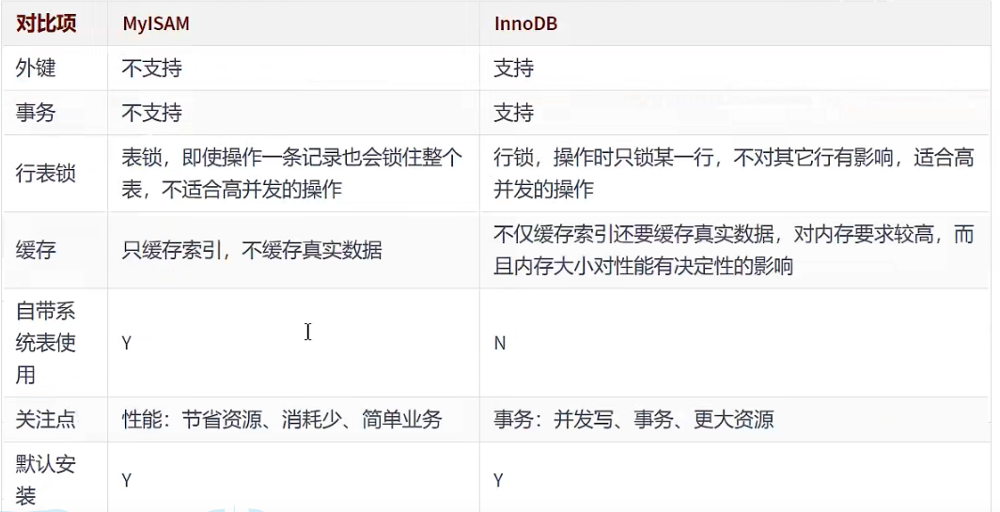


#### 13.6.2.4  Archive 引擎


#### 13.6.2.5 CSV 引擎


#### 13.6.2.6 Memory 引擎


#### 13.6.2.7 NDB引擎


## 13.7 索引 的数据结构	


InnoDB 索引底层使用的B+树


### 13.7.1 为什么使用索引


### 13.7.2 索引及其优缺点


#### 13.7.2.1 优点


#### 13.7.2.2 缺点


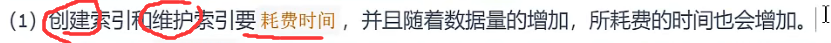


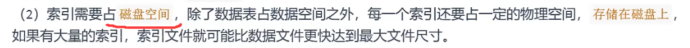


```
某一时间段，要进行频繁的增删改操作，可以先删除索引。之后再创建索引。

最后统一加索引，比每次带着索引进行增删改花费的总时间要少。
```


### 13.7.3 数据库存储

表(table) 物理存储使用 数据页。一个数据页（data page）16KB大小。一个页中存放着若干的记录。

记录和记录之间并不是物理上相连的，因为这样的磁盘空间要求过于苛刻。仅仅是逻辑上相连的，他们之间使用指针相连，表示逻辑的 上下关系。


```
记录和记录之间并不是物理上相连的，是逻辑相连的。
```


思考：

当表的数据量比较小，在一个数据页中可以存放的下，全表搜索尚可。

如果表的数据量比较大，需要在多个页中全表搜索。并且这些页中的记录也不是逻辑上相连的，同时还要把磁盘上的这些记录加载到内存中，判断是否符合某些条件，那耗费的时间是相当恐怖的。

所以，需要加索引。  


#### 13.7.3.1 模拟一个简单的索引结构


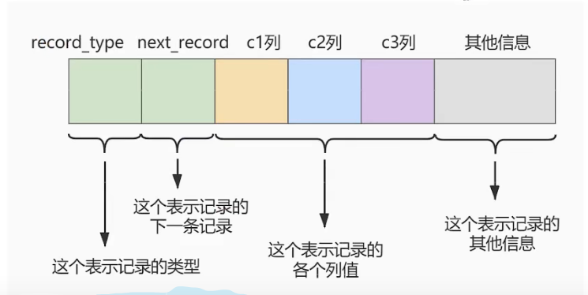

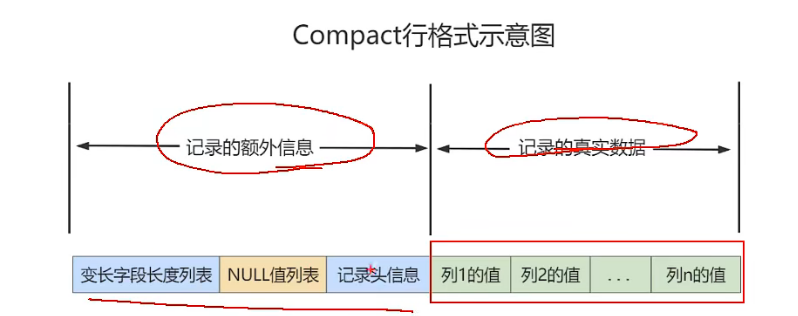


将上述模型抽象成如下的图：

```
每条记录3个字段   c1 c2 c3  ，其中c1是主键。
```


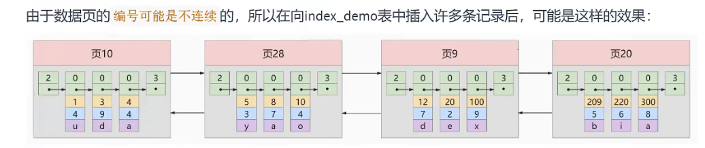


```
此时，如果搜索主键c1为20的记录。由于我们并不知道任何  <页,记录主键> 之间的映射关系。
所以我们只能使用全表搜索，这样的效率是很低的。
所以引入一个数据结构 : 目录项
```


```
目录项中标识了这样的映射 ：  页 与 页内第一条记录的主键值。   

因为主键总是递增的, 所以可以使用二分法(假设此时目录项是连续存储空间),锁定主键为20的记录可能在Page_no:9
(因为  12 < 20 < 209)


无论怎样，想使用二分法，必须保证是数组，是连续的存储空间。因为需要快速定位中间位置。


这样的数据结构:叫做页目录。	帮助在页内不连续物理空间的记录之间，使用二分法。


可以猜想页目录的数据结构：  必须是连续存储空间的数组。数组key表示目录项的id，value表示这个目录项对应的物理地址。二分法锁定目录项id以后通过value就间接访问到了该物理地址不连续的目录项。
```


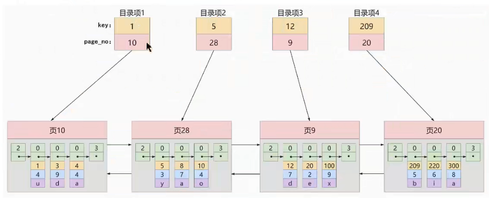


```
当页数增多以后，目录项也会增多。如果目录项里的映射关系更多。目录项也会变成大量的数据。后来发现,访问目录项也是一项极其耗时的操作。

那么此时目录项也可以当做数据页。使用套娃： 为目录项再建立一个目录项。


总之，只要定义好了目录项的映射关系。这样的抽象行为是可以无限套娃的。
```


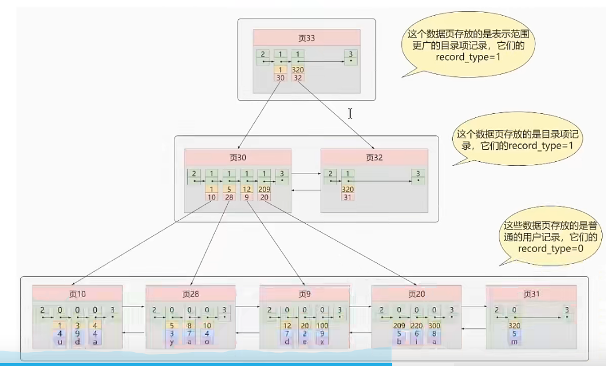


```
当套娃行为持续发生,此时分层结构越来越明显。隐去一种的细节。就是B+树
```


#### 13.7.3.2  B+树  


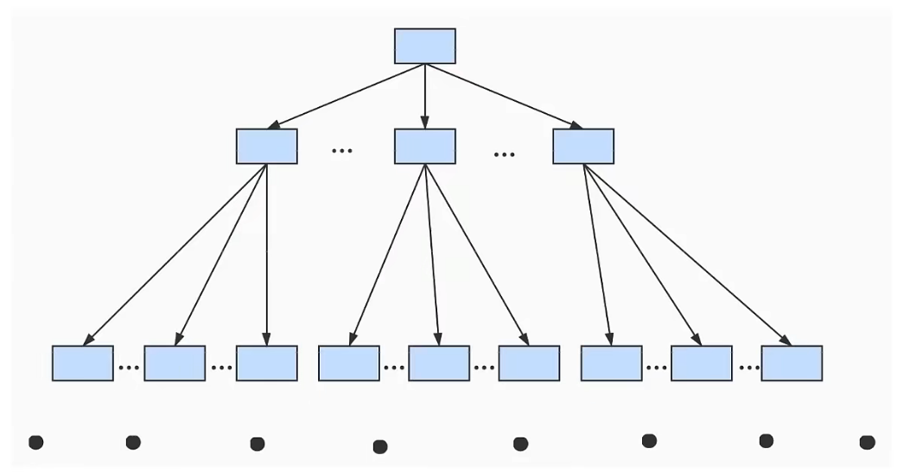


```
B+树只有叶子节点是真实的数据页，里面存放了真实的数据。 也称为第0层


非叶子节点，其实就是目录项了。以及目录项的目录项。
```


```
因为套娃行为，每套一层娃，相当于多了以IO。
```


##### 13.7.3.2.1 B+树结构总结


```
B+树的事实上是一个多叉树,检索能力随着一叉树的增多而增加。
B+树的叶子节点分两种:非叶子节点 和 叶子节点。

叶子节点：
B+树只有叶子节点存放用户的真实数据。每一个叶子节点都是一个和磁盘交互的基本单位：数据页。数据页的大小固定16KB
B+树的每层节点之间以双向链表连接。
叶子节点内部,存放用户的行数据之间以 逐渐递增的顺序使用单向列表排列。
这样保证了行数据的添加和删除是 O(1)时间复杂度，同时存在一个连续数组称为：目录项。目录项存放行数据的主键和对应地址，可以进行二分法查找，这样保证行数据链表有logn的搜索效率。


非叶子节点：高层的非叶子节点只存放底层节点的第一条行数据的主键，用于查找。对于一个固定大小16KB的数据页来说,能够存放非常多底层节点的首条记录，这样保证B+树的分叉能力很强。过滤掉一个高层叶子节点相当于过滤掉了非常多的叶子节点。这也保证了B+树的层高基本不会高于4层
```


### 13.7.4  常见索引


#### 13.7.4.1 聚簇索引


##### 13.7.4.1.1 优点


##### 13.7.4.1.2 缺点


##### 13.7.4.1.3 限制

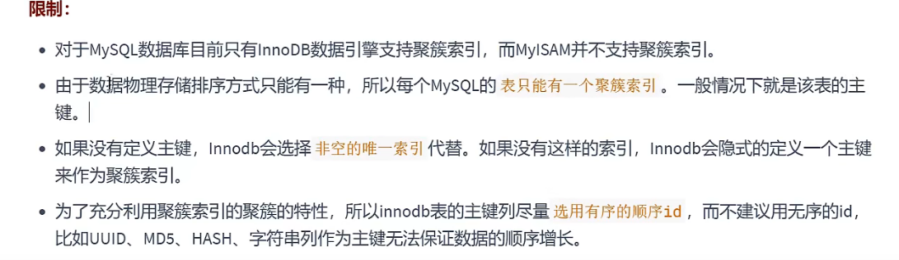


```
在InnoDB存储引擎中，如果用户没有指明主键，那么会在表中找一个 Not null unqiue 的字段作为主键。
如果不存在这样的字段，那么会隐式的指定一个作为主键。
```


#### 13.7.4.2  非聚簇索引


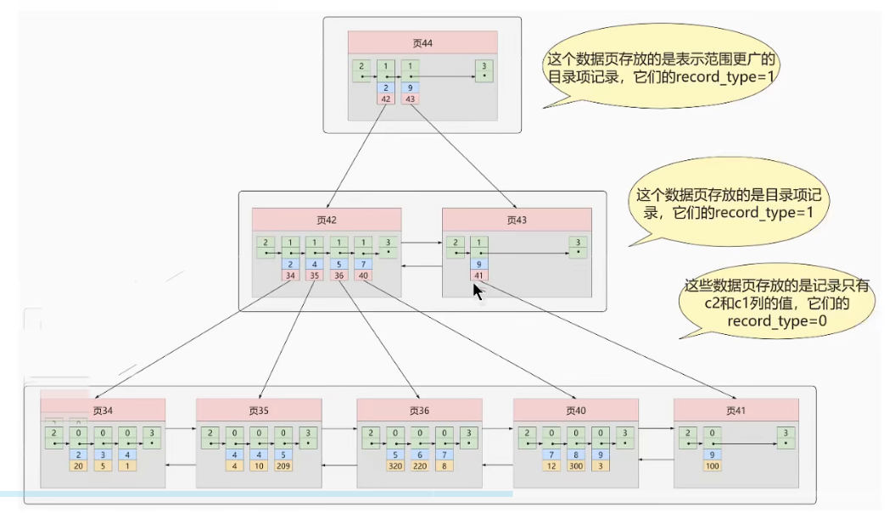

```
注意： 对于非聚簇索引,它的B+树叶子节点并不是完整的真实数据页。
它只存放这个非聚簇索引和主键id;  对于例图来说： 只有c1、c2


因为真实的数据页可能很大,如果在辅助索引B+树的叶子节点再存储完整的数据，将会浪费大量的空间。
所以,在非聚簇索引找到对应的记录以后,通过这条记录的主键唯一id,搜索聚簇索引的叶子节点，拿到这条记录的全部信息。(这样的 “在非聚簇索引查找以后，又回到聚簇索引查找记录”的行为，称为 “回表”)
```


```
另外，非聚簇索引的判断依据和聚簇索引稍有差别。

聚簇索引一般是以主键为索引的。主键是唯一、非空的。
非聚簇索引的字段可能有重复，还有可能是null。
逻辑如图：
```

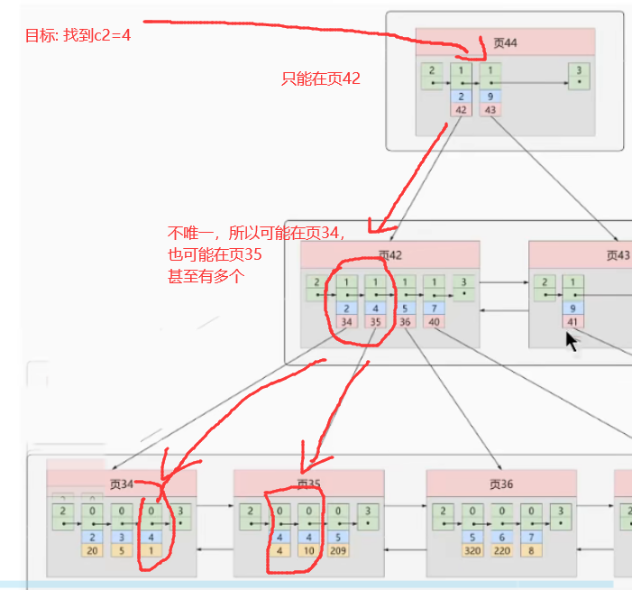


##### 13.7.4.2.1 回表


#### 13.7.4.3 小节


#### 13.7.4.4  联合索引


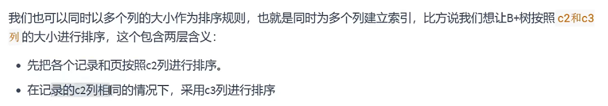


#### 13.7.4.5 InnoDB的B+树索引的注意事项

##### 13.7.4.5.1 根页面位置不变

```
B+树实际上是自上而下，创建的方式。而不是13.7.3节自下而上创建。
```


```
一开始B+树，只有一个数据页。作为根页面。此时跟页面作为存放真实数据的数据页。
当跟页面内容满了以后，InnoDB会开辟一个新的数据页,此时将根页面的内容全部复制到新的数据页中。
这之后根页面的数据清空，并作为复制数据页的目录项。
```


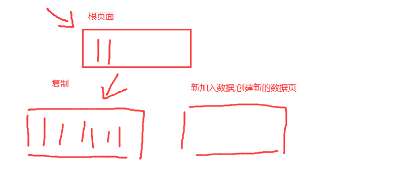


```
当第0层的数据页过多，根页面作为目录项已经装不下了。需要再抽象一层的时候：

会再创建一个新的数据页，作为第一层，此时根页面再次把数据复制给这个新的数据页。
```


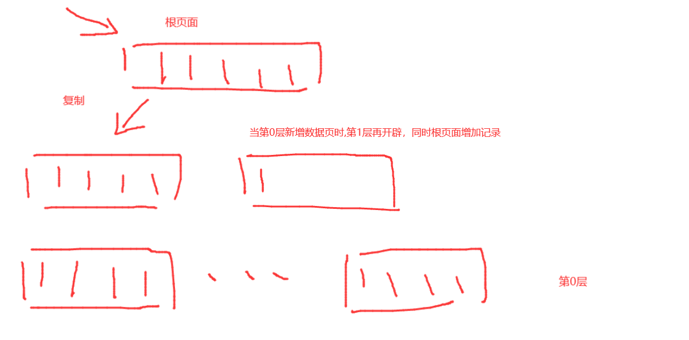


```
总之，这样的复制操作，保证了根页面的入口是不变的。
```


##### 13.7.4.5.2 内节点目录项唯一性


内节点： 非叶子节点。叫做内节点。内节点里的内容都是目录项。


内节点目录项	唯一性：

```
在14.7.4.2 非聚簇索引中示例图中，内节点是不完整的。由于非聚簇索引可以加在非主键的字段上，这样会导致内节点的目录项不唯一。所以，在InnoDB真正的B+树中，非聚簇索引的内节点会带上主键。因为主键拥有唯一性。
```


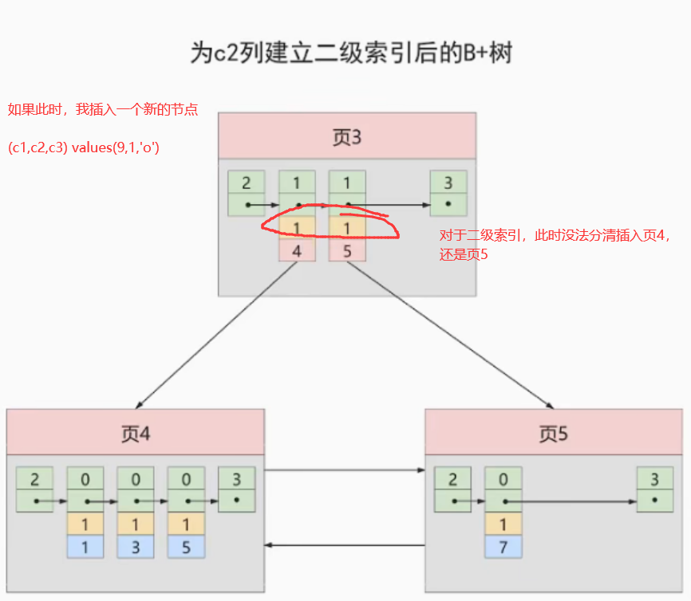


正确的形式 ： 带上主键


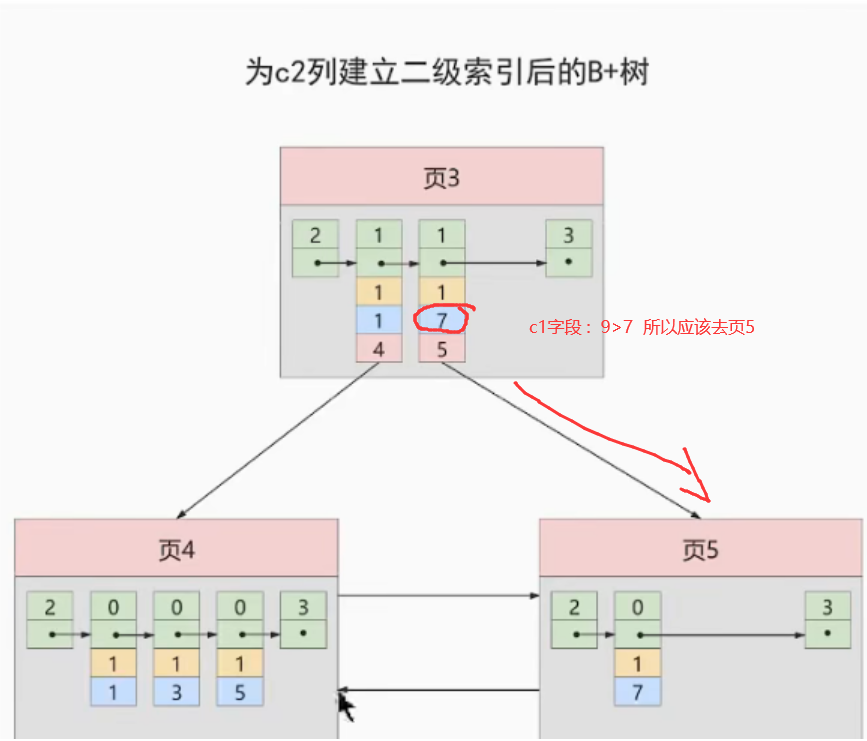


##### 13.7.4.5.3  一个页面最少2条记录


### 13.7.5  MyISAM 的索引方案

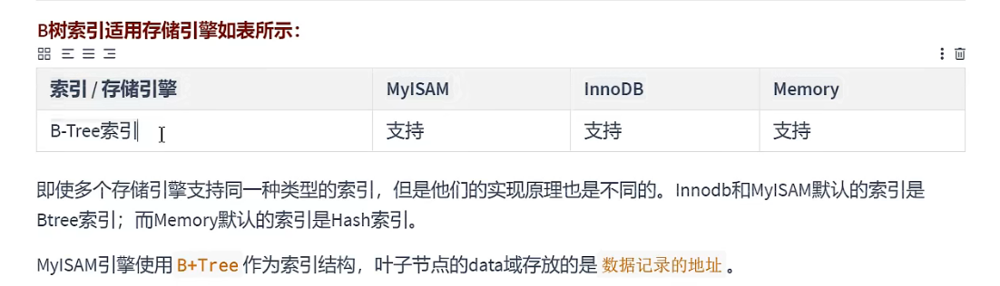


#### 13.7.5.1  MyISAM索引原理


```
MyISAM的叶子节点的data域并不存放真实的值。表的数据单独存放在一个以.MYD为结尾的“数据文件”中。 


data域只存放记录在“数据文件”的地址,通过记录的地址在“数据文件”中找到对应记录。
```


```
这个“数据文件”不需要按照主键排序，只需要移动叶子节点中的记录即可。因为data域存放的了数据的相对地址，直接可以访问到。


MyISAM无需关心数据在 “数据文件”中的顺序。因此MyISAM 存储引擎具有很高效的插入效率。
```


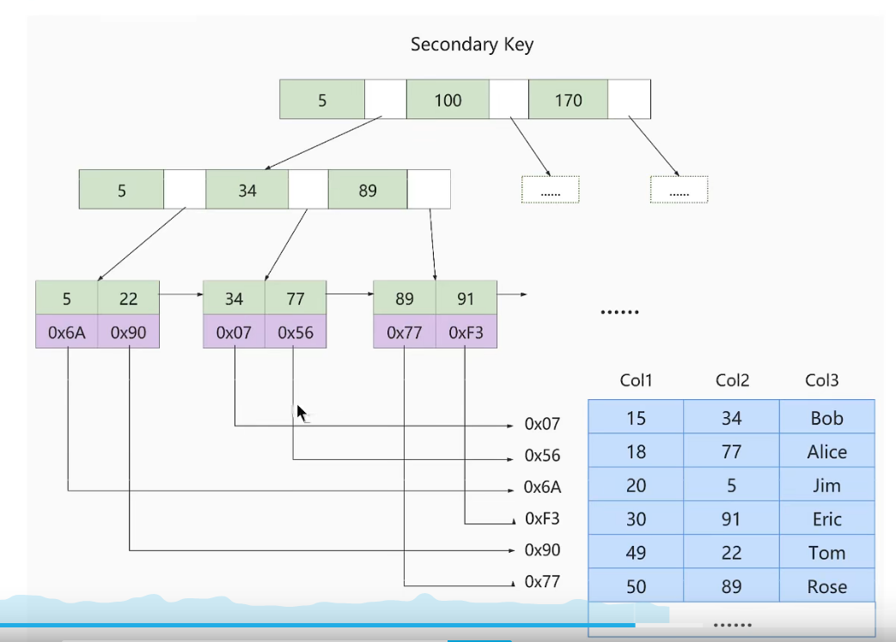


#### 13.7.5.2 MyISAM 和InnoDB 对比


```
因为MyISAM的主键索引的叶子节点也不存放真实的用户数据。 MyISAM将所有的用户数据都单独存放在
```


#### 13.7.5.3 小节


```
如果使用非单调的主键，会导致频繁的页分裂。性能低下
```


### 13.7.6   MySql数据结构选择的合理性


#### 13.7.6.1  Hash结构


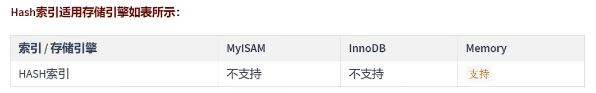


#### 13.7.6.2 B-Tree


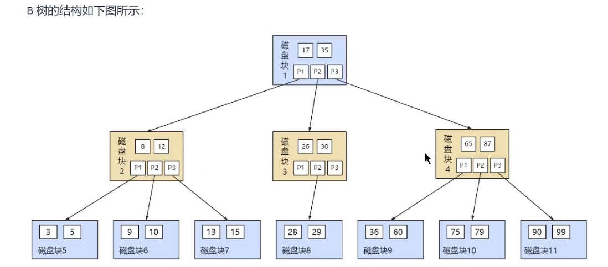


```
磁盘块1:    17 、35 就是主键。
左侧分差都是小于17， 中间都是 17~35之间，右叉都是大于35的。

可以想象一下 17、35 把数轴分成了3块。每一个分支都代表了被分块的数轴。
```


```
B树和  B+树的一个区别点：  B数的内节点也会存放真实的数据。而B+数只有叶子节点才存放真实的数据。
B数由于内节点也存放了真实数据。有可能导致内节点存放不了过多的目录项,导致索引能力下降。(也就是分叉能力下降)
```


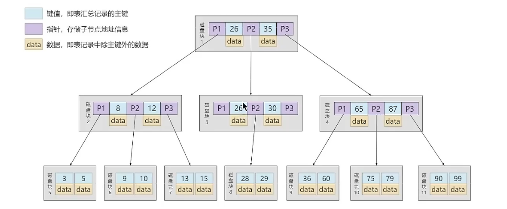


#### 13.7.6.3 B+树


#### 13.7.6.4  思考题


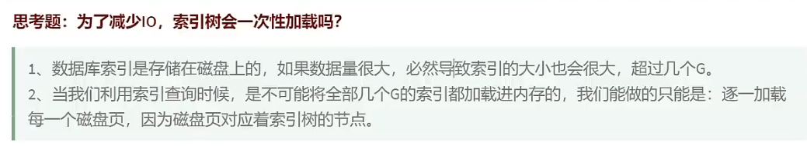


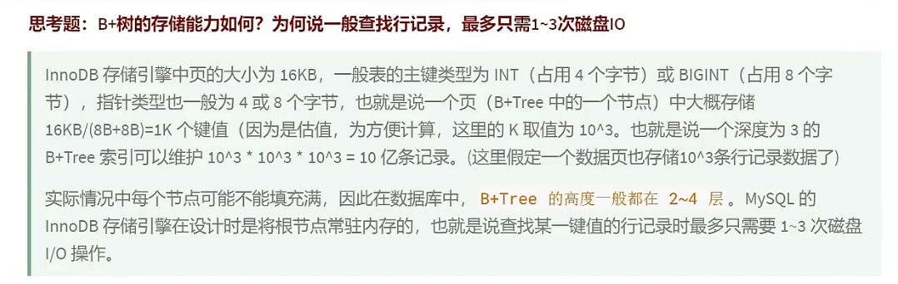

```
InnoDB存储引擎的根页面常驻内存。
```


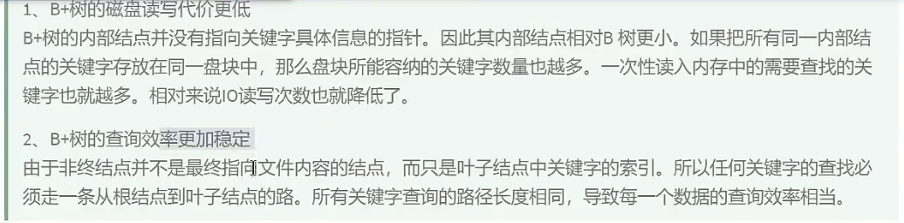	


思考题： 为什么不使用 AVL树， 红黑树 做底层数据结构？

```
首先，从工程上来将，AVL树使用频率就不如 红黑树。
红黑树可以当作不严格的AVL树， AVL树在查询节点时效率稳定，但插入/删除某些节点以后，会带来频繁的左旋或右旋操作。
导致修改，写效率低下，整体统计效率并不高。反而红黑树在工程上性能表现稳定。

其次，在SQL中我们经常使用范围查找，B+树内部按照主键递增，或根据索引字段递增排序。同层叶子节点之间以双向链表连接,这保证了B+树可以过滤范围查找。而hash,AVL树，红黑树只能精确查找，无法范围查找。

同时，当单表数据行多的时候，二叉树的节点增多，层数变高，磁盘IO次数明显增多。而B+树的层数基本不会超过4层，磁盘中的1次寻址，时间是ms级别的，是查询的重量级消耗。

```


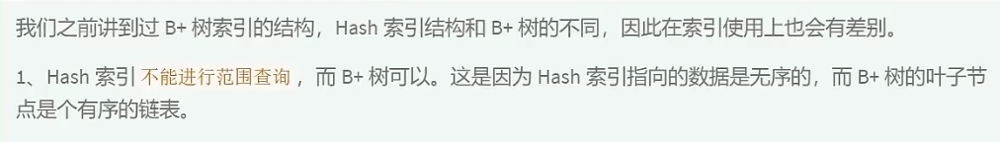


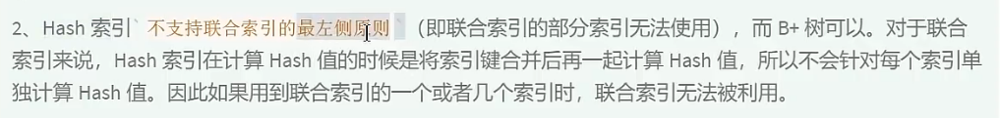


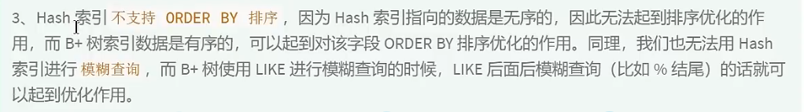


```
 InnoDB 、 MyISAM   不支持HASH索引。
 
 InnoDB在创建表的过程，默认使用聚簇索引。所以必须要有主键。如果用户在创建表时没有声明主键、则会自动找一个not null unique 字段作为主键，如果没有这样的字段，则会隐式的增加一个主键字段。
 
 
 Memory、NDB 支持HASH索引。
```


```
InnoDB 引入了 自适应Hash索引。在8.0版本，默认开启状态。

show variables like '%adaptive_hash_index%'
```


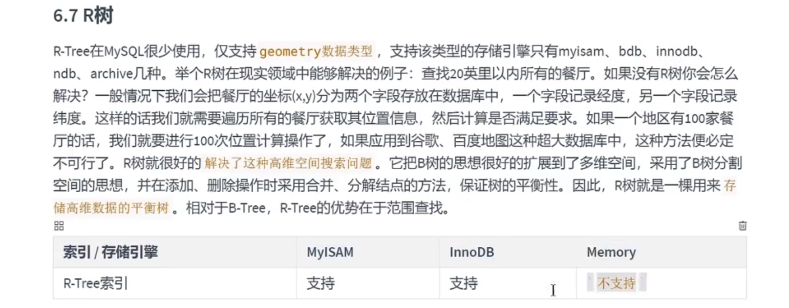


## 13.8    InnoDB 数据存储结构


### 13.8.1  数据库的存储结构：  页


```
磁盘和内存交互的基本单位 :页
```


```
可以通过查询变量验证：

show variables like '%innodb_page_size%'
```

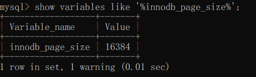


### 13.8.2 页结构概述

```
页 和 页之间不要求物理地址上的连续。
页 和 页之间通过双向链表连接。

同时，页内的记录，也不要求物理地址上连续。 页内的记录是 “单向链表”。


每一个页中都会有一段连续的存储空间： 页目录。方便使用二分查找方法快速定位。
```


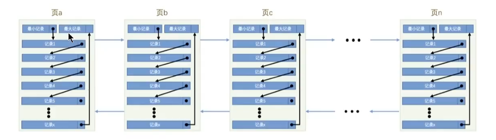


#### 13.8.2.1 页的 上层结构


```
他们之间的关系如下图所示：
```


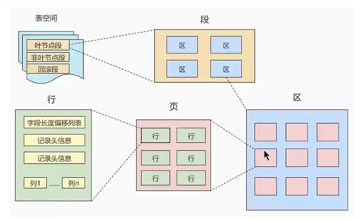


````
一个区占1MB 存放着64个页,每个页16KB(16KB*64KB=1024KB恰好就是1MB)
````


### 13.8.3  页的内部结构

7个部分：


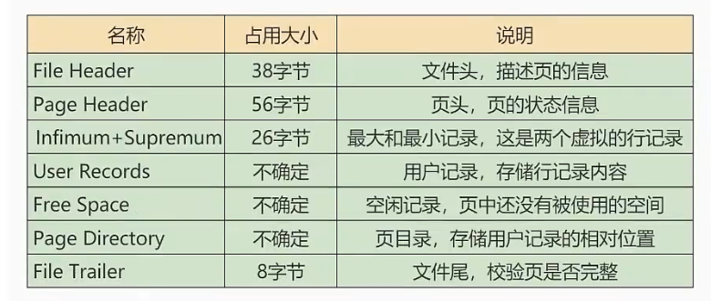


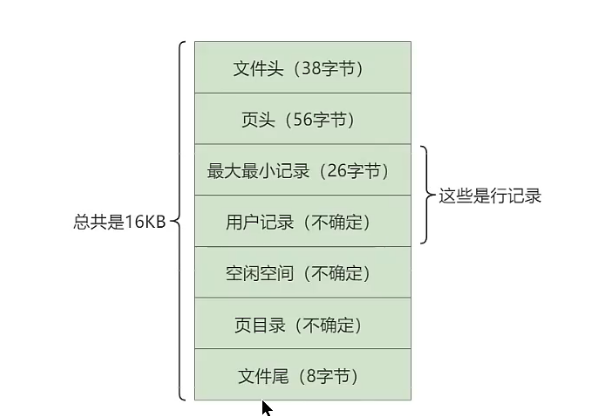


### 13.8.4 页合并

参考https://zhuanlan.zhihu.com/p/98818611


`页合并`，和 `页分裂` 都是行记录发生改变（插入行记录，删除行记录，修改行记录）时，对B+树结构带来的变化。


有时由于业务的需要，我们不得不在已经写满的数据页中删除一条行记录:

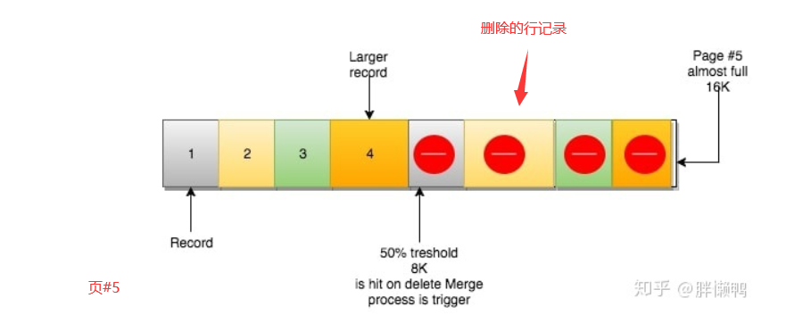


通常InnoDB不会物理删除行记录，而是使用使用标记删除。

当标记删除的行记录达到当前页的50%时，InnoDB会向临近的数据页中尝试是否可以优化空间。


假设此时 页#5的下一页 #6恰好使用的空间小于50%，那么会触发`页合并`


```
页#6示意图:
```


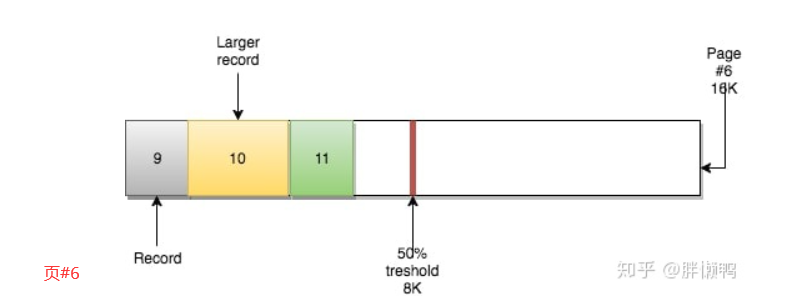


```
合并后示意图：
```

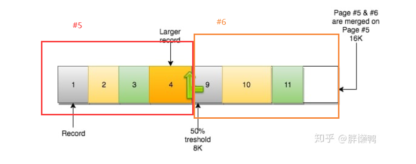


```
合并以后
```


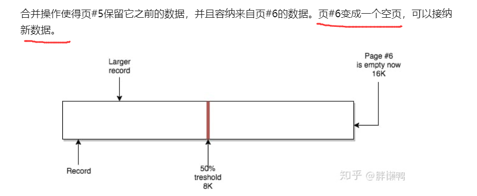


同样的

```
如果修改行记录，达到了50%的阈值也会触发页合并操作
```


### 13.8.5  页分裂

`页分裂` 通常是由于 非严格的递增主键，带来的非严格递增的插入顺序引发的问题。


通常我们非常希望主键的顺序是单调递增的。因为由于B+树同层之间希望行记录是单调递增排列的,因此才能支持二分法查找，范围查找，顺序查找等功能。


但事实上的业务不总是使用严格的递增主键。例如“雪花算法”保证了分布式全局唯一的主键，但只能保证总体是递增趋势(尽量减少页分裂的影响)。


#### 13.8.5.1 到底什么是页分裂

下面构建出一个页分裂的场景：


```
数据页可能填充至100%，在页填满了之后，下一页会继续接管新的记录。但如果有下面这种情况呢？
```


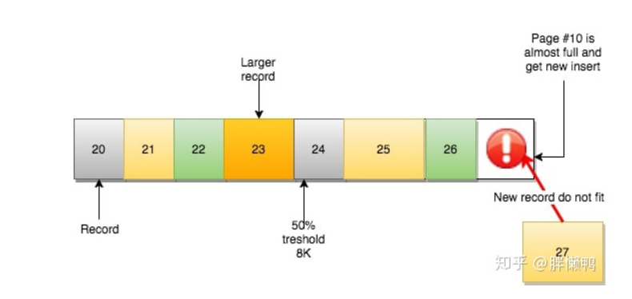

```
页#10没有足够空间去容纳新（或更新）的记录。根据“下一页”的逻辑，记录应该由页#11负责。

(这种情况可以由 不规则的insert触发,也有可能由update操作触发)
```


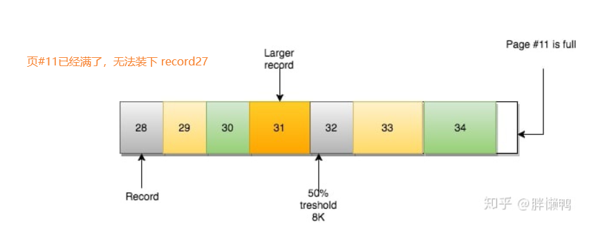


页#11也同样满了，数据也不可能不按顺序地插入(必须保证顺序递增)。怎么办？


InnoDB的做法是（简化版）：

```
1. 创建新页
2. 判断当前页（页#10）可以从哪里进行分裂（记录行层面）
3. 移动记录行
4. 重新定义页之间的关系
```


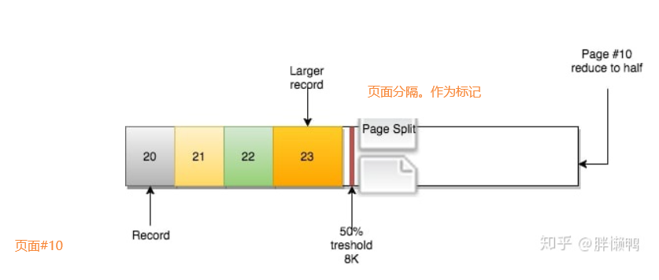

```
按照规则，一部分页面#10的数据装入 新的页面#12
```


原本装不下的Record27装入了 新页面#12:

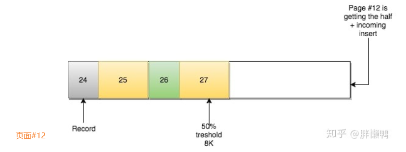


原本装不下新Record27的 页面#11,仍保持不变。

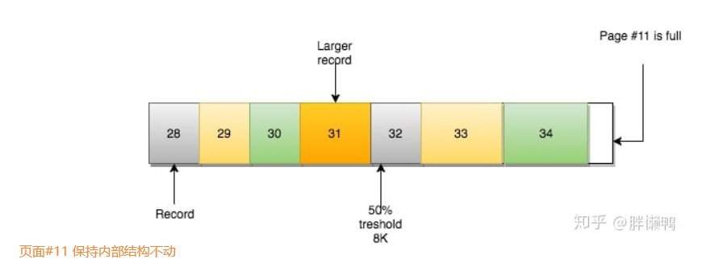


调整页面关系(同层的双向链表)

```
#10 <-> #12 <-> #11
```


这样B树水平方向的一致性仍然满足，因为满足原定的顺序排列逻辑。然而从物理存储上讲页是乱序的，而且大概率会落到不同的区。


#### 13.8.5.2 总结规律

规律总结：页分裂会发生在插入或更新，并且造成页的错位（dislocation，落入不同的区）


## 13.9  索引的创建 与 设计原则


### 13.9.1 索引的分类


#### 13.9.1.1 普通索引


```
可以作用在任何字段上。   没有非空、唯一要求
```


#### 13.9.1.2  唯一性索引


```
声明为 唯一性约束的字段,自动的加上了唯一性索引。
删除唯一性约束，通过删除唯一性索引来删除。
```


#### 13.9.1.3 主键索引


#### 13.9.1.4  联合索引


```
假设有联合索引  index(a,b,c) 那么它相当于拥有索引  index(a)、index(a,b),index(a,b,c)

这样的原因取决于它的底层结构B+树的目录项。当比较的时候，a相同比较b ,b也相同比较c
如果a就不相同，直接就能比较出大小。
```


#### 13.9.1.5 全文检索


```
一个著名的全文索引软件 ： Elasticsearch
```


#### 13.9.1.6 空间索引


### 13.9.2  创建索引


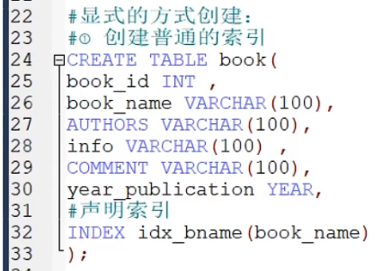


```
index <indexName>(<cloumnName>)    #添加普通索引

unique index <indexName>(<cloumnName>)  #添加唯一索引


查看表的索引情况：

show index from  <tableName>
```


实际操作：

```sql
create TABLE book(
`id` bigint PRIMARY KEY auto_increment,
`book_name` VARCHAR(20),
`price` DOUBLE,
index `idx_price`(price))

SHOW INDEX FROM book
```


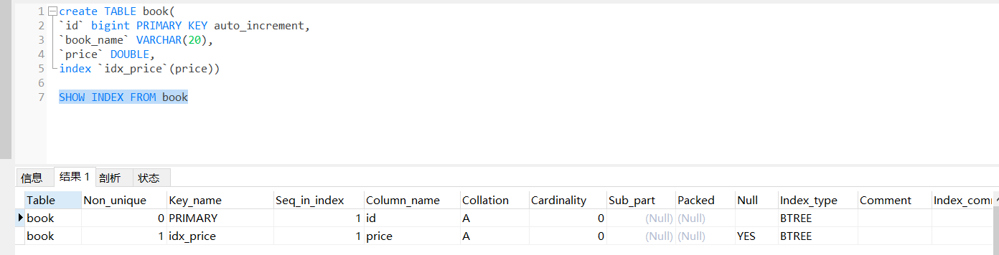


#### 13.9.2.2 全文索引

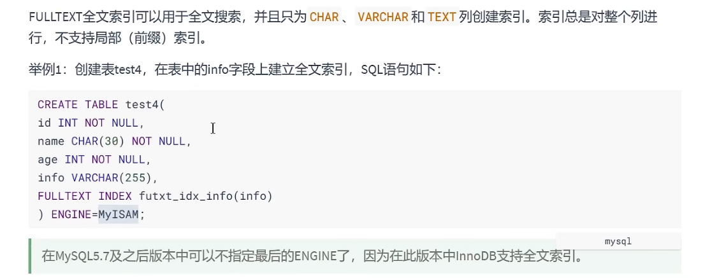


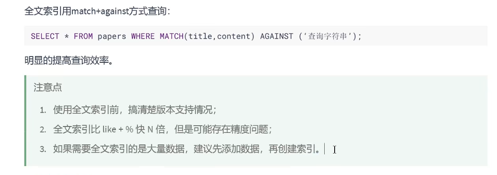


#### 13.9.2.3 空间索引


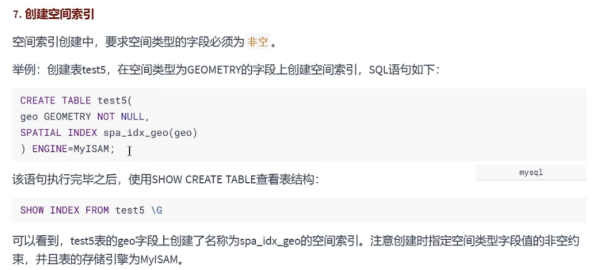


### 13.9.3 删除索引


```sql
alter table <tableName> drop index <indexName>

drop index <indexName> on <tableName>
```


### 13.9.4 Mysql8.0 新特性


### 13.9.4.1 降序索引


```sql
CREATE TABLE table1(
a INT,
b INT,
INDEX idx_a_b(a DESC,b ASC)
)
```


#### 13.9.4.2 隐藏索引


​	


##### 13.9.4.2.1 创建表时隐藏索引


```
加上  invisible 关键字
```


##### 13.9.4.2.2 修改索引可见性

```sql
alter table book alter index <indexName> invisible;

alter table book alter index <indexName> visible; #设置为可见
```


##### 13.9.4.2.3 使隐藏索引对查询优化器可见


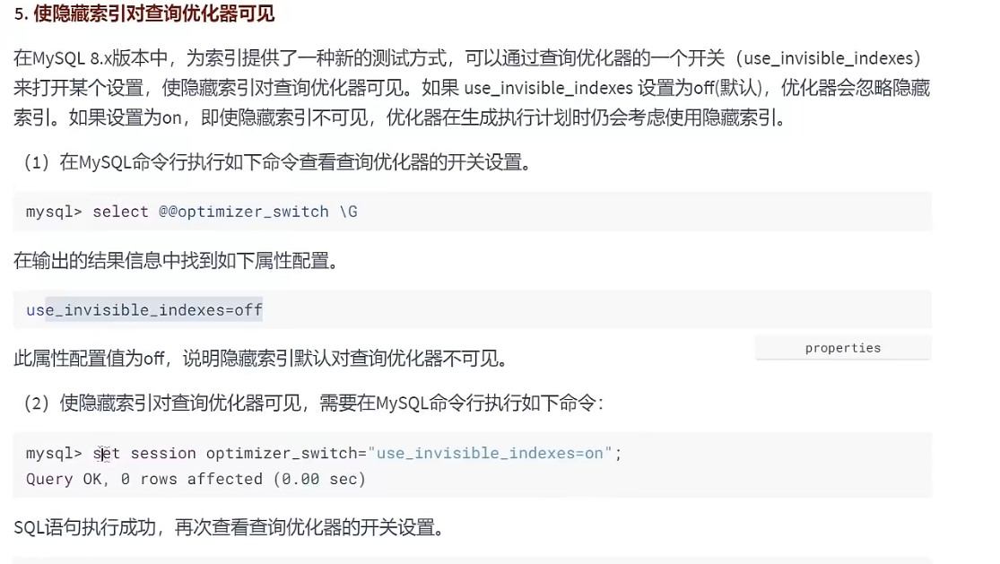

```
通常，查询优化器不使用 不可见的索引。
如果开启了可以使用  “不可见的索引” ，那么相当于使用了全部索引，不管可见不可见
```


### 13.9.5  索引的设计原则


	


#### 13.9.5.1 哪些情况适合加索引


##### 13.9.5.1.1 字段的数值有唯一性的限制


##### 13.9.5.1.2  频繁`Where`的字段


##### 13.9.5.1.3 频繁`group by` /`order by`的字段


```
当两个字段，一个被order by 一个被group by ，且同时出现在一个SQL中。
```

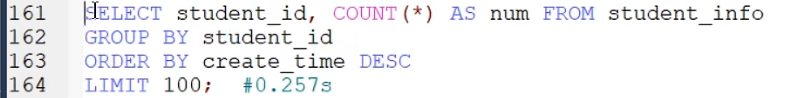

```
如果不用联合索引，只能生效  index(student_id)。因为解析sql先进行group by


使用联合索引，只能生效  index(student_id,create_time) 
而不能生效 index(create_time,student_id) 原因还是，最左优先原则。先解析group by 
```


##### 13.9.5.1.5 `distinct` 字段需要创建索引

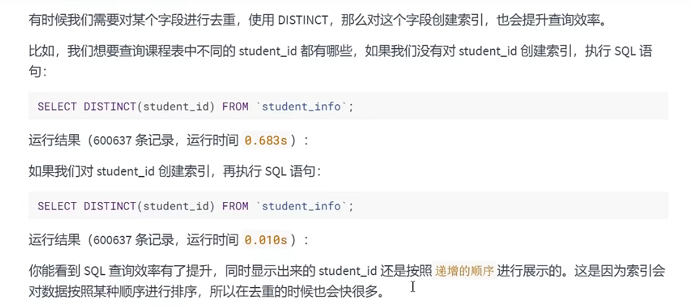

```
使用索引排序以后，相同字段就连在一起了，去重显然更快。
```


##### 13.9.5.1.6 多表Join 连接时，注意事项


在`MySQL 5.4` 的版本中，`Join`操作使用的是嵌套for循环，是一个重量级的操作。


在`MySQL 8.0`时，已经将 `Join`优化为 `HashJoin`，以时间换空间，提高了执行效率。


在编码时，通常可以使用`Where` 一个索引字段，来减少 `Join`表操作前的`行记录数`，来加快SQL执行速度。


如果不一致，仍然可以完成 `JOIN` 但会发生隐式的类型转换，这将额外消耗更多性能，同时，使用函数，会导致索引失效。`SQL`的效率进一步下降。


##### 13.9.5.1.7 使用列类型小的创建索引


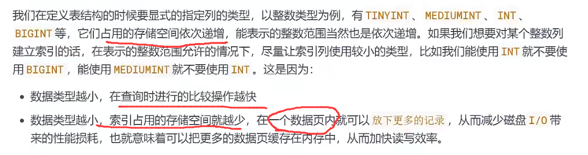


##### 13.9.5.1.8 使用字符串前缀作为索引


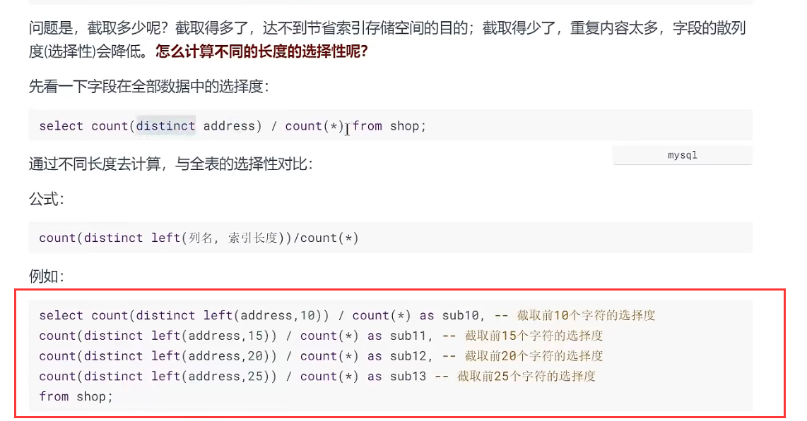


```
使用前缀索引带来的问题：
```


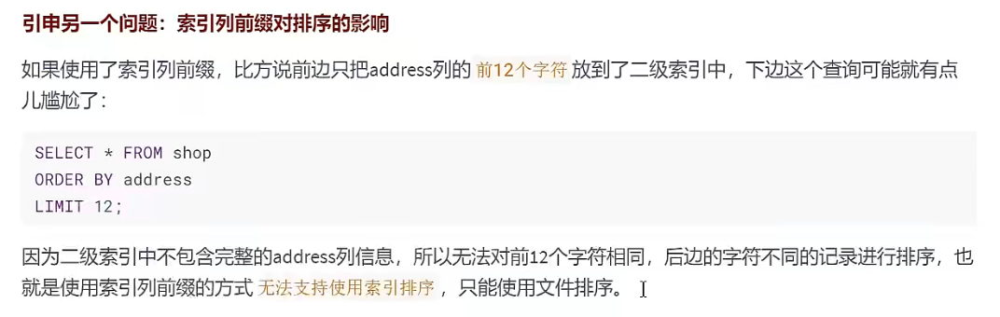


##### 13.9.5.1.9 使用 区分度高的列作为索引

区分度高的列，也就是 `基数`大的列。

【基数】表示一个列中不重复的值的多少。


例如：


```
这个列 有9条记录，但只有3个基数：2 、5、8。
用这列作为索引，区分度就不高。
```


对于相同值的行记录，索引无法区分他们，也就是无法减少行记录的数量，此时对于这些【相同值】得行记录来说，索引失效。


##### 13.9.5.1.10  使用最频繁的列放在联合索引的左侧


满足`最左匹配优先原则`。

对于联合索引来说，如果左侧的索引没有使用，那么右侧的索引也不会生效。


原因：索引的存储结构决定的，如下

```
假设联合索引(A,B,C)
B+树在非叶子节点中的排序规则: 
1.如果A不一致直接排序。
2.当A一致，再比较B。根据B排序，此时已经锁定了A的位置
3.如果B一致再比较C，根据C排序，此时已经锁定了A，B的位置
```


##### 13.9.5.1.11 在多个字段都需要添加索引的情况，联合索引优于单值索引

如果业务允许的情况下，联合索引更加节省存储空间。此时【联合索引】由于【单值索引】。


#### 13.9.5.2  限制`索引的数量`

索引的数量不是越多越好，通常单表不超过 【6个】索引。


原因如下：


#### 13.9.5.3  哪些情况不适合做索引


##### 13.9.5.3.1 where字段使用之外的字段


`WHERE` `GROUP BY` `ORDER BY` `IN` 都可以使用索引。


##### 13.9.5.3.2 数据量小的表不要使用索引

如果表的数据量较小，使用索引提升效率可能不大，此时额外添加索引会导致 `INSERT` `DELETE` 操作的效率降低。


##### 13.9.5.3.3 `基数小的列`不要加索引

【基数小】的列 导致【散列度低】， 不适合加索引。


【基数小】意思是在一个列中，多个数据的值一样，此时对于【索引值相等】的【行记录】 来说无法使用索引过滤。即：

过滤效果不好。


通常:


##### 13.9.5.3.4  频繁增删改的字段 不要创建过多索引

```
索引会影响增删改的效率。因为当索引字段修改以后，很有可能会影响索引，索引会相应的一同修改。


当某一时间段频繁的增删改时，可以考虑暂时取消索引。之后再添加。
```


##### 13.9.5.3.5  不建议使用无序的字段作为`主键索引`

也就是尽量保证  【按顺序】插入【有序】的主键。


例如 : 主键是递增的 `bigint`, 按顺序增加行记录的时候，聚簇索引会按顺序添加。 否则会发生`页分裂`，插入到原来的数据页中。


```
在B+树叶子节点,数据页内的记录是随着主键自增。

如果使用无序的字段作为主键索引。
在插入新的行记录时，可能会插入到之前的数据页中，这将频繁导致 “页分裂”。降低性能。
```


##### 13.9.5.3.6 删除不再使用、或很少使用的索引


##### 13.9.5.3.7 不要定义冗余/重复索引

即：存在 `index(a,b,c)` 时，  `index(a)`   `index(a,b)` 是不必要的。


#### 13.9.5.4  索引小结


使用索引，会增加`查询`效率，降低 `写入` `删除`的效率。

使用索引，是提升`SQL`执行效率的一个有利手段，本质上是使用 空间换时间。


##### 13.9.5.4.1  索引注意事项总结

1. 基数大的列适合做索引
2. `WHERE/GROUP BY/ORDER BY /IN/ DISTINCT` 的列适合做索引
3. 多条件组合查询考虑使用 联合索引，频繁使用的列放在联合索引左侧
4. 单表不要超过6个索引
5. `JOIN`尽量3表以下，超出根据实际业务考虑 冗余表
6. 频繁修改的列 视情况不要加索引


#### 13.9.5.5 实战分析

实际测试一下数据：


regiontest表一共54W余条数据。

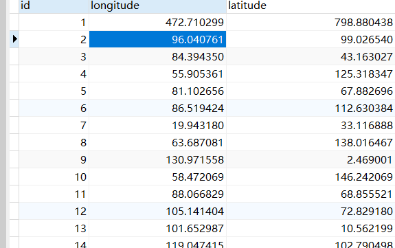


```mysql
EXPLAIN	SELECT * 
				FROM (select *
							from regiontest
							WHERE longitude >125.5) a
				WHERE `id` in (SELECT id
											FROM regiontest
											WHERE longitude < 125.6)   
#直接执行花费2.373s    显示并未使用idx_longitude(在idx_longitude存在的情况下)  
#现在删除idx_longitude测试,花费时间2.403s 确实没有使用该索引
											
											
EXPLAIN SELECT * 
        FROM regiontest
        WHERE longitude > 125.5 and longitude <125.6 
# 执行时间0.067s  使用了 idx_longitude(在该索引存在的情况下)
# 删除了idx_longitude 以后执行时间0.320s  显示没有使用任何索引。 时间是5倍

EXPLAIN	SELECT * 
		FROM regiontest
		WHERE longitude BETWEEN 125.5 AND 125.6  
#执行时间0.067s  使用了idx_longitude 。  证明 between a and b 与   >a and <b   是一致的
# 删除索引以后，和上面一致,0.362s 显示没有使用任何索引


CREATE INDEX `idx_longitude` ON regiontest(longitude);
```


```mysql
#查询经纬度同时在一个区间内

EXPLAIN SELECT 	* 
        FROM 	`regiontest`
        WHERE 	`longitude` BETWEEN 125.5 AND 125.6 AND
        		`latitude` BETWEEN 35.5 AND 36.5	
# 在没有任何索引的情况下：
执行时间 0.344s   EXPLAIN分析，没有使用任何索引


# 在 longitude 和 latitude 单值索引全都存在的情况下：
执行时间0.115s 分析显示只使用了longitude 。 是没有索引情况下的3倍


#在 只有联合索引  INDEX(longitude,latitude)存在的情况下:
分析使用了该联合索引  执行时间 0.036s  执行时间最短！ 比无索引情况快了1个数量级


```


在 longitude 和 latitude 单值索引全都存在的情况下:

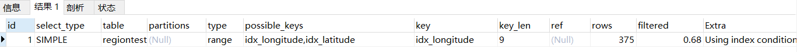

```
只使用了一个单值索引
```


#在 只有联合索引  INDEX(longitude,latitude)存在的情况下:

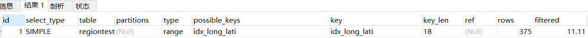

```
扫描了375行。
```


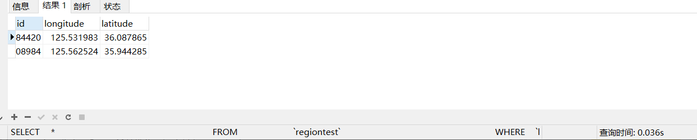

```
执行时间 0.036s
```


原文sql

```mysql
EXPLAIN	SELECT * 
				FROM (select *
							from regiontest
							WHERE longitude >125.5) a
				WHERE `id` in (SELECT id
											FROM regiontest
											WHERE longitude < 125.6)   
											
											
EXPLAIN SELECT * 
				FROM regiontest
				WHERE longitude > 125.5 and longitude <125.6

EXPLAIN	SELECT * 
				FROM regiontest
				WHERE longitude BETWEEN 125.5 AND 125.6  
																								 
																								 
EXPLAIN	SELECT 	* 
				FROM 		`regiontest`
				WHERE 	`longitude` BETWEEN 125.5 AND 125.6 AND `latitude` BETWEEN 35.5 AND 36.5	


CREATE INDEX `idx_longitude` ON regiontest(longitude);
CREATE INDEX `idx_latitude` ON regiontest(latitude);
CREATE INDEX `idx_long_lati` ON regiontest(longitude,latitude);

ALTER TABLE `regiontest` ALTER  INDEX `idx_longitude` invisible;
ALTER TABLE `regiontest` ALTER  INDEX `idx_latitude` invisible;
ALTER TABLE `regiontest` ALTER  INDEX `idx_long_lati` invisible;

ALTER TABLE `regiontest` ALTER  INDEX `idx_longitude` visible;
ALTER TABLE `regiontest` ALTER  INDEX `idx_latitude` visible;
ALTER TABLE `regiontest` ALTER  INDEX `idx_long_lati` visible;


DROP INDEX `idx_longitude` ON regiontest;
DROP INDEX `idx_latitude` ON regiontest;

SHOW INDEX FROM regiontest;
```


### 13.9.6  性能分析工具的使用


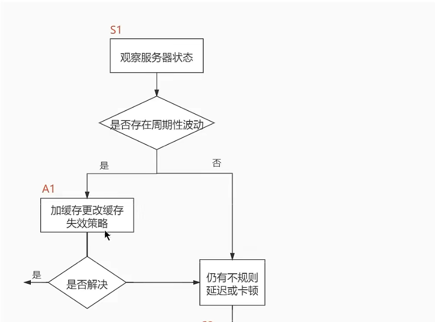

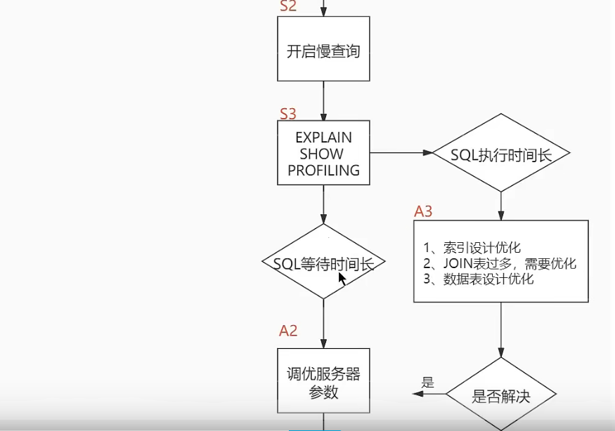

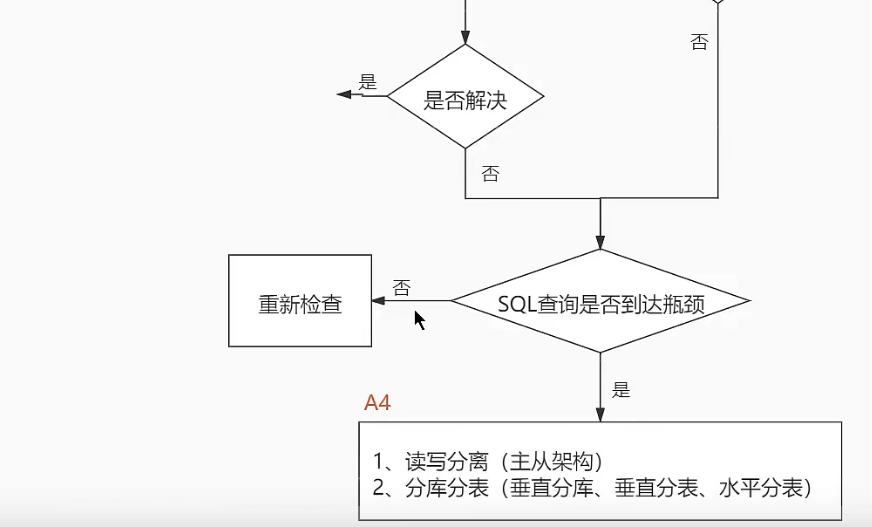


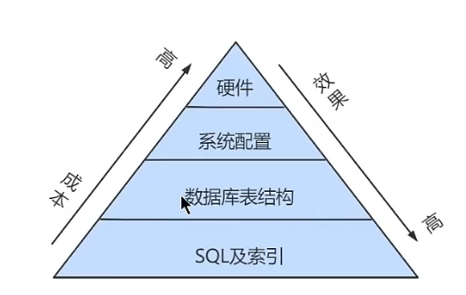


#### 13.9.6.1 查看系统性能参数


```sql
show [GLOBAL|SESSION] STATUS LIKE '参数';
```


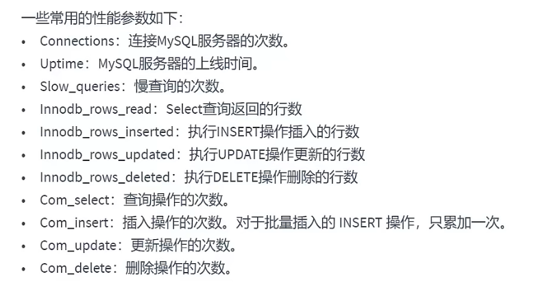

#### 13.9.6.2 `慢查询`日志

定位查询慢的`SQL` ，如果某一个SQL运行时间超过了 `阈值（long_query_time）` , 则认为是慢SQL。

阈值名 `long_query_time` ，默认值为10。


找出慢查询得作用：

```
帮助定位查询缓慢的SQL，进行针对的优化。
```


MYSQL默认不开启慢查询日志。


##### 13.9.6.2.1 开启慢查询

```mysql
show variables like '%slow_query_log%'; #查看慢查询日志


```


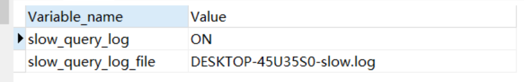


```mysql
SHOW VARIABLES LIKE '%long_query_time%';    #查看慢查询阈值 。单位秒
```

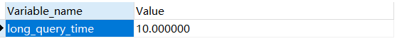


```
此时, long_query_time 没有使用 global 修饰，是会话级别的 session
同时也是临时变量。
如果想永久生效，需要修改mysql配置文件
```

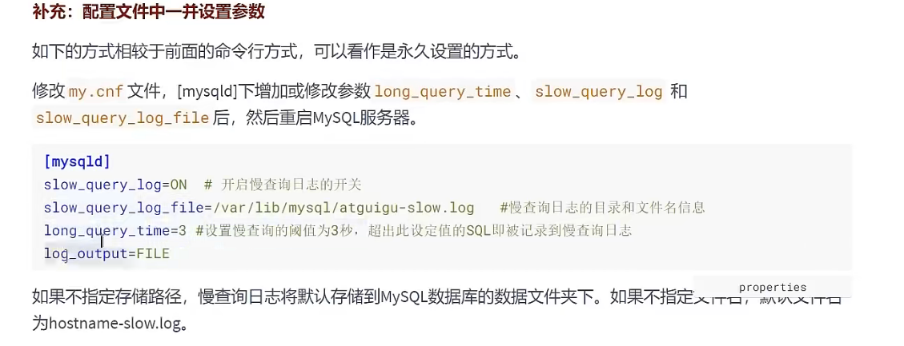


```mysql
SHOW GLOBAL STATUS LIKE '%Slow_queries%'  # 查询此时慢查询的次数
```

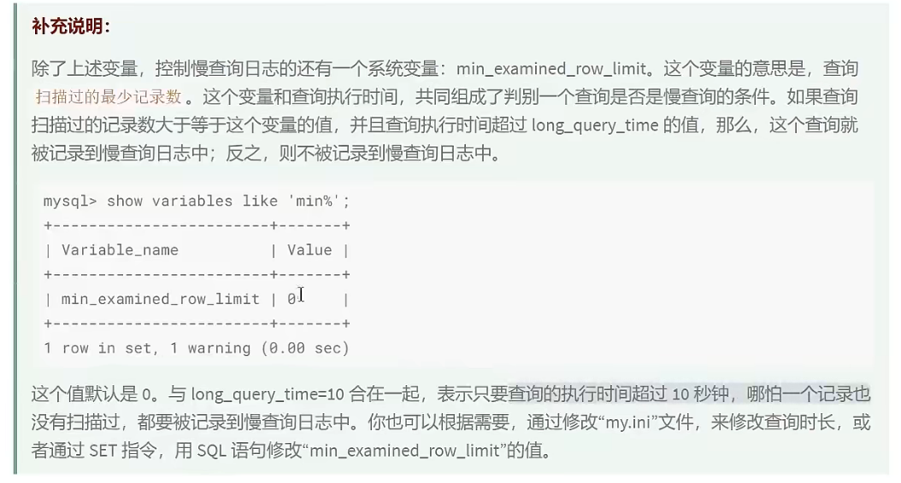


##### 13.9.6.2.2  慢查询日志分析工具

mysqldumpslow


#### 13.9.6.3  `explain`分析工具


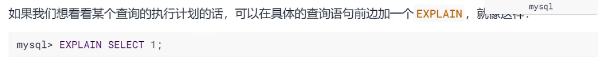


```
explain  分析工具的各个字段的含义：
```

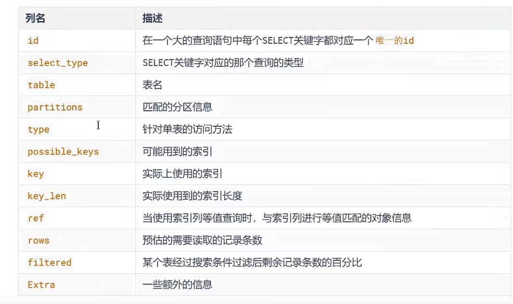


比较重要的几个参数：

```
id   一个Select关键字对应的一次查询，都拥有一个唯一ID

type  MySQL决定如何查找表中的行

key   本次查询实际用到的索引

rows  

Extra
```


##### 13.9.6.3.1 id 字段


#####  13.9.6.3.2 type 字段


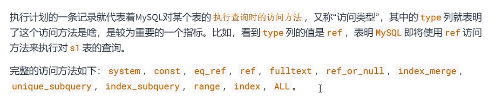


```
从前到后，效率由最高到最低。
```


一般来说，好的SQL查询至少需要达到 range级别，最好能达到ref级别。


###### const

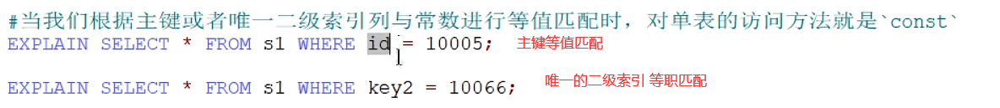

```
也就是说表示通过索引1次就找到了，意味着这个索引至少是唯一索引(包括主键索引)
(对于非唯一的索引来说,并不能保证达到唯一索引的效率，因为允许索引的字段有重复，最终筛选出来的记录不唯一)
此时 type的值为 const 
```


###### ref

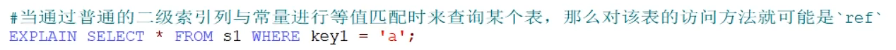

```
当使用一个普通索引的时候。type字段的值是 ref
这意味着通过索引,找到的行记录可能不唯一，有多条。需要进一步过滤
```


###### ref_or_null:


```
和ref几乎一样，只不过允许 普通索引的字段的值为 null
null记录由于无法排普通索引，这可能意味着如果允许字段的值为null以后，将会额外过滤非常多的字段。所以单列了一个 ref_or_null
```


###### index_merge:

直接翻译： 索引合并


例如如下查询：


`id` 为主键索引 ，`tenant_id` 为普通索引 

```mysql
explain select * from role where id = 1011 or tenant_id = 8888;
```

这种情况下 or 关键字 后面没有使用 主键索引，而是使用了普通索引。所以是 index_merge索引合并


类似的SQL查询示例：

```mysql
EXPLAIN
SELECT *
FROM orders A WHERE order_id= '10308' OR customer_id=2

#order_id 主键 customer_id普通索引
```

Explain部分截图

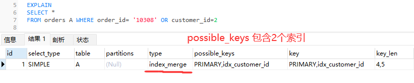

全部截图

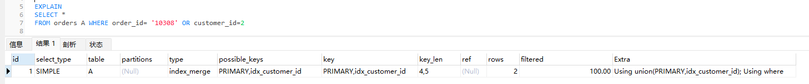


###### range:


```mysql
范围扫描通常出现在 in(), between ,> ,<, >= 等操作中。使用一个索引来检索给定范围的行。
```


###### index:


```
索引覆盖： 不用回表  

搜索的内容在一个二级索引中。不需要回表到聚簇索引查询额外的信息。

解释: 二级索引只保存索引字段和主键字段,是没有真实数据的data域的。(为了索引高效、节省空间)
所以如果搜索的字段是select *这种,那么在使用二级索引找到了目标记录的主键以后，不得不重新到聚簇索引找到完整的记录data域。

如果搜索的字段恰好包含在二级索引当中，比如恰好是二级索引的字段。就不需要回表操作。
```

此时存在的索引如下： 

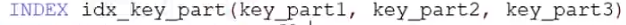


```
索引覆盖,但是需要扫面全部索引树的时候,为 type=index
```


###### all

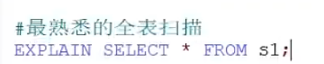


###### 各种等级之间的排序

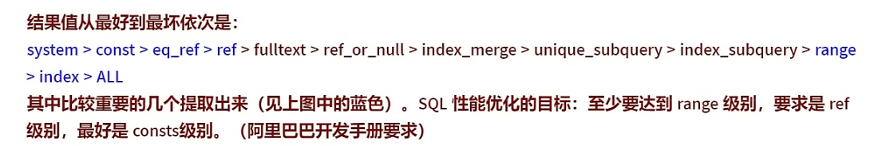


##### 13.9.6.3.3 possible_keys / key 字段


##### 13.9.6.3.4  key_len


```
key_len  主要针对于联合索引。
对于联合索引，使用的越多,越好。
```


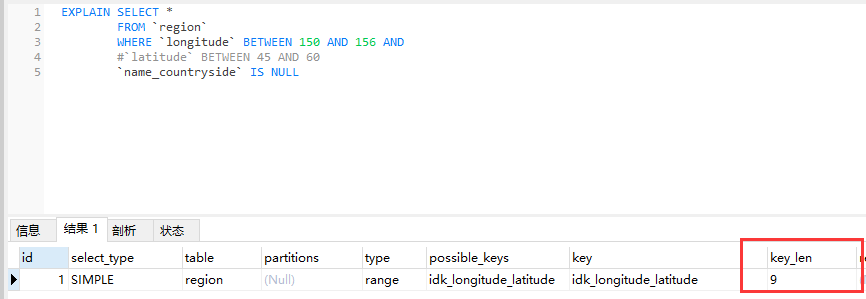


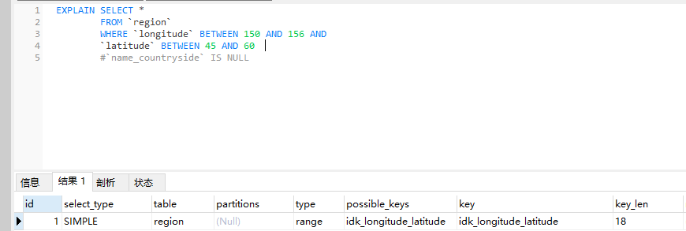


key_len的计算规则如下：

```
字符串
    char(n)：n字节长度
    varchar(n)：2字节存储字符串长度，如果是utf-8，则长度 3n + 2
    
    
数值类型
    tinyint：1字节
    smallint：2字节
    int：4字节
    bigint：8字节　　
    
    
    
时间类型　
    date：3字节
    timestamp：4字节
    datetime：8字节
    
    
如果字段允许为 NULL，需要1字节记录是否为 NULL
```


索引最大长度是768字节，当字符串过长时，mysql会做一个类似左前缀索引的处理，将前半部分的字符提取出来做索引。


##### 13.9.6.3.5  ref


```
id=19就是一个常数。
某个列: 在连接表的时候
```


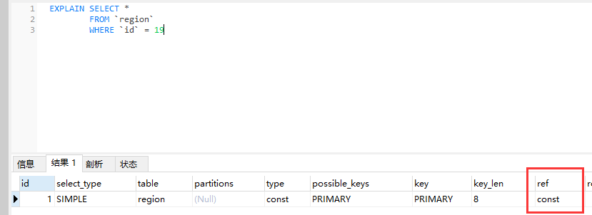


##### 13.9.6.3.6 rows


```
预估本次查询,需要读取 行记录的条数。 所以越小越好
```


##### 13.9.6.3.7 filtered:


```
越高越好。
```


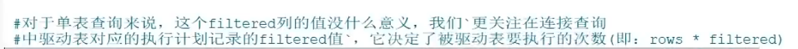


##### 13.9.6.3.8 extra


###### filesort

直译：文件排序。

```
当一些查询语句需要  group by 字段。

同时这个字段又没有索引,那么没办法了，只能把磁盘中的记录加载到内存中，然后排序。

显然这是一种比较糟糕的行为。当记录非常多，需要多次磁盘IO还需要排序，带来相当多的开销。
```

一句话总结，使用了group by/order by 同时,又没有使用索引。


###### No tables used


###### Impossible where


###### Using Where


```
全表扫描，没有索引
type :all  
extra : using where
```


```
使用索引，但不是等值判断

type: range  
extra : using where

由此判断, 不能光凭一个项判断整个查询。
```

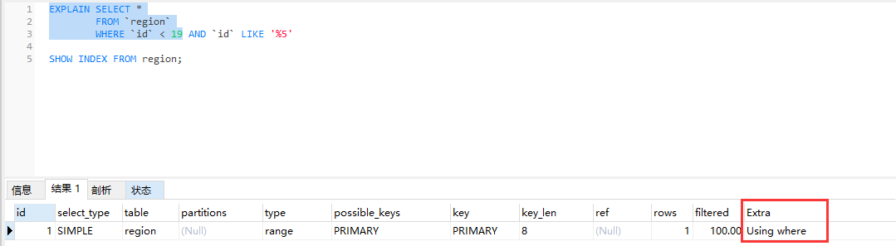


###### null


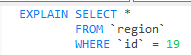


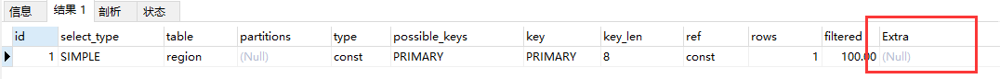


```
最普通的使用索引。
```


###### no matching max/min row


```
当使用Min/Max 聚合函数时，如入函数的row为空 且 搜索row的条件必须使用索引(不使用索引 即全表搜索提示使用useing where   type为all)
```


```mysql
EXPLAIN			SELECT Min(id)
				FROM `region`
				WHERE `id` = 1
				#使用主键索引
				#看到extra 是no mathcing row
				
			# WHERE `id_county` =1
				
				
```

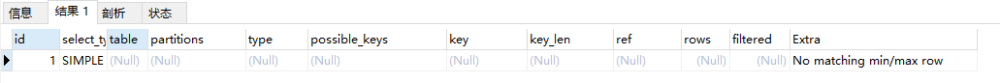


```mysql
EXPLAIN	SELECT Min(id)
				FROM `region`
				#WHERE `id` = 1
				WHERE `id_county` =1
		# 这个字段没有索引。是全表扫描  type : all   extra: using where 
```


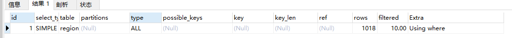


###### using index condition

索引下推：


```
上面这个例子  存在 key1上的索引。 key1是二级索引

搜索字段是select *  所以需要回表操作。 

正常逻辑是: 回表以后再判断 key1 like 。
优化器 : 二级索引包含了key1的全部信息，所以在找到了 >'z' 以后 直接进行Like判断，最后再回表操作。
显然这样免去了部分的回表操作。
```


例如如下搜索

```mysql
EXPLAIN			SELECT *
				FROM `region`
				WHERE `longitude` > 125.6 AND `longitude` LIKE '%5'
			#先条件下推，对符合>125.6条件的longitude 进行Like判断。
			#最后使用主键ID回表

```


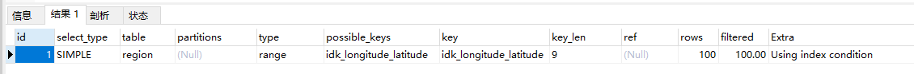


## 13.10   日志


```
日志是InnoDB存储引擎保证ACID的手段。也是InnoDB崩溃恢复的基础。
```


事务的隔离性由锁实现

原子性，一致性，持久性由  redo Log 和 Undo log 日志实现。


```
redo log 日志称为 重做日志
Undo log 日志称为 回滚日志 。 用于回滚行记录到固定版本。
```


```
redo log日志仅仅记录了一些修改的关键信息。     在指定页号，指定偏移量写入了什么数据。

mysql和磁盘交互最小单位是页，对于刷盘操作来讲有时修改了一个很小的数据，不得不刷新整个页。显然redo log日志更快，更小
```


```
undo log 回滚日志，记录了逻辑操作。 是每个操作的逆操作
当事务执行失败，需要回滚到之前的状态，可以通过Undo log回滚。
```


### 13.10.1 `redo log`

`redo log` 保证了持久性。


#### 13.10.1.1 为什么需要redo 日志

MySQL和磁盘交互的最小单位是 `页`, 一个页的大小固定是`16KB`。


有时这个`页`内仅仅改变了很少的数据，刷盘操作会将整个`页`刷新到磁盘上。很不划算，同时为了安全考虑也不能很久才刷新一次。


解决思路是：使用`redo log`日志

`redo log`仅仅保存了修改的【必要信息】。不包含页内其他信息 , 每次修改操作先刷新到磁盘上的`redo log`日志之内。

同时，数据库崩溃以后，可以从`redo log`日志中恢复。


#### 13.10.1.2`redo log`的好处


##### 13.10.1.2.1  `redo log`顺序写入磁盘

`redo log` 使用`顺序IO`写入磁盘，效率比`随机IO`快。


##### 13.10.1.2.1 在事务执行中 `redo log`不断的写入


在事务执行过程中，`redo log` 不断写入，刷盘，更安全。


```
redo log日志在整个事务执行过程中，不断的记录，刷盘。
```


#### 13.10.1.3 `redo log`组成

由`redo log buffer` 缓冲区， `redo log file` 磁盘文件 组成。


#### 13.10.1.4`redo log` 日志流程


#### 13.10.1.5 `redo log`刷盘策略


`redo log buffer` 并不能直接刷新到 `redo log file`文件中，

必须先刷入到文件系统缓存 `page chache`中 , 由操作系统决定具体的 刷盘时机。


`InnoDB`通过 `innodb_flush_log_at_trx_commit` 控制 刷新到磁盘策略。


也就是默认 `InnoDB`会通知OS，在事务结束时将`page cache`刷新到磁盘。


```
当值为1，在事务提交成功以后，就通知操作系统将page cache刷盘。 
如果执行事务期间宕机，部分日志丢失了，但事务没有提交，没有损失。
```


### 13.10.2  `undo` 日志


#### 13.10.2.1 如何理解undo日志


事务需要保证原子性。

```
undo log日志保证了原子性。
```


在事务中的操作，要么都完成，要么都不完成。有时事务执行到一半，遇到错误了需要回滚。

或者 正确调用回滚语句

```
由于undolog 日志存储了 更新操作的逆操作。所以可以用于数据回滚。
```


```
对于插入一条记录。那么需要记录一个删除操作。最少记录删除的对应的id

对于删除操作，需要记录插入操作，需要保存插入的全部信息。

对于修改操作，则需要保存相反的操作。
```


#### 13.10.2.2   undo日志的作用


##### 回滚数据

```
undo log 只能在逻辑上的回滚到数据库当初的状态。
但不能在物理上回滚，因为此时有可能有相当多的事务在并行运行。对物理磁盘的操作是不可逆的(比如数据页写满了)undolog不可能删除其他事务的数据。只能新开辟一个数据页恢复之前的数据。

但，在逻辑上，数据上，保证了数据库会恢复到之前的状态。
```


##### MVCC


#### 13.10.2.3  undolog的存储结构


undolog被设计为一个可以重用的。用链表串联起来。回收效率并不高，但保证了可以重用页。


#### 13.10.2.3  undo的类型


##### insert类型


```
insert类型的undo 只对本事务可见。 对其他事务不可见(隔离性要求)。在事务提交以后，可以直接删除这个undolog。
```


##### update 类型

```
对应的是 update 和delete操作产生的undo log。 用于提供MVCC机制，事务提交后不能马上删除。要放入undo log链表中，等待
purge 线程进行最后的清除。
```


#### 13.10.2.4 隐藏字段


在InnoDB存储引擎中。每一条行记录，都存在几个隐藏字段。

```
DB_ROW_ID    : 当表结构中没有设置主键。又没有 非空的唯一索引，则InnoDB会自动添加 DB_ROW_ID 字段作为隐藏主键。
DB_TRX_ID    :  每个事务会分配一个唯一自增的事务ID, trx_id 写入最后一次更改本记录的事务id
DB_ROLL_PTR  ： 回滚指针，指向undo log日志的指针
```


### 13.10.3  `bin log`

### 13.13.2  `bin log` 日志


bin log 日志也称  `二进制 日志`   用于 

```
数据恢复   数据库崩溃数据恢复
数据复制   数据库主从复制
```


#### 13.13.2.1 命令与参数


查看 binlog 日志是否开启

```
show variables like '%log_bin%';
```


修改my.cnf   或者 my.ini  文件可以设置 bin log日志相关参数

```
[mysqld]
log-bin=abc-bin                              #等同于替换log_bin_basename
binlog_expire_logs_seconds=60000             #bin log最大生存时间
max_binlog_size=200M                         #控制单个binlog文件大小，当单个文件超过此值，切换下一个文件
```


#### 13.13.2.2 查看日志


查看当前 binlog 日志统计情况

```
show binay logs
```


​	


使用`mysqlbinlog` 工具查看某个具体的Binlog文件。

```
mysqlbinlog -v "/var/lib/mysql/abc-bin.000001"
```


```
mysqlbinlog 是 二进制文件，无法直接读懂其中的内容。
使用 -v 参数会将2进制内容解读出来。
使用 --base64-output=DECODE-ROWS  不显式binlog语句
```


````
binlog 文件的组成单位是 `event` 事件
````

event 包含以下内容：


```
mysql提供了语句，查看指定binlog文件内包含的事件

show binlog events in 'abc-bin.000001'; 
```


同时支持，从某一个pos开始读取事件  

```
show binlog events in 'abc-bin.000001' from 468
```


也支持 `limit`  关键字


##### 13.13.2.2.1 bin log 的格式


bin log 有3种格式：

```
ROW                记录原始数据变更。 binlog文件体量最大，最安全
Statement          记录SQL语句    binlog文件体量最小，最不安全。例如和事件相关的函数都会出现数据不一致问题
Mixed              混合模式    
```


#### 13.13.2.3  bin log 删除


```
自动删除是根据 过期时间。
```


```
purge master logs before '20220707'
```


#### 13.13.2.4   binlog 写入机制


```
binlog 日志会先写入 MYSQL中的 binlog buffer。 根据策略，刷新到OS中的文件Buffer。

由OS决定何时刷到本地磁盘。
```


```
sync_binlog=1
```


## 13.11  锁


事务的隔离性由 `锁` 来实现。


### 13.11.1  并发问题解决方案


#### 13.11.1.1 方案一

读操作使用`MVCC`,  写操作加 `锁` 。

```
MVCC 会生成一个ReadView 。 readView 只会看到已经提交了的事务的结果。


在 read committed 隔离级别下。每次select都会产生一个新的ReadView


在repeatable read 隔离级别，只会生成一次ReadView，后续操作都会使用同一个ReadView不会发生 "不可重复读"，"幻读"的问题
```


#### 13.11.1.2 方案二

读写都加锁。在一些条件苛刻，不允许读到旧数据的场景。读写操作都需要加锁。保证每次读到的数据总是最新的。


总结

```
MVCC使用类似乐观锁的方式， 让 读-写操作彼此不冲突，增加了并发性能。
```


### 13.11.2 锁的分类


#### 13.11.2.1 从操作数据类型分

`共享锁` (shared lock )  S锁

`排他锁` (Exclusive)  X锁

```
由于读锁之间可以共享，所以S锁也称为读锁。
写锁不能共享，X锁也称为写锁。
```


InnoDB支持行级，表级的读锁和写锁。


写操作：(写操作无非有3种   delete   update insert )

```
如果是Delete 则只需要获得这条记录的X锁。然后标记为 delete mark

update 操作又细分几种情况。

1.未修改主键值，并且被更新列所占存储空间没有发生变化： 则为获得这条记录的X锁。
2.未修改主键值，并且所占存储空间发生变化。则获得这条记录的X锁，并删除。再插入一条新的记录。新插入的记录由 “隐式锁”加以保护。未提交时不会被其他人看到。

3.修改主键值。相当于删除旧记录，插入新纪录。 删除的时候加上X锁，插入加入隐式锁


insert操作: 
只由隐式锁保护不被其他人看见。

```


#### 13.11.2.2 数据的粒度区分


通常情况下，锁的粒度越小，并发性越好。但管理锁耗费的资源就越多。


##### `表锁`

锁住整张表。开销很小，没有死锁问题。并发很差。


表级别的 `X锁`，`S锁`。


```
只有InnoDB支持行级锁。
```

对整张表进行DDL操作的时候，才会使用表级锁。此时会对其他的Select update delete 会阻塞

```
drop table,alter table
```


##### `意向锁intention lock`

意向锁是【表级别】的锁。


意向锁是做什么的？

```
意向锁是协调表级锁和行级锁的。当某一个事务想获得表级别的X锁的时候，必须要求此时没有任何的行级X锁或者S锁。那么就需要一行一行遍历记录，保证没有任何一个行锁。这是一个耗时的操作。

那么，每当有任意一条行锁被加上了S锁，就自动为这张表加上一个对应的  意向S锁(IS)锁，表明这样表的某一行记录存在行级S锁。想要获得表级别的X锁的事务只需要等待即可。

同样的，当任意一条记录被加上了X锁，就会自动的为这张表加上一个意向X锁(IX锁)。
```


意向锁的互斥性：


```
意向锁之间可以共存。
```


##### `行锁`

在MySQL的存储引擎中，仅有`InnoDB`支持行锁。


行锁根据功能不同，分为 `记录锁` `间隙锁` `临键锁`


###### 记录锁  record Lock

仅仅锁住一条记录。存在 记录X锁和记录S锁


###### 间隙锁 gap lock


可以使用加锁的方式解决幻读问题。但不存在的记录，如何为其加上记录锁？所以InnoDB提出了一种间隙锁。用于锁住一段儿记录区间。


```
在 id  3-8之间使用间隙锁，不允许其他线程插入。
```


###### 临键锁 

```
记录锁+间隙锁。   锁住记录和其中的区间
```


###### 插入意向锁


#### 13.11.2.3  页锁


```
锁升级
```


A 开启事务以后，进行多次查询。

开启事务 a1,    a2, a3,a4      A’


B 事务对表内的数据进行修改

b1 , b2 ,b3 


## 13.12   MVCC

````
MVCC 多版本并发控制。可以在 可重复读的隔离级别下 解决幻读问题。

提高了事务之间并发能力。
````


`MVCC` 依赖于   [隐藏字段](# 13.10.2.4 隐藏字段) ， `undo log日志`， `ReadView`


隐藏字段包括 :

```
DB_ROW_ID    : 当没有主键时，自动分配。
DB_TRX_ID    :  最后一次更改本记录的事务id
DB_ROLL_PTR  ： 回滚指针，指向undo log日志的指针
```


```
在MVCC中，读一行数据其实是在读一行数据的ReadView. 也就是历史快照版本。
```


InnoDB存储引擎中,所有的事务，都有一个唯一的，递增的事务ID。这个事务ID在整个MVCC的过程中起到了重要的作用。


### 13.12.1   快照读/当前读

MVCC用于提高数据库事务的并发能力，更高的解决  读-写冲突问题。

```
读 指快照读。
写 指当前读。
```

当前读实际上是一种加锁的操作，保证了数据库内的数据的强一致性,是悲观锁。


#### `当前读`

通过加锁的方式，保证了其他任何事务无法修改当前的记录。

这意味着读到的状态永远是当前的最新状态，保证了数据的强一致性。


#### `快照读`

又称之为一致性读, 也就是`ReadView` , 快照读并不能保证数据的强一致性，有可能读到的数据不是最新版本。

是之前的历史版本。


### 13.12.1  `ReadView`


ReadView需要针对不同的隔离级别讨论：


对于  `读未提交`  ： 每次读不需要考虑其他事务是否提交，所以不用生成ReadView每次只是读数据库中最新的数据即可。会产生脏读问题。


对于`读已提交`:   只要是其他事务已经提交了，就可以读到。不考虑任何的可重复读，幻读问题。那么每次Select的时候都可以生成一个ReadView，这个ReadView中的数据仅仅来自于已经提交的事务。(根据某条记录的历史版本，过滤到当前正在活跃事务做出的修改。读取已经提交事务的版本)


对于`可重复读`： 只需要在第一次Select的时候生成一次Readview。后续无论其他事务做了什么修改。都使用第一次生成的ReadView，这样直接可以避免 “不可重复读” “幻读的问题”


对于`串行化`: 无论任何操作都会加锁，保证当前只有1个事务正在进行，无需使用MVCC


#### 13.12.1.1 ReadView 内的重要属性


`ReadView`这个数据结构，内部有一些重要的属性。

```
creator_trx_id : 创建这个ReadView的ID

trx_ids[] : 记录创建ReadView时当前所有活跃的事务id

up_limit_id : 记录了活跃事务的最小id

low_limit_id: 记录活跃事务的最大id
```


```
每一个事务的id都是递增的，独一无二的。
```


#### 13.12.1.2   ReadView的规则

ReadView在审历 每一条记录时，根据行记录的trx_id字段。进行判别。


```
如果trx_id和ReadView 中 creator_trx_id 相同，说明是自己做的修改。可以被当前ReadView访问。


如果trx_id比 up_limit_id还要小。说明这条记录的修改在当前事务开始前已经提交。可以访问。


如果trx_id比 creator_trx_id 或者 low_limit_id还要大，说明是在ReadView生成后创建的事务，不可以访问，需要根据 回滚指针找到历史版本。

如果trx_id在 low 和 up之间。则需要进一步判断：

如果在 trx_ids 内，则证明是当前活跃的事务，不应该被访问。使用历史版本

如果不在  trx_ids内，则证明是已经提交的事务，可以被访问。
```


##### 思考：

为什么会出现 字段的trx_id> creator_trx_id 情况？

ReadView是懒加载。

```
生成ReadView时，应当使用锁，保证当前事务数量和id是强一致性的。

同时由于ReadView是懒加载，很有可能出现 trx_id 大于 creator_trx_id的情况。晚于本事务开启的事务做出的数据更改直接不可访问，通过undo log日志找到历史版本即可。
```


是否有 undo log日志找到最后发现，最旧的历史版本也比当前事务新 这种情况呢?

```
答案是肯定的:
因为存在隐式锁,当前ReadView无法访问这样的行记录，但如果事务一旦提交，隐式锁释放以后。其他的事务可以读到这条行记录，发现版本很新，根据undo log日志发现没有历史版本，则判定为这条行数据不可见。
```


```
前文提到：  undolog 日志分为2种。
其1是insert undo 当事务提交以后直接就可以丢弃删除。(由隐式锁保证不会被其他ReadView读到)
其2是update undo 当事务提交以后，仍不能被立刻删除。原因就是用于MVCC中恢复历史版本。

那么，什么时候可以被purge线程回收? 当此次update undo 的trx_id 比up_limit_id还小，就可以回收了。

因为up_limit_id> trx_id 时说明,所有事务都是在此次事务以后开启的。所有人均能看到这个版本的修改。没有人需要恢复到更久的历史版本了，就可以删除了
```


#### 13.12.1.3 流程


## 13.13  日志 


### 13.13.1 日志种类


```
慢查询
```


# 14. 补充


##  14.1Mysql 开发规范

参考 https://zhuanlan.zhihu.com/p/296220034


## 14.2 查询当前数据库启动的事务

查询当前数据库启动的事务

```mysql
select * from information_schema.innodb_trx;
```


## 14.3 关于MVCC和串行化的思考

对于MySQL数据库来说,存在四种隔离级别：

```
读未提交，
读已提交，
可重复读，
串行化。
```

MVCC能解决”脏读“ ,"幻读" , "不可重复读" 的问题，那么为何还需要串行化呢？

MVCC真的能完全解决所有场景下的 ”脏读，幻读，不可重复读“问题么？

```
显然不是，MVCC是借助快照读的方式避免了 朴素场景下的脏读幻读不可重复读问题。
(朴素的脏读,读到了其他事务做出的修改，但其他事务回滚了数据)
(朴素的幻读,一次事务中，两次查询，后一次查询多了数据或少了数据)
(不可重复读，一个事务读同一条记录,由于其他事务修改了记录，导致2次结果不一样。)


MySQL生成 ReadView逻辑是，在当前事务开始以后的事务都不可见, "后发生事务"做出的修改都会被 undolog日志回滚至当前事务可见状态，
这意味着MVCC并不阻止其他人修改表内数据。
仅仅只能解决朴素场景下, "读出数据的幻读，脏读,不可重复读"问题。

例如,当有如下场景: 向表内插入一条行数据A之前，需要验证表内一些数据是否存在B数据。且这个操作不能简单的使用一个SQL化简(例如需要保存日志,维护一些非MySQL的其他中间件操作)，此时仅仅使用事务(MVCC)并不能导致脏数据问题。因为很容易出现事务1使用快照验证B数据存在，插入数据A之前，其他事务2删除了数据B,而事务1并不知道，且事务1没有发生任何异常回滚,正常插入了数据A,那么此时表内的数据就是错误的。

解决办法就是使用锁,保证验证数据A和插入数据B必须是一个原子操作。
```


也就是仅仅使用MVCC而不使用锁，需要检查一个事务中的多步操作，是否依赖于表内最新数据。如果不依赖，则可以使用旧数据(快照)

如果依赖于最新数据，那么则不能使用旧数据(即使并不会发生朴素的 脏读幻读不可重复读)的问题。


### 14.3.1 总结

总结一下就是，在进行  [验证+操作]的问题时，要格外的小心快照读，带来的问题。如果业务上不允许使用快照读，那么MVCC的事务也会带来并发问题。


## 14.4  多表Join应该怎么做


对于 `MYSQL` 通常我们不希望 3表及以上 join .

### 14.4.1 不希望3表以上JOIN的原因


```
1.  MySQL 多表关联性能差
2. 对于微服务场景下，分库分表无法进行JOIN （如果已经使JOIN，不利于后续分库分表。）
3. 数据量大，join临时表会很大
```


解决方案

```
1. 拆成多条SQL
2. 数据库层面的冗余表。
3. 定时对多个表进行数据清洗，形成一个涉及多个表重点数据的冗余表
```


`oracle` 多表关联性能比MySQL好很多。


MySQL多表关联性能差的原因：

```
旧版MySQL表关联使用的是  loop join 循环join，效率是O(mn)
新版MySQL表关联使用的是  hash join ,效率是o(n)
```


### 14.4.2  解决方案


#### 14.4.2.1 方案1 多步SQL查询

分多次SQL查询（通过多次查询，在内存中组装数据）：


```
将A表查询结果查出， 在B表中限制 Aid在第一次的查询结果。 在C表中限制Aid,Bid。
```


是临时的解决方案

```
1.适用于A查出的数据量小的情况 （如果A表查出的Aid非常多）

2. 只适用于inner join （如果出现，left join的情况：1个表有数据，另一个表没数据）
```


#### 14.4.2.2 方案2 反范式表

`反范式表`， 也称 `宽表`。也就是新建一个涉及多个关联表的重点数据的冗余表。

在对各个范式表进行 `insert/update/delete` 操作的同时，必须要同时对`反范式表`进行相同的操作。

在进行关联查询的时候，从反范式表中查询。


实际上类似于`物化视图`(多表查询的快照，需要定期更新) ，`普通视图`只是简单的查询代理，不实际存储查询后的数据。


#### 14.4.2.3 方案3 数据仓库/数据集市


### 14.4.3 多表关联，分页查询的场景

多条件查询 ，每张表有不同的字段作为查询。 

```
1.数据量不大，可以MySQL + 索引 +冗余字段 优化。
2.如果数据量大，使用ES
```


## 14.5  是否使用存储过程？


### 14.5.1 使用存储过程的缺点

存储过程难以调试和扩展，更没有移植性。

