Spring参考文档目录：

https://docs.spring.io/spring-framework/docs/current/reference/html/


`Spring` 项目提供了一个管理`Bean`的容器，也称为`Spring`容器。

`Spring`容器提供了2个主要的功能点： [IOC](# 1. `IOC`)   `AOP`。 


# 1. `IOC`


`IOC` ： 依赖控制反转，也称【依赖注入】。

在创建项目时，开发者无需关心各种`Bean`的创建过程，只需要按照需求定义好`Bean`的依赖关系，`Spring`容器可以帮助我们创建所有`Bean`，并提供给开发者使用。


## 1.1 属性注入

`Spring` 通过给 【管理的Bean】 注入属性，来让`Bean`具有完整的行为。


tips:

```
1.一个Bean的正常运行通常需要依赖于其内部的成员变量。 
2.如果成员变量是又是托管在Spring的另一个Bean，那么Spring将会帮助注入这些Bean。 最终保证Bean的正常运行。
```


### 1.1.1 基于xml的管理`bean`

注入`bean` 的属性有多种办法，例如 `setter`方法，`构造方法`构造等。 Spring允许我们定制一个Bean到底使用哪种方式构造。


#### 1.1.1.1 setter


```xml
	<!--bean 标签表示是一个 Bean对象 -->
	<!-- id表示当前Bean在Spring容器中的唯一标识 -->
	<!-- class属性表示这个Bean对应的类 -->
	<bean id="person" class="com.test.helloworld.Person">
        <!--property 标签表示定义Bean中的成员变量 -->
        <!--name表示成员变量的名, value表示对应值，是可选的 -->
		<property  name="name" value="小明"></property>
		<property  name="age" value="20"></property>
        <!--ref属性是可选的，表示引用另一个Bean -->
        <property  name="car" ref="car1"></property>
	</bean>


    <bean id="car1" class="com.test.helloworld.Car">
            <property name="brand" value="BMW"></property>
            <property name="price" value="350000"></property>
    </bean>
```


#### 1.1.1.2 有参构造注入属性


```xml
    <bean id="person" class="com.test.helloworld.Person">
        <!--constructor-arg 标签表示参数构造 -->
        <constructor-arg value="小王"></constructor-arg>
        <constructor-arg value="18"></constructor-arg>
        <constructor-arg ref="car1"></constructor-arg>
    </bean>


    <bean id="car1" class="com.test.helloworld.Car">
        <property name="brand" value="BMW"></property>
        <property name="price" value="350000"></property>
    </bean>
```

通过`<constructor-arg></constructor-arg>`标签 ，来构造器构造。


使用index索引值来为指定成员属性赋值。


```xml
	<!-- 使用index指定 构造方法中值得索引位置 -->
	<!-- type属性指定 对应的参数类型-->
	<bean id="person" class="com.test.helloworld.Person">
        <constructor-arg value="18" index="0" type="java.lang.Integer"/>
        <constructor-arg value="小王" index="1" type="java.lang.String"/>
        <constructor-arg ref="car1" index="3" />
    </bean>

    <bean id="car1" class="com.test.helloworld.Car">
        <property name="brand" value="BMW"></property>
        <property name="price" value="350000"></property>
    </bean>
```

为反射里拿到类的属性的时候，顺序是固定的，都是按照`.java`文件定义顺序的。


#### 1.1.1.3 注入null值


使用 `<null/>`标签，为属性注入空值。


#### 1.1.1.6 注入 集合属性


分别使用 `<array></array>` `<list></list>` `<set></set>`  注入数组，list列表，set集合


 `<value></value>` 标签用于注入 具体元素的值.

```xml
    <!-- array 注入数组-->
	<property name="property_name">
        <array>
            <!--value标签 表示对应的值 -->
            <!--标签内传入对应的值 -->
            <value>1</value>
            <value>2</value>
            <value>3</value>
                  ...
        </array>
    </property>


    <property name="property_name">
        <list>
            <value>1</value>
            <value>2</value>
            <value>3</value>
                  ...
        </list>
    </property>


    <property name="property_name">
        <set>
            <value>1</value>
            <value>2</value>
            <value>3</value>
                  ...
        </set>
    </property>
```


#### 1.1.1.7  注入Map  

使用`<Map>` 表示 映射Map.

使用 `<entry></entry>` 表示对应一个实体

```xml
<property name="property_name">
    <map>
        <!-- key属性表示   map的key -->
        <!-- value属性表示 map的value-->
        <entry key="key1" value="value1"></entry>
        <entry key="key2" value="value2"></entry>
        <entry key="key3" value="value2"></entry>
    </map>
</property>
```


### 1.1.2 一些案例

#### 1.1.2.1 `<util>`标签

`<util></util>`标签可以把 `list`,`map`,`set`等jdk自带集合 抽象等价成一个bean。可以被我们的javabean引用ref=""

被util的集合也视作一个bean，可以被实例化

```java
@Test
public void tset1() {
    ApplicationContext context = new ClassPathXmlApplicationContext("ApplicationContext.xml");
    ArrayList list_books1 = context.getBean("list_books1", ArrayList.class);
    System.out.println(list_books1);
}
```

```xml
<util:list id="list_books1" scope="singleton">
    <ref bean="book1"/>
    <ref bean="book2"/>
</util:list>

<bean class="pojo.Book" id="book1">
    <property name="name" value="高数"/>
    <property name="price" value="5.2"/>
</bean>
<bean class="pojo.Book" id="book2">
    <property name="name" value="概统"/>
    <property name="price" value="7.2"/>
</bean>
```

运行结果


下面一个使用<util>的例子：


Person类的结构如下

人名name,年龄age, 拥有一只狗dog,拥有一堆书List<book>books

Dog类结构如下


 只有名字name


Book类结构如下

  拥有多个属性，名字name ，价格price


xml里的配置信息如下


可以看到：Dog类的属性 dog 使用了内部bean的方式进行配置的


person类中比较复杂的属性  books 是List<book> 类型的  （List<T>类型）

这里使用了**ref引用外部bean的方法配置**的


**那么显然，可以使用内部bean，嵌套实现：**


那么我们从IOC容器中取出javabean输出一下看看

```java
//main
...
ApplicationContext context = new ClassPathXmlApplicationContext("Application.xml");
Person person_a=(Person)context.getBean("person_a");
System.out.println(person_a);
Person person_b =(Person)context.getBean("person_b");
System.out.println(person_b);
...
    
    
    
    
```


那么现在有一个问题，当前的List<book> books 并不能给其他bean使用，如果我想把List<book>抽取出来，给多个bean使用呢

答案就是使用  util 标签

首先引入util xml约束

```xml
xmlns:util="http://www.springframework.org/schema/util"
xsi:schemaLocation="http://www.springframework.org/schema/util
https://www.springframework.org/schema/util/spring-util.xsd"
```


可以看到 抽取list map set等

那么我们来实际配置一下

```xml
    <bean class="pojo.Book" id="book1">
        <property name="name" value="高数"/>
        <property name="price" value="5.2"/>
    </bean>
    <bean class="pojo.Book" id="book2">
        <property name="name" value="概统"/>
        <property name="price" value="7.2"/>
    </bean>

    <util:list id="list_books1">
        <ref bean="book1"/>
        <ref bean="book2"/>
    </util:list>

    <bean id="person_c" class="pojo.Person">
        <property name="name" value="梦想"/>
        <property name="age" value="24"/>
        <property name="dog">
            <bean  class="pojo.Dog">
                <property name="name" value="黄"/>
            </bean>
        </property>
        <property name="books" ref="list_books1"/>
    </bean>

```


## 1.2.自动装配

自动装配也就是Bean实例化以后，属性的自动注入。这个功能是IOC容器的核心功能之一。

自动装配可以通过xml配置，也可以通过注解配置。


### 2.1.1 基于xml的自动装配  

通过 bean标签里的   autowire=“” 属性

#### 案例： autowire="byName"

```xml
<bean id="person" class="pojo.Person" autowire="byName">
    <property name="age" value="24"/>
    <property name="name" value="水星"/>
</bean>
<bean id="dog" class="pojo.Dog">
    <property name="name" value="小鱼干"/>
</bean>
<util:list id="books" value-type="pojo.Book">
    <bean class="pojo.Book">
        <property name="name" value="毛概"/>
        <property name="price" value="998"/>
    </bean>
    <bean class="pojo.Book">
        <property name="name" value="马原"/>
        <property name="price" value="366"/>
    </bean>
</util:list>
```

可以看到util标签依然能够被视为bean，同时被byName自动装配


person类里的属性名  dog和books


与xml里的 bean  id相匹配


#### 同理 byType 则是根据 类型匹配

如果用一个类有多个bean则会报错 ，适用性不高


### 2.1.2 基于注解 装配  bean


@Component

@Service

@Controller

@Repository

#### 如何使用？

​	1.引入依赖


```xml
<dependency>
    <groupId>org.springframework</groupId>
    <artifactId>spring-webmvc</artifactId>
    <version>5.2.0.RELEASE</version>
</dependency>
<dependency>
    <groupId>org.aspectj</groupId>
    <artifactId>aspectjweaver</artifactId>
    <version>1.9.4</version>
</dependency>
```

​	2.引入xml约束

```xml
<beans	xmlns:context="http://www.springframework.org/schema/context"
		xsi:schemaLocation="http://www.springframework.org/schema/context
        https://www.springframework.org/schema/context/spring-context.xsd">

</beans>
```


​	3.在xml中开启组件扫描


```xml
<context:component-scan base-package=""/>
```

​    4.在对应类上加注解	


```java
@Component(value = "userService")
public class UserService {
    public void add() {
        System.out.println("Service add ...");
    }
}

```

测试代码：

```java
@Test
public void test() {
    ClassPathXmlApplicationContext context = new ClassPathXmlApplicationContext("ApplicationContext.xml");
    UserService userService = context.getBean("userService", UserService.class);
    userService.add();
}
```


结果


#### 开启扫描的一些细节

##### 1.我们可以对扫描的包进行**过滤**

下面来看如何过滤

**<context:component-scan >标签下，use-default-filters="" 属性**

use-default-filters="true"  //使用默认过滤器

use-default-filters="false"  // 不使用默认过滤器


<context:component-scan >标签下的子标签

<context:include-filter > 包含过滤器//被过滤器包含的，都将被扫描


过滤器作用类型  type

显然除了能过滤 注解 Annotation，还能过滤很多


后面就是注解的全限定名


连在一起就是 ，只扫描DAO包下的 @Controller 注解


另一种用法


```xml
<context:component-scan base-package="DAO" use-default-filters="true">
    <context:exclude-filter type="annotation" expression="org.springframework.stereotype.Controller"/>
```

除了@Controller都扫描


### 2.2.3 基于注解 `依赖注入`


#### 2.2.1.1 `@Autowired`

无需`setter`方法，`Spring`容器通过反射注入。

配合`@Qualifier(value = "") ` 可以指定注入`bean`名字为`value`的`bean`。

```java
@Autowired
@Qualifier(value = "book2")
private Book book;
```


#### 2.2.2.1 `@Resource`

这个注解可以通过`byName`和 `byType` 两种方式注入`Bean`。


##### 2.2.2.1.1 byType


如下接口：

```java
public interface UserDAO {
    public void add();
}
```

实现类:

```java
@Repository
public class UserDAOImpl implements UserDAO{
    @Override
    public void add() {
        System.out.println("user add...");
    }
}
```


```java
@Service(value = "userService") //证明是一个服务，会被Spring自动创建为Bean，默认BeanName为 首字母小写的类名：userService
public class UserService {
    
	@Resource  //自动注入
    private UserDAO userDAO;
    
    public void setUserDAO(UserDAO userDAO) {
        this.userDAO = userDAO;
    }

    public void add() {
        System.out.println("Service add ...");
        userDAO.add();
    }
}
```


如果是`xml` , 则需要配置文件 开启【包扫描】

```xml
...
    <context:component-scan base-package="DAO" use-default-filters="true"></context:component-scan>
    <context:component-scan base-package="Service"></context:component-scan>
...
```


##### 2.2.2.1.2 byName

在`Resource`注解中的`value`填写对应`bean`的名字即可


```java
@Service(value = "userService") 
public class UserService {
    
	@Resource(value="myBean")  //自动注入
    private UserDAO userDAO;
    
    public void setUserDAO(UserDAO userDAO) {
        this.userDAO = userDAO;
    }

    public void add() {
        System.out.println("Service add ...");
        userDAO.add();
    }
}
```


### 2.2.4 常用注解

##### 2.2.4.1 `@Autowired`   

`@Qualifier(value = "")`   

 //配合Autowired ，完成byName注入。


##### 2.2.4.2 `@Resource` 

​    // 通过byName  或者byType 的方法，完成 引用注入


##### 2.2.4.3 `@Component`

 表示【被标注的类】为一个【组件】 ，Spring会创建一个对应类型的`Bean`

```java
public @interface Component {
	/**
	 *  value就是组件名。也就是bean的名字，你可以通过 这个value从 IOC容器中拿到这个bean
	 */
	String value() default "";

}
```


##### 2.2.4.4 `@Value()`


`@Value`是一个强大的注解，支持 `EL`表达式 ， 可以从`properties`中取得对应的值注入到属性中。


#### 2.2.4.5 `@Configuration`

表示 【被标注的类】是一个配置类，用于容器初始化的配置操作，会被优先加载。`Spring`容器也会创建一个对应的`bean`


例如：

```java
@Configuration
public class RedisConfig{

    @Bean
    public RedisTemplate myTemplate(){
        ...
        return ...
    }
}
```


## 1.3 MVC三层结构

`Java`多用于`Web`开发。 `Web`开发已经形成了`MVC`三层【开发范式】。其中`MVC`三层具体如下：


### 1.3.1 `controller`

`controller`层，用于处理`user agent`的请求，找到对应的 `handler`调用并返回结果(可以是一个页面，也可以是一个`Restful`风格的结果)。 对应注解`@Controller`


### 1.3.2 `service`

`service` 层，主要的业务逻辑层，Java代码逻辑主要在这一层实现。对应注解`@Service`


### 1.3.3 `DAO`

`DAO`层，用于和数据库交互的层。对应注解：`@Mapper`


## 1.4 bean的生命周期


Spring官方在 BeanFactory中的注释


### 3.1 bean的作用域 

spring5中有6中Bean的作用域：


```
任意的IOC容器都可以使用  singleton 和  prototype

其余的4中都必须在Web ApplicationContext中实现。否则会抛出异常
```


#### 3.1.1修改单例/多例模式


使用bean标签里的 scope属性修改

singleton   单实例对象

prototype  多实例对象

```java
/**
 * scope="prototype" 多实例
 * 用同一个bean的不同实例对象，hashCode结果不一样
 */
Book book1 = context.getBean("book1", Book.class);
System.out.println(book1.hashCode());//1356728614
Book book1_a = context.getBean("book1", Book.class);
System.out.println(book1_a.hashCode());//611563982
```

#### 3.1.2   singleton   与 prototype  区别


#### 3.1.3 request  ,session


scope 还有2个值

request   每次创建bean的时候，都把他setAtt进request

session  每次创建bean的时候，都把他setAtt进session


### 3.2 bean的生命周期


在IOC容器中 bean有5个生命周期。

```
1.  bean的实例化

2.  bean属性赋值  //这个过程执行完毕，属性已经注入完成。

3.  beand初始化  //初始化阶段主要用于完成bean的各项初始化功能，例如对一个bean进行扩展，就在这个阶段完成。因为此时bean属性已经注				//入完毕，通常具备了额外扩展的能力

4.  bean使用  //此时,bean已经注入了属性,完成了初始化阶段。可以正常使用

5.  bean销毁
```


#### 3.2.1  详细流程


其中对于定制Bean，重要的是

```
BeanPostProcessor 接口
```


##### BeanPostProcessor接口

这个接口的作用：

```
作用是在Bean对象在实例化和依赖注入完毕后，在显示调用初始化方法的前后添加我们自己的逻辑。
```


下面给出一个使用示例

```java
@Slf4j
public class MySpringBeanPostProcessor implements BeanPostProcessor {
    @Override
    public Object postProcessBeforeInitialization(Object bean, String beanName) throws BeansException {
        //这里是前置postProcessor
        if (bean.getClass().isAnnotationPresent(MyTestAnnotation.class)){
            MyTestAnnotation annotation = bean.getClass().getAnnotation(MyTestAnnotation.class);
            String version = annotation.version();
            String group = annotation.group();
            log.info("version : " + version);
            log.info("group : "+ group);
        }
        return bean;
    }
}
```


##### 支持Ordered接口排序

同时实现spring framework的 ordered接口，以实现显式排序的过程。

```java
@Slf4j
public class MySpringBeanPostProcessor implements BeanPostProcessor, Ordered {
    @Override
    public Object postProcessBeforeInitialization(Object bean, String beanName) throws BeansException {
        //这里是前置初始化
        if (bean.getClass().isAnnotationPresent(MyTestAnnotation.class)){
            MyTestAnnotation annotation = bean.getClass().getAnnotation(MyTestAnnotation.class);
            String version = annotation.version();
            String group = annotation.group();
            log.info("version : " + version);
            log.info("group : "+ group);
        }
        return bean;
    }

    @Override
    public int getOrder() {
        return 0;  //0优先级最高
    }
}
```


#### 3.2.1     init-method

bean标签中的init-method属性

在bean标签中配置了inint-method 属性，在创建bean的过程中，会调用该方法。

该方法会在创建bean实例之前最后被调用。


#### 3.2.2 destroy-method

bean标签里的    destroy-method="" 属性

被destroy-method 标记的方法，在执行bean销毁的时候，会被调用


代码样例：

定义一个test类

```java
public class test {
    private String message;

    public test() {
        System.out.println("执行了无参构造方法");
    }

    public void setMessage(String message) {
        this.message = message;
        System.out.println("通过set方法注入属性值");
    }
    private void init() {
        System.out.println("调用了init-method标记的方法");
    }
    private void destroy() {
        System.out.println("调用了destroy-method标记的方法");
    }

}
```

ApplicationContext.xml配置信息

```xml
<bean id="test1" class="pojo.test" scope="singleton" destroy-method="destroy" init-method="init">
    <property name="message" value="helloWorld"></property>
</bean>
```

测试

```java
@Test
public void testInit_method() {
    ClassPathXmlApplicationContext context = new ClassPathXmlApplicationContext("ApplicationContext2.xml");
    test test1 = context.getBean("test1", test.class);
    System.out.println("拿到了实例,输出一下hashCode   :  "+test1.hashCode());
    context.close();
}
```

结果：


## 4、xml文件可以引入外部配置文件

xml文件可以引入其他的 .properties文件


使用前首先要引入 Context  xml约束

```xml
<beans	xmlns:context="http://www.springframework.org/schema/context"
		xsi:schemaLocation="http://www.springframework.org/schema/context
        https://www.springframework.org/schema/context/spring-context.xsd">

</beans>
```


使用 context标签引入外部配置文件


placeholder 占位符

location 位置

我们在Location的提示下，可以看到有多种引用

classpath ：相对类路径

http ： 可以通过http请求引用网络上的外部配置文件

file：  文件路径

还可以引用其他的xml配置文件，达到组合xml配置文件的效果  

使用import 标签//  <import resource="ApplicationContext.xml"/>


来个例子：

准备一个类   fish


xml配置信息如下:


```xml
<context:property-placeholder location="classpath:fish.properties"/><bean id="fish1" class="pojo.fish">    <property name="name" value="${fish.name}"/>    <property name="age" value="${fish.age}"/></bean>
```

fish.properties里的配置信息如下:

```properties
fish.name=afish.age=5
```

测试代码：

```java
    fish fish1 = context.getBean("fish1", fish.class);    System.out.println(fish1);
```

结果：


# 二、依赖

```xml
<beans xmlns="http://www.springframework.org/schema/beans"       xmlns:xsi="http://www.w3.org/2001/XMLSchema-instance"       xmlns:p="http://www.springframework.org/schema/p"       xmlns:c="http://www.springframework.org/schema/c"       xmlns:context="http://www.springframework.org/schema/context"       xsi:schemaLocation="http://www.springframework.org/schema/beans       https://www.springframework.org/schema/beans/spring-beans.xsd       http://www.springframework.org/schema/context       https://www.springframework.org/schema/context/spring-context.xsd">    <context:component-scan base-package="pojo"/>    <context:annotation-config/></beans>
```


# 三、p命名空间

### 1、P命名空间可以引用@Component 修饰的bean

```xml
<bean id="stu1" class="pojo.Student" p:name="青空"      p:number="20194071227"      p:cat-ref="cat"   //here>          ...    @Componentpublic class Cat {    @Value("小喵")    private String name;}
```


# 4.Spring核心


## 4.1 BeanFactory

Spring容器即IOC容器，一个核心的功能就是管理Bean，其中包括Bean的生命周期： 实例化，注入属性，初始化，使用，销毁。

也就是说IOC容器天然承担着生产一个Bean的职责。


### 4.1.1 BeanFactory接口

官方注释描述：


```
BeanFactory是一个 Spring bean 容器的访问根接口。 这个接口提供了一系列访问Bean的方法
```


```
获得Bean
获得BeanProvider
判断一个Bean是否在容器中。
```


#### 4.1.1.1 BeanFactory子接口


BeanFactory的3个直接子接口


可配置的BeanFactory 继承了层次BeanFactory和单例BeanRegistry


```
实现了单例的Bean注册过程，销毁bean 等过程
```


ConfigurableListableBeanFactory 实现了上述所有子接口


## 4.2 ApplicationContext 接口


applicationContext 应用上下文， 是BeanFactory的一个子接口。


```
ApplicationContext 需要完成的事情要比BeanFactory更多更全面，能够提供一个完整的企业级服务。
它是为了完整配置一个企业级引用而存在的接口。
```


在官方注释中可以看到，applicationContext提供了如下多种功能，通过继承多个接口表达了多种能力，例如


```
为了能够访问一个应用的组件，所以继承了BeanFactory 是一个IOC容器

能够加载处理一般的资源，所以继承了 ResourceLoader 接口

ApplicationEventPublisher：应用事件发布器，封装事件发布功能的接口。

能够处理消息的参数化，国际化  ...等等

EnvironmentCapable  获取环境
```


### 4.2.1 ConfigurableApplicationContext

可配置的应用上下文。该接口是比较重要的一个接口，几乎所有的应用上下文都实现了这个接口


这个接口实现了ApplicationContext，生命周期，Closeable功能。


```
这个接口提供了配置应用上下文的能力，控制生命周期的能力。
```


```java
public interface ConfigurableApplicationContext extends ApplicationContext, Lifecycle, Closeable {

	// 应用上下文配置时，这些符号用于分割多个配置路径
	String CONFIG_LOCATION_DELIMITERS = ",; \t\n";

	// BeanFactory中，ConversionService类所对应的bean的名字。如果没有此类的实例的话吗，则使用默认的转换规则
	String CONVERSION_SERVICE_BEAN_NAME = "conversionService";

	//LoadTimeWaver类所对应的Bean在容器中的名字。如果提供了该实例，上下文会使用临时的 ClassLoader ，这样，LoadTimeWaver就可以使用bean确切的类型了 
	String LOAD_TIME_WEAVER_BEAN_NAME = "loadTimeWeaver";

	// Environment 类在容器中实例的名字
	String ENVIRONMENT_BEAN_NAME = "environment";

	// System 系统变量在容器中对应的Bean的名字
	String SYSTEM_PROPERTIES_BEAN_NAME = "systemProperties";

	// System 环境变量在容器中对应的Bean的名字
	String SYSTEM_ENVIRONMENT_BEAN_NAME = "systemEnvironment";

    // 设置容器的唯一ID
	void setId(String id);

	// 设置此容器的父容器
	void setParent(@Nullable ApplicationContext parent);

	// 设置容器的 Environment 变量
	void setEnvironment(ConfigurableEnvironment environment);

	// 以 ConfigurableEnvironment 的形式返回此容器的环境变量。以使用户更好的进行配置
	@Override
	ConfigurableEnvironment getEnvironment();

	// 此方法一般在读取应用上下文配置的时候调用，用以向此容器中增加BeanFactoryPostProcessor。增加的Processor会在容器refresh的时候使用。
	void addBeanFactoryPostProcessor(BeanFactoryPostProcessor postProcessor);

	// 向容器增加一个 ApplicationListener，增加的 Listener 监听发布上下文事件，如 refresh 和 shutdown 等
    // Java.util.ApplicationListener
	void addApplicationListener(ApplicationListener<?> listener);

	// 向容器中注入给定的 Protocol resolver，以此来扩展支持额外的资源解析协议
	void addProtocolResolver(ProtocolResolver resolver);

	// 这是初始化方法，因此如果调用此方法失败的情况下，要将其已经创建的 Bean 销毁。
    // 换句话说，调用此方法以后，要么所有的Bean都实例化好了，要么就一个都没有实例化
	void refresh() throws BeansException, IllegalStateException;

	// 向JVM注册一个回调函数，用以在JVM关闭时，销毁此应用上下文
	void registerShutdownHook();

	// 关闭此应用上下文，释放其所占有的所有资源和锁。并销毁其所有创建好的 singleton Beans
	@Override
	void close();

	// 检测此 FactoryBean 是否被启动过
	boolean isActive();

	// 返回此应用上下文的容器。
	// 千万不要使用此方法来对 BeanFactory 生成的 Bean 做后置处理，因为单例 Bean 在此之前已经生成。
    // 这种情况下应该使用 BeanFactoryPostProcessor 来在 Bean 生成之前对其进行处理
	ConfigurableListableBeanFactory getBeanFactory() throws IllegalStateException;
}
```


### 4.2.2 WebApplicationContext

专门服务于Web的ApplicationContext


```java
public interface WebApplicationContext extends ApplicationContext {

	// 整个 Web 应用上下文是作为属性放置在 ServletContext 中的，该常量就是应用上下文在 ServletContext 属性列表中的 key
	String ROOT_WEB_APPLICATION_CONTEXT_ATTRIBUTE = WebApplicationContext.class.getName() + ".ROOT";

	// 定义了三个作用域的名称
	String SCOPE_REQUEST = "request";
	String SCOPE_SESSION = "session";
	String SCOPE_APPLICATION = "application";

	// 在工厂中的 bean 名称
	String SERVLET_CONTEXT_BEAN_NAME = "servletContext";

	// ServletContext 初始化参数名称
	String CONTEXT_PARAMETERS_BEAN_NAME = "contextParameters";

	// 在工厂中 ServletContext 属性值环境bean的名称
	String CONTEXT_ATTRIBUTES_BEAN_NAME = "contextAttributes";

	// 用来获取 ServletContext 对象
	@Nullable
	ServletContext getServletContext();
}

```


## 4.3 BeanDefinition

如果让Spring管理某个Bean，那么Spring容器需要对这个Bean进行实例化。spring提出了 BeanDefinition体系，用于描述一个Bean到底如何实例化。


```
BeanDefinition 
包括属性、构造方法参数、依赖的 Bean 名称及是否单例、延迟加载等
```

形象地说 ：BeanDefinition是实例化 Bean 的原材料,Spring 就是根据 BeanDefinition 中的信息实例化 Bean。


```java
public interface BeanDefinition extends AttributeAccessor, BeanMetadataElement {

	// 单例、原型标识符
	String SCOPE_SINGLETON = ConfigurableBeanFactory.SCOPE_SINGLETON;
	String SCOPE_PROTOTYPE = ConfigurableBeanFactory.SCOPE_PROTOTYPE;

    // 标识 Bean 的类别，分别对应 用户定义的 Bean、来源于配置文件的 Bean、Spring 内部的 Bean
	int ROLE_APPLICATION = 0;
	int ROLE_SUPPORT = 1;
	int ROLE_INFRASTRUCTURE = 2;

    // 设置、返回 Bean 的父类名称
	void setParentName(@Nullable String parentName);
	String getParentName();

    // 设置、返回 Bean 的 className
	void setBeanClassName(@Nullable String beanClassName);
	String getBeanClassName();

    // 设置、返回 Bean 的作用域
	void setScope(@Nullable String scope);
	String getScope();

    // 设置、返回 Bean 是否懒加载
	void setLazyInit(boolean lazyInit);
	boolean isLazyInit();
	
	// 设置、返回当前 Bean 所依赖的其它 Bean 名称。
	void setDependsOn(@Nullable String... dependsOn);
	String[] getDependsOn();
	
	// 设置、返回 Bean 是否可以自动注入。只对 @Autowired 注解有效
	void setAutowireCandidate(boolean autowireCandidate);
	boolean isAutowireCandidate();
	
	// 设置、返回当前 Bean 是否为主要候选 Bean 。
	// 当同一个接口有多个实现类时，通过该属性来配置某个 Bean 为主候选 Bean。
	void setPrimary(boolean primary);
	boolean isPrimary();

    // 设置、返回创建该 Bean 的工厂类。
	void setFactoryBeanName(@Nullable String factoryBeanName);
	String getFactoryBeanName();
	
	// 设置、返回创建该 Bean 的工厂方法
	void setFactoryMethodName(@Nullable String factoryMethodName);
	String getFactoryMethodName();
	
	// 返回该 Bean 构造方法参数值、所有属性
	ConstructorArgumentValues getConstructorArgumentValues();
	MutablePropertyValues getPropertyValues();

    // 返回该 Bean 是否是单例、是否是非单例、是否是抽象的
	boolean isSingleton();
	boolean isPrototype();
	boolean isAbstract();

    // 返回 Bean 的类别。类别对应上面的三个属性值。
	int getRole();

    ...
}

```


### 4.3.1 子接口

BeanDefinition的一个子接口 AnnotatedBeanDefinition 


```java
public interface AnnotatedBeanDefinition extends BeanDefinition {

	// 获得当前 Bean 的注解元数据
	AnnotationMetadata getMetadata();

	// 获得当前 Bean 的工厂方法上的元数据
	MethodMetadata getFactoryMethodMetadata();
}
```


### 4.3.2  AnnotationMetadata

两种元数据 :  注解元数据，方法元数据


# 5. `AOP`


## 5.1 什么是 `AOP`

AOP是面向切面编程。


我们将程序抽象成一个数据流， 在流中的方法执行前后切开两端。表示环绕切面(前置切面,后置切面)

```
我们无需关心切面以内方法是如何执行的。只需要在方法前后进行增强即可。
```


新增强的对象，首先满足 【能够完全完成之前对象的行为】，其次再增加自己所需要的功能。


## 5.2 底层原理  动态代理


AOP有2种实现方式 : 

```
JDK的动态代理
CGLIB动态代理
```


其中JDK动态代理必须实现接口。


CGLIB （cglib是一个字节码文件增强库）通过继承，生成字节码文件可以代理类。

```
由于cglib通过类继承的方式实现代理增强,如果类中的方法被声明为private则不能被代理。
```


### 5.2.1 `JDK` 动态代理

通过使用Proxy类实现jdk增强，代理类必须实现 InvocationHandler接口


举个实例:

先准备一个接口，和它的实现类

```java
public interface UserDAO {
    public void add();
}

public class UserDAOImpl implements UserDAO{
    @Override
    public void add() {
        System.out.println("user add...");
    }
}
```

测试代码：

```java
@Test
public void testJdkProxy() {

    UserDAO userDAO = new UserDAOImpl();
    Class[] interfaces={UserDAO.class};
    UserDAO proxyInstance = (UserDAO) Proxy.newProxyInstance(myTest.class.getClassLoader(), interfaces, new UserDAOProxy(userDAO));
    proxyInstance.add();

}


class UserDAOProxy implements InvocationHandler {

    private Object obj;

    public UserDAOProxy(Object obj) {
        this.obj = obj;
    }

    @Override
    public Object invoke(Object o, Method method, Object[] args) throws Throwable {

        System.out.println("前置增强");

        method.invoke(obj,args);

        System.out.println("后置增强");


        return null;
    }
}
```


`Proxy.newProxyInstance（）`是静态方法。第一个参数是类加载器。传入参数  myTest.class.getClassLoader()

第二个参数是  Class数组，  名字叫interfaces  代表的是被增强的接口。数组里面存放接口的class类

第三个参数   InvocationHandler    译名 调用处理者。 是一个特殊的类，里面封装着  增强对象，增强方法


重点我们来看一下  InvocationHandler

是一个接口

只有一个方法，invoke


invoke方法就是我们的增强方法。

原始方法就被抽象成了  Method var2 

现在定义一个UserDAOProxy类，实现InvocationHandler接口

实现类中 封装了一个Object obj，通过构造方法传入。

这个Obj就是被增强接口的实例。//为什么要有这个实例呢。因为method.invoke(Object o,Object[] args)需要一个Object实例 

​                                                        //也就是 Method类的 invoke方法需要一个实例作为参数

​                                                      //此处不明白，需要对Method类更熟悉一下。可以再去复习一下反射

```java
class UserDAOProxy implements InvocationHandler {
	private Object obj;

	public UserDAOProxy(Object obj) {
    this.obj = obj;
	}

    @Override
    public Object invoke(Object o, Method method, Object[] args) throws Throwable {

        System.out.println("前置增强");

        method.invoke(obj,args);

        System.out.println("后置增强");
            return null;
}
```

method.invoke(obj,args)就是对原始方法的调用了。

在这行之前，则为前值增强

在这行之后，为后置增强


### 5.2.2  `CGLIB` 代理

使用`cglib`库，动态生成字节码文件来完成`AOP`。


## 5.3 `AOP` 名词解释

`AOP`操作中涉及到了一些专有名词，开发注解直接使用这些名词。


### 5.3.1 `advice` 通知

描述了`切面`的增强处理。


### 5.3.2 `Join point` 连接点

连接点表示 应用执行过程中，【能够】切入的一个点。 这个连接点可以是【方法的调用】 【异常的抛出】

在`Spring AOP`中，连接点总是 【方法的调用】


### 5.3.3 `point cut` 切点

可以插入增强的连接点。


### 5.3.4 `Aspect` 切面

切面是 `advice` + `point cut` 的结合。


### 5.3.5 `Weaving` 织入

将【增强处理】添加到【目标对象】中，创建一个增强对象。 这个过程就是织入。


切面，也就是把   通知应用在切入点的过程。

## 5.4 Spring中的`AOP`操作


### 5.4.1 相关注解


#### 5.4.1.1 `@Pointcut` 注解

对应AOP属于 `Pointcut`，用于描述一个切入点。

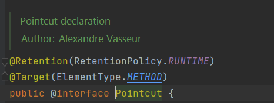


只能修饰在方法中。


注解的值`value` 是一个表达式，支持`10种`操作表达式。

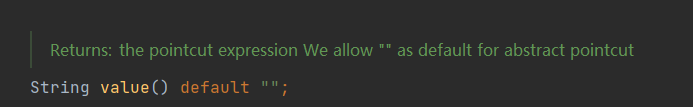


`Spring AOP` 支持如下10种操作

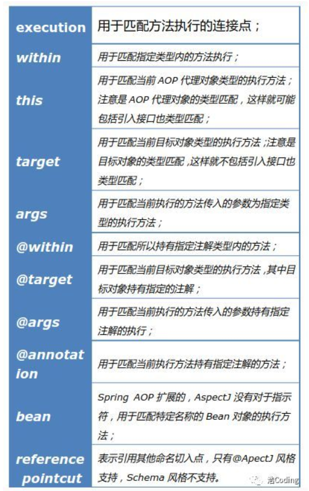


在使用时，需要传入 `@Pointcut`注解中的表达式。

例如：

```java
    @Pointcut(value = "@annotation(com.semghh.content.content3core.Annotation.MemoryCache)")
```


##### 5.4.1.1.1 `execution()`

`execution`关键字用于声明需要被增强的【方法】。


语法如下：

```java
execution(modifiers-pattern? ret-type-pattern declaring-type-pattern? name-pattern(param-pattern) throws-pattern?)
    
//modifiers-pattern 表示方法的访问修饰符，例如 public ,  *表示任意
       
//ret-type-pattern  表示方法的返回值修饰符， 例如 void ,  *表示任意  
    
//declaring-type-pattern  表示方法的声明类， 方法所在类的全限定名，例如  com.example.something
      
//name-pattern  表示方法的名称。    例如  add*   表示以add开头的方法。
        
//param-pattern 表示方法的参数类型列表。   add()表示无参方法  *用于表示一个任意类型的参数。
//  add(..)表示任意数量，任意类型的的形参列表。
    
    
//throws-pattern 表示抛出异常类型列表。   
```

以`?`结尾可以省略。


例如：

```
execution(public * com.content3.mvc.service.*.add*(..))
```

表示 `com.content3.mvc.service`包下任意的类，以`add`开头，任意形参列表 `public`修饰，返回值任意 的方法。


##### 5.4.1.1.2 `within`

`within`用于指定一个类型， 对应类型的方法都将被拦截。


例如：`within(com.elim.spring.aop.service.UserServiceImpl)`

匹配`UserServiceImpl`类对应对象的所有方法外部调用，而且这个对象【只能】是`UserServiceImpl`类，不能是其子类。


##### 5.4.1.1.7 `@within`

指定一个【注解A】， 任意的类B被这个【注解A】标注，那么这个类B的所有方法都会被拦截。同时B的所有 【没有被`Override`的方法】将会被传播到子类（子类调用B的方法也会被拦截，被重写的除外）。


`@within(com.elim.spring.support.MyAnnotation)`匹配被调用的方法声明的类上拥有MyAnnotation注解的情况。

比如有一个ClassA上使用了注解MyAnnotation标注，并且定义了一个方法a()，那么在调用ClassA.a()方法时将匹配该Pointcut；

如果有一个ClassB上没有MyAnnotation注解，但是它继承自ClassA，同时它上面定义了一个方法b()，那么在调用ClassB().b()方法时不会匹配该Pointcut，但是在调用ClassB().a()时将匹配该方法调用，因为a()是定义在父类型ClassA上的，且ClassA上使用了MyAnnotation注解。

但是如果子类ClassB覆写了父类ClassA的a()方法，则调用ClassB.a()方法时也不匹配该Pointcut。


##### 5.4.1.1.3 `this`

匹配【代理对象】的全部方法， `Spring AOP`是基于`cglib`动态代理，其中`this`指代理对象。


`this(com.elim.spring.aop.service.IUserService)` 指`IUserService`代理对象的全部方法。


##### 5.4.1.1.5 `target`

`Spring AOP`中，`target`指被代理的目标对象。


“target(com.elim.spring.aop.service.IUserService)”则匹配所有被代理的目标对象能够转换为IUserService类型的所有方法的外部调用。


##### 5.4.1.1.6 `args`

用于匹配方法参数的。

`args()`匹配任何不带参数的方法。

`args(..)`带任意参数的方法。


`args(java.lang.String)`匹配任何只带一个参数，而且这个参数的类型是String的方法。

`args(java.lang.String,..)`匹配带任意个参数，但是第一个参数的类型是String的方法。

`args(..,java.lang.String)`匹配带任意个参数，但是最后一个参数的类型是String的方法。


##### 5.4.1.1.7 `@annotation`

指定一个注解，任意方法上拥有指定注解，都将被拦截。   常用


例如：

`@annotation(com.elim.spring.support.MyAnnotation)`匹配所有的方法上拥有`MyAnnotation`注解的方法外部调用。


##### 5.4.1.1.8 `bean`

匹配当调用的是指定的`Spring`的某个`bean`的方法时。


`bean(abc)`匹配`Spring Bean`容器中id或name为`abc`的`bean`的方法调用。

`bean(user*)` 匹配所有id或name为以user开头的bean的方法调用。


#### 5.4.1.2 `@Before` 注解

前置增强。


#### 5.4.1.3 `@After` 

后置增强  //最终通知，有没有异常都执行


#### 5.4.1.4 `@AfterReturning` 

 返回值后增强    //后置通知   有异常就不执行

#### 5.4.1.5 `@Around`

环绕增强


#### 5.4.1.6 `@AfterThrow`

 异常通知增强


#### 5.4.2.5 复用 公共切入点


多个通知可以作用一个切入点，可以把切入点抽取出来，给切入点起别名。引用别名即可；

使用 @Pointcut 注解标记切入点

```java
    @Pointcut(value = "execution(* DAO.UserDAOImpl.add(..))")
    public void pointCut1() {

    }
```

这个切入点的别名就是方法名   “pointCut1()”

```java
@Before(value = "pointCut1()")
public void addBefore() {
    System.out.println("前置增强");
}
```


同样，我们可以在配置类中配置切入点，然后在增强Proxy类中引用切入点。

```java
public class SpringConfig {
    @Pointcut(value = "execution(* DAO.UserDAOImpl.add(..))" )
    public void pointCut1() {

    }
}
```


此时就需要使用  **类的全限定名**

```java
@After(value = "Config.SpringConfig.pointCut1()")
public void addAfter() {
    System.out.println("后置增强");
}
```


#### 5.4.2.6  @PointCut的配置


https://blog.csdn.net/java_green_hand0909/article/details/90238242

##### 5.4.2.6.1 可以使用逻辑符号

@PointCut 可以使用 &&  ||  !   完成逻辑组合。


如：

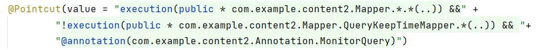


##### 5.4.2.6.2  多种关键字

同时还提供了多种关键字，表达不同功能。例如execution。


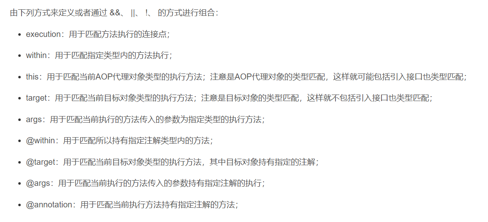


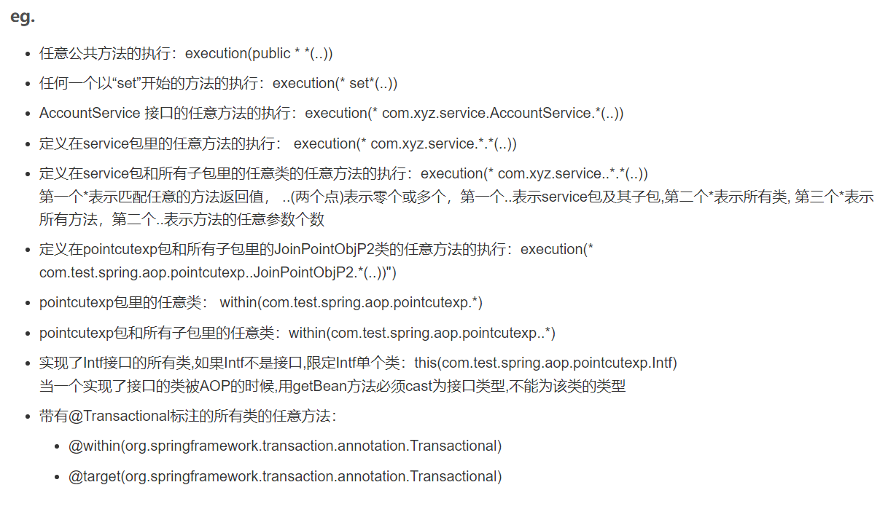


```
包内任意类：      .*
包及子包任意类：   ..*
被指定注解标注的[类]下的所有方法:    @within/@target


```


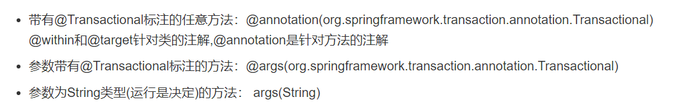

```
指定注解标注的[方法]:  @annotation(注解.class)

包含指定注解标注的[参数]的方法: @args(注解.class)

参数为String类型的方法: args(String)
```


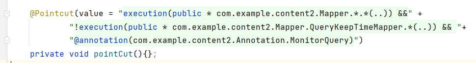


#### 5.4.2.6 增强的优先级

##### 5.4.2.6.1 问题的引入

```
同一个方法，也许经历多次增强（会经历多个版本）。
那么有如下方式：1.修改原代码 2.修改增强代码 3.继续添加代理增强方法

使用AOP的初衷：希望每次增强无需更改以前的代码，达到解耦的目的。
那么显然 1和2 方式是不符合AOP原则的，所以应当为原方法再新添加一个代理增强方法。

随之而来的问题就是：增强1，增强2 哪个优先？
有时增强1和增强2，没有任何逻辑关系，谁先后都无所谓。有时需要严格遵循先后顺序。
如何解决先后顺序？

引入标注顺序的注解 @Order
```

##### 5.4.2.6.2  引入@Order

```
通过对增强类使用@Order 注解  @Order( value= <int值>)
解决先后顺序问题。


数值越低，表明优先级越高，@Order 默认为最低优先级，即最大数值：
```


##### 5.4.2.6.3 @Order源码


@Order注解可以加在 类，方法，和字段上

显然如果标注在类上，那么这个 增强代理类 的所有方法都被设置了等级。


##### 5.4.2.6.4  使用示例

```
应当注意的是@Order应用于AOP时，需要标注在Aspect类上。

例如：
```

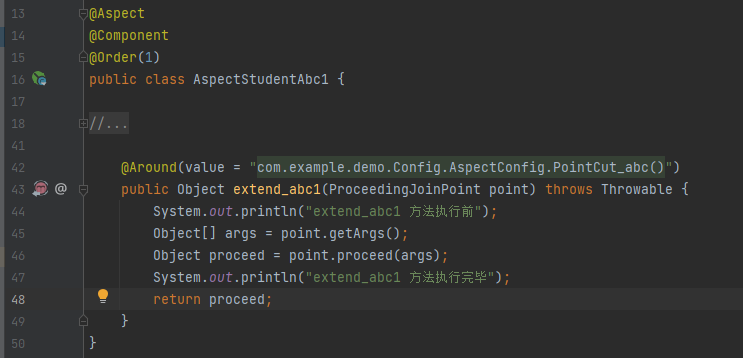

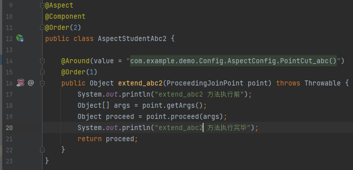

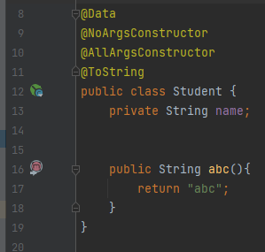

```
Aspect1,Aspect2 都对Student.abc()进行了环绕增强。
其中AspectStudent1的 @order=1
AspectStudent2的 @order=2

根据数值越小优先级越高 所以AspectStudent1先执行（也就是说 Aspect1在外层），输出一下结果
```

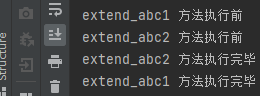

示意图：

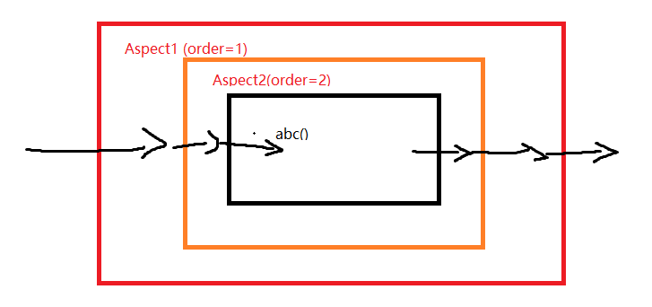

```
核心思想：
在执行外层增强时，对于外层增强本身来说，里面的全部方法都好像原始方法abc()一样。（因为所有的advice对外，都相当于原始被增强方法 Target object）
```

```
将两个Aspect的Order互换，输出结果：
```

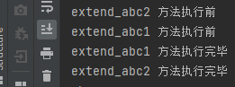


##### 5.4.2.6.5 值得注意的点

参考博客

https://blog.csdn.net/qq_32331073/article/details/80596084

###### 5.4.2.6.5.1 同一个Aspect同一个PointCut 相同的Advice

不要在同一个Aspect内，写同一个PointCut的多个advice()，因为他们的先后顺序并不可控。（此时标注在方法上的@Order并不生效）

例如这样：

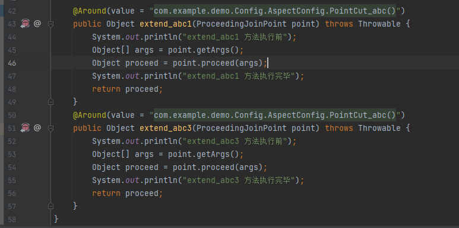

```
事实上反观一下这样的代码，已然同属于一个Aspect中。如果是第二次增强代码，不应该写在原来同一个切面中，应当新建一个Aspect类。

如果是同一时间段（较短时间内）写的代码: 可以合并两个advice或者独立出来一个新的Aspect
```


###### 5.4.2.6.5.2 同一个Aspect同一个PointCut 不同的Advice

```
不同的advice有如下：
@Befor
@After
@Around
@AfterReturning
@AfterThrowing
```

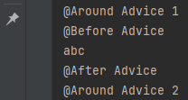


### 4.3 基于xml配置文件配置


为什么要获取 增强代理类的实例呢？底层调用 增强方法的时候，依然是使用Metho.invke(Objec instance,Object[] args)方法


```xml
<bean id = "diy_1" class="diy.DiyStudentStudy"/>        把diy类注册进xml里<aop:config>    <aop:aspect ref="diy1">        <aop:pointcut id="pointcut_1" expression="execution(* entity.Student.study(..))"/>  //定义切点        <aop:before method="Before" pointcut-ref="pointcut_1" />  //前置增强        <aop:after method="After" pointcut-ref="pointcut_1" />  //后置增强    </aop:aspect></aop:config>
```


## 5.5 AOP原理


### 5.5.1 jdk Proxy InvocationHandle


### 5.5.2  CGlib


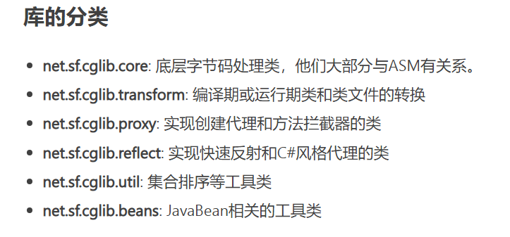


## 5.6  AOP相关类

AOP编程种尝试用的几个类。


### 5.6.1 JoinPoint

在advice中，我们通常在方法参数中注入一个 `JoinPoint`接口的对象。

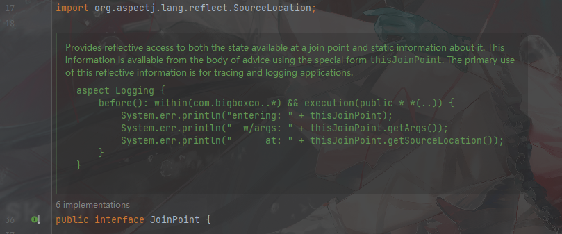


```
JoinPoint接口提供了一种基于反射原理访问方式去 访问切点和静态信息。
```


#### 5.6.1.1 常用方法


```java
Object[] getArgs;      //获取目标方法的参数数组

Signature getSignature;//获取目标方法的签名

Object getTarget ;     //获取被织入增强处理的目标对象

Object getThis;        //获取AOP框架为目标对象生成的代理对象
```


# 3.spring5新功能


## 1.支持@Nullable功能


## 2.支持 lambda 表达式


# 4. Spring功能点

主要介绍Spring的各个功能点。


## 4.1 ApplicationEvent


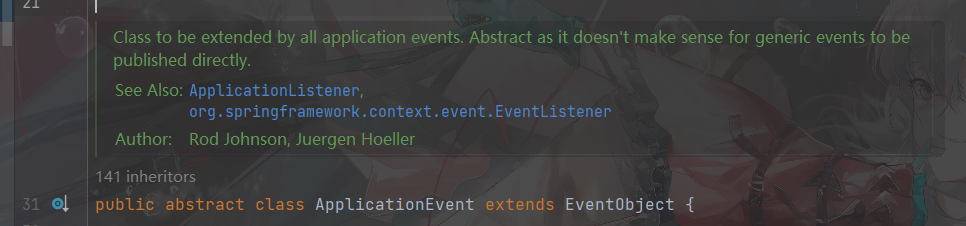

```
ApplicationEvent 类被所有的 Application 事件继承。


本类是抽象的，抽象是因为直接发布通用事件没有意义。
```


### 4.1.1 成员变量


时间戳，表示事件发生的时间。

```java
private final long timestamp;
```


以及，继承自 EventObject 的 source Object

```java
protected transient Object source;
```


### 4.1.2 构造函数

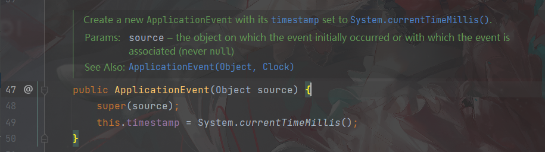


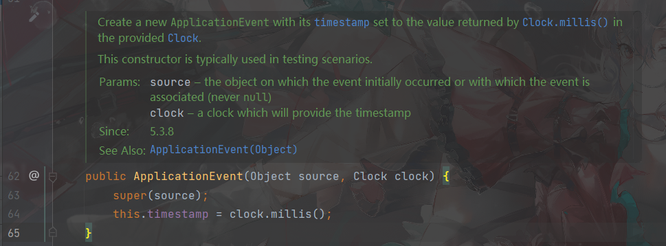


### 4.1.3 使用

事件 ->触发-> 监听器。 所以需要定义相应的监听器：[ApplicationListener](# 4.3 ApplicationListener)

```
```


## 4.2   Aware

通知。

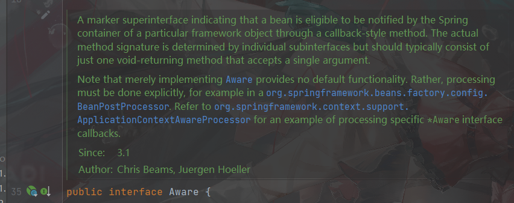

```
一个用于标记的父接口。实现了本接口意味着：在未来这个Bean有资格被Spring容器以回调的方式通知调用。


具体被回调的方法，将在本接口的子接口中，但是子接口通常应该只含有一个 “接受单个参数的void返回”的方法。
```


Aware有多个 子接口，分别完成不同的回调方法。


### 4.2.1  ApplicationContextAware


```
任何实现本接口的对象，将会获得一个带有 ApplicationContext对象参数的回调。
```


回调方法：

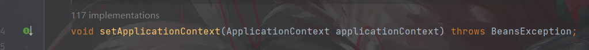

我们可以在回调方法内完成想做的事情。


例如：


```java
public class MyObject implements ApplicationContextAware {
    
    private ApplicationContext context;
    
    public void foo(){
        ObjectProvider<SuggestValueService> beanProvider = context.getBeanProvider(SuggestValueService.class);
        SuggestValueService ifUnique = beanProvider.getIfUnique();
        //doSomething
    }
    
    
    @Override
    public void setApplicationContext(ApplicationContext applicationContext) throws BeansException {
        this.context = applicationContext;
    }
}
```


## 4.3 ApplicationListener


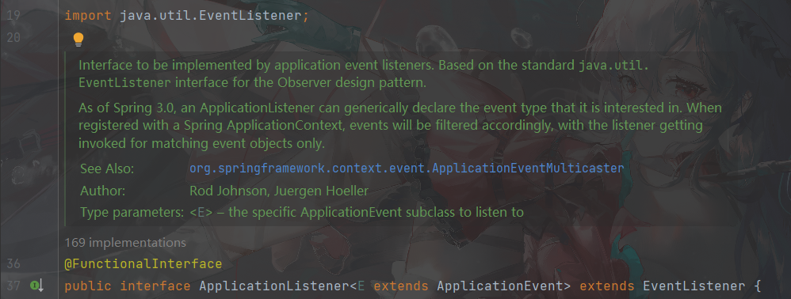


```
Application 事件监听器需要实现的接口。  基于标准的 java.util.EventListener接口，目的是实现观察者模式。

Spring3.0以后， ApplicationListener可以被通用的声明它感兴趣的事件。

如果向Spring ApplicationContext注册以后，事件将会被过滤，只会被感兴趣事件触发。
```


泛型`E` 表示感兴趣事件， `E extends ApplicationEvent`

`ApplicationListener`  继承于  `EventListener` 


# 5. spring WebSocket

spring Framework 在4.X版本对WebSocket通信协议进行了API支持。


官方参考文档：

https://docs.spring.io/spring-framework/docs/4.3.x/spring-framework-reference/html/websocket.html


## 5.1  参考的文档目录


https://docs.spring.io/spring-framework/docs/current/reference/html/web.html#websocket


## 5.2  WebSocket 协议简介


```
WebSocket协议基于 RFC6455  , 提供了一个标准方法用于构建一个  "全双工" "客户端和服务器端可以持续沟通"的基于TCP的连接协议。

它是一个不同于HTTP协议的，基于TCP协议的其他应用层协议。通常使用80或者443端口，也允许重用防火墙规则。
```


WebSocket协议通常是以一个HTTP请求开始的： WebSocket连接会首先发送一个这样的HTTP请求头：


在HTTP头中的标识：

```
Upgrade: websocket 
Connecton: Upgrade
```


```
如果服务器支持WebSocket协议,那么不会发送200的响应码。

而是会发送如下的HTTP Response
```


如上是一个握手(handshake)过程：

```
如果一个HandShake成功完成，那么这次的HTTP请求下的 TCP Socket将持续开放, 服务器和客户端之间可以持续通信
```


## 5.3 WebSocket API


Spring 框架提供了WebSocket的API支持，让程序员可以编写 ”客户端“或者”服务端“用于处理WebSocket消息的应用。


使用SpringWebSocket API  需要引入依赖

```xml
        <dependency>
            <groupId>org.springframework</groupId>
            <artifactId>spring-websocket</artifactId>
        </dependency>
```


对于springboot项目可以使用如下依赖

```xml
<dependency>
    <groupId>org.springframework.boot</groupId>
    <artifactId>spring-boot-starter-websocket</artifactId>
</dependency>
```


### 5.3.1 WebSocket Handler


```
创建一个WebSocket服务器就像实现一个 WebSocketHandler接口一样简单。
更进一步的,开发者可以扩展 实现TextWebSocketHandler,BinaryWebSocketHandler接口都可以实现一样的效果。
```


实现对应接口，并在映射中配置注册,然后run起来项目，就可实现WebSocket Server的部署。


```java
import org.springframework.stereotype.Component;
import org.springframework.web.socket.TextMessage;
import org.springframework.web.socket.WebSocketSession;
import org.springframework.web.socket.handler.TextWebSocketHandler;

import java.time.LocalTime;


public class HelloHandler extends TextWebSocketHandler {

    @Override
    protected void handleTextMessage(WebSocketSession session, TextMessage message) throws Exception {

        System.out.println("session Id : " + session.getId());
        System.out.println("accepted protocol : "+session.getAcceptedProtocol());
        System.out.println("remote address : "+session.getRemoteAddress());

        System.out.println(message);

        session.sendMessage( new TextMessage(LocalTime.now().toString()));
    }
}
```


### 5.3.2 配置映射

需要有一个专门的配置类，就像配置传统Web服务器的RequestMapping一样，

WebSocket Server 也需要配置一个映射(配置WebSocketHandler 和URL的映射)


```java
import org.springframework.web.socket.config.annotation.EnableWebSocket;
import org.springframework.web.socket.config.annotation.WebSocketConfigurer;
import org.springframework.web.socket.config.annotation.WebSocketHandlerRegistry;

@Configuration
@EnableWebSocket
public class WebSocketConfig implements WebSocketConfigurer {

    @Override
    public void registerWebSocketHandlers(WebSocketHandlerRegistry registry) {
        //配置 URL /myHandler 映射到对应的 WebSocketHandler
        registry.addHandler(myHandler(), "/myHandler");
    }

    @Bean
    public WebSocketHandler myHandler() {
        return new MyHandler();
    }

}
```


### 5.3.3 调试

使用ApiPost调试。 首先连接到对应的URL


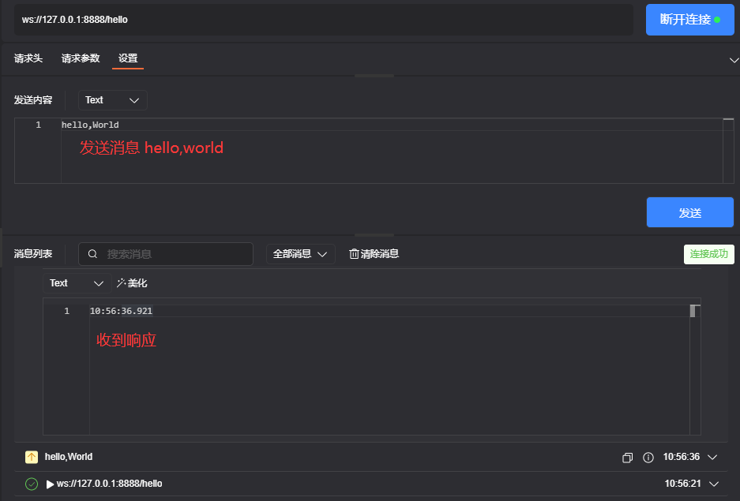


console:

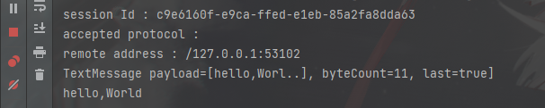


### 5.3.3  HandshakeInterceptor

WS握手拦截器


#### 5.3.3.1  为什么要基于HTTP？

WS在握手的时候为什么要使用HTTP沟通？ 首先HTTP已经是一个非常成熟,被大众市场接收的协议。其扩展性，使用率都非常好。

WS在建立连接的时候，不免的可能需要一些参数。预期自定义更多的额外协议不如使用HTTP 来传递参数。


#### 5.3.3.2  传递参数

Spring支持为每一个WS连接添加一个拦截器。拦截器可以完成各种功能，只需要实现  HandshakeInterceptror接口即可。


#### 5.3.3.3   从HTTP中复制属性

在5.3.3.1 中提到了WS是通过HTTP建立的。所以Spring内置了一个实现 HttpSessionHandshakeInterceptor用于拷贝Http信息到 WS中


### 5.3.4  Server Configuraion

服务器端配置项


```java
    @Bean
    public ServletServerContainerFactoryBean createWebSocketContainer() {
        ServletServerContainerFactoryBean container = new ServletServerContainerFactoryBean();
        container.setMaxTextMessageBufferSize(8192);
        container.setMaxBinaryMessageBufferSize(8192);
        return container;
    }
```


```
修改 WebSocket接收的最大消息长度。  二进制消息最大长度。
```


### 5.3.5  跨域问题

默认的WebSocket和SockJS 只接受同源请求。

```
default behavior for WebSocket and SockJS is to accept only same-origin requests.
```

spring支持  ”允许任意请求源“ 或者 ”指定某些源“。 有如下三种配置


```
1. 只允许同源请求 (默认)
2. 允许指定列表内包含的源
3. 任意源都可以
```


配置如下：

```java
import org.springframework.web.socket.config.annotation.EnableWebSocket;
import org.springframework.web.socket.config.annotation.WebSocketConfigurer;
import org.springframework.web.socket.config.annotation.WebSocketHandlerRegistry;

@Configuration
@EnableWebSocket
public class WebSocketConfig implements WebSocketConfigurer {

    @Override
    public void registerWebSocketHandlers(WebSocketHandlerRegistry registry) {
        registry.addHandler(myHandler(), "/myHandler")
            .setAllowedOrigins("https://mydomain.com");
    }

    @Bean
    public WebSocketHandler myHandler() {
        return new MyHandler();
    }
}
```


## 5.4  SockJS


在公共 Internet 上，您无法控制的限制性代理可能会阻止 WebSocket 交互，因为它们未配置为传递`Upgrade`标头，或者因为它们关闭了看似空闲的长期连接。

这个问题的解决方案是 WebSocket 仿真——也就是说，首先尝试使用 WebSocket，然后使用基于 HTTP 的技术来模拟 WebSocket 交互并公开相同的应用程序级 API。


### 5.4.1 启动SockJS


```java
@Configuration
@EnableWebSocket
public class WebSocketConfig implements WebSocketConfigurer {

    
    @Resource(name = "helloHandler")
    private WebSocketHandler helloHandler;
    
    @Override
    public void registerWebSocketHandlers(WebSocketHandlerRegistry registry) {

        registry.addHandler(helloHandler,"/hello")
                .addInterceptors(new HttpSessionHandshakeInterceptor())
                .setAllowedOrigins("*")
                .withSockJS();
    }

}
```


//TODO 具体的更多的SockJS 参考官方文档。

https://docs.spring.io/spring-framework/docs/current/reference/html/web.html#websocket-fallback


## 5.5 STOMP

Simple Text Oriented Messaging Protocol 面向简单文本的消息传递协议.


最初是为脚本语言（如 Ruby、Python 和 Perl）创建的，用于连接到企业消息代理。

它旨在解决常用消息传递模式的最小子集。STOMP 可用于任何可靠的双向流网络协议，例如 TCP 和 WebSocket。尽管 STOMP 是一个面向文本的协议，但消息负载可以是文本或二进制。

```
二进制保证了传输能力，任何数据都可传输。
```


STOMP 是一种基于帧的协议，其帧以 HTTP 为模型。以下清单显示了 STOMP 框架的结构：


### 5.5.1 使用STOMP的好处


使用 STOMP 作为子协议可以让 Spring Framework 和 Spring Security 提供比使用原始 WebSockets 更丰富的编程模型。


```
不用再发明一个客制化的消息协议，消息格式
```


```
可以使用消息队列来管理 消息的发布订阅(RabbitMQ 等等)
```


```
应用程序逻辑可以组织在任意数量的@Controller实例中，并且可以根据 STOMP 目标标头将消息路由到它们，而不是使用单个WebSocketHandler给定连接处理原始 WebSocket 消息。
```


### 5.5.2  使用STOMP


https://spring.io/guides/gs/messaging-stomp-websocket/


# 6. 定制化


## 6.1 定制化参数解析器

实现`HandlerMethodArgumentResolver` 接口。

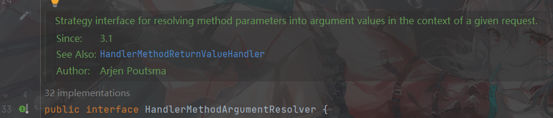


