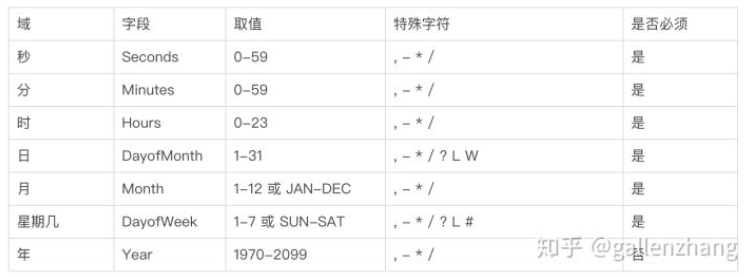
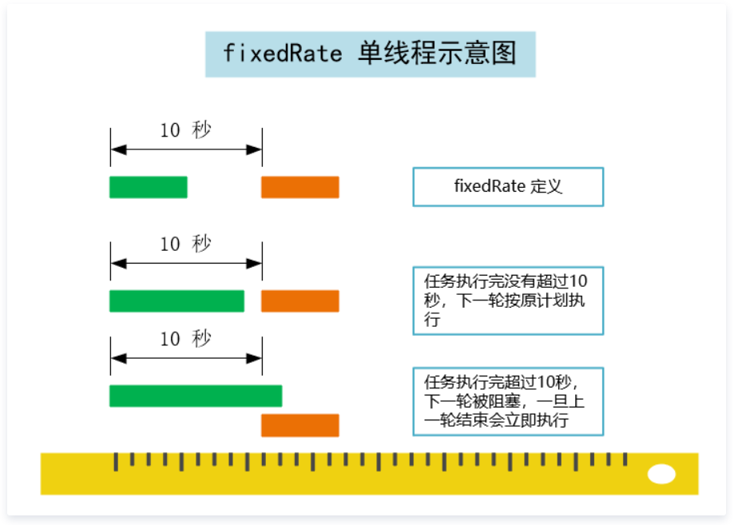
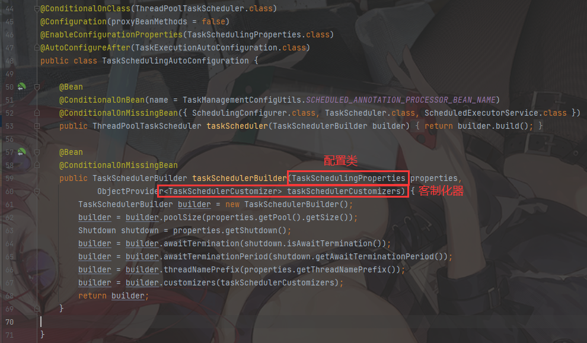
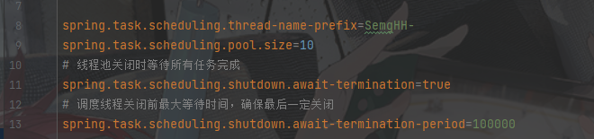
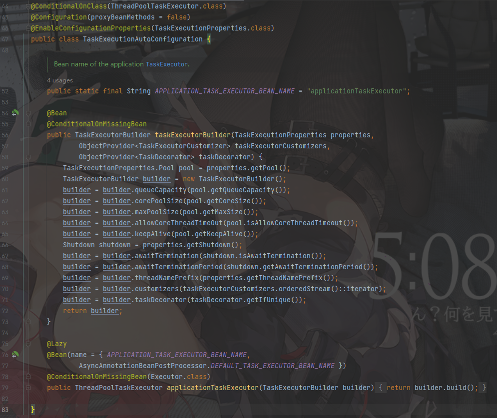
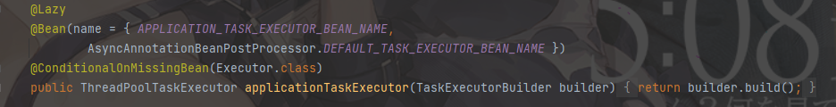

# 1.SpringTask


## 1.1 为什么我们需要定时任务？


**我们先思考下面几个业务场景的解决方案:** 

```
 1.支付系统每天凌晨1点跑批，进行一天清算，每月1号进行上个月清算

 2.电商整点抢购，商品价格8点整开始优惠

 3.12306购票系统，超过30分钟没有成功支付订单的，进行回收处理

 4.商品成功发货后，需要向客户发送短信提醒
```


```
很多业务场景需要我们某一特定的时刻去做某件任务，定时任务解决的就是这种业务场景。

一般来说，系统可以使用消息传递代替部分定时任务，两者有很多相似之处，可以相互替换场景。
```

可以替换的场景：

```
上面发货成功发短信通知客户的业务场景，我们可以在发货成功后发送MQ消息到队列，然后去消费mq消息，发送短信。
```


但在某些场景下不能互换：

```
 1. 时间驱动/事件驱动：内部系统一般可以通过时间来驱动，但涉及到外部系统，则只能使用时间驱动。如怕取外部网站价格，每小时爬一次

 2.批量处理/逐条处理：批量处理堆积的[数据]()更加高效，在不需要实时性的情况下比消息中间件更有优势。而且有的业务逻辑只能批量处理。如移动每个月结算我们的话费

 3. 实时性/非实时性：消息中间件能够做到实时处理[数据]()，但是有些情况下并不需要实时，比如：vip升级

 4. 系统内部/系统解耦：定时任务调度一般是在系统内部，而消息中间件可用于两个系统间
```


## 1.2 有哪些定时任务框架


### 1.2.1 单机定时任务


**timer：** 是一个定时器类，通过该类可以为指定的定时任务进行配置。TimerTask类是一个定时任务类，该类实现了Runnable接口，缺点异常未检查会中止线程

 **ScheduledExecutorService：** 相对延迟或者周期作为定时任务调度，缺点没有绝对的日期或者时间

 **spring定时框架：** 配置简单功能较多，如果系统使用单机的话可以优先考虑spring定时器


### 1.2.2 分布式


**Quartz：** Java事实上的定时任务标准。但Quartz关注点在于定时任务而非数据，并无一套根据数据处理而定制化的流程。虽然Quartz可以基于数据库实现作业的高可用，但缺少分布式并行调度的功能


 **TBSchedule：** 阿里早期开源的分布式任务调度系统。代码略陈旧，使用timer而非线程池执行任务调度。众所周知，timer在处理异常状况时是有缺陷的。而且TBSchedule作业类型较为单一，只能是获取/处理数据一种模式。还有就是文档缺失比较严重


 **elastic-job：** 当当开发的弹性分布式任务调度系统，功能丰富强大，采用zookeeper实现分布式协调，实现任务高可用以及分片，目前是版本2.15，并且可以支持云开发


 **Saturn：** 是唯品会自主研发的分布式的定时任务的调度平台，基于当当的elastic-job 版本1开发，并且可以很好的部署到docker容器上。


 **xxl-job: ** 是大众点评员工徐雪里于2015年的分布式任务调度平台，是一个轻量级分布式任务调度框架，其核心设计目标是开发迅速、学习简单、轻量级、易扩展。


#### 1.2.2.1 E-Job X-Job 对比


参与对比的可选系统方案：elastic——job （以下简称E-Job）与 xxx-job(以下简称X-Job)


 **X-Job：** 集群部署唯一要求为：保证每个集群节点配置（db和登陆账号等）保持一致。调度中心通过db配置区分不同集群。

执行器支持集群部署，提升调度系统可用性，同时提升任务处理能力。集群部署唯一要求为：保证集群中每个执行器的配置项 xxl.job.admin.addresses/调度中心地址"保持一致，执行器根据该配置进行执行器自动注册等操作。


 **E-Job：** 重写Quartz基于[数据]()库的分布式功能，改用Zoo[keep]()er实现注册中心**

作业注册中心：基于Zoo[keep]()er和其客户端Curator实现的全局作业注册控制中心。用于注册，控制和协调分布式作业执行。


 多节点部署时任务不能重复执行 

 **X-Job：** 使用Quartz基于[数据]()库的分布式功能

 **E-Job：** 将任务拆分为n个任务项后，各个服务器分别执行各自分配到的任务项。一旦有新的服务器加入集群，或现有服务器下线，elastic-job将在保留本次任务执行不变的情况下，下次任务开始前触发任务重分片。


 日志可追溯 

 **X-Job：** 支持，有日志查询界面

 **E-Job：** 可通过事件订阅的方式处理调度过程的重要事件，用于查询、统计和监控。Elastic-Job目前提供了基于关系型[数据]()库两种事件订阅方式记录事件。


 监控告警 

 [**X-Job：** 调度失败时，将会触发失败报警，如发送报警邮件。](https://mp.weixin.qq.com/s?__biz=MzI4NTM1NDgwNw==&mid=2247500365&idx=1&sn=7abfd8b30427d4ac15bb351c3dbb640c&scene=21#wechat_redirect) 

 [任务调度失败时邮件通知的邮箱地址，支持配置多邮箱地址，配置多个邮箱地址时用逗号分隔](https://mp.weixin.qq.com/s?__biz=MzI4NTM1NDgwNw==&mid=2247500365&idx=1&sn=7abfd8b30427d4ac15bb351c3dbb640c&scene=21#wechat_redirect) 

 [**E-Job：** 通过事件订阅方式可自行实现](https://mp.weixin.qq.com/s?__biz=MzI4NTM1NDgwNw==&mid=2247500365&idx=1&sn=7abfd8b30427d4ac15bb351c3dbb640c&scene=21#wechat_redirect) 

 [作业运行状态监控、监听作业服务器存活、监听近期数据处理成功、数据流类型作业（可通过监听近期数据处理成功数判断作业流量是否正常,如果小于作业正常处理的阀值，可选择报警。）、监听近期数据处理失败（可通过监听近期数据处理失败数判断作业处理结果，如果大于0，可选择报警。）](https://mp.weixin.qq.com/s?__biz=MzI4NTM1NDgwNw==&mid=2247500365&idx=1&sn=7abfd8b30427d4ac15bb351c3dbb640c&scene=21#wechat_redirect) 


 弹性扩容缩容 

 **X-Job：** 使用Quartz基于[数据]()库的分布式功能，服务器超出一定数量会给[数据]()库造成一定的压力

 **E-Job：** 通过zk实现各服务的注册、控制及协调


 支持并行调度 

 **X-Job：** 调度系统多线程（默认10个线程）触发调度运行，确保调度精确执行，不被堵塞。

 **E-Job：** 采用任务分片方式实现。将一个任务拆分为n个独立的任务项，由分布式的服务器并行执行各自分配到的分片项。


 高可用策略 

 **X-Job：** "调度中心"通过DB锁保证集群分布式调度的一致性, 一次任务调度只会触发一次执行；

 **E-Job：** 调度器的高可用是通过运行几个指向同一个ZooKeeper集群的Elastic-Job-Cloud-Scheduler实例来实现的。ZooKeeper用于在当前主Elastic-Job-Cloud-Scheduler实例失败的情况下执行领导者选举。通过至少两个调度器实例来构成集群，集群中只有一个调度器实例提供服务，其他实例处于"待命"状态。当该实例失败时，集群会选举剩余实例中的一个来继续提供服务。


失败处理策略 

X-Job：调度失败时的处理策略，策略包括：失败告警（默认）、失败重试；

E-Job：弹性扩容缩容在下次作业运行前重分片，但本次作业执行的过程中，下线的服务器所分配的作业将不会重新被分配。失效转移功能可以在本次作业运行中用空闲服务器抓取孤儿作业分片执行。同样失效转移功能也会牺牲部分性能。


动态分片策略 

 [**X-Job：分片广播任务以执行器为维度进行分片，支持动态扩容执行器集群从而动态增加分片数量，协同进行业务处理；在进行大数据量业务操作时可显著提升任务处理能力和速度。**](https://mp.weixin.qq.com/s?__biz=MzI4NTM1NDgwNw==&mid=2247500365&idx=1&sn=7abfd8b30427d4ac15bb351c3dbb640c&scene=21#wechat_redirect) 

 [执行器集群部署时，任务路由策略选择"分片广播"情况下，一次任务调度将会广播触发对应集群中所有执行器执行一次任务，同时传递分片参数；可根据分片参数开发分片任务；](https://mp.weixin.qq.com/s?__biz=MzI4NTM1NDgwNw==&mid=2247500365&idx=1&sn=7abfd8b30427d4ac15bb351c3dbb640c&scene=21#wechat_redirect) 

 [**E-Job：支持多种分片策略，可自定义分片策略**](https://mp.weixin.qq.com/s?__biz=MzI4NTM1NDgwNw==&mid=2247500365&idx=1&sn=7abfd8b30427d4ac15bb351c3dbb640c&scene=21#wechat_redirect) 

 [默认包含三种分片策略：基于平均分配算法的分片策略、 作业名的哈希值奇偶数决定IP升降序算法的分片策略、根据作业名的哈希值对Job实例列表进行轮转的分片策略，支持自定义分片策略](https://mp.weixin.qq.com/s?__biz=MzI4NTM1NDgwNw==&mid=2247500365&idx=1&sn=7abfd8b30427d4ac15bb351c3dbb640c&scene=21#wechat_redirect) 

 [elastic-job的分片是通过zookeeper来实现的。分片的分片由主节点分配，如下三种情况都会触发主节点上的分片算法执行：](https://mp.weixin.qq.com/s?__biz=MzI4NTM1NDgwNw==&mid=2247500365&idx=1&sn=7abfd8b30427d4ac15bb351c3dbb640c&scene=21#wechat_redirect) 

 [**1、** 新的Job实例加入集群](https://mp.weixin.qq.com/s?__biz=MzI4NTM1NDgwNw==&mid=2247500365&idx=1&sn=7abfd8b30427d4ac15bb351c3dbb640c&scene=21#wechat_redirect) 

 [**2、** 现有的Job实例下线（如果下线的是leader节点，那么先选举然后触发分片算法的执行）](https://mp.weixin.qq.com/s?__biz=MzI4NTM1NDgwNw==&mid=2247500365&idx=1&sn=7abfd8b30427d4ac15bb351c3dbb640c&scene=21#wechat_redirect) 

 [**3、** 主节点选举"](https://mp.weixin.qq.com/s?__biz=MzI4NTM1NDgwNw==&mid=2247500365&idx=1&sn=7abfd8b30427d4ac15bb351c3dbb640c&scene=21#wechat_redirect)


### 1.3 使用SpringTask


### 1.3.1 开启定时任务

Spring Boot 默认在无任何第三方依赖的情况下使用 `spring-context` 模块下提供的定时任务工具 **Spring Task**。

我们只需要使用 `@EnableScheduling` 注解就可以开启相关的定时任务功能

```java
/**
 * @author SemgHH
 * 2022-9-14 17:57:47
 */
@SpringBootApplication
@EnableScheduling
public class LearningSpringTaskApplication {
    public static void main(String[] args) {
        SpringApplication.run(LearningSpringTaskApplication.class, args);
    }

}
```


#### 1.3.1.1 @Scheduled 注解

需要定义一个托管给Spring的Bean， 在Bean中给定时方法标注 @Scheduled 注解


```java
/**
 * @author SemgHH
 * 2022-9-14 18:30:55
 */
@Component
public class HelloTask {
    
    private AtomicInteger integer = new AtomicInteger(0);
    
    @Scheduled(fixedRate = 1000)
    public void sayHello(){

        int time = integer.getAndIncrement();
        System.out.println("hello world! "+time);
    }
}
```


@Scheduled有三种运行模式

```
cron
fixedDelay
fixedRate
```


##### 1.3.1.1.1  cron表达式


```
cron表达式是一个字符串。由5/6个空格隔开，将字符串分隔为6,7个域。 每个域有不用的含义。

{Seconds} {Minutes} {Hours} {DayofMonth} {Month} {DayofWeek} {Year}或
{Seconds} {Minutes} {Hours} {DayofMonth} {Month} {DayofWeek}

//年不是必须的

//0 0 2 * * ?  这个表达式的含义是每天凌晨两点执行一次任务。
```


各个域的含义如下：




````
每个域都可以用数字表示，但是还可以出现如下特殊字符。

* : 表示匹配该域的任意值。比如Minutes域使用*，就表示每分钟都会触发。
- : 表示范围。比如Minutes域使用 10-20，就表示从10分钟到20分钟每分钟都会触发一次。
, : 表示列出枚举值。比如Minutes域使用1,3，就表示1分钟和3分钟都会触发一次。
/ : 表示间隔时间触发(开始时间/时间间隔)。例如在Minutes域使用 5/10，就表示从第5分钟开始，每隔10分钟触发一次。
? : 表示不指定值。简单理解就是忽略该字段的值，直接根据另一个字段的值触发执行。
# : 表示该月第n个星期x(x#n)，仅用星期域。如：星期：5#3，表示该月的第三个星期五。
L : 表示最后，是单词"last"的缩写（最后一天或最后一个星期几）；仅出现在日和星期的域中。用在日则表示该月的最后一天，用在星期则表示该月的最后一个星期。如：星期域上的值为5L，则表示该月最后一个星期的星期四。在使用'L'时，不要指定列表','或范围'-'，否则易导致出现意料之外的结果。
W: 仅用在日的域中，表示距离当月给定日期最近的工作日（周一到周五），是单词"weekday"的缩写。
````


比如："4W"表示距离4号最近的工作日（当月的）触发；

（1）当4号就是工作日时，则表示当天触发；当4号为周六时，则表示3号（周五）触发；

（2）当4号为周日时，则表示在5号（周一）触发；

比如："1W"表示距离1号最近的工作日触发事件，但是，该工作日只算当月的。假如当月1号是周六，则"1W"表示在当月3号（周一）触发。就算上个月的最后一天是工作日，也不会触发。

- LW: ‘L’和'W'可以一起组合在日字段使用。表示当月的最后一个工作日触发事件。


数值说明


DayofWeek：

表示星期几，可以用数字1-7（1=星期日），或者用字符串"SUN, MON, TUE, WED, THU, FRI and SAT"来表示。


DayofMonth：

可以用数字1-31 中的任一个值，但要注意一些特别的月份。


Month：

一年中的月份，可以用0-11 或用字符串 “JAN, FEB, MAR, APR, MAY, JUN, JUL, AUG, SEP, OCT, NOV and DEC” 表示。


##### 1.3.1.1.2  fixedDelay

```
以固定延迟执行(上一次执行完毕开始计时,达到固定延迟时间后，开启下一次执行)
```


这种情况没什么特别的。


##### 1.3.1.1.3 fixedRate

```
以固定频率开始分批执行。如果是单线程，可能会有问题。
```





默认情况下SpringBoot的定时任务是单线程的。(1个@Scheduled ，1个独立的线程 ，这意味着Scheduled之间不会相互干扰)


##### 1.3.1.1.4 initialDelay

第一次执行时的 delay时延。 这个属性对 cron无效。 只对 fixedDelay 和 fixedRate有效。


### 1.3.2 定时任务配置


SpringBoot  定时任务自动配置类如下：




这意味着在application.yaml中可配置的 配置项，都在`TaskSchedulingProperties`类中





执行器自动配置类：







懒加载，当且仅当IOC容器中没有 Executor.class类才会加载。

可以自己注入一个ExecutorService


对应的执行器配置类 TaskExecutionProperties


### 1.3.3 异步任务

对于 fixedRate 来说，如果任务消耗的时间超过了fixedRate的时间，会出现阻塞的情况。

使用`@EnableAsync` 开启异步支持， 使用`@Async` 标注异步定时任务


