[TOC]


# 1.Getting started

What is `SpringBoot`？

```
Springboot可以化简创建一个单体应用，一个基于Spring的产品级的应用，开发者只需要run一下即可。
```


```
Springboot 可以集成Spring族的产品，也可以集成第三方lib（需要按照固定配置）。
```


```
IDEA 现在可以自动创建一个SpringBoot项目，所以无需手动构建。 可以跳过
```


## 1.1 Create the POM.xml

```xml
<?xml version="1.0" encoding="UTF-8"?>
<project xmlns="http://maven.apache.org/POM/4.0.0" xmlns:xsi="http://www.w3.org/2001/XMLSchema-instance"
    xsi:schemaLocation="http://maven.apache.org/POM/4.0.0 https://maven.apache.org/xsd/maven-4.0.0.xsd">
    <modelVersion>4.0.0</modelVersion>

    <groupId>com.example</groupId>
    <artifactId>myproject</artifactId>
    <version>0.0.1-SNAPSHOT</version>

    <parent>
        <groupId>org.springframework.boot</groupId>
        <artifactId>spring-boot-starter-parent</artifactId>
        <version>2.5.2</version>
    </parent>

    <!-- Additional lines to be added here... -->

</project>

```


## 1.2 Adding Classpath Dependencies

```xml

    <dependencies>
        <dependency>
            <groupId>cn.ipokerface</groupId>
            <artifactId>spring-boot-starter-web</artifactId>
            <version>2.1.0</version>
        </dependency>
    </dependencies>
```


# 2. Annotation


## 2.1 基础注解

可以说基础注解是业务注解的底层注解。它支撑着spring容器的各种行为表现。对于初学者来说，它们更抽象。一般先推荐学习 2.2 业务注解。熟悉了spring容器，springboot工作方式以后,回头学习基础注解。


### 2.1.1@Configuration


Configuration注解是一个非常重要的注解。见其名,即配置的意思。用于配置各种数据。

被@Configuration标注的类,称为配置类。配置类会深深的改变spring容器的行为，甚至是整个application的行为。


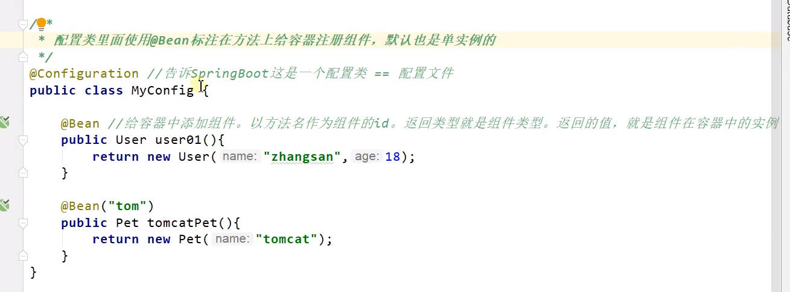

```
上图中@Bean 注解的作用: 向spring容器中注入bean。


被Configuraion标注的类，也是Spring容器中的一个组件。
```


#### 2.1.1.1 属性：proxyBeanMethods

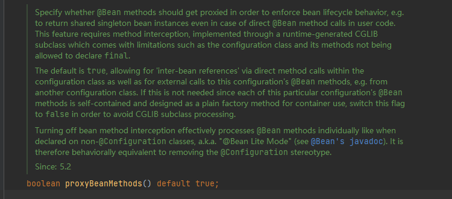

是一个boolean类型的属性。从直译上看不出来它的功能。

事实上,这个属性就是决定Configuration下Bean是否是单例。

当proxyBeanMethods=true  、此配置类下的Bean均为单例。默认也是true


当proxyBeanMethods=true时。每次调用@Bean方法，spring都需要检查容器中是否有改Bean,如果有则返回该单例。这种情况被称为 Full 重量级，启动springboot会慢。

当proxyBeanMethods=fale时,spring不会检查,每次调用@Bean方法都会重新new一个新的对象。这种情况称为Lite 轻量级启动。lite启动会非常快。


#### 2.1.1.2 组件依赖问题

Full 模式要比 Lite模式启动笨重。但Full模式可以解决组件依赖问题 即: 有时我们必须使用同一个对象。

这种必须使用同一个对象的现象，称为组件依赖。

同时，Full模式还保证了单例模式，通常我们并不关心启动时速度，我们更加关心Application的运行时状态。Full无疑会减少内存的消耗，减少GC压力，提升应用运行时性能。


### 2.1.2 @Conditional 族

条件装配注解。 这一族注解用于判定`当前类或方法是否生效`。 不同的`@Conditional`子类，代表了不同的判断条件。


子注解如下图：

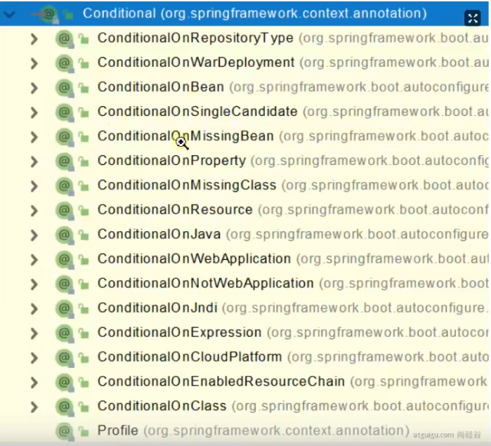


#### 2.1.2.1 `@ConditionalOnBean`

`@ConditionalOnBean`当容器内存在指定Bean时生效，否则无效。


`@ConditionalOnMissingBean` 当容器内不存在指定Bean时生效，否则无效。


#### 2.1.2.2 `@ConditionalOnClass`


`@ConditionalOnClass`


只有在 `类路径`下引用了指定的类才生效。


`@ConditionalOnMissingClass`

只有在 `类路径`下没有引用指定的类才生效。


#### 2.1.2.3 `@ConditionalOnJava`


当jdk版本为指定jdk版本时生效。


#### 2.1.2.4 `@ConditionalOnResource`


当classpath中存在指定资源时生效。


### 2.1.3 @Primary

有时存在这样的情况: spring容器中存在某一个Class的多个实例。我们需要分清楚主次。当使用Class注入的时候，总是默认注入主实例。


@Primary应运而生,标注在指定Bean上，告诉spring容器指定Bean是主实例。


#### 2.1.3.1 实战: 一个application配置2个DataSource


主DataSource

```java
@Configuration
@MapperScan(basePackages = PrimaryDataSourceConfig.PACKAGE ,sqlSessionFactoryRef = "primarySqlSessionFactory")
public class PrimaryDataSourceConfig {

    static final String PACKAGE = "com.example.test2.Mapper.Primary";

    static final String MAPPER_LOCATION = "classpath:mapper/Primary/*.xml";

    @Value("${primary.datasource.url}")
    private String url;

    @Value("${primary.datasource.username}")
    private String username;

    @Value("${primary.datasource.password}")
    private String password;

    @Value("${primary.datasource.driver-class-name}")
    private String driverClass;


    @Bean(name = "primaryDataSource")
    @Primary
    public DataSource primaryDataSource(){
        DruidDataSource dataSource = new DruidDataSource();
        dataSource.setDriverClassName(driverClass);
        dataSource.setUrl(url);
        dataSource.setPassword(password);
        dataSource.setUsername(username);
        return dataSource;
    }


    @Bean(name = "primaryTransactionManager")
    @Primary
    public DataSourceTransactionManager primaryTransactionManager(){
        return new DataSourceTransactionManager(primaryDataSource());
    }

    @Bean(name = "primarySqlSessionFactory")
    @Primary
    public SqlSessionFactory primarySqlSessionFactory(@Qualifier("primaryDataSource") DataSource dataSource) throws Exception {
        final SqlSessionFactoryBean sqlSessionFactory = new SqlSessionFactoryBean();
        sqlSessionFactory.setDataSource(dataSource);
        sqlSessionFactory.setMapperLocations(new PathMatchingResourcePatternResolver()
                .getResources(MAPPER_LOCATION));
        return sqlSessionFactory.getObject();
    }

}
```

次DataSource

```java
@Configuration
@MapperScan(basePackages = SecondaryDataSourceConfig.PACKAGE, sqlSessionFactoryRef = "secondarySqlSessionFactory")
public class SecondaryDataSourceConfig {

    static final String PACKAGE = "com.example.test2.Mapper.secondary";

    static final String MAPPER_LOCATION = "classpath:/mapper/Secondary/*.xml";


    @Value("${secondary.datasource.url}")
    private String url;

    @Value("${secondary.datasource.username}")
    private String username;

    @Value("${secondary.datasource.password}")
    private String password;

    @Value("${secondary.datasource.driver-class-name}")
    private String driverClass;

    @Bean(name = "secondaryDataSource")
    public DataSource secondaryDataSource(){
        DruidDataSource dataSource = new DruidDataSource();
        dataSource.setUsername(username);
        dataSource.setPassword(password);
        dataSource.setUrl(url);
        dataSource.setDriverClassName(driverClass);
        return dataSource;
    }


    @Bean(name = "secondaryTransactionManager")
    public DataSourceTransactionManager primaryTransactionManager(){
        return new DataSourceTransactionManager(secondaryDataSource());
    }

    @Bean(name = "secondarySqlSessionFactory")
    public SqlSessionFactory secondarySqlSessionFactory(@Qualifier("secondaryDataSource") DataSource dataSource) throws Exception {
        SqlSessionFactoryBean sqlSessionFactoryBean = new SqlSessionFactoryBean();
        sqlSessionFactoryBean.setDataSource(dataSource);
        sqlSessionFactoryBean.setMapperLocations(new PathMatchingResourcePatternResolver()
                .getResources(MAPPER_LOCATION));
        return sqlSessionFactoryBean.getObject();
    }

}
```


### 2.1.4 @ImportSource

直译：导入资源。(不是任意资源)

查看源码：

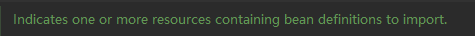

将指定路径下的 javaBean定义文件解析，并加入到Spring容器中。

仅支持 bean definitions

用法：

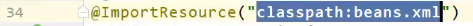


### 2.1.5 @ConfigurationProperties

`ConfigurationProperties`注解用于从

`application.yaml` 或 `application.properties` 中拿取值注入到Bean的属性中。


使用时,最好引入如下依赖。	


```xml
        <dependency>
            <groupId>org.springframework.boot</groupId>
            <artifactId>spring-boot-configuration-processor</artifactId>
        </dependency>
```


#### 2.1.5.1 注入规则

这个注解的注入规则如下

```
1.按照appliaction.yaml中的字段名 匹配 Bean相同名字的属性。

2.必须保证想要注入属性的bean被spring容器接管,通常标注@Component注解

3.被注入的属性必须有Setter方法
```


它可以标注在方法和类上。


例如：

```java
    @ConfigurationProperties(prefix = "a.bb.cc")
    @Bean(name = "readDruidDataSource")
    public Student mystudent() {
        return new Student();
    }
```

数据类型：

```java
public class Student{
	private String name;
    private Integer age;
}
```

application.yaml

```yaml
 a:
 	bb:
 		cc:
 			name: "hh"
 			age: 12
```


#### 2.1.5.1  属性


prefix属性用于配置前缀：帮助区分yaml中其他属性值。和bean属性匹配的时候会忽略prefix 只会匹配后面的属性
```
    @ConfigurationProperties(prefix = "a.bb.cc")
```


ConfigurationProperties 注解在 AutoConfiguration中大量应用。


configurationProperties源码如下:

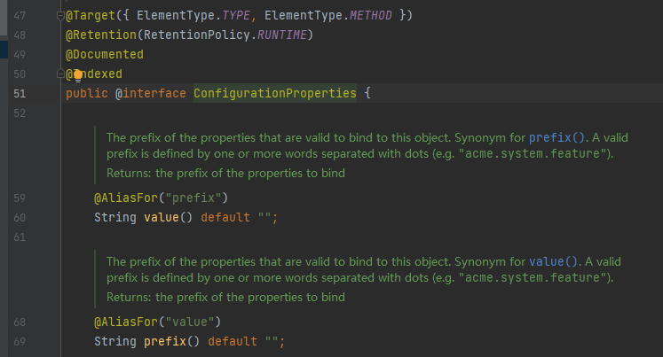

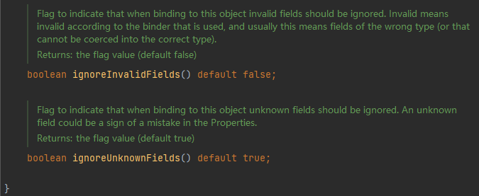

```
value 和 prefix 互为别名。
重要的参数 “prefix” 也就是前缀
```


#### 2.1.5.1 实战

@Component + @ConfigurationProperties


在application.yaml中配置了如下的值 等同于.properties的  test.value=hahaha


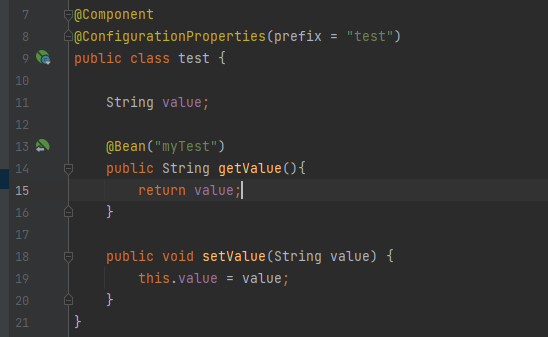


configurationProperties底层使用Setter实现,所以需要定义Setter方法。如果没有则会报错：

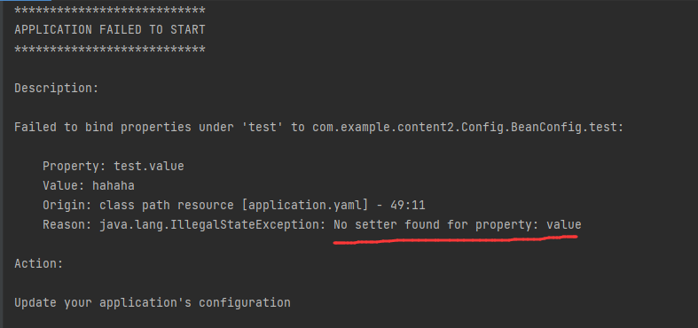


定义好Setter以后，拿到Bean并输出。

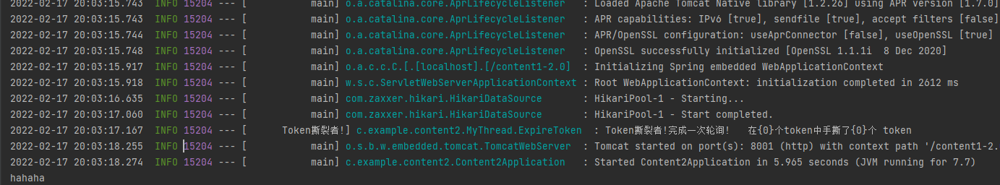


#### 2.1.5.2  @EnbaleConfigurationProperties

仅能标注在Class上，并且需要声明 开启属性绑定的类是哪个

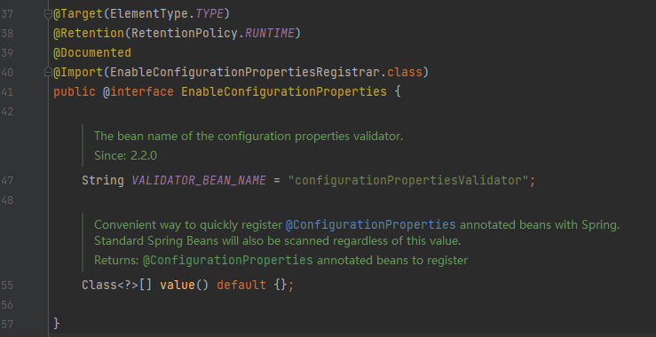


@EnableConfigurationProperties 注解需要标注在 被@Configuration修饰的类上（即配置类上）


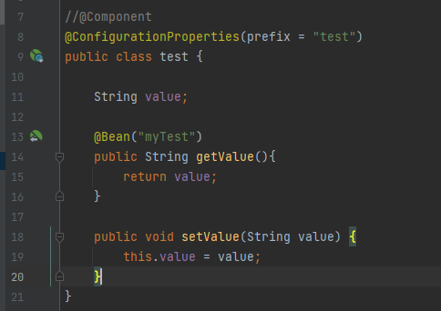

```
注释掉了@Component
```


```
在其他的类上标注了  开启属性绑定。
```

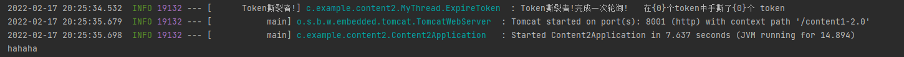

```
成功拿到 value=hahaha
```


#### 2.1.5.3 @Value("${}")

@Value注解也可以拿到 Applicaton.yaml中的值。

同时@Value注解更为强大。

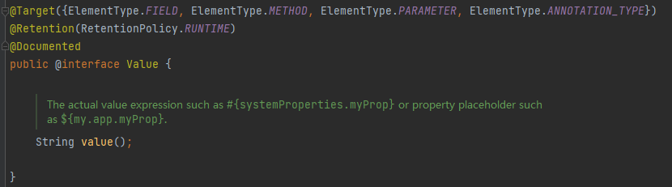

可以标注在 字段，方法，参数 ，其他注解上

通过${} #{} 获取值

例如：

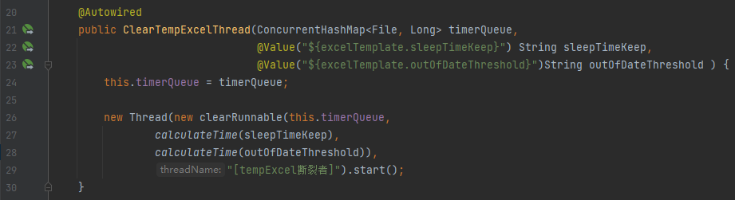


### @SpringBootApplication 

核心注解,将在 11.自动配置原理中 详细讲解 

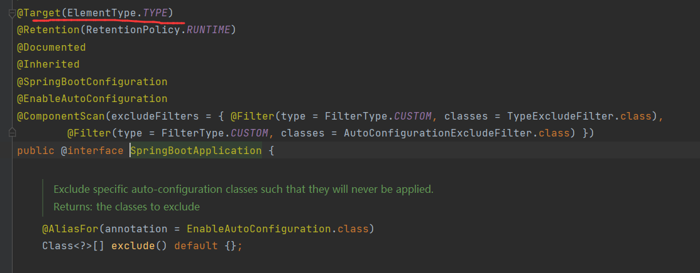

加在类上，标记，这是一个SpringBoot 应用

也称被它标记的类为  主程序类


```java
@SpringBootApplication
public class MainApplication {
    public static void main(String[] args) {
        SpringApplication.run(MainApplication.class,args);//主程序跑起来，传进去主类的Class，和参数args
    }
}
```

 

更改默认扫描包    //默认扫描的是主程序所在包，及其所有子孙包


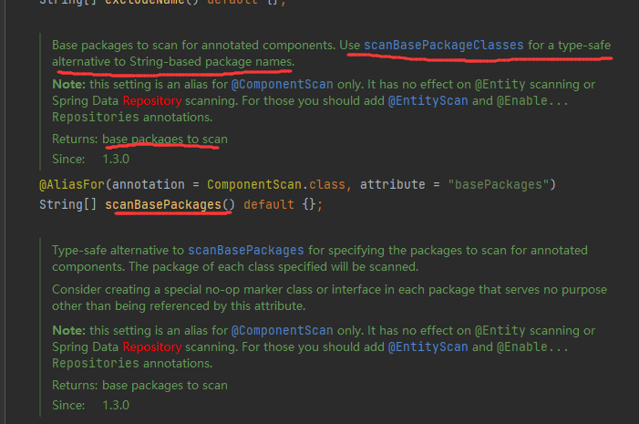


## 2.2 业务注解


### 2.2.1 @RequestMapping


#### 2.2.1.1 注解属性


String[] value  , String[] path

映射多个URI地址

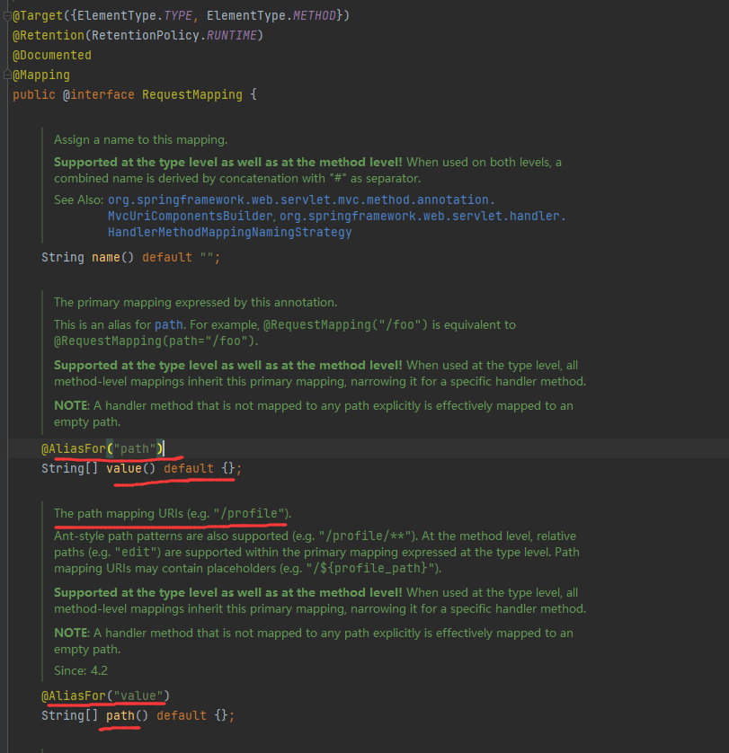


```java
@Controller
@ResponseBody
public class HelloController {

    @RequestMapping(value = {"/hello","hello-world"})
    public String handler01() {
        return "hello,springboot2";
    }
}
```


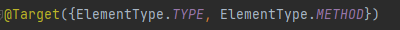

他可以加在类和方法上。

类和方法同时有，则方法的URI是类的子URI

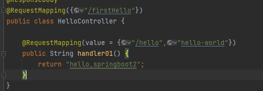


此时URI将变成  /firstHello/hello


RequestMethod

修改请求方式


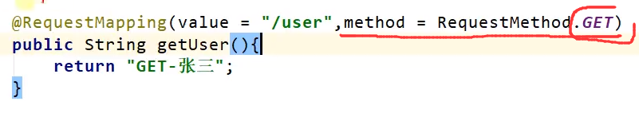

在Sringboot源码解析的时候，第一层解析只分析 是 GET方法或POST方法

只有在POST方法下，再去解析是否为DELETE 或PUT

具体的：

DELETE请求，或者是PUT请求，需要在POST请求体中存放一个entry    key固定  “_method”   value 为真正请求“DELETE”

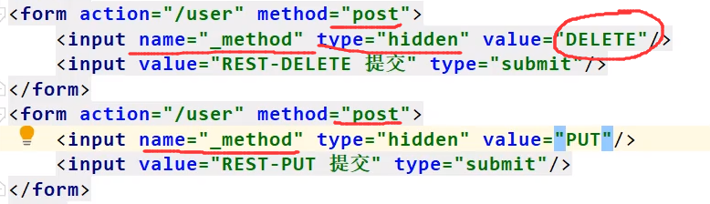


开启 方法过滤器

在webMvc自动配置类里面

```java
WebMvcAutoConfiguration
```


来看HiddenHttpMethodFilter方法（）

先看这个方法上的注解


@ConditionalOnMissingBean 只有当后面声明的类没有在Factory中注册。这个Bean才会被注册

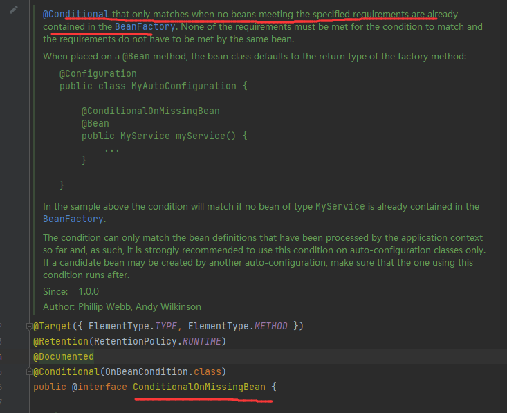


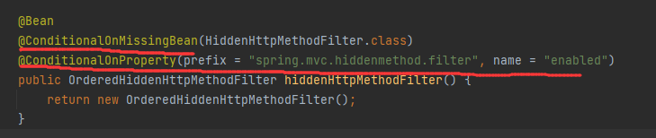


@ConditionalOnProperty 注解

条件被限制为：该属性没有被声明，或者该属性无法匹配到正确值，才会被启动。否则以客户的定制为主

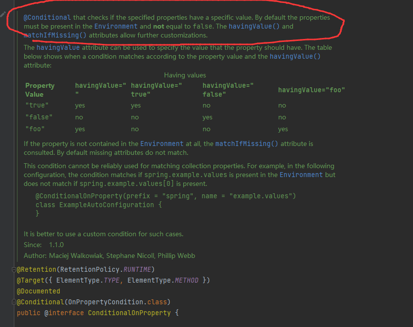

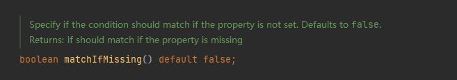

丢失配置时，默认是false也就是说，hiddenhttpMethodFilter默认是关闭状态

最后@ConditionalOnProperty  注解里的prefix 和name就是开启 方法过滤；

在application.yaml中显式定义  以开启过滤；


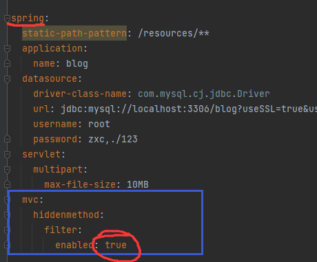


#### 2.2.1.2 RequestMappingHandlerAdapter

参考博客

https://cloud.tencent.com/developer/article/1525175


```
它是自Spring3.1新增的一个适配器类，拥有数据绑定、数据转换、数据校验、内容协商…等一系列非常高级的功能。
因为有了它的存在，使得开发者几乎可以忘掉原生的Servlet API且使用起来更加的的心用手，所以我认为它的出现是具有里程碑意义的。
```


这个类是 @RequestMapping注解的解析器

```
称之为 RequestMappingHandlerAdapter (处理拦截器)
```


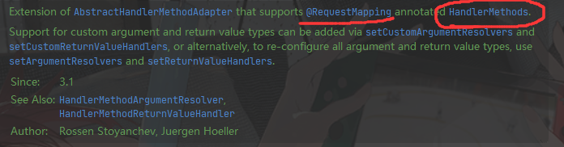


用于支持@RequestMapping注解的的  handler方法。


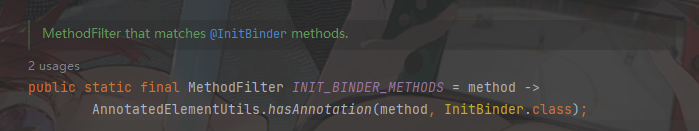

```
成员变量 init_binder_methods  ：  需要判断该方法是否有  InitBinder注解

使用了一个函数式接口： MethodFilter   方法过滤器。 传入一个方法，判断是否匹配对应规则。
```

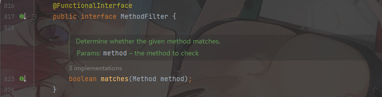


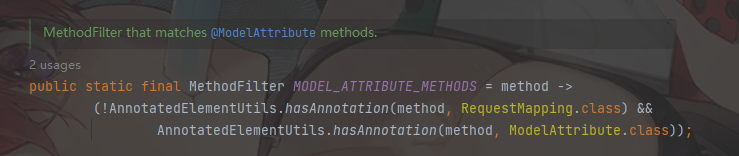

```

```


### @ResponseBody

target 方法/类

将方法 或 类中的所有方法都绑定给  web response 的body

返回值都写入 response体

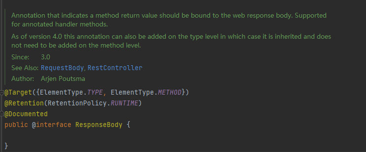


### @RequestBody

取得请求体

如果接收的容器是 HashMap 会自动解析json字符串


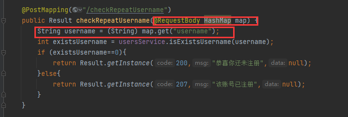


### @RequestAttribute

获取  请求域中的数据

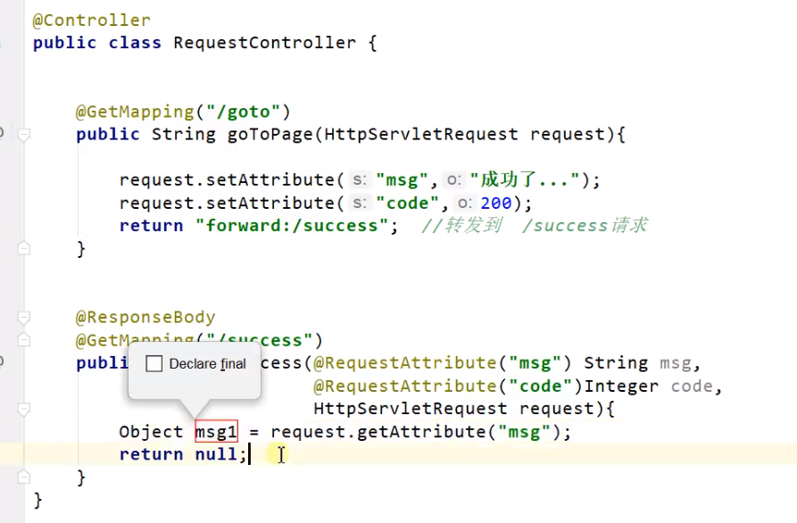


```java
returen "forward:/success";                       //转发请求
```

被@RequestAttribute 修饰的参数，将会被自动注入值；


### @RequestHeader

用于获取请求头参数。


这是一个请求头示例：

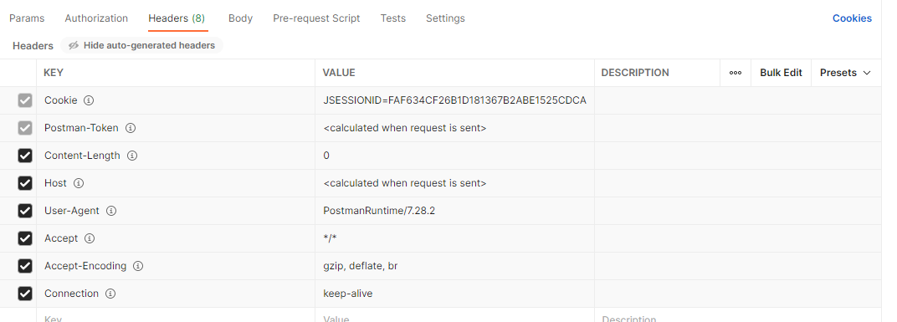


@RequestHeader加载方法参数之前，且只能修饰参数

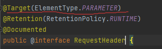

我们来使用一下@RequestHeader

```java
@ResponseBody
@RequestMapping({"/header1"})
public Result getHeader1(@RequestHeader("user-agent") String agent) {
    HashMap<Object, Object> map = new HashMap<>();
    map.put("usr-agent",agent);
    if (map.size()!=0) {
        return Result.success(200,"获取成功",map);
    }
    return Result.failure(400,"获取失败",null);
}
```

@RequestHeader("user-agent") 根据 value="user-agent" 匹配请求头中key

我们来看看返回结果

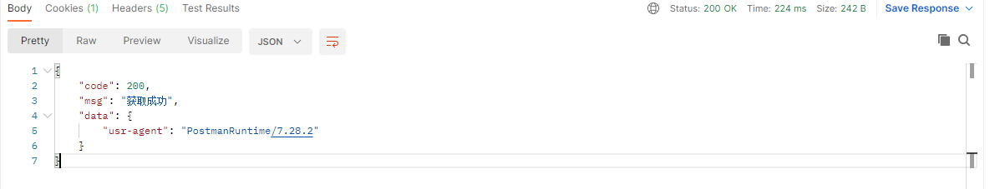

这是Postman 发的请求

```\
"usr-agent": "PostmanRuntime/7.28.2"
```

如果是浏览器的话

(这里使用了 json view插件)

```json
{
    code: 200,
    msg: "获取成功",
    data: {
    host: "localhost:8080",
    connection: "keep-alive",
    cache-control: "max-age=0",
    sec-ch-ua: "" Not;A Brand";v="99", "Google Chrome";v="91", "Chromium";v="91"",
    sec-ch-ua-mobile: "?0",
    upgrade-insecure-requests: "1",
    user-agent: "Mozilla/5.0 (Windows NT 10.0; Win64; x64) AppleWebKit/537.36 (KHTML, like Gecko) Chrome/91.0.4472.164 Safari/537.36",
    accept: "text/html,application/xhtml+xml,application/xml;q=0.9,image/avif,image/webp,image/apng,*/*;q=0.8,application/signed-exchange;v=b3;q=0.9",
    sec-fetch-site: "none",
    sec-fetch-mode: "navigate",
    sec-fetch-user: "?1",
    sec-fetch-dest: "document",
    accept-encoding: "gzip, deflate, br",
    accept-language: "zh-CN,zh;q=0.9",
    cookie: "Hm_lvt_eaa57ca47dacb4ad4f5a257001a3457c=1617606820,1617606838,1617607069,1618991281; Idea-31a5f394=52d38454-f47b-4803-9cd1-b17b4713aa13; JSESSIONID=899808BC0059C9797AEB80A690DCF26B",
    },
}
```

#### @RequestHeader 修饰Map

可以拿到全部的请求头中的  <K,Y>


 


### @PathVariable

这个注解用于获取 路径变量 里的变量值

在请求映射器的patterns中，被｛｝ 包裹的会被解析为变量

当客户端访问http://localhost:8080/car/5/owner/zhangsan时 就会解析成：

id=5

username=zhangsan


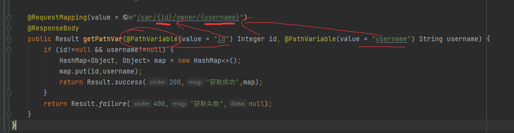


当然，在传入参数时，需要使用注解 @PathVariable 标记，这是一个路径变量。容器会自动注入这个对象。


测试一下访问结果：

以post方式访问


Response body：

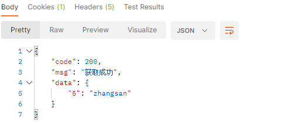


#### @PathVariable 修饰Map类型

如果被@PathVariable 注解修饰的是一个 Map变量，那么还将所有的 <K,Y>都注入到Map中

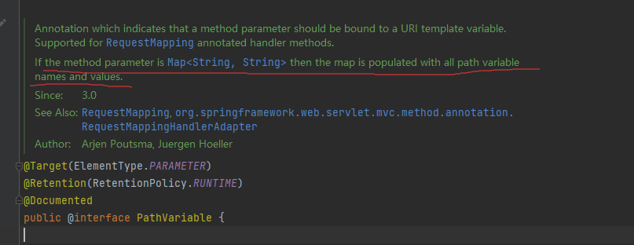


注释上说  当方法参数为Map<String,String>时，将会包含所有的 <K，Y>

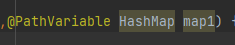

当不显示声明entry的类型的时候，即Object 也会被装入所有值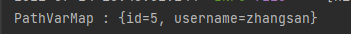


如果是这样

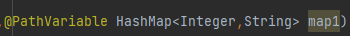

依然有值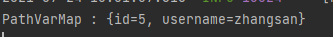

说明此处解释有误。


## @MatrixVariable

矩阵变量


首先引入queryString的概念

```http
http://localhost:8080/login?username=admin&password=admin
```

以？开始并在后面附上键值对以&连接的这种方式，称为queryString


**矩阵变量依托于路径变量**

矩阵变量的键值对，位于路径变量的{ }里，以 ; 为间隔


springboot矩阵变量默认关闭。


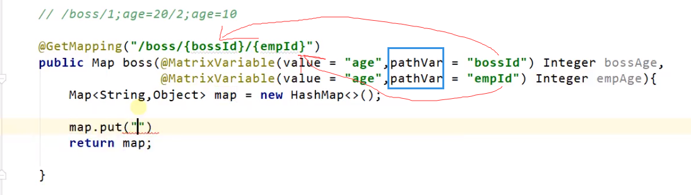


通过指定 pathVar="" 来指明获取某个路径变量下的 age值


## @CookieValue

获取Cookie的值

使用时需要指明 key

即 @CookieValue("cookieName")

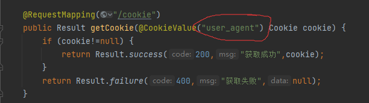


## @Validated   数据校验

@Email


## @RestController 

@RestController  = @Controller + @ResponseBody 


```

1)如果只是使用@RestController注解Controller，则Controller中的方法无法返回jsp页面，配置的视图解析器InternalResourceViewResolver不起作用，返回的内容就是Return 里的内容。

例如：本来应该到success.jsp页面的，则其显示success.

2)如果需要返回到指定页面，则需要用 @Controller配合视图解析器InternalResourceViewResolver才行。

3)如果需要返回JSON，XML或自定义mediaType内容到页面，则需要在对应的方法上加上@ResponseBody注解。
```


## @Component 和@Bean

Spring帮助我们管理Bean分为两个部分，一个是注册Bean，一个装配Bean。
完成这两个动作有三种方式，一种是使用自动配置的方式、一种是使用JavaConfig的方式，一种就是使用XML配置的方式。

@Compent 作用就相当于 XML配置

```java
@Component
public class Student {

    private String name = "lkm";

    public String getName() {
        return name;
    }

    public void setName(String name) {
        this.name = name;
    }
}
```

@Bean 需要在配置类中使用，即类上需要加上@Configuration注解

```java

@Configuration
public class WebSocketConfig {
    @Bean
    public Student student(){
        return new Student();
    }

}

```

两者都可以通过@Autowired装配

```java
@Autowired
Student student;
```

那为什么有了@Compent,还需要@Bean呢？
如果你想要将第三方库中的组件装配到你的应用中，在这种情况下，是没有办法在它的类上添加@Component注解的，因此就不能使用自动化装配的方案了，但是我们可以使用@Bean,当然也可以使用XML配置。


## @ServletConponentScan


@ServletComponentScan :     Servlet、Filter、Listener可以直接通过@WebServlet、@WebFilter、@WebListener注解自动注册，无需其他代码。

在SpringBootApplication上使用

```java
@ServletComponentScan
@SpringBootApplication
public class DispenseApplication {

    public static void main(String[] args) {
        ConfigurableApplicationContext run = SpringApplication.run(DispenseApplication.class, args);
    }

}
```


## @EnableAspectJAutoProxy

开启AOP自动配置。加在任意的配置类上即可

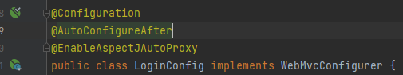


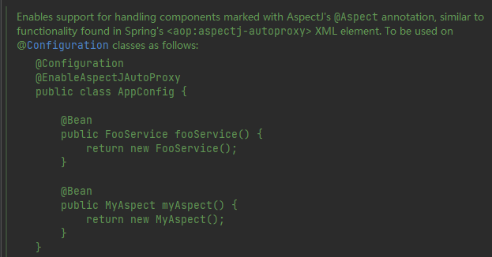

```
启用对@Aspect注解的支持。类似于 spring XML文件中的<aop:aspectj-autoproxy>
```


## @DependsOn

“依赖于”注解。专门用于配置解决Bean的依赖问题。

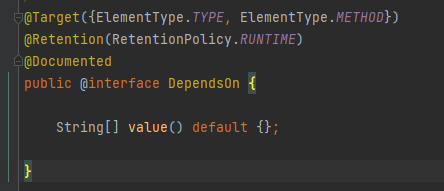

```
value 是一个String[]数组。
里面存放Bean的名字。

被DependsOn修饰的 ElementType.TYPE, ElementType.METHOD
只会在 value里的Bean全都加载完毕后，才尝试加载。
```

### 举例：

1. 例1

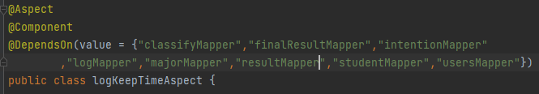

logKeepTimeAspect 被标记为Component组件。

```
当被DependsOn注解标记后，logKeepTimeAspect对象会在上述全部Bean都存在以后，才尝试加载。
```


## @PropertySource

配置源。 这个注解用于 指定资源文件读取的位置。

```
默认可以解析  properties , xml


并支持 自定义扩展解析器，传入一个默认不支持的资源格式，通过自定义一个解析器，依然能够支持解析。


//实现org.springframework.core.io.support.PropertySourceFactory 接口 即可实现自定义解析器

//spring默认提供了一个DefaultPropertySourceFactory 的实现，使之可以默认解析 properties xml文件
```


官方注解：


```
PropertySource 注解提供了一种 便利的,声明式的方式 向IOC容器中添加一个配置资源。
PropertySource注解应当标注在 @Configuration的类上。
```


### propertySource的属性


```java

	/**
	 * Indicate the name of this property source. If omitted, a name will
	 * be generated based on the description of the underlying resource.
	 * @see org.springframework.core.env.PropertySource#getName()
	 * @see org.springframework.core.io.Resource#getDescription()
	 */
	String name() default "";   //给当前的配置资源起一个名称

	/**
	 * 用于指明资源地址 ，不允许使用通配符。
	 * 资源地址有固定格式  classpath:/com/foo/foo.properties
	 *                 file:/path/to/file
	 */
	String[] value(); 

	/**
	 *找不到时，是否忽略
	 */
	boolean ignoreResourceNotFound() default false;  

	/**
	 * A specific character encoding for the given resources, e.g. "UTF-8".
	 * @since 4.3
	 */
	String encoding() default "";

	/**
	 * 自定义 配置源工厂，用于解析 PropertySource
	 */
	Class<? extends PropertySourceFactory> factory() default PropertySourceFactory.class;

```


### PropertySourceFactory

配置源工厂，用于加工生成一个配置源。自定义的资源解析器必须实现PropertySourceFactory接口

```java
public interface PropertySourceFactory {

	/**
	 * Create a {@link PropertySource} that wraps the given resource.
	 * @param name the name of the property source
	 * @param resource the resource (potentially encoded) to wrap
	 * @return the new {@link PropertySource} (never {@code null})
	 * @throws IOException if resource resolution failed
	 */
	PropertySource<?> createPropertySource(String name, EncodedResource resource) throws IOException;

}
```


#### DefaultPropertySourceFactory的内部实现

```java
public class DefaultPropertySourceFactory implements PropertySourceFactory {

   @Override
   public PropertySource<?> createPropertySource(String name, EncodedResource resource) throws IOException {
      return (name != null ? new ResourcePropertySource(name, resource) : new ResourcePropertySource(resource));
   }

}
```

```
createPropertySource方法，传入一个资源的名字，传入一个 EncodedResource 类型的资源 ，返回的是PropertySource 类型的资源
```


##### EncodedResource

EncodedResource类的方法


```
EncodedResource 类可以获得这个资源的  
InputStream
Encoding
charset
以及包装为  org.springframework.core.io.Resource 这个类
```


##### Resource

Resource类提供了如下的方法：


##### ResourcePropertySource

资源文件型 配置源。


```
ResourcePropertySource是 属性项配置源的子类。用于从一个资源文件中加载一个属性。
```

PropertySource参考[PropertySource](#5.6 PropertySource)


这个类没有什么东西，只有1个成员变量，表示原始文件的名称(并非@PropertySource传入的name)


这个类的核心只调用了一个 super类的构造方法


```
传入这个super方法之前
调用了 getNameForResource()方法，按照一定规则生成了这个文件的描述name //如果@PropertySource中name是缺省的情况下

使用了了关键方法  PropertiesLoaderUtils.loadProperties() 加载了资源
```


## @Pointcut

定义一个切入点。

```
其他AOP的注解，可以以全类名的形式，引用Pointcut
```


### 举例：

Pointcut的定义：


第二段为排除 指定的类下的指定方法。


## @Around

环绕通知增强


## @PostConstruct


# 3. application.properties


## 3.1 一些参数

### 3.1.1 server.servlet.context-path

项目名称。更改后，接口的URL发生改变

```yaml
server:
  servlet:
    context-path: /content1-2.0
    
    
debug: true  #开启debug模式。将显示debug级别的Log
```


你仍然可以使用

application.yml

application.yaml


springboot官方文档 配置

https://docs.spring.io/spring-boot/docs/current/reference/html/application-properties.html#application-properties


```properties
server.port=8888
```


application.properties里的每一项配置都会被映射到一个配置类上，根据配置信息，对这个配置类的某个变量修改。

在IOC容器中，这个配置类对象会被实例化


## 3.2.整合 Mybatis

pom.xml中引入依赖

```xml
<dependency>
    <groupId>org.mybatis.spring.boot</groupId>
    <artifactId>mybatis-spring-boot-starter</artifactId>
    <version>2.2.0</version>
</dependency>
```

application.yml中修改配置

```yaml
mybatis:
	#配置 别名的包
	type-aliases-package: com.crazyhh.dome.POJO
	#配置映射器的位置
	mapper-lications: classpath:mapper/*.xml 
	#综合配置
	configuration:
		#开启驼峰式命名转换
    	map-underscore-to-camel-case: true
    	
    	
spring:
      #配置数据源
	  datasource:
        driver-class-name: com.mysql.cj.jdbc.Driver
        url: jdbc:mysql://localhost:3306/blog?useSSL=true&useUnicode=true&characterEncoding=UTF-8&serverTimezone=GMT%2B8
        username: root
        password: zxc,./123
```


类路径下的 mapper包下的所有  *.xml


xxxMaper.xml 映射器配置文件

```xml
<?xml version="1.0" encoding="UTF-8" ?>
<!DOCTYPE mapper PUBLIC "-//mybatis.org//DTD Mapper 3.0//EN" "http://mybatis.org/dtd/mybatis-3-mapper.dtd" >

<mapper namespace="com.crazyhh.demo.Mapper.UsersMapper">
</mapper>
```

@MapperScan 注解，扫描某个包下的全部接口，相当于所有接口都标注了@Mapper


### 2.手撕MybatisAutoConfiguration

在引入的<mybtis-spring-boot-starter>中，导入了3个包


看jar后缀，autoConfigure 自动配置

点开，可以看到一个spring.factories，点开


可以看到，这里告诉了 spring IOC 容器，mybatis官方为mybatis与springboot自动整合的配置类


那我们就找到  MybatisAutoConfiguration 这个类的源码


上面是这个类的注解，一些生效的条件@Conditionalxxx

MybatisAutoConfiguration 在容器中注入了 sqlSessionFactory


### 3. 整合Mybatis-plus

引入依赖

```xml
<dependency>
    <groupId>com.baomidou</groupId>
    <artifactId>mybatis-plus-boot-starter</artifactId>
    <version>3.1.0</version>
</dependency>
```

IDEA中加入 MybatisX 插件

IDEA中连接上 Database


使用MybatisX 自动生成

修改自动生成参数：

选择 module path

一般basepath不需要改

base package需要改

relative package 就是 实体包


第二页参数

使用了  mybatis3的注解，使用了lombok插件


然后finish

自动生成的类是这样的

```java
package com.crazyhh.managementsystem.Mapper;

import com.crazyhh.managementsystem.POJO.Test;
import com.baomidou.mybatisplus.core.mapper.BaseMapper;

/**
 * @Entity com.crazyhh.managementsystem.POJO.Test
 */
public interface TestMapper extends BaseMapper<Test> {

}
```

可以看到 TestMapper接口继承了   BaseMapper<T>

BaseMapper<T> 就是Mybatis-plus的映射核心，其中**封装了**一些常见的**CURD**操作。大多数情况下调用其中继承来的方法即可。如果查询非常复杂，就可以在TestMapper接口下自己写查询语句


封装了


### 4.使用Mybatis-plus

@TableName() 使用TableName告诉Mybatis-plus 表名


## 3.3.springboot 整合redis

### 5.1导入依赖

```xml
<dependency>
    <groupId>org.springframework.boot</groupId>
    <artifactId>spring-boot-starter-data-redis</artifactId>
</dependency>
<dependency>
    <groupId>org.apache.commons</groupId>
    <artifactId>commons-pool2</artifactId>
</dependency>
```

### 5.2 yaml配置项


### 5.3 配置类 ** 很重要

```java
@EnableCaching
@Configuration
public class RedisConfig extends CachingConfigurerSupport {

    @Bean
    public RedisTemplate<String, Object> redisTemplate(RedisConnectionFactory factory) {
        RedisTemplate<String, Object> template = new RedisTemplate<>();
        RedisSerializer<String> redisSerializer = new StringRedisSerializer();
        Jackson2JsonRedisSerializer jackson2JsonRedisSerializer = new Jackson2JsonRedisSerializer(Object.class);
        ObjectMapper om = new ObjectMapper();
        om.setVisibility(PropertyAccessor.ALL, JsonAutoDetect.Visibility.ANY);
        om.enableDefaultTyping(ObjectMapper.DefaultTyping.NON_FINAL);
        jackson2JsonRedisSerializer.setObjectMapper(om);
        template.setConnectionFactory(factory);
        //key序列化方式
        template.setKeySerializer(redisSerializer);
        //value序列化
        template.setValueSerializer(jackson2JsonRedisSerializer);
        //value hashmap序列化
        template.setHashValueSerializer(jackson2JsonRedisSerializer);
        //开启事务支持
        template.setEnableTransactionSupport(true);
        return template;
    }

    @Bean
    public CacheManager cacheManager(RedisConnectionFactory factory) {
        RedisSerializer<String> redisSerializer = new StringRedisSerializer();
        Jackson2JsonRedisSerializer jackson2JsonRedisSerializer = new Jackson2JsonRedisSerializer(Object.class);
//解决查询缓存转换异常的问题
        ObjectMapper om = new ObjectMapper();
        om.setVisibility(PropertyAccessor.ALL, JsonAutoDetect.Visibility.ANY);
        om.enableDefaultTyping(ObjectMapper.DefaultTyping.NON_FINAL);
        jackson2JsonRedisSerializer.setObjectMapper(om);
// 配置序列化（解决乱码的问题）,过期时间600秒
        RedisCacheConfiguration config = RedisCacheConfiguration.defaultCacheConfig()
                .entryTtl(Duration.ofSeconds(600))
                .serializeKeysWith(RedisSerializationContext.SerializationPair.fromSerializer(redisSerializer))
                .serializeValuesWith(RedisSerializationContext.SerializationPair.fromSerializer(jackson2JsonRedisSerializer))
                .disableCachingNullValues();
        RedisCacheManager cacheManager = RedisCacheManager.builder(factory)
                .cacheDefaults(config)
                .build();
        return cacheManager;
    }
}
```


## 3.4 其他配置类


###  3.4.1  WebMvcConfigurer

使用JavaBean来配置MVC框架。可以自定义一些Handler，Interceptor，ViewResolver，MessageConverter

```
专门用于配置MVC的配置类。 使用时继承WebMvcConfigurer，并重写其中的方法即可。
```


参考文章

https://blog.csdn.net/zhangpower1993/article/details/89016503


可以重写，改变配置的方法如下：


常用的几个方法：

```java
 /* 拦截器配置 */
void addInterceptors(InterceptorRegistry var1);
/* 视图跳转控制器 */
void addViewControllers(ViewControllerRegistry registry);
/**
     *静态资源处理
**/
void addResourceHandlers(ResourceHandlerRegistry registry);
/* 默认静态资源处理器 */
void configureDefaultServletHandling(DefaultServletHandlerConfigurer configurer);
/**
     * 这里配置视图解析器
 **/
void configureViewResolvers(ViewResolverRegistry registry);
/* 配置内容裁决的一些选项*/
void configureContentNegotiation(ContentNegotiationConfigurer configurer);
```


#### 3.4.1.1 重写 addViewControllers

```
添加一些视图解析映射。  把url 和 视图地址关联映射
```


#### 3.4.1.2  addInterceptors

```
添加拦截器。

添加的拦截器需要实现 handlerInterceptor. 
用于设置拦截器的过滤路径规则 addPathPatterns("/**")对所有请求都拦截   addPathPatterns()
用于设置不需要拦截的过滤规则  excludePathPatterns()
```


```java
@Override
public void addInterceptors(InterceptorRegistry registry) {
    super.addInterceptors(registry);
    registry.addInterceptor(new TestInterceptor()).addPathPatterns("/**").excludePathPatterns("/emp/toLogin","/emp/login","/js/**","/css/**","/images/**");
}
```


#### 3.4.1.3 解决跨域

```java
@Override
public void addCorsMappings(CorsRegistry registry) {
    super.addCorsMappings(registry);
    registry.addMapping("/cors/**")
            .allowedHeaders("*")
            .allowedMethods("POST","GET")
            .allowedOrigins("*");
}
```


#### 3.4.1.4 消息转换

```
配置使用何种来解析Json字符串
```


```java
 
/**
* 消息内容转换配置
 * 配置fastJson返回json转换
 * @param converters
 */
@Override
public void configureMessageConverters(List<HttpMessageConverter<?>> converters) {
    //调用父类的配置
    super.configureMessageConverters(converters);
    //创建fastJson消息转换器
    FastJsonHttpMessageConverter fastConverter = new FastJsonHttpMessageConverter();
    //创建配置类
    FastJsonConfig fastJsonConfig = new FastJsonConfig();
    //修改配置返回内容的过滤
    fastJsonConfig.setSerializerFeatures(
            SerializerFeature.DisableCircularReferenceDetect,
            SerializerFeature.WriteMapNullValue,
            SerializerFeature.WriteNullStringAsEmpty
    );
    fastConverter.setFastJsonConfig(fastJsonConfig);
    //将fastjson添加到视图消息转换器列表内
    converters.add(fastConverter);
 
}
```


# 4.executable jar


直接把项目打成jar包，直接在目标服务器部署即可


# 5. 一些重要的类

记录一些Spring容器中重要的类。


## 5.1 ApplicatonContext

是一个接口。可以代指Spring容器本身。


```
一个控制接口，可以提供应用的配置信息。当应用已经运行时,applicationContext变为只读状态。
```


使用@Resource自动注入ApplicationContext类的对象，将注入一个 GenericWebApplicationContext的实现类对象。


```
这个接口实现了

ListableBeanFactory  (BeanFactory接口)
ResourcePatternResolver (ResourceLoader接口)
MessageSource 


```


### 5.1.1    实现的其他接口


#### 5.1.1.1 MessageSource 

消息国际化。

```
如果日后的程序将给其他语言使用，提供多语言的能力
```


##### 5.1.1.1.1 接口内方法：


```java
//code是消息的代码。根据code查找对应的翻译
//args是消息内可以动态填入一些变量，语法格式是  {0} {1,date}  ,{2,time}
//defaultMsg 如果没有找到对应的翻译,则返回 默认的消息
//Locale 代表了区域
String getMessage(String code, @Nullable Object[] args, @Nullable String defaultMessage, Locale locale);
```


```java
//没有默认消息,但会抛出匹配不到的异常
String getMessage(String code, @Nullable Object[] args, Locale locale) throws NoSuchMessageException;
```


```java
//使用 MessageSourceResolvable 这个类解决
String getMessage(MessageSourceResolvable resolvable, Locale locale) throws NoSuchMessageException;
```

参考[MessageSourceResolvable](#5.8 MessageSourceResolvable)


去哪里配置`code`对应的值呢？ 参考  [MessageSourceAutoConfiguration]()


#### 5.1.1.2  ResourceLoader

用于加载一个资源(Resource)

```
常见的子接口  ResourcePatternResolver
```


```java
		ConfigurableApplicationContext run = SpringApplication.run(TokenApplication.class, args);

		Resource[] resources = run.getResources("classpath:/*.properties");

        for (Resource resource : resources) {
            System.out.println(resource.getFilename());
        }

		//查找 jar包下的类路径
        for (Resource resource : run.getResources("classpath*:/META-INF/spring.factories")) {
            System.out.println(resource.getURL());
        }


        Resource resource = run.getResource("classpath:/SQl/schema.sql");
        System.out.println(resource.getFilename());
```


#### 5.1.1.3 ConfigurableApplicationContext


```java
ConfigurableEnvironment environment = run.getEnvironment();


System.out.println(environment.getProperty("java_home"));
System.out.println(environment.getProperty("server.port"));
```


ConfigurableEnvironment 这个类

包含了系统数据源 ，application.properties 数据源等

ss


#### 5.1.1.4  ApplicationEventPublisher

应用事件发布器。


应用事件 [ApplicationEvent](#)


## 5.2 BeanFactory接口

事实上,BeanFactory接口才是我们最熟悉 获取Bean的接口。


这个1接口提供了获得Bean的各种方法。


### 5.2.1 获得单个Bean


```
其中，还允许我们显式的传入构造参数。使用指定的构造方法来构造Bean
```


### 5.2.2 获取某种类型的多个Bean


详见5.3

## 5.3  ObjectProvider 接口


BeanFactory并没有直接为我们提供返回 not-unique 的API

而是提供了返回一个 ObjectProvider实例的方法 getBeanProvider(Class);


下面是ObjectProvider接口的描述：


```
这个接口被设计用于解决 “非唯一”Bean的返回。
```


可以看到这个接口提供的有Iterator(), stream ()  。

这样就可以轻而易举的控制某种类的全部Bean了


例如：

```java
...
           ObjectProvider<Fun1HandleChain> beanProvider = applicationContext.getBeanProvider(Fun1HandleChain.class);
        ArrayList<Fun1HandleChain> objects = new ArrayList<>();
        beanProvider.stream().forEach(objects::add);
    
...
```


## 5.4  xxxUtils

spring提供了一些 Utils工具类帮助开发。


### 5.4.1 BeanUtils

在实际开发中可能会使用的工具类。


#### 5.4.1.1  copyProperties

用于拷贝2个Bean 相同字段名的属性 (字段名不相同，无法匹配)


### 5.4.2 PropertiesLoaderUtils

加载Properties的工具。


#### 5.4.2.1  loadProperties

传入 EncodedResource ,解析出 Properties返回。


#### 5.4.2.2  fillProperties 


这个方法是 protected 修饰的方法，最终完成解析任务的是  PropertiesPersister.load()方法


## 5.5 PropertiesPersister


```
为 java.util.Properties的策略接口，允许插件式的 扩展策略。
```


```
提供了向指定Properties输入内容的方法。
```


## 5.6 PropertySource

配置源，从源文件中获得配置。


```
Abstract base class representing a source of name/value property pairs
```

PropertySource 是一个抽象类，代表了一个 KY对的数据源。


### 5.6.1 抽象方法

```
getName() //返回key

getSource() //返回源 T

public abstract Object getProperty(String name); //子类需要实现的方法， 返回参数指定的name对应的property
```


### 5.6.2 抽象类的实现类


#### 5.6.2.1  EnumerablePropertySource

子抽象类 EnumerablePropertySource (可枚举的配置源)


这个抽象类只有2个抽象方法:


#### 5.6.2.2 MapPropertySource


以 Map作为 Source的配置源。 PropertySource的泛型T 为 Map<String,Object>


#### 5.6.2.3  PropertiesPropertySource

配置项配置源。专门用于扩展 jdk的Properties类。

```
JDK的Properties类继承于Hashtable<Object,Object>, Hashtable<K,V>实现了 Map<K,V> 接口

所以PropertiesPropertySource恰好可以继承MapPropertySource类， 如下图
```


```
直接把Properties向上转型为source.  
这意味着，PropertiesPropertySource的配置项核心是一个  Properties对象
```


## 5.7    ConfigurationApplicationContext


可配置的ApplicationContext


其中ApplicationContext详细跳转  #5.1


## 5.8 MessageSourceResolvable

可解析的消息源。

```
本质上就是对  code defaultMessage  getArgs 的封装
```


## 5.9  MessageSourceAutoConfiguration

这是SpringBoot自动配置国际化资源的  配置类。


看看这个配置类都做了什么？


1.注入了一个 MessageSourceProperties的 Bean

```
这个 xxxProperties配置类在  springboot自动配置中非常常见。定义了各种可以通过application.yaml中配置的参数
```


2.注入了一个 MessageSource的Bean

```
具体实现类是ResourceBundleMessageSource
```


BaseName是如何初始化的呢？BaseName可以修改吗？


如何使用: 


使用时需要在对应的地区内准备好字符串：


```java
//...
ConfigurableApplicationContext run = SpringApplication.run(TokenApplication.class, args);
System.out.println(run.getMessage("sayHi", null, Locale.CHINA));
//...
```


对应国家的缩写在哪里？在Locale类中


在Web中，Locale的信息会在浏览器的请求头中告知用户使用的语言。


如果basename设置错误，会抛出这样的异常。


同时,需要修改IDEA中properties的 编码集为UTF8，否则可能出现乱码不支持


## 5.10 ApplicationEvent

```
org.springframework.context.ApplicationEvent
```


```
继承自 java.util.EventObject  额外添加了一个时间戳属性

private final long timestamp;

ApplicationEvent 事件是一个抽象类，不能被直接实例化，它有众多的实现类。
```


在Spring容器中任意一个组件都可以作为监听器。


### 5.10.1 简单使用


```java
... 
	ConfigurableApplicationContext run = SpringApplication.run(TokenApplication.class, args);
	run.publishEvent(new UserRegisteredEvent(run)); //发布Event 注意，event可以被多个监听器消费
...
```


实现一个ApplicationEvent

```java
public class UserRegisteredEvent extends ApplicationEvent {
    public UserRegisteredEvent(Object source) { //事件源
        super(source);  
    }
}
```


第一个监听器

```java
@Component
@Slf4j
public class UserRegisteredListener {
    @EventListener
    @Order(2147483647)  //监听器可以使用Order注解来排序
    public void doAware(UserRegisteredEvent event){
        Object source = event.getSource();
        Date date = new Date(event.getTimestamp());
        log.info("收到来自{}的用户注册事件 ,时间{}",source,date);

    }
}
```


```java
@Component
@Slf4j
public class UserRegisteredListener2{
    @EventListener
    @Order(2147483646)
    public void doAware2(UserRegisteredEvent event){
        log.info("do aware 2 : {}",event.getSource());
    }
}
```


## 5.11 BeanDefinition


```
BeanDefinition 描述了一个Bean的实例。 比如配置这个Bean的属性值，构造器参数值，以及未来被 Concrete结构支持的信息
```


### 5.11.1  接口方法


```java
	//如果父Definition存在,设置父Definition的名字
	void setParentName(@Nullable String parentName);

	//如果存在，返回父Definition的名字
	@Nullable
	String getParentName();
```


```java
	//声明Bean的Class名称
	//在Factory 后置处理过程中，这个Class的名字必须可以被修改
	//尤其是使用一个可解析的变量替换原始类名的时候
	void setBeanClassName(@Nullable String beanClassName);

	//返回当前BeanDefinition中 Bean的类名
	//当子Definition 继承或重写父Definition的时候，并不一定需要Runtime中真实的类名
	//此外，这可能只是调用工厂方法的类，或者在调用方法的工厂bean引用的情况下，它甚至可能是空的。因此，不要认为这是运行时的确定bean类型，而只是在各个bean定义级别将其用于解析目的。

	@Nullable
	String getBeanClassName();

```


```java
//设置一个scope  单例模式，还是原型
//BeanDefinition.SCOPE_SINGLETON
//BeanDefinition.SCOPE_PROTOTYPE
void setScope(@Nullable String scope);


@Nullable
String getScope();
```


```java

	//设置是否 懒启动
	void setLazyInit(boolean lazyInit);

	//返回是否 懒启动
	boolean isLazyInit();
```


```java

	//设置dependsOn 同@DependsOn注解一样的功能 ,传入Bean的名字
	//加载本Bean之前，优先加载DependsOn的中的Bean
	void setDependsOn(@Nullable String... dependsOn);

	//返回依赖的bean的名字
	@Nullable
	String[] getDependsOn();
```


```java
	/**
	 * 设置是否允许这个bean被自动autowired到其他Bean的依赖中
	 * 这个flag仅仅会影响 @Autowired注解
	 * 就算flag为false，不会影响 明确通过Bean名字的显式引用。
	 * 因此，如果名称匹配，按名称自动装配仍然会注入一个bean。
	 */
	void setAutowireCandidate(boolean autowireCandidate);

	/**
	 * Return whether this bean is a candidate for getting autowired into some other bean.
	 */
	boolean isAutowireCandidate();
```


```java
/**
 *  等价于 @Primary注解
 *
 */
void setPrimary(boolean primary);

/**
 * Return whether this bean is a primary autowire candidate.
 */
boolean isPrimary();
```


```java
    /**
     * 如果有的话，声明一个 factory bean 来使用
     * This the name of the bean to call the specified factory method on.
     * factoryBeanName 用于调用 指定的工厂方法
     * @see #setFactoryMethodName
     */
    void setFactoryBeanName(@Nullable String factoryBeanName);

    /**
     * Return the factory bean name, if any.
     */
    @Nullable
    String getFactoryBeanName();


	/**
	 * Specify a factory method, if any. 如果有的话，将声明一个 工厂方法
     * 这个方法将会 带上构造器参数调用, 或者是一个显式声明的 无参方法 
     
     * 如果有factory bean 的话，这个方法将会被 工厂bean调用 ，
     * 或者作为一个静态方法，存放在  本地的BeanClass (需要初始化的bean Class)
	 * @see #setFactoryBeanName
	 * @see #setBeanClassName
	 */
	void setFactoryMethodName(@Nullable String factoryMethodName);

	/**
	 * Return a factory method, if any.
	 */
	@Nullable
	String getFactoryMethodName();

	/**	
	 *  返回这个bean的构造器参数值
	 * 返回的实例值，可以在 工厂后置处理过程中改变 
	 The returned instance can be modified during bean factory post-processing.
	 * @return the ConstructorArgumentValues object (never {@code null})
	 */
	ConstructorArgumentValues getConstructorArgumentValues();

	/**
	 * Return if there are constructor argument values defined for this bean.
	 * @since 5.0.2
	 */
	default boolean hasConstructorArgumentValues() {
		return !getConstructorArgumentValues().isEmpty();
	}
```


[ConstructorArgumentValues](#5.12  ConstructorArgumentValues)


### 5.11.2 BeanDefinitionBuilder

构造器


## 5.12  ConstructorArgumentValues

构造器参数值。 构造函数参数值的Holder，通常作为bean定义的一部分。


```
根据索引，添加一个构造器参数值
```


## 5.13 MethodParameter

这是一个基础的类。用于描述一个方法的参数。  在org.springframework.core包下


```
封装方法参数规范的助手类，即方法或构造函数加上参数索引和已声明泛型类型的嵌套类型索引。作为传递的规范对象很有用。
```


### 5.13.1  类方法


```
获得 MethodParameter 对应的方法
```


```
如果指代的方法是一个构造函数，返回对应的构造函数，否则返回Null
```


## 5.14


# 6.实战项目


```
这一章节主要记录SpringBoot 实际项目中，遇到的零碎知识点。用于翻阅查询。
```


## 6.1.自动封装参数&自动注入


```
对于@Controller @RestController 层的方法参数。spring容器会自动注入相关的参数：例如HttpServletRequest HttpServletResponse ，
甚至是@RequestParam 请求参数，@RequestBody 请求体等等。

除此以外，如果是前后端不分离的项目还可以注入  Model,Session等
```


成员变量自动注入:


```
这个功能其实属于Spring容器的功能，在创建一个对象的时候，自动注入变量所需要的成员变量(被@Autowired @Resource 标注的变量)。
```


## 6.2 统一结果封装


对于前后不分离的项目来说，在后端返回给前端结果时，需要统一封装结果。


封装的格式：

```
状态码   int code
消息     String msg
返回数据  HashMap data  //如果没有则为null
```


提供一个类似思路的封装结果 R

```java
@Data
public class R extends HashMap<String, Object> {

	private static final long serialVersionUID = 1L;

	private boolean hasError = false;

	public R() {
		put("code", 0);
		put("msg", "success");
	}
	
	public static R error() {
		R error = error(HttpStatus.SC_INTERNAL_SERVER_ERROR, "未知异常，请联系管理员");
		error.setHasError(true);
		return error;
	}
	
	public static R error(String msg) {
		R error = error(HttpStatus.SC_INTERNAL_SERVER_ERROR, msg);
		error.setHasError(true);
		return error;
	}
	
	public static R error(int code, String msg) {
		R r = new R();
		r.put("code", code);
		r.put("msg", msg);
		r.setHasError(true);
		return r;
	}

	public static R ok(String msg) {
		R r = new R();
		r.put("msg", msg);
		return r;
	}
	
	public static R ok(Map<String, Object> map) {
		R r = new R();
		r.putAll(map);
		return r;
	}
	
	public static R ok() {
		return new R();
	}

	public R put(String key, Object value) {
		super.put(key, value);
		return this;
	}
	public  Integer getCode() {
		return (Integer) this.get("code");
	}

	public boolean hasError(){
		return this.hasError;
	}

}

```


一个使用实例：

```java
@RequestMapping("/list")
public R list(@RequestParam Map<String, Object> params){
    PageUtils page = memberLoginLogService.queryPage(params);
    return R.ok().put("page", page); //将Service调用的方法put进R中。 R继承了HashMap
}
```


## 6.3. JWT   

Json web token

```
通过JSON形式作为Web应用中的令牌，用于在各方之间安全地将信息作为JSON对象传输。在数据传输过程中还可以完成数据加密、签名等相关处理。
```


JWT作用：
```
授权：一旦用户登录，每个后续请求将包括JWT，从而允许用户访问该令牌允许的路由，服务和资源。它的开销很小并且可以在不同的域中使用。如：单点登录。
信息交换：在各方之间安全地传输信息。JWT可进行签名（如使用公钥/私钥对)，因此可确保发件人。由于签名是使用标头和有效负载计算的，因此还可验证内容是否被篡改.
```


参考博客

https://blog.csdn.net/Top_L398/article/details/109361680


## 6.4. JSR-303  请求参数校验


### 1.为什么要 参数校验


### 2.什么是 JSR

Java Specification Requests

```
java 规范提案 。可以向JCP(Java Community Process)提出新增一个标准化技术规范的  正式请求。


任何人都可以提交JSR，以向Java平台增添新的API和服务。JSR已成为Java界的一个重要标准。
```


### 3. JSR-303定义的是什么标准？

JSR-303 是JAVA EE 6 中的一项子规范，叫做Bean Validation，**Hibernate Validator** 是 Bean Validation 的参考实现 . Hibernate Validator 提供了 JSR 303 规范中所有内置 constraint 的实现，除此之外还有一些附加的 constraint。

**Bean Validation中内置的constraint**


**Hibernate Validator附加的constraint**


### 4. 快速入门

我们先来做一个简单的例子，比如：定义字段不能为`Null`。只需要两步

**第一步**：在要校验的字段上添加上`@NotNull`注解，具体如下：

```java
@Data
public class User {    
  
    private Long id;    
    @NotNull    
    private String name;    
    @NotNull     
    private Integer age;
}
```

**第二步**：在需要校验的参数实体前添加`@Valid`注解，具体如下：

```java
@PostMapping("/user")
@RestController
public class userController {
    @PostMapping("/post")
    public String postUser(@Valid @RequestBody User user) {
        
        ... 
            
        return "success";
    }
}
```

### 5.@Valid

用于验证注解是否符合要求，直接加在变量user之前，在变量中添加验证信息的要求，当不符合要求时就会在方法中返回message 的错误提示信息。


## 6.6.实现 文件上传


### 什么是MultipartFile

MultipartFile是spring类型，代表HTML中form data方式上传的文件，包含二进制数据+文件名称。


uploadController 类如下

```java
@Controller
public class uploadController {

    @RequestMapping("/")
    public String uploadPage() {
        return "upload";
    }

    String path="D:\\";   //保存的本地路径

    @ResponseBody
    @RequestMapping("/upload") 
    public Result upload(@RequestParam(value = "file") MultipartFile file) {   //此处使用@Requestpart
                                                                               //@RequestParam 均可以
                                                                         //使用 value=“” 可以获取指定name的参数
                                                                     //value可以省略，可以通过相同的形参名匹配。
        System.out.println(file);
        String originalFilename = file.getOriginalFilename();
        try {
            InputStream inputStream = file.getInputStream();
            FileOutputStream fileOutputStream = new FileOutputStream(path+originalFilename);
            byte[] buffer = new byte[1024];
            int i;
            while ((i=inputStream.read(buffer))!=-1) {
                fileOutputStream.write(buffer,0,i);
            }
            fileOutputStream.close();
            inputStream.close();
        } catch (Exception ioException) {
            ioException.printStackTrace();
        }
        return Result.success(200,"传输成功",null);
    }
}
```


upload.html 如下

```html
<!DOCTYPE html>
<html lang="en">
<head>
    <meta charset="UTF-8">
    <title>Title</title>
</head>
<body>
<form method="post" action="/upload" enctype="multipart/form-data">
  <input type="file" name="file"/>
    <input type="submit" value="submit"/>

</form>
</body>
</html>
```


这里准备了一个解决重命名的简单实现

空间复杂度O(1) 

时间复杂度不确定。

```java
/**
 *
 *
 * Param  File oldPath  传入旧文件，如果该文件已存在，则在后面标（1）返回新File ，若仍存在则（2）以此类推
 */

public class repetitiveFileName {
    static public File getNewFile(File oldPath) {
        String path = oldPath.getParent();
        String originalFilename = oldPath.getName();
        File outfile = new File(path+originalFilename);
        if (outfile.exists()) {
            if(originalFilename.contains(".")) {
                String[] splitByPoint = originalFilename.split("\\.");
                if (splitByPoint[0].matches(".*\\(\\d*\\)")) {
                    String[] split = splitByPoint[0].split("\\(");
                    String[] split1 = split[1].split("\\)");
                    Integer d = Integer.valueOf(split1[0])+1;
                    String newPath=path+split[0]+"("+d+")."+splitByPoint[1];
                    return new File(newPath);
                }
                else  {
                    String newPath=path+splitByPoint[0]+"(1)."+splitByPoint[1];
                    return new File(newPath);
                }
            }
            else  {
                if (originalFilename.matches(".*\\(\\d*\\)")) {
                    String[] split = originalFilename.split("\\(");
                    String[] split1 = split[1].split("\\)");
                    Integer d = Integer.valueOf(split1[0])+1;
                    String newPath=path+split[0]+"("+d+")";
                    return new File(newPath);
                }
                else  {
                    String newPath=path+originalFilename+"(1)";
                    return new File(newPath);
                }
            }
        }
        return oldPath;
    }
}
```


### 上传最大文件大小


=====================================================

另一种实现：

ajax 发送的post请求。

使用的是  file.transferTo(File f)；方法。

```java
	@RequestMapping("/upload")
    @ResponseBody
    public ReqResult upload(@RequestParam("file") MultipartFile file, @RequestParam("majorName") String majorName) {
        try {
            if (file.isEmpty()) {
                return ReqResult.getInstance(500, "空文件失败!", null);
            }
            String originalFilename = file.getOriginalFilename();
            File dest = new File(filepathPrefix + originalFilename);
            System.out.println(dest.getAbsolutePath());
            Long majorId = majorService.getMajorIdByYearAndMajorName(majorName, calendar.get(Calendar.YEAR));

            log.info(originalFilename);
            log.info(majorId);

            MakeUpperDirs.mkDirs(dest.getParentFile());
            file.transferTo(new File(dest.getAbsolutePath()));
//            if (file.getName().endsWith(".xls")){
//                LoadStudent.LoadStudent(dest,studentService,majorId);
//            }
            return ReqResult.getInstance(200, "导入成功", null);
        } catch (Exception e) {
            log.warn(e.getMessage());
            return ReqResult.getInstance(500, "未知错误请联系管理员", null);
        }
    }
```


file.transferTo(File f)；方法有坑，传入的File f 如果是相对地址，就会导向：

```
C:\Users\xxxx\AppData\Local\Temp\tomcat.xxxxxx.8080\work\Tomcat\localhost\ROOT\upload\xxxxxxx.xxx
```

所以传入了绝对地址：

file.transferTo(new File(dest.getAbsolutePath()));


两种方法对流操作熟悉，还是使用流吧。


## 6.7.拦截器  interceptor


拦截器本质上还是一个Filter ，Spring将Filter封装为更简单易用的Interceptor 用于拦截过滤一部分请求


可以参考#


### 6.7.1.定义拦截器

想要定义一个拦截器 必须实现  HandlerInterceptor 接口


### 6.7.2 添加拦截器

拦截器本身定义好了以后，并不能直接使用。必须按照固定格式将其实例对象注册到SpringMVC中

可以参考  [添加拦截器](#3.4.1.2  addInterceptors) 使用


加上@Configuration注解  ，实现WebMvcConfigurer接口


重写 addInterceptors(InterceptorRegistry  registry)


InterceptorRegistry类的方法

```java
/**
 * Adds the provided {@link HandlerInterceptor}.
 * @param interceptor the interceptor to add
 * @return an {@link InterceptorRegistration} that allows you optionally configure the
 * registered interceptor further for example adding URL patterns it should apply to.
 */
 
public InterceptorRegistration addInterceptor(HandlerInterceptor interceptor) {
   InterceptorRegistration registration = new InterceptorRegistration(interceptor);
   this.registrations.add(registration);
   return registration;
}
```

返回一个 拦截器注册信息类  InterceptorRegistration

InterceptorRegistration类中的 addPathPatterns 方法 添加拦截器生效的URL。这个方法返回他自己，便于我们后续操作


excludePathPatterns  ，拦截器要放行的URL。可以看到返回的是 一个方法的调用；


调用的是下面这个方法，把不定参数的patterns 转换成ArrayList形式。return this;


因为方法总是返回this 所以，我们可以使用聚合操作。

```java
@Override
public void addInterceptors(InterceptorRegistry registry) {
    registry.addInterceptor(new LoginInterceptor())
            .addPathPatterns("/**")
            .excludePathPatterns("/login","/index");
}
```


### 6.7.3 静态资源被拦截问题

值得注意的是： 

```java
.addPathPatterns("/**")
```

将会拦截所求请求，对静态资源的访问也会被拦截

**解决办法1：**


将放行  static 包下的   css包 js包 images包等。


**解决办法2**


在配置文件里修改静态资源前缀


## 8.静态资源


修改

spring.mvc.static-path-pattern


## 9.自动封装POJO对象

Controller层的方法会自动封装 POJO对象。  这和   [6.1使用Request对象](#6.1.使用Request对象) 中提到的自动注入方法参数说的是一回事情。


准备一个POJO类


准备一个静态html

```html
<form action="/register/reg" method="post">
  id : <input type="text" value="123465161" name="id"> <br>
  name : <input type="text" value="青空" name="name"> <br>
  account : <input type="text" value="admin" name="account"> <br>
  password : <input type="text"  value="admin" name="password"><br>
  email : <input type="text" value="1832187999@qq.com" name="email"><br>
  lastLogin : <input type="text" value="465716540" name="lastLogin"><br>
  mobilePhone : <input type="text" value="13604678804" name="mobilePhone"><br>
  salt : <input type="text" name="salt"><br>
  <input type="submit" value="提交">
</form>
```

注意 name和 POJO的 properties字段名相对应


准备一个Controller

```java
@Controller
public class registerController {

    @ResponseBody
    @RequestMapping(value = {"/register/reg"})
    public Result registerUser(Users user) {
        if (user!=null) {
            return Result.success(200,"自定义类(User对象)获取成功",user);
        }
        return Result.failure(200,"自定义类(User对象)获取失败",null);
    }


    @RequestMapping("/register")
    public String goToRegisterPage() {
        return "Users";
    }
}
```

注意到registerUser方法的参数类型是  Users类型


返回结果如下：


根据controller的代码，我们将Users类的实例对象user返回给了页面。也就是说，Springboot自动帮我们完成了POJO对象的封装

### 支持封装级联属性

​	我们甚至还以这样：


## 10.异常处理机制


### 10.1  whitelabel Error Page  空白的错误页面

springboot自带了一个错误页面   /error

如果是 浏览器端，则会返回  error page 错误页面。


如果不是浏览器端，（机器客户端）则会返回json  如，postman


### 10.2. custom error page  自定义错误页面


#### 10.2.1 在有 thymeleaf模板引擎的情况下:


放在静态资源目录下的 error/下


放在模板页面下的  error/下


命名为 5xx.html 时，所有5开头的错误都将相应这个html

使用时，需要在404.html页面中，引入 thymeleaf的约束

```xml
<html lang="en" xmlns:th="http://www.thymeleaf.org">
```


模板引擎可以渲染的错误信息：


#### 10.2.2 没有模板引擎下

将error 文件夹移入 static 目录下。同时，无法渲染上述的各种错误信息;


### 10 .3 异常处理自动配置原理

自动配置类的路径： 


```java
ErrorMvcAutoConfiguration 类
    @Bean
    DefaultErrorAttributes 
    
    @Bean
    BasicErrorController
    
    @Bean
    ...
```


可以看到配置了  DefaultErrorAttributes 和 BasicErrorController 等

BasicErrorController 一看是Controller控制器，点开它的源码一看

可以看到，映射的地址:动态取出 错误页面的配置路径（server.error.path）下的/error页面

看到这里，我们就知道如何修改错误页面的自动解析路径了：

显然，默认应该是这样的   classpath:/templates/error

我们可以改成  classpath:/templates

这样，就不会自动解析 /error/下的400.html

而是  /templates下的400.html


## 6.11  向容器中注入 三大原生组件 Servlet filter listener

有时我们可能会遇到这样的需求，注入原生的 Servlet，Filter,Listener

SpringMVC支持这样操作。


### 11.1 使用Servlet API

@ServletComponentScan(basePackages)  指定扫描哪些包，这个注解加在 启动类上的

```java
@ServletComponentScan(basePackages = "com.crazyhh.demo")
@SpringBootApplication
public class DemoApplication {
    public static void main(String[] args) {
        ConfigurableApplicationContext context= SpringApplication.run(DemoApplication.class, args);
    }
}

```


@WebServlet @WebFilter @WebListener  声明这是一个 Servlet/Filter/Listener

```java
import javax.servlet.annotation.WebFilter;
import javax.servlet.annotation.WebServlet;

//这三个仍然是javax 里的原生注解
//使用Servlet时，通过Springboot 注册的Filter不会生效，因为这个Servlet没有在IOC容器中注入，IOC显然不知道有这个Servlet
//urlPatterns[]   在javax中，全部请URI为/*   springboot为  /**
```

### 11.2  使用RigistrationBean 

 ServletRegistrationBean 类

上源码：


这是一个 Servlet上下文初始化器，用于给3.0+版本的容器中注册Servlet

它的构造方法

```java
public ServletRegistrationBean(T servlet, String... urlMappings) {//调用的是下面的方法
    this(servlet, true, urlMappings);
}

/**
 * Create a new {@link ServletRegistrationBean} instance with the specified
 * {@link Servlet} and URL mappings.
 * @param servlet the servlet being mapped
 * @param alwaysMapUrl if omitted URL mappings should be replaced with '/*'
 * @param urlMappings the URLs being mapped
 */
//传入一个 Servlet ，传入布尔值 总是映射Url吗？  , 传入映射地址
public ServletRegistrationBean(T servlet, boolean alwaysMapUrl, String... urlMappings) {
    Assert.notNull(servlet, "Servlet must not be null");
    Assert.notNull(urlMappings, "UrlMappings must not be null");
    this.servlet = servlet;
    this.alwaysMapUrl = alwaysMapUrl;
    this.urlMappings.addAll(Arrays.asList(urlMappings));
}
```

```java
@Configuration  //需要标记为配置类
public class xxx{
    @Bean//用@Bean注解标记，将RegistrationBean 注入到容器中，RegistrationBean中配置的Servlet就会生效
    public ServletRegistrationBean myServlet() {
        MyServlet myServlet = new MyServlet();
        return new ServletRegistrationBean(myServlet,"/css/**");
    }
}
```


FilterRegistrationBean类

源码：

向3.0+ Servlet容器中注入Filter

构造方法


父类的构造方法


构造方法中，没有直接设置 urlPatterns的，不过urlPatterns有setter方法


```java
@Configuration(proxyBeanMethods = true)  //需要标记为配置类，同时依赖组件是单实例的
public class xxx{
    @Bean
    public FilterRegistrationBean myFilter() {
    FilterRegistrationBean<Filter> FilterRegistrationBean = new FilterRegistrationBean<>(new MyFilter());
    FilterRegistrationBean.setUrlPatterns(Arrays.asList("/*"));
    return FilterRegistrationBean;
    }
}
```


ListenerRegistrationBean


## 6.12  qqConnect Api


需要引入 qqConnect SDK

https://wiki.open.qq.com/wiki/mobile/API%E8%B0%83%E7%94%A8%E8%AF%B4%E6%98%8E#1.21_.E4.B8.80.E9.94.AE.E5.8A.A0.E7.BE.A4

腾讯官方api文档


### 12.1   一键加群

腾讯官方提供的加群组件

https://qun.qq.com/join.html


## 6.13 定制化 Springboot


也就是使用@Configuration注解配置。


 


### 6.13.1 定制化json序列化器

```
JSON需要定制化的两个方面:  序列化器和 反序列化器
```


Serializer<T> 序列化器。   javaBean对象 序列化为json字符串。

Deserializer<T>反序列化器。  json字符串解析为 javaBean对象。


实现这两种 序列化器、反序列化器。即可完成自定义序列化。


### 6.13.2  jackson本体定制

对json本体的定制化依赖于 ObjectMapper  参考下列博客

https://blog.csdn.net/qq_41834086/article/details/111152470


### 6.14.3 springboot 定制

```
SpringBoot提供了专门的注解用于定制。
```


1. 加入@JsonComponent 注解
2. 实现对应的 序列化器、反序列化器


#### 5.14.3.1 例1


## 6.14  加密


### 6.14.1 BCrypt

一种加密算法。


总署BCrypt 需要参考博客

https://www.jianshu.com/p/2b131bfc2f10


#### 6.14.1.1 Spring.security 与 BCrypt

spring.security 提供了一种非常简单的 BCrypct使用方法。

```java
    @Test
    public void testForBCrypt(){

        BCryptPasswordEncoder encoder = new BCryptPasswordEncoder();

        String encode = encoder.encode("123456");
        System.out.println(encode);
        boolean matches = encoder.matches("123456",
                "$2a$10$eFnLfCWBTW..3pD/e9PsA.y3njbYrM7aWUkXxmsrnD/raprjam7sq");
        System.out.println(matches);

    }
```


只需要new一个BCryptPasswordEncoder对象。


调用 encode即可加密

调用matches() 传入原始，和加密结果，即可判断是否匹配。


### 6.14.2  MD5


apache.commons 包内提供了MD5的工具


直接调用静态方法即可


# 7.thymeleaf 模板引擎

thymeleaf模板引擎，用于前后不分离项目。用于服务器解析渲染H5页面，返回给客户端。


不在任何标签内，使用行内（inlining）写法


在session中，使用    

```
[[${session.<attributeName>}]]
```


## 7.1 thymeleaf的使用


### 7.1.1 POM导入依赖

spring-boot-start-thymeleaf

```xml
<dependency>
    <groupId>org.springframework.boot</groupId>
    <artifactId>spring-boot-starter-thymeleaf</artifactId>
</dependency>
```

### 7.1.2.在html中，引入namespace

```html
<html lang="en" xmlns:th="http://www.thymeleaf.org">
```


```html
<!DOCTYPE html>
<html lang="en" xmlns:th="http://www.thymeleaf.org">
<head>
    <meta charset="UTF-8">
    <title >thymeleafTest</title>
</head>
<body>
<h1 th:text="${msg}">夏天的风</h1>
<h1 >
    <a th:href="@{website}" href="www.baidu.com">链接</a>
    <a th:href="${website}" href="www.baidu.com">链接</a>
</h1>
</body>
</html>
```

### 7.1.3 编写Controller

编写跳转 `Controller`

```java
@Controller
public class gotoController {

    @RequestMapping("goto")
    public String goToThymeleaf(Model model) {
        model.addAttribute("msg","helloWorld!");
        model.addAttribute("website","www.baidu.com");
        return "thymeleaf";
    }
}
```

在传入参数的时候，定义一个  `Model` 模型，用于向模板引擎传递数据。

调用  `model.addAttribute（String key,Object value）`方法 ，在请求域中放入属性值，模板引擎拿到数据以后，渲染在h5页面上。


修改文本值使用  `th:text`

修改属性值使用  th:<属性名称> 即  th:href 


## 7.2 抽取公共区域

使用 th:fragment="Name"   声明


使用 th:insert=“~{PageName :: 名字}” 引用


还可以直接使用 th:insert="~{footer :: # idName}"  引用id名


## 7.3 其他知识点

### 7.3.1 使用 th:href="{@/}"

使用 th:href="@{/}" 动态路径，项目名更改后，会自动变更


使用 th:href="@{/}" 时，当改变了 项目名(在Springboot项目中，他叫servlet.context.path )时，会自动改变href的地址。


跳转页面。 


### 7.3.2.动态 table

使用 th:each

```xml
<thead>
<tr>
    <th>id</th>
    <th>帐号</th>
    <th>密码</th>
    <th>邮箱</th>
    <th>注册日期</th>
</tr>
</thead>

<tbody>
<tr class="gradeA" th:each="user,stats:${Users}">
    <td th:text="${user.id}"></td>
    <td th:text="${user.account}"></td>
    <td th:text="${user.password}"></td>
    <td th:text="${user.mail}"></td>
    <td th:text="${registerDate.get(stats.index)}"></td>
</tr>
```


## 7.4 更多的标准表达式语法

More standard expression syntax


```xml
<label th:for="check+${stats.count}"></label>
```


所有这些功能都可以组合和嵌套：


```html
'User is of type ' + (${user.isAdmin()} ? 'Administrator' : (${user.type} ?: 'Unknown'))
```

### OGNL

我们已经提到`${...}`表达式实际上是在上下文中包含的变量映射上执行的 OGNL（对象图导航语言）表达式。

OGNL 允许我们创建更强大的表达式

```java
/*
 * Access to properties using the point (.). Equivalent to calling property getters.
 * 通过使用 . 来访问某个变量的属性。等效于调用了gett方法
 */
${person.father.name}

/*
 * Access to properties can also be made by using brackets ([]) and writing 
 * the name of the property as a variable or between single quotes.
 访问数组
 */
${person['father']['name']}

/*
 * If the object is a map, both dot and bracket syntax will be equivalent to 
 * executing a call on its get(...) method.
 */
${countriesByCode.ES}
${personsByName['Stephen Zucchini'].age}

/*
 * Indexed access to arrays or collections is also performed with brackets, 
 * writing the index without quotes.
 */
${personsArray[0].name}

/*
 * Methods can be called, even with arguments.
 可以直接访问方法，并同时传入参数
 */
${person.createCompleteName()}
${person.createCompleteNameWithSeparator('-')}
```

expression utility object


## 7.5  常用标签

https://blog.csdn.net/fulq1234/article/details/85003273


## 7.8 表达式 工具对象


# 9. 缓存 SpringCache


## 9.1  使用SpringCache


SpringCache希望使用统一的接口来管理缓存。使用注解就省去了繁琐的格式化取存缓存操作。


```
这意味着SpringChace支持Redis 等缓存中间件。
```


### 9.1.1 引入依赖

使用SpringCache需要引入相关依赖

```xml
        <dependency>
            <groupId>org.springframework.boot</groupId>
            <artifactId>spring-boot-starter-cache</artifactId>
        </dependency>
```


### 9.1.2 修改配置

SpringBoot引入了缓存的自动配置。

CacheAutoConfiguration是总的缓存配置。会依次检查支持的所有缓存。最终向容器中注入项目环境中的缓存。


```
Spring可以配置的Cache相关的参数，都在 CacheProperties中
```


```
如果项目中导入了Redis，则会导入  RedisCacheAutoConfiguration
```

```properties
spring.cache.type=redis      
#配置使用redis作为缓存
```


### 9.1.3 更多配置


```
spring.cache.redis.time-to-live=1000 //  存活时间 ttl  毫秒单位
```


 


### 9.1.4 修改缓存序列化为json


## 9.2 重要注解

```
@EnableCaching //开启缓存注解   标注在Configuration类
```


### 9.2.1 @Cacheable


```
这个注解表示: 当前方法的结果需要缓存。 当调用方法前，先查询缓存，如果缓存中有，取出结果,方法不调用。
如果缓存中没有,则调用方法，并把方法的返回结果缓存起来。


通常 标注在专门用于获取缓存对象的方法。
如下:
```


#### 9.2.1.1 属性

|                 |                                                              |
| --------------- | ------------------------------------------------------------ |
| cacheName/value | 缓存名,(其实就是区域名称,将缓存放入指定缓存名的区域下)是一个数组，可以在多个区中缓存 |
| key             | 缓存数据使用的key。可以通过Key字段指定。默认是方法的参数值。<br />（同一方法不同参数值仍会产生不同结果，对应的key就不同） |
| keyGenerator    | key的生成器，作用是生成区别Cache的key。与 key属性二选一      |
| cacheManager    | 缓存管理器                                                   |
| condition       | 指定条件。满足condition条件下，才进行缓存                    |
| unless          | 指定条件。满足unless条件，不缓存                             |


参考下图理解：


```
spring cache abstraction
保留了，CacheManager 的概念。
```


```java
1    @Service
2    public class EmplyssService {
3
4        private EmplyeeMapper emplyeeMapper;
5
6        @Autowired
7        EmplyssService(EmplyeeMapper emplyeeMapper){
8            this.emplyeeMapper = emplyeeMapper;
9        }
10
11        //启用了 可缓存
12        @Cacheable(cacheNames="EmpCache",key="#id")
13        public Emplyee getEmplyeeById(Long id){
14            return EmplyeeMapper.getEmplyeeById(id);
15        }	
16    }
```

可以看到第12行，标注了 cacheNames="EmpCache"  对应上图。检查某次查询结果是否已经被缓存时。就通过比对cacheManager,cacheNames，和 key 。如果完全相同，那么就取出上次缓存结果。


```
可以看到12行。key的值。取自参数id。 使用了SpEL表达式。
更多的用法如下图
```


具体的更多的SpEL表达式可以参考官方文档。


##### 9.2.1.1.1  keyGenerator

先看一下 package org.springframework.cache.interceptor; 下的 SimpleKeyGenerator

```java
public class SimpleKeyGenerator implements KeyGenerator {

   @Override
   public Object generate(Object target, Method method, Object... params) {
      return generateKey(params);
   }

   /**
    * Generate a key based on the specified parameters.
    */
   public static Object generateKey(Object... params) {
      if (params.length == 0) {
         return SimpleKey.EMPTY;   //返回空SimpleKey.EMPTY
      }
      if (params.length == 1) {
         Object param = params[0];
         if (param != null && !param.getClass().isArray()) {
            return param;
         }
      }
      return new SimpleKey(params);
   }

}
```


自定义一个key 生成器

```java
import org.springframework.cache.interceptor.KeyGenerator;
import org.springframework.context.annotation.Bean;
import org.springframework.context.annotation.Configuration;

import java.lang.reflect.Method;

@Configuration
public class MyCacheGenerator {

    @Bean(value = "myKeyGenerator")
    public KeyGenerator getMyKeyGenerator(){
        return new org.springframework.cache.interceptor.KeyGenerator() {
            @Override
            public Object generate(Object target, Method method, Object... params) {
                return method.getName()+params.length;
            }
        };
    }
}
```

##### 9.2.1.1.2 condition  & unless 


|           |                                           |
| --------- | ----------------------------------------- |
| condition | 指定条件。满足condition条件下，才进行缓存 |
| unless    | 指定条件 ，满足unless条件，不进行缓存     |
|           |                                           |


##### 9.2.1.1.3 sync

| @Cacheable | key/value | expression                                                   |
| ---------- | --------- | ------------------------------------------------------------ |
|            | sync      | 是否使用异步模式。<br />方法的Cache默认以同步模式存储在Cache容器中。 |
|            |           |                                                              |
|            |           |                                                              |


### 9.2.2 @CachePut

缓存更新；（每次都执行目标方法，每次都更新缓存。）


引入一个例子。 通过对Cacheable 和CachePut 的属性控制，保证了在用一个CacheName下，同一个key。

每次调用18行的updateEmplyee（更新Emplyee）方法，修改了某个Emplyee,都将缓存一个最新状态的Emplyee

这之后再调用13行的 getEmplyee 方法。将会从Cache中取到 updateEmplyee方法中缓存的数据。


```java
1    @Service
2    public class EmplyssService {
3
4        private EmplyeeMapper emplyeeMapper;
5
6        @Autowired
7        EmplyssService(EmplyeeMapper emplyeeMapper){
8            this.emplyeeMapper = emplyeeMapper;
9        }
10
11        //启用了 可缓存
12        @Cacheable(cacheNames="EmpCache",key="#id")
13        public Emplyee getEmplyeeById(Long id){
14            return EmplyeeMapper.getEmplyeeById(id);
15        }	
16        
17    	  @CachePut(cacheNames="EmpCache",key="#result.id")
18    	  public Emplyee updateEmplyee(Emplyee e){
19        	  emplyeeMapper.update(e);
20    		  return e;
21        }
22}
```


```
注意:  
如果使用了mybatis的条件映射。（只对非null项进行update,这么做的好处放宽了传入的条件，同时减少不必要的IO）
可能会导致如下情况：updateEmplyee方法传入的e实例。可能含有null项，那么会导致getEmplyee方法从Cache中取出的数据也含有null项，这显然不是我们希望的结果。
```


### 9.2.3@CacheEvict

缓存清除（删除数据库中的某条数据，同时缓存也被删除）；

和CachePut同理，需要保证同一个 CacheName下的，同一个key。这样才能锁定唯一的Cache


```java
	...
		@CacheEvict(cacheNames="EmpCache",key="#id)
	        public void deleteEmplyee(Integer id){
    	    emplyeeMapper.deleteEmplyById(id);
            log.info("删除了id为 ["+id+"]的员工")；
        }
	...
```

| type    |                  |                                                              |
| ------- | ---------------- | ------------------------------------------------------------ |
| boolean | allEntries       | 是否删除CacheName中所有的Cache。默认是false<br />与key属性互斥 |
| boolean | beforeInvocation | 清除缓存操作是否要在目标方法运行前执行。<br />默认是在目标方法运行后执行。也就是false<br />如果目标方法执行出错，之后的清除缓存操作失效。<br />如果beforeInvocation为true，那么目标方法是否出错都将清除缓存 |
|         |                  |                                                              |


### 9.2.4 @Caching

是@Cacheable @CachePut @CacheEvict 三个注解的组合

看一下源码


三个属性，每个属性都是对应  注解的数组。意味着每个属性（cacheable/put/evict）都可以有多个注解。

如下图：


可以看到，这个目标方法执行后，会产生3个key不同的Cache，他们都存储在 “emp”中。

注意： 这个Caching 注解。标注了@CachePut。所以无论是否有缓存。


### 9.2.5 @CacheConfig

标注在 类上。

为这个类下的所有@Cachable @CachePut @CahceEvict 同时指定  cacheName keyGenerator  cacheManager 属性


## 9.3  缓存的原理：


### 9.3.1  @Cacheable的特性


缓存存在的几个问题： 缓存穿透  缓存击穿 缓存雪崩


```
Cacheable可以缓存空值，所以可以解决缓存穿透。
```


```
Cacheable 给查询方法加上了sync锁，对于一台机器来说同一时刻只能查询1次。多台机器，分布式可能会多次查询，但数量已经得到了较多的控制，缓存击穿得到了一定程度的缓解。

给@Cacheable属性sync=true 
```


### 9.3.2 总结


```
特殊数据： 特殊设计
```


采用 由  粗粒度 ->> 细粒度  的方法。层层深入，浅入深出。


名词声明：

​		 目标方法：被@Cacheable 标注的方法。也就是被声明了可以缓存的目标方法。

​		 Cache:  一次目标方法执行后生成的对象。 这个对象应包含了目标方法执行后的结果。同时需要保证 当发起一次

 “返回同一个结果的目标方法的调用”时，需要匹配上唯一的Cache。即：执行结果与Cache一一对应。通过一定策略生成的唯一以key来区别不同Cahce。

​		存放Cache的容器： CacheManager


粗粒度：  执行目标方法前，查询存放Cache的容器，如果查询到了对应的唯一Cache，则不执行目标方法，返回存放在Cache中的结果。

细粒度一点儿 ： 应当有多个CacheManager,为不同的Cache分类管理。如：ConcurrentHashMap(并发HashMap),

CacheManager(redis)。应当为目标方法指定一个唯一的CacheName,搜索Cache时，根据CacheName搜索这个目标方法曾经执行过的众多Cache。


再细一点儿：  CacheManager 应当存在一个映射，ConcurrentHashMap<String,Cache>  其中。String 就是CacheName。

同一个方法（同一个CacheName）可能会匹配到多个Cache,需要指定key来匹配唯一的结果。对于同一个方法来说，影响方法结果的因素是方法参数。所以默认使用KeyGenerator(key生成器)根据SimpleKeyGenerator方法产生key。


所以，你可以自定义KeyGenerator 。自定义生成Key的生成器。只需要保证生成的key与结果唯一对应即可。


## 9.4 缓存中间件 


springboot 对大量的缓存中间件都提供了 AutoConfiguration 自动配置支持。

当不含有默认中间件的时候，使用的是   SimpleCacheConfiguration配置类。 存储容器使用的是 ConcurrentHashMap(并发HashMap)

`在application.yaml 中打开  debug=true   可以看到各种配置类的启动情况` 


### 9.4.1  redisCache


#### 9.4.1.1 RedisTemplate

RedisTemplate 是 SpringBoot 为了整合Redis操作，抽象出的模型。

org.springfarmwork.data.redis.core 下的RedisTemplate，继承自RedisAccessor 

RedisAccessor (仅为RedisTemplate类定义通用的属性，并不会直接使用。RedisAccessor 里仅有4个方法，3个方法都为了设置一个变量 RedisConnectionFactory ) 

剩余一个是  afterPropertiesSet()   译为 ：后置参数设置


RedisConnectionFactory  是一个线程安全的Redis连接工厂


##### 9.4.1.1.1 opsForXXX()

浅入深出，使用RedisTemplate最多的肯定是opsForXXX系列:opsForList()  opsForSet()

实际上，opsFor都是返回  专门操作对应数据结构的 操作类。


以SetOperations接口 （集合操作接口）为例，他的实现类 DefaultSetOp

继承了抽象操作类，实现了集合操作接口。类里的方法就是 Redis数据库的具体操作了


##### 9.4.1.1.2  RedisSerializer

RedisSerializer  Redis序列化器。 是RedisTemplate里的第二个重要部分，是负责 对象序列化的。

还是先看RedisAutoConfiguration ，这里配置的RedisTemplate只是new了一个对象，设置了RedisConnectionFactory。

其余的设置全部都用的是默认设置。


所以回头再看RedisTemplate。 重写了afterPropertiesSet方法。（重写方法中又调用父方法，实际是扩展了父方法）


默认的Redis序列化器就是  JDK的Redis序列化器(实现了 RedisSerializer 接口)。 当其余的序列化器为空，都使用JDK的序列化器。


被JDK序列化后的二进制数组是这样的。能完全完成所有操作，不过不方面译码前查看。


`使用json 序列化器`

通过查看 RedisSerializer  的  Subtypes  Hierarchy ，发现有 jackson2Json 的Redis序列化器


手动设置 RedisTemplate的默认序列化器。

覆盖RedisAutoConfiguration 的 Bean

```java
@Configuration
public class MyRedisTemplate {

    @Bean("redisTemplate")
    public RedisTemplate<Object, Object> redisTemplate(RedisConnectionFactory redisConnectionFactory) {
        RedisTemplate<Object, Object> template = new RedisTemplate<>();
        template.setConnectionFactory(redisConnectionFactory);
        template.setDefaultSerializer(new Jackson2JsonRedisSerializer<>(Object.class));
        return template;
    }
}
```

测试一下：

```java
@SpringBootTest
class Study01ApplicationTests {

    @Autowired
    RedisTemplate redisTemplate;

    @Autowired
    StringRedisTemplate stringRedisTemplate;
    
    @Test
    public void test(){
        Users users = new Users(5556L,"abc","abc","admin");
        redisTemplate.opsForValue().set("abc1",users);
        Object abc = redisTemplate.opsForValue().get("abc1");
        System.out.println(abc);
    }

}
```

Redis中拿到了该值。你可能发现了问题所在： 当使用json序列化器时（解析字符串内容），字符串会被  "" 包括。这会导致String类型的key也含有"" 


作为对比。下面的k1 就是 stringRedisTemplate 插入的键。不含有双引号。

```
通常我们习惯于 Redis的key不带有双引号。由于刚才的配置中，设置了默认序列化器为Json序列化器，导致key出现双引号。
因为对于Json序列化器来说，字符串的序列化以后是带有双引号的。

如何解决? 
对于Key来说，我们使用最简单的 stringSerializer (字符串序列化器  设定好字符集UTF-8)，序列化以后的字符串就不带有双引号
```


如何拿到一个stringSerializer呢？

```
spring的RedisSerializer接口封装了几个静态方法，用于返回Spring自带的默认序列化器实现：
```


具体实现如下：


所以配置 RedisTemplate的 keySerializer为stringSerializer即可：

```java
@Configuration
public class MyRedisTemplate {

    @Bean("redisTemplate")
    public RedisTemplate<Object, Object> redisTemplate(RedisConnectionFactory redisConnectionFactory) {
        RedisTemplate<Object, Object> template = new RedisTemplate<>();
        template.setConnectionFactory(redisConnectionFactory);
        template.setDefaultSerializer(RedisSerializer.json());
        template.setKeySerializer(RedisSerializer.string());  //配置key为stringSerializer
        return template;
    }

}
```


#### 9.4.1.2 RedisCacheManager

springboot2.0以后     RedisCacheConfiguration  [Redis缓存配置类]（ org.springframework.boot.autoconfigure.cache）的配置内容就改变了。

想要对Cache行为进行定制，就需要使用 CacheManagerCustomizers   (CacheManager定制化器)

```
如同 RedisTemplate 一样。好的设计方法，把这个对象的各种行为都抽象成了接口。
这样使得我们只要满足接口的共同行为即可，具体的实现原理可以进行多种的表现。
除此以外，改变某些类的成员属性，也可以做到  “改变这个类的行为” 这一效果。、
这一系列行为可以成为《定制》
IOC容器实现了对Bean的托管。
当我们对某一个目标Bean的一些属性做修改，要使用往IOC容器里注入定制化Bean的形式。
而不是  application.getBean(xxx) 再对xxx.setter这种行为。
这种行为，虽然拿到了Bean，并对它的属性进行了修改，但是破坏了IOC容器重要的 初始化/使用 Bean的顺序。可能会出现Bean的先后引用。Bean仍未被创建等各种生命周期问题。

为此，有了 xxxCustomizer(定制化器)的概念。通过注入特定的Bean  xxxCustomizer来修改目标Bean的某些行为；
```

http://blog.itpub.net/31559758/viewspace-2673199/

请注意： RedisCacheConfiguration 这个同名类在 package org.springframework.boot.autoconfigure.cache;

和 package org.springframework.data.redis.cache; 各有一个。

在springframework.boot 下的，是springboot的自动配置类，这个配置类本质上是调用了 springframework.data下的重要方法。所以后面我将分别简称 配置类和本体类。


先来看一下 本体 的描述。

不可改变的 RedisCacheConfiguration类帮助定制化 RedisCache的表现行为。例如 缓存空值，缓存key的前缀。二进制序列化等。以 defaultCacheConfig()为开始，同时定制化RedisCache的表现行为也从它开始。


以 defaultCacheConfig()为开始，同时定制化RedisCache的表现行为也从它开始。这句话非常重要。

我们来看源码：

这个类的构造方法。各种表现行为都在里面。看到了比较重要的 序列化器。


如同RedisTemplate的序列化器一样，这里使用的是 SerialzationPair   序列化对。

点进去看一眼，它是 RedisSerializationContext (Redis序列化上下文)的 内部接口


SerialzationPair  的第一个静态方法就是。fromSerializer（转化方法）从RedisSerializer 转化为一个 SerialzationPair  


所以， 我们就可以使用9.4.1.1.2中提到的 RedisSerializer类中包装好的各种序列化器 RedisSerializer.json()    了。

```
RedisSerializationContext.SerializationPair.fromSerializer(RedisSerializer.string())
```

回到本体类（org.springframework.data.redis.cache.RedisCacheConfiguration）的源码：

它创建了一个 ttl为0，简单前缀实例。后续我们可以用过 new方法更加深度定制 RedisCache


看到 value的序列化器就是 jdk默认的序列化器。

配置类就是调用了本体的defaultCacheConfig()方法，创建了一个默认的Cache配置。现在来看一下配置类是怎么调用的

老样子，先看类信息描述：一个Redis 缓存配置类


下面就3个方法，从第一个 CacheManager 依次向下调用。实际是为了完成一个连贯动作。


实际创建配置的是最后一个方法。 第84行，使用的就是 本体类的默认配置方法  defaultCacheConfig()


现在看第一个方法，他都完成了什么？他往容器中注入了一个 RedisCacheManager.

参考9.2.1.1 的图 CacheManager 实际上就是对 Cache容器进行管理的Manager。


它的创建依赖于 CacheManagerBuilder 。是顶级容器 compositeCacheManager(复合缓存管理器)下的 各类中间件缓存管理器之一。

使用的是 RedisCacheManager 内部类 RedisCacheManagerBuilder。

红色：传入了 连接工厂


蓝色： 通过cacheDefaults 方法 修改了默认缓存配置


黄色：  通过determinConfiguration()方法获取我们传入的 自定义配置


 使用了spring4.3以后 非常重要的接口 public interface ObjectProvider<T> extends ObjectFactory<T>, Iterable<T> 

下面引用一下讲解ObjectProvider的博客

https://www.cnblogs.com/fengxueyi/p/13888562.html

  https://www.cnblogs.com/secbro/p/11974729.html

  https://www.cnblogs.com/daimzh/p/12854388.html


它完成了更宽泛的从容器中取对应Bean的功能。所以我们向容器中注入自定义的 RedisCacheConfiguration,会被

ObjectProvider<T>识别并注入。最终改变 RedisCache的行为表现。

```java
import org.springframework.context.annotation.Bean;
import org.springframework.context.annotation.Configuration;
import org.springframework.data.redis.cache.RedisCacheConfiguration;
import org.springframework.data.redis.serializer.RedisSerializationContext;
import org.springframework.data.redis.serializer.RedisSerializer;


@Configuration
public class MyCacheManagerCustomizer {

    @Bean
    public RedisCacheConfiguration test(){
        RedisCacheConfiguration config = RedisCacheConfiguration.defaultCacheConfig();
        config.serializeValuesWith(RedisSerializationContext.SerializationPair.fromSerializer(RedisSerializer.json())); //修改value 序列化器
        config.serializeKeysWith(RedisSerializationContext.SerializationPair.fromSerializer(RedisSerializer.string()));//修改key序列化器
        config = config.disableCachingNullValues();
        config = config.disableKeyPrefix();
        //key 使用String序列化器，value使用json
        return config;
    }

}
```

现在来测试一下：

```java
@SpringBootTest
class Study01ApplicationTests {

    @Autowired
    UsersService usersService;

    @Autowired
    RedisTemplate redisTemplate;

    @Autowired
    StringRedisTemplate stringRedisTemplate;
    @Test
    public void test(){
        Users users = new Users(5556L,"abc","abc","admin");
        redisTemplate.opsForValue().set("abc121",users);
        Object abc = redisTemplate.opsForValue().get("abc1");
        System.out.println(abc);
    }
}
```

成功！


## 9.5 缓存中需要注意的点

值得注意的是：在SpringCache注解使用的是AOP

```
@Cacheable注解中：

一个方法A调同一个类里的另一个有缓存注解的方法B，这样是不走缓存的。

例如在同一个service里面两个方法的调用，缓存是不生效的；


解决方案：

1.不使用注解的方式，直接取 Ehcache 的 CacheManger 对象，把需要缓存的数据放到里面，类似于使用 Map，缓存的逻辑自己控制；或者可以使用redis的缓存方式去添加缓存；

2.把方法A和方法B放到两个不同的类里面，例如：如果两个方法都在同一个service接口里，把方法B放到另一个service里面，这样在A方法里调B方法，就可以使用B方法的缓存。
```


@Cacheable 的一些注意点
```
1、因为@Cacheable 由AOP 实现，所以，如果该方法被其它注解切入，当缓存命中的时候，则其它注解不能正常切入并执行，@Before 也不行，当缓存没有命中的时候，其它注解可以正常工作

2、@Cacheable 方法不能进行内部调用，否则缓存无法创建


```


@Cacheable标注的方法，如果其所在的类实现了某一个接口，那么该方法也必须出现在接口里面，否则cache无效。
具体的原因是， Spring把实现类装载成为Bean的时候，会用代理包装一下，所以从Spring Bean的角度看，只有接口里面的方法是可见的，其它的都隐藏了，自然课看不到实现类里面的非接口方法，@Cacheable不起作用。


# 10. Logger


https://blog.csdn.net/lchq1995/article/details/80080642

一般而言，一个接口或者说一段程序，其入口要有日志，记录传入的数据是什么；部分重要的处理逻辑要有日志输出；程序出口也要有日志，记录其最终的处理结果。这样在解决生产上的问题时，可以很快的定位问题的位置，是传入数据的问题还是我们代码逻辑写错了，总比凭空想象的好，要相信计算机，日志是不会骗人的。


## 10.1 禁用System.out

在生产上`严禁使用System.out输出`，性能太低，原因是System.out输出会导致线程等待（同步），

而使用Logger输出线程不等待日志的输出（异步），而继续执行。


## 10.2 配置Logger


通过在application.properties文件中配置logging.file、logging.file.path可以控制日志文件的输出路径和文件名。


# 11. 自动配置原理

自动配置核心注解之一@SpringBootApplication  通过这个注解的分析,探究自动配置原理。


@SpringBootApplication 注解其实相当于

- @SpringBootConfiguration
- @EnableAutoConfiguration
- @ComponentScan()

三合一。

## 11.1 @SpringBootConfiguration

查看源码的解释： 指明一个类是专门用于提供SpringBoot的配置类。可以用于代替Spring标准的@Configuration注解,同时它能够被自动的识别。


简便的说，除了可以自动被扫描到以外，SpringBootConfiguration几乎等同于@Configuration注解。


显然,三合一中，它（SpringBootConfiguration不是最主要的）

## 11.2 @ComponentScan

组件扫描。

仍不是最重要的。

## 11.3 @EnableAutoConfiguration

启用自动配置,见名知意。自动配置显然和它有关。

它仍然是合成注解:

@AutoConfigurationPackage + @Import(AutoConfigurationImportSelector.class)

11.3.1 ,11.3.2 将分别介绍这两个

### 11.3.1 @AutoConfigurationPackage


先看他的@AutoConfigurationPackage，源码如下：


Import导入了一个Class,在自动配置包下的一个内部类Registrar。

在111行处,打上断点,debug运行。


```
见名知意，registerBeanDefinitions()方法可以往registry注册中心中，添加beanDefinitions(Bean的定义)
参数是 AnnotationMetaData(注解元信息),和BeanDefinitionRegistry (注册中心registry)

同时注意到是@Overrivde的方法,找寻其接口。拿到官方解释如下:
```


也就是说,用过引入@Configuration注解，可以拿到注解的元信息。通过元信息,可以拿到Beandefinition


AnnotationMetaData 提供了一个指定类全部注解的访问接口,同时在这个类加载之前就可以访问。


同时可以在debugger中看到,元数据保存了合成注解的引用(mergedAnnotations)以及 被合成注解标注的类(introspectedClass自省类:com.example.content2.Content2Application  程序启动入口)


```
一句话概括一下，AnnotationMetaData 可以拿到指定的注解,以及这个注解标注的类
```


接下来返回registrar.registerBeanDefinitions方法,看看这个方法到底从注解元数据中拿到了什么信息。

执行一下语句,发现拿到的是 被注解标注类的包名:


然后,注册中心将通过register()方法注册这个包下的全部组件。

```
总结一下: registrar这个类将会把 主程序(MainApplication)所在包下所有组件导入到Spring容器中。
```


### 11.3.2 @Import(AutoConfigurationImportSelector.class)

AutoConfigurationImportSelector中实现的selectImports(有选择的导入)


```
首先获得 自动配置实体，再从实体中取得 配置信息，然后转化为StringArray返回。
```


```
getAutoConfigurationEntry()方法中,真正获得 Configuration的步骤是 123行的 getCandidateConfiguration() 获取候选自动配置
并且，
移除了重复的Configuration           line 124
移除了 Exclustion的Configuration   line 127
移除了 用不到的Configuration        line 128
// 何为用不到？例如未引入redis的jar包，显然自动配置redis不需要
最终返回一个可用的自动配置Entry
```


这个方法将会加载所有jar包下  META-INF/spring.factories 下的组件。

在spring-boot-autoconfigure.jar 下的META-INF/spring.factories


springboot官方就准备了，非常多场景下的自动配置


出此以外，众多的工具作者仍可以在自己的jar中，改写配置。

例如：mybatis适配的 springboot -starter中可以重写


# 12. @Transactionol 详解

spring支持 编程式事务和  声明式事务。


```
编程式事务的粒度更小，可以精确到代码块。 
//使用 TransactionTemplate  或者PlatformTransactionManager


声明式事务对业务代码无侵入，但只能精确到方法粒度。
//建立在AOP基础上。
//在方法开始前创建或加入一个事务。在方法执行完毕之后根据执行情况提交/回滚事务
```


## 12.1  注解参数


## 12.2 关键类


### 12.2.1 TransactionAttribute

事务属性抽象接口类，承载了@Transactional注解里的所有属性


### 12.2.2 SpringTransactionAnnotationParser

Spring事务注解解析器。


这个类的作用：

```
用于解析一个target类，如果是 候选者类，则需要遍历整个类的全部方法。检查是否方法中标注了 @Transactionol，并将对应的属性信息封装进TransactionAttribute类。

//(方法接口在12.2.3)
```


事实上，Spring提供了3种事务解析器 ,SpringTransactionAnnotationParser就是其中的一个。三个分别是：

```java
SpringTransactionAnnotationParser
//解析Spring @Transactionol 注解的


JtaTransactionAnnotationParser
//解析 JTA 1.2的 javax.transaction.Transactional annotation.注解


Ejb3TransactionAnnotationParser
//解析 EJB3 的 javax.ejb.TransactionAttribute annotation.注解
    
    

//这三个解析器都继承自 TransactionAnnocationParser接口
```


解析的内容如下：


### 12.2.3 TransactionAnnotationParser


事务注解解析器接口。在12.2.2中提到，有3个实现类。

这个接口只有2个方法：


```java
boolean isCandidateClass(Class<?> targetClass);

//决定传入的targetClass是否是 事务属性的候选类。
```


```
解析Transaction注解，并将Transaction注解的属性信息包装成一个  TransactionAttribute类
```


### 12.2.4 AnnocationTransactionAttributeSource

注解事务的属性源。


```
这个类 读取Spring JDK1.5版本以上的 @Transactional注解,然后给Spring事务的下游暴露出对应的事务属性。

这个类同样支持 JTA1.2 和 EJB3的事务属性。

这个类也可以作为定制化TransactionAttributeSource的基础服务类。 或者是开发者可以通过实现TransactionAnnotationParser策略来定制化需求。
```


总结一下就是，AnnocationTransactionAttributeSource类将会调用 12.2.2/12.2.3中提到的解析器。开发者可以以本类作为基础，做定制需求。


#### 12.2.4.1 构造函数


有2个构造函数

##### 构造函数1


##### 构造函数2


#### 12.2.4.2 成员变量


构造方法中注入的解析器，都被放入Set集合中。


#### 12.2.4.3 实现的接口


继承自 抽象回退事务属性源 （AbstracFallbackTransactionAttributeSource）

```
fallback的理解：
事务失败以后，除了有回滚机制以外。
还有分布式的柔性事务，使用补偿机制.牺牲短暂的数据不一致性,提高可用性。满足最终一致性。
```

最上层的接口： 事务属性源接口 （TransactionAttributeSource）


完成的功能和 12.2.3接口一致。但方法参数不一样。


也就是说，找到@Transactionol方法，就是在 AnnocationTransactionAttributeSource这个类中完成的。


#### 12.2.4.5 重要逻辑


给对应的方法（事务方法）调用生成一个 事务属性。


## 12.3 代理流程

Spring在初始化Bean的时候，会对包含@Transactionol注解的Bean生成代理类。


# 13. spring-boot-devtools 


引入依赖：

```xml
<dependency>
    <groupId>org.springframework.boot</groupId>
    <artifactId>spring-boot-devtools</artifactId>
</dependency>
```


# 14.  lombok 

  

## 14.1 lombok 注解

| 注解                | 作用目标（@Target） | 解释                                                         |
| ------------------- | ------------------- | ------------------------------------------------------------ |
| @Slf4j/log4j        | 类                  | 提供对应的 Logger 对象，变量名为 log                         |
| @Date               | 类                  | 通常加在POJO上，自动实现成员属性的   getter setter toString  canEqual equals hashCode 方法 |
| @NoArgsConstructor  | 类                  | 自动生成无参构造方法                                         |
| @AllArgsConstructor | 类                  | 自动生成全部参数构造方法                                     |
| @Setter             | 属性                | 自动生成该属性的Setter方法                                   |
| @Getter             | 属性                | 自动生成该属性的Getter方法                                   |
| @EqualsAndHashCode  | 类                  | 自动生成canEqual euqals方法                                  |


### 14.1.1 @Accessors

修饰类，或者字段


作用： 在Lombok自动生成 `getter` `setter` 方法的时候，添加一些配置。


```
这个注解单独使用并没有任何效果，只有配合 @Data 或者@Setter等注解一起使用时有效。
```


三个属性：

`fluent`  `chain` `prefix` 


`fluent` 默认为 `false` ，如果为`true`  , 对应字段的 getter 方法前面就没有 get，setter 方法就不会有 set。


`chain`  链式访问，默认为false ,如果为true ，则setter方法返回 this


`prefix` 表示剔除前缀， prefix 是一个 `String[]` 在生成对应的getter setter方法时，剔除prefix数组中的字符串


## 14.2 原理

Lombok本质上就是一个实现了“[JSR 269 API](https://www.jcp.org/en/jsr/detail?id=269)”的程序。在使用javac的过程中，它产生作用的具体流程如下：

- javac对源代码进行分析，生成了一棵抽象语法树（AST）
- 运行过程中调用实现了“JSR 269 API”的Lombok程序
- 此时Lombok就对第一步骤得到的AST进行处理，找到@Data注解所在类对应的语法树（AST），然后修改该语法树（AST），增加getter和setter方法定义的相应树节点
- javac使用修改后的抽象语法树（AST）生成字节码文件，即给class增加新的节点（代码块）@RestController


# 15 功能点细节备忘


## 15.1 多组件SpringBoot

多组件：在当前的SpringBoot项目中，引入其他依赖（lib）的内容。


有2种方式

```
1.使用@Import导入

2.在@SpringBootApplication中的 scanBasePackageClasses属性中添加需要导入全包名
```


## 15.2 编写AutoConfiguration类

我们知道SpringBoot 的自动配置是基于 `xxxAutoConfiguration` 类实现的。

而`自动加载`会扫描项目下所有`META-INF/spring.factories`配置文件，加载其中标注的自动配置类。


示例：


准备一个 Bean，它的属性依赖于Spring容器的注入。


属性如下：


编写`META-INF/spring.factories` 

```
#auto configuration

#开启自动配置以后，导入下面的自动配置类
org.springframework.boot.autoconfigure.EnableAutoConfiguration=\
com.example.multimodulelibrary.MyAutoConfiguration
```


 在Springboot2.7以后，`spring.factories` 已经被废弃。


```
如果你已经创建了自定义自动配置文件， 你需要从 spring.factories 中移动到一个新的文件:

META-INF/spring/org.springframework.boot.autoconfigure.AutoConfiguration.imports


每一行都是自动配置类的全类名。
为了向后兼容性， spring.factories 将仍然可以使用。

```


需要在``META-INF/spring/`目录下编写 `org.springframework.boot.autoconfigure.AutoConfiguration.imports` 文件作为配置类声明。

示例 (就是以行起始的，自动配置类全类名)

```
com.example.multimodulelibrary.MyAutoConfiguration
org.springframework.boot.autoconfigure.admin.SpringApplicationAdminJmxAutoConfiguration
org.springframework.boot.autoconfigure.aop.AopAutoConfiguration
org.springframework.boot.autoconfigure.amqp.RabbitAutoConfiguration
org.springframework.boot.autoconfigure.batch.BatchAutoConfiguration
org.springframework.boot.autoconfigure.cache.CacheAutoConfiguration
org.springframework.boot.autoconfigure.cassandra.CassandraAutoConfiguration
org.springframework.boot.autoconfigure.context.ConfigurationPropertiesAutoConfiguration
org.springframework.boot.autoconfigure.context.LifecycleAutoConfiguration
org.springframework.boot.autoconfigure.context.MessageSourceAutoConfiguration
org.springframework.boot.autoconfigure.context.PropertyPlaceholderAutoConfiguration
org.springframework.boot.autoconfigure.couchbase.CouchbaseAutoConfiguration
```


++

9


编写对应的自动配置类：


编写对应的测试：
                             


输出结果：


