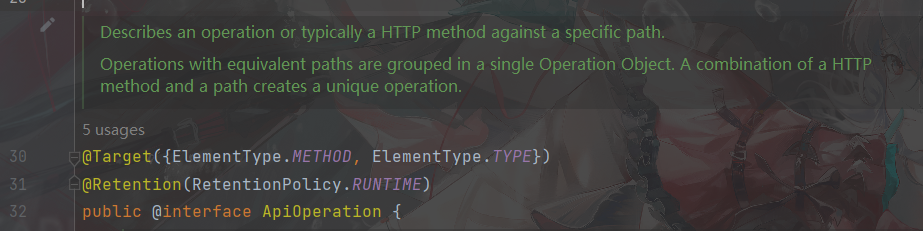
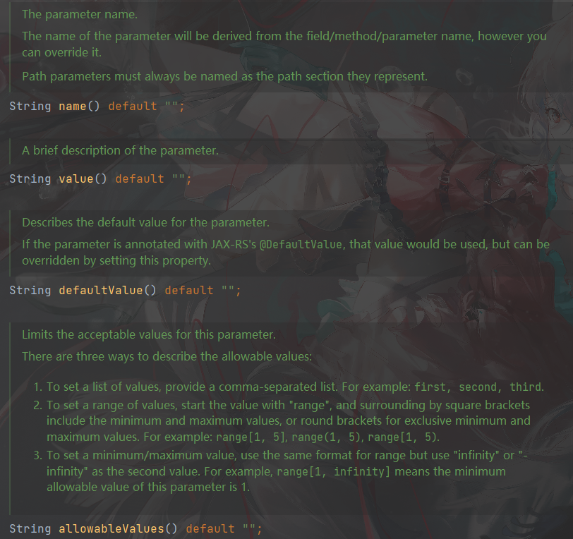
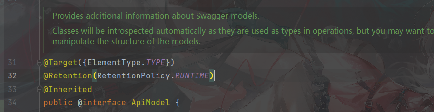
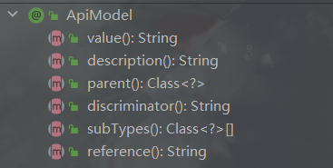
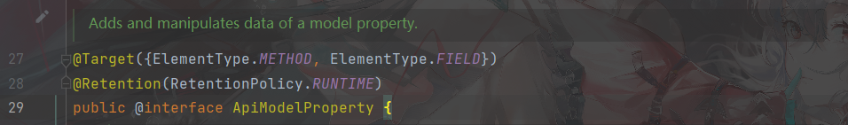

# 1.Swagger2 入门


Swagger是为了解决企业中接口（api）中定义统一标准规范的文档生成工具。


```
对于注释来说:

如果版本迭代快或者人员的流动性大，会导致很多问题。
所以很多企业中都会有统一的规范文档，来定义接口标准。
```


依赖：

```xml
<!--swagger-->
        <dependency>
            <groupId>io.springfox</groupId>
            <artifactId>springfox-swagger2</artifactId>
            <version>2.9.2</version>
        </dependency>
        <dependency>
            <groupId>io.springfox</groupId>
            <artifactId>springfox-swagger-ui</artifactId>
            <version>2.9.2</version>
        </dependency>
```

启动类开启  `@EnableSwagger2`


## 1.1 注释和参数 


name -- 参数名
value -- 参数说明
required -- 是否必须填写
dataType -- 数据类型
paramType -- 参数类型
example -- 举例


## 1.2 注解 


### 1.2.1 @Api

作用于  `类` 

表示当前类是 `swagger` 资源


例

```java
@Api("管道流水线相关接口")
public class PipelineController{
    
    @Autowired
    private PipelineService service;
    
    ...
}
```


### 1.2.2  @ApiOperation

作用于 `方法`，和 `类`




```
用于描述一个带有特定请求路径的Http方法操作。


这个操作将被等效成路径，被分组在一个对象A中。 A包含了Http方法以及唯一的路径
```


### 1.2.3 @ApiParam


作用于 `参数` `方法` `成员变量` 。


```
这个类可以给 操作参数 对象添加额外的元信息。
```


#### 1.2.3.1 成员方法





### 1.2.4 @ApiModel



```
可以给 Swagger models 添加 附加信息。
```





### 1.2.5 @ApiModelProperty()



```
添加或者修改 Model的属性。
```


### 1.2.6 @ApiIgnore()


