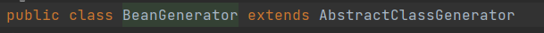
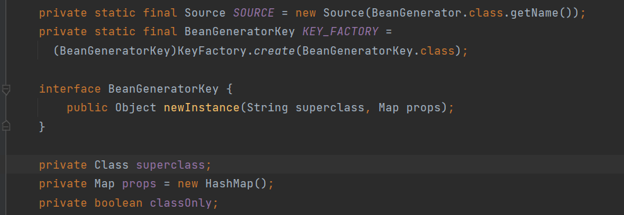
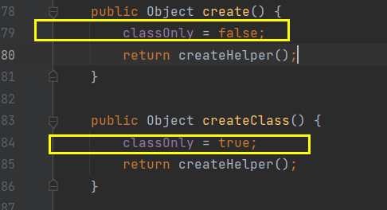
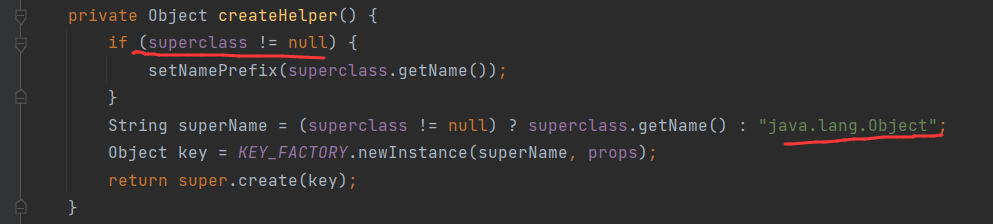
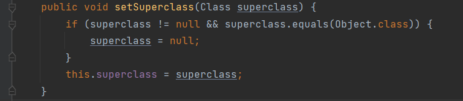
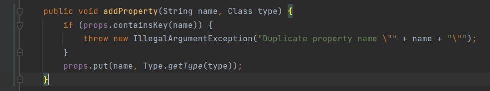

# 1. BeanGenerator

见名知意，一个Bean的生成器。用于生成新的Bean

## 1.1  概述



```java
package net.sf.cglib.beans;
```

cglib 源码没什么太多注释。

成员变量:



用于生成新Bean的主要方法：






如果有父类就使用父类的名字。否则是java.lang.Object


## 1.2  重要的成员变量


### 1.2.1 superclass

生成一个新Bean的时候，可以参考他的父类 superclass


```
设置superclass用于扩展。 这个superclass 必须不是final类型的，必须有一个非私有的无参构造器
```



### 1.2.2  props


java.util.Map 类型的props，用于描述新Bean的所有属性。


#### 1.2.2.1 addProperty()

为新Bean添加属性，属性名不允许重复。否则抛出 非法参数异常。




| syntax and modify | method | expression |
| ----------------- | ------ | ---------- |
|                   |        |            |
|                   |        |            |
|                   |        |            |

