# 1. 初识docker


## 1.1 提出问题


大型项目中，使用的组件复杂(组件多，版本多，相互依赖)， 运行环境复杂 ( 开发环境,和生产环境不一样)


## 1.2 docker解决


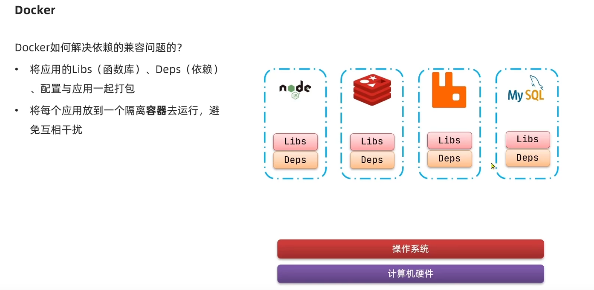


```
用一个隔离的容器去运行。每个应用之间相当于不可见、不会互相影响。
```


```
软件应用，调用了系统函数库。 软件依赖于Ubuntu 无法再ContOS使用的原因是，这两个系统的函数库不同。
比如调用Ubuntu的open() 可能在CentOS 根本没有。

但系统应用底层的内核，都是Linux内核。
```


Docker的解决方案是：


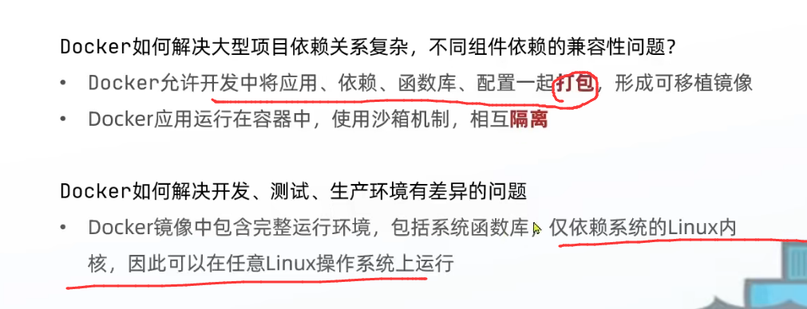


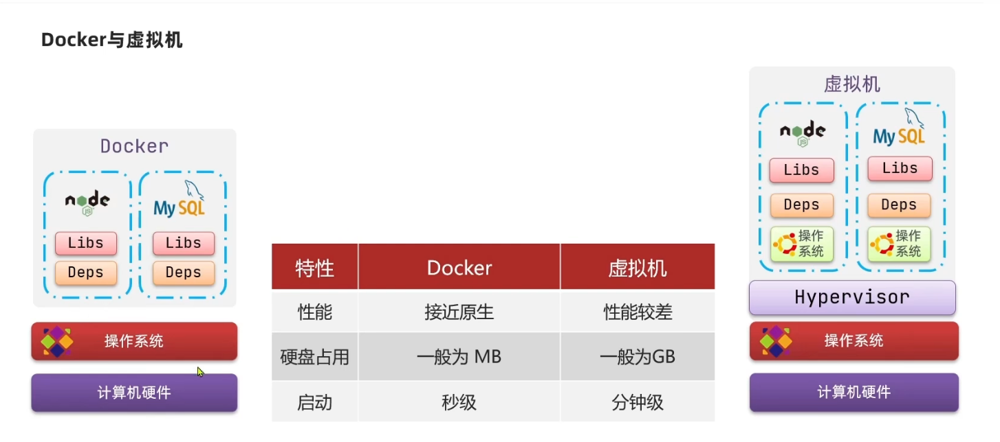


## 1.3 镜像与容器


镜像:  image


容器: container


## 1.4 DockerHub


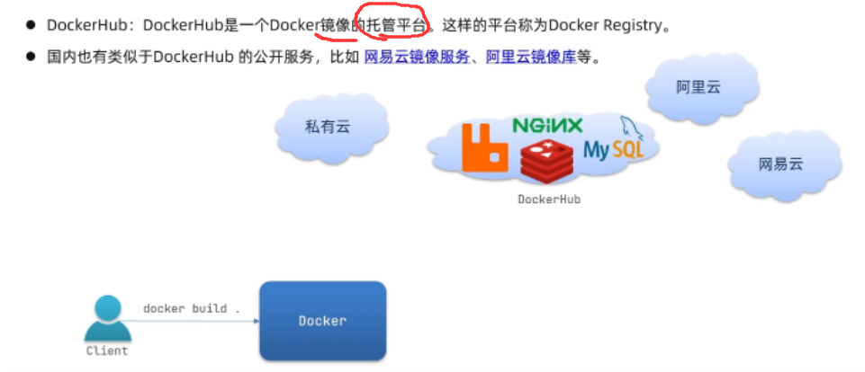


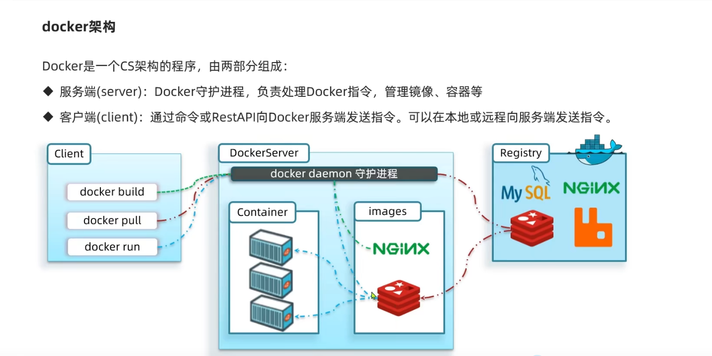


## 1.5 docker的核心概念


### 1.5.1 docker的三大组成

`docker client` docker客户端，用于和用户交互的。接收用户发出命令例如 `docker build` `docker run` 等。


`docker_host` 宿主机。


`Registry` 注册表服务。


### 1.5.2 镜像

docker镜像 `image` 将应用和其依赖的环境打包在一起。 


#### 1.5.2.1 分层（Layer）

一个镜像可以由多个 `中间层`组成。这称之为`分层（Layer）` 。 多个镜像可以共用同一个`中间层`.


```
在一个镜像上新增一层，又可以生成一个新的镜像。
```


这种分层的结构，可以让镜像复用，也便于调试。


#### 1.5.2.2 只读（read-only）

镜像在构建完成以后，不可以再修改。


### 1.5.3 容器

当一个镜像被运行，称为一个隔离运行的进程，则称为`容器`。


### 1.5.4 仓库

 镜像仓库称之为 `docker hub`


### 1.5.5 docker file

Docker 支持用户使用多种命令，来指示Docker来完成各种行为。


`Docker file` 就是 docker 命令的载体， 开发人员可以基于 `docker file` 来构建出镜像文件等。


[docker file](# 6.Docker file)


## 1.6 容器的生命周期

容器的本质是【宿主机】的进程。 

```
操作系统对进程的管理是基于进程状态切换的。

进程从创建-销毁的过程称之为容器的生命周期。
```


### 1.6.1 状态

通常容器的生命周期有5种状态：

```
created   初始态

running   运行态

stopped  停止

paused   挂起

deleted  销毁
```

开发人员在使用容器的过程中，根据实际需要使用命令，管理容器。


### 1.6.2 相关命令


`docker create` 产生 初始状态。

`docker unpause ` 产生运行态。

`docker stop`  产生停止状态。

`docker pause` 产生挂起状态。

`docker rm` 产生删除状态。


`docker create`  创建一个容器，但不运行。

```sh
docker create [options] <imageName> [command] [arg...]

# docker create nginx:least
```

根据镜像创建一个容器。等带一切准备就绪以后，开发人员可以使用 `docker start <containerId>` 启动容器。


`docker start <containerName>`   启动容器.

```sh
docker start <containerName>

#
```


`docker run`

具体更多参数

```
等价于  docker create + docker starts
```


`docker pause`  暂停容器。

```
docker pause <container> [<cantiner>...]
```


`docker stop` 停止容器

```
docker stop [options] container 


```


## 1.7 docker的网络通信

Docker容器内的服务，甚至不需要知道自己被部署在Docker上，仍然可以无感知的进行网路通信。

这得益于Docker的网络与通信设计。


### 1.7.1  网络驱动程序

Docker的网络子系统允许 使用驱动程序来插入。

例如：

```
网桥网络（Bridge）： 默认网络驱动程序。  如果应用程序在需要通信的独立容器中运行，通常使用网桥。

覆盖网络（Overlay）：将多个Docker守护进程连接在一起，使之称为一个集群服务，能够互相通信。

主机网络：  消除Docker和宿主机的隔阂，直接使用主机网络。

驱动网络： 允许开发人员分配MAC地址。 docker守护进程通过mac地址将流量路由到容器。

none：无网络

网络插件： 第三方插件
```


## 1.8 Compose 容器编排

我们使用`dockerfile` 来打包镜像，运行容器。在微服务的架构下，每一个微服务都会部署多个实例，如果每个实例都需要手动初始化编排，那么开发效率将大大降低。


`Compose` 容器编排 可以轻松高效的管理容器。


具体来讲： `compose` 是定义和运行Docker应用程序的工具。借助 `Compose` 开发人员可以使用 `yaml` 文件来配置应用程序的服务。


`Compose` 构建的核心3个步骤：

```
1.定义应用环境，配置dockerfile文件，以便可以在任何地方复制它

2.定义组成应用程序的服务，配置 docker-compose.yaml文件

3.先执行docker compose up, 执行docker compose。
```


docker官方的 compose文档地址：

https://docs.docker.com/compose/


### 1.8.1 使用Compose需要安装

首先需要安装 `docker compose`


参考官方的安装文档：

```

```


# 2. 安装Docker

官方安装教程

https://docs.docker.com/engine/install/centos/


# 3. 使用docker


## 3.1 docker命令


去官方DockerHub上搜索想要的Docker Image 镜像。


### docker pull

拉取镜像 

https://docs.docker.com/engine/reference/commandline/pull/


语法：

```
 docker pull [OPTIONS] <imageName>[:TAG|@DIGEST]
 
 options 额外选项
 
 <imageName> 拉取的镜像名
 
 TAG 标签
```


Options：


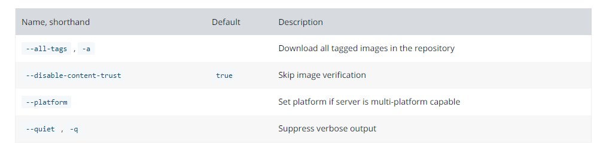


### docker  images

查看所有镜像

```
```


### docker ps

查看所有已启动的容器。

语法：

```
 docker ps [OPTIONS]
```


Options

常用 `-a`   显示全部的容器，包括没有启动的容器。

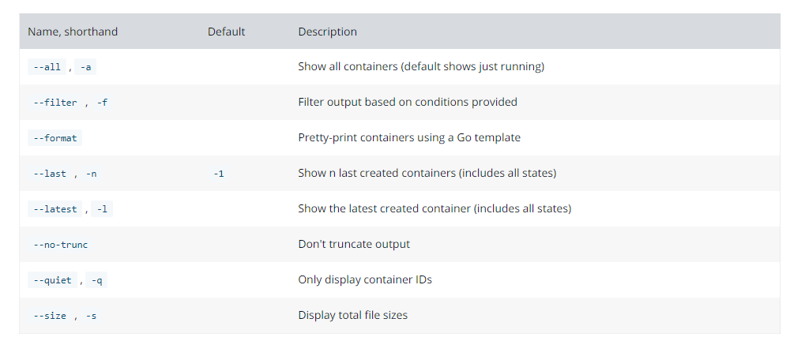


### docker rm

删除一个或者多个容器。

```sh
docker rm [option] <container> [<container>...]


# option
# -f: 强制删除指定容器
# -v: 删除容器的数据卷
# -l: 删除容器之间底层的连接与通信
```


### docker rmi


```
docker rmi     删除镜像
```


只有删除了使用了镜像的容器，才可以删除镜像。


### docker run

启动容器。 是docker的核心命令。


Options:

docker run 命令有非常多的Options
https://docs.docker.com/engine/reference/commandline/run/


常用的如下：


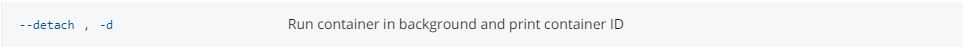

```
守护进程的方式运行。
```


-i

```
以交互式的方式运行容器，通常与 -t一起使用
```

-t

```
为容器分配一个伪终端，通常与 -i 一起使用
```


`--entrypoint`

可以使用 --entrypoint 覆盖 dockerfile的 ENTRYPOINT指令s

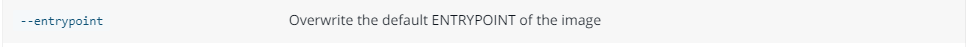


设置环境变量

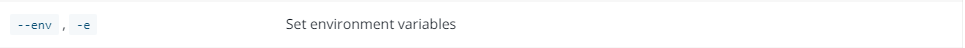


将容器中的指定端口，映射到宿主机上

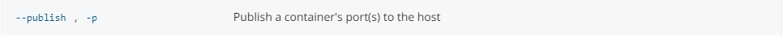


限制容器占用的内存


`-v`绑定挂载一个  volume

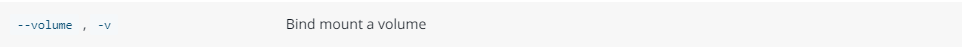

```
-v <宿主机地址>:<容器地址>


将宿主机地址与容器地址关联映射。
```


`--dns`

```
--dns <address>

给容器指定一个dns地址。默认与宿主机一致
```


`-h`

```
-h <hostname>

给容器指定hostname
```


`--name <name>`

```
给容器加一个名字
```

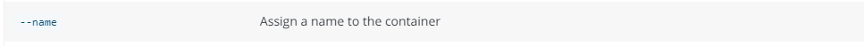


`-p`

```
docker run -p 80:8080 ubuntu bash

//发布和暴露一个端口

//将容器的8080端口，映射到host主机的80端口。
```


`-e <key>=<value> ...`  设置环境变量。

```
-e username="Joge"
```


`--cpuset` 绑定容器到指定cpu上运行。

```
--cpuset="0-2"
```


`-m` 设置容器可使用的最大内存。

```
```


`--expose=[]` 开发一个或一组端口 


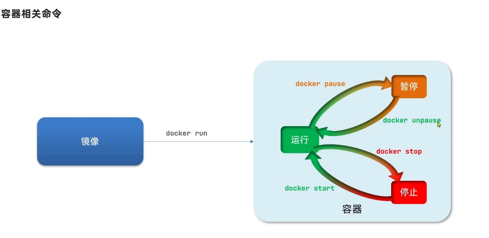


```
docker unpasue 操作系统会将容器内的进程挂起，内存暂存。

docker stop  会直接把进程kill，内存回收
```


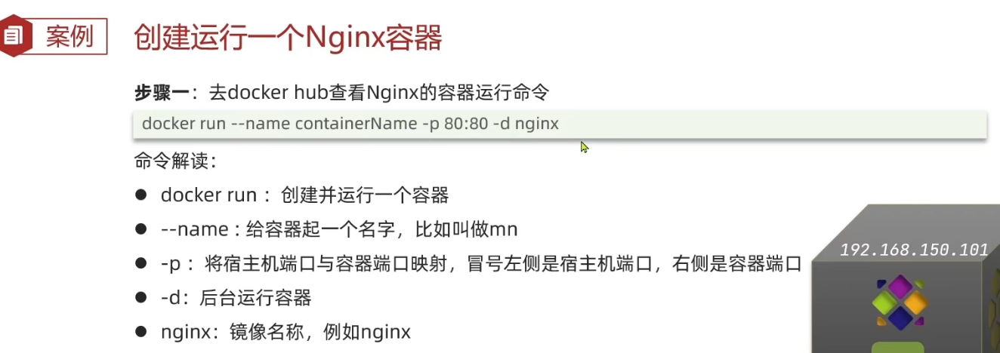


```

```

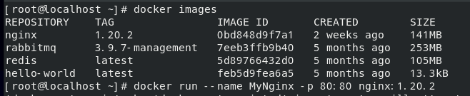


### docker logs

查看 docker 容器的日志。

有时，启动容器会失败，此时没有信息输出，我们需要使用 `docker log`命令查看对应容器的日志，帮助排查错误。


语法：

```
docker logs [OPTIONS] CONTAINER
```


OPTIONS:

```
--details   更多细节 
 
-f          实时跟踪日志

-t         显示时间戳
```


### docker exec

在指定容器中，运行 shell 命令。

```
docker exec -it <containerID> /bin/bash   //进入容器
```


OPTIONS

```
docker exec -it --user root container_id /bin/bash
```


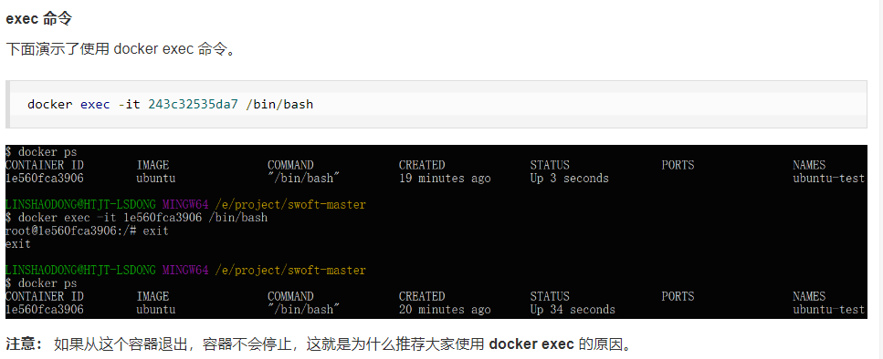


3.1.3.3 安装yum vim 命令

```
很多时候，容器内没有vim 命令，也没有yum命令，需要手动安装。

apt-get update  
apt-get install vim
```


### 3.1.4   docker --help


docker --help  查看帮助

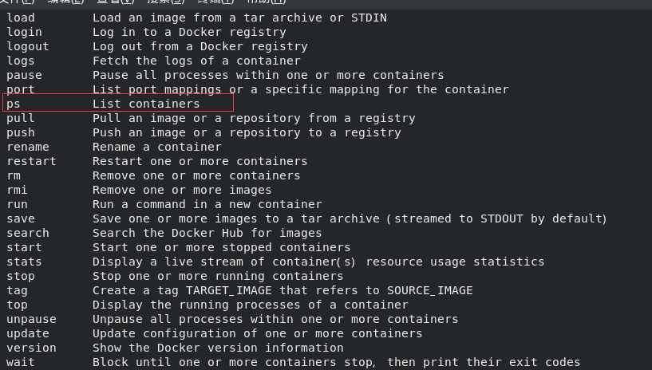


### docker  save


### docker cp

```
在容器和本地文件系统之间复制文件或者文件夹。  支持容器-->filesystem 也支持 filesystem --->容器
```


把本地文件拷贝到容器中

```shell
docker cp ./some_file <CONTAINER>:/work
```


拷贝container 中的文件到 filesystem

```shell
docker cp <CONTAINER>:/some_file /root/Desktop
```


### docker build

构建一个镜像。 也是Docker的核心API之一

语法：

```
docker build [OPTIONS] PATH | URL | -
```


构建上下文

```
构建上下文就是一个 已声明的本地路径或者URL 集合
```

构建程序可以访问到 构建上下文里的任何文件。


OPTIONS

docker build 也有非常多的OPTIONS ，更多的信息参考官方文档

https://docs.docker.com/engine/reference/commandline/build/


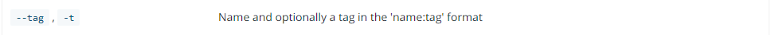

```
给打包出的镜像 命名一个tag
```


### docker stop 

停止一个正在运行的容器。


### docker update

配置docker启动时，自动启动对应的 容器

`docker update  --restart=always <containerID>`


### docker push 

使用`push` 指令可以将本地的容器推送到远程仓库中。


语法：

```
docker push [opitons] <imageName>[:tag]
```


### docker pause

挂起一个容器。


### docker restart 

```
docker restart [options] <container>


#docker restart -t 20 nginx
```


### 3.1.1  实战测试

启动一个nginx 并 在7777端口建立一个映射。


```
docker rmi hello-world   //docker 可以使用名字补全
```

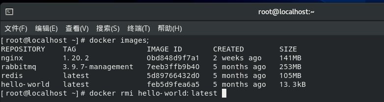


```
docker exec -it MyNginx /bin/bash       # 进入容器内部

apt-get update

apt-get install vim

vim /etc/nginx/nginx.conf   # 修改nginx 配置文件

#新建一个a.conf

#在外部机器访问对应url
```


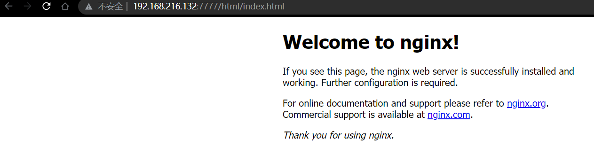


成功访问。


成功下载a.conf。证明映射成功。


## 3.2   docker save 保存镜像

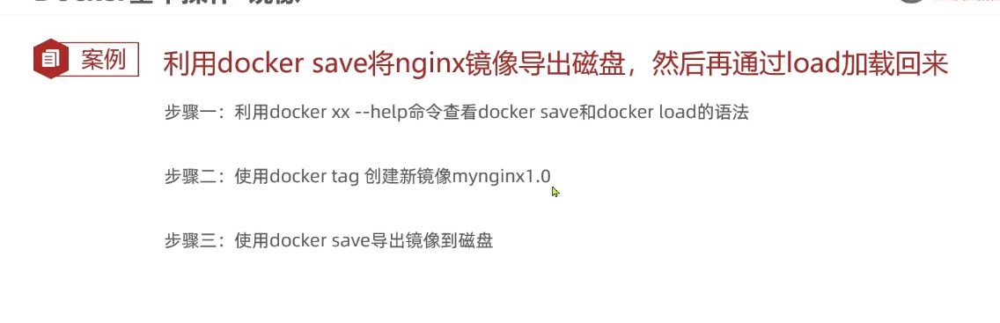


## 3.3  自定义镜像


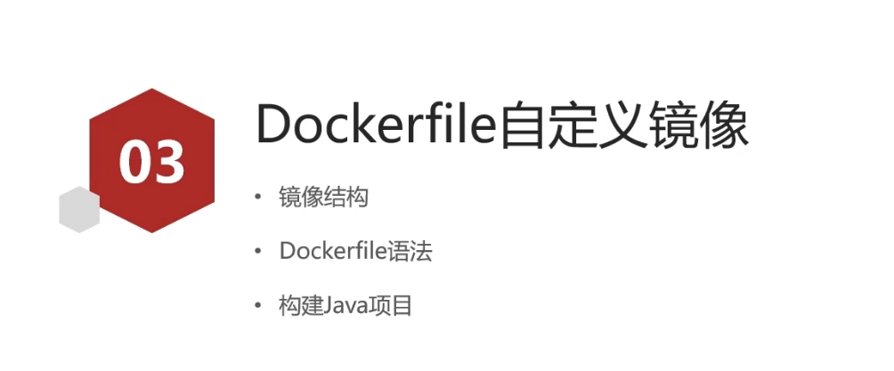

### 3.3.1  镜像的结构


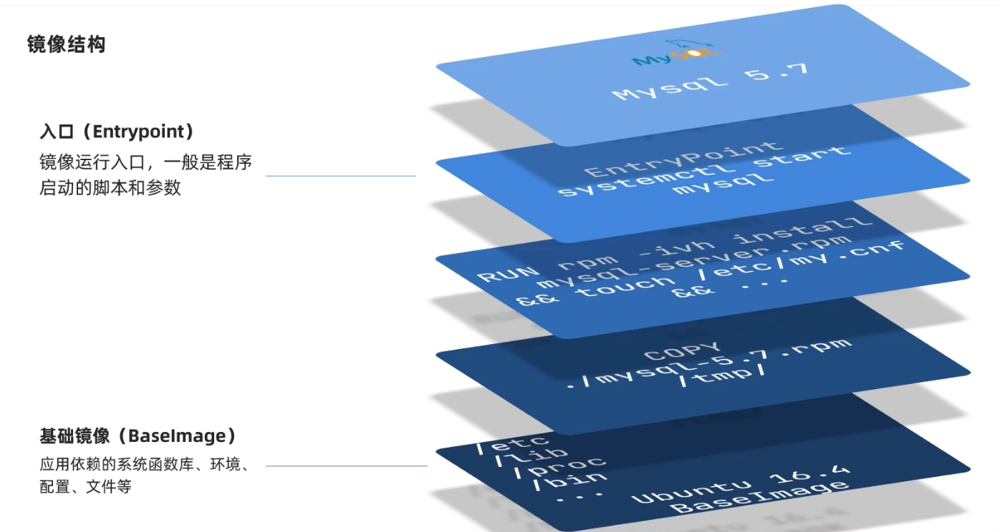


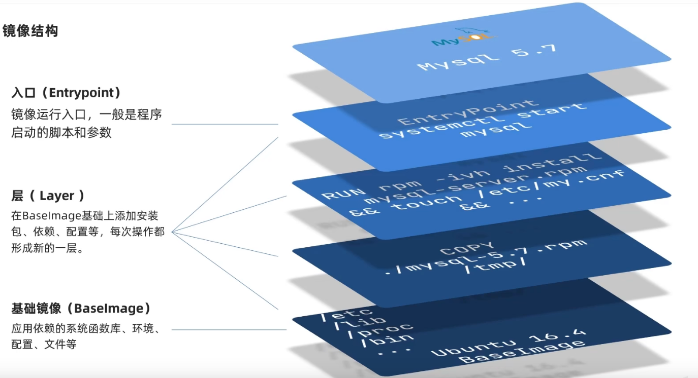


```
分层的好处就是，可以进行复用。

如果版本更新，可以从旧版的共用层开始重新构建。
```


### 3.3.2  Dockerfile 文件


```
每一个指令就是3.3.1 中说的Layer  
任何一个Layer都可以被复用。
```


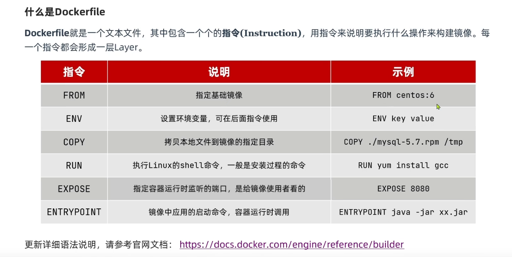


### 3.3.3 模拟实战


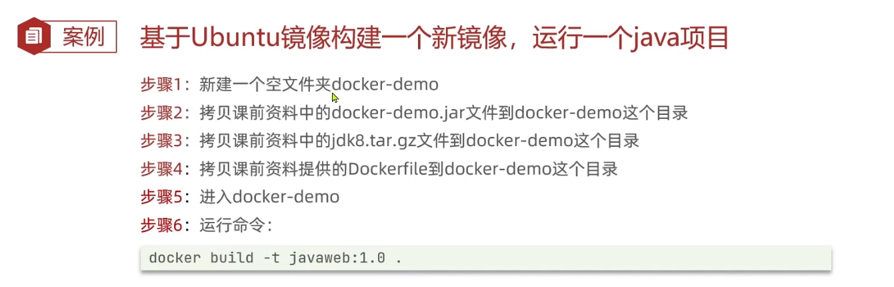


dockerfile

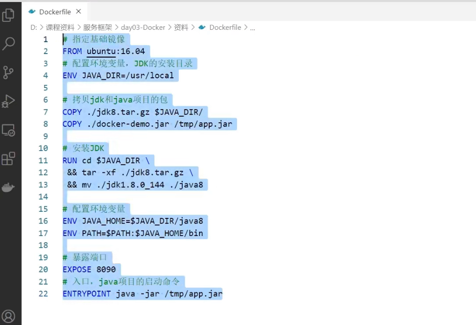


# 4. DockerCompose


当微服务增多，不可能手动部署那么多的Docker。 所以，使用DockerCompose快速部署分布式应用。


## 4.1  什么是DockerCompose


```
想要集群部署Docker ，需要Compose文件。
```


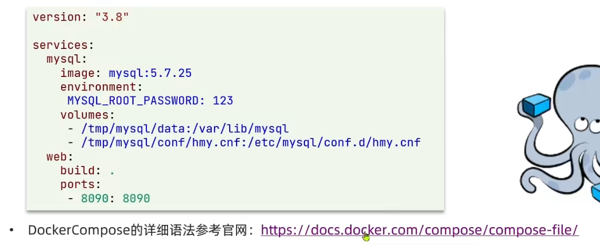


```
详细信息参考Docker官网。
```


# 5. 镜像仓库


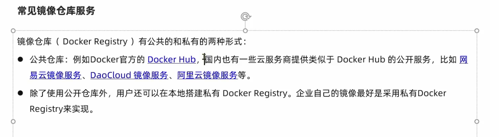


# 6.Docker file

Dockerfile 是一个用来构建镜像的文本文件，文本内容包含了一条条构建镜像所需的指令和说明。


参考博客

https://cloud.tencent.com/developer/article/1896312?from=article.detail.1896311


## 6.1 创建一个docker镜像


定制一个nginx镜像。

```dockerfile
#在一个空目录下，新建一个名为 Dockerfile 文件，并在文件内添加以下内容：

FROM nginx
RUN echo '这是一个本地构建的nginx镜像' > /usr/share/nginx/html/index.html
```


### 6.1.1 from & run

`FROM`  和 `RUN` 指令：

```
FROM  <imageName>

//From 指令表示当前的 dockerfile 从一个镜像基础上构建。
//如果本地没有该镜像，则从远程镜像仓库中进行加载。

//例如:    FROM nginx 
//表示从 nginx最新版本开始构建
```


```
RUN：用于执行后面跟着的命令行命令。有以下俩种格式： 

shell  

exec
```


```dockerfile
RUN ll


RUN ["./test.php","dev","offline"]
```


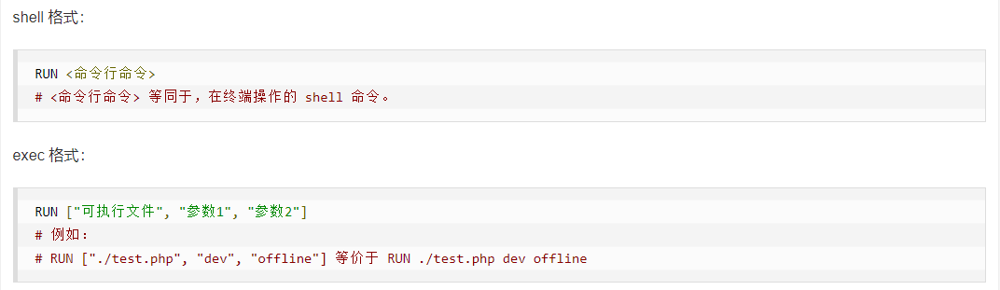


### 6.1.2 注意点

```dockerfile
#每一个Dockerfile指令都会在 layer上新建一层。过多无意义的层，会导致镜像过大。例如：

FROM centos
RUN yum -y install wget
RUN wget -O redis.tar.gz "http://download.redis.io/releases/redis-5.0.3.tar.gz"
RUN tar -xvf redis.tar.gz
```


以上执行会创建 3 层镜像。可简化为以下格式：

```dockerfile
FROM centos
RUN yum -y install wget \
    && wget -O redis.tar.gz "http://download.redis.io/releases/redis-5.0.3.tar.gz" \
    && tar -xvf redis.tar.gz
```

如上，以 **&&** 符号连接命令，这样执行后，只会创建 1 层镜像。


使用 `docker build` 命令构建

```shell
$ docker build -t nginx:v3 .     #. 表示本次build命令的上下文路径
```


### 6.1.3  上下文路径

```
在docker 构建镜像时。有时想要使用本机的文件。 docker build 得知了这个路径后，会将路径下的所有内容打包
```


## 6.2 指令详解


### 6.2.1 COPY 指令

将内容 复制到镜像中。


语法:

```dockerfile
COPY [--chown=<user>:<group>] <src> [<src>...] <dest>

#复制本地主机的 <src>的内容，到镜像的<dest>中。目标路径不存在时，自动创建
# 例如
# COPY default.conf /etc/nginx/conf.d/default.conf


COPY [--chown=<user>:<group>] ["<src>",...  "<dest>"]
```


```
<src> 可以是Dockerfile文件的相对路径。  或者绝对路径

<dest>：可以是镜像内绝对路径，或者相对于工作目录（WORKDIR）的相对路径 
//通过 WORKDIR指令设置工作目录

路径：支持正则表达式
```


[--chown] 是一个可选的参数。

```
用于改变复制到容器内文件的 拥有者和group
```


[ `--from=<name> <src> <dest>`] 也是一个可选参数。 表示从指定的构建阶段中，获取指定文件，到指定目录

```dockerfile
#从requirements-stage的构建阶段中，找到/tmp/requirements.txt文件，复制到/code/requirements.txt下
COPY --from=requirements-stage /tmp/requirements.txt /code/requirements.txt
```


规则：

```
如果<src>是一个目录，这个目录内的全部内容都会被复制。但不会复制目录本身。

如果<dest>以/结尾，它将被视作一个目录。将<src>的内容写入

如果<src>指定了多个文件，则<dest>必须是一个目录
```


### 6.2.2 FROM 

```
指明构建的镜像基于哪个镜像
```


语法：

```dockerfile
FROM [--platform=<platform>] <image> [AS <name>]

#以某个镜像作为 指定名称的构建阶段。
#例如 :
# FROM tiangolo/uvicorn-gunicorn:python3.9 AS requirements-stage


FROM [--platform=<platform>] <image> [:<tag>] [AS <name>]
# 使用:<tag> 指定版本
# 例如
# FROM nginx:lastest 


FROM [--platform=<platform>] <image>[@<digest>] [AS <name>]
```

例如

```dockerfile
FROM nginx:latest
```


一个dockerfile可以有多个 FROM 来创建多个镜像。

或者构建多个阶段。 使用 `AS <name>` 来给当前阶段命名。


一个例子:

```dockerfile
# 第一构建阶段:将仅用于生成 requirements.txt 文件:

#给第一阶段命名为 requirements-stage
FROM tiangolo/uvicorn-gunicorn:python3.9 as requirements-stage

# 将当前工作目录设置为 /tmp
WORKDIR /tmp

# 生成 requirements.txt
RUN touch requirements.txt

# 第二构建阶段，在这往后的任何内容都将保留在最终容器映像中:

#以python3.9作为基镜像
FROM python:3.9

# 将当前工作目录设置为 /code
WORKDIR /code

# 复制 requirements.txt;这个文件只存在于前一个 Docker 阶段，这就是使用 --from-requirements-stage 复制它的原因
COPY --from=requirements-stage /tmp/requirements.txt /code/requirements.txt

# 运行命令
RUN pip install --no-cache-dir --upgrade -r /code/requirements.txt

# 复制
COPY ./app /code/app
```


### 6.2.3 LABEL

标签。使用 `LABEL命令`为打包后的镜像添加  `元数据标签信息` ,   这些信息可以辅助过滤出特定的镜像。


语法：

```
LABEL <key1>=<value1>  <key2>=<value2> ...
```

可以使用 `\` 来换行


示例：

```dockerfile
# key 加不加"" 都无所谓
LABEL xyz.semghh.soild="dev"

LABEL "version"="1.0"


LABEL k1="k1" \
	  k2="k2" \
	  k3="k3"
```


查看LABEL

使用 `docker image inspect <imageName> ` 来查看对应 `image` 的 `label`信息。


```
docker image inspect nginx:myVersion
```


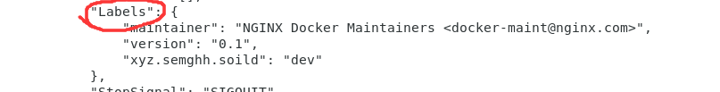


### 6.2.4 WORKDIR

工作文件夹的路径。 用于指明打包镜像内的 `工作路径` 。


示例:

```dockerfile
#镜像的工作目录移动到 /tmp/下
WORKDIR /tmp/

#复制text.txt 到镜像的/tmp/下
COPY text.txt .
```


```
WORKDIR中的路径。如果不存在，则直接创建路径  


一般使用 WORKDIR 代替切换目录操作 //代替:    RUN cd <path> && <doSomething> 
```


`WORKDIR` 可以在dockerfile中多次使用：

```dockerfile
#移动到/a
WORKDIR /a

#移动到/a/b
WORKDIR b

#移动到/a/b/c
WORKDIR c
RUN pwd
```

输出的结果是 ： /a/b/c


### 6.2.5 RUN

```
创建一个新的容器，并运行一个命令。
```


语法:

````dockerfile
RUN <commend>
````


原理：

RUN 指令将在当前镜像上加新的一层，并执行任何命令和提交结果，生成的提交镜像将用于 Dockfile 中的后续步骤

```dockerfile
#所以,尽量避免写太多RUN。如下,将多个命令使用 && 合并成一个RUN

RUN yum -y install wget \
    && wget -O redis.tar.gz "http://download.redis.io/releases/redis-5.0.3.tar.gz" \
    && tar -xvf redis.tar.gz
```


### 6.2.6 ENV

为了方便新程序的运行，可以使用 `ENV` 指令为容器更新 `PATH` 环境变量。

```
用于设置环境变量，可以被后续的构建过程中使用。
```

除了设置环境变量，`ENV` 还能为程序添加必要的参数，例如MySQL的root密码 :

```sh
ENV MYSQL_ROOT_PASSWORD=<yourPWD>
```


语法：

```dockerfile
ENV <key>=<value> ...
```


示例：

```dockerfile
ENV MY_NAME="John Doe"
ENV MY_DOG=Rex\ The\ Dog
ENV MY_CAT=fluffy
```


使用环境变量：


```
$variable_name
${variable_name}
```


示例

```dockerfile
FROM busybox
ENV FOO=/bar
WORKDIR ${FOO}   # WORKDIR /bar
ADD . $FOO       # ADD . /bar
COPY \$FOO /quux # COPY $FOO /quux
```


注意点：

```
当容器从生成的镜像运行时，使用 ENV 设置的环境变量将持续存在
可以使用 docker inspect 查看值，并使用 docker run --env <key>=<value> 更改它们
```


### 6.2.7 CMD

```
当容器启动以后，让镜像容器执行一段命令。
```

1个dockerfile只能有1个CMD , 多个CMD命令会覆盖，以最后一个为主。


语法：

```
CMD ["executable","param1","param2"]（这是首选形式）
CMD ["param1","param2"]（作为ENTRYPOINT 的默认参数）
CMD command param1 param2
```


### 6.2.8 ARG

定义创建镜像过程中使用的变量。ENV将保留到容器中。ARG则不会

#### 语法：

```
ARG <name>[=<default value>]

ARG是镜像在build的时候，需要传进来的参数。但是，ARG参数可以拥有一个默认值。
```


用户在build 这个dockerfile时，应该按照如下传入参数

```shell
docker build --build-arg user=what_user .
```


#### 预设的ARG

Docker 有一组预定义的`ARG`变量，您可以在没有`ARG`Dockerfile 中的相应指令的情况下使用这些变量。

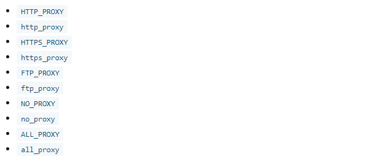


使用时，直接使用 --build-arg 传入参数值即可

```
 docker build --build-arg HTTPS_PROXY=https://my-proxy.example.com .
```


### 6.2.9 MAINTAINER

维修人员。 用于将 `docker file` 制作者相关信息写入image中。


语法格式：

```dockerfile
MAINTAINER <name>
MAINTAINER <说明信息> <邮箱地址>
```


使用 `docker inspect` 命令时，可以查看到对应信息。

例如：

```
docker inspect nginx
```


### 6.2.10 ADD

添加内容到镜像。 和COPY不同，ADD可以从网络中添加文件。COPY只能是本地的

#### 语法：

```
ADD <src> <dest>


<src> 可以是一个本地路径，或者是URL,还可以是一个 .tar文件，自动解压到目录

路径支持正则表达式
```


### 6.2.11 EXPOSE

暴露。`EXPOSE` 命令用于指定容器将要监听的宿主机端口。


### 6.2.12 volume

`volume`的指令用于暴露任何存储文件。


通常我们会在启动( `docker run`  )的时候，使用`-v`来挂载卷。

`docker run -it --name container-test -h CONTAINER -v /data nginx /bin/bash`

```
上面的指令会把 /data 挂载到容器中。 任何/data目录下的文件都将被映射到对应卷下。
```


#### 6.2.12.1  查看volume存储位置

使用`docekr inspect -f {{.Volumes}} container-test`   查看Volume挂载到主机的位置。


```json
[
    {
        ...
        "Mounts": [
            {
                "Type": "bind",
                "Source": "/root/Desktop/dockerVolumes/hello",
                "Destination": "/var/lib/mysql",
                "Mode": "",
                "RW": true,
                "Propagation": "rprivate"
            }
        ]
        ...
    }
]

```


# 7. 管理Application的数据

参考

https://docs.docker.com/storage/

 https://www.cnblogs.com/sammyliu/p/5932996.html


有状态容器都有数据持久化需求。


## 7.1 Docker管理数据的方式


```
1.volumes   由docker管理的，存储在宿主机(host)的文件系统中。(如果是Linux系统 /var/lib/docker/volumes )


2. bind mounts  绑定挂载。 可以将文件存储在host系统的任意位置。

3. tmpfs mounts are stored in the host system’s memory only, and are never written to the host system’s filesystem.
```


## 7.2 volumes


volumes 是保存Docker容器生成数据的首选方式。 

```
卷更容易备份，迁移。

卷可以在多个容器之间共享
```


### 7.2.1 创建和管理卷


创建卷

```
docker volume create my-vol
```


列出卷

```
docker volume ls
```


检查卷

```
docker volume inspect my-vol
```


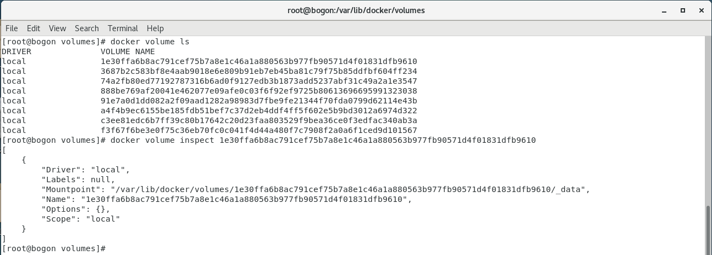


删除卷

```
docker volumes rm my-vol
```


### 7.2.2使用volume


# 8. 打包一个Java项目

构思依赖：

```
MySQL8.0
准备SQL文件
JDK：8
Redis

挂载一个文件夹,用于后续添加SQL
映射一个端口
```


# 9. 构建常见的项目


## 9.1  构建MySQL

参考： https://hub.docker.com/_/mysql  ， 以下均来自dockerHub 官方安装文档。


常常需要修改的参数：（dockerfile 文件中）

```sh
ENV MYSQL_ROOT_PASSWORD=<yourPWD>

#必选变量，修改root账号的密码
```


【初始化数据库】

将以 `.sql.gz` `.sql`  的文件拷贝到 `/docker-entrypoint-initdb.d` 中，mysql将自动完成其初始化。


dockerfile文件示例：

```dockerfile
FROM mysql:8.0.28

LABEL "xyz.semghh.soild"="dev" \
      "version"="0.1"

ENV MYSQL_ROOT_PASSWORD=zxc,./123


COPY ./mybatisplus.sql /docker-entrypoint-initdb.d/
```


【挂载mysql的数据卷】

我们希望保存容器中Mysql的数据。

```
-v /my/own/datadir:/var/lib/mysql
```


# 10. docker compose

Compose 是用于定义和运行多容器 Docker 应用程序的工具。


通过 Compose，您可以使用 YML 文件来配置应用程序需要的所有服务。然后，使用一个命令，就可以从 YML 文件配置中创建并启动所有服务。


docker-compose的三个步骤：

```
1. 使用dockerfile定义app的环境
2. 使用docker-compose.yml 定义构成app的服务
3. 执行docker-compose up命令来启动并运行整个app
```


## 10.1  一个docker-compose.yml示例


1.构建一个  docker-compose.yml 文件

```yml
# yaml 配置实例
version: '3'
#指定本yml依从的compose哪个版本指定的

services:
  web:
  	#build,指定 image的上下文路径
    build: .  #指定了当前.
    ports:
   - "8000:5000"
    volumes:
    #将.映射到了容器中的 /code目录下
   	- .:/code
    - logvolume01:/var/log
    links:
   - redis
  redis:
    image: "redis:alpine"
volumes:
  logvolume01: {}
```


 Compose file 定义了2个服务 : `web` and `redis`.

`web`服务使用的是 `dockerfile` 文件在当前目录下`.`构建的镜像。

`ports` 将 host的8000端口，绑定到容器的 5000端口。

 

`redis` 服务使用了 docker hub仓库 的公共镜像。


## 10.2  .env文件

`.env`文件用于定义`环境变量` , 文件是以 k=v 的形式组织的。

例如:

```sh
webTAG=v1.5
a=1.1
b=1.2
```


在`docker-compose.yml` 文件中可以使用 `${}` 来引用这些变量，例如：

```yml
version: '3'
services:
	web:
		image: "webapp:${webTAG}"
```


在`docker compose` 中可以使用 `--env-file <filePath>` 来指定对应的 `.env`文件路径：


例如:

```sh
docker compose --env-file ./config/.env.dev up
```


（这种方式，不依赖于默认文件名`.env` ，所以可以适当的改变文件名，来区分业务开发 `.env.dev` `.env.test`）


## 10.3 compose 指令


### 10.3.1 build

为镜像构建上下文。

```yml
version: "3.7"
services:
	#服务的名字
	app1:
		#指定上下文路径
		build: ./dir
```


另一种形式：

```yml
version: "3.7"
services:
	#服务的名字
	app1:
		#指定上下文路径
		build:
			#上下文
			context: ./dir
			#指定dockerfile
			dockerfile: Dockerfile-alternate
			#参数
			args:
				buildno: 1
			#添加标签
			labels:
				- "com.example.description=Accounting webapp"
		        - "com.example.department=Finance"
        		- "com.example.label-with-empty-value"
```


### 10.3.2 depends_on

配置服务之间的依赖关系。


```yml
version: "1.2"
services:
	web:
		build: .
	#表明web服务依赖于mysql 和 redis
	depends_on:
		- mysql
		- redis
	mysql:
		images: mysql-1
	redis:
		images: redis-1
```


### 10.3.3  dns

配置dns

```yml
dns: 8.8.8.8

dns:
  - 8.8.8.8
  - 9.9.9.9
```


