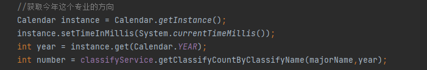
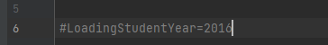

# 1.请使用 Chrome 或者 Firefox

实现ajax 文件上传，使用了FormData 对象。需要浏览器支持


# 2.关于学生分流的方向种类

确定 一个学生的方向需要  学生id 和当前系统时间年份。

学生能选取的分流方向只有    今年（系统时间）的专业方向。

如需要修改：

```
com.crazyhh.dispense.Controller.ApplyController
```

下的



代码块修改。


# 3. 导入学生成绩表专业id问题

查找专业id需要使用 时间参数 year ，默认获取系统时间的年份。

如需改变，修改 根目录下  my.properties 的  LoadingStudentYear参数

