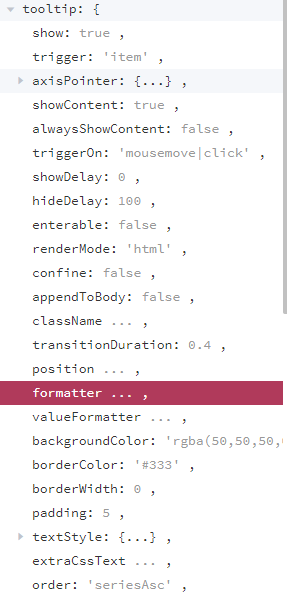

# 1.echarts 入门

https://echarts.apache.org/handbook/zh/basics/import


## 1.1 npm 安装


```sh
npm install echarts --save
```


## 1.2 引入echarts


### 1.2.1 引入 ECharts 中所有的图表和组件

引入 ECharts 中所有的图表和组件


```js
import * as echarts from 'echarts';

// 基于准备好的dom，初始化echarts实例
var myChart = echarts.init(document.getElementById('main'));
// 绘制图表
myChart.setOption({
  title: {
    text: 'ECharts 入门示例'
  },
  tooltip: {},
  xAxis: {
    data: ['衬衫', '羊毛衫', '雪纺衫', '裤子', '高跟鞋', '袜子']
  },
  yAxis: {},
  series: [
    {
      name: '销量',
      type: 'bar',
      data: [5, 20, 36, 10, 10, 20]
    }
  ]
});
```


### 1.2.2 按需引入 ECharts 图表和组件

```js
// 引入 echarts 核心模块，核心模块提供了 echarts 使用必须要的接口。
import * as echarts from 'echarts/core';
// 引入柱状图图表，图表后缀都为 Chart
import { BarChart } from 'echarts/charts';
// 引入提示框，标题，直角坐标系，数据集，内置数据转换器组件，组件后缀都为 Component
import {
  TitleComponent,
  TooltipComponent,
  GridComponent,
  DatasetComponent,
  TransformComponent
} from 'echarts/components';
// 标签自动布局，全局过渡动画等特性
import { LabelLayout, UniversalTransition } from 'echarts/features';
// 引入 Canvas 渲染器，注意引入 CanvasRenderer 或者 SVGRenderer 是必须的一步
import { CanvasRenderer } from 'echarts/renderers';

// 注册必须的组件
echarts.use([
  TitleComponent,
  TooltipComponent,
  GridComponent,
  DatasetComponent,
  TransformComponent,
  BarChart,
  LabelLayout,
  UniversalTransition,
  CanvasRenderer
]);

// 接下来的使用就跟之前一样，初始化图表，设置配置项
var myChart = echarts.init(document.getElementById('main'));
myChart.setOption({
  // ...
});
```


需要注意的是为了保证打包的体积是最小的，ECharts 按需引入的时候不再提供任何渲染器，所以需要选择引入 `CanvasRenderer` 或者 `SVGRenderer` 作为渲染器。这样的好处是假如你只需要使用 svg 渲染模式，打包的结果中就不会再包含无需使用的 `CanvasRenderer` 模块。


```
我们在示例编辑页的“完整代码”标签提供了非常方便的生成按需引入代码的功能。这个功能会根据当前的配置项动态生成最小的按需引入的代码。你可以直接在你的项目中使用。
```


# 2. 概念篇


## 2.1 图标容器大小


### 2.1.1初始化


#### 初始化容器

在 HTML 中定义有宽度和高度的父容器（推荐）

```
通常来说，需要在 HTML 中先定义一个 <div> 节点,
并且通过 CSS 使得该节点具有宽度和高度。


初始化的时候，传入该节点，图表的大小默认即为该节点的大小.// 除非声明了 opts.width 或 opts.height 将其覆盖。	
```


```html
<div id="main" style="width: 600px;height:400px;"></div>
<script type="text/javascript">
  var myChart = echarts.init(document.getElementById('main'));
</script>
```


#### 指定图表大小

如果图表容器不存在宽度和高度，或者，你希望图表宽度和高度不等于容器大小，也可以在初始化的时候指定大小。


```html
<div id="main"></div>
<script type="text/javascript">
  var myChart = echarts.init(document.getElementById('main'), null, {
    width: 600,
    height: 400
  });
</script>
```


### 2.1.2 销毁 echarts实例


```
假设页面中存在多个标签页，每个标签页都包含一些图表。当选中一个标签页的时候，其他标签页的内容在 DOM 中被移除了。这样，当用户再选中这些标签页的时候，就会发现图表“不见”了。
```


本质上，这是由于图表的容器节点被移除导致的。即使之后该节点被重新添加，图表所在的节点也已经不存在了。


正确的做法是 : 

在图表容器被销毁之后，调用 [`echartsInstance.dispose`](https://echarts.apache.org/api.html#echartsInstance.dispose) 销毁实例，在图表容器重新被添加后再次调用 [echarts.init](https://echarts.apache.org//api.html#echarts.init) 初始化。


# 3. 应用篇

配置项手册：

https://echarts.apache.org/zh/option.html#series-pie


## 3.1 常用图表类型


### 3.1.1 柱状图


### 3.1.2 饼图


#### 3.1.2.1 常用配置


##### 3.1.2.1.2 颜色

对应文档地址https://echarts.apache.org/zh/option.html#color


调色盘颜色列表。如果系列没有设置颜色，则会依次循环从该列表中取颜色作为系列颜色。 默认为：

```ts
['#5470c6', '#91cc75', '#fac858', '#ee6666', '#73c0de', '#3ba272', '#fc8452', '#9a60b4', '#ea7ccc']
```


自定义颜色:

```js
      this.cacheOverRatePieChart.cachePieChart.setOption({
        title: {
          text: "缓存覆盖率",
        },
        series: [
          {
            type: "pie",
            data: this.cacheOverRatePieChart.data,
            color:['#fac858','rgb(0,0,0,0.25)'] //配置颜色
          },
        ],
      });
```


## 3.2 配置项


### 3.2.1 tooltip

是一个Object




# 4. 日常总结


## 4.1 不均匀刻度

首先echart只存在长度均分的刻度。

所以需要改变 x,y坐标的 `label` ，并处理对应的实际数据(将实际数据缩小)，在 tooltip 中使用  `formatter` 还原展示真实的数据。


```
说白了，就是画图的时候，使用假的数据，满足均分刻度。但在展示信息的时候将数据还原回去。
```


具体细节，参考博客

https://blog.csdn.net/zq820228/article/details/121910903

https://blog.csdn.net/sflwolf/article/details/104760891

https://blog.csdn.net/s_y_w123/article/details/109801701
