# 1. git入门及基本概念


## 1.1 git的结构


`git` 主要包含3个部分， `工作区`  `暂存区`  `本地库`。

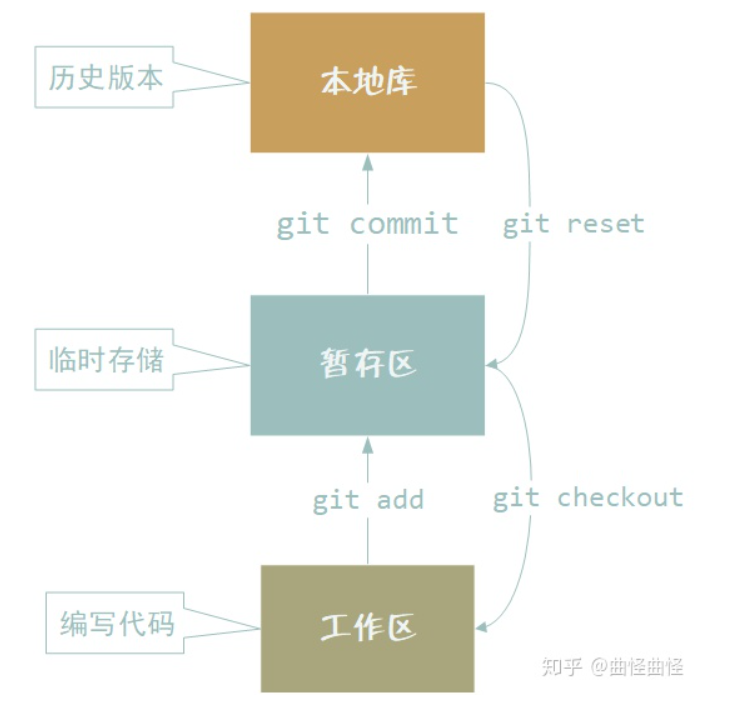

工作区通过 `git add` 将【新建文件】移入暂存区，并且跟踪文件版本变化。

对于旧文件（之前追踪过的文件） 可以直接 `git commmit`到本地库。

如果直接进行`commit` （不经过暂存区），保存的文件无法撤销。


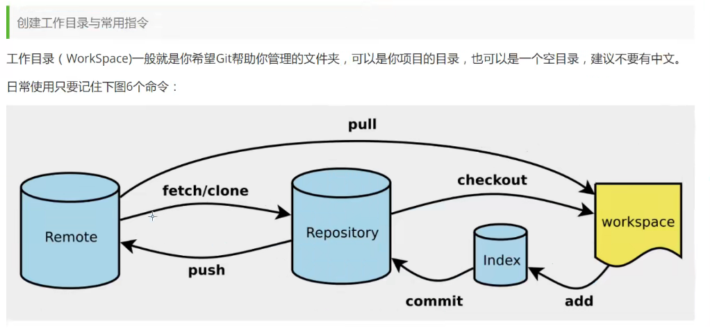


```dockerfile
git init  //初始化一个  本地仓库
```

```dockerfile
gie clone <url>  //克隆一个远程仓库
```


## 1.2 文件状态

`git` 文件有4种状态。

`Untracked` , 未追踪。未追踪的文件不会进行版本控制。

`Unmodify`  ： 文件已追踪，但没有修改。（本地库种文件与快照完全一致）。

`Modified` :  文件已最终，已修改。

`Staged` :   暂存状态。


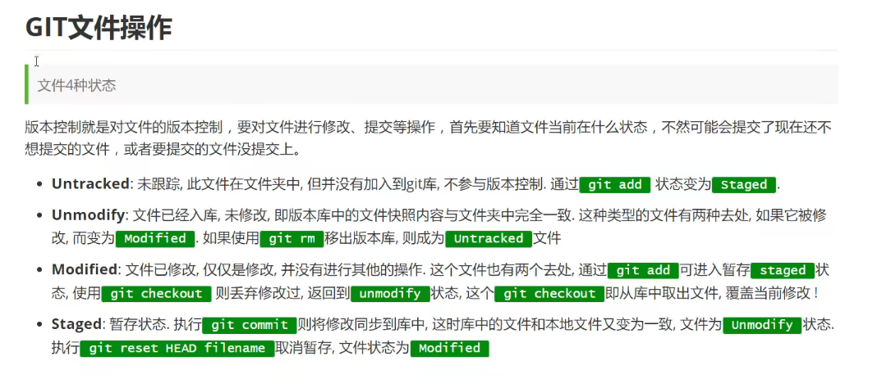


### 1.2.1 查看文件状态

使用 [git status](# 2.4 `git status` ) 查看文件状态

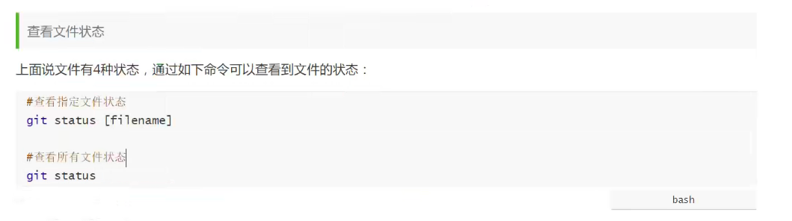


# 配置身份


```git
git config user.name = "<yourName>"

git config user.email = "<yourEmail>"
```


# push 到远程库


```
git remote -v   //查看当前工程的 提交地址
```


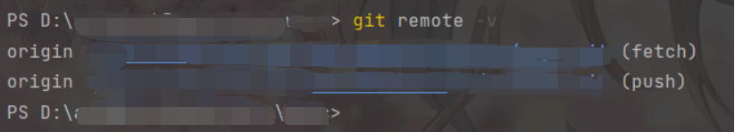


git remote add <别名> <https地址>  //给地址起一个别名

git push <别名>    //推送到 远程库


git pull <别名>  <branch名>     // 拉取数据库


git clone <https地址>


# 从远程库中pull

pull 相当于  fetch + merge

git fetch <远程库地址>  <远程库分支名>  //从远程库中获取某分支

git checkout <远程库地址/远程库分支名>  //选中某分支

git merge <远程库地址/远程库分支名>  //合并


# 配置用户名


设置 全局仓库的用户名

```
git config --global user.name "zhh"
```


查看 `git` 配置命令

```
git config --list
```


## 配置单个仓库用户名以及密码


有时，服务器可能部署在多个git仓库。 不同git仓库的用户名和密码是不一样的。

此时我们需要设置 单个仓库的用户名以及密码。


# 2. 命令


## 2.1 `git`忽略提交

忽略提交，严格上来说有几种情况：


1. 对于整个工程中，某些文件不希望推到git中 ， 此时可以编辑`.gitignore` 文件

​	此时修改得`.gitignore`文件会被推送至git上，这条分支上得其他人都会拉取相同的“忽略配置”

2. 有时，我们个人会修改一些配置项（例如引入一些开发工具 devtool ，但整个工程的其他人可能并不喜欢使用。） 此时使用`skip-worktree`


### 2.1.1 忽略文件的手段


1. git通常在.gitignore文件进行配置，来忽略本地文件。但是仅对于【从未提交过的文件】有效。


2. 使用git update-index --skip-worktree path设置标识，使git忽略对应的文件。
   - 说明：声明忽略文件的本地修改。
   - 优势：本地可以对文件做一些个人定制。文件不会出现在 git status。
   - 局限：拉取远程文件更新，或切换分支时有可能出现冲突，需要撤销忽略后手动解决冲突。


3. 使用git update-index --assume-unchanged path设置标识，使git忽略对应的文件。
   - 说明：声明本地远程都不会修改这个文件。
   - 优势：git 直接跳过这些文件的处理以提升性能。文件不会出现在 git status。
   - 局限：不适合本地或远程需要修改的文件。本地会忽略掉之后远程文件的修改。


### 2.1.2 `skip-worktree`

使用`git update-index --skip-worktree [file]`  来声明


### 2.1.3 --assume-unchanged

假定文件没有变动。

`git update-index --assume-unchanged [file]`


### 2.1.4 gitignore


```.gitignre
#注释

*.a             表示忽略所有 .a 结尾的文件 ， *匹配任意文件
!lib.a          表示但lib.a除外，  !排除忽略文件

build/  	忽略build文件夹下的全部文件

**/foo 		忽略任意路径下的 foo文件

/fd1/*	 	忽略fd1路径下的全部文件
```


## 2.2 `git clone`


### 2.2.1 克隆指定分支

```bash
git clone <branch_name> <rep_address>
```

例如：

```bash
$ git clone -b master http://192.168.10.32:9595/sunbingrun/bxjbf_yian.git
```


## 2.2 `git commit`

`git commit`为提交命令。

语法：

```shell
git commit [<options>] [--] <pathspec>...
```


### 2.2.1 options

列出 `git commit` 可选option都有哪些。


#### 2.2.1.1 `-a`

表示提交所有文件。 

```sh
git commit -a -m 这是一次测试提交
```


#### 2.2.1.2 `-m <message>`  

语法 :`-m <message>` 

表示给本次提交携带`<message>`信息。


#### 2.2.1.3 `--author <author>`

重写本次 `commit`的作者信息。


#### 2.2.1.4 `--date <date>`

重写本次`commit`的日期信息。


## 2.3 `git push`

用于向远端服务器推送仓库的命令。


语法：

```sh
git push [<options>] [<repository>] [<refspec>]
```


### 2.3.1 options

#### 2.3.1.1 `--all` 

将所有的`refs`都推过去。


#### 2.3.1.2 `--atomic`

以一个原子操作请求远端。


## 2.4 `git status` 

`git status` 查看状态


语法：

```sh
 git status [<options>] [--] <pathspec>...
```


### 2.4.1 `-v/-s/-b`

`-v` be verbose ， 详细输出状态信息。

`-s` be short  简短输出。

`-b` 输出 分支信息。

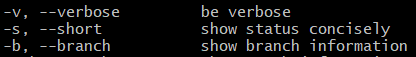


## 2.5 `git diff`

用于比对检查冲突文件。


`git diff`


语法：

```sh
usage: git diff [<options>] [<commit>] [--] [<path>...]
   or: git diff [<options>] --cached [--merge-base] [<commit>] [--] [<path>...]
   or: git diff [<options>] [--merge-base] <commit> [<commit>...] <commit> [--] [<path>...]
   or: git diff [<options>] <commit>...<commit> [--] [<path>...]
   or: git diff [<options>] <blob> <blob>
   or: git diff [<options>] --no-index [--] <path> <path>
```


## 2.6 `git pull`

从远端代码仓库中拉取代码，合并到本地库。


语法：

```sh
git pull [<options>] [<repository> [<refspec>...]]
```


### 2.6.1 `-v/-q` 详细/简略输出

`-v` ： 啰嗦一点儿

`-q` ： 安静点儿


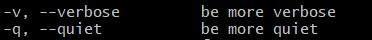


## 2.7 `git branch`

分支操作。


````sh
usage: git branch [<options>] [-r | -a] [--merged] [--no-merged]
   or: git branch [<options>] [-f] [--recurse-submodules] <branch-name> [<start-point>]
   or: git branch [<options>] [-l] [<pattern>...]
   or: git branch [<options>] [-r] (-d | -D) <branch-name>...
   or: git branch [<options>] (-m | -M) [<old-branch>] <new-branch>
   or: git branch [<options>] (-c | -C) [<old-branch>] <new-branch>
   or: git branch [<options>] [-r | -a] [--points-at]
   or: git branch [<options>] [-r | -a] [--format]
````


创建分支：

`git branch <branch_name>`


### 2.7.1 `options`


#### 2.7.1.1 `-a`  列出所有分支

`-a` 列出远端和本地所有分支。


#### 2.7.1.2 `-r` 远程分支分支

操作一个远程分支。


#### 2.7.1.3 `-d/-D ` 删除分支

`-d` 完全删除已合并的分支。

`-D`  删除分支，包含未合并的分支。

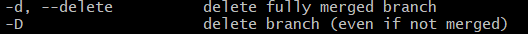


## 2.8 `git checkout`

`git checkout` 命令用于选择【分支】或者 【复位工作树文件】（慎重恢复） 。


### 2.8.1 options


#### 2.8.1.1 `-b/-B`


`-b <branch_name>`  :  创建和选择一个新的分支。

`-B <branch_name>` ：  创建/重置 并选择一个分支。

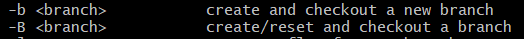


#### 2.8.1.2 `-l`

给一个新的分支创建 引用日志。

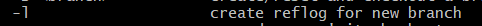


```sh
git checkout -b master1 -l 
```


# 3.备忘


## 3.1 切分支时没有commit


https://blog.csdn.net/weixin_51422660/article/details/121183863

1. 打开git bash执行命令 git fsck --lost-found
2. 在.git/lost-found/other/ 可以看到一堆文件，点进去一个一个查看所需文件就行


文件是这种形式的:

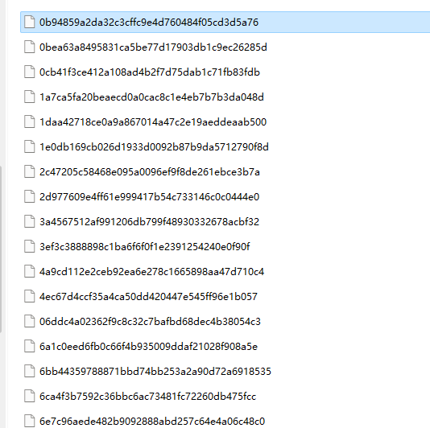


# 4. Gitlab


## 4.1 使用`SSH`和`Gitlab`通信


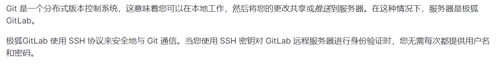


进入`.ssh/` 子目录。如果 `.ssh/` 子目录不存在，您可能不在主目录中，或者可能之前没有使用过 `ssh`。在后一种情况下，您需要[生成 SSH 密钥对](#生成-ssh-密钥对)。


将 SSH 密钥添加到您的极狐GitLab 帐户

> 引入于 15.4 版本，UI 中提供建议默认到期日期。

要将 SSH 与极狐GitLab 结合使用，请将您的公钥复制到您的极狐GitLab 帐户。

1. 复制公钥文件的内容。您可以手动执行此操作或使用脚本。例如，要将 ED25519 密钥复制到剪贴板：

   **macOS：**

   ```shell
   tr -d '\n' < ~/.ssh/id_ed25519.pub | pbcopy
   ```

   

   **Linux** (需要 `xclip` 包)：

   ```shell
   xclip -sel clip < ~/.ssh/id_ed25519.pub
   ```

   

   **Git Bash on Windows：**

   ```shell
   cat ~/.ssh/id_ed25519.pub | clip
   ```

   

   将 `id_ed25519.pub` 替换为您的文件名。例如，对 RSA 使用 `id_rsa.pub`。

2. 登录极狐GitLab。

3. 在顶部栏的右上角，选择您的头像。

4. 选择 **偏好设置**。

5. 在左侧边栏上，选择**SSH 密钥**。

6. 在 **密钥** 框中，粘贴公钥的内容。如果您手动复制密钥，请确保复制整个密钥，以`ssh-rsa`、`ssh-dss`、`ecdsa-sha2-nistp256`、`ecdsa-sha2-nistp384`、`ecdsa-sha2-nistp521`、`ssh-ed25519`、`sk-ecdsa-sha2-nistp256@openssh.com`，或 `sk-ssh-ed25519@openssh.com` 开头，并可能以注释结尾。

7. 在 **标题** 框中，输入说明，例如 “Work Laptop” 或 “Home Workstation”。

8. 可选。更新**到期日期**以修改默认到期日期。

   - 对于 13.12 及更早版本，到期日期仅供参考。它不会阻止您使用密钥。管理员可以查看到期日期并在删除密钥时作为指导。
   - 每天 02:00 AM UTC 检查所有 SSH 密钥。通过电子邮件发送所有在当前日期到期的 SSH 密钥的到期通知。（引入于 13.11 版本）
   - 每天 01:00 AM UTC 检查所有 SSH 密钥。通过电子邮件发送所有计划在 7 天后到期的 SSH 密钥的到期通知。（引入于 13.11 版本）

9. 选择 **添加密钥**。
