https://www.bilibili.com/video/BV1ME411Y71o/?p=137&vd_source=add6ccafd4287fc36f0faa387b936816

# 1.Go入门


Go（又称Golang）是Google开发的一种静态强类型、编译型、并发型，并具有垃圾回收功能的编程语言。


参考

https://github.com/unknwon/the-way-to-go_ZH_CN


## 1.1 安装运行环境

官网下载环境安装 https://golang.google.cn/dl/


vscode 安装go插件。


## 1.2 golang hello world


创建一个空文件夹，vscode打开 terminal 输入`go mod init example/hello`  

创建一个 `hello.go`的文件。 内容如下：

```go
package main   
//表示 hello.go 文件所在包为  main, go语言中每一个文件都归属一个包
//go语言以包的形式管理文件

import "fmt"
//导入一个包， 引入后，可以使用fmt包内的函数


//main主函数
func main(){
	fmt.Println("hello,world")
}
```

运行：

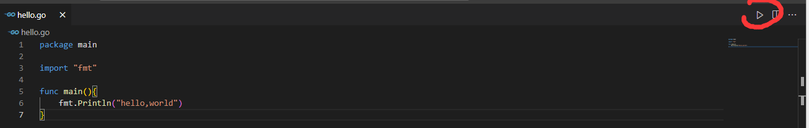

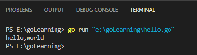


### 1.2.1 `go build <fileName>` 

可以通过 `go build <fileName>` 生成 `.exe`文件


例如：

`go buil hello.go`  则目录下会出现 `hello.exe` 

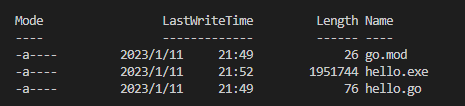


### 1.2.2 `go run <fileName>`

可以通过 `go run <fileName>` 直接执行 `.go`文件。

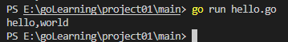


## 1.3 语法要求和基础知识


源码以 `.go`结尾。

应用程序入口 `main()`

严格区分大小写。


### 1.3.1 gofmt 命令格式化


`gofmt -w <fileName>` 规格化代码文件。


### 1.3.2 官网地址

`https://golang.org`


中文API文档地址  	https://studygolang.com/pkgdoc


### 1.3.3 `unsafe` 包查看数据占用字节数


```go
package main

import "fmt"
import "unsafe"

func main(){

    var i int8 =127
    var ptr *int8 =&i
    fmt.Printf("值%d，类型%T,占用字节数量%d",*ptr,i,unsafe.Sizeof(i))

}
```

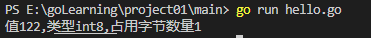


### 1.3.4 导包

可以使用 `import "<packageName>"`  也可以使用 

`import("<name1> <name2>")`

```go
import (
	"fmt"
	"unsafe"
)
```


## 1.4 定义变量

声明一个 int类型变量 `var i int` 变量的申请，必须使用空格隔开。

```go
package main

import "fmt"


func main(){
    var i int
    //字符串使用 双引号包裹
    var time = "2023-1-1"
    i = 10
    fmt.Println("i =",i,time)
}
```


1.  指定变量类型，如果不赋值，则使用默认值
2. 可以根据值自动类型推导
3. 可以使用`:=` 来省略`var`关键字

上述3点举例：

```go
package main

import "fmt"

func main(){
    var i = 10    
	str := "hello,world"
    fmt.Println(i,str)
    
    
}
```


一次性申请多个变量：

```go
package main

func main(){
    // n123全为int
    var n1,n2,n3 int
    
    //其中a1=1 a2="str" a3=3.14
    //类型自动推断
    var a1,a2,a3 = 1,"str",3.14
    
    //类型推断
    b1,b2,b3 := 1,"str",3.14
    
    
}
```


### 1.4.1 定义全局变量


```go
package main

import "fmt"

var n1=100
var n2=200

var(
	n3="hello,world"
    n4=123
)

func main(){
    fmt.Println(n1,n2,n3,n4)
}
```


### 1.4.2 定义指针


```go
package main
import "fmt"

func main(){
	var a int = 1
	var ptr *int = &a
	fmt.Println(*ptr)
    
   	//输出类型
   	//fmt.Printf函数用于格式化输出
    //%T 表示数据类型
    //%c 表示字符
    //%v 表示按原始值输出
    
    fmt.Printf("%T",ptr)
    
    
    
}
```


## 1.5 数据类型


`bool` 

`数字类型`（`int` `float32` `float64` 等）


 `字符串类型`  (string) 字符串，使用UTF8编码。


`派生类型` 

- (a) 指针类型（Pointer）
- (b) 数组类型
- (c) 结构化类型(struct)
- (d) Channel 类型
- (e) 函数类型
- (f) 切片类型
- (g) 接口类型（interface）
- (h) Map 类型


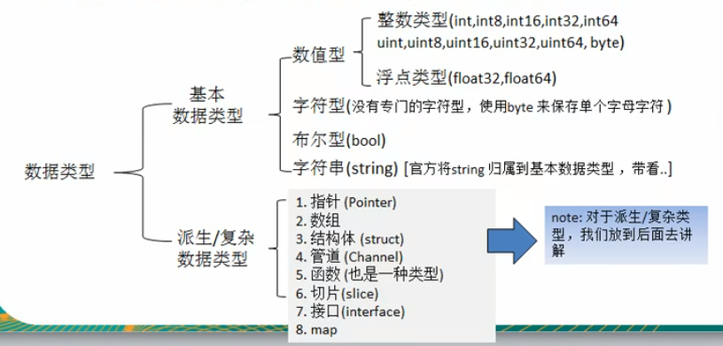


### 1.5.1 数字类型

整型具体包含如下：

```
uint8 （无符号8位） 
uint16 
uint32 (rune ,表示一个 Unicode)
uint64

int8 int16 int32 int64
```


浮点类型包含 :

```
float32  32位浮点
float64

复数：
complex64   32位实数部分，32位虚数部分
complex128	64位实数，64位虚数
```


还有一些其他类型：

```
byte 字节

uintptr 无符号整型，用于存放一个指针
```


### 1.5.2 字符/字符串 类型

在`go`中没有 `char` ， 如果想要为字符赋值，那么一般使用`byte`数据类型 。

 go中的字符串使用 `UTF-8` 编码，所以是1-4字节

```go
func main(){
    var c byte = 'a'
    var c2 int64 = '梦'
    fmt.Printf("%c",c)
    fmt.Printf("%c",c2)
}
```


字符串：

`go`的字符串关键字：`string`

示例：

```go
func main(){
    var address string = "127.0.0.1"
    port := "8080"
    fmt.Println(address+":"+port)
    
}
```


#### 1.5.2.1 不可变

`go` 中的字符串是不可变的。这样可以避免并发问题。


```go
	var str string = "hello,world"
	//无法修改
	str[0] = 'a'
```


#### 1.5.2.2 反引号

`go` 支持使用反引号包裹字符串，可以实现 【防攻击】 和 【输出源码】。


示例：

```go
	code := 
	`
		package main

		import "fmt"

		func main(){
			fmt.Println("hello,world")
		}
	
	`

	fmt.Println(code)
```


#### 1.5.2.3 拼接String

`go`中使用 `+` 拼接两个字符串。

多行拼接必须以`+`结尾，否则无法过编译。


```go
func main(){
    var a string = "hello " + 
    "world."+
    "this " +
    "war" + 
    "of" +
    "mine"
    fmt.Println(a)
}
```


#### 1.5.2.4 遍历字符串

方法一： 不支持字符串中有 ASCII 以外的字符。

```go
func main(){
    var str string = "hello,world"

    for i:=0;i<len(str);i++ {
        fmt.Printf("%c\n",str[i])
    }
    
}
```


可以使用 `[]rune()`的方式，将4byte作为一个元素单位,此时使用 `len()`遍历可以遍历超过 1byte的字符

```go
func main(){
	var str string = "hello,世界"
    var runeSlice = []rune(str)
    
    for i:=0;i<len(runeSlice);i++ {
        fmt.Println(runeSlice[i])
    }
	
}
```


方法2：使用 `range`遍历

可以遍历 ASCII以外的字符。

```go
func main(){
    var str string = "hello,世界"
    for index,val:= range str {
        fmt.Printf("%d,%c\n",index,val)
    }
}
```

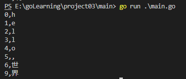


### 1.5.3 `bool`类型

`bool` 占1个字节， 只允许 `true` 或者`false`。


不可以使用 0 或 非0的整数来代表 `bool` ，这和C不一样。


### 1.5.4 默认值

所有的数据类型都有默认值。


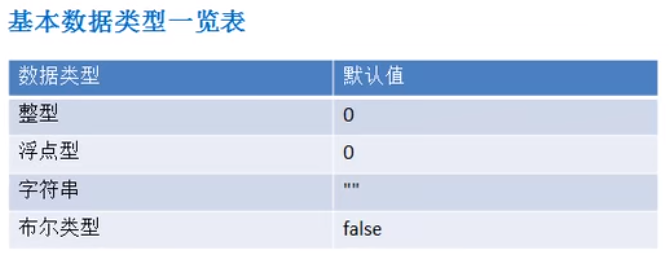


### 1.5.5 基本数据类型转换

`go` 中数据类型转换都需要显式转换。 不能自动转换。

语法 ： `T(v)`  T表示类型， v变量名


```go
func main(){
    var a int = 1
    var b float64 = float64(a)
    fmt.Printf("%f",b)
    
}
```


#### 1.5.5.1 基本数据类型<->string


第一种，使用 `fmt.Sprintf(format,a...interface{})` 转换

```go
import(
    "fmt"
)

func main(){
    var a int = 99
   	var str string
    str = fmt.Sprintf("%d",a)
    fmt.Println(str)
}
```


第二种，使用 `strconv`包函数


```go
import {
    "fmt"
    "strconv"
}

func main(){
    var a bool = false
    var b int64 = 1234
    var c float64 = 121.111
    var str string
    
    //需要float64 ，否则需要强转
    str = strconv.FormatFloat(c,'f',6,32)
    fmt.Println(str)
    
    str = strconv.FormatBool(b)
    fmt.Println(str)
    
    //需要int64 ，否则需要强转
    str = strconv.FormatInt(b,10)
    fmt.Println(str)
}
```


#### 1.5.5.2 string类型 ->基本数据类型

使用 `strconv` 包下的 `ParseXXX`函数。


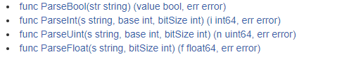


## 1.6 值类型，引用类型


值类型：

基本数据类型 int，float ,bool ,string ,数组，结构体struct


引用类型

指针，slice，map  , channel , interface


### 1.6.1 值类型

值类型都有对应的指针类型。 变量直接存储值

通常在栈中分配内存。


### 1.6.2 引用类型

变量存储的是一个地址。 地址对应的空间才真正存储数据。通常在堆区分配。


## 1.7 标识符

变量名，函数名，常量名 , 结构体名只有首字母大写，才表示可以被包外访问，否则为包内私有。


## 1.8 go中的进制


go中不能直接表示二进制数。

八进制以0开头。

16进制以0x开头。

```go
    var a int = 011		// 9(10)   
    var b int = 0x10	// 16(10)

	fmt.Printf("%d,%d",a,b)
```


### 1.8.1 位运算符

 按位与`&`

按位 或`|` 

按位异或 `^`


## 1.9 流程控制


### 1.9.1 `if` /`if else`/`if...else if...`

语法： 

```go
if condition {
    
}
```


```go
if condition {

} else {

}
```


```go
if condition1 {
    
}else if condition2 {
    
}else{
    
}
```


示例：

```go
	if true {
		fmt.Println("hello,world")
	}else {
		fmt.Println("never")
	}
```


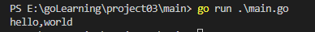


### 1.9.2 `switch`

语法：

```go
switch var1 {
    case val1:
        ...
    case val2:
        ...
    default:
        ...
}
```

在`go`中默认`case`自带 `break` ，如果想落入其他`case` 需要使用 `fallthrough` 关键字。 例2：


`switch` 后 可以是一个【表达式】，常量，变量，有返回值的函数。 例3，例4

`case` 后可以是一个常量，也可以是一个变量。例5

同一个`case` 支持匹配多个值，使用逗号`,`隔开 例如： `case 1,2,3,4`    例5


`switch` 后也可以不接表达式。 例6


例1：

```go
	var e string =  "A"
	switch e {
        //常量
		case "A":
			fmt.Println("a")
		case "B":
			fmt.Println("b")
		case "C":
			fmt.Println("c")
	}
//只会输出a ，默认switch自带break
```


例2：

```go
	var e string =  "A"
	switch e {
		case "A":
			fmt.Println("a")
        //落到下一个case
        	fallthrough
		case "B":
			fmt.Println("b")
		case "C":
			fmt.Println("c")
	}
//会输出a,b 
```


例3：

```go
func add(b byte) byte{
	return b+1
}

func main(){
    var g byte
	//switch后是一个 有返回值的函数
	switch add(g){
		case 1:
			fmt.Println(1)
		case 2:
			fmt.Println(2)
		default:
			fmt.Println("other")
	}
}
```


例4:

```go
func add(b byte) byte{
	return b+1
}

func main(){
    var g byte
	//switch后是一个 表达式
	switch add(g)+2{
		case 1:
			fmt.Println(1)
		case 2:
			fmt.Println(2)
		default:
			fmt.Println("other")
	}
}
```

例5：

```go
func main(){
    var g byte
	switch g{
        case 1,2,3,4:
	        fmt.Println("A")
	    default:
	        fmt.Println("other")
        
	}
}
```

例6

```go
func main(){
    var a int
    
    switch {
        case a<10:
	        fmt.Println("hello")
        case a==11 || a>50:
	        fmt.Println("world")
        default:
            fmt.Println("qwer")
    }
    
}
```


例7

```go
func main(){
    var x interface {}
    var y int =10
    x =y
    switch i:=x.(type){
    case nil:
        fmt.Printf("%T",i)
    case bool:
        fmt.Println(1)
    case int :
        fmt.Println(2)
    default:
        fmt.Println("other")
    }
    
   
}
```


### 1.9.3 `slect`


### 1.9.4  try-switch

通过 `try-switch` 来判断变量的类型。

语法：

```go
switch x.(type){
    case type:
       statement(s);      
    case type:
       statement(s); 
    /* 你可以定义任意个数的case */
    default: /* 可选 */
       statement(s);
}
```


示例： 

```go
	var f interface{}

	switch f.(type){
		case nil:
			fmt.Println("nil")
		case bool:
			fmt.Println("bool")
		default:
			fmt.Println("other")
	}
```


## 1.10 循环控制

`go`中，`for`循环有3种语法：


### 1.10.1 语法

1.

```go
for init;condition;post{
    ...
}
```

`init` 为初始化， `condition`为循环控制条件， `post`一个表达式，是一次循环完毕后的操作。


2.

```go
for condition {
    ...
}
```


3.等价于 C语言中的 `for(;;){}` `while(true){}`

```go
for{
    ...
}
```


### 1.10.2 示例

```go
func main(){
    for i:=0;i<10;i++{
		fmt.Println("great!")
	}
}
```


```go
func main(){
    var j int =0
    for j<10 {
        fmt.Println("hello,world")
        j++
    }
}
```


```go
func main(){
    var k int = 0
    
    for {
		if k>=10 {
			break
		}
		fmt.Println("let it go")
		k++
	}
}
```


### 1.10.3 `for-range`

`go` 提供 `for-range`的方式，可以快速遍历 字符串 和  数组


### 1.10.4 `while/ do...while`

`go`语言中没有 `while` 和 `do...while`


实现 `while`

```go
for {
    if condition {
        break
    }
    
    ... do something
}
```


### 1.10.5 lable

`go`支持 `label`


语法：

```go
lable 1:
for {
    lable 2:
    for {
        for {
            if condition {
            break lable1
            }
        }
    }

}
```


## 1.11 range 关键字

`go`语言特有的关键字 `range` , 用于 for 循环中迭代  数组(array)、切片(slice)、通道(channel)或 集合(map)元素。


## 1.12 数组


### 1.12.1 声明/初始化数组


#### 1.12.1.1 语法

声明语法:

```go
//一维数组
var var_name [size] var_type
```


初始化语法：

```go
var var_name = [size]var_type{ele1,ele2,ele3...}
//var ban = [5]int32{1,2,3,4,5}
//声明并初始化的时候，变量类型不写在=前


//自动推断size
var var_name = [...]var_type{ele1,ele2,ele3...}
//var ban = [...]int{1,2,3,4,5,6}

// ...可以省略
var var_name = []var_type{ele1,ele2,ele3...}
//var ban = []int{1,2,3,4,5,6}


//使用:=化简声明
var_name := [...]var_type{ele1,ele2,ele3...}
```


如果设置了数组的长度，可以通过指定下标来初始化元素：

```go
var var_name = [size]var_type{index1:ele1, index2:ele2, index3:ele3}
//var ban = [5]int32{0:111,1:222,2:333}
```

index必须<=size-1

`{}`内元素的的个数可以少于 `size`, 没有被初始化元素的为`零值`。


#### 1.12.1.2 示例

示例1

```go
func main(){
    
    var ban[10] int32
    
    var ban1 = [5]int{1,2,3,4,5}
    var ban2 = [...]int32{1,2,3,4,5,6,7}
    
    ban3 := [...]int32{1,2,3}
    
    var ban4 = [5]int32{0:123,1:982}
    
    
    
}
```


### 1.12.2 访问数组元素

```go
func main(){
    var ban = [10]int32{1,2,3}
    
    for index,val := range ban {
        fmt.Printf("%d,%d\n",index,val)
    }
    
    for i:=0;i<len(ban);i++{
		fmt.Println(ban[i])
	}
}
```


### 1.12.3 多维数组

`go`语言支持多维数组。


#### 1.12.3.1 申请数组

声明语法：

```go
var variable_name [SIZE1][SIZE2]...[SIZEN] variable_type

//var arr [2][2] int
//声明了一个2维的数组
```


初始化语法：

```go
var var_name = [size1][size2]var_type{{ele1,ele2},{ele3,ele4}...}
//var_name 变量名
//size1一维长度
//size2二维长度
//var_type数组元素类型
```


另一种方法，使用`append()`函数

```go
var var_name = [][]var_type{}

//一维数组 row_name1 row_name2
var row_name1 = []var_type{}
var row_name2 = []var_type{}

var_name = append(var_name,row_name1)
var_name = append(var_name,row_name2)
```


#### 1.12.3.2 遍历数组


1.借助 `len()`函数

```go
func main(){
    
    var arr = [][]int32{}
    
    var row1 = [5]int32{1,2,3,4,5}
    var row2 = [5]int32{10,11,12,13,14}
    
    arr = append(arr,row1)
    arr = append(arr,row2)
    
    //双for通过索引， 使用len()
    for i:=0;i<len(arr);i++ {
        for j:=0;j<len(arr[0]);j++ {
            fmt.Printf("%d ",arr[i][j])
        }
        fmt.Printf("\n")
    }
}
```


2. 借助`range`关键字

```go
func main(){
    
    var arr = [][]int32{}
    
    var row1 = []int32{1,2,3,4,5}
    var row2 = []int32{2,3,5}
    var row3 = []int32{1,11,3,4,5}
    
    arr = append(arr,row1)
    arr = append(arr,row2)
    arr = append(arr,row3)
    
    
    //通过range关键字.
    //多维数组返回 维度index
    //一维数组返回 index,element
    for i :=range arr {
        var row = arr[i]
        for _,element := range row {
            fmt.Printf("%d ",element)
        }
        fmt.Printf("\n")
    }
}
```


## 1.13 函数

`go` 语言中最少有一个 `main()` 函数。

函数声明告诉了编译器，函数的名称，函数的返回值类型，函数的形参列表。


### 1.13.1 定义语法


```go
func func_name ([param1_name param1_type, param2_name param2_type...]) [return_types] {    
    //statement...
    [return value]
}
```

`[]` 表示可省略


可以给返回值变量 起名字

```go
func func_name(param_name param_type) (return_name return_type,return_name2 return_type2){
    
}
```


示例：

```go
func MyFunc(n1,n2 int)(sum int ,sub int){
    sum := n1+n2
    sub := n1-n2
    //直接return即可
    return
}
```


### 1.13.2 函数可以返回多个值

在`go`中，函数可以返回多个值。


```go
func swap(x,y string)(string,string){
    return y,x
}

func main(){
    a,b:= swap("a","b")
    fmt.Println(a,b)
}
```


### 1.13.3 值传递/引用传递

值传递，表示在 将变量传入函数时仅仅将值传递给函数，不会影响到原来变量的值。


### 1.13.4 函数作为参数传入其他函数

`go`语言允许把函数作为实参，传入另一个函数中。


```go
func main(){
    myfun := math.Sqrt

	printType(myfun)    
}

func printType(function interface{}){
    fmt.Printf("%T",function)
}

```


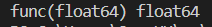


### 1.13.5 闭包

闭包是【有权限】访问 【其他函数作用域】内局部变量 的一个函数。

```
闭包是一个函数
闭包能访问其他函数的局部变量
```


一般以子函数实现。 子函数可以访问父函数的变量。

闭包可以让子函数依赖于外部变量(使用外部变量)


下面是go的一个闭包示例

```go
import "fmt"

func main(){
    
    //nextNumber 表示这个匿名函数
    nextNumber := getSequence()
    
    fmt.Println(nextNumber())
    fmt.Println(nextNumber())
    fmt.Println(nextNumber())
    fmt.Println(nextNumber())
    fmt.Println(nextNumber())
    
}

//getSequence函数返回一个  匿名函数，这个匿名函数返回int
func getSequence() func()int{
    i :=0 
    return func()int{
        i+=1
        return i
    }
}
```

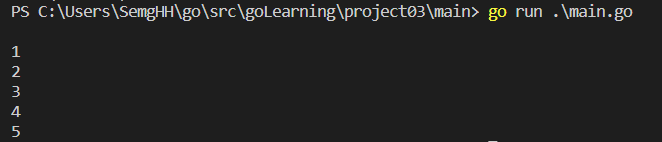


### 1.13.6 方法

`go` 语言函数区分 【函数】 和【方法】。 这个方法事实上等价于Java中的 `方法` ，用于定义对象行为。

下面是`go`中关于方法的描述：


方法就是属于【接受者】的函数。


接受者可以是某个【命名类型】或者【结构体类型】的一个【值】或者是一个【指针】。所以【方法】属于这个类型的方法集。


```
就类似于java中对象的行为。用方法表示这个对象的行为。
```


定义语法： (方法将形参写在  func关键字后， 函数名前  )

```go
func (variable_name variable_type) function_name() [return_type]{
    //函数体
}
```


对于无参的方法：

```go
func (variable_type) function_name()[return_type]{
    
}
```


定义一个结构体类型，以及该类型的方法。

```go
type Circle struct{
    radius float64
}

func (c Circle) GetArea() float64{
    return math.Pi * radius * radius
}

//带参数的方法
func (c Circle) SayHello(name string){
    fmt.Printf("%s,hello",name)
}


func main(){
    var c1 Circle
    c1.radius = 10.0
    fmt.Println(c1)
    
}
```


### 1.13.7  可变参数

也就是`java`中的不定参数。


语法：

```go
//0到多个参数
func sum(args... int)int{
    
}

//1到多个参数
func sum(n1 int,args...int)int{
    
}
```

`args`本质是一个切片`slice` ,通过 `args[index]`访问各个元素。


### 1.13.8 `defer` 关键字


关键字 `defer` 允许我们推迟到函数返回之前（或 `return` 语句之后）一刻才执行某个语句或函数。

为什么要在`return`之后？因为`return`语句同样可以包含一些操作，而不是简单的返回值。

`defer` 类似`finally` 语句块，用于释放某些已分配的资源。


示例

```go
package main
import "fmt"

func main() {
	function1()
}

func function1() {
	fmt.Printf("In function1 at the top\n")
	defer function2()
	fmt.Printf("In function1 at the bottom!\n")
}

func function2() {
	fmt.Printf("Function2: Deferred until the end of the calling function!")
}

//In Function1 at the top
//In Function1 at the bottom!
//Function2: Deferred until the end of the calling function!
```


`defer` 语句【按照执行顺序接收值 】，请仔细体会下面的示例：

```go
func foo()int{
    i:=0
    defer fmt.Println(i)  //输出0
    i+=1
    return i  //return 1
}
```


多条`defer` 倒叙执行，类似`栈`

```go
func foo1()int{
    for i:=0;i<5;i++{
        defer fmt.Printf("%d ",i)
    }
}

//4 3 2 1 0
```


#### 1.13.8.1 使用`defer`释放资源

1.关闭文件流

```go
defer file.Close()
```


2.释放锁

```go
mu.Lock()  
defer mu.Unlock() 
```


3.打印最终报告

```go
printHeader()  
defer printFooter()
```


4.关闭数据库连接

```go
// open a database connection  
defer disconnectFromDB()
```


### 1.13.9 内置函数

无需导入任何包就可以执行的函数 `内置函数`

https://github.com/unknwon/the-way-to-go_ZH_CN/blob/master/eBook/06.5.md


 `len()`  : 返回某个类型的长度或数量。（字符串，切片，管道，数组，`map`）

 `cap()` ： 返回容量，只能 切片，管道，数组


 `append()` ,`copy` : 用于复制和连接切片。


`panic()`、`recover()` : 错误处理机制。


`complex()`、`real ()`、`imag()`  ： 创建和操作复数。

`close()` ： 用于管道通信。


### 1.13.8 函数总结


1. `go`中函数的形参列表和返回值列表都可以是多个

2. 对外可访问的变量名，函数名需要首字母大写。小写只能被本包内使用

3. 【基本数据类型】和【数组】默认都是值传递。

   测试代码：

   ````go
   func main(){
       var arr = [5]int32{1,2,3,4,5}
       changeArr(arr)
       for _,val := range arr{
           fmt.Print(val) //12345
       }
   }
   
   func changeArr(arr [5]int32){
       arr[0]=2
   }
   func changeArr2(arr *[5]int32){
       (*arr)[0]=2
   }
   ````

4. `go` 不支持函数重载。（相同函数名，形参列表不一致）

5.  `go` 中函数也是一种数据类型( `interface{}` 可以表示) , 函数可以赋值给一个变量。

   ```go
   //函数作为形参的另一种表示:
   
   
   //定义一个函数myFun ，接收3个参数,返回一个int
   //第一个参数是一个函数变量。这个函数的形参2个int返回一个int
   //第2，3参数都是int
   func MyFun(funVar func(int,int)int ,num1,num2 int) int{
       return funVar(num1,num2)
   }
   
   
   func main(){
       res := MyFun(func (x,y int)int {
           return x+y
       },1,2)
       fmt.Println(res)
   }
   ```

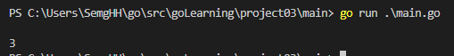


### 1.13.9 init函数

每一个源文件都可以包含一个 `init`函数，该函数会在 `main`函数执行前被Go调用，初始化。


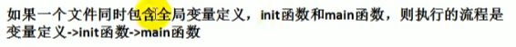


如果 `main.go`引入了`utils.go` 那么，`utils.go`中的 `init()`函数先执行，`main.go`中的 `init()`后执行。

被依赖的go文件中的init先执行。


```go
package utils

import (
    "fmt"
)

var MyName := "hello,world"

func init() {
    fmt.Println("utils init ...")
    
    
}


```


## 1.14 包

`go`的每一个文件都属于一个包。


包的作用：

```
1.区分相同名字的 函数，变量，标识符
2.控制函数，变量的访问范围
```


打包

```go
package <pck_name>
```

引入

```go
import "fmt"

import (
	"fmt"
    "strconv"
)
```


### 1.14.1 引入自定义包

`.go`文件中的包名，应该和文件夹名称一致。 如果未启用`mod`管理包，则默认以 `$GOPATH/src`为根目录搜索。

开启关闭`mod`管理： 使用 [go env](# 1.15.1 `go env`)  命令。


### 1.14.2 包的相关细节


1.对外访问 :

```
包内 变量，函数对外访问，需要将 变量名，函数名首字母大写
```


编译为可执行文件，需要将包名声明为 `main` , 如果是一个库文件，则可以自定义。


### 1.14.3 包的别名

`go` 在导包的同时 ， 支持对包起别名， 但原包名不允许使用了。


示例： 其中 `util` 就是别名。

```go
package main

import (
    "fmt"
    util "goLearning/project03/MyUtils"
)

func main(){
    
    a,b := util.Swap("a","b")
    fmt.Println(b,a)
    
    
    
}
```


## 1.15 go命令


### 1.15.1 `go env`

`go env` 可以查看go的环境变量。

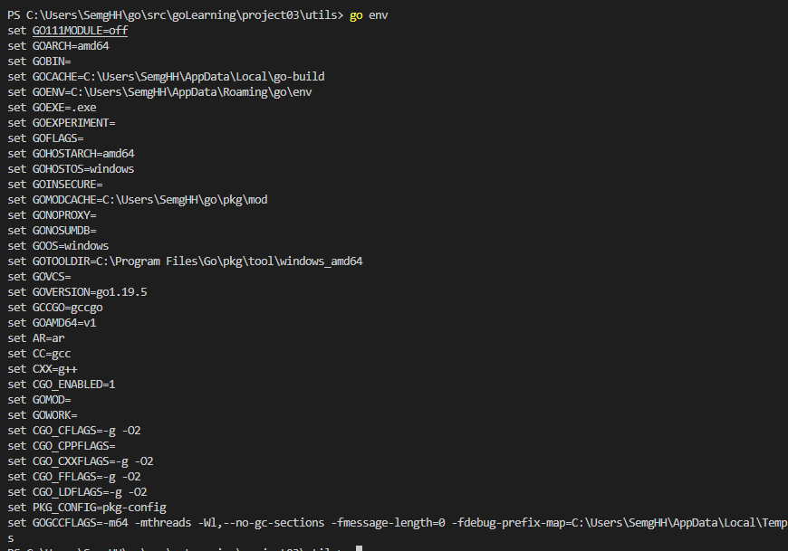


`go env -w GO111MODULE=off` 关闭包mod管理。

```
不开启mod管理时，搜索包会以 GOPATH/src 为根目录搜索。
```


### 1.15.2 `go build`


语法 ： `go build <fileName>` 


可以通过 `go build <fileName>` 生成 `.exe`文件


### 1.15.3 `go doc`


语法： `go doc <package>` 获取包的文档注释。  `go doc fmt` 生成 fmt 包的文档。


`go doc package/subpackage` 获取子包的文档注释，例如：`go doc container/list`。

`go doc package function` 获取某个函数在某个包中的文档注释，例如：`go doc fmt Printf` 会显示有关 `fmt.Printf()` 的使用说明。


这个工具只能获取在 Go 安装目录下 `../go/src` 中的注释内容。

此外，它还可以作为一个本地文档浏览 web 服务器。在命令行输入 `godoc -http=:6060`，

然后使用浏览器打开 [http://localhost:6060](http://localhost:6060/) 后，你就可以看到本地文档浏览服务器提供的页面。


### 1.15.4 `go install`

安装`go` 包的工具。 主要用于安装非标准库的包文件。


### 1.15.5 `go fix`

- `go fix` 用于将你的 Go 代码从旧的发行版迁移到最新的发行版，它主要负责简单的、重复的、枯燥无味的修改工作，如果像 API 等复杂的函数修改，工具则会给出文件名和代码行数的提示以便让开发人员快速定位并升级代码。Go 开发团队一般也使用这个工具升级 Go 内置工具以及 谷歌内部项目的代码。`go fix` 之所以能够正常工作是因为 Go 在标准库就提供生成抽象语法树和通过抽象语法树对代码进行还原的功能。该工具会尝试更新当前目录下的所有 Go 源文件，并在完成代码更新后在控制台输出相关的文件名称。


### 1.15.6 `go test`

- `go test` 是一个轻量级的单元测试框架（[第 13 章](https://github.com/unknwon/the-way-to-go_ZH_CN/blob/master/eBook/13.0.md)）。


## 1.16 结构体

`go`语言允许自定义新的数据类型。将零个或任意多个任意类型聚合成一个实体就是结构体。每个值都是结构体的成员。


### 1.16.1 语法

```go
type struct_name struct{
    name1 name1_type
    name2 name2_type
    //...
}
```


定义了结构体以后，就可以声明一个 这种结构体的变量。 语法如下

```go
var var_name struct_var_type = struct_var_type {value1,value2,value3 ...}

var_name := struct_var_type {value1,value2,value3 ...}

var_name := struct_var_type { field1_name: value1, field2_name: value2..., fieldn_name: valuen}
```

其中 `field_name` 表示成员的名称。


示例1 ：

```go
type Student struct {
    Age int32
    Name string
}

func (s Student) SayHello(){
    fmt.Printf("Student{name:%s,age:%d",name,age)
}

func main(){
    var s1 Student = Student{18,"Semghh"}
    s1.SayHello()
    
    s2 := Student{22,"a"}
    s2.SayHello()
    
    s3 := Student {age:24,name:"b"}
    s3.SayHello()
}
```


结构体作为参数。（值传递）

```go
//值传递，想要改变结构体内容，传入结构体指针。
func say(s Student){
    s.SayHello()
}
```

访问结构体成员

```go
func main (){
    s = Student{12,"a"}
    fmt.Println(s.Age)
    fmt.Println(s.Name)
    
}
```


### 1.16.2 结构体指针

`go`中，结构体作为参数，使用的是值传递。所以想要改变原结构体，需要使用指针。


```go
type Circle struct {
    Radius float64
}

func main(){
   	c1 := Circle{2.0}
	fmt.Println(c1.Radius)//2
    
	changeCircle(&c1)
	fmt.Println(c1.Radius)//1
}

func changeCircle(c *Circle){
    (*c).Radius = 1.0
}
```


## 1.17  type关键字


参考

https://cloud.tencent.com/developer/article/1074455#:~:text=type%E6%98%AFGo%E8%AF%AD,typedef%E3%80%82


### 1.17.1 type的作用


#### 1.17.1.1 定义结构体

详情 [1.16 结构体](# 1.16 结构体)


```go
type Student struct{
    
}
```


#### 1.17.1.2 类型等价定义

相当于给类型重命名。

语法：

```go
type type_name data_type
```


示例：

```go
func main(){
    type MyInt int
    
    //代表形参为2个int返回值为int的函数。
    type MyFun func(int,int) int
    
    
    var a MyInt = 10
    
    var b MyFun
    
}
```


#### 1.17.1.3 定义接口类型

```go
package main

import(
	"fmt"
)


type PersonInterface interface {
    Run()
    Name() string
}

//用结构体来实现函数， 实现接口也可以是函数对象

type person struct {
    name string
    age int
}

//无参的方法可以这样定义。
func (person)Name()string{
    return p.name
}

func (p person)Run(){
    fmt.Println("running")
}

func main(){
    
    var pItf PersonInterface
    fmt.Println(pItf) //nil
    
    //实例化，赋值给pItf
    pItf = person{"Semghh",18}
    pItf.Run()
    
    fmt.Println(pItf.name())
    
    
}

```


## 1.18 切片

`go`中【切片】是对数组的一个连续片段的引用。所以切片是引用类型。

切片可以引用整个数组，也可以是由 【起始】到【终止】之间的子集。


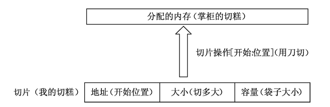


### 1.18.1 定义切片

```go
//声明
var var_name []var_type
```

`var_type`表示数据类型。 `len`表示长度，是可选参数。


切片默认指向一段连续内存区域，可以指向数组，或切片。

```go
slice [开始位置 : 结束位置]
```

`slice` 表示 切片的目标对象。

切出的元素，以`开始位置`为索引，到 `结束位置-1`为索引的元素。


例如：从数组中切片。

```go
var arr = [3]int{1,2,3}

var slice = arr[1:3] //生成了一个切片 [2,3]
//从arr数组中，切出索引为1开始，一直到结束位置-1,也就是2的切片。

fmt.Println(slice)
```


- 缺省开始位置，表示从连续区域开头到结束位置；
- 缺省结束位置，表示从开始位置到整个连续区域末尾；
- 全都省略时，表示slice指向的目标本身。
- 两者同时为 0 时，等效于空切片，一般用于切片复位。


#### 1.18.1.1 使用`make()/new()` 创建切片

切片总是指向一段连续的内存空间，可以创建一个切片，指向既有的内存空间。

也可以通过切片来申请一块新的内存空间， 此时需要`make()` 或者 `new()` 函数。


`make()`的语法：

```go
make([]Type,len,cap)

new([cap]int)[startIndex:endIndex]
```

​	`type`表示类型

​	`len` 表示此时切片的长度。

​	`cap` 表示切片最大容量，是可选的参数。


`make` 在堆上分配内存,  `make` 只适用于3种内置引用类型 ： `切片`  `map` `channel`


现在make一个切片：

```go
make([]int, 2, 5)
new([5]int)[0:2]
```

那么此时的内存情况：

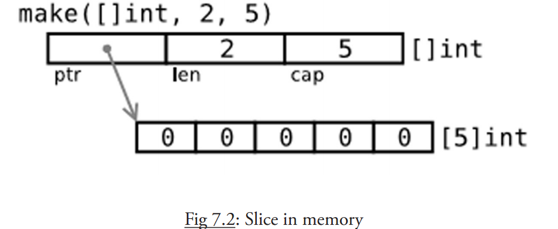

指向的内存区域最大只有5，因为cap=5


#### 1.18.1.2 测试

`len()`  返回切片长度

`cap()` 返回切片容量

`copy(dest,src []T)`函数 ，将`src`种的数据拷贝到 `dest`中。

`append()` 追加


```go
var arr [30]int

for i:=0;i<30;i++ {
    arr[i] = i
}

slice1 := arr[0:5]

slice2 := arr[20:]

slice3 := arr[:10]

slice4 := arr[:len(arr)-1]

fmt.Println(slice1,slice2,slice3)
```

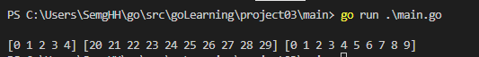


```go
	arr1 := []int{1,2,3,4}

	slice3 := arr1[2:]

	slice3[1] = 5

	fmt.Println(arr1,slice3)
```


*译者注：如何理解 new、make、slice、map、channel 的关系*

*1.slice、map 以及 channel 都是 golang 内建的一种引用类型，三者在内存中存在多个组成部分， 需要对内存组成部分初始化后才能使用，而 make 就是对三者进行初始化的一种操作方式*

*2. new 获取的是存储指定变量内存地址的一个变量，对于变量内部结构并不会执行相应的初始化操作， 所以 slice、map、channel 需要 make 进行初始化并获取对应的内存地址，而非 new 简单的获取内存地址*


### 1.18.2  多维切片

切片也支持多维，内层的切片必须单独分配（通过 `make()` 函数）。


### 1.8.3 切片重组

切片创建的时候通常比相关数组小 , 切片通常可以扩容，直至扩容到数组最大长度。


改变切片长度的过程称之为切片重组 **reslicing**做法如下：

`slice1 = slice1[0:end]`，其中 `end` 是新的末尾索引（即长度）。


```go
var slice = make([]int,5,10)

//扩充1位
slice = slice[0:len(slice)+1]

slice = slice[]
```


```go
var ar = [10]int{0,1,2,3,4,5,6,7,8,9}
var a = ar[5:7] // 切片的值a {5,6} 
//len(a)为 2
//cap(a) is 5    5开始一直到最后有5个，所以cap为5
```


### 1.8.4 切片的复制和追加

如果切片的 `len<cap` 此时可以扩容 , 如果想增加超过 `cap` 则只能创建一个更大的切片，并把原来的内容拷贝过来。

使用 `copy()` 和`append()`函数完成拷贝和追加。


`copy(dest,src []T)`函数 ，将`src`种的数据拷贝到 `dest`中。

`append(s[]T, x ...T))` 追加

```go
package main
import "fmt"

func main() {
	slFrom := []int{1, 2, 3}
	slTo := make([]int, 10)

	n := copy(slTo, slFrom)
	fmt.Println(slTo)
	fmt.Printf("Copied %d elements\n", n) // n == 3

	sl3 := []int{1, 2, 3}
	sl3 = append(sl3, 4, 5, 6)
	fmt.Println(sl3)
}
```


#### 1.8.4.1 `append()`常见操作


#### 1.8.4.2  练习题

实现`Filter`过滤函数：

构造一个函数 `Filter`，第一个参数是 `s []int`，第二个参数是一个 `fn func(int) bool`，返回满足函数 `fn` 的元素切片。通过 `fn` 测试方法测试当整型值是偶数时的情况。


```go
func Filter(slice []int , fn func(int) bool  ) []int {

	index := 0
	newSlice := make([]int,len(slice))

	for i:=0;i<len(slice);i++ {
		if fn(slice[i]) {
			newSlice[index] = slice[i]
			index ++
		}
	}

	return newSlice[:index]
}
```


写一个函数 `InsertStringSlice()` 将切片插入到另一个切片的指定位置:

```go
func InsertStringSlice(dest string, src string , index int) string {

	pre := dest[0:index]

	pre += src

	pre += dest[index:]

	return pre
}
```


写一个函数 `RemoveStringSlice()` 将从 `start` 到 `end` 索引的元素从切片中移除。

```go
//将 [start,end) 删除。不包含end
func RemoveStringSlice(s string,start int ,end int )string{
	pre := s[:start]

	pre += s[end:]

	return pre
}
```


### 1.8.5 字符串/数组/切片的应用。

假设`s` 为字符串(本质是上是字节数组) ， 可以通过  `slice := []byte(s)` 来获取一个【字节切片 []byte】。

或者通过 `copy()`函数达到目的：  

`copy([]byte,s)`


## 1.19 `go`与其他语言交互

`go`语言提供了与其他语言交互的方式。


### 1.19.1 与C交互


工具 `cgo` 提供了对 `FFI`（外部函数接口）的支持，可以使用 Go 代码安全地调用 C 语言库。

cgo 文档主页：http://golang.org/cmd/cgo


具体的：

https://github.com/unknwon/the-way-to-go_ZH_CN/blob/master/eBook/03.9.md


# 10. 内置包文档的摘要

https://studygolang.com/static/pkgdoc/


[fmt](# 10.1 fmt包) 实现了 在控制台的格式化输出。

[io](# )  这个包提供了原始的 I/O 操作界面。它主要的任务是对 os 包这样的原始的 I/O 进行封装。

[os](# )  提供了不依赖平台的 OS函数接口。


[math](#)  常用的数学工具包。


[bufio](# )  对 io 包的封装，提供了数据缓冲功能。


`sort` 包，实现排序和搜索。


[log ](# ) 主要用于在程序中输出日志。

[encoding/json](# )  用于JSON化


## 10.1 fmt包

doc 文档地址 https://studygolang.com/static/pkgdoc/pkg/fmt.htm


### 10.1.1 格式化的含义


通用：

```
%v	值的默认格式表示
%+v	类似%v，但输出结构体时会添加字段名
%#v	值的Go语法表示
%T	值的类型的Go语法表示
%%	百分号(转义字符)
```

布尔值：

```
%t  格式化bool。 true或者false
```


整数：

```
%b	表示为二进制
%c	该值对应的unicode码值
%d	表示为十进制
%o	表示为八进制
%q	该值对应的单引号括起来的go语法字符字面值，必要时会采用安全的转义表示
%x	表示为十六进制，使用a-f
%X	表示为十六进制，使用A-F
%U	表示为Unicode格式：U+1234，等价于"U+%04X"
```


指针：

```
%p	表示为十六进制，并加上前导的0x  
```


### 10.1.2 `Sprintf(format,a...interface)`

按照指定的格式(`format`)，来格式化字符串。


例如：

```go
func main(){
    var a bool = true
    var b int64 = 255
    var c float64 = 111.1
    
    var str string
    
    str = fmt.Springtf("%t",a)
    str = fmt.Springtf("%d",b)
    str = fmt.Springtf("%f",)
    
    
    
}
```


### 10.1.3 Scan族

从控制台接收信息。

#### 10.1.3.1 `Scanln()`

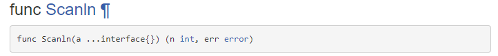

按行输入（一直接收输入，直到遇见`\n` 或者 `EOF`）。传入一个引用，将接收的值传入引用中。返回n和 error


```go
	var name string
	var age int
	var isPass bool
	var score float32

	fmt.Scanln(&name)
	fmt.Scanln(&age)
	fmt.Scanln(&isPass)
	fmt.Scanln(&score)
```


#### 10.1.3.2 `Scanf()`

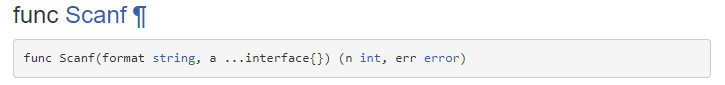

传入一个`string` 作为格式控制，传入地址作为容器。接收控制台输入的内容。


```go
	var name string
	var age int
	var isPass bool
	var score float32
	var err error

	_,err = fmt.Scanf("%s %d %t %f",&name,&age,&isPass,&score)
	if err == nil {
		fmt.Println("接收成功")
		fmt.Println(name,age,isPass,score)	
	}
```


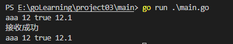


## 10.2 strconv 包

strconv包实现了基本数据类型和其字符串表示的相互转换。


参考文档 https://studygolang.com/static/pkgdoc/pkg/strconv.htm

### 10.2.1 Format族

用于格式化 `bool` `int` `Uint` `Float` 到`string`的函数。


如下：

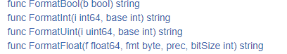


#### 10.2.1.1 `FormatInt(i uint64,base int)`

返回 i的 base进制字符串表示。

base表示进制。 base必须在2-36之间，使用字母 a-z表示11-35


```go
func main(){
    str = strconv.FormatInt(int64(c),10)
	fmt.Println(str)
}
```


#### 10.2.1.2 `FormatFloat()`


`FormatFloat(f float64,fmt byte,prec int ,bitSize int)`


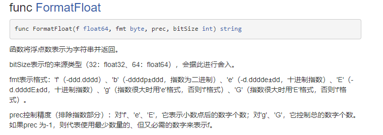


```go
func main(){
    var e float32 = 121.1
    str = strconv.FormatFloat(float64(e),'f',6,32)
    fmt.Println(e)
}
```


#### 10.2.1.3 `formatBool(bool)`

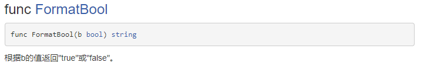


​	


### 10.2.2 xxToxx族

两个函数`Atoi` `Itoa`

`a`代表`String` ， `i`代表`int`


故 `Atoi` 表示string转换 i ，

​	 `ItoA` 表示int转换string

​									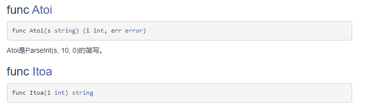


#### 10.2.2.1 `Itoa(int)`

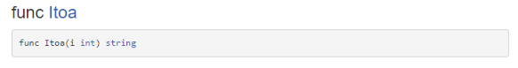

仅返回一个string

```go
func main(){
    var i int64 = 222
    var str string = strconv.Itoa(222)
    
}
```


### 10.2.3 Parse族

用于string类型转换为 基本数据类型 `bool` `int` `Uint` `Float`


如果转换没有异常，则err 为 `nil`。


#### 10.2.3.1 `ParseBool(string)`


```go
func main(){
    var a bool
    var err error
    // a,_ =strconv.ParseBool("true") 
    a,err = strconv.ParseBool("true")
    if(err == nil){
        fmt.Println(a)
    }
}
```


#### 10.2.3.2 `ParseInt()`


func [ParseInt](https://github.com/golang/go/blob/master/src/strconv/atoi.go?name=release#150)

```
func ParseInt(s string, base int, bitSize int) (i int64, err error)
```

返回字符串表示的整数值，接受正负号。

`base`指定进制（2到36），如果base为0，则会从字符串前置判断，"0x"是16进制，"0"是8进制，否则是10进制；


`bitSize`指定结果必须能无溢出赋值的整数类型，0、8、16、32、64 分别代表 int、int8、int16、int32、int64；


返回的err是*NumErr类型的，如果语法有误，err.Error = ErrSyntax；如果结果超出类型范围err.Error = ErrRange。


实例：

```go
	var c int64
	c,_ = strconv.ParseInt("-123456",10,64)
	fmt.Println(c)
```


#### 10.2.3.3 `ParseFloat()`


func [ParseFloat](https://github.com/golang/go/blob/master/src/strconv/atof.go?name=release#533)

```
func ParseFloat(s string, bitSize int) (f float64, err error)
```

解析一个表示浮点数的字符串并返回其值。


bitSize指定了期望的接收类型，32是float32（返回值可以不改变精确值的赋值给float32），64是float64；

返回值err是*NumErr类型的，语法有误的，err.Error=ErrSyntax；结果超出表示范围的，返回值f为±Inf，err.Error= ErrRange。


示例：

```go
```


### 10.2.4 Quote族


#### 10.2.4.1 `QuoteRune(r rune)`

将 `int32` 类型(字符r) 翻译成`string`类型。 例如 `'\u4e16'` 转义为汉字 `世` 

控制字符、不可打印字符会进行 【逆转义】


转义： `\n` 变为换行。

逆转义： 换行变为`\n`


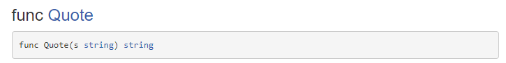

示例：

```go
func main(){
	var str string = "hello,世界"
	var s string = ""
	for _,val:= range str {
        //val是一个 rune类型
		var temp = strconv.QuoteRune(val)
		s = s + temp
	}
	fmt.Println(s)
}
```


#### 10.2.4.2 `QuoteRuneToASCII(r rune)`

将`rune`翻译为`string` 。 

【控制字符】、【不可打印字符】 （\t \n），以及 【非ASCII字符】  会进行 【逆转义】


#### 10.2.4.3 `QuoteToASCII(s string)`

返回字符串s在【go语法】下的双引号字面值表示。

控制字符和不可打印字符(例如\n\t) 以及 非ASCII字符会进行【逆转义】。


转义： `\n` 变为换行。 `\u4e16` 变为 `'世'`

逆转义： 换行变为`\n` 

go语法：以代码的形式呈现，将go语法下的字符串原样复制到代码中，能够输出原来的字符串。

​				例如：原来的字符串  ` "abc" ` (字符串中含有双引号) ，那么它的go语言表示为	`"\"abc\""`

​				首先原来的字符串是一个字符串，所以go语言表示必须为一个字符串 `""` (最外层两个双引号)其次，内部的`"abc"`必须表示，

​				所以为 `"\"abc\"`


示例+解释：

```go
func main(){
    var str string = "hello,世界"
	var s string
	s = strconv.QuoteToASCII(str)
	fmt.Println(s) //输出"hello,\u4e16\u754c"

	//其中h对应'h' ASCII中包含的同理
	//世翻译为\u4e16 
	//界翻译为\u754c
	//ASCII以外的字符，翻译为rune表示，并拼接成一个字符串
}
```


#### 10.2.4.4 `Quote(s)`


```
返回字符串s在【go语法】下的双引号字面值表示。

控制字符和不可打印字符(例如\n\t) 会进行转义。

非ASCII字符不会进行转义。
```


示例 ：

```go
func main(){
    var str string = "hello,世界"
	var s string
	s = strconv.Quote(str)
	fmt.Println(s) //输出"hello,世界"
}
```


#### 10.2.4.5 `Unquote()`

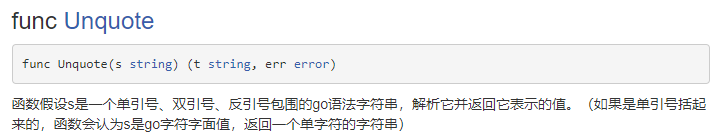

等待被`Unquote`的字符串需要被  单引号，双引号，反引号包裹。

如果是单引号包裹，则认为s是一个字面量（字符）

```go
import(
	"fmt"
    "strconv"
)

func main(){
	test := func(s string) {
		t, err := strconv.Unquote(s)
		if err != nil {
			fmt.Println("失败")
			fmt.Printf("Unquote(%#v): %v\n", s, err)
		} else {
			fmt.Println("成功")
			fmt.Printf("Unquote(%#v) = %v\n", s, t)
		}
	}

	s := `\u4e16`
    
	test(s)//没有被 反引号，单引号，双引号包裹，语法错误
	test("`" + s + "`")   //被反引号包裹，反引号的含义是不进行转义，所以输出的s为 \u4e16
	test(`"` + s+ `"`) 	  //被双引号包裹。正常转义， s为 世
	test("'" + s + "'")   //被单引号包裹，正常转义 ，s为 世
}
```


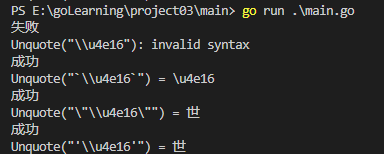


## 10.3 builtin

`go` 默认自带的函数，无需导包。


### 10.3.1 `len(v Type) int`

内建函数`len`返回 v 的长度。具体取决于v的具体类型：


```
数组  	 	  ：v中元素的数量
数组指针 		 ：*v中元素的数量（v为nil时panic）
切片、映射		：v中元素的数量；若v为nil，len(v)即为零
字符串			 ：v中【字节】的数量。
通道			  ：通道缓存中队列（未读取）元素的数量；若v为 nil，len(v)即为零
```


```go
```


## 10.4 math


### 10.4.1 `Sqrt(x float64)`

返回x的二次方根，特例如下：

```
Sqrt(+Inf) = +Inf
Sqrt(±0) = ±0
Sqrt(x < 0) = NaN
Sqrt(NaN) = NaN
```


```go
func main(){
	var x int = 4

	res :=callSqrt(float64(x))

	fmt.Println(res)
    
}
```


## 10.5 time 包


`time`包提供了一个  `time.Time`的数据类型， 用于显示/测量 时间和日期。

中文文档 https://studygolang.com/static/pkgdoc/pkg/time.htm


### 10.5.1 包内数据类型


`time`包定义了几种数据类型： 

` Month` : 表示月份。

`weekday` :  星期。

`Duration` :  表示一段儿持续的时间。

`Timer` : 计时器。

`Ticker` :

`ParseError`  ： 表示一种解析异常。

`Location`  ： 表示一个时区。

`Time` ： 表示时间，主要的类型，有大量的方法。


### 10.5.2 包内常量

包内的常量代表了一种内置的消息格式，用于消息的格式化。

使用到的函数例如 ： `Parse()` `Format()`

```go
const (
    ANSIC       = "Mon Jan _2 15:04:05 2006"
    UnixDate    = "Mon Jan _2 15:04:05 MST 2006"
    RubyDate    = "Mon Jan 02 15:04:05 -0700 2006"
    RFC822      = "02 Jan 06 15:04 MST"
    RFC822Z     = "02 Jan 06 15:04 -0700" // 使用数字表示时区的RFC822
    RFC850      = "Monday, 02-Jan-06 15:04:05 MST"
    RFC1123     = "Mon, 02 Jan 2006 15:04:05 MST"
    RFC1123Z    = "Mon, 02 Jan 2006 15:04:05 -0700" // 使用数字表示时区的RFC1123
    RFC3339     = "2006-01-02T15:04:05Z07:00"
    RFC3339Nano = "2006-01-02T15:04:05.999999999Z07:00"
    Kitchen     = "3:04PM"
    // 方便的时间戳
    Stamp      = "Jan _2 15:04:05"
    StampMilli = "Jan _2 15:04:05.000"
    StampMicro = "Jan _2 15:04:05.000000"
    StampNano  = "Jan _2 15:04:05.000000000"
)
```


#### 10.5.2.1 Duration中的常量


`time.Duration`中定义了常量：

```go
const (
    Nanosecond  Duration = 1  //1纳秒
    Microsecond          = 1000 * Nanosecond //微妙
    Millisecond          = 1000 * Microsecond //毫秒
    Second               = 1000 * Millisecond //秒
    Minute               = 60 * Second
    Hour                 = 60 * Minute
)
```


### 10.5.3 包内函数


##### `ParseDuration()`

用于将字符串解析成 `Duration` 。

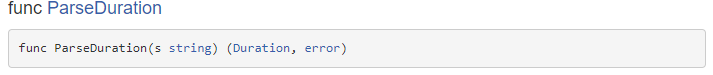

传入字符串 `s` , 返回 `(Duration,error)`

`s`是一个序列，每个片段包含 【可选的正负号】、【必须的十进制数】、【可选的小数部分】和【必须的单位后缀】。


如"300ms"、"-1.5h"、"2h45m"。合法的单位有"ns"、"us" /"µs"、"ms"、"s"、"m"、"h"。


`Since()`

返回从`t`到现在经过的时间，等价于 `time.Now().Sub(t)`

```go
func Since(t Time) Duration
```


#### 10.5.3.1 Time的方法

`Time`表示一个时间点。


##### `Now()`

返回当前本地时间。


```go
import(
    "time"
    "fmt"
)

func main(){
    now := time.Now()
    fmt.Println(now)
}
```


##### `Format()`

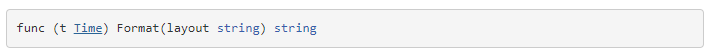

是`Time`的一个方法， 传入一个 `layout` 用于将Time格式化为字符串。


年、月、日、时、分、秒、周、时区的 对应的关键字：

- 年：　 06,2006
- 月份： 1,01,Jan,January
- 日：　 2,02,_2
- 时：　 3,03,15,PM,pm,AM,am
- 分：　 4,04
- 秒：　 5,05
- 周几： Mon,Monday
- 时区： -07,-0700,Z0700,Z07:00,-07:00,MST


例如： 如果是`年-月-日` 的格式，则对应`layout`为 `06-01-02`


```go
func main(){
    now := time.Now()
	const layout = "2006-01-02 03:04:05"
    //const layout1 = time.ANSIC
    
	format := now.Format(layout)

	fmt.Println(format) //2023-02-05 20:26:04
    
}
```


##### `Date()`

语法：

```go
func (t Time) Date() (year int, month Month, day int)
```


返回的值分别为：   年,月,日。


```go
func main(){
    now := time.Now()
    year,month,date:= now.Date()
	fmt.Println(year,month,date)
}	
```


##### `Loction()`

返回`Time`对应的 `Loction`

```go
func (t Time) Location() *Location
```


##### `Zone()`

返回对应时区

```go
func (t Time) Zone() (name string, offset int)
```

Zone计算t所在的时区，返回该时区的规范名（如"CET"）和该时区相对于UTC的时间偏移量（单位秒）。


##### `Local()`

将`Time`所指的时间点转换为 本地时区。 保证时间点不变。

```
func (t Time) Local() Time
```

Local返回采用本地和本地时区，但指向同一时间点的Time。


##### `Year/Month/Day`

3个方法，分别返回 年，月，日（相对于月份）。


```
func (t Time) Year() int

func (t Time) Month() Month	

func (t Time) Day() int
```


##### `Hour/Minute/Second`

返回小时，分钟，秒


##### `Add()`

用于进行时间计算，传入一个`Duration`表示增加一段儿时间， 返回对应的时间点。

```go
func (t Time) Add(d Duration) Time
```


##### `Sub()`


#### 10.5.3.2 Month的方法

`Month`类型只有1个方法。


##### `String()`

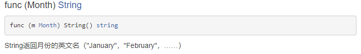


#### 10.5.3.3 Duration的方法


##### `Hours`

```go
func (d Duration) Hours() float64
```

将`d`转化为 以`小时`为单位。


##### `Minutes`

```go
func (d Duration) Minutes() float64
```

将`d`转化为 以`分钟`为单位。


##### `Seconds`

```go
func (d Duration) Seconds() float64
```


##### `Nanoseconds`


## 10.6 bytes包

类型 `[]byte` 的切片十分常见 。 `bytes` 包提供操作这种类型的方法。


### 10.6.1 包内数据类型

`Buffer`

长度可变的 `bytes` 的 buffer，提供 `Read()` 和 `Write()` 方法，因为读写长度未知的 `bytes` 最好使用 `buffer`。


定义 `Buffer`

```go
var buffer bytes.Buffer

var ptr *bytes.Buffer = new(bytes.Buffer)
```


### 10.6.2 通过buffer串联string

类似 `java.StringBuilder`

```go
var buffer bytes.Buffer
for {
	if s, ok := getNextString(); ok { //method getNextString() not shown here
		buffer.WriteString(s)
	} else {
		break
	}
}
fmt.Print(buffer.String(), "\n")
```

这种实现方式比使用 `+=` 要更节省内存和 CPU，尤其是要串联的字符串数目特别多的时候。


## 10.7 sort 包


### 10.7.1 包内函数

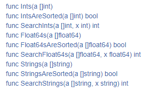


#### `Ints(a []int)`

将整型切片`a`排序为递增。


```go
slice := []int{4,5,7,2,1}

sort.Ints(slice)

fmt.Println(slice)
```


#### `IntsAreSorted(a []int) bool`

检查整型切片是否为递增排序。


#### `SearchInts([]int,int) int`

SearchInts在递增顺序的a中搜索x，返回x的索引。如果查找不到，返回值是x应该插入a的位置（以保证a的递增顺序），返回值可以是len(a)。


#### `Float64s(a []float64)`

给 `[]float64`排序


#### `Sort(data interface)`


Sort排序data。它调用1次data.Len确定长度，调用O(n*log(n))次data.Less和data.Swap。

本函数不能保证排序的稳定性（即不保证相等元素的相对次序不变）。


#### `Stable(data Interface)`


Stable排序data，并保证排序的稳定性，相等元素的相对次序不变。

它调用1次data.Len，`O(n*log(n))`次data.Less 和 `O(n*log(n)*log(n))`次data.Swap。


