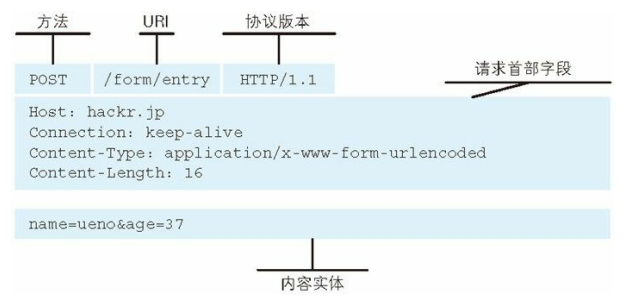
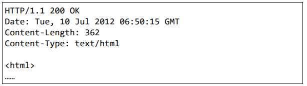
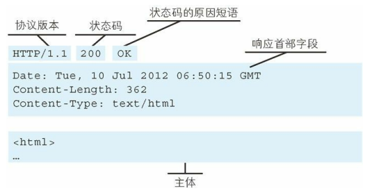
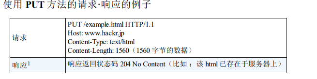
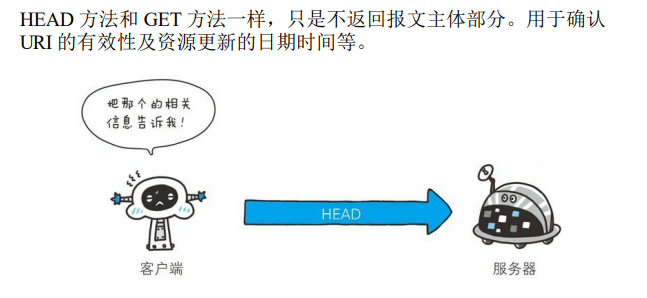
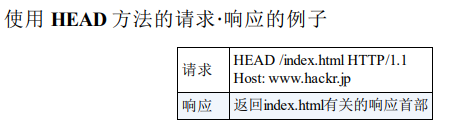
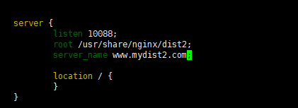

参考 ：

《图解Http》


# 1. 一些基础概念


## 1.1 URI

`Uniform (统一) Resource (资源) Identifier (标识符)`

URI  : 对不同的资源进行一个统一的协议约定。


例如：

`http`协议，有如下约定

```
http://www.ietf.org/rfc/rfc2396.txt
```

`ftp` 协议：

```
ftp://ftp.is.co.za/rfc/rfc1808.txt
```

等等。。。


标准的  `URI`协议有30多种 ，参考网址如下： 


IANA - Uniform Resource Identifier (URI) SCHEMES（统一资源 标识符方案）

 http://www.iana.org/assignments/uri-schemes


## 1.2 URL

统一资源定位符，代表了一个具有唯一地址的资源。


# 2. Http


## 2.1  Http用于【服务器】与【客户端】通信


`Http` 总是有2个角色，【服务器】和【用户】 。

`Http`规定，总是由【用户】发起请求，【服务器】响应请求。


### 2.1.1 请求报文


这是一个请求报文示例：


请求报文由  ： 【请求方法】  + 【请求URI】 + 协议版本  + 【请求首部】 + 【内容体】 组成。


​										


### 2.1.2 响应报文

当服务器收到【请求报文】以后，解析并处理请求，并将【处理的结果】以 【响应报文】的形式发送给【用户】。


这是一个响应报文的示例： 




响应报文由 ： 【协议版本】 +  【状态码】 + 【状态码的原因短语】 + 【响应首部】 + 【响应体】 组成。





## 2.2 无状态性

`HTTP` 是一种不保存状态，即无状态（stateless）协议。

`HTTP` 协议自 身不对请求和响应之间的通信状态进行保存。也就是说在 HTTP 这个 级别，协议对于发送过的请求或响应都不做持久化处理。


但是业务上通常会希望保存状态，因此引入了`Cookie`技术。


## 2.3 Http方法

`Http请求报文`的组成部分中的 `Http方法` ，通常配合 RESTful 风格使用。


常用的两种 ： `GET` `POST` 

### 2.3.1 `GET`  

表示获取资源 ， （不会修改服务器状态）


### 2.3.2 `POST` 

表传输实体（会修改服务器状态）


部分不常用的： 

`PUT` :  表示传输文件。 




`HEAD` :  获得报文首部 ，  不返回报文体。 用于确认 URI的有效性和资源更新日期等。








`DELETE`

表示删除文件。


## 2.4 持久连接

在`HTTP1.0`的时候，Http通信完成则断开 `TCP` 连接。 为了解决反复连接开销问题，`Http1.1` 新增了 `keep-alive` 请求头部，不会释放`TCP`。


即：建立 1 次 TCP 连接后进行多次请求和响应的交互


# 1.http head


## 1.1  host 字段


HTTP/1.0不支持Host请求头；而在HTTP/1.1中，Host请求头部必须存在,否则会返回400 Bad Request
Host的作用是实现多个虚拟主机


假如在192.168.9.10机器上部署三个站点：www.baidu.com，www.taobao.com和www.jd.com
用nginx配置就是

```dockerfile
http {

    server {
        server_name www.baidu.com;
    }
    server {
        server_name www.taobao.com;
    }
    server {
        server_name www.jd.com;
    }

}
```

```
1、curl -I "http://192.168.9.10/index.html" -H "host: www.baidu.com" -v
访问www.baidu.com的index.html

2、curl -I "http://192.168.9.10/index.html" -H "host: www.taobao.com" -v
访问www.taobao.com的index.html

3、curl -I "http://192.168.9.10/index.html" -H "host: www.jd.com" -v
访问www.jd.com的index.html

假设在DNS配置了www.baidu.com，www.taobao.com和www.jd.com 都指向192.168.9.10
则curl -I "http://www.baidu.com/index.html" -v 会自动将www.baidu.com填充到Host字段中
curl -I "http://192.168.9.10/index.html" -v 会自动将192.168.9.10填充到Host字段中，由于nginx没有配置192.168.9.10的server_name，所以此请求会报错
```


下面我们来实际验证一下

我的nginx配置:



通过  curl -i "http://120.79.189.55/index.html" -H "host:www.mydist2.com" -v

```dockerfile
C:\Users\CrazyH>curl -i "http://120.79.189.55/index.html" -H "host:www.mydist2.com" -v
*   Trying 120.79.189.55...
* TCP_NODELAY set
* Connected to 120.79.189.55 (120.79.189.55) port 80 (#0)
> GET /index.html HTTP/1.1
> host:www.mydist2.com
> User-Agent: curl/7.55.1
> Accept: */*
>
< HTTP/1.1 200 OK
HTTP/1.1 200 OK
< Server: nginx/1.14.1
Server: nginx/1.14.1
< Date: Fri, 10 Sep 2021 10:45:47 GMT
Date: Fri, 10 Sep 2021 10:45:47 GMT
< Content-Type: text/html
Content-Type: text/html
< Content-Length: 4057
Content-Length: 4057
< Last-Modified: Mon, 07 Oct 2019 21:16:24 GMT
Last-Modified: Mon, 07 Oct 2019 21:16:24 GMT
< Connection: keep-alive
Connection: keep-alive
< ETag: "5d9bab28-fd9"
ETag: "5d9bab28-fd9"
< Accept-Ranges: bytes
Accept-Ranges: bytes

<
<!DOCTYPE html PUBLIC "-//W3C//DTD XHTML 1.1//EN" "http://www.w3.org/TR/xhtml11/DTD/xhtml11.dtd">

<html xmlns="http://www.w3.org/1999/xhtml" xml:lang="en">
    <head>
        <title>Test Page for the Nginx HTTP Server on Red Hat Enterprise Linux</title>
        <meta http-equiv="Content-Type" content="text/html; charset=UTF-8" />
        <style type="text/css">
            /*<![CDATA[*/
            body {
                background-color: #fff;
                color: #000;
                font-size: 0.9em;
                font-family: sans-serif,helvetica;
                margin: 0;
                padding: 0;
            }
            :link {
                color: #c00;
            }
            :visited {
                color: #c00;
            }
            a:hover {
                color: #f50;
            }
            h1 {
                text-align: center;
                margin: 0;
                padding: 0.6em 2em 0.4em;
                background-color: #900;
                color: #fff;
                font-weight: normal;
                font-size: 1.75em;
                border-bottom: 2px solid #000;
            }
            h1 strong {
                font-weight: bold;
                font-size: 1.5em;
            }
            h2 {
                text-align: center;
                background-color: #900;
                font-size: 1.1em;
                font-weight: bold;
                color: #fff;
                margin: 0;
                padding: 0.5em;
                border-bottom: 2px solid #000;
            }
            hr {
                display: none;
            }
            .content {
                padding: 1em 5em;
            }
            .alert {
                border: 2px solid #000;
            }

            img {
                border: 2px solid #fff;
                padding: 2px;
                margin: 2px;
            }
            a:hover img {
                border: 2px solid #294172;
            }
            .logos {
                margin: 1em;
                text-align: center;
            }
            /*]]>*/
        </style>
    </head>

    <body>
        <h1>Welcome to <strong>nginx</strong> on Red Hat Enterprise Linux!</h1>

        <div class="content">
            <p>This page is used to test the proper operation of the
            <strong>nginx</strong> HTTP server after it has been
            installed. If you can read this page, it means that the
            web server installed at this site is working
            properly.</p>

            <div class="alert">
                <h2>Website Administrator</h2>
                <div class="content">
                    <p>This is the default <tt>index.html</tt> page that
                    is distributed with <strong>nginx</strong> on
                    Red Hat Enterprise Linux.  It is located in
                    <tt>/usr/share/nginx/html</tt>.</p>

                    <p>You should now put your content in a location of
                    your choice and edit the <tt>root</tt> configuration
                    directive in the <strong>nginx</strong>
                    configuration file
                    <tt>/etc/nginx/nginx.conf</tt>.</p>

                    <p>For information on Red Hat Enterprise Linux, please visit the <a href="http://www.redhat.com/">Red Hat, Inc. website</a>. The documentation for Red Hat Enterprise Linux is <a href="http://www.redhat.com/docs/manuals/enterprise/">available on the Red Hat, Inc. website</a>.</p>

                </div>
            </div>

            <div class="logos">
                <a href="http://nginx.net/"></a>
                <a href="http://www.redhat.com/"></a>
            </div>
        </div>
    </body>
</html>
* Connection #0 to host 120.79.189.55 left intact

```

可以看到确实通了，