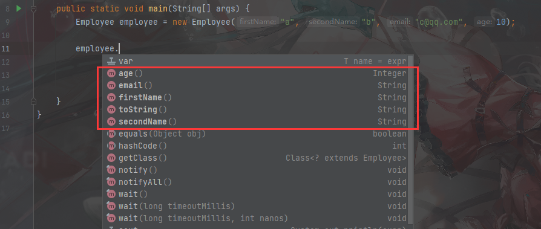
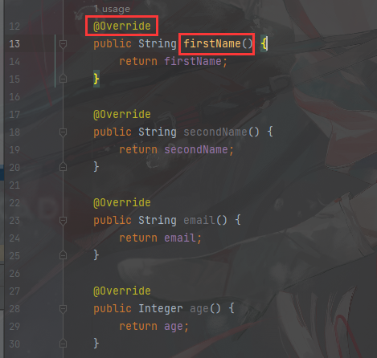
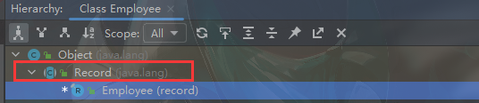
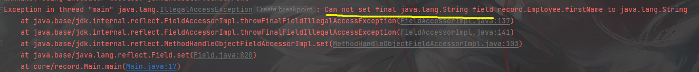
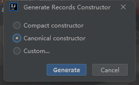
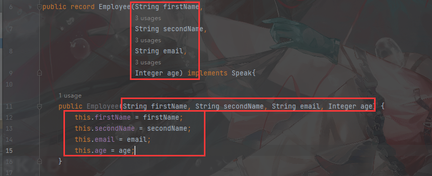
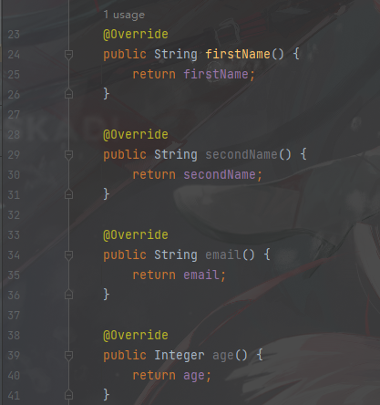
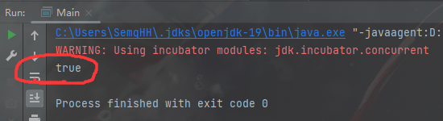
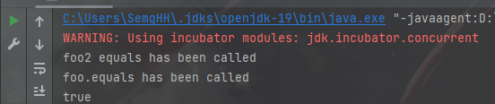

# 1.jdk14 新特性


## 1.1 record

参考https://zhuanlan.zhihu.com/p/372678867


在jdk14中加入了一个新的关键字 `record`  ，该关键字用于表示一种特殊的类。


record表示这个类应该作为不可变的数据类，用于在应用程序之间进行数据传递。

```
record类,旨在用于仅创建类以充当普通数据载体的地方。
```


类似 `Enum` 类一样，`record`类有特殊的创建语法。


### 1.1.1 创建一个record类

```java
public record Employee(String firstName,
                       String secondName, 
                       String email, 
                       Integer age) {

    @Override
    public String toString() {
        return String.format("%s,%s,%s,%d",firstName,secondName,email,age);
    }
}
```


使用 `record` 关键字创建 record类，并在类名后  `()`内指明成员变量和类型。

`{}` 内可以定义类相关的代码。


### 1.1.2  默认方法

编译器隐式的为`record`类生成了一些方法。

#### 1.1.2.1 构造器

record类默认的构造器方法，是全成员变量构造器。

```java
Employee employee = new Employee("a", "b", "c@qq.com", 10);
```

和不同的默认类无参构造器不同，在record类中声明其他的构造器，并不会让隐式的全参构造器失效。

record类允许定义其他的构造器，但最终必须初始化全部的成员变量(组件) 因为他们都是 private final修饰的，必须给final变量初始化


一个自定义的构造器：

```java
    public Employee(String secondName, String email, Integer age) {
        this("SEMGHH", secondName, email, age);
        System.out.println("other Constructor");
    }
```


#### 1.1.2.2 实例方法

record默认带有 `getter`方法。




```java
    public static void main(String[] args) {
        Employee employee = new Employee("a", "b", "c@qq.com", 10);


        System.out.println(employee.toString());


        System.out.println(employee.firstName());
    }
```


同时对于`record`类来说，getter方法是特殊的。




```
不再以get开头,小驼峰式命名。直接是成员变量的名称。同时getter方法被 @Override修饰了。
```


原因是什么？ 打开继承树




```
所有的record类都继承了  java.lang.Record抽象类。 这意味着record类不能再继承其他的类了。(可以实现接口)
```

[更多的Record类信息](# 2.1 Record)


# 2. 一些相关类源码


## 2.1 Record


这是一个抽象类，在java.lang包下。所有的record类都将继承实现 Record抽象类


```
java.lang.Record 类是所有java语言中record类的通用基础类。
```


```
record类在一定程度上是不可变的。 
(record类并不提供setter,即使使用反射也无法设置对应的值。因为成员变量是 private final修饰的。测试代码如下)


record类提供了透明的carrier用于获取一组固定的值。这些值被称为 record组件 (其实就是成员变量被称为组件)。
java语法提供了十分简洁的语法来定义record类， record组件就定义在record类的头部。
```


```java
public record Employee(String firstName,
                       String secondName,
                       String email,
                       Integer age) implements Speak{}


public static void main(String[] args) throws NoSuchFieldException, IllegalAccessException {
    Employee employee = new Employee("a", "b", "c@qq.com", 10);
    Field firstName = Employee.class.getDeclaredField("firstName");
    
    firstName.setAccessible(true);
    firstName.set(employee,"SEMGHH");
    System.out.println(firstName.get(employee));
}
```





### 2.2.1 隐式规定

record类做了很多的隐式规定。

record类隐式带有一个最正规的全参构造器 (Canonical Constructor)。



```
Canonical Constructor:

它的构造器方法参数的 个数，类型，名称全部与 record组件一致。
```




并隐式带有全部 `record component`的 `carrier`方法




### 2.2.2 equals 方法


1.如果两个record实例的构造方法完全一致(包括传入的参数)，则他们直接返回true

```java
//Foo.java
    @Override
    public boolean equals(Object o) {
        System.out.println("foo.equals has been called");

        return false;
    }

// Foo类重写了 equals方法，默认永远返回false


//main.java
		Foo foo = new Foo();
        Other other = new Other(foo);
        Other other1 = new Other(foo);
        System.out.println(other1.equals(other));
```




```
直接没有调用foo.equals
```


2. 如果两个record实例的构造方法不完全一致，

   则 record component 列表从后向前所有的成员变量遍历。首先该变量是否 == 。如果不等则调用 equals方法，如果有一个返回false，直接返回fasle。如果全都返回true，则最终record相等。 


伪代码逻辑：

```
for(element in components){
	if(e1 == e2 || e1.equals(e2) ){
		continue;
	}else{
		return false;
	}
}
return true;
```


例如：

```java
// foo.java
	@Override
    public boolean equals(Object o) {
        System.out.println("foo.equals has been called");

        return true;
    }

// foo2.java
    @Override
    public boolean equals(Object o) {
        System.out.println("foo2 equals has been called");
        return true;
    }


//main.java
        Foo foo = new Foo();
        Foo fooCopy = new Foo();


        Foo2 foo2 = new Foo2();
        Foo2 foo2Copy = new Foo2();
        Other other = new Other(foo,foo2);
        Other other1 = new Other(fooCopy,foo2Copy);
        System.out.println(other1.equals(other));
```




调用了两个foo的euqals方法，全部返回true以后,最终返回true 


