# 1.B/S   C/S

分别代指两种架构 `B/S` `C/S`


## 1.1  B/S   

`Browser & Server`

在用户的视角里 ， 以浏览器作为服务器。


## 1.2 C/S

`client Server `

在用户的电脑上运行一个客户端窗口，作为`Server`。


# 3. JSP 内置对象


## 3.1 内置对象都有哪些


### 3.1.1 `resquest`

请求对象。获取与请求相关的信息。

常用api如下

```java
String       getParamter(String paramterName) ;   // 返回指定参数名的 值
String       getMethod();                         //获取表单提交信息的方式，POST或GET。
getRemoteAddr();                                  //获取客户的IP地址。
getServerName();                                  //获取服务器的名称(IP)。
getServerPort();                                  //获取服务器的端口号。


RequestDispatcher  resquest.getRequestDispatcher(String addressOfAimServlet) // 目标Servlet的地址     获取请求转发
```


RequestDispatcher 类的方法

```java
forward(Request requ,Response resp)//请求转发              
include( request  , response);//请求包含  
```

需注意的是，无论是请求转发还是请求包含，都在一个请求范围内！使用同一个request和response！


#### 页面跳转

是开发一个web应用经常会发生的事情。

比如登录成功或是失败后，分别会跳转到不同的页面。

跳转的方式有两种，**服务端 **和 **客户端** 跳转


**请求转发：**由下一个Servlet完成响应体，**当前Servlet可以设置响应头（留头不留体）**。举个例子，AServlet请求转发到BServlet，那么AServlet不能够使用response.getWriter（） 和response.getOutputStream（）向客户端输出响应体，但可以使用response.setContentType("text/html;charset=utf-8") 设置响应头。而在BServlet中可以输出响应体。


```java
RequestDispatcher requestDispatcher = request.getRequestDispatcher("/hello-servlet");
requestDispatcher.forward(request,response);
```


**请求包含：**由两个Servlet共同完成响应体（留头又留体）**。同样用上面的例子，AServlet请求包含到BServlet，那么AServlet既可以设置响应头，也可以完成响应体。


**request域**
request是Java四大域对象之一，正是它提供了请求转发和请求包含的功能。一个请求会创建一个request对象，**若在一个请求中跨越了多个Servlet，那么这些Servlet可以使用request来共享数据。**同一个请求范围内使用request.setAttribute()和request.getAttribute()来传值！前一个Servlet调用setAttribute()保存值，后一个Servlet调用getAttribute()获取值。


**请求转发和重定向的区别**

**请求转发**是一个请求一次响应，而重定向是两次请求两次响应。
请求转发地址不变化，而重定向会显示后一个请求的地址。这是因为请求转发是服务器的行为，是由容器控制的转向，整个过程处于同一个请求中，因此客户端浏览器不会显示转向后的地址；

**重定向**是客户端的行为，重新发送了请求，整个过程不在同一个请求中，因此客户端浏览器会显示跳转后的地址。
请求转发只能转发到本项目其它Servlet，而重定向不只能重定向到本项目的其它Servlet，还能定向到其它项目。
请求转发是服务端行为，只需给出转发的Servlet路径，而重定向需要给出requestURI，既包含项目名。


### 3.1.2 `reponse`

向浏览器发送数据。可以设置头部信息和响应内容。


```java
void setHeader(String key,String value);  //设置响应头
sendRedirect(URL url);      //重定向
```


#### Content-Tpye

Content-Type（内容类型），一般是指网页中存在的 Content-Type，用于定义网络文件的类型和网页的编码，决定浏览器将以什么形式、什么编码读取这个文件，这就是经常看到一些 PHP 网页点击的结果却是下载一个文件或一张图片的原因。

Content-Type 标头告诉客户端实际返回的内容的内容类型。


常见的媒体格式类型如下：

- text/html ： HTML格式
- text/plain ：纯文本格式
- text/xml ： XML格式
- image/gif ：gif图片格式
- image/jpeg ：jpg图片格式
- image/png：png图片格式

以application开头的媒体格式类型：

- application/xhtml+xml ：XHTML格式
- application/xml： XML数据格式
- application/atom+xml ：Atom XML聚合格式
- application/json： JSON数据格式
- application/pdf：pdf格式
- application/msword ： Word文档格式
- application/octet-stream ： 二进制流数据（如常见的文件下载）
- application/x-www-form-urlencoded ： <form encType=””>中默认的encType，form表单数据被编码为key/value格式发送到服务器（表单默认的提交数据的格式）

另外一种常见的媒体格式是上传文件之时使用的：

- multipart/form-data ： 需要在表单中进行文件上传时，就需要使用该格式


–在web开发中，有时会遇到定时跳转页面的需求。

–在HTTP协议中，定义了一个Refresh头字段，它可以通知浏览器在指定的时间内自动刷新并跳转到其它页面。

–**response.setHeader(“Refresh”,“3;URL=网址”)** 

这里的URL是指Web容器下的URL；

```jsp
例 
response.setHeader(“Refresh”,“3;URL=index.jsp”)    会转到/<application_name>/index.jsp
response.setHeader("Refresh","3;URL=https://www.baidu.com/");//则会正常指向百度
```


### 3.1.3 **session**


也就是说，我们可以通过session来存放本次会话的任意数据。逻辑结构为 键值对

#### session  常用方法 ：

session 常用方法 

```java
void    setAttribute(String name,Object value); //设置 属性-值    也就是键值对
Object  getAttribute(String name);//                返回键值对   匹配不到key 则返回null
void    removeAttribute(String name);//             移出对应的key
String  getId();//                                  获取当前会话的Id

Enumeration<String>  getAttributeNames();//获得所有的 属性名  即 names/keys
```


Enumeration<T> 枚举类型的方法

```java
boolean hasMoreElements();  //是否还有更多的元素
T nextElement(); //返回下一个元素
```


例子：遍历Attribute

```java
session.setAttribute("loginResult","false"); //设置Attribute
if (session.getAttribute("visitNumber")==null) {
    session.setAttribute("visitNumber",0);
}else {
    Integer visitNumber = (Integer) session.getAttribute("visitNumber");
    session.setAttribute("visitNumber",visitNumber+1);
}
session.setAttribute("test","true");
session.setAttribute("helloWorld","hello!");

*****
    遍历
   ******

Enumeration<String> attributeNames = session.getAttributeNames();
System.out.println(attributeNames.hasMoreElements());
for(;attributeNames.hasMoreElements();) {
    String name = attributeNames.nextElement();
    Object value = session.getAttribute(name);
    System.out.println(name+"="+value);
}
```


#### session的生命周期：


#### session 与Cookie 

##### 1.Cookie

**在服务器端，JSP**引擎为该客户创建了一个**session**对象，在客户端，系统为该客户创建了Cookie**对象。**

##### 2.session

*session****对象是javax.servlet.http.HttpSession类的一个实例 ，session对象使同一用户在访问Web站点时多个页面间共享信息。服务器完全可以通过session对象知道这是同一个客户。**

**同一个客户访问服务器中不同**Web**目录时，****JSP****引擎为该客户创建不同的****session****对象

##### 3.session的id将被存放在客户本地的Cookie中

当JSP引擎为客户创建一个session对象后，这个session对象被分配了一个String类型的ID号，JSP引擎同时将此ID号发送到客户端，**存放在Cookie中。**


### 3.1.3 **out**


### 3.1.4 **application** 


又上图各方法可知

application 对象存在的意义就是存取  以服务器运行为周期的键值对数据

以及，一些Servlet信息


#### 方法中的一些 名词解释：

#### 3.1.4.1 MimeType

啥是Mime type？

首先，我们要了解浏览器是如何处理内容的。在浏览器中显示的内容有 HTML、有 XML、有 GIF、还有 Flash ……那么，**浏览器是如何区分它们的呢**？答案是 MIME Type，也就是该资源的**媒体类型**。

媒体类型通常是通过 HTTP 协议，由 Web 服务器告知浏览器的，更准确地说，是通过 **Content-Type** 来表示的，例如:

Content-Type: text/HTML


表示内容是 text/HTML 类型，也就是超文本文件。MIME Type 不是个人指定的，是经过 ietf 组织协商，以 RFC 的形式作为建议的标准发布在网上的，大多数的 Web 服务器和用户代理都会支持这个规范 (顺便说一句，Email 附件的类型也是通过 MIME Type 指定的)。

引用 blog https://www.cnblogs.com/jsean/articles/1610265.html

常见的MIME类型

| 解释：                      | MIME type                 |
| --------------------------- | ------------------------- |
| 普通文本 .txt               | text/plain                |
| 超文本标记语言文本 .html    | text/html                 |
| RTF文本 .rtf                | application/rtf           |
| GIF图形 .gif                | image/gif                 |
| JPEG图形 .ipeg,.jpg         | image/jpeg                |
| au声音文件 .au              | audio/basic               |
| MIDI音乐文件 mid,.midi      | audio/midi , audio/x-midi |
| RealAudio音乐文件 .ra, .ram | audio/x-pn-realaudio      |
| MPEG文件 .mpg,.mpeg         | video/mpeg                |
| AVI文件 .avi                | video/x-msvideo           |
| GZIP文件 .gz                | application/x-gzip        |
| TAR文件 .tar                | application/x-tar         |

​                            

我们可以看到，有一个大类，就是**application** 分配给各种应用的特殊拓展

#### 3.1.4.2如何找到某个文件的MIME类型？

我只找到了Linux 下的命令

```dockerfile
file --mime-type <fileName>
```

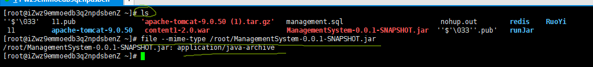


#### 3.1.4.3ServletContext 

什么是ServletContext?	


官方注释是这样解释的：

ServletContext ，是servlet容器 提供的。用来存储一些私有的IO文件目录（java.io.File）


### 3.1.5 pageContext


### 3.1.6 page


### config


## 2.各种内置对象的生存周期


#### 


### 


## 3.小结


# 4. JavaBean

## 4.1 什么是JavaBean

`JavaBean` 是一个逻辑概念。通常它代指一个`Class类`。


一个标准的`JavaBean`需要遵循一定的编码规范 : 

   （1）必须具有一个**公共的、无参的构造方法**，这个方法可以是编译器自动产生的缺省构造方法。

   （2）提供公共的**setter方法和getter方法**让外部程序设置和获取`JavaBean`的属性。


# 5.Servlet

## 1.什么是tomcat？这和Servlet有什么关系？


**Tomcat是web容器。**在进行web项目开发的时候，经常使用`http`协议。

用户发送请求到 【服务器】， 服务器通过 `Servlet`来处理用户的请求 。

`servlet`其实就是java程序，用于响应用户的特定请求的一段 【Java代码】


## 2.@WebServlet


## 3.来浅显看看 httpServlet


还是一样，先看看jdk里的官方注解。

httpServlet是一个抽象类，能够为Web网站适配一个基础的http servlet 。

一个最基本的HttpServlet必须至少实现一个抽象方法，并用他们。


doGet 方法，用来响应get请求

doPost方法，用来响应Post请求

init （）初始化，destroy（）销毁

当第一次调用该接口时，会调用init。HttpServlet是单实例

当Web容器销毁时，调用该接口的destroy方法


最核心的就是doGet,doPost方法。Override该方法的时候，后台业务逻辑将写在其中。


## 4.ServletContext

–ServletContext(javax.servlet.ServletContext)：范围最大的一个域 ，一个应用只创建一个ServletContext对象，所以在ServletContext中的数据可以在整个应用中共享，服务器不关，就不会死亡

–创建方式

–servletContext application = getServletContext();


## 5.ServletConfig

–ServletConfig(javax.servlet.ServletConfig)：读取Servlet的配置信息

–创建方式

1、tomcat创建

–public void init(ServletConfig servletConfig) throws ServletException { 

–

}

–2、通过getServletConfig

–ServletConfig config=getServletConfig();

## 6.小结


# 6. http

## 1.http cookies

Cookie 主要用于以下三个方面：

- 会话状态管理（如用户登录状态、购物车、游戏分数或其它需要记录的信息）
- 个性化设置（如用户自定义设置、主题等）
- 浏览器行为跟踪（如跟踪分析用户行为等）


**[创建Cookie](https://developer.mozilla.org/zh-CN/docs/Web/HTTP/Cookies#创建cookie)**

当服务器收到 HTTP 请求时，服务器可以在响应头里面添加一个 [`Set-Cookie`](https://developer.mozilla.org/zh-CN/docs/Web/HTTP/Headers/Set-Cookie) 选项。浏览器收到响应后通常会保存下 Cookie，之后对该服务器每一次请求中都通过 [`Cookie`](https://developer.mozilla.org/zh-CN/docs/Web/HTTP/Headers/Cookie) 请求头部将 Cookie 信息发送给服务器。另外，Cookie 的过期时间、域、路径、有效期、适用站点都可以根据需要来指定。

**[`Set-Cookie响应头部`和`Cookie请求头部`](https://developer.mozilla.org/zh-CN/docs/Web/HTTP/Cookies#set-cookie响应头部和cookie请求头部)**

服务器使用 [`Set-Cookie`](https://developer.mozilla.org/zh-CN/docs/Web/HTTP/Headers/Set-Cookie) 响应头部向用户代理（一般是浏览器）发送 Cookie信息。一个简单的 Cookie 可能像这样：

```
Set-Cookie: <cookie名>=<cookie值>
```

服务器通过该头部告知客户端保存 Cookie 信息。

```
HTTP/1.0 200 OK
Content-type: text/html
Set-Cookie: yummy_cookie=choco
Set-Cookie: tasty_cookie=strawberry

[页面内容]
```

现在，对该服务器发起的每一次新请求，浏览器都会将之前保存的Cookie信息通过 [`Cookie`](https://developer.mozilla.org/zh-CN/docs/Web/HTTP/Headers/Cookie) 请求头部再发送给服务器。

```
GET /sample_page.html HTTP/1.1
Host: www.example.org
Cookie: yummy_cookie=choco; tasty_cookie=strawberry
```

```java
resp.setHeader("Set-Cookie","time=1");


req.getHeader("cookie");
```

[**定义 Cookie 的生命周期**](https://developer.mozilla.org/zh-CN/docs/Web/HTTP/Cookies#定义_cookie_的生命周期)

Cookie 的生命周期可以通过两种方式定义：

- 会话期 Cookie 是最简单的 Cookie：浏览器关闭之后它会被自动删除，也就是说它仅在会话期内有效。会话期Cookie不需要指定过期时间（`Expires`）或者有效期（`Max-Age`）。需要注意的是，有些浏览器提供了会话恢复功能，这种情况下即使关闭了浏览器，会话期Cookie 也会被保留下来，就好像浏览器从来没有关闭一样，这会导致 Cookie 的生命周期无限期延长。

- 持久性 Cookie 的生命周期取决于过期时间（`Expires`）或有效期（`Max-Age`）指定的一段时间。

  例如：

```
Set-Cookie: id=a3fWa; Expires=Wed, 21 Oct 2015 07:28:00 GMT;
```

## 2.http header

| 应答头           |                             说明                             |
| :--------------- | :----------------------------------------------------------: |
| Allow            |          服务器支持哪些请求方法（如GET、POST等）。           |
| Content-Encoding | 文档的编码（Encode）方法。只有在解码之后才可以得到Content-Type头指定的内容类型。利用gzip压缩文档能够显著地减少HTML文档的下载时间。Java的GZIPOutputStream可以很方便地进行gzip压缩，但只有Unix上的Netscape和Windows上的IE 4、IE 5才支持它。因此，Servlet应该通过查看Accept-Encoding头（即request.getHeader("Accept-Encoding")）检查浏览器是否支持gzip，为支持gzip的浏览器返回经gzip压缩的HTML页面，为其他浏览器返回普通页面。 |
| Content-Length   | 表示内容长度。只有当浏览器使用持久HTTP连接时才需要这个数据。如果你想要利用持久连接的优势，可以把输出文档写入 ByteArrayOutputStream，完成后查看其大小，然后把该值放入Content-Length头，最后通过byteArrayStream.writeTo(response.getOutputStream()发送内容。 |
| Content-Type     | 表示后面的文档属于什么MIME类型。Servlet默认为text/plain，但通常需要显式地指定为text/html。由于经常要设置Content-Type，因此HttpServletResponse提供了一个专用的方法setContentType。 |
| Date             | 当前的GMT时间。你可以用setDateHeader来设置这个头以避免转换时间格式的麻烦。 |
| Expires          |       应该在什么时候认为文档已经过期，从而不再缓存它？       |
| Last-Modified    | 文档的最后改动时间。客户可以通过If-Modified-Since请求头提供一个日期，该请求将被视为一个条件GET，只有改动时间迟于指定时间的文档才会返回，否则返回一个304（Not Modified）状态。Last-Modified也可用setDateHeader方法来设置。 |
| Location         | 表示客户应当到哪里去提取文档。Location通常不是直接设置的，而是通过HttpServletResponse的sendRedirect方法，该方法同时设置状态代码为302。 |
| Refresh          | 表示浏览器应该在多少时间之后刷新文档，以秒计。除了刷新当前文档之外，你还可以通过setHeader("Refresh", "5; URL=http://host/path")让浏览器读取指定的页面。 注意这种功能通常是通过设置HTML页面HEAD区的＜META HTTP-EQUIV="Refresh" CONTENT="5;URL=http://host/path"＞实现，这是因为，自动刷新或重定向对于那些不能使用CGI或Servlet的HTML编写者十分重要。但是，对于Servlet来说，直接设置Refresh头更加方便。  注意Refresh的意义是"N秒之后刷新本页面或访问指定页面"，而不是"每隔N秒刷新本页面或访问指定页面"。因此，连续刷新要求每次都发送一个Refresh头，而发送204状态代码则可以阻止浏览器继续刷新，不管是使用Refresh头还是＜META HTTP-EQUIV="Refresh" ...＞。  注意Refresh头不属于HTTP 1.1正式规范的一部分，而是一个扩展，但Netscape和IE都支持它。 |
| Server           | 服务器名字。Servlet一般不设置这个值，而是由Web服务器自己设置。 |
| Set-Cookie       | 设置和页面关联的Cookie。Servlet不应使用response.setHeader("Set-Cookie", ...)，而是应使用HttpServletResponse提供的专用方法addCookie。参见下文有关Cookie设置的讨论。 |
| WWW-Authenticate | 客户应该在Authorization头中提供什么类型的授权信息？在包含401（Unauthorized）状态行的应答中这个头是必需的。例如，response.setHeader("WWW-Authenticate", "BASIC realm=＼"executives＼"")。 注意Servlet一般不进行这方面的处理，而是让Web服务器的专门机制来控制受密码保护页面的访问（例如.htaccess）。 |


# 7.EL表达式

EL表达式的语法非常简单，都是以“${”符号开始，以“}”符号结束的，具体格式如下：


# 10.Listener

## 10.1 什么是javaWeb监听器

`Javaweb` 中的监听器是用于监听web常见对象 HttpServletRequest,HttpSession,ServletContext


## 10.2 监听web对象创建与销毁的监听器

ServletContext创建与销毁要监听ServletContextListener

Httpsession的创建与与销毁监听HttpSessionListener

HttpServletRequest创建与销毁监听ServletRequestListener


## 10.3监听web对象属性变化

包括属性的(添加，删除，替换(key值一样的时候，调用两次set就会触发这个事件)

ServletContex的属性变化的监听ServletContextAttributeListener

Httpsession的属性变化的监听HttpSessionAttributeListener

HttpServletRequest的属性的变化的监听ServletRequestAttributeListener


## 10.4 监听session绑定javaBean(向session中set对象的时候触发)

HttpSessionBindingListener

HttpSessionActivationListener


# 11. Cookie 相关

https://www.cnblogs.com/hujunzheng/p/5744755.html

　　随着项目模块越来越多，很多模块现在都是独立部署。模块之间的交流有时可能会通过cookie来完成。比如说门户和应用，分别部署在不同的机器或者web容器中，假如用户登陆之后会在浏览器客户端写入cookie（记录着用户上下文信息），应用想要获取门户下的cookie，这就产生了cookie跨域的问题。


## 11.1 cookie路径


　　cookie 一般都是由于用户访问页面而被创建的，可是并不是只有在创建 cookie 的页面才可以访问这个cookie。在默认情况下，出于安全方面的考虑，只有与创建 cookie 的页面处于同一个目录或在创建cookie页面的子目录下的网页才可以访问。那么此时如果希望其父级或者整个网页都能够使用cookie，就需要进行路径的设置。

　　path表示cookie所在的目录，asp.net默认为/，就是根目录。在同一个服务器上有目录如下：/test/,/test/cd/,/test/dd/，现设一个cookie1的path为/test/，cookie2的path为/test/cd/，那么test下的所有页面都可以访问到cookie1，而/test/和/test/dd/的子页面不能访问cookie2。这是因为cookie能让其path路径下的页面访问。

　　让这个设置的cookie 能被其他目录或者父级的目录访问的方法：

```js
document.cookie = "name = value; path=/";
```

java 中设置path：

```java
            cookie.setPath("/");
```

## 11.2  cookie域


domain表示的是cookie所在的域，默认为请求的地址，如网址为www.jb51.net/test/test.aspx，那么domain默认为www.jb51.net。而跨域访问，如域A为t1.test.com，域B为t2.test.com，那么在域A生产一个令域A和域B都能访问的cookie就要将该cookie的domain设置为.test.com；如果要在域A生产一个令域A不能访问而域B能访问的cookie就要将该cookie的domain设置为t2.test.com。


# 12.  JSP 标准标签库


## `<c:set>`

用于设置 JavaBean的属性，同时会计算表达式的值


语法格式：

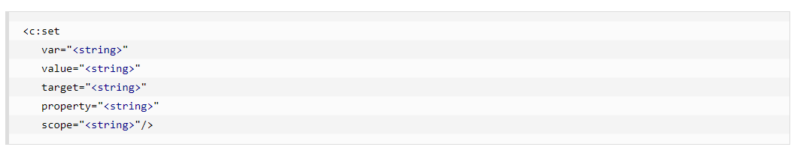


属性：

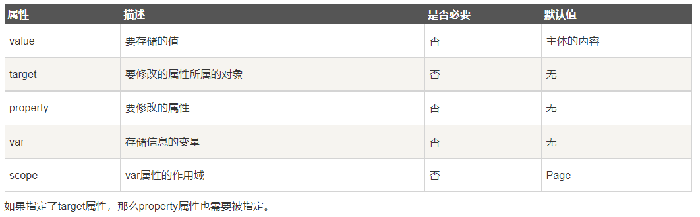


demo:

```jsp
<%@ page language="java" contentType="text/html; charset=UTF-8"
    pageEncoding="UTF-8"%>
<%@ taglib uri="http://java.sun.com/jsp/jstl/core" prefix="c" %>
<html>
<head>
<title>c:set 标签实例</title>
</head>
<body>
<c:set var="salary" scope="session" value="${2000*2}"/>   <!-- 在Session中 修改名为salary的变量,设置值为4000 -->
<c:out value="${salary}"/>
</body>
</html>
```


## `<c:out>`

标签用来显示一个表达式的结果，与<%= %>作用相似.

区别就是<c:out>标签可以直接通过"."操作符来访问属性。


语法：

```xml
<c:out value="<string>" default="<string>" escapeXml="<true|false>"/>
```


属性：

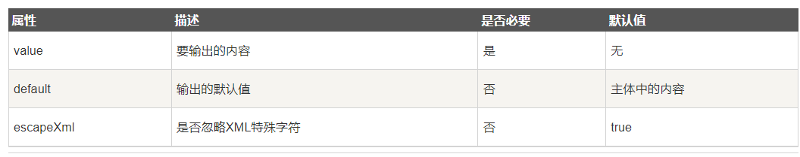


demo:

```xml
<%@ page language="java" contentType="text/html; charset=UTF-8"
    pageEncoding="UTF-8"%>
<%@ taglib uri="http://java.sun.com/jsp/jstl/core" prefix="c" %>

<html>
<head>
<title>c:out 标签实例</title>
</head>
<body>
    <h1>&lt;c:out&gt; 实例</h1>
        <c:out value="&lt要显示的数据对象（未使用转义字符）&gt" escapeXml="true" default="默认值"></c:out><br/>
          <c:out value="&lt要显示的数据对象（使用转义字符）&gt" escapeXml="false" default="默认值"></c:out><br/>
    <c:out value="${null}" escapeXml="false">使用的表达式结果为null，则输出该默认值</c:out><br/>
</body>
</html>
```


# 13. 自定义标签


`JSP`支持自定义标签。 一个自定义标签将会被转化为 `Servlet`  由 `tag handler` 对象处理。


需要包含依赖：

```xml
        <dependency>
            <groupId>javax.servlet</groupId>
            <artifactId>jsp-api</artifactId>
            <version>2.0</version>
        </dependency>
```


参考

https://www.runoob.com/jsp/jsp-custom-tags.html

## 13.1  自定义标签总体流程

1. 一个自定义标签必须创建一个处理它的`Java`类。 这个类可以继承 `SimpleTagSupport` 

   `Tag`、`TagSupport`、`BodyTagSupport` 

2. 编写完成的`handler`类 编译以后，并将其复制到环境变量CLASSPATH目录中。

3. 同时还需要创建`.tld` 结尾的标签库。


下面是一个示例：


```java
import javax.servlet.jsp.tagext.*;
import javax.servlet.jsp.*;
import java.io.*;

public class HelloTag extends SimpleTagSupport {

  public void doTag() throws JspException, IOException {
    JspWriter out = getJspContext().getOut();
    out.println("Hello Custom Tag!");
  }
}
```


```xml
<taglib>
  <tlib-version>1.0</tlib-version>
  <jsp-version>2.0</jsp-version>
  <short-name>Example TLD</short-name>
  <tag>
    <name>Hello</name>  <!-- tag_name  -->
      <!-- 标签名，语法： <lib_prefix:tag_name>         -->
      <!-- 其中lib_prefix 表示标签库的前缀， tag_name表示标签名  -->
    <tag-class>com.runoob.HelloTag</tag-class> 
      <!-- 全类名-->
    <body-content>empty</body-content>
      <!-- 表示标签内容 -->
  </tag>
</taglib>
```


需要在`html`中引入标签库。

```html
<%@ taglib prefix="ex" uri="WEB-INF/custom.tld" %>
    
<!-- prefix 表示前缀即  lib_prefix  -->
<!-- uri 表示.tld文件相对ClassPath的位置  -->
```


此时可以使用标签：

```html
<html>
  <head>
    <title>A sample custom tag</title>
  </head>
  <body>
    <ex:Hello/>
  </body>
</html>
```


## 13.2 `JspTag`

`JspTag` 接口。 给`Tag`和`SimpleTag`作为基础接口。

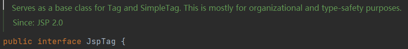


子接口：


### 13.2.1  `SimpleTag`

这个接口用于处理一个简单的`Tag`。

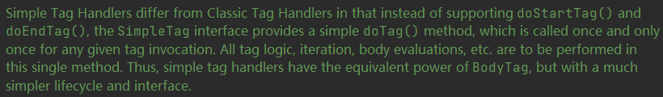


`Simple Tag Handler` 不用于传统的  `Tag handler` 的`doStartTag()` `doEndTag()`方法。


#### 13.2.1.1 生命周期

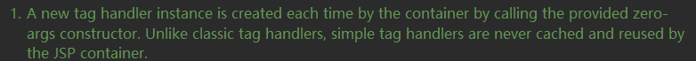


容器每次都会调用【无参数构造函数】创建一个新的`Simple tag handler`实例。与传统的`Tag handler`不同，

`Simple tag handler`永远不会被缓存并由JSP容器重用。


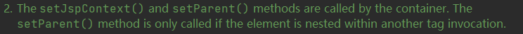


容器会调用 `setJspContext() ` `setParent()`方法。只有当嵌套标签时才会调用`setParent()`。


这个标签定义的所有属性的 `setter`方法都会被容器调用。


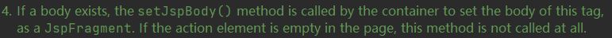


如果存在`body`，则容器调用`setJspBody（）`方法将此标记的`body`设置为`JspFragment`。如果页面中的action元素为空，则根本不会调用此方法。

`doTag（）`方法由容器调用。所有标记逻辑、迭代、主体求值等都发生在该方法中。

`doTag（）`方法返回并同步所有变量。


#### 13.2.1.2 接口方法

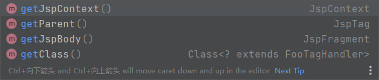


#### `doTag()`

最主要的核心方法。

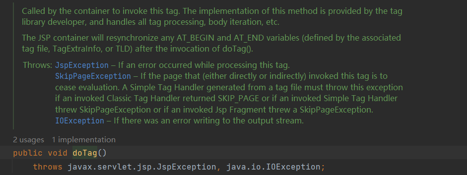

当解析`Tag`方法时，容器就会调用 `doTag`方法作为解析。


`<tag>`标签定义的属性名，将会被使用`setter`方法注入到对应的 `tag handler`类中。

例如： 自定义标签 `<semghh:foo>` 中定义了属性 `fooName`。

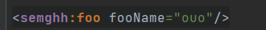


根据如下定义，注入 `FooTagHandler`类中 `fooName`属性的`setter`方法。

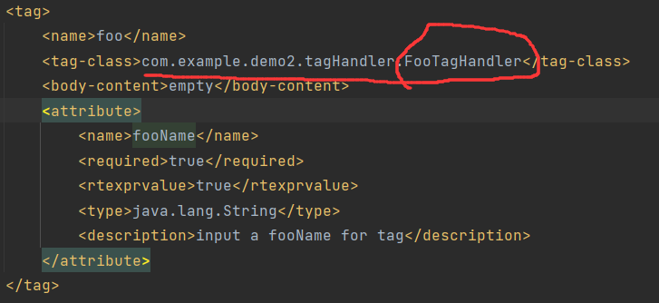


注入其中：

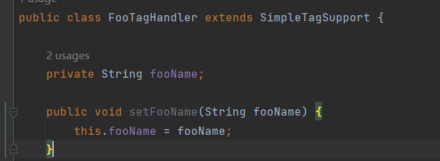


#### `getParent()`

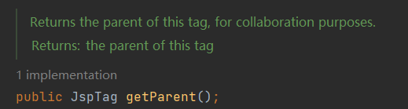


 

### 13.2.2 `SimpleTagSupport`类

这个类是一个public类，实现了 `SimpleTag`类。并提供了子类可用的两个`get`方法 :

`getJspBody()`  `getJspContext()`


#### `getJspContext()`

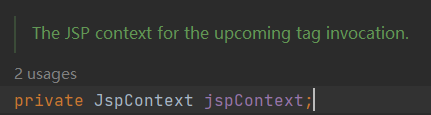


[JspContext](# )


#### `getJspBody()`

返回[JspFragment](# )对象


## 13.3 `.tld`


一个常用的`.tld`如下

```xml
<?xml version="1.0" encoding="UTF-8" ?>
<!DOCTYPE taglib
  PUBLIC "-//Sun Microsystems, Inc.//DTD JSP Tag Library 1.2//EN"
  "http://java.sun.com/dtd/web-jsptaglibrary_1_2.dtd">
<taglib>

     <tlibversion>1.0</tlibversion>     #标签库版本
     <jspversion>2.0</jspversion>		#jsp版本
     <shortname>taglib</shortname>		#推荐引入时的 lib_prefix
     <uri>http://notes.javaee.jsp.com/taglib</uri> #说明文档地址
     <info>Private Taglib</info>		#附加信息

     <tag>								#标签
         <name>copyright</name>			#标签名， tag_name
         <tagclass>notes.javaee.jsp.taglib.Copyright</tagclass>	#对应的Java tag handler类
         <bodycontent>JSP</bodycontent>	#body内容，由几个枚举值供使用，分别代表不同的涵义
         <info>Copyright tag.</info>	#附加信息
     </tag>

</taglib>
```


### 13.3.1 `tag`可以设置属性如下

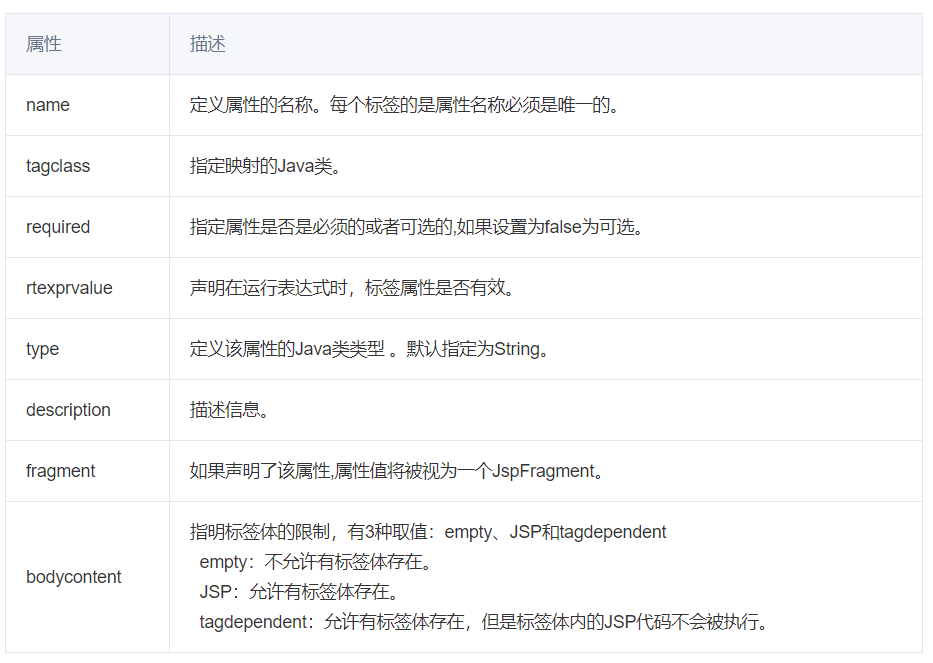


### 13.3.2  `.tld`文件位置

如果`tld`文件位于`/WEB-INF/`下面，`Tomcat`会自动加载`tld`文件中的标签库。如果位于其他的位置，可以在`web.xml`中配置。


配置示例如下：

```xml
 <jsp-config>
     <taglib>
         #标签文档说明地址
         <taglib-uri>http://notes.javaee.jsp.com/taglib</taglib-uri>
         #标签相对classpath地址
         <taglib-location>/WEB-INF/taglib.tld</taglib-location>
     </taglib>
</jsp-config>
```


或者直接在页面中引入也可以。

```jsp
<%@ taglib uri="/WEB-INF/taglib.tld"  prefix="taglib"%>
```


### 13.3.3 `tag`

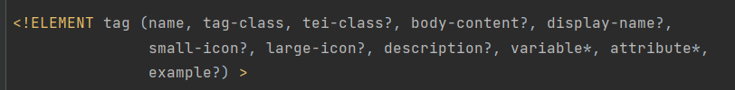


`tag` 表示一个tag标签

​		 `<name>` tag标签名

​		`<attribute>` 属性。表示tag的属性

​				`<name>` 属性名

​				`<rtexprvalue>` true/false 表示是否 当成EL表达式解析值

​		 	  `<required>` true/false 是否必须属性。

​				`<type>` 指明属性的数据类型。默认是 `java.lang.String`

​			   `<description>` 对属性的描述。

​		`<tag-class>`  指明`Tag`的子类，作为`tag handler`

​		`<body-content>`  指明本tag的 body-content内容。 有3种枚举值。 tagdependent  /  JSP  /empty

​		`<description>` 描述

​		


#### body-content

```
tagdependent	标签的content由标签自己来解释运行。例如SQL语句


JSP		标签的content是一个JSP语法的表达式 （默认JSP）


empty  没有标签体，也即是子闭合标签。
```


## 13.4 JspContext

JspContext 用于充当PageContext类的基类，并抽象出所有不是特定于servlet的信息。


`JspContext` 是为`SimpleTag`扩展服务的， 使其不必依赖于 `request/response`就能访问上下文。


