其他笔记索引

[高并发程序设计](http://semghh.xyz:10087/高并发程序设计.html)

[SpringBoot](http://semghh.xyz:10087/Springboot.html)

[redisd](http://semghh.xyz:10087/redis.html)

[jvm](http://semghh.xyz:10087/jvm.html)

[LeetCode](http://semghh.xyz:10087/LeetCode.html)


推荐看周志明的《深入理解JAVA虚拟机》理解。

记忆面试八股看 宋红康的视频。视频里的语言更精炼，更方便记忆。书中的语言更偏向解释更贴近自然语言一些。想要背下来需要提炼。

# 1.内存与垃圾回收篇

Oracle 官网，JVM参数参考手册

https://docs.oracle.com/javase/8/docs/technotes/tools/unix/java.html


## 1.1 jvm 与 java体系结构

`Java`得益于 `JVM` ，可以使用一次编码，到处运行（运行在不同的平台上，windos , Linux）。


### 1.1.1 JVM 支持跨语言

`JVM` 除了支持标准的`Java` 以外还支持其他能够生成`字节码`文件的语言。 例如 `Scala` `Groovy` 

这样其他编程语言可以直接在`JVM`上运行，同样可以享用`JVM`带来的好处，例如 ”垃圾回收“


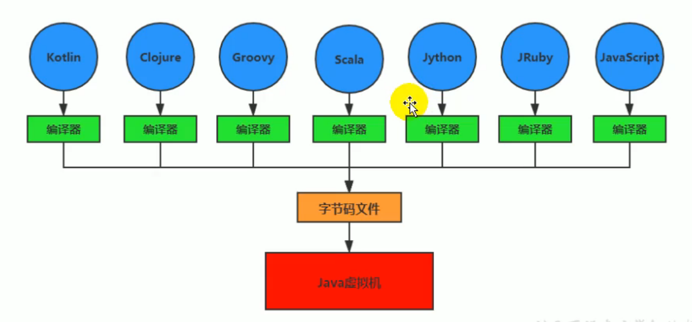


`JVM` 只关心`.class`文件(字节码文件)，所有能够编译生成标准`.class`文件的语言都可以运行在JVM上。


由此还衍生出了一种 字节码技术，用于动态生成`.class`文件。

```
例如： cglib 动态生成字节码文件。
```


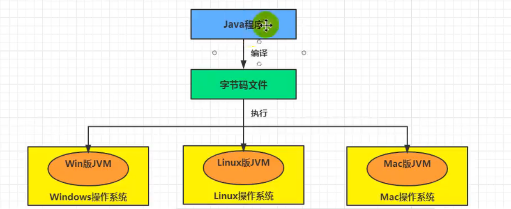


```
java程序通过 编译(前置编译)翻译为统一的.class字节码文件。 可以运行在不同平台的JVM上，达到 运行在各个平台的效果。
```


### 1.1.2 `JVM` 的位置

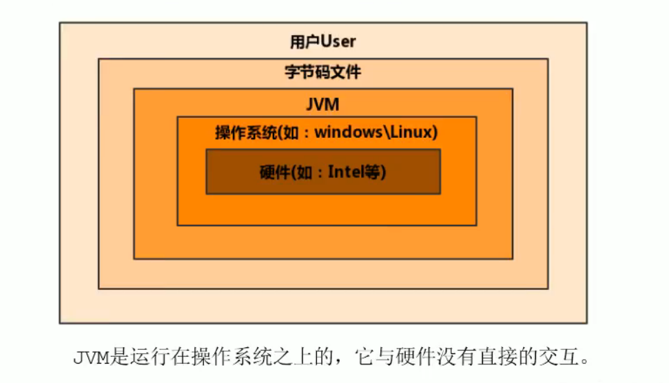


```
jvm 最终会把字节码文件解释执行为 和平台相关的二进制文件，最终执行。 (不同平台，解释后的二进制文件不一致，所以和平台强相关)
```


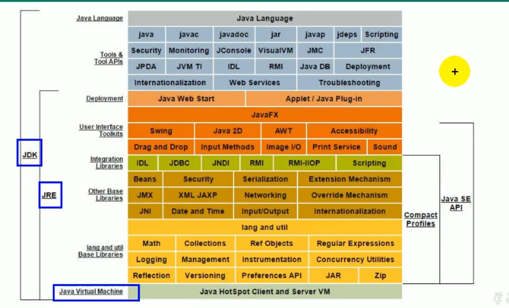


### 1.1.3 `JVM`的整体结构


`JVM` 包括4部分 ：   `类加载子系统`  `运行时数据区`  `执行引擎` `本地方法接口`

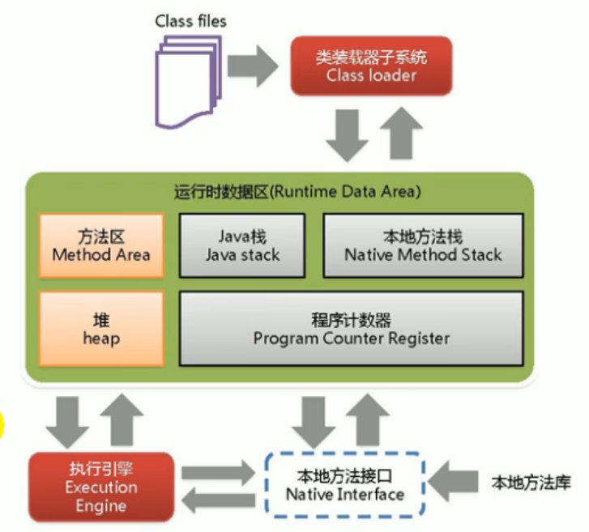


```
类加载子系统  : 用于动态加载 class类文件。
运行时数据区  : JVM运行时重要的内存区域， 例如对象的分配，存储。方法的调用，字节码的执行，都离不开运行时数据区。
执行引擎      
本地方法接口 : 用于调用 native方法的接口
```


### 1.1.4 `Java`代码执行流程


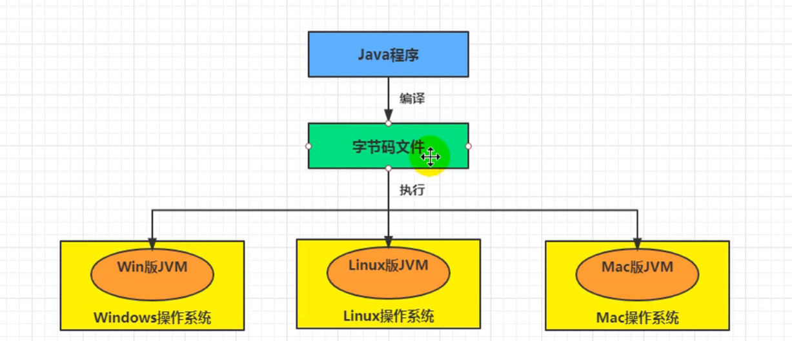


`.java`文件 经过【前置编译】 翻译为 `.class                  `文件，之后.class文件被各个平台的JVM解释执行。

这样可以做到一次编译，到处运行的 跨平台效果。 


### 1.1.5 JVM的生命周期


#### 1.1.5.1 启动


这个初始类随虚拟机的不同而不同；


#### 1.1.5.2   执行

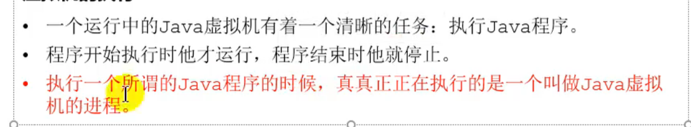


#### 1.1.5.3  退出


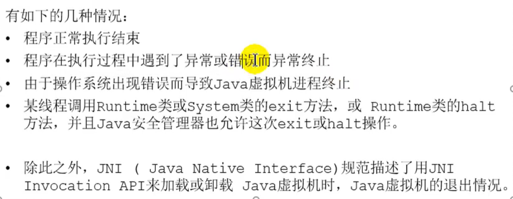


## 1.2 类加载子系统

`类加载子系统`  就是将一个静态表示的`.class`文件，经过【验证】【加载】等行为，转化为【内存中】的表示。

即： 根据`.class`文件中描述的类的行为，创建一个代表这个类文件的 `Class`对象，作为访问入口，并且将`.class`文件中的符号引用，转化为 `直接引用` 。


`类加载子系统`具体的行为例如 :  

1. 需要验证`Class文件` 完整性,合法性 。
2. 初始化`Class类`对象等等。


在专业名词中 ， 一个字节码文件，经过 `加载`，`链接`，`初始化` 3个阶段, 经过了这3个阶段，也就完成了类的验证，实例化到内存中的过程。


### 1.2.1  类加载子系统具体做什么？


1. `类加载子系统` 可以通过文件系统/网络的形式，获取一个`.class`文件，并进行 加载，链接，初始化。

2. 通过`ClassLodaer` 类加载 `.class`文件，  至于其是否可以运行，则由`Execution Engine`决定。

   


加载的 `类模板信息` 存放在 `运行时数据区`中的`方法区`。 


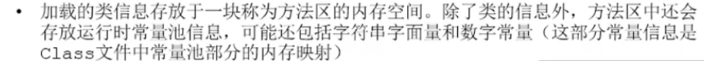


`.class文件`开头标识   16进制的  `cafe babe`

```
 Execution Engine 执行引擎
```

```
方法区中 存放类型信息、以及运行时常量池。运行时常量池主要由class文件中常量表里的数据组成。 具体是字面量和符号引用。
在jdk1.7以后，字符串常量池不在方法区了，被移入堆空间中。
```


```
加载->链接->初始化
```

```
广义：指类加载器子系统

狭义：指子系统里的加载某个具体类
```


### 1.2.2 加载阶段

加载阶段做的事情： 

1. 使用`ClassLoader`  通过类的全限定名，将`.class`文件以二进制字节流的形式加载到内存中。
2. 将字节流的静态存储，转化为运行时数据区的动态数据结构
3. 创建一个`java.lang.Class`类的对象，作为类模板信息的访问接口。


第二条的意义：将.class文件的静态描述，变为内存中的运行时描述。


```
生成的 java.lang.Class 对象作为 方法区内这个类的各种数据访问接口。 反射这一机制，就是借助Class类对象实现的。
```


#### 1.2.2.1  获取字节码文件的方式


```
运算时计算生成Class文件， 动态代理技术 (jdk代理，cglib 代理)
```


### 1.2.3 Linking 链接

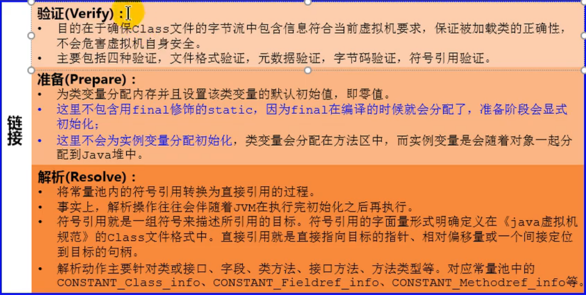


`类变量`： 在类中，被staitc修饰了的变量，就属于【类变量】。 即：这个类不属于任何一个实例，而是属于这个类。

 

````
任何有权限的作用域(public/protected/private)都可以访问类变量
````

`方法区` 内不会存实例变量，但会存类变量。


#### 1.2.4.1  验证

`验证`阶段： 确保字节码文件的正确性，符合语法要求。


主要验证内容有

```
文件格式，元数据，字节码，符号引用
```


字节码验证

```
对数据流，控制流分析。确保任意时刻，字节码所表示的语义是合法的，符合逻辑的。例如操作数栈为空，此时执行弹栈动作显然是不合法的。
```


#### 1.2.4.2 准备

```
准备阶段是正式为 类变量 分配内存并设置类变量初始值的阶段。
```


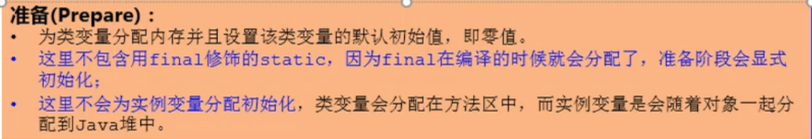


#### 1.2.4.3 解析

`解析`就是将【符号引用】转化为【直接引用】。


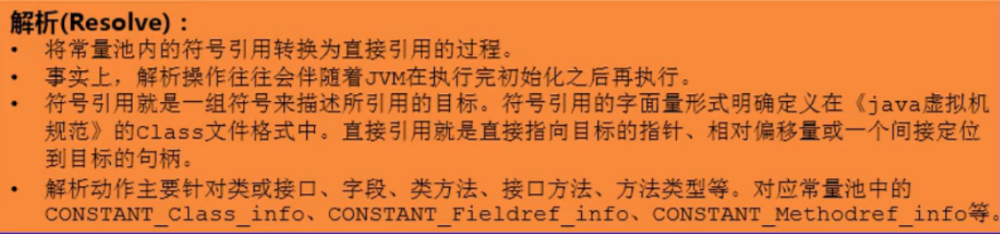


### 1.2.4 初始化

`初始化` ，指调用类的 `<cinit>()`方法。 这个方法是`JVM`自动生成，调用的，在`Java`层面看不到。

`<cinit>` 由【类变量】 和 `static`代码块组合而成，调用顺序同 类中定义的顺序。

`<cinit>` 方法只会运行一次，且是线程安全的。

在加载子类时，需要保证父类的 `<cinit>` 方法优先被执行。


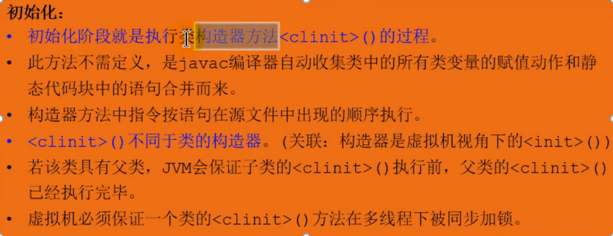


由于 `链接中准备`阶段已经对 类变量初始化，并赋零值。


<clinit>类构造器方法的存在，可以解决这样的麻烦：

```java
1  :  public class Test {
2  :
3  :     static {
4  :        a=4;
5  :     }
6  :     private static int a = 1;
7  : 
8  :     public static void main(String[] args) {
9  ：        System.out.println(a);
10 ：     }
11 ： }
```

对于上面给出的代码实例，看起来我们好像对一个没有声明的a变量赋值4，但JVM仍能对它正确声明并赋值。因为他的过程是这样的：

在 Linking （链接） 中的prepare阶段，


变量a已经被分配内存并指定了初始值0。

而后续的赋值4 （第4行代码），赋值为1（第6行代码）都被收集到了<clinit>中


所以，对于jvm来说，变量a仍然符合先定义后声明的规则。但是对于开发者来说，就省去了这份烦恼，在他们的视角里，由static标记的变量，在这个类 中的任意地方都可以使用。

值得注意的是：


<clinit>在收集赋值语句中，会按照源文件出现的顺序执行，

a被赋值为4  (第4行代码)   先执行

a被赋值为1（第6行代码）后执行

所以，第9行代码输出a的值将是1

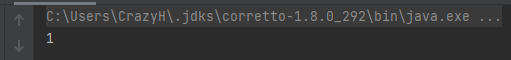


注意：


对于 上面这句话， <clinit> 类构造器方法自动收集的是，被static 修饰的变量赋值。如果这个类没有 对static 修饰的变量赋值的操作，那么将不存在<clinit>方法。

除此以外，<clinit>只收集赋值语句

```java
1： public class Test {
2： 
3：    static {
4：        a=4;
5：        System.out.println(a);
    }
    private static int a = 1;

    public static void main(String[] args) {
        System.out.println(a);
    }
}
```

第5行的代码，将会报错。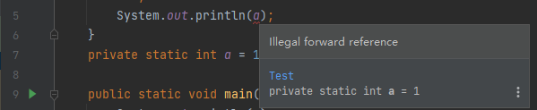

非法的前置引用 (illegal forward reference)

因为，`System.out.println(a);` 并不会被JVM 收集到<clinit>中，导致引用了未声明的变量


### 1.2.5 类的加载器 `ClassLodaer`

先引入一篇文章 《类加载器》

https://zhuanlan.zhihu.com/p/74892960


#### 1.2.5.1 类的加载器分类

引导类加载器  bootstrap ClassLoader

自定义类加载器 User-Defined ClassLoader


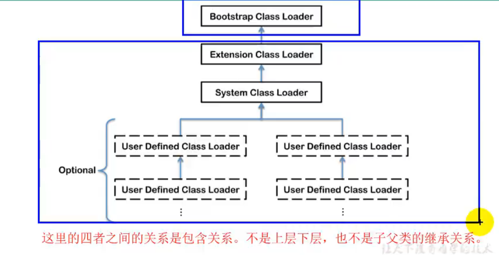


也就是说 下面的蓝框都是 自定义类加载器


```java
//系统类加载器，也叫 应用类加载器。 用户自定义类由 应用类加载器启动
ClassLoader systemClassLoader = ClassLoader.getSystemClassLoader();//
System.out.println(systemClassLoader);//sun.misc.Launcher$AppClassLoader@18b4aac2

// 获取系统类加载器的上层：拓展类加载器，
ClassLoader extClassLoader = systemClassLoader.getParent();
System.out.println(extClassLoader);//sun.misc.Launcher$ExtClassLoader@1b6d3586

//拓展类加载器的上层： 引导类加载器/启动类加载器  由C++语言编写的。所以获取的是null
ClassLoader bootstrapClassLoader = extClassLoader.getParent();
System.out.println(bootstrapClassLoader);


//获取自定义类的 类加载器，得到的是应用类加载器
ClassLoader classLoader = classLoaderTest.class.getClassLoader();
System.out.println(classLoader);//sun.misc.Launcher$AppClassLoader@18b4aac2
```


上述java代码。通过调用了getParent()的方法，获得了这个类加载器的上层类。注意是上层类，不是继承的关系，而是组合的关系、包含的关系。

#### 1.2.5.2 引导类加载器/启动类加载器

bootstrapClassLoader

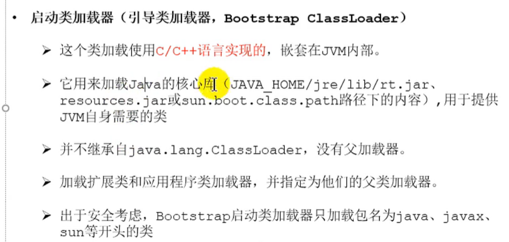

 rt.jar (runtime.jar)

```
引导类加载器，只加载java的核心类库。比如包名为 java javax sun开头的类
```


#### 1.2.5.3 扩展类加载器

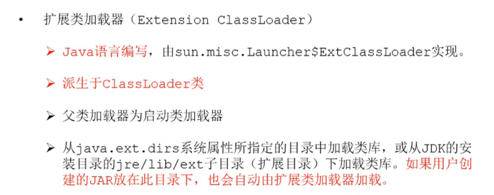


#### 1.2.5.4  系统类加载器/应用程序类加载器

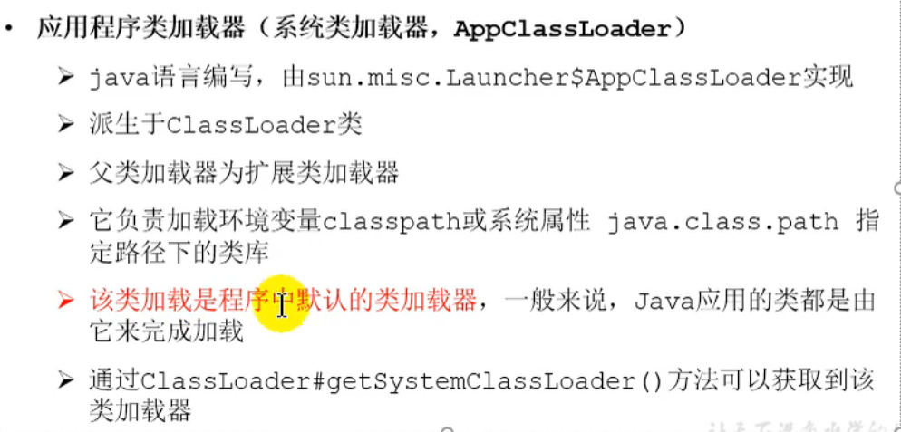


#### 1.2.5.5 自定义类加载器

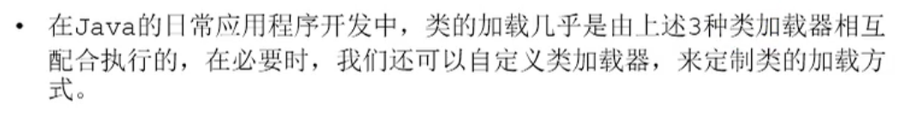

为什么要使用  自定义类加载器？

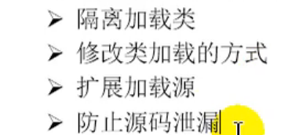


```
扩展加载源：扩展字节码的来源

防止源码泄露：对字节码加密，自己用的时候，自定义类加载器，在加载之前解密
```


###### 1.2.5.5.1 如何实现自定义类加载器？

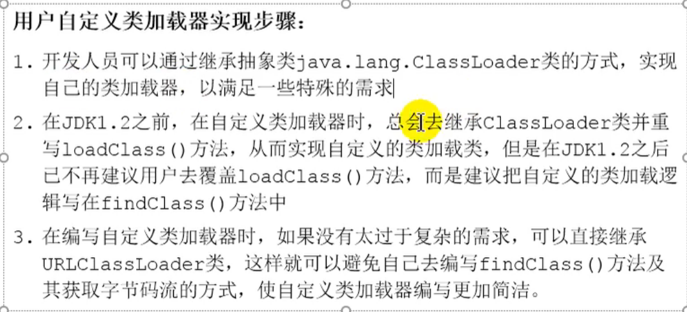


### 1.2.6 ClassLoader


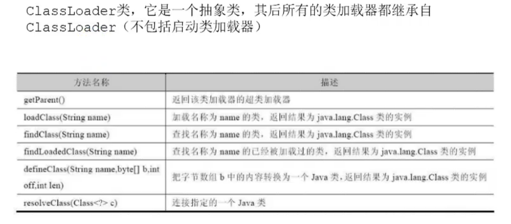

### 1.2.7 双亲委派机制


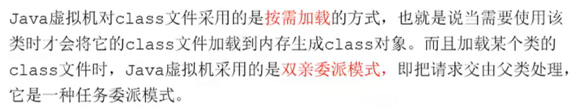


#### 1.2.7.1 什么时候是 按需加载的 需？

当**主动使用**到某个类时，才回去加载这个类的字节码文件。
怎么才算用到这个类呢?

主动使用：

```
1. 创建这个类的实例。new一个对象
2. 访问某个类或接口的静态变量，或者直接对这个静态变量赋值。
3. 调用某个类的静态方法
4. 反射 （如 Class.forName(com.crazyHH.Person)）
5. 初始化一个类的子类。这个类也会被初始化。
6. java虚拟机启动时，被标明为启动类的类。
```

除此以外。都称为被动使用

#### 1.2.7.2 什么是双亲委派机制

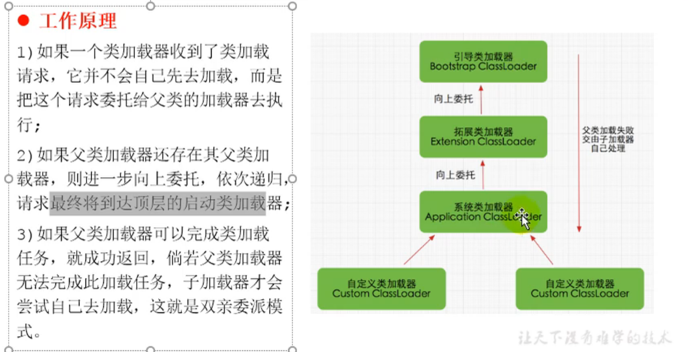


#### 1.2.7.3  为什么要有双亲委派机制？

因为他更安全。

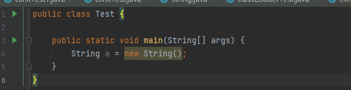


准备一个测试类，new一个String对象。

如果此时，我在程序中也创建一个java.lang包，包下也有一个String类

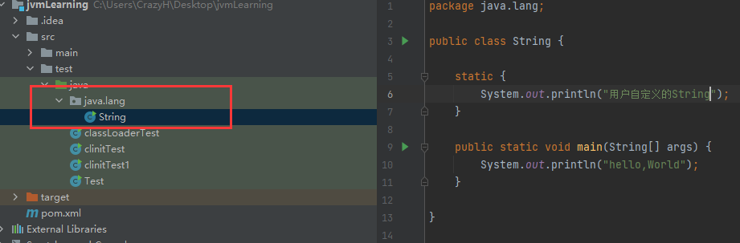


此时我运行Test下的main方法，会输出“用户自定义的String”吗？

答案是不能，在想要运行main方法时，会先加载Test类。

而Test是用户自定义类，他会被提交给 应用程序类加载器，由于双亲委派机制，Test类的加载请求会被一层一层提交，最终提交到bootstrapClassLoader。

而bootstrapClassLoader 只加载 java javax sum 开头的类。此时，bootstrapClassLoader就会加载核心类库目录下的java.lang.String。根本不会加载我们自定义的java.lang.String

所以，双亲委派机制就好像   给高层类加载器所加载的类提高了优先级。保证了核心类总是被优先加载，借此保证了程序运行的安全可靠。

#### 1.2.7.4 双亲委派机制的优势

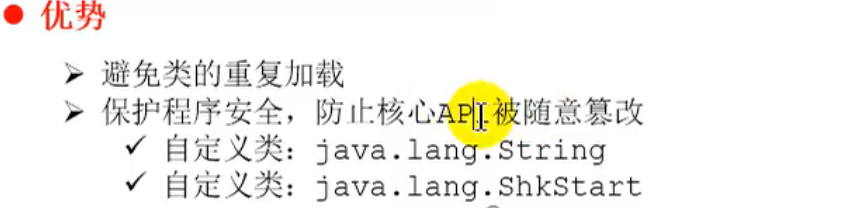


### 1.2.8 沙箱安全机制


承接上面，如果我们在自建的java.lang包下，建立一个和核心api类并不冲突的  用户自定义类会发生什么呢？

就像这样：

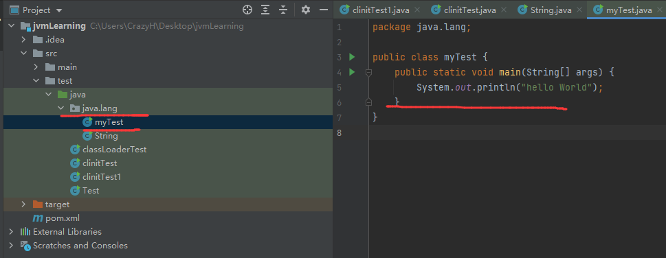

运行main方法：

直接报错：  禁止的包名： java.lang

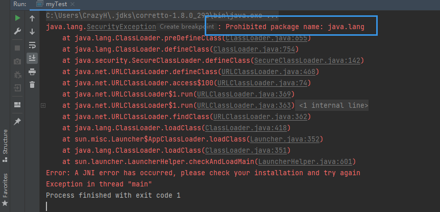


## 1.3 运行时数据区


### 1.3.1 JVM经典的内存布局


​                                                                         【类加载子系统】 

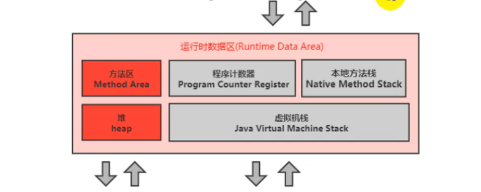

​                         【执行引擎】                  【本地方法接口】


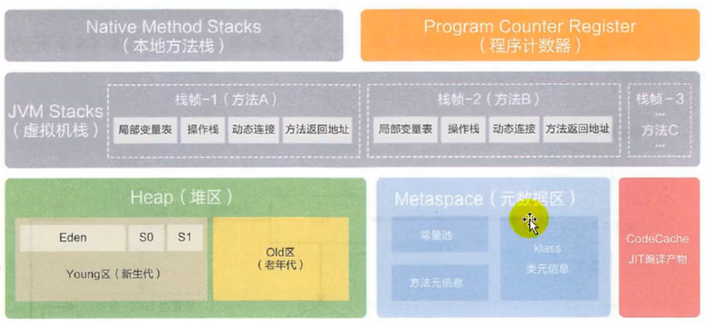


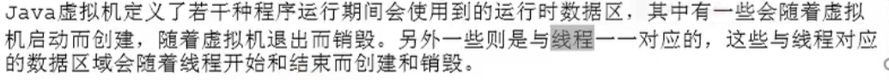


堆，方法区 是属于虚拟机的。是所有线程共享的，生命周期和虚拟机（进程）是一致的。

本地方法栈、虚拟机栈、程序计数器 是属于进程的。是进程之间独立的、同一个虚拟机中可能存在很多个

### 1.3.2 hotspot 的线程


java线程结束了，本地系统线程也会被回收

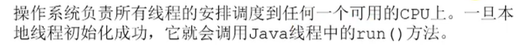

### 1.3.3 JVM系统线程

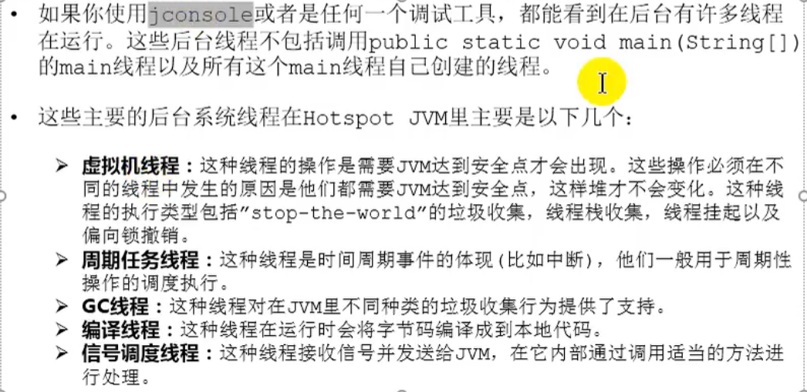


## 1.4 程序计数器/PC寄存器


````
程序计数器用于线程之间的切换，上下文切换。指出下一条指令的地址。
````


### 1.4.1 PC寄存器都做什么了

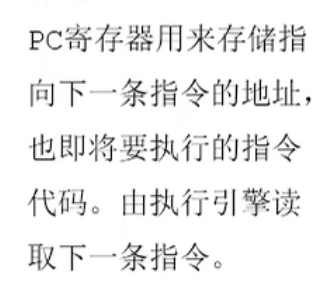


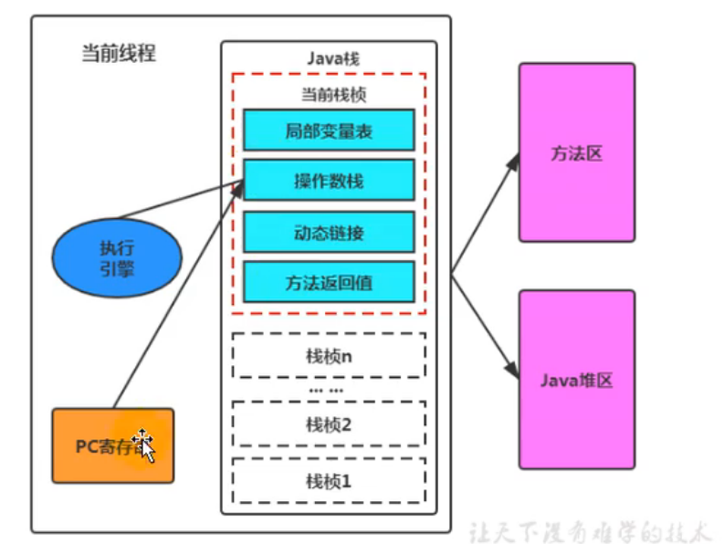


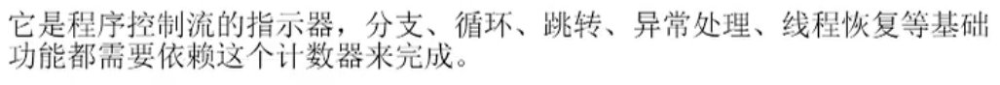


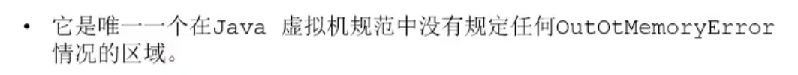


### 1.4.2 指令地址（偏移地址），操作指令


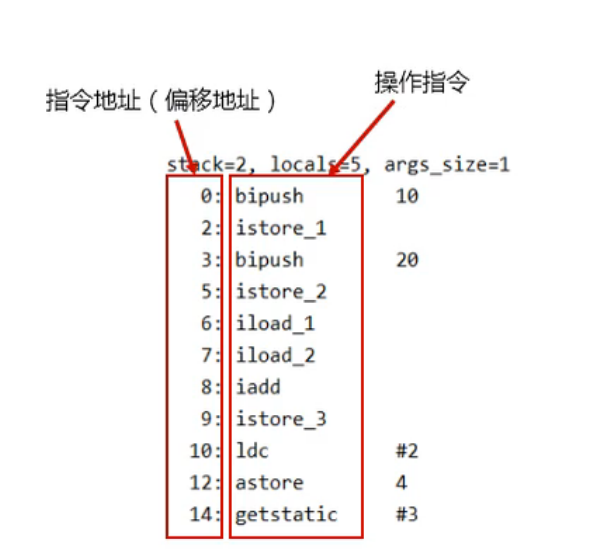


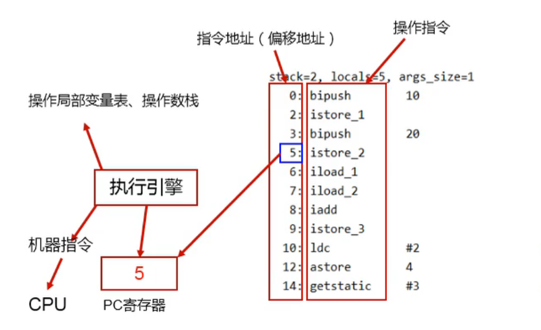


### 1.4.3 pc寄存器的作用 

1.使用PC寄存器存储字节码指令地址有什么用？为什么使用PC寄存器记录当前线程的执行地址？

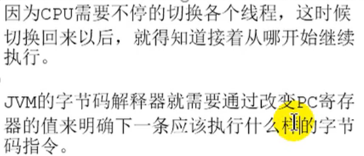


2. PC寄存器为什么会被设定为线程私有？

   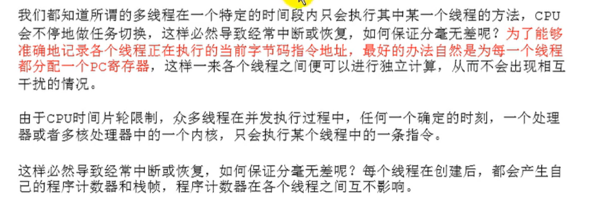

```
我自己的答案：

先从PC寄存器的功能来说，他的存在时为了让cpu在各个线程之间切换时，方便恢复当前线程的上下文。它服务于某个特定的线程，独立于其他线程。并且从生命周期的角度来说，一个线程凋亡了，专门为他服务的PC寄存器也应当凋亡。符合PC寄存器的功能。

如果是公有的PC寄存器。我们还需要花费额外的开销来维护 公有PC寄存器中某个具体的PC寄存器 到 它服务的线程之间的映射表。除此以外，如果这个线程凋亡了，公有PC寄存器中若除去它则浪费额外开销，若不除去则浪费内存。
```


## 1.5  虚拟机栈


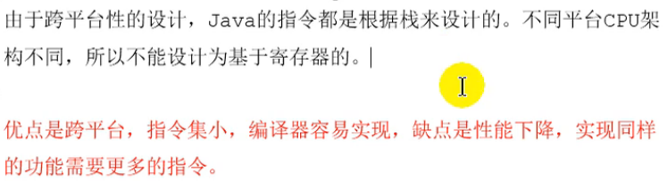

### 1.5.1 栈和堆

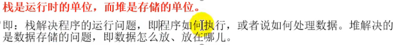


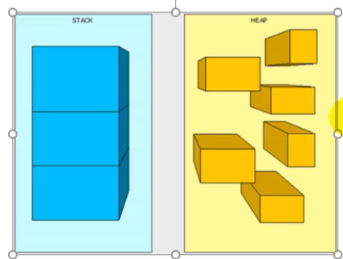

对象，存放在堆中。

基本数据类型的局部变量，放在栈中。但非基本数据类型，仍放在堆中。栈中只存放对象的引用

### 1.5.2 虚拟机栈 是什么？

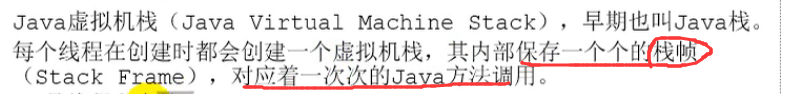

```
一个线程 <==> 一个虚拟机栈

一个方法 <==> 一个栈帧


栈帧包括 ： 局部变量表，操作数栈，动态链接，方法返回地址，一些附加信息
```

虚拟机栈内部是这样的：

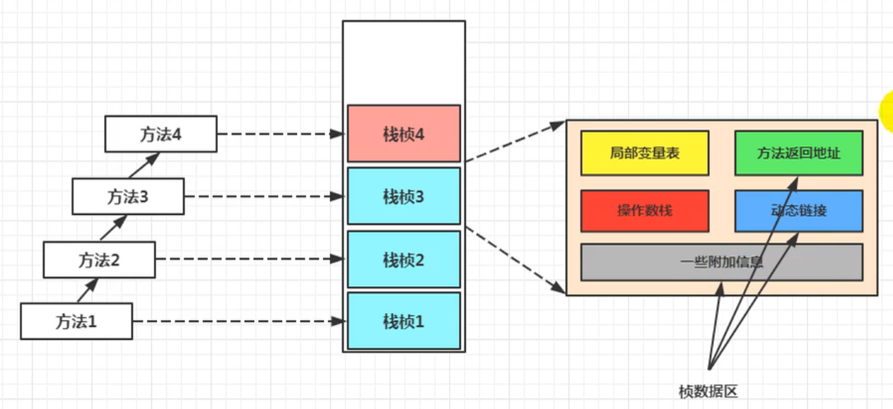


#### 1.5.2.1生命周期

与线程一致。

#### 1.5.2.2 一个 java 虚拟机栈的举例


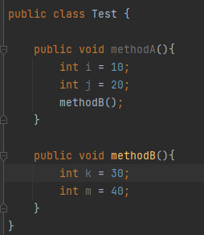

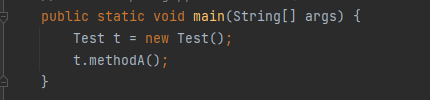


一个Test类，A方法调用了B方法。 准备一个主方法，new一个Test对象，调用A方法。此时Java虚拟机的样子:

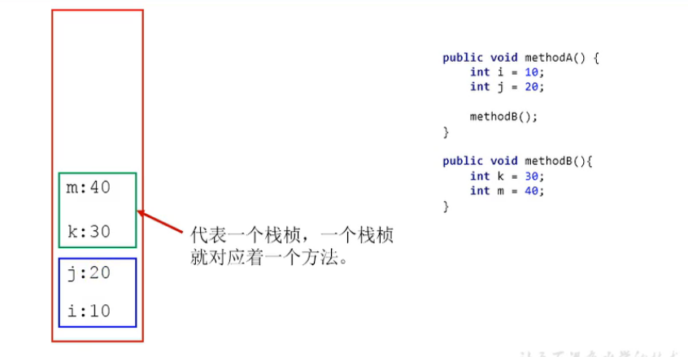

一个java虚拟机对应一个线程。那么，外层红框就是这个main方法。在main中先运行A方法，一个方法对应一个栈帧，蓝色框就是A方法，A方法首先创建了一个基本数据类型的局部变量i=10，存放在栈中。j=20同理。

在A方法执行过程中，调用了B方法，所以随之创建了一个对应B方法的栈帧。存放在java虚拟机栈中，根据栈的特性，存放在栈顶。所以，栈顶方法也称为**当前方法**。B方法创建  局部基本数据类型变量k，m，存放在栈帧中。B方法执行完毕，出栈。

B栈帧出栈后，此时当前方法是A，转而执行A方法。A方法结束，出栈。java虚拟机栈为空，方法全部执行完毕。线程凋亡。


#### 1.5.2.3 java虚拟机栈的作用

主管 java程序的运行，它保存了线程的信息，保存了方法的局部变量，部分结果，并参与方法的调用，返回。

#### 1.5.2.3 线程 的数据结构用 栈来表示的优点

一个线程对应者一个java虚拟机栈。也就是说，栈结构 是 线程在jvm里的具体数据结构表示。	

（比方说可以用队列表示一个线程，调用了新的方法，就入队，调用完成出队。队空则线程凋亡。但是显然，对于方法嵌套调用的情况来说，入队的方法在队尾，后调用的方法反而先执行完毕，不应当从队头出队。而是队尾出队，这其实更符合栈的特点）

那么，使用栈的优点有哪些？	 

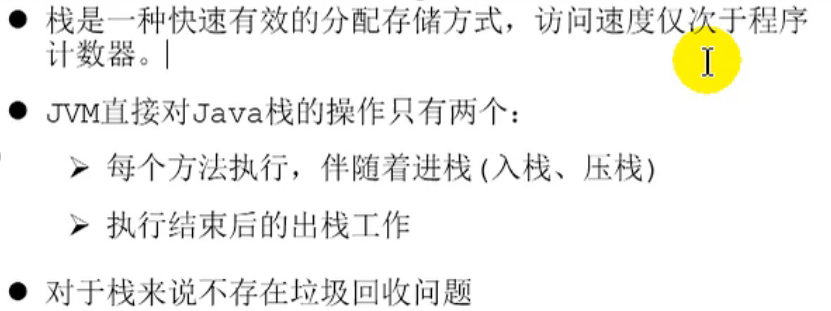


#### 1.5.2.4 java虚拟机栈 可能抛出的异常

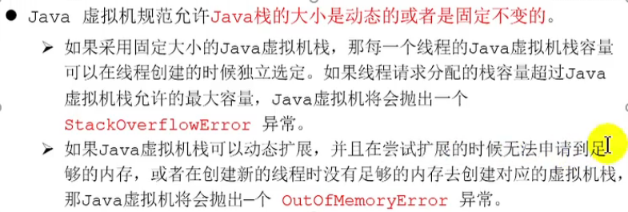

### 1.5.3 调整 java虚拟机栈 


#### 1.5.3.1设置栈内存大小

使用 -Xss <size> 设置线程的栈最大内存空间


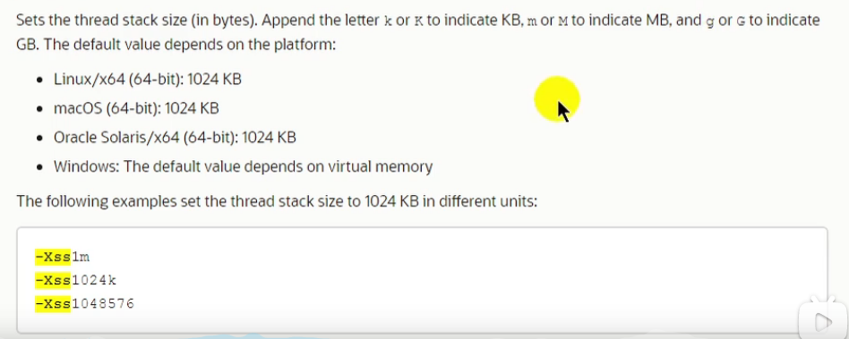


```
-Xss1m
设置线程栈大小（字节为单位）。 
扩展： 用k或者K 代表KB。   用m或者M 代表MB
      用g或者G 代表GB
      
在各种操作系统平台上，默认的大小是：
   linux/(64位) ： 1024KB
   macOS : 1024KB
   Windows: 取决于虚拟机的内存
```

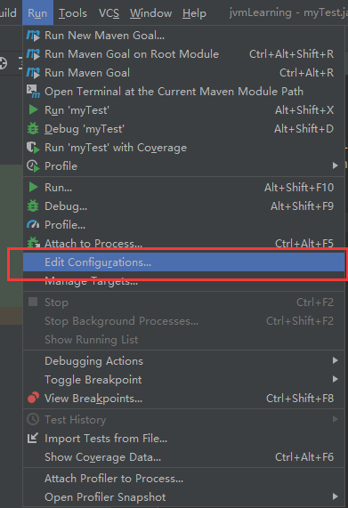

如果没有VM option。在Modify options 中添加


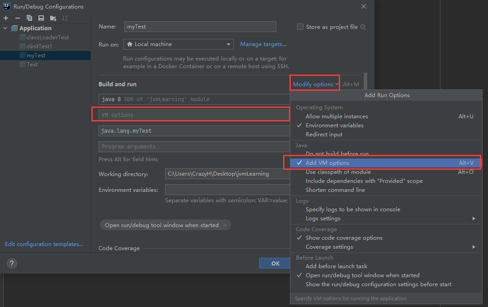


用一个粗略的方法感受一下java虚拟机栈内存大小 的变化

```java
public class Test {
    private static int i = 0;
    public static void main(String[] args) {
        System.out.println(i); //修改前11417
        i++;
        main(args);
    }
}
```

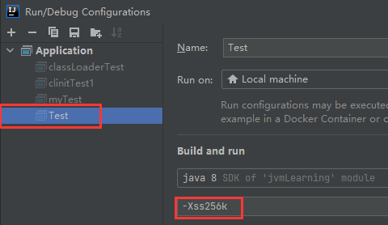

修改后只有2462了

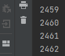

修改为 2048k后

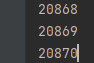


### 1.5.4 栈的存储单位

栈帧

#### 1.5.4.1 栈帧 stack frame

##### 1.5.4.1.1 栈帧特点

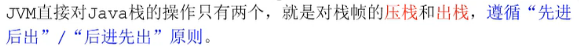

```
入栈 对应着 一个方法的调用
出栈 对应着 一个方法的结束
```

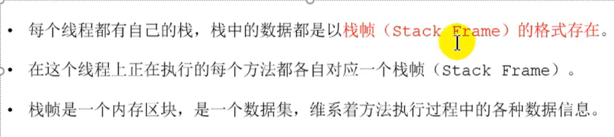

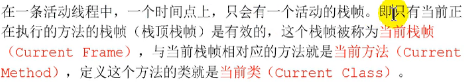

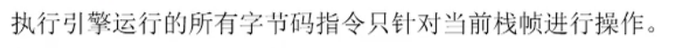

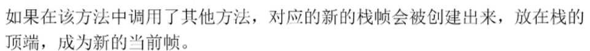

##### 1.5.4.1.2 栈的运行特点

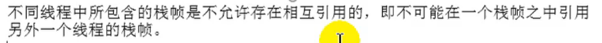

```
即：java虚拟机栈 是互相独立的。但同一个进程的多个线程，是可以引用堆空间的内容。
```

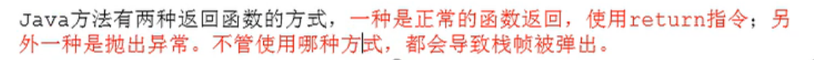

```
抛异常特指没有被捕获的异常。直接抛出的异常

即：被try catch 捕捉后的异常，虚拟机会按照编写的程序（依照程序员的意愿处理这个异常）继续尝试运行下去。
并不会把这个栈帧弹出去导致后续的程序无法执行。
```

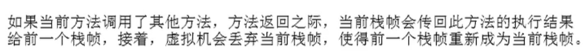

#### 1.5.4.2 `栈帧`的`内部结构`

局部变量表 ： 存放方法内的局部变量的值，或堆区对象的引用（在堆区的偏移量）。

操作数栈  

方法返回地址 ： 记录了方法是如何推出的。

`动态链接` : 指向 方法的引用。

一些附加信息

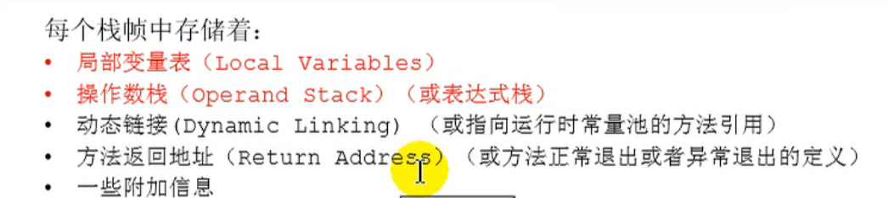


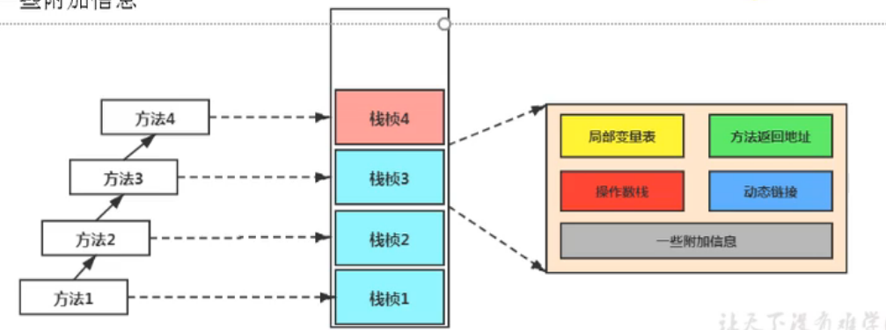


### 1.5.5 局部变量表 LocalVaribleTable

局部变量表  也称  本地变量表  / 局部变量数组


```
局部变量表 存储

基本数据类型。值存储

引用数据类型。存储的是它的引用。也就是指向堆空间的地址

returnAddress类型
```


 

```
局部变量表 本质上是一个 数字数组

基本数据类型： byte short int long float double char（通过unicode） boolean（false是0 true是非0）

均能转换成 数字存储。
对象的引用，本质是对象的地址 也是数字
```


```
有可能存在线程安全问题。（引用数据类型，对象存在堆空间中。多个线程对其访问，如果存在写操作，就很有可能出现线程安全问题）
```


#### 1.5.5.1 字节码文件内部结构

准备一个方法：

```java
public static void method1(String msg) {
    int i = 11;
    System.out.println(i);
}
```

使用jClasslib查看这个 .class文件。

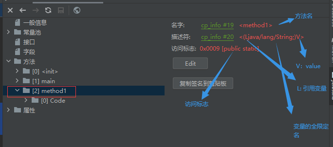


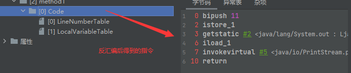


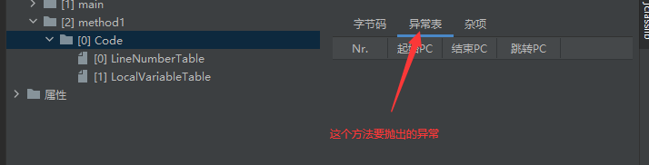


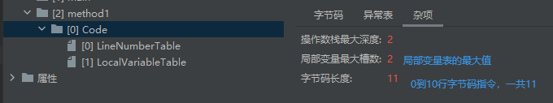


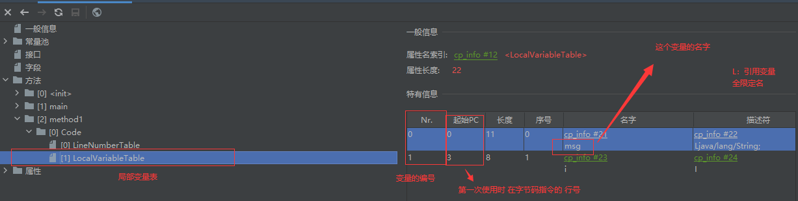

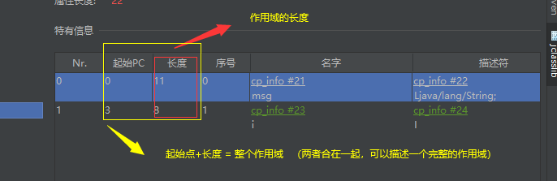

####  1.5.5.2 关于局部变量表

##### 1.5.5.2.1  slot


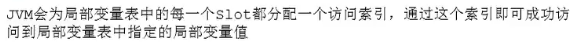

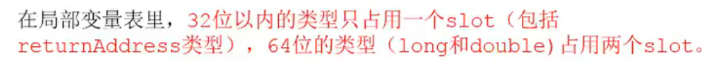

```
也就是说 一个 slot 占32位（或者4字节）。

[除此以外] ： 引用数据类型也占1个slot。即引用数据类型在局部变量表里最多占32位
```


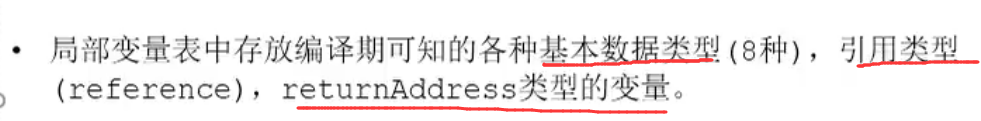


```
（静态方法的)局部变量表包括 方法参数+局部变量，同时是按顺序排列。靠前的总是方法参数

那么非静态的呢？
他们局部变量表的index0总是this对象，这之后依次 方法参数+局部变量
```

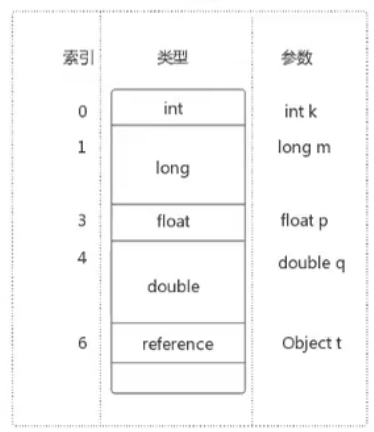

```
int 基本数据类型，占1个slot，它的name是k，索引是0
Long 引用数据类型（Long型），占2个slot ，name 是m  索引  1
.
.
.


//当使用64bit（占2个slot)的引用数据类型时，只需使用它的首索引即可
```


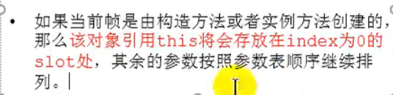

```
当前帧 即 当前方法。即 非静态方法。

只有当this对象存放在这个方法的局部变量表中时，这个方法才能使用this变量。

下面引入一个例子：
```

准备了一个测试类  TestLocalVariableTable

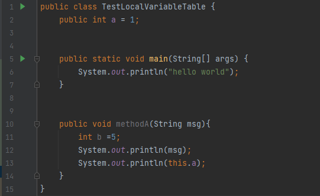

对于非静态方法（实例方法）来说，它的内部是可以使用this对象的。这是因为jvm自动把this对象加入到了局部变量表的index0位置上，这之后会正常加载剩下的局部变量表（即 方法参数+局部变量）

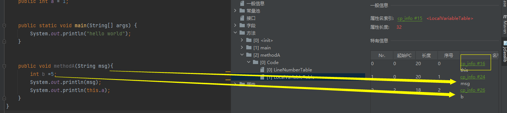


那么反过来，在静态方法中：

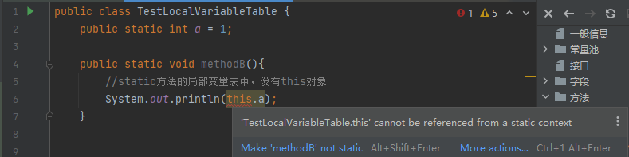

```
this对象不能被一个静态上下文引用

//本质上是 static方法 局部变量表里根本没有this对象。 与this对象里的int是否是static无关
//或者这样理解： 在编译时:静态方法的程序性就应该确定下来，而此时这个类的实例对象this还没有被创建。
```

##### 1.5.5.2.2 slot的重复利用

在局部变量表中，有些局部变量的作用域并不是整个方法。以最大化节省内存空间为目的，将对这种变量所占用的slot进行回收利用。


下面引入一个例子:

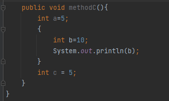


```
对于这个 非静态方法来说，局部变量最多时应该为4个。
```

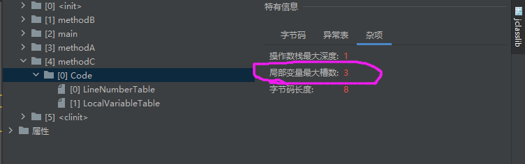

但局部变量表slot最多为3个。

通过局部变量表可以看到：

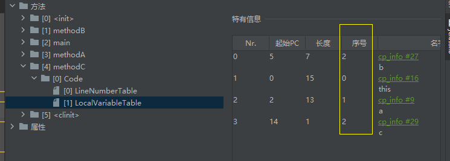

index 2的变量b,作用域长度为 12(5+7),其余变量都是15。显然，变量b的作用域长度不是整个方法。他所占的slot被回收给c使用了(可以看到c占用了b的 index)。


##### 1.5.5.2.3 reference类型

在局部变量表中，提到的了reference引用类型。1个reference类型占用1个slot（32位），现在引入对reference类型的扩展。


reference到底是如何找到堆对象的呢？


###### 1.5.5.2.3.1 实现方式

在Java虚拟机规范里只规定了reference类型是一个指向对象的引用，并没有定义具体的实现方法（具体如何定位对象在堆的地址）。

因此不同虚拟机实现的对象访问方式会有所不同。

主流方式有两种 ：

```
1、句柄。
2、直接指针。
```

###### 1.5.5.2.3.2 句柄

如下图

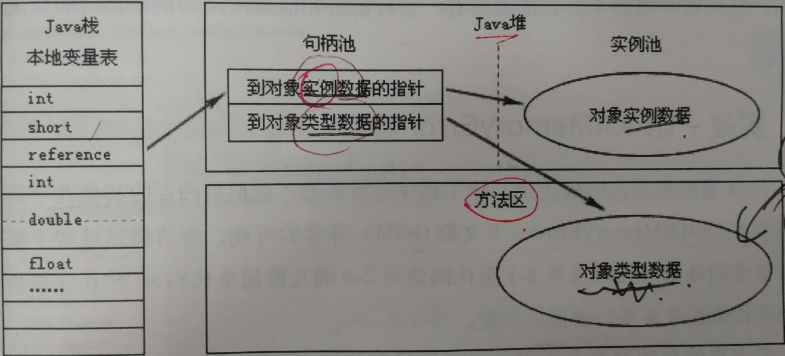

在java堆中开辟了一块区域，称为句柄池。reference中存储的并不是对象的真实地址。而是一个句柄池的某一个地址。这个句柄池的地址上的句柄 包含了对象实例数据和对象数据类型的真实地址。

```
也就是说，句柄池维护了一个 句柄地址->对象真实地址的映射关系。
```

这样做的好处是什么？

```
堆空间，是GC回收的重点区域。所以在堆空间内对象的地址会频繁的改变。
此时，只需要改变句柄池中，句柄指向的对象地址，无需改变reference内的地址值。

称 reference中存储的是 【稳定的句柄值】
```

###### 1.5.5.2.3.3 直接指针

顾名思义，reference中存放的就是堆中对象的具体地址。通过这个地址可以直接访问到堆中的对象实例。

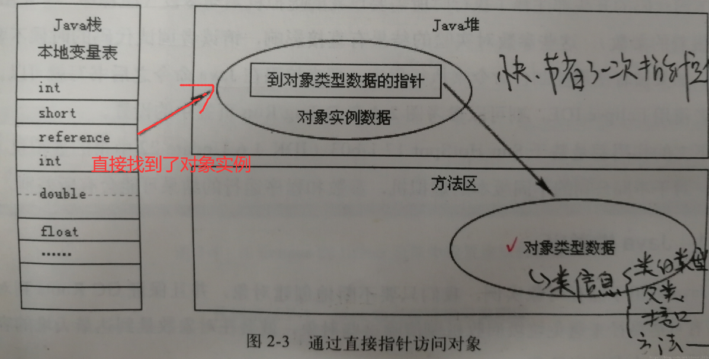

```
使用这种方式，必须要考虑如何访问到 对象类型数据。

如图示： 对象实例数据中存放了 指向对象类型数据的指针。
通过reference找到对象数据，再通过这个指针找到对象类型数据。
```

直接指针的好处：速度快。（节省了一次地址定位的开销）

hotspot 使用的直接地址指针方式


###### 1.5.5.2.3.4  对象实例数据/对象类型数据

对象实例数据（堆）

````
对象中各个字段的值
````

对象类型数据（方法区）

```
1.对象的类型
2.父类
3.实现的接口
4.方法等
```


### 1.5.6 操作数栈 operand stack


#### 1.5.6.1 操作数栈基础

也称为 表达式栈 `expression stack`

​	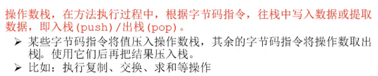


```
操作数栈的底层数据结构就是  数组
```


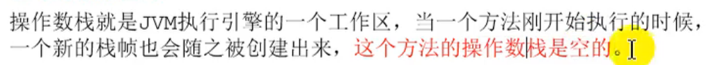

```
因为底层数据结构是  数组。所以长度是定值，对应的 栈深度是定值。 

栈的深度在编译时就确定了下来。
```

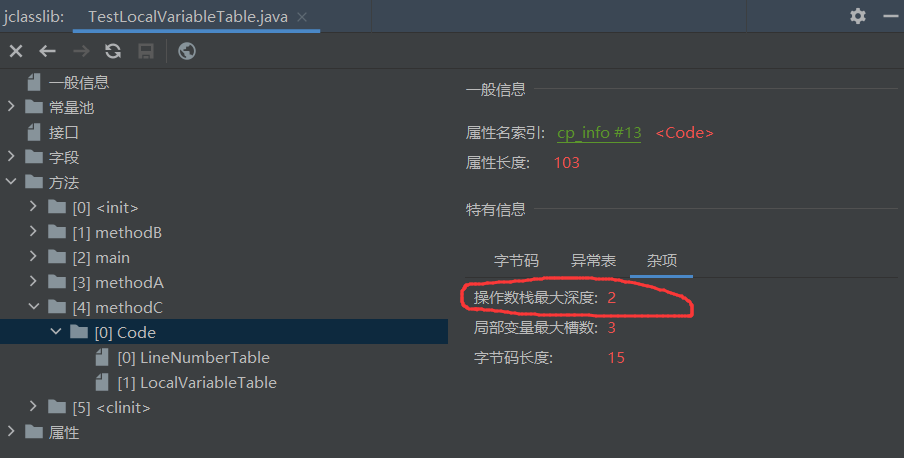


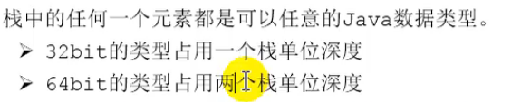


#### 1.5.6.2 运行流程


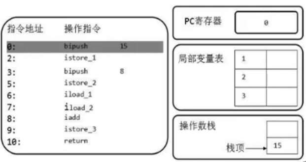


```
LocalVariedTable 的index0位置给this对象了

store操作将伴随出栈

load操作将伴随入栈

add操作将伴随2个操作数出栈
```


```
注意。上文中的当前栈帧指的是，被调用方法弹栈以后的状态。
即：当前栈帧指向的是 调用方法，而不是被调方法 
```

下面引入字节码指令来看一看这个压入当前栈帧操作:

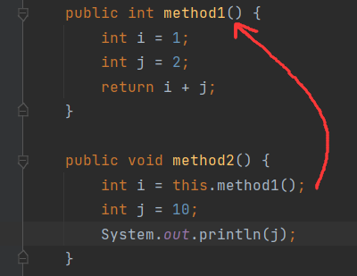

```
方法2调用了方法1。
```


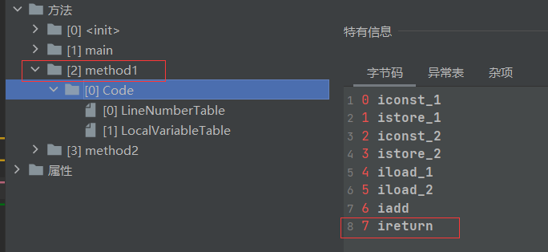


```
方法1的最后一条指令是ireturn 返回了一个int类型的值

作为对比，如果是 void的方法，最后一条指令是  return
```

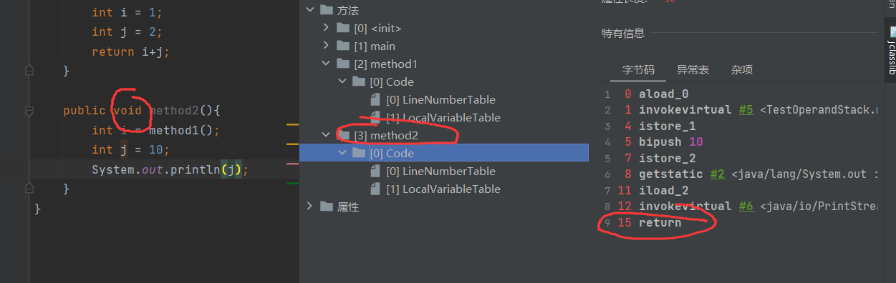

接下来看meth2的指令：


```
第一条指令直接就是 load ，往method2的的操作数栈中，压入了 上一个方法（已经出栈了的方法/method1）的返回值。

```


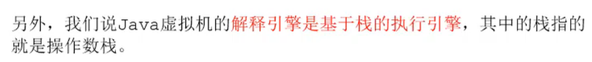


### 1.5.7 栈顶缓存技术

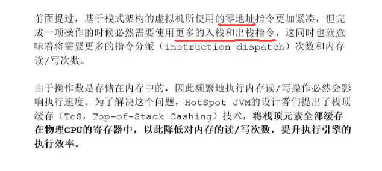


### 1.5.8 动态链接


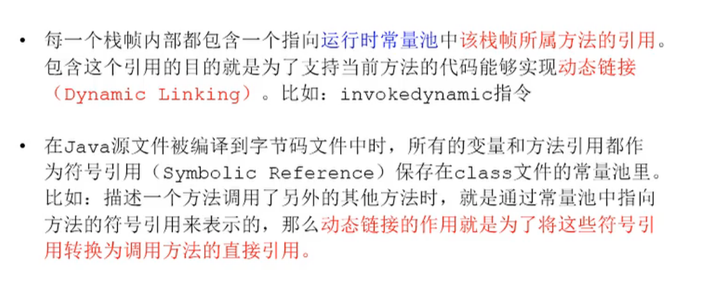

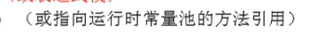

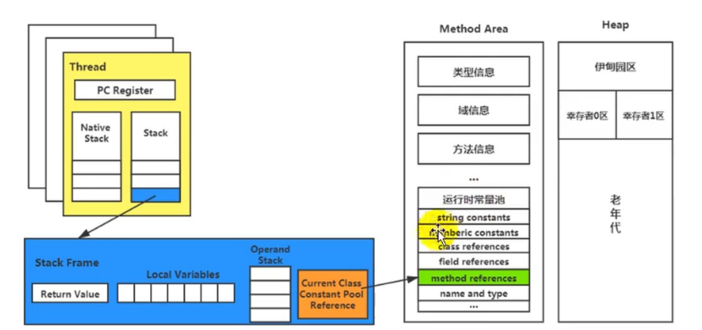


栈帧包括：方法返回值，局部变量表，操作数栈，动态链接。

当方法运行起来以后，常量池里的内容就放在 方法区内的运行时常量池。

所以 动态链接就是  指向运行时常量池里方法的引用


字节码指令中的常量池

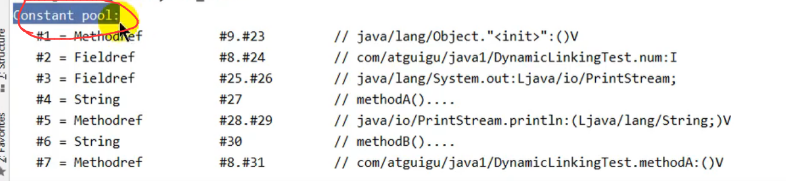


### 1.5.9 方法的调用


#### 1.5.9.1 静态链接 与 动态链接


方法在编译期间就确定下来：静态链接

方法在运行时确定下来：动态链接

链接什么？ 把符号引用转化为直接引用

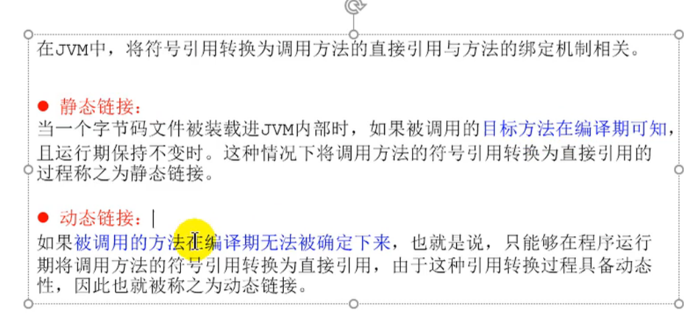


绑定 更广义一些： 字段 方法 类 


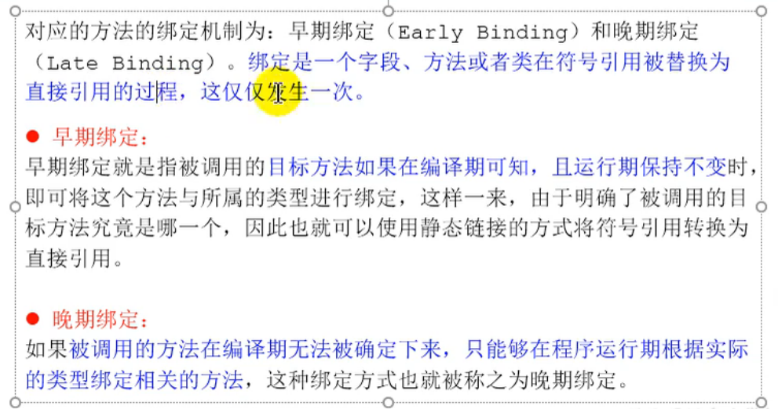


#### 1.5.9.2 举个例子


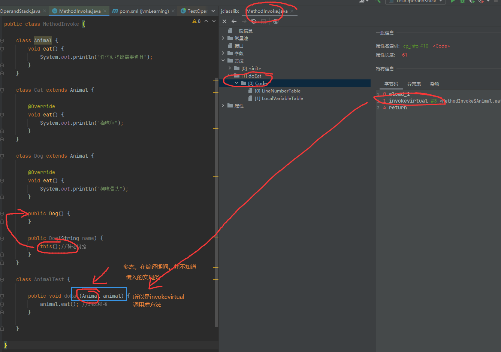


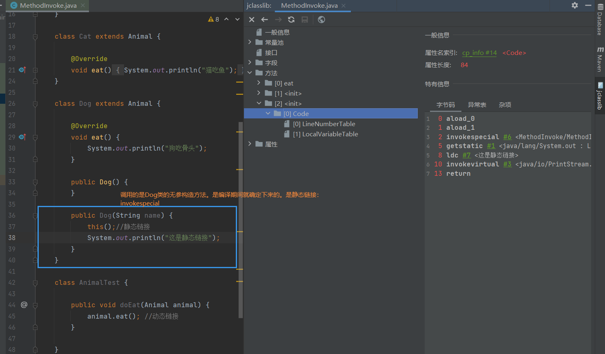

```
invokestatic 调用静态方法
invokespecial 调用 <init> 私有方法 父类的方法。在编译器唯一确定的方法
invokevirtual  调用虚方法
invokeinterface  调用接口方法
```


#### 1.5.9.3 虚方法，非虚方法


在编译期间确定下来的方法/函数  ： 非虚函数

在编译期间仍然确定不下来的方法/函数 ： 虚函数


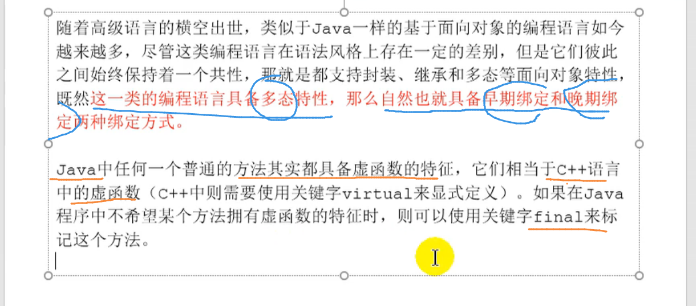

 

确定下来，也就是不可变的意思。


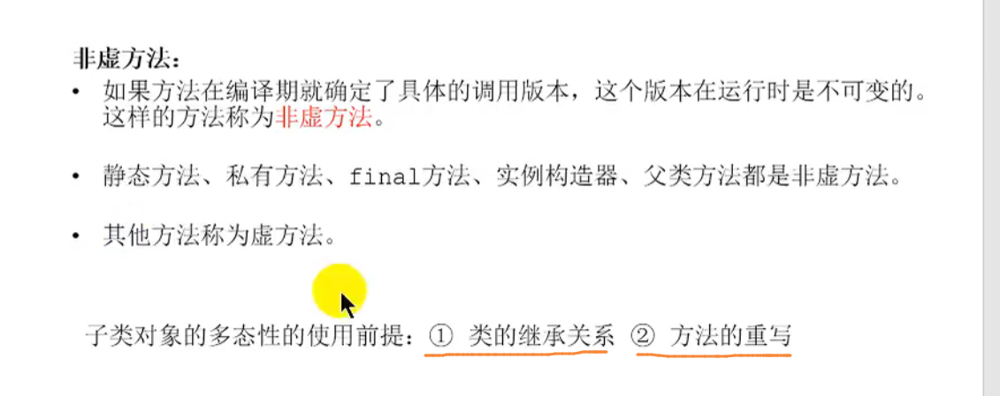


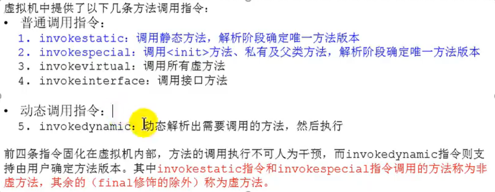


```java
静态方法  不能被重写。
```

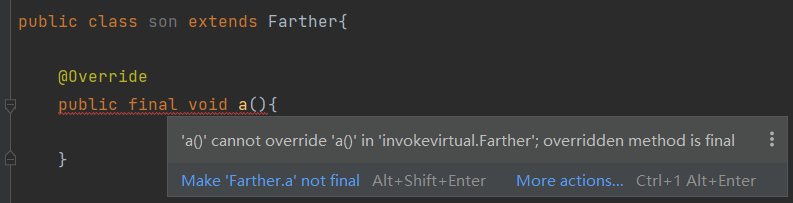

没有被@Override检查的情况下，仍然不允许重写final方法(宋红康老师使用的jdk版本允许不使用@Override的情况下，在子类声明一个和父类final方法没关系的，同签名方法)

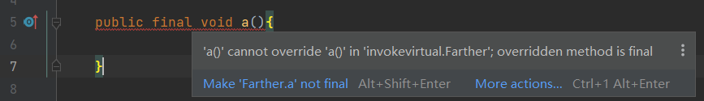


```
被final修饰的方法，不能被重写。所以本质上也是非虚方法。
有时，虽然被final修饰了，但是显示的仍然是invokevirtual，详见如下：
```

```java
public class Farther {
    public final void a(){
        System.out.println("这个是父类被final修饰的方法");
    } //父类准备了一个a方法
}
```

```java
public class son extends Farther{
    public void show(){
        super.a();
        a();
    }//子类分别显式的调用了父类a方法。和隐式调用了父类的a方法
}
```

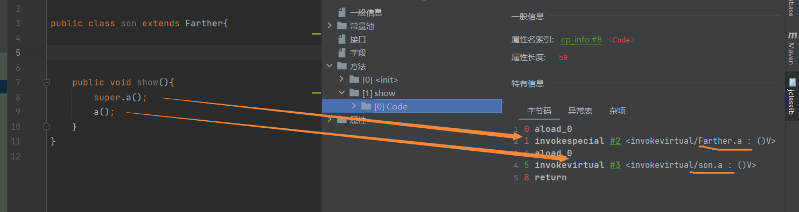

在编译期间，使用super. 显式调用父类方法。被当成invokespecial 非虚方法。

隐式声明的，被解释为invokevirtual，但实际上调用的仍是父类继承来的final方法


```
所以 invokestatic invokespecial 以及被final修饰的方法，都是非虚方法。


能被重写的，就是虚方法。无论这个方法此时是否已经被重写了。
```


#### 1.5.9.4 invokedynamic

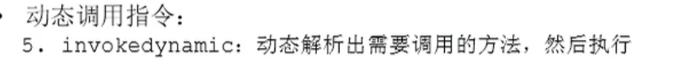


动态类型语言   静态类型语言

在编译期间就完成对类型的检查 就是静态类型语言。

在运行期间完成对类型的检查 就是动态语言


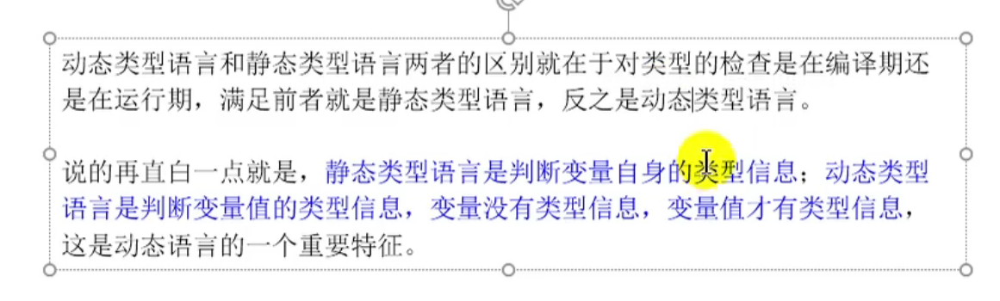


```
invokespecial invokestatic invokevirtual invokeinterface 都是在编译期间就确定了调用的方法。

java8 lambda表达式，在方法调用的时候，是invokedynamic
即动态解析出需要调用的方法
```

java8 lambda表达式，在方法调用的时候，是invokedynamic：

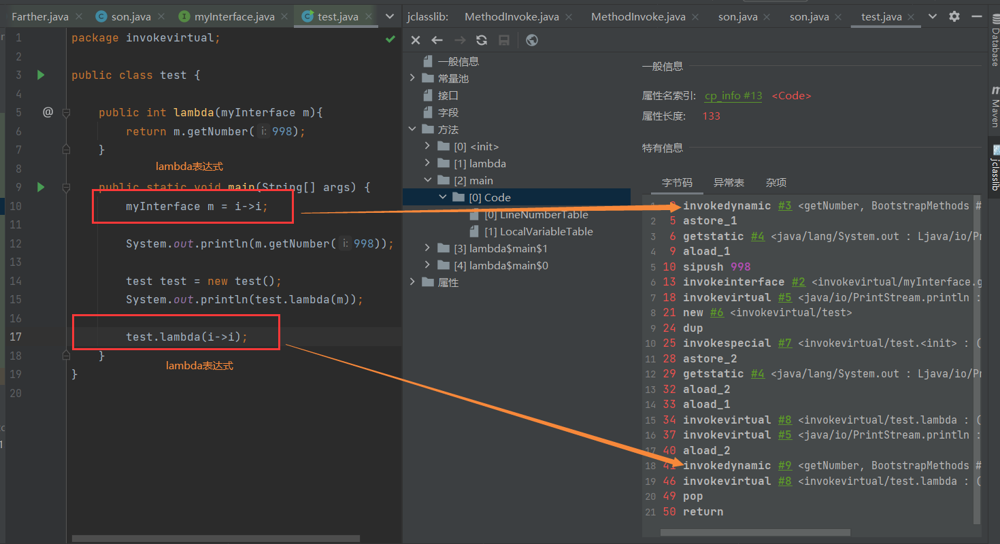


#### 1.5.9.5 方法重写的本质

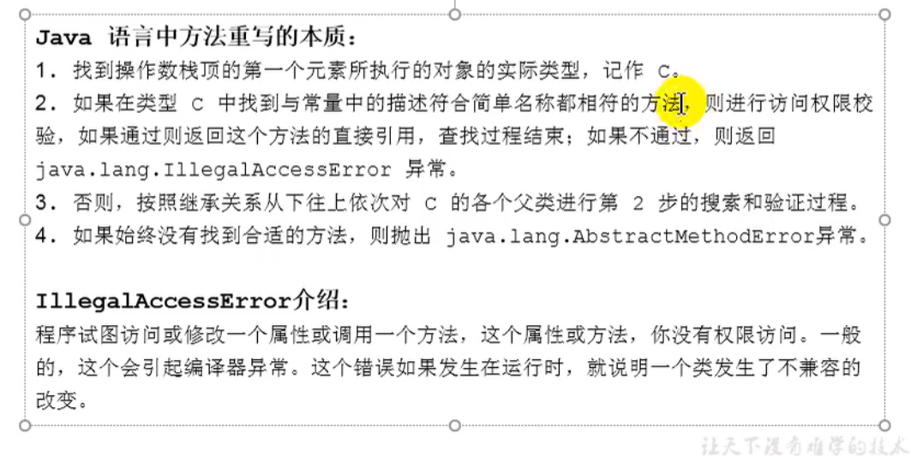


##### 1.5.9.5.1 静态分派 动态分派

什么是静态分派/动态分派？还得先理解静态类型 和动态类型


对某一对象实例类型而言，由于向上转型的存在，在编译期间的声明可能是他的父类。如：

```java
public class test {
    static class Person{
        String name;
    }
    static class Student extends Person{
        String studentId;
    }

    public static void main(String[] args) {
        Person p = new Student();//向上转型。
        //在编译期间，p实例 为Person。Person类就是P的静态类型
    }
}
```


而对象实例的真正类型，在运行时才会知道。

我们称 编译期间就知道的类型为 静态类型。运行时期才知道真正的数据类型为 动态类型。


在方法重载时（Overload），选择方法的规则根据 静态类型。通过静态类型寻找方法的这种行为，我们称为静态分派。

如：

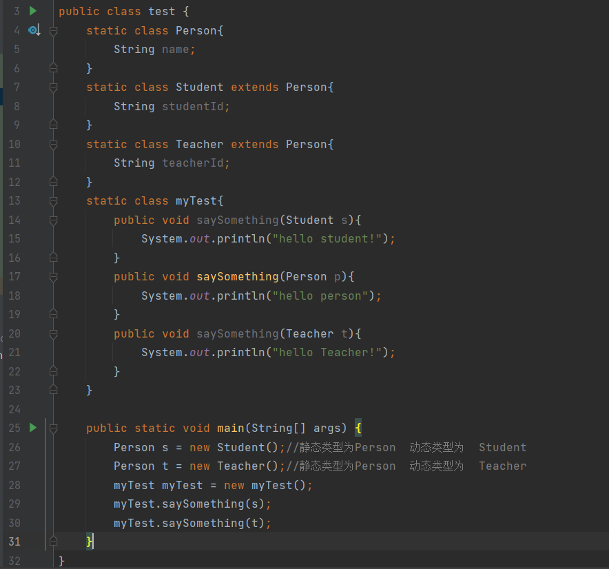


```tex
在编译期间，我们向编译器声明了 变量s的静态类型为Person  动态类型为 Student。
变量t的静态类型为Person ，动态类型为Teacher。

由于方法重载 根据静态类型。
所以输出的结果都是 “hello person”
```

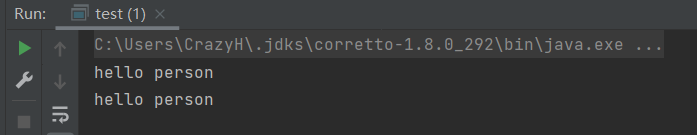


在方法重写时(Override)，选择方法的规则根据 动态类型。通过动态类型寻找方法这种行为，我们称为 动态分派。

（即：在继承树中，将欲执行的方法解析为  对象实际类型最近的方法。） 如：

```java
public class test {
    static class Person{
        String name;
        public void study(){
            System.out.println("Person can study");
        }
    }
    static class Student extends Person{
        String studentId;

        @Override
        public void study() {//重写study方法
            System.out.println("student can study");
        }
    }
    static class Teacher extends Person{
        String teacherId;

        @Override
        public void study() {//重写study方法
            System.out.println("teacher can study");
        }
    }
}
```

main方法：

```java
    public static void main(String[] args) {
        Person s = new Student();//静态类型为Person  动态类型为  Student
        Person t = new Teacher();//静态类型为Person  动态类型为  Teacher
        s.study();
        t.study(); //study()方法是 方法重写。是动态分派
    }
```

输出结果：

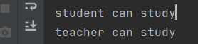


==================================================================

结合一下：

```java
static class myTest{
    public void saySomething(Student s){
        System.out.println("hello student!");
    }
    public void saySomething(Person p){
        System.out.println("hello person");
    }
    public void saySomething(Teacher t){
        System.out.println("hello Teacher!");
    }

    public void doStudy(Person p){
        p.study();
    }
    public void doStudy(Student s){
        s.study();
    }
    public void doStudy(Teacher t){
        t.study();
    }
}
```

```java
    public static void main(String[] args) {
        Person s = new Student();//静态类型为Person  动态类型为  Student
        Person t = new Teacher();//静态类型为Person  动态类型为  Teacher
        myTest myTest = new myTest();
        myTest.saySomething(s);
        myTest.saySomething(t);

        myTest.doStudy(s);
        myTest.doStudy(t);//重载的全是doStudy(Person p)方法。
        //但study()都是 动态分派
    }
```

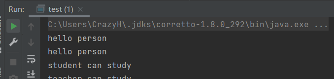


##### 1.5.9.5.2 虚方法表

了解动态分派以后。动态分派会不停地从继承树上从下往上找目标方法。可能会影响到方法的执行效率。为了提高性能，JVM在类的方法区建立一个 `虚方法表` 
virtual method table (非虚方法不会出现在这个表中。非虚方法已经唯一确定了，也不需要在这个表中。)以索引代替每次查找。


```
每个类 都有一个 虚方法表。 表中存放各种方法的入口
```


虚方法表 什么时候创建？

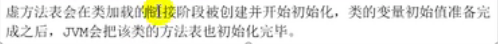

​	

举例1：

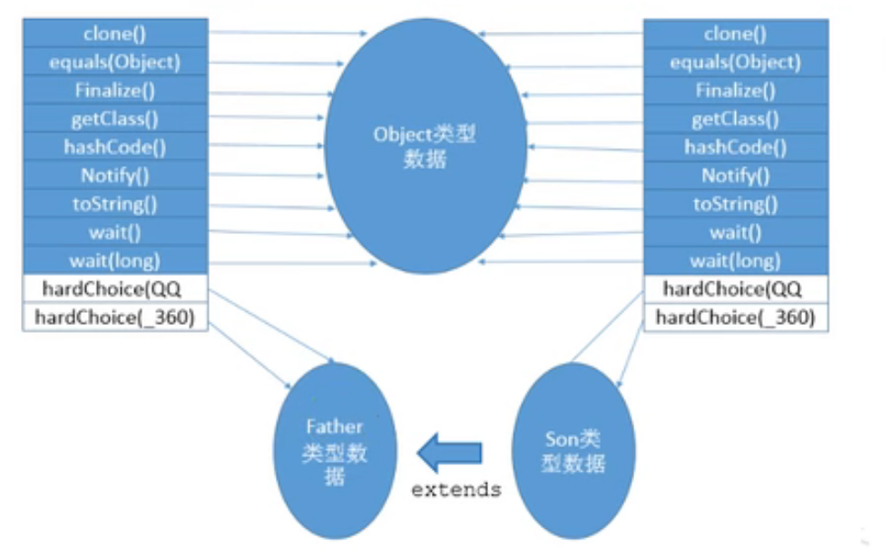


举例2

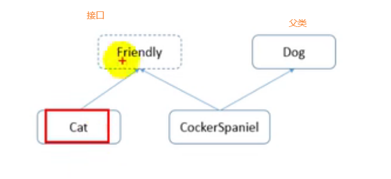


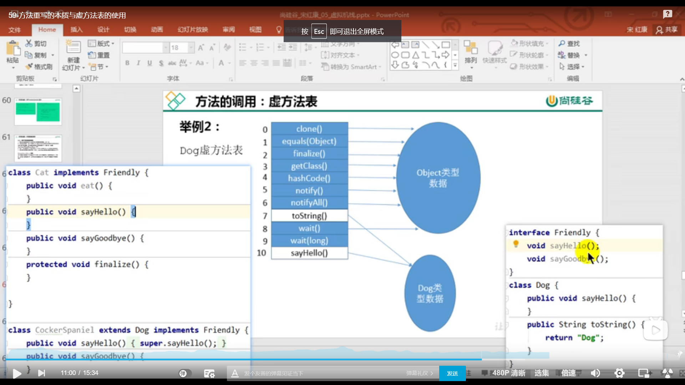


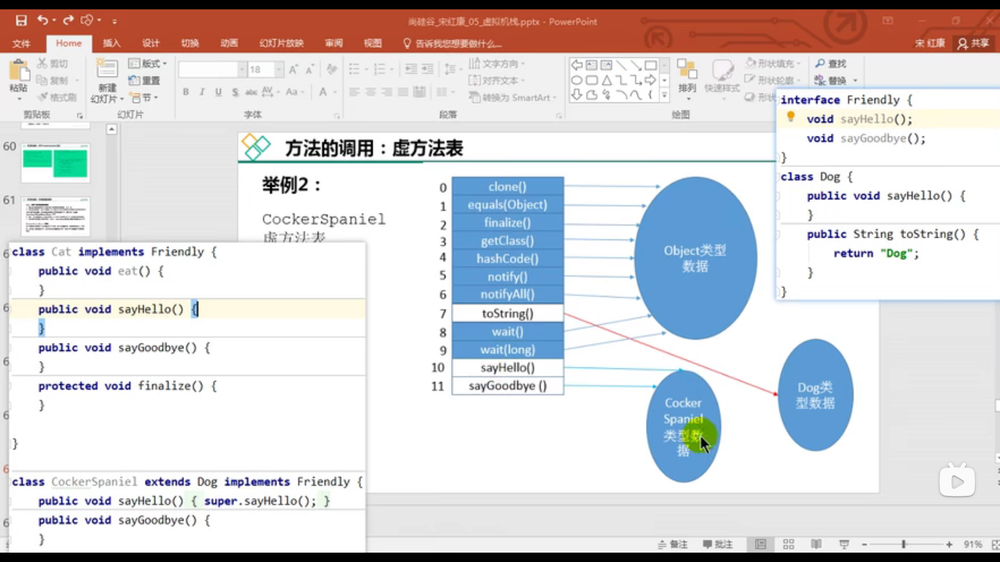


```
CockerSpaniel（可卡犬）的父类Dog 重写了toString（）方法。
而他自己（CockerSpaniel）并没有重写toString()，按照继承树，显然最近的是父类的重写方法，不是Object的原型方法
所以在 CockerSpaniel类的virtual method table 中，toString()方法指向了他的父类（Dog类）
```

​	

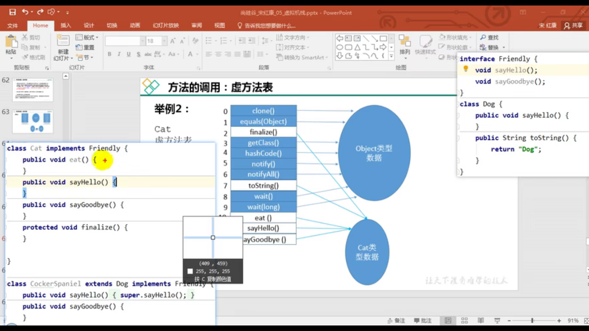

### 1.5.10  方法返回地址

方法返回地址存放着调用这个方法的PC寄存器的值


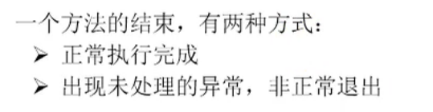


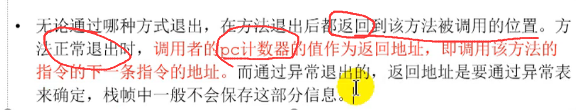


```
被调方法执行完毕。如果有返回值，并且调用者使用了返回值，则将返回值压入调用者的操作数栈。同时将被调方法中的 方法返回地址(操作系统:恢复现场【欲执行的下一条指令地址】)传递给 执行引擎。
```


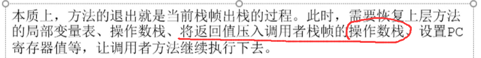


#### 1.5.10.1 返回指令

当被调用方法`正常执行`完毕后，执行【返回指令】

JVM中方法的返回指令有多个：

```
ireturn  : 当方法返回值类型是 boolean 、byte char  short  int 

lreturn  : 方法返回值类型是  long

freturn  :  float

dreturn : double

areturn : 引用数据类型

return :    void 、构造方法。
```

引入一个例子测试一下 返回指令：

```java
public class test {

    public int returnint(){
        return 1;
    }

    public char returnChar(){
        return 'a';
    }
    public short returnShort(){
        return 1;
    }
    public byte returnbyte(){
        return 0;
    }
    public boolean returnboolean(){
        return true;
    }

    public long returnlong(){
        return 2L;
    }
    public float returnfloat(){
        return 0.1f;
    }
    public double returndouble(){
        return 1.5;
    }
    public void returnvoid(){

    }
    public Integer returnInteger(){
        return new Integer(4);
    }
}
```


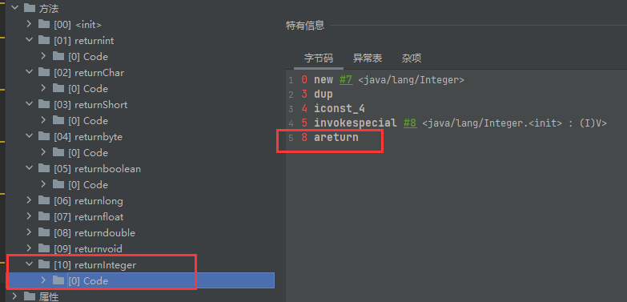


#### 1.5.10.2  异常完成出口


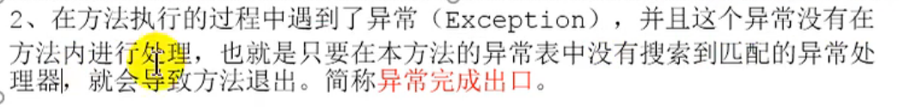

异常表是干啥的：

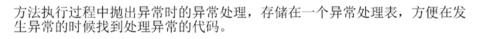


异常表的样子：


解读：

```
字节码指令第4行到16行，出现异常，就按19行的处理方式。类型是 任何
字节码指令第19行到21行，出现异常，就按19行的处理方式。类型是 任何
```


使用javap -v <.class文件名> 反编译字节码指令。

查看一下异常表

```java
public void errorTest(){
    File file = new File("abc.txt");
    try {
        FileReader fileReader = new FileReader(file);
    } catch (FileNotFoundException e) {
        e.printStackTrace();
    }
}
```

找到.class文件地址

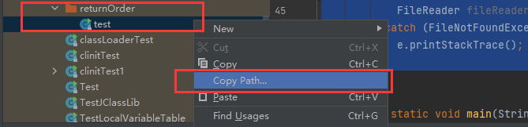

反编译

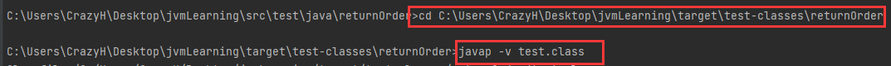


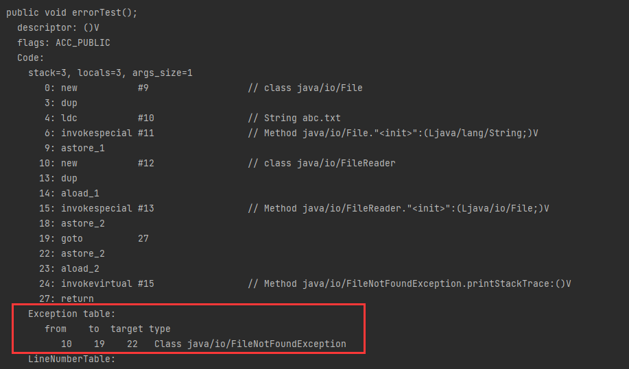


### 1.5.11  一些附加信息


### 1.5.12  虚拟机栈 面试题

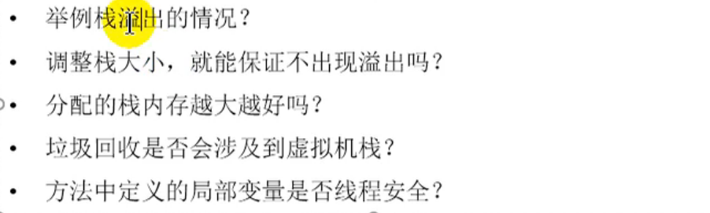

```
1栈溢出抛出stackOverFlow异常。自己调用自己，导致栈溢出。总之改变出口条件，让方法调用足够多。超过了栈的大小即可。栈大小可以固定，也可以自动扩容，但不能超过主机内存大小。否则抛出 OutofMemory 异常

2调整栈的大小，能让在栈帧大小不变的情况下，更多的容纳栈帧的数量。但不能改变逻辑错误导致溢出。

3不一定，分配过多内存，浪费资源。


4，不会。虚拟机栈不存在GC


5 不一定。基本数据类型的变量是栈帧私有的，是线程安全的。大部分引用数据类型在局部变量表里是引用。存放在堆里的，是线程不安全的。还有一些线程安全的类，例如concurrentHashTable，是线程安全的
```


承接第4题

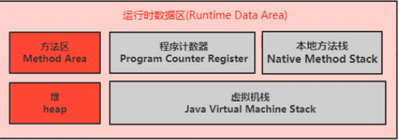

|            | error（异常） | GC（垃圾回收） |
| ---------- | ------------- | -------------- |
| 程序计数器 | 不存在        | 不存在         |
| 虚拟机栈   | 存在          | 不存在         |
| 本地方法栈 | 存在          | 不存在         |
| 堆         | 存在          | 存在           |
| 方法区     | 存在          | 存在           |
|            |               |                |

方法区：存的一些生命周期比较长的类信息。.class 类，如果jar包加的过多，是有可能内存溢出的。


## 1.6 本地方法接口

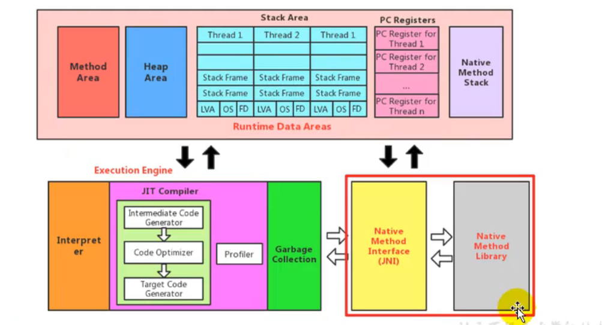

### 1.6.1 什么是本地方法

被 native 关键字修饰的方法。就是 本地方法。

本地方法的实现，是由C语言写的。在java层面看不到具体代码


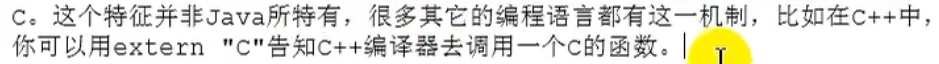

本地接口作用：

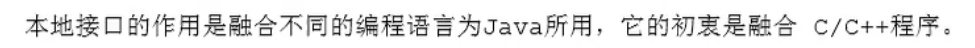


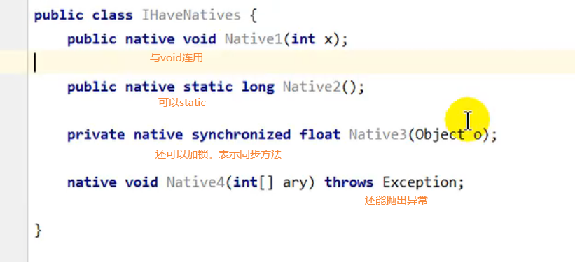


### 1.6.2 为什么要使用native

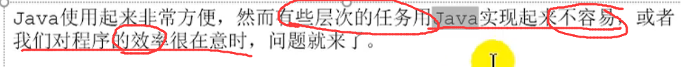

#### 1.6.2.1 与java环境外交互


例如与C交互

#### 1.6.2.2 与操作系统交互

JVM也会依赖于底层的操作系统。

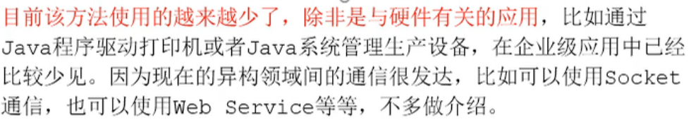


### 1.6.3 本地方法栈


是`线程`私有的。

本地方法栈的大小可以固定，也可以扩展。存在StackOverFlow 和OutofMemery 异常。


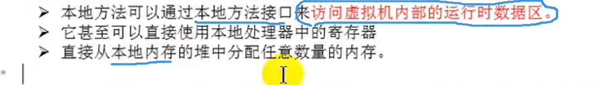


#### 1.6.3.1 不是所有的jvm都支持本地方法


## 1.7 堆

`堆区`是 `运行时数据区`的一个重要部分。主要存放着 `Runtime`的对象。


一个`Java进程`  对应  一个`JVM实例`。


`堆区`是各个线程之间共享的，这意味着对象的分配需要考虑`线程安全`的问题。


### 1.7.1 堆的核心概述


#### 1.7.1.1 一些知识点


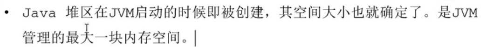


​				几乎所有的【对象】都在`堆`上分配，但是仍然可能会在【栈上分配】 。经过逃逸分析后的对象，可能会在栈上分配。


不需要的对象并不会被立即清除，而是等到下一次GC的到来才会清除。


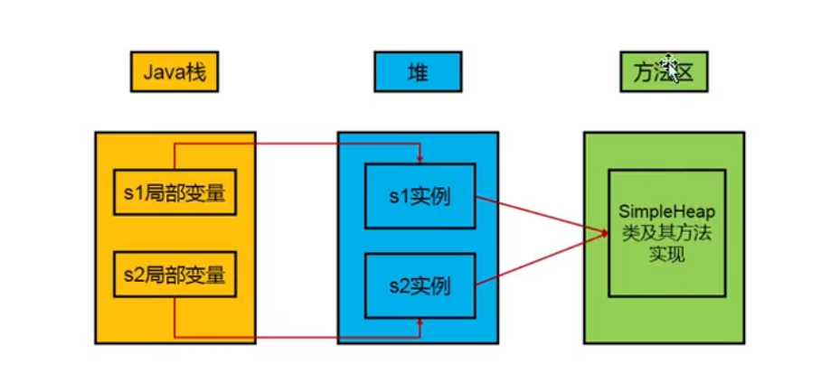

```
在java栈下的栈帧下的局部变量表。存放着引用对象的地址。

对象实际存放在堆中。

而这个对象属于哪个类，类中的方法是怎么定义的？存放在方法区中。
```


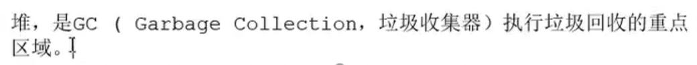

有时也会回收方法区。

````
频繁的GC将会影响用户线程，因为在GC的时候，会发生STW
````


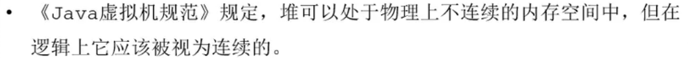


虽然线程共享堆区。但堆中仍包含了 线程私有的缓冲区， 称之为 `TLAB` 。


#### 1.7.1.2 `TLAB`	

`Thread Local Allocation Buffer`

它存在的意义是。总是用同步方法（锁）处理线程共享问题，并发性太差。所以在堆区中开辟一部分区域作为线程私有


在`eden`区开辟一小块区域，为线程私有，快速分配小对象。


### 1.7.2 堆内存细分

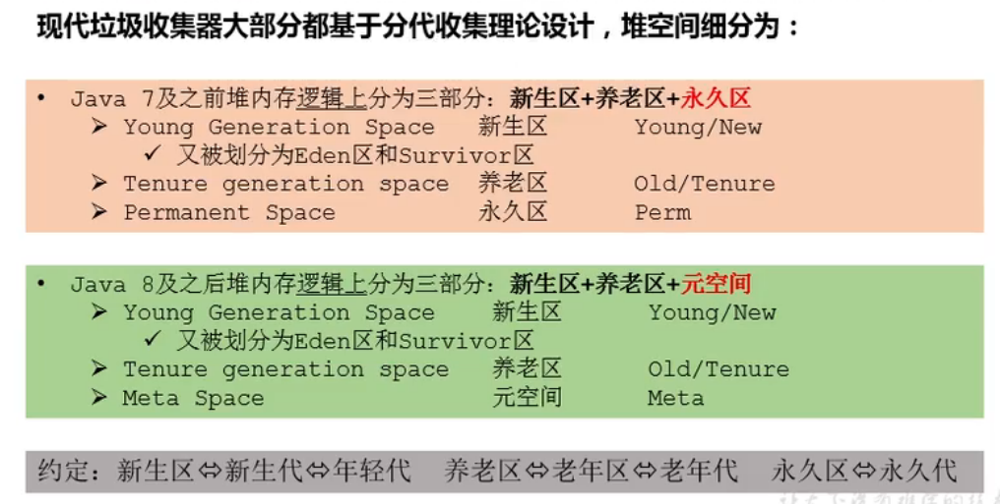


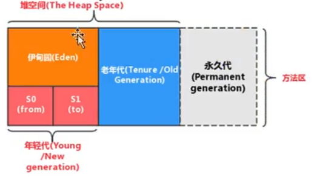


```
jdk8以后
逻辑上堆空间分为：  新生代 老年代 元空间

新生代 ： 伊甸园区 幸存者0区 幸存者1区
```


#### 1.7.2.1 JVisualVM

设置堆空间最小最大都为10M

```
-Xms10m -Xmx10m
```


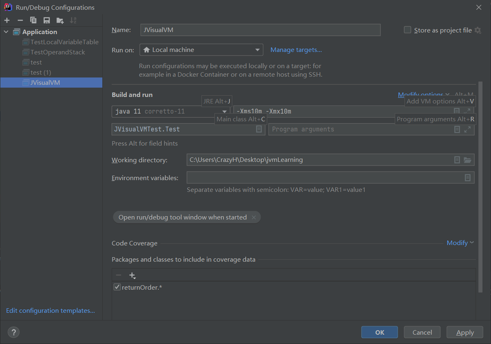


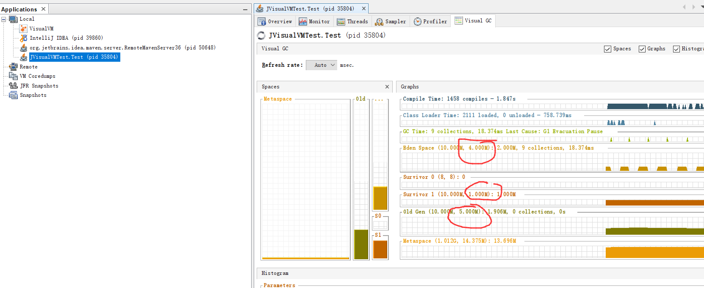

```
伊甸园区+幸存者0区+幸存者1区 刚好等于10M

正好说明不包括元空间。元空间逻辑上属于堆。具体实现在方法区
```


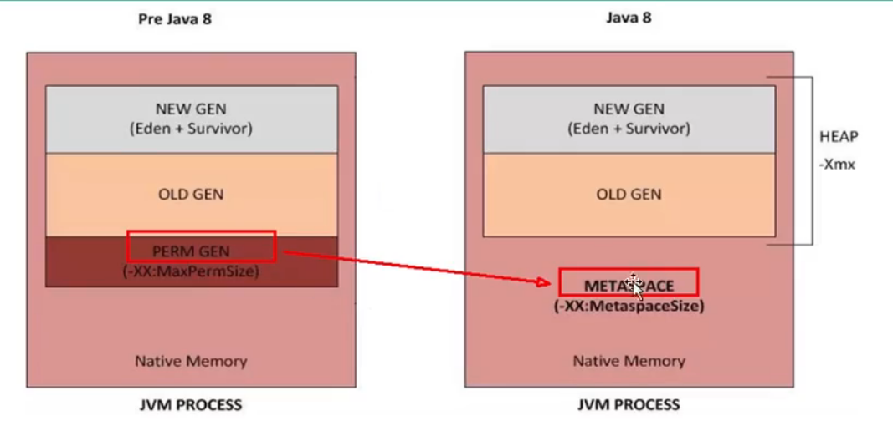


VM Options

```java
-XX:+PrintGCDetails   //console打印输出GC信息	

-Xms10m  //堆空间初始
-Xmx10m  //堆空间最大
```


### 1.7.3 设置堆空间大小

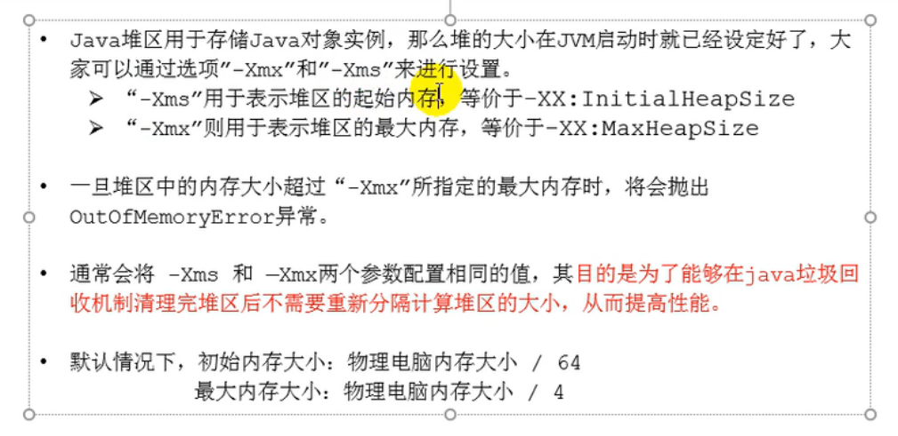


#### 1.7.3.1 查看堆内存大小

使用Runtime类

```java
Runtime runtime = Runtime.getRuntime();
long l = runtime.totalMemory();
long l1 = runtime.maxMemory();

System.out.println("totalMemory : "+l +"B");
System.out.println("maxMemory : "+l1 +"B");


System.out.println("当前堆内存 : "+l/1024/1024 +"M");
System.out.println("最大堆内存 : "+l1/1024/1024 +"M");
```

使用命令行

```dockerfile
jps  #输出所有java进程

jstat -gc <PID>  #查看进程号为<PID>的GC情况

jinfo -flag <flagName> <PID> #查看指定进程 的 指定参数
#实例 jinfo -flag UseTLAB
```

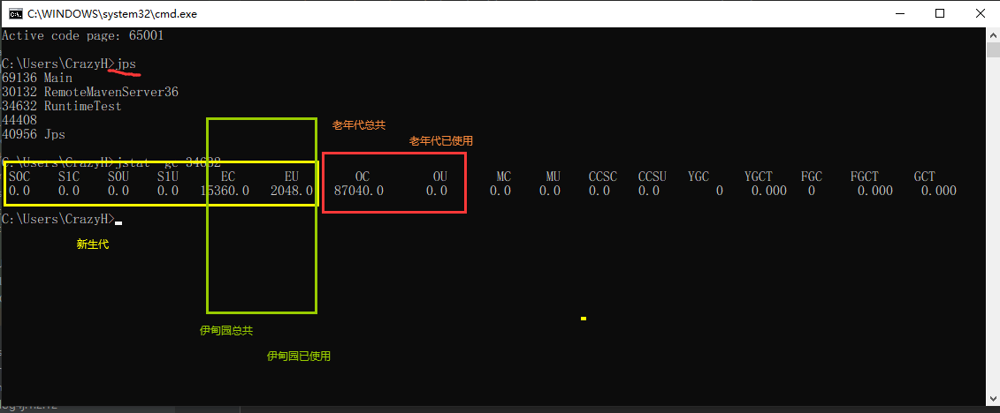


实际能使用的区域是  伊甸园区+幸存者0/1区其中的一个。另一个是为垃圾回收使用。


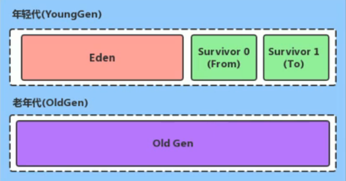


#### 1.7.3.2 调整新生代、老年代比例

以生命周期考量java对象，可以把对象分为2类：

​			1.   生命周期较短。这类对象创建和凋亡都相对迅速。一开始存放在年轻代

  		2.  生命周期较长。 有些极端的对象生命周期可能是jvm级别的。


对生命周期较长的对象。询问它GC的结果，总是否。这会浪费性能。所以需要把较长生命周期对象移入老年代，适当减少对老年代对象GC的询问。


VM options

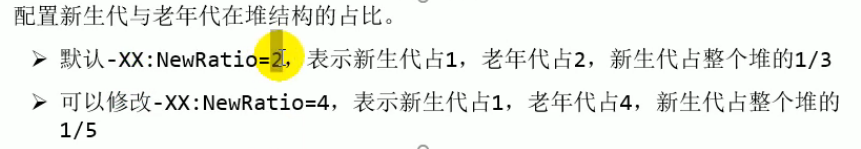

```
-XX:NewRatio=2     // 新生代：老年代=1：2
-Xmn100         //显式指定新生代大小。优先级比-XX:NewRatio=2高
-XX:SurvivorRatio=8 //幸存者区：伊甸园 = 1：8
```


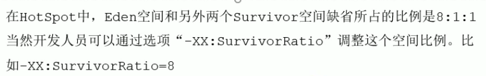


如果new的对象非常大。eden区放不下

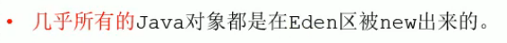


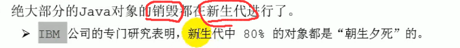

由上可知，通常对老年代对象频繁GC是低效的。


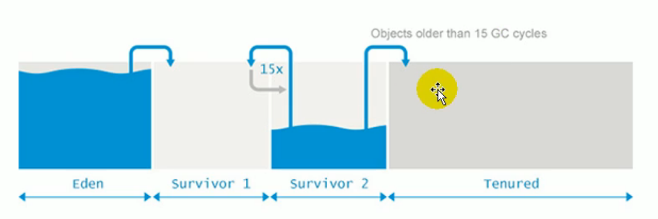


### 1.7.4 对象创建过程


#### 1.7.4.1 通常情况

```
幸存者0区/1区 其中一个称为from 另一个称为to 。

谁是from，谁是to不是固定的，会发生改变。

几乎所有的对象创建都在伊甸园区。

当伊甸园区满了以后，会触发 YoungGC /Minor GC
（YGC会回收 伊甸园区+from区。但from区满了并不会触发YGC，仅Eden满触发）
```


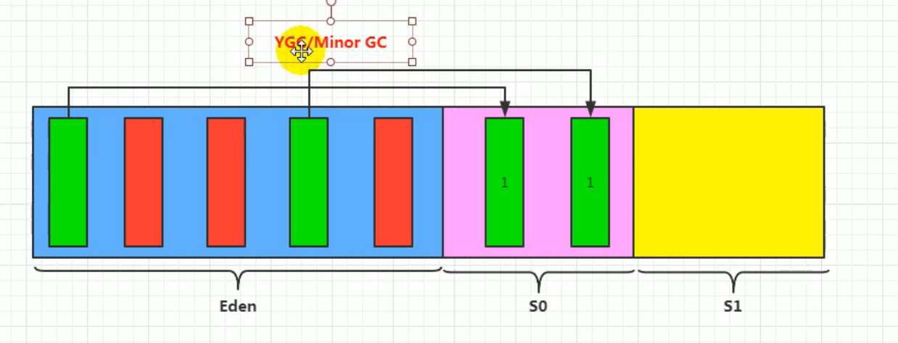

```
YoungGC会把【没有引用指向的对象】回收。未被回收的对象存入to区。
```


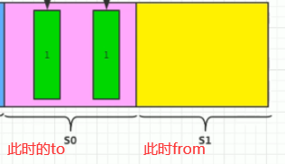

```
每个对象存在一个 年龄寄存器。存入to区后，年龄+1

存入对象后。from/to互换


```


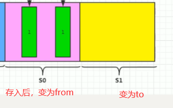

```
当伊甸园区再次满了以后，触发第二次YoungGC。

YoungGC会把 伊甸园+from区的【没有引用指向的对象】回收，未被回收的对象赋值一份到to区，未被回收的对象age+1
```


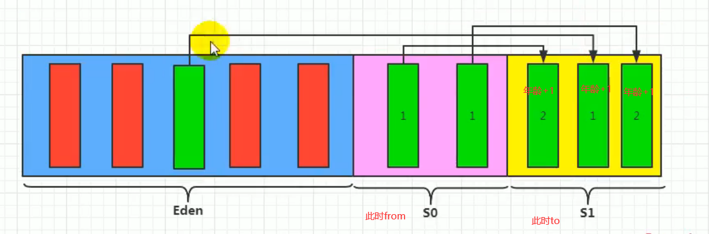


```
这次YGC执行完毕后，from区又会空出来，成为新的to区（to区总是空的）。
```


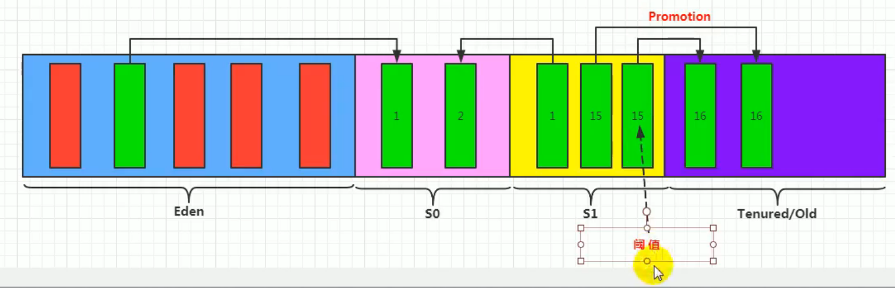


```
当对象的age打到阈值（默认是15）时，就会被移入 老年代（老年区）

可以通过 VM Options
-XX:MaxTenuringThreshold=<N> // 设置阈值
```


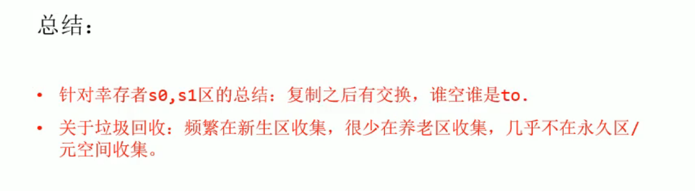


程序流程图

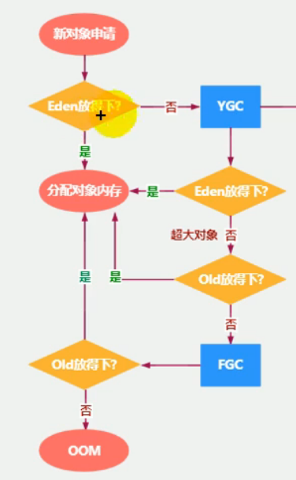


其中YGC的详细流程图

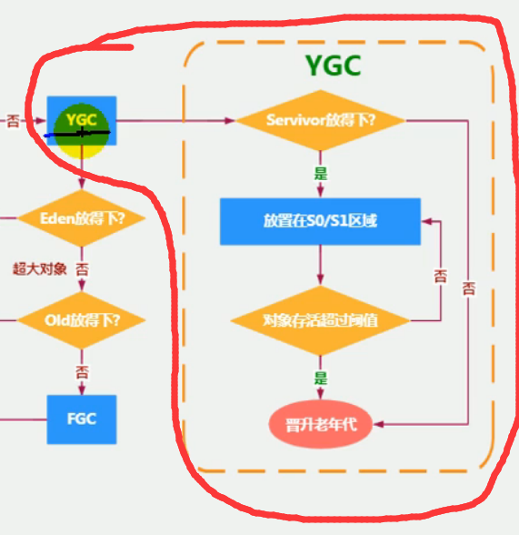


完整：

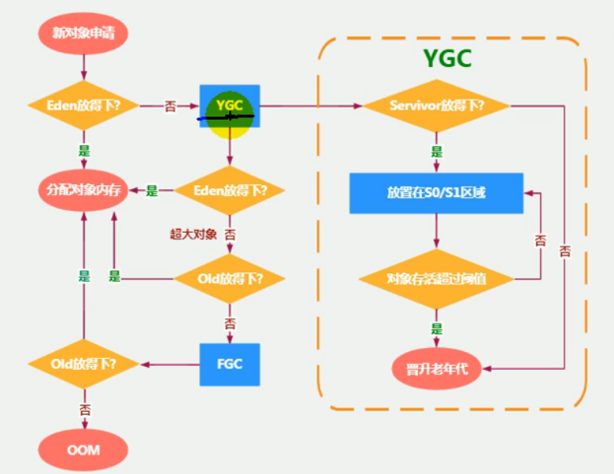


#### 1.7.4.2 特殊情况

1.to区装不下更多的对象，对象仍未到达年龄阈值。也会晋升为老年代。

2.有超大对象申请时，YGC过后，伊甸园区仍不够。或者干脆直接比伊甸园区最大容量还大。对象会尝试直接分配在老年代。如果老年代此时空间不够。将会触发fullGC。FGC过后，空间仍然不够，就会抛出OutOfMemoryError

### 1.7.5 常用调优工具

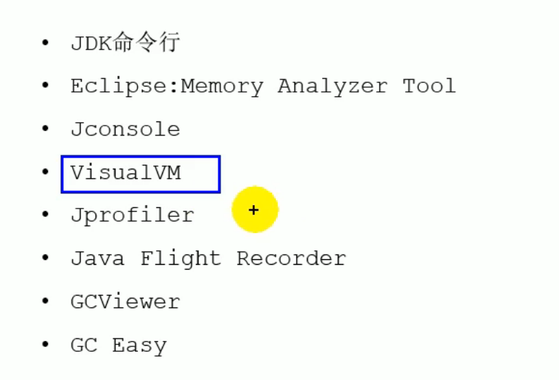


### 1.7.6 Minor GC 、Major GC 、Full GC


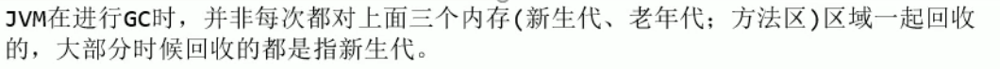

```
新生代 老年代  永久代（jdk8元空间；具体实现在方法区）
```

#### 1.7.6.1 部分收集，整堆收集

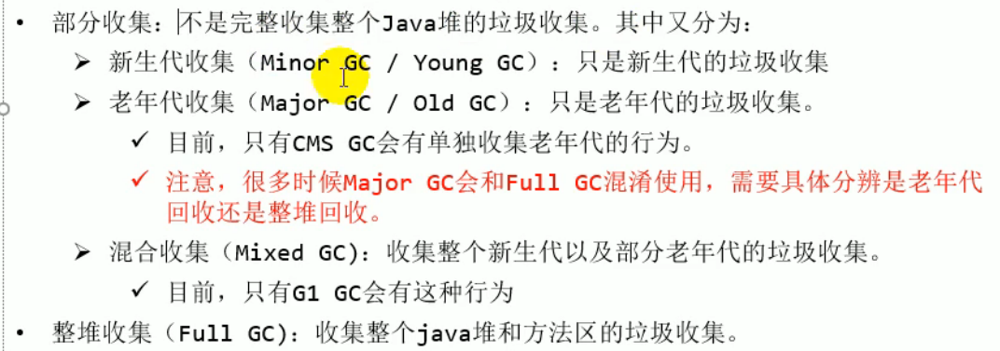

```
CMS GC  并发的，垃圾回收器
```


#### 1.7.6.2 Minor GC 

当【新生代】下的`eden区`满了，会触发`Minor GC`。对整个新生代进行垃圾回收，会引发 `STW`(stop the work)使用户线程等待。

垃圾回收结束后，用户线程才能恢复。Minor GC相较于其他GC 执行较快。


#### 1.7.6.3 Major GC

```
发生在老年代的GC,Major GC
```

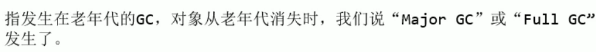


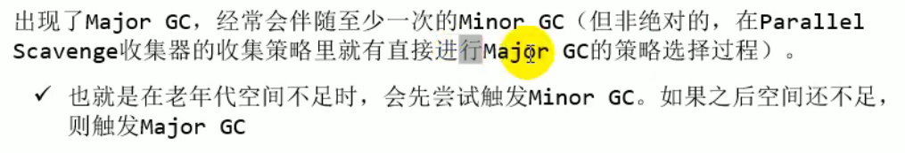


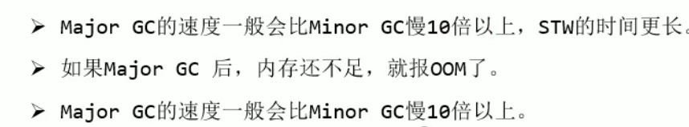

```
频繁的Major GC，将会影响用户性能
```


#### 1.7.6.4 `Full GC`

##### 1.7.6.4.1 触发 `Full GC` 的情况

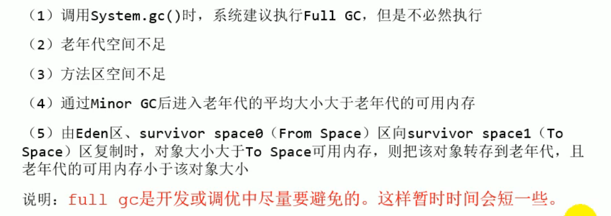


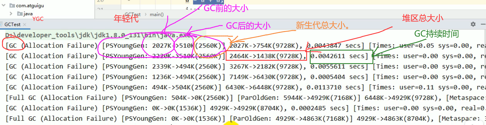


#### 1.7.6.5 堆空间分代思想


为什么要把 `堆区`分代？

我们总是希望提高 `GC`的效率，总是希望以稍短的时间内回收较多(并不是一次就回收全部)的垃圾。

对象大致可以分为两类： 【朝生夕死】 ， 【持续很长时间】

把`堆区`分成两代： 【年轻代】 【老年代】。

大多数生命周期短的对象都集中在年轻代，而生命周期长的对象在老年代，此时我们主要频繁的回收年轻代即可。


```
大部分回收掉的对象都在新生代。老年代也是新生代多次回收失败，晋升进去的生命周期较长的对象。对这类对象频繁的GC无疑会严重浪费性能。对内存的回收，还会使用户线程停止工作。
```


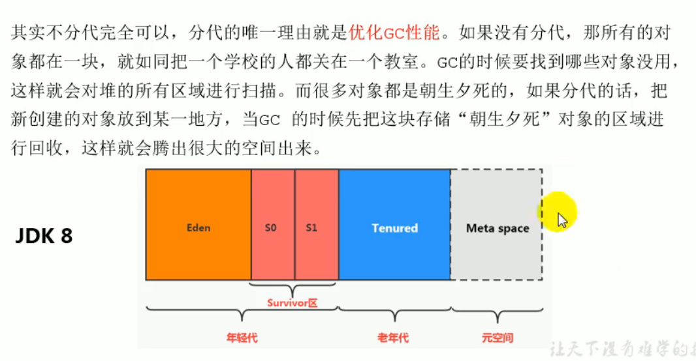


### 1.7.8 内存分配策略

在堆区内分配对象的策略。


#### 1.7.8.1 对象提升策略 Promotion

通常情况，年轻代的对象通过 【年龄计数器】，从年轻代晋升老年代。


`Eden区`中的对象，每经历过一次`MinorGC` 对象头中的年龄+1，当超过`阈值 MaxTenuringThreshold`时，晋升到老年代。

默认阈值`15`。


对象分配原则：

1. 优先分配到`Eden区`
2. 老年代作为大对象分配担保（超过`Eden`直接分配到老年代）


```
大对象： 需要大量的内存空间。通常还需要一大片连续的存储空间。

很有可能 伊甸园区都装不下大对象，所以直接分配给老年代。
除此以外，就算伊甸园区装得下。大对象也必将占用伊甸园区大量的空间。导致频繁触发YGC，影响性能。因此更应该直接分配到老年代。
```


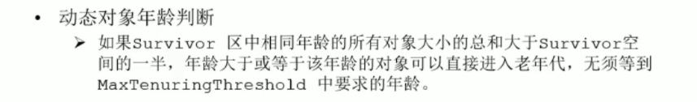

```
躲过YGC的对象，会被装入幸存者区。对于年龄阈值15来说，可能有一大批对象（超过幸存者区一半空间）年龄为5。他们占据了大半的幸存者区的空间。
所以，超过此时幸存者区平均年龄的对象，就为他们优先提升到老年代。
```


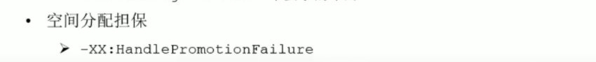


#### 1.7.8.2 引入一个例子

代码演示 ： 大对象直接分配给老年代（超过了新生代区的大小）

```java
/***
 * 测试一下  大对象 直接分配给老年代（超过了新生代区的大小）
 *
 * 需要修改虚拟机参数
 *
 * -Xms60m -Xmx60m -XX:+PrintGCDetails -XX:NewRatio=2 -XX:SurvivorRatio=8
 * 堆内存最小60   堆内存最大60m  打印GC细节   新生代：老年代=1：2      幸存者区：新生代=1:8
 *
 *        新生代20m              老年代40m
 * =======================================
 * |                   ||                 |
 * |     伊甸园16m      ||                 |
 * |                   ||                 |
 * | ------------------||                 |
 * |     S0 2m         ||                 |
 * |  ---------------  ||                 |
 * |     S1 2m         ||                 |
 * ========================================
 *
 *
 */
public class TestHugeObject {

    public static void main(String[] args) {
        byte[] bytes = new byte[1024 * 1024 * 20]; //20M的大对象。新生代放不下
    }
}
```

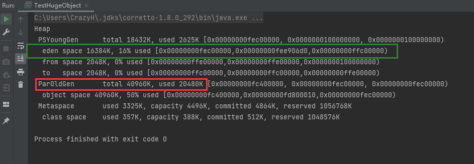

```
老年代 使用了 20480K 20M就是我们new的byte[]对象。
并且上方没有任何GC信息。bytes对象直接就被分配到了老年代。
```

### 1.7.9 `TLAB`

`TLAB` 指 `Thread Local Allocation Buffer`


#### 1.7.9.1 什么是TLAB

Thread Local Allocation Buffer


```
线程私有
在伊甸园区内
```

图解是这样的：

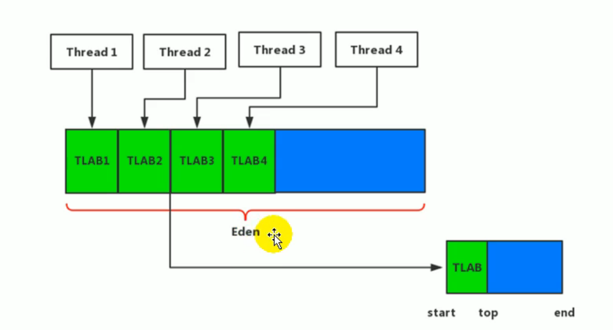

#### 1.7.9.2 为什么要有TLAB

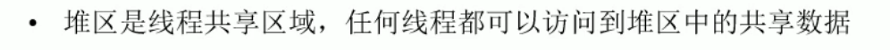

```
好处是，多个线程共享数据都从堆空间中取。比较方便
```

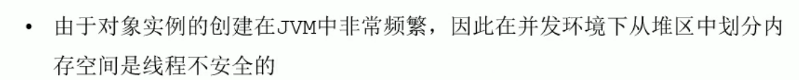

对同一个对象（同一地址）使用，可能会有线程通信问题。需要加锁等通信策略

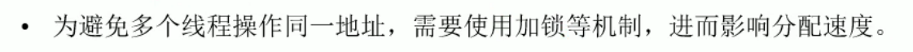

#### 1.7.9.3 使用TLAB的好处

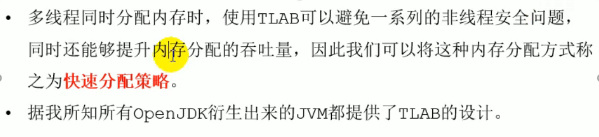


#### 1.7.9.4 TLAB 细节

##### 1.7.9.4.1 TLAB 很小：

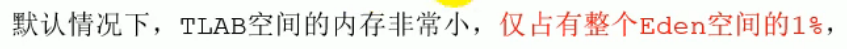

```
TLAB适合存一些小的，频繁写操作的,快速分配的变量。
```

##### 1.7.9.4.2可以通过VM参数修改开启/修改大小：

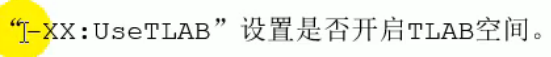


```dockerfile
jinfo -flag <flagName> <PID> #查看指定进程 的 指定参数
#实例 jinfo -flag UseTLAB
```

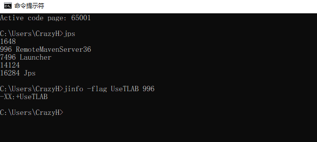


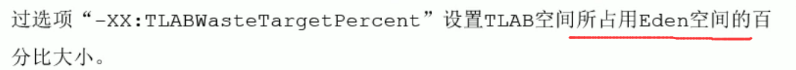

##### 1.7.9.4.3 是线程内存分配的首选：


TLAB装不下：

B：buffer 缓冲，目的就是为了快速分配。

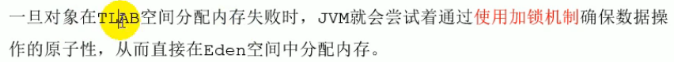

```
一旦使用加锁机制。就得去和其他线程竞争锁的使用权，势必会带来一定时间开销。随着线程数增多，随着线程写操作增多 ，这种开销加剧
```

分配流程图


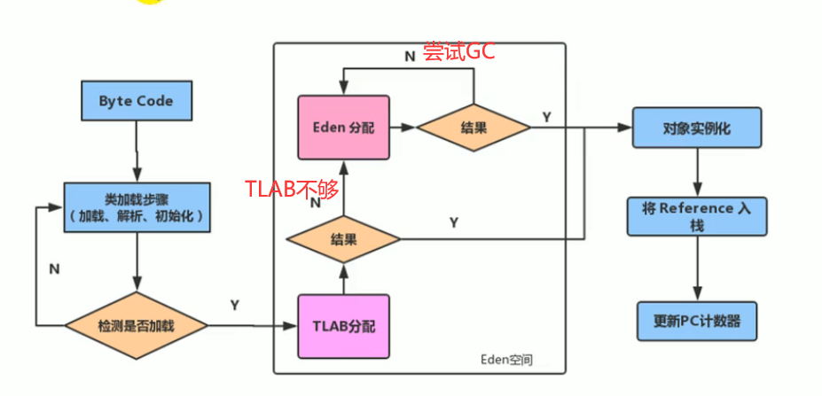


#### 1.7.9.5 面试题


##### 1.7.9.5.1 堆空间一定都是共享的吗？

不是。

```
堆的伊甸园内，存在线程私有的TLAB区域。

TLAB很小，目的是高效的快速分配一些小的，频繁写的对象。不需要线程之间通过锁机制来控制对象的写
```


##### 1.7.9.5.2堆空间是分配对象的唯一选择吗？

```
不是，存在一部分对象分配在栈上。

哪些对象？经过逃逸分析后，未发生逃逸的对象。
```

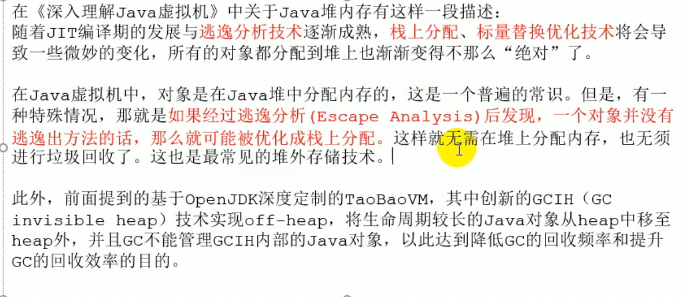


###### 1.7.9.5.2.1 `逃逸分析`

`逃逸分析` 决定了 是否将一个堆上的对象分配到栈上。

将对象在栈上分配可以加快对象分配速度， 方法退出弹栈，对象自然释放。


`逃逸分析`界定了什么？ 对象的动态作用域。

```
当一个对象在方法中被定义后，它可以能被外部方法所引用，例如作为调用参数传递到其它地方种，称为【方法逃逸】。

甚至还有可能被外部线程访问到，譬如赋值给类变量或者可以在其它线程中访问的实例变量，称为【线程逃逸】。
```


如果一个对象被定义后，只在本方法内使用，则没有发生逃逸，可以使用`栈上分配`。


```java
如果对象，没有逃逸。就使用栈上分配。（因为这个对象严格为这个方法服务。其他地方不需要使用它。）

例如：

public void myMethod(){
	V temp = new V();
	// Use v
    // ...
    temp = null;
}


```

```
temp就没有逃逸
```


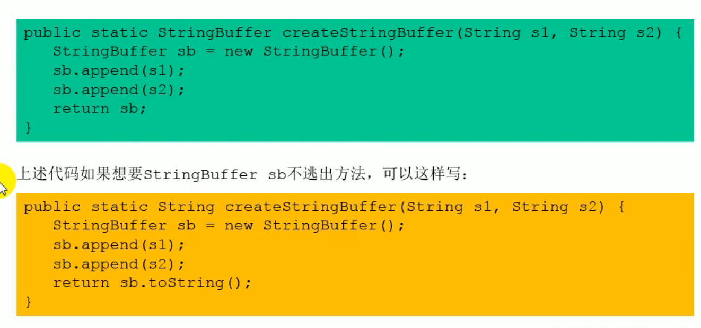

```
逃逸了
```


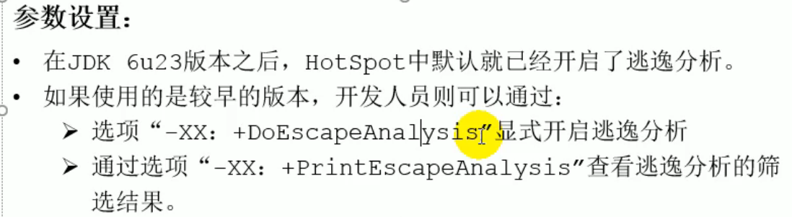

```
通过逃逸分析。直接在栈上分配对象。
```

###### 1.7.9.5.2.2 引入一个实例感受一下逃逸分析

```java
/***
 *
 * 设置虚拟机参数
 * 开启逃逸分析：
 * -XX:+DoEscapeAnalysis -XX:+PrintGCDetails -Xms=1G -Xmx=1G
 *
 * 未开启逃逸分析：
 * -XX:-DoEscapeAnalysis -XX:+PrintGCDetails -Xms=1G -Xmx=1G
 */


public class test {
    public static void main(String[] args) {
        long start = System.currentTimeMillis();
        for(int i = 0;i<10000000;i++){
            newPerson();
        }
        long end = System.currentTimeMillis();
        System.out.println(end -start+"ms");
    }
    static private void newPerson(){
        Person person = new Person(); //未发生逃逸
    }
}
```


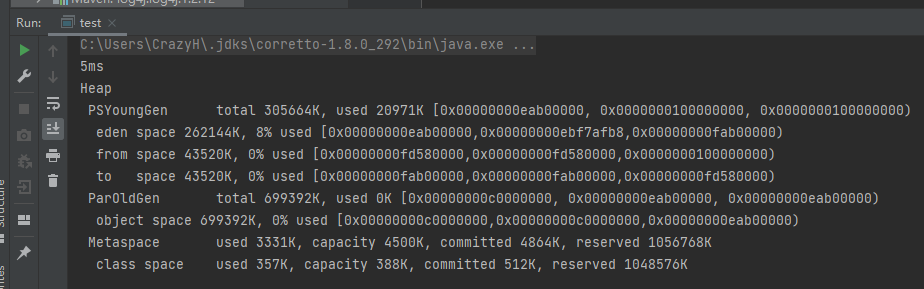

```
开启逃逸分析后，创建 一千万个Person对象，花费5ms

```

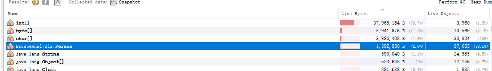

```
让线程睡眠。
在JVisualVM里，也可以看到 维护的对象远远小于1千万个。说明栈帧退出，同时对象也凋亡了。
```


关闭逃逸分析

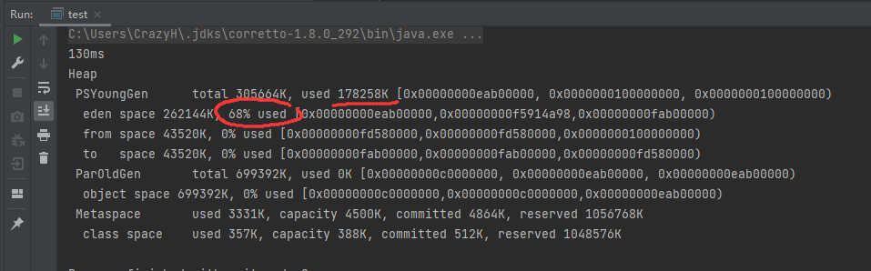

```
未开启逃逸分析，分配时间是130ms，30倍的差距。
同时可以看到，对象被分配到了 新生代的伊甸园区
```

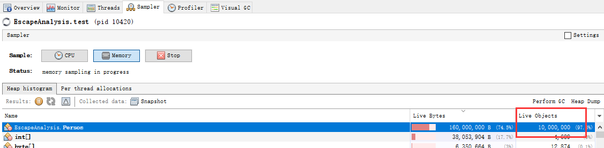

```
让线程睡眠。
在JVisualVM里，也可以看到 维护了1千万个对象
```

```
因为 开启逃逸分析后，对象可能会被分配到栈上。不会占用堆的空间，所以不会引发GC问题，不会发生STW，用户线程不会停止工作。效率提升。

现在将堆空间减小。查看GC的情况
```

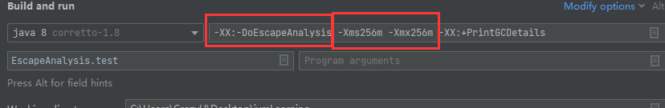


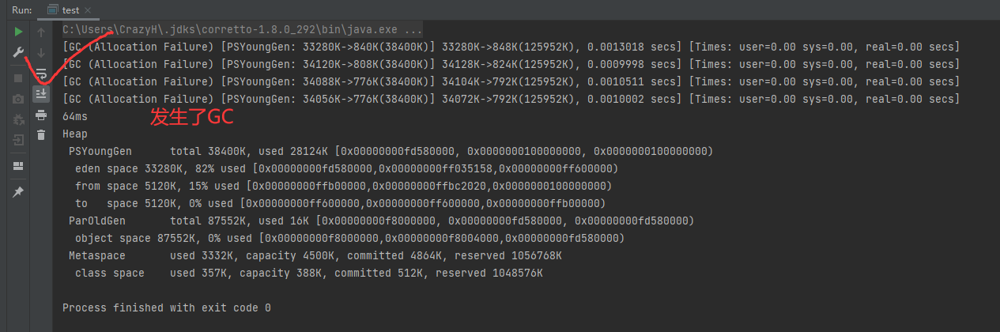


###### 1.7.9.5.2.2逃逸分析后进行的优化

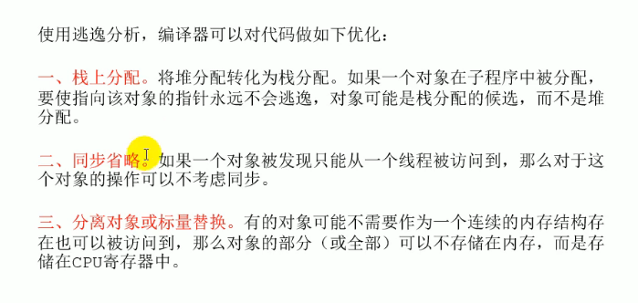


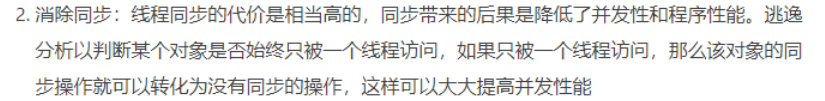

想要理解同步消除，就先要了解.java文件的编译过程：

```
在Java的编译体系中，一个Java的源代码文件变成计算机可执行的机器指令的过程中，需要经过两段编译
第一段是把.java文件转换成.class文件。（ 直观上看就是 javac命令）
第二段编译是把.class转换成机器指令的过程。


在第二编译阶段，JVM 通过解释字节码将其翻译成对应的机器指令，逐条读入，逐条解释翻译。很显然，经过解释执行，其执行速度必然会比可执行的二进制字节码程序慢很多。这就是传统的JVM的解释器（Interpreter）的功能。为了解决这种效率问题，引入了 JIT（即时编译） 技术。

引入了 JIT 技术后，Java程序还是通过解释器进行解释执行，当JVM发现某个方法或代码块运行特别频繁的时候，就会认为这是“热点代码”（Hot Spot Code)。然后JIT会把部分“热点代码”翻译成本地机器相关的机器码，并进行优化，然后再把翻译后的机器码缓存起来，以备下次使用。

```

读了上面的描述：

```
JIT 发生在.class文件 -> 机器指令 阶段。
JIT 缓存了热点代码。存储了与本地机器相关的热点代码对应的机器指令
```

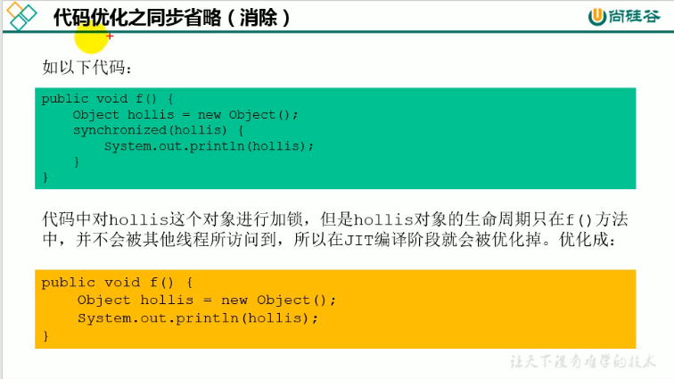


###### 标量替换

阅读

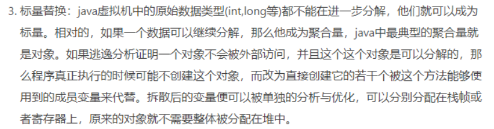


```
原始数据指：  基本数据类型

标量： 指不能继续分解的类型。也就是java中的基本数据类型。

聚合量： 可以被继续分解的。
```


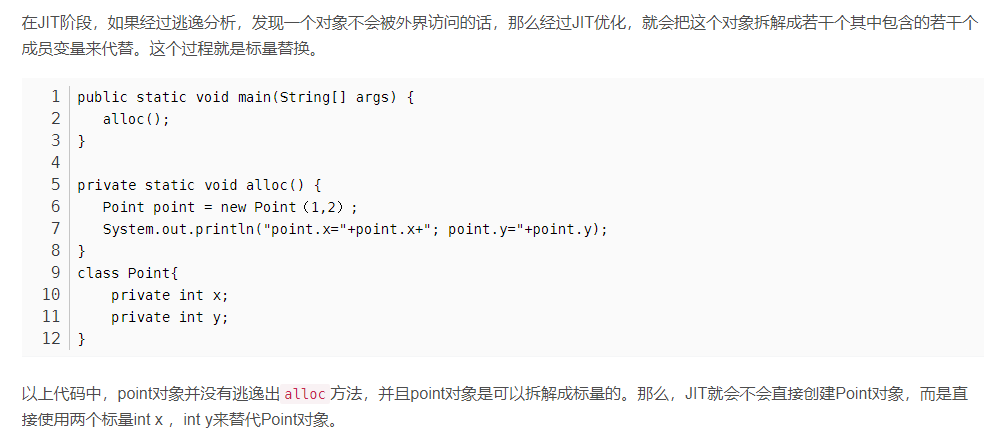

开启标量替换后，alloc方法就等价于：

```java
private static void alloc(){
	int x = 1;
	int y = 2;
	System.out.println("x="+ x +"; y="+y);
}
```


```
Point这个聚合量经过逃逸分析后，发现他并没有逃逸，就被替换成两个聚合量了。
标量替换以后，可以大大减少堆内存的占用。只要在堆上分配空间，就需要考虑锁的问题，就会带来开销。
不需要创建对象，就不需要在堆上分配内存。就会减小开销。
（基本数据类型在栈帧中，是复制一份。）

所以标量替换为栈上分配提供了很好的基础。
```


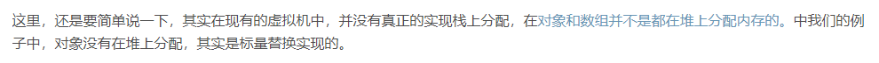

```
也就是说，事实上现有的jvm中，并没有真正实现栈上分配对象（为对象分配内存）。而是通过标量替换技术，把欲分配在栈上的对象分解成标量（为标量分配内存）。
```

逃逸分析技术并不成熟，因为：

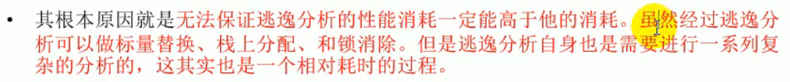

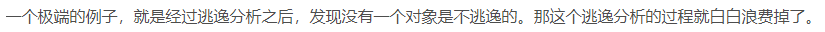


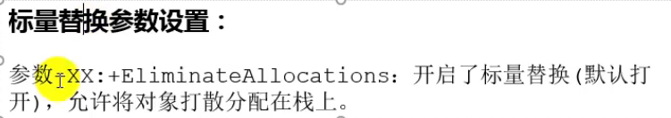

```
-XX:+EliminateAllocations  //开启标量替换
```


###### 标量替换的实例

下面引入一个例子，体验一下，开启标量替换后的效率。

```java
/**
 *
 * -Xms100m -Xmx100m -XX:+DoEscapeAnalysis -XX:+PrintGCDetails -XX:-EliminateAllocations
 * 
 * 堆空间大小固定100m  开启逃逸分析，开启打印GC 关闭标量替换
 *
 *
 * title: 标量替换测试
 *
 */
public class ScalarReplace {
    public static class User{
        public int id;
        public String username;
    }

    public static void main(String[] args) {
        long start = System.currentTimeMillis();
        for(int i = 0;i<10000000;i++){
            alloc();
        }
        long end  = System.currentTimeMillis();
        System.out.println(end-start + "ms");
    }

    public static void alloc(){
        User u = new User();
        u.id = 1;
        u.username = "hello world";
    }
}
```

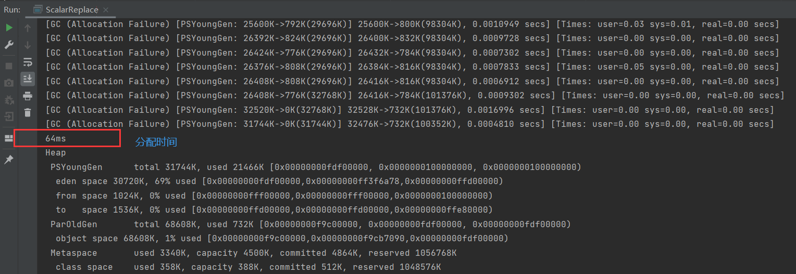

```
运行起来，发生了多次GC，说明还是分配给了堆空间
分配时间是64ms

开启标量替换
-XX:+EliminateAllocations
```

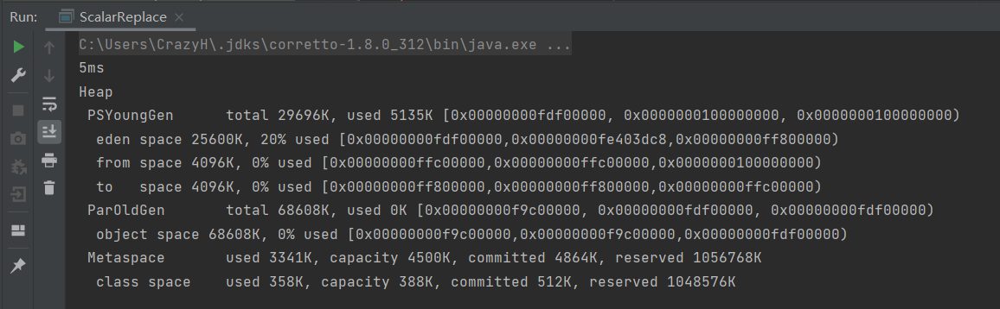

```
开启标量替换后，真正分配到栈上了，没发生GC
分配时间5ms，大大缩短分配时间

同时也认证了，Hotspot没有真正实现在栈上分配对象。而是把未逃逸的对象通过标量替换成基本数据类型后分配在栈上
```


###### 1.7.9.5.2.3  逃逸分析小结


### 1.7.10 堆空间 VM参数


Oracle 官网，JVM参数参考手册

https://docs.oracle.com/javase/8/docs/technotes/tools/unix/java.html

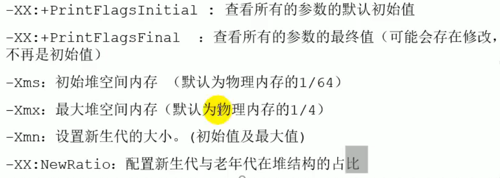

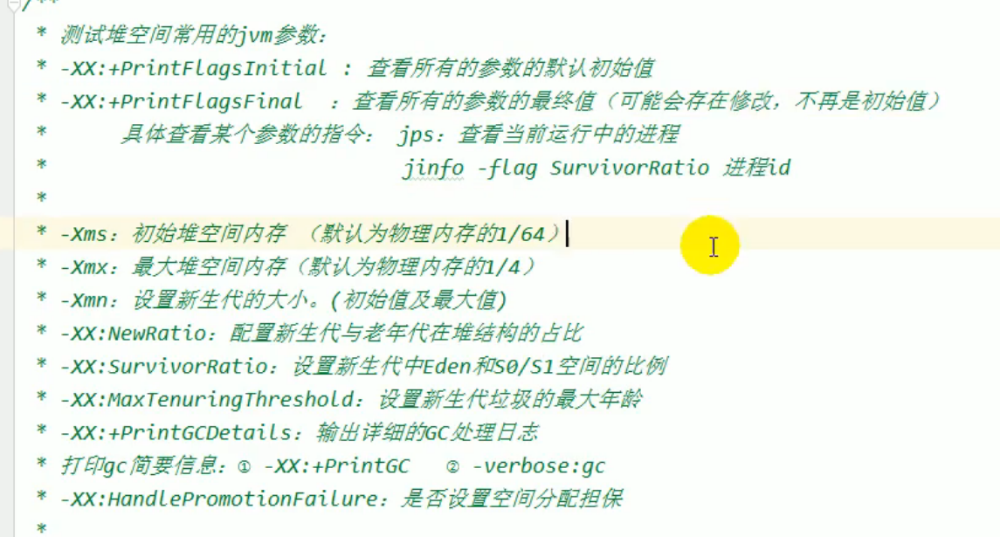


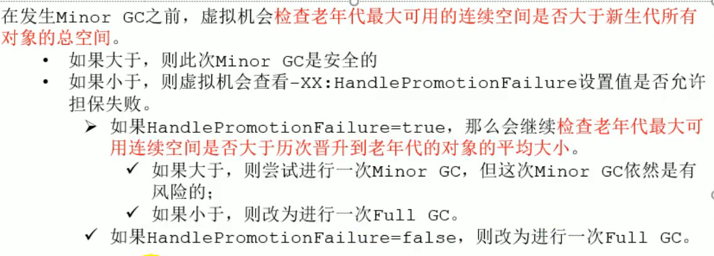

```
-XX:HandlePromotionFailure #设置 空间分配担保


MinorGC 会回收一些生命周期较短的对象后，同时会选择年龄达到 阈值
（-XX:MaxTenuringThreshold）的对象进入老年代。
对于老年代来说，最极端的一种情况，一次MinorGC可能会将此时年轻代中所有对象复制到老年代。所以，在进行MinorGC前，虚拟机会对老年代剩余空间进行检查。
如果 老年代剩余连续空间 > 新生代全部对象大小 ，那么此次MinorGC是绝对安全的，就执行MinorGC。

如果  老年代剩余连续空间 !> 新生代全部对象大小 ，则会根据
  -XX:HandlePromotionFailure 参数做选择；
  如果-XX:HandlePromotionFailure=true，只要求
  老年代剩余连续空间 > 历次年轻代晋升到老年代对象的平均值，即尝试进行一次有风险的MinorGC。
  如果干脆连平均值都达不到，那只能进行Full GC。
  
  回到上面，老年代剩余连续空间 !> 新生代全部对象大小 且 
  -XX:HandlePromotionFailure=false ,那就直接进行FullGC
```


```
HandlePromotionFailure 在jdk7以后失效。

规则变为只要满足其一 ，就尝试进行Minor GC：
1 老年代剩余连续空间 > 当前新生代所有对象总大小
2 老年代剩余连续空间 > 历次晋升平均大小（这条的核心思想是：MinorGC总是会淘汰一些失效的对象，以历次的平均值作为基准参考，在一部分情况下，并不用遵守第一条严苛的条件，也能满足要求。）
否则，进行Full GC
```

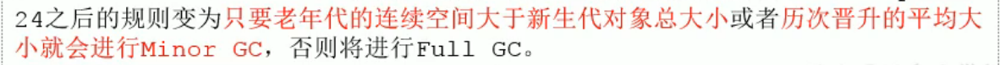


## 1.8 `方法区`


#### 1.8.1.1 运行时数据区的结构图

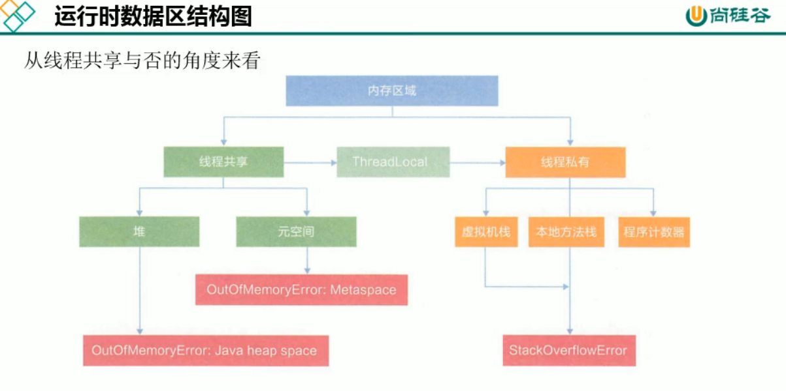

```
在jdk8以后，永久代改为元空间。
```


方法区（元空间）、堆空间、java栈三者互相配合的关系

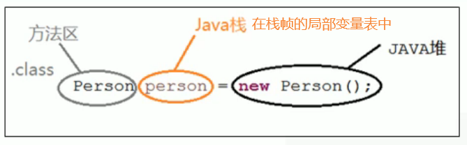


```
jdk8及以后，方法区内部图：
```

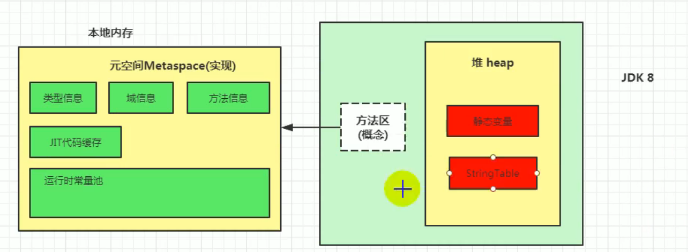


#### 1.8.1.2 方法区的基本知识点

《Java虚拟机规范》尽管方法区在逻辑上属于堆的一部分，但并没有强制要求所有虚拟机都对方法区进行垃圾回收和压缩算法。

##### 1.8.1.2.1 方法区逻辑上连续，物理上可以不连续

```
方法区在JVM启动时创建。方法区的内存，在逻辑上是连续的，在实际物理地址可以是不连续的。这点和堆是一样的
```

##### 1.8.1.2.2 方法区大小可变

```
方法区的大小可以固定，也可以按需库容、收缩。和堆也一样
```

```
方法区 和 堆 一样，是线程共享的
```


```
方法区的大小，决定了JVM能保存了多少类。如果系统定义了太多的类，导致方法区溢出，会抛出OOM。

加载大量的第三方的Jar包，就有可能溢出。
大量动态生成反射类。


关闭JVM 方法区就会释放。
```

在JVisualVm中可以查看，JVM一共加载了多少类

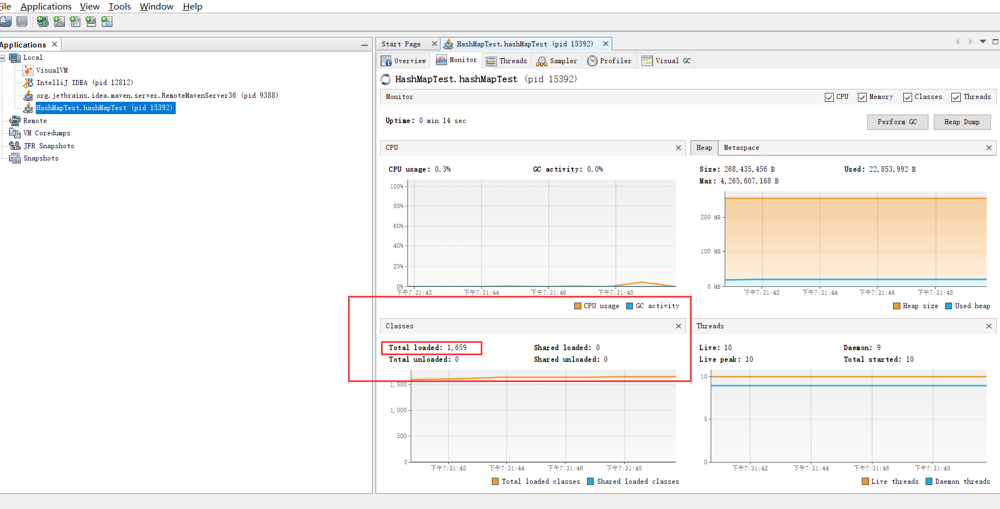


```
方法区，使用的是本地内存。非jvm内存。
如下图 《java虚拟机规范》中写道:

在JDK8中，类的元数据被储存在 native heap 本地的堆区中，这块儿区域称作 元空间。
```

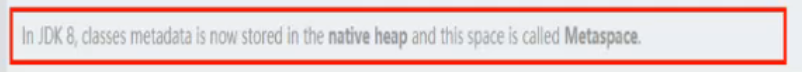


#### 1.8.1.3 Hotspot方法区的演变过程


##### 1.8.1.3.1 方法区 和 永久代

方法区 java虚拟机规范中，明确提到的概念。而永久代，是1.7以前Hotspot具体实现方法区的一种方式。

```
对于永久代这种实现方法来说，它使用的仍是JVM的内存。所以很容易导致 OOM
```

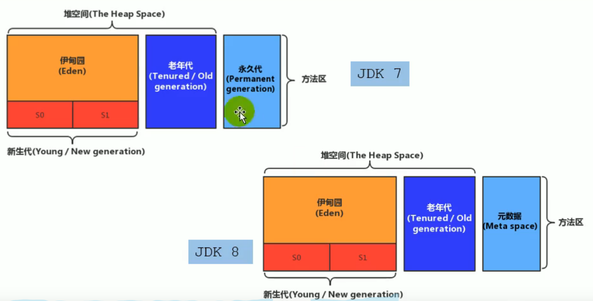


##### 1.8.1.3.2 在JDK8以后明确废除了永久代

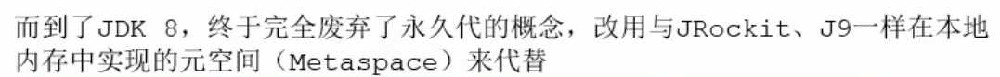

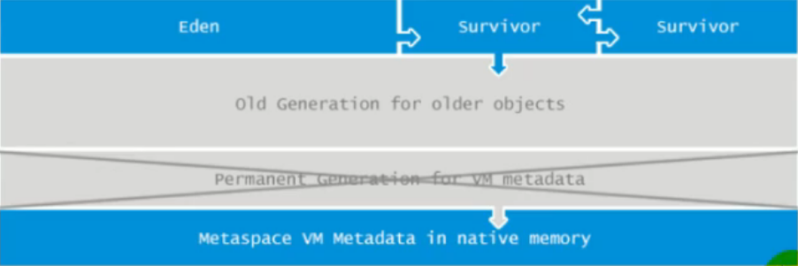


##### 1.8.1.3.3  元空间 和永久代

元空间 和 永久代最大区别就是 ：元空间使用的是本地内存空间。

除此以外，内部的结构也发生了改变。

```
这样更不容易出现OOM
```


#### 1.8.1.4  方法区参数设置

```
元空间大小设置参数
-XX:MetaspaceSize=21m   //最小
-XX:MaxMetaspaceSize=-1    //最大空间  -1表示没有限制
```


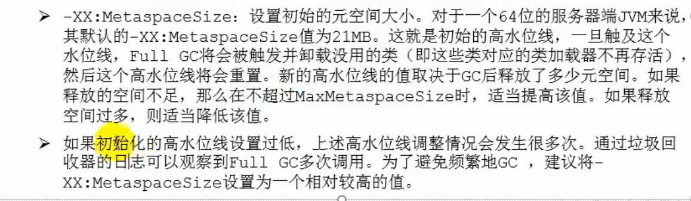


#### 1.8.1.5 如何解决OOM

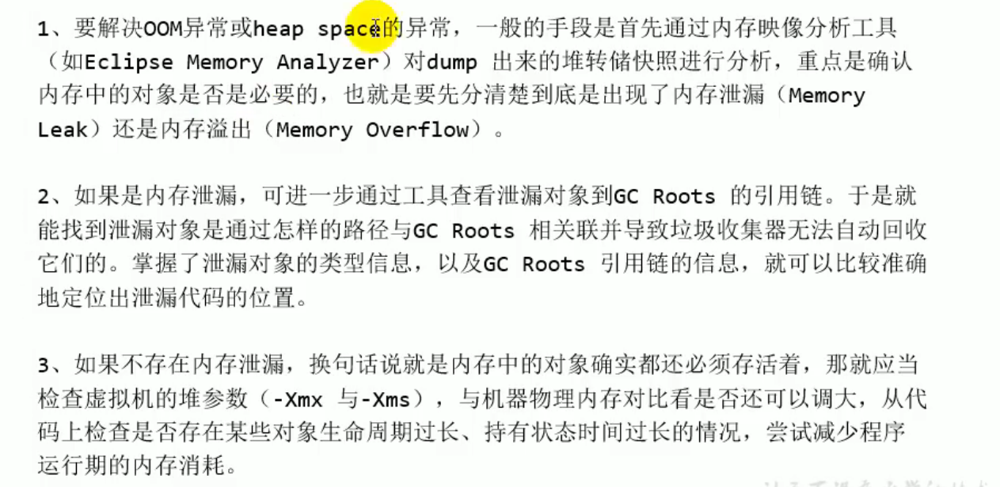


#### 1.8.1.6 `方法区`的内部结构

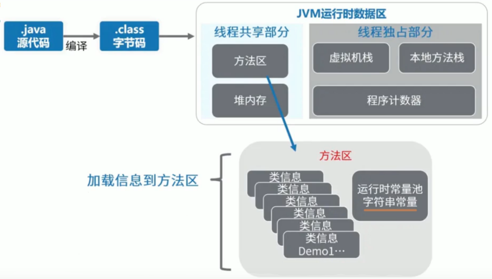

```
包含了各种类的 类信息，和运行时常量池
```


##### 1.8.1.6.1方法区存储什么信息

```
类型信息、常量、静态变量、即时编译器（JIT）编译后的代码缓存


下图的 域信息、方法信息 也可以看做 类型信息
```


```
静态变量。静态变量已经不属于任何一个实例变量了，它不存储在堆中。而是和类型信息一起，存储在方法区中。是属于类的变量。
所以，以这个角度来看，变量可以分为 实例变量 和 类变量。
```

```
JIT代码缓存。

多次被执行的java代码（默认10000次以上）会被JVM使用JIT即时编译器，编译成cpu可直接执行的二进制文件保存下来。不再使用解释器逐行解释逐行执行，加快了热点代码的执行效率。
```


###### 1.8.1.6.1.1 类型信息

类型信息包括什么？

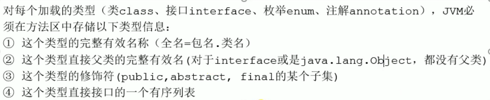

```
类型(接口/类/枚举/注解)
全类名 
直接父类全类名
类的修饰符
实现直接接口的有序列表
```


###### 1.8.1.6.1.2 域信息

也就是字段、也就是成员变量。

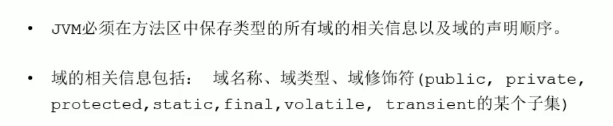

```
也就是必须保存，类中成员变量的   名称、 修饰符、类型
```

###### 1.8.1.6.1.3 方法信息

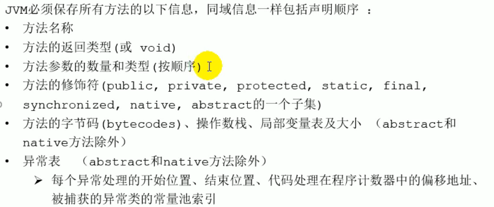


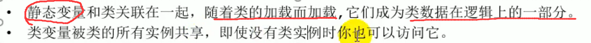


被final 修饰的变量 且编译前 就被被声明了值的，在编译后，编译器就为其解析一个常量值(ConstantValue),普通的静态变量则没有。如下图：

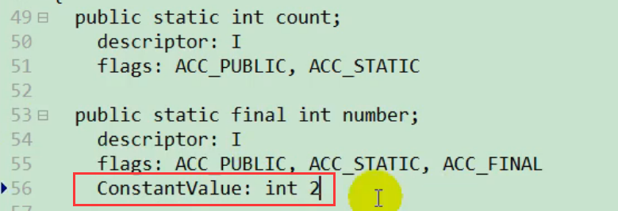


```
count 被赋值为1
str 被赋值为“a”
```

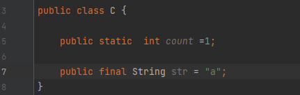

```
字节码文件如下：
```

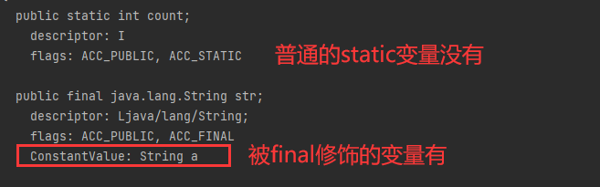


```
如果编译前不能确定final变量的值
```

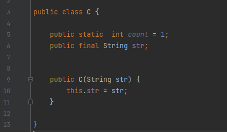

```
字节码文件中不会有 ConstantValue
```

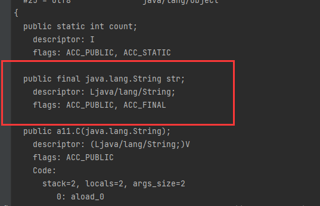


###### 1.8.1.4.1.4 通过类的加载器

类的加载器解析.class文件，把上述的  类型信息、域信息、方法信息。加载到方法区。

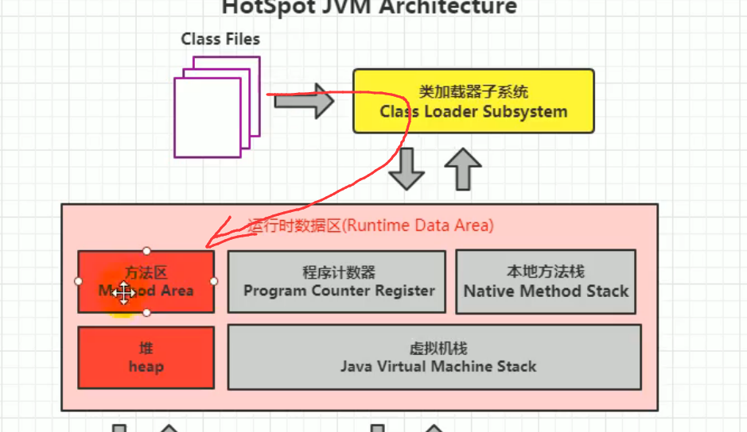


##### 1.8.1.6.2 .class文件中的常量池

方法区中含有  运行时常量池。

.class文件中有  常量池。通常里面有很多常量信息。

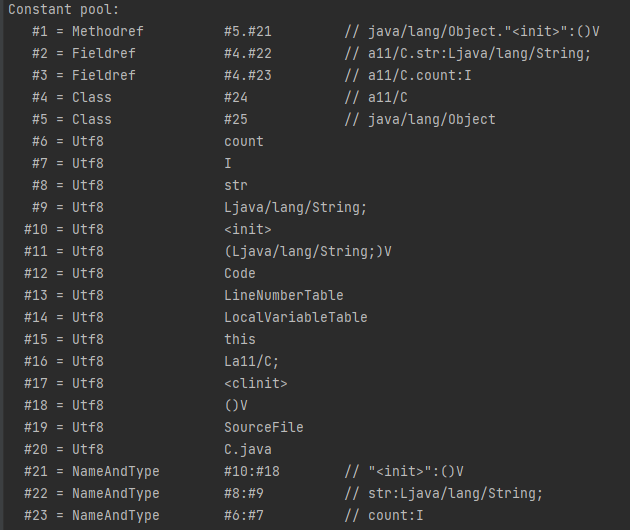

事实上，运行时常量池里的信息，就是类加载器把.class文件里的常量池信息 加载到其中。


```
字面量
对类型、域、方法的符号引用。
都存储在常量池中。
```


###### 1.8.1.6.2.1 为什么需要常量池？

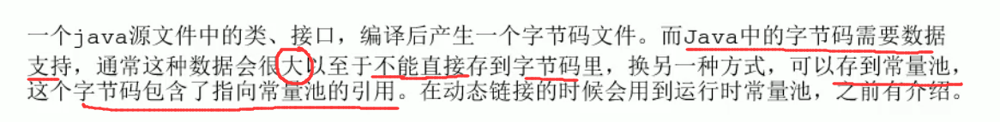


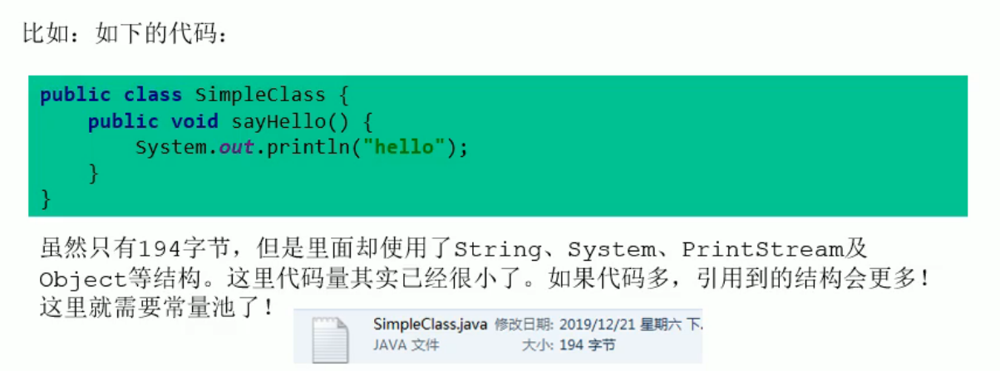

```
如何理解？
.class类完整的描述了一个类是怎样定义的。里面有什么方法、字段、方法修饰符、返回值、字段修饰符、字段类型等等等等。
我们编写的SimpleClass.class用到了System类，但是我们并不需要存储System类内部是如何定义的，因为我们不可能把一个完整的System类的定义都存储在SimpleClass.class文件中。前面做过测试，一个简单的输出语句，方法区需要加载1000多个类，显然我们不可能把这1000多个类的具体的描述都存储在SimpleClass.class文件中。
所以需要存储一个对System类的符号引用。用一个符号引用代替这个类，实际使用时，再替换为这个类的真正实例。（将符号引用 改为 直接引用）
```

###### 1.8.1.6.2.2 常量池都有什么？

常量池存储的数据类型有哪些？

```
数值型
字符串值
类引用
方法引用
字段引用
```


###### 1.8.1.6.2.3 常量池小节

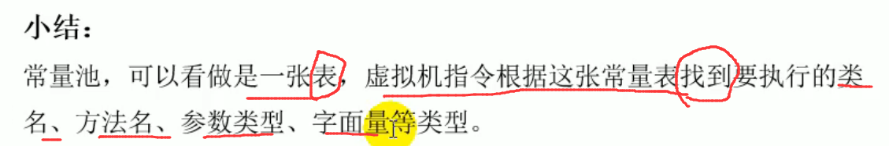


##### 1.8.1.6.3 运行时常量池


```
运行时常量池 vs 常量池表（.class）
```

##### 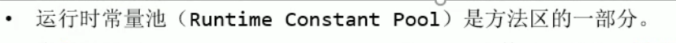


 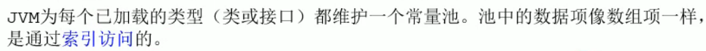


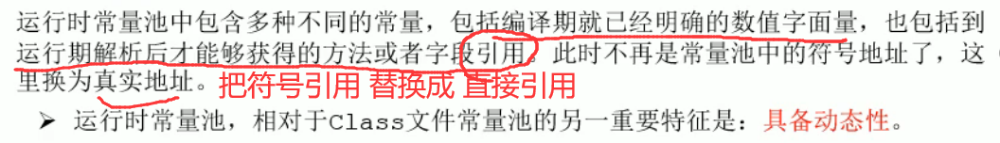

```
除了编译期就确定的字面量值，还包括了运行期才能动态生成的对象（类 方法），通过 【符号引用 替换成 直接引用】这一过程，让运行时常量池具有动态性。
```


#### 1.8.1.7 方法区演进细节

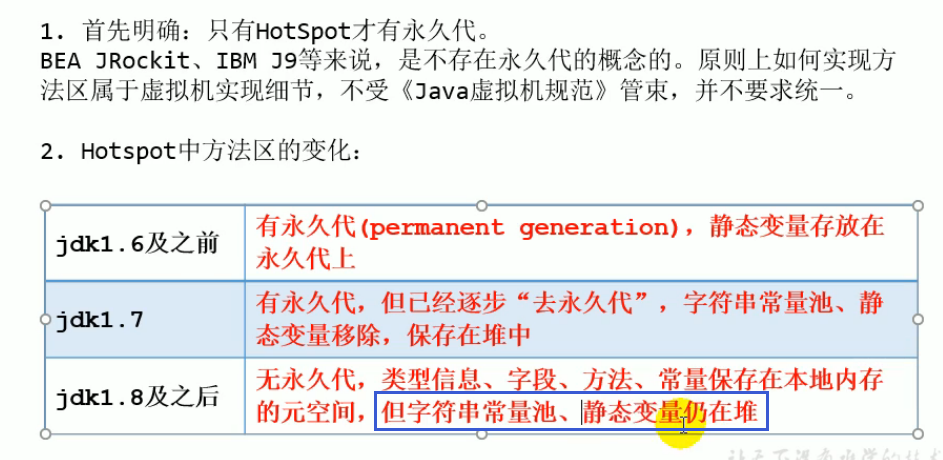

```
1.6以前Hotspot用永久代实现方法区，永久代使用的内存是JVM里的内存。
很容易出现OOM。为什么不去解决OOM？首先方法区的大小是难以确定的，因为伴随很多动态代理，动态加载一些类信息。
其次，对方法区的GC也很困难。
所以将方法区实现在有限的JVM空间内，不是一个很好的方法。
JRockit J9 使用元空间实现方法区，使用的内存是本地内存，最多可以直接扩展到最大物理内存。
所以，Hotspot学习使用元空间的实现思路。 经过jdk1.7 逐步使用元空间代替永久代。
1.8以后，Hotspot完全实现使用元空间实现方法区。
```


```
jdk8以后
字符串常量池、静态变量（这里指的是静态变量的 变量名，引用名）在堆中。
(静态变量的对象本身，一直都存放在堆区)
类型信息、字段信息、方法信息、常量 在本地内存的元空间中。
```


```
方法区 是《java虚拟机规范》中明确提到的概念。
而 永久代、元空间 是方法区的具体实现。
```


##### 1.8.1.7.1 演进图

````
jak6
````

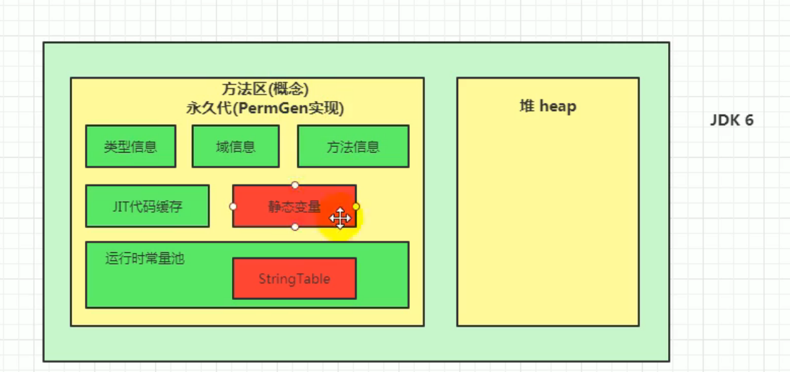

```
jdk7
```


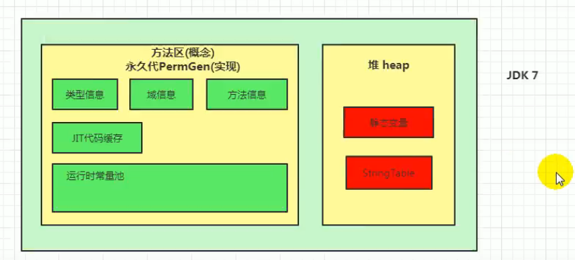


```
jdk8
```

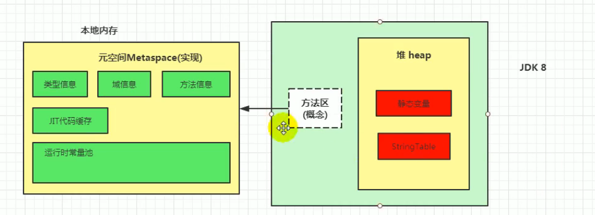


##### 1.8.1.7.2  为什么要用元空间替换永久代

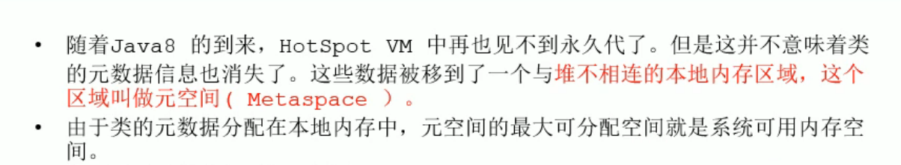

```
默认元空间最大是 -1 ，意思是没有限制。最大可分配的就是系统可用最大内存
```

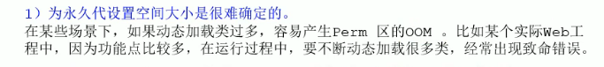


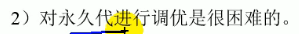

```
full GC 是可以回收元空间的垃圾的。

但是full GC，开销更大。用户线程停止工作（STW）的时间更长 
```

##### 1.8.1.7.3 字符串常量池为什么要放入堆区

字符串常量池 也叫 interned String （字符串字面量）

也叫 StringTable。

字符串常量池 为什么要从方法区 移入堆区。

```
方法区回收效率和频率都较低。
随着类的定义会出现大量的字符串常量。如果放入永久代，将导致对字符串常量的回收频率降低。整体回收效率不好，还会占用永久代的宝贵内存。
所以将 字符串常量放入堆区，能及时回收。
```

```
关于 为什么类的定义会出现大量的字符常量，在第二篇的字节码解读会体现出来。


Class文件完整的刻画了一个类的全部信息。例如类的全限定名，直接父类，实现接口，方法名，字段名等等等等。这些信息具体占多少个字节并不确定（因为用户可以自定义类名，方法名等等），而class常量池中唯一变长的常量就是字符串。也就是说，以上绝大部分的信息，无论是何种类型的常量（CONSTANT_class_info，CONSTANT_NameAndType_info）最终都需要指向一个字符串常量，用这个变长的字符串常量作为最终解释。因此就形成了紧凑的class文件。
```

[为什么类的定义会出现大量的字符常量](# 2.2.5 class文件格式)


##### 1.8.1.7.4 静态变量名，静态变量对象

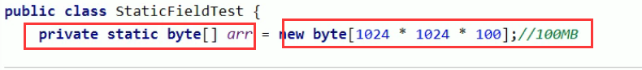


左侧是 静态变量名，或者叫做 静态变量引用名。在jdk1.6以前存放在永久代。

在1.7存放在堆区（此时永久代仍未完全取消）。jdk1.8 以后永久代彻底消失，静态变量引用名依然存放在堆区。

而右侧，静态变量对象实例，它一直都存放在堆区。它是对象，存放在堆


##### 1.8.1.7.5 以下3个对象都存放在哪里？

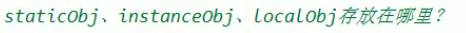


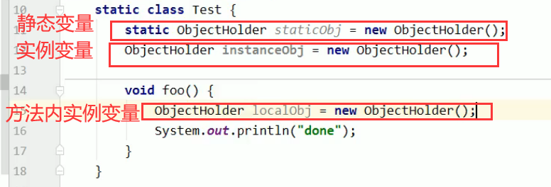

```
先考察这3个变量的实例对象存放在哪儿？

静态变量实例对象 存放在堆区
实例变量对象也存放在堆区
如果开启逃逸分析（使用标量替换技术实现）方法内实例变量未发生逃逸，应当被拆散分配在栈上，但是这个方法只执行了1次，不属于 热点代码。不会被JIT即时编译器优化加速，所以仍会在堆上分配。
```

```
再来考察 3个变量引用 存放在哪儿

1.6及以前 静态变量的引用 存放在永久代。1.7及以后，存放在堆区。

实例对象的引用 存放在堆区

方法内实例对象的引用，存放在foo()方法栈帧上，局部变量表上。
```


#### 1.8.1.8 方法区的垃圾回收

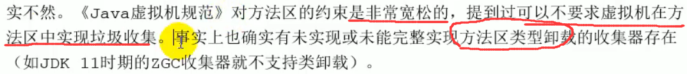


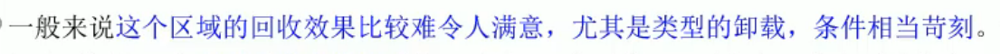


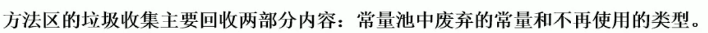


#### 1.8.1.8.1 运行时常量池都存储什么？

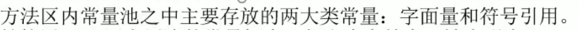


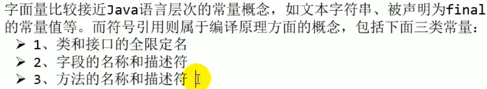

##### 1.8.1.8.2 回收策略

###### 1.8.1.8.2.1 回收方法区的常量


###### 1.8.1.8.2.1 回收方法区内 类型信息

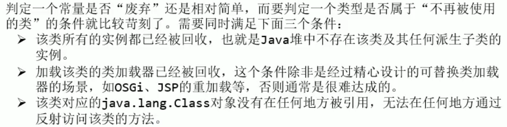

```
同时满足以上3个条件后，才允许被回收。不一定会被回收，这点和回收对象不一样。
```

#### 1.8.1.9 运行时数据区的面试题

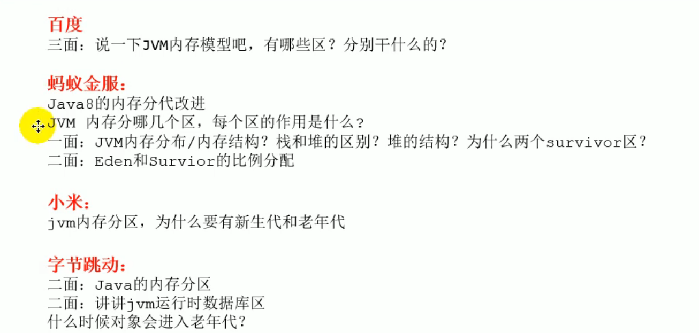

```
什么时候对象会进入老年代？
对象进入老年代一般有两种方式。1、一般情况2、特殊情况。
一般情况：生命周期较长的对象，达到年龄阈值，默认是15 自动晋升到老年代。
特殊情况：创建了一个超大的对象，比伊甸园区还要大，不得已只能分配到老年代。或者进行了一次YGC伊甸园区回收后的空间，不能装下这个超大对象。不得已，分配到老年代。
```


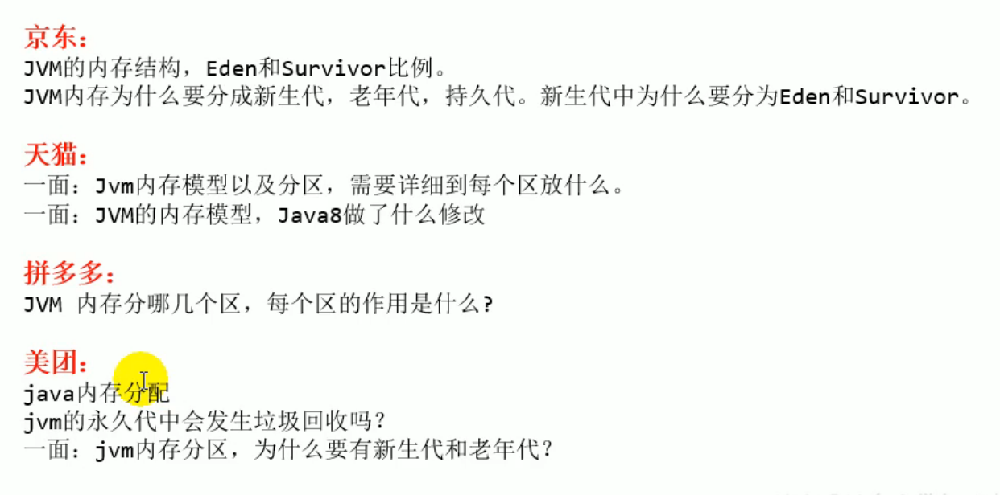

```
新生代 伊甸园比例？

默认情况下，新生代:老年代=1:2
伊甸园区:幸存者区=8:1

永久代会发生垃圾回收吗？

永久代可以发生垃圾回收。《java虚拟机规范》指明不强制要求回收器对方法区实现回收。full GC就包括了永久代的回收。
永久代的垃圾回收，主要回收一些不再使用的类型信息、和常量信息。一般来说，回收效率比较低，主要原因是回收条件比较苛刻。


为什么要有新生代。老年代？

对象可以按照生命周期长短，笼统的分为：较长生命周期、和较短生命周期的对象。频繁的对生命周期较长的对象询问垃圾回收效率偏低，同时进行垃圾回收还会使用户线程STW，所以低效率的GC是不能忍受的。使用分代将对象划分，较多的尝试回收年轻的对象，较少的尝试回收老年对象，是有效提高GC效率的方式。老年代存放的对象是年轻代对象经过多次GC后仍然存活下来的，生命周期较长的对象。


```


## 1.9 对象的实例化内存布局与访问定位


### 1.9.1 对象实例化

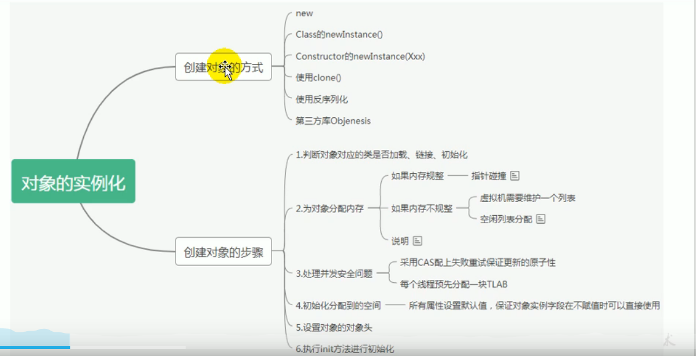

#### 1.9.1.1 对象创建的方式

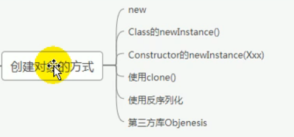


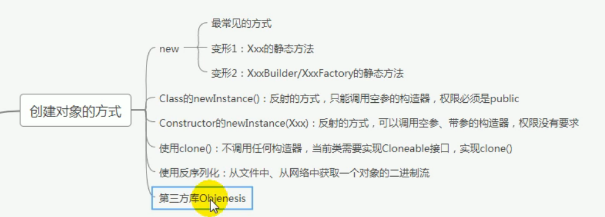


##### 1.9.1.1.1 从字节码角度 new对象都做了什么？


#### 1.9.1.2 对象创建的步骤


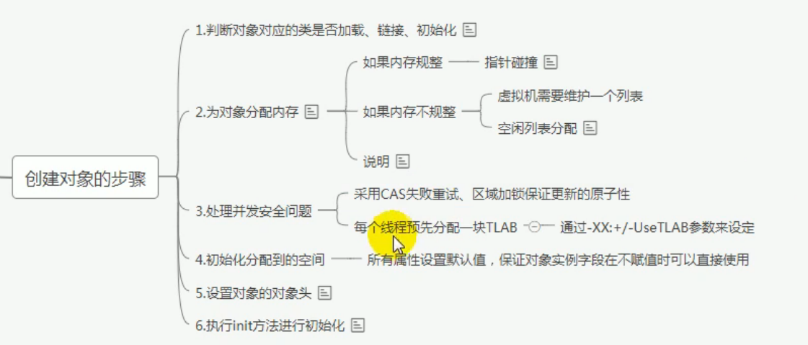


##### 1.9.1.2.1 查看这个类是否 加载链接初始化

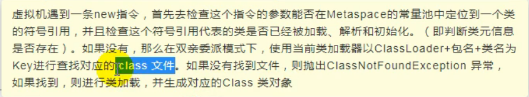


##### 1.9.1.2.2 为对象分配内存


```
完成类在方法区的加载以后，就知道了这个类的类型信息。
就可以计算出这个类对象所需要的内存空间。

所以开始尝试在堆内存为对象分配空间。

```

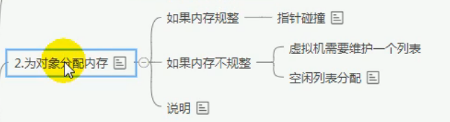

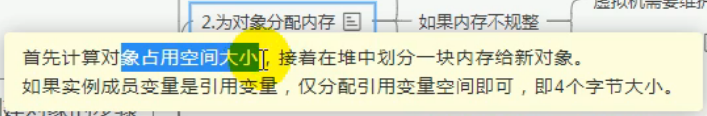


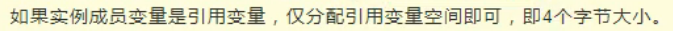

```
引用变量占一个slot。32位 4字节大小

复习：【double long 8字节，其他基本数据类型 和引用数据类型 4字节】
```


###### 1.9.1.2.2.1 堆空间内存规整

接下来按照堆空间是否规整，有不同的分配策略：


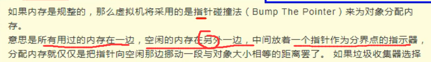

```
示意图：
```

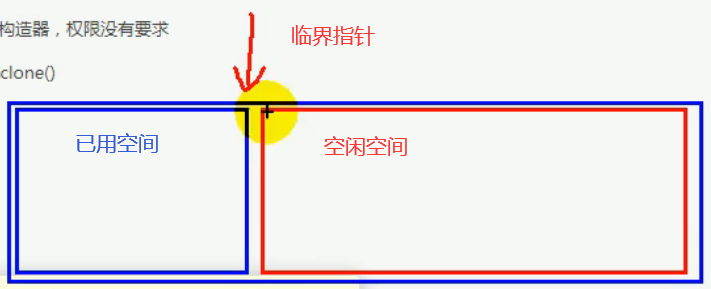


  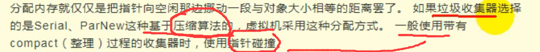

```
基于压缩算法的垃圾回收器，（整理碎片，合并已使用未使用区域）采用指针碰撞。	

可以预见，在整理碎片的时候，会复制对象，改变直接指针引用地址。带来开销，优点是 对大对象分配比较友好（总是整理出最大的空闲空间），同时指针碰撞实现起来简单。
```


###### 1.9.1.2.2.2 堆空间内存不规整

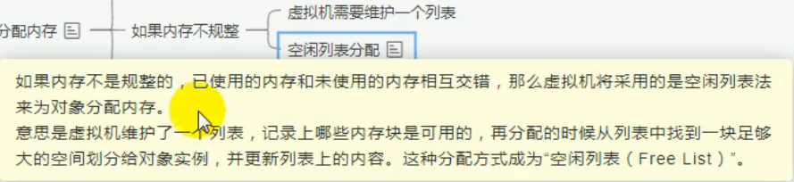

CMS垃圾收集器采用这种方法


```
这样的分配方式，显然会出现 大对象不容易分配的情况。
随着运行时间增加，过于零散的内存碎片，会导致大对象分配不进去的情况。

随意这种分配方式应当配合压缩算法一起使用。当分配大对象时，应当整理内存碎片
```


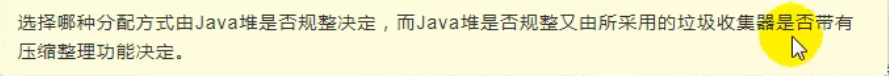


##### 1.9.1.2.3 处理并发的安全问题

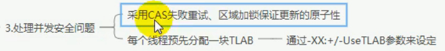


什么是CAS？

https://blog.csdn.net/ls5718/article/details/52563959


synchronized是悲观锁，会导致其它所有需要锁的线程挂起，等待持有锁的线程释放锁。

CAS机制，Compare and Swap就是乐观锁的思想。

```
读操作： 对某个地址上的值进行读取操作，不会对地址上的值进行修改。
写操作：对某个地址上的值修改。
通常，读操作会被认为是轻量的。写操作需要考虑同步问题，即数据一致性问题。


通常CAS 用于同步的方式是从地址 V 读取值 A，执行多步计算来获得新值 B，然后尝试使用 CAS 将 V 的值从 A 改为 B。
如果此时有其他线程提前把A值改为C，本次修改前后地址V的值不相同（前A 后C），则认为本次操作使用的数据A不安全（因为有其他程序更新了地址V上的值）。需要获取新值C再次尝试计算。
```

```
乐观锁和悲观锁对比。

因为乐观锁的实现方式，允许多个线程同时读取同一个地址V。大家都不对其值进行修改，并发效率非常高。在写操作较少时，性能较悲观锁非常好。

相反的，每次只允许最快执行完毕的那个线程修改值。其余线程读到的数据都是不安全的数据，需要尝试重新获取运行（相当于原来的运行结果都浪费了），不如直接使用悲观锁，一次就只允许一个线程修改V的值。这种开销在越多线程进行写操作时越明显。
```


##### 1.9.1.2.4  初始化分配到空间

也叫0值初始化


```
先回顾一下给对象的数据赋值操作。

以下赋值操作是按照先后顺序的。左边先
```


属性的默认初始化：

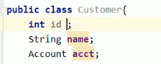

```
像这样一个代码，不对成员变量进行赋值。
直接调用id的值就是0
name就是null
Account就是null
可以直接调用的原因就是，属性的默认初始化。int默认为0.引用类型默认为Null
```

属性的显式初始化/代码块初始化：

```java
public class MyTest {
    int a = 10;
    int b = 1;
    {
        a =1;
    }

    public int getA() {
        return a;
    }

    public void setA(int a) {
        this.a = a;
    }

    public int getB() {
        return b;
    }

    public void setB(int b) {
        this.b = b;
    }
}
```

```
输出一下a 的值 和b的值：
```

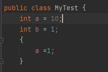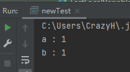

```
代码块儿中的代码后执行，a=10的值会被覆盖为a=1。
```


```
调换一下顺序。
```

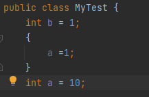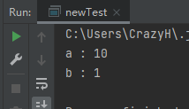

````
a=1先执行，a=10后执行。把1的值覆盖掉。
````

```
如果此时你有疑问，这样难道不是a先使用后定义了吗？a=1的时候还没声明a？

看一下.class文件你就懂了。
```


这是我写的代码

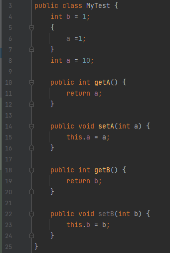

编译后的.class文件是这样的

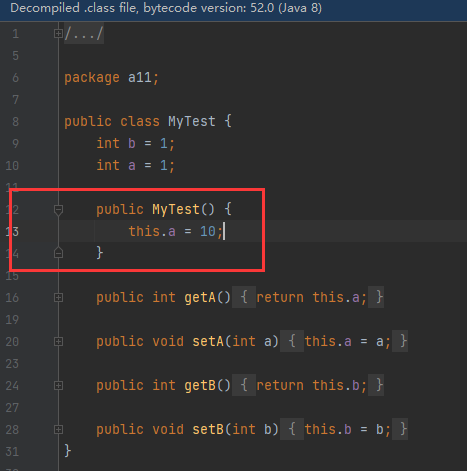

```
非静态的代码块，会被自动写入无参构造方法中。
所以仍然符合先定义后使用的规则。

由此可以知道，显式初始化，在无参构造方法前执行。

那么有参的呢？
```

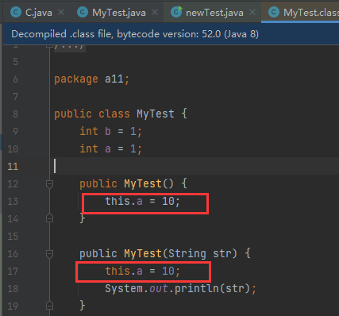

```
所以，非静态代码块内的代码，会被自动写入所有的构造方法中。
```


##### 1.9.1.2.5 设置对象头


###### 1.9.1.2.5.1 对象头包含什么？

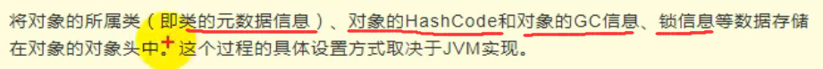


以Hotspot虚拟机为例

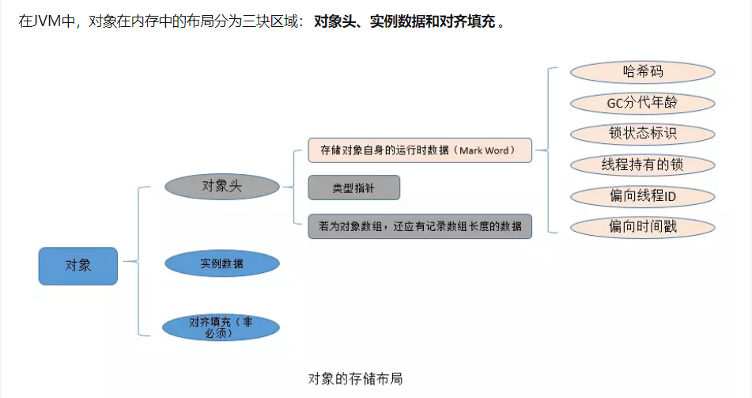


##### 1.9.1.2.6 执行<init>方法，进行初始化


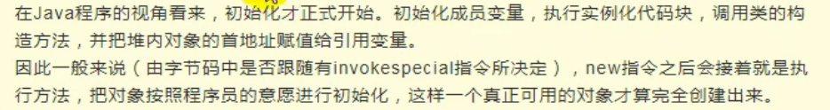


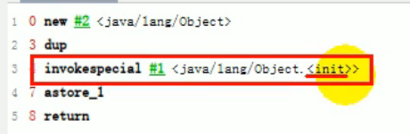


### 1.9.2 对象在堆空间的内存布局


在Java中 *对象* 分为3部分

```
1.对象头
2.实例数据 
3.对齐填充(可选存在) jvm规定对象占用内存必须为8bit的整数倍。也就是1字节的整数倍
```

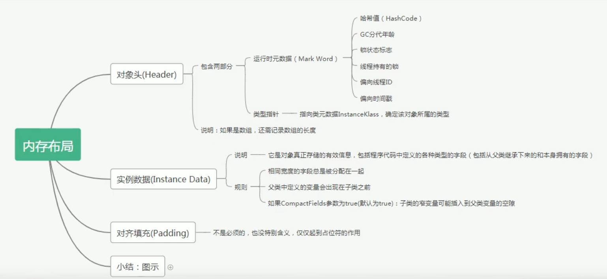


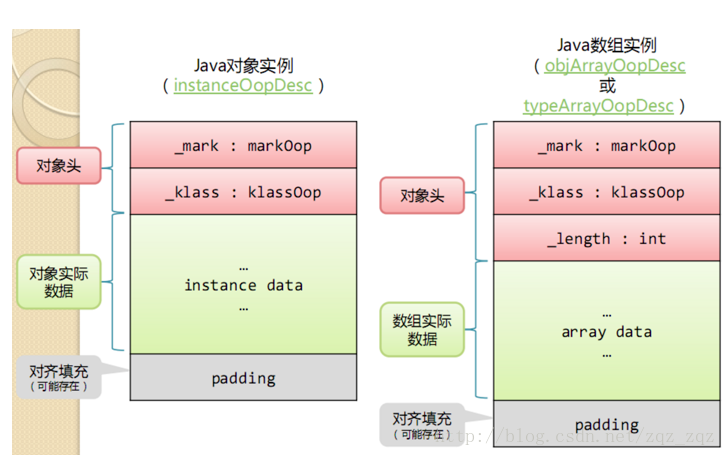


#### 1.9.2.1 对象头

对象头也包含 三部分

```
mark word       :  包含了hashcode,GC年龄信息、锁状态标志、线程持有的锁、偏向线程ID、偏向时间戳
Klass pointer   :  指向了对象所属类型的指针
length (可选)   :  如果是数组对象，还有数组长度
```


header

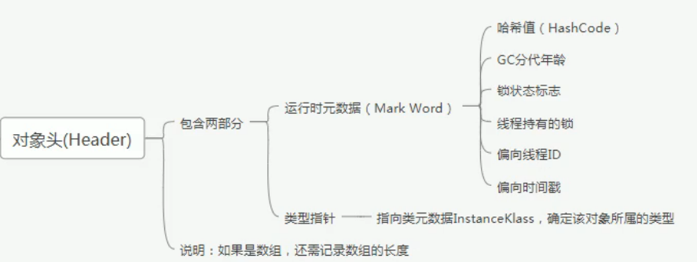


```
包含两部分。
1、markword  运行时元数据

2、Klass   类型指针  指向方法区中对象的类型
```


```
markword 包含了 对象hash值，GC年龄，偏向线程ID，偏向锁时间戳、锁标志位
如下图:
```


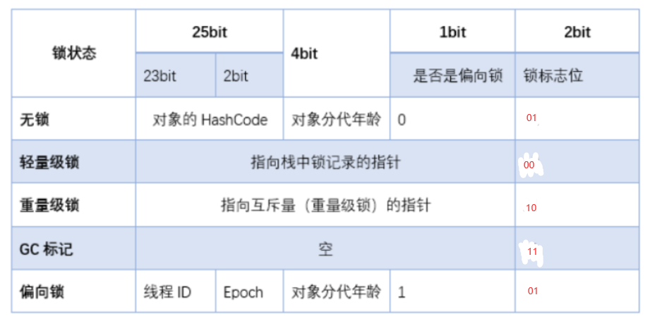


```
首先根据锁标志位，表示不同的锁类型。不同的锁类型，前面表达的含义也不同。
```


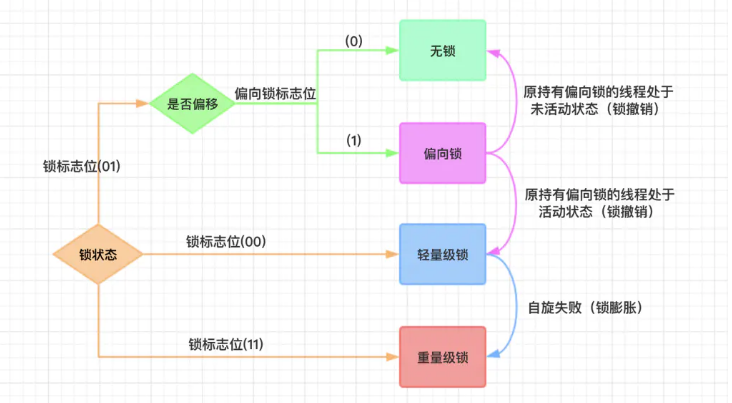


#### 1.9.2.2 实例数据/真实数据

instance data


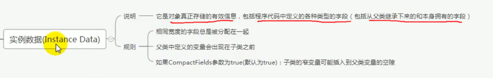


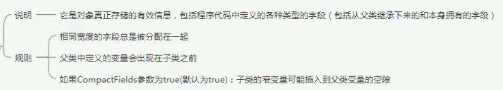


```
类中定义的全部字段。包括父类。
```

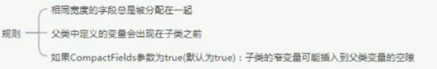


#### 1.9.2.3 对齐填充padding

用处：解决伪共享

前置知识：

https://blog.csdn.net/weixin_40288381/article/details/89311425

MESI：

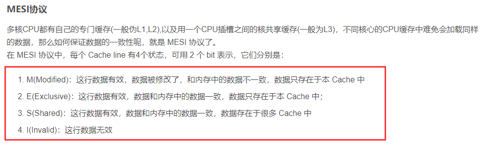


伪共享分析：

https://blog.csdn.net/qq_27680317/article/details/78486220

```
L1 L2 是核专有
L3 是共享
```


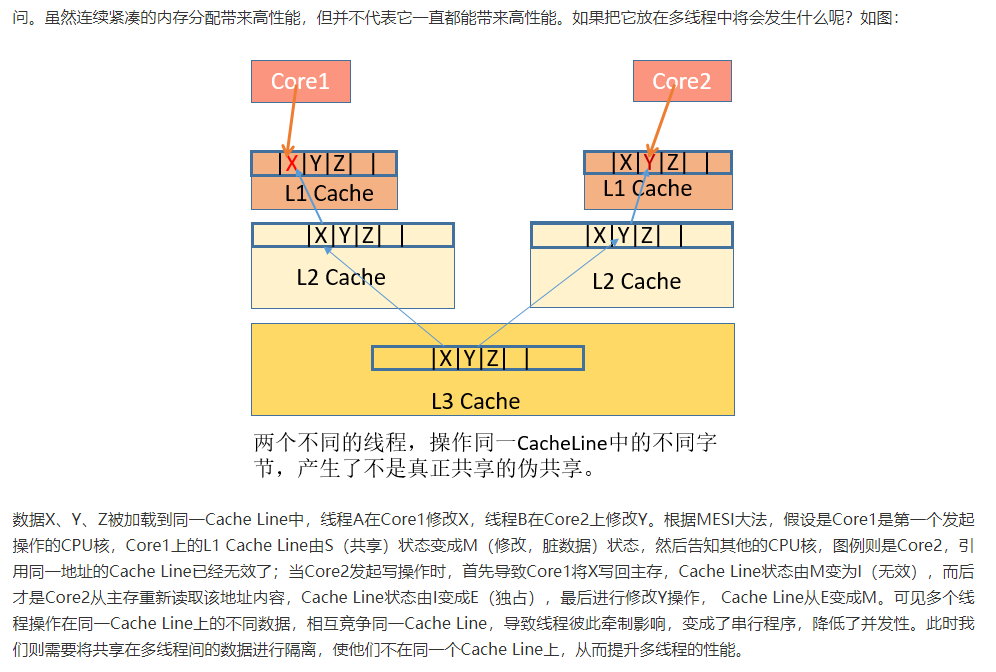


```
变成了串行，降低了并发性。
```

解决办法：使用填充


#### 1.9.2.4 小节

cust对象在内存中的结构。

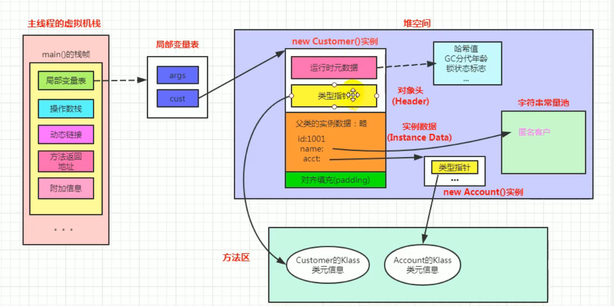


### 1.9.3 对象访问定位


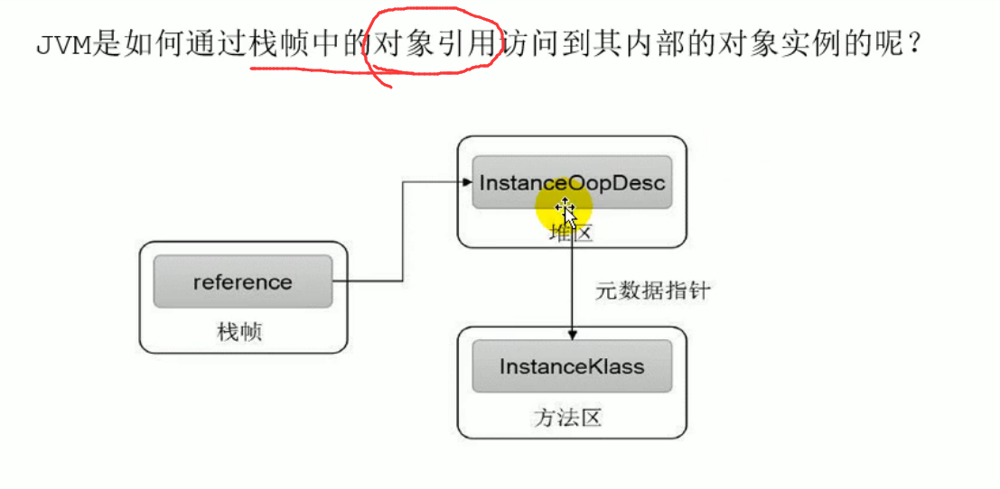


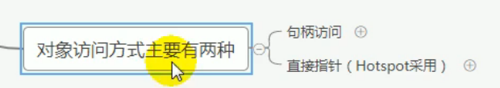


句柄访问和直接访问，前面有过扩展。

[句柄访问](# 1.5.5.2.3.2 句柄)

```
Hotspot虚拟机使用的是 直接指针。
```


## 1.10 直接内存

Direct memory

### 1.10.1 什么是直接内存？

```
直接内存是相对于JVM来说的。指的是JVM内存以外的内存。最大直接内存等于计算机的物理内存
```

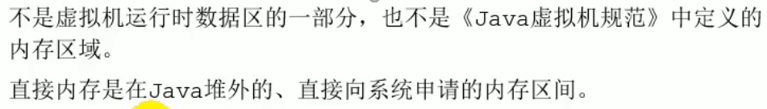

```
直接内存，就是 元空间使用的空间。这个直接是相对于JVM虚拟机内存来说的。
```


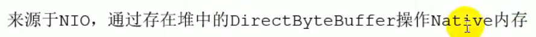


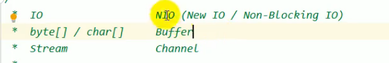


### 1.10.2 体验一下直接内存。

```java
public class Main {
    public static void main(String[] args) throws InterruptedException {
        ByteBuffer byteBuffer = ByteBuffer.allocateDirect(1024 * 1024 * 1024);
        Thread.sleep(100000);
    }
}
```

堆空间里没有byteBuffer

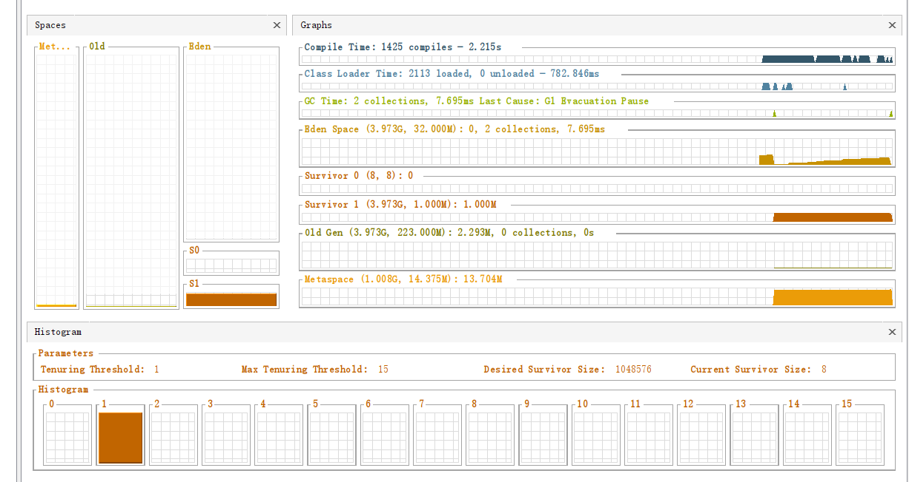

在任务管理器中看到内存大小。分配给了直接内存。

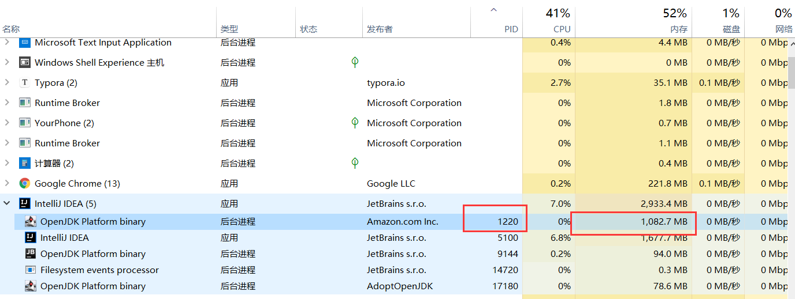


### 1.10.3 直接内存的特点

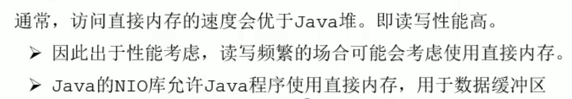

#### 1.10.3.1 为什么直接内存快

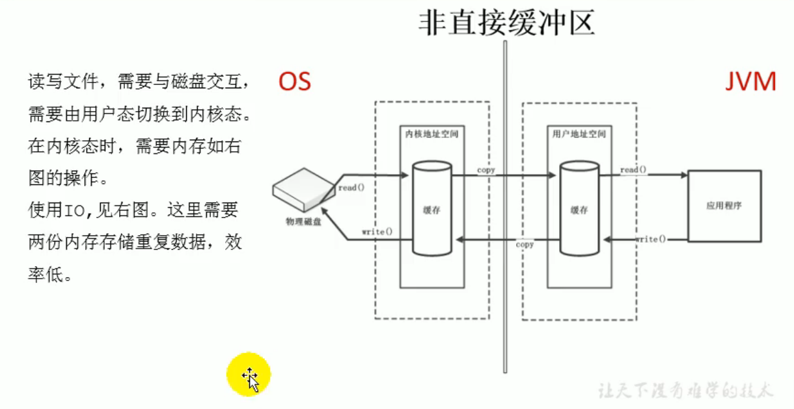


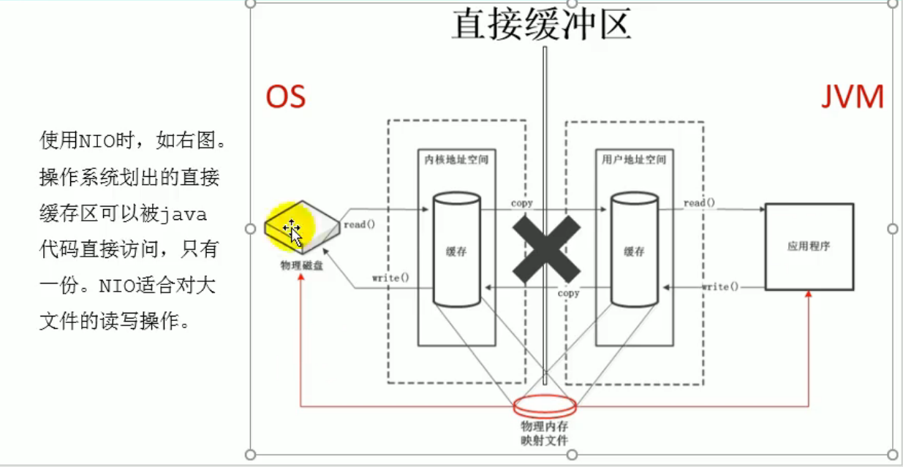


#### 1.10.3.2 一些特点


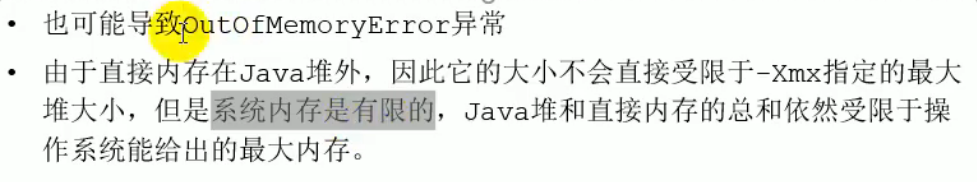


#### 1.10.3.3 直接内存的缺点

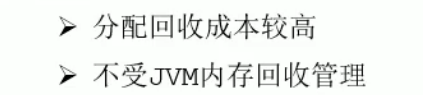


#### 1.10.3.4 设置直接内存大小

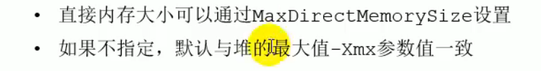

```
默认直接内存最大 等于  堆空间最大 	
```


## 1.11 执行引擎


### 1.11.1 执行引擎概述


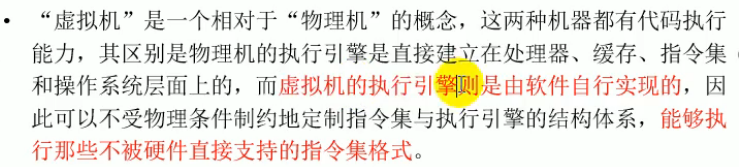


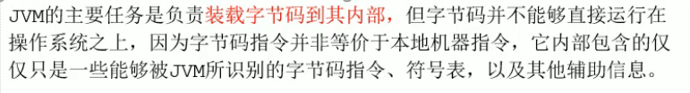


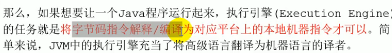

```
执行引擎，负责把字节码指令，编译（后置编译）成对应平台上的机器指令。交给cpu执行。
```


### 1.11.2 执行引擎的工作过程


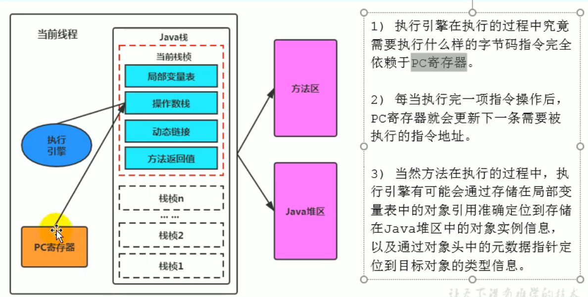


```
也就是说，PC寄存器的下一条地址 交给执行引擎。

执行引擎，通过局部变量表里存储的对象的引用，找到堆空间内的对象实例。再通过对象实例的类型指针，找到方法区的这个类。
```


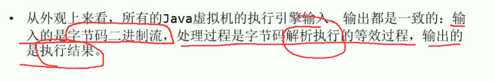

```
从外部上看 执行引擎

输入: 字节码二进制流
处理: 解释执行
输出: 执行后的结果
```


### 1.11.3 java代码编译和执行的过程


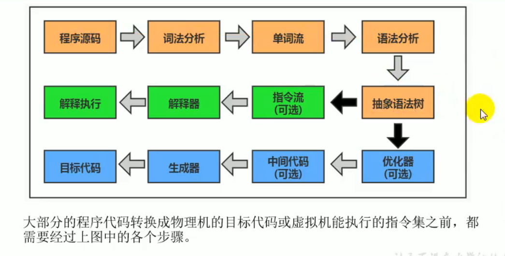


```
上图橙色部分，是 javac指令完成的。 这个编译过程 叫做前端编译
```

```
事实上黄色部分,并不需要JVM来完成。
绿色 和 蓝色  部分是JVM要考虑完成的。

其中  绿色表示的是   解释执行的过程
     蓝色表示的是   编译的过程
```

#### 

#### 1.11.3.1  什么是 解释器？ JIT即时编译器？


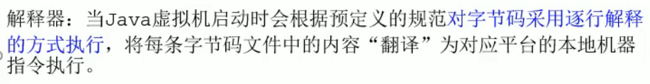

```
逐行解释、逐行执行。 
```

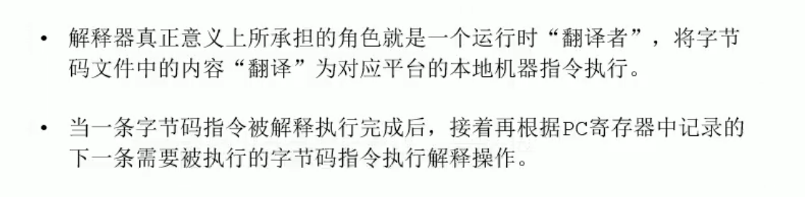


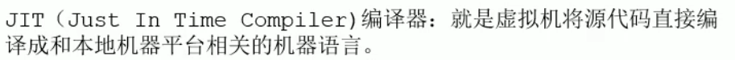

#### 1.11.3.2 java是半解释半编译的语言

什么意思呢？

```
java可以灵活的选用 解释器、执行目标代码。

也可以选用编译器、执行目标代码
```

```
比如执行了10000（client模式1500，Server10000）次以上的 热点代码，JVM就会选择使用JIT编译器，编译热点代码。并存储热点代码的二进制文件。（空间换时间）加快下次执行热点代码的速度。
```


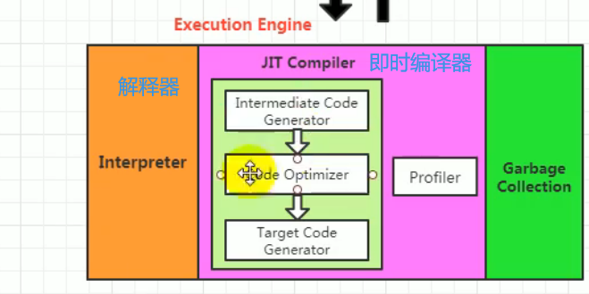


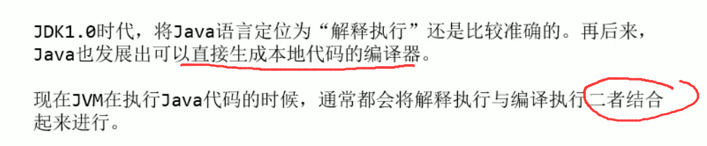


#### 1.11.3.3 解释器 VS 编译器


##### 1.11.3.3.1 运行时速度


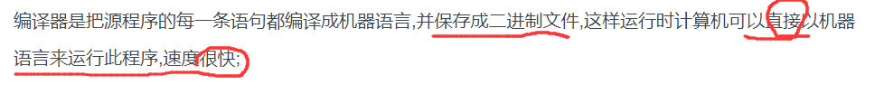


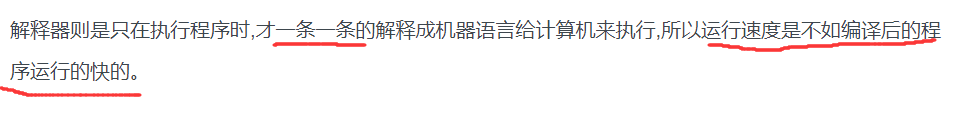

```
这里指 运行时的速度。解释型语言需要  逐行解释逐行执行。


编译型语言 运行前需要全部都编译完成。	
```


##### 1.11.3.3.2 输出的不同

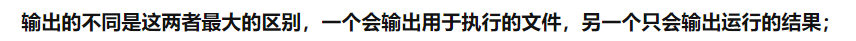

编译器输出的是目标代码的编译结果---cpu可直接执行的二进制文件。

解释器输出的是目标代码的执行结果。不再保存可执行的二进制文件（还是会先解释出来cpu可直接执行的二进制文件，但是不再保存。用完就丢）。


##### 1.11.3.3.3 跨平台

解释型语言可以跨平台，只需要有对应平台的解释器即可。拿同一份目标代码，给对应平台的解释器，即可输出 目标平台cpu可执行的二进制文件。


1.11.3.3.4  解释器和编译器 总结

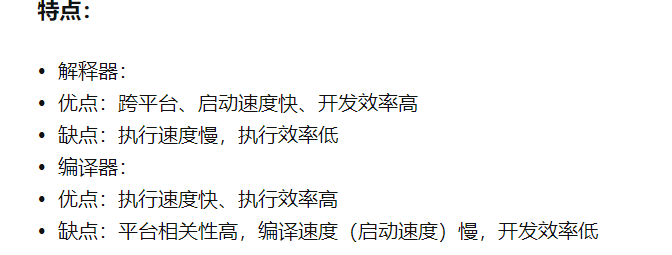

https://zhuanlan.zhihu.com/p/107382276


### 1.11.4  jVM 对.java.class文件的解释执行过程 示意图


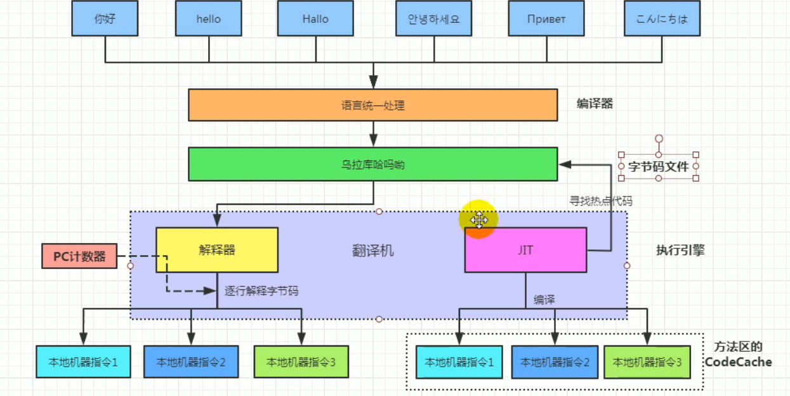


### 1.11.5 机器码、指令、汇编语言


#### 1.11.5.1 机器码

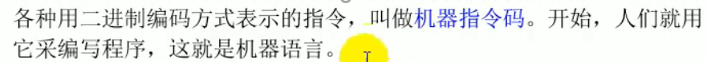

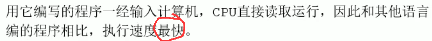

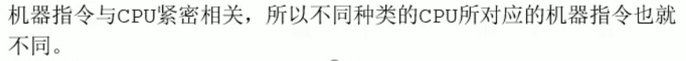

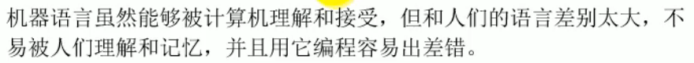

#### 1.11.5.2 指令 


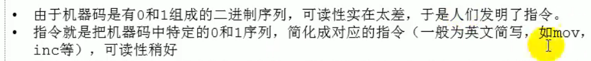

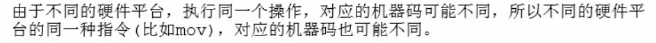


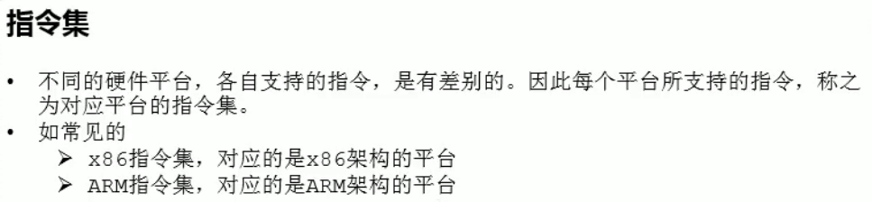


#### 1.11.5.3 汇编语言


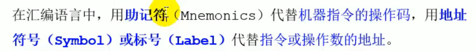

```
机器只识别 指令。
所以，汇编语言还是需要翻译成指令。cpu才能识别执行。
```


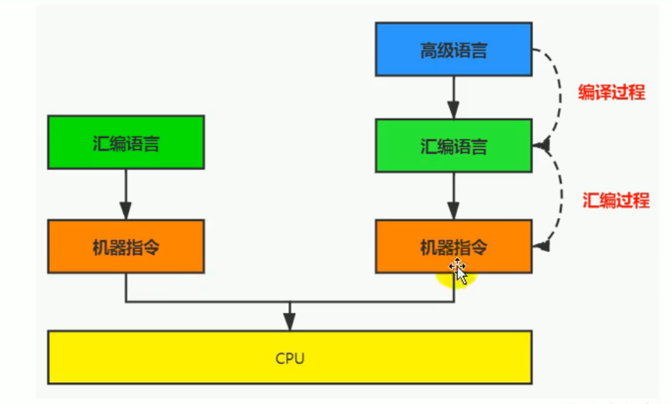


#### 1.11.5.4 高级语言

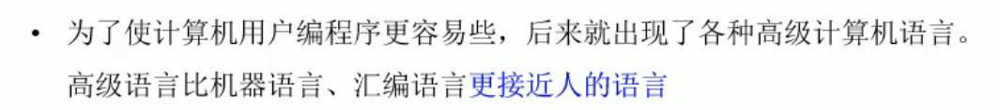


### 1.11.6 字节码


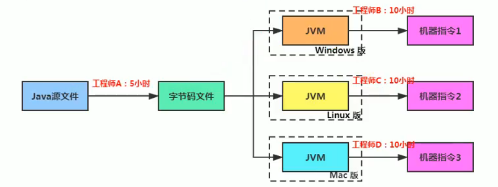


```
其实，直接为 不同平台提供JVM，直接将java代码编译为机器指令也可以。
但是为什么要提出 字节码文件 这一层呢？

现在看来，字节码文件这层，帮助JVM实现了跨语言。
只要遵守字节码格式的语言，都可以在JVM上解释运行。JVM帮助这些语言完成复杂的内存管理、解释执行等过程。屏蔽了底层细节。

```


### 1.11.7 hotspot 选择 解释器和编译器并存


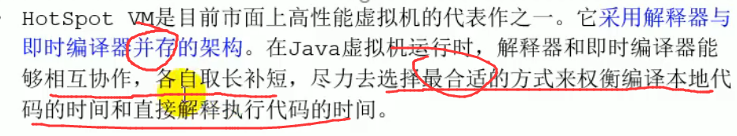

解释器 和  编译器的各自优点

[优缺点对比](#1.11.3.3.1 运行时速度)

#### 1.11.7.1 原因补充

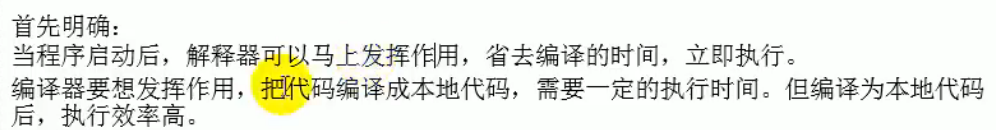


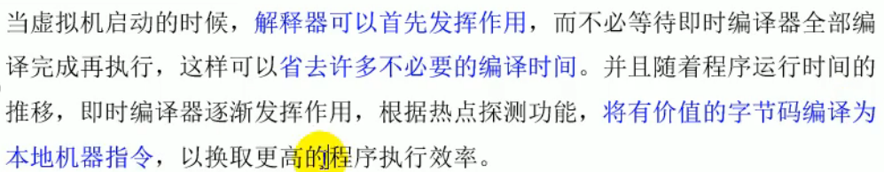


#### 1.11.7.2  案例


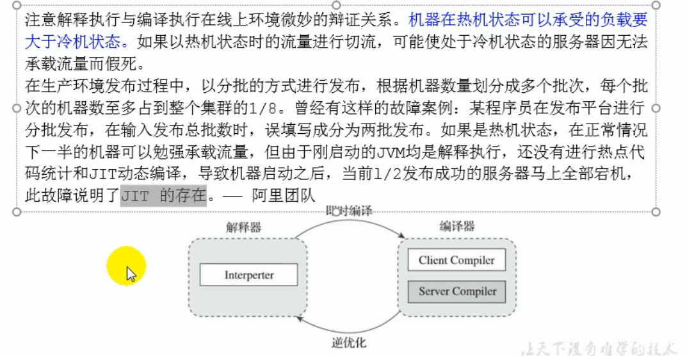


### 1.11.8  JIT 编译器


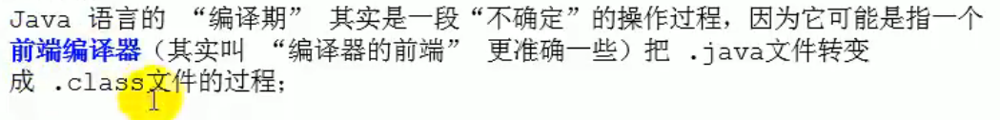


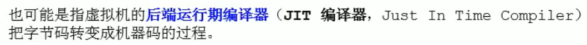


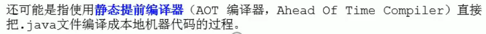

```
不再经过.class字节码文件
```

#### 1.11.8.1 什么时候使用JIT

##### 1.11.8.1.1热点代码 

```
频繁被执行的代码。称为 热点代码。（Hot spot code）

热点代码会被 JIT编译器 编译，并保存编译后的文件。下次执行时直接调用编译好的二进制机器指令。
```

```
多次调用的方法。 方法内循环多次的循环体，都可以称之为 “热点代码”
```

热点探测

```
hotspot VM 采用的是基于计数器的热点探测。
```

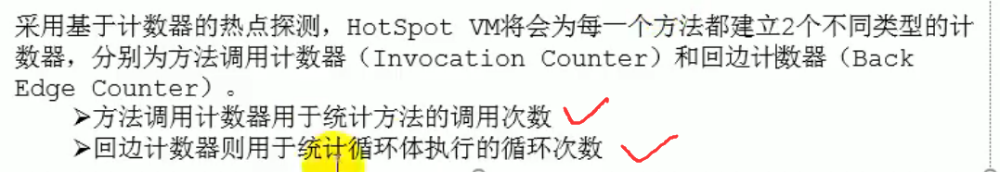

##### 1.11.8.1.2 触发JIT次数

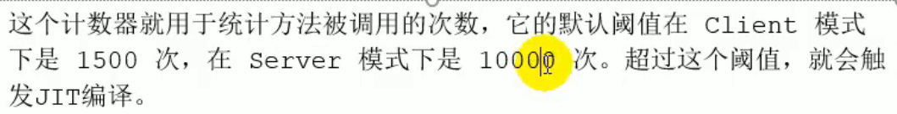


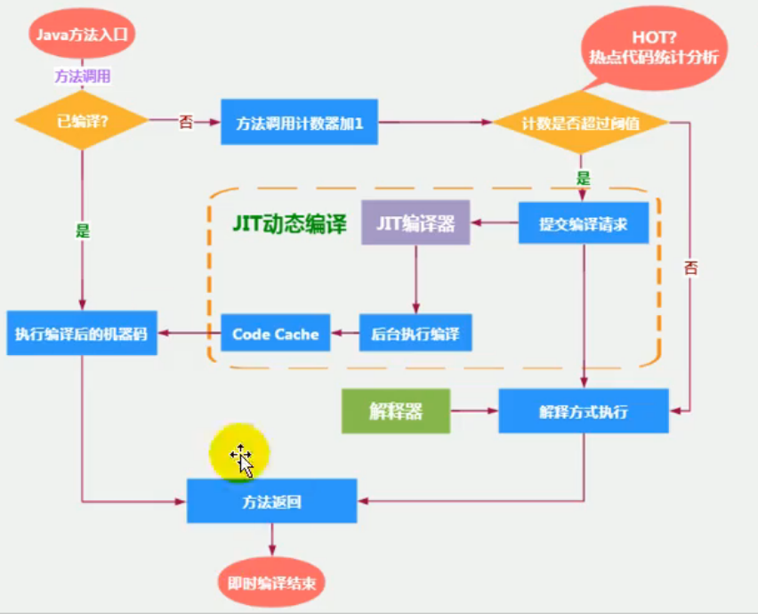


##### 1.11.8.1.3  热度衰减

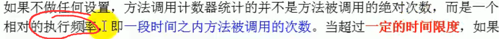


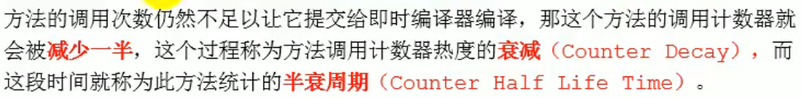


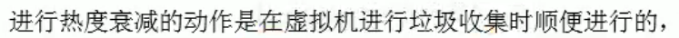


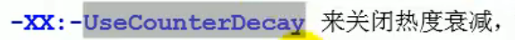


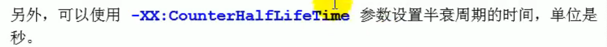


#### 1.11.8.2  HotspotVM 设置程序执行方式


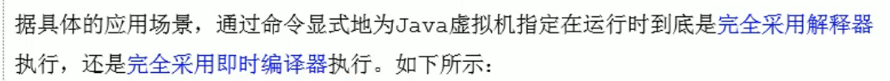


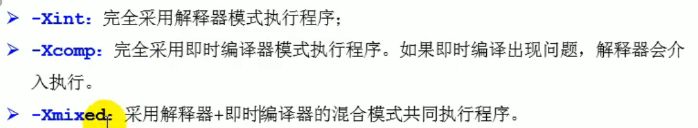


```
64位 JVM 只能使用Server模式
```


#### 1.11.8.3  JIT的分类


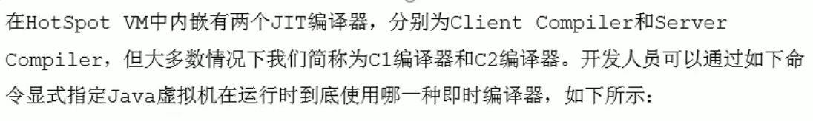


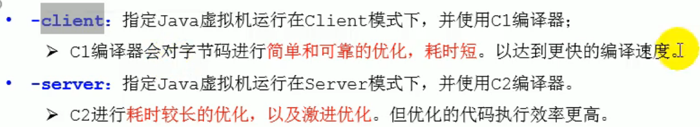


##### 1.11.8.3.1  C1编译器和C2编译器的不同

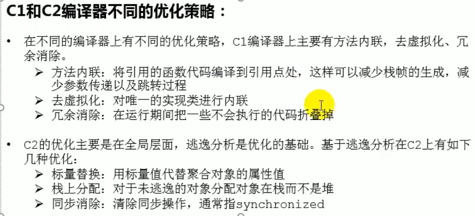


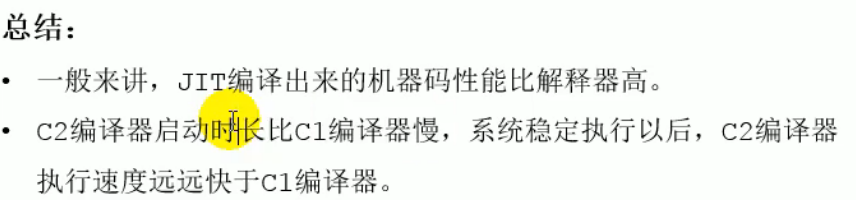


#### 1.11.8.4 Graal 编译器

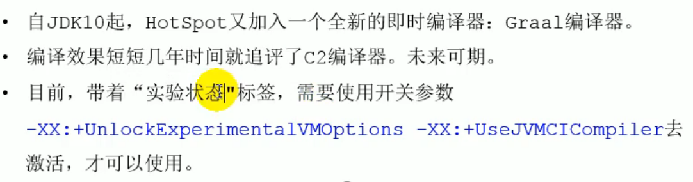


## 1.12 StringTable

### 1.12.1 String 的基本特性

```java
String s1 = "abc";  // 通过字面量 定义字符串。存储在字符串常量池中。
String s2 = new String("qwe"); //通过new对象方式
```


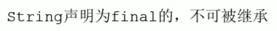


#### 1.12.1.1  存储结构

在jdk1.8以前，String 类里真正的存储结构是  char[]

在jdk1.9以后，String类型 使用了 byte[]存储。

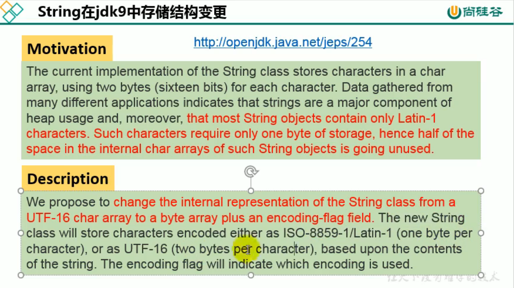

```
发现在许多场景下，String类型是占用内存的主体。1个char占用2个byte。
而大多数情况下，String对象仅仅存放拉丁文（ISO-8859-1/Latin-1 编码）只占用1个byte。这相当于浪费了一半的空间。所以考虑压缩String字符串。
为String新增了一个 编码标志字段（encoding-flag field），用于切换占1byte或2byte的不同编码格式下的 存储结构。
```


```
和String有关的类，例如 AbstractStringBuilder StringBuilder 
StringBuffer 都做了同样的优化。
```

### 1.12.2 String 不可变性


通过字面量的方式：（字符串分配在 堆内的 字符串常量池中。）

```
字符串常量池不允许出现重复值的字符串。
```


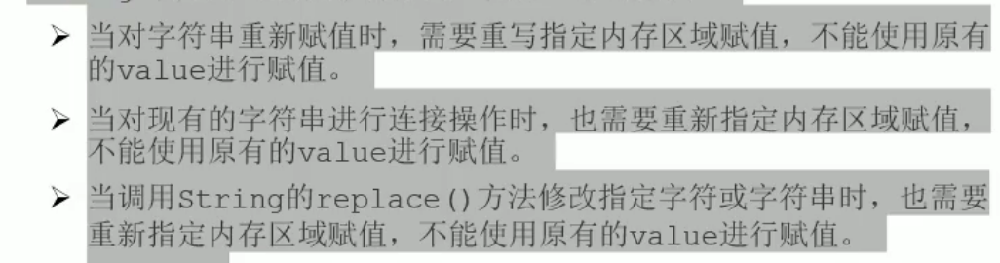

#### 1.12.2.1 代码理解

看代码理解不变性。

```java
String s1 = "abc";
        String s2 = "abc";

        System.out.println(s1==s2); //同一个字面量占用一个固定的地址。直到被垃圾回收。s1 s1引用的都是同一个地址。所以恒为true
        System.out.println("s1 : "+s1);
        System.out.println("s2 : "+s2);

        s1 += "123";               //改变字符串，不会改变原来地址上的 字面量的值。而是创造一个新的String,使用一个新的地址
        System.out.println(s1==s2); //恒为false
        System.out.println("s1 : "+s1);     //s1改变。不会影响s2的值,因为s1新开辟了一个空间。
        System.out.println("s1 : "+s2);
```


#### 1.12.2.2 分析下列代码

```java
public class ReferenceTest {
    static String str = new String("good");
    static char[] array = new char[]{'t','e','s','t'};

    static void change(String str,char[] array){
        str = "noob";
        array[0]  = 'b';
    }

    public static void main(String[] args) {
        System.out.println(str);
        System.out.println(array);

        change(str,array);

        System.out.println(str);
        System.out.println(array);

    }
}
```


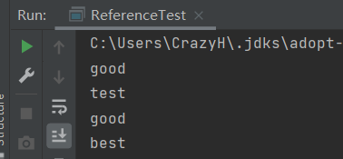

```
字符串不变性。
change()方法内str的引用，指向了一个新的内存地址。不会改变原来的"good"

数组类型，传递的是引用。改变了相同地址上的值。
```


### 1.12.3 更多特性


```
字符串常量池不会存储相同内容的字符串。同样内容的引用，指向的是永远是同一个地址。
```


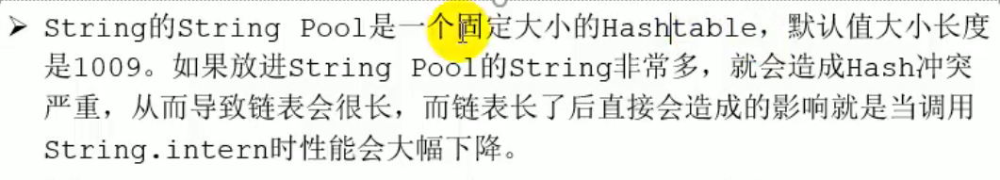

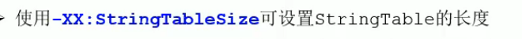


#### 1.12.3.1 字面量创建和new创建


字面量创建的字符串会在字符串常量池中。字符串常量池保证其唯一性。

而使用new关键字会在堆中再创建一个String类对象，也会在字符串常量池中，添加一个字符串常量（如果池内已有，则返回引用）

```
也就是说。
new String("abc");
这个操作，会创建2个对象（这里的对象是泛指。）
堆中一个String对象，常量池中一个常量。
```


下面是代码验证：

```java
        String a = "string";
        String b = "string";
        System.out.println(a == b);


        String c = new String("string");
        String d = new String("string");
        System.out.println(c == a);
        System.out.println(c == d);
```


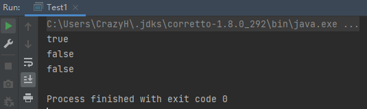


#### 1.12.3.2 String.intern()

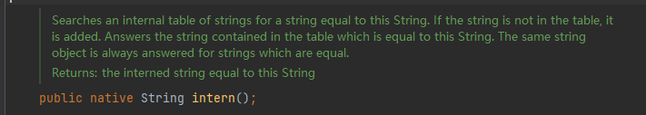

尝试将这个字符串对象添加到字符串常量池中。保证唯一性，如果已经存在则返回唯一引用。

```java
        String a = "string";
        String e = new String("string").intern();
        System.out.println(e==a);
```

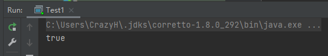

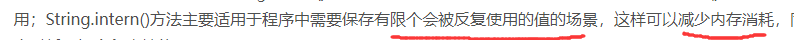

```
当然为了保证唯一性，需要消耗一定开销维护，属于时间换空间。
```


```
String s1 = new String("ab");
事实上会在 堆空间中创建一个对象，也会在字符串常量池中加入一个“ab”字符常量。
s1.intern()方法会返回，字符串常量池中“ab”的引用。
如：
```


```java
    public static void main(String[] args) {
        String s1 = new String("ab");
        String s2 = s1.intern();
        System.out.println(s1==s2);
        System.out.println(s1.hashCode());
        System.out.println(s2.hashCode());
    }
```

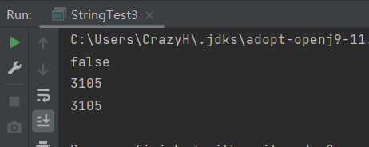

```
确实验证了，s1!=s2（内存地址不是一个）
```


#### 1.12.3.3 分析下列代码

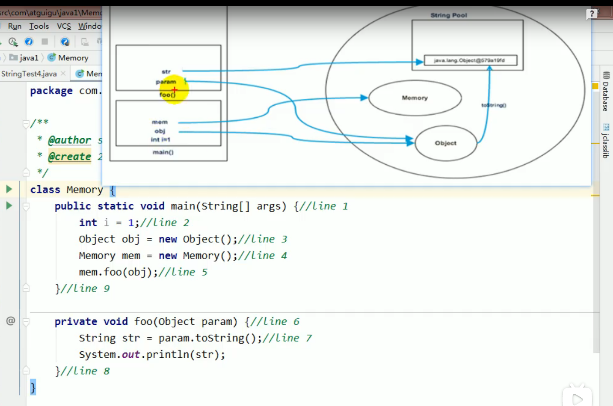


```
toString()方法生成的字符串会在字符串常量池里。
```

下面我们来验证一下。

```java
public class Person1 {
    @Override
    public String toString() {
        return "abc";
    }
}
```

```java
        Person1 person1 = new Person1();
        String s = person1.toString();
        String str = new String("abc");
        System.out.println(s==str);
        
        String ss = "abc";
        System.out.println(ss==s);
```

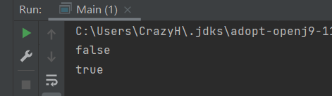

```
验证了，toString()生成的字符串在字符串常量池中。
```

#### 1.12.3.4 字符串的拼接

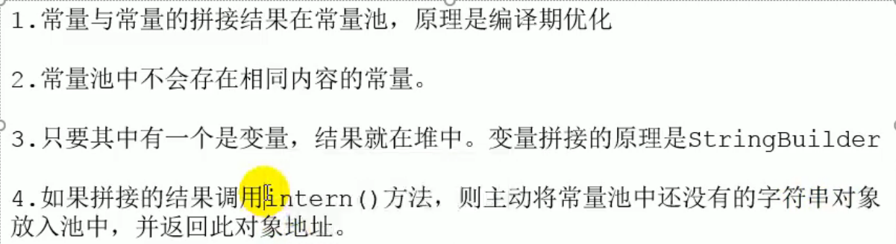


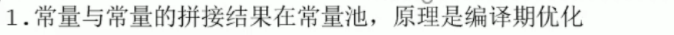

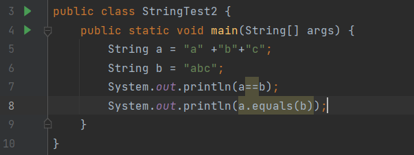

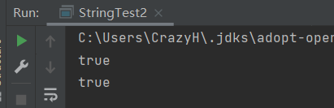

看一下编译后的.class文件是什么样的

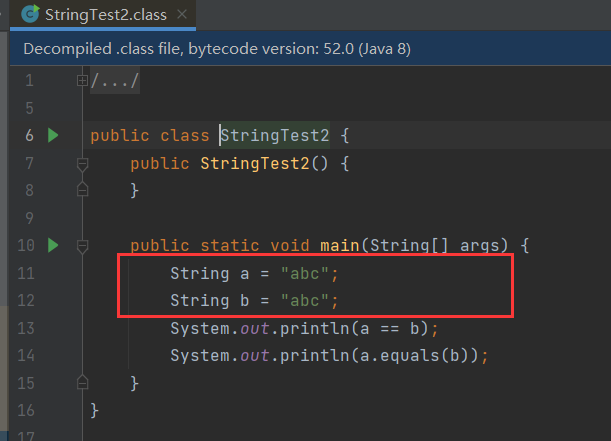

直接就把 "a"+"b"+"c"合并了


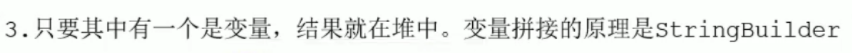

```java
    public static void main(String[] args) {
        String b = "abcdef"; //显然是存放在字符串常量池中
        String c = "def"; //变量c
        String d = "abc"+c; //变量参与运算
        System.out.println(b==c);//如果输出是false说明不在常量池中，在非常量池外的堆空间中。
        String e = d.intern();//尝试将字符串放入常量池
        System.out.println(e==b);
        
    }
```

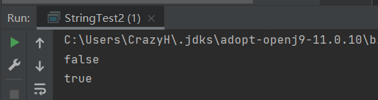


```
证明了带有变量的运算后，字符串会放入堆中。（非字符串常量池）
```


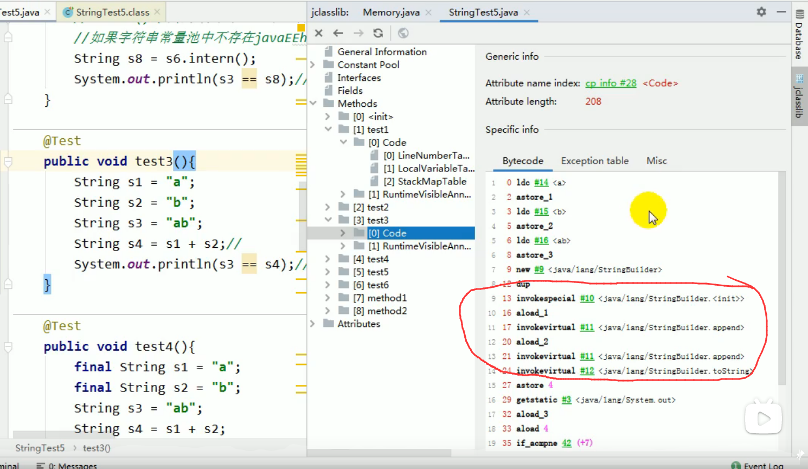

````
通过字节码指令清楚地看到。使用的是StringBuilder完成拼接的 
````


```java
public static void main(String[] args) {
    final String s1 = "a";
    final String s2 = "b";
    String s3 = s1+s2;
    String s4 = "ab";
    System.out.println(s3==s4);
}
```

````
有变量参与运算。输出结果是true。
原因是变量被final定义了，不再认为是变量，而是常量。
这一点从.class文件上可以看到。
````

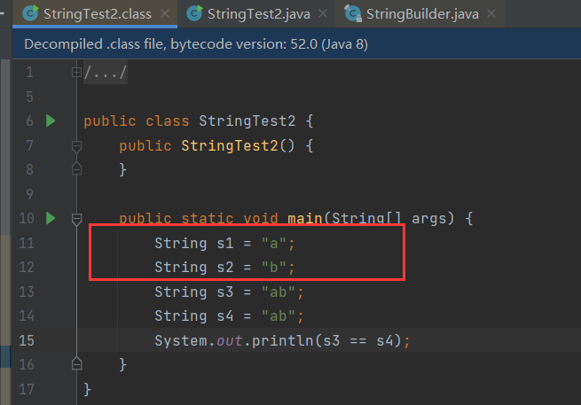

```
直接等价于 使用字面量申请字符串。
```


#### 1.12.3.5 G1的String去重操作

去重的是 堆空间中，非字符串常量池的重复字符串。

##### 1.12.3.5.1 背景

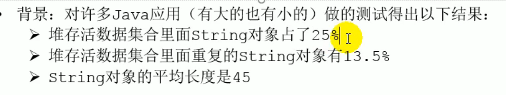


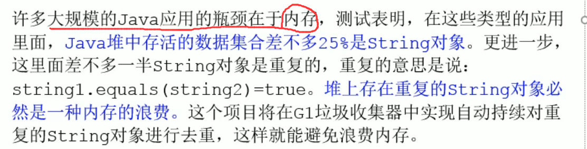

##### 1.12.2.5.2 实现

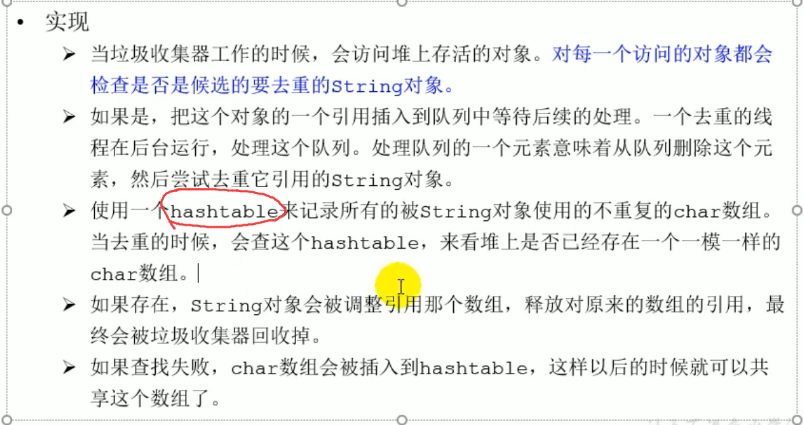

##### 1.12.2.5.3 开启G1的去重操作

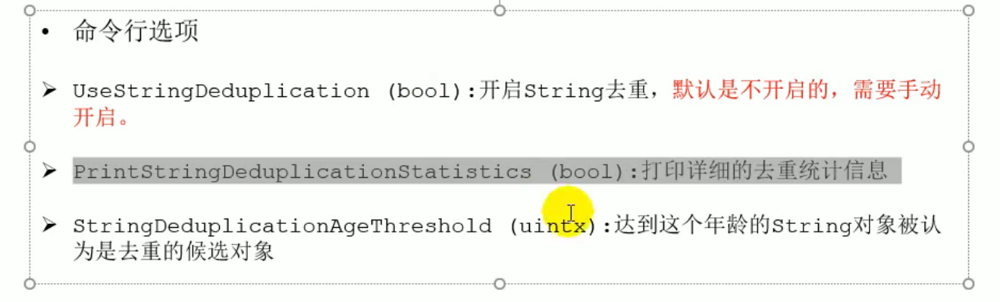


## 1.13 垃圾回收概述

### 

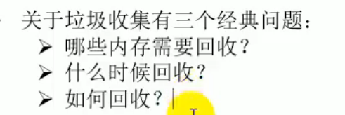


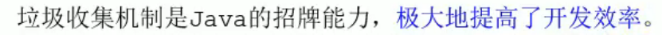


### 1.13.1 什么是垃圾

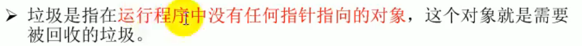


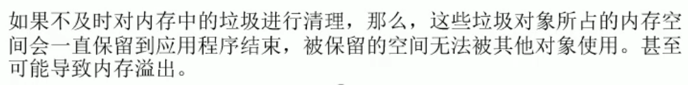


### 1.13.2 为什么要GC


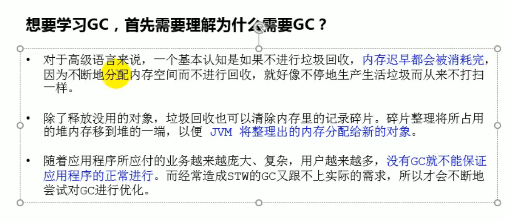


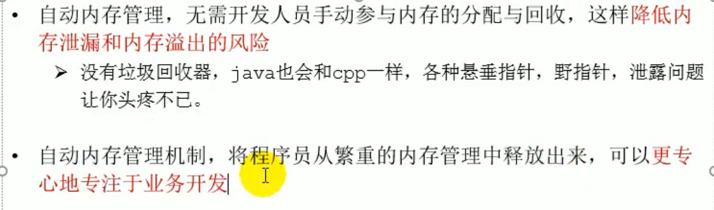


### 1.13.3 早期垃圾回收


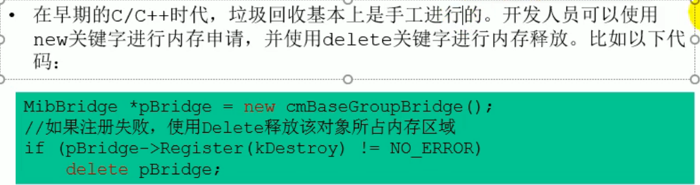

```
频繁的申请和回收。如果程序员忘记回收了不用的对象。有可能随着程序运行、这样的垃圾对象越来越多、导致内存泄漏
```

### 1.13.4 担忧

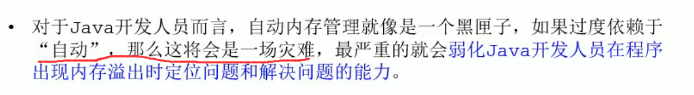

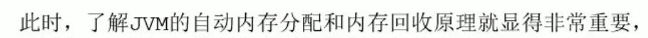


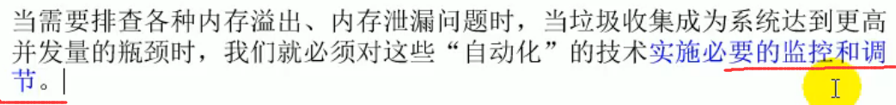


### 1.13.x 面试题

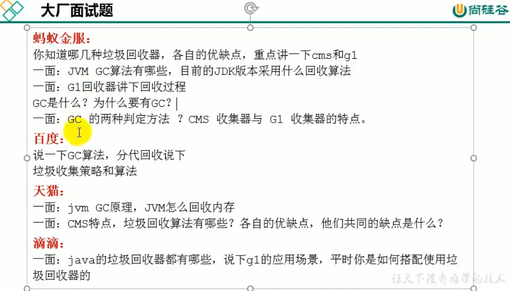


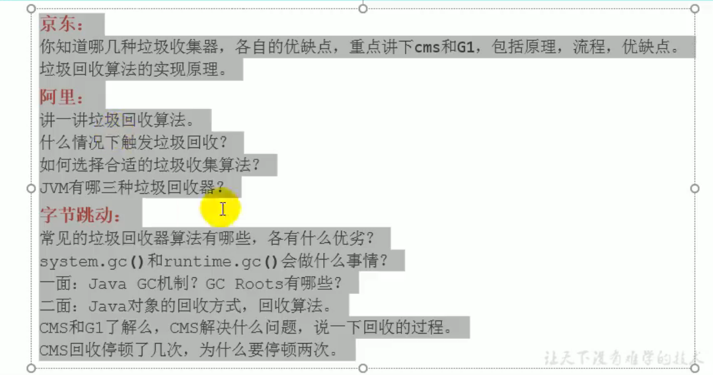


## 1.14 垃圾回收算法

整体分为两阶段：

```
标记阶段： 分析哪些对象是垃圾。
	引用计数法。
	可达性分析法。

清理阶段： 对垃圾对象清理。
```


### 1.14.1 垃圾标记阶段


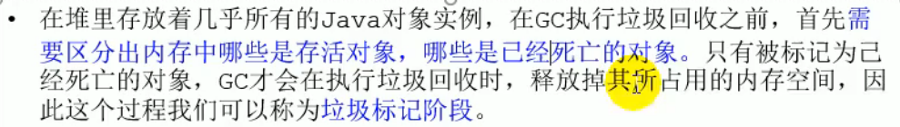


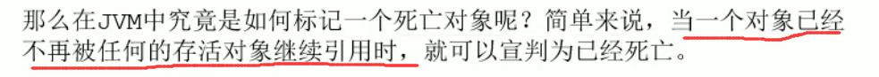


#### 1.14.1.1 引用计数法


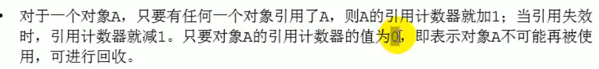


#### 1.14.1.2 引用计数法优点


#### 1.14.1.3 缺点

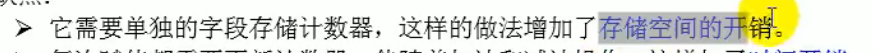


```
对于频繁创建凋亡的对象来说。频繁的++ -- 操作，开销更大。
```

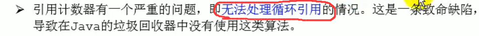

````
最致命的缺点。无法解决  循环引用问题。 导致这些循环引用对象永远无法被回收
````

循环引用：

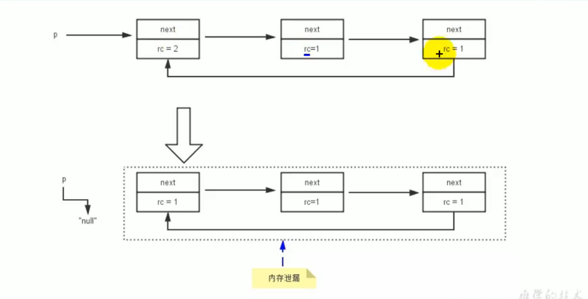


显示调用GC

```
System.gc();
```


#### 1.14.1.4 小结


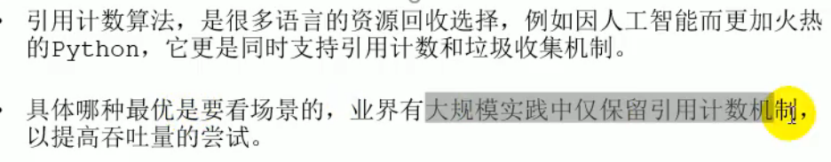


### 1.14.2 可达性分析算法

也称  根搜索算法。 追踪性垃圾收集

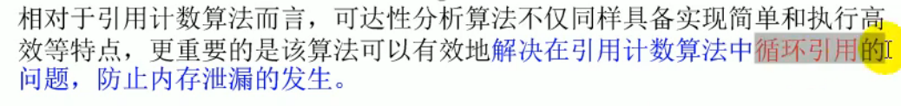


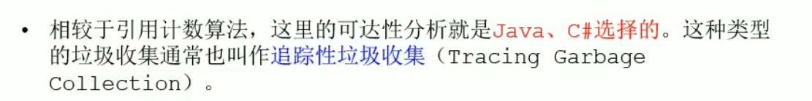

#### 1.14.2.1 GC roots

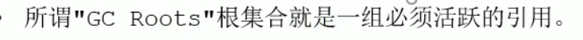


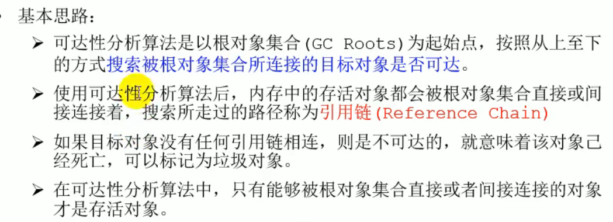


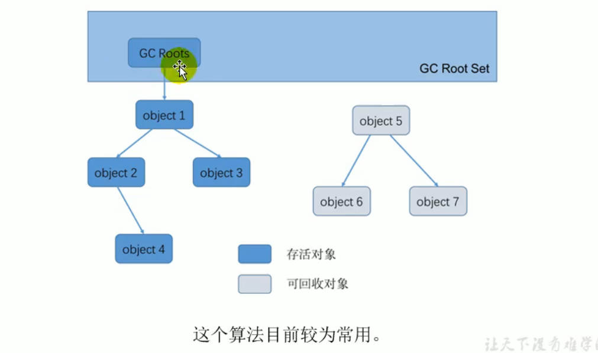


#### 1.14.2.2 哪些元素会被当做GC roots?

GC roots的组成？


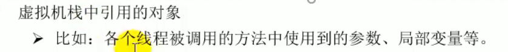


```
java栈，本地方法栈里对象的引用。

这两个很好理解，就是执行的方法会调用的 对象需要保留。
```


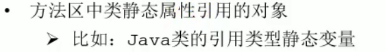

```
属于方法的静态变量。 类型信息没有被回收，那这个静态变量就一定不需要被回收。
```

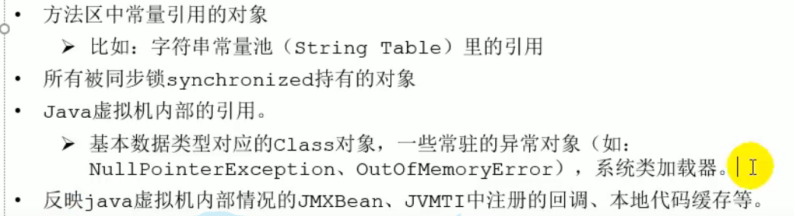 


```
作者：Accelerator
链接：https://www.zhihu.com/question/50381439/answer/120846441
来源：知乎
著作权归作者所有。商业转载请联系作者获得授权，非商业转载请注明出处。

1.System Class
----------Class loaded by bootstrap/system class loader. For example, everything from the rt.jar like java.util.* .
2.JNI Local
----------Local variable in native code, such as user defined JNI code or JVM internal code.
3.JNI Global
----------Global variable in native code, such as user defined JNI code or JVM internal code.
4.Thread Block
----------Object referred to from a currently active thread block.
Thread
----------A started, but not stopped, thread.
5.Busy Monitor
----------Everything that has called wait() or notify() or that is synchronized. For example, by calling synchronized(Object) or by entering a synchronized method. Static method means class, non-static method means object.
6.Java Local
----------Local variable. For example, input parameters or locally created objects of methods that are still in the stack of a thread.
7.Native Stack
----------In or out parameters in native code, such as user defined JNI code or JVM internal code. This is often the case as many methods have native parts and the objects handled as method parameters become GC roots. For example, parameters used for file/network I/O methods or reflection.
7.Finalizable
----------An object which is in a queue awaiting its finalizer to be run.
8.Unfinalized
----------An object which has a finalize method, but has not been finalized and is not yet on the finalizer queue.
9.Unreachable
----------An object which is unreachable from any other root, but has been marked as a root by MAT to retain objects which otherwise would not be included in the analysis.
10.Java Stack Frame
----------A Java stack frame, holding local variables. Only generated when the dump is parsed with the preference set to treat Java stack frames as objects.
11.Unknown
----------An object of unknown root type. Some dumps, such as IBM Portable Heap Dump files, do not have root information. For these dumps the MAT parser marks objects which are have no inbound references or are unreachable from any other root as roots of this type. This ensures that MAT retains all the objects in the dump.8
```

#### 1.14.2.3 注意


### 1.14.3 对象的 finalization


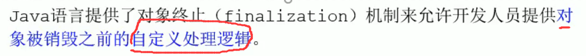


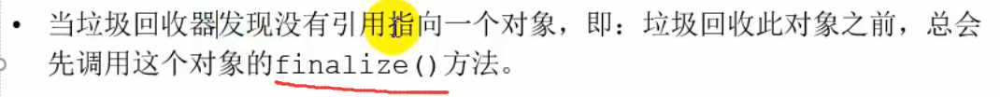

```
允许垃圾对象被回收前做体面的善后工作。
```


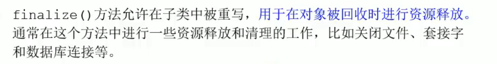

```
finalize() 是protected的方法，可以被子类重写。
```

#### 1.14.3.1 不要主动调用finalize()

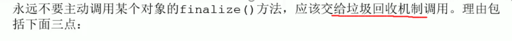


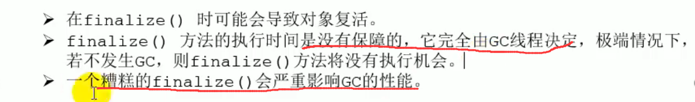


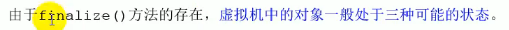


#### 1.14.3.2 垃圾回收角度下，对象的3个状态


当所有指向这个对象的引用都释放的情况下、对象转为`可复活`状态。（就像死缓一样。） 这个对象可能在finalize()方法中复活。


```
可触及。 GCroots 深度搜索下，能达到的对象。

可复活。  对象的所有引用都释放，但是对象可能在finalize()中复活。

不可触及。 对象的finalize()被调用，且没有复活。进入不可触及状态。finalize()方法只会被调用一次。
```


举一个复活对象的例子吧。

```java
public class ReliveObject {

    public static Object obj =null;

    @Override
    protected void finalize() throws Throwable {
        super.finalize();
        System.out.println("尝试复活自己");
        obj = this;
    }

    @Override
    public String toString() {
        return "我还活着!";
    }
}
```

```java
/**
*  VM options
*  -XX:+PrintGCDetails
*/

public class Main {
    public static void main(String[] args) {
        ReliveObject reliveObject = new ReliveObject();
        reliveObject = null;

        System.gc();
        try {
            Thread.sleep(3000);
        } catch (InterruptedException e) {
            e.printStackTrace();
        }

        if (ReliveObject.obj!=null) System.out.println(ReliveObject.obj.toString());
        else System.out.println("对象死亡");


        ReliveObject.obj=null;
        System.gc();
        try {
            Thread.sleep(3000);
        } catch (InterruptedException e) {
            e.printStackTrace();
        }

        if (ReliveObject.obj!=null) System.out.println(ReliveObject.obj.toString());
        else System.out.println("对象死亡");
         //对象的finalize方法仅仅会被调用一次，所以可以预见再次设置obj为null后，obj会被垃圾回收，该语句会被调用
    }
}
```

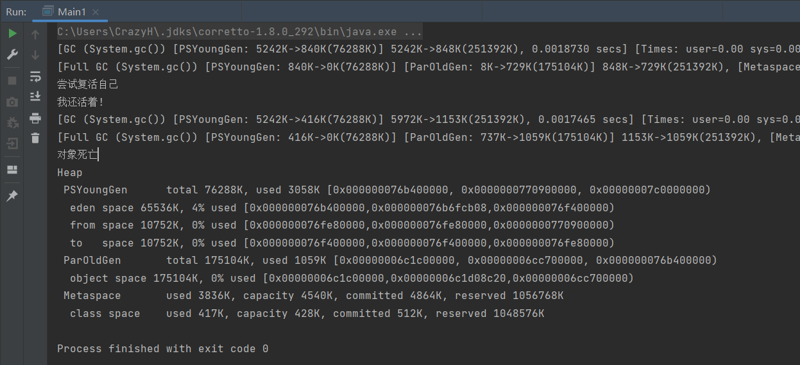

```
为何要让线程睡眠： 执行finalize()是由另一个线程去执行的。此时用户线程可能会继续运行。所以需要尝试sleep,释放cpu。
```


#### 1.14.3.4 执行finalize()的过程

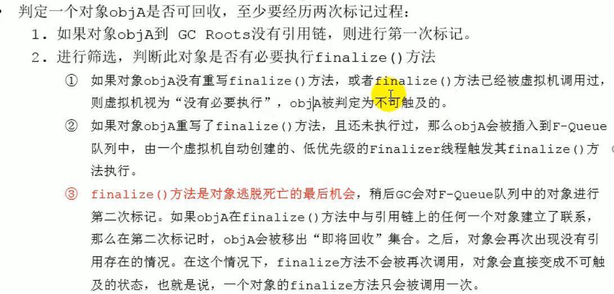

```
没有重写finalize()方法直接变为 不可触及状态。
```

```
jvm如何执行finalize()方法?
jvm不会停下用户线程。把所有要执行finalize()的对象加入到队列中（F-Queue）。
启动一个 较低优先级的Finalizer线程逐次执行finalize()方法。
```

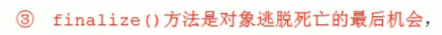

```
finalize()后，如果在GCroots引用链中，引用了该对象。那么这个对象就会复活。没有复活的对象被做上标记，下次GC时回收。
```


#### 1.14.3.5 finalize()方法扩展


在jdk9以后，Object.finalize()方法被弃用。

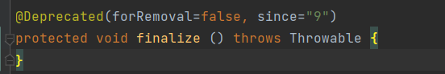

```
forRemoval字段 boolean类型。
表示在以后的版本中，api是否会被删除。
```

https://blog.csdn.net/qq_15612527/article/details/97019467


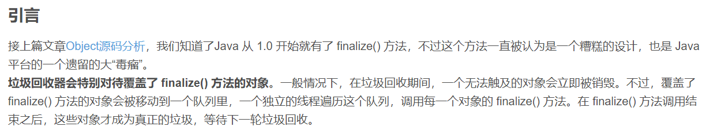


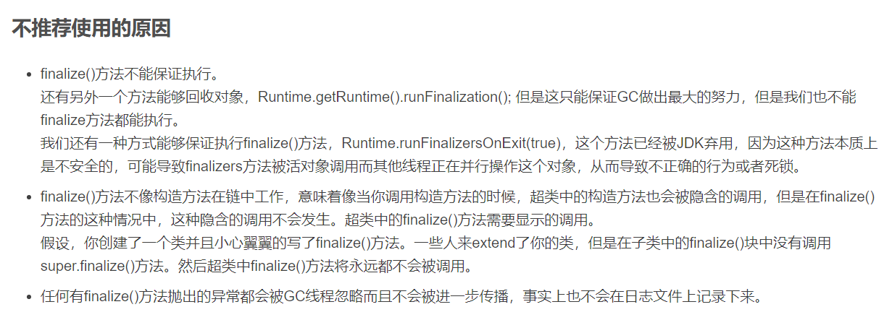


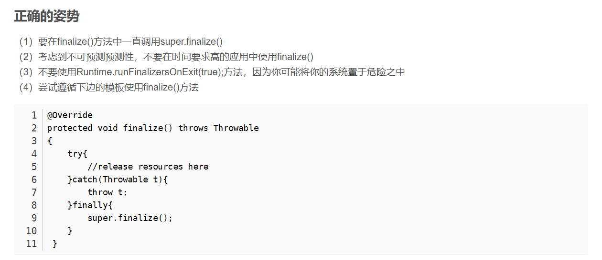


#### 1.14.3.6 监控工具

##### 1.14.3.6.1 生成dump文件

dump相当于某一时刻，JVM内存快照。用于分析这一时刻JVM内存状态。

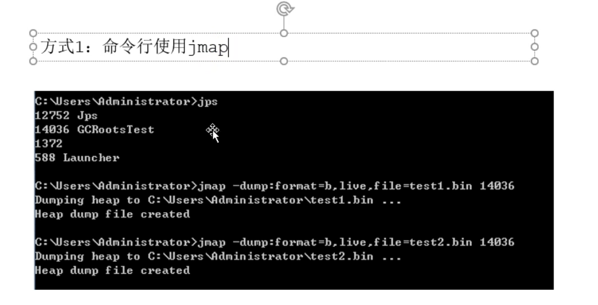


##### 1.14.3.6.2 GCroots溯源

```java
public class GCRoots {
    public static void main(String[] args) {

        ArrayList<Integer> list = new ArrayList<>();
        Date birth = new Date();
        for (int i = 0; i < 100; i++) {
            list.add(i);
        }


        new Scanner(System.in).next();

        list=null;
        birth=null;

        new Scanner(System.in).next();
    }

}
```


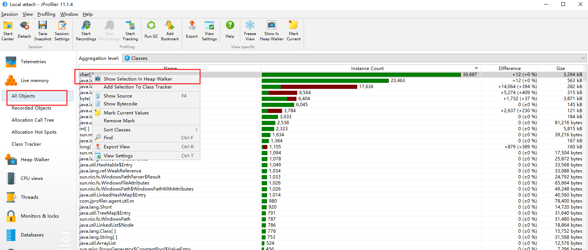


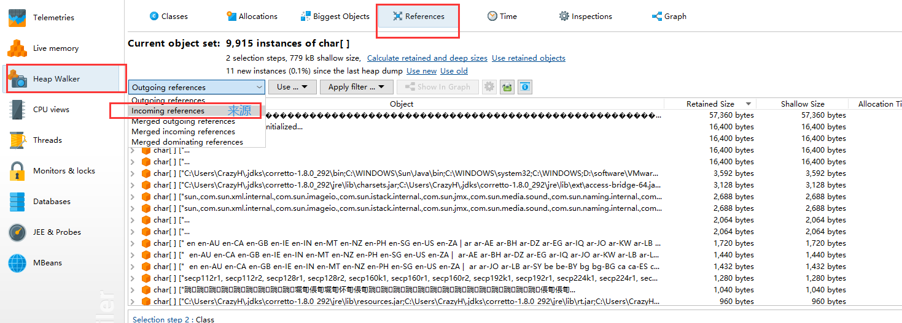


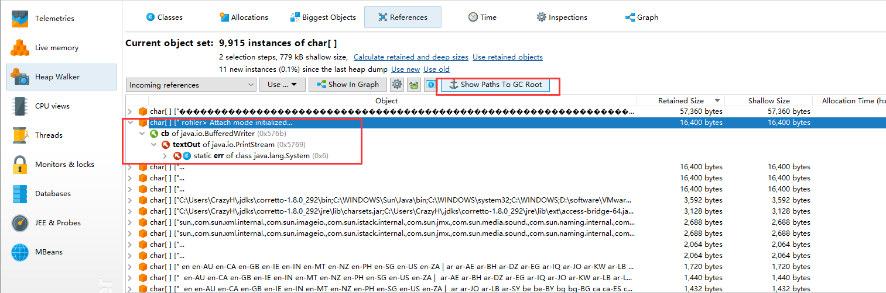


##### 1.14.3.6.3 对OOM监控

```java
import java.util.ArrayList;

/***
 *
 * -Xms8m -Xmx8m -XX:+HeapDumpOnOutOfMemoryError
 *
 */
public class Main {

    byte[] buffer = new byte[1024*1024];//1MB

    public static void main(String[] args) {
        ArrayList arrayList = new ArrayList();

        while (true){
            arrayList.add(new Main());
        }
    }
}
```

```
-XX:HeapDumpOnOutOfMemoryError
当程序出现OOM异常的时候，就生成Dump文件。
```

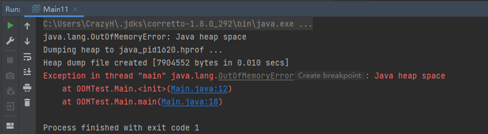


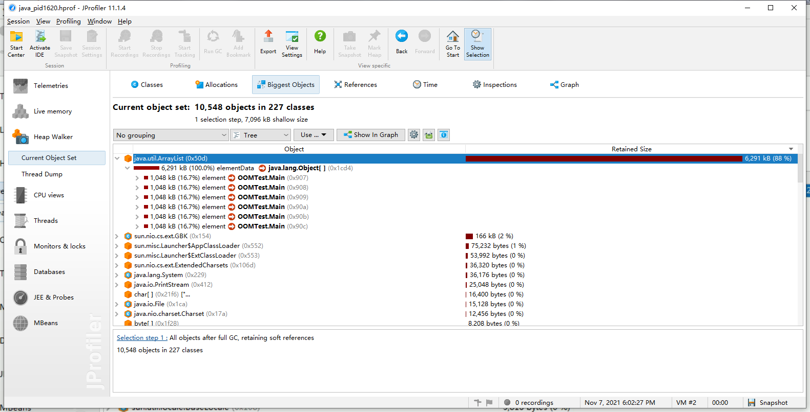


### 1.14.4 清除阶段


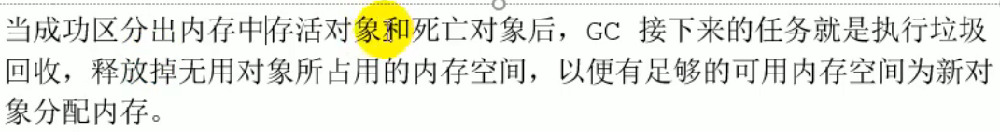

```
标记阶段结束后。区分垃圾对象和其他对象以后，执行清除阶段。
```


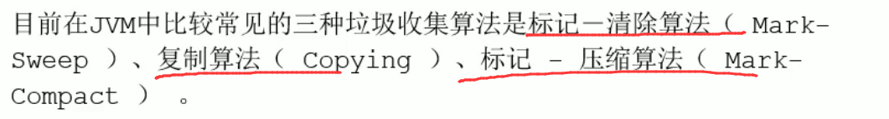


#### 1.14.4.1 标记-清除算法（mark-sweep）

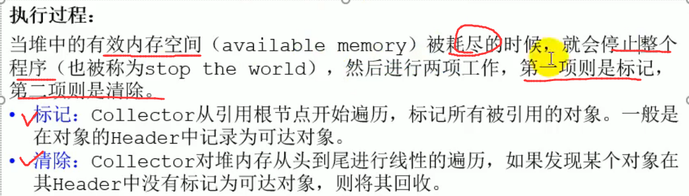


##### 1.14.4.1 优点

实现比较简单


##### 1.14.4.2 缺点

```
效率一般。需要遍历所有的内存空间。（如果是维护空闲列表，只需要遍历1次。只需要修改空闲列表）

存在STW ，停止用户线程的情况。

清理出来的内存不是连续的。对大对象分配不友好。需要维护空闲碎片列表
```


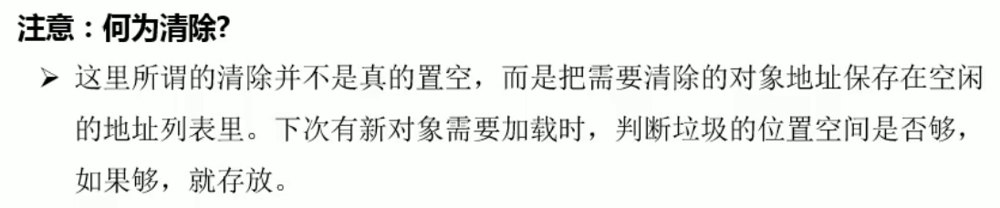


#### 1.14.4.2 复制（copying）算法


```
有点像s0区和s1区
```


##### 1.14.4.2.1 优点

实现简单。

复制过去空间连续、没有内存碎片。

##### 1.14.4.2.2 缺点

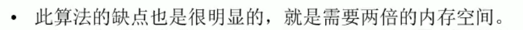


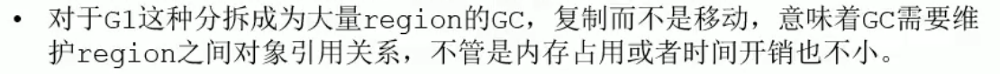

```
reference存放的地址值需要跟着一起改变。
```


```
如果垃圾回收的效果不理想（一次回收的对象并不是很多）导致需要复制很多个存活的对象。复制算法的时间开销进一步增大。


反观一下新生代的对象。大部分都是生命周期较短的。所以s0 s1区比老年代更适合使用复制算法。

```


​	


#### 1.14.4.3 标记-压缩算法

回忆一下 对象晋升老年代的特例。如果超大对象无法分配在年轻代，就会尝试直接在老年代分配。

所以，老年代大空间是作为分配超大对象的保障。老年代产生空间碎片是较差的选择。

标记-压缩算法可以整理老年代的碎片。


##### 1.14.4.3.1 执行过程

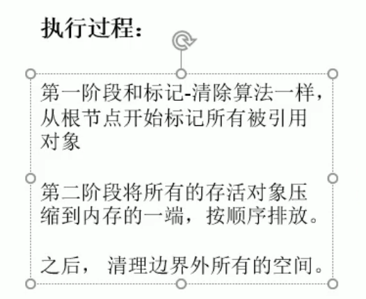


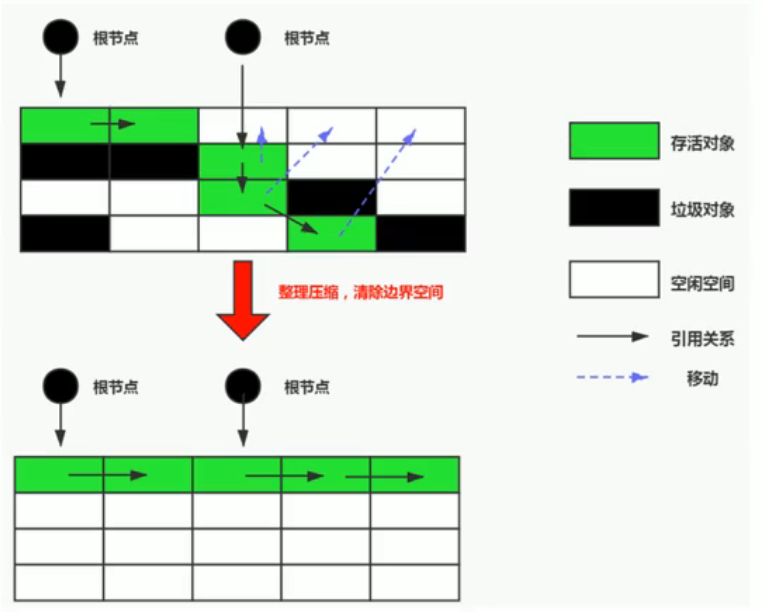


```
事实上可能一次遍历就完成。采用双指针方法。

第一阶段 和 第二阶段 并不代表需要遍历两次。
```


##### 1.14.4.3.2 优点


```
标记压缩算法清除后的空间，是连续的。
所以，可以使用指针碰撞来分配新对象了。
```


##### 1.14.4.3.3 缺点


```
当然，只要涉及到移动对象了。一定会修改栈帧局部变量表中的 reference值
```


#### 1.14.4.4  三种垃圾回收算法对比


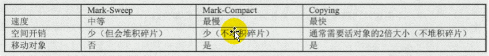


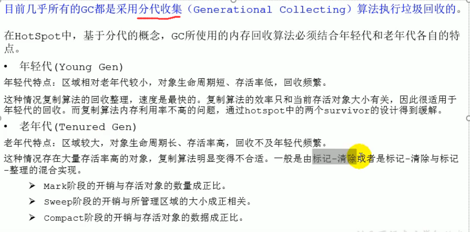

```
分代收集。就是考虑各个年龄代之间的特点，分别采取最适合的算法。
```

 

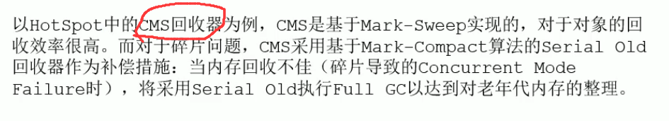


#### 1.14.4.5 增量收集算法

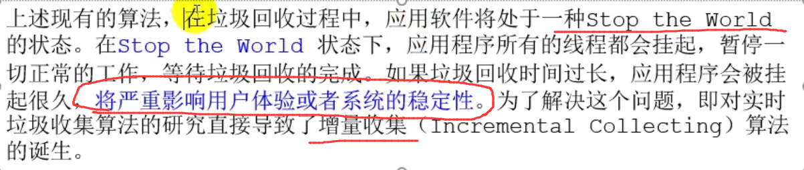


##### 1.14.4.5.1 基本思路

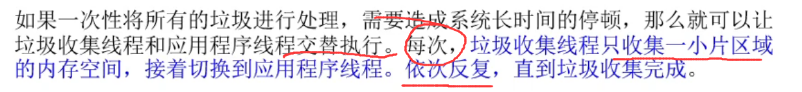

```
其实思想类似于 cpu时间片轮换制度。
向 长时间的stw 或 长时间的GC折中妥协的一种产物。

当然必然带来一定的额外开销，比如记录上一次GC的工作状态，也可以理解为GC线程和用户线程切换的开销。
```

##### 1.14.4.5.2 优点

避免用户线程过多的stw，用户线程总是可以在一定的时间内得到一定的相应。

##### 1.14.4.5.3 缺点

如上面：

GC线程和用户线程切换上下文，必然带来额外的时间空间开销。


#### 1.14.4.6 分区算法


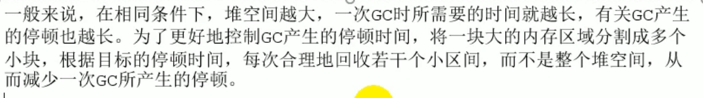

```
分区算法的目的和上面的 增量回收算法一样。
都是为了减少一次GC用户线程STW的停顿时间。

增量收集算法，采取的是类似时间片的思想。执行一段GC执行一段用户线程。

分区算法则是把堆区分成若干区域，每次合理回收若干个小区域就返回用户线程。
```


### 1.14.5 小结


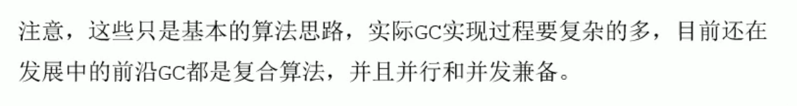


## 1.15 垃圾回收相关概念


### 1.15.1 System.gc()方法


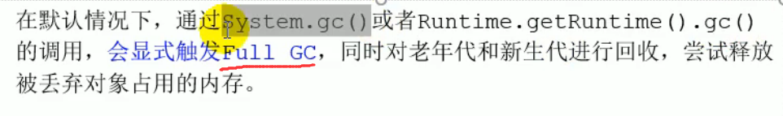

```
注意，full GC 也包含元空间的回收。

当然回收某个Class 需要先回收加载这个类的 ClassLoader
```


```
注意： 这里无法保证指的是   无法保证立即执行对象重写的Object.finalize() 方法。
原因上面提到过，对象会被添加到F-Queue队列。由Finalizer线程执行，而这个线程的优先级比较低。cpu不总是选择执行这个线程。


gc(垃圾回收)一定是会立即执行的。否则，如果没有垃圾回收行为，也无法将 垃圾对象添加到异步队列里。
```

如果想要立即执行 Finalizer线程可以调用  System.runFinalization()方法。

#### 1.15.1.1 System.runFinalization()


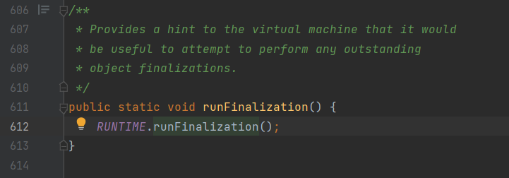

```
告诉虚拟机，应当安全的去尝试执行  等待队列里垃圾对象的finalize()方法。


也就是说会阻塞当前线程，转而执行Finalizer线程。
```


### 1.15.2 引入一些例题代码

对应 视频P156

https://www.bilibili.com/video/BV1PJ411n7xZ?p=156

```java
/**
*  -XX:+PrintGCDetails
*/


public class LocalVar {
    public void localVarGC1(){
        byte[] buffer = new byte[10 * 1024 * 1024];//10MB
        System.gc();
    }

    public void localVarGC2(){
        byte[] buffer = new byte[10 * 1024 *1024];
        buffer =null;
        System.gc();
    }

    public void localVarGC3(){
        {
            byte[] buffer = new byte[10*1024*1024];
        }
        System.gc();
    }

    public void localVarGC4(){
        {
            byte[] buffer = new byte[10*1024*1024];
        }
        int value =1;
        System.gc();
    }

    public void localVarGC5(){
        localVarGC1();
        System.gc();
    }

    public static void main(String[] args) {
        LocalVar localVar = new LocalVar();
        localVar.localVarGC1();
    }
}
```


```java
//暂且只运行 GC1（）方法。观察GC情况
    public void localVarGC1(){
        byte[] buffer = new byte[10 * 1024 * 1024];//10MB
        System.gc();
    }
    public static void main(String[] args) {
        LocalVar localVar = new LocalVar();
        localVar.localVarGC1();
    }
```

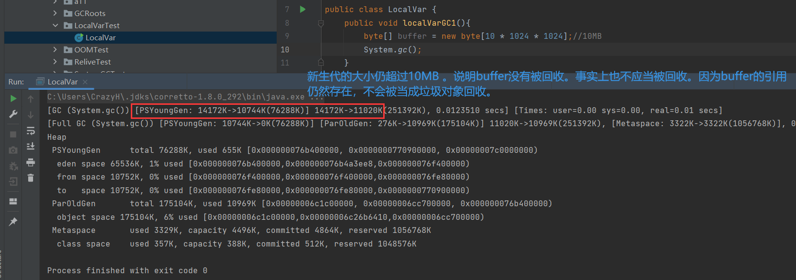

```
YoungGC中，回收了一些其他对象，把14172K降到了11020K。
但仍大于10MB，说明buffer未被回收。
事实上存在 buffer的引用，这个对象不会作为辣鸡对象回收。
```

如果你还不敢肯定，剩下的这个超过10MB的对象中包含buffer，那么可以尝试让线程休眠。使用JProfiler查看此时堆内存的情况。

```java
    public void localVarGC1(){
        byte[] buffer = new byte[10 * 1024 * 1024];//10MB
        System.gc();

        try {
            Thread.sleep(1000000);
        } catch (InterruptedException e) {
            e.printStackTrace();
        }
    }
```

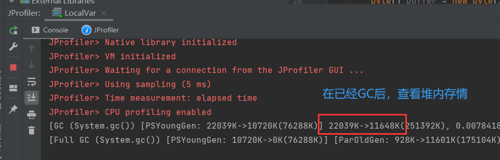

查看快照以后，查看大对象。就是byte[]

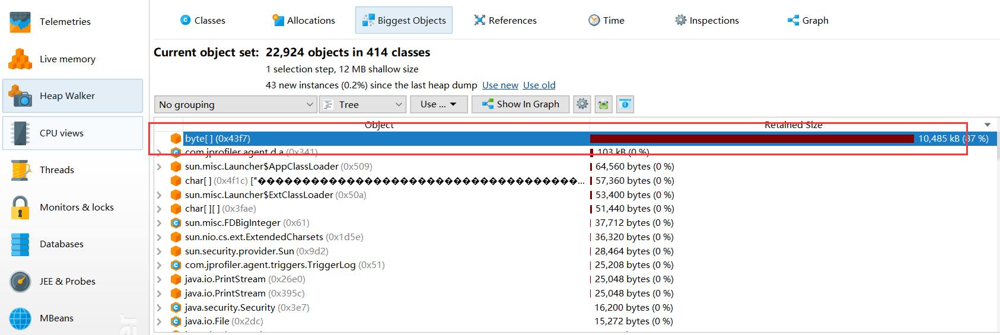


```java
//现在将 buffer=null。清除buffer对原来地址的引用。再进行垃圾回收。
	public void localVarGC2(){
        byte[] buffer = new byte[10 * 1024 *1024];
        buffer =null;
        System.gc();
    }
    public static void main(String[] args) {
        LocalVar localVar = new LocalVar();
        localVar.localVarGC2();
    }
```

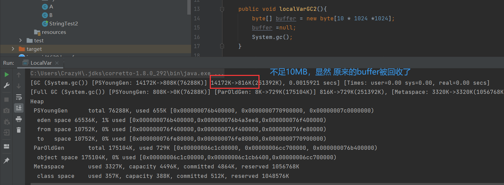


```java
//将buffer写在代码块中，代表了buffer的作用域局限在了代码块之中。
//在代码块之外调用GC，会回收buffer对象吗？
//看一下运行结果
	public void localVarGC3(){
        {
            byte[] buffer = new byte[10*1024*1024];
        }
        System.gc();
    }
    public static void main(String[] args) {
        LocalVar localVar = new LocalVar();
        localVar.localVarGC3();
    }
```

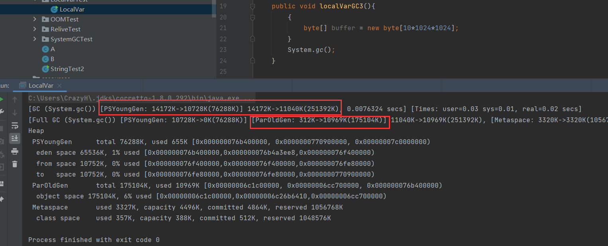

```
GC并没有将buffer回收。

先来回忆一下GCroots的组成，其中包含两个栈，java栈和本地方法栈。
在这两个栈中对象的引用，就是roots的组成之一。
引用具体指的就是 局部变量表中的reference
也就是在局部变量表占1个slot的 引用类型。这个引用指向了堆内存的对象，保
证了这个对象不会被当作垃圾。

现在buffer没有被当作垃圾回收，说明局部变量表中仍然存在这个对象的引用。
由于slot复用机制，定义一个局部变量，把slot覆盖，再测试GC情况。
```


```java
    public void localVarGC4(){
        {
            byte[] buffer = new byte[10*1024*1024];
        }
        int value =1; //slot复用。把超出作用域buffer的slot覆盖再调用GC
        System.gc();
    }
```

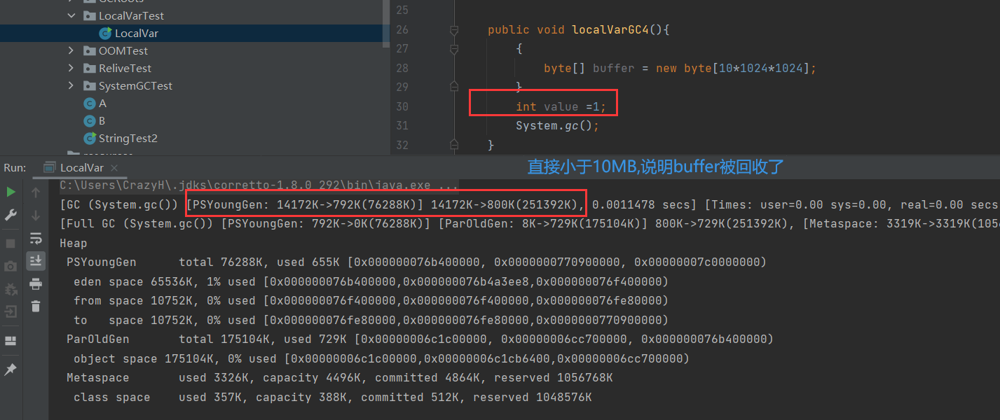

```
确实说明了，局部变量表中slt导致buffer无法回收。
覆盖了buffer引用的slot被覆盖了以后，正常回收；
可以通过JClasslib查看一下slot的使用情况。
```

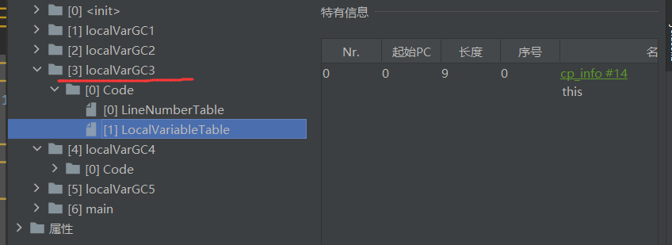

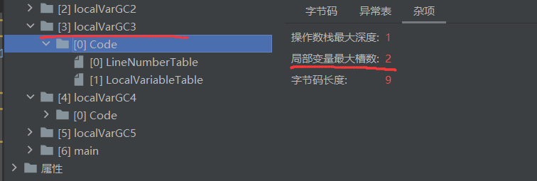

```
对于GC3方法来说。
局部变量表最大的深度就是2。由于作用域的原因。
在方法最后，局部变量表深度为1。

复习一下，由于是非静态方法。局部变量表的起始slot就是 这个类的实例this。
（Caller instance）
```

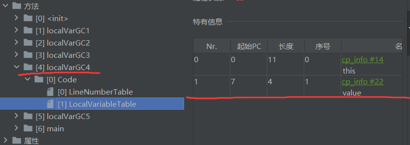

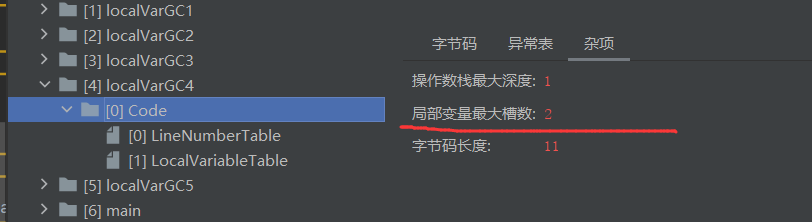

```
GC4()方法，由于slot复用 int value 占用了buffer的slot。再也没有栈内的引用指向堆空间的buffer对象了。buffer就被当做垃圾回收了。

同时也侧面证明了。slot中不用的slot槽不会立即置空。而是等下一个对象引用复用时才会覆盖。如果后面永远都没有被覆盖，那么只能等到这个方法调用完毕，
栈帧退出java栈。再回收堆内的对象。

如同localVarGC5()方法一样
```

```java
    public void localVarGC5(){
        localVarGC1();
        System.gc();
    }
    public static void main(String[] args) {
        LocalVar localVar = new LocalVar();
        localVar.localVarGC5();
    }
//方法调用完毕。栈帧退出java栈，至此没有指向堆内buffer的引用。buffer对象被回收了。
```

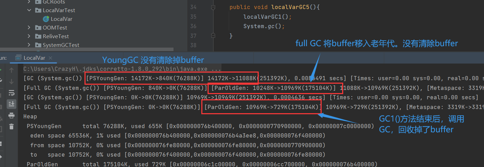


### 1.15.3 内存溢出 和 内存泄漏


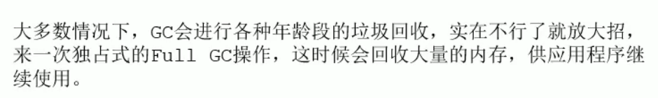


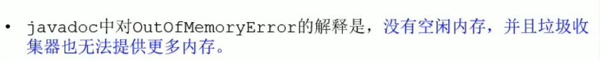


#### 1.15.3.1 Java堆内存不够的可能原因

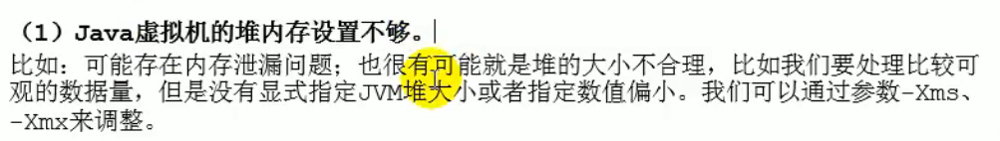

```
原因1.堆空间设置过小。
```


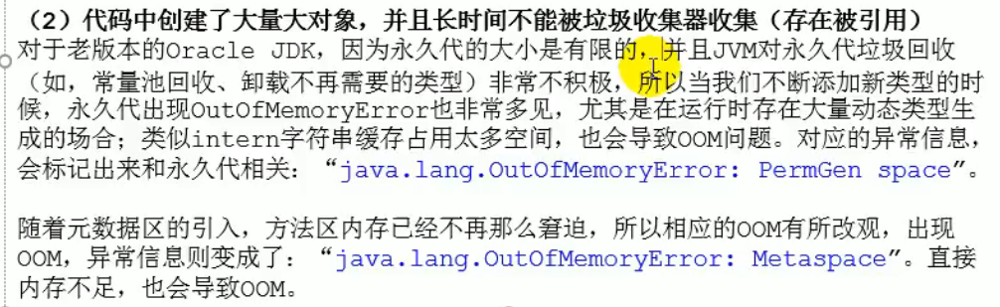

```
原因2.程序运行时间久了，存在垃圾了。需要垃圾回收了。
```


```\
通常，报OOM以前，JVM会尝试GC。当GC以后的空间仍不能分配下大对象，同时堆空间也不能再扩展，就会报OOM。

如果分配超大对象干脆直接超过了堆的最大容量，那就不用GC了，直接OOM吧
```


#### 1.15.3.2 内存泄漏 Memory Leak


##### 1.15.3.2.1 什么是内存泄漏


```
不再使用的垃圾对象，却无法被回收的现象。叫做内存泄漏
（他本应该被回收的，却没有）
```


````
内存泄漏不一定会立即导致OOM。 小的内存泄漏会慢慢蚕食可用的内存空间。最终可能会导致OOM。
````


正常运行情况：

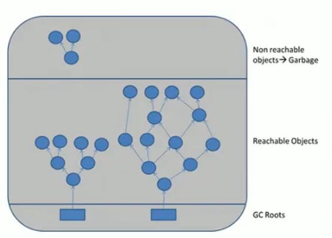


当有些对象不需要再使用。却忘记断开引用：

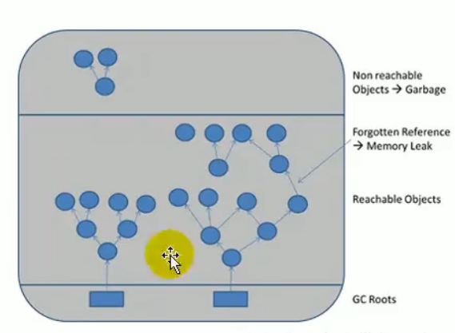


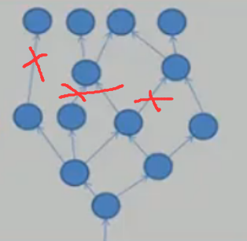


左侧的引用都断开了，最右侧忘记断开的引用。导致可达性算法分析，从是可以从GCroots遍历到想要回收的垃圾对象。导致无法回收垃圾对象。

##### 1.15.3.2.2  内存泄漏举例


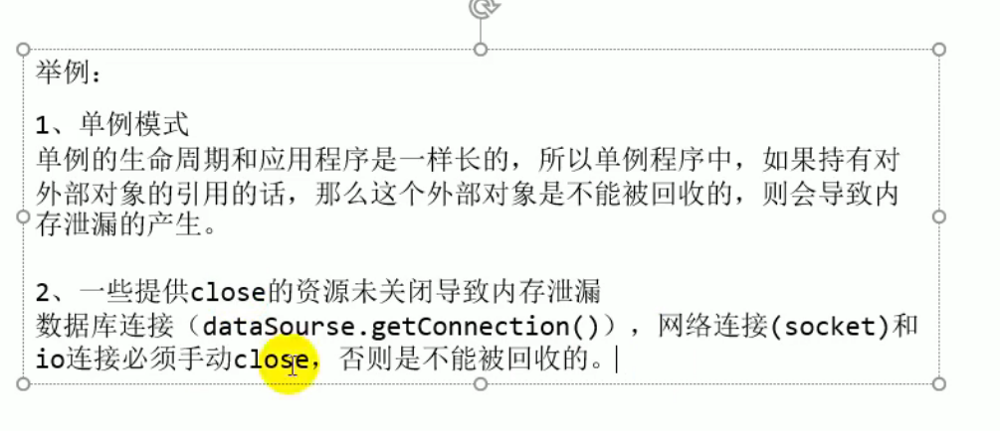


#### 1.15.4 Stop the world

#### 1.15.4.1  什么是STW？

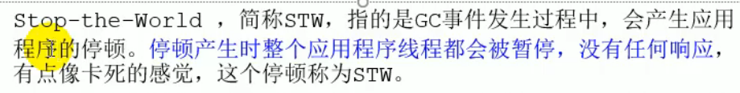

```
此处 应用程序 主要指用户线程。
```


例如在 可达性算法分析时，就需要STW，对当前内存快照进行GC相关的分析

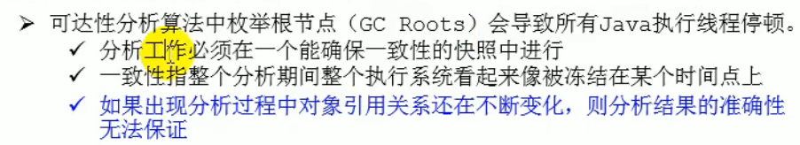


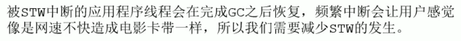

```
应当减少STW的频率，或者降低 STW的时间。
```


#### 1.15.4.1 关于STW你需要知道的点

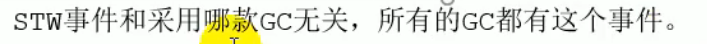

```
就像前面说的。JVM目前采用的可达性分析算法。不同时刻GCroots是动态变化的。分析GCroots到底有谁的时候，就需要停止用户线程，让内存里的对象暂时“冻结”，对其进行分析，回收垃圾对象。

所以与具体哪一款 垃圾回收器无关。
但一个良好垃圾回收器，应该在满足工作要求的同时尽量的减少STW的频率或减少每次STW的时间
```


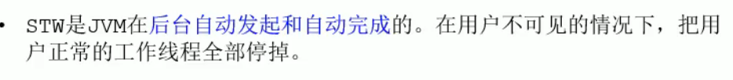


#### 1.15.5.4 可达性算法 与 STW


```
迄今为止所有的垃圾回收器，在枚举GCroots都会 STW。
因为必须保证一致性的快照中进行。
```


```
可达性分析算法耗时最长的，遍历 引用链。这个过程，已经可以与用户线程并发了。
```


### 1.15.5 垃圾回收与 并行并发

先回顾并行并发的概念：

#### 1.15.5.1 并发

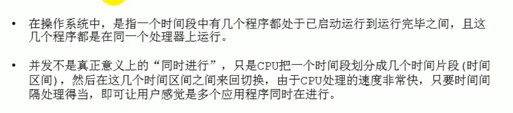


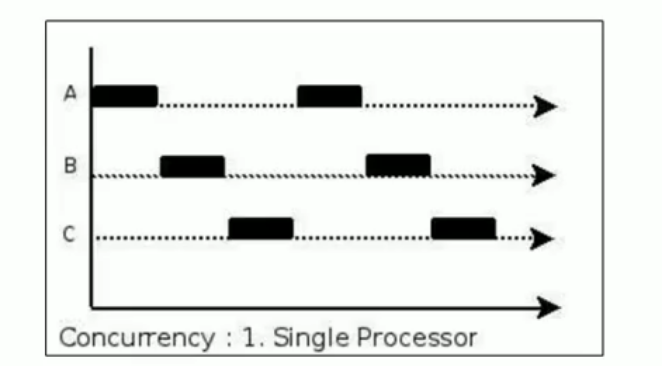


#### 1.15.5.2 并行 

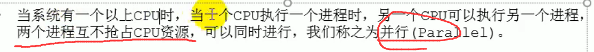


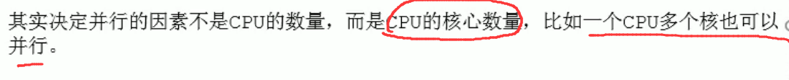

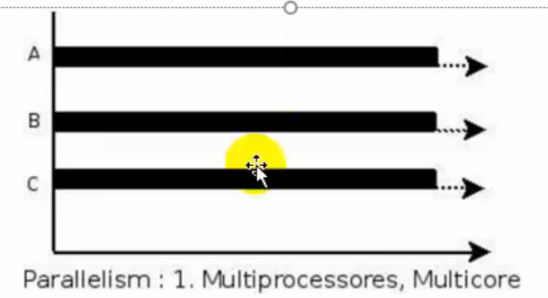

 


#### 1.15.5.3 垃圾回收的并发与并行

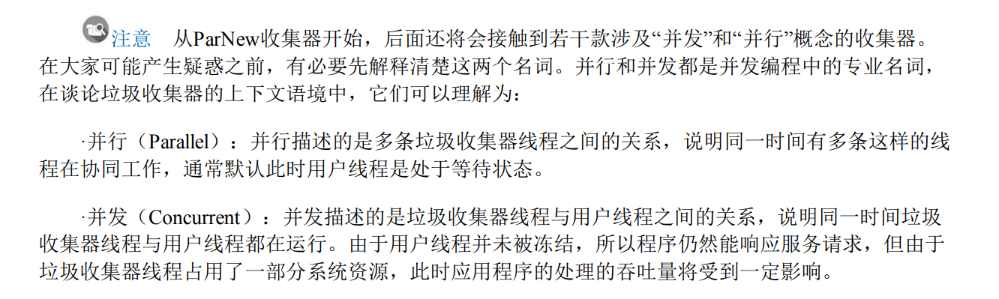


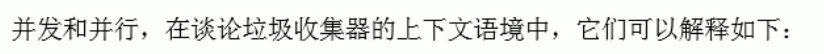

```
注意指多个垃圾回收线程之间。不是垃圾回收线程和用户线程并行。
垃圾回收时，用户线程一定会STW，不会并行。
```

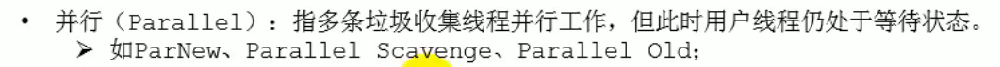


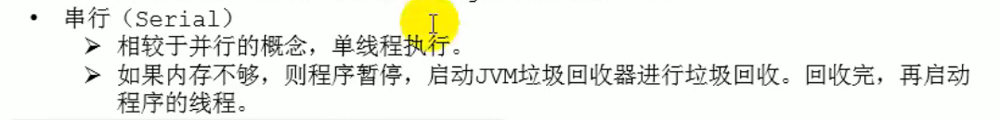


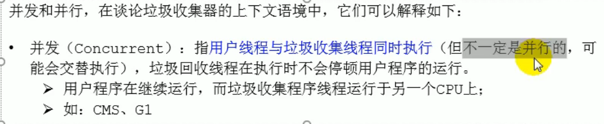


### 1.15.6 安全点，安全区域


#### 1.15.6.1 安全点

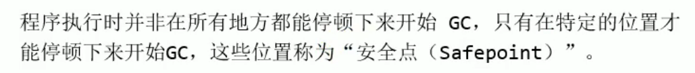

```
这个概念和 计组中 中断响应周期 很像。
仅在 中断响应周期中 响应中断请求。

在安全点处响应GC请求。
```


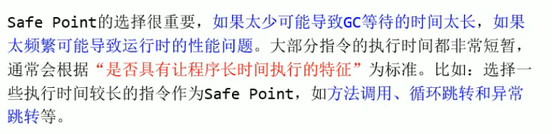


##### 1.15.6.1.1如何让所有线程都停在安全点

```
垃圾收集器工作时，需要让 所有线程 STW。
但是各个线程并不一定都同时到达安全点，所以需要安排先到达安全点的线程在安全点挂起等待。
```

以下是两种 让所有线程都到达安全点的方式：


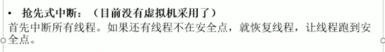


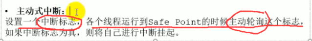

```
先到达安全点的线程先被挂起等待。
直到所有的线程都到达了安全点，这时垃圾回收线程独自运行。
```


#### 1.15.6.2 安全区域 

如果程序不运行（比如sleep/blocked），那么线程将在很长一段时间没办法达到最近的安全点。

此时，安全区域解决了这个问题。


```
在可达性算法中，需要遍历引用链。
如果某个代码区域内不会改变引用，进而不会改变引用链。自然就是 安全区域
```

##### 1.15.6.2.1 安全区域运行过程

线程如何在安全区域附近运行的？

```
当用户线程执行到安全区域里面的代码时，标识已经进入了安全区域。
在安全区内，如果虚拟机要发起GCroots枚举或者其他需要STW的操作时，直接忽略安全区内的线程。

当用户线程准备离开安全区，需要检查虚拟机是否已经完成了根节点枚举。
如果完成了，那线程就当作没事发生过，继续执行；否则它就必须一直等待，直到收到可以 离开安全区域的信号为止。
```


```
根据上面安全区的运行过程，自然可以想到。对于用户线程来说，可以运行至安全区内最远的代码，而不必像安全点那样在最近的安全点处停止。
相当于一定程度上减轻了STW的停顿影响。
```


### 1.15.7  再谈引用


#### 1.15.7.1 传统意义上的引用

在jdk1.2以前。引用是这样定义的：“如果reference类型的数据中存储的数值代表的是另外一块内存的起始地址，就称该reference数据是代表 某块内存、某个对象的引用。” 

```
这种定义，未免有点狭隘。
有时我们需要如下的引用关系：
```


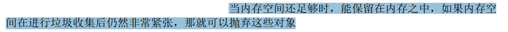

```
这意味着，这类对象保留时可以发挥一些辅助性作用。当严格不需要时，也可以抛弃并不影响程序正常运行。

“缓存”数据  就很好的符合这种模型。事实上在java中，这种引用关系称为
“软引用”。
```

#### 1.15.7.2 引用的扩充

```
强引用 （Strong Reference）
软引用  (Soft Reference)
弱引用  (weak Reference)
虚引用  (Virtual Reference)
```

##### 1.15.7.2.1 强引用

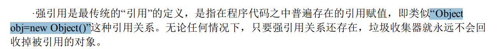

```
只要强引用存在，GC宁愿抛出OOM异常，也不会回收强引用对象。
言外之意 强引用对象关乎着程序的正常运行，没了它程序就会出错。
```


##### 1.15.7.2.2 软引用

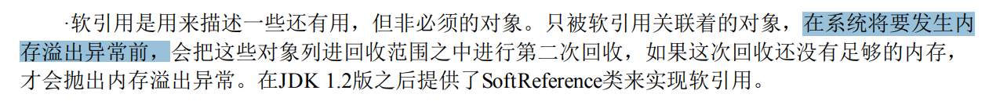

```
不得不抛出OOM前，GC尝试回收软引用对象。
如果回收了软引用对象还不够空间，抛出OOM。
```


##### 1.15.7.2.3 弱引用

被弱引用关联的对象只 能生存到下一次垃圾收集发生为止。

````
只要GC就会收集 弱引用 对象。
````

```java
public class WeakReferenceTest {
    public static void main(String[] args) {

        ReferenceQueue queue = new ReferenceQueue();
        String str = new String("abc");
        WeakReference wr = new WeakReference(str,queue);

        str = null;//取消强引用关系
        System.out.println("[Before GC] : ");
        System.out.println(wr.get());

        System.gc();
        try {
            Thread.sleep(2000);
        } catch (InterruptedException e) {
            e.printStackTrace();
        }
        System.out.println("[After GC] : ");
        System.out.println(wr.get());

    }
}
```

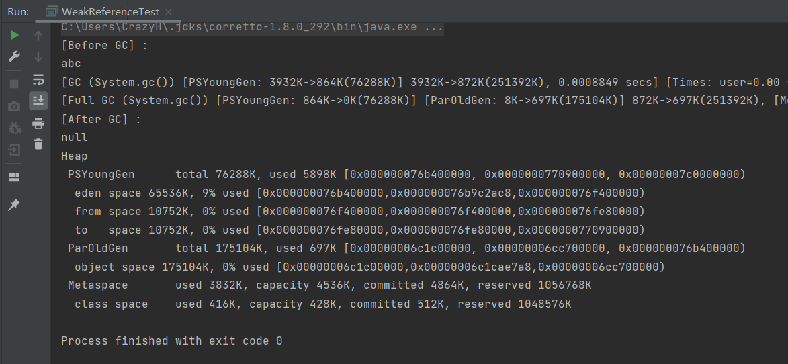


##### 1.15.7.2.4 虚引用

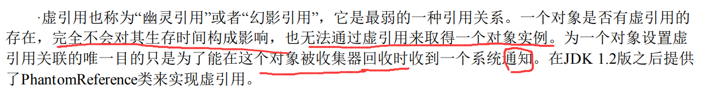

```java
//没办法通过虚引用，获取到这个对象。
ReferenceQueue rq = new ReferenceQueue();
String obj = new String("abc");
PhantomReference pr = new PhantomReference(obj,rq);
Object o = pr.get();
System.out.println(o);
System.out.println(obj);
//从虚引用中获取实例的结果总是null
```

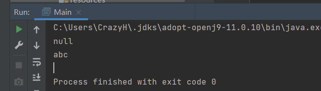

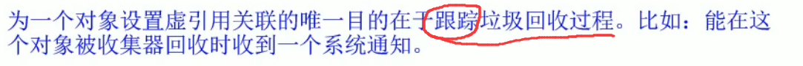


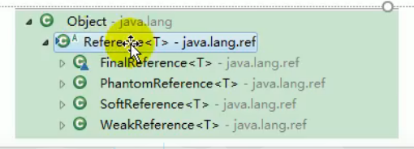


## 1.16 垃圾回收器


### 1.16.1  GC分类


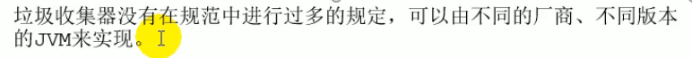

#### 1.16.1.1 根据垃圾回收器的线程数

串行垃圾回收器、并行垃圾回收器。


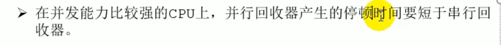


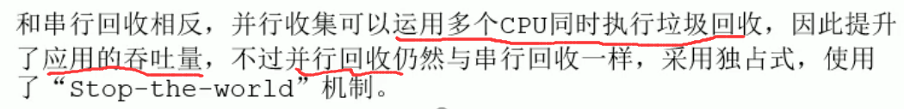

```
并行回收器在枚举GCroots阶段，仍需要STW
```


#### 1.16.1.2 碎片处理方式

压缩式   （指针碰撞）

非压缩式 （维护空闲列表）

#### 1.16.1.3 工作区间

老年代垃圾回收器

年轻代垃圾回收器


### 1.16.2  GC性能指标


 

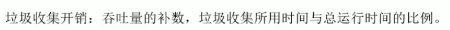


```
STW的时间
```


```
垃圾回收器 占用堆内存的大小。

比如需要维护 OopMap
```


#### 1.16.2.2 吞吐量与延迟

下图是完成一次GC的cpu时间图。

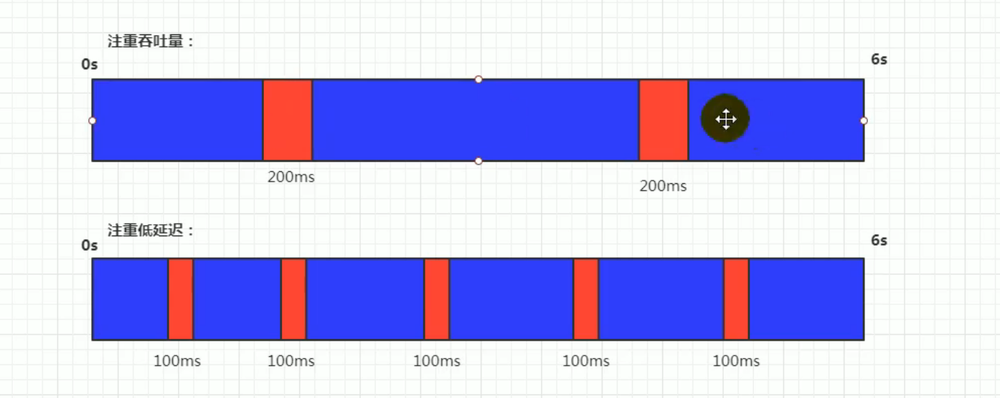

```
我们知道：切换线程必然带来额外开销。
只切换2次，需要400ms
切换5次可能需要 500ms （多出了100ms的额外开销）

对于吞吐量来说，尽量减少线程切换的次数。可以减少GC总时间。增加吞吐量。

对于延迟来说，在一段时间内分给GC的时间片100ms。这意味着，用户线程提出的请求总是能在100ms以内得到相应，最长也超不过100ms，而上面的方案，只能在200ms以内得到相应。
```


#### 1.16.2.3 如何衡量？

更多交互式的程序：更关注低延迟

```
运算结果不太复杂，不太消耗算力。用户需求更多的响应操作。
```


注重结果的程序：更关注高吞吐。

```
交互次数和频率比较低，用户更关心输出的结果。在输出结果前，用户较少的操作程序。
```


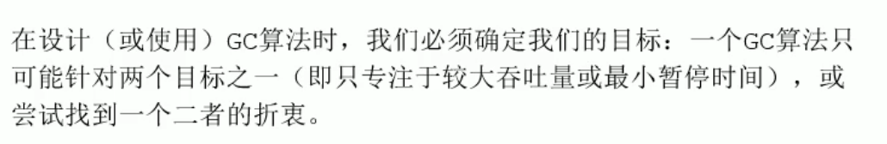


### 1.16.3 常见垃圾回收器

这个小节算是 概述一下垃圾回收器。

对应的视频P174

https://www.bilibili.com/video/BV1PJ411n7xZ?p=174


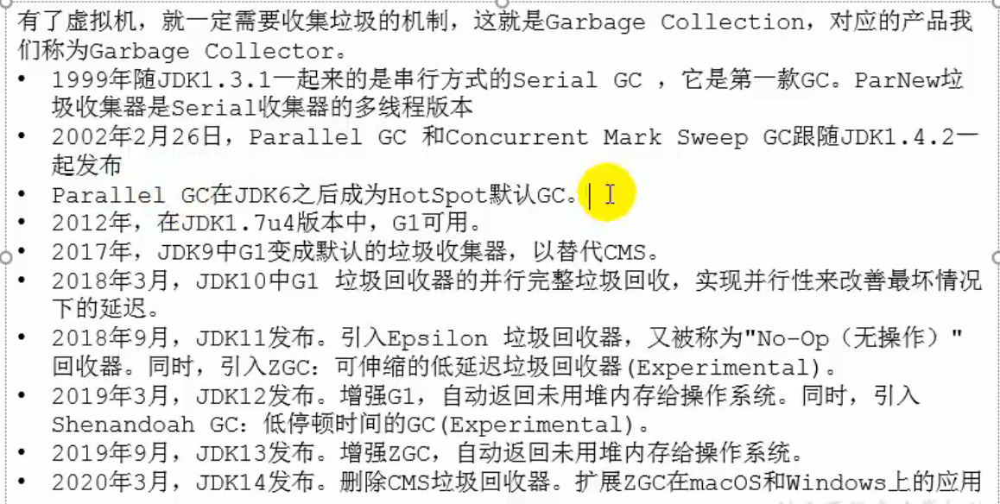


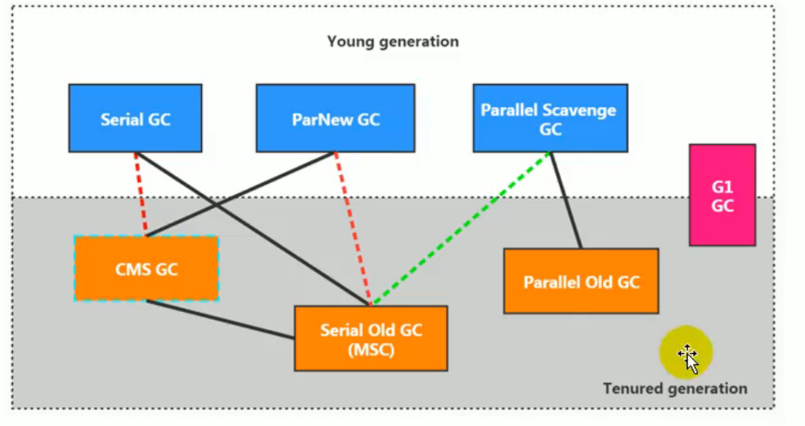


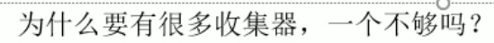

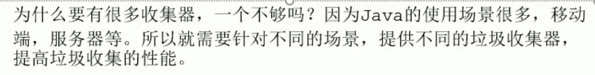


#### 1.16.3.1 7种经典垃圾回收器


单线程GC ： Serial、Serial Old 

并行 :  ParNew 、 Parallel Scavenge  、 Parallel	Old


并发 ： CMS    G1

```
在垃圾回收器层面讲 并发的概念。实际上区别于线程的并发。

目前所有的垃圾回收器都需要经过 STW的阶段。（GCroots枚举）
所以，做不到真正全阶段并行。在某一时刻，仍是只能单独运行GC，所以是并发的。但除去这些阶段，
```


#### 1.16.3.2 查看默认垃圾回收器

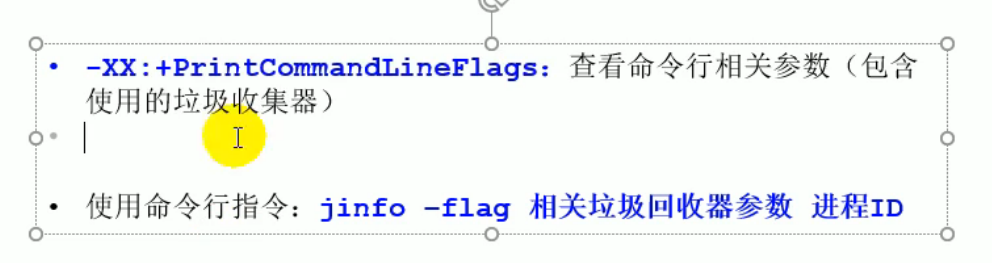

```
-XX:+PrintCommandLineFlags
```


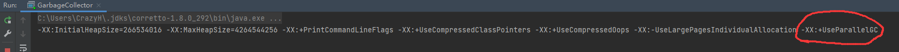


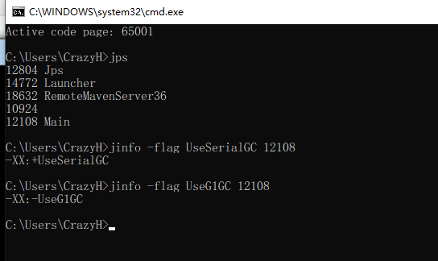


#### 1.16.3.3`Serial`回收器


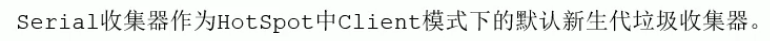

```
Serial 本意也是串行

Serial 是串行的新生代垃圾回收器。配合 Serial Old GC 回收老年代
```


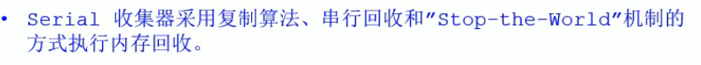

```
Serial Old 就是配合串行的，配合Serial一同使用的 回收老年代的 GC器


Serial     新生代使用 复制算法。
Serial Old 老年代 标记-压缩算法。
```


##### 1.16.3.4.1 Serial回收器优点


```
简单，高效。（相对于其他单线程新生代回收器来说）
```

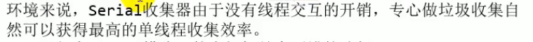


#### 1.16.3.4 `ParNew` 回收器

是只能回收 新生代（年轻代）的回收器。新生代回收器


```
是 Serial 的多线程并行版本。其余行为（对象分配规则，回收策略）和 Serial完全一致。
```


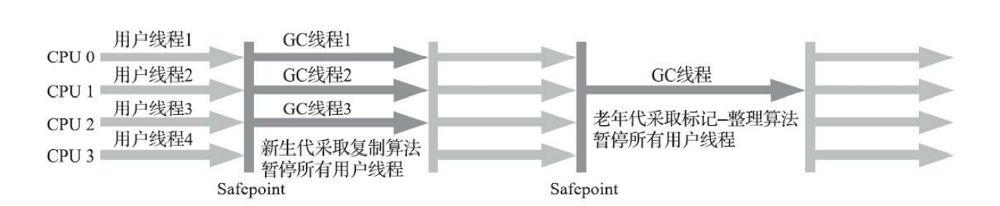

```
在GC的时候，也需要STW所有用户线程

Safepoint 安全点。
```


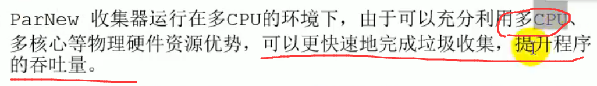

````
多核cpu使用 并行垃圾处理器更快。
但单cpu场景下，使用串行垃圾处理器更快，免去了线程频繁切换带来的额外开销。
````


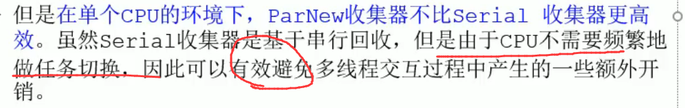


##### 1.16.3.4.1 ParNew参数

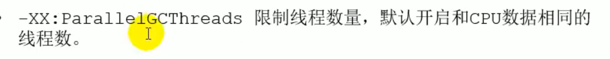


#### 1.16.3.5 Parallel Scavenge收集器


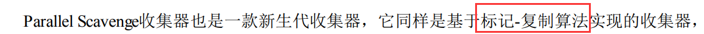

```
也是 多线程并行收集的  新生代垃圾回收器
```

##### 1.16.3.5.1 特点

Parallel Scavenge 注重高吞吐量。

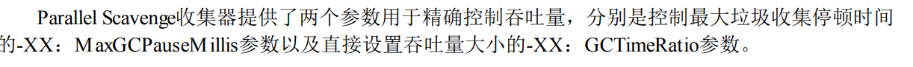

```
-XX：MaxGCPauseMillis    //大于0的毫秒数

-XX：GCTimeRatio         //  [1,99]的整数

```


由于其注重高吞吐量的特点。 所以被称为：

```
吞吐量优先收集器
```

##### 1.16.3.5.2 Parallel Scavenge参数

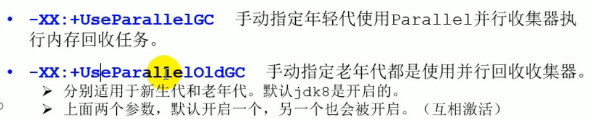

```
在jdk8 中。默认Parallel Scavenge + Parallel Old 组合
```

下面使用代码验证一下：

```dockerfile
jps

jinfo -flag UseParallelGC <PID>
jinfo -flag UseParallelOldGC <PID>
```


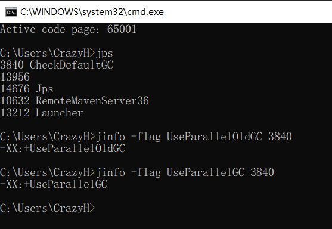

```
确实在jdk8中。默认使用的就是 Parallel Scavenge + Parallel Old组合
```


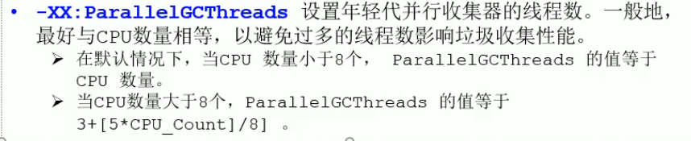

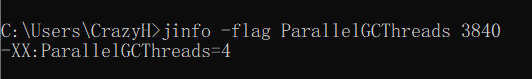


```
-XX:ParallelGCThreads = 8
```

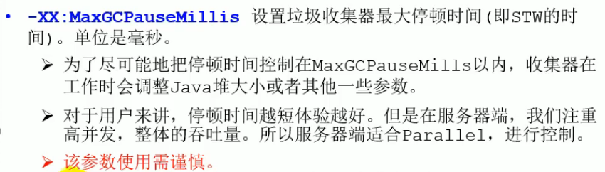


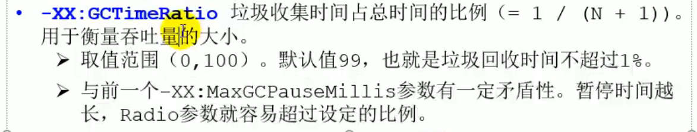


````

-XX：+UseAdaptiveSizePolicy
````

当这个参数被激活之后，就不需要人工指定新生代的大小（-Xmn）、Eden与Survivor区的比例（-XX：SurvivorRatio）、晋升老年代对象大小（-XX：PretenureSizeThreshold）等细节参数了，虚拟机会根据当前系统的运行情况收集性能监控信息，动态调整这些参数以提供最合适的停顿时间或者最大的吞吐量。

```
这种调节方式称为垃圾收集的自适应的调节策略（GC Ergonomics）
```


##### 1.16.3.5.3 Parallel Old GC

处理老年代。配合Parallel Scavenge

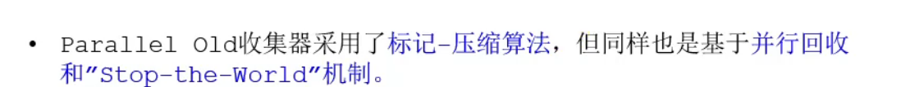


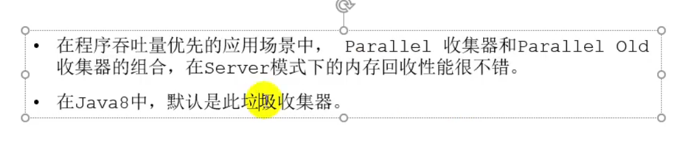


#### 1.16.3.6 CMS回收器  Concurrent-Mark-Sweep


并发-标记-清除 回收器。


```
仍然无法完全避免STW ,依然会产生STW
```

```
强交互的引用，更需要低延迟的CMS垃圾回收器
```

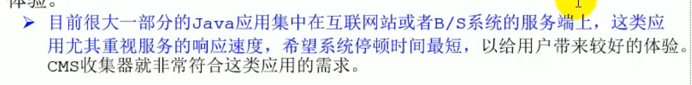


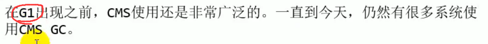

````
G1  是jdk9中，默认的垃圾回收器。
````

##### 1.16.3.6.1 CMS工作过程


###### 1.16.3.6.1.1 三色标记法

想要理解CMS工作原理，需要先知道三色标记法。

三色标记法的分析，可以让垃圾回收过程和用户线程运行同时进行。

```
在传统的垃圾回收中。是不允许用户线程和垃圾回收线程同时运行的,因为用户线程会改变对象的引用关系。
很有可能出现的现象就是: 对象明明建立了一条新的引用关系,而并发的垃圾回收线程无法感知。
```

`三色标记法`量化了 并发垃圾回收时的对象状态， 最终由 `增量更新`  `原始快照` 解决了并发垃圾回收的问题。


三色标记法具体指什么？

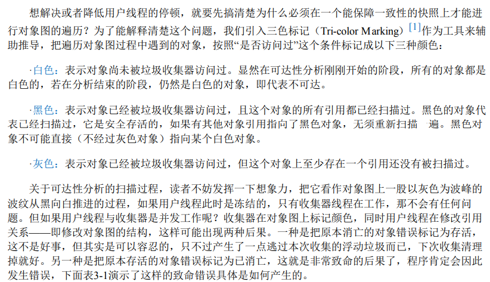


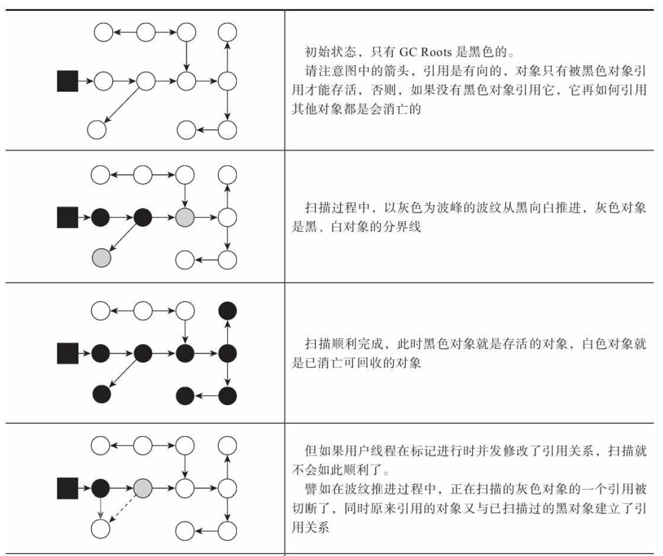

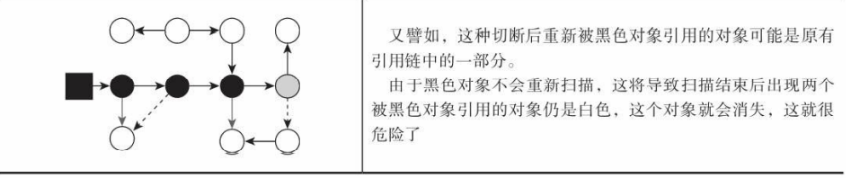


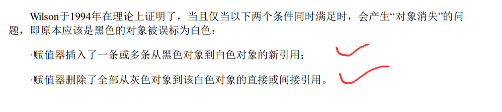

```
第一条说明，原本不曾被扫描到的白色添加了新的引用。
第二条说明，这个白色同时在未来也不会被其他人引用。


可以通过举反例来理解这2条规则。
满足规则1，不满足规则2：虽然前面的黑色不会再被扫描。但灰色对象后续的引用链中包含了这个白色，所以这个白色在未来会被判黑，不会被误删除。

满足规则2，不满足规则1： 满足规则2以后，在未来一定会被遍历到，所以会被判黑，不会被误删除。
```


###### 1.16.3.6.1.2 解决并发垃圾回收问题

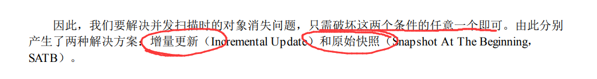


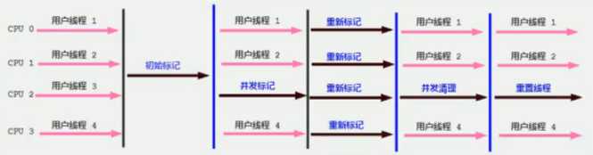

增量更新：

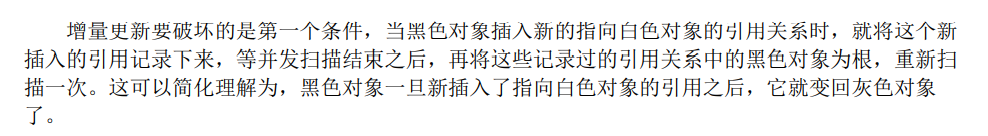

```
允许GC线程在标记阶段 和 用户线程同时工作。但在并发遍历标记的时候，记录在这期间哪些黑色标记发生了引用变化。
在并发标记结束，采取STW的方式，把这些引用发生变化的黑色标记当作灰色重新遍历标记一边。
```

```
增量更新的思想认为: 并发标记期间修改的黑色节点比 堆内原有结构需要遍历的节点更少。并发遍历了一个稍有小变化的引用链，这条引用链大部分的结构都是正确的，可信任的。只需要STW很短的时间重新遍历一下 并发标记期间修改的部分。


通常情况也是这样的：并发标记阶段修改的引用链，要远远小于原引用链的大小。
```


原始快照：

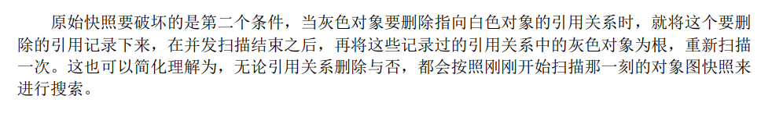

```
原始快照会先STW一小段时间，保存一下当前堆内的引用情况。
然后并发遍历引用链。然后无视并发过程中，用户线程切断灰色指向白色的引用，
依然把白色对象保留下来（始终参照原快照的引用情况）。

当然，这种方式会产生浮动垃圾（无论这个白色是否被黑色真正引用，我都认为他被引用保留下来了）。下一次GC会清除掉。
同时新增的节点必须默认为黑色，因为按照初始快照，新对象一定不存在引用链，会被清除，为了避免误删的情况，必须全部保留，等到下次GC清除
```


###### 1.16.3.6.1.3 CMS 是增量更新的方式

所以，CMS 并发垃圾回收器，选择了增量更新的方式。


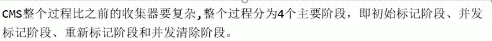


`初始标记`  : 是 `STW`的，需要枚举 `GCroots`

`并发标记` ： 大部分对象的标记任务，都在并发标记中完成。  

`重新标记`是 `STW`的， 使用增量更新的方式重新标记新添加的引用。

`并发清除` ：回收垃圾对象。


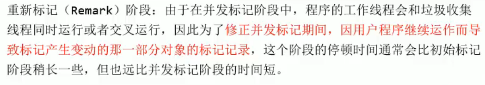


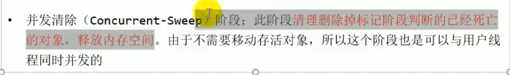


##### 1.16.3.6.2 CMS的优点

尽努力减少`STW`的时间。仅有初始标记和重新标记阶段STW。

拥有并发标记和并发清除两个阶段并发阶段，不会STW。

用户线程延迟降低


##### 1.16.3.6.3 CMS的缺点

对处理器资源敏感，如果处理器核数较少，对用户线程影响较大。

CMS无法清理浮动垃圾。

###### 1.16.3.6.3.1 浮动垃圾：

```
在CMS并发清理阶段，用户线程是还在继续运行的，可能会产生新的垃圾，但这一部分垃圾是出现在标记过程结束以后，CMS无法在当次收集中处理掉它们，只好留待下一次垃圾收集 时再清理掉。这一部分垃圾就称为“浮动垃圾”。
```


###### 1.16.3.6.3.2 预留空间：

由于在垃圾收集阶段用户线程还需要持续运行，需要预留足够内存空间提供给用户线程，不能像其他收集器那样等待到老年代几乎完全被填满了再进行收集。而是到达了阈值就进行GC。


````
如果预留过多，会频繁触发GC，导致吞吐量变低。

如果预留过少，就会出现“并发失败”（Concurrent Mode Failure），这时候虚拟机将不得不启动后备预案：Serial Old收集器，冻结用户线程的执行。Serial Old 的单线程串行收集器，导致GC时间变长。
````


###### 1.16.3.6.3.2 碎片过多：

标记清理算法，会产生大量内存碎片，导致大对象无法分配。提前触发Full GC 整理碎片。

合并整理过程，由于这个 内存整理必须移动存活对象，（在Shenandoah和ZGC出现前）是无法并发的。所以必须CMS 必须STW整理碎片。停顿时间又增加了。


##### 1.16.3.6.4 CMS回收器的参数


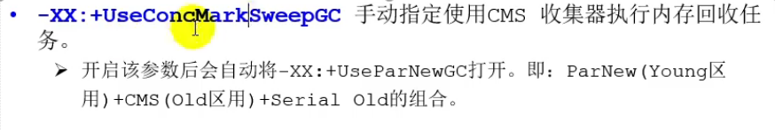


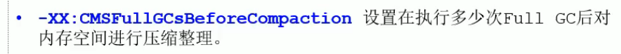


```
可以适当调高参数-XX：CMSInitiatingOccu-pancyFraction的值
来提高CMS的触发百分比，降低内存回收频率，获取更好的性能。


```


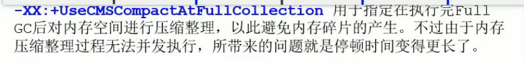


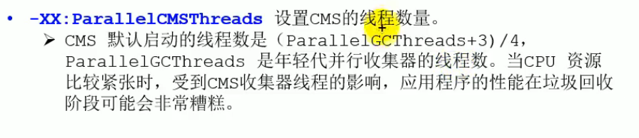


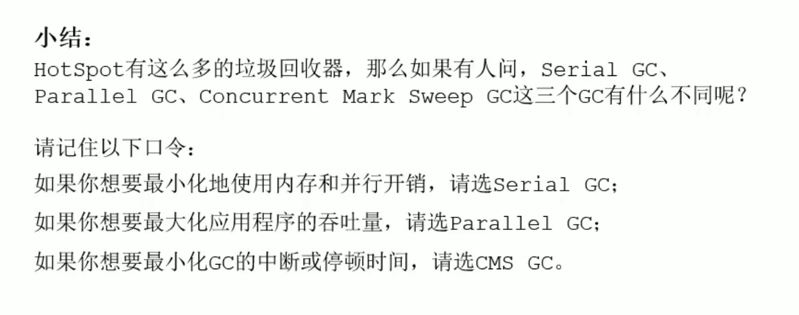


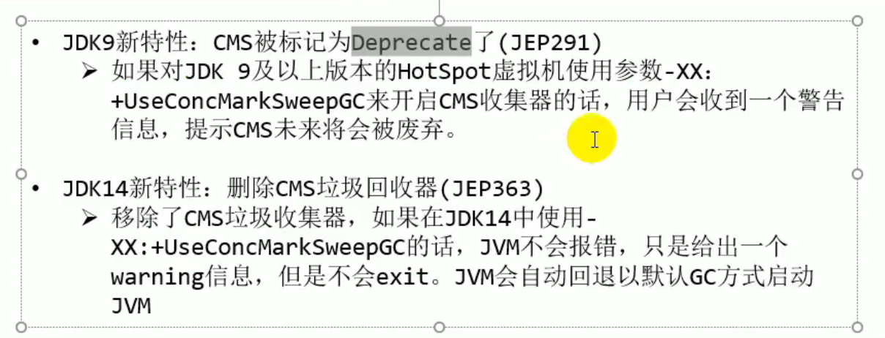


#### 1.16.3.7  G1 垃圾回收器


`Garbage First`  （区域化分代式）


从jdk9开始默认使用的GC。

```
开创了收集器面向局部收集的设计思路和基于Region的内存布局形式。
```


##### 1.16.3.7.1 G1 概述


###### 1.16.3.7.1.1  停顿时间模型

G1 提出的新概念 `停顿时间模型`

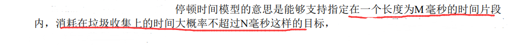

````
在长度为M毫秒的时间片内，GC消耗时间不超过N毫秒
````


##### 1.16.3.7.2 G1的特点


G1 回收标准不再是特定哪个分代（新生代、老年代），而是哪块内存中存放的垃圾数量最多，回收收益最大，这就是G1收集器的Mixed GC模式。


G1把连续的Java堆划分为多个大小相等的独立区域（Region），每一个Region都可以扮演新生代的Eden空间、Survivor空间，或老年代空间。

收集器能够对扮演不同角色的 Region采用不同的策略去处理，这样无论是新创建的对象还是已经存活了一段时间、熬过多次收集的 旧对象都能获取很好的收集效果。


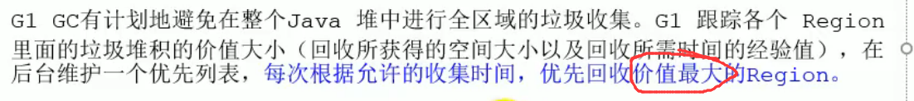


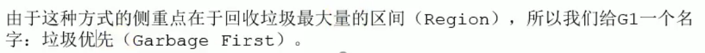


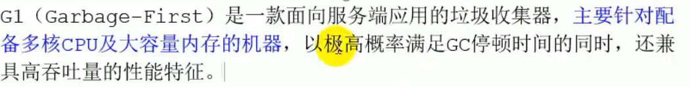


##### 1.16.3.7.3 G1的优点

###### 1.16.3.7.3.1 提出了分Region管理模型


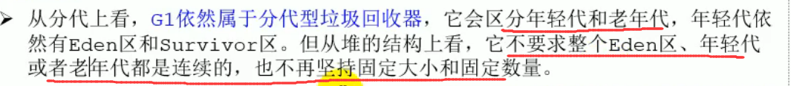


每个Region 在1~32MB之间，为2的N次幂的整数倍。


`Humongous` 是什么区？ 如果一个超大对象，超过了Region的大小该如何存储？

````
Region中还有一类特殊的Humongous区域，专门用来存储大对象。G1认为只要大小超过了一个egion容量一半的对象即可判定为大对象。

而对于那些超过了整个Region容量的超级大对象，将会被存放在N个连续的Humongous Region之中
````


###### 1.16.3.7.3.2 关于碎片化问题


```
CMS在几次GC以后，出现碎片化的问题。所以不得不在几次GC后，STW整理碎片问题。
```

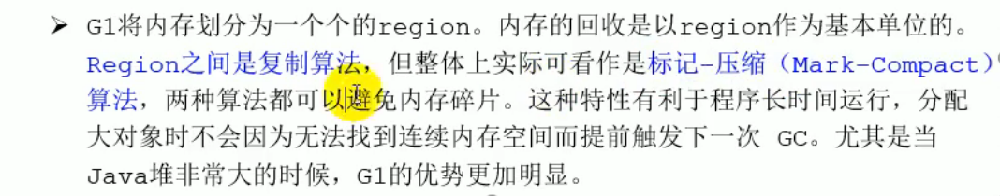

```
G1 在回收Region的时候，把Region里没有回收掉的对象，使用复制算法。直接可以复制到前面空余的碎片空间（Region是等大的，一定能装得下）。
所以对于整个堆空间来说，相当于 标记-清除算法。
直接避免了碎片化。
```


###### 1.16.3.7.3.3  可预测的 时间停顿模型


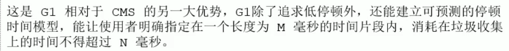


G1通过 数理统计例如 “平均值”“标准差” “置信度”为每一个Region做出一个价值的评估。在满足用户最大停顿时间的要求的前提下、回收那些最高价值期望的Region。


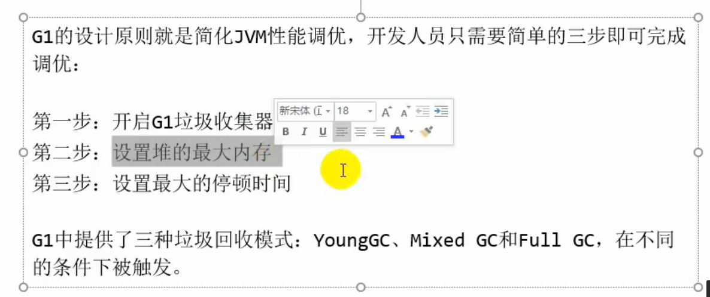


##### 1.16.3.7.4 G1的缺点


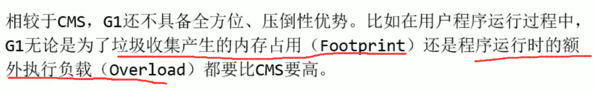

````
G1要为每个Region维护各自的数理统计值。同时为了解决跨Region引用问题，还要维护 记忆集。
同时实行清理的时候还要维护 价值由高到低的表。这无疑需要更多的内存空间（Footprint）以及程序运行时维护各种表cpu的算力（Overload）

由上述特点自然得出结论：
G1更适合内存较大的，算力较强的服务器（Server）去使用。G1将带来更多的稳定性，在可控的停顿时间（低延迟）下回收更具价值的Region（高吞吐量）。
````

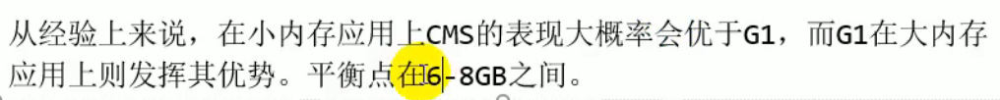


```
同时G1通过工作原理，自然想到。
最高价值的Region并不一定就是当前最紧张的年轻代、老年代空间。
只有堆内存达到一定大的时候，各个年龄代都不易出现内存不够的情况下，保证低延迟的同时回收高价值的Region就更具有意义了。

这也是G1更适合大内存的理由之一。
```


如果并发垃圾回收的速度，赶不上用户线程制造垃圾的速度：

```
与CMS中 的“Concurrent Mode Failure”失败会导致Full GC类似，如果内存回收的速度赶不上内存分配的速度， G1收集器也要被迫冻结用户线程执行，导致Full GC而产生长时间“Stop The World”。
```


 


##### 1.16.3.7.5 G1的工作流程


###### 1.16.3.7.5.1  初始标记

​				仅仅只是标记一下GC Roots能直接关联到的对象，并且修改TAMS 指针的值，让下一阶段用户线程并发运行时，能正确地在可用的Region中分配新对象。这个阶段需要 停顿线程，但耗时很短，而且是借用进行Minor GC的时候同步完成的，所以G1收集器在这个阶段实际 并没有额外的停顿。

```
TAMS 指针：

G1为每一个Region设计了两个TAMS（Top at Mark Start）的指针，专门用于并发回收过程中的新对象分配，并发回收时新分配的对象地址都必须要在这两个指针位置以上。

G1收集器即默认它们是存活的，不纳入回收范围。
```

###### 1.16.3.7.5.2 并发标记

​						：从GC Root开始对堆中对象进行可达性分析，递归扫描整个堆 里的对象图，找出要回收的对象，这阶段耗时较长，但可与用户程序并发执行。当对象图扫描完成以 后，还要重新处理SATB记录下的在并发时有引用变动的对象。

```
SATB ： 原始快照。

在并行的可达性算法分析中。介绍了2种处理  不该删除的白色对象 的方法：
增量更新。
原始快照。

原始快照破坏的是第二个条件，默认所有被灰色标记删除引用的白色节点都不删除。利弊在之间的分析中讲过

```

[增量更新/原始快照](# 1.16.3.6.1.2 解决并发垃圾回收问题)

###### 1.16.3.7.5.3 最终标记

​					（Final Marking）：对用户线程做另一个短暂的暂停，用于处理并发阶段结束后仍遗留 下来的最后那少量的SATB记录。

```
处理 原始快照中 遗留部分
```

###### 1.16.3.7.5.4 筛选回收

​              （Live Data Counting and Evacuation）：负责更新Region的统计数据，评估回收价值和成本。

根据用户所期望的停顿时间来制定回收计划。可以自由选择任意多个Region 构成回收集。幸存对象使用复制算法、复制到新的Region（复制到内存碎片区域，避免了碎片），旧Region全部清除。这部操作涉及存活对象的移动，必须STW，由多条收集器线程并行完成的。

```
整理Region价值和成本，在规定时间内选择最优的 回收集
```


```
后续发布的ZGC 可以实现与用户线程并行回收，不会在“筛选回收”阶段STW
```


##### 1.16.3.7.6 G1的参数

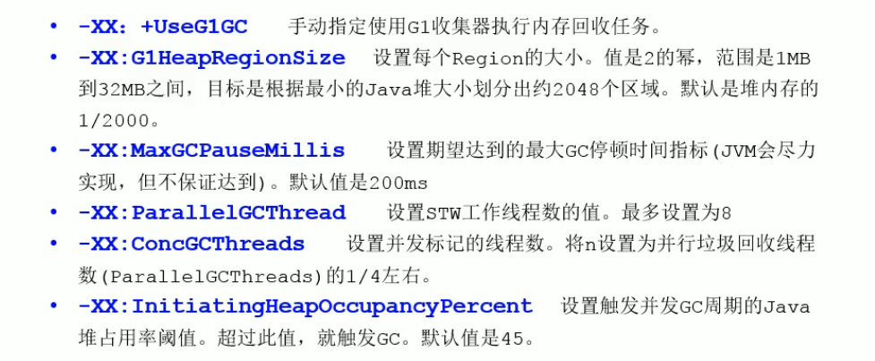


##### 1.16.3.7.7 为什么说G1 是回收器的里程碑


从G1开始，GC设计导向变为追求能够应付应用的内存分配速率 （Allocation Rate），而不追求一次把整个Java堆全部清理干净。

这样，应用在分配，同时收集器在收集，只要收集的速度能跟得上对象分配的速度，那一切就能运作得很完美。

这种新的收集器设计思路 从工程实现上看是从G1开始兴起的，所以说G1是收集器技术发展的一个里程碑。


##### 1.16.3.7.8 跨代引用

###### 1.16.3.7.8.1什么是跨代引用？　

跨代引用是指新生代中存在对老年代对象的引用，或者老年代中存在对新生代的引用，如下图

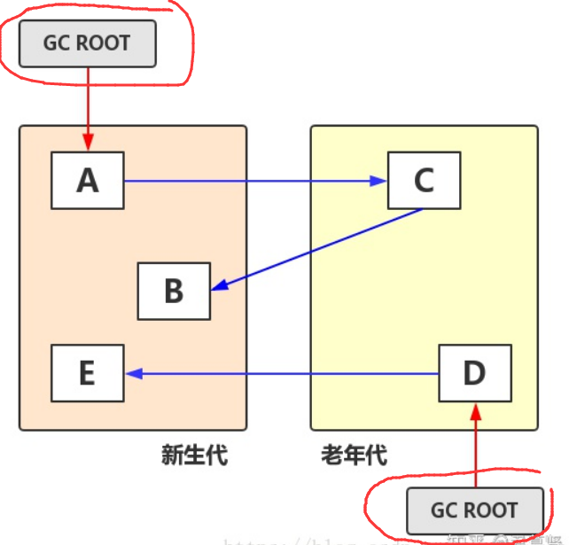


```
GCRoots 的组成有很多，有时只触发了YGC。为了效率起见，我们应该只遍历指向年轻代的GCRoot更合理。
因为指向老年代的GCroot遍历的对象大概率上也是老年代对象。

除此以外，老年代要比年轻代大，可能存放的对象也更多。如果在YGC中，遍历了相当多的老年代对象 无疑GC效率将很低。

但仍有一个问题，就是跨代引用。 发生跨代引用的对象，仅占老年代对象的极少数。为了这些跨代引用对象而扫描整个堆（老年代）显然是是低效率的。
```

跨代引用会对年轻代对象产生什么影响？

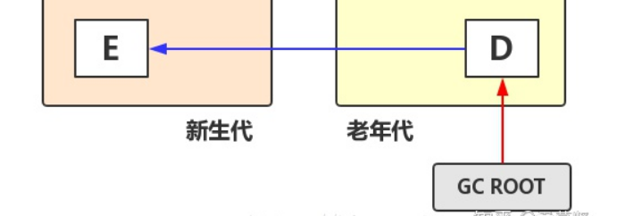

```
对于E来说，如果只有D引用了他，如果忽略跨代引用，就会误删除E
```

所以必须要解决跨代引用

###### 1.16.3.7.8.2 记忆集与卡表


只需在新生代上建立一个全局的数据结构（该结构被称 为“记忆集”，Remembered Set）。

这个结构把老年代划分成若干小块，标识出老年代的哪一块内存会 存在跨代引用。此后当发生Minor GC时，包含了跨代引用的老年代对象会被加入到GC Roots进行扫描。虽然这种方法需要在对象改变引用关系（如将自己或者某个属性赋值）时维护记录数 据的正确性，会增加一些运行时的开销，但比起收集时扫描整个老年代来说仍然是划算的。

```
注意： 记忆集是一种抽象数据结构。 目的是记录哪些老年代对象存在跨代引用。

具体的实现方式：卡表等。
```


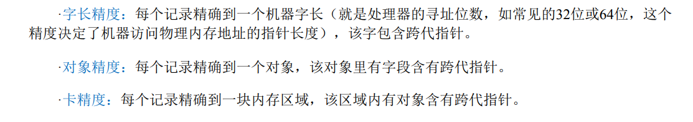

记忆集可以有以上三种精度。精度越细，需要的内存消耗就越大。


###### 1.16.3.7.8.3 卡表

卡表是记忆集的具体实现方式之一。

卡表就把记忆集经度粗狂到了512字节为一张卡页。卡页内含有跨代引用，则卡页变脏。YGC的时候，遍历各个脏页内的对象，把脏页内含有跨代引用的对象，加入GCroots。


记忆集是一种用于记录从非收集区域指向收集区域的指针集合的抽象数据结构。

```
对于YGC，老年代对象就位于非收集区，年轻代对象就位于收集区。
```


卡表将整个堆划分为一个个大小为 512 字节的卡，并且维护一个卡表，用来存储每张卡的一个标识位。这个标识位代表对应的卡是否可能存有指向新生代对象的引用。如果可能存在，那么我们就认为这张卡是脏的。

在进行 Minor GC 的时候，我们便可以不用扫描整个老年代，而是在卡表中寻找脏卡，并将脏卡中的对象加入到 Minor GC 的 GC Roots 里。当完成所有脏卡的扫描之后，Java 虚拟机便会将所有脏卡的标识位清零。

由于 **Minor GC 伴随着存活对象的复制，而复制需要更新指向该对象的引用**。因此，**在更新引用的同时**，我们又会**设置引用所在的卡的标识位**。这个时候，我们**可以确保脏卡中必定包含指向新生代对象的引用**。


###### 1.16.3.7.8.4 写屏障

如何维护卡表？

一个卡页变脏的时刻是确定的：老年代对象引用了年轻代对象的瞬间。所以需要对 引用变量赋值 这一操作进行 类似AOP环绕通知。

在赋值前的部分的写屏障叫作写前屏障（Pre-Write Barrier），在赋值 后的则叫作写后屏障（Post-Write Barrier）。


```
G1采取分区策略，每一个Region都必须有一份卡表，这导致G1的记忆集（和
其他内存消耗）可能会占整个堆容量的20%乃至更多的内存空间；相比起来CMS的卡表就相当简单，只有唯一一份，而且只需要处理老年代到新生代的引用
```


#### 1.16.3.8  7款经典GC总结


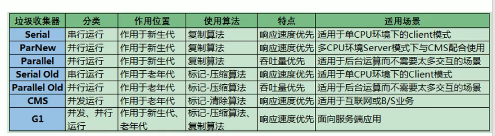


#### 1.16.3.9 GC日志分析

总结：

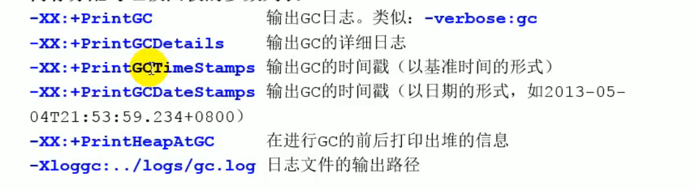


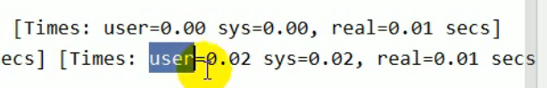


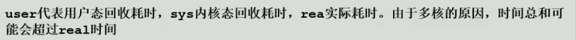


##### 1.16.3.9.1 YGC信息分析


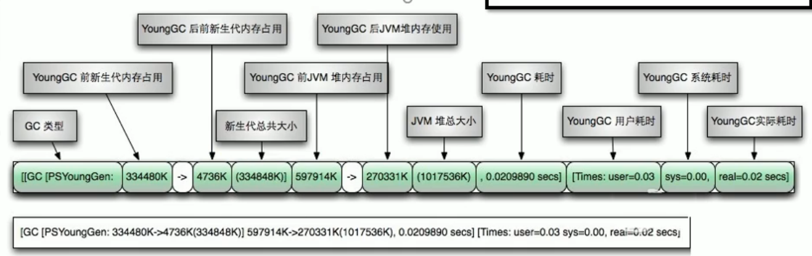


##### 1.16.3.9.2 Full GC信息分析

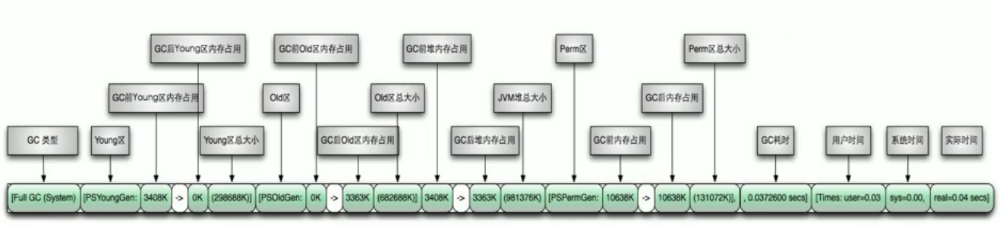


##### 1.16.3.9.3 日志分析工具

导出的日志分析文件，可以使用日志分析工具。

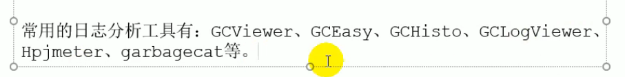


GCeasy.io


#### 1.16.3.10 GC的新发展

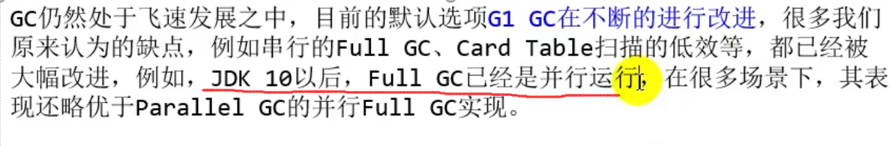


##### 1.16.3.10.1 Shenandoah GC


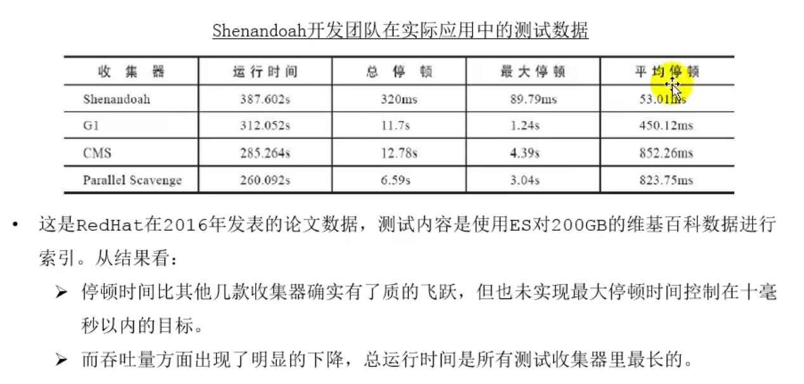


```
牺牲了吞吐量，降低了 停顿时间
```

##### 1.16.3.10.2   革命性的ZGC


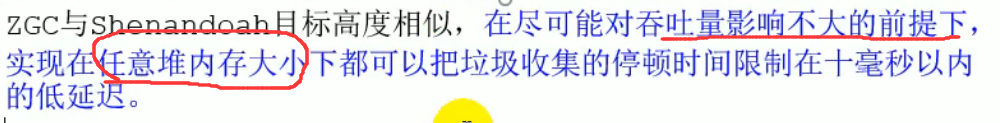


# 2.字节码与类的加载篇


## 2.1 字节码文件概述

### 2.1.1  字节码文件的跨平台性


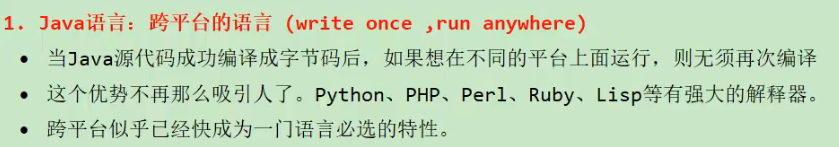

​	


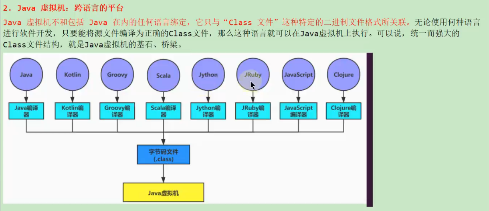


```
只要遵循.class文件的规范，无论是何种语言，都可以运行在JVM中。
实现语言跨平台。都可以借助JVM优秀的内存管理功能。
```


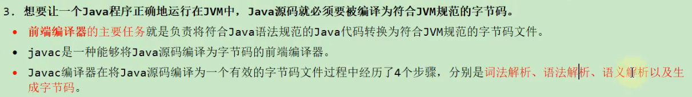


```
前端编译器。javac 
```


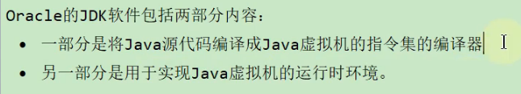


### 2.1.2 前端编译器


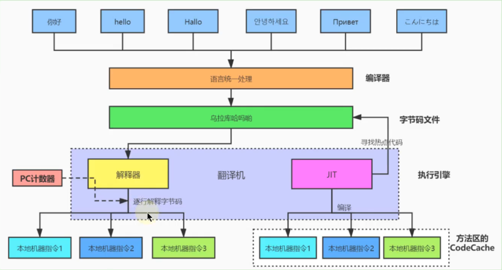

```
事实上，一门语言的性能。和这门语言的语法（也就是开发人员普遍编写的代码层面）关系不大。
主要有关系的是 编译器。编译器（解释器）负责完成 解释-执行这些过程。和执行效率密切相关。
```


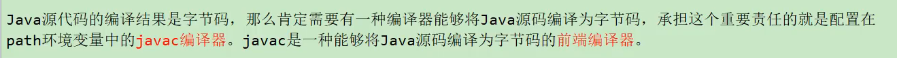

```
官方的前端编译 javac  
他是一种 全量编译。每次都把整个的.java文件全部重新编译一边。


Eclipse 提供的前端编译器： ECJ（Eclipse compiler for java）
是增量编译。已编译的部分就不再编译了
```

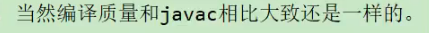


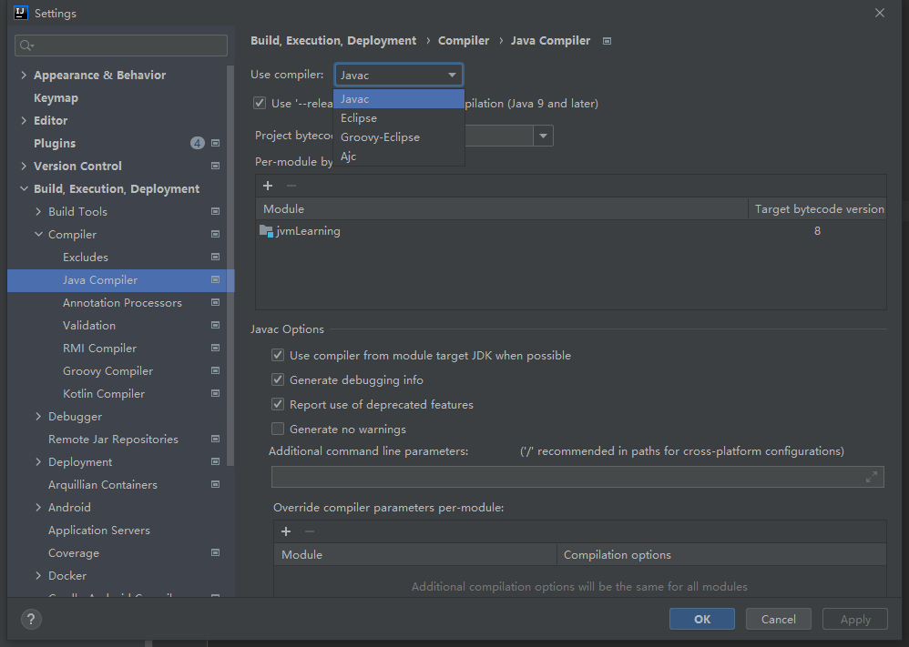


AOT  提前编译器。


### 2.1.3  通过字节码才能看到的执行细节


#### 2.1.3.1 例子1

```java
public class IntegerTest {
    public static void main(String[] args) {

        Integer x = 5;
        Integer y = 5;
        System.out.println(x==y);//true


        Integer i1 = 128;
        Integer i2 = 128;
        System.out.println(i1==i2);//false
    }
}
```

````
对于引用类型来说， ==  判断的是否是同一个内存地址。

为什么5就是同一个地址，128不是呢？
````

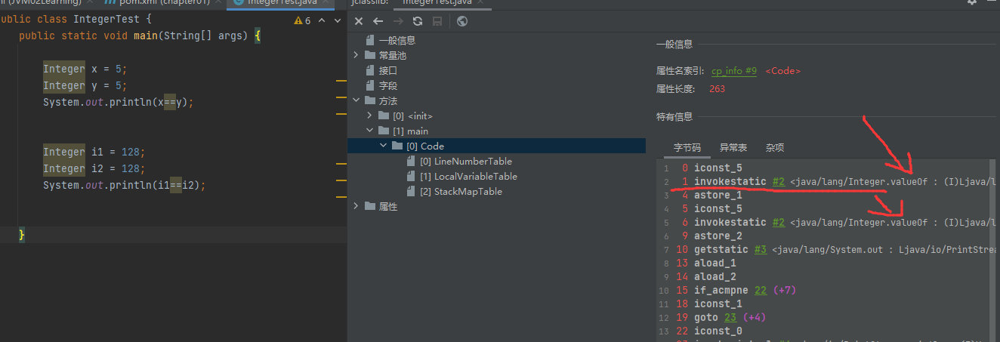

```
通过字节码文件，看到了 Integet x=5 这一过程。实际上调用了
Integer.valueOf()方法。
```

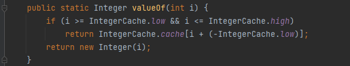

```
方法内部，使用了一个 “IntegerCache”缓存的结构。
```

进一步查看 IntegerCache到底是怎么定义的。

```
是Integer的 静态内部类
```

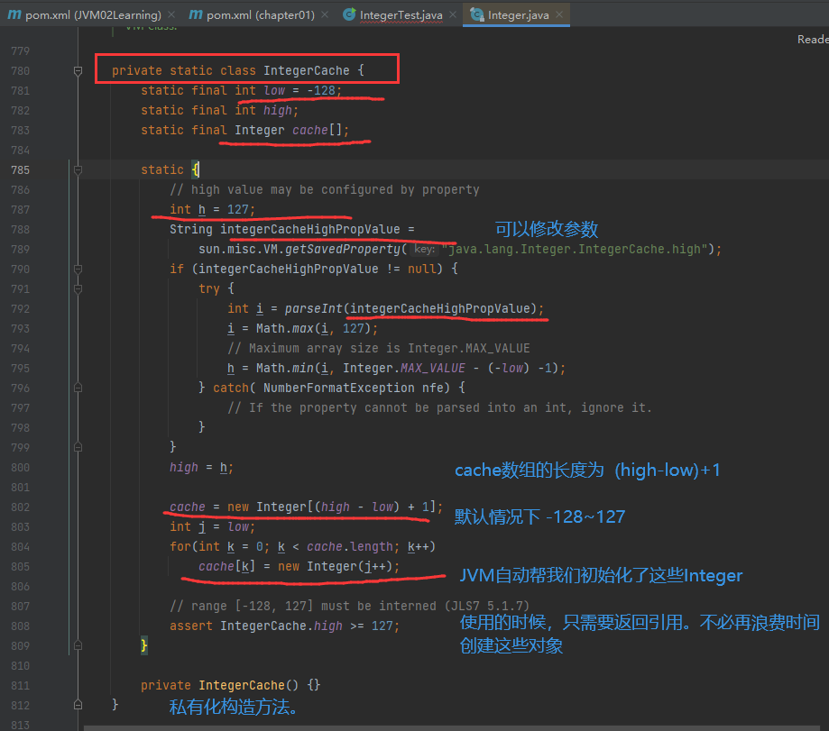


```
自动缓存了 （high-low）+1个缓存。
默认情况下 low是-128，high 是127。并且可以通过配置修改high
```

至此，也就可以解释了为什么第一个输出的是true。


#### 2.1.3.2 例子2

```java
class Father{
    int x = 10;
    {
        x=5;
    }
    public Father() {
        print();
        x=20;
    }
    public void print(){
        System.out.println("Father : "+this.x);
    }
}
```


##### 2.1.3.2.1  查看Father的字节码文件

```
注意：现在查看的是 Father类的字节码文件。
```

查看Father类的局部变量表

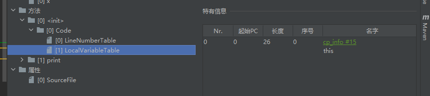

```
局部变量表 index0 是this对象
```

查看Father类的字节码指令

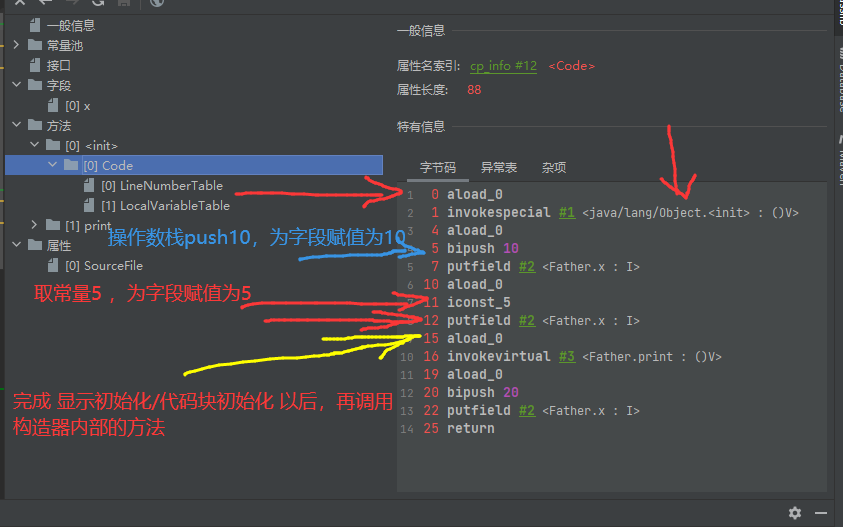

```
通过分析字节码指令得到以下信息：

1、对于某一个特定的class来说，它的字节码文件会先加载这个类的直接父类
2、显示初始化/代码块初始化  的代码会放入父类构造方法内执行，但优先于 构造方法内部定义的代码。
3、初始化/代码块初始化 谁先执行谁后执行，前文说过。取决于代码编写的顺序。写在上面的先执行。
```

基于上文对字节码的分析，尝试运行以下主函数代码：

```java
    public static void main(String[] args) {
        Father f = new Father();
        f.print();
    }
```

```
易得出结论输出：
5
20
```

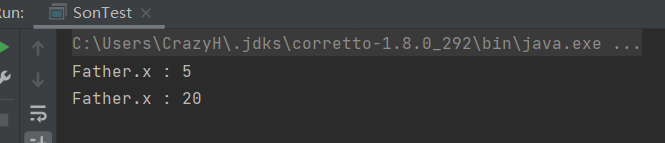


##### 2.1.3.2.2 查看son的字节码文件

```java
class son extends Father{
    int x =30;

    public son() {
        print();
        x = 40;
    }

    @Override
    public void print() {
        System.out.println("son.x : "+this.x);
    }
}
```


```java
public son();
    Code:
       0: aload_0
           //还是先尝试加载直接父类的<init>
       1: invokespecial #1    // Method Father."<init>":()V
       4: aload_0
       5: bipush        30
       7: putfield      #2    // Field x:I
      10: aload_0
      11: invokevirtual #3    // Method print:()V
      14: aload_0
      15: bipush        40
      17: putfield      #2    // Field x:I
      20: return
```

尝试先运行输出以下代码，再分析为什么？

```java
    public static void main(String[] args) {
        Father instance = new son();
        instance.print();
    }
```

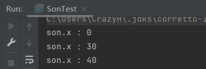

```
调用了3次 son类重写后的print方法。
```


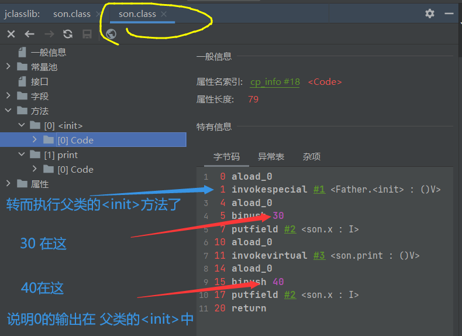


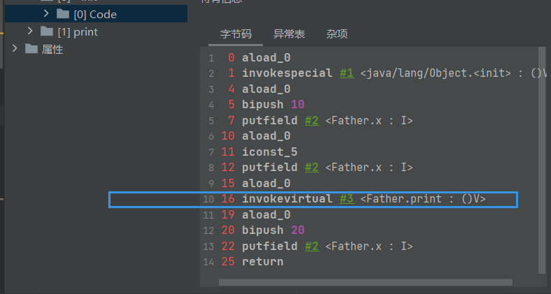

```
父类的<init>方法照常依旧（ bipush10  iconst_5 按正常顺序执行）。问题就是出现在  invokevirtual 解决虚方法上了。

在主方法中，对于变量instance 。它的静态类型是 Father，动态类型是 son
（如果静态类型和动态类型忘记的话，跳转到 1.5.9.5.1 静态分派 动态分派 ）
所以，调用this.print()方法时，实际上调用的是动态类型son.print()方法。
而此时，son.<init> 还处于转而执行 Father.<init>的阶段。所以是默认初始化的值0。
```

[静态类型/动态类型](# 1.5.9.5.1 静态分派 动态分派)


再尝试执行并分析以下代码：

```java
    public static void main(String[] args) {
        Father instance = new son();
        instance.print();
        
        System.out.println(instance.x);
        System.out.println(((son)instance).x);
    }
```

```
对象.属性    使用的是 静态类型。
方法重载(Overload)     使用的是 静态类型。
方法的的重写（Override）  使用的是 动态类型
```


## 2.2  class文件

### 2.2.1 概述

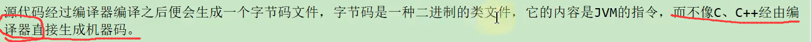


### 2.2.3  字节码指令

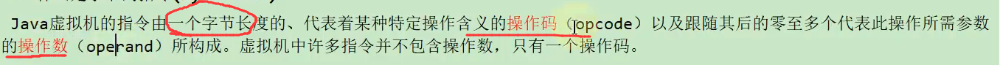

```
类似于 计组中cpu指令   操作码+操作数 

```

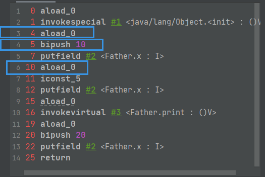


#### 

官方参考，第4章

https://docs.oracle.com/javase/specs/jvms/se8/html/jvms-4.html


### 2.2.4 class的本质

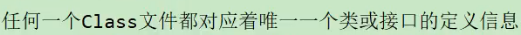

但class文件不一定都以磁盘文件的形式存在。

.class文件可以来自于网络。

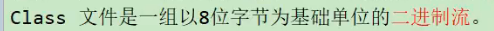


### 2.2.5 class文件格式


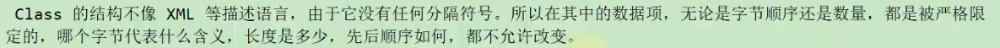


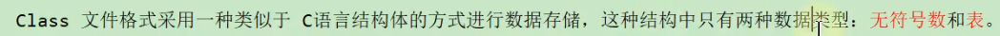


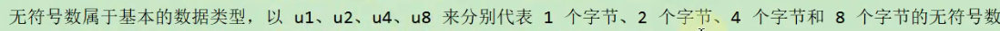

```
u1 = 1个字节的 无符号数
u2 = 2个字节的 无符号数
u4 = 4个字节
u8 = 8个字节
```


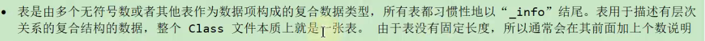


#### 2.2.5.1  class文件结构

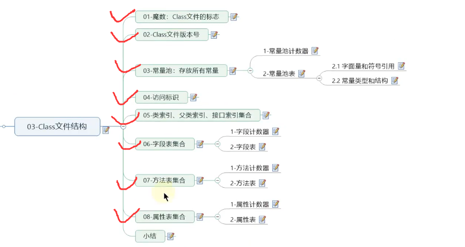


一个Class 文件，由以下结构组成。

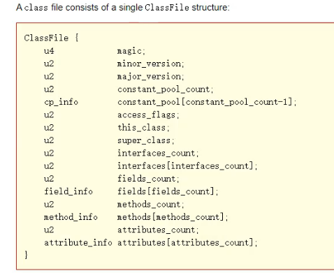

```
u4       魔数      ca fe ba be 
u2       小版本号
u2       大版本号
u2       常量池的大小
cp_info  常量池表    (前面提到过，表需要在前面标识长度)
u2       access_flags访问标示
u2       this_class
u2       super_class
u2       interfaces_count;
u2       interfaces[interfaces_count];


```

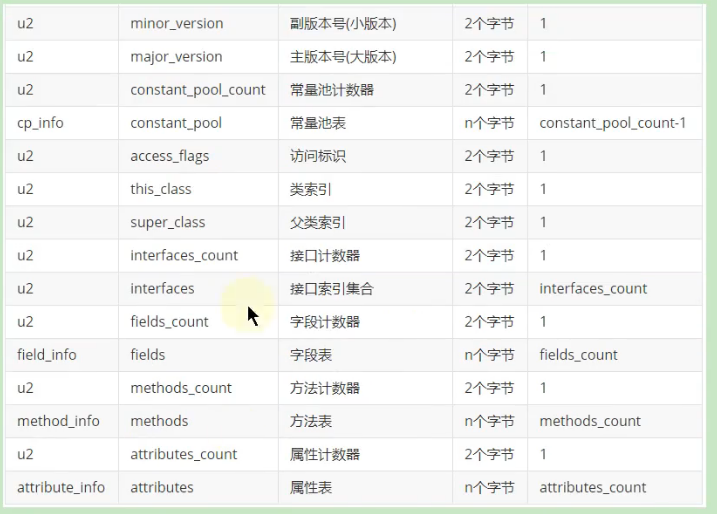


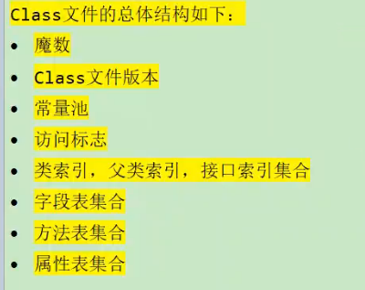


#### 2.2.5.2 魔数


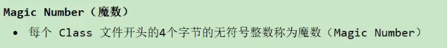


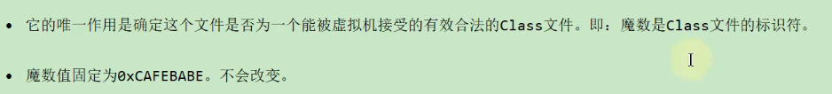


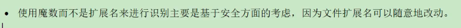


#### 2.2.5.3 Class文件版本号

minor_version 副版本  u2   (unsign 2字节)

major_version 主版本   u2


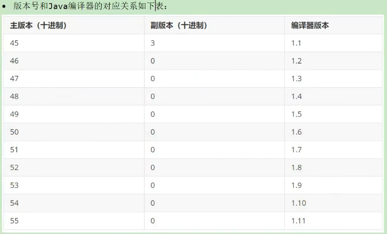


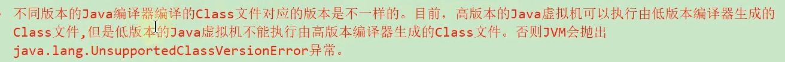

```
高版本支持向下兼容。
```


#### 2.2.5.4  常量池

constant_pool

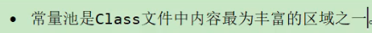

```
常量池就像一个大的 资源仓库。

存放着 Class文件的 字段、方法。（字段名，方法名 字段类型。方法返回值类型等等）
```

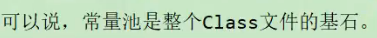


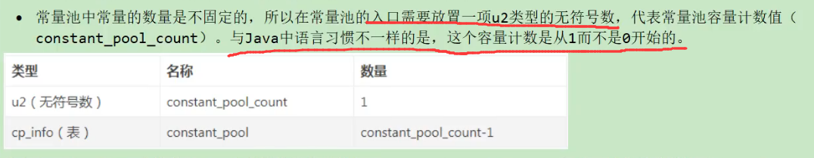


常量池表

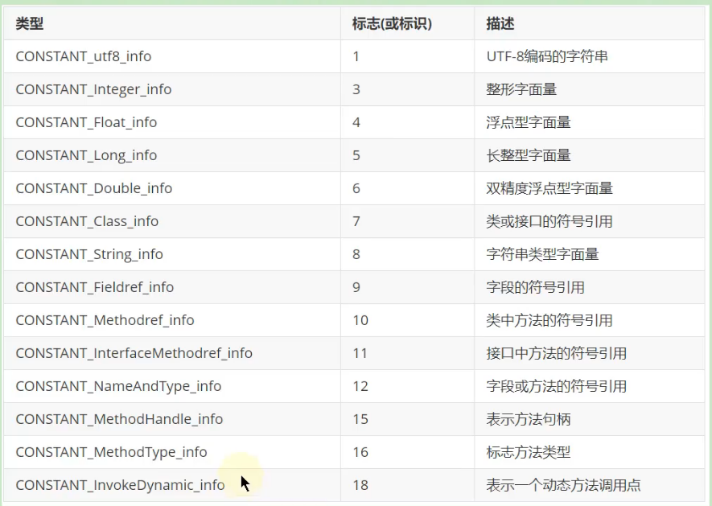

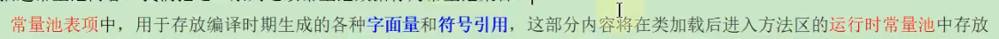

```
存放 编译期就确定下来的
字面量
符号引用
```


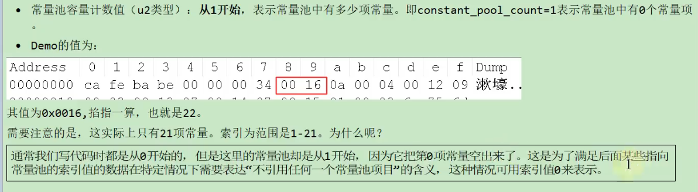


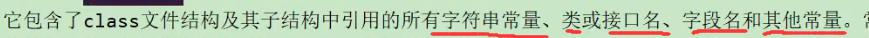


字面量和符号引用具体指什么？

##### 2.2.5.4.1 字面量  符号引用


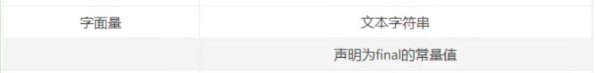

```
文本字符串例如
String str = "hello world";

声明为final的常量值
final int a = 10;
```


引入一些概念：

##### 2.2.5.4.2 全类名  全限定名


```
全类名：
com.crazyhh.demo.student

全限定名：
com/crazyhh/demo/student
```


为了消除歧义，全限定名后常加 ; 表示结束


##### 2.2.5.4.3  描述符


```
描述符可以用于描述 方法/字段

如果描述的是方法： 包含的就是方法的参数列表和返回值

如果描述的是字段： 包含的就是字段的数据类型。
```


###### 2.2.5.4.3.1 描述符都有哪些？

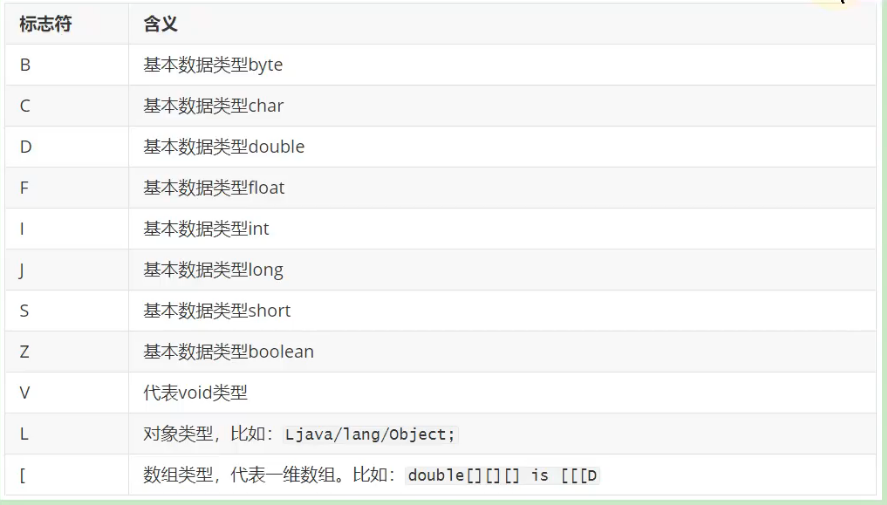

```
对象类型使用  L加对象的全限定名表示。

Ljava/lang/Object;


一维数组使用 [
二维 [[
三维 [[[
  ...
  
```

###### 2.2.5.4.3.2 如何描述的呢？

首先考虑描述字段

```
对于字段来说，只需要表示它的数据类型就好了。
```


#####  2.2.5.4.4  动态链接： 把符号引用替换为 直接引用。

```
我们定义的类中，不可避免的需要引用其他的类。
对于class文件来说，它更像是一个说明书。用来声明 “我自定义的类”中包含了哪些可用信息。

例如 自定义一个class Student。其中年龄字段使用了 java.lang.Integer; 此时只需要在class文件中，根据全限定名指出引用了这个Integer类即可。我们不必关心此时JVM是否已经提前加载好了Integer类，以及Integer被加载到哪一块儿地址空间。

事实上，直接引用，就相当于指明了此时Integer类被加载到了方法区的哪一块儿具体空间。


使用符号引用屏蔽了定义class文件时内存的细节，使我们定义class类时不必考虑此时内存的结构（内存的结构，在不同的加载时候，总是不一样的。）将class定义与内存结构解耦。

值得注意的是:符号引用不能直接使用，因为并没有为其分配内存，最终还是需要转化为直接引用才可以使用。不过这些工作留给jvm，最终jVM会考虑，如何按顺序加载各个类，并将其他类中的符号引用 替换为 直接引用。
```


```
用符号引用替代，相当于为class文件能运行在不同的内存结构上，打下了基础。

只需要再 这个类被加载的时候，在“动态链接”这一过程中，由jvm把符号引用替换为直接引用、
```

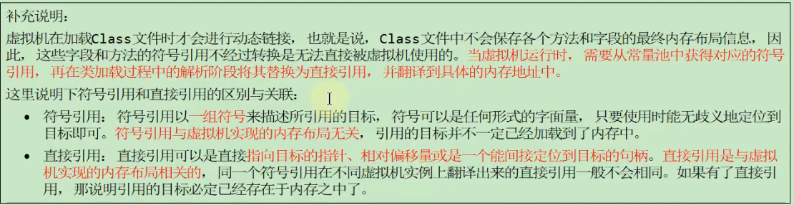


##### 2.2.5.4.5 来看看常量池里都有什么


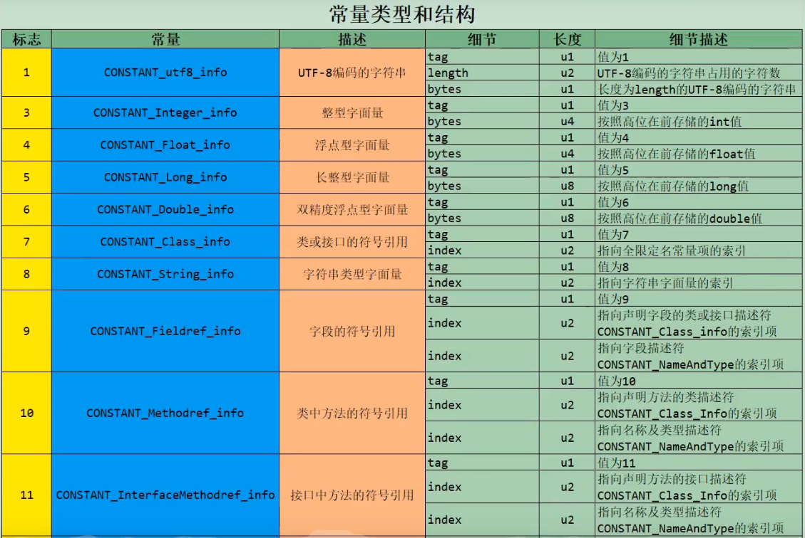

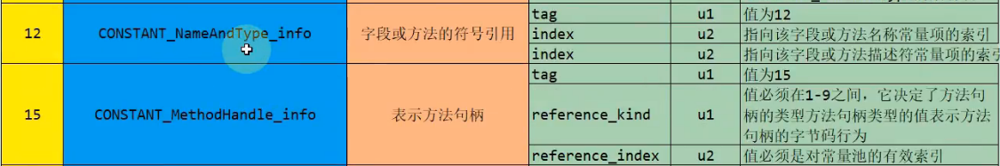

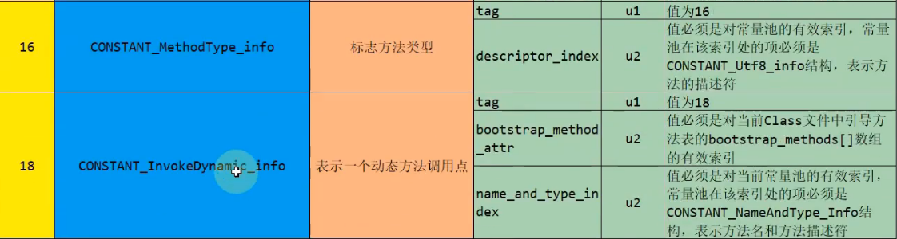

其中，字符串比较特殊。字符串的长度可变，所以需要拿出2个字节，用于表示字符串的长度n。后面跟着n个字节都属于这个字符串。


```
红色（tag）： 表示1 是CONSTANT_utf8_info 
根据上表，接下来u2个字节表示 length（紫色框）
紫色框的值为6，所以接下来u6个字节就是这个字符串的值。
```


```
01：字符串 utf8编码的
00 03 ： 长度3
6e 75 6d : 字符串的值
```

##### 2.2.5.4.6 解读常量池例子

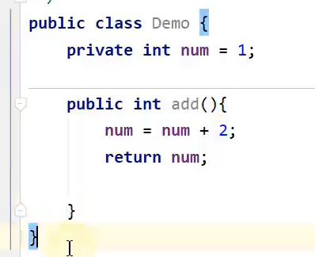


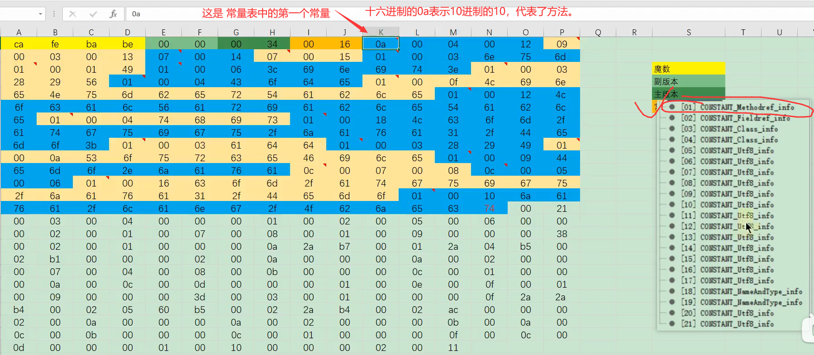


如此短的代码，常量池竟有21个常量。整个Class文件中，常量池就占了一半。确实常量池是Class中最大的部分之一。

你一定会有疑问，这么多的常量哪儿冒出来的？

那就来尝试解读一下：


接下来的两个 u2 分别表示：

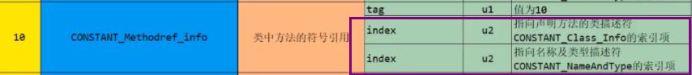

```
第一个index 表示类名  指向  十进制的序号为04的常量
第二个index 表示方法名和修饰符  指向  十进制的序号为18的常量
```

索引为04的常量：【CONSTANT_ class_info】


```
u1 表示类
u2 表示 值为类的全限定名的常量 的索引

u2指向 十进制序号为21的常量
```

索引为21的常量：（蓝色区域）【是一个utf8的字符串常量】


```
是一个utf8的字符串，值就是 java/lang/Object
```

索引为18的常量：【CONSTANT_NameAndType_info】


```
十六进制的0C  12 查找表，得到12代表 CONSTANT_NameAndType_info 名字和种类。

下一个u2  表示name的常量值索引     值为7
再下一个u2 表示type的常量值索引     值为8
```

 索引为7的常量：【CONSTANT_utf8_info】


```
tag     u1
length  u2
bytes   u1

这6个长度的字符串的值为   "<init>"

至此知道了方法的类名Object 方法名为<init>
```

索引为08的常量：【CONSTANT_utf8_info】

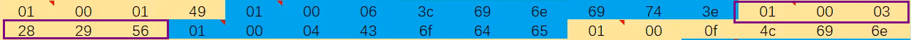

```
长度为3的字符串的值为   "()V"


至此，完全解读出了 索引为01的常量表示的是一个方法。
方法所属的类名为  java/lang/Object
方法名和修饰符为  <init>  ()V
```

````
解读了索引为1的常量，可以知道很多的常量类型最终解释都是依靠字符串。

事实上这样做也是最节省空间的方式：因为只有字符串才可以变长。当遇到一个非常长的全限定名，那么到底给 Class_info预留出多少的类名呢?用u2长度表示字符串常量的索引值。找到这个字符串常量，它存放的变长值就是这个类的全限定名。
````


###### 2.2.5.4.6.1 常量池小结

```
常量池表是一个不定长的。
所以前面需要有一个u1的 常量表计数器。表示常量池表的长度。
```

```
常量池表的 0号索引为空
所以常量的索引总是从1开始的。
常量池表可以看做一个数组。
```

```
常量池表 是Class文件中最大的部分之一。
常量池表里很多的常量类型，最终解释都是以 字符串形式解释的。

事实上，在常量池以外，同时也在Class文件结构中，例如“字段表”也需要引用常量池中字符串常量作为解释。
```


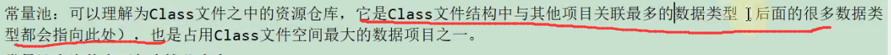


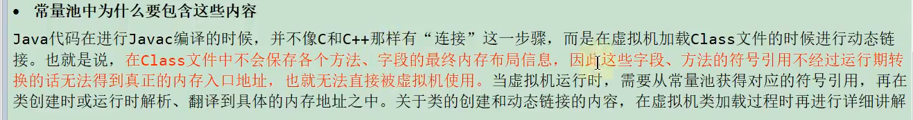

#### 2.2.5.5 访问标识

access_flags

##### 2.2.5.5.1 access_flags 概述

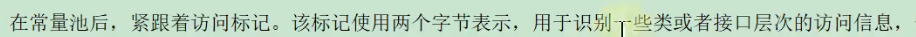

```
对类的访问权限 进行刻画。
例如： 是否是public
      是class还是interface
      是否是 abstract
      是否final
```

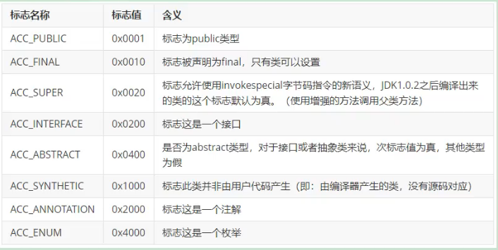

##### 2.2.5.5.2 一些特点

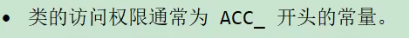

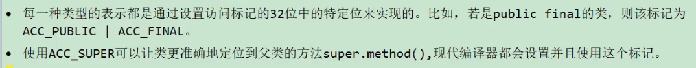


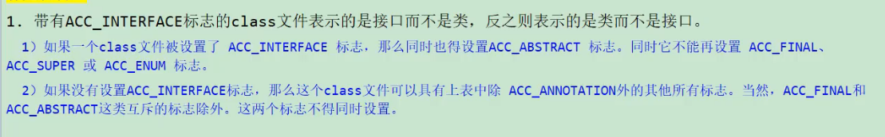


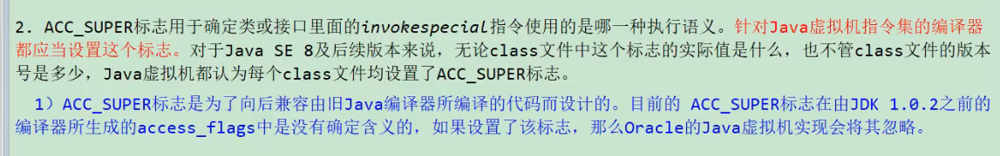

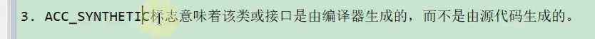


在jclasslib中，这部分信息在  一般信息general information中。

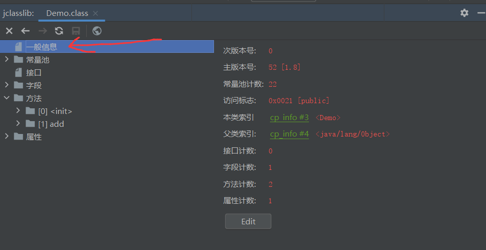


#### 2.2.5.6 类索引、父类索引、接口索引集合

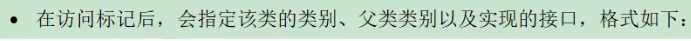

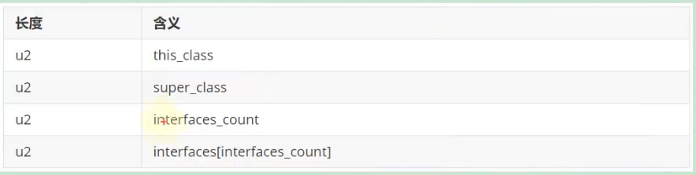


这部分信息依然在 general information 中

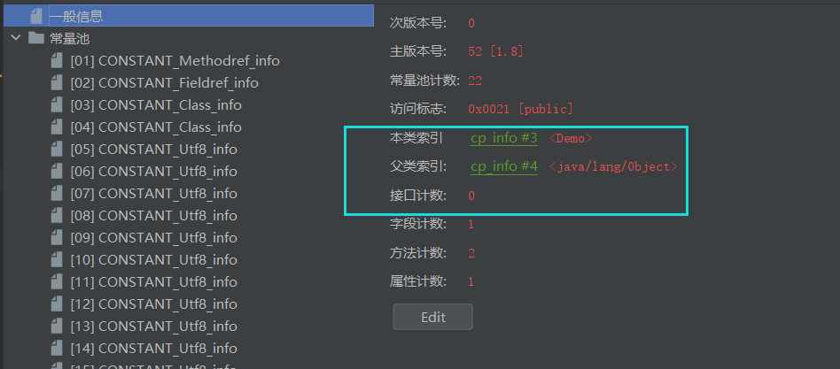


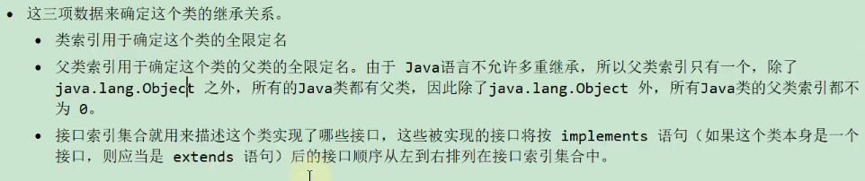

```
对于 Object 类来说，它u2长度的 super_class 就是 00 00
这也就是为什么 常量池index0是空了，就是为了指向这种空引用的情况。
```


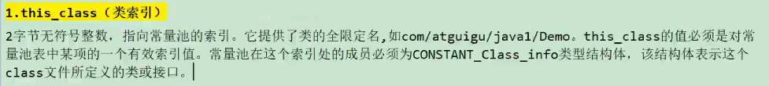


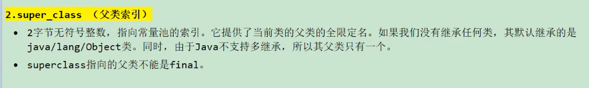


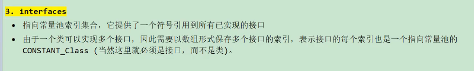


#### 2.2.5.7 字段表集合


##### 2.2.5.7.1 从 字段表集合 名字入手


````
前文提到过，多个数据项组合在一起通常习惯用 _info 命名。

为什么叫字段表集合呢？因为字段表集合里面的每一个元素都是 字段表（fields_info）。

而字段表（fields_info）中由又含有多个数据项，例如：
access_flags       访问标识
name_index         指向属性名字的索引
descriptor_index   指向描述符的索引
attributes_count   属性表的长度
attribute_info     属性表
````

```
注意： 在一个 fields_info 中又含有一个 attribute_info
可以理解为 数组里套一个数组。

另外： 在OOP中，某个对象类中的属性，其实是本文中的“字段”，事实上翻译为“域”或者“字段”更为准确。
这与数据库原理中的概念一致。 而 fields_info 中的 attribute翻译为属性。是有别于字段的，不要混淆。
```


以下就是字段表的结构：


##### 2.2.5.7.2 什么是 fields

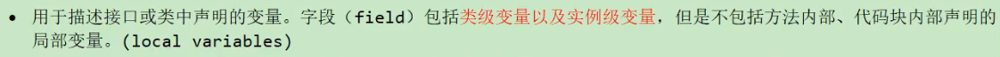

```
类级 变量
实例级 变量
```

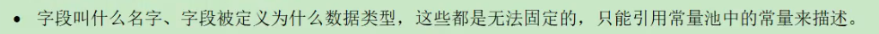

##### 2.2.5.7.3 字段表集合中记录了什么

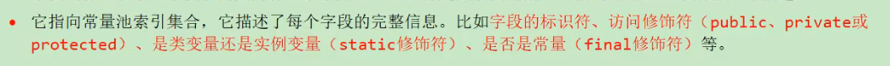

```
记录了字段的：
标识符
访问修饰符 ： public private protected
类变量/实例变量  ： 是否被static修饰
是/不是常量   ：  是否被final修饰
```


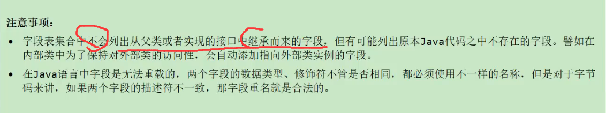

```
字段表中，不会列出父类/实现接口中继承来的字段。

字段表中有可能出现java代码中不存在的字段。
```


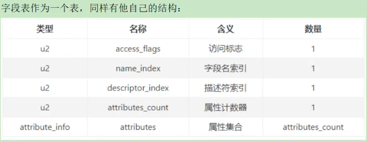


##### 2.2.5.7.4 字段表

fields[] 中每一个成员都是一个  fields_info结构的数据项。

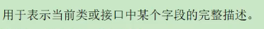

```
或者这样描述：  完整刻画了当前类/接口中某个字段
```

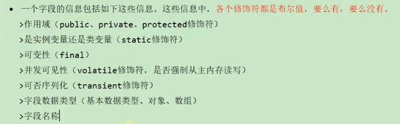


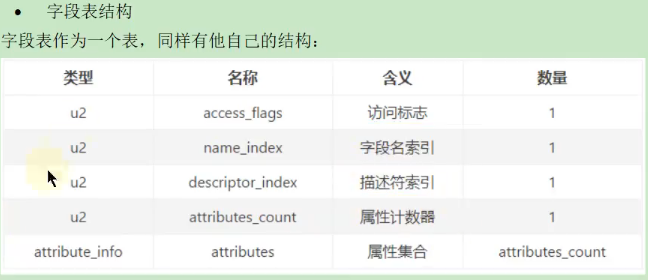

###### 2.2.5.7.4.1 字段访问标识

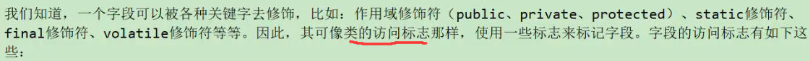

```
前文提到过的访问标识，准确的来讲应该叫  类的访问标识
```

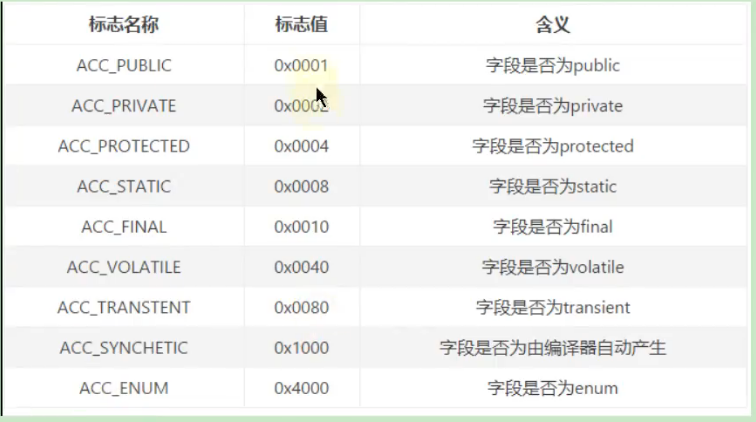


###### 2.2.5.7.4.2 字段名的索引

一看到“索引”二字就知道了，字段名的表示是引用 常量池中字符串来解决的。


###### 2.2.5.7.4.3 描述符的索引

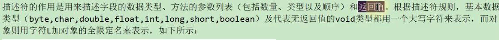

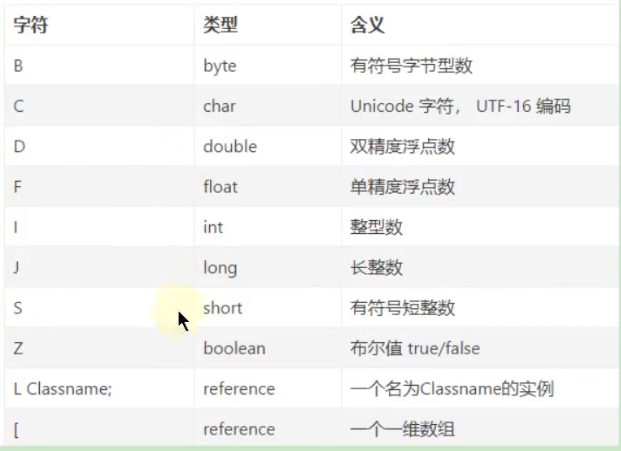


###### 2.2.5.7.4.4 属性表集合

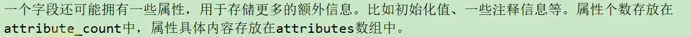

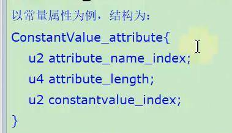

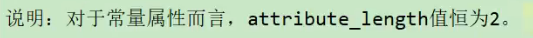


将代码

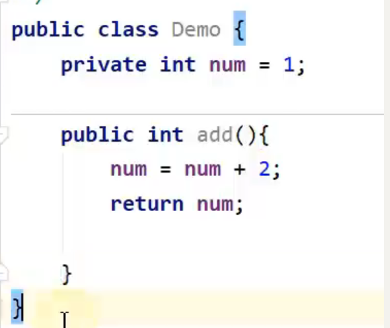

更改为

```java
public class Demo{
	private final int num =1;
	
	public int add(){
		return num;
	}
}
```

就可以在字段表集合中。看到num字段的属性了。


#### 2.2.5.8 方法表集合

##### 2.2.5.8.1 方法表集合 概述


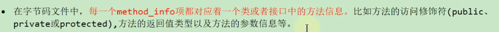


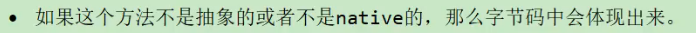


##### 2.2.5.8.2 字段表特点


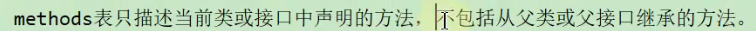


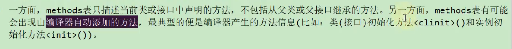

```
这两天和字段表一样。
```

##### 2.2.5.8.3 方法表计数器

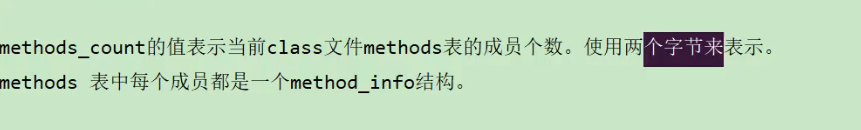


##### 2.2.5.8.4 方法表

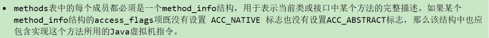

```
每个方法都是 method_info，包含了一个方法的全部描述。

```

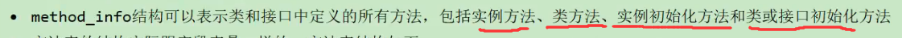

```
实例方法

类方法  ： 被static修饰的方法

实例初始化方法 ：  <init>

类或者接口的初始化方法 : <clinit>   (类中静态代码块中的代码)
```


###### 2.2.5.8.4.1 方法表结构

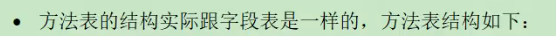

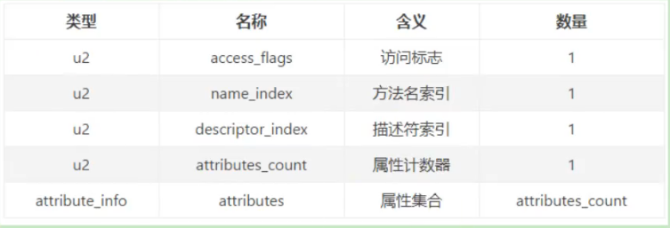

###### 2.2.5.8.4.2 方法表访问标识

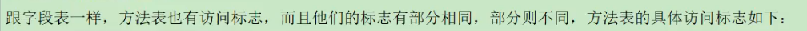

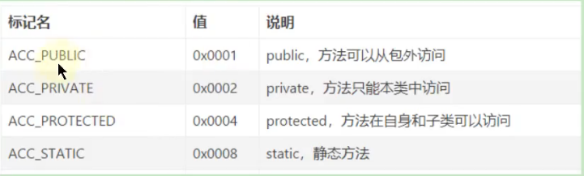


#### 2.2.5.9  属性表集合

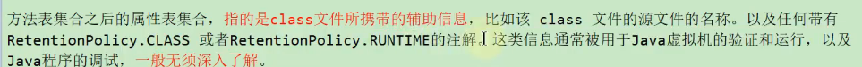


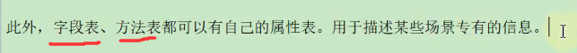


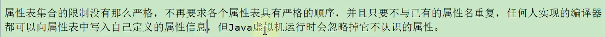

##### 2.2.5.9.1 属性表

属性表（attribute_info） 就是  属性表集合的元素。

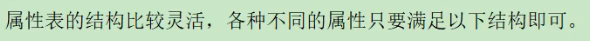

##### 2.2.5.9.2 属性表的通用格式

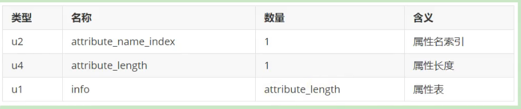


##### 2.2.5.9.3 属性的类型

不同的属性类型的结构也不同

以出现区域排序

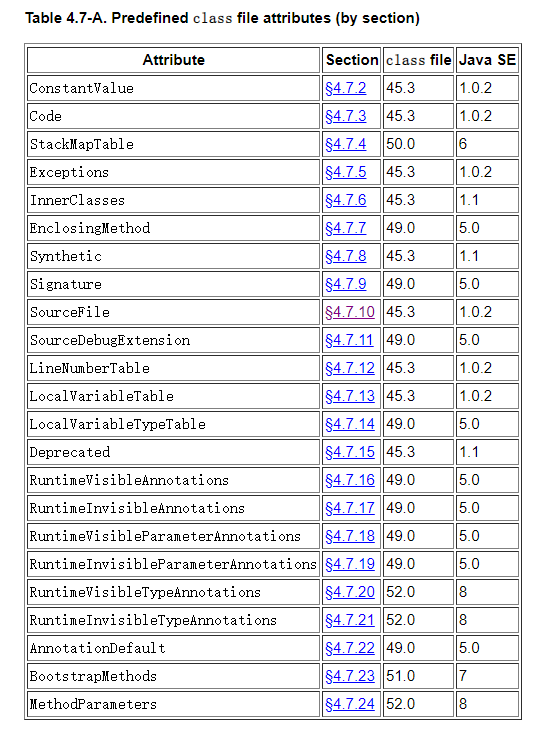


| Attribute                              | Section                                                      | `class` file | Java SE |
| -------------------------------------- | ------------------------------------------------------------ | ------------ | ------- |
| `ConstantValue`                        | [§4.7.2](https://docs.oracle.com/javase/specs/jvms/se8/html/jvms-4.html#jvms-4.7.2) | 45.3         | 1.0.2   |
| `Code`                                 | [§4.7.3](https://docs.oracle.com/javase/specs/jvms/se8/html/jvms-4.html#jvms-4.7.3) | 45.3         | 1.0.2   |
| `StackMapTable`                        | [§4.7.4](https://docs.oracle.com/javase/specs/jvms/se8/html/jvms-4.html#jvms-4.7.4) | 50.0         | 6       |
| `Exceptions`                           | [§4.7.5](https://docs.oracle.com/javase/specs/jvms/se8/html/jvms-4.html#jvms-4.7.5) | 45.3         | 1.0.2   |
| `InnerClasses`                         | [§4.7.6](https://docs.oracle.com/javase/specs/jvms/se8/html/jvms-4.html#jvms-4.7.6) | 45.3         | 1.1     |
| `EnclosingMethod`                      | [§4.7.7](https://docs.oracle.com/javase/specs/jvms/se8/html/jvms-4.html#jvms-4.7.7) | 49.0         | 5.0     |
| `Synthetic`                            | [§4.7.8](https://docs.oracle.com/javase/specs/jvms/se8/html/jvms-4.html#jvms-4.7.8) | 45.3         | 1.1     |
| `Signature`                            | [§4.7.9](https://docs.oracle.com/javase/specs/jvms/se8/html/jvms-4.html#jvms-4.7.9) | 49.0         | 5.0     |
| `SourceFile`                           | [§4.7.10](https://docs.oracle.com/javase/specs/jvms/se8/html/jvms-4.html#jvms-4.7.10) | 45.3         | 1.0.2   |
| `SourceDebugExtension`                 | [§4.7.11](https://docs.oracle.com/javase/specs/jvms/se8/html/jvms-4.html#jvms-4.7.11) | 49.0         | 5.0     |
| `LineNumberTable`                      | [§4.7.12](https://docs.oracle.com/javase/specs/jvms/se8/html/jvms-4.html#jvms-4.7.12) | 45.3         | 1.0.2   |
| `LocalVariableTable`                   | [§4.7.13](https://docs.oracle.com/javase/specs/jvms/se8/html/jvms-4.html#jvms-4.7.13) | 45.3         | 1.0.2   |
| `LocalVariableTypeTable`               | [§4.7.14](https://docs.oracle.com/javase/specs/jvms/se8/html/jvms-4.html#jvms-4.7.14) | 49.0         | 5.0     |
| `Deprecated`                           | [§4.7.15](https://docs.oracle.com/javase/specs/jvms/se8/html/jvms-4.html#jvms-4.7.15) | 45.3         | 1.1     |
| `RuntimeVisibleAnnotations`            | [§4.7.16](https://docs.oracle.com/javase/specs/jvms/se8/html/jvms-4.html#jvms-4.7.16) | 49.0         | 5.0     |
| `RuntimeInvisibleAnnotations`          | [§4.7.17](https://docs.oracle.com/javase/specs/jvms/se8/html/jvms-4.html#jvms-4.7.17) | 49.0         | 5.0     |
| `RuntimeVisibleParameterAnnotations`   | [§4.7.18](https://docs.oracle.com/javase/specs/jvms/se8/html/jvms-4.html#jvms-4.7.18) | 49.0         | 5.0     |
| `RuntimeInvisibleParameterAnnotations` | [§4.7.19](https://docs.oracle.com/javase/specs/jvms/se8/html/jvms-4.html#jvms-4.7.19) | 49.0         | 5.0     |
| `RuntimeVisibleTypeAnnotations`        | [§4.7.20](https://docs.oracle.com/javase/specs/jvms/se8/html/jvms-4.html#jvms-4.7.20) | 52.0         | 8       |
| `RuntimeInvisibleTypeAnnotations`      | [§4.7.21](https://docs.oracle.com/javase/specs/jvms/se8/html/jvms-4.html#jvms-4.7.21) | 52.0         | 8       |
| `AnnotationDefault`                    | [§4.7.22](https://docs.oracle.com/javase/specs/jvms/se8/html/jvms-4.html#jvms-4.7.22) | 49.0         | 5.0     |
| `BootstrapMethods`                     | [§4.7.23](https://docs.oracle.com/javase/specs/jvms/se8/html/jvms-4.html#jvms-4.7.23) | 51.0         | 7       |
| `MethodParameters`                     | [§4.7.24](https://docs.oracle.com/javase/specs/jvms/se8/html/jvms-4.html#jvms-4.7.24) | 52.0         | 8       |


###### 2.2.5.9.3.1 code属性的结构

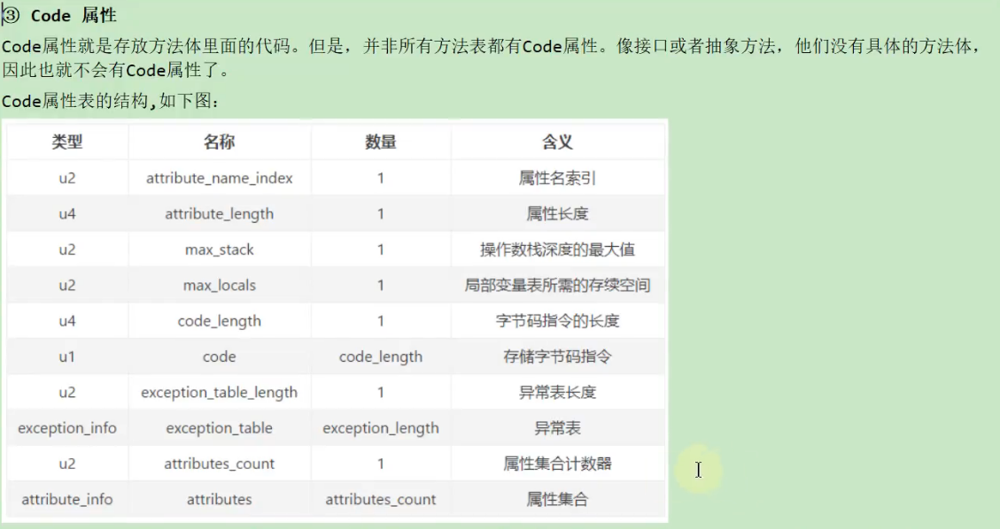

###### 2.2.5.9.3.2 LineNumberTable 属性结构


 

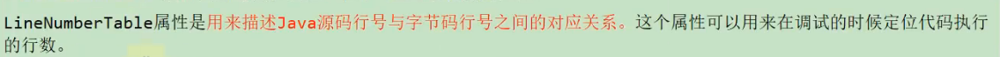

````
LineNumberTable 属性是可选变长属性，位于Code结构的属性表中
````


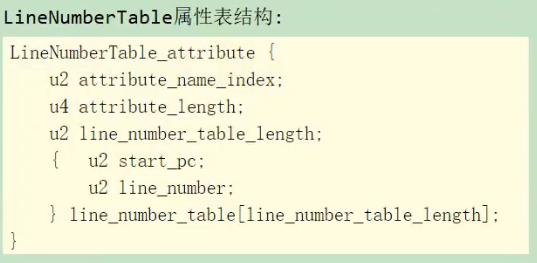


###### 2.2.5.9.3.3 LocalVariableTable 属性

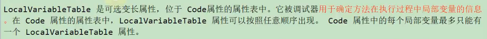

局部变量表。 

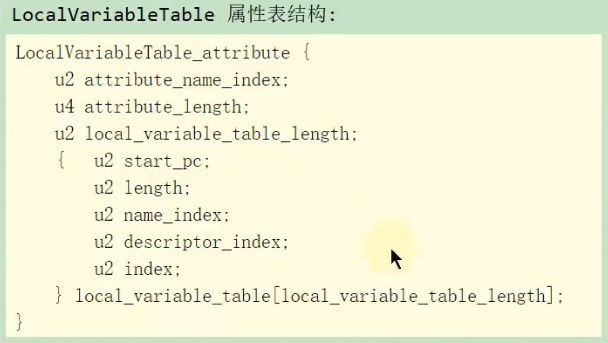


###### 2.2.5.9.3.4 SourceFile 属性

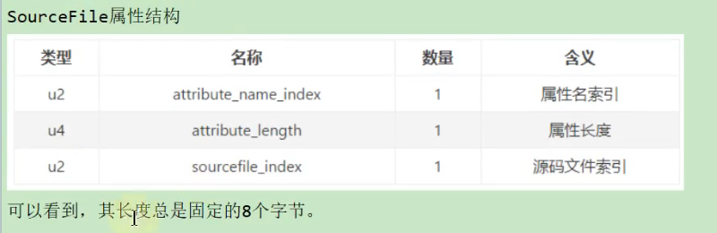


更多的属性结构查询官方文档：

https://docs.oracle.com/javase/specs/jvms/se8/html/jvms-4.html


#### 2.2.5.10  小结

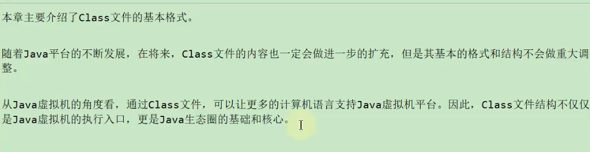


### 2.2.6 解析Class文件

#### 2.2.6.1 解析class文件作用

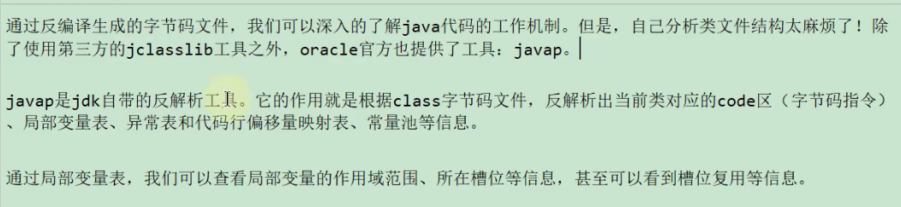


#### 2.2.6.2 	javac -g 操作


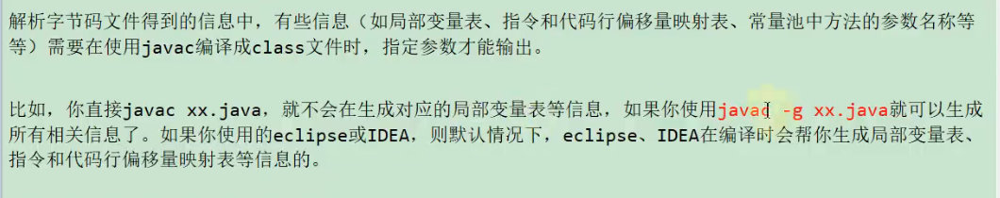

```
javac -g xxx.java
带-g参数，就生成局部变量表信息。


IDEA  Eclipse 编译生成的字节码文件，都会带-g参数
```

#### 2.2.6.3 javap 的使用


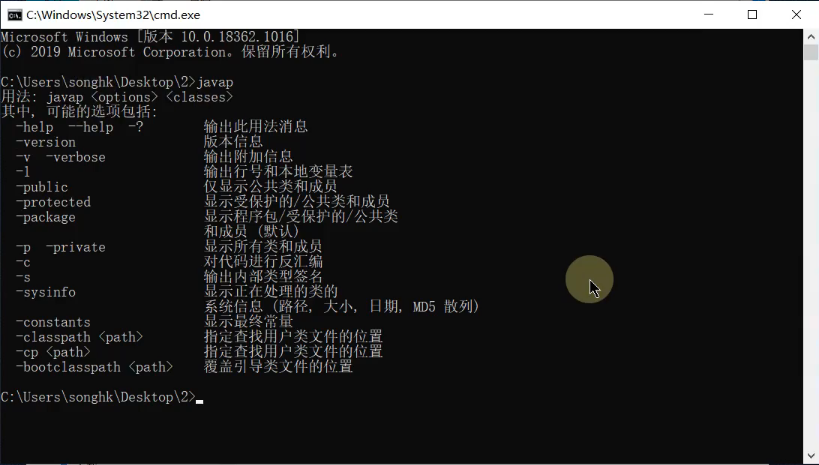


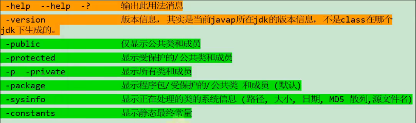


```
javap -v -p <xxx.class> 比较全的反编译.class文件
```


#### 2.2.6.4 小结


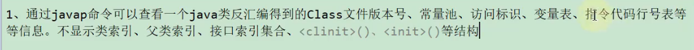


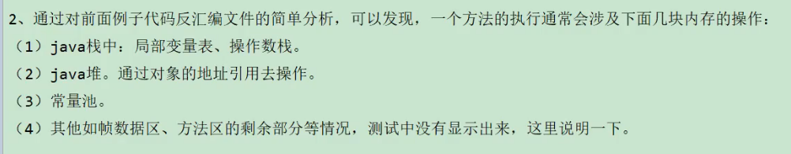


## 2.3  字节码指令集 与解析举例

本章主要解析方法体内部 字节码指令的执行。

### 2.3.1 字节码指令概述


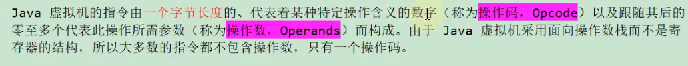

```
操作码 操作数   可以类比于计组中的  操作码 地址码。
零地址指令 一地址指令 二地址指令...

上述提到，java虚拟机面向操作数栈，意味着绝大部分指令都是对栈顶元素操作的，这样可以省去地址码，减少指令集的长度，让class文件更小。这对于数据传输、解析意义很大。
```

#### 2.3.1.1 举个例子

```
操作码占u1   //1个字节
操作数占u2  //2个字节
```

所以，例如这样的字节码指令

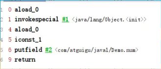

一共占10个字节。

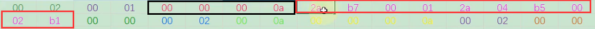

```
前面u4表示字节码长度，值是10，符合事实。
```


#### 2.3.1.2 更多特点

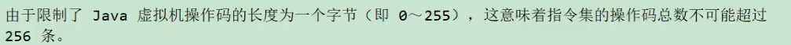


​	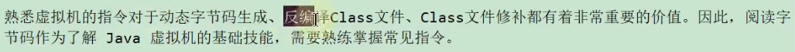


#### 2.3.1.3 字节码与数据类型

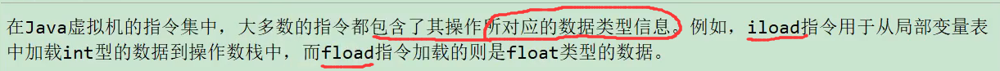


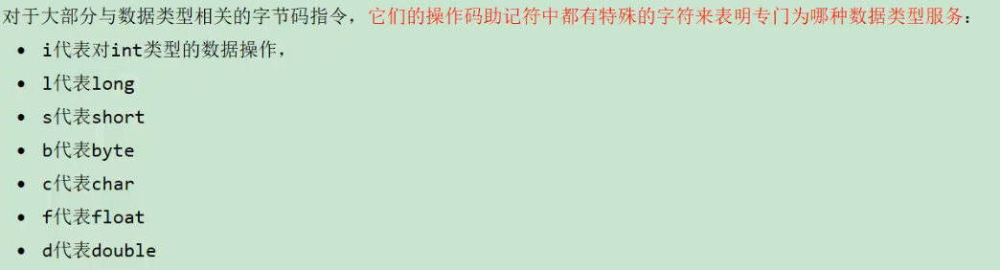

a代表引用


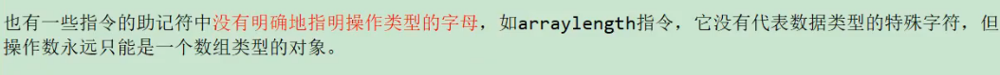


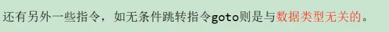


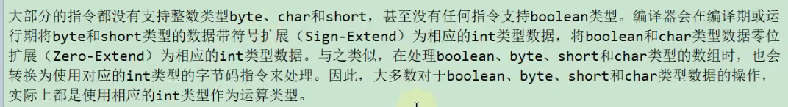

```
byte short char 将转换为int类型数据。
对应的byte[]数组也会转化为 int[] 数组。

```


#### 2.3.1.4 指令分类

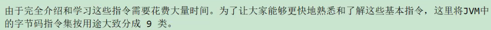


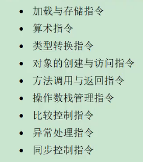


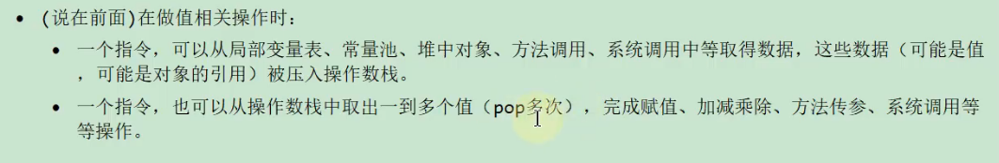


### 2.3.2 加载与存储指令


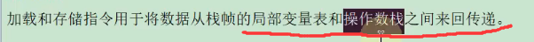


#### 2.3.2.1 常用指令

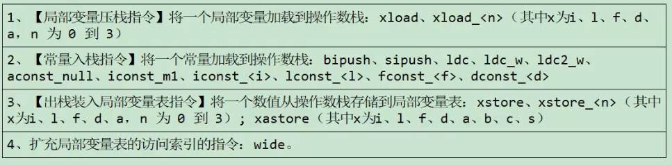

```
load

push

ldc

const
都是把数据压入到操作数栈中。
```

```
操作码被限制在了1个字节内，所以最多是256个。所以不可能把全部的指令都设计成 零地址指令。在有限的数量内，理想情况就是把频繁使用的操作码指令 编排为零地址指令。
例如这个指令 xload_<n>  n=0,1,2,3 ，对于操作数0,1,2,3使用频繁，所以把 xload_0  xload_1 xload_2 编排为零地址指令，节约了class文件大小。


注意： xload <操作数>  和xload_<n> 不是一个操作码
```

#### 2.3.2.2 操作数栈 与 局部变量表

此部分是复习。

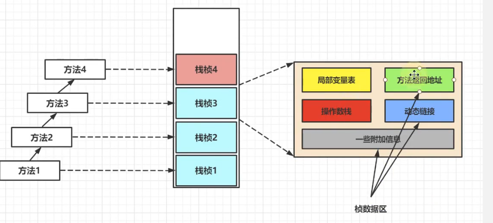


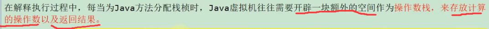


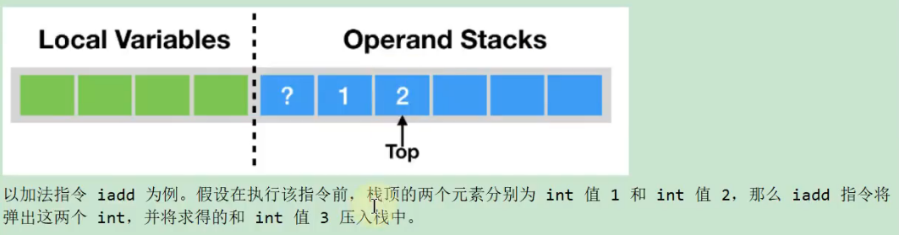

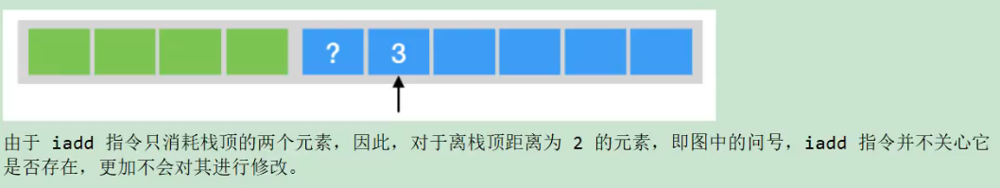


局部变量表：

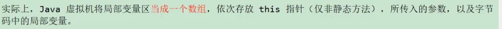

单元指： slot 槽位

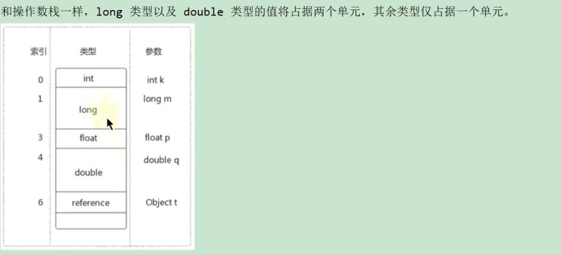


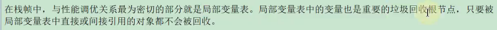


#### 2.3.2.3 局部变量压栈操作


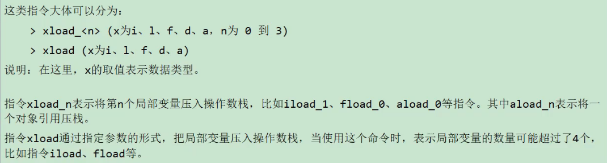


#### 2.3.2.4 常量压栈指令


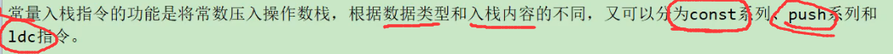


```
注意是 常量 压栈指令，压入到操作数栈的栈顶。
```


##### 2.3.2.4.1 const 系列

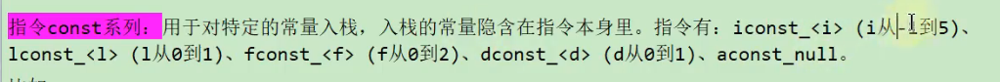

```
对于常量压栈指令来说，<n> 并不指向索引。而是常量的值。
```

```
const 针对不用的数据类型，有不同的零地址指令。
针对int类型 iconst_<i>
针对long类型 lconst_<l>
针对flost类型 fconst_<f>
针对double类型 dconst_<d>
针对引用类型的null情况    aconst_null ； //这个真的很常用


以上所有指令都是零地址指令，应对的是各种数据类型最常用的部分，减少地址码的数量。可以看到int类型相对于其他类型更常用一些，也被分配到了更多的指令。
```

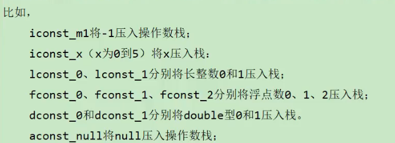


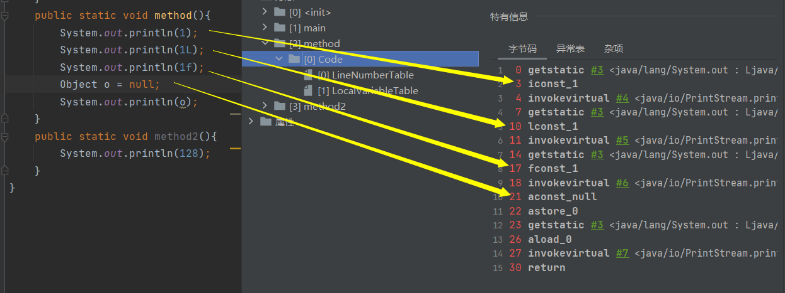


```
如果常量的值不是-1~5呢？

答：使用push系列
```

##### 2.3.2.4.2 push

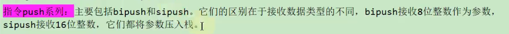

```
byte 8bit  //有符号的  -128~127

short 16bit
```

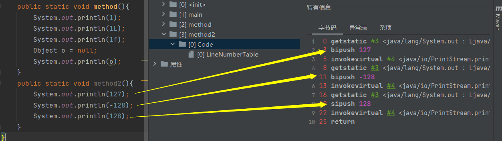


```
比32767还要大的数怎么办？

使用ldc系列
```

##### 2.3.2.4.3 ldc

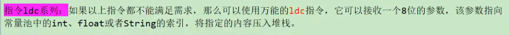

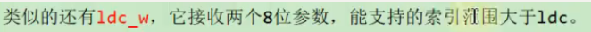


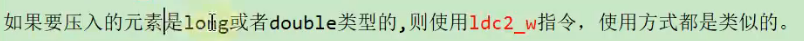

```
前文分析 字节码文件常量池中，某一个常量的索引都是用 u2（两个字节）来表示的。也就是说ldc_w只能表示索引小于等于255的常量。只有ldc2_w能引用常量池中全部的常量。
```

```
从const（零地址指令）到
push（bpush 4位地址码 spush 1字节）再到
ldc (ldc_w 1字节  ldc2_w  2字节）这一过程
不得已把地址码的大小扩大。可以看到目的都是为了减少class文件内字节数量。
```


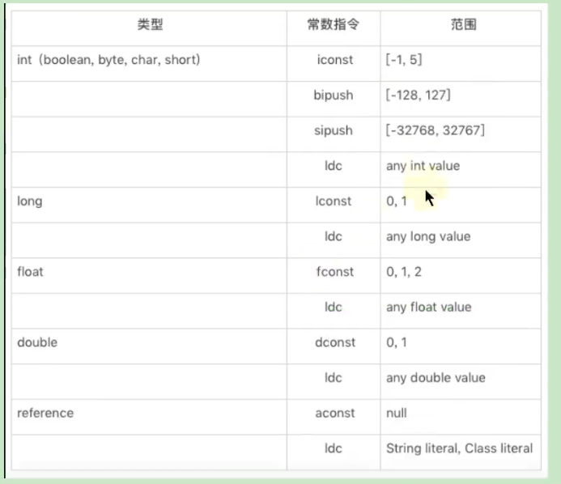


#### 2.3.2.5  出栈装入局部变量表

```
出栈的同时，存入局部变量表中
```

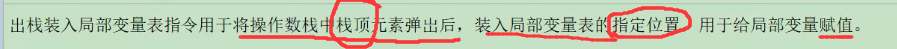


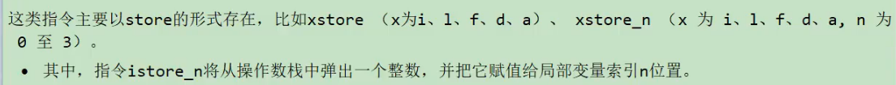

```
与前文一样，i表int 、l标long、f标float、d标double、a表 引用类型。 存储至0索引到3都被编排为零地址指令。
```


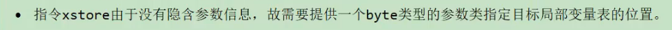

```
除0~3以外的位置，使用u1（1个字节）的位置表示 存储索引。
```


### 2.3.3  算数指令

#### 2.3.3.1 作用


```
注意。算得的结果，重新压入栈顶
```

#### 2.3.3.2 分类

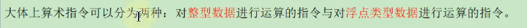


#### 2.3.3.3  byte char boolean  short 类型

byte char boolean short 都被转换为int类型做处理。

```
因为虚拟机大多数指令，没有针对上述类型支持。也是为了解决指令集数量不够的问题。
```


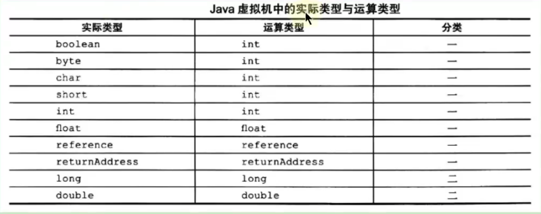


#### 2.3.3.4  运算溢出

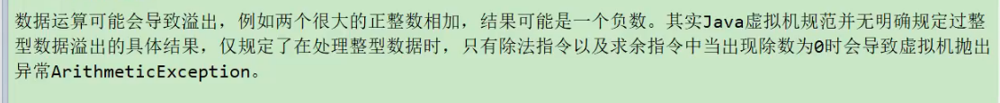


#### 2.3.3.5 运算模式

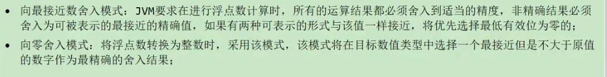


#### 2.3.3.6 NaN 的使用

not a number

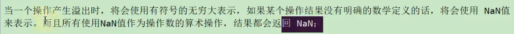


jdk官方的定义

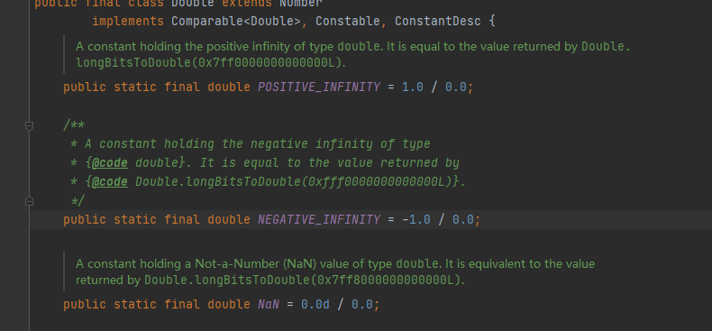

```
正无穷  1.0/*0.0

负无穷 -1.0/0.0

NaN  0.0/0.0
```


#### 2.3.3.7 所有的算术指令

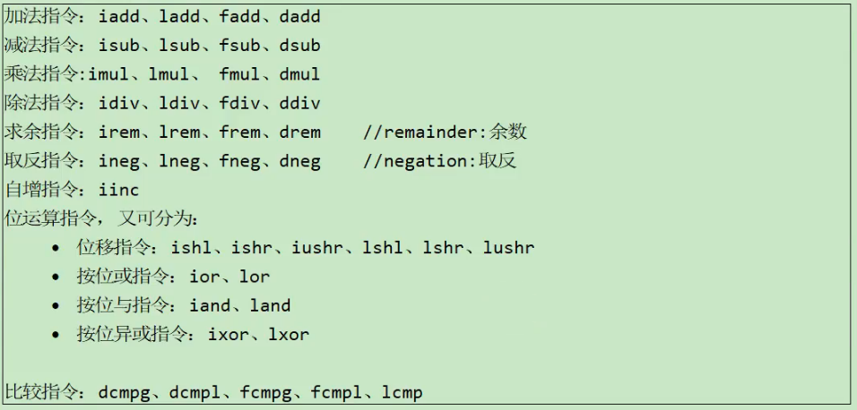


```
ishl  int类型的左移   ishr 右移
iushr 无符号右移

lushr long类型的无符号右移
```

##### 2.3.3.7.1 举例

###### 2.3.3.7.1.1 例1

```java
    public void method2(){
        float i = 10;
        float j = -i;
        i = -j;
    }
```

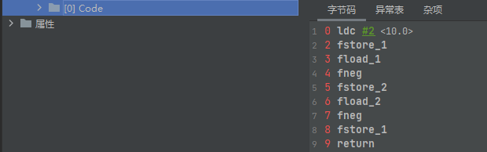

```
ldc 以1个字节为操作数长度。取索引为2的常量，CONSTANT_Float_info  值是10.0 压入栈顶
fstore_1 把操作数栈顶的值存储在局部变量表 索引为1的位置。
fload_1 把局部变量表索引为1的值压入栈顶
fneg (negitive) 把栈顶元素取反
fstore_2 把栈顶存储在局部变量表索引为2的位置
fload_2 把局部变量表索引为2的值压入栈顶
fneg栈顶取反
fstore_1存储在局部变量表索引为1的位置
return  void类型的方法返回。
```

###### 2.3.3.7.1.2 例2

```java
    public int method3(int j){
        int i = 100;
        i = i+10;
        return i;
    }
```

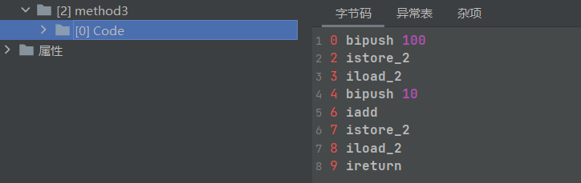

```
x bipush 把值100的整型压入栈顶istore_2 把栈顶值存入局部变量表2的位置。//0是this 1是形参jiload_2 把局部变量表索引为2的值压入栈顶bipush 10 把10压入栈顶	iadd  连续弹出2个栈顶元素，做 相加操作，并把结果压入栈顶istore_2 把栈顶元素存入局部变量表索引为2的位置iload_2 把局部变量表索引为2的值压入栈顶ireturn 返回栈顶
```


```java
    public void method4(int j){
        int i = 100;
        i+=20;
    }
```

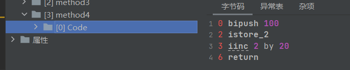


```
iinc 2 by 20
局部变量表索引2的值，自增1，步长为20
```


###### 2.3.3.7.1.3 例3

```java
    public int method5(){
        int a = 80;
        int b= 7;
        int c = 10;
        return (a+b)*c;
    }
```


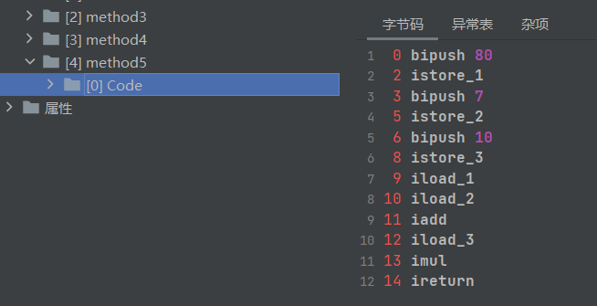


```
bipush 10 把80压入栈顶
istroe_1 存储在局部变量表索引为1
bipush 7 把7压入栈顶
istore_2 存储在局部变量表索引为2
bipush 10 把10压入栈顶
istore_3 存储在局部变量表索引为3
iload_1
iload_2
iadd     连续弹2次栈，相加，结果压入栈顶
iload_3  把局部变量表索引为3的值压栈
imul    连续弹栈2次，想成，结果压栈
ireturn  栈顶返回结果。
```


###### 2.3.3.7.1.4 例4

```java
public int method6(int i,int j){
    return (i+j-1) & ~(j-1);
}
```


```
~  按位取反操作。
等价于与 -1 作异或操作

真值为-1，在二进制中所有位都是1，与全1异或： 1变为0，0变为1。
等价于 按位取反。
```

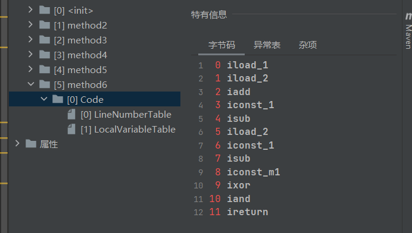


```
iload_1   索引为1的值压栈
iload_2   索引为2的值压栈
iadd
iconst_1  把常量1压入栈
isub
iload_2   索引为2的值压入栈
iconst_1  常量1压入栈
isub
iconst_m1   把-1压入栈
ixor     异或操作
iand     按位与操作
ireturn  返回栈顶元素 
```


##### 2.3.3.7.2 搞定++运算符

前置自增1，后置自增1

```java
    public void method7(int i,int j){
        int a = i++;
        int b = ++j;
    }
```

```
其实没什么难度。就是先自增再用，和先用再自增的区别。
查看一下字节码是如何定义的。
```

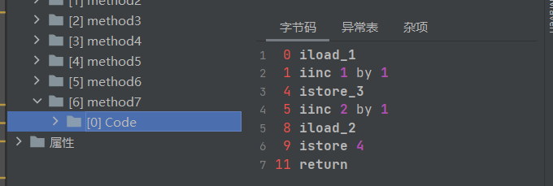

```
iload_1 先把索引1的值压入栈，注意此时i的值还没自增呢。所以是原来的
iinc 1 by 1  把索引1的值自增1，步长为1
istore_3     把栈顶值 存入局部变量表索引为3的值 //此时栈顶是旧值
iinc 2 by 1  把索引2的值自增1，步长为1
iload_2      压入索引2的新值  //此时压栈的是新值
istore 4     存储在局部变量表4的位置 
return       返回
```

```
所以对于 字节码指令来说，前置++ 后置++ 的区别可以更细粒度的表示：
先自增再压栈，后自增再压栈。


java代码层面的粒度：
先自增再用，和先用再自增。
```

###### 2.3.3.7.2.1 例1

改写method7

```java
public void method7(int i,int j){
    int a = i++;
    int b = ++j;
    int c = i--;
    int d = --j;
}
//没什么特别的。 增加了 前置自减一 和 后置自减一
```


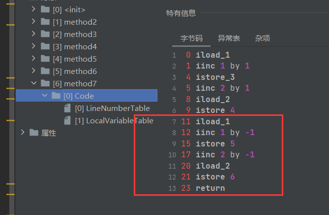

```
对于字节码指令来说。自增一/自减一是同一条指令。节约了指令集
区别就是步长发生了改变，由1 变为-1。
```

```
iload_1
iinc 1 by -1     //自减一，步长为-1
istore 5         //使用了一地址指令，先压栈后自减
iinc 2 by -1     //自减一 ，步长为-1
iload_2          压栈
istore 6         存储
return
```


#### 2.3.3.8  比较指令

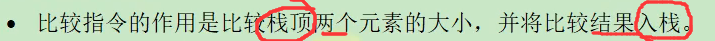

```
参考上条对比较指令的解读，可以直接得到  比较指令是零地址指令。
```

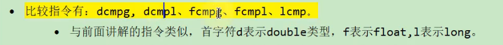


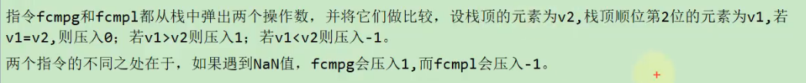

```
栈顶为v2，下一个是v1。
v1==v2 压栈0
v1>v2  压入1
v1<v2  压入-1
```


#### 2.3.3.9 类型转换指令

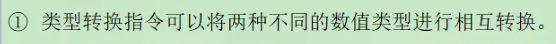

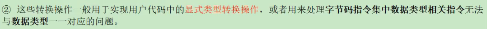


##### 2.3.3.9.1宽化类型转换


###### 2.3.3.9.1.1 转换规则

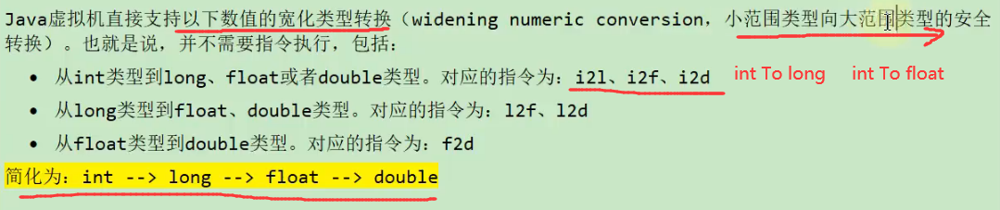

###### 2.3.3.9.1.2 引入例子

例1：

```java
public void methode1(){
    int i = 10;
    long a = i;
    float b = i;
    double c=  i;

    float d = a;
    double e = a;
    double f = b;
}//很简单，没什么说的
```

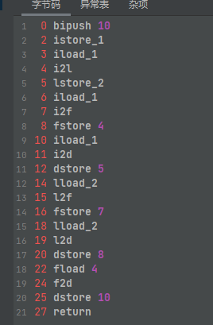


###### 2.3.3.9.1.3 精度损失问题

```
int->long 无损失   float->double 无损失

int->float  会出现损失
long->float 会出现损失
```

例2：

```java
    public static void method2(){
        int a = 123123123;
        long b = 1234561234561234561L;

        System.out.println((float)a);
        System.out.println((double) a);
        System.out.println((float)b);
        System.out.println((double) b);
    }
```

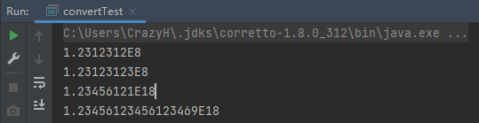


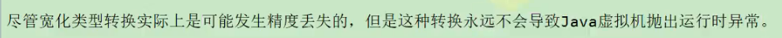


###### 2.3.3.9.1.4 补充说明

byte char short 类型呢？

```
事实上，和前文一脉相承。虚拟机并没有为 byte char short 准备额外的指令。
而是在处理的过程中，直接将 byte char short 认为是int类型的。
```

```java
    public void method3(){
        byte a = 1;
        char b = '#';
        short c = 2;

        System.out.println((long) a);
        System.out.println((long) b);
        System.out.println((long) c);

        System.out.println((float) a);
        System.out.println((float) b);
        System.out.println((float) c);

        System.out.println((double) a);
        System.out.println((double) b);
        System.out.println((double) c);


    }
```


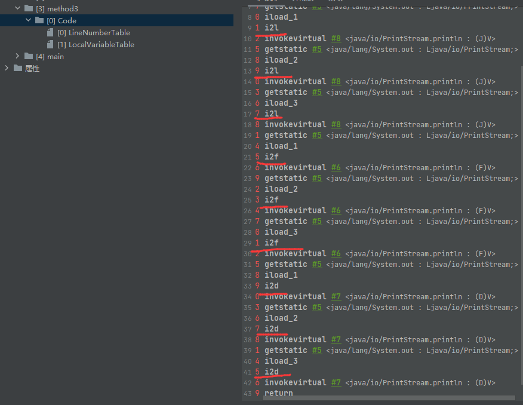


```
通过查看字节码指令，确实可以验证虚拟机直接把byte short char 类型当作int类型。

如此做的意义，也是和前文一致： 减少指令集的消耗、把操作码的大小压缩在1个字节（8位）以内（256个以内）。
```


对于宽化类型转换，在使用时不需要特意的声明：

```java
    public void method4(){
        float a = 1f;

        double b = a; //无需特意声明强制类型转换
        long  c = (long) a; //必须强制类型转换

    }
```


##### 2.3.3.9.2 窄化类型转换


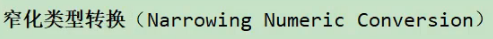


###### 2.3.3.9.2.1 转换规则


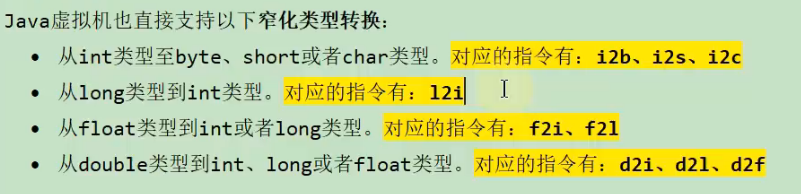


###### 2.3.3.9.2.2 举例说明

```java
public class NarrowConvertTest {
    public void method1(){
        double a = 2.1d;
        int b  = (int)a;
        long c = (long)a;
        float d = (float) a;
        

        byte e = (byte) b;
        char f = (char) b;
        short g = (short) b;

    }


}
```

```
将double 类型转换为 int、long、float 也就是宽化类型转换的逆运算
```

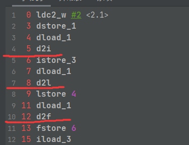

```
只有int类型有指令直接转换为byte char short
分别对应   i2b i2c i2s
```

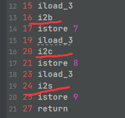


```
如果是更宽化的类型转化为byte char short呢？
没有直接指令，就只能间接地转化
```

```java
    public void method2(){
        double a = 1.3d;
        byte b = (byte)a;
        char c = (char) a;
        short d = (short)a;
    }
```

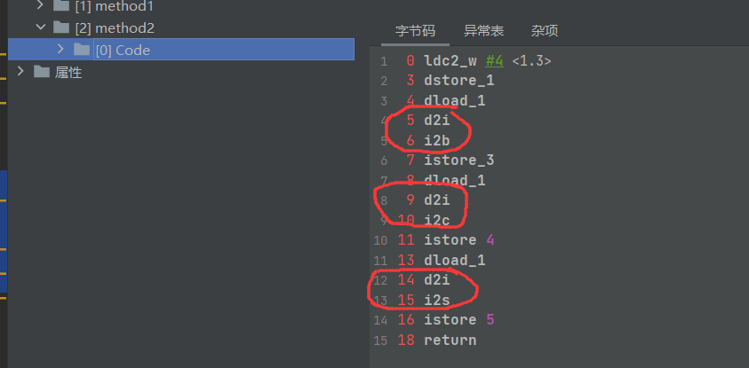

```
d2i -> i2b 
d2i -> i2c
d2i -> i2s
```


如果是 short 、byte 、 char类型之间转换呢？

```
前文提到过，short byte char 都会被编译器认为是 int类型
直接调用 i2s i2b i2c
```

```java
public void method3(){
    short a = 2;
    byte b = (byte) a;
    char c = (char) a;

    byte d = 5;
    short e = (short) d;
    char f = (char) d;

    char g =  '#';
    short h = (short) g;
    byte i = (byte) g;
    
}
```

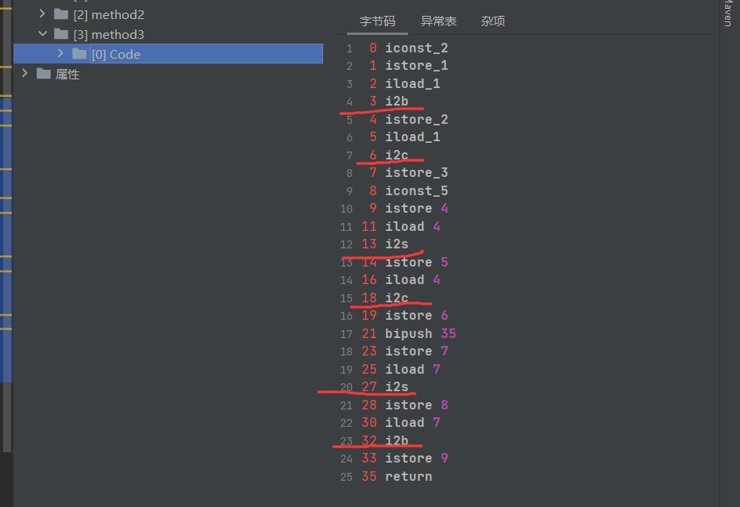


###### 2.3.3.9.2.3 精度损失问题

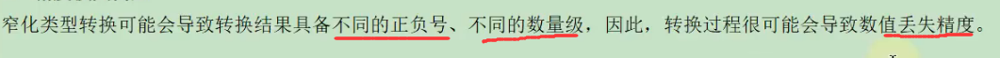

```
因为是窄化类型转换，出现精度损失还算小事。有时数量级可能会出现错误，有时正负号都会出现错误。
但java虚拟机规范明确规定，窄化转换指令永远不可能导致虚拟机出现异常。算出的结果是什么，就是什么，不对值的变化抛出异常。
```

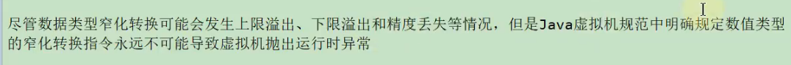


###### 2.3.3.9.2.4 补充说明


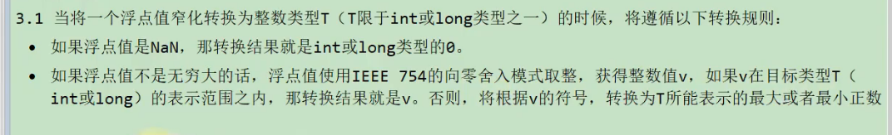


### 2.3.4 对象的创建与访问指令


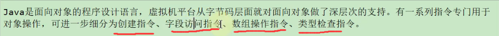

#### 2.3.4.1 创建指令

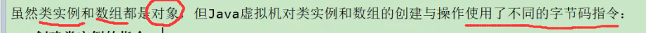


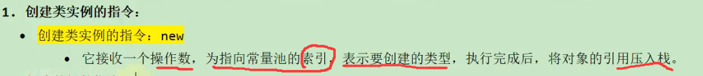


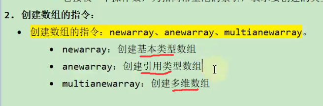


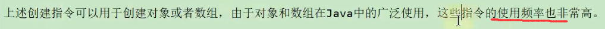


##### 2.3.4.1.1 例子

```java
public void method1(){
    Object obj = new Object();

    File file = new File("abc");
}
```

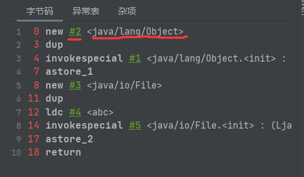

```
new #2             new指令接收一个操作数，指向常量池索引为2的常量
                  （CONSTANT_Class_info类型的）。创建完压栈
                  
dup                复制一份栈顶元素，并压栈

invokespecial #1   调用方法，指向常量池索引为1的常量
                  （CONSTANT_Methodref_info）
                  
astore_1           将栈顶元素（引用类型a）存储在局部变量表索引为1的
                   位置。
new #3             new一个新的实例，类型为常量池索引3常量指向的类型

dup                复制一份栈顶元素，并压入栈顶

ldc #4             把常量池索引4的常量（CONSTANT_utf8_info）压入
                   栈顶。
invokespecial #5   调用方法，指向的是常量池索引为5的常量指向的方法。

astore_2           把栈顶元素（引用类型 a）存储在局部变量表索引为2的                    位置上
return             返回
```


#### 2.3.4.2字段访问指令

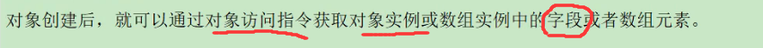

```
通过字段访问指令，访问对象实例的字段、数组元素
```

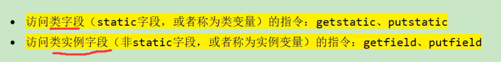

```
实例变量 getfield putfield
getfield 需要栈顶元素是某个具体实例变量的引用，getfield时会弹出栈顶，并压入获取到的值。
putfield 需要栈顶元素是put进去的值，发生弹栈。


类变量  getstatic putstatic
getstatic  不需要栈顶元素是这个类的引用。直接就把取到的值压入栈顶。

putstatic   发生弹栈，弹出的就是put进去的值。


仔细分下下面举的例子、体会一下上述
```


##### 2.3.4.2.1引入例子

```java
    public void method1(){
        System.out.println("abc");
    }
```

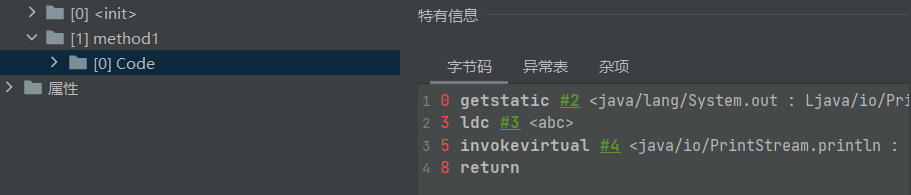

```
getstatic #2      把常量池索引为2的常量字段引用      
                  （CONSTANT_Fieldref_info）压入栈中
ldc  #3            把常量池索引为3的常量（CONSTANT_utf8_info）压
                   入栈中
invokevirtual #4   调用虚方法 常量池索引为4的方法
return             返回
```

##### 2.3.4.2.2  更多的例子

```java
public void setOrderId(){
    Order order = new Order();
    order.id = 1001;
    System.out.println(order.id);

    Order.name = "ORDER";
    System.out.println(Order.name);
}


static class Order{
    int id;
    static String name;
}
```

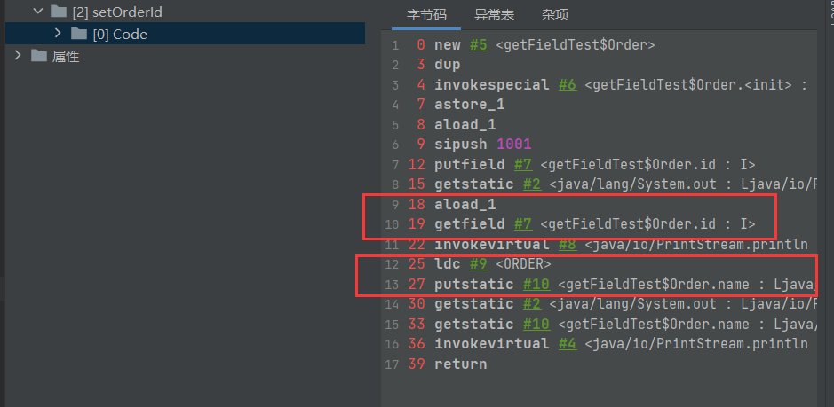

````
仔细分析上面的字节码指令可以得出结论：
获取实例变量字段的指令  getfield，需要弹栈，栈顶是这个实例对象，并把获取到的值压入栈中。对应的字节码指令序号是9，10

putfield 不用多说，栈顶自然是put进去的值。
putstatic 也不用多说，栈顶自然也是put进去的值。


获取类变量字段的指令  getfield，不需要弹栈，栈顶元素不需要指向这个类的索引。并把获取到的值压入栈顶。
````

```
36 invokevirtual #4   连续弹出两个栈顶，一个是out对象的引用，一个是
                      #10字段的引用
```


#### 2.3.4.3 数组操作指令

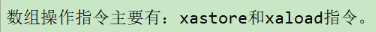


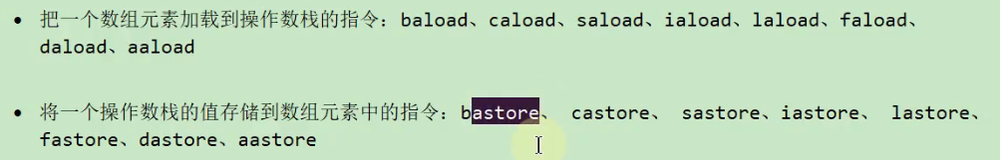

```
baload    //byte array load
bastore   //byte array store
```


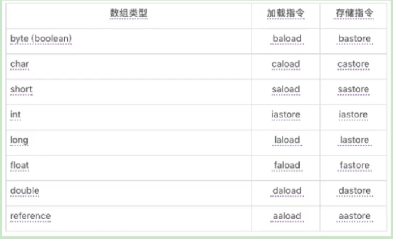

##### 2.3.4.3.1  详细说明

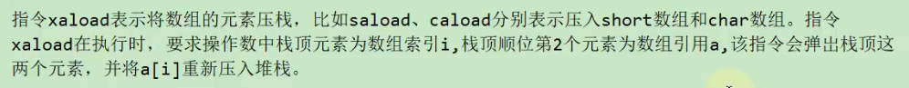

````
iaload 需要连续弹栈2次，但是是零地址指令，第一次为数组索引，第二次为数组的引用。


iastore 需要连续弹栈3次，但是是零地址指令。第一次为 存储的值，第二次为数组索引，第三次为 数组的引用
````

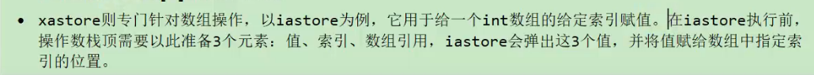


##### 2.3.4.3.2  引入例子

iaload


```java
    public void method(){
        int[] array = new int[5];
        int b = array[2];
    }
```


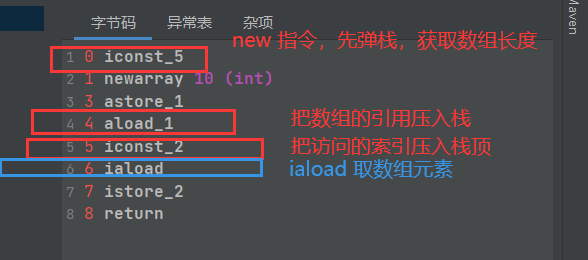


iastore

````java
    public void methode1(){
        int [] array = new int[20];
        array[5] = 25;
        System.out.println(array[5]);
    }
````

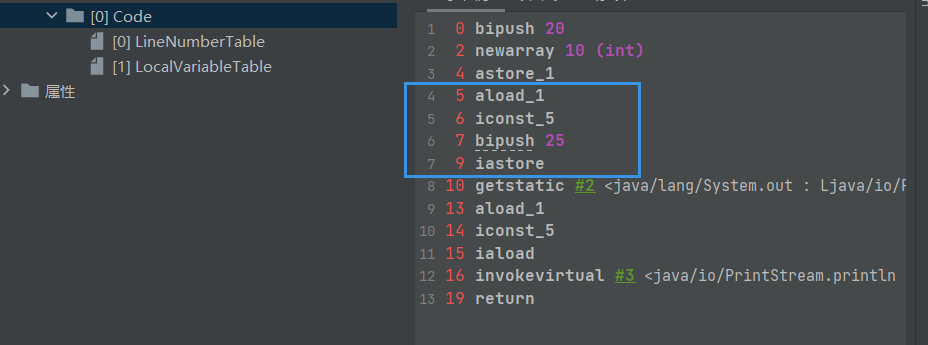

```
array[5] = 25;
依次压栈： 数组的引用，索引的值，赋的值。恰好是java代码层面的从左到右
```


##### 2.3.4.3.3 arraylength

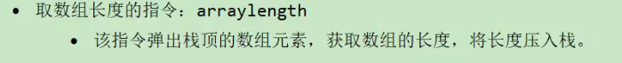


```java
    public void method2(){
        byte[] array = new byte[20];
        int a = array.length;

    }
```


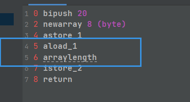

```
arraylength 指令是零地址指令。弹一次栈，弹出的栈顶是 数组的索引。
```


#### 2.3.4.4 类型检查指令

##### 2.3.4.4.1 类型检查概述

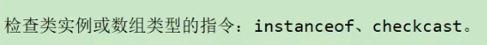

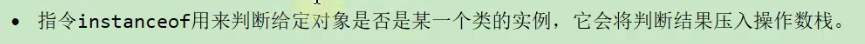

```
字节码指令 instanceof 和 java关键字 写法一致，
都是判断某个对象是否是 指定类或其子类的实例对象，并将结果压入操作数栈
```

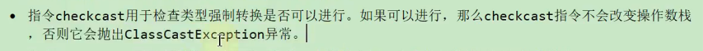

```
在强制类型转换时会自动的被编译器加入，用于强制类型转换前的安全检查。


下面引入代码感受一下：
```

##### 2.3.4.4.2 类型检查例子

###### 2.3.4.4.2.1 例1

```java
public static void main(String[] args) {
        String s = "";
        Object obj = new Object();
        if (obj instanceof Object){
            System.out.println(" Object is a instance of Object");
        }
        if (s instanceof  Object){
            System.out.println(" SubClass is a instance of FatherClass");
        }
        if (null instanceof Object){
            System.out.println("Null is a instance of Object ");
        }
}
```

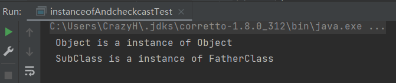

接下来看一眼官方文档的描述：


```
objectref 是被虚拟机栈弹出来的，某个类型的引用。

也就是说 instanceof指令 需要先弹栈，弹出一个对象的引用。
```

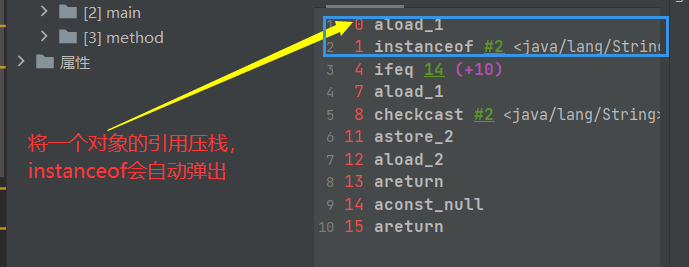


```
如果 该实例对象是null ，那么instanceof指令将会push一个int 0进入操作数栈栈顶。
```

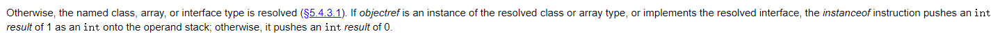

```
如果 该实例对象是 指明类型或其子类的实例，instanceof 指令将push一个int 1进入操作数栈。否则push 一个int 0进入操作数栈。
```

````
注意： 我将官方文档“objectref”(对象的引用)翻译为 “实例对象”，
事实上，instanceof 直接操作的是某个对象的引用，但实际判断的是这个引用所指向的对象。
从直接操作角度考察翻译为“实例对象的引用”更为准确，
从实际效果角度考察翻译为“实例对象”更贴切。
````


###### 2.3.4.4.2.2 例2


```java
    public String instanceofTest(Object obj){

        if (obj instanceof String) {
            String s = (String) obj;
            return s;
        }
        return null;
    }
```

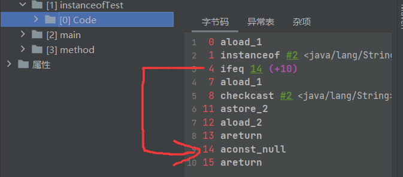


```
ifeq 14  // 如果等于0，就跳转到 字节码指令的14行。否则顺序执行

看到 8 checkcast #2  在强制类型转换时，编译器对类型转换进行安全检查。
```


参考：

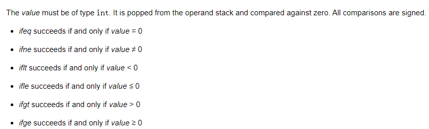


### 2.3.5  方法调用与返回指令


#### 2.3.5.1方法调用指令

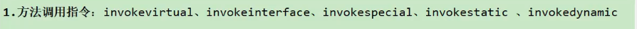


##### 2.3.5.1.1  invokeinterface

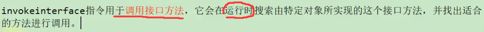

```java
public interface Speak {
    public void say();
}
```

```java
public class invokeTest implements Speak {

    @Override
    public void say() {
        System.out.println("I can say something");
    }

    public static void main(String[] args) {
        Speak s  = new invokeTest(); 
        s.say();//使用静态类型为Speak的实例s 调用接口方法
        invokeTest a = new invokeTest();
        a.say();//使用静态类型为invokeTest调用 方法
    }
}
```

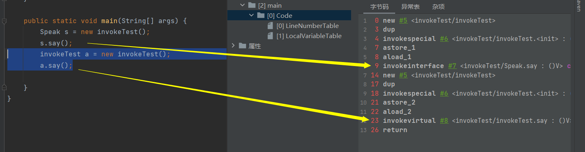

```
看到字节码指令，利用 多态的性质。
静态类型为接口类型，调用接口中定义的方法。字节码指令是 invokeinterface
静态类型为 接口的实现类，调用自己的实例方法。字节码指令是
invokevirtual
```

如果动态类型、静态类型记忆不清楚的话[静态分派 动态分派](# 1.5.9.5.1 静态分派 动态分派)


```
invokeinterface 相当于告诉了虚拟机:在运行时，调用这个接口方法时，需要去寻找当前这个实例对象的动态类型，通过动态类型进一步确定是哪个实现方法。
这个过程是动态的，也是为了完成java层面的多态性（也可以理解为 为@Override 这一过程服务）。
```

##### 2.3.5.1.2 invokespecial

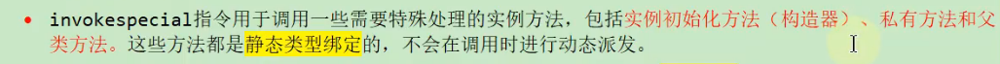

```
和invokeinterface 正好相反，这些方法不会被重写。就像是指明了一样。所以是invokespecial   （special 指明的，特殊的）


例如被 private修饰了的方法，不会发生重写，所以也是 invokespecial
```

##### 2.3.5.1.3  invokestatic

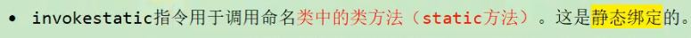

```
被static修饰的方法，称为类方法
类方法不允许被重写，所以不存在动态的问题。是静态绑定的
```

```java
public class father {
    public static void method(){
        System.out.println("father!");
    }
    public void test1(){
        father.method();
    }
}
```

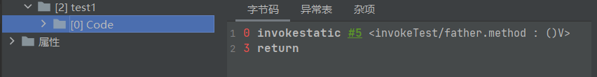


##### 2.3.5.1.4 invokevirtual

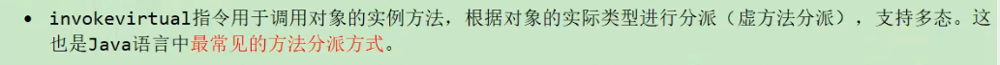

```
针对理解了前3个，对比理解 invokevirtual

invokevirtual 就代表了需要根据动态类型，对方法进行动态分派 这一类的方法。（由interface产生也是一种多态，单列出来一种指令invokeinterface）

可能被重写的方法，使用动态分派，所以调用invokevirtual
```


##### 2.3.5.1.5  invokedynamic

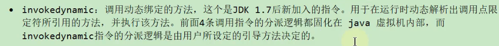


##### 2.3.5.1.6 接口中的静态方法和默认方法

在jdk1.8以后，允许接口中定义含有方法体的  静态方法和默认方法。那么调用这两个方法是什么指令呢？

```
静态方法是  invokestatic
默认方法是  invokeinterface
```


#### 2.3.5.2 方法返回指令

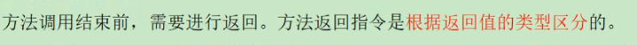


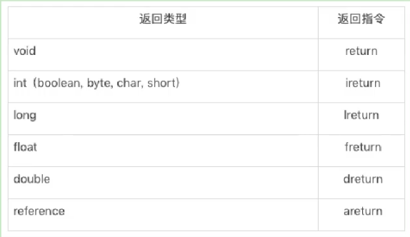


##### 2.3.5.2.1 过程

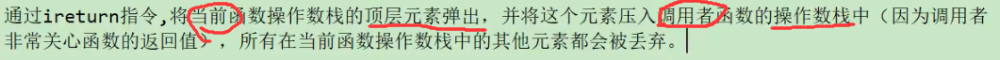

```
重点：执行完方法后，返回值会压入调用者操作数栈的栈顶
```


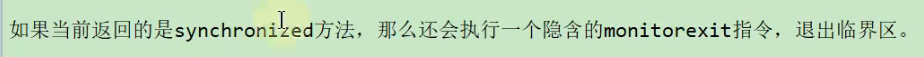


### 2.3.6 操作数栈管理指令


#### 2.3.6.1 概述

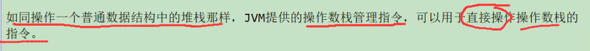


#### 2.3.6.2 详细说明

操作数栈管理指令例如：

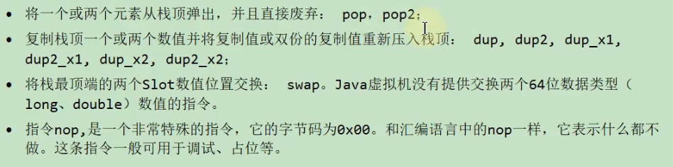


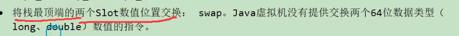

```
只能交换单slot 。没有提供交换 2个slot的指令
```


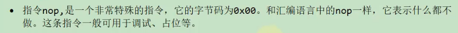


#### 2.3.6.3 解析 dup_x1 dup_x2


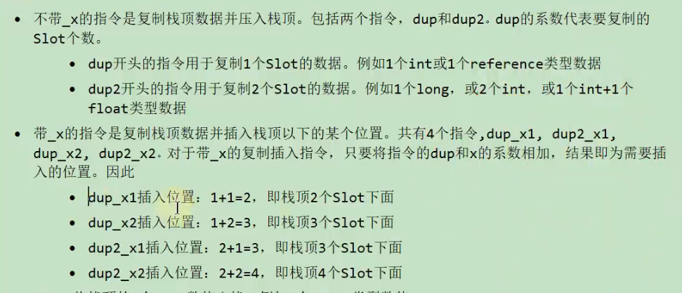

```
其实上面的运算规则，核心就是 dup1 和dup2 适用的对象是1个slot 还是2个slot的区别。对于lang double数据来说，他们本身占2个slot，所以向下插入的时候必须额外移动1个slot，使用的指令也是dup2_x1
```


#### 2.3.6.4 引入例子

##### 2.3.6.4.1  dup

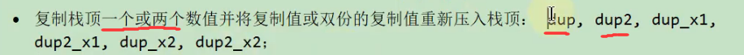

```java
    public void dupTest(){
        Object obj = new Object();
        String info = obj.toString();
    }
```

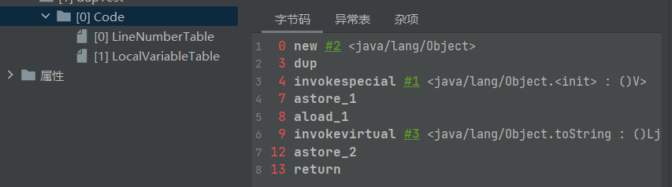


##### 2.3.6.4.2 pop

```java
public void popTest(){
    Object obj = new Object();
    obj.toString();
}
```

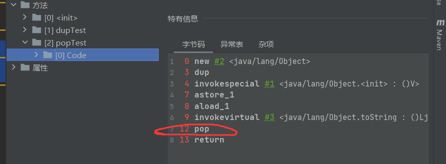


long double 占用2个slot的类型，将使用Pop2


```java
public void pop2Test(){
    foo();
}

public long foo(){
    return 1L;
}
```

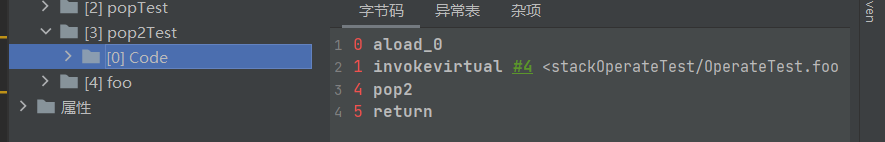


##### 2.3.6.4.3 dup_1

```java
public class OperateTest {

    int index=0;

    public int nextInt(){
        return index++;
    }
}
```

```
首先以java代码的角度分析，先用后自增。所以第一次调用返回的是0，但index是1；
```

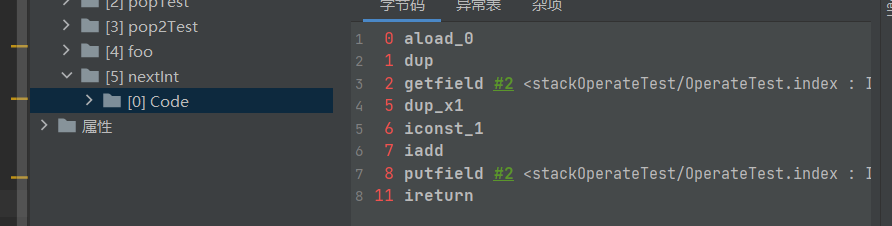


```
aload_0    //操作数栈加载this
dup        //两个this在栈顶
getfield #2  //弹出栈顶this，压入index的值 int类型占1个slot
dup_x1    //  赋值index的值此时为0 并向下插入2个slot
//此时栈顶从上到下的状态是：    0； this； 0
iconst_1    //压入常数1
iadd      //连续弹栈2次相加，并把结果 1压入栈中
//此时栈顶从上到下的状态是：  1 ； 0 
putfield   // 弹栈 1弹出，存入index中
ireturn   // 把0返回，0就是旧的index的值
```

### 2.3.7  控制转移指令

在任何语言都少不了for、while 、do while if 等等分支循环语法。

这些高级语法就是使用了 控制转移指令。

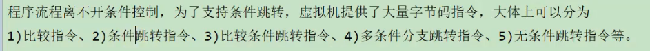


#### 2.3.7.1 比较指令


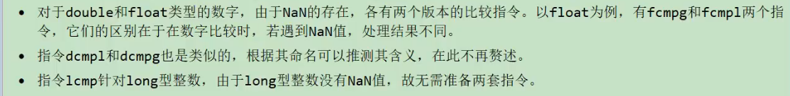


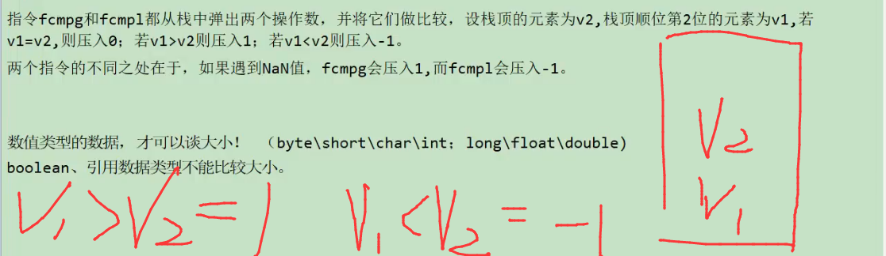


#### 2.3.7.2 条件跳转指令

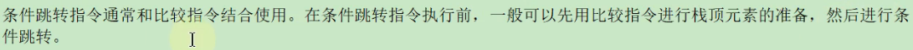

```
对比指令会压如  1 /  0 /-1
```


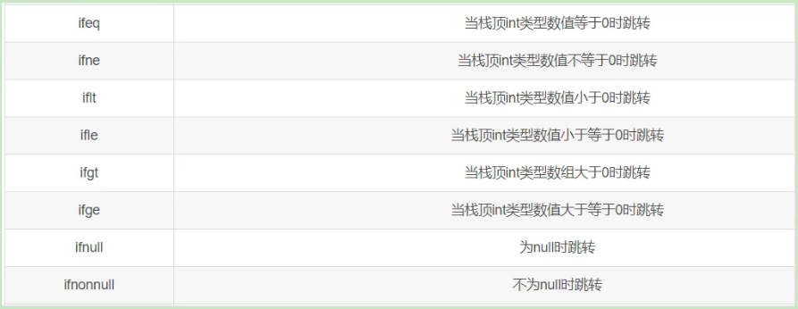

```
iflt   (if  lower than) 小于0

ifle   (if lower equal)  小于等于0

ifgt   (if greater than) 大于0

ifge    (if greater equal) 大于等于0

ifne     (if not equal) 不等于0

ifeq     (if equal) 等于0

ifnull   为null时跳转

ifnonnull   不为null时跳转
```


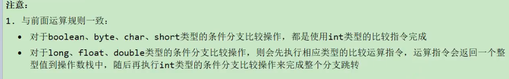

##### 2.3.7.2.1  例子： ifne goto

```java
    public void compare1(){
        int a = 0;
        if(a==0){
            a=10;
        }else{
            a=20;
        }
    }
```

##### 2.3.7.2.2 例子： ifnonnull  


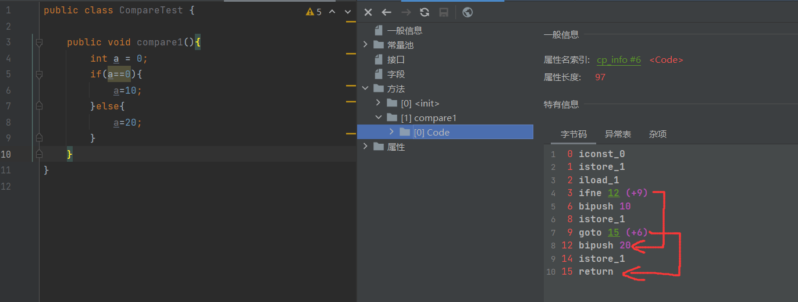

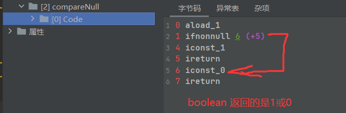

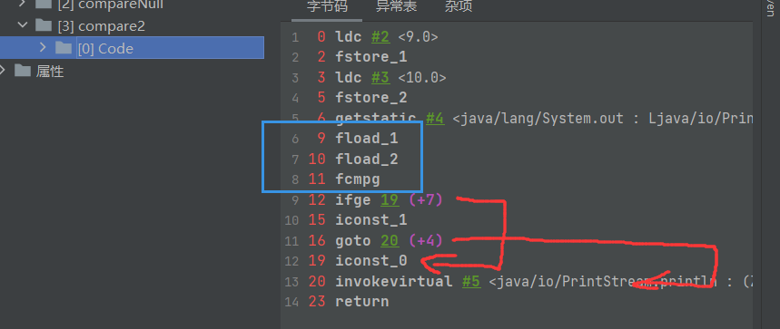

```
条件跳转语句总是，true的时候顺序执行，然后goto走。false的时候直接跳转走。
```

##### 2.3.7.2.3  例3： 比较+宽化数据类型转换

```java
public void compare3(){
    int a = 10;
    long b = 20;
    System.out.println(a<b); // int类型和long类型比较

}
```

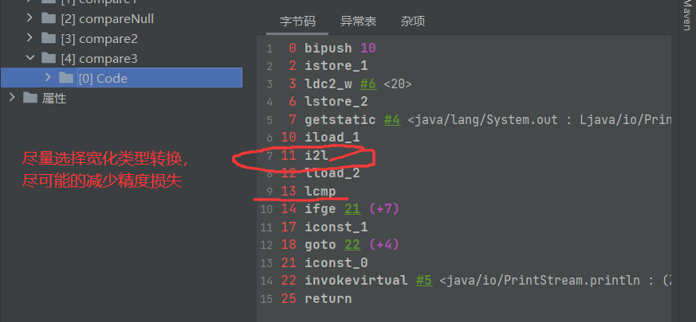


##### 2.3.7.2.4  dcmpl

```java
public int compare4(double d){
    if(d>50.0){
        return 1;
    }
    return -1;
}
```

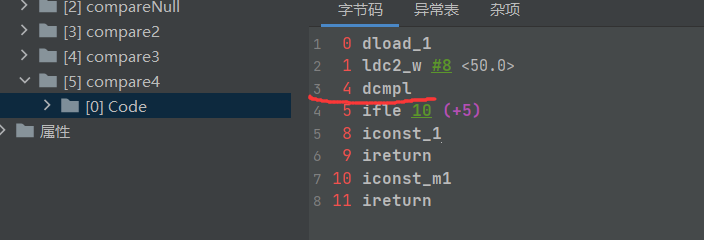


#### 2.3.7.3 比较条件跳转指令

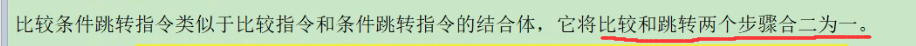


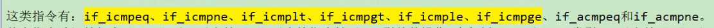

  

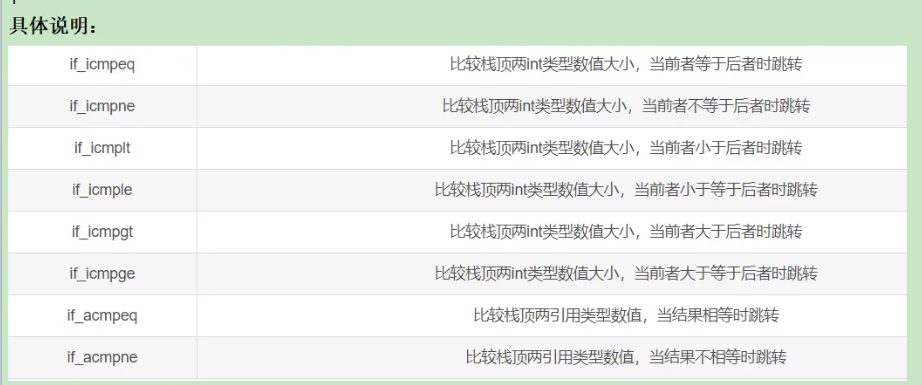


##### 2.3.7.3.1  例1： if_icmpge

```java
public void ifCompare1(){
    int i = 10;
    int j = 20;
    System.out.println(i<j);
}
```

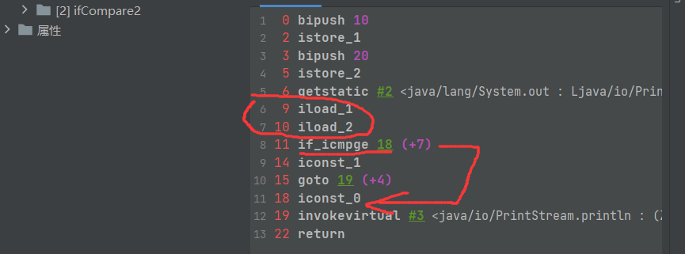


##### 2.3.7.3.2 例2:    if_icmple

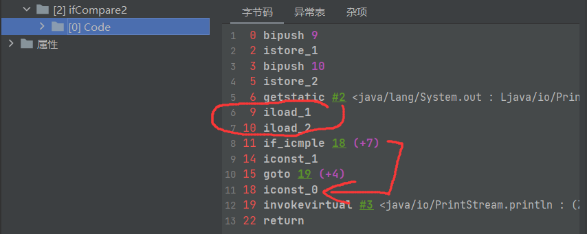


##### 2.3.7.3.3 例3 ： if_acmpnq  if_acmpeq

```java
    public void ifCompare3(){
        Object obj1 = new Object();
        Object obj2 = new Object();
        System.out.println(obj1 == obj2);
        System.out.println(obj1 != obj2);
    }
```


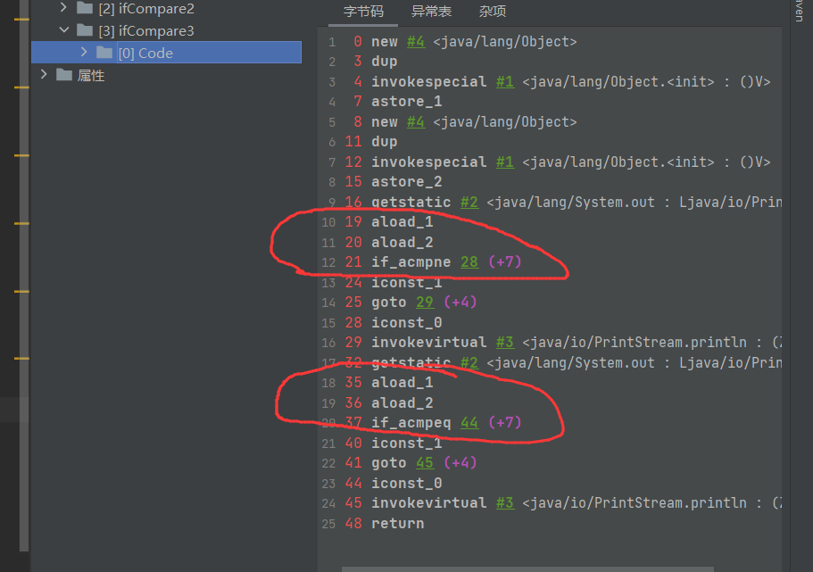


#### 2.3.7.4 多条件分支跳转

```
更多的 分支跳转。典型代表 switch case
```

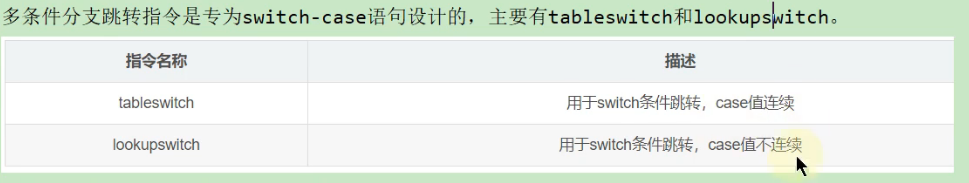


##### 2.3.7.4.1 tableswitch 和lookupswitch 区别

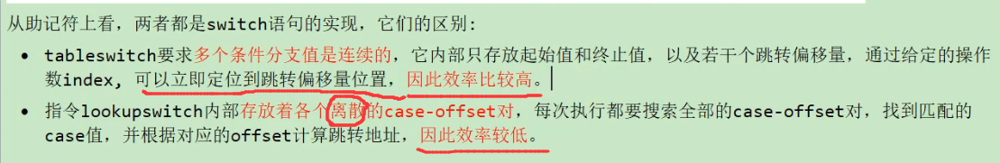


##### 2.3.7.4.2 例1:  tableswitch

```java
    public void switch1(int i){
        int num = 0;
        switch (i){
            case 1:
                num=5;
                break;
            case 2:
                num=10;
                break;
            case 3:
                num=15;
                break;
            default:
                num = 20;
        }

    }
```

​	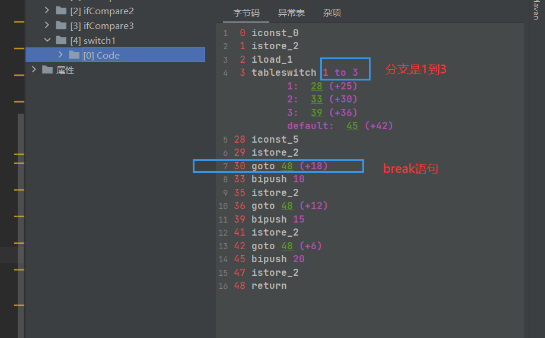


##### 2.3.7.4.3 例2： lookupswitch

```java
public void switch2(int i){
    int num  =0;
    switch (i){
        case 100:
            num = 5;
            break;
        case 500:
            num = 10;
            break;
        case 200:
            num = 15;
            break;
        default:
            num =20;
    }
}
```

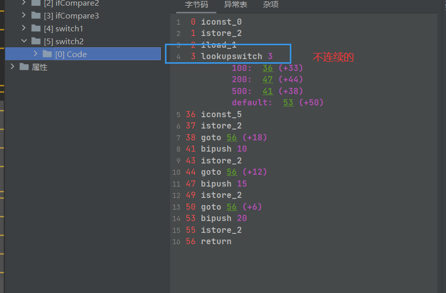


````
可以看到  tableswitch  case是连续的，可以通过索引直接跳转。
lookupswitch 不是连续的，就得一一比对。

````


##### 2.3.7.4.4 例3： String类型

```java
//jdk7 引入的新特性，支持String类型
public void switch3(String s){
    int num = 0;
    switch (s){
        case "spring":
            num=1;
            break;
        case "summer":
            num=2;
            break;
        case "autumn":
            num=3;
            break;
        case "winter":
            num=4;
            break;
        default:
            num=-1;
    }

}
```

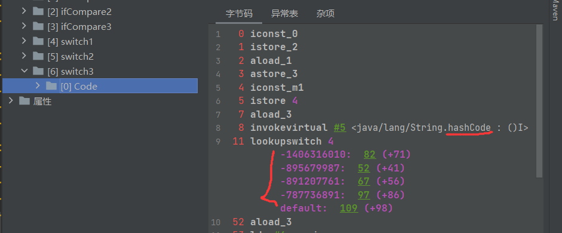

```
对case的字符串 使用hashcode，再把 选择i 使用hashcode，
对hashcode进行匹配。
所有的case分支都会以升序排序。
```

#### 2.3.7.5 无条件跳转指令

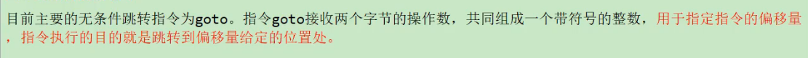

````
2个字节 2^16 = 65535  最多可以跳转到63353行字节码指令
````

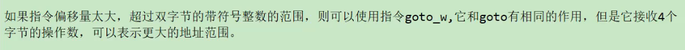

```
偏移量太大，就使用4个字节。2^32 大概4亿多
```

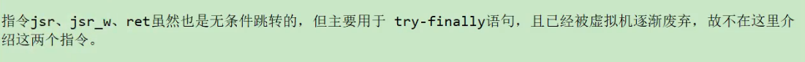

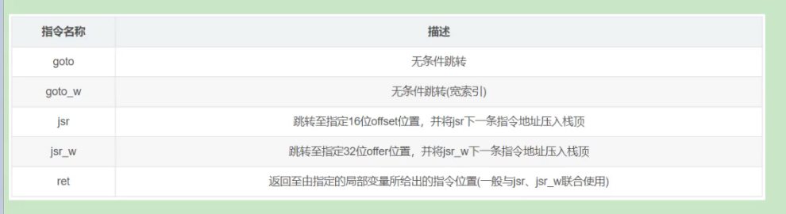


##### 2.3.7.5.1  例1 

```java
    public void whileInt() {
        int i = 0;
        while (i < 10) {
            System.out.println("abc");
            i++;
        }
    }
```

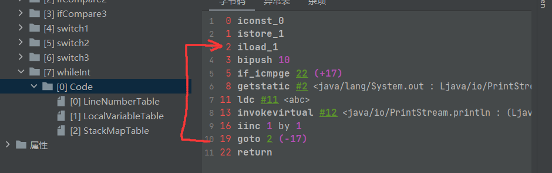

```
借助goto 完成while循环体
```


#### 2.3.7.6 异常处理指令


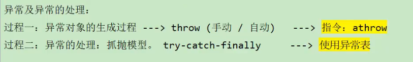


##### 2.3.7.6.1 athrow 指令

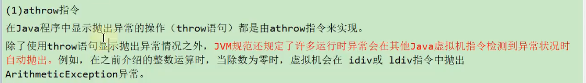

##### 2.3.7.6.2 例1 : athrow

```java
public void throw1(int i){
    if (i==0)
        throw new RuntimeException("除数为0");

}
```

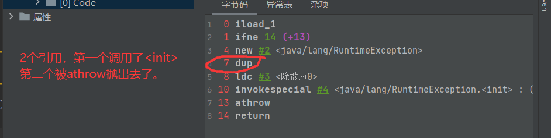

```
第二个被athrow抛到调用者的操作数栈。
```


##### 2.3.7.6.3  异常处理与异常表

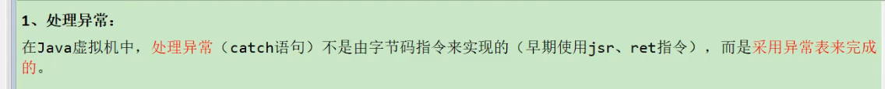


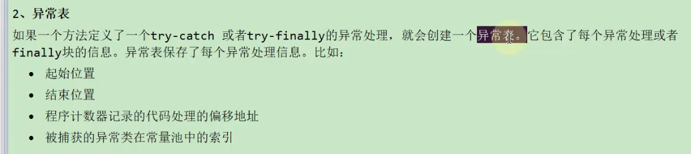


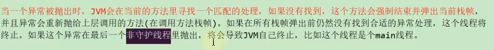


##### 2.3.7.6.4 例1：

```java
public void tryCatch(){

    try {
        File file = new File("a1.txt");
        FileInputStream fis = new FileInputStream(file);
    } catch (FileNotFoundException e) {
        e.printStackTrace();
    }catch (RuntimeException e){
        e.printStackTrace();
    }
}
```

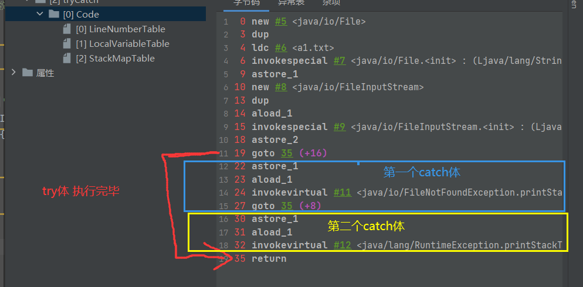

```
异常表：
在起始PC-结束PC之间，如果发生了指定的捕获类型。就跳转到22行，处理异常表的字节码指令。
```


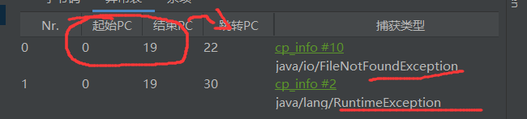


##### 2.3.7.6.5 例2: 返回值到底是Hello 还是 world

```java
//返回值到底是 hello  还是world？
public String tryCatch1(){
    String str = "hello";
    try{
        int i = 0;
        //do something
        return str;
    }finally {
        str = "world!";
    }
}

//事实上在java代码层面还真不好说，返回值到底是几。

```

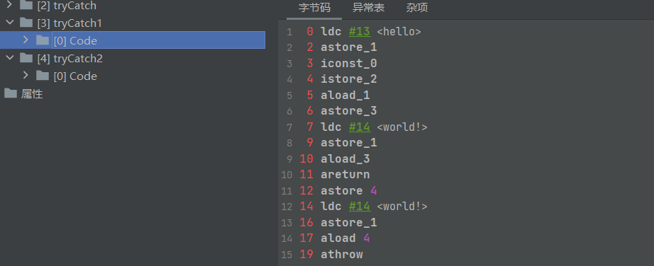

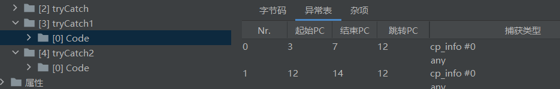


#### 2.3.7.7  同步控制指令

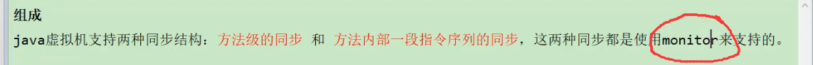

#####  2.3.7.7.1 方法级的同步

给实例方法加上sync关键字

```
private int i = 0;
public synchronized void add(){
	i++;
}
```

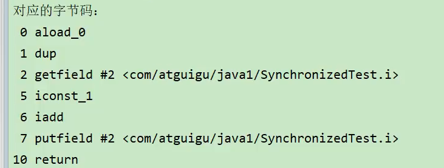

```
在字节码中，并没有任何关于synchronized的身影。所以是隐式的。
```

在方法表中的的 访问标识  access flags 中体现出来synchronized

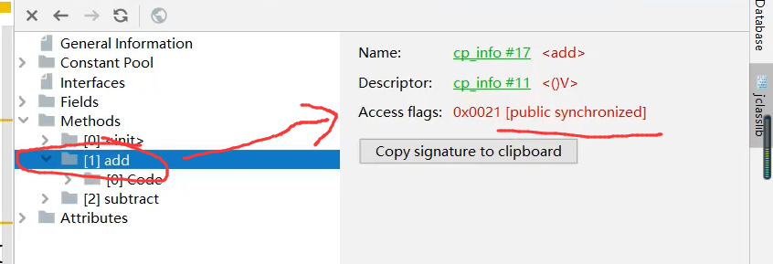

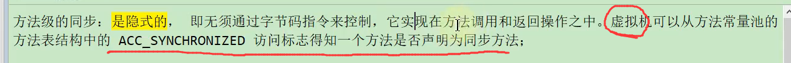


###### 2.3.7.7.1.1 同步的过程

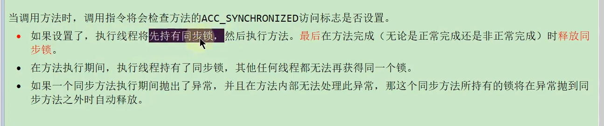


##### 2.3.7.7.2 方法内 指令序列的同步

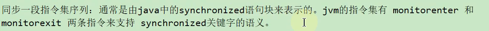

```
moniterenter //进入锁。
moniterexit  //退出锁
```

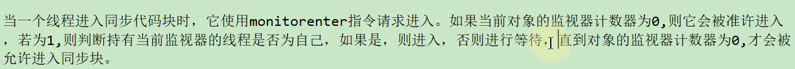

```
以上的描述是 可重入锁。
即 持有锁的对象，可以重复获得这把锁
```

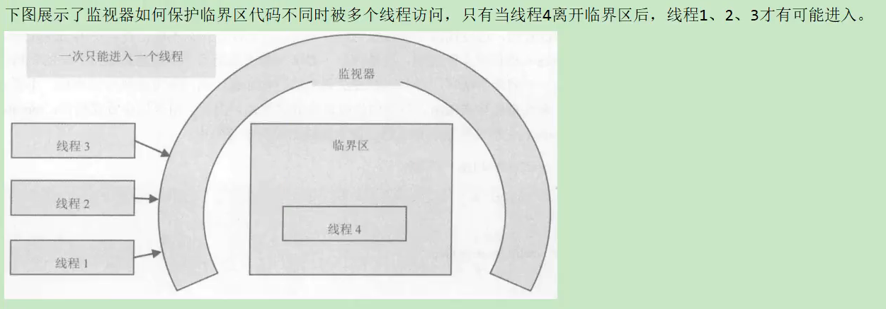


###### 2.3.7.7.1.2 例1

```java
public class synchronizedTest {

    private Object lock = new Object();
    private int i = 0;
    public void sub(){
        synchronized (lock){
            i--;
        }
    }
}
```

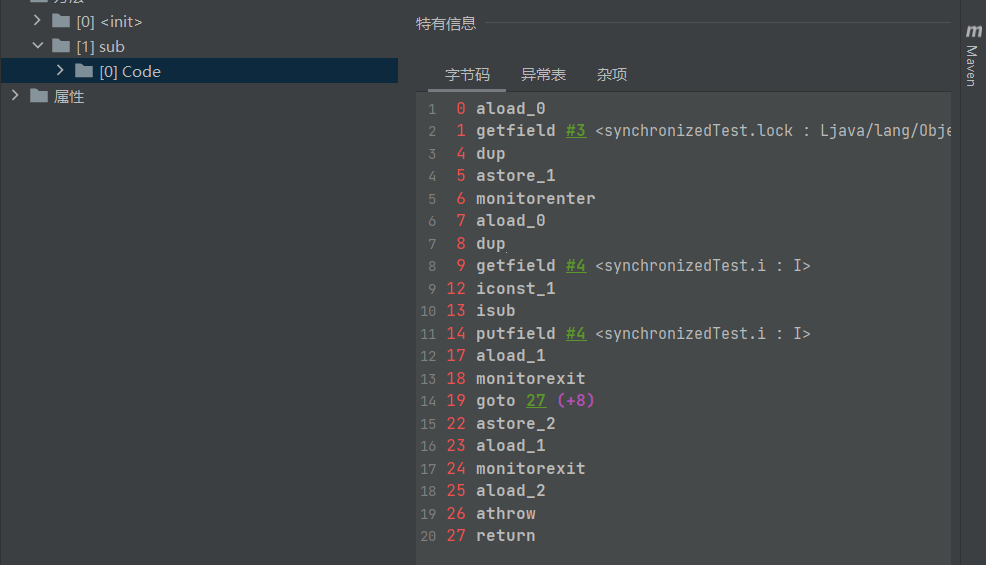

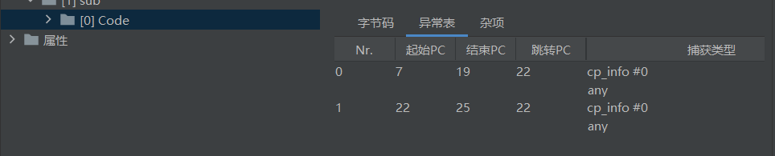


## 2.4  类的加载过程

### 2.4.1 概述

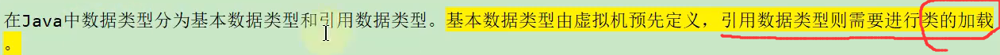

```
上述的“类”是一个泛指，具体点将它包含 “class Annotation interface enum等”
```

 

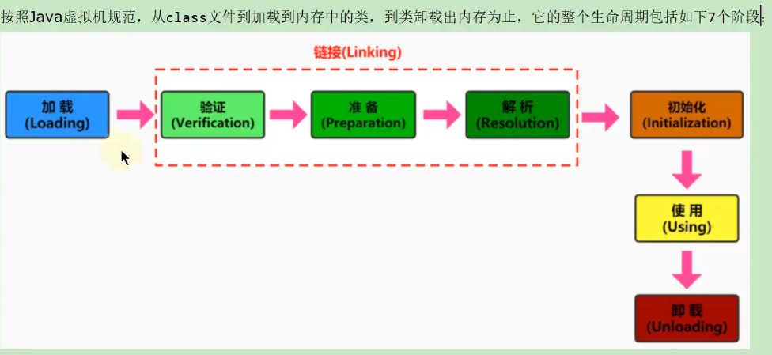


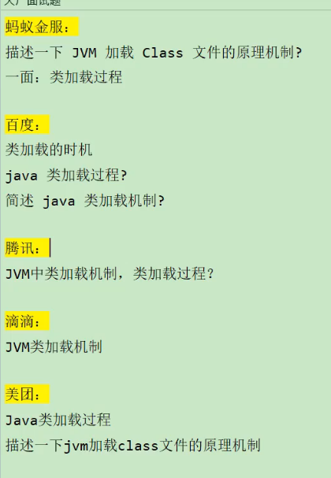


### 2.4.2 加载 loading 阶段


#### 2.4.2.1 加载完成的操作


```
JVM将字节码文件中的 常量池，类字段，类方法等信息解析出来，存储到类模板中，这样JVM就可以在运行时期通过类模板获取java类中的任何信息。
```

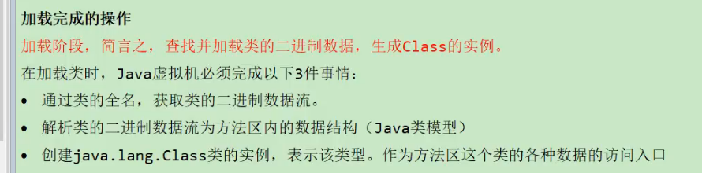

```
每一个类。对应的一个由JVM维护的Class对象，通过获取这个Class对象，作为访问 方法区中这个类的入口。
```


#### 2.4.2.2 二进制流的获取


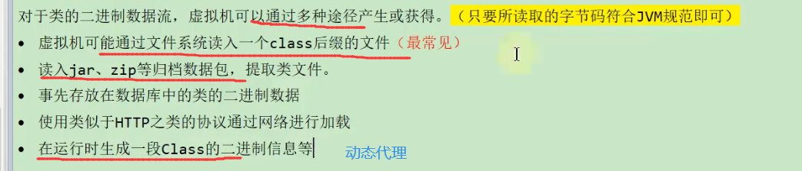


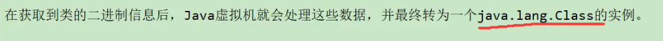

```
Class对象存放在堆区，作为方法区中某个类的访问接口
```


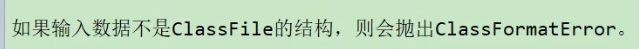

​	


#### 2.4.2.3 类模型与Class实例的位置

##### 2.4.2.3.1 类模型的位置

```
在虚拟机规范中，类模板存放在  方法区  中。
但方法区的具体实现方法（Hotspot虚拟机） 1.8以前存放在永久代
jdk1.8 以后存放在元空间。（元空间使用的是本地内存）更不容易出现OOM
```

##### 2.4.2.3.2 Class实例对象的位置


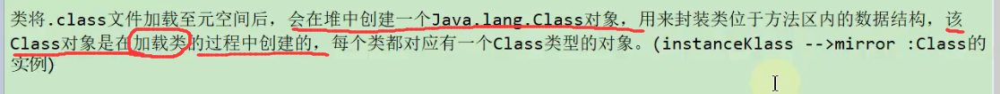


#### 2.4.2.4 数组类的加载

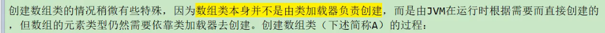

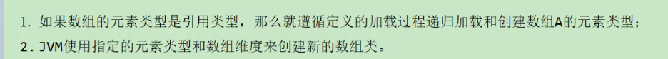


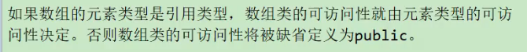


### 2.4.3 链接linking 阶段

链接分3个小部分：   验证-准备-解析


#### 2.4.3.1 验证  Verification


验证主要是  验证字节码文件的正确性，保证JVM可以正确执行这个字节码文件


##### 2.4.3.2.1具体说明

格式验证：

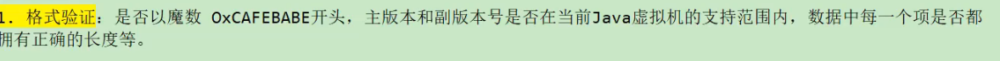

```
class文件的标识： 0xCAFEBABE
```

语义验证：

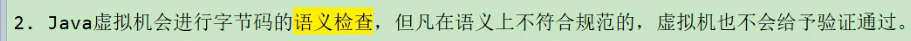

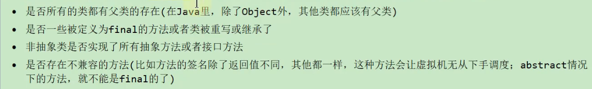

```
必须符合字节码规范。
```

字节码验证：

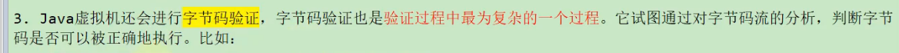

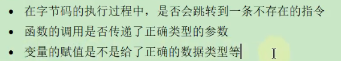

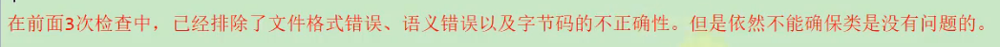


#### 2.4.3.2 准备 prepare


```
为类的静态变量分配内存，并赋初值
```


注意以下几点

```
1. 仅仅为 类变量 分配空间，并赋初值。
2. 类变量在jdk7以后存放在堆区
3. 初始值为默认零值 (引用数据类型为Null)
```


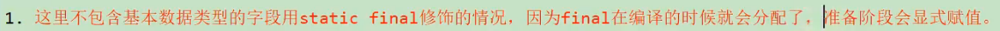

```
因为static final 修饰的变量被当作字面量，在前置编译阶段，就已经确定下来了。
```


#### 2.4.3.3 解析 resolve


```
将字节码文件中对  “类，接口，字段”静态的符号引用，转化为与内存相关的直接引用。

直接引用： 直接指向地址的指针，或者一个句柄。
```


符号引用的好处 :

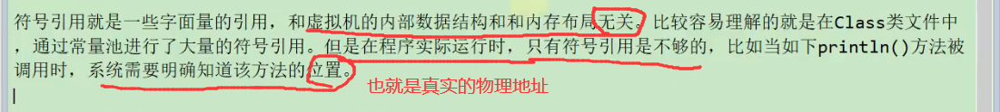

```
以符号引用代替的好处是，在生成class文件时，不需要关心此时jvm的内存情况。只需准确的标明需要引用哪些类，即可。
```


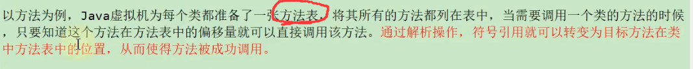


### 2.4.4 初始化阶段  initialization


```
为前一阶段赋初值的类变量，赋正确的值。
```


如何正确赋值？

```
调用<clinit>方法。这个方法是JVM自动生成的， 线程安全的方法。只能由jvm虚拟机自己调用。
```


#### 2.4.4.1  类初始化方法<clinit> 


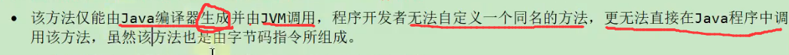


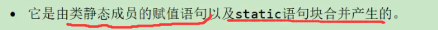


```
<clinit> 由类变量的赋值语句，static代码块合并而成。顺序和字节码文件中定义一致。
```


```
静态代码块、和静态成员变量的显示赋值语句。
例如：

public static int id = 1;
public static int number;

static{
	number = 2;
	System.out.println("father static{}")
}

在生成的<clinit>中，指令的顺序和编写的代码一致。
```

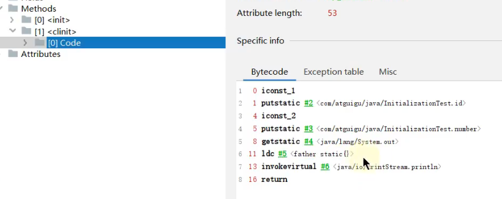  


#### 2.4.4.2 clinit  补充说明


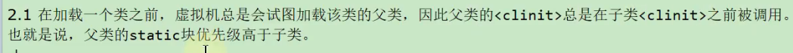

```
加载一个类，会先尝试去加载这个类的父类。
```


有些类并不会生成 <clinit>方法：

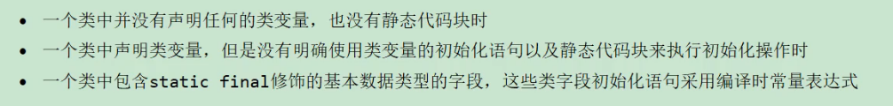


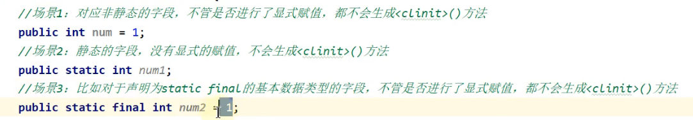

```
被final修饰的基本数据类型变量，同时已经显示初始化了，就证明是常量了。
```


#### 2.4.4.3  static final 修饰的变量，初始化的时机

```java
public class initialization {

    public static final int a = 1; //基本数据类型,赋值使用字面量的方式。属于常量，在链接阶段的准备环节赋值
    public static final String b = new String("abcde"); //非基本数据类型，需要调用new方法，在初始化阶段 <clinit>中赋值
    public static final String c = "abc"; //非基本数据类型,但,是特殊的字符串类型。
    public static final int d = new Random(System.currentTimeMillis()).nextInt(10);
    //基本数据类型，但赋值的过程不是以字面量的方式，需要new新的对象，所以在<clinit>中初始化
    public static final Integer e = new Integer(100);//调用了new方法，所以仍然在<clinit>中初始化
    public static Integer f = new Integer(1000);//干脆没有被final修饰,直接就是变量。
}
```

```
以上是详细分析。更加直观的方法：
如果在 字节码文件中，某个字段含有 constantValue的属性。那么这个字段机会被认为是包含复制过程仍为常量，就会在准备阶段为其赋值。

事实上被final修饰了的变量，在java代码层面已经可以认为是常量了。但现在我们考察的角度是对于jvm来说。jvm需要考虑到当前被static final修饰的变量是否在编译前就能为其推导出数值。如果能，则在编译环节就确定好了常量值。无需等到<clinit>方法再动态赋值。
```


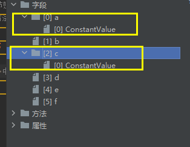


```
例如上图。立马就能得出结论：只有ac 才会在准备阶段赋值。其他的变量，就算被static final 修饰了也只能是在<clinit>为其赋值。
```


#### 2.4.4.4 clinit 的线程安全性


```
<clinit> 方法是加锁的，线程安全的。
```


#### 2.4.4.5  什么操作会导致类的初始化？


```
new关键字，反射，反序列化。

调用静态方法，静态字段，

子类初始化
```


##### 2.4.4.5.1 主动使用1 : new  反射 克隆 反序列化 


##### 2.4.4.5.2 主动使用2： 调用静态方法


##### 2.4.4.5.3 主动使用3： 调用静态字段

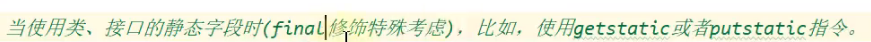

```
final特殊在哪里呢？
和2.4.4.3思路其实是一致的。有一些static final字段必须在<clinit>阶段中赋值。那么这类字段的调用会导致这个这个类进行 初始化阶段。

那么另外的字段，在准备阶段就已经确定值了。所以无需进行初始化阶段，就可以取到这个常量值。那么也不必浪费额外的资源对这个类进行初始化。
```


##### 2.4.4.5.4  主动使用4： 反射


##### 2.4.4.5.5 主动使用5： 子类初始化


```
-XX:+TraceClassLoading
追踪类的加载信息。
```

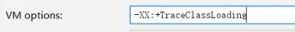


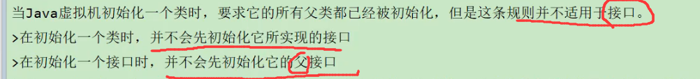

##### 2.4.4.5.6 主动使用6 ：  接口的default 方法

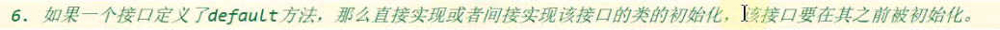


#### 2.4.4.6 被动使用，不会导致初始化


##### 2.4.4.6.1  被动使用1：


```
言外之意就是，尽量减少不必要的类的初始化
```


```java
 class parent{
	static{
		System.out.println(" parent 初始化")；
	}
	public static num = 5;
}
 class child extends parent{
	static {
		System.out.println(" child 初始化过程")；
	}
}

@Test
public void test1(){
	System.out.println(child.num);
    //通过子类调用父类的静态字段，并不会导致子类的初始化。
    //但，子类仍然是需要加载的！ 加载不代表初始化!
}
```


##### 2.4.4.6.2 被动使用2： 

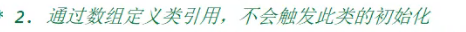

```java
//承接上文

@Test
public void test2(){
    Parent[] arr = new Parent[10];
    //依然不会触发Parent类的初始化。
    //只有真正为数组中某个元素附上对象时，在new对象时才会初始化。
    //总是核心还是一个，能不初始化就不去初始化。能延迟初始化就延迟
}


```

##### 2.4.4.6.3 被动使用3


```
常量代表了编译期间已经知道值了、在类的加载的准备环节已经赋值了、常量直接复制一个相同的值就可以了，不必要初始化
```


##### 2.4.4.6.4 被动使用4

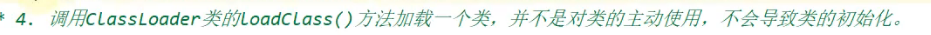

```java
public class ClassLoaderTest {
    public static void main(String[] args) {

        try {
            Class<?> clz = ClassLoader.getSystemClassLoader().loadClass("father");

        } catch (ClassNotFoundException e) {
            e.printStackTrace();
        }
    }
}
class father{
    static {
        System.out.println(" father 类初始化 <clinit>");
    }
}
```

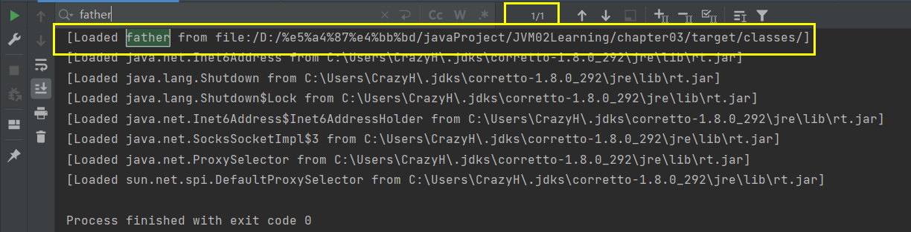

```
在 -XX:+TraceClassLoading 中只看到了 father类的加载，并没有初始化。
证实了 ClassLoader 的loadCalss只会导致类的加载，不会导致类的初始化。

同理，加载一个类，还有Class.forName()方法；
```


### 2.4.5 类的使用

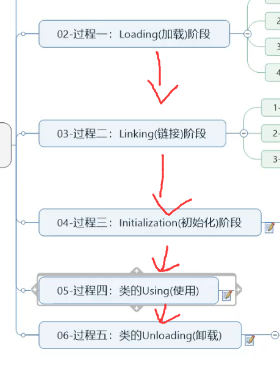


```
经过类的 加载链接初始化这三个阶段以后，这个类就可以正常使用了。开发人员通常着重于使用这个阶段。
```

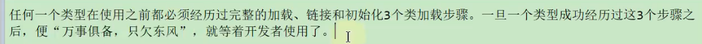


### 2.4.6 类的卸载 Unloading


java类是可以卸载的。但是一般很难被卸载。需要同时满足以下3个条件


####  2.4.6.1 类、类的加载器、类的实例


```
任何一个类，想加载它的时候，都需要一个与之对应的 类的加载器
```


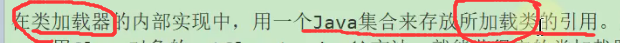

```
类的加载器，记录了哪些类是由自己加载的。
```

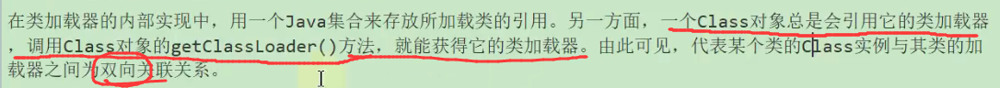

```java
//同时。一个Class也会存放加载它的类加载器的引用。
public class ClassLoaderTest {
    public static void main(String[] args) {

        try {
            Class<?> clz = ClassLoader.getSystemClassLoader().loadClass("father");
            ClassLoader classLoader = clz.getClassLoader();
            ClassLoader systemClassLoader = ClassLoader.getSystemClassLoader();
            System.out.println(classLoader==systemClassLoader);

        } catch (ClassNotFoundException e) {
            e.printStackTrace();
        }
    }
}
class father{
    static {
        System.out.println(" father 类初始化 <clinit>");
    }
}

```

以上代码的运行结果：

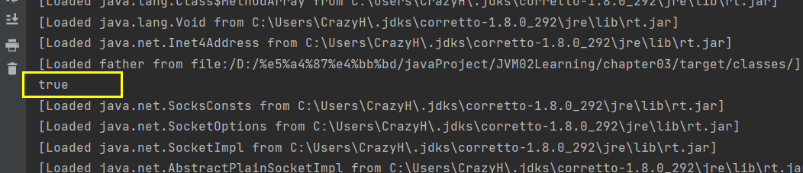

```
true包含在了 -XX:+TraceClassLoading输出语句中，可以推测出
TraceClassLoading 是额外开启了一个线程，并行执行的。
```


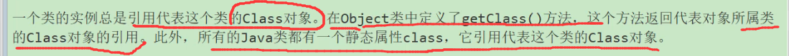


一个简单的示意图：

最左侧代表了堆区、方法区以外的区域。可以看做是GCroots

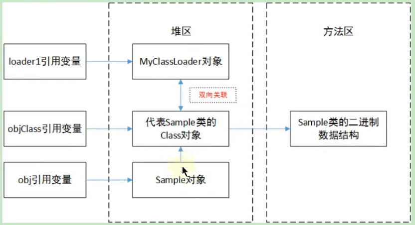

#### 2.4.6.2 类的生命周期

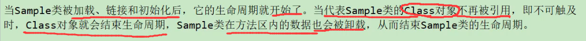

```
也就是说，一个类的生命周期等同于这个类 Class对象的生命周期，他们之间息息相关。
```


#### 2.4.6.3  方法区的垃圾回收

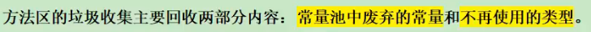I

````
之前在学习垃圾回收篇时，已经提到过。方法区是回收频率最低的、原因就是方法区内存放的 类模板信息 很难被认为“废弃”进而很难被回收。

因为被认为“废弃”的条件十分苛刻，如下图：
````

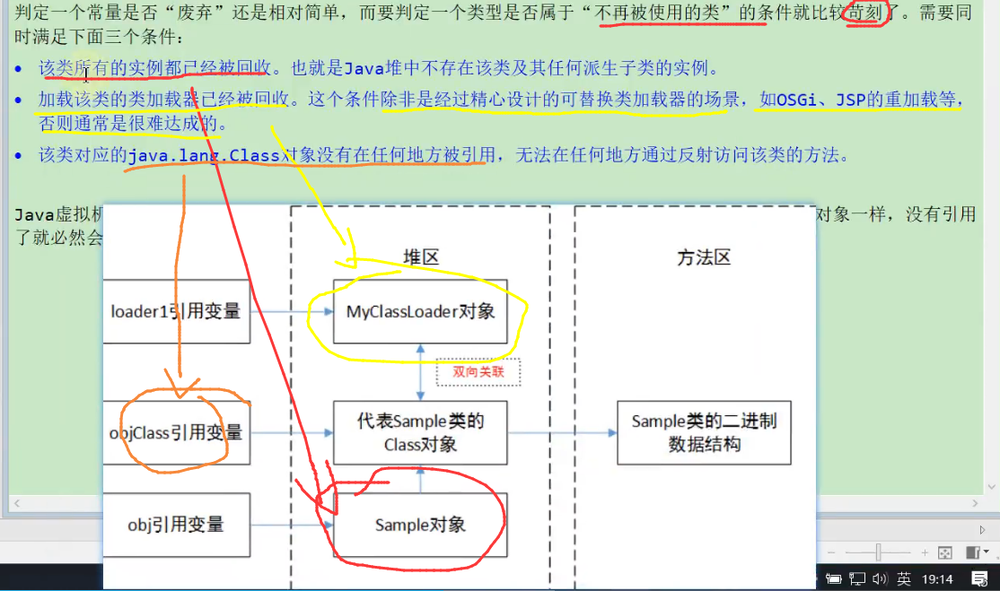


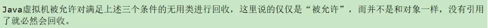

```
所以，对方法区的GC很难达成让人满意的结果。
```

#### 2.4.6.4 类的卸载补充


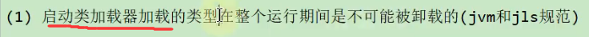

```
引导类加载器。Bootstrap
```

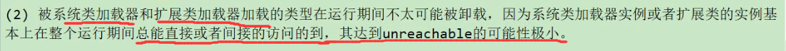

```
扩展类加载器 Extension ClassLoader 
系统类加载器(应用类加载器) Application ClassLoader
```

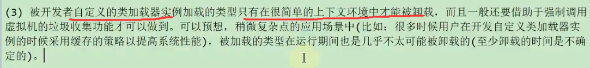


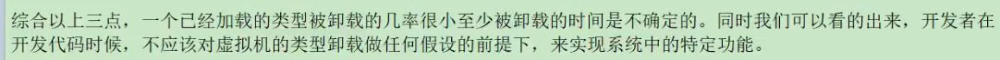


## 2.5 类的加载器

### 2.5.1 概述

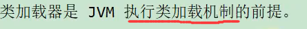


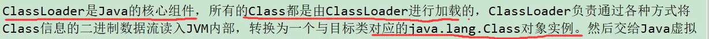

```
这之后，才能进行 链接初始化过程。
```

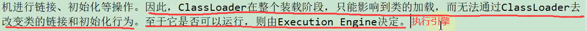


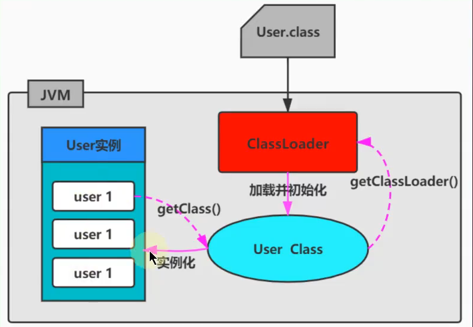


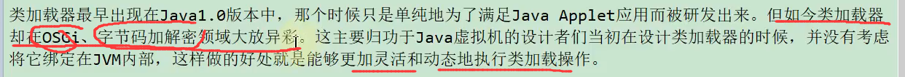


```
OSGI 热部署
```

#### 2.5.1.1 类加载的分类

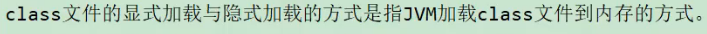

##### 2.5.1.1.1 显示加载

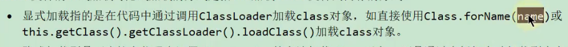

##### 2.5.1.1.2 隐式加载

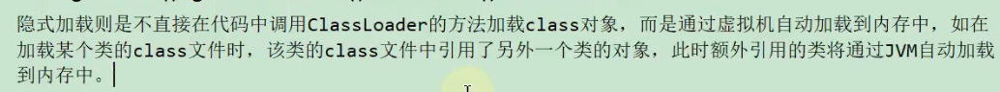

#### 2.5.1.2 类加载器的必要性

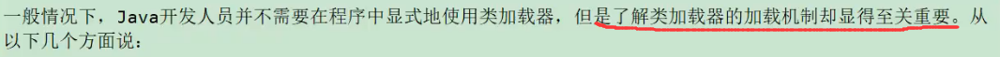


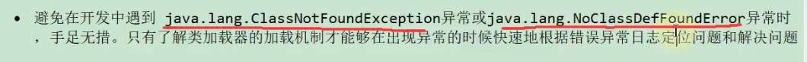


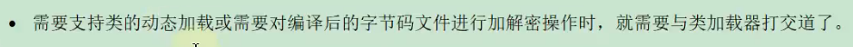


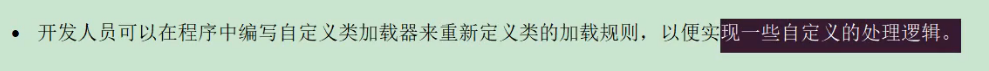


#### 2.5.1.3  命名空间

##### 2.5.1.3.1 类的唯一性

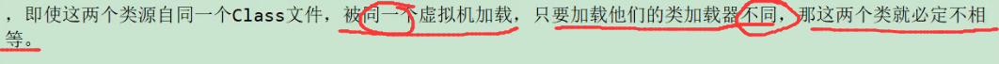

````
一个类，对应着一个class文件。如果有一个class文件,被不同的类加载器加载了。那么也认为这两个类是不相同的，即使是在同一个虚拟机中。
````

 那么何为类的唯一？


```
也就是说 class文件+类的加载器  共同组成了唯一性。
```


```
每一个类加载器，都有一个独立的命名空间。
```

##### 2.5.1.3.2 类加载器的  命名空间


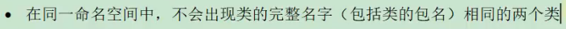


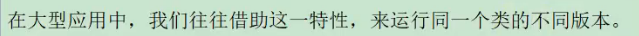


##### 2.5.1.3.3 类加载机制的基本特征

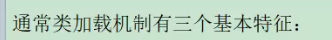

```
也就是类加载机制有3个特点
```

1. 双亲委派机制

   ```
   优势就是防止类的重复加载、保护核心类库的api不被破坏
   ```

2. 可见性

   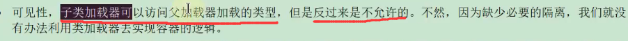

3. 单一性

   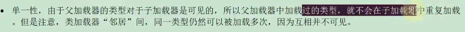

   ```
   邻居之间 指的是同一优先级的。
   引导类加载器>扩展类加载器>系统类加载器>用户自定义加载器
   ```


### 2.5.2   类加载器 的分类

#### 2.5.2.1  类加载器 的分类概述


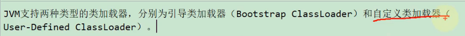


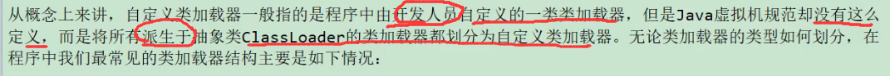

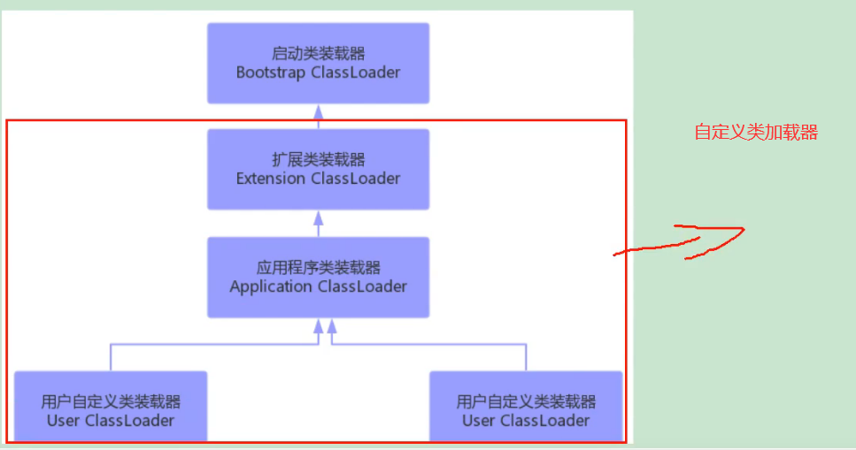


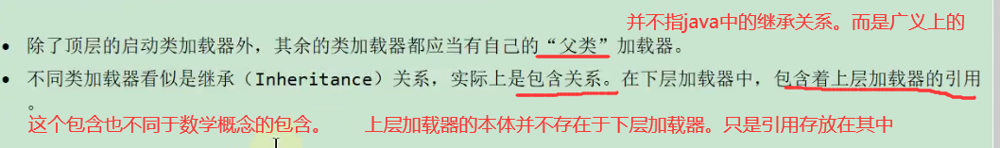

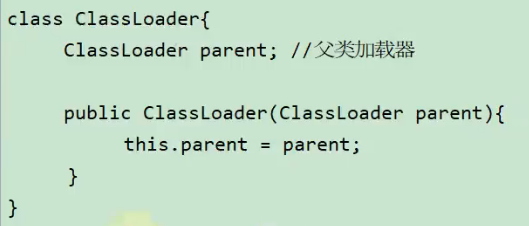


#### 2.5.2.2  引导类加载器  Bootstrap Classloader


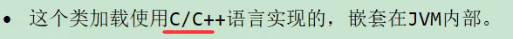

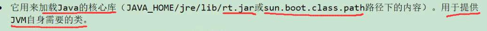

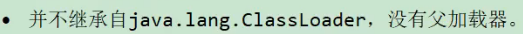

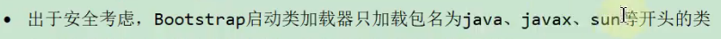

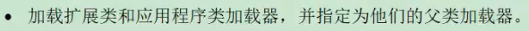


##### 2.5.2.2.1  sun.misc.Launcher

misc 意为杂项、混杂、杂七杂八；


Launcher类 成员变量：

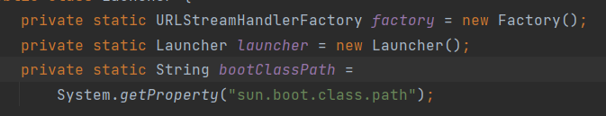

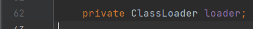

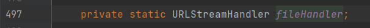

```
为什么看起来成员变量这么少？
因为将 成员变量封装在了Launcher的静态内部类中。
```

包含4个静态内部类

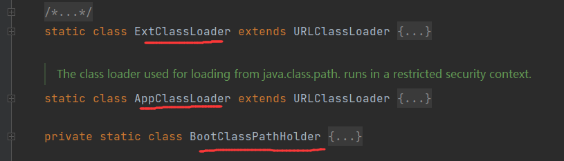

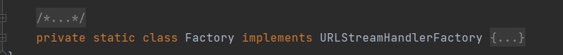

````
其中
ExtClassLoader 就是 扩展类加载器。继承了URLClassLoader

AppClassLoader 应用类加载器/系统类加载器  继承了URLClassLoader

BootClassPathHolder    根类路径持有者。 与根路径相关的存放在
                       BootClassPathHolder中
````

```
和 bootClassPath（根类路径） 相关的就被封装在了静态内部类 BootClassPathHolder中。
```


BootClassPathHolder 十分简单、内部结构如下：

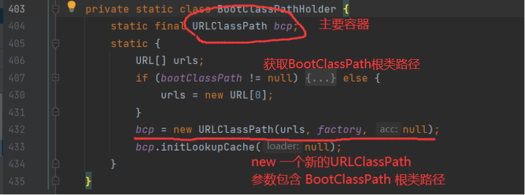

```
两个问题：
先解决 什么是BootClassPath
再解决 URLCalssPath类是啥
```

````java
public class BootstrapTest {
    public static void main(String[] args) {
        Launcher launcher = Launcher.getLauncher();
        URL[] urLs = Launcher.getBootstrapClassPath().getURLs();
        //我们先输出看看BootstrapClassPath 到底是哪些类路径
        //看看java核心类路径都有哪些
        
        ClassLoader classLoader = launcher.getClassLoader();
        classLoader.getParent();
        System.out.println(1);
    }
}
````

在debug模式下，看到了核心jar包(rt.jar、resources.jar...)。那么这些URL就是我的本地磁盘存放这些jar 的 根类路径(核心类路径)。

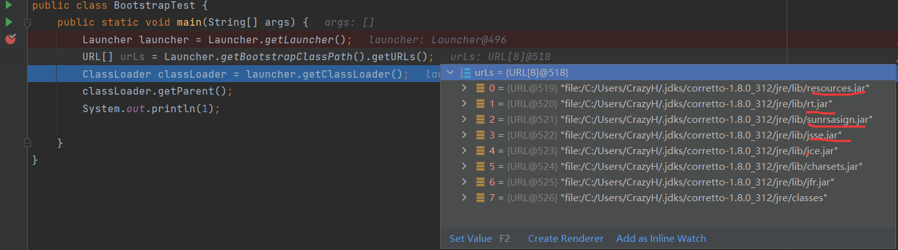

```
现在问题就剩下一个了： URLClassPath
```

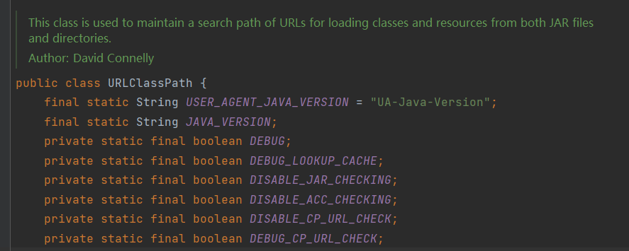

```
这个类被用于存储一些URL路径，用于从jar包和文件夹中加载类/资源

这些 boolean 标志如何读取？
通过java.security包下的AccessController 访问器
doPrivileged()方法。 
执行特权操作： GetPropertyAction()
```

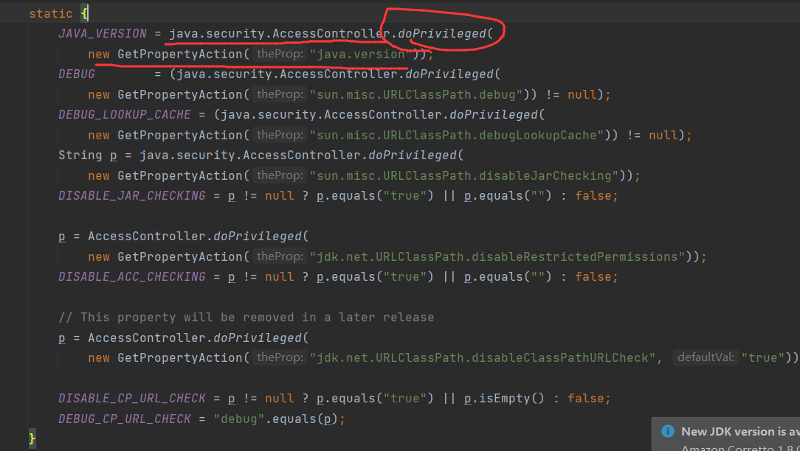

```
doPrivileged()方法，接受一个PrivilegedAction类型的参数。
具体实现是native   c++ 方法
```

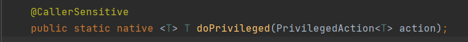


特权操作实现了  PrivilegedAction特权操作接口

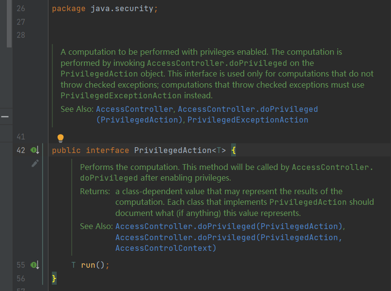


URLClassPath 内部类中包含了加载器:

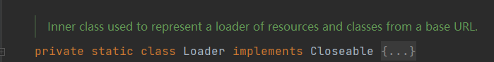

```
这个内部类被用于代表一种 “可以从URL加载资源”的加载器
```

其余两个内部类继承于Loader


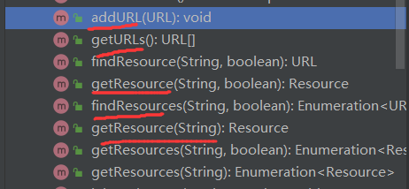


#### 2.5.2.3  扩展类加载器 Extension ClassLoader

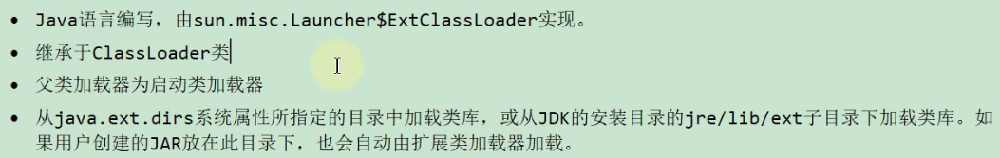

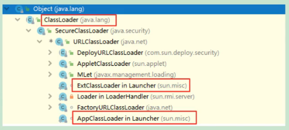

```
jre/lib/ext  下的类库。如果用户自己创建的也放在这个目录下。也由Extension ClassLoader 加载
```


#### 2.5.2.4 引用程序类加载器 Application ClassLoader

或者称之为SystemClassLoader


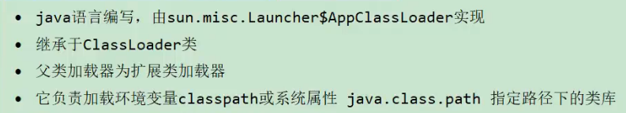


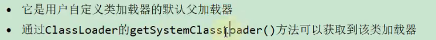

#### 2.5.2.5 用户自定义类加载器

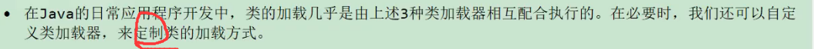


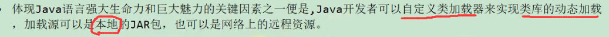


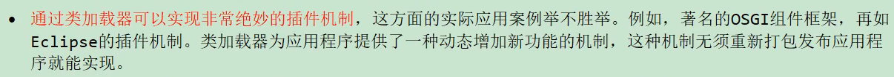


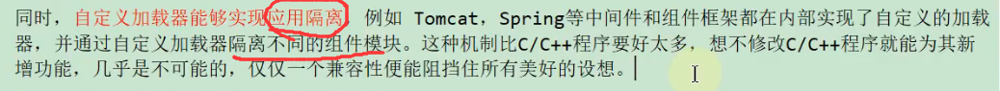


#### 2.5.2.6  测试不同的类加载器

##### 2.5.2.6.1 bootstrap ClassLoader 为null

```
由于bootstrap ClassLoader(引导类加载器)是由C++程序实现的。
所以，在java层面上无法体现出来。对于核心类库加载的Class对象。
getClassLoader()得出的只能是null
```

```java
public class Main {
    public static void main(String[] args) throws ClassNotFoundException {
        Main main = new Main();
        ClassLoader appClassLoader = main.getClass().getClassLoader();//sun.misc.Launcher$AppClassLoader@18b4aac2


        ClassLoader extClassLoader = appClassLoader.getParent();//extClassLoader : sun.misc.Launcher$ExtClassLoader@1b6d3586


        ClassLoader bootstrapClassLoader = extClassLoader.getParent();//null

    }
}
```


##### 2.5.2.6.2  对于数组的Class


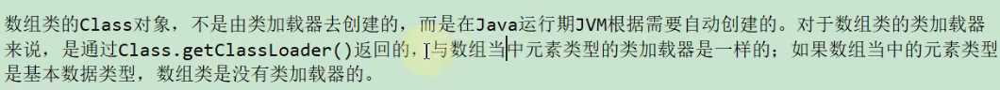

```java
        int[] arr = new int[10];
        Class<? extends int[]> aClass = arr.getClass();
        System.out.println("int[] 的Class类 : "+aClass);
        System.out.println("int[] Class的类加载器 : "+aClass.getClassLoader());//基本数据类型无需类加载器。此时null不是bootstrap

        Main[] arr2 = new Main[10];
        Class<? extends Main[]> aClass1 = arr2.getClass();
        System.out.println("Main[] 的Class类 : "+aClass1);
        System.out.println("Main[] 的Class类的类加载器 : "+aClass1.getClassLoader());
```


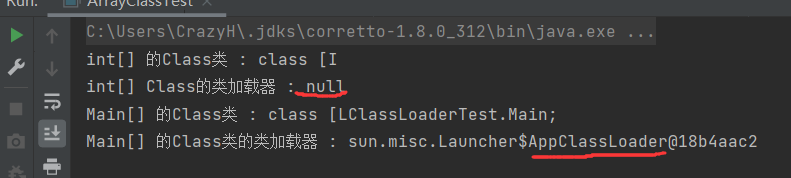


#### 2.5.2.7 ClassLoader源码分析

 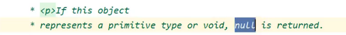

```
此处源码在 Class.getClassLoader()方法中。
如果对象代表的是基本数据类型或者void 、那么getClassLoader()方法将返回一个null
```


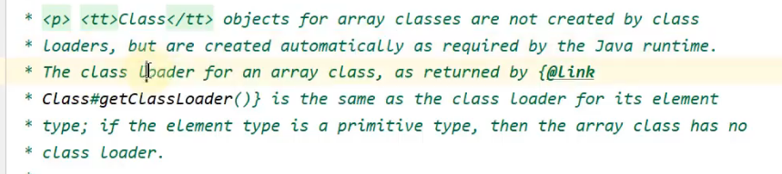

```
此处代码在ClassLoader类上的综述。

对于那些数组对象的Class,并不是事先由ClassLoader加载的。而是在java运行时被需要时自动的创建。由数组元素对应的ClassLoader创建。
如果数组元素是基本数据类型，那么这个数组Clas就没有类加载器。


原因是 基本数据类型不需要类加载器去加载。
```


```java
Launcher的构造方法：
```

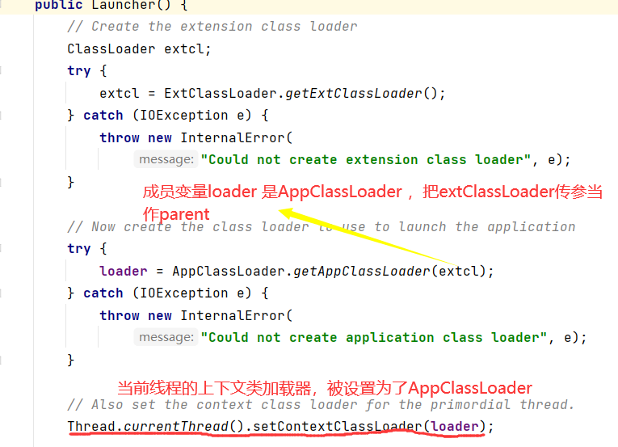


##### 2.5.2.7.1 ClassLoader内部方法


返回这个ClassLoader的超类加载器。


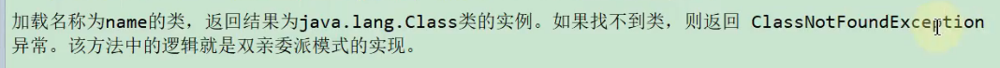


##### 2.5.2.7.2 LoadClass()

在ClassLoader 抽象类中的方法。

```java
protected Class<?> loadClass(String name, boolean resolve)
    throws ClassNotFoundException
{
    synchronized (getClassLoadingLock(name)) {
        // First, check if the class has already been loaded
        Class<?> c = findLoadedClass(name);
        if (c == null) {
            long t0 = System.nanoTime();
            try {
                if (parent != null) {
                    c = parent.loadClass(name, false);
                } else {
                    c = findBootstrapClassOrNull(name);
                }
            } catch (ClassNotFoundException e) {
                // ClassNotFoundException thrown if class not found
                // from the non-null parent class loader
            }

            if (c == null) {
                // If still not found, then invoke findClass in order
                // to find the class.
                long t1 = System.nanoTime();
                c = findClass(name);

                // this is the defining class loader; record the stats
                sun.misc.PerfCounter.getParentDelegationTime().addTime(t1 - t0);
                sun.misc.PerfCounter.getFindClassTime().addElapsedTimeFrom(t1);
                sun.misc.PerfCounter.getFindClasses().increment();
            }
        }
        if (resolve) {
            resolveClass(c);
        }
        return c;
    }
}
```


第一行，直接获得了一个代表这个Class类的对象锁。

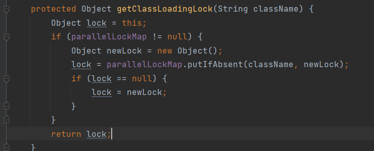


```java
/*仅当不存在的时候，才put进去。返回的永远是旧值，但因为旧值不存在，所以返回的是null。
也就是说，当返回的是null的时候，说明添加了新对象锁进去。
当返回的不是null，就说明存在旧锁，但是因为putIfAbsent()只有不存在的时候才put，所以会put失败。返回的就是旧值，也就是本来存在的对象锁。
这样保证了一个Class对象锁的唯一性。

写一个测试代码证明一下：
*/
        HashMap hashMap = new HashMap();
        Object o = hashMap.putIfAbsent("a", "a");
        System.out.println(o);
        Object put = hashMap.putIfAbsent("a", "b");
        System.out.println(put);
        Object a = hashMap.get("a");
        System.out.println(a);

```


```
loadClass()方法第一行，获得目标class的对象锁。进行下文的同步操作。
```

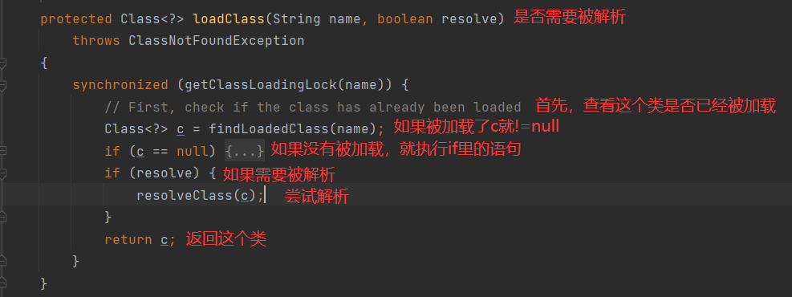

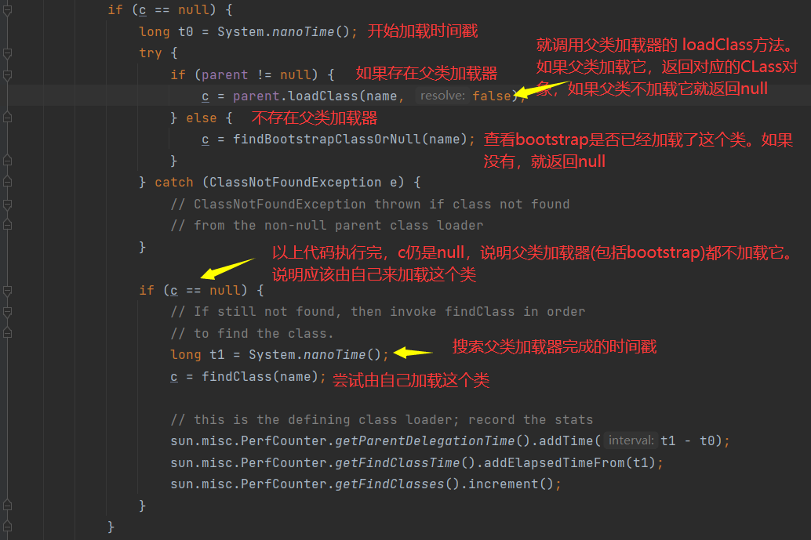

##### 2.5.2.7.3  findClass()

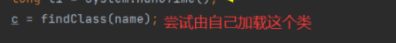

```
在分析LoadClass()源码过程中，最终找到并加载类，是findClass()方法。

也就是说 LoadClass()虽然直译为 加载类，事实上是一个双亲委派机制模型的方法。通过LoadClass()方法，会找到合适加载这个类的加载器，并通过调用findClass()方法，真正的往内存中加载这个类。

所以现在来看一下findClass()中的源码。
```


```
在ClassLoader类中，findClass方法，只会抛出一个ClassNotFound异常。
也就是说，具体如何加载类，应当由ClassLoader的子类，去重写该方法。

例如URLClassLoader 会根据URL查找这个类。所以在URLClassLoader类中，重写了findClass方法。
```

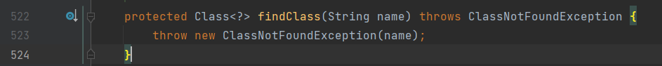


```java
//URLClassLoader类中的findClass方法。
    protected Class<?> findClass(final String name)
        throws ClassNotFoundException
    {
        final Class<?> result;
        try {
            result = AccessController.doPrivileged(
                new PrivilegedExceptionAction<Class<?>>() {
                    public Class<?> run() throws ClassNotFoundException {
                        String path = name.replace('.', '/').concat(".class");
                        Resource res = ucp.getResource(path, false);
                        if (res != null) {
                            try {
                                return defineClass(name, res);
                            } catch (IOException e) {
                                throw new ClassNotFoundException(name, e);
                            }
                        } else {
                            return null;
                        }
                    }
                }, acc);
        } catch (java.security.PrivilegedActionException pae) {
            throw (ClassNotFoundException) pae.getException();
        }
        if (result == null) {
            throw new ClassNotFoundException(name);
        }
        return result;
    }
```

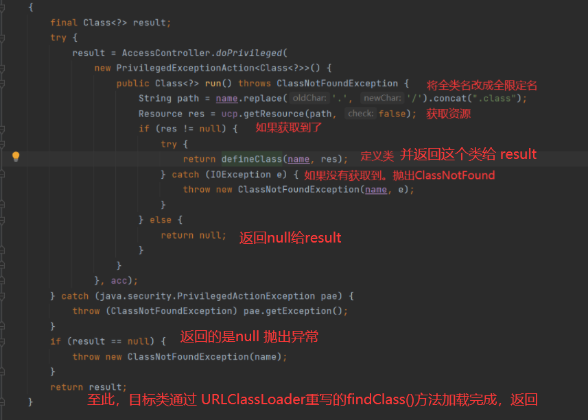

```
注意到  defineClass() 方法，完成的功能就是：分析加载到内存中类的二进制文件，并生成一个java.lang.Class对象返回给result。
```


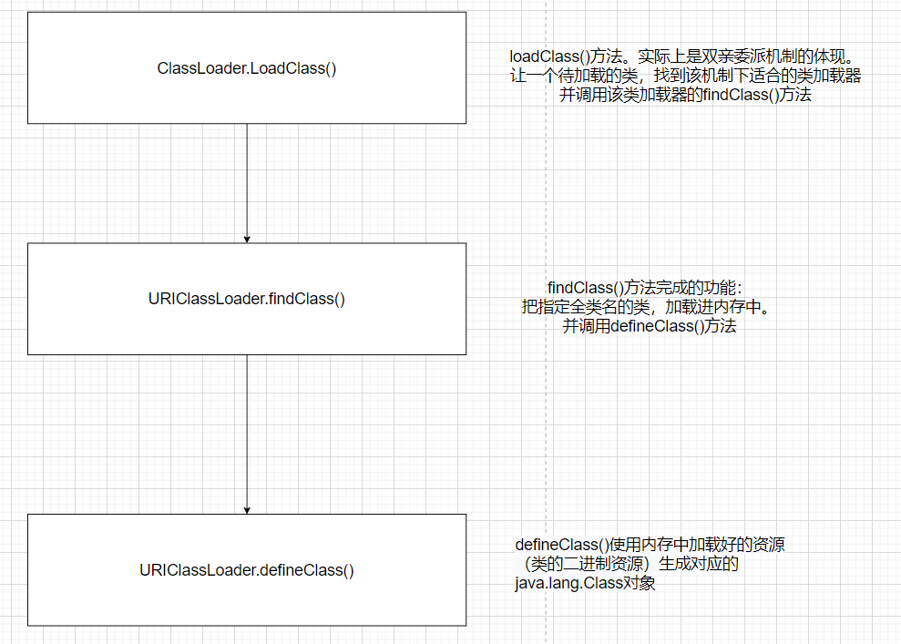


##### 2.5.2.7.4 URLClassLoader.defineClass()

```
URLClassLoader.defineClass()
在特定的资源中，使用类的二进制字节，定义一个Class对象。
这个Class对象在是使用前，必须先被解析。
```

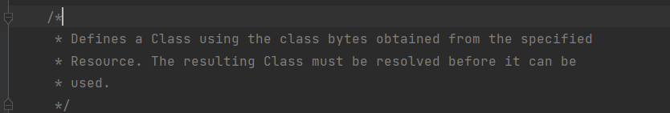

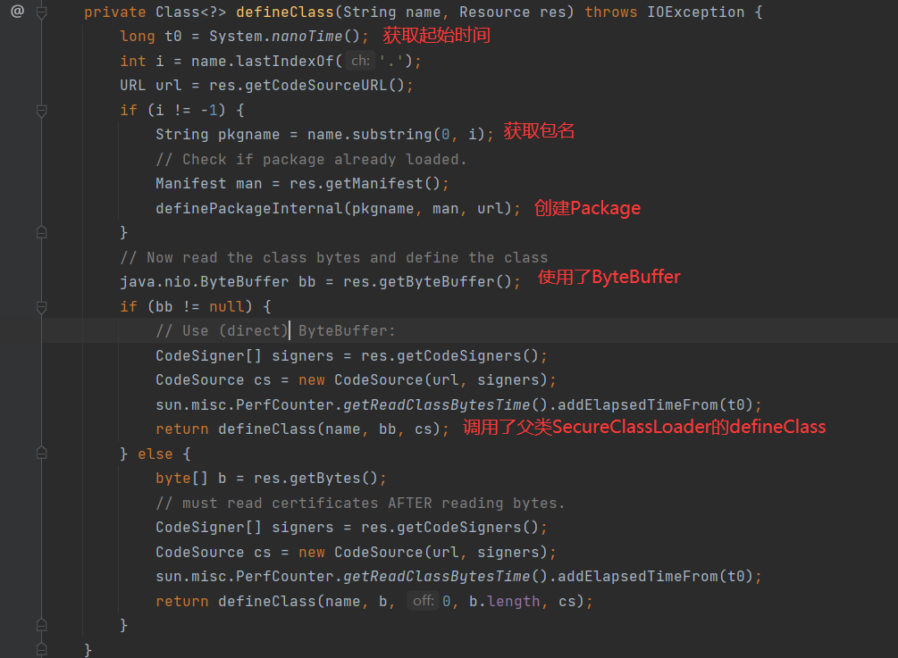


```
SecureClassLoader.defineClass()的方法体：
继续调用了他的父类 ClassLoader中的defineClass方法。
```


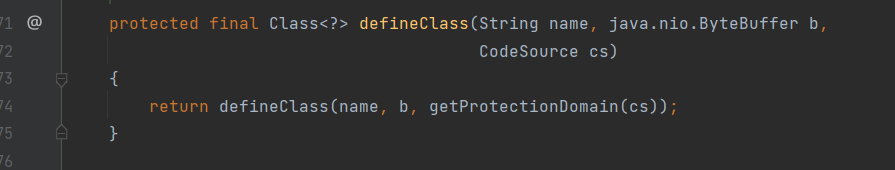


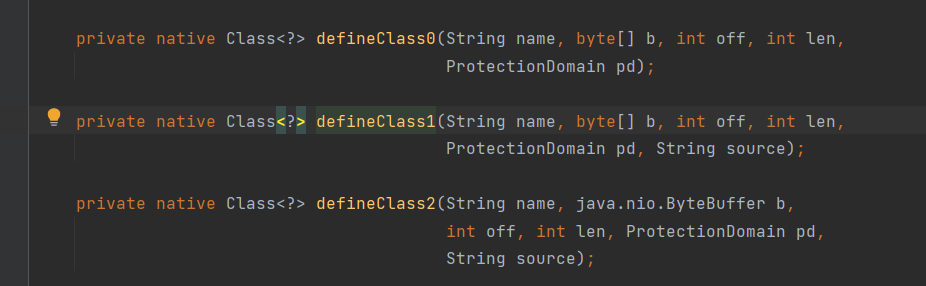

```
最终执行的是ClassLoader里3个 native方法。完成最终Class对象的的创建
```


##### 2.5.2.7.5 Class.forName() 和 ClassLoader.loadClass() 区别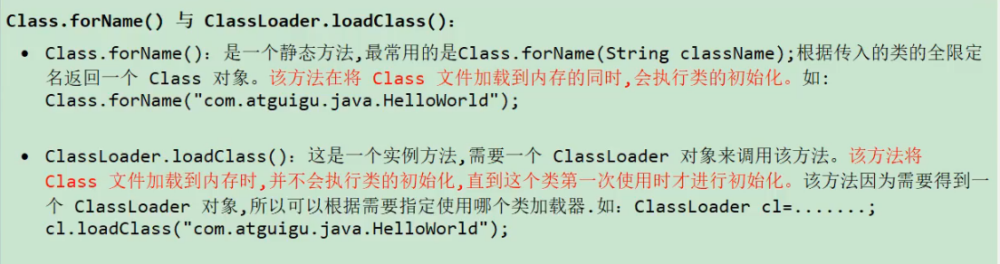


#### 2.5.2.8 自定义类的加载器

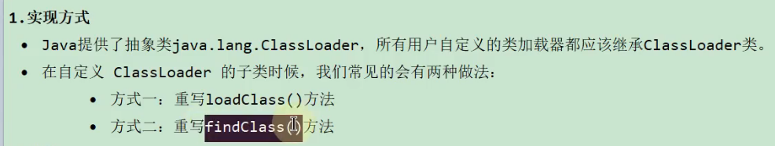

```
如果把loadClass（）重写了，那么就不遵循双亲委派机制了
```


#### 2.5.2.9 双亲委派机制的 优势/劣势

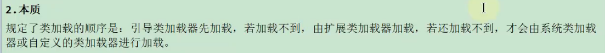


##### 2.5.2.9.1 优势


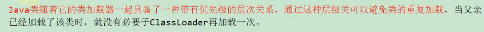


思考：

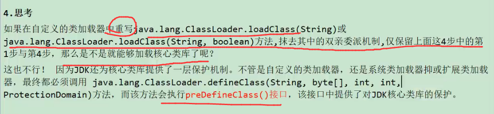

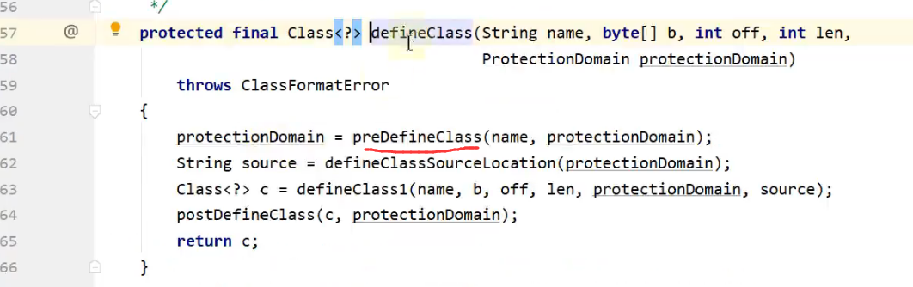


##### 2.5.2.9.2 弊端

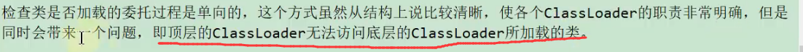


##### 2.5.2.9.3 双亲委派机制模型的破坏场景

##### 2.5.2.9.3.1 Thread Context ClassLoader

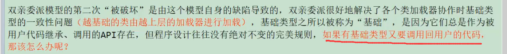

```
因为用户代码是由 系统类加载器 加载的。引导类加载器并不加载/认识（没有存放这些类java.lang.Class对象的引用）所以没办法调用。
```


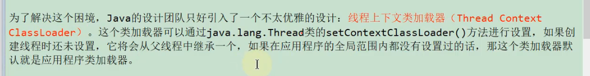

```
java.lang.setContextClassLoader()来改变 ContextLoader
默认情况下 ContextClassLoader是 SystemClassLoader(ApplicationClassLoader)

新开启的线程，它的ContextClassloader将从父类继承。
```

##### 2.5.2.9.3.2 代码热替换

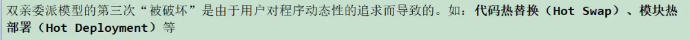


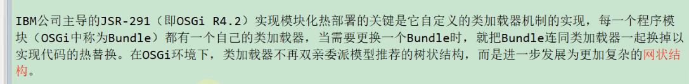


#### 2.5.2.10 沙箱安全机制

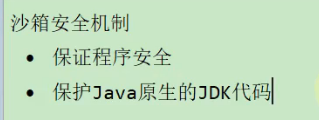

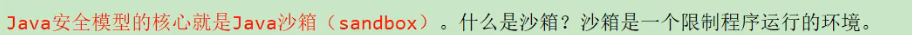

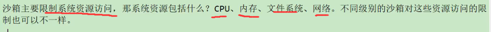


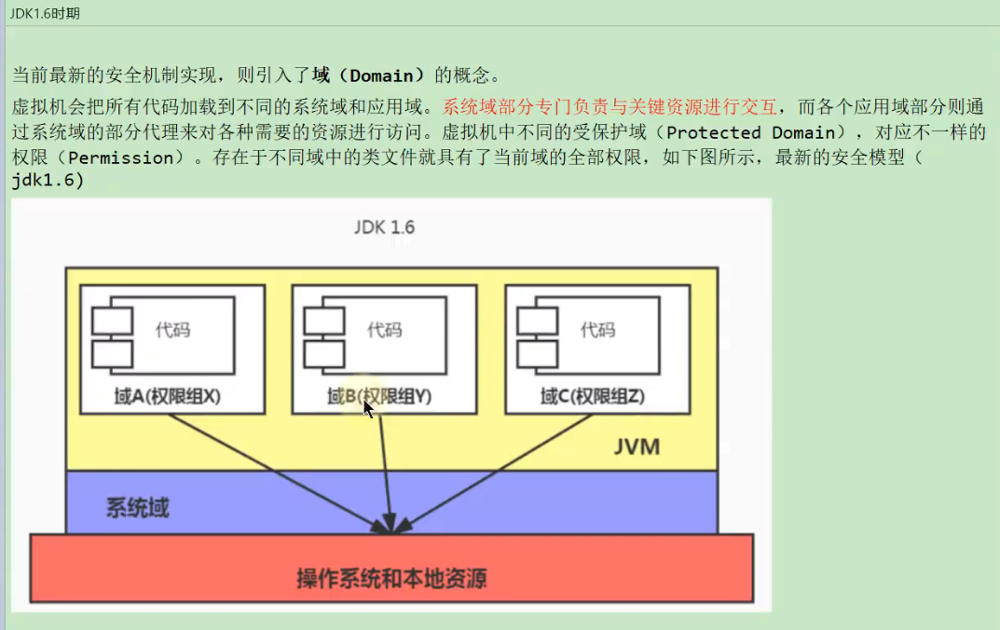


#### 2.5.2.11 用户自定义类加载器

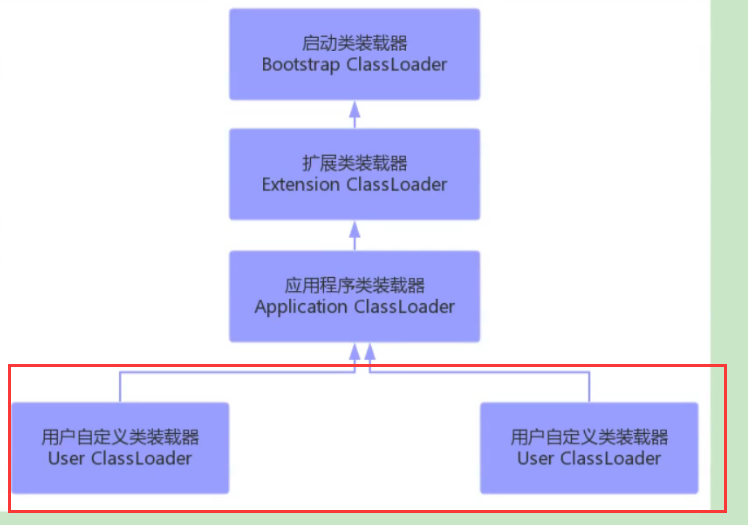


##### 2.5.2.11.1 为什么要 自定义类的加载器

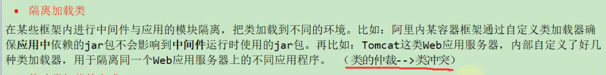


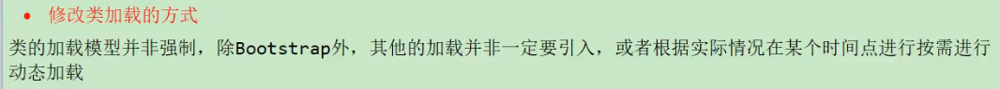


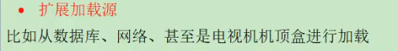


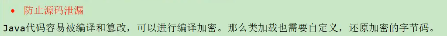


##### 2.5.2.11.2 常见场景

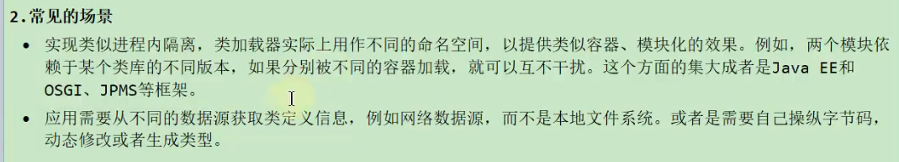


##### 2.5.2.11.3  实现方式

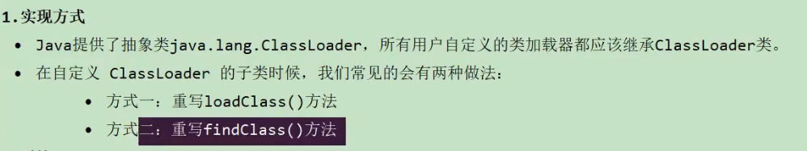


重写以上两种方法的对比

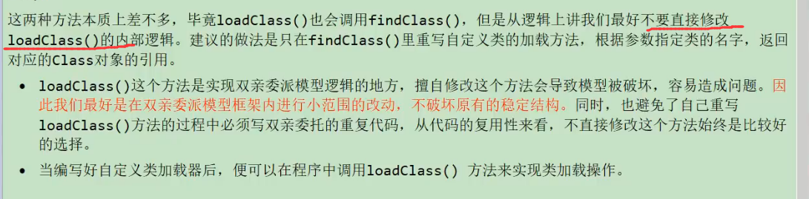


补充说明

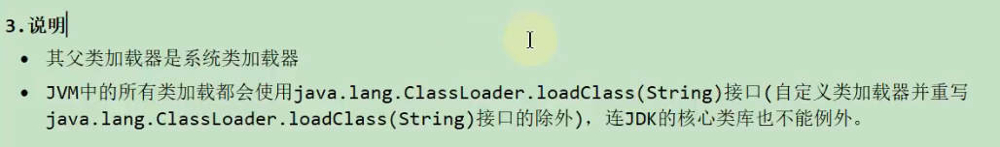

```
自定义类加载器的父类，是系统类加载器
```


##### 2.5.2.11.4  一个简单的 用户自定义类加载器

```java
import java.io.*;

public class MyClassLoader extends ClassLoader{
    //加载class文件的地址
    private String rootDir;

    public MyClassLoader(String rootDir) {
        this.rootDir = rootDir;
    }


    @Override
    protected Class<?> findClass(String className) throws ClassNotFoundException {

        String fileName  = rootDir+className+".class";
        try (FileInputStream fis = new FileInputStream(fileName);
            ByteArrayOutputStream baos = new ByteArrayOutputStream();){

            byte[] bytes = new byte[1024];
            int len=-1;
            while ((len=fis.read(bytes))!=-1){
                baos.write(bytes,0,len);
            }
            byte[] byteCode = baos.toByteArray();
            return defineClass(null,byteCode,0,byteCode.length);
        } catch (FileNotFoundException e) {
            e.printStackTrace();
        } catch (IOException ioException) {
            ioException.printStackTrace();
        }
        return null ;
    }
}


//测试单元：
@Test
    public void test1(){

        MyClassLoader myClassLoader = new MyClassLoader("D:/");
        try {
            Class<?> studentClz = myClassLoader.loadClass("Student");
            System.out.println(studentClz);
            Constructor<?> constructor = studentClz.getConstructor();
            Object instance = constructor.newInstance();


            Method setName = studentClz.getMethod("setName",String.class);
            setName.invoke(instance,"哈哈");

            Method setAge = studentClz.getMethod("setAge", Integer.class);
            setAge.invoke(instance,50);

            System.out.println(instance.toString());


        } catch (ClassNotFoundException | InstantiationException | NoSuchMethodException | InvocationTargetException | IllegalAccessException e) {
            e.printStackTrace();
        }
    }
```


#### 2.5.2.12 java9新特性

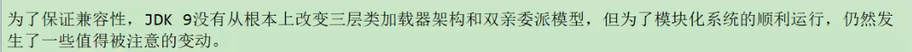


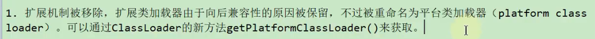


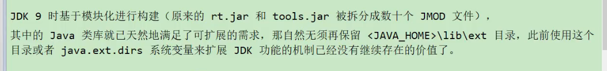


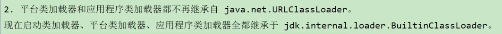

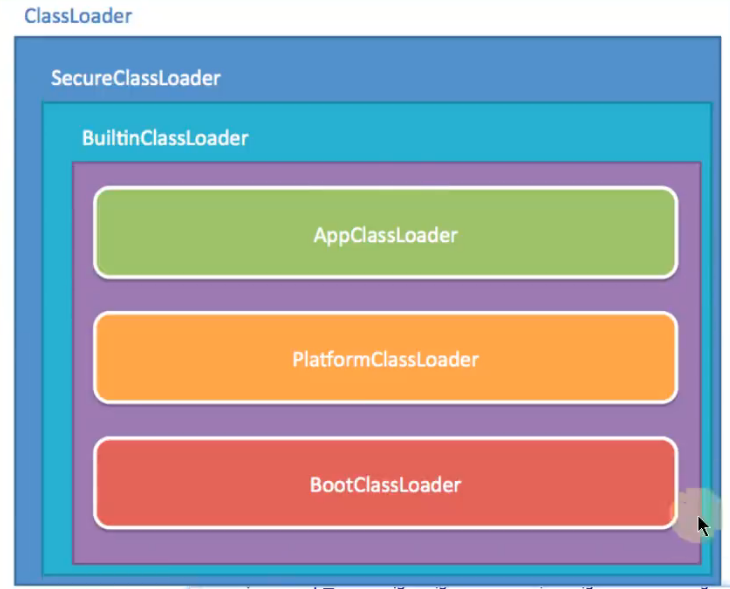

```
AppClassLoader 、PlatformClassLoader、BootClassLoader都继承与
BuiltinClassLoader(内置classLoader)
```


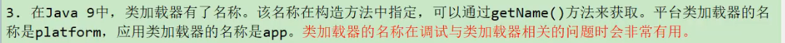


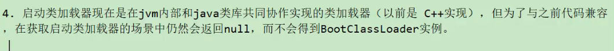


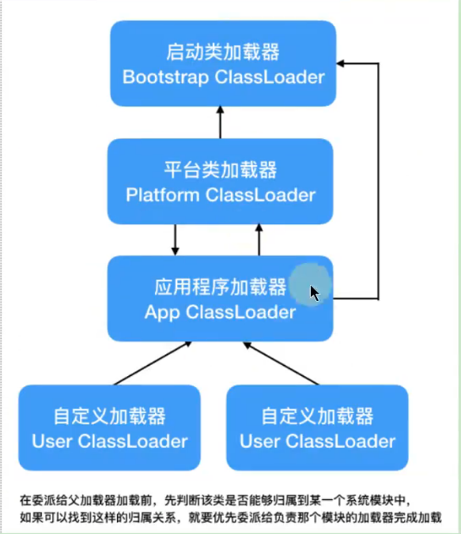

# 3.性能监控与调优

2021-12-09 18:03:55 终于学到调优


## 3.1 性能监控和调优 概述


### 3.1.1  大厂面试题


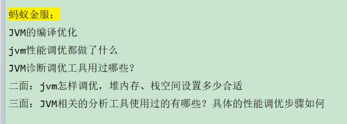


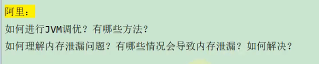


### 3.1.2 背景说明


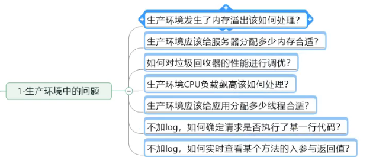


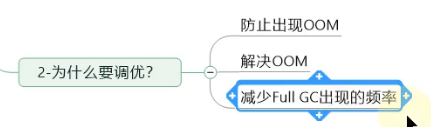

```
如果出现OOM 程序就挂了..
因为full GC 会导致 stw(stop the world) 导致用户线程停顿。
```


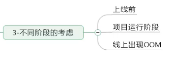

### 3.1.3 调优概述

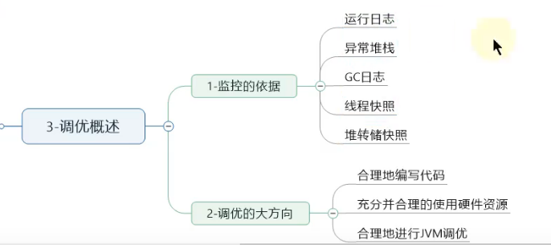

### 3.1.4 性能优化步骤

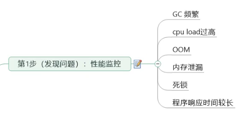


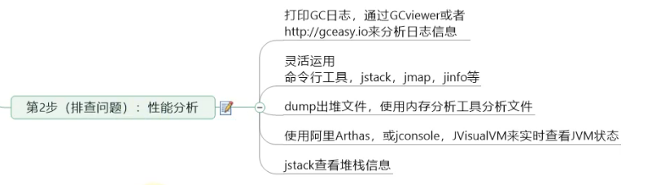


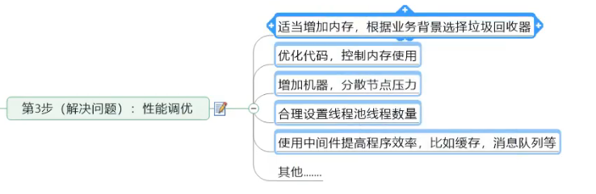


### 3.1.5  性能指标/评估

#### 3.1.5.1 停顿时间/响应时间

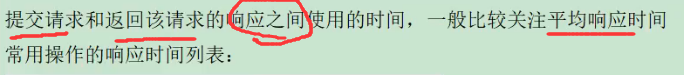

```
平均响应时间
```


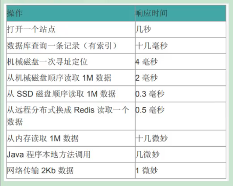


#### 3.1.5.2 吞吐量

在GC中：运行用户代码的时间:总时间。  总时间(用户运行时间+GC运行时间)


#### 3.1.5.3 并发数


通常情况下 并发与在线数的关系：


#### 3.1.5.4 内存占用

使用内存情况。


## 3.2  命令行监控工具概述

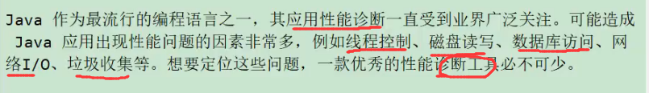


### 3.2.1 jps  查看正在运行的java进程

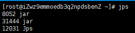


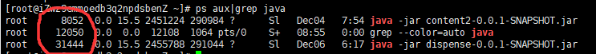

可以看到jps 输出的PID 对应的就是 操作系统的PID。

#### 3.2.1.1 jps 的option

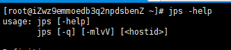

参数很少。

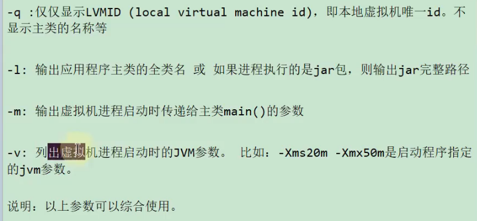

#### 3.2.1.2 示例

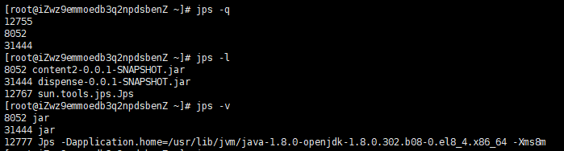


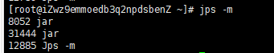

```
-m :显示 main函数的参数信息(args)
public static main(String[] args){

}


可以看到对于java程序来说，-m 就是它main函数的参数
```


### 3.2.2 jstat : 查看JVM统计信息


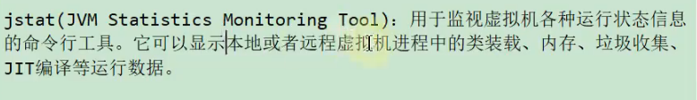


```
jstat -help    //帮助信息
jstat -options  //查看所有option
```


jstat官方文档：	


#### 3.2.2.1 基本语法


```
<interval>  周期。用于指定输出周期，单位毫秒
<count>     输出次数。
[-t]        可选参数-t,添加一个时间戳。此时间戳为程序运行时间 单位秒
[-h<lines>] 可选参数,在<lines>行以后，输出一下列表头
```


```
以  -class  作为测试 //-<option> 

jstat -class 22700 1000 10 //查看vmid为22700的java进程Class加载卸载信息，以1秒的间隔，输出10次
```

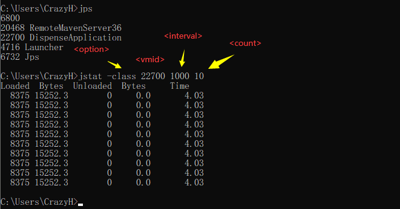


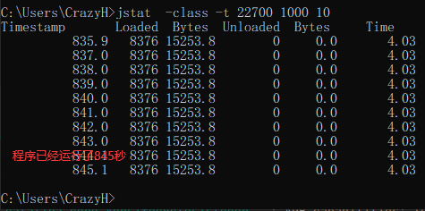

```
[-t] 时间戳。运行时间
```


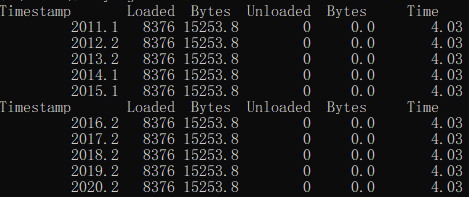

```
-h<line> 每5个输出一下表头
```


#### 3.2.2.2 option 具体参数

option具体分3类


##### 3.2.2.2.1 类加载卸载相关

​	-class

##### 3.2.2.2.2 垃圾回收相关

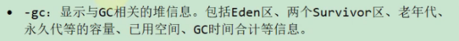


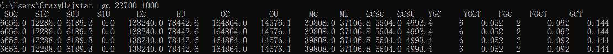

```
S0C  service0区总大小 单位 Byte字节
S1C  service1区总大小
S0U  service0区已使用
S1U

EC   eden区总大小  eden space capacity
EU   eden已使用大小  eden space utilization
OC   老年代大小  Current old space capacity
OU

MC   元空间大小 Metaspace  capacity
MU   元空间已使用  Metacspace utilization

CCSC  压缩类区。是元空间的一部分。压缩的是Class类指针。默认1G大小
CCSU

YGC   YGC的次数
YGCT  YGC持续时间
FGC   fullGC的次数
FGCT  fullGC持续时间
GCT   总计GC时间。Total garbage collection time.

```


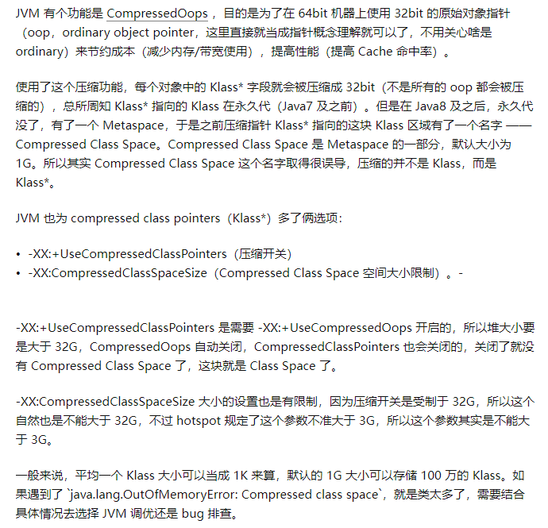


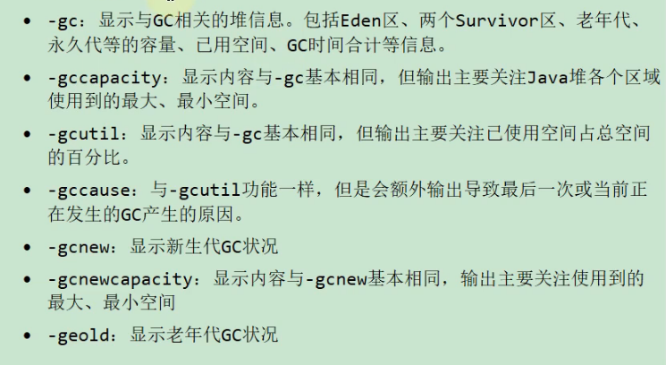

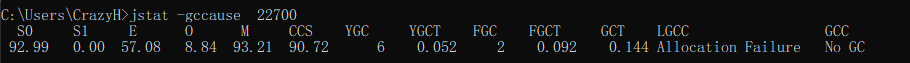

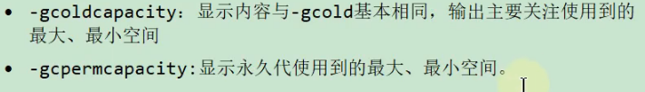


##### 3.2.2.2.3 JIT 即时编译相关


#### 3.2.2.3 经验


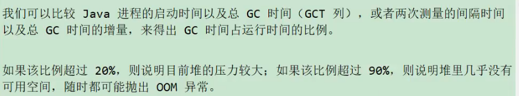

```
ΔGCT/ΔTimeStamp  
一段时间内，GC时间占总时间比。
```


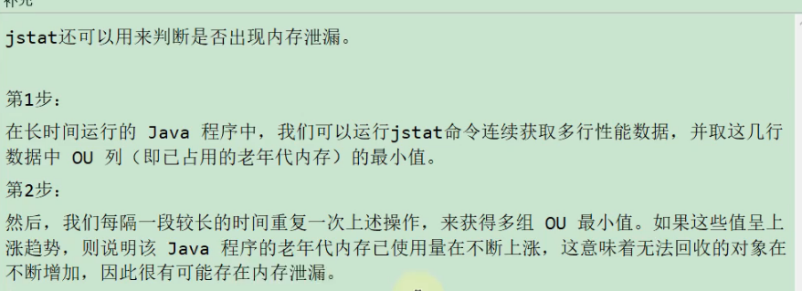


### 3.2.3 jinfo

Configuration info for java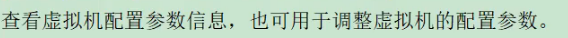

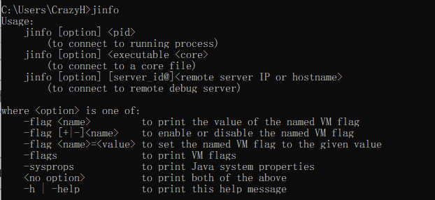


#### 3.2.3.1 查看参数信息

```
jinfo -sysprops <pid>
System.getProperties()
```


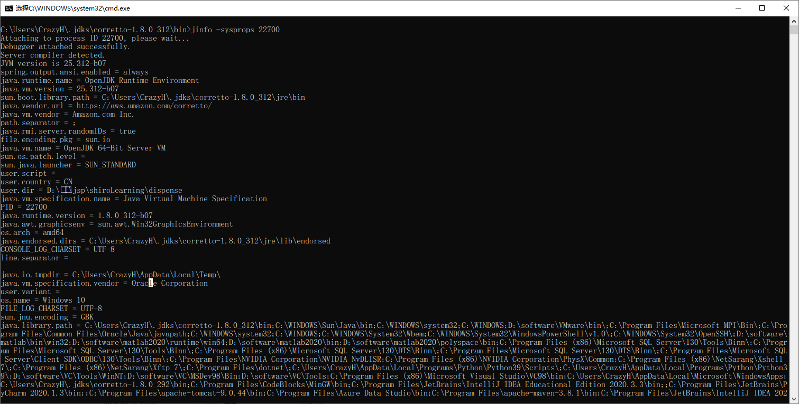


```
jinfo -flags <pid> 查看已经赋过值的参数信息。

```


#### 3.2.3.2 修改参数信息

```
jinfo 不仅可以查看参数，甚至可以修改VM参数，而且是立即生效。
但，不是所有的参数都支持运行时修改。
```

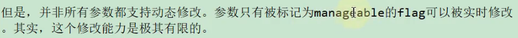

```
java -XX:+PrintFlagsFinal -version| grep manageable

java -XX:+PrintFlagsFinal -version|findstr manageable

PrintFlagsInitial  输出初始值
PrintFlagsFinal    输出最终值
```

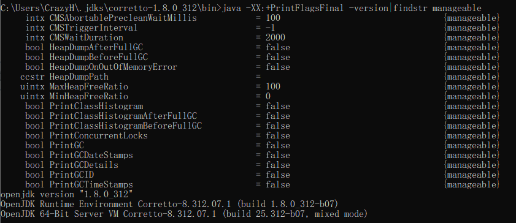

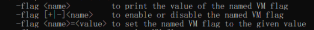


### 3.2.4 jmap ： 导出内存模型

导出内存映像文件（dump）& 内存使用情况

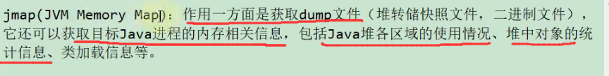

#### 3.2.4.1 基本语法

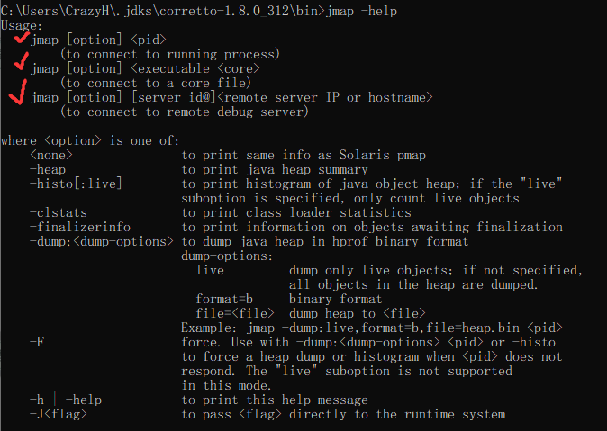


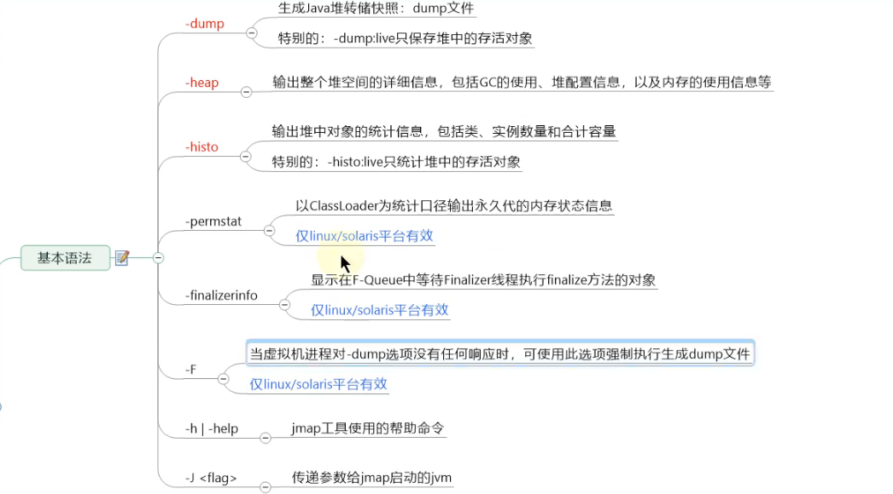

#### 3.2.4.2 导出dump文件

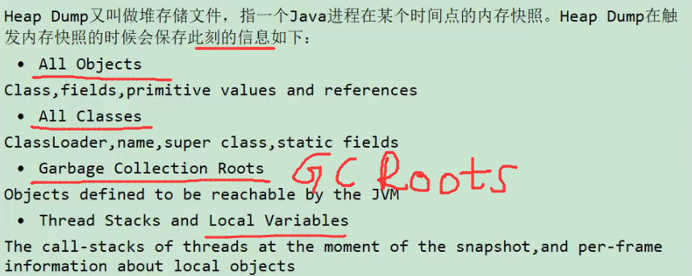


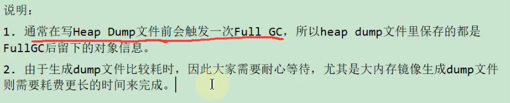


接下来引入实例操作，导出dump文件。

```
jmap -dump:format=b,file=<filename.hprof> <pid>
jmap -dump:live,format=b,file=<filename.hprof> <pid>
```

```
注意到dump时，可以添加:live参数。表示输出FullGC以后存活的对象。
也就是说,dump:live操作会导致一次FullGC，以后再生成dump文件。
而普通的dump不会导致FullGC。
测试一下：
```

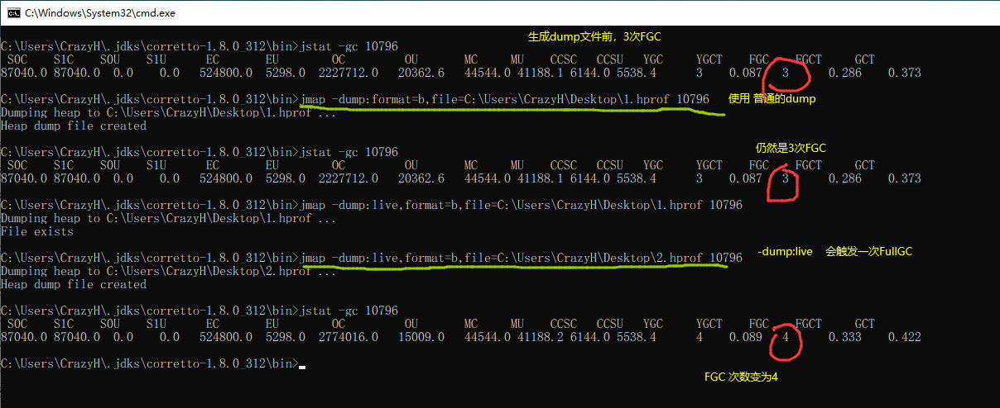


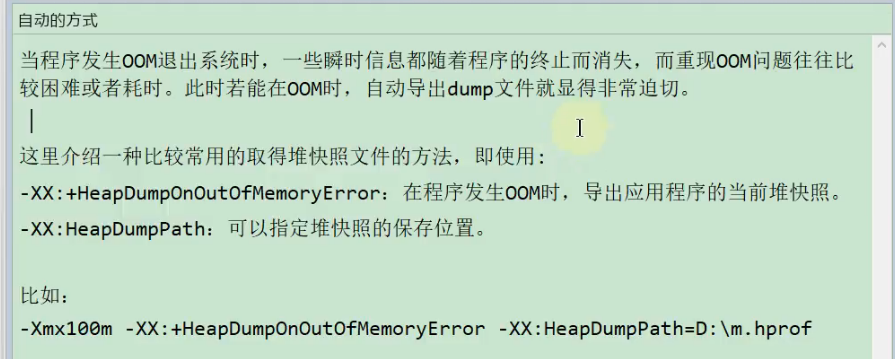

```
-XX:+HeapDumpOnOutOfMemoryError   //开启OOM时生成dump文件
-XX:HeapDumpPath=<xxx.hprof>     //指定dump文件的路径

手动导出dump文件可以检测任意时刻堆内存的情况。
自动导出只在OOM之前，导出即将OOM前堆内存的情况。
```

##### 3.2.4.2.1 导出dump实例

```dockerfile
Active code page: 65001

C:\Users\CrazyH>jps
12720 Jps
9232 Launcher
16008
17480 RemoteMavenServer36
2396 DispenseApplication

C:\Users\CrazyH>jmap -dump:format=b,file=C:\Users\CrazyH\Desktop\1.hprof 2396
Dumping heap to C:\Users\CrazyH\Desktop\1.hprof ...
Heap dump file created

C:\Users\CrazyH>
```


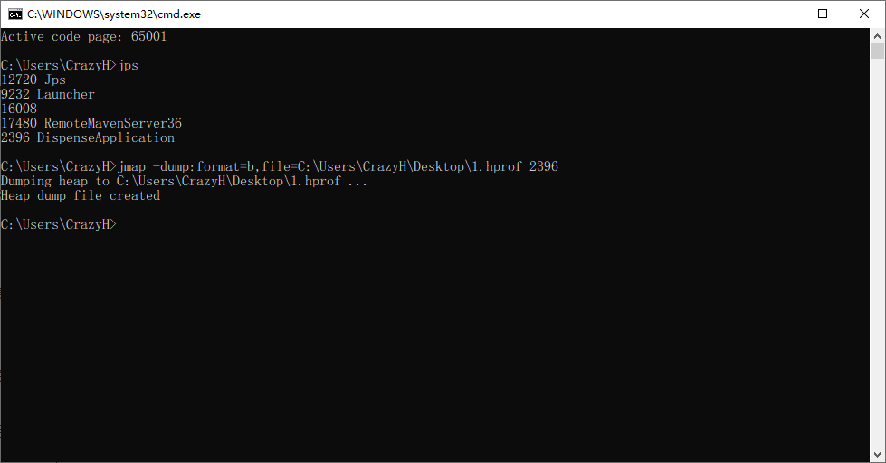

拿到了dump 文件，使用Jprofiler就可以查看dump文件


#### 3.2.4.3  显示堆内存相关信息

主要有两个指令

```
jmap -heap
jmap -histo
```

```
C:\Users\CrazyH\.jdks\corretto-1.8.0_312\bin>jps
15952 Launcher
15464 Jps
15976 jprofiler.exe
16008
17480 RemoteMavenServer36
10796 DispenseApplication

C:\Users\CrazyH\.jdks\corretto-1.8.0_312\bin>jmap -heap 10796 > C:\Users\CrazyH\Desktop\1.txt

C:\Users\CrazyH\.jdks\corretto-1.8.0_312\bin>
```

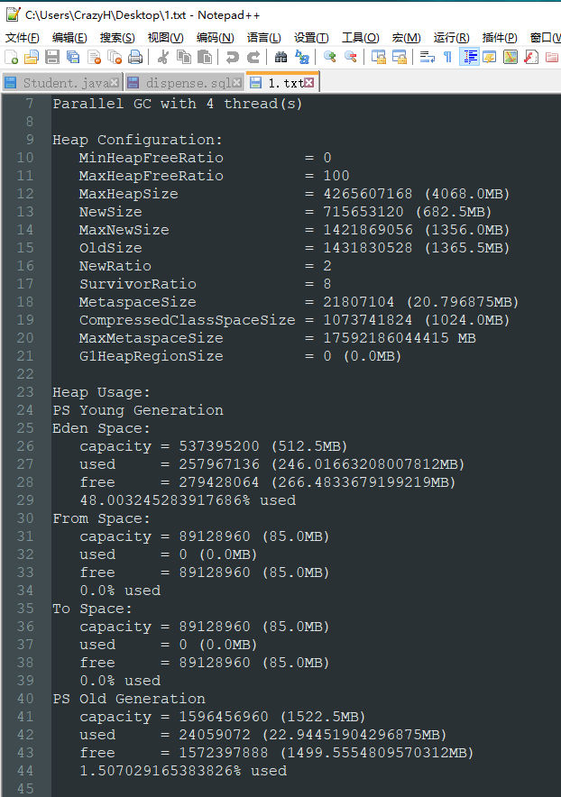

```
能看到堆内各个区的大小，使用情况、最大值等
```


### 3.2.5 jhat  jdk自带分析dump工具


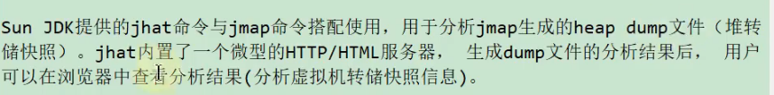


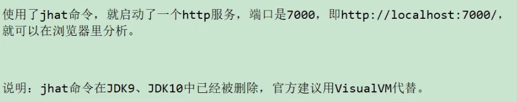

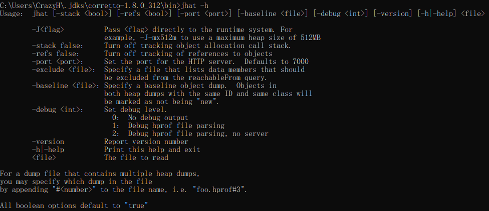


### 3.2.5 jstack  输出线程快照

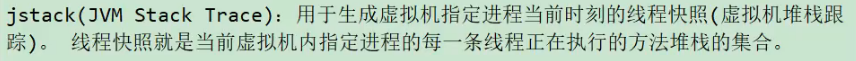


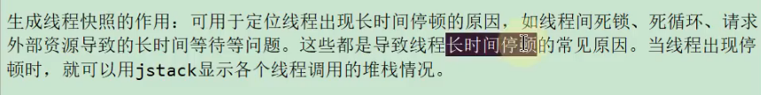


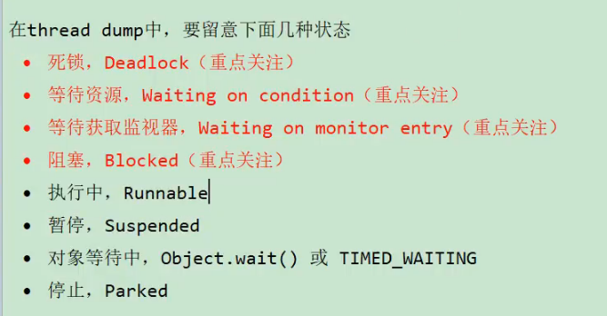


#### 3.2.5.1  语法

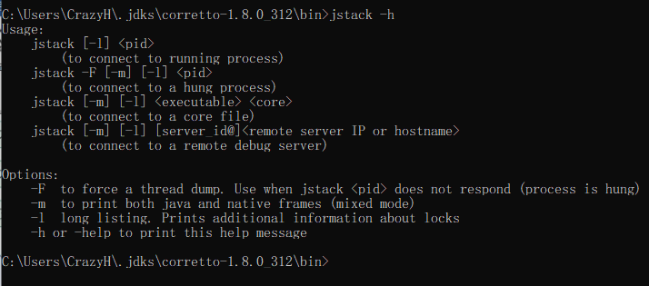

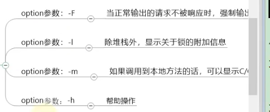


### 3.2.6 jcmd   多功能工具


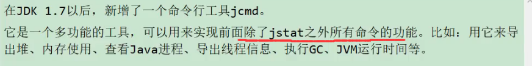


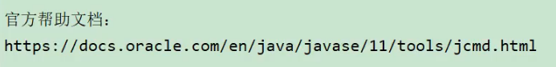

#### 3.2.6.1 语法

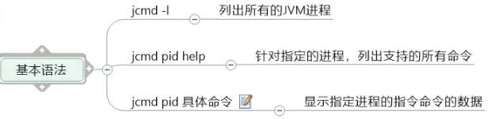


#### 3.2.6.2 示例

```
jcmd -l  

jcmd 10796 help 
```


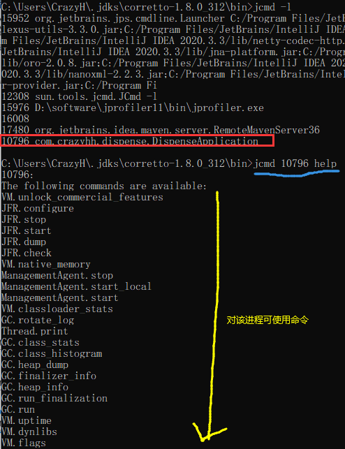

```
jcmd 10796 GC.heap_info
```


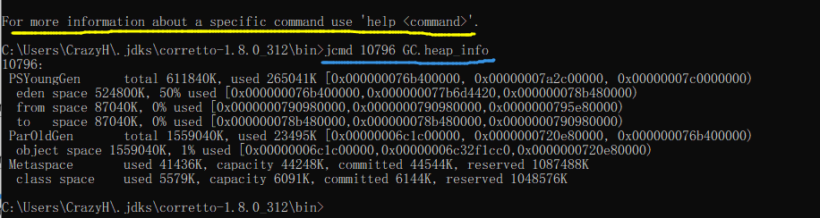


```
进一步查看每种commend的帮助
jcmd <pid> help <commend>
```


```
jcmd 10796 help GC.heap_dump
```


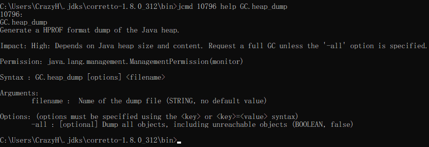

```
jcmd 10796 GC.heap_dump -all C:\Users\CrazyH\Desktop\3.hprof
```

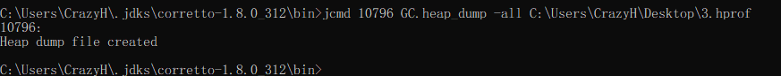

成功拿到dump数据


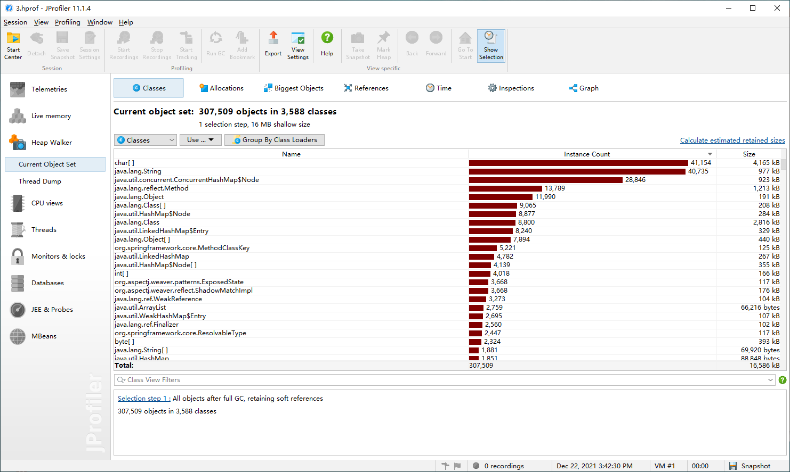


### 3.2.7 jstatd 远程主机信息收集


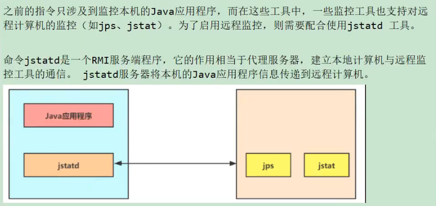


## 3.3  JVM监控诊断工具-图形化工具

### 3.3.1 概述

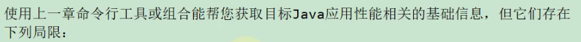

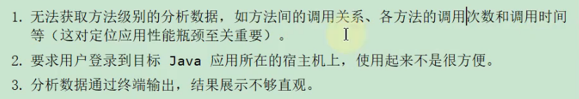


### 3.3.2 Jconsole


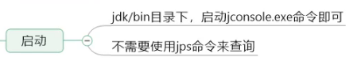


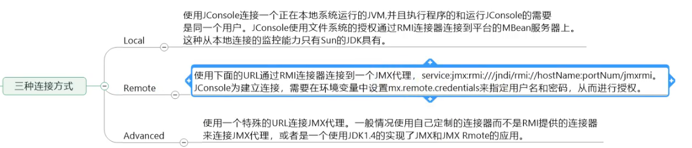


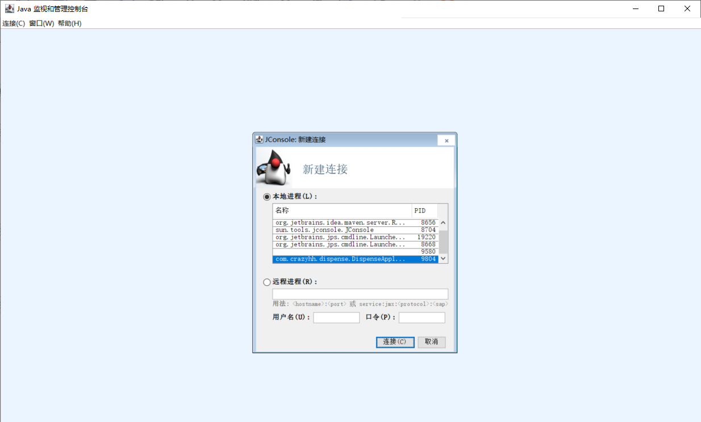


### 3.3.3 Visual VM


```
包含了多个命令行功能的可视化监控。
jstat jcmd
```


#### 3.3.3.1 主要功能

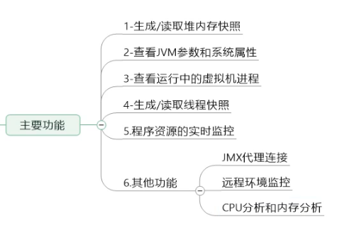

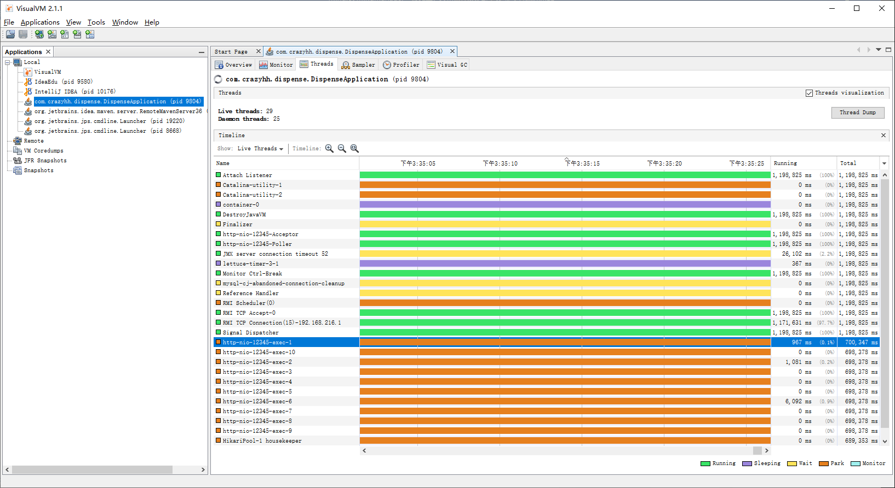

#### 3.3.3.2 分析dump文件

生成dump

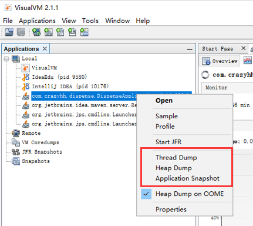


## 3.4 深堆和浅堆


### 3.4.1 浅堆

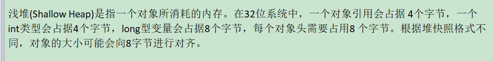

### 3.4.2 保留集


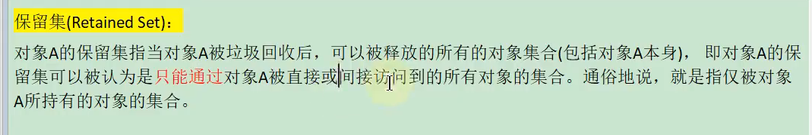


### 3.4.3 深堆

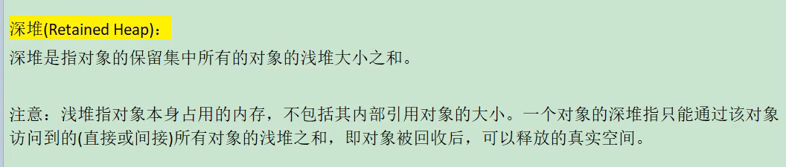


### 3.4.4  对象的实际大小

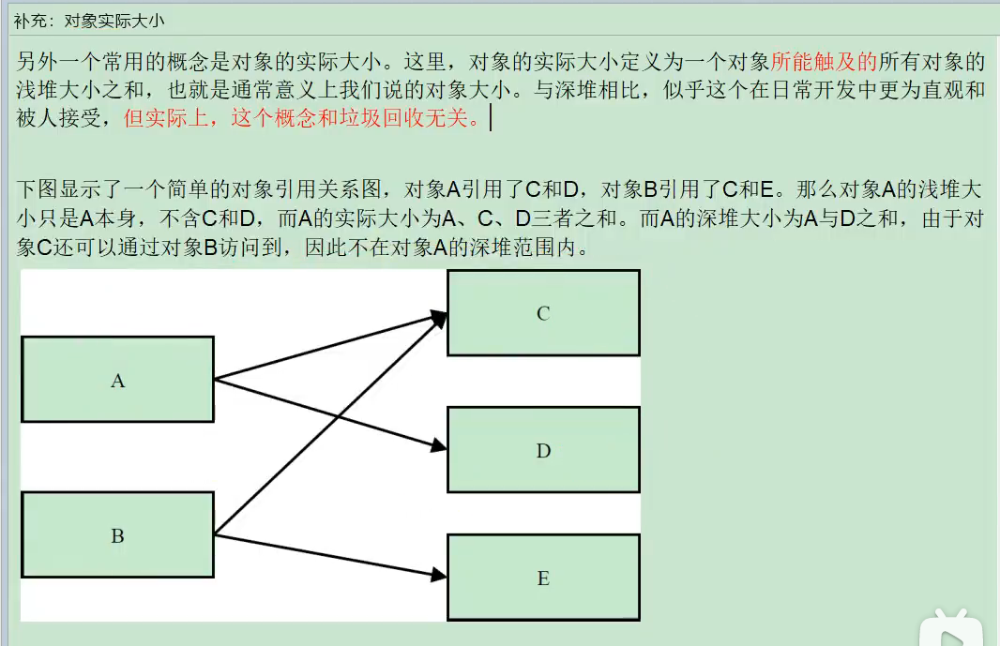

```
A的浅堆大小：  A
A的深堆大小： A+D
A的实际大小： A+C+D
B的浅堆大小:   B
B的深堆大小： B+E
B的实际大小: B+C+E
```


# 4、大厂面试


## 4.1 具体调优


```
在用jmeter 进行压力测试。 在尝试动静分离，开启缓存后吞吐量上仍不明显。 
在使用JVisualVM 监控GC 以后发现，fullGC 发生非常频繁,老年代几乎已经满了，还在尝试进行fullGC.
在压测上上千个请求以后，已经执行了上百次的fullgc，总持续时间已经达到十几秒。
适当的调整了堆区的大小，
```


​	
