# 1. K8s入门

Kubernetes 是什么？ 

Kubernetes提供了一个 平台/工具 来帮助开发者快速 协调/扩展 容器化应用。

特别是对于 Docker容器。


如果我们需要管理大量的docker容器：

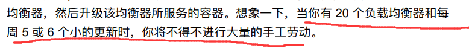


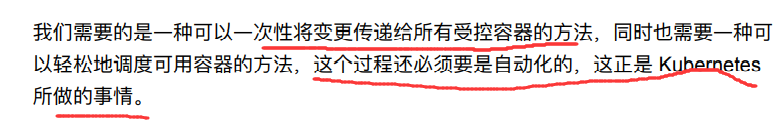


```
也就是，自动编排容器.
```


## 1.1 云原生

目前提到的云原生概念，多指一种文化，不具象为哪些技术。


云原生框架的几个主要特征:

```
面向微服务架构

应用容器化

应用支持容器的编排调度
```


云原生的代表技术包括：

容器，微服务  ， 服务网格，不可变基础设施和声明式API。


《kubernetes handbook》作者是这样总结 `云原生` 的。、

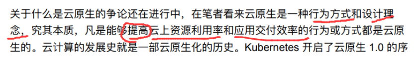

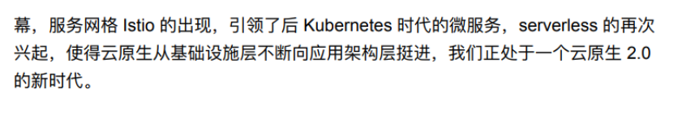


```
云原生,是一种行为方式，设计理念，不特定指某一种技术。 主要用于提高“云”上资源利用率，应用交付率。
```


### 1.1.1 云原生设计理念


面向分布式：  容器，微服务，API驱动的开发

面向配置设计： 一个镜像，多个环境配置

面向高可用设计： 故障容忍和自愈。

面向弹性设计： 弹性扩容收缩，以应对环境变化。

面向交付设计： 自动拉起 (?) ，缩短交付时间

面向性能设计：  响应式 ， 并发，  资源高效利用

自动化设计:   自动化 Devops

诊断设计：集群级别的日志，  metric  和追踪

安全:    安全端点， API Gateway 


## 1.2 K8s 架构和组件


### 1.2.1 期望状态 原则

Kubernetes 利⽤了 “期望状态” 原则。开发者定义了组件的期望状态，⽽ Kubernetes 要将它们始终检测并调整到这个状态。


解释 : 

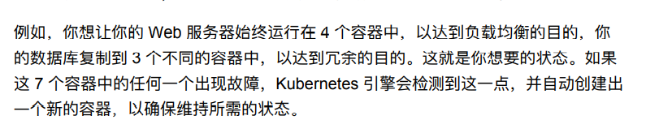


### 1.2.2 k8s集群/命名空间

当你第⼀次设置 Kubernetes 时，你会创建⼀个集群。所有其他组件都是集群的⼀部分。

你也可以创建多个`虚拟集群`，称为 `命名空间 (namespace)`，它们是同⼀个物理集 群的⼀部分。


### 1.2.3 node

K8s运行在node上,节点是集群中的单个物理机器。

节点是部署你 的应⽤或服务的地⽅，是 Kubernetes ⼯作的地⽅。


#### 1.2.3.1 节点类型

k8s 有两种节点   `master`   `worker`  所以说 Kubernetes 是主从结构的。


`master` 节点向集群中的所有其他节点发送消息 。将⼯作分配给它们，`worker`节点向主节点 上的 API Server 汇报。


### 1.2.4 API Server

这是一个至关重要的组件。

因为这是 `worker` 节点和 `master` 节点就 [pod](# 1.2.5  pod)、`deployment` 和所有其他 Kubernetes API 对象的状态进⾏通信的点。


对于 master 节点的  `API Server`组件，是节点与 `控制` 程序沟通的端点。


### 1.2.5  pod

Kubernetes 中的逻辑⽽⾮物理的⼯作单位称为 pod。

```
也就是说, K8s 调度管理的逻辑上的工作单位 pod
```


我们知道，一个容器代表一个独立的，隔离的工作单元。但是构建一个复杂的Web容器时，我们通常需要启动多个容器组合使用。

此时，可以将多个容器组合到一个pod中，交给K8s管理。


```
⼀个 pod 允许你把多个容器，并指定它们如何组合在⼀起来创建应⽤程序。
```


### 1.2.6  service 


Kubernetes 中的 service 是【⼀组】逻辑上的 pod。


把⼀个 service 看成是⼀个 pod 的逻辑分组。

它提供了⼀个单⼀的 `IP 地址`和 `DNS 名称`，你可以通过它访问服务内的所有 pod。


```
一个独立的Service提供了独立了 ip地址和DNS名称。
```


#### 1.2.6.1  service的必要性

RC, RS , deployment 只是解决了支撑微服务的pod的数量，但无法解决访问这些服务。


pod只是运行服务的一个实例，可以随时停止，或在另一个Node上以一个新的IP启动。

为了提供稳定的 `服务发现` `负载均衡` 等功能，必须对IP 有一个稳定的抽象： service


每一个Service会对应 `集群内部有效` 的虚拟IP， 集群内部通过虚拟IP来访问一个service。

[kube-proxy](# 1.2.13  kube-proxy)


#### 1.2.6.2 service示意图


一个k8s内部的示意图

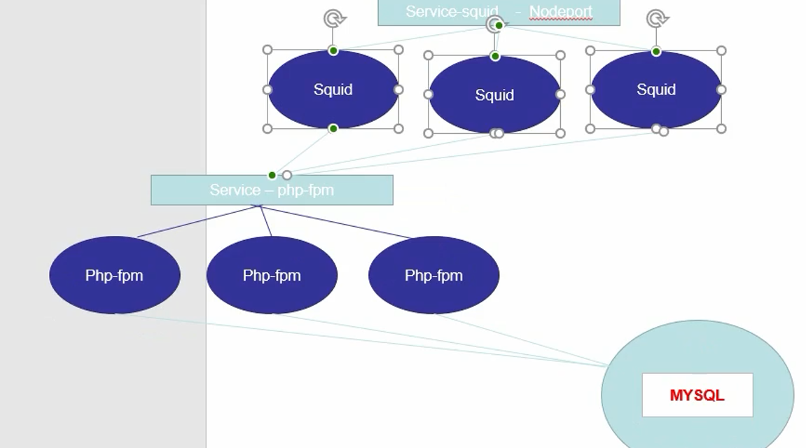


一个service可以由多个pod组成。

```
多个Php-fpm  pod节点组成了 Server-php-fpm服务
```


优点：

有了服务(service) 就可以非常容易的设置和管理负载均衡。 //当需要扩展k8s的pod时，有重要帮助


### 1.2.7 ReplicationController


`ReplicationController`  (副本控制器)  和 `ReplicaSet`  (副本集合) 是k8s的另一个关键功能。


它负责实际管理 `pod生命周期的组件`  ： 

```
当pod收到指令 或者 pod意外宕机离线 时，启动pod

收到指令时 kill掉  pod。

```


````
在新版本中，推荐使用 ReplicaSet 来取代 ReplicationController


ReplicaSet 支持集合式的 selector
````


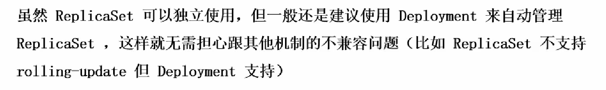


```
Deployment 支持 rolling-update滚动更新。


滚等更新指: 阶梯式的,部分的更新pod的版本。 最终新版本取代旧版本。


```


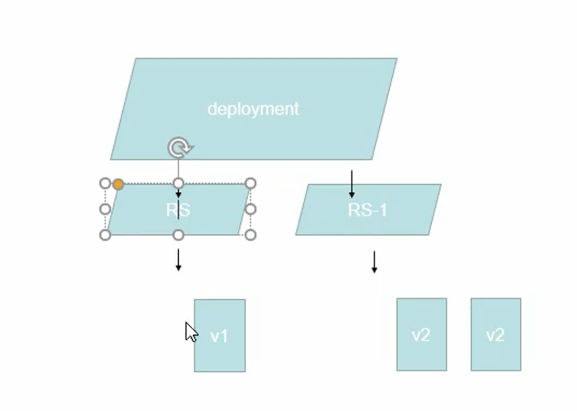


```
Deployment在滚动更新时，会创建一个新的ReplicaSet, 每次新建一个新版本的pod，停用一个旧版本pod

同时支持回滚，原因是旧版本的ReplicaSet不会被删除，只是停用。


Deployment需要创建replicaSet进而获得创建pod的能力。
```


### 1.2.9 Deployment

deployment(部署)，表示用户对 k8s集群的一次 `更新操作`。


部署是一个比RS应用模式更广的API对象： 

```
deployment 可以是
创建一个新的Service
更新一个Service
滚动升级一个Service
```


#### 1.2.9.1 rolling-update 

滚动升级

```
滚动升级⼀个服务，实际是创建⼀个新的 RS，然后逐渐将新 RS 中副本数增 加到理想状态，将旧 RS 中的副本数减⼩到 0 的复合操作；
```


### 1.2.8 Kubectl


`Kubectl` 是一个命令行工具。 用于和  `k8s及其中的pod` 进行通信。

使用它你可以查看集群状态，列出所有pod，进入pod执行命令等。还可以使用yaml定义资源对象。


### 1.2.9 Horizontal Pod Autoscaling

HPA : 根据Pod的利用率，自动扩容。


### 1.2.10  StatefulSet

有状态集合， 是为了解决 “有状态服务”的问题。 （帮助有状态的服务持久化数据）


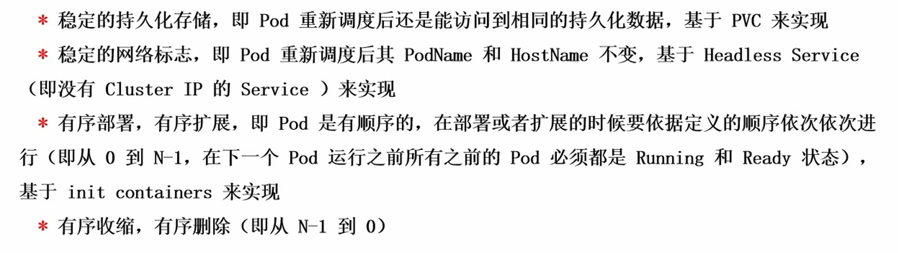


### 1.2.11 daemonSet

daemonSet（后台支撑服务集） 确保全部(或者部分)Node上运行一个Pod副本。

当有一个Node加入集群以后，`daemonSet` 为这个Node新增一个pod。

当Node从集群中移除Node以后，会删除对应的 pod。


```
Node上有需要运行在守护进程的需求是，可以使用deamonSet
```


### 1.2.12 job

Job负责批处理任务。 job 是k8s用来控制 `批处理型任务` 的API对象。


`批处理任务` 与 `长期伺服业务` 的主要区别是 ：  批处理业务的运行有头有尾。  长期伺服业务在用户不停止的情况下永远运行。


Job 管理的Pod ， 根据开发者的设置把任务执行完成以后就自动退出了。


```
成功完成的标志根据不同的 spec.completions 策略⽽不同：

1.单 Pod 型任务有⼀个 Pod 成功就标志完成；

2.定数成功型任务  保证有 N 个任务全部成功；

3.⼯作队列型任务  根据应⽤确认的全局成功⽽标志成功。
```


#### 1.2.12.1  cron job

`cron job` 是基于时间管理的，定时job


了解springTask 一定熟悉 :

```
支持：
定时开启
周期循环
```


### 1.2.13  kube-proxy

k8s中，使用kube-proxy来实现负载均衡， `kube-proxy` 是k8s `集群内部`的负载均衡器。


`kube-proxy` 是一个分布式代理服务器，在k8s的每一个Node上都有一个。

这一设计体现了它伸缩性优势： 

```
需要访问服务的节点越多，提供负载均衡能力的 kube-proxy 越多，高可用节点也随之增多。
```


### 1.2.14 etcd

Etcd是Kubernetes集群中的⼀个⼗分重要的组件，⽤于保存集群 `所有的⽹络配置`和 `对象的状态信息`。


etcd 是一个分布式安全的KV数据库。

原理是 `raft` 一致性算法。


## 1.3 K8S中的一些概念


### 1.3.1 Kubernetes自动扩展


我们借助k8s来对 docker控制的原因之一就是 ：

```
k8s 能够自动扩展应用实力数量，以满足工作负载的需求。
```


`自动缩放` 是通过集群设置来实现的。

```
需求增加时，则增加Node数量
需求减少时，减少Node数量
```

云平台必须允许k8s引擎有创建新机器的能力。各种云提供商对k8s的支持基本都满足这一点。


### 1.3.2 kubernetes Ingress


首先k8s支持外部用户或应用程序与  `pod` 进行交互。

我们必须设置安全规则 ： 允许哪些流量 进入/离开 pod。


进入`kubernetes pod` 的流量称之为  `Ingerss` （准入）

流出 `kubernetes pod` 的流量称之为  `egress` （准出）


```
创建入口策略/出口策略的目的是 限制不需要的流量进入/流出服务
```


### 1.3.3 Ingress Controller


定义⼊⼝和出⼝策略之前，

你必须⾸先启动被称为 Ingress Controller（⼊⼝控制器）的组件   // 这个在集群中默认不启动。


```
k8s项目默认只支持 google cloud 和 nginx 入口控制器。 通常云提供商会提供自己的入口控制器
```


### 1.3.4 Replica / ReplicaSet

为了保证 `App`的弹性，通常需要在不用的 Node上创建多个 pod 副本， 这些副本被称为  `Replica`


例如： 

```
目前接到的策略需求是:  让名为webServer-1 的pod 始终维持在3个副本

这意味着： ReplicationController 或 ReplicaSet 将监控 活动副本的数量。任何一个replica由于任何原因宕机， Deployment Controller 将自动创建一个新的系统。


所需的状态(维持3个副本)是在 deployment 中定义的。Master节点(Node)中有一个子系统, 称为 Deployment Controller ，它来负责使当前的状态趋于所需状态
```


也就是说:

```
ReplicationController 负责监控当前Service的状态，并通知 Deployment Controller 根据预定义的设置部署对应缺失的pod
```


### 1.3.5 服务网格

服务网格 （Service Mesh） 用于管理服务(Service)之间的流量。  是云原生的网络基础设施。


服务⽹格利⽤容器之间的⽹络设置来控制或改变应⽤程序中不同组件之间的交互。


我们⽤⼀个例⼦来说明:

```
假设你想测试 Nginx 的新版本，检查它是否与你的 Web应⽤兼容。
你⽤新的 Nginx 版本创建了⼀个新的容器 (Container2)，并从当前容器(Container1) 中复制了当前的 Nginx webserver 配置。

但你不想影响组成 web 应⽤的其他微服务（假设每个容器对应⼀个单独的微服务）—— 就是 MySQL 数据库、
Node.js 前端、负载均衡器等。
```


使⽤服务⽹格，你可以⽴即只把 webserver 微服务改成 Container2（新 Nginx 版本的那个）进⾏测试。


如果确定它不能⼯作，⽐如因为它导致⽹站出现⼀些兼容性问题，

那么你就调⽤服务⽹格来快速切换回原来的 Container1。⽽这⼀切都不需要对其 他容器进⾏任何配置变更 —— 这些变更对其他容器是完全透明的。


如果没有服务⽹格，对容器来说这项⼯作将⼗分繁琐，因为这涉及到逐⼀更改所有其 他容器上的配置，将它们所包含的服务从 Container1 指向 Container2，然后在测试 失败后，将它们全部改回来。


### 1.3.6 Volume

Docker中的卷作用范围为一个容器。

k8s中存储卷的生命周期和作用范围是一个 Pod。


Pod中生命的 `volume` 被pod中所有容器共享。


Kubernetes ⽀持⾮常多的存储 卷类型，

```
特别的，⽀持多种公有云平台的存储，包括 AWS，Google 和 Azure 云；⽀ 持多种分布式存储包括 GlusterFS 和 Ceph；也⽀持较容易使⽤的主机本地⽬录 emptyDir, hostPath 和 NFS。
```


### 1.3.7 k8s的网络通信方式


k8s的网络模型假定了所有的pod都在一个可以直接连通的扁平的网络空间。


三种网络通信方式：


```
pod内多容器通信, lo (localhost,共用了pause的网卡)

pod之间的通信   overlay network

pod 与 service的通信   ,各个节点的Iptables 规则
```


#### 1.3.7.1 overlay network


通常使用Flannel 来解决 “集群中不同Node内 pod的通信问题”。


```
现在假设Webapp2 想向Backend发送数据。

那么数据包的  数据源：10.1.15.2/24  目标地址：10.1.20.3/24
```


Flannel 工作方式： 所有的Node会启动一个 Flanneld的守护进程，监听 Docker容器的网桥 `docker0` 的数据包。

监听到的数据报文会发送至 `Flannel0` 中。

Flanneld会将各个Pod的ip地址注册到 `etcd`中(就像一个注册中心)

Flanneld 会把监听到的数据报文，封装，并转发到对应的其他Node节点(其他node节点已经把自己注册到etcd上了)上


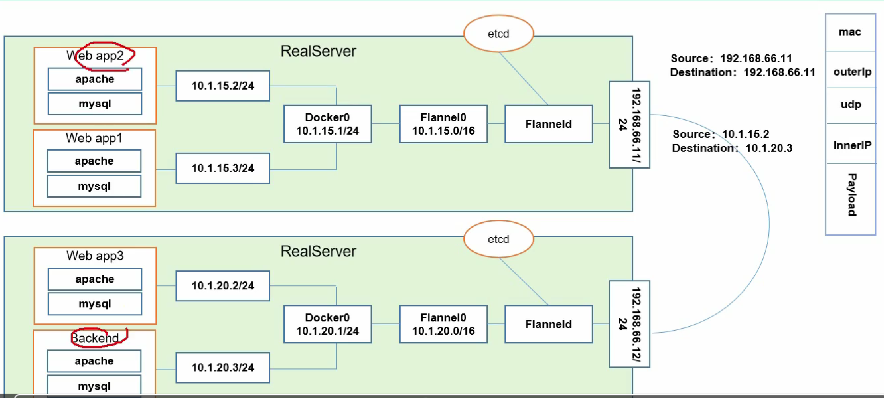


## 1.4 监控工具

Kubernetes 提供了应⽤程序在集群的每个层次上的资源使⽤情况的详细信息 —— 容 器、pod、服务。这些详细信息使你能够评估应⽤程序的性能，确定哪些瓶颈可以解 决以提⾼整体性能。


Kubernetes 包含两个内置度量收集⼯具⽤于监控：资源管道和全度量管道。


资源管道 是⼀个较低级和较有限的⼯具，主要集中在与各种控制器相关的指标上。

全指标管 道，顾名思义，从⼏乎所有集群组件中获取并显示更丰富的指标。


 还有⼀些第三⽅⼯具可以安装并集成到 Kubernetes 集群中。对于 Kubernetes 来说， 最普遍使⽤的两个⼯具是 `Prometheus` 和 `Grafana`。


### 1.4.1 Prometheus


Pod 在K8s中是一个最小的封装集合。K8s管理的最小单位。


Pod控制器：发现死亡的容器，并重建


服务发现 ： K8s把内部私有的服务暴露给外界


网络通讯模式：  pod本节点通讯， 跨pod节点通讯


资源清单


## 1.5 组件说明


### 1.5.1 borg 架构图

K8s的前身就是谷歌的 borg系统。


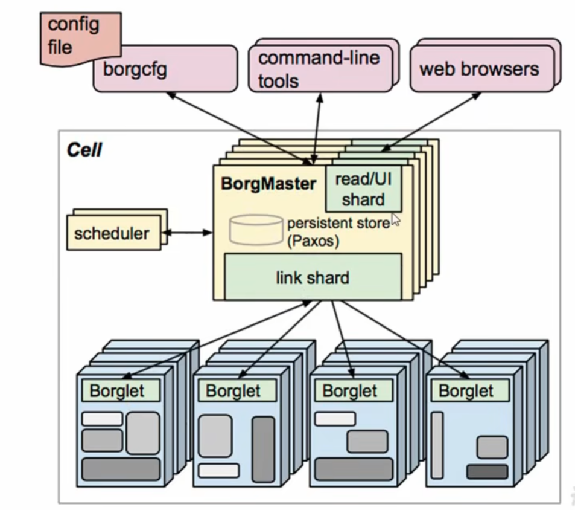


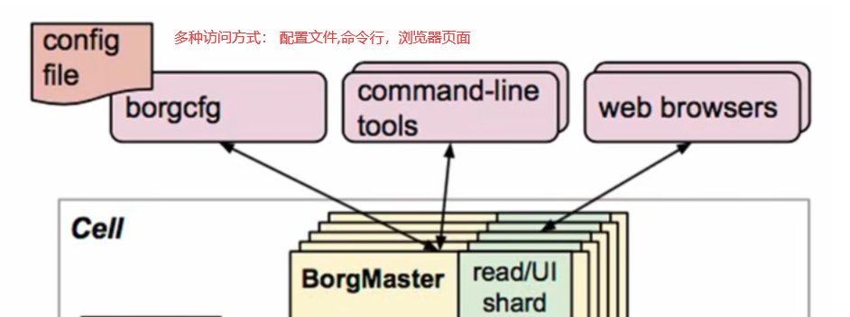


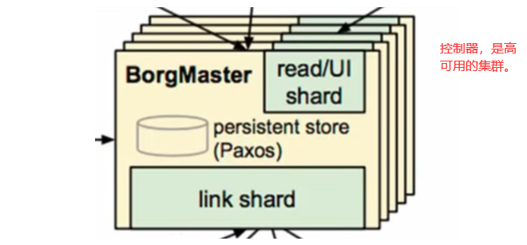


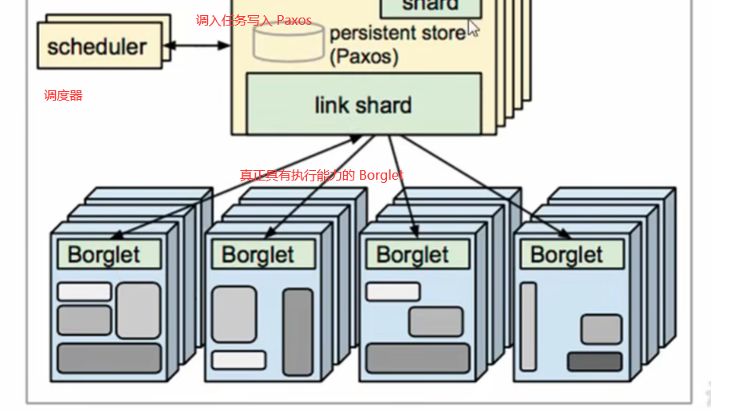


### 1.5.2  k8s架构图

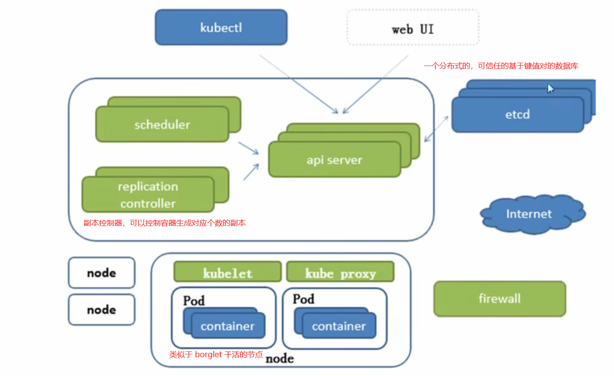


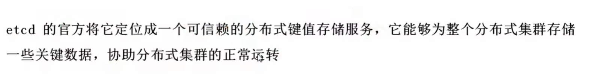

```
etcd用于保存 k8s分布式集群需要持久化的配置文件，配置信息。
```

如果集群节点宕机以后，借助etcd恢复


### 1.5.3 组件


apiService: 所有服务统一标准入口

Scheduler： 负责接收任务，选择合适的节点 分配任务。

etcd:  分布式安全的KV数据库，存储K8s中需要持久化的数据

kubelet:  直接与 容器引擎(docker) 交互，实现容器的生命周期管理。

kubeProxy:   用于容器之间的交互通信。


CoreDNS : 为pod 提供 DNS服务

Dashboard:  给K8s提供 浏览器访问控制 的支持。

prometheus: 提供k8s集群监控能力。

EFK： 提供k8s集群日志统一分析平台。


## 1.6 pod


同一个pod 中共享同一个网络，同一个存储卷


## 1.7 安装k8s


```
systemctl stop firewalld && systemctl disable firewalld 
```


```
yum -y install iptables-services && systemctl start iptables && systemctl enable iptables && iptables -F && service iptables save
```


关闭虚拟内存。也就是交换内存。

```
swapoff -a && sed -i '/ swap / s/^\(.*\)$/#\1/g' /etc/fstab
```


```
setenforce 0 && sed -i 's/^SELINUX=.*/SELINUX=disabled/' /etc/selinux/config
```


配置k8s的配置文件

```shell
cat >kubernetes.conf <<EOF
net.bridge.bridge-nf-call-iptables=1
net.bridge.bridge-nf-call-ip6tables=1
net.ipv6.conf.all.disable_ipv6=1
net.ipv4.ip_forward=1
net.ipv4.tcp_tw_recycle=0
vm.swappiness=0
vm.overcommit_memory=1
vm.panic_on_oom=0
EOF
cp kubernetes.conf /etc/sysctl.d/kubernetes.conf

modprobe  br_netfilter
sysctl -p /etc/sysctl.d/kubernetes.conf
```


调整系统时区

```
timedatectl set-timezone Asia/Shanghai

timedatectl set-local-rtc 0

systemctl restart rsyslog
systemctl restart crond
```


关闭系统不需要的服务

```
systemctl stop postfix && systemctl disable postfix
```


设置日志保存方式


