#  1.Kafka 基础架构


## 1.0 综述`kafka`

`kafka` 是一个支持分区，多副本，基于`Zookeeper`协调的分布式消息系统，可用于`MQ`。


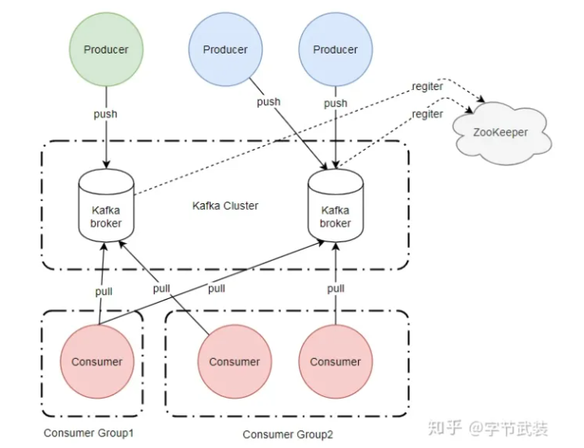


`kafka`主要由3部分组成 ： `生产者`，`消费者`，`broker` 


`生产者`： 消息的产生端，和`broker`沟通。

`消费者` ： 消息的消费端， 和`broker`沟通。

`broker`  :  服务器，用于消息的接收，存储，发送。


## 1.1 多`broker`

`kafka` 为了方便扩展，提高`吞吐量`，一个`topic(主题)` 可分为多个 `partition(分区)`。


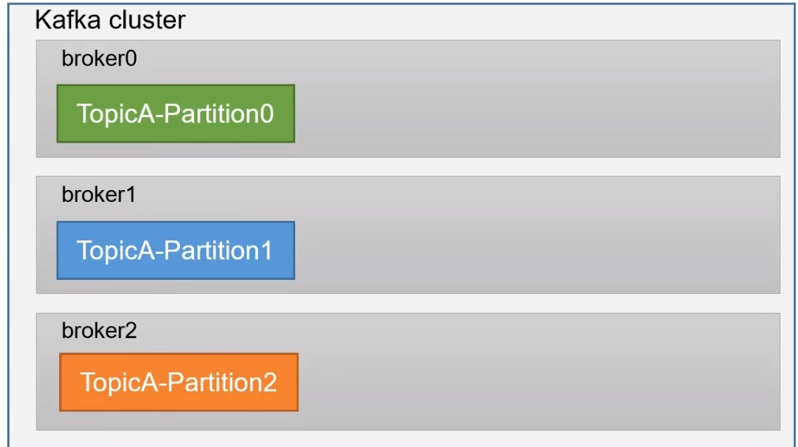


配合`分区`的设计，提出`消费者组`的概念。一个消费者组内，有多个`Consumer`, 其中 `Consumer`和分区是绑定的(消费者固定消费某个分区的信息)

```
在同一个Group内，1个Consumer只能对应1个Partition
```

示意图如下：

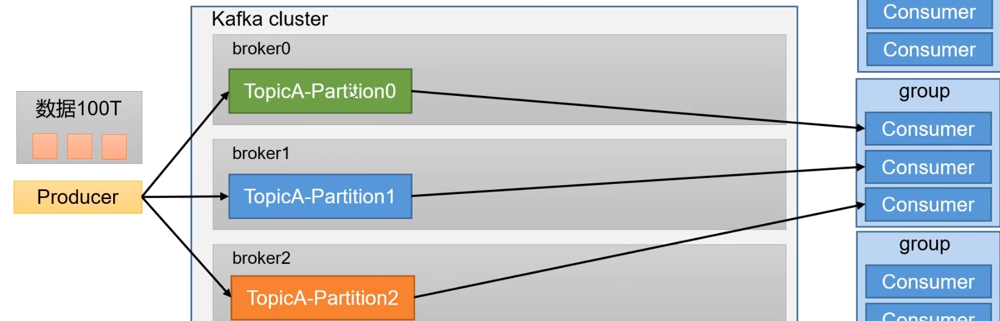


为了提高`可用性`，每个`Partition` 可以增加若干副本(集群)，`Leader`节点将副本信息发送给`Follower`节点。

```
副本中分为 Leader节点 和 follower 节点。
```


`kafka`一部分数据存储在`zookeeper`中 , `kafka`将选举过程中的重要信息存放在`Zookeeper`中。


## 1.1 Kafka 为什么要分区

参考博客

https://zhuanlan.zhihu.com/p/125159716


在同一个 `topic`中，`kafka` 接收`Consumer`生产的消息，并按照一定的 `分区分配算法` 将消息分派给不同的分区，每个分区都能作为消息输出的出口，可以按照实际业务需求和机器数量分配分区，控制(提高)消息的吞吐量。


## 1.2 启动kafka

集群规划

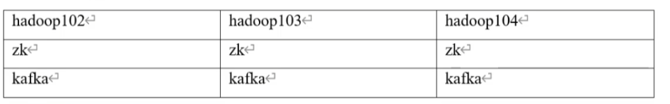

```
三台机器，每台都需要有zookeeper和kafka
```


### 1.2.1  bin目录下的脚本


#### 1.2.1.1  `broker`脚本


`kafka-server-start.sh` :   集群启动脚本  

`kafka-server-stop.sh` :   集群停止脚本


#### 1.2.1.2 `生产者/消费者`脚本


#### 1.2.1.3 `topic`脚本


### 1.2.2  config目录下的配置文件

类似于 conf config etc 下存储的是配置信息相关。


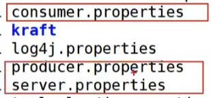

```
对应消费者，生产者,服务器的配置信息。
```


### 1.2.3 修改 `server.properties`


```properties
#集群中的id, 必须是唯一标识，不能重复。
broker.id=0 

#修改kafka日志的路径
log.dirs=/etc/kafka/logs   

#修改zookeeper的地址
zookeeper.connect=   

#以集群的方式配置
zookeeper.connect=192.168.202.150:2181,192.168.202.153:2181,192.168.202.154:2181/kafka

#以单机的方式
zookeeper.connect=127.0.0.1:2181/kafka
```


## 1.1 Kafka Config配置

在`Kafka`的`Config`文件夹下，有各种配置信息。


首先配置`Server.properties` 文件

### 1.1.1 `broker.id`

给`brokerf`服务器配置一个【全局唯一】的`id`

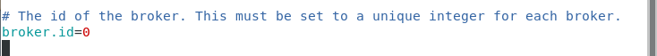

```
broker的Id，必须是一个全局唯一的broker id
```


### 1.1.2 `log.dir`

`kafka`的存储日志文件的目录，记录了消息信息，在宕机恢复时有重要作用。

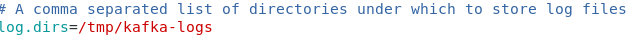

```
以逗号分隔的,文件夹列表。用于存储日志文件。

默认在tmp文件夹,修改为自己的日志文件夹
```


## 1.2  命令行操作kafka

`kafka` 支持 `command client`的形式与 `kafka`集群沟通。


对生产者操作的脚本`kafka-console-producer.sh`

对Server操作的脚本 `kafka-topics.sh`

对消费者操作的脚本 `kafka-console-consumer.sh`


### 1.2.1 操作 `topics `


主题相关的操作，使用`kafka-topics.sh`脚本。

```
想要对kafka操作，首先需要连接对应的kafka集群。
```


连接参数如下：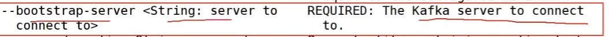


对 topic操作：

```shell
--topic <String:topic>   #对主题进行操作，一般是增删改查

--create
--delete
--alter

#查
--list     # 显式所有可用的主题 ,比较粗略
--describe  # 显式指定主题的细节信息
```


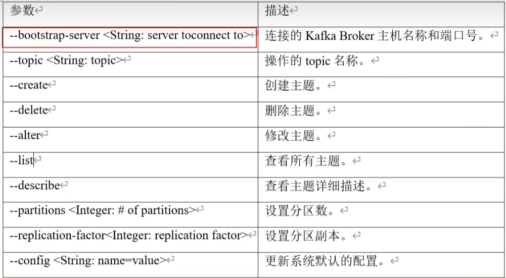


#### 查看所有主题

```shell
./kafka-topics.sh --bootstrap-server localhost:9092 --list
```


#### 创建主题

创建连接到 `localhost:9092`   主题 `first`   `--create`创建   分区数1个 ，副本1个

```shell
./kafka-topics.sh --bootstrap-server localhost:9092 --topic first \
--create --partitions 1 --repliaction-factor 1

# --create 创建
# --partitions 1 分区
# --repliaction-factor 1  副本
#对于集群来说,必须要指定分区，指定副本


#如果是单机 ,命令可以如下
./kafka-topics.sh --bootstrap-server localhost:9092 --topic first --create
```


#### 查看主题详细信息

```sh
./kafka-topics.sh --bootstrap-server localhost:9092 --topic first --describe
```

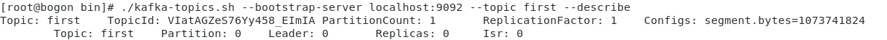


```
Partition: 分区0
Leader节点： 在broker 0
Replicas 备份：0
```


#### 修改主题

```sh
./kafka-topics.sh --bootstrap-server localhost:9092 --topic first --alter --partitions 3

#修改分区为3 
# kafka中分区只能增加，不能减少。
```


### 1.2.1 操作 `producer`

对生产者操作的脚本`kafka-console-producer.sh`

创建一个生产者向broker中发数据。

```sh
./kafka-console-producer.sh --bootstrap-server localhost:9092 --topic first    #发送到first主题
```

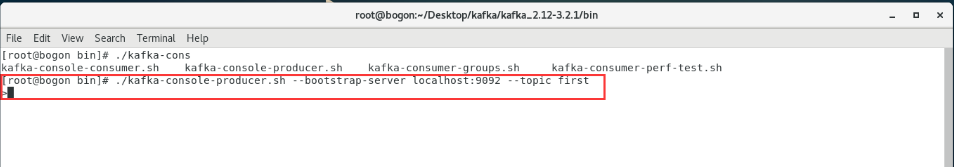

是一个类似于控制台的终端，可以持续向其中发送数据。


### 1.2.2 操作`consumer`


创建一个消费者，类似于console的终端，来持续接收消息。

```sh
./kafka-console-consumer.sh --bootstrap-server localhost:9092 --topic first
```


consumer上线以后，默认不会收到上线以前的信息。如果想接收历史消息，使用 --from-beginning参数

```sh
./kafka-console-consumer.sh --bootstrap-server localhost:9092 --topic first --from-beginning
```


是否增量的读取信息，还是需要读取历史信息。需要根据业务情况而定。


## 1.3 重要组件

主要是kafka中一些组件的定义。


Producer 生产者

```
用于产生消息,生产的消息通过 topic进行分类。保存到kafka的broker中
```


topic 主题

```
1.将kafka消息归类
2.kafka的主题是支持多用户订阅的。这意味着一个主题可以有0个,1个或者多个消费者订阅。
```


partition 分区

```
1个topic可以有多个分区，多个分区分别保存1个topic的部分信息，合起来是一个完整的topic


kafka中每个分区都有一个编号，从0开始

每个分区内的消息是有序的,全局的数据不能保证是有序的。（生产和消费的顺序不一致）
```


consumer 消费者

```
consumer用于消费kafka中的数据，消费者一定是数属于某个消费组中的
```


consumer group 消费者组

```
消费者组由1个或多个消费者组成。 同一个组内的消费者对同一条消息只消费1次。

每个消费者组都有一个ID, groupID。 每个分区只能有同一个组内的1个消费者消费。 可以由不同的消费者组同时消费。

```


partition replicas  分区副本

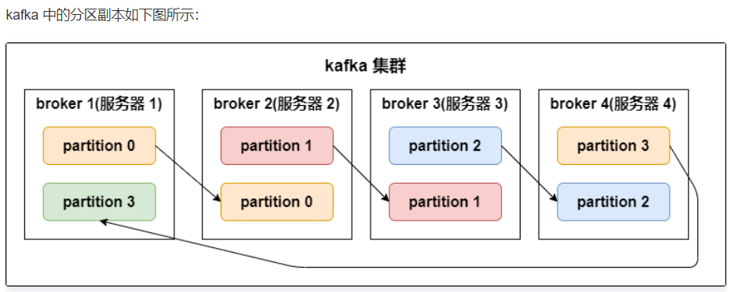


副本数(replication-factor): 控制消息保存在几个broker中，一般情况下副本数等于broker的数量。

（一个broker下，不可以创建多个副本，也就是说创建 topic时，副本数应该小于等于broker数）


# 2. 使用kafka


## 2.1 发送流程


`Java`中向 `kafka` 发送消息的流程图。

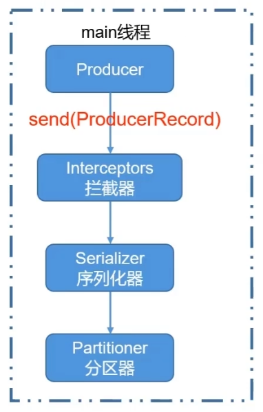


【发送消息】时的示意图：

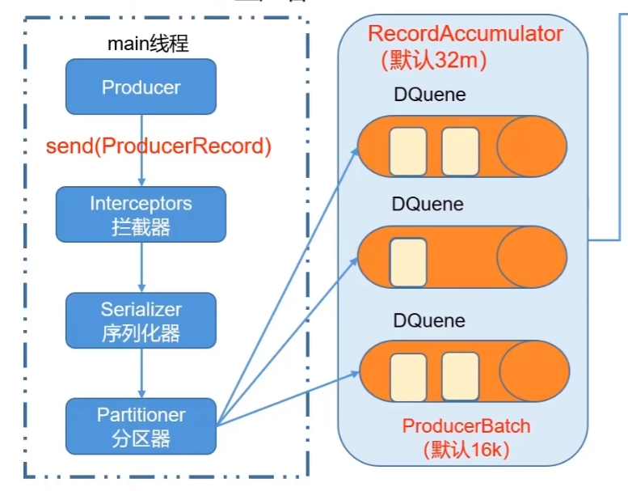


生产者线程首先将消息通过 `interceptors` ，然后将通过拦截器的消息传入`Serializer`进行序列化，将序列化好的消息传入`Paritioner`分区器中。

分区器包含多个发送队列`DQuene` 将消息暂缓存(为了提高发送效率)一起发送至` kafka集群`


其中：

```
拦截器可以自定义，做一些数据处理。
```


```
序列化器: 用于将消息序列化
```


```
分区器 ，大量的数据需要分区分发。数据到底分发到哪一个分区，由分区器决定。 


分区器中,为每一个分区，维护一个队列。 整个分区器都是在内存中完成的，总大小是32M

每一批次的大小16k
```


 


### 2.1.1 `Sender`线程

在应用引入`kafka`后，会自动开启 `Sender`线程 , 其专门读出`缓存队列`中的数据，发送到`kafka集群`。


`Sender`线程接收一个参数  `batch.size` 


````
当数据一直未满`16k`时，数据迟迟不发送 ， 怎么办？
````

另一个参数 `linger.ms` : 最长的等待时间参数 ， 默认值是 `0ms` 表示没有延迟，直接发送。


如果达到了`linger.ms` 则`Sender`线程会将数据直接发送至`kafka集群`,无需满足`16K`


在实际的生产过程中，这两个参数都需要【调节】。才能获得较高的吞吐量。


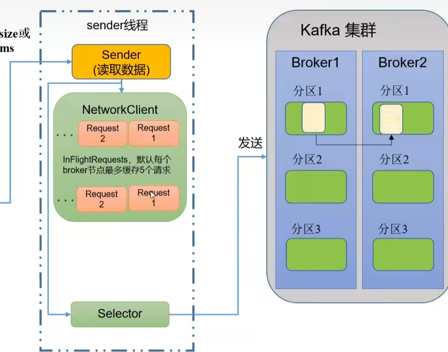


`Sender`线程会向对应的分区发送请求 ， 请求传输数据。

如果对方没有相应，请求最多可以存储5个,当超过5个请求以后，不会再向对方发送请求。


### 2.1.2 应答机制

`kafka集群` 收到`sender`线程传递来的消息以后，需要回复应答。


应答的`acks` 一共有3种： 

`0` :  `kafka`集群接收到消息以后，不需要等消息刷新到磁盘，直接回复生产者接收成功。

`1`:  `kafka` 集群接收到消息， `Leader` 节点收到消息，刷盘后，回复接收成功。

`-1/all` ：  接收到消息后， `Leader` 和 `ISR`的所有节点收到数据以后，回复接收成功。


`-1` 和`all` 等价。


`Sender` 线程接收到`kafka`集群的应答 示意图：

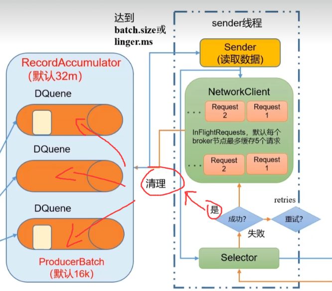


如果`Sender`线程 接收到 `kafka集群` 发送的应答，则清理分区器队列中的消息。如果失败了，可以进行重试。

```
重试的次数默认是 INT.MAX_VALUE
```


## 2.2 异步发送API

在Java程序中, 如果只想发送数据，就引入`kafka-clients`相关的依赖即可


### 2.2.1 创建一个生产者

引入依赖

```xml
        <dependency>
            <groupId>org.apache.kafka</groupId>
            <artifactId>kafka-clients</artifactId>
            <version>3.0.0</version>
        </dependency>
```


生产者的类 `KafkaProducer<String,String>`


```java
        //创建kafka配置
        Properties properties = new Properties();

        //连接指定集群
        properties.put(ProducerConfig.BOOTSTRAP_SERVERS_CONFIG,"bogon:9092");
        properties.put(ProducerConfig.LINGER_MS_CONFIG,0);

        //指定Key,value的序列化器
        properties.put(ProducerConfig.KEY_SERIALIZER_CLASS_CONFIG, StringSerializer.class.getName());
        properties.put(ProducerConfig.VALUE_SERIALIZER_CLASS_CONFIG,StringSerializer.class.getName());
        properties.put(ProducerConfig.REQUEST_TIMEOUT_MS_CONFIG,1000);


        //创建Kafka生产者对象
        KafkaProducer<String,String> kafkaProducer = new KafkaProducer<>(properties);
```


### 2.2.2 发送数据

```java

        //创建kafka配置
        Properties properties = new Properties();

        //连接指定集群
        properties.put(ProducerConfig.BOOTSTRAP_SERVERS_CONFIG,"bogon:9092");
        properties.put(ProducerConfig.LINGER_MS_CONFIG,0);

        //指定Key,value的序列化器
        properties.put(ProducerConfig.KEY_SERIALIZER_CLASS_CONFIG, StringSerializer.class.getName());
        properties.put(ProducerConfig.VALUE_SERIALIZER_CLASS_CONFIG,StringSerializer.class.getName());
        properties.put(ProducerConfig.REQUEST_TIMEOUT_MS_CONFIG,1000);


        //创建Kafka生产者对象
        KafkaProducer<String,String> kafkaProducer = new KafkaProducer<>(properties);

        //发送数据
        for (int i = 0; i <5 ; i++) {
            kafkaProducer.send(new ProducerRecord<>("first","helloWorld"+i));
        }


        //关闭资源
        kafkaProducer.close();  
```


## 2.3  同步发送


异步发送和同步发送的区别？

```
我们知道在分区器中，为每一个分区都维护了一个队列。

如果是异步发送,上一批数据还未发送到kafka集群,生产者产生的消息可以存放到对应队列中。

如果是同步发送,只有等待上一条消息发送到kafka集群以后,下一条消息才会进入队列
```


为什么会有同步发送？

因为 producer.send方法返回的是一个 `Future<RecordMetadata>`

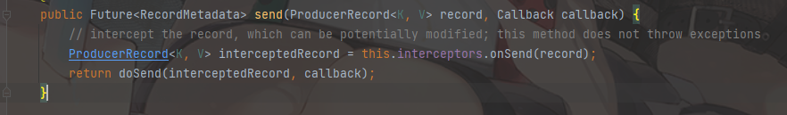

Future接口有一个get方法，表示线程阻塞等待回调完成以后，才能继续向下执行。


对于以下代码:

```java
public static void main(String[] args) {
    	//配置项
        Properties properties = new Properties();
        properties.put(ProducerConfig.BOOTSTRAP_SERVERS_CONFIG,"bogon:9092");
        properties.put(ProducerConfig.KEY_SERIALIZER_CLASS_CONFIG, StringSerializer.class.getName());
        properties.put(ProducerConfig.VALUE_SERIALIZER_CLASS_CONFIG, StringSerializer.class.getName());

        try(KafkaProducer<String,String> producer = new KafkaProducer<>(properties);){
            for (int i = 0; i < 5; i++) {
                RecordMetadata recordMetadata = producer.send(new ProducerRecord<>("first", "qqq")).get();
                //这里调用Future.get() 以后会阻塞等待
                System.out.println("只有 recordMetada 返回了,才能继续执行");
            }
        } catch (ExecutionException | InterruptedException e) {
            throw new RuntimeException(e);
        }
    }
```


## 2.4 生产者分区

生产者分区，指的就是分区器。


### 2.4.1 分区的好处


```
可以把海量的数据按照分区切割成一块一块数据存储在多台Broker上。可以合理的控制分区的任务，提高吞吐量。

提高并行度,将数据分成多个broker以后,每个broker都可以为不同的消费者服务。大大提高了消费速度
```


### 2.4.2 分区策略


#### 2.4.2.1 默认的分区器

`DefaultPartitioner`  默认的分区规则如下

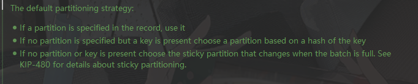


```
如果record指定了分区，则直接使用
如果没有指定分区，但是record有key,那么选择key的hash值作为分区
如果分区和key都没有，那么选择粘性分区。   关于粘性分区更多细节可以参考 KIP-480
```


粘性分区：

```
会随机选择一个分区，并尽可能的一直使用该分区。等待该分区的batch已满或者已完成，再随机选择另一个分区重复上述操作。
```


#### 2.4.2.2 自定义分区器

开发人员可以根据业务需求，实现自己的分区器。实现`Partitioner`接口,并在`ProducerConfig`中配置

```java
properties.put(ProducerConfig.PARTITIONER_CLASS_CONFIG,MyPartitioner.class.getName());
```


## 2.5  生产者如何提高吞吐量


修改 `linger.ms`  `batch.size` 的值

```
通常 linger.ms  在5-100ms  （默认0ms）    数字大会导致数据的延迟较高

batch.size 为32k     (默认16k) 
```


采用压缩数据的方式：

`compression.type`


修改缓冲区大小。如果设置的分区很多，每个分区对应的队列就小了，所以需要调整分区器大小

`RecordAccumulator` 

```java
properties.put(ProducerConfig.BUFFER_MEMORY_CONFIG,64*1024);
```

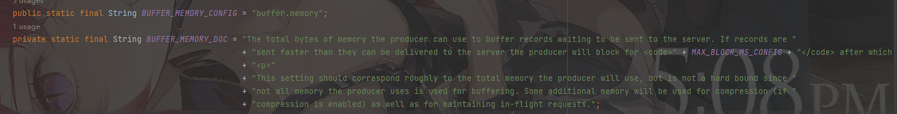

在`ProducerConfig`中有一类参数是 DOC结尾的，表示对应的文档。


## 2.6 数据可靠性

如何保证数据可靠性 。  生产者发送消息以后，需要等到`kafka`集群的消息确认`ack`才认为成功发送，否则会重试发送。


`Sender`线程 等待重试的策略有3种 ： 


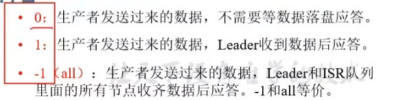


```java
properties.put(ProducerConfig.ACKS_CONFIG,-1);
```


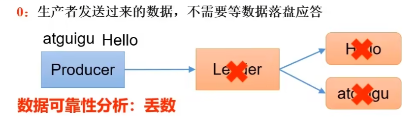


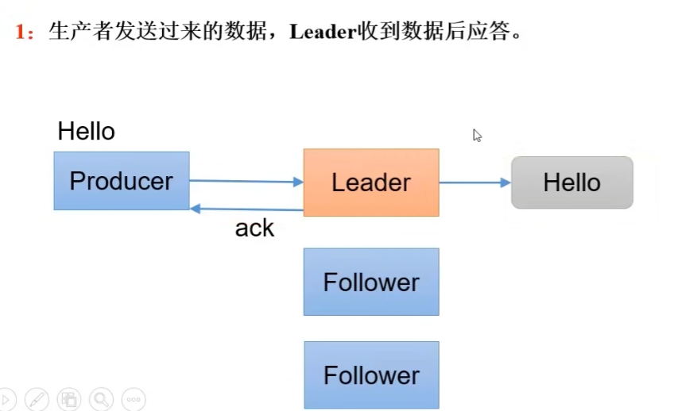


```
如果Leader挂了，但follower还没有同步数据，会丢失时数据
```


`-1 /all `


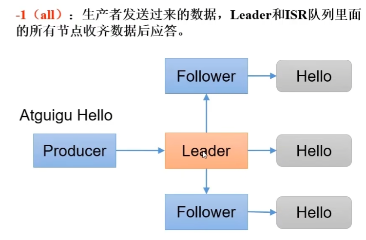


### 2.6.1 `ISR`

对于`-1` 模式来说 , `Leader`节点必须等待全部 `Follower`回应才能确认ack吗？

```
答案是不是,我们必须允许集群中某一部分节点宕机,集群仍能工作，这样才能符合高可用的特性。

如果整个集群因为某一个节点的宕机就瘫痪，整个集群的故障率会非常高。

因此kafka维护了一个 ISR(in-sync replica set) 同步复制品集合.只要整个ISR内的节点同步完成，就会回复ack确认。

如果某一个follower长时间未与Leader同步或请求数据,这个follower将会被提出ISR,ack的确认也不会参考这个follower
```


和`Leader`节点持续沟通，维持心跳的`Follower`被认为是 `ISR`的成员。 因为`ISR` 后续可能会通过选举成为`Leader`。


#### 2.6.1.1 `ISR` 过期时间

`ISR` 心跳过期时间，通过配置 `replica.lag.time.max.ms`   ，默认是30s。 超过阈`Follower`会被踢出`ISR`。


#### 2.6.1.2 `ISR` 最少副本数

配置`min.insync.replicas`， 修改 `ISR`集合中最少的副本数 ，默认是`1`。


```
表示ISR集合中最少的副本数，默认值是1  这意味着ISR可以最少减少到1 ，也就是只剩下Leader节点,此时已经不能称之为集群了。
消息的可靠性也无从保证了。


通常应该设置的值是大于等于2
```


### 2.6.2 Log flush Policy

日志刷盘策略。 我们知道`kafka` 是可以将消息日志刷新到磁盘上的，这样保证消息的可靠性。


默认情况下，`Kafka`的刷盘是`异步刷盘`，也就是说，把消息写进OS的`Page Cache`后，已经别当成【持久化成功】了，但是此时的消息可能还没有被`sync`到磁盘。


```
如果所有ISR的消息都在Page Cache上而不在磁盘中，整体掉电重启后，消息就再也无法被消费者消费到，那么消息也就丢失。


所以可以设置刷盘策略，在不满足 Page Cache的要求时,仍强制刷新到磁盘
```


在`server.properties`中有关于log的刷新策略

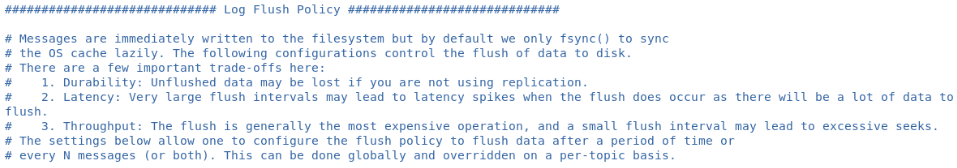


#### 2.6.2.1 两个刷盘配置


```properties
log.flush.interval.messages=10000
#当写入消息达到10000条以后，强制刷新到disk
log.flush.interval.ms=1000
#写入消息超时时间,每经过1000ms,就强制刷新一次disk
#意味着就算宕机，会丢失1000ms内且最后一次没有达到10000条的数据
```

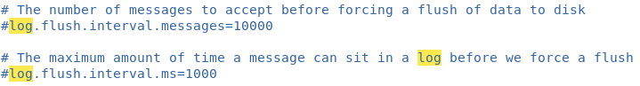


## 2.7 数据重复问题


### 2.7.0 数据传递语义

有2个数据传递语义 `at least once` 至少一次 ，  `at most once` 至多一次。


#### 2.7.0.1  `at least once`

保证`生产者`发送的【消息】至少被`kafka集群`存储一次, 有可能多次。


```
ack为-1，表示必须所有的ISR都收到消息以后才回应。
分区副本>=2 表示至少有2个副本数量。
ISR >=2 表示至少有1个Leader和1个Follower存活。
```

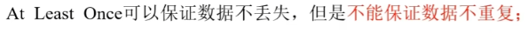

这样设置，保证消息`至少消费1次`


#### 2.7.0.2 `at monst once`

表示`生产者`发送的消息最多被`kafka`集群存储1次，有可能不会被存储。


#### 2.7.0.3  精确1次


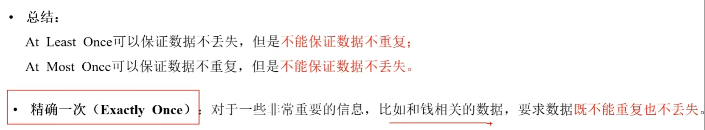


`kafka` 引入了`幂等性`和`事务`，解决了数据重复问题。


### 2.7.1 幂等性

参考 ： https://www.cnblogs.com/smartloli/p/11922639.html

` 幂等性` : 指无论 `Producer` 向`broker`重试了多少次同一条重复数据，`broker`只会持久化一条。

注意：这里的幂等，特指生产者端，为了不让生产者发送的【重复数据】，都被`kafka`集群接收。


由于`kafka` 属于分布式系统，会出现很多`re-try`的场景，例如 网络等问题导致`ack`超时，`Sender`会重新发送消息，可能会导致`Producer`重复发送消息，所以需要使用`幂等性`来解决。


#### 2.7.1.0 解决

参考 https://developer.aliyun.com/article/766690#


当 `<PID,Partition,SeqNumer>`三者完全相同，`kafka集群`认为是同一个数据，会丢弃。 


`PID(Producer ID)` : 每次`kafka`集群重启一次都会分配一个新的PID。   这意味着仅仅使用PID,只能保证单次会话内的幂等性。
如果重启了就不能保证幂等性，所以需要配合事务共同保证多次会话的幂等性 ， 更新PID用于屏蔽僵尸Producer
										    

```


Partition : 表示分区号          每个分区都会独立维护一个 <PID,SequenceNumber>对应关系         


Sequence Number ： 对于每一个PID， Producer发送数据的每个Topic和Partition都对应一个从0开始递增的SequencNumber	        
					
				   broker 只接受 SN_new = SN_old+1 的消息。
				   			当  SN_new <= SN_old 表明消息重复
				   			当  SN_new > SN_old+1 表明消息丢失，说明中间消息尚未写入，消息乱序，生产者抛出	
				   			OutOfOrderSequenceException

	
```


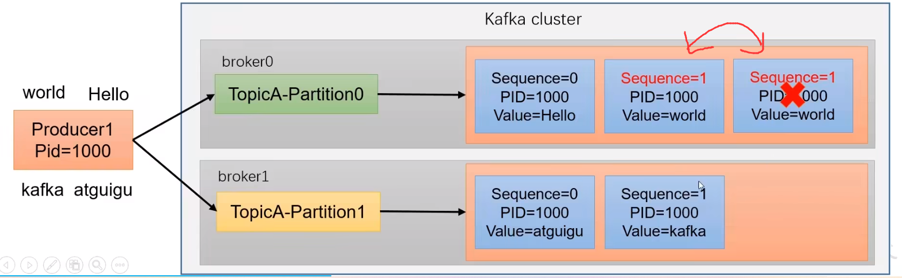


如果某一条数据的`PID,Parition,SequenceNumber` 完全重复，则该消息不会刷新到磁盘，直接在内存中丢弃。


幂等性只能保证`单分区`，`单会话`的幂等性 ， 不能跨多个分区运作， `kafka事务`可以弥补这个缺陷。


#### 2.7.1.1 开启幂等性

`enable.idempotence ` 开启幂等性。

```
enable.idempotence 默认就是 true 
```


### 2.7.2  事务

参考 https://www.jianshu.com/p/64c93065473e

​		https://blog.csdn.net/blade1122/article/details/106043159

`kafka`中事务特性主要用于2个场景：

1. 生产者发送多条消息可以封装在一个事务中，形成一个原子操作。多条消息要么同时成功，要么同时失败
2. `read-process-write`模式，将`消息消费`和`消息生产` 封装在一个事务中，形成原子操作。


```
当事务中仅仅存在Consumer消费消息的操作时，它和Consumer手动提交Offset并没有区别。
```


为了保证`Producer`    ，需要开启 `幂等性` + `事务`  + `至少1次`。


使用`事务`之前，必须开启`幂等性`。

```
Producer使用事务前，必须指定一个全局唯一的 事务id. 由于指定了全局唯一的事务id,就算客户端掉线了，重新上线以后仍能恢复事务。
```


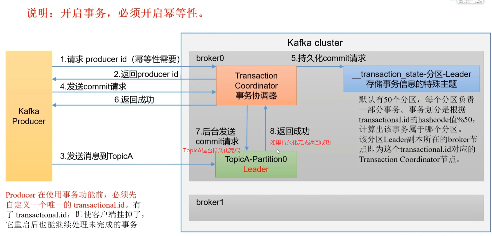


`事务协调器` ： 专门用于协调事务的。

`__transaction_state` ： 存储事务信息的特殊主题， 这个主题是存储在磁盘上的。


`transactional.id` : 事务ID， 每一个事务都必须有一个全局唯一的ID。


`Producer`在使用事务之前，必须有一个全局唯一的`transactional.id`，即使客户端宕机，重启后也能处理未完成的事务。


如何计算`事务协调器`的节点是哪一个`broker` ？

`__transaction_state` 默认有50个分区，`transactional.id` 的 `hashcode` 对50求余，所得分区的`Leader节点` 即为本次事务的 `事务协调器`。


为什么是对50求余，实际上是对

```
__consumer_offsets的值求余。  这个是kafka存放系统主题的分区数。默认是50
```


#### 2.7.2.1 事务的应用场景


1. `生产者`可以发送【多条消息】封装在同一个事务内，这些消息属于同一次原子操作。共同成功，共同失败。

   

2. `read-process-write`模式： 将消息消费和产生 封装在同一个事务中，形成一个原子操作。

   (在一个流式处理的应用中,常常一个服务从上游接收消息,经过处理后发送到下游服务, 这种场景可以封装在同一个事务中)


### 2.7.3 事务API


#### 2.7.3.1 `Producer`的事务API

```java
public void initTransactions();

public void beginTransaction() throws ProducerFencedException;

public void sendOffsetsToTransaction()
```


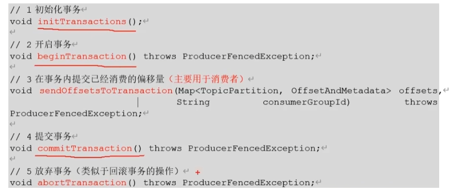


```java
public static void main(String[] args) {

        Properties properties = new Properties();
        properties.put(ProducerConfig.BOOTSTRAP_SERVERS_CONFIG,"bogon:9092");

        properties.put(ProducerConfig.KEY_SERIALIZER_CLASS_CONFIG, StringSerializer.class.getName());
        properties.put(ProducerConfig.VALUE_SERIALIZER_CLASS_CONFIG, StringSerializer.class.getName());
    	//设置全局唯一的 事务ID
        properties.put(ProducerConfig.TRANSACTIONAL_ID_CONFIG,"transaction_id_1");
    
        KafkaProducer<String,String> producer = new KafkaProducer<>(properties);
        try{
            producer.initTransactions();
            producer.beginTransaction();

            for (int i = 0; i <6; i++) {
                producer.send(new ProducerRecord<>("first","SEMGHH2"));
            }
            producer.commitTransaction();
        }catch (Exception e){
            e.printStackTrace();
            producer.abortTransaction();
        }finally {
            producer.close();
        }
    }
```


#### 2.7.3.2 `Consumer`的事务API


读取 `事务型Producer`发送的消息时，`Consumer`端的`isolation.level`参数 代表【事务的隔离级别】。


`isolation.level` 决定了`Consumer`以怎样的级别去读取消息。该参数有以下两个取值:

`read_uncommitted` : 读未提交

`read_committed` : 读已提交。


### 2.7.4 总结


1. Kafka所提供的消息精确一次消费的手段有两个：幂等性Producer和事务型Producer。
2. 幂等性Producer只能保证单会话、单分区上的消息幂等性；
3. 事务型Producer可以保证跨分区、跨会话间的幂等性；
4. 事务型Producer功能更为强大，但是同时，其效率也会比较低下。


## 2.8 数据有序

在很多场景下我们希望消费者生产的顺序，和消费者消费的顺序是一致的。


```
单分区内是有序的

分区之间是无序的
```


## 2.9 数据乱序


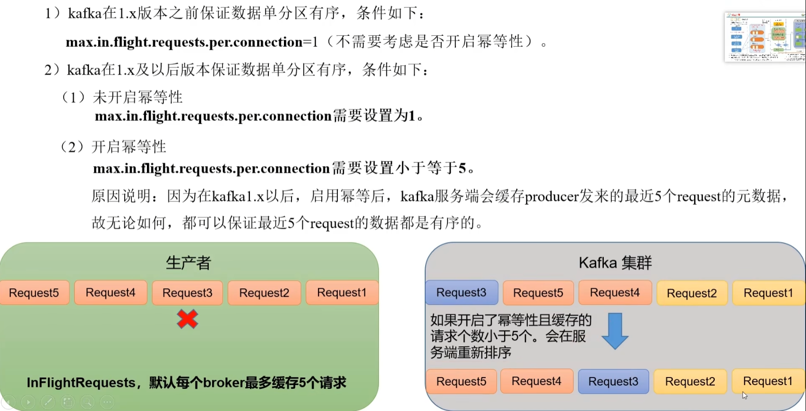


```
判断幂等性有个属性 <ProducerID,分区ID，单调递增的序号>

kafka集群缓存最近的5个请求元数据,假设请求3失效了。 集群先收到1和2是单调递增的，可以先刷盘。
3失效了，先收到4和5,发现不是递增,无法刷盘，会缓存在服务端。此时服务端最多缓存 4，5，6，7 ,一直等待3.
得到3以后，在服务端进行排序，然后刷新到磁盘
```


## 2.10 broker


### 2.10.1 zookeeper中存储信息

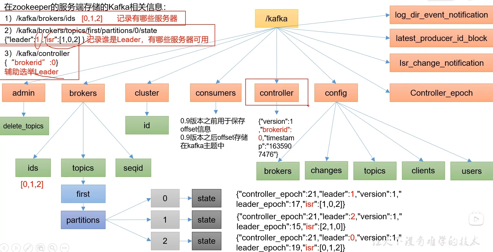


### 2.10.2 broker的总体工作流程


## 2.11 kafka副本


### 2.11.1 副本的作用

提高数据的可靠性。

```
如果数据只备份1个副本，如果机器挂掉，那么无法对外提供对应数据
```


默认情况下

```
kafka 默认副本1个，生产环境一般配置2个，保证数据可靠性。 过多的副本增加磁盘存储空间,网络传输压力。
```


### 2.11.2 副本类型

kafka的副本有2种:

```
leader 和 follower.  
```

kafka中生产者还是消费者，只会直接操作 Leader

```
生产者只会把数据发往Leader,follower找Leader进行同步数据。
```


### 2.11.3 名词解释

AR

```
kafka分区中所有的副本统称为AR  (Assigned Replicas)
```


ISR

```
表示和Leader保持同步的Follower集合。如果follower长时间（默认30秒）未向Leader发送通信请求或同步数据,则该Follower将被剔除ISR

该时间阈值参数：
replica.lag.time.max.ms


如果Leader发生故障,那么将从ISR中选举出新的Leader
```


OSR

```
表示与Leader沟通超时的Follower
```


## 2.12 Leader的选举流程


```
1.kafka 每启动一个节点，就会在zookeeper中注册节点信息。(/brokers/ids/ [0,1,2...])

2.每一个broker都有一个controller模块,谁先在zookeeper中抢先注册controller谁就是当前的Leader
```

选举规则： 在ISR中存活为前提，按照AR中排在前面的优先。 例如AR[1,0,2] isr[1,0,2] 那么Leader会按照1，0，2的顺序轮询。


```
3.选出Leader以后,会把 Leader的id ，ISR的ID 记录在zookeeper中。如果Leader挂掉了，就可以从zookeeper中拉取信息

4.当Leader节点掉线,其他的集群节点的controller监听到以后，将从zookeeper中拉取ISR信息，按照AR中排在前的优先
```


### 2.12.1 follower宕机


#### 2.12.1.1 名词解释

LEO （log end offset ） 每个副本最后一个offset+1 


HW （high  Watermark） 所有副本中最小的LEO

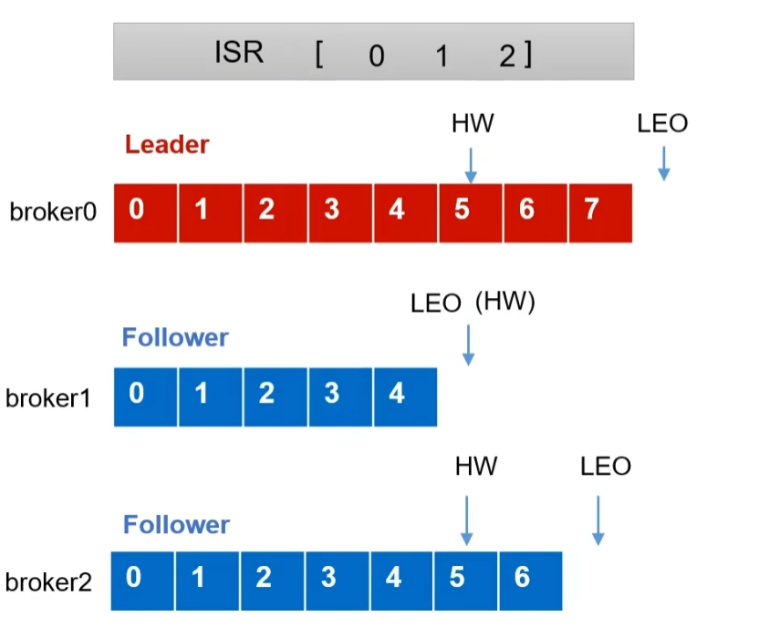


#### 2.12.1.2  过程


```
1. follow宕机以后，会从ISR中踢出
2. Leader和正常的Follower 正常接收数据
3. 如果follower恢复以后，会将上一次HW以后的数据全部删除，并从Leader重新同步最新数据 
4. 等待followr的LEO大于等于该分区的HW,就认为追上版本,可以重新加入ISR了
```


### 2.12.2 Leader 故障


```
1. Leader宕机以后,首先在AR中移除，并选举出新的Leader
2. 以新的Leader的LEO为准,其他followr的LEO如果高于Leader的LEO将全部截取掉
3. 然后Leader正常接收数据并同步。
4. 旧Leader恢复以后，变为follower节点,从Leader中同步数据
```


由于第2步的截取，当Leader节点宕机，有可能会出现数据丢失。所以只能保证数据是一致的，但不能保证数据不丢失。


## 2.13 分区副本分配

如果只有4个broker，kafka的分区数大于broker数量，如何分配分区？


```
那么会出现 1个broker负责多个分区的现象。
```


分区副本的分配尽量均匀分布。


### 2.13.1 手动调整分区分配

服务器的性能不同，可以手动调整分区的分配。让性能好的服务器承担较多的分区。


详细查看  [增加/减少 副本数量。 增加分区数量](# 4.2 分区/副本 机制)


## 2.14  文件存储机制


```
topic是逻辑上的概念，物理上的存储实际上是分区的概念。
每一个partition分区对应一个log文件。
```


```
每个log文件就是 Producer生产者产生的数据。 producer产生的数据会不断追加到log文件末尾。
```


kafka使用 分片和索引机制保证 log大文件的定位效率。

```
每个partition分为多个Segment,每个Segment包括   '.index'偏移量索引文件, '.log'日志文件等 ,'.timeindex'时间戳索引文件 等

每个Segment占1个G大小
```


这些文件位于同一个文件夹下。命名规则：  topic + 分区序号。 例如 `Semghh-0`


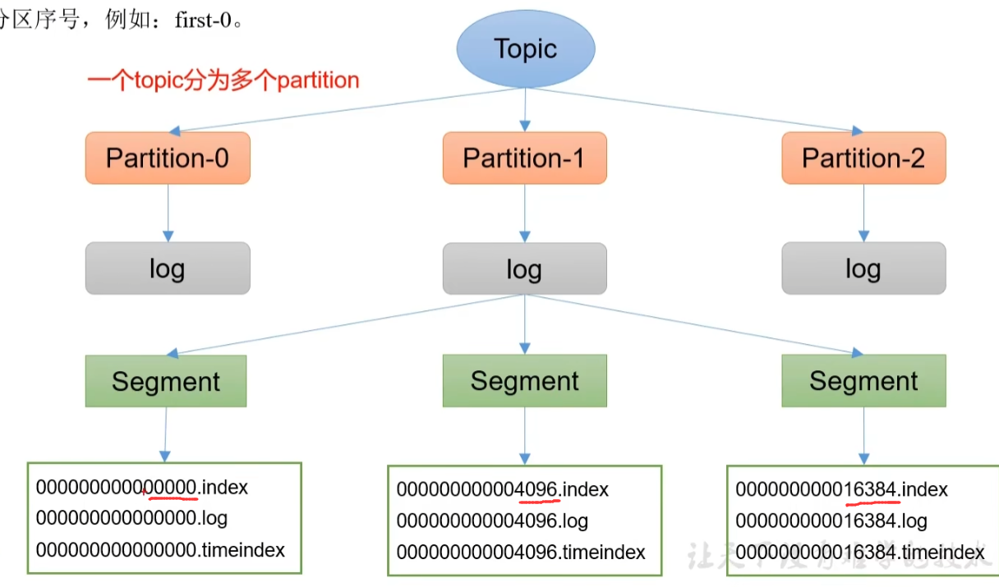


```
index , log , timeindex 文件是以Segment中第一个消息的offset命名
```


### 2.14.1 删除机制

kafka默认删除超过7天的数据。


### 2.14.2  查看.log文件


.log文件是经过序列化压缩过的，无法直接查看。kafa提供了工具命令查看  

```
kafka-run-class.sh kafka.tools.DumpLogSegments --files ./00000000000.index
```


### 2.14.3  索引结构

kafka采用稀疏索引。 即不按照消息的条数建立索引，而是按照固定大小建立索引。原因是：

```
不同的消息可能相差很大,索引的本意是减小搜索消息的区间条数。稀疏指的是消息条数，而不是大小。 Kafka按照固定的文件大小建立索引。避免消息过大，建立的索引并不能过滤掉很多信息，索引效率低下。 默认索引大小间隔是 4KB,极端情况下每一条消息都超过4KB，索引的意义就失效了。

同时支持参数配置 稀疏索引的大小，避免消息体积过小，建立的索引区间过大，减少搜索区间效率低下。
```


#### 2.14.3.1 索引过程

首先 .index文件的命名是以，首条记录的offset命名，通过文件名区间，锁定对应 index文件。


## 2.15 文件清除机制

默认清除7天前的数据。


### 2.15.1 过期时间,清除周期

通过配置参数可调整时间：

```
log.retention.hours
//默认168小时


log.retention.minutes
//默认null


log.retention.ms
//默认null


log.retention.check.interval.ms
//过期log文件检测周期,默认5分钟
```


### 2.15.2  对过期文件策略

kafka不仅可以清除过期的log文件，也可以对过期的log文件压缩保存。

```
log.cleanup.policy = <delete|compact>

//默认值 delete
```


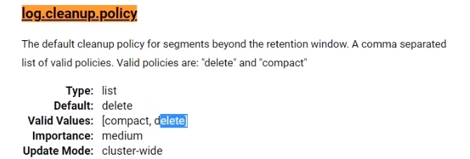


### 2.15.3 判定过期文件

有2种判定策略: 基于时间超时。 超过了最大日志占用磁盘总量

```
1.基于时间, 在一个Segment中,消息不总是一次写满整个Segment,当前Segment的时间戳以最后一条消息为准。这意味着有些消息可能存放时间超过设定的时间。

2.基于磁盘占用量。 设置超过所有日志总大小,删除最早的Segment

//配置参数  log.retention.bytes
//默认-1 表示 不开启
```


### 2.15.4 如何压缩？

kafka对于同一个key来说，只保留最后一次value

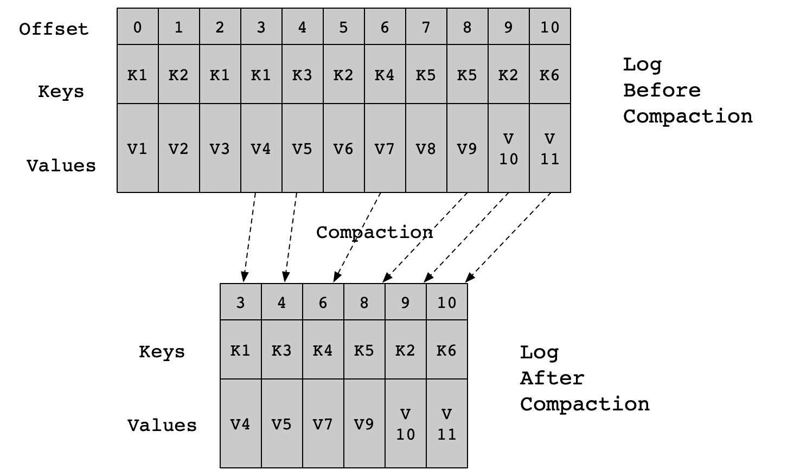


在消费offset2时，由于压缩的消息不存在2所以消费的是offset3

这会出现一个问题：消息的顺序会发生改变。


## 2.16 Leader Partition

Leader Partition的负载均衡。

```
我们知道kafak中, Consumer只与Leader分区沟通。这保证了消息的强一致性,这无疑会增加Leader节点的压力。
所以,我们一般让不同的分区leader分散在不同的broker中。事实上kafka也是这样做的
```

但是在生产过程中，一些broker宕机了，又恢复。此时leader不会重新回到原broker中。当一些Leader的broker宕机以后，leader partition会集中在一些机器上,压力很大。


如何解决？ 自动 leader partition

### 2.16.1 auto.leader.rebalance.enable

默认是true ,表示开启自动平衡。


触发自动平衡的阈值：

```
leader.imbalance.per.broker.percentage 默认是10%

//每个broker允许的不平衡的leader的比率，如果超过设定值，则触发
```


阈值的检测时间：

```
leader.imbalance.check.interval.seconds 

// 默认是300秒
```


### 2.16.2 计算不平衡数

我们知道，kafka会尽量均匀分配每个分区的副本。即

在AR中，尽量错位均匀分部副本。

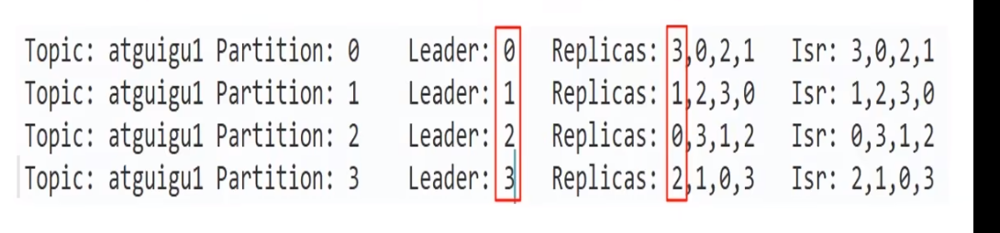


那么当： AR中的最优先节点和对应的Leader不一致时，增加不平衡数1

```
由于AR的分布是均匀的,当Leader与AR的优先级不匹配,则认为不平衡。 什么会导致不平衡?节点宕机，过多个leader在同一个broker
```


示例，如上图：

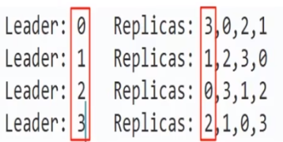


不平衡数为3,总分区数为4,不平衡百分比 3/4 大于10就会触发


## 2.17  高效读写

kafka怎么保证的高效读写？
```
1. kafka 支持分布式集群，多个集群共同维护一个topic的不同分区。每个分区都有一个Leader负责读写。

2.使用了索引文件,提高消息检索能力。具体是 稀疏索引

3.顺序写磁盘,与零拷贝技术

# 写log文件时追加的方式写, 
# 零拷贝技术: 从生产者获取到消息到内存,经过 OS的 page cache存储到磁盘以后，消费者消费消息时无需经过内存。
```


# 3. 详细的方法和类


## 3.1  key,value 序列化器

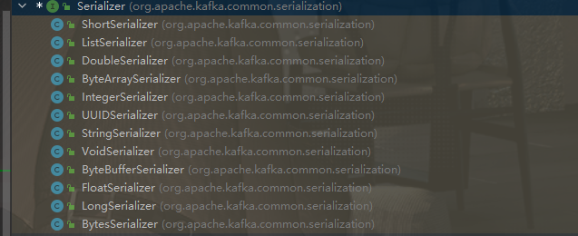


## 3.2 Producer

kafka生产者接口。有2个实现类


### 3.2.1 构造参数

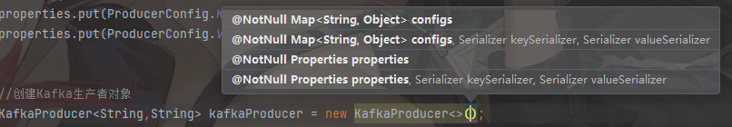


需要传入配置项和序列化器。


### 3.2.2 接口方法

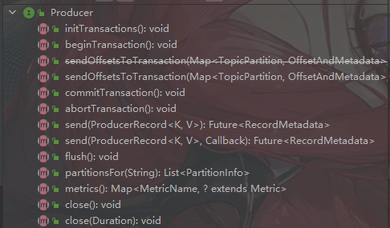


#### 3.2.2.1 send()

发送消息到指定topic,也可以传入一个回调。当消息发送以后，调用回调。

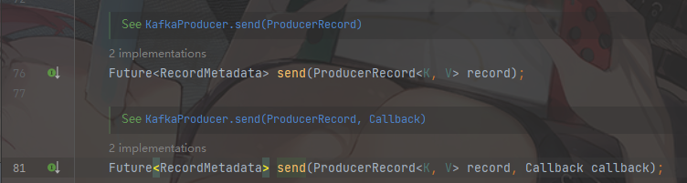


CallBack接口


## 3.3 ProducerRecord

直译生产者记录，代表了一条消息。

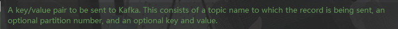

```
代表了一个发送给kafka集群的 键值对. 
这个类由一个topic Name(用于指定将要发送到哪个topic), 一个可选的分区数，可选的key,和必选的value组成
```


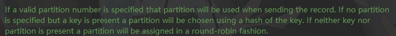

```
如果制定了一个合法的分区数，那么这条record将会被发送到指定分区。

如果没有对应分区，但record存在一个key，那么将会发往这个key的 hash值

如果 对应分区和key都不存在，那么将会采用轮询的方式(粘性分区)
```


### 3.4.1 构造方法

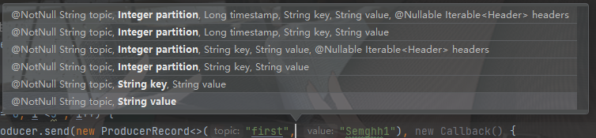


## 3.4 Callback


```
例如用于 Producer.send()中的一个参数。
```


```
Callback接口允许开发者在request完成以后，实现自定义代码去执行。

callback函数将会在上下文IO线程有序的执行。目的是callback函数可以很快的被执行。
```


### 3.4.1 接口方法

函数式接口，只有1个方法。

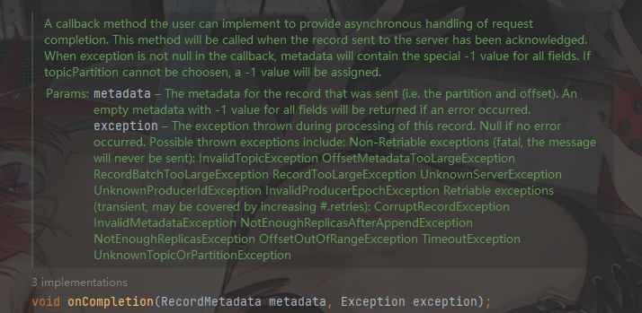


```
仅当record被通知已经发送到kafka集群以后,这个方法才会被调用。
```

这个回调方法传入的参数有： `RecordMetadata`  record元数据  , `Exception`  本次发送的异常信息(如果出现错误的话) 

```
如果本次发送没有异常，Exception将会是null
```


## 3.5  RecordMetadata


```
被Server通知时 一条Record对应的元数据。
```


### 3.5.1 public类方法


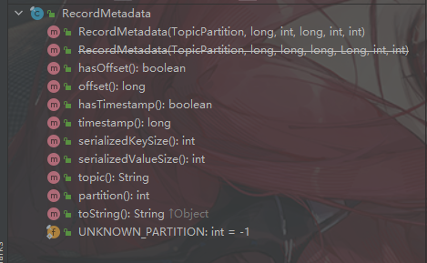


#### hasTimestamp

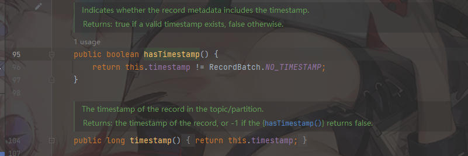


```
返回本条数据是否包含时间戳。
```


#### topic()


#### partition


```
返回record发往的分区
```


#### hasOffset

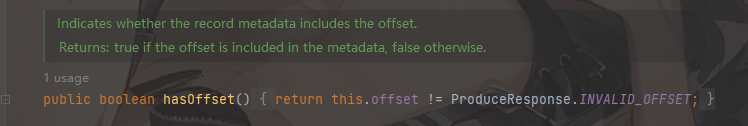

```
返回元数据中是否包含偏移量。
```


#### offset


```
本条record在 topic或者分区的偏移量
```


#### serializedKeySize


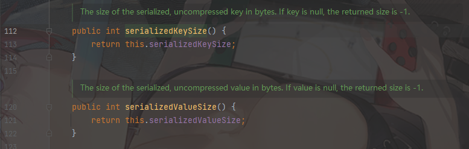


## 3.6 TopicPartition

主题分区。 在消费者订阅某个主题的某个分区时，使用的类。


```
代表了一个主题，以及分区数
```


对外提供的方法非常简单


## 3.7  KafkaConsumer


```
这个类代表   从Kafka集群中消费记录的客户端。
```


### 3.7.1 实例方法 


#### 3.7.1.1  assignment


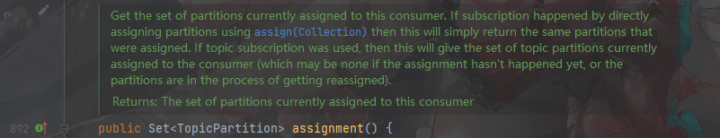


```
把当前主题的， 消费者组内的分区分配方案返回给当前的Consumer。


这个方法是一个立即返回的方法。如果此时分区消费方案还没有制定完毕,那么此时它将返回Empty
```


由于是立即返回的方法，在使用的时候就需要配合轮询使用。

```java
        //订阅主题
        List<String> topics = Arrays.asList("first");
        consumer.subscribe(topics);

        //消费方案
        Set<TopicPartition> assignment = consumer.assignment();

        while (assignment.isEmpty()){
            consumer.poll(Duration.ofSeconds(1));
            assignment = consumer.assignment();
        }

        System.out.println(assignment);
```


#### 3.7.1.2  seek(TopicPartition,long)

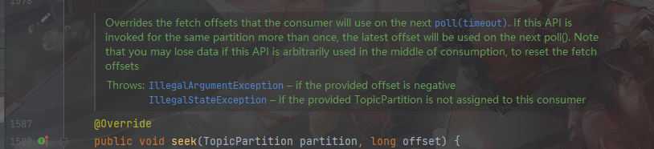


```
把消费者下一次poll()方法的 offset 覆盖位指定 offset.

如果对于用一个分区，调用本API多次，那么最新的offset将会在下一次poll中生效。
```


#### 3.7.1.2  offsetForTimes()

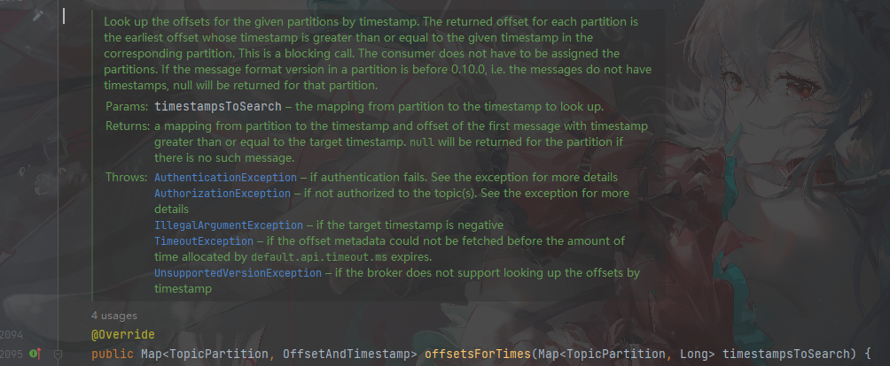

```java
public Map<TopicPartition, OffsetAndTimestamp> offsetsForTimes(Map<TopicPartition, Long> timestampsToSearch);
```


```
以给定的时间戳，寻找对应分区的 offset值。


对于每一个分区来说,返回的 offset值,是【第一个】大于等于给定时间戳的offset。 


这个调用是一个阻塞调用,返回的offset一定不会为空。
```


# 4. 生产功能点


## 4.1 节点服役


### 4.1.1修改新服役节点的配置文件

```
broker.id =  
#需要唯一
```


重新配置主题的负载 .

### 4.1.2 需要配置一个json文件

```
{
	"topics":[
		{"topic":"first"}
	],
	"version":1
}
```


### 4.1.3 生成一个负载均衡计划


```sh
./kafka-reassign-partitions.sh --bootstrap-server bogon:9092 --topics-to-move-json-file ./move.json --broker-list "0,2" --generate

Current partition replica assignment
```


### 4.1.4 新增副本存储计划  

也是一个 json文件

```
```


## 4.2 分区/副本 机制


### 4.2.1 分区

参考 ： https://www.cnblogs.com/listenfwind/p/12465409.html


```
从数据组织形式来说，kafka有三层形式，kafka有多个主题，每个主题有多个分区，每个分区又有多条消息。


每个分区可以分布到不同的机器上，这样一来，从服务端来说，分区可以实现高伸缩性，以及负载均衡，动态调节的能力。
```


### 4.2.2 副本

每一个分区，都可以有多个副本。在所有副本中，只有1个Leader。只有Leader对外提供服务，follower仅仅同步数据

```
多个follower通常存放在与 leader所在的broker不同的 其他borker ,保证了高可用。
```


仅有一个Leader会有什么优劣？

```
首先一定会保证数据的强一致性。 缺点就是Leader节点的压力比较大,但是kafka会让Leader分区分散，减少单点压力
```


### 4.2.3 新增副本

```
在kafka中副本也叫  副本引子
```


1.准备一个 对应的json

```json
{"version":1,
  "partitions":[
     {"topic":"first","partition":0,"replicas":[0,2]},
     {"topic":"first","partition":1,"replicas":[0,2]},
]}
```

```
新增的副本在 replicas数组中体现：  "replicas":[0,1,2,3]
```


2. 执行对应命令：

```sh
bin/kafka-reassign-partitions.sh --bootstrap-server <host:port> --reassignment-json-file <jsonFile> --execute

# <host:port> 地址和端口号
# <jsonFile>  json文件地址
```


示例:

```sh
[root@bogon bin]# kafka-reassign-partitions.sh --bootstrap-server bogon:9092 --reassignment-json-file ./partition.json --execute

Current partition replica assignment

{"version":1,"partitions":[{"topic":"first","partition":0,"replicas":[0],"log_dirs":["any"]},{"topic":"first","partition":1,"replicas":[2,0],"log_dirs":["any","any"]}]}

Save this to use as the --reassignment-json-file option during rollback
#如果kafka会输出被覆盖掉的旧配置,便于回退版本
```


3. 检查一下主题详细信息。

```sh
kafka-topics.sh --bootstrap-server bogon:9092 --topic first --describe
```


```sh
Topic: first	TopicId: VIatAGZeS76Yy458_EImIA	PartitionCount: 2	ReplicationFactor: 1	Configs: segment.bytes=1073741824
	Topic: first	Partition: 0	Leader: 0	Replicas: 0	Isr: 0
	Topic: first	Partition: 1	Leader: 0	Replicas: 0	Isr: 0
```


### 4.2.4 新增分区


使用 `-alter` 命令 ，`–partition` 参数修改分区数量。  分区只能增加，不能减少

```sh
bin/kafka-topics.sh --alter --partitions <partNumber>  --topic <topicName> --bootstrap-server <host:port>

# <partNumber> 分区的数量
# <topicName> 主题名称
# <host:port> 主机名称和端口号
```


# 5. 消费者


## 5.1  消费方式


通常来说 消息消费方式有2种：

```
1. 消费者主动去 kafka集群拉取

2. kafka集群主动推送新消息到消费者
```


kafka集群选择的是拉取的方式。

```
拉取的方式,照顾了不同消费者消费速度不同。 处理速度快的消费者可以消费更多的数据。

但,如果kafka集群已经没有消息了，此时消费者仍会陷入循环消费空数据
```


## 5.2  消费者总体工作流程

粗略的描述流程。


```
 消费者与消费者之间是独立的,不会冲突。
 
 1个消费者可以消费多个分区的数据。
```


消费者组：

```
每个分区的数据，不允许一个分区对应多个消费者。 但消费者可以对应多个分区
```


如果消费者突然挂了，等到消费者恢复以后，希望接着上次的内容重新消费。如何实现？

```
使用offset , offset由消费者提交到 系统主题中保存。  __consumer_offsets
```


## 5.3 消费者组


```
消费者组之间互不影响。
消费者组内一个分区不能同时被两个消费者消费。允许组内1个消费者消费多个分区。 即 消费者对分区是 1对多的关系

#目的就是保证消费者组内消息不重复消费。
# 这意味着 一个消费者组内消费者的数量最多等于分区数量。
```


## 5.4 消费者组的初始化


### 5.4.1 协调器

coordinator: 协调器，用于辅助消费者组的初始化和分区分配。（服务于消费者组）

```
分区分配指: 同一个消费者组内,哪些消费者消费哪些分区。
```


每一个broker上都有一个 coordinator，这意味着每个broker都必须承担一部分的协调工作。


如何确定当前的 consumer group 是由哪个协调器来初始化呢？

```
1. 每一个 Consumer Group 都必须指定一个 group id
2. group id的hash值对 __consumer_offsets的值进行求余
```


### 5.4.2 创建消费者组的流程


```
1. 消费者group内的所有消费者向 协调器发出 joinGroup请求
2. 协调器在所有消费者内选出一个Leader消费者, 在Leader消费者内指定 消费方案
3. 消费者Leader把消费计划发送给协调者，由协调者通知其他节点消费计划

4. 消费者需要和coordinatro协调者维持一个心跳。默认3秒, 如果达到超时间(session.timeout.ms=45s)，消费者就会被移除。
	同时触发再平衡，让其他的消费者消费对应的分区消息，保证消息不丢失。
	如果消费者处理消息时间过长(max.poll.interval.ms)超过5分钟，即使保证心跳也会触发再平衡。
```


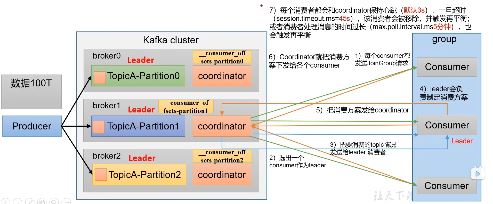


## 5.5 消费流程


//TODO


## 5.6  消费者API


### 5.6.1 独立消费者订阅某一个主题

```java
public class Consumer {

    public static volatile boolean flag = false;

    public static void main(String[] args) {


        Properties properties = new Properties();
        properties.put(ConsumerConfig.BOOTSTRAP_SERVERS_CONFIG,"bogon:9092");
        properties.put(ConsumerConfig.KEY_DESERIALIZER_CLASS_CONFIG, StringDeserializer.class.getName());
        properties.put(ConsumerConfig.VALUE_DESERIALIZER_CLASS_CONFIG,StringDeserializer.class.getName());
        //配置消费者组名
        properties.put(ConsumerConfig.GROUP_ID_CONFIG,"consumer_group_1");


        try(KafkaConsumer<String,String> consumer = new KafkaConsumer<>(properties);){
            List<String> topics = Arrays.asList("first");
            consumer.subscribe(topics);
            while (true){
                if (flag){
                    break;
                }
                ConsumerRecords<String, String> poll = consumer.poll(Duration.ofSeconds(1));

                poll.forEach(x->{
                    System.out.println(x.value());
                });
            }
        }
    }
}
```


### 5.6.2 消费主题的某个分区


需要关键类 `TopicPartition`


```java
    public static volatile boolean BREAK_FLAG = false;

	private static final String TOPIC = "signal";

    private static final int PARTITION = 0;

public static void main(String[] args) {

//    	... 省略配置信息
        try(KafkaConsumer<String, String> consumer = new KafkaConsumer<String, String>(properties);){

            consumer.assign(Arrays.asList(new TopicPartition(TOPIC,PARTITION)));

            while (true){
                if (BREAK_FLAG){
                    break;
                }
                ConsumerRecords<String, String> poll = consumer.poll(Duration.ofSeconds(5));
                
//                ... 省略消费
            }
        }
    }
```


### 5.6.3 创建消费者组

在创建消费者的 Properties文件中配置 `ConsumerConfig.GROUP_ID_CONFIG` 相同，则为同一个消费者组。


```
kafka不会检测同一个topic的同一个分区被2个消费者同时消费的情况。但更多的业务上，我们不需要这样重复消费
```


```
如果消费者没有指定消费分区,且消费者组内消费者的数量=分区数量，那么每一个消费者负责一个分区。
```


## 5.7 分区分配策略

分区分配策略指的是：一个topic的多个分区，到底由哪个消费者来消费。


kafka有4种主流分区分配策略：

```
Range
RoundRobin
Sticky
CooperativeSticky
```

通过 partition.assignment.strategy修改分区的分配策略

默认策略是： Range + CooperativeSticky


### 5.7.1 Range

适用于分区数>消费者的场景：

```
1.首先给分区和消费者排序
2. 消费者承担的消费分区数量=   分区数/消费者数
3. 如果除不尽,余数让排在前面的消费者+1
```


range策略是针对一每个topic而言的。

如果很多的topic都除不尽，那么最终会导致排序靠前的消费者压力非常大。导致数据倾斜。


```
假设7个分区，3个消费者

consumer0 : 0,1,2
consumer1 : 3,4
consumer2 : 5,6
```


### 5.7.2 RoundRobin

轮询.

把分区和消费者按照hash排序。然后轮询


### 5.7.3 Sticky

粘性

```
尽量均匀，且随机
```


## 5.8  offset

offset为每一个分区的每一个消息标了序号。 

在消费者这里可以用于表示当前已经消费的消息进度。


```
offset可以避免消息的重复消费等作用。
```


### 5.8.1 offset默认维护的位置

每一个消息都有一个唯一的offset，最新的offset的下一个值维护在 `__consumer_offsets`中。

在0.9版本以前 `__consumer_offsets` 维护在zookeeper中，后维护到kafka集群中。

```
原因是每一个consumer都会和zookeeper通信，会带来网络IO压力
```


### 5.8.2  自动offset

kafka提供了自动提交offset的功能。


相关参数

```
enable.auto.commit:true  
# 默认开启自动提交功能，默认true

auto.commit.interval.ms:5000
#自动提交offset的间隔 ,默认5s
```


```java
        //自动提交
        properties.put(ConsumerConfig.ENABLE_AUTO_COMMIT_CONFIG,true);
        //自动提交时间间隔
        properties.put(ConsumerConfig.AUTO_COMMIT_INTERVAL_MS_CONFIG,1000);
```


### 5.8.3 手动offset

offset的提交，和消息的消费息息相关。  绝对安全的情况下，每次消费一条数据，并完成offset提交以后才算完整的消费。

```
但这样会导致消费的速度大大降低。
```


同时,offset记录了消费者消费的偏移量，在kafka集群认为offset才是消费者的消费位置 ，虽然此时consumer可能已经消费了更多的消息，但还没有来得及提交offset。


总之，kafka提供了一种手动提交offset的方式，用于管理消息的更安全消费。

如果你不是很能体会 offset为什么有这么重要的作用,那么继续看下文提交offset的流程。


手动提交offset有2种策略：

```
同步手动提交

异步手动提交
```


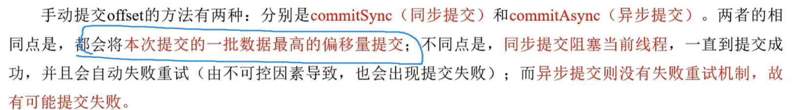


#### 5.8.3.1 同步手动提交

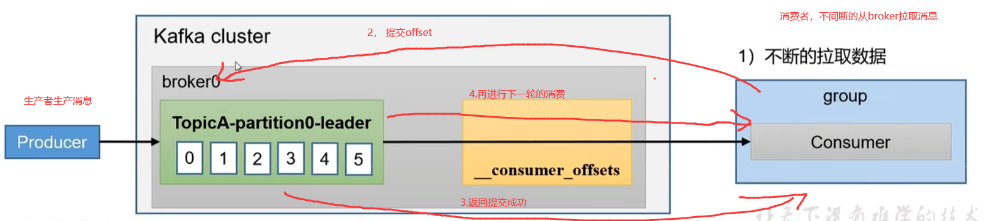

```
对于手动的，同步提交。 消费者必须等待 offset提交完成的结果以后，才继续消费。
```


```java
package consumer;

import org.apache.kafka.clients.consumer.ConsumerConfig;
import org.apache.kafka.clients.consumer.ConsumerRecords;
import org.apache.kafka.clients.consumer.KafkaConsumer;
import org.apache.kafka.common.serialization.StringDeserializer;

import java.time.Duration;
import java.util.Arrays;
import java.util.List;
import java.util.Properties;

/**
 * @author SemgHH
 */
public class ConsumerSyncCommit {
    
    public static volatile boolean flag = false;
    
    public static void main(String[] args) {

        Properties properties = new Properties();
        properties.put(ConsumerConfig.BOOTSTRAP_SERVERS_CONFIG,"bogon:9092");
        properties.put(ConsumerConfig.KEY_DESERIALIZER_CLASS_CONFIG, StringDeserializer.class.getName());
        properties.put(ConsumerConfig.VALUE_DESERIALIZER_CLASS_CONFIG,StringDeserializer.class.getName());
        properties.put(ConsumerConfig.GROUP_ID_CONFIG,"consumer_group_sync_commit_1");

        //配置手动提交
        properties.put(ConsumerConfig.ENABLE_AUTO_COMMIT_CONFIG,false);


        try(KafkaConsumer<String,String> consumer = new KafkaConsumer<>(properties);){
            List<String> topics = Arrays.asList("first");
            consumer.subscribe(topics);
            while (true){
                if (flag){
                    break;
                }
                ConsumerRecords<String, String> poll = consumer.poll(Duration.ofSeconds(1));
                poll.forEach(x->{
                    System.out.println(x.value());
                });
                //手动提交
                consumer.commitSync();
                //异步提交
//                consumer.commitAsync();
            }
        }
    }
}
```


#### 5.8.3.2 异步手动提交

只能把提交offset的动作交给开发者。但不会同步等待offset的相应结果


### 5.8.4 指定offset消费

经过kafka转发的消息，都将被持久化到磁盘中(还未被清理)。 

因此：

新上线的 `Consumer` 节点可以选择，从一开始的offset开始读取消息。 也可以选择从最新的 offset开始监听，等待后续的消息读取。


kafka提供了3种消费offset的模式

```
1. earliest  //从头开始消费
2. latest    //默认, 从最新开始消费，历史数据不再读取
3. none      //
```


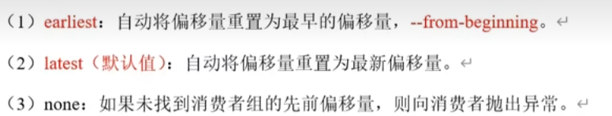


#### 5.8.4.1 KafkaConsumer.seek

调用`kafkaConsumer.seek()` 方法来指定 分区offset


```java
public static void main(String[] args) {


        Properties properties = new Properties();
        properties.put(ConsumerConfig.BOOTSTRAP_SERVERS_CONFIG,"bogon:9092");
        properties.put(ConsumerConfig.GROUP_ID_CONFIG,"consumer_group_any_offset_4");
        properties.put(ConsumerConfig.KEY_DESERIALIZER_CLASS_CONFIG, StringDeserializer.class.getName());
        properties.put(ConsumerConfig.VALUE_DESERIALIZER_CLASS_CONFIG,StringDeserializer.class.getName());

        properties.put(ConsumerConfig.ENABLE_AUTO_COMMIT_CONFIG,false);


        KafkaConsumer<String, String> consumer = new KafkaConsumer<String, String>(properties);


        //订阅主题
        List<String> topics = Arrays.asList("aaa");
        consumer.subscribe(topics);

        //
        Set<TopicPartition> assignment = consumer.assignment();
    
    		
        while (assignment.isEmpty()){
            consumer.poll(Duration.ofSeconds(1));
            assignment = consumer.assignment();
        }

        System.out.println(assignment);

        //指定消费的offset
        for (TopicPartition topicPartition : assignment) {
            consumer.seek(topicPartition,100);
        }
        while (true){
            ConsumerRecords<String, String> poll = consumer.poll(Duration.ofSeconds(1));
            poll.forEach(System.out::println);
        }
    }
```


### 5.8.5 按照指定时间消费


使用 `KafkaConsumer`的 `offsetForTimes()` 方法帮助完成对应逻辑。


代码如下：


```java

    static long ONE_DAY_MS = 1000*60*60*24;


    public static void main(String[] args) {

		//创建KafkaConsumer
        Properties properties = new Properties();
        properties.put(ConsumerConfig.BOOTSTRAP_SERVERS_CONFIG,"bogon:9092");
        properties.put(ConsumerConfig.GROUP_ID_CONFIG,"consumer_group_any_offset_5");
        properties.put(ConsumerConfig.KEY_DESERIALIZER_CLASS_CONFIG, StringDeserializer.class.getName());
        properties.put(ConsumerConfig.VALUE_DESERIALIZER_CLASS_CONFIG,StringDeserializer.class.getName());

        properties.put(ConsumerConfig.ENABLE_AUTO_COMMIT_CONFIG,false);

        KafkaConsumer<String, String> consumer = new KafkaConsumer<String, String>(properties);


        //订阅主题
        List<String> topics = Arrays.asList("aaa");
        consumer.subscribe(topics);

        //消费方案
        Set<TopicPartition> assignment = consumer.assignment();

        while (assignment.isEmpty()){
            consumer.poll(Duration.ofSeconds(1));
            assignment = consumer.assignment();
        }

        System.out.println(assignment);


        HashMap<TopicPartition,Long> hashMap = new HashMap<>();
        for (TopicPartition topicPartition : assignment) {
            hashMap.put(topicPartition,System.currentTimeMillis()-ONE_DAY_MS*1);
        }
        //返回各个分区,相对于指定时间偏移下的 offset值
        Map<TopicPartition, OffsetAndTimestamp> offsetAgainstTime = consumer.offsetsForTimes(hashMap);


        //指定消费的offset
        for (TopicPartition topicPartition : assignment) {
            //将获得的 offset设置对应的消费, 可以实现按照指定时间消费
            consumer.seek(topicPartition,offsetAgainstTime.get(topicPartition).offset());
        }

        while (true){
            ConsumerRecords<String, String> poll = consumer.poll(Duration.ofSeconds(1));
            poll.forEach(System.out::println);
        }
    }
```


### 5.8.6 重复消费 , 漏消费

`重复消费` : 明明消费过，但是根据 `offset`获取以后，造成消息重复消费。


#### 5.8.6.1 重复消费

##### 重复消费场景1:


自动提交offset，新的offset还没有提交，`consumer`宕机了，恢复以后，会根据【上次消费提交的offset】 继续消费。 

此时会消费【宕机前】那些还没有来得及提交`offset`的消息。

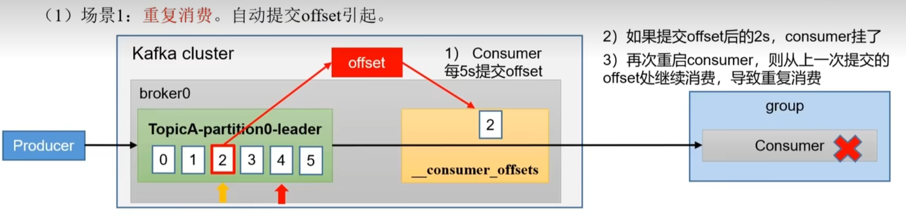


##### 重复消费场景2 ： 

自动提交也会引起


```
就算同步自动提交,消费1个,提交一次。也会出现重复消费。


如果消费完成，下一步要同步offset时宕机。重启以后仍然使用旧的offset消费。
```


#### 5.8.6.2 漏消费

`漏消费` : 明明没有消费过，但是却跳过了`offset`


##### 漏消费场景1 :


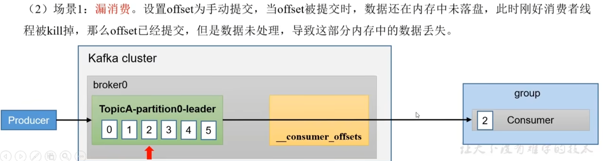


```
手动提交到kafka集群以后,此时在数据库做出的修改，还没有刷新到磁盘中。如果此时宕机,重新恢复的Consumer将接着offset消费。
```


本质原因就是 `提交offset` 和 `实际消费动作`不是一个原子操作。


### 5.8.7  消息积压


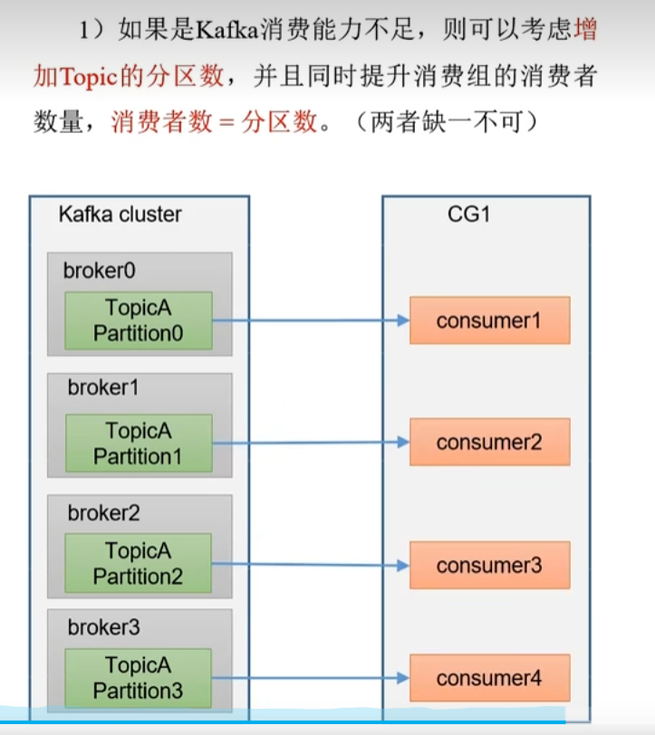


# 6. Kafka-Kraft


Kafka 不再依赖于Zookeeper，好处如下

```
1. 不再依赖外部依赖,可以独立部署运行
2. controller在管理集群时，不再需要和zookeeper进行通讯，集群性能提升
3. 集群扩展能力不再受限于zookeeper
4. 升级版本时，无需考虑zookeeper同步升级版本
```


## 6.1 启动Kraft模式


### 6.1.1 修改对应配置文件

```
在config/kraft/server.properties
```


`process.roles`


```
每一个节点可以配置不同的角色
```


`node.id`

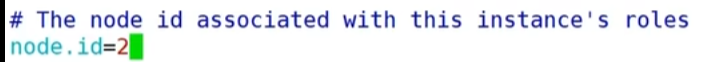

```
全局唯一ID
```


配置选举，需要配置对应的主机和端口。


对外暴露的端口，需要改成自己的主机名。

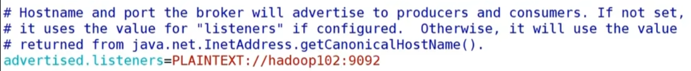


### 6.1.2 需要生成序列化ID 

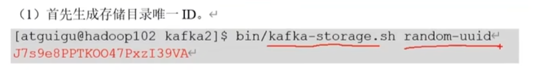


### 6.1.3 格式化目录

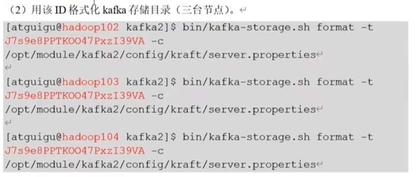


```shell
./kafka-storage.sh random-uuid
XkNXWP7ZRCqj_V_dMGm_3A

./kafka-storage.sh format -t XkNXWP7ZRCqj_V_dMGm_3A -c ../config/kraft/server.properties
```


启动服务,测试

```shell
./kafka-server-start.sh ../config/kraft/server.properties


./kafka-topics.sh --bootstrap-server bogon:9092 --list
```


# 7. Kafka生产调优


## 7.1 硬件选择


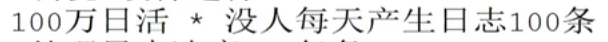


平均的流量流量速率：


每条日志大概在  0.5KB-2KB之间


那么总的流量速率大概是  1150*1KB/s =   1MB/s


流量峰值一半是平均值的  20倍 ：  20MB/s


服务器的台数？

经验公式：  台数 =  2*（流量峰值速率 * 副本数量/100）+1


磁盘选择？

kafka顺序读写，机械硬盘和固态硬盘速度差不多。选用机械硬盘


数据量大小： 1亿条 * 1KB = 100G

100G * 副本数 * 天数  / 0.7  (预留30%的空间) 


内存选择？

kafka 堆内存(JVM 堆区 ，通常10G-15G  ) + 页缓存


cpu选择

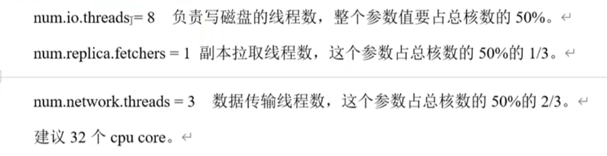


网卡

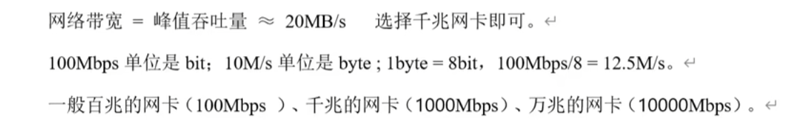


# 8. 消息队列的通用知识点


## 8.1 各个消息队列的对比


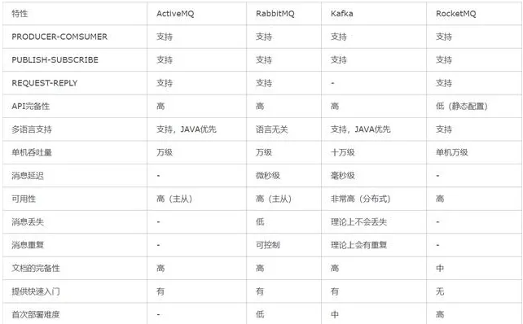


单机吞吐量： `kafka` 是十万级别，最高的。

可用性 ： 其他都是主从，`kafka`是分布式的，可用性上非常高。


