其他笔记索引

[高并发程序设计](http://semghh.xyz:10087/高并发程序设计.html)

[SpringBoot](http://semghh.xyz:10087/Springboot.html)

[redis](http://semghh.xyz:10087/redis.html)

[jvm](http://semghh.xyz:10087/jvm.html)

[LeetCode](http://semghh.xyz:10087/LeetCode.html))


# 1.链表


链表 和 指针结合的非常紧密。

常用思想： 快慢指针。 Dummy哨兵指针。

做链表的题 一定不要吝啬指针。多尝试使用几个指针。

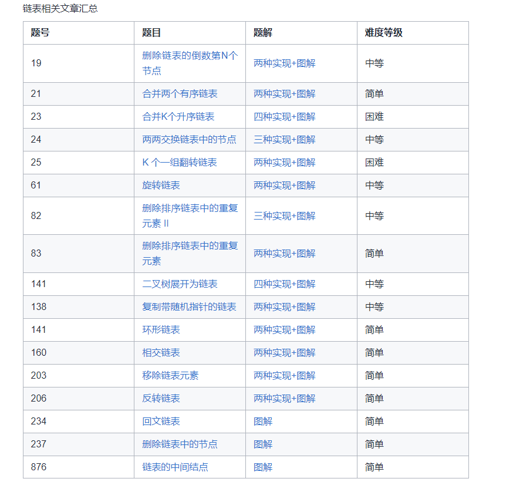


## 1.1 相交链表

Y型链表

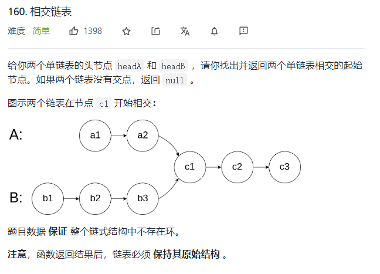

https://leetcode-cn.com/problems/intersection-of-two-linked-lists/


## 1.3 链表反转

### 1.3.1 基础

https://leetcode-cn.com/problems/reverse-linked-list/

```
要求迭代和递归。
```


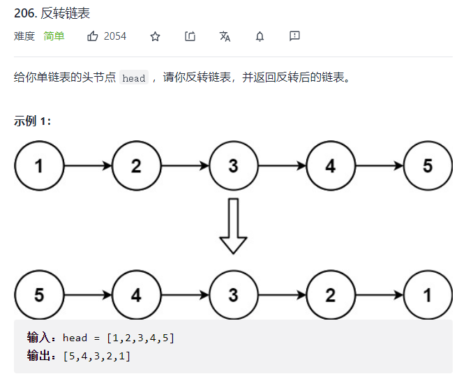


### 1.3.2 变形


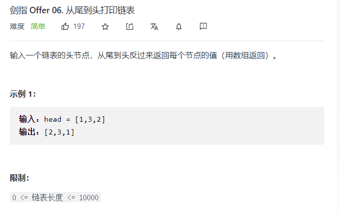


## 1.4 删除链表


### 1.4.1 删除链表中的节点


https://leetcode-cn.com/problems/delete-node-in-a-linked-list/

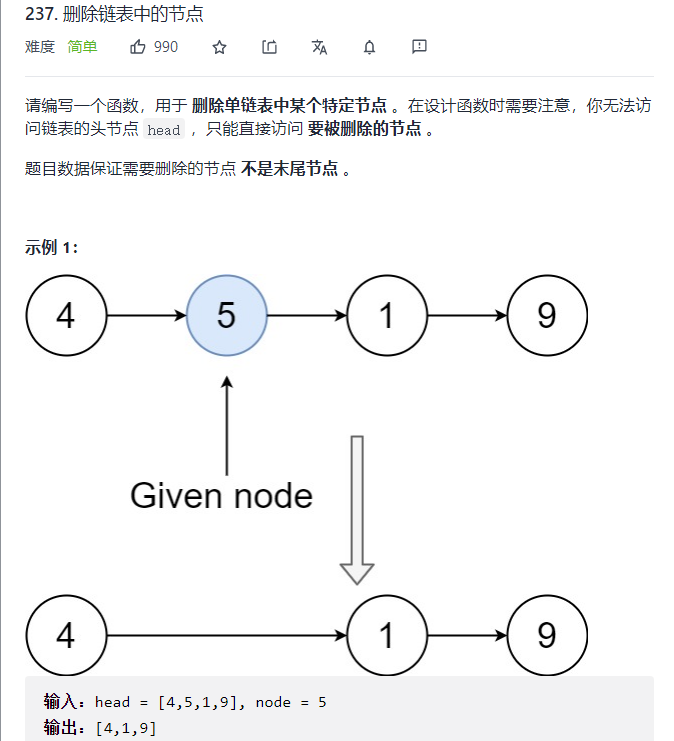


### 1.4.2 移除链表元素


https://leetcode-cn.com/problems/remove-linked-list-elements/

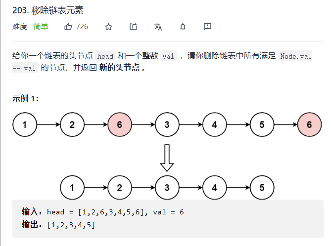


## 1.5 倒数第k个节点

### 1.5.1 输出链表中倒数第2个节点


### 1.5.2 倒数第3个节点


### 1.5.3 倒数第k个节点

​	https://leetcode-cn.com/problems/lian-biao-zhong-dao-shu-di-kge-jie-dian-lcof/

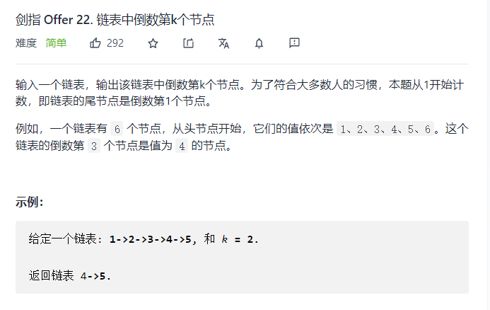


### 1.5.4 删除链表的倒数第N个节点

https://leetcode-cn.com/problems/remove-nth-node-from-end-of-list/

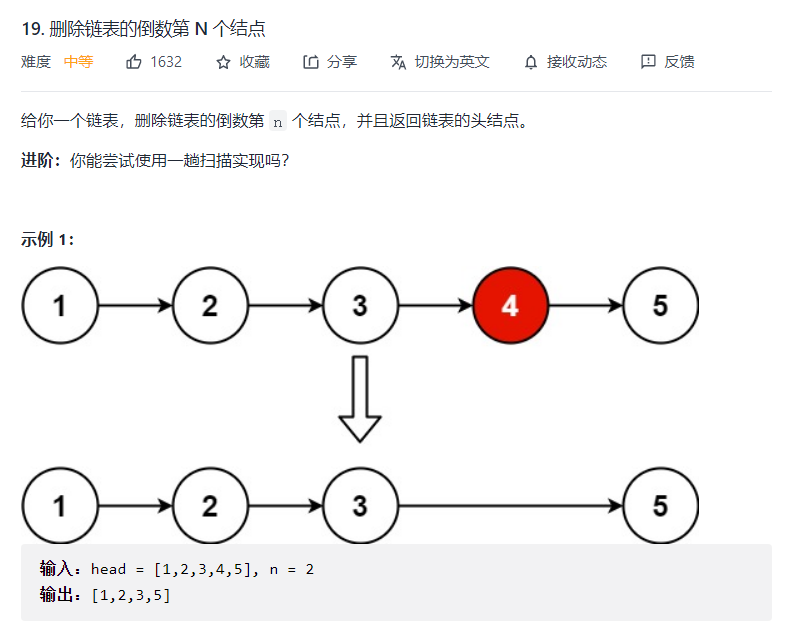


## 1.6 旋转链表


https://leetcode-cn.com/problems/rotate-list/

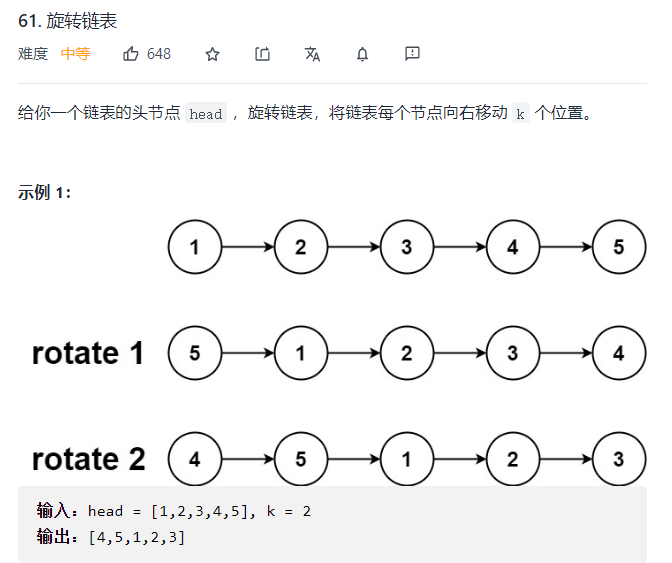

```
看不懂题目描述。就看图示就可以
```

## 1.7 双指针与链表


### 1.7.1 合并两个有序链表

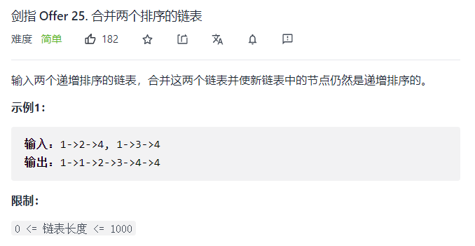


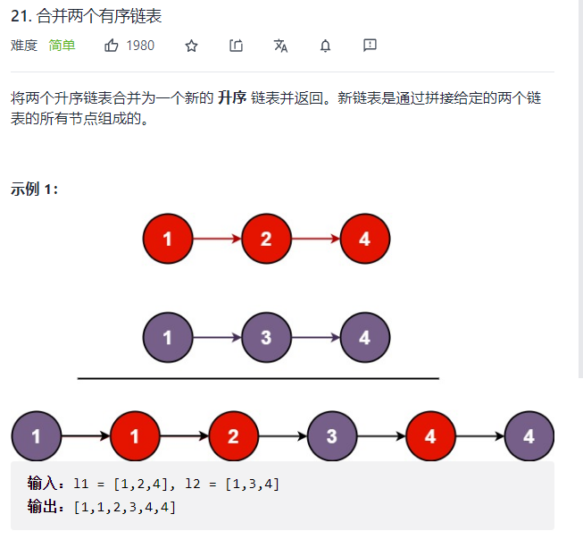


### 1.7.2 删除排序链表中的重复元素

双指针

https://leetcode-cn.com/problems/remove-duplicates-from-sorted-list/

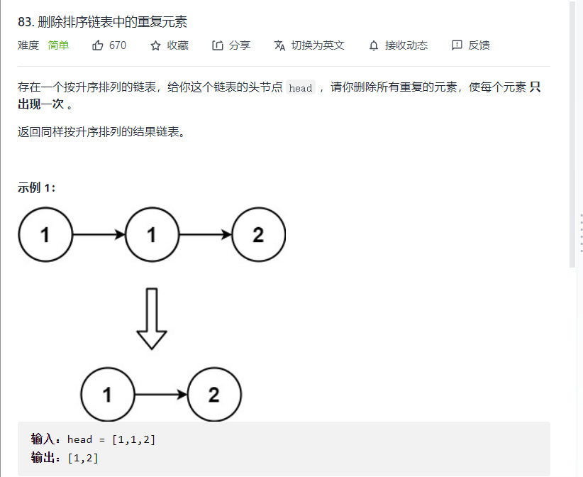

进阶

### 1.7.3 合并两个链表

https://leetcode-cn.com/problems/merge-in-between-linked-lists/

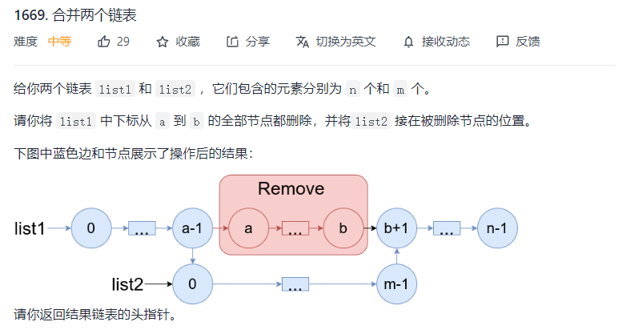


### 1.7.4 快慢指针


````
快慢指针可用于求   链表中心点。
````


#### 1.7.4.1 环形链表I

LeetCode141

https://leetcode-cn.com/problems/linked-list-cycle/

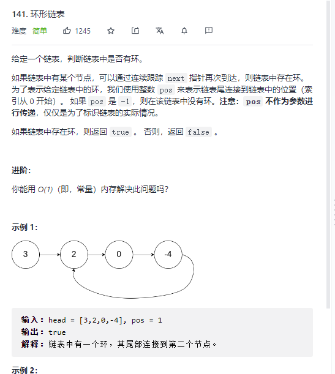


#### 1.7.4.2 环形链表II


leetCode142 

https://leetcode-cn.com/problems/linked-list-cycle-ii/


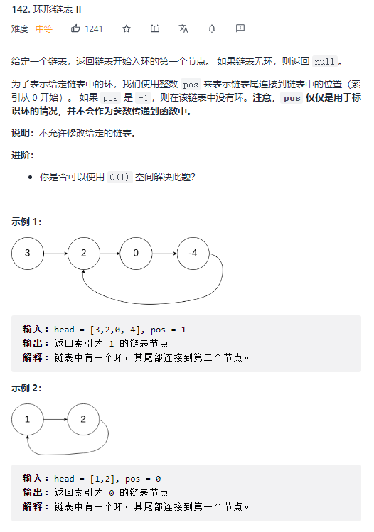


#### 1.7.4.3 链表中间节点

```
对于偶数个链表来说。中间节点有2个。

那么边界条件的改变，会导致 偶数链表中间节点的选取。

起始条件1： 会选取第二个中间节点
fast = head;
slow = head;

起始条件2： 会选取第一个中间节点
fast = head.next.next;
slow = head;
```


[876. 链表的中间结点](https://leetcode-cn.com/problems/middle-of-the-linked-list/)

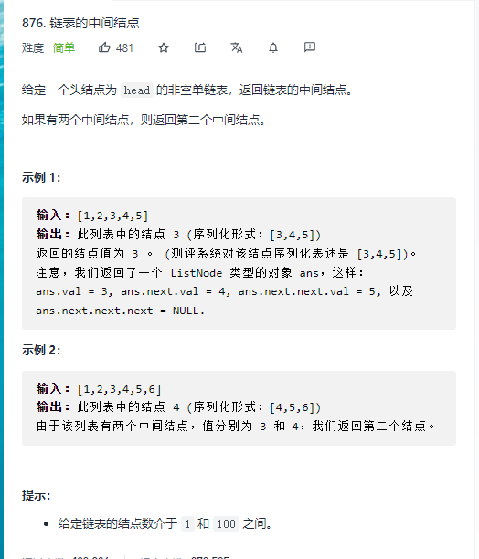


## 1.8 复杂链表复制

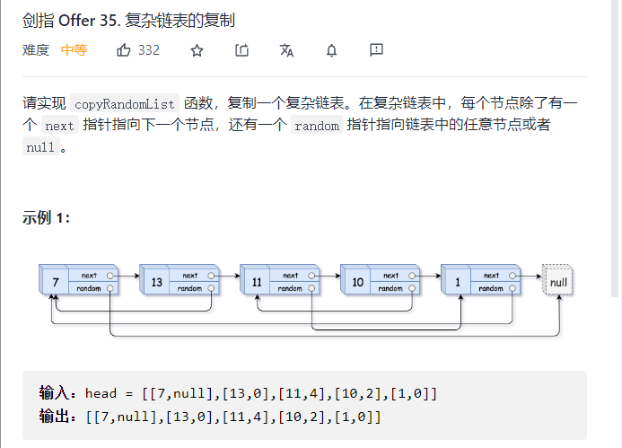


## 1.9 链表求和

思路就是：  权值小的相加、求余、进位。权值大的空缺补0


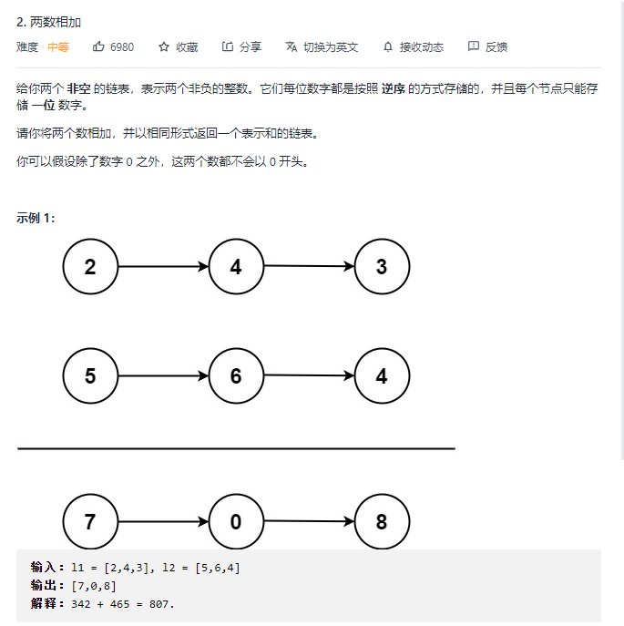

https://leetcode-cn.com/problems/add-two-numbers/


进阶：

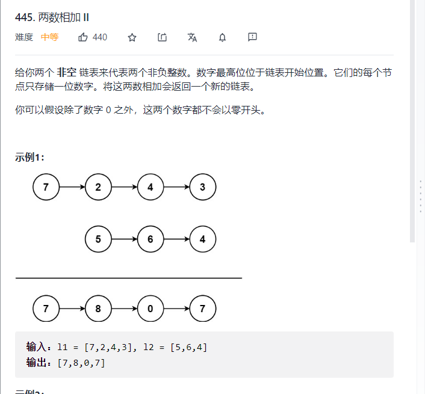

https://leetcode-cn.com/problems/add-two-numbers-ii/


## 1.10 有序链表转换二叉树

递归

https://leetcode-cn.com/problems/convert-sorted-list-to-binary-search-tree/


## 1.11 一些链表思想的混合题

### 1.11.1 重排链表

[143. 重排链表](https://leetcode-cn.com/problems/reorder-list/)

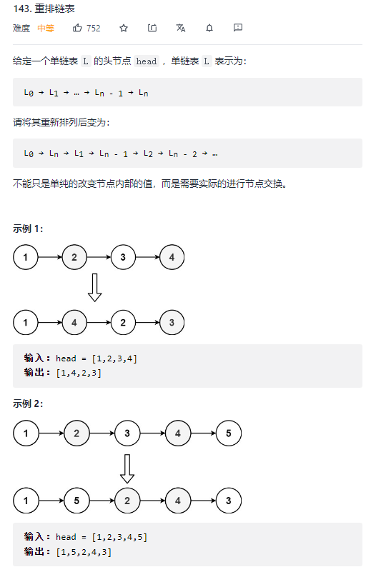

```
寻找中间点，反转后半段链表，合并插入

快慢指针 + 反转链表 + 合并链表
```


# 2. 进制

### 2.1 二进制求和

leetcode67

返回的是String类型的。要考虑进位

https://leetcode-cn.com/problems/add-binary/

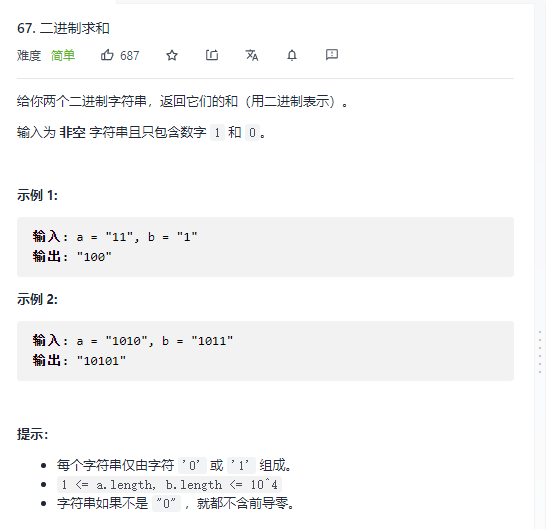

# 3、动态规划


## 3.1 跳跃游戏

### 3.1.1 跳跃游戏I

https://leetcode-cn.com/problems/jump-game-ii/

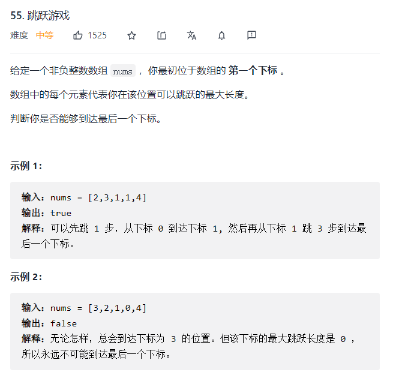


```java
//解法1：
// 5%
// 93.00%
//使用dp(n) 表示下标为n的数组可以被访问到。 1为可访问，0为不可
public boolean canJump(int[] nums) {
    int[] dp = new int[nums.length];
    dp[0]=1;
    for (int i = 0;i<nums.length;i++){
        if (dp[i]==0)continue;
        for (int j = 0;j<=nums[i];j++){
            if (i+j< nums.length)dp[i+j]=1;
        }
    }
    return dp[dp.length-1]==1;
}
```


```java
/**
解法2
95.36%
82.30%


只需维护一个maxDistance 最远跳跃距离即可。不必维护dp[]
因为maxDistance以内的索引一定会被访问到。

而且找到了答案以后，会马上返回true ，无需再做多余的赋值。
**/

public boolean canJump(int[] nums) {
    public int maxdistance = 0;
    for(int i = 0;i<=maxdistance;i++){  //for循环边界是动态的
        if(i+nums[i]>maxdistance)maxdistance = i+nums[i];
        if(maxdistance>=nums.length-1)return true;
    }
    return false;
｝
```


### 3.1.2 跳跃游戏II

https://leetcode-cn.com/problems/jump-game-ii/

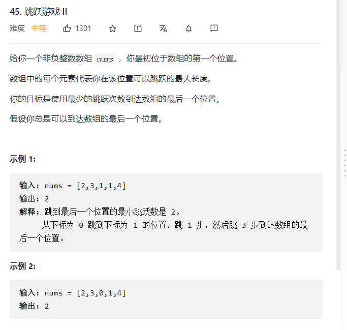

```java
/**
贪心：
假设总是可以到达最后的位置。
所以只需要每次迈最大的步即可。

**/
```


## 3.2 连续最大子数组和


https://leetcode-cn.com/problems/maximum-subarray/

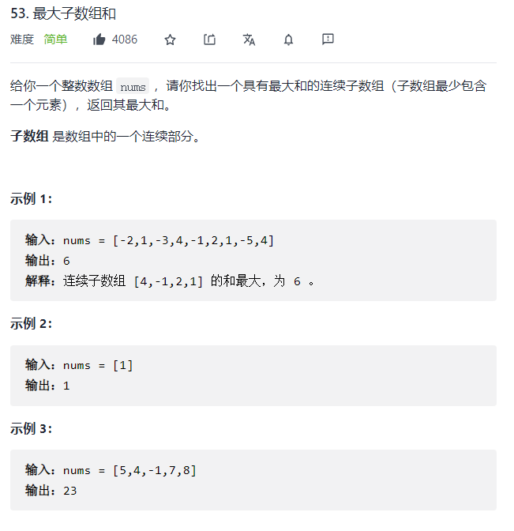


## 3.3 乘积最大子数组和


https://leetcode-cn.com/problems/maximum-product-subarray/

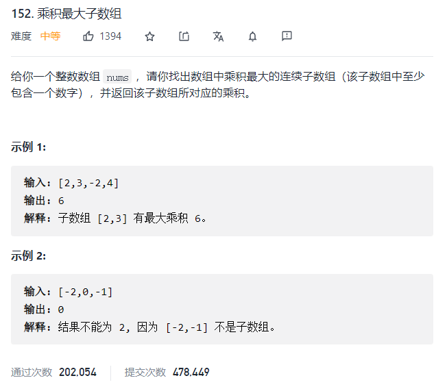


## 3.4 买卖股票最佳系列


### 3.4.1 买卖股票的最佳时机

https://leetcode-cn.com/problems/best-time-to-buy-and-sell-stock/

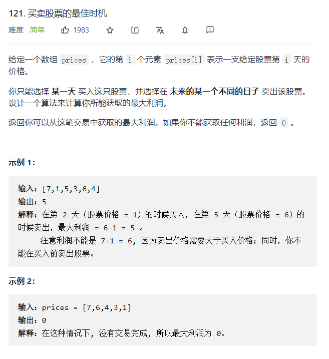


```java
public int maxProfit(int[] prices) {
    int min = prices[0];
    int profit = 0;
    for(int i = 1;i<prices.length;i++){
        if(prices[i]<min){
            min = prices[i];
            continue;
        }
        profit = Math.max(profit,prices[i]-min);
    }
    return profit;
}
```


### 3.4.2 买卖股票最佳时机II

[122. 买卖股票的最佳时机 II](https://leetcode-cn.com/problems/best-time-to-buy-and-sell-stock-ii/)


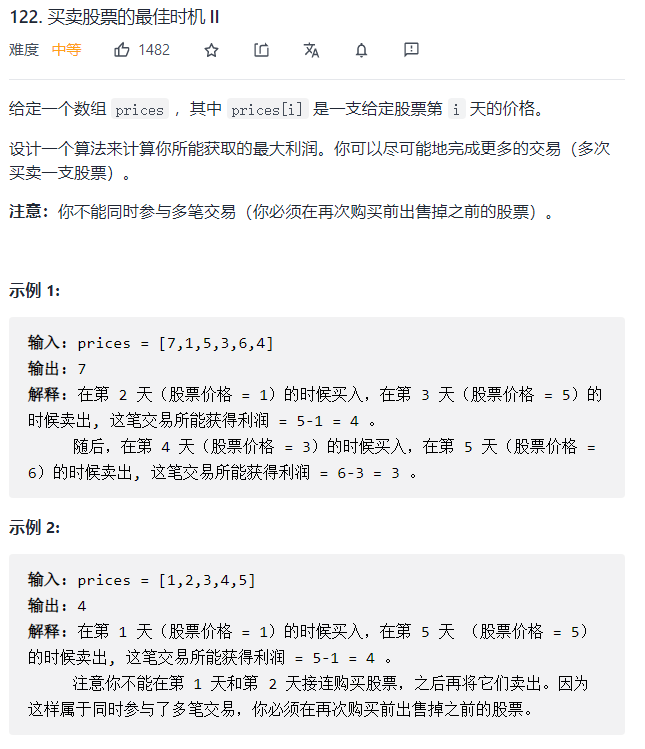


# 4. 按位操作

通常在高级语言中，按位操作，执行效率更高。

## 4.1 按位异或

a ^ a = 0       ①

a ^ 0  = a      ②

按位异或满足交换律。

a ^ b  = b ^ a

```
异或的妙用： 由①式，当两个相同的量异或在一起，相当于消除了这两个量自身（相当于消除影响）。

可用于比较两组数的不同，如果两组数里的元素，总是成对出现。异或在一起，相当于偶数对消除，最终只会留下 【没有配对的量】。

```

### 4.1.1  只出现一次的数字

https://leetcode-cn.com/problems/single-number/

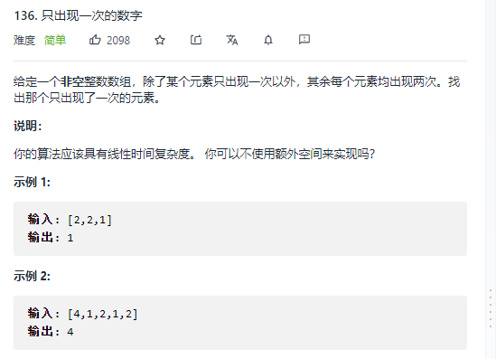 


### 4.1.2 找不同。

[389. 找不同](https://leetcode-cn.com/problems/find-the-difference/)

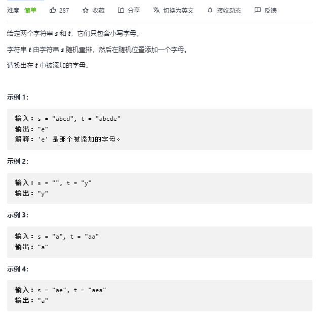


# 5. 哈希表


## 5.1  维护映射表 HashMap


5.1.1 [两数之和](https://leetcode-cn.com/problems/two-sum/)

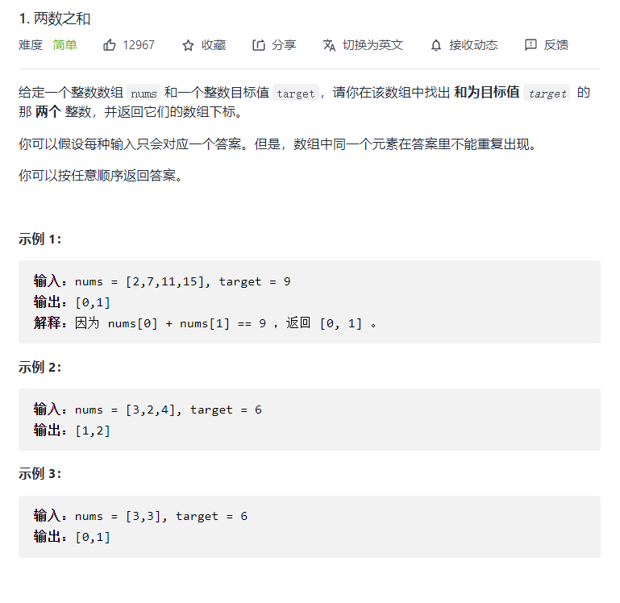


### 5.1.2 [单词规律](https://leetcode-cn.com/problems/word-pattern/)


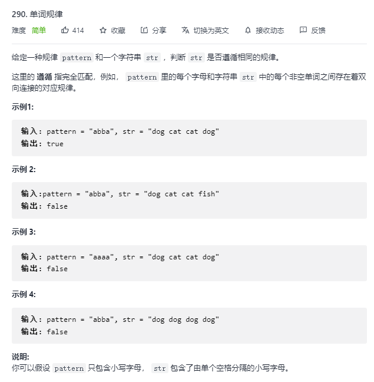


### 5.1.3  无重复字符最长子串


滑动窗口[无重复字符的最长子串](https://leetcode-cn.com/problems/longest-substring-without-repeating-characters/)

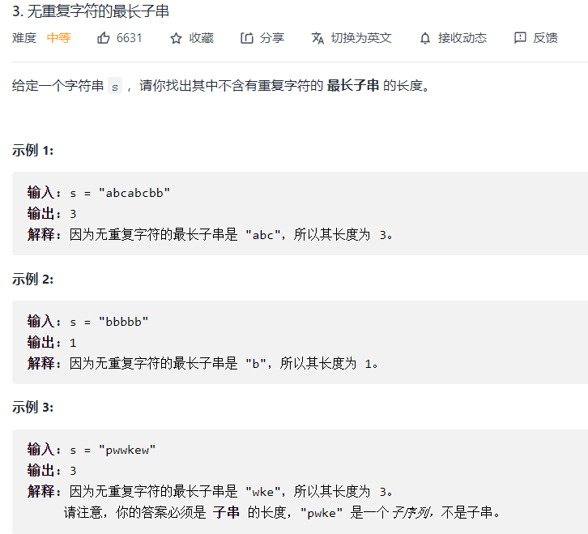


## 5.2  以数组形式的映射表


什么是以数组形式的映射表？形如：

```
int[] mapping = new int[xxx.length];
维护一个以xxx的长度为容量的 数组类型映射表。
```

心得：

```
数组类型的映射表，数组的长度通常是 数值的最大值。例如: 
 0 <= nums1[i], nums2[i] <= 10^4  [leetcode496]
最大值不超过1万，那么建立一个 int[10000]的数组，对内存压力还是可以接受的。

例如： 英文字母的映射, 英文字母最多26个
int[] map = new int[26];

```

数组类型映射表的优点：

```
数组类型（通常是int[]）的映射表最大的特点就是 nums.length越大处理起来越省 时空复杂度

通常这类映射表，时间复杂度较低，空间复杂度较高。相当于空间换时间。
```

何时考虑采用这类映射表？

````
nums1[i] 的值较小的时候。

对时间复杂度要求苛刻的时候。

不太在意空间复杂度的时候。
````


### 5.2.1 赎金信

[383. 赎金信](https://leetcode-cn.com/problems/ransom-note/)

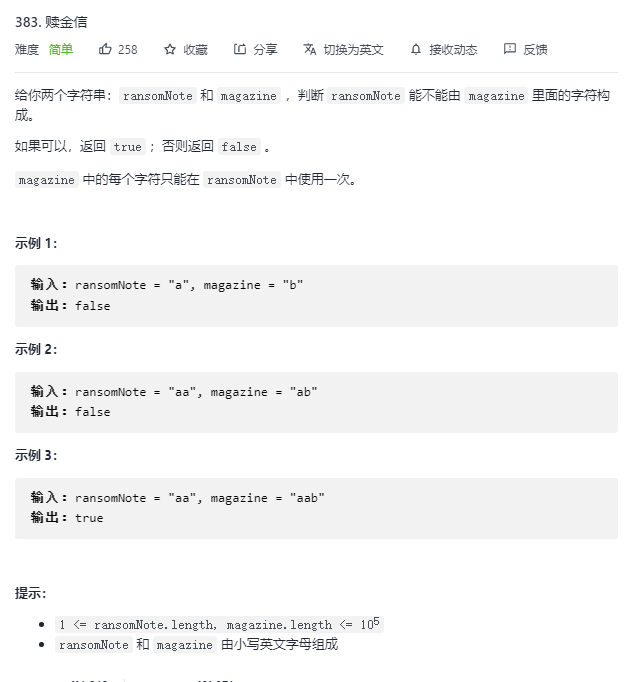


### 5.2.3  [下一个更大元素 I](https://leetcode-cn.com/problems/next-greater-element-i/)

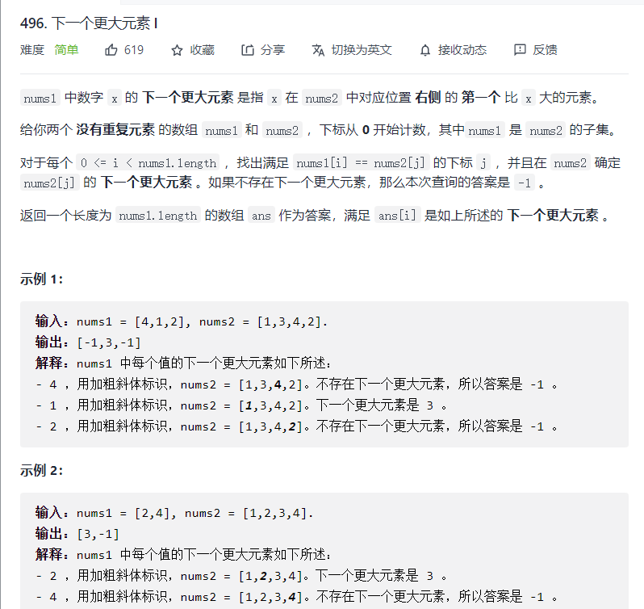


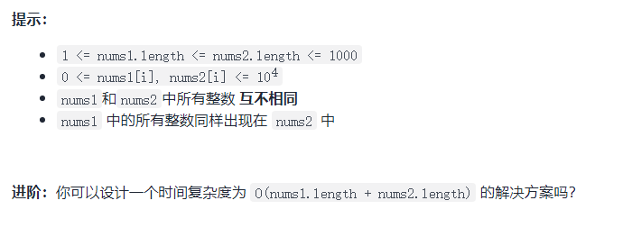


## 5.3  HashSet形式的表

#### [349. 两个数组的交集](https://leetcode-cn.com/problems/intersection-of-two-arrays/)

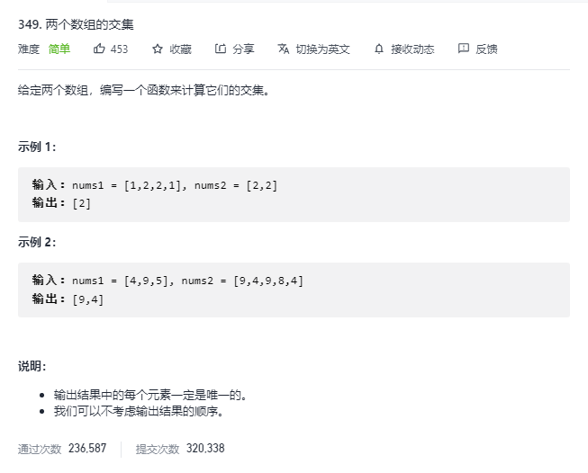


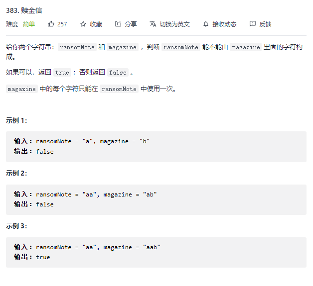

# 6. 一些有趣的算法

## 6.1 摩尔计数法


用于求一组数中超过 n/2 n/3 ... 的数, n为这组数的总数。

````
求一组数中超过 一半 的数。 //隐含条件，这组数中至多有1个这样的数。

求一组数中超过 n/3  的数 // 那么这样的数最多也只可能有2个

````


```
注意：摩尔计数法 并不能求得众数。
例如这样的数组 [2,2,1,3,5]  众数显然是2，但求得的候选人是5
```


### 6.1.1 [多数元素](https://leetcode-cn.com/problems/majority-element/)

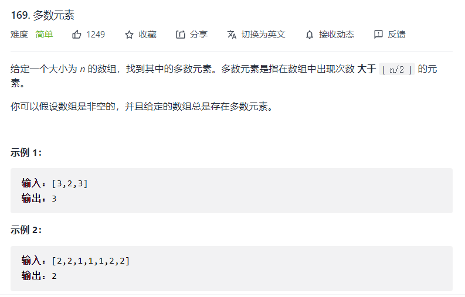

### 6.1.2 求众数II

注意此题并非 数学意义上的众数。存在误导。

https://leetcode-cn.com/problems/majority-element-ii/


## 6.2  x的平方根

```
牛顿迭代法
```

https://leetcode-cn.com/problems/sqrtx/solution/niu-dun-die-dai-fa-by-loafer/

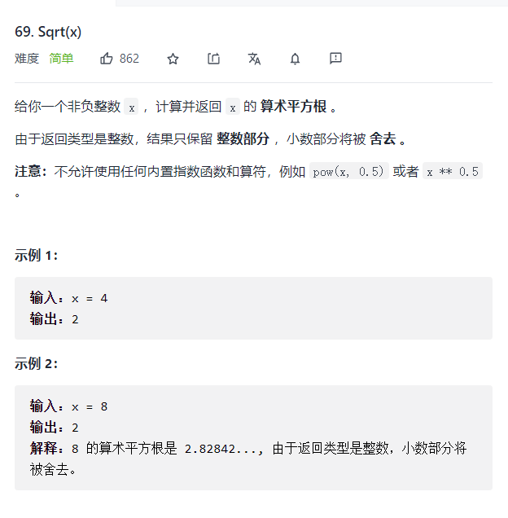


# 7. 数组


### [88. 合并两个有序数组](https://leetcode-cn.com/problems/merge-sorted-array/)

```
倒叙，指针
```


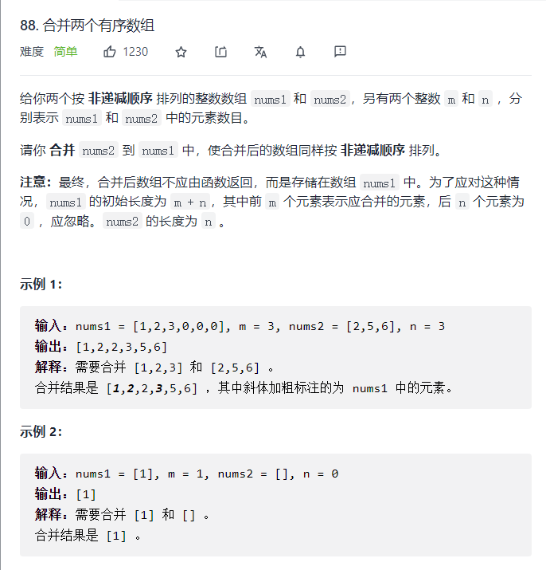


### [167. 两数之和 II - 输入有序数组](https://leetcode-cn.com/problems/two-sum-ii-input-array-is-sorted/)

````
双指针
````

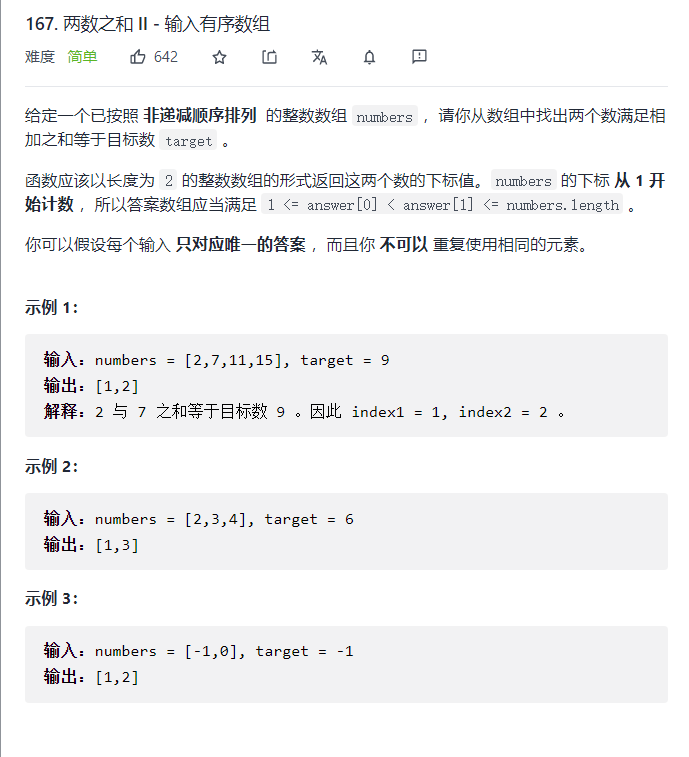


### 1.[移动零](https://leetcode-cn.com/problems/move-zeroes/)

```
双指针。移动非0元素，末尾全部补0
```


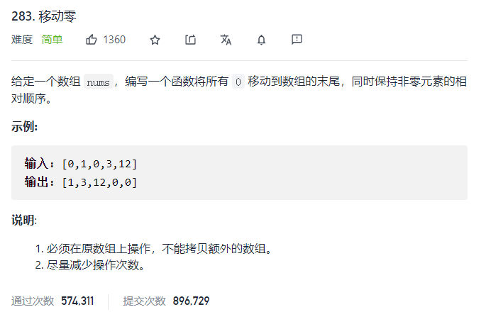


#### 2.283题变型题


```
解法1： 冒泡思想,遇到 1、6、3 全部互相交换，冒泡到末尾。 时间复杂度O(n^2) 空间复杂度O(1)

双指针+队列 遇到1、6、3添加到队里中，数组覆盖。末尾把队列中的数补足到数组中。时间复杂度O(n) 空间复杂度O(n)
```


## 7.1  将数组排序，降低时间复杂度


### 7.1.1 三数之和

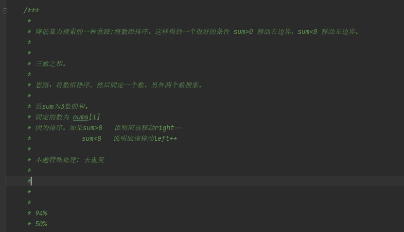

[15. 三数之和](https://leetcode-cn.com/problems/3sum/)

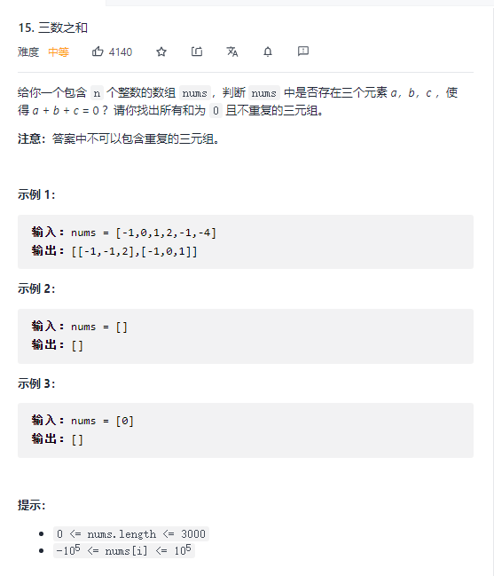


### 7.1.2 四数之和	

[18. 四数之和](https://leetcode-cn.com/problems/4sum/)

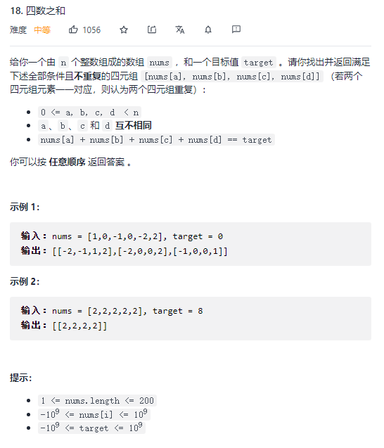


### 7.1.3 最接近的三数之和

[16. 最接近的三数之和](https://leetcode-cn.com/problems/3sum-closest/)

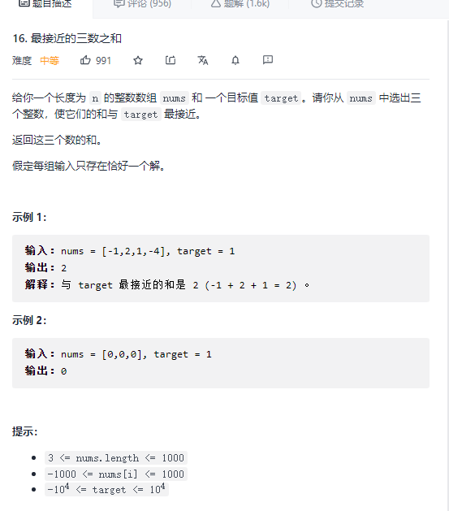


## 7.2 旋转数组


### 7.2.1  [寻找旋转排序数组中的最小值](https://leetcode-cn.com/problems/find-minimum-in-rotated-sorted-array/)

```
类二分法。     

是二分法的变形，二分法的核心思路是缩小 left 和right。
在一定条件下的升序数组，如果仍能通过判断，缩小left和right则仍能保证logN的时间复杂度。
```


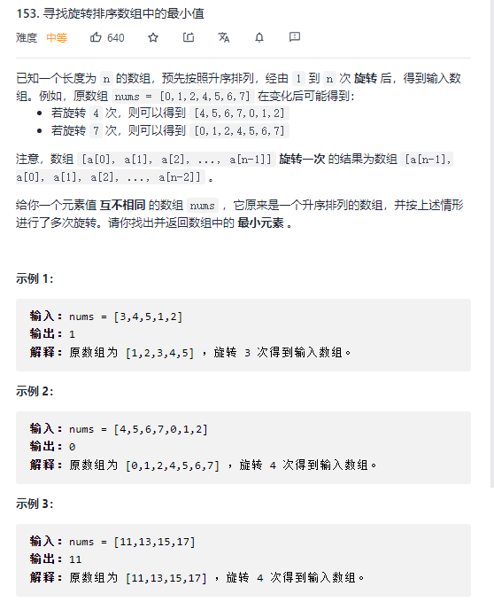


### 7.2.2 [搜索旋转排序数组](https://leetcode-cn.com/problems/search-in-rotated-sorted-array/)


```
思路和7.2.1类似。
```


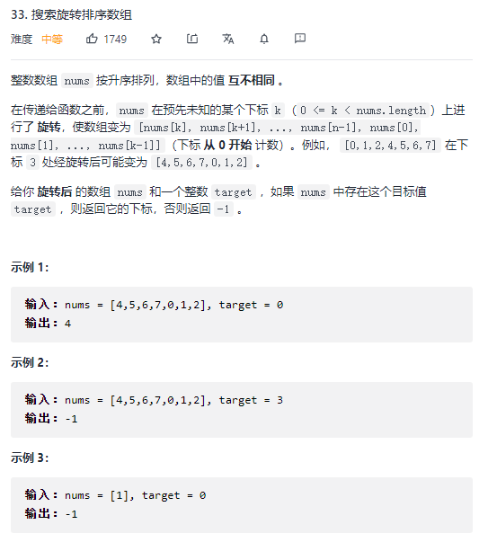


### 7.2.3 [山脉数组中查找目标值](https://leetcode-cn.com/problems/find-in-mountain-array/)


```
思路：三部分

一 ： 找到山顶，将数组一分为2 左侧为升序数组，右侧为降序数组。
二 ： 搜索左侧，如果能搜到，直接返回，不需要第三步。
三 ： 否则搜索右侧，返回结果。
```


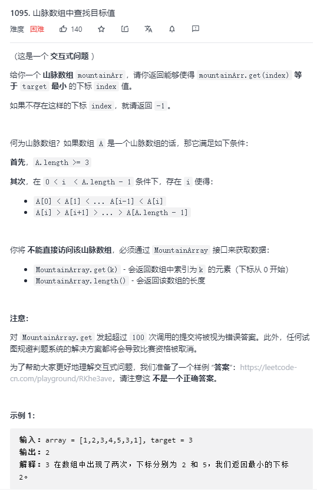


## 7.3 二分法

### 7.3.1 寻找峰值

[162. 寻找峰值](https://leetcode-cn.com/problems/find-peak-element/)


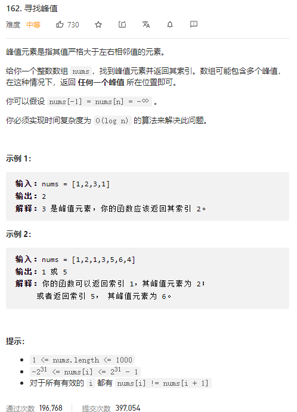


## 7.4 矩阵


### 7.4.1  搜索矩阵

#### 7.4.1.1 搜索二维矩阵I


#### 7.4.1.2 搜索二维矩阵II

[74. 搜索二维矩阵](https://leetcode-cn.com/problems/search-a-2d-matrix-ii/)


### 7.4.2 螺旋矩阵


#### 7.4.2.1 [螺旋矩阵I](https://leetcode-cn.com/problems/spiral-matrix/)

螺旋矩阵的难点在于：矩阵的上下左右边界在动态变化。需要在遍历的同时，修改上下左右边界。


#### 7.4.2.2 [螺旋矩阵II](https://leetcode-cn.com/problems/spiral-matrix/)


## 7.5 滑动窗口


对于数组的 子数组问题。 可以考虑 “前缀和”  “滑动窗口” 方向。


### [7.5.1 长度最小的子数组](https://leetcode-cn.com/problems/minimum-size-subarray-sum/)


```
滑动窗口会漏掉一部分组合吗？
答案是不会的。每当滑入一个元素，达到了某种条件以后。就尝试从左侧滑出一些元素，并记录每次的结果。直到不满足条件。 “记录每次的结果” 这一操作相当于实验了包含前一个“滑入元素”的所有满足条件的组合。因为，是子数组。只能从右侧进，左侧出。
```


### 7.5.2 [乘积小于K的子数组](https://leetcode-cn.com/problems/subarray-product-less-than-k/)


## 7.6 分治法


### 7.6.1 快排


#### 7.6.1.1 快排模版


```java
public void quickSort(int[] nums){
	partition(nums,0,nums.length-1);
}

public void partition(int[] nums,int left,int right){
	if(left>=right)return;
	int i = left,j = right;
	int base = nums[left];
	while(i<j){
		while(i<j && nums[j]>=base)j--;
		while(i<j && nums[i]<=base)i++;
		swap(nums,i,j);
	}
	swap(nums,left,j);//交换
    //基准值base 找到了在数组中正确的位置。 左侧均<=base 右侧均>=base
	partition(nums,left,i-1);  //分治思想体现: 对左侧快排
	partition(nums,i+1,right);  //对右侧快排。 直到排到 left==right即1个元素。变成有序状态。
}

public void swap(int[] nums,int i,int j){
	int temp = nums[i];
	nums[i] = nums[j];
	nums[j] = temp;
}
```


### 7.6.2   TopK 问题

```
推荐题解
https://leetcode-cn.com/problems/zui-xiao-de-kge-shu-lcof/solution/3chong-jie-fa-miao-sha-topkkuai-pai-dui-er-cha-sou/
```


#### 7.6.2.1 减治方法---快排变形

```
快排变形解决TopK问题。

主要使用了快排的特性。每当一轮快排完成。相当于确定了base在数组中的位置。
如果base恰好等于所求的TopK,那么无需再对剩余元素进行排序，直接返回结果即可。

减治思想: 类似于二分查找。通过不断的缩短边界,最终将 等于topK的base“夹”出来

如果 返回的base>topK ,应该收缩右边界。下一轮搜索区间在[left,base-1]
如果      base<topK ,应该收缩左边界。下一轮搜索区间在[base+1,right]
```


##### [7.6.2.1.1 数组中的第K个最大元素](https://leetcode-cn.com/problems/kth-largest-element-in-an-array/)


##### [7.6.2.1.2 最小的k个数](https://leetcode-cn.com/problems/zui-xiao-de-kge-shu-lcof/)


1


# 8. 字符串


## 8.1 大数相乘相加系列


### 8.1.1 大数相加

[415. 字符串相加](https://leetcode-cn.com/problems/add-strings/)


### 8.1.2  大数相乘

### [43. 字符串相乘](https://leetcode-cn.com/problems/multiply-strings/)


## 8.2 回文字符串

### 8.2.1 最长回文子串

[5. 最长回文子串](https://leetcode-cn.com/problems/longest-palindromic-substring/)


# 9. 深度优先遍历 


## 9.1  “判断” 类的题目

```
什么是判断类？

像 “某某数符合平衡二叉树” “符合完全相等”的一些题目。
只需要举出一个反例，即可回答问题。

这类题目的优化：
这类题目可以通过设置标志位 “flag”，在已经确定答案后，跳过后续的搜索。
减少时间复杂度，和空间复杂度。

优化幅度是不确定的，碰到极端用例，将退化为遍历
```


例如：

### 9.1.1 判断是否是平衡二叉树

[110. 平衡二叉树](https://leetcode-cn.com/problems/balanced-binary-tree/)


```java
/**
* 100%
* 26%
*/

public class Solution {
    private boolean flag = true;
    public boolean isBalanced(TreeNode root) {
        if (root==null)return false;
        recursion(root);
        return flag;
    }

    public int recursion(TreeNode root ){
        if (root==null){
            return 0;
        }
        if (!flag){
            return -1;
        }
        int leftDepth = recursion(root.left);
        int rightDepth = recursion(root.right);
        if (Math.abs(leftDepth-rightDepth)>1){
            flag = false;
        }
        return Math.max(leftDepth,rightDepth)+1;
    }
}
```


### 9.1.2 相同的树

[100. 相同的树](https://leetcode-cn.com/problems/same-tree/)


## 9.2 经典遍历二叉树问题


### 9.2.1 经典遍历

```
OLR
LOR
LRO

除了会使用递归遍历，还要会使用迭代。
```


### 9.2.2 二叉树的直径


### 9.2.3 [二叉树中的最大路径和](https://leetcode-cn.com/problems/binary-tree-maximum-path-sum/)

思路与9.2.2大致一样。


### 9.2.4 二叉树的坡度


## 9.3 类二叉树

```
类似于二叉树的数据结构
```

### 9.3.1  填充右侧节点指针


[填充每个节点的下一个右侧节点指针](https://leetcode-cn.com/problems/populating-next-right-pointers-in-each-node/)


### 9.3.2 填充右侧节点指针II


## 9.4 搜图


### 9.4.1 岛屿问题


#### 9.4.1.1 岛屿数量

[200. 岛屿数量](https://leetcode-cn.com/problems/number-of-islands/)

```
非常经典的一道题.

思路很清晰，一点儿也不饶。
```


#### 9.4.1.2 岛屿最大面积

[695. 岛屿的最大面积](https://leetcode-cn.com/problems/max-area-of-island/)


#### 9.4.1.3 岛屿的周长

[463. 岛屿的周长](https://leetcode-cn.com/problems/island-perimeter/)


## 9.5 一些dfs题

### 9.5.1 被围绕的区域

#### [130. 被围绕的区域](https://leetcode-cn.com/problems/surrounded-regions/)


## 9.7 构建二叉树


### 9.7.1 从前序与中序遍历序列构造二叉树


[105. 从前序与中序遍历序列构造二叉树](https://leetcode-cn.com/problems/construct-binary-tree-from-preorder-and-inorder-traversal/)


#### 9.7.1.1 变型题

```
给定前序遍历中序遍历，求后序遍历。

由前序+中序 构建二叉树的递归。本质上是前序遍历。O->L->R

建立二叉树时，在递归回归之前，输出root.val 就变成了 L->R->O
（如果不明白，不妨画画图）
```


```java
    public List<Integer> buildTree1(int[] pre, int[] ino) {


        HashMap<Integer, Integer> map = new HashMap<>();

        int len = ino.length;
        for (int i = 0; i <len; i++) {
            map.put(ino[i],i);
        }
        ArrayList<Integer> res = new ArrayList<>();
        recursion1(pre,ino,0,len-1,0,len-1,map,res);
        return res;
    }

    private void recursion1(int[] pre,int[] ino,int pre_left,int pre_right,int ino_left,int ino_right,HashMap<Integer,Integer> map, ArrayList<Integer> res){

        if (pre_left>pre_right){
            return;
        }

        int rootIndex = map.get(pre[pre_left]);

        int sizeOfLeftTree = rootIndex-ino_left;

        //左子树
        recursion1(pre,ino,pre_left+1,pre_left+sizeOfLeftTree,ino_left,rootIndex-1,map,res);

        //右子树
        recursion1(pre,ino,pre_left+1+sizeOfLeftTree,pre_right,rootIndex+1,ino_right,map,res);

        res.add(pre[pre_left]);
    }
```


# 10 回溯


## 10.1 组合系列

### 10.1.1 组合总和I

[39. 组合总和](https://leetcode-cn.com/problems/combination-sum/)


### 10.1.2  组合总和II

[40. 组合总和 II](https://leetcode-cn.com/problems/combination-sum-ii/)


## 10.2  排列系列


## 10.3 子集问题


### 10.3.1 子集

[78. 子集](https://leetcode-cn.com/problems/subsets/)


### 10.3.2  子集II

[子集II](https://leetcode-cn.com/problems/subsets-ii/)

```
在递归搜索中。
不允许同层出现重复。但允许同枝出现重复。
```


[参考题解](https://leetcode-cn.com/problems/subsets-ii/solution/90-zi-ji-iiche-di-li-jie-zi-ji-wen-ti-ru-djmf/)


## 10.4 记忆化搜索

### 10.4.1 零钱兑换


[推荐题解](https://leetcode-cn.com/problems/coin-change/solution/javadi-gui-ji-yi-hua-sou-suo-dong-tai-gui-hua-by-s/)

```
将搜索树展开画图如下：
```


```
例如根节点，表示 搜索11的最少硬币数量组合。此时有3个分支(选1，2，3)。搜索树展开到了第二层。
此时存在3个节点: “搜索10的最少硬币组合” “搜索9的最少硬币组合” “搜索8的最少硬币组合”

这个3个节点，仍各自存在3个分支。展开！此时搜索树就到了第三层
此时，发现第3层的节点出现大量重复。
如果将节点记忆化存储起来。遇到重复的节点，就取出来结果，将会减少非常多次的递归。
```


# 10. 动态规划


## 10.1 dp引入

```
动态规划并没有为问题设计专门的算法。它是一类思想的宏观描述。
理解动态规划，需要先深刻理解递归问题。
在我看来，动态规划是递归问题的变型。是用空间换取时间的优化。


有时候,在处理大量数据的时候，增长空间可能会比增长时间更划算。
```


在学习其他人的题解的时候，请先知道以下两个 动态规划名词，有助于理解


```
通常一个动态规划解法的伊始就是“状态”的定义。
```


### 10.1.1  使用dp的三个条件


```
最优子结构，通常和dp转移方程相关。
```


参考自:

https://suanfa8.com/algorithm-idea/dynamic-programming/intro/


# 11.双指针


## 11.1 判断子序列


[392. 判断子序列](https://leetcode-cn.com/problems/is-subsequence/)

```
双指针解法


dp解法
```


# 12.高频题


