# 1. Lua

Lua是一个轻量级的脚本语言。设计目的是为了嵌入应用程序中，提高应用程序的扩展能力。(例如Redis支持 Lua5.1)


## 1.1 安装运行环境

https://www.runoob.com/lua/lua-environment.html


### 1.1.1 Linux

```
curl -R -O http://www.lua.org/ftp/lua-5.3.0.tar.gz
tar zxf lua-5.3.0.tar.gz
cd lua-5.3.0
make linux test
make install
```


执行到 `make linux test` 出现如下错误。解决方案

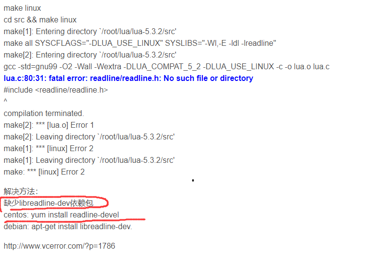


## 1.2 hello lua

创建一个 hello.lua 的文件。


## 1.3 基本语法


### 1.3.1 交互式编程


Lua 提供了交互式编程模式。我们可以在命令行中输入程序并立即查看效果。


```
Lua 交互式编程模式可以通过命令 lua -i 或 lua  ，进入交互模式。
```


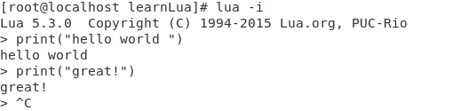


```
退出一个交互程序。

ctrl+d  //发出退出信号
ctrl+c  //强制退出
```


### 1.3.2 脚本编程

```
将编写好的lua脚本保存为 xxx.lua

使用 lua <xxx.lua> 即可运行
```


### 1.3.3 注释

单行注释

```lua
--
```


多行注释、

```lua
--[[
 多行注释
 多行注释
 --]]
```


### 1.3.4 标示符


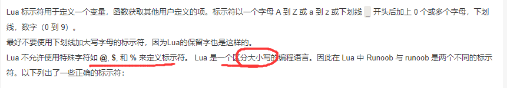

```
区分大小写， 约定以下划线开头，连接一串大写字母的名字被保留用于lua内全局变量。
```


### 1.3.5 关键字


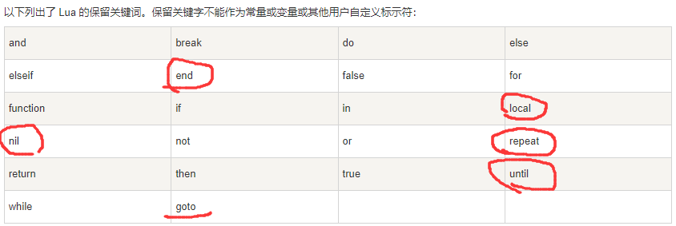


### 1.3.6 全局变量

在默认情况下，变量总是全局变量。

```
全局变量不需要声明，给一个变量赋值后即创建了这个全局变量，访问一个没有初始化的全局变量也不会出错，只不过得到的结果是：nil。
```


如果你想删除一个全局变量，只需要将变量赋值为nil。


## 1.4 数据类型

8个基本类型

```
nil  //表示一个无效值，在条件表达式中等价于 false
boolean  
number
string  //由单引号或双引号表示
function   //由C 或lua编写的函数

userdata   //表示任意存储在变量中的C数据结构
thread    //表示执行的独立线路，用于执行协同程序
table    //Lua 中的表（table）其实是一个"关联数组"（associative arrays），数组的索引可以是数字、字符串或表类型。在 Lua 里，
           table 的创建是通过"构造表达式"来完成，最简单构造表达式是{}，用来创建一个空表。
```


### 1.4.1 type()函数

返回一个变量的数据类型


```
print(type("Hello world"))      --> string
print(type(10.4*3))             --> number
print(type(print))              --> function
print(type(type))               --> function
print(type(true))               --> boolean
print(type(nil))                --> nil
print(type(type(X)))            --> string    //type返回的值是一个string
```


### 1.4.2 nil


```
nil 类型表示一种没有任何有效值，它只有一个值 -- nil，例如打印一个没有赋值的变量，便会输出一个 nil 值：
```


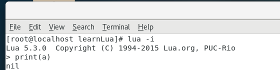


```
对于全局变量和 table ，给变量赋值为nil ，表示删除这个变量。
```


```
nil 作比较时应该加上双引号 
```


```lua
type(x)         -- nil
type(x)==nil    --false   nil 作比较时应该加上双引号 
type(x)=="nil"  --true
```


### 1.4.3 table 表

在 Lua 里，table 的创建是通过"构造表达式"来完成，最简单构造表达式是{}，用来创建一个空表。

也可以在表里添加一些数据，直接初始化表:


```lua
-- 初始化一个空表
tab1={}

tab2={"red","green","blue"}

--在初始化table的时候 字符串key不能带双引号

for k,v in pairs(tab2) do
    print(k.." : "..v)
end
```


```
Lua 中的表（table）其实是一个"关联数组"（associative arrays）
```


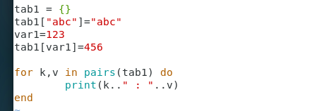


```lua
-- 输出结果
abc : abc
123 : 456


-- 使用 tab1["key1"]="value"的时候，方括号内的key必须带单引号
```


```
不同于其他语言的数组把 0 作为数组的初始索引，在 Lua 里表的默认初始索引一般以 1 开始。
```


```
table 不会固定长度大小，有新数据添加时 table 长度会自动增长，没初始的 table 都是 nil。
```


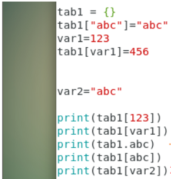


输出结果：

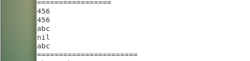


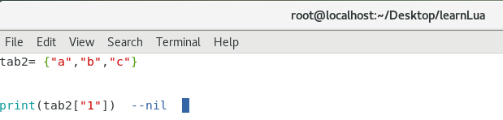

```
tab2.i                 -- 当索引为字符串类型时的一种简化写法
```


### 1.4.4 boolean

```
在lua中，  把false 和 nil 当作false，  其余全是true ，包括0
```


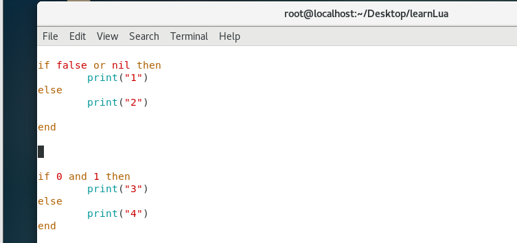


执行结果


```
false or nil  仍然是false，所以输出2

0 and 1 是true 输出3 
```


### 1.4.5 number

默认lua只有1中 number类型，double

```
（默认类型可以修改 luaconf.h 里的定义），以下几种写法都被看作是 number 类型
```

```lua
print(type(2))
print(type(2.2))
print(type(0.2))
print(type(2e+1))           --指数表示法
print(type(0.2e-1))
print(type(7.8263692594256e-06))
```


### 1.4.6 string字符串


字符串由一对双引号或单引号来表示。

```lua
string1 = "this is string1"
string2 = 'this is string2'
```

也可以用 2 个方括号 "[[]]" 来表示"一块"字符串。


```lua
html = [[
<html>
<head></head>
<body>
    <a href="http://www.runoob.com/">菜鸟教程</a>
</body>
</html>
]]
print(html)
```


```
在对一个数字字符串上进行算术操作时，Lua 会尝试将这个数字字符串转成一个数字:
```


```lua
[root@localhost learnLua]# lua
Lua 5.3.0  Copyright (C) 1994-2015 Lua.org, PUC-Rio
> a="1"+54
> print(a) 
55.0                                       --纯数字字符串可以使用 + 拼接字符串 ，表示算数加法
> print("abc"..1)
abc1                                       --字符串拼接只能使用.. 否则会报错
> print("abc"+1)
stdin:1: attempt to perform arithmetic on a string value
stack traceback:
	stdin:1: in main chunk
	[C]: in ?
```


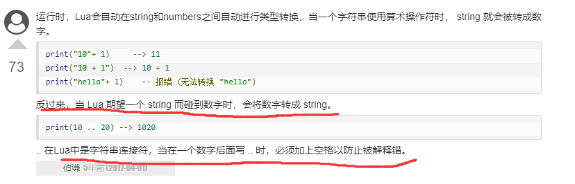


```
对于字符串来说
使用 # 输出字符串所占字节数，放在字符串前面，如下实例：
```

```lua
> str1 = "www.baidu.com"
> print(#str1)
13
> print(#"abcde")
5
>print(#"你好世界")
8
```


```
# 对于表类型来说，输出的是表的长度。
```


### 1.4.7 function


lua中，函数是一等公民....

```lua
function sum(a,b)
        return a+b
end

print(sum(1,2))

print(sum("1.5",5))


sum2=sum                      --函数可以被赋值给另一个变量

print(sum2(3,4)) 
```


运行结果：

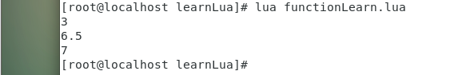


```
function 可以以匿名函数（anonymous function）的方式通过参数传递:
```


```lua
function funtest(tab,fun)
        for k,v in pairs(tab) do
                print(fun(k,v))
        end
end

tab1 = {"a","b","c"}

-- 传入匿名函数
print(funtest(tab1,function(a,b)
                   return a.." : "..b
                end
))
```


### 1.4.8 userdata

userdata 是一种用户自定义数据，用于表示一种由应用程序或 C/C++ 语言库所创建的类型，可以将任意 C/C++ 的任意数据类型的数据（通常是 struct 和 指针）存储到 Lua 变量中调用。


### 1.4.9 thread


在 Lua 里，最主要的线程是协同程序（coroutine）。它跟线程（thread）差不多，拥有自己独立的栈、局部变量和指令指针，可以跟其他协同程序共享全局变量和其他大部分东西。

线程跟协程的区别：线程可以同时多个运行，而协程任意时刻只能运行一个，并且处于运行状态的协程只有被挂起（suspend）时才会暂停。


## 1.5 变量


### 1.5.1 变量作用域

Lua 变量有三种类型：全局变量、局部变量、表中的域。


```
Lua 中的变量全是全局变量，哪怕是语句块或是函数里，除非用 local 显式声明为局部变量。


局部变量的作用域为从声明位置开始到所在语句块结束。
```


```lua
a=5                --全局变量a
local b=5          --局部变量b
 
print(a)           --5
print(b)           --5  没有超出b的作用域

function fun1()
	a=7            --全局变量a赋值为7
	local c=8      --局部变量c=8
	print(a)       --7
	print(c)       --8
end

print("=========call fun1=========")
fun1()                 
print("=====after fun1=========")
print(a)            --7
print(c)            --nil  超出了c的作用域

do                  --do end 块，一个新的作用域块
	local a=1       --局部变量a=1
	print(a)        --1   局部变量a的优先级高
end

print(a)            --7
```


运行结果

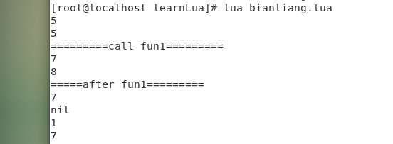


### 1.5.2  赋值


lua 支持同时给多个变量赋值。

```lua
a=1

a=a+1


b,c,d = 3,4 ,2*a

--[[
	不允许如下写法：
	e,f = 2*f,5   抛出未定义的f异常
	
	e,f = 5,2*e   抛出未定义的e异常


--]]

print(a)    --2
print(b)    --3
print(c)    --4
print(d)    --4
```


lua支持两个变量如下写法互换值

```
x , y = y ,x

a[i] ,a[j] = a[j] , a[i]
```


当变量个数和值的个数不一致时，Lua会一直以变量个数为基础采取以下策略：

```
变量个数 > 值的个数             按变量个数补足nil
变量个数 < 值的个数             多余的值会被忽略
```


```lua
[root@localhost learnLua]# lua 
Lua 5.3.0  Copyright (C) 1994-2015 Lua.org, PUC-Rio
> a=1
> b=2
> a,b = b,a
> print(a,b)
2	1
> c,d,e = 0
> print(c,d,e)
0	nil	nil
> 
```


## 1.6  循环


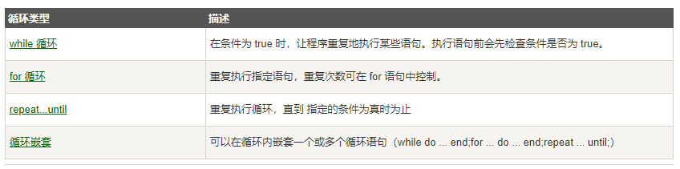


### 1.6.1  while


```lua
while( condition )
do
    //dosomething
end
```


### 1.6.2 for


#### 1.6.2.1  数值 for循环


val1 表示初始值，limit表示for循环var的终止值，step表示步长。 步长可以为小数

```lua
for <var>=<val1>,<limit>,<step> do
	//something
end
```


for循环和Java不同的是:

```
在java中for()循环中间的值是一个表达式。

lua相当于中间的表达式恒为     <var> <= limit  
例如如下代码：
```

```lua
for a=0,2,0.3 do
    print(a)
end
--[[
输出结果是
	0.0
	0.3
	0.6
	0.9
	1.2
	1.5
	1.8       --2.1 > 2.0 所以终止for
--]]     
```


val2可以被 函数代替，只会在第一次for循环前调用一次。例如：

```lua
function fun()
    print("call fun()")
	return 5
end


for a=0,fun(),1 do
    if a%2==0 then
        print("a "..a)
    end
end
```


当`<limit>` 大于 `<var>`的时候，for直接不会输出,不会出现死循环

```lua
for i=1,0,1 do
	print(i)
end
```


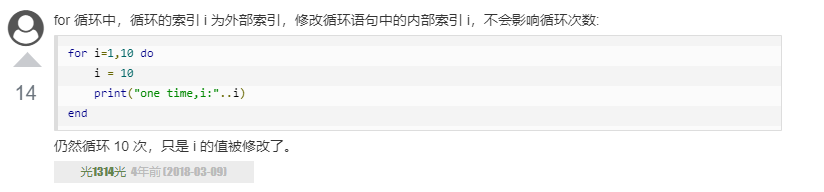

```
上面的输出结果是 10次 10 


如果for循环内不声明  i=10的语句， 是可以输出 1,2,3...10的。当声明了 i=10，输出的就是10次10，

注意此时i=10没有被local修饰，本身是全局作用域...
无论怎样 局部作用域的优先级应该>全局作用域，基于这样的思想，即使声明了 i=10 也应该输出 1,2...10 

同时经过测试 local i=10 照样会出现 10次10的效果..... 匪夷所思

这意味着这个人解释的也不对，for循环语法中的<var>既不属于局部变量也不属于全局变量 。可以把 for语法中的<var>当作优先级最低的变量
```


#### 1.6.2.2  泛型for

类似于 java中的foreach，前面我们用到过, 通过一个函数迭代器来遍历所有值。  `pairs()` `ipairs()`

```lua
tab={"a","b","c"}

for k,v in pairs(tab) do
	print(k.." : "..v)
end
```


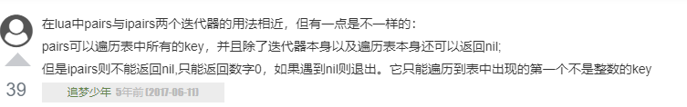


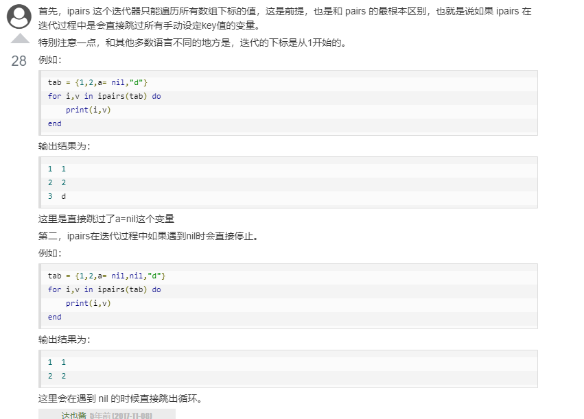


## 1.7 流程控制


### 1.7.1 if

```lua
a=10
if a<10 then
    print("<")
else
    print(">=")
```


### 1.7.2   elseif


```lua
if a>10 then
	print("a")
elseif a>5 then
    print("b")
elseif a>0 then
    print("c")
else
    print("d")
end
```


注意不要写成 `else if`

```lua
--对于lua 来说 else if 就变成了


else  
	if  ...   then 
	end
end
```


## 1.8  函数


### 1.8.1 函数定义

```lua
optional_function_scope function function_name( argument1, argument2, argument3..., argumentn)
    function_body
    return result_params_comma_separated
end
```


```
optional_function_scope   -- 指明函数的作用域，默认是全局作用域

result_params_comma_separated   -- lua可以返回多个返回值，每个值以逗号隔开
```


返回多个值

```lua
function maxAndMin(tab)
    if tab==nil then return nil end

    min = tab[1]
    max = tab[1]
    
        for k,v in pairs(tab) do
                if v>max then max=v end
                if v<min then min=v end
        end
        return max,min

end

tab = {1,2,3,4,5,6}

print(maxAndMin(tab))
```


```lua
function myAdd(a,b,functionPoint)
        return functionPoint(a+b)
end

myAdd(1,2,print)   --结果直接输出为3  把print函数传递进functionPoint， myAdd调用了print
```


### 1.8.2 可变参数

也就是java中的不定参数 使用`...`表示


```lua
function add(a,...)
        print("a : "..a)

        for k,v in ipairs{...} do     -- 遍历不定参数的时候，使用 pairs{} 或者ipairs{}
                print(k,v)
        end
end

add("haha",5,10,15,20,"hello","world")
```


## 1.9 运算符


### 1.9.1 算数运算符

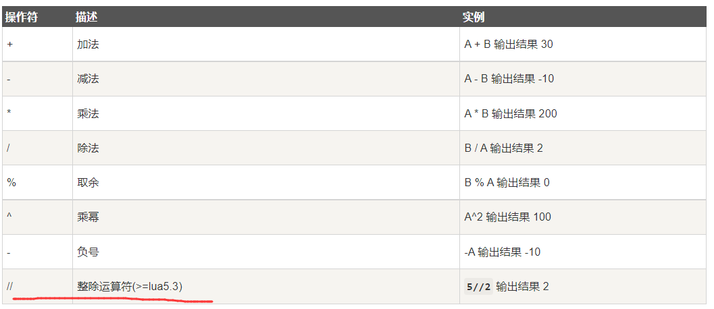


### 1.9.2 关系运算符


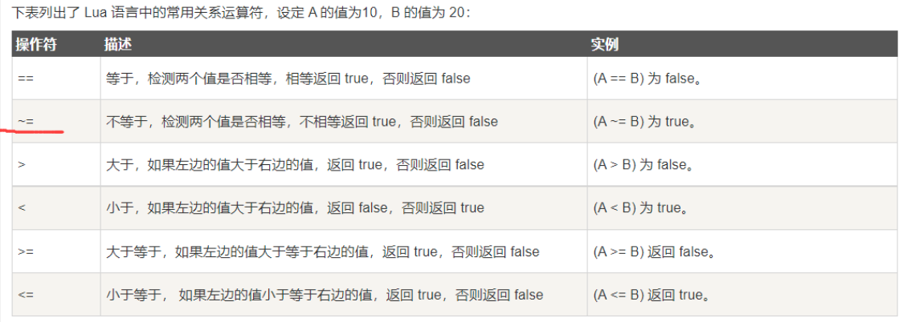


### 1.9.3 逻辑运算符


```
与或非  and or not
```


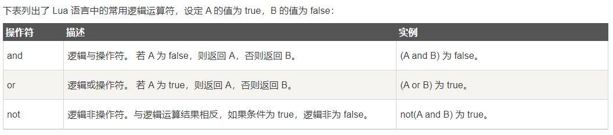


### 1.9.4   lua 中的三目运算符

需要已知：

```lua
tab = {"a"}

a= true and tab   -- a的结果是tab

-- 那么对于三目运算符   a?b:c   a为true就是b ，a为false就是c

-- (a and {b} or {c})[1]

--  如果a为true , a and b 的结果是 b，此时 b or c 因为b是一个非空table的结果就是true，所以不会or c直接返回{b}
--  由于{b}是一个table ,所以直接  {b}[1]就可以访问b的值了。

-- 如果a为false , a and b 的结果直接是false,不读{b},   然后是  false or {c} 此时，{c}是非空table为自己本身 {c}
-- 由于{C}是一个table ，所以直接 {c}[1]可以访问c的值
```


## 1.10 字符串与转义字符


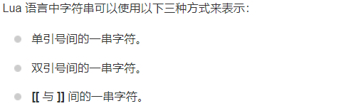


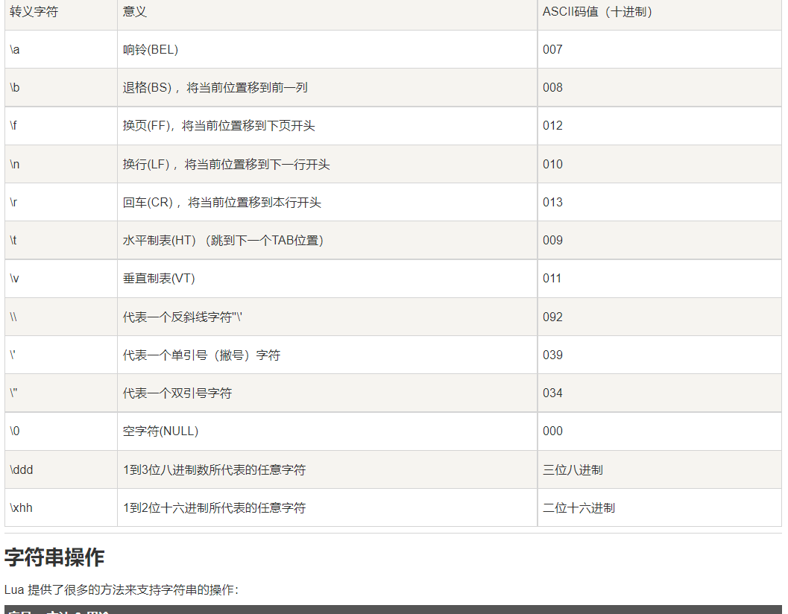


### 1.10.1 字符串操作

lua内置了一些字符串方法。


转换字符串大小写

```
string.upper()
string.lower()
```


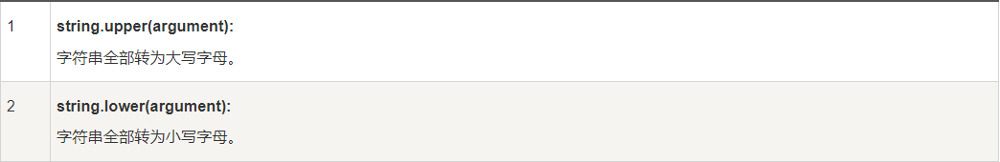


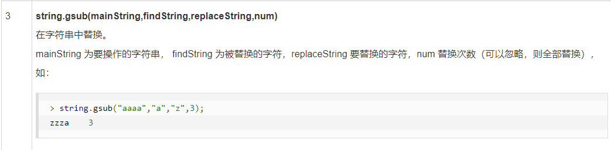


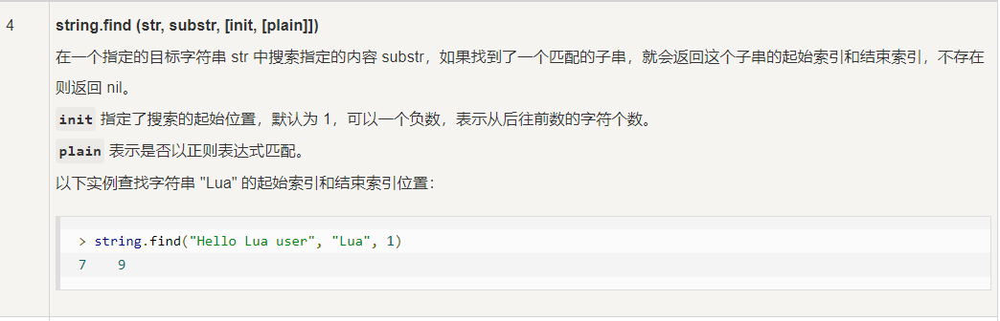


```
反转字符。格式化字符
string.reserve()
string.format(...)

```


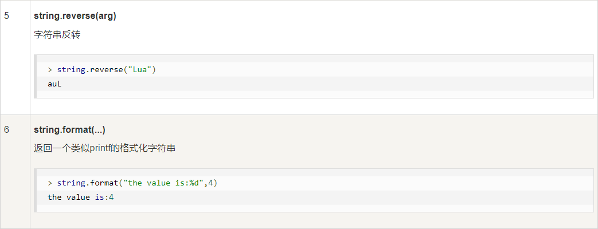


```
string.char(...) 将数字按照ASCII转换
string.byte() 将字符串按照ASCII转换为数字
```


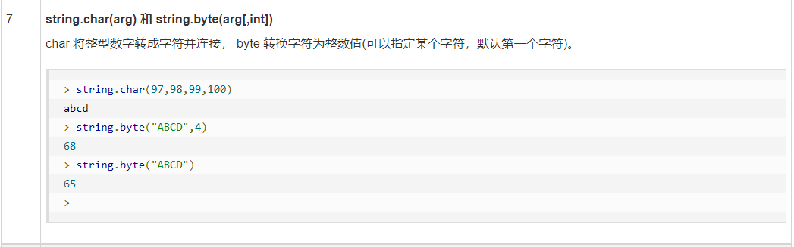


```
string.len()
```


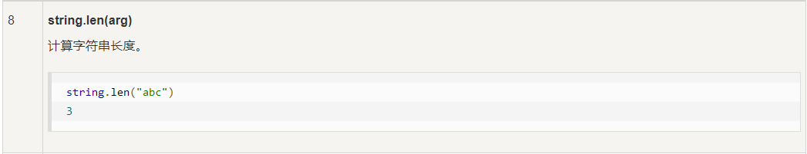


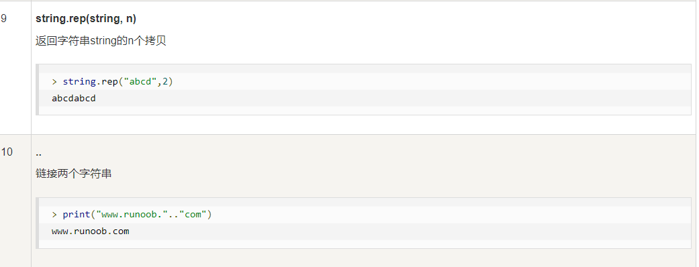


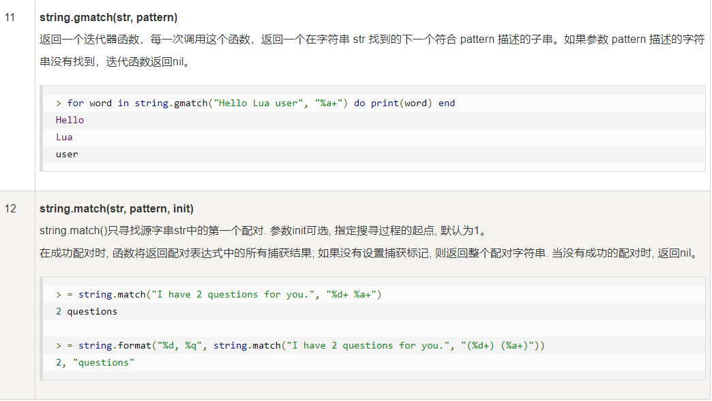


#### 10.10.1.1 字符串截取


```lua
string.sub(s, i [, j])
```

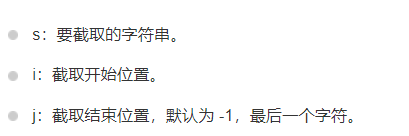


#### 10.10.1.2  字符串格式化

```
string.format
```


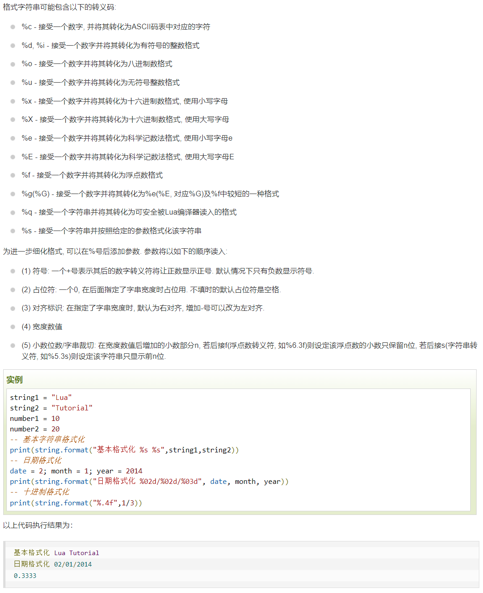


#### 10.10.1.3 正则

https://www.runoob.com/lua/lua-strings.html


## 1.11   lua数组


Lua 数组的索引键值可以使用整数表示，数组的大小不是固定的。


### 1.11.1 一维数组


```lua
tab = { "hello", "world","great"}

for i=1,#tab,1 do
        print(tab[i])
end
```


### 1.11.2 多维数组


```lua
arr = {}
row = 5
column = 5


for i=1,row,1 do
    arr[i]={}
    for j=1,column,1 do
        arr[i][j] = (i-1)*column + j
    end
end


print("travel arr")

for i=1, row ,1 do
    temp = ""
    
    for j=1,column,1 do
        temp = temp.."   "..arr[i][j]
    end
    print(temp)
end
```


## 1.12 迭代器


### 1.12.1  泛型for迭代器


```lua
tab = {"a","b","c","d","e","f"}

for k,v in pairs(tab) do
    print(k,v)
end
```


#### 泛型for的执行过程


```
1.首先初始化，计算 in 后面表达式的值 (就是 pairs(tab))
表达式应该返回泛型 for 需要的三个值：迭代函数、状态常量、控制变量.(与多值赋值一样，如果表达式返回的结果个数不足三个会自动用 nil 补足，多出部分会被忽略。)


2.将状态常量和控制变量作为参数调用迭代函数（注意：对于 for 结构来说，状态常量没有用处，仅仅在初始化时获取他的值并传递给迭代函数）。

3.将迭代函数返回的值赋给变量列表.

4.如果返回的第一个值为nil循环结束，否则执行循环体.

5.回到第二步再次调用迭代函数
```


在Lua中我们常常使用函数来描述迭代器，每次调用该函数就返回集合的下一个元素。Lua 的迭代器包含以下两种类型：

- 无状态的迭代器
- 多状态的迭代器


### 1.12.2   无状态迭代器

```lua
function square(maxCount,curNumber)
    if curNumber<maxCount then
        curNumber = curNumber+1
        return curNumber,curNumber*curNumber     
       --第一个返回值不是nil 就继续迭代下去。
   	end
    --如果 cur>max了,就返回nil了
end


for i,n in square,3,0 do     --square,3,0  是一个迭代器。
	print(i,n)
end
```


运行结果：

​	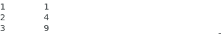


一个ipairs在lua中可以这样实现：

```
迭代函数  : iter
循环过程中不会改变的状态常量 : tab
当前的索引下标（控制变量） ： i
```


```lua
function iter(tab,i)
    i = i+1
    local v = tab[i]
    if v~=nil then
        return i,v
    end
end
    
    

function myIpairs(tab)
        return iter,tab,0   --返回一个迭代器    迭代函数,状态常量，控制变量
end

print("测试...")

tab = {"a","b","c"}

for k,b in myIpairs(tab) do
    print(k,v)
end

```


### 1.12.3 多状态迭代器

很多情况下，迭代器需要保存多个状态信息而不是简单的状态常量和控制变量，最简单的方法是使用闭包，还有一种方法就是将所有的状态信息封装到 table 内，将 table 作为迭代器的状态常量，因为这种情况下可以将所有的信息存放在 table 内，所以迭代函数通常不需要第二个参数。

```
使用闭包，免去传递参数
```


```lua
function eleIter(tab)
    local index = 0
    local size = #tab
    return	function()                         --这里使用闭包，访问了 index 和size,相当于不用传递另外2个参数
			    index = index+1                --整个闭包函数，就是迭代函数
		        if index < size then
       			    return tab[index]
            	else
            		return nil
            	end
        	end
end


tab = {"a","b","c","d","e"}

for element in eleIter(tab) do
        print(element)
end

```

输出结果

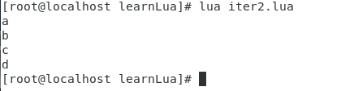


## 1.13 模块与包

```
模块类似于一个封装库，从 Lua 5.1 开始，Lua 加入了标准的模块管理机制.
```


### 1.13.1 定义模块

```
Lua 的模块是由变量、函数等已知元素组成的 table，因此创建一个模块很简单，就是创建一个 table，然后把需要导出的常量、函数放入其中，最后返回这个 table 就行。
```


这是一个简单的module示例

```lua
semghh = {}

semghh.magicNumber = "SEMGHH"


function semghh.fun1()
        print('这是一个共有函数')
end

local function fun2()
        print('这是一个私有函数')
end

function semghh.fun3()
        print('共有函数调用私有函数...fun2')
end


return semghh
```


### 1.13.2  引入模块

使用`require`函数来引入一个lua模块

```lua
--require("<模块名>")
[root@localhost learnLua]# lua
Lua 5.3.0  Copyright (C) 1994-2015 Lua.org, PUC-Rio
> require('semghhModule')
table: 0x1529bf0
> semghh.fun1()
这是一个共有函数
> semghh.fun3()
共有函数调用私有函数...fun2
> semghh.fun2()
stdin:1: attempt to call a nil value (field 'fun2')
stack traceback:
	stdin:1: in main chunk
	[C]: in ?
> 
```


给模块起一个别名，方便调用：

```lua
local m = require("module")
 
print(m.constant)
 
m.func3()
```


### 1.13.3 加载机制

[参考runoob](https://www.runoob.com/lua/lua-modules-packages.html)


require 从哪个路径加载 模块？

```dockerfile
#require 用于搜索 Lua 文件的路径是存放在全局变量 package.path 中,
#当 Lua 启动后，会以环境变量 LUA_PATH 的值来初始这个环境变量。

#输出一下 package.path
> print(package.path)
/usr/local/share/lua/5.3/?.lua;
/usr/local/share/lua/5.3/?/init.lua;
/usr/local/lib/lua/5.3/?.lua;
/usr/local/lib/lua/5.3/?/init.lua;
./?.lua;
./?/init.lua
```


#### lua解析环境变量规则

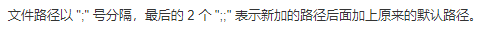


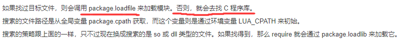


修改环境变量

```shell
#结尾必须是?.lua ,指定一个文件夹则无效
export LUA_PATH=/PATH/?.lua
```


#### CentOS7 下修改Lua_PATH


lua解析多个环境变量地址时，分隔符使用`;`  但Linux系统下，环境变量地址分隔符应当是 `:` 

这将导致：在Shell中 `export`导入`;`分隔的地址会出错 ，成功导入`:`分隔的地址，在LUA中无法解析...

```lua
--解决办法 在lua中改变 package.path的值， 例如

[root@localhost learnLua]# lua
Lua 5.3.0  Copyright (C) 1994-2015 Lua.org, PUC-Rio
> m=package.path    --取出path的值
> m = m..';/root/Desktop/learnLua/?.lua;/root/Desktop/learnLua/bin/?.lua'  --拼接新的地址
> package.path = m    --赋值回去
> require('semghhModule')  --导入模块
table: 0x9a0a10    --返回导入成功
```


还有一种猜测方式，修改 /etx/profile 文件 使用LUA能识别的 `;`分割

```
猜测可能只是Shell级别不允许;做分割。  所以尝试修改profile文件，还没有实践，不知能否实现。
```


### 1.13.4  C包


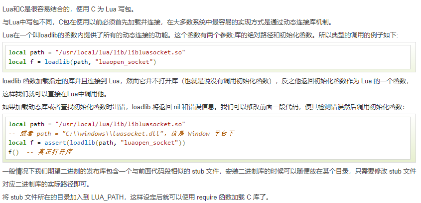


## 1.14  元表 Metatable

在 Lua table 中我们可以访问对应的 key 来得到 value 值，但是却无法对两个 table 进行操作(比如相加)。

因此 Lua 提供了元表(Metatable)，元表内定义了一些字段，一些方法(元方法)  

```
这些元字段，元方法 ， 允许我们改变 table 的行为，每个行为关联了对应的元方法。
```


```
换句话说，元方法就是完成特定功能的一类方法(体现在 让table具有了一些新的行为)。  
类似于 Java中的 toString() , equals()等方法 ，约定俗成的，代表一些行为功能的方法。
```


```
当 Lua 试图对两个表进行相加时，先检查两者之一是否有元表,
检查原表内是否有一个叫 __add 的字段，
若找到，则调用对应的值。 __add 等即是字段，其对应的值（往往是一个函数或是 table）就是"元方法"。
```


```shell
#对指定 table 设置元表(metatable)，如果元表(metatable)中存在 __metatable 键值，setmetatable 会失败
setmetatable(table,metatable)     #返回被设置了元表的table

#返回对象的元表(metatable)。
getmetatable(table)             #返回元表
```


### 1.14.1 元方法


#### __index

这是 metatable 最常用的键。

```
通过键来访问 table 的时候，如果这个键没有值，那么Lua就会寻找该table的metatable（假定有metatable）中的__index 键。
```


例如：

```lua
extend = {} 
extend.foo = 'abc'
tab = {}

setmetatable(tab,{ __index = extend})    -- {}声明了一个metatable ， __index元方法是另一个 table (extend)
									     -- 被设置的table : tab
print(tab.foo)  --访问tab的时候，如果本身没有foo，就去检查__index, 如果__index是一个table，就检查__index.foo

```


如果 __index 是一个函数，那么访问tab不存在的key的时候，就会调用 `__index`对应的函数，并且 tab 和 调用的key会作为参数传入这个函数

```lua
function metaFunction(t,key)                         --这里传入的tab是指被设置了metatable的table
        if t==tab then
                print('__index 传入的tab是  被设置了metatable的table')
        end
        if key =='hello' then
                return 'hello world'
        elseif key=='bye' then
                return 'see you'
        end
end


tab = {  key1 = "SEMGHH"}


print( (setmetatable(tab,{ __index = metaFunction})).hello)


```


Lua 查找一个表元素时的规则，其实就是如下 3 个步骤:

```
- 1.在表中查找，如果找到，返回该元素，找不到则继续
- 2.判断该表是否有元表，如果没有元表，返回 nil，有元表则继续。
- 3.判断元表有没有 __index 方法，如果 __index 方法为 nil，则返回 nil；如果 __index 方法是一个表，则重复 1、2、3；如果 __index 方法是一个函数，则返回该函数的返回值。
```


#### __newindex 

```
__newindex 元方法用来对表更新，__index则用来对表访问 。
```


当tabA的metatable中存在`__newindex`元方法, 且 `__newindex`是一个table ( 这里称作 tabB)  的时候

```
对tabA增加新的 kv 实际上被新增给了 tabB.
同时 tabA.newkey 访问是一个nil
	tabB.newkey 则可以访问。
```

下面是一个示例：

```lua
tabA = { a = 'a'    }


tabB = {}


setmetatable(tabA,{ __newindex=tabB   })


tabA.b = 'b'           --注意，原tabA不存在b这个key, 对原有的key进行值覆盖不会触发

print('tabA.b : ', tabA.b)    --访问的是一个nil
print('tabB.b : ', tabB.b)    --可以正常访问
```


```
__newindex存在的意义就是，不允许其他人破坏原 tabA的结构，想做出更改,只能对__newindex这个Table更改。
```


当tabA的metatable中存在`__newindex`元方法, 且 `__newindex`是一个函数的时候

```
调用这个函数. 这个函数会自动传入3个参数    tabA, newkey,newvalue
```


```lua
tabA = { a = "a"}

function newindexFun(t,k,v)
        if t ==tabA then
                print('是被设置了metatable的原table')
        end

        print('新的key : ',k)
        print('新的value : ',v)
end


setmetatable(tabA, { __index = {} , __newindex=newindexFun    })

print(tabA.a)

tabA.b = "b"
```

运行截图：

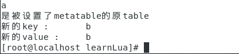


#### table运算


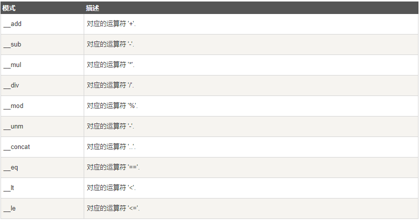


一个重写了 __add的运算

```lua
-- 计算表中最大值，table.maxn在Lua5.2以上版本中已无法使用
-- 自定义计算表中最大键值函数 table_maxn，即计算表的元素个数
function table_maxn(t)
    local mn = 0
    for k, v in pairs(t) do
        if mn < k then
            mn = k
        end
    end
    return mn
end

-- 两表相加操作
mytable = setmetatable({ 1, 2, 3 }, {
  __add = function(mytable, newtable)
    for i = 1, table_maxn(newtable) do
      table.insert(mytable, table_maxn(mytable)+1,newtable[i])
    end
    return mytable
  end
})

secondtable = {4,5,6}

mytable = mytable + secondtable
        for k,v in ipairs(mytable) do
print(k,v)
end
```


#### __tostring

__tostring 元方法用于修改表的输出行为。


```lua
function myToString(tab)

        local res = '{'

        for k,v in pairs(tab) do
                local temp = ' '..k..'='..v..','
                res = res..temp
        end
        res = string.sub(res,1,string.len(res)-1) ..' }'
        return res
end


tabA = setmetatable({a='a',b='hello world',c='c',d='d' },{ __tostring=myToString })


print(tabA)
```


运行结果

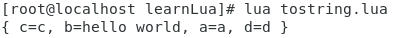


# 2.  一些方法


## 2.1  tonumber()

参考博客 https://www.jianshu.com/p/e51348da59b8


## 2.2  tostring()


