# 1.  快速开始


## 1.1  demo

引入一个提供的demo快速入门 mybatis-plus


### 1.1.1 准备数据库

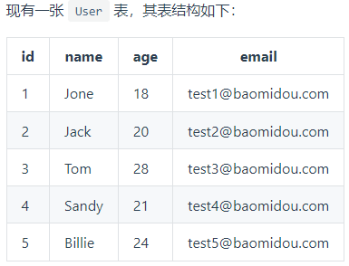


其对应的数据库 Schema 脚本如下：

```SQL
DROP TABLE IF EXISTS user;

CREATE TABLE user
(
	id BIGINT(20) NOT NULL COMMENT '主键ID',
	name VARCHAR(30) NULL DEFAULT NULL COMMENT '姓名',
	age INT(11) NULL DEFAULT NULL COMMENT '年龄',
	email VARCHAR(50) NULL DEFAULT NULL COMMENT '邮箱',
	PRIMARY KEY (id)
);
```

对应的表内数据如下

```sql
INSERT INTO user (id, name, age, email) VALUES
(1, 'Jone', 18, 'test1@baomidou.com'),
(2, 'Jack', 20, 'test2@baomidou.com'),
(3, 'Tom', 28, 'test3@baomidou.com'),
(4, 'Sandy', 21, 'test4@baomidou.com'),
(5, 'Billie', 24, 'test5@baomidou.com');
```


初始化一个Springboot工程


pom中的配置依赖

```xml
    <properties>
        <java.version>1.8</java.version>
        <project.build.sourceEncoding>UTF-8</project.build.sourceEncoding>
        <project.reporting.outputEncoding>UTF-8</project.reporting.outputEncoding>
        <spring-boot.version>2.3.7.RELEASE</spring-boot.version>
    </properties>

    <dependencies>
        <dependency>
            <groupId>mysql</groupId>
            <artifactId>mysql-connector-java</artifactId>
        </dependency>
        <dependency>
            <groupId>com.baomidou</groupId>
            <artifactId>mybatis-plus-boot-starter</artifactId>
            <version>3.4.2</version>
        </dependency>
        <dependency>
            <groupId>org.mybatis.spring.boot</groupId>
            <artifactId>mybatis-spring-boot-starter</artifactId>
            <version>2.1.4</version>
        </dependency>

        <dependency>
            <groupId>org.springframework.boot</groupId>
            <artifactId>spring-boot-starter-test</artifactId>
            <scope>test</scope>
            <exclusions>
                <exclusion>
                    <groupId>org.junit.vintage</groupId>
                    <artifactId>junit-vintage-engine</artifactId>
                </exclusion>
            </exclusions>
        </dependency>
    </dependencies>

    <dependencyManagement>
        <dependencies>
            <dependency>
                <groupId>org.springframework.boot</groupId>
                <artifactId>spring-boot-dependencies</artifactId>
                <version>${spring-boot.version}</version>
                <type>pom</type>
                <scope>import</scope>
            </dependency>
        </dependencies>
    </dependencyManagement>
```


### 1.1.2 配置 application.properties


```properties
spring.application.name=learningMybatisPlus

mybatis.mapper-locations=classpath:mappers/*xml

mybatis.type-aliases-package=com.example.learningmybatisplus.mybatis.entity


#配置driver类
spring.datasource.driver-class-name=com.mysql.cj.jdbc.Driver
#配置 表的schema 
spring.datasource.schema=classpath:db/user.sql
#配置 表的数据
spring.datasource.data=classpath:db/data.sql
spring.datasource.url=jdbc:mysql://127.0.0.1:3306/mybatisplus?serverTimezone=GMT%2B8
spring.datasource.password=zxc,./123
spring.datasource.username=root
```


### 1.1.3  编写实体类 Entity


```java
@Data
public class User {

    private Long id;
    private String name;
    private Integer age;
    private String email;
}
```


### 1.1.4  继承BaseMapper<T>


Mybatis plus的核心之一，就是BaseMapper

编写的mapper 需要继承BaseMapper

BaseMapper内提供了一些基础的方法帮助进行简单SQL查询


```java
public interface UserMapper extends BaseMapper<User> {

}
```


开启@MapperScan，扫描Mapper

```java
@SpringBootApplication
@MapperScan(basePackages = {"com.example.learningmybatisplus.mapper"})
public class LearningMybatisPlusApplication {

    public static void main(String[] args) {
        SpringApplication.run(LearningMybatisPlusApplication.class, args);
    }

}
```


### 1.1.5 测试并运行


```java
@SpringBootTest
class LearningMybatisPlusApplicationTests {


    @Autowired
    UserMapper userMapper;


    @Test
    void contextLoads() {

        List<User> users = userMapper.selectList(null);
        System.out.println(users);


    }

}
```

运行结果：

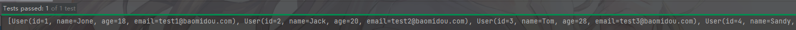


# 2.  注解


## 2.1   @TableName

表名注解。


```
通常并不需要在 Entity类上标注 @TableName 
因为mp会自动推断表明(根据实体类的类名 , 驼峰式命名自动转换)
如果实体类的类名和表名无法直接推断,就需要标注@TableName 来指明
```


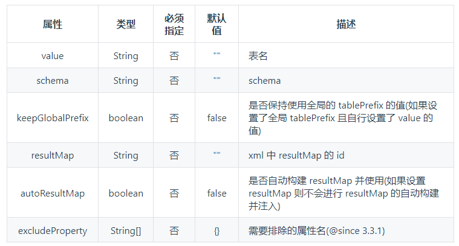


## 2.2  @TableId

用于标注表中的 主键


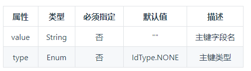


这个注解主要用于解决 insert记录时，主键的问题。

```
如果当前表主键字段是自增的,那么新插入的 Entity不需要覆盖主键字段。此时需要设置为 idType.AUTO

如果主键ID涉及到了分布式唯一性(雪花算法) 那么可以使用  idType.ASSIGN_ID
同时,可以通过实现 IdentifierGenerator接口来自定义一个生成主键ID的方法

```


注意到 type是一个枚举类型:


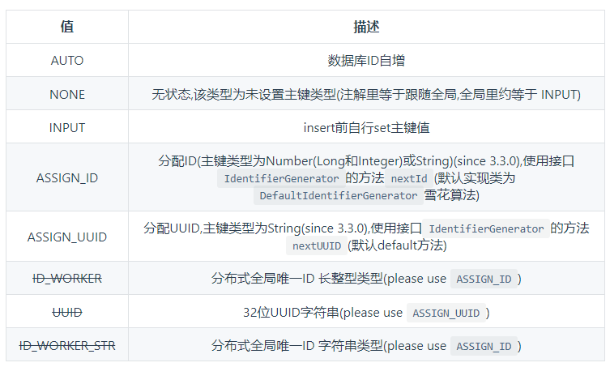


### 2.2.1 自动填充问题

mybatis会自动填充id，如果不希望Mybatis填充需要加上 `@TableId(type=IdType.AUTO)`表示是数据库自增主键。

```java
    @TableId(type = IdType.AUTO)
    Integer id;
```


## 2.3@TableField


其余注解参考官方文档

https://www.mybatis-plus.com/guide/annotation.html#tablefield


# 3.  核心功能


## 3.1   代码生成器  3.5.1+ 

参考官方文档

https://www.mybatis-plus.com/guide/generator-new.html#%E5%BF%AB%E9%80%9F%E5%85%A5%E9%97%A8


依赖：

```
        <dependency>
            <groupId>com.baomidou</groupId>
            <artifactId>mybatis-plus-generator</artifactId>
            <version>3.5.3</version>
        </dependency>

<!-- https://mvnrepository.com/artifact/org.freemarker/freemarker -->
<dependency>
    <groupId>org.freemarker</groupId>
    <artifactId>freemarker</artifactId>
    <version>2.3.28</version>
</dependency>

```


### 3.1.1 配置

配置以链式调用的方式，写在Java类中。

```
需要写 多种配置
```


#### 必要配置

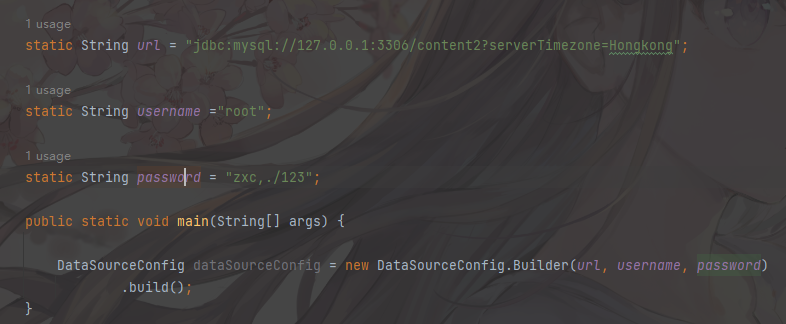

```java
    static String url = "jdbc:mysql://127.0.0.1:3306/content2?serverTimezone=Hongkong";

    static String username ="root";

    static String password = "zxc,./123";

    public static void main(String[] args) {

        DataSourceConfig dataSourceConfig = new DataSourceConfig.Builder(url, username, password)
                .build();
    }
```


#### 可选配置


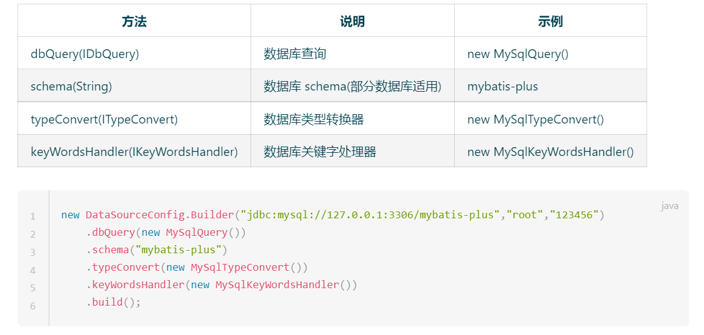


### 3.1.2 全局配置

GlobalConfig

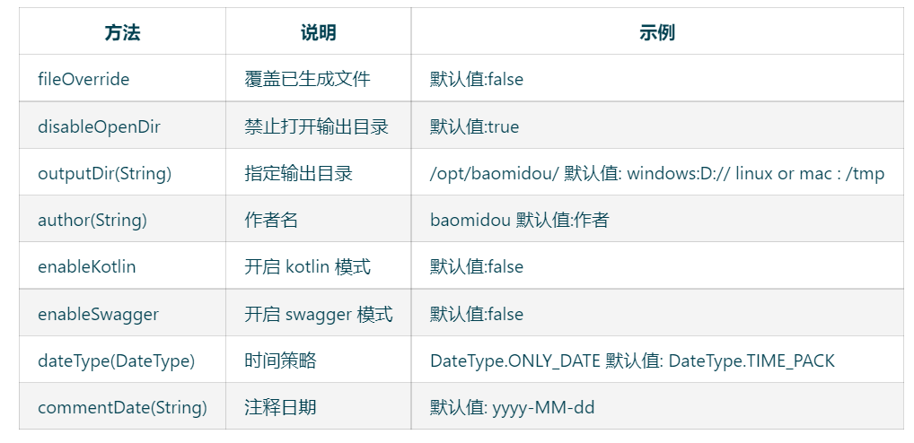


```java
    static String author = "Semghh";

    //生成文件的地址
    static String outputDir = "C:\\Users\\SemgHH\\Desktop\\temp";

    //用于格式化生成代码中,注释的日期
    static String commentDateFormat = "yyyy_MM_dd hh:mm:ss";

    public static void main(String[] args) {
		GlobalConfig globalConfig = new GlobalConfig.Builder()
                .author(author)
                .fileOverride() //是否覆盖已经生成文件
                .outputDir(outputDir)
                .dateType(DateType.ONLY_DATE)
                .commentDate(commentDateFormat)
                .build();
    }
```


### 3.1.3 包配置


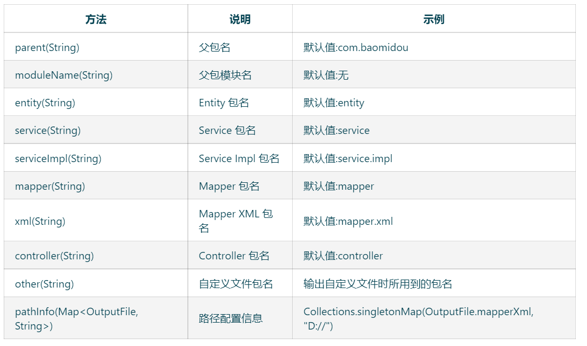


```

```


### 3.1.4 策略配置

大体上分为： 表过滤策略，Entity策略，Controller策略，Service策略，Mapper策略


#### 表过滤策略

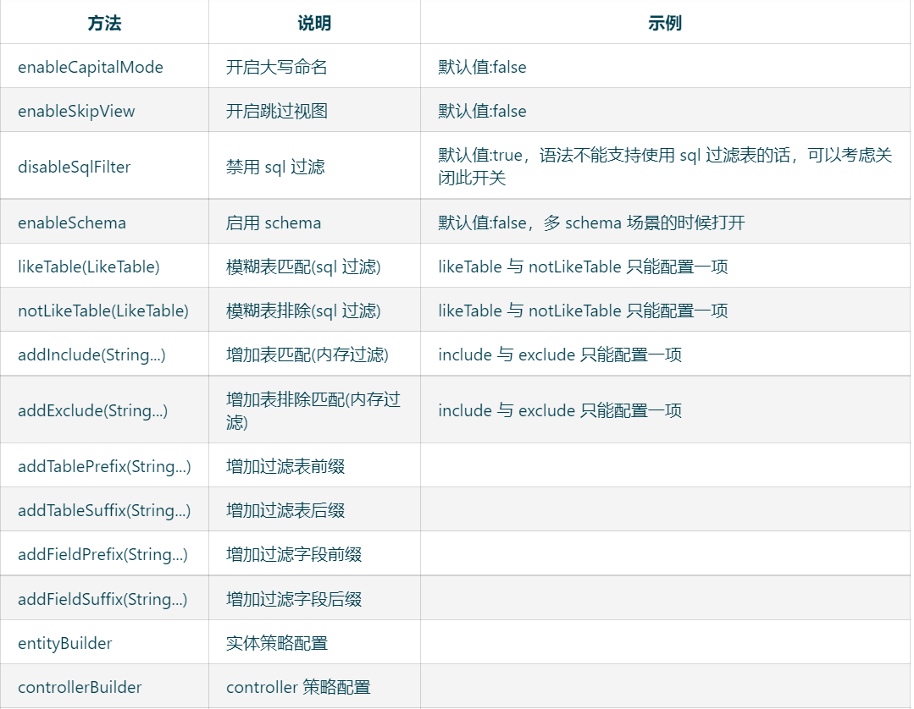

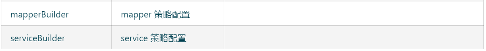


#### Entity策略


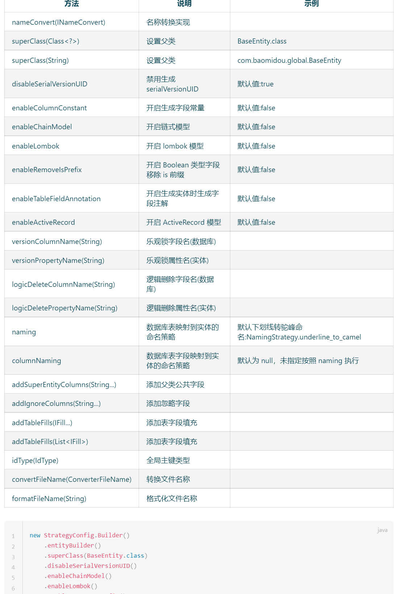


#### Controller策略

https://baomidou.com/pages/981406/#controller-%E7%AD%96%E7%95%A5%E9%85%8D%E7%BD%AE


#### Service策略

https://baomidou.com/pages/981406/#service-%E7%AD%96%E7%95%A5%E9%85%8D%E7%BD%AE


#### Mapper策略

https://baomidou.com/pages/981406/#mapper-%E7%AD%96%E7%95%A5%E9%85%8D%E7%BD%AE


## 3.2   CRUD 接口


### 3.2.1  mapper层CRUD

mapper层主要借助 BaseMapper<T> 这个类。

```
所有的mapper都需要继承自 BaseMapper
```


BaseMapper封装了一些基本的方法，这些方法都不需要开发者实现，mp通过其他信息反推实现。


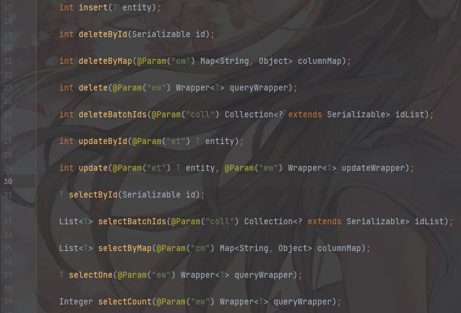


#### 增

```
int insert(T entity)                      插入一条行记录
int deleteById(Serializable id)           根据id删除一条行记录，只要是jdk可序列化的类都可以传入
int deleteBatchIds(@Param("coll") Collection<? extends Serializable> idList);   根据id批量删除
```


#### 删

```
deleteByMap(Map<String,Object> columnMap)  //传入 列名和对应的值,必须同时满足全部的Map内条件才会删除
```

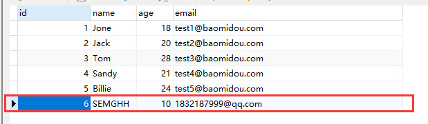


```java
    @Test
    void contextLoads() {

        HashMap<String, Object> columnMap = new HashMap<>();
        columnMap.put("name","SEMGHH");
        columnMap.put("age",10);
        columnMap.put("email","aaaaa@qq.com");  //显然不满足  
//		columnMap.put("email","1832187999@qq.com");

        int i = userMapper.deleteByMap(columnMap);
        System.out.println(i);  
    }
```


```
int delete(@Param("ew") Wrapper<T> queryWrapper);  // 传入一个查询条件包装类删除   Wrapper类是 plus的核心之一

后续介绍
```


#### 改

```java
int updateById(@Param("et") T entity);                  //传入的Entity必须带有id

int update(@Param("et") T entity, @Param("ew") Wrapper<T> updateWrapper);
//传入实体，并传入一个修改的Wrapper
```


#### 查

```java
    T selectById(Serializable id);  //通过id查

    List<T> selectBatchIds(@Param("coll") Collection<? extends Serializable> idList); //通过id批量查

    List<T> selectByMap(@Param("cm") Map<String, Object> columnMap); //根据传入的 columnMap查

    T selectOne(@Param("ew") Wrapper<T> queryWrapper);  //传入一个Wrapper<T>

    Integer selectCount(@Param("ew") Wrapper<T> queryWrapper);

    List<T> selectList(@Param("ew") Wrapper<T> queryWrapper);  //传入wrapper批量查询

    List<Map<String, Object>> selectMaps(@Param("ew") Wrapper<T> queryWrapper);

    List<Object> selectObjs(@Param("ew") Wrapper<T> queryWrapper);

    <E extends IPage<T>> E selectPage(E page, @Param("ew") Wrapper<T> queryWrapper);  //分页查询

    <E extends IPage<Map<String, Object>>> E selectMapsPage(E page, @Param("ew") Wrapper<T> queryWrapper);
	//分页查询，包装成一个Map
```


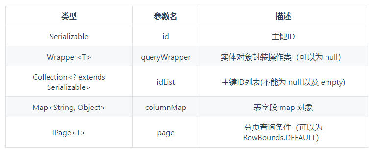


```
对于 QueryWrapper来说，传入null，标识没有额外的查询条件 select *
```


### 3.2.2   Service CRUD

通常来说，Service可以 继承ServiceImpl这个类，  M 表示对应的mapper, T表示对应的Entity

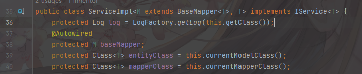


#### 3.2.2.1  Save

```java
boolean save(T entity);
// 插入（批量）
boolean saveBatch(Collection<T> entityList);
// 插入（批量）
boolean saveBatch(Collection<T> entityList, int batchSize);  // batchSize插入批次数量
```


```java
// TableId 注解存在更新记录，否插入一条记录
boolean saveOrUpdate(T entity);
// 根据updateWrapper尝试更新，否继续执行saveOrUpdate(T)方法
boolean saveOrUpdate(T entity, Wrapper<T> updateWrapper);
// 批量修改插入
boolean saveOrUpdateBatch(Collection<T> entityList);
// 批量修改插入
boolean saveOrUpdateBatch(Collection<T> entityList, int batchSize);
```


#### 3.2.2.2 Remove


```java
boolean remove(Wrapper<T> queryWrapper);
// 根据 ID 删除
boolean removeById(Serializable id);
// 根据 columnMap 条件，删除记录
boolean removeByMap(Map<String, Object> columnMap);
// 删除（根据ID 批量删除）
boolean removeByIds(Collection<? extends Serializable> idList);
```


#### 3.2.2.3 Update

```java
// 根据 UpdateWrapper 条件，更新记录 需要设置sqlset
boolean update(Wrapper<T> updateWrapper);
// 根据 whereWrapper 条件，更新记录
boolean update(T updateEntity, Wrapper<T> whereWrapper);
// 根据 ID 选择修改
boolean updateById(T entity);
// 根据ID 批量更新
boolean updateBatchById(Collection<T> entityList);
// 根据ID 批量更新
boolean updateBatchById(Collection<T> entityList, int batchSize);
```


#### 3.2.2.4 Get

```java
T getById(Serializable id);
// 根据 Wrapper，查询一条记录。结果集，如果是多个会抛出异常，随机取一条加上限制条件 wrapper.last("LIMIT 1")
T getOne(Wrapper<T> queryWrapper);
// 根据 Wrapper，查询一条记录
T getOne(Wrapper<T> queryWrapper, boolean throwEx);
// 根据 Wrapper，查询一条记录
Map<String, Object> getMap(Wrapper<T> queryWrapper);
// 根据 Wrapper，查询一条记录
<V> V getObj(Wrapper<T> queryWrapper, Function<? super Object, V> mapper);
```


#### 3.3.2.5 List

```java
// 查询所有
List<T> list();
// 查询列表
List<T> list(Wrapper<T> queryWrapper);
// 查询（根据ID 批量查询）
Collection<T> listByIds(Collection<? extends Serializable> idList);
// 查询（根据 columnMap 条件）
Collection<T> listByMap(Map<String, Object> columnMap);
// 查询所有列表
List<Map<String, Object>> listMaps();
// 查询列表
List<Map<String, Object>> listMaps(Wrapper<T> queryWrapper);
// 查询全部记录
List<Object> listObjs();
// 查询全部记录
<V> List<V> listObjs(Function<? super Object, V> mapper);
// 根据 Wrapper 条件，查询全部记录
List<Object> listObjs(Wrapper<T> queryWrapper);
// 根据 Wrapper 条件，查询全部记录
<V> List<V> listObjs(Wrapper<T> queryWrapper, Function<? super Object, V> mapper);
```


#### 3.3.2.6 Page<T>

Page<T>就是mp的分页数据类型。


```java
// 无条件分页查询
IPage<T> page(IPage<T> page);
// 条件分页查询
IPage<T> page(IPage<T> page, Wrapper<T> queryWrapper);
// 无条件分页查询
IPage<Map<String, Object>> pageMaps(IPage<T> page);
// 条件分页查询
IPage<Map<String, Object>> pageMaps(IPage<T> page, Wrapper<T> queryWrapper);
```


#### 3.3.2.7 Count

​	

```java
// 查询总记录数
int count();
// 根据 Wrapper 条件，查询总记录数
int count(Wrapper<T> queryWrapper);
```


### 3.2.3  Wrapper

Wrapper被称为条件构造器。专门用于构建SQL语句的查询条件的。


Wrapper的继承树如下：


```
抽象Wrapper
抽象链Wrapper
```


AbstractWrapper的继承树如下


```
大致分两类：
查询Wrapper
更新Wrapper
```


#### 3.2.3.1 AbstractWrapper

AbstractWrapper提供了非常多的  SQL 判断条件

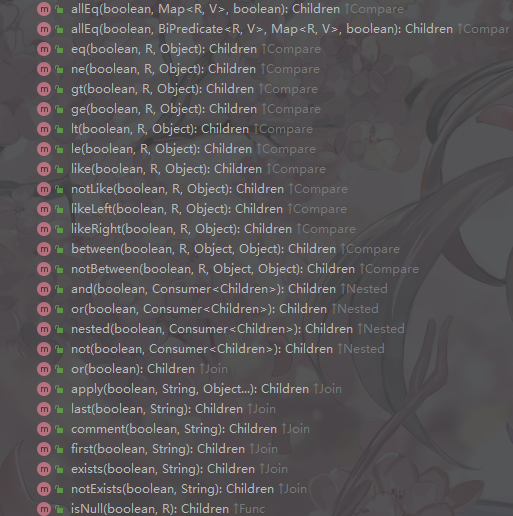


##### allEq


```java
allEq(Map<R, V> params)         //params : key为数据库字段名,value为字段值
allEq(Map<R, V> params, boolean null2IsNull)   //null2IsNull : 为true则在map的value为null时调用 isNull 方法,为
                                               //false时则忽略value为null的
allEq(boolean condition, Map<R, V> params, boolean null2IsNull)
```


#### 3.2.3.2 QueryWrapper


# 4.FreeMarker


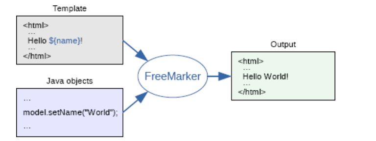


# 5. 一些备忘


## 5.1 开启sql日志打印

```properties
mybatis-plus.configuration.log-impl=org.apache.ibatis.logging.stdout.StdOutImpl
```


对应的`mybatis`的日志打印配置 : 

`mybatis.configuration.log-impl=org.apache.ibatis.logging.stdout.StdOutImpl`

失效。


