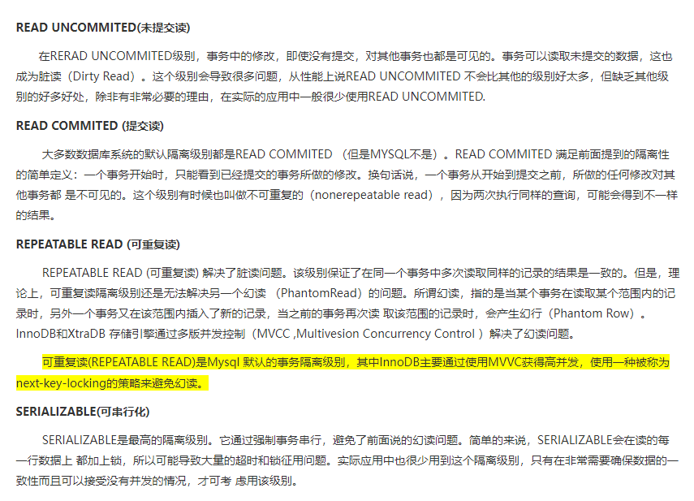
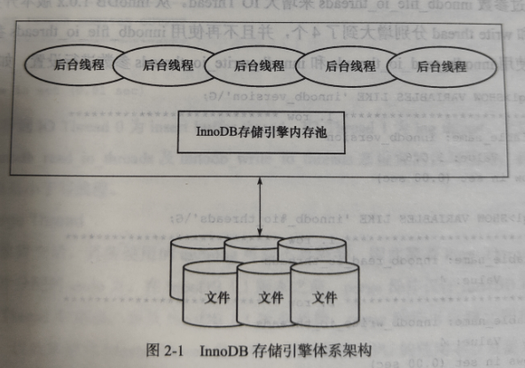

# 1. InnoDB 引擎

InnoDB是事务安全的存储引擎。 InnoDB是一个高可用、高并发、高可用的存储引擎。


## 1.1  数据库、实例


严格上来讲：

```
数据库： 物理文件、或其他形式文件集合。
在MySql数据库中，可以是 frm MYD ibd结尾的文件。
```

```
实例：  mysql数据库后台线程，以及一个共享内存区。

数据库实例是一个程序，用于操作数据库文件。

Mysql数据库实例在系统上的表现就是一个进程。
```

## 1.2 Mysql引擎


mysql数据库支持多种引擎。不同的引擎具有不同的特性、和优点。

### 1.2.1 插件式的引擎架构

```
mysql的引擎是以表为单位，而不是库为单位。

即：1张表对应1种引擎。这样的好处显而易见:

我们可以根据不同的应用、建立不同存储引擎的表。
```


## 1.3 InnoDB概述


### 1.3.1 一些特点


````
支持行锁     //并发效率高
支持事务
支持外键

支持非锁定读 ：即 默认读操作不会产生锁。 //  这样读操作的开销会小

实现了SQL标准的4中隔离级别
````


### 1.3.2 SQL4种隔离级别


https://www.cnblogs.com/lz0925/articles/10761771.html

 


## 1.4 InnoDB 体系架构


### 1.4.1  InnoDB 体系架构概述


```
事实上。存储引擎就是 数据库实例的核心、也就是对数据库文件进行管理的程序。


也就是说，真正如何操作 数据库文件。完全由这个程序(存储引擎)决定。
```


````
InnoDB存储引擎，由一些后台线程和内存池组成。

它的主要工作有：

1.完成所有进程/线程 需要访问的多个内部数据结构
2.在内存中缓存磁盘的数据。实现快速读取
3.重做日志 (redo log)缓冲
...
````




### 1.4.2 后台线程


后台线程的主要作用：

 刷新内存池中的数据，保证总是最新数据。

异步地将内存池中缓存数据写入到磁盘。

数据库发生异常时，InnoDB能恢复到正常运行状态。 （依靠的就是 redo log 重做日志）


```
InnoDB引擎是多线程模型。各个线程处理不同任务
```


Master Thread

````
异步刷新 内存缓存到磁盘中。
````


### 1.4.3 内存

```
InnoDB引擎是基于磁盘存储的。 记录按照页的方式进行管理。

为了消除cpu与磁盘之间巨大的速度鸿沟，必须使用内存作为缓存池，来提高读写速度。
```


```
缓存池的单位：页。
现将磁盘的页读入到缓存池中。判断缓存池是否命中，如果未命中则从磁盘中读取。

对页的修改操作，也是先对缓存池中的页进行修改。再刷新到磁盘中。值得注意的是:并不是当缓存池的页修改发生后，立马刷新到磁盘中。而是存续 CheckPoint机制。
```

### 1.4.4 重做日志 redo log

https://www.cnblogs.com/cuisi/p/6525077.html


```
通过上面对比，可以总结：

二进制日志，保存的大而全。但是保存的还原点不如redo log精确。在一次事务提交完成后才写入。也就是说，如果在事务执行中宕机了、很有可能无法恢复这次事务。


redo log，仅仅保存InnoDB的页更改情况。在事务进行中就不断的保存，可以最大限度的还原宕机前的状态。
```


