# 1、nginx 基本概念


## 1.1 反向代理


说人话： 先从正向代理(通常简称 ：代理)

```
正向代理指，为客户端代理。让服务器无感知。服务器并不知道对方是否是真正的用户。


本来：   

[客户端]  发请求--->> [服务器]       /   [服务器]   响应请求--->>  [客户端]

正向代理： 

[客户端]  发请求--->> [中间代理] | 转交--->>  [服务器]     /      [服务器]  响应请求--->> | [代理]  转交--->> [客户端]
```


```
正向代理： 在服务器眼里 中间代理就是用户端。他并不知道有中间代理。
```


反向代理和上述过程相反：

```
用户以为请求的就是真正的 服务器。  而不知道有中间代理转交给真正的服务器。
```


##  1.2 负载均衡


负载均衡的前置条件：

```
存在多个完全一样的单体应用服务器。 //谁来处理请求，最终的结果完全一样

需要一个负载均衡的主机，用于接收全部请求，分发全部请求。返回全部响应请求。

依托于反向代理。  //用户可以不需要根据负载均衡结果改变访问地址，而是使用反向代理转交用户的请求。
```


### 1.2.1 负载均衡官方文档


#### 1.2.1.1 负载均衡介绍


It is possible to use nginx as a very efficient HTTP load balancer to distribute traffic to several application servers and to improve performance, scalability and reliability of web applications with nginx.

```
可以使用nginx作为http请求的负载均衡器 应用于分布式的服务。
这样可以提高Web服务的 性能表现， 扩展性，可靠性
```


#### 1.2.1.2  五种平衡策略


```
nginx支持5种负载均衡策略
```


##### 轮询

- round-robin — requests to the application servers are distributed in a round-robin fashion

  ```
  //轮询。 假设有abc个服务，每次的请求，将按照a-b-c-a-b-c...的策略轮询下去。
  
  
  
  简单的轮询,可能导致的问题是： 某一些机器挤压的服务过多，导致请求失败。
  原因： 机器之间的处理能力可能有差异，其他原因
  ```
  
  

  

  

  


##### 最少连接数


- least-connected — next request is assigned to the server with the least number of active connections,

  ```
  // 最少连接数。   下一次的请求被提交给拥有最少活动连接数的服务。
  
  //解决了轮询可能出现的弊端。
  ```

  


##### 对用户ip哈希

一致性哈希。用于解决Session不一致问题。当然也可以使用分布式Session等手段。


- ip-hash — a hash-function is used to determine what server should be selected for the next request (based on the client’s IP address).

  

  ```
  //ip哈希算法，对用户ip使用hash算法，来得到用户请求的目标服务。
  
  哈希算法的好处是，同一个用户总是会被同一个机器响应。这样可以使用Session等存储结构
  
  ```


详情1.2.1.5


##### 最少时间

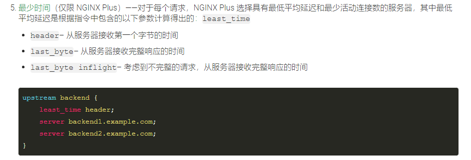


##### 随机

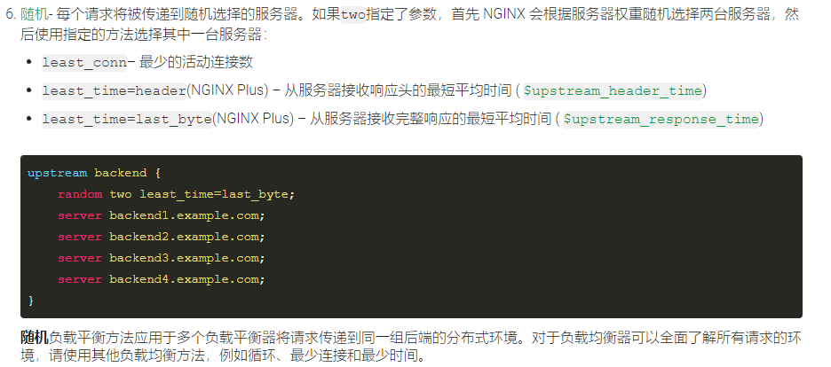


#### 1.2.1.3   配置负载均衡


##### 简单的负载均衡示例：


```
使用 upstream <Name> 块来声明一个负载均衡配置。 在块内声明所有服务的地址。

在location中使用 proxy_pass <Name> 通过name来指定负载均衡块
```


```nginx
http {
    upstream myapp1 {
        ip_hash;
        #least_conn;
        #hash $request_uri consistent;
        # Round Robin – 请求在服务器之间均匀分布，并考虑服务器权重。默认情况下使用此方法（没有启用它的指令
        server srv1.example.com;
        server srv2.example.com;
        server srv3.example.com;
    }

    server {
        listen 80;

        location / {
            proxy_pass http://myapp1;
        }
    }
}

```


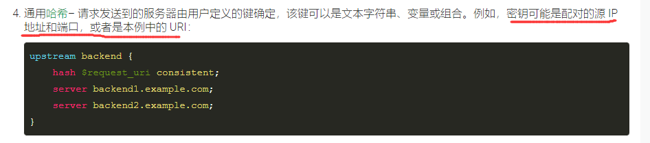


那我来实际测试一下:

```nginx
http {
	...

    upstream myAppMappingGroup {
        least_conn;   #最少连接数方式
        server 127.0.0.1:10012; # 以本机的nginx 服务配置的负载均衡
        server 127.0.0.1:10010; 
        server 127.0.0.1:10011;
    }
    
	server {
        listen 10010;
        server_name content1;
        root /usr/share/nginx/dist1/;

        location /{
        }
    }
    
  	server {
        listen 10011;
        server_name content2;
        root /usr/share/nginx/dist1/;

        location /{
        }
    }
    
  	server {
        listen 10012;
        server_name content3;
        root /usr/share/nginx/dist1/;

        location / {
        }
	}
	
 	 server { #启动一个服务，以http代理 myAppMappingGroup  upstream
        listen 10086; #提供服务在10086端口

        location / {
                proxy_pass http://myAppMappingGroup;
        }

	}

```


#### 1.2.1.4 默认的负载均衡配置


```nginx
http {
    upstream myapp1 {  #全部的请求都被代理到 服务群 myapp1中。通过 nginx HTTP请求负载均衡器 分发请求。
        server srv1.example.com;
        server srv2.example.com;
        server srv3.example.com;
    }

    server {
        listen 80;

        location / {
            proxy_pass http://myapp1;
        }
    }
}
```


```
如果不指明轮询算法，则默认使用轮询方式
```


##### nginx支持的负载均衡协议

```
HTTP, HTTPS, FastCGI, uwsgi, SCGI, memcached,  gRPC
```


##### 修改负载均衡的协议

如何修改？

```nginx
#在proxy_pass 属性中， 需要明确指明协议类型。所以修改负载均衡的协议只需要修改协议类型即可

proxy_pass http://myapp1;
proxy_pass https://myapp1;
proxy_pass FastCGI://myapp1;
```


#### 1.2.1.5 会话持久性问题（session persistence）

在1.2.1.2中我们提到过这个问题。


```
在Web服务中，有一个常用的数据结构 Session(会话)。 用于存储同一个用户，在一次会话中的临时数据。


但是如果使用负载均衡的方式，Session这种数据结构就会失效。使用Session就会很不安全。
```


例如：

使用 round-robin / leastest-connection 方式，用户可能会被分发到不同的服务器,无法分发到上次会话的服务器。


解决方案：

使用 ip-hash  方式解决 会话持久性问题。（前提是用户ip地址不变）

```nginx
upstream myapp1 {
    ip_hash;   #ip_hash 方法
    server srv1.example.com;
    server srv2.example.com;
    server srv3.example.com;
}
```

缺点是，负载均衡的效果将会一定程度的降低。

```
有些用户的请求可能非常频繁，导致为其服务的服务器总是处于繁忙的状态。负载均衡没有起到 充分分摊用户请求的效果。
```


#### 1.2.1.6  加权负载均衡 

weighted load balancing (加权负载均衡)


```
使用加权负载均衡我们可以给性能更强的机器分配更多请求。 //使负载均衡更加合理
```


```nginx
    upstream myapp1 {
        server srv1.example.com weight=3;
        server srv2.example.com;
        server srv3.example.com;
    }
```


#### 1.2.1.7  慢启动

服务器慢启动功能可防止最近恢复的服务器被连接淹没，这可能会超时并导致服务器再次被标记为失败。

```
可以通过指令的slow_start参数来完成
```

```nginx
upstream backend {
    server backend1.example.com slow_start=30s;
    server backend2.example.com;
    server 192.0.0.1 backup;
}
```


#### 1.2.1.8 限制连接数


```nginx
upstream backend {
    server backend1.example.com max_conns=3;
    server backend2.example.com;
    queue 100 timeout=70;
}
```


#### 1.2.1.9  Zone区域

如果一个[`upstream`](https://nginx.org/en/docs/http/ngx_http_upstream_module.html#upstream)块不包含该[`zone`](https://nginx.org/en/docs/http/ngx_http_upstream_module.html#zone)指令，则每个工作进程都会保留自己的服务器组配置副本并维护自己的一组相关计数器。计数器包括与组中每个服务器的当前连接数以及将请求传递到服务器的失败尝试次数。因此，无法动态修改服务器组配置。


```
因此，同一个upstream应配置同一个Zone
```


设置Zone的大小。


#### 1.2.1.10 动态配置负载均衡


nginx支持多种动态配置动态均衡的方法： 

```
DNS动态配置
Microsoft Exchange
Nginx Plus API 动态更新
```

详情参考Docs

https://docs.nginx.com/nginx/admin-guide/load-balancer/http-load-balancer/


### 1.2.2  健康检查 (health check)

```
nginx提供监控服务健康的能力：如果某个服务返回了一个错误，那么nginx将会标记这个服务，并尝试在后面的分配中避免分配给这个服务器。

以此来提高服务的可用性。
```


```
当某个服务器超过了其处理能力，就可能会拒绝超额的请求。那么nginx服务器会检查响应结果，如果返回了错误的响应，nginx会避免分配给这个服务器请求。保证请求能被最大的正确响应。
```


健康检查有多种：

具体参考Docs

https://docs.nginx.com/nginx/admin-guide/load-balancer/http-health-check/


#### 1.2.2.1 HTTP健康检查


##### 1.2.2.1.1 监控参数

```
可以在upstream块中配置相关参数
```


```
fail_timeout  // 用于指定服务器经过多久仍未响应就标记为失败的时间。
			     在服务器被屏蔽fail_timeout后，nginx将尝试对服务器请求。如果服务器恢复正常，那么就取消屏蔽
			     
max_fails    // 设置了与服务器通信时连续失败的数量。言外之意连续超过了max_fails个失败，就避免后面使用这个Server
			    max_fails 默认设置为1，当设置为0时表示，health check 不检查这个服务
			    
			    
```

示例：


##### 1.2.2.1.2 主动检查


```
NGINX 可以通过向每个服务器发送特殊的健康检查请求并验证正确的响应来定期检查上游服务器的健康状况。
```


在location块中声明 `health_check` 关键字

```nginx
server {
    location / {
        proxy_pass http://backend;
        health_check;
    }
}
```


health_check 支持多个参数：

参考文档https://docs.nginx.com/nginx/admin-guide/load-balancer/http-health-check/#specifying-the-requested-uri

```nginx
location / {
    proxy_pass   http://backend;
    health_check interval=10 fails=3 passes=2 uri=/myHeartBeat;
    # interval10 		 心跳检查循环时间10秒
    # fails=3 	 		 失败3次以上标记为不健康
    # passes=2  		 必须连续2次pass才算通过。
    # uri=/myHeartBeat   用于自定义心跳接口
    
}
```


##### 1.2.2.1.3自定义检查条件

我们可以自定义心跳uri，同时nginx支持自定义检查返回条件 (定义一个match块)，只有达到了检查条件才算心跳检查通过

```nginx
http {
    #...
    match server_ok {  #定义一个match块
        status 200-399;   #
        body   !~ "maintenance mode";
    }
    server {
        #...
        location / {
            proxy_pass   http://backend;
            health_check match=server_ok;  #使用 match=<name>匹配对应的match块
        }
    }
}
```


```
如果响应的状态码在200-范围内399，并且其正文不包含字符串，则健康检查通过maintenance mode。
```


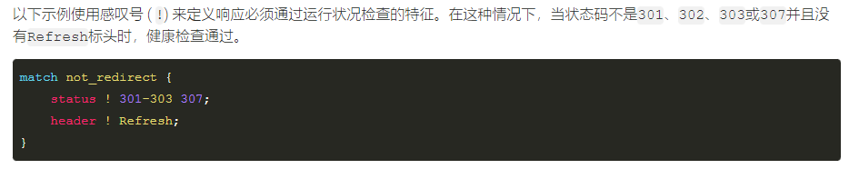


### 1.2.3   动态配置upstream

nginx支持使用 API ，动态配置upstream,无需重新加载配置或重新启动Nginx


优点：

```
自动缩放
维护
快速设置 ：   服务器权重,慢启动,故障超时
监控
```


### 1.2.3更多代理指令

http://nginx.org/en/docs/http/ngx_http_proxy_module.html


## 1.3 nginx 常用命令


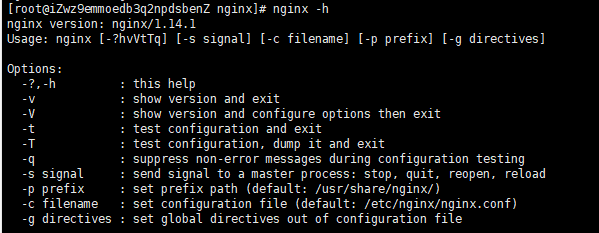


### 1.3.1  -s

```
nginx -s signal

-s stop     fast shutdown  //强制结束所有会话，关闭
-s quit     graceful shutdown //等全部的用户会话结束后，关闭
-s reload   reloading the configuration file   
-s reopen   reopening the log file
```


```
在使用 -s reload的时候需要注意，如果此次修改包含端口号的修改，同时修改的端口nginx自己在监听的话，配置是不会生效的。需要重启nginx服务。所以涉及到端口号的修改，推荐使用重启服务更新配置
```


### 1.3.1 -t 

 测试配置文件是否正确，并退出


## 1.4 nginx 配置文件

包含配置文件的结构， 以及 具体参数


### 1.4.1 文件结构


```
nginx 的配置文件是声明式的模块配置。
```


Configuration  file are divided into **simple** **directives** and **block** **directives**. 

```
配置文件被简单直接的 “块” 分割,这很利于扩展和修改配置。
```


If a block directive can have other directives inside braces, it is called a context (examples: [events](http://nginx.org/en/docs/ngx_core_module.html#events), [http](http://nginx.org/en/docs/http/ngx_http_core_module.html#http), [server](http://nginx.org/en/docs/http/ngx_http_core_module.html#server), and [location](http://nginx.org/en/docs/http/ngx_http_core_module.html#location)).

```
配置文件中的 “块” 内部允许嵌套其他的 “块”。  他被称为上下文，例如 events,http,server,location
```


Directives placed in the configuration file outside of any contexts are considered to be in the [main](http://nginx.org/en/docs/ngx_core_module.html) context. The `events` and `http` directives reside in the `main` context, `server` in `http`, and `location` in `server`.

```
放置在任何上下文以外的配置，都被认为写在主上下文中。 events 和http 就在主上下文中。

server 和 location 在server上下文中。
```


整个配置文件可以是这样： `http下有可以有多个server, 1个server 中可以有多个 location等`

```dockerfile
http{
	...
	
	server{
		...
		
		location{
			...
		}
			
		...
	}
	
	...
}
```


Server block:


```
这意味着一台主机可以启动多个Server，如下图
```


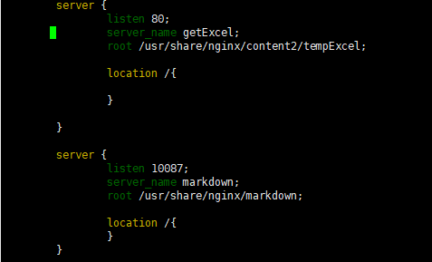


```
启动了多个Server，不同的Server监听不同的端口，完成不同的事情。
```


#### 1.4.1.1 Serving Static Content

为静态资源提供服务：

```
http 块儿下，可以有多个Server，来监听不同的接口。
```


Once nginx decides which `server` processes a request, it tests the URI specified in the request’s header against the parameters of the `location` directives defined inside the `server` block.

```
 一旦nginx 确定了来自某个Server块的用户请求，nginx就会尝试在这个Server块下内location块中的参数
```

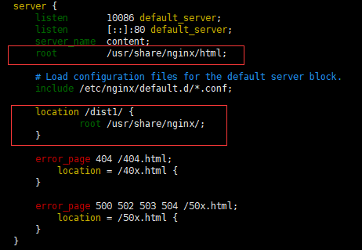

```
location /dist1/{
	root /usr/shar/nginx/;
}
```

对于  /dist1/ 下的请求，全部都会转到服务器 root+URI 下。

例如：

```
http://120.79.189.55:10086/dist1/index.html
```

实际访问的就是：

```
/usr/share/nginx/dist1/index.html
```

也就是说。 对于ningx 的语法 location <name>{...}中，name并不是任意名字。而是服务器的根目录文件夹名	


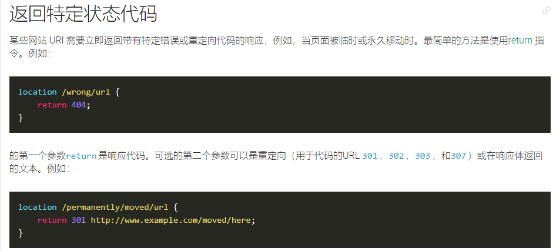


#### 1.4.1.2  Server name

Server names are defined using the [server_name](http://nginx.org/en/docs/http/ngx_http_core_module.html#server_name) directive and determine which [server](http://nginx.org/en/docs/http/ngx_http_core_module.html#server) block is used for a given request. See also “[How nginx processes a request](http://nginx.org/en/docs/http/request_processing.html)”. They may be defined using exact names, wildcard names, or regular expressions:


#### 1.4.1.3 root

 Note that the `root` directive is placed in the `server` context. 

```
root 指令 标志了server的上下文
```


Such `root` directive is used when the `location` block selected for serving a request does not include own `root` directive. //

```
当处理location请求的时候，root指令仍可以在location块中，指明额外的资源
```


#### 1.4.1.4 alias 

alias指令也是指明 某个Server或者location的上下文。

但是和root有区别。


##### alias和 root的区别

```
location /img/ {
    alias /var/www/image/;
}

//若按照上述配置的话，则访问/img/目录里面的文件时，ningx会自动去/var/www/image/目录找文件.
```


```
也就是说, alias不会把 location的路径拼接到最终文件路径中
```


```
location /img/ {
    root /var/www/image;
}

//#若按照这种配置的话，则访问/img/目录下的文件时，nginx会去/var/www/image/img/目录下找文件。
```

```
root指令会把 location中的路径，拼接到最终的文件路径中。
```


```
alias是一个目录别名的定义，root则是最上层目录的定义。

还有一个重要的区别是alias后面必须要用“/”结束，否则会找不到文件的。。。而root则可有可无
```


#### 1.4.1.4 location block

```
location块 与URI映射是一一对应的。
```


假设如下配置:

```dockerfile
server{
	...
	listen 10010;
	...
	
    location / {
        root /data/www;
    }
}

```


假设nginx运行在 公网ip为 120.79.189.55 的机器下。对 120.79.189.55:10010 下的访问请求都会进入这个location块：

```shell
location / {
    root /data/www;  #当前端口下的全部URL请求都会在  相对路径/data/www 下寻找。
}
```


 If there are several matching `location` blocks nginx selects the one with the longest prefix.

```
location满足最长优先匹配原则：如果一个请求能被多个location响应。那么就匹配最长的那个location
```

例如下面的配置:

```shell
...

	location / {
    	root /data/www;
	}
	
	location /webServerInterface/ {
		proxy_http_version 1.1;
		proxy_pass http://127.0.0.1:8000;
	}
...

#假设此时请求的是   http://120.79.189.55:10010/webServerInterface/function1?a=1&b=2
```

```
由于第二个location的匹配规则更长,所以请求会被 反向代理到8000端口，并使用http1.1
```


##### 1.4.1.4.1 location映射可以使用通配符

 location映射可以使用通配符

```
location ~ \.(gif|jpg|png)$ {
    root /data/images;
}
```

表示响应 以.gif .jpg .png结尾的请求

测试一下：

```dockerfile
server {
    listen 10086;
    server_name cotent;
    root /usr/share/nginx/;

    location ~ \.(html)$ {
            root /usr/share/nginx/dist1/;
    }
｝
```

​	可以看到，我index.html页面访问到了。但是它用到的css,js等资源访问不到。被过滤掉了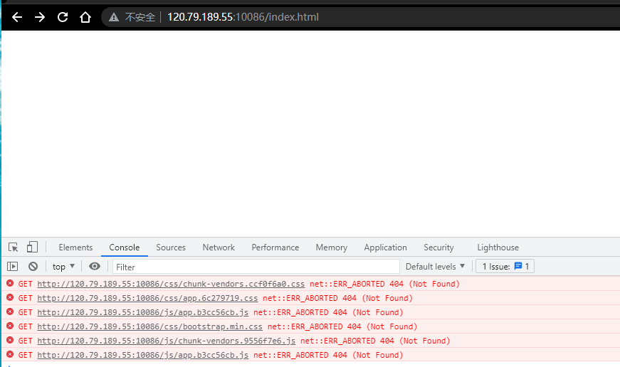


##### 1.4.1.4.2 修饰符类型


基本语法： `location [ = | ~ | ~* | ^~ | @ ] pattern {...} `


###### 没有修饰符

表示必须以指定模开始。


示例：

```nginx
server{
    server_name website.com;
    location /abc {
        #省略...
    }
}
```


```
http://website.com/abc            匹配
http://website.com/abc?param1=1   匹配
http://website.com/abc/			  匹配
http://website.com/abcd           匹配

```


###### = 修饰符

 路径完全匹配。


示例

```
server{
	server_name website.com;
	
	location = /abcd {
		#省略...
	}
}
```


```
http://website.com/abcd     匹配
http://website.com/ABCD     可能匹配。取决于操作系统的文件系统 是否大小写敏感

http://website.com/abcd?param1=1&param2=2       匹配。可以携带query参数

http://website.com/abcd/    不匹配。带有结尾/
http://website.com/abcde    不匹配
```


###### ~ 修饰符

区分大小写的正则匹配。


```nginx
server {
    server_name website.com;
    location ~ ^/abcd${
        #省略...
    }
}
```


```
^ 表示正则的开始
$ 表示正则的结束

^/abcd$

//这个正则表示的含义： 路径必须为/abcd
```


###### ~* 修饰符

不区分大小写的正则

```nginx
server {
	server_name website.com;
	location ~* ^/abcd${
		#省略
	}

}
```


###### ^~	修饰符

类似于无修饰符。以指定模式开始，如果模式匹配，停止搜索其他模式，直接映射。


###### @修饰符

定义命名location区段 ，这些区段客户段不能访问，只可以由内部产生的请
求来访问，如try_files或error_page等


##### 优先级*


```
查找顺序和优先级


1：带有“=“的精确匹配优先
2：没有修饰符的精确匹配
3：正则表达式按照他们在配置文件中定义的顺序
4：带有“^~”修饰符的，开头匹配
5：带有“~” 或“~\*” 修饰符的，如果正则表达式与URI匹配
6：没有修饰符的，如果指定字符串与URI开头匹配
```


#### 1.4.1.5   引入其他配置文件


```
nginx支持并鼓励将配置文件拆分。将一份长而臃肿的配置文件，分割成小份并使用`include`关键字引入他们。
```


如下图：


### 1.4.2 具体参数

使用 nginx -t 可以快速找到配置文件位置

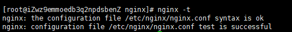


#### 1.4.2.1 worker_process

允许生成的 worker_process 数量。即线程数量。

直接影响nginx 的并发数量。


#### 1.4.2.2 error_log

日志文件地址


#### 1.4.2.2  worker_connections

这条指令，位于 events Context中

```
events {
    worker_connections 1024;
}
```

表示最大连接数。


#### 1.4.2.3 proxy_pass

反向代理；

参数位于   location 块内

Next, use the server configuration from the previous section and modify it to **make it a proxy server configuration**. **In the first `location` block,** put the [proxy_pass](http://nginx.org/en/docs/http/ngx_http_proxy_module.html#proxy_pass) directive with the **protocol**, **name** and **port** of the proxied server specified in the parameter

```
 //代理时，需要指明  访问协议，名称，和端口号
```


一个最简单的配置实例:

```dockerfile
server {
    listen 10086;  # 直接写出监听端口。不能加上127.0.0.1：
    server_name cotent;

    location /{
            proxy_pass http://localhost:8080;
    }
}
```

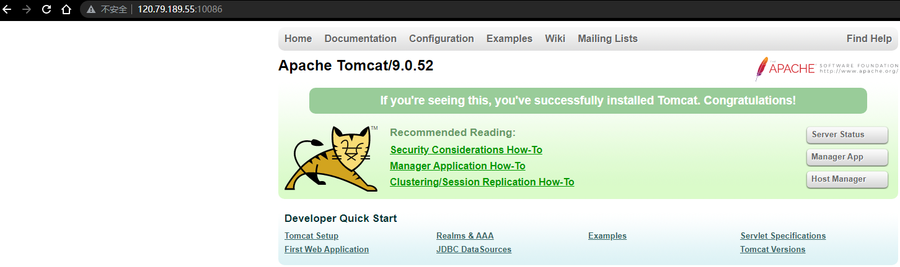

成功代理了本机8080端口的tomcat


##### 1.4.2.3.1 测试

 // doc文档中，写的是，在第一个location中，配置了proxy_pass代理

 //现在测试，在后面的location中设置反向代理，是否有效。

```dockerfile
 server {
    listen 10086;
    server_name cotent;
    root /usr/share/nginx/;

    location /dist/ {                       #先设置了 dist1 文件夹的映射
    }
    
    location /{                             #后配置了proxy_pass 代理
            proxy_pass http://localhost:8080;
    }

}
```

代理仍成功：


映射也成功:


#### 1.4.2.4 default_server


```
server {
    listen      80;
    server_name example.org www.example.org;
    ...
}

server {
    listen      80;
    server_name example.net www.example.net;
    ...
}

server {
    listen      80;
    server_name example.com www.example.com;
    ...
}
```


In this configuration nginx tests only the request’s header field “Host” to determine which server the request should be routed to. If its value does not match any server name, or the request does not contain this header field at all, then nginx will route the request to the default server for this port. //nginx 仅测试请求的标头字段“Host”以确定应将请求路由到哪个服务器。如果它的值与任何服务器名称都不匹配，或者请求根本不包含此标头字段，则 nginx 会将请求路由到此端口的默认服务器。通常默认服务是第一个。仍可以使用 default_server 来指明一个默认服务


#### 1.4.2.5  proxy_http_version

用于配置 http请求的版本,例如  `proxy_http_version 1.1`


例如下图: 整个Server在10086端口，是HTTP2协议的，但是Web服务器Tomcat并没有配置支持http2，所以在location块中使用了

`proxy_http_version 1.1` 在反向代理转发请求的时候，将http版本降低为1.1

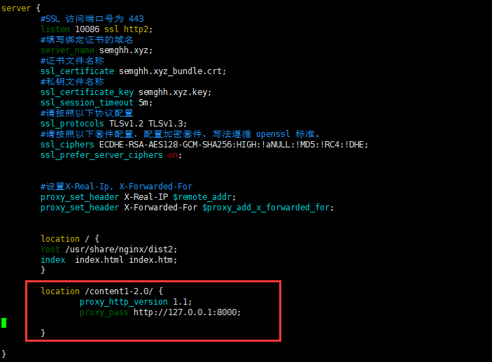


# 2. 动静分离


动静分离从目前实现角度来讲大致分为两种：


## 2.1 前后端分离

前后端分离

```
即指前后端分离的开发模式。 同时也会把静态文件独立成单独的域名，放在独立的服务器上；

后端服务器根本不再承担响应静态资源的任务(.css .js文件) 
通常开发时也是分离开发。部署也部署在不同的服务器。这样动态/静态的请求不会占用同一个服务器的资源。
```


## 2.2 静态资源分离

静态资源分离

```
特指那些前后端不分离的项目：  后端服务器承担着 响应静态资源和动态资源的任务。

静态资源通常存储在classpath/static/**
```


静态资源+动态资源 全部存放在一个服务器上。

通过 nginx 来分开。 通过路径映射实现动静分离


```
静态资源的请求，不用再通过网关，层层的转发到 Web服务器了。

而是nginx缓存了静态资源(css/js)，直接返回给用户。提高相应效率。
```


```
约定  /static/** 的文件都由nginx返回
```


通过 expires 参数设置，可以使 浏览器缓存过期时间，减少与服务器之前的请求和流量。


具体 Expires 定义：是给一个资 源设定一个过期时间，也就是说无需去服务端验证，直接通过浏览器自身确认是否过期即可， 所以不会产生额外的流量。此种方法非常适合不经常变动的资源。（如果经常更新的文件， 不建议使用 Expires 来缓存），我这里设置 3d，表示在这 3 天之内访问这个 URL，发送 一个请求，比对服务器该文件最后更新时间没有变化，则不会从服务器抓取，返回状态码 304，如果有修改，则直接从服务器重新下载，返回状态码 200


### 2.2.1  配置nginx 

其实就是把静态资源的路径进行映射。 映射到nginx本地


```
location /static/ {
	root /xxxx/xxxx/xxxDir;
}
```


# 3. nginx 高可用


问题提出： 如果nginx 宕机，怎么办？

解决办法：配置nginx集群(主从复制)。 使用keeplived 检测nginx存活，配置虚拟ip 代替多个nginx地址。


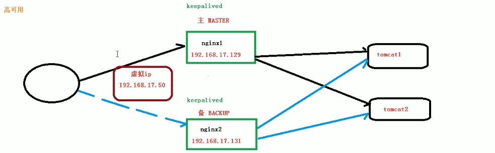


安装 keepalived

```
yum install keepalived
```

keepalived的配置文件位置：

```
/etc/keepalived/keepalived.conf
```


# 4.配置文件


```dockerfile
########### 每个指令必须有分号结束。#################
#user administrator administrators;  #配置用户或者组，默认为nobody nobody。
#worker_processes 2;  #允许生成的进程数，默认为1
#pid /nginx/pid/nginx.pid;   #指定nginx进程运行文件存放地址
error_log log/error.log debug;  #制定日志路径，级别。这个设置可以放入全局块，http块，server块，级别以此为：debug|info|notice|warn|error|crit|alert|emerg
events {
    accept_mutex on;   #设置网路连接序列化，防止惊群现象发生，默认为on
    multi_accept on;  #设置一个进程是否同时接受多个网络连接，默认为off
    #use epoll;      #事件驱动模型，select|poll|kqueue|epoll|resig|/dev/poll|eventport
    worker_connections  1024;    #最大连接数，默认为512
}
http {
    include       mime.types;   #文件扩展名与文件类型映射表
    default_type  application/octet-stream; #默认文件类型，默认为text/plain
    #access_log off; #取消服务日志    
    log_format myFormat '$remote_addr–$remote_user [$time_local] $request $status $body_bytes_sent $http_referer $http_user_agent $http_x_forwarded_for'; #自定义格式
    access_log log/access.log myFormat;  #combined为日志格式的默认值
    sendfile on;   #允许sendfile方式传输文件，默认为off，可以在http块，server块，location块。
    sendfile_max_chunk 100k;  #每个进程每次调用传输数量不能大于设定的值，默认为0，即不设上限。
    keepalive_timeout 65;  #连接超时时间，默认为75s，可以在http，server，location块。

    upstream mysvr {   
      server 127.0.0.1:7878;
      server 192.168.10.121:3333 backup;  #热备
    }
    error_page 404 https://www.baidu.com; #错误页
    server {
        keepalive_requests 120; #单连接请求上限次数。
        listen       4545;   #监听端口
        server_name  127.0.0.1;   #监听地址       
        location  ~*^.+$ {       #请求的url过滤，正则匹配，~为区分大小写，~*为不区分大小写。
           #root path;  #根目录
           #index vv.txt;  #设置默认页
           proxy_pass  http://mysvr;  #请求转向mysvr 定义的服务器列表
           deny 127.0.0.1;  #拒绝的ip
           allow 172.18.5.54; #允许的ip           
        } 
    }
}
```

1、1.$remote_addr 与$http_x_forwarded_for 用以记录客户端的ip地址； 

```
$remote_addr  对于收到请求头的一方，表示上一台机器的ip。也就是提交地址

proxy_set_header X-Real-Ip        $remote_addr;  #X-Real-Ip 来自 $remote_addr
proxy_set_header X-Forwarded-For  $proxy_add_x_forwarded_for;#来自proxy_add_x_forwarded_for


$http_x_forwarded_for ：代理的ip链 （是一个字符串，可以通过代理链层层叠加。) 可以被伪造

$X-Real-Ip : 上一台的ip。（是一个变量，每层代理都会将该值刷新）

例如：
完整请求链：  客户端->proxy1->proxy2->...->proxyN->Web服务器

$http_x_forwarded_for  最终的值可能为   客户端ip,proxy1,proxy2,proxy3...proxyN （即 Web服务器请求头中 $http_x_forwarded_for的值）

需要注意的是，对于 proxy3收到的请求头来说，他请求头中 $http_x_forwarded_for的值为 
客户端ip,proxy1
因为只有当3把请求转发时，才会继续添加 请求头中的$http_x_forwarded_for。这之后，proxy4收到的$http_x_forwarded_for 就带有 proxy3的ip地址了


$X-Real-Ip

$X-Real-Ip 的最终值为   proxyN的 ip（Web服务器端 $X-Real-Ip的值）

proxy3收到的 X-Real-Ip 是 proxy2填写的 proxy1的ip地址。当proxy3把请求转发时，proxy2的ip将把该值刷新

```


2.$remote_user ：用来记录客户端用户名称；

 3.$time_local ： 用来记录访问时间与时区；

4.$request ： 用来记录请求的url与http协议；

 5.$status ： 用来记录请求状态；成功是200，

 6.$body_bytes_s ent ：记录发送给客户端文件主体内容大小；

7.$http_referer ：用来记录从哪个页面链接访问过来的； 

8.$http_user_agent ：记录客户端浏览器的相关信息；

2、惊群现象：一个网路连接到来，多个睡眠的进程被同事叫醒，但只有一个进程能获得链接，这样会影响系统性能。


## 4.1  	X-Real-Ip

这个变量主要是用来记录真实IP。这个值也主要是用proxy_set_header来传递。

如果是多级代理的话，一级一级向后传递真实IP。

```
第一级代理写法
proxy_set_header X-Real-IP $remote_addr;
后面的代理
proxy_set_header X-Real-IP $x_real_ip;
```


## 4.2 Gzip

https://www.cnblogs.com/kevingrace/p/10018914.html

Nginx开启Gzip压缩功能， 可以使网站的css、js 、xml、html 文件在传输时进行压缩，提高访问速度! 

Web网站上的图片，视频等其它多媒体文件以及大文件，因为压缩效果不好，所以没有必要支压缩。如果想要优化，可以图片的生命周期设置长一点，让客户端来缓存。

 

可以节约大量的出口带宽，提高传输效率，提升用户体验;

 会消耗一定的cpu资源。

Gzip压缩可以配置http,server和location模块下。

```
gzip on;                 #决定是否开启gzip模块，on表示开启，off表示关闭；
gzip_min_length 1k;      #设置允许压缩的页面最小字节(从header头的Content-Length中获取) ，当返回内容大                         于此值时才会使用gzip进行压缩,以K为单位,当值为0时，所有页面都进行压缩。建议大于1k
gzip_buffers 4 16k;      #设置gzip申请内存的大小,其作用是按块大小的倍数申请内存空间,param2:int(k) 后                          面单位是k。这里设置以16k为单位,按照原始数据大小以16k为单位的4倍申请内存
gzip_http_version 1.1;   #识别http协议的版本,早起浏览器可能不支持gzip自解压,用户会看到乱码
gzip_comp_level 2;       #设置gzip压缩等级，等级越底压缩速度越快文件压缩比越小，反之速度越慢文件压缩比越                           大；等级1-9，最小的压缩最快 但是消耗cpu
gzip_types text/plain application/x-javascript text/css application/xml;   
                         #设置需要压缩的MIME类型,非设置值不进行压缩，即匹配压缩类型
gzip_vary on;            #启用应答头"Vary: Accept-Encoding"
 
gzip_proxied off;        #nginx做为反向代理时启用,off(关闭所有代理结果的数据的压缩),expired(启用压缩,                          如果header头中包括"Expires"头信息),no-cache(启用压缩,header头中包                                含"Cache-Control:no-cache"),no-store(启用压缩,header头中包含"Cache-                            Control:no-store"),private(启用压缩,header头中包含"Cache-                                      Control:private"),no_last_modefied(启用压缩,header头中不包含
                         "Last-Modified"),no_etag(启用压缩,如果header头中不包含"Etag"头信                                息),auth(启用压缩,如果header头中包含"Authorization"头信息)
 
gzip_disable msie6;      #(IE5.5和IE6 SP1使用msie6参数来禁止gzip压缩 )指定哪些不需要gzip压缩的浏览器                          (将和User-Agents进行匹配),依赖于PCRE库
```


# 5. Nginx如何处理请求

参考来自于Docs

https://nginx.org/en/docs/http/request_processing.html


## 5.1 基于命名的虚拟Server

通过 `server_name` 来给一个Server命名


```
Nginx 可以配置多个Server块，每个Server代表一个独立的服务。在Nginx中称为虚拟Server。 

这意味着当Nginx收到请求以后，首先会决定是哪个Server来处理这个请求。
```

接下来是一个说明示例:


有三个虚拟Server来监听80 ，他们配置了不同的`server_name`  , 会根据Http请求的Host头来确定到底是哪个Server来处理。

如果Host与所有`server_name`都没有匹配成功,则匹配这个端口的默认Server (如果未指明为第一个，可以使用

`listen 80 default_server` 来指定默认服务器) 

```nginx
http{
    ...
    server{
    	listen		80;
    	server_name example.org www.example.org;
    }
	
    server {
        listen      80 default_server;
        server_name example.net www.example.net;
        ...
    }

    server {
        listen      80;
        server_name example.com www.example.com;
        ...
    }
    ...
}

```


### 拒绝没有host的请求


如果想要拒绝没有 Host头的请求，那么可以如下配置:

```nginx
server {
    listen      80;
    server_name "";
    return      444;
}
```


