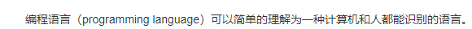
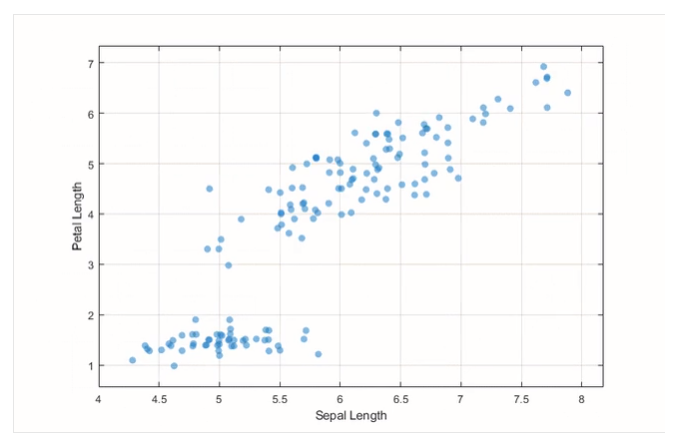
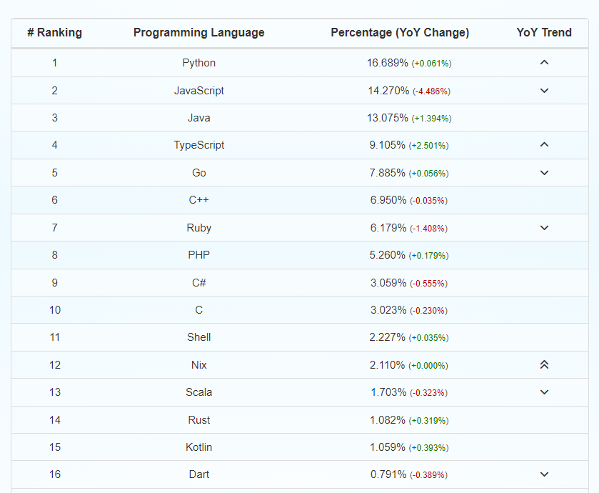
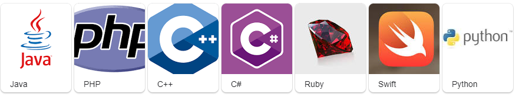
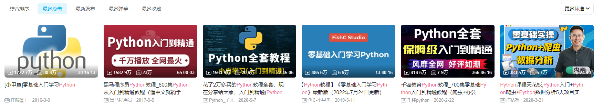

之前用过电脑嘛?

打游戏嘛？

熟悉操作系统嘛


性格，爱好，聊聊天


# 1. 什么是编程语言


wiki:




无二义性：

```
严谨，绝对不会出现歧义句
```


# 2.用编程语言能做什么？


## 游戏

<video src="../00857060-ec48-11eb-ac05-c2232c6f96d9.mp4"></video>


## 网页


https://www.lavendercottage.com.tw/


## 算数，建模，逻辑运算(科学)


MATLAB




航空航天  材料受力计算...


飞机的路线是既定的，自动飞行...机长只需要在紧急情况接管。


## 编写各种的软件


应用软件： QQ  ,微信，支付宝


办公软件： 飞书 钉钉


## 人工智能

无人驾驶...


## 大数据分析，可视化


https://www.bilibili.com/video/BV1u7411K7c8?spm_id_from=333.337.search-card.all.click&vd_source=add6ccafd4287fc36f0faa387b936816


https://www.bilibili.com/video/BV1at411K7R1?spm_id_from=333.337.search-card.all.click


## 好玩的世界


https://www.bilibili.com/video/BV1T34y1o73U?spm_id_from=333.337.search-card.all.click&vd_source=add6ccafd4287fc36f0faa387b936816


## 一句话总结：


程序员，正在用一种语言来抽象描述这个世界。

````
我想象中的世界 汽车是无人驾驶的...
我想象中的世界 人们打开电脑即可网上办公...

地球另一端的人发送的消息，几秒钟就到达世界这一端...

带上AI眼镜...游戏图像就刷新到你眼前...
````


# 3.编程语言选择








# 4. 如何学习 python


博客

https://www.runoob.com/python3/python3-tutorial.html


视频

https://search.bilibili.com/all?vt=08857611&keyword=python&from_source=webtop_search&spm_id_from=333.1007&order=click




## 4.1 安装


https://www.runoob.com/python3/python3-tutorial.html


## 4.2 IDE

集成开发环境


## 4.2.1  pycharm


#### 4.2.1.1 pycharm破解

https://www.cnblogs.com/codeguide/p/15924438.html


https://www.cnblogs.com/Marydon20170307/p/16063541.html